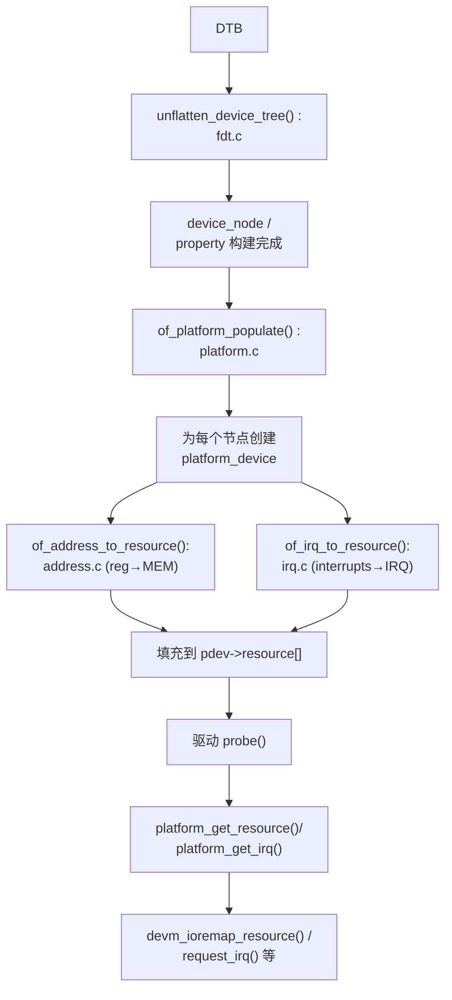
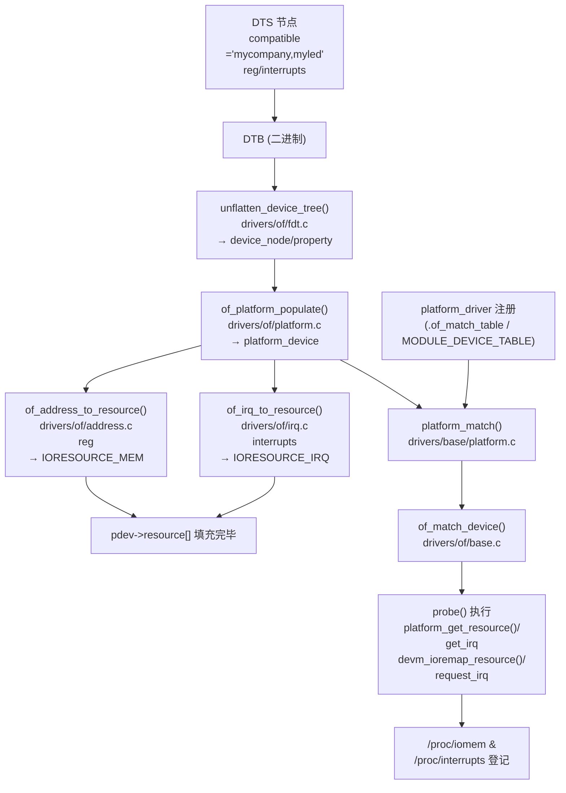
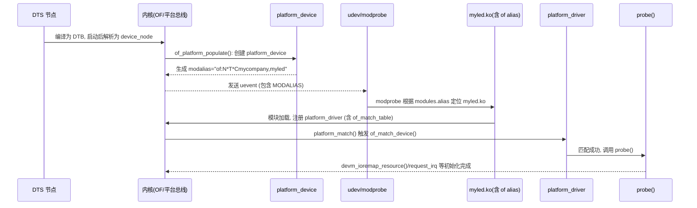

[TOC]

# 第2章_设备树驱动开发方式

## 2.1_主题引入

在第 1 章中，我们学习了 **旧式板级文件 (board file)** 的资源描述方式：

- 在内核源码里手写 `struct resource` 和 `platform_device`；
- 通过 `platform_device_register()` 注册设备；
- 驱动在 `probe()` 中调用 `platform_get_resource()` 获取寄存器和中断。

这种方式虽然直观，但存在三个严重问题：

1. **移植性差**
   - 每个平台都需要维护一份硬编码的 board 文件；
   - 同一个驱动在不同开发板上几乎一模一样，只是地址不同，却必须重复写。
2. **维护困难**
   - 随着 SoC 型号和开发板数量增加，board 文件会急剧膨胀；
   - 硬件差异与驱动逻辑混在一起，难以统一维护。
3. **阻碍通用驱动**
   - 驱动代码中必须关心特定硬件的物理地址和 IRQ；
   - 不利于编写“一份源码，跑在多平台”的通用驱动。

为了解决这些问题，Linux 内核引入了 **设备树（Device Tree, DT）**。

### 2.1.1_设备树的核心思想

- 用独立的 `.dts` 文件描述硬件信息；
- 编译为 `.dtb`，由 Bootloader（如 U-Boot）传递给内核；
- 内核解析 `.dtb` → 生成 **device_node / property**；
- 内核再将节点转化为 **platform_device**，并填充 `resource[]`；
- 驱动仍然用 **相同的 API** (`platform_get_resource` / `platform_get_irq`) 获取资源。

👉 换句话说：**设备树替代了 board file 的作用，把硬件信息从内核源码剥离出来。**
 驱动开发者依旧通过 platform API 取资源，代码几乎不需要修改。


## 2.2_数据结构与资源生成

本节目标：从**开发者视角**把“DTB → device_node/property →（是否要）转为 resource → 最终到驱动”讲清楚，并给出**源码位置、调用链、权衡取舍与实际冲突案例**。

------

### 2.2.1_核心数据结构(在哪里_&_长啥样)

**1) `struct device_node`**

- **文件位置**：`include/linux/of.h`
- **用途**：内核中每个 DT 节点的内存表示。

```c
struct device_node {
    const char *name;             /* 节点名，如 "gpio@0209C000" */
    const char *type;             /* 可选 */
    phandle phandle;              /* 节点唯一标识 */
    const char *full_name;        /* 完整路径，如 "/soc/gpio@0209C000" */
    struct property *properties;  /* 属性链表 */
    struct device_node *parent, *child, *sibling;
};
```

**2) `struct property`**

- **文件位置**：`include/linux/of.h`
- **用途**：描述一个 DT 属性（如 `compatible/reg/interrupts`）。

```c
struct property {
    char *name;               /* 属性名，例如 "reg" */
    int length;               /* 值长度（字节） */
    void *value;              /* 属性值的起始指针 */
    struct property *next;    /* 链表 */
};
```

> 备注：`struct platform_device` 与 `struct resource` 的定义与使用已在第 1 章详述。本节将解释它们如何由 DT 自动生成与填充。

------

### 2.2.2_从_DTB_到_device_node(解析阶段)

**解析入口**（内核启动早期）

- **函数**：`unflatten_device_tree()`
- **文件**：`drivers/of/fdt.c`
- **作用**：把 **DTB（二进制设备树）** 展开为内核内的 `device_node` + `property` 链表。

**开发者可验证**

```bash
# 确认节点是否被解析到内核
ls /proc/device-tree/soc/gpio@0209C000
# 期望能看到属性文件：
# compatible  reg  interrupts  （以及 #address-cells / #size-cells 等）
```

------

### 2.2.3_从属性到资源_是否_必须_转成_struct_resource

先回答大问题：**不是强制必须**。驱动可以直接从 `device_node` 读取属性，但**工程上更推荐转成 `resource`**。下面分两路对比。

#### (1)_A_路_直接读取属性(不转_resource)

**驱动示例：**

```c
struct device_node *np = pdev->dev.of_node;
u32 base, size;

of_property_read_u32_index(np, "reg", 0, &base);
of_property_read_u32_index(np, "reg", 1, &size);
dev_info(&pdev->dev, "base=0x%x size=0x%x\n", base, size);

/* 你也可以用 of_property_read_u32(np, "interrupts", &irq) 等 */
```

**优点**

- 直接、轻量；在原型验证或 U-Boot 驱动里很常见。

**缺点（工程风险）**

- **不触发 `request_mem_region()`** → 内核**无法**记录/检查这段寄存器空间是否被占用。
- `/proc/iomem` 不可见你的占用；**资源冲突难以被系统发现**。
- 每个驱动都自己解析属性 → 容易写出多套“私有解析逻辑”，长期维护成本高。
- 与“旧式（board file）/平台资源 API”**不对齐**，不利于通用驱动复用。

**⚠️ 真实冲突场景（非常关键）**

1. **两个驱动使用了同一寄存器窗口**
   - A 驱动（如 SoC UART）已使用 `0x02020000-0x02020fff`。
   - B 驱动（DTS 写错或重复定义）若**绕过** `request_mem_region()` 直接 `ioremap()`，会与 A 同时访问同一片寄存器，**数据乱/状态错**，且系统无报警。
2. **DTS 地址错误导致“非法访问”**
   - DTS 写了一个不存在的窗口 `<0xdeadbeef 0x100>`。
   - 若走 `devm_ioremap_resource()`（内部会 `request_mem_region()`），会报类似
     `can't request region for resource [mem 0xdeadbeef-0xdeadbfee]`，probe 失败，提示修 DTS。
   - 若**直接** `ioremap()`，可能触发总线异常，**更难排查**甚至**内核崩溃**。
3. **重叠窗口、不同理解的 size**
   - A 要 `<0x0209C000 0x100>`；B 要 `<0x0209C080 0x80>`。
   - 如果都绕过 `request_mem_region()`，两者会**重叠写**寄存器。
   - 走标准 `resource` 路径就会被系统**拒绝/报警**。

> 一句话：**不登记资源 = 夜里关灯两人同时修机房。** 系统看不到冲突，你也不容易看到错误源。

------

#### (2)_B_路_转换为_resource(推荐的工程化路线)

**自动转换**由 OF 框架在创建设备时完成：

- **函数**：
  - `of_address_to_resource()`（文件：`drivers/of/address.c`）→ `reg` → `IORESOURCE_MEM`
  - `of_irq_to_resource()` / `of_irq_to_resource_table()`（文件：`drivers/of/irq.c`）→ `interrupts` → `IORESOURCE_IRQ`
- **挂载点**：最终写入 `platform_device->resource[]`，配合 `num_resources`。

**驱动取用（统一 API）**：

```c
struct resource *res;
void __iomem *regs;
int irq;

/* MEM 资源 */
res  = platform_get_resource(pdev, IORESOURCE_MEM, 0);
regs = devm_ioremap_resource(&pdev->dev, res);  // 内部做 request_mem_region + ioremap + 回滚

/* IRQ 资源 */
irq = platform_get_irq(pdev, 0);

/* 之后正常 request_irq / readl/writel */
```

**优势**

- **统一接口**：与第 1 章旧式方式一致，驱动无需区分“DT/board file”。
- **系统级资源管理**：自动登记 `/proc/iomem`、防止重叠、冲突即报。
- **devres 自动释放**：`devm_*` 帮你做好资源生命周期管理。
- **社区/通用驱动默认写法**：可移植性好。

------

#### (3)_取舍对比(速览)

| 方案          | 写法                                                  | 安全性                  | 维护成本           | 通用性/可移植性 | 推荐度             |
| ------------- | ----------------------------------------------------- | ----------------------- | ------------------ | --------------- | ------------------ |
| 直接读属性    | `of_property_read_*()` + `ioremap()`                  | 低（无冲突检测）        | 高（每驱动自解析） | 差              | ❌（仅限实验/调试） |
| 转为 resource | `platform_get_resource()` + `devm_ioremap_resource()` | 高（内核统一登记/检测） | 低（统一 API）     | 好              | ✅（工程推荐）      |

**结论**：不是强制，但**工程上强烈推荐**用 `resource` 路线。

这两个对比也说明，设备树的作用只做信息载体的扩展模块，并没有嵌入到内核的配置机制中。如此看来，老式开发方式并没有被淘汰，只是开发者的信息配置的视角从原始的resource的视角转换成了设备树，但是内核本身依然使用的resource进行管理。

------

### 2.2.4_自动生成_platform_device_与填充_resource数组_调用链

下面是**从 DT 节点到 `resource[]`** 的关键调用链，便于你在源码里顺藤摸瓜：

1. **DTB → device_node/property**
   - `drivers/of/fdt.c` → `unflatten_device_tree()`
2. **device_node → platform_device**
   - `drivers/of/platform.c` → `of_platform_populate()`
     - 遍历 `device_node`，调用 `of_platform_device_create_pdata()` 分配 `platform_device`
     - 内部对 `reg`/`interrupts` 调用地址与中断翻译函数
3. **属性翻译为 resource**
   - `drivers/of/address.c` → `of_address_to_resource()`
   - `drivers/of/irq.c`     → `of_irq_to_resource()` / `of_irq_to_resource_table()`
   - 翻译结果写入 `pdev->resource[]`（`IORESOURCE_MEM` / `IORESOURCE_IRQ`）
4. **驱动取用**
   - `drivers/base/platform.c` → `platform_get_resource()` / `platform_get_irq()`
   - `lib/devres.c` + `mm/ioremap.c` → `devm_ioremap_resource()` 封装 request + ioremap

**可视化（流程图）**



------

### 2.2.5_开发者可验证点清单(一步步核对)

1. **节点被解析了吗？**

```bash
ls /proc/device-tree/soc/gpio@0209C000
# 应看到：compatible / reg / interrupts / (#address-cells / #size-cells …)
```

1. **平台设备创建了吗？**

```bash
ls /sys/devices/platform/ | grep -i gpio
# 例如看到：gpio@0209C000
```

1. **资源登记了吗？**（只有走 resource 路线才会看到）

```bash
cat /proc/iomem | grep -i gpio
cat /proc/interrupts | grep -i gpio
# 看到占用窗口/IRQ 计数，说明 request_mem_region/request_irq 生效
```

1. **驱动真的吃到了资源吗？**

- 在 `probe()` 打印 `regs` 和 `irq`：

  ```
  dev_info(&pdev->dev, "mapped regs=%p irq=%d\n", regs, irq);
  ```

------

**本节一句话总结**

> 设备树让“硬件描述”从源码中剥离出来，内核把 `device_node/property` **可选地**转成 `platform_device.resource[]`；**工程上强烈建议**走 `resource` 路线，以便复用 platform API、获得系统级资源冲突检测与自动释放能力。


------

## 2.3_开发者视角

本节我们换到“驱动开发者”的角度：

- 我要写一个能跑的驱动，需要做哪些事？
- 我的 DTS 节点该写什么？
- 我的驱动如何匹配到这个节点？
- 我如何在 `probe()` 里获取寄存器和中断？

我们一步一步展开。

------

### 2.3.1_编写_DTS_节点

假设我们要写一个 LED 驱动，LED 连接到 GPIO1_3（对应寄存器基地址 `0x0209C000`，中断号 `35`）。

DTS 节点定义如下：

```dts
led1: led@0 {
    compatible = "mycompany,myled";
    reg = <0x0209C000 0x100>;   /* 基地址 + 寄存器大小 */
    interrupts = <35>;          /* 中断号 */
};
```

几点注意：

- `compatible` 用于驱动匹配（必须唯一、规范）。
- `reg` 描述寄存器窗口（基地址 + 长度）。
- `interrupts` 是中断号（可选，看驱动是否需要）。

------

### 2.3.2_驱动匹配表(of_match_table)

驱动要告诉内核：我支持哪些设备树节点。
 通过 `of_device_id` 完成：

```c
static const struct of_device_id led_of_match[] = {
    { .compatible = "mycompany,myled" },
    { /* sentinel */ }
};
MODULE_DEVICE_TABLE(of, led_of_match);
```

然后在 `platform_driver` 中引用：

```c
static struct platform_driver led_driver = {
    .probe  = led_probe,
    .remove = led_remove,
    .driver = {
        .name           = "myled",
        .of_match_table = of_match_ptr(led_of_match),
    },
};
```

这样，当内核扫描到设备树中有 `compatible = "mycompany,myled"` 的节点时，就会自动触发该驱动的 `probe()`。

------

### 2.3.3_驱动_probe_从_device_node_到_resource

`probe()` 是驱动的核心：在这里获取资源、初始化硬件。

```c
static int led_probe(struct platform_device *pdev)
{
    struct resource *res;
    void __iomem *regs;
    int irq;

    /* 1. 获取寄存器资源 */
    res = platform_get_resource(pdev, IORESOURCE_MEM, 0);
    if (!res) {
        dev_err(&pdev->dev, "No MEM resource\n");
        return -ENODEV;
    }

    regs = devm_ioremap_resource(&pdev->dev, res);
    if (IS_ERR(regs)) {
        dev_err(&pdev->dev, "Failed to map regs\n");
        return PTR_ERR(regs);
    }

    dev_info(&pdev->dev, "LED regs mapped at %p\n", regs);

    /* 2. 获取中断资源（如果需要） */
    irq = platform_get_irq(pdev, 0);
    if (irq < 0) {
        dev_warn(&pdev->dev, "No IRQ resource\n");
    } else {
        dev_info(&pdev->dev, "LED irq = %d\n", irq);
        // request_irq(irq, led_isr, 0, "myled", NULL);
    }

    /* 3. 初始化硬件（示例：关灯） */
    writel(0x0, regs);  // 写寄存器，实际根据硬件文档修改

    return 0;
}
```

这里可以看到：

- `platform_get_resource()` → 返回的是 `pdev->resource[]`，已经由内核通过 `of_address_to_resource()` 从设备树转换过来的。
- `devm_ioremap_resource()` → 一步完成 `request_mem_region()` + `ioremap()`，并保证驱动卸载时自动释放。
- `platform_get_irq()` → 从 `resource[]` 里取 IRQ。

------

### 2.3.4_最小可行_LED_驱动(完整示例)

```c
// SPDX-License-Identifier: GPL-2.0
// drivers/led/myled.c

#include <linux/module.h>
#include <linux/platform_device.h>
#include <linux/of.h>
#include <linux/io.h>
#include <linux/interrupt.h>

static int led_probe(struct platform_device *pdev)
{
    struct resource *res;
    void __iomem *regs;
    int irq;

    res = platform_get_resource(pdev, IORESOURCE_MEM, 0);
    if (!res) return -ENODEV;

    regs = devm_ioremap_resource(&pdev->dev, res);
    if (IS_ERR(regs)) return PTR_ERR(regs);

    irq = platform_get_irq(pdev, 0);
    if (irq >= 0)
        dev_info(&pdev->dev, "IRQ = %d\n", irq);

    /* 初始化硬件 */
    writel(0x0, regs);

    dev_info(&pdev->dev, "LED driver probed, regs=%p\n", regs);
    return 0;
}

static int led_remove(struct platform_device *pdev)
{
    dev_info(&pdev->dev, "LED driver removed\n");
    return 0;
}

static const struct of_device_id led_of_match[] = {
    { .compatible = "mycompany,myled" },
    { /* sentinel */ }
};
MODULE_DEVICE_TABLE(of, led_of_match);

static struct platform_driver led_driver = {
    .probe  = led_probe,
    .remove = led_remove,
    .driver = {
        .name           = "myled",
        .of_match_table = of_match_ptr(led_of_match),
    },
};

module_platform_driver(led_driver);

MODULE_LICENSE("GPL");
MODULE_AUTHOR("Leaf");
MODULE_DESCRIPTION("LED driver example using device tree");
```

这个驱动最小可行：

- DTS 节点提供地址和 IRQ；
- 内核转换成 resource；
- 驱动在 probe 里获取并映射寄存器；
- 可以加 request_irq / GPIO 子系统调用等增强功能。

------

✅ 至此，**2.3 开发者视角** 写完了：从 DTS 节点、匹配表，到 `probe()` 获取 resource，再到完整的最小驱动示例。

------

👌 明白！我来给你一个 **全新融合版的 2.3.5 匹配机制详解**。
 目标：不仅逻辑清晰，还要带着“读者能直接照着写、能验证”的实感；同时把 **哨兵写法是驱动常用标准写法** 强调出来。

------

### 2.3.5_匹配机制详解

驱动能否运行，关键在于设备（`platform_device`）和驱动（`platform_driver`）是否匹配。
 在 Linux 平台总线下，匹配分为 **传统方式**、**设备树方式** 和 **混合方式**。

------

#### (1)_传统_platform_匹配(无设备树)

在 **旧式板级文件** 时代，设备和驱动匹配完全依赖字符串：

- **设备端**：在 `platform_device` 中写 `.name = "led"`；
- **驱动端**：在 `platform_driver` 中写 `.driver.name = "led"`；
- 内核比较两者字符串是否一致，若一致则调用 `probe()`。

**示例：**

```c
/* 板级文件中的 platform_device */
static struct platform_device led_device = {
    .name          = "led",   /* 必须与驱动的 .driver.name 相同 */
    .id            = -1,
    .num_resources = ARRAY_SIZE(led_resources),
    .resource      = led_resources,
};

/* 驱动 */
static struct platform_driver led_driver = {
    .probe  = led_probe,
    .remove = led_remove,
    .driver = {
        .name = "led",  /* 与 device.name 相同 */
    },
};
```

**特点：**

- 匹配点是 **`.name` 完全相等**。
- 驱动和硬件强绑定，缺乏灵活性。

------

#### (2)_设备树匹配(现代推荐方式)

设备树（DTS）引入了 `compatible` 属性，成为驱动匹配的核心依据。

**设备端（DTS 节点）：**

```dts
led1: led@0 {
    compatible = "mycompany,myled";
    reg = <0x0209C000 0x100>;
};
```

**驱动端：**

```c
/* 匹配表 */
static const struct of_device_id led_of_match[] = {
    { .compatible = "mycompany,myled" },
    { }  /* sentinel:哨兵，必须写 */
};
MODULE_DEVICE_TABLE(of, led_of_match);

/* 驱动注册 */
static struct platform_driver led_driver = {
    .probe  = led_probe,
    .remove = led_remove,
    .driver = {
        .name           = "myled",   /* 非必须，但常保留作回退 */
        .of_match_table = of_match_ptr(led_of_match),
    },
};
```

**匹配逻辑：**

- 内核解析 DTS → 生成 `platform_device` → `.of_node` 指向对应 `device_node`；
- 匹配时调用 `of_match_device()`，检查 `compatible` 是否在 `led_of_match[]` 内；
- 若命中，调用驱动 `probe()`。

**哨兵的重要性（重点）：**

- **`{ }` 空结构体是必需的哨兵项**，表示表的结束；
- 内核扫描 `of_device_id` 数组时依赖它判断边界；
- 这是 Linux 驱动的 **常见标准写法**，内核源码和社区驱动无一例外；
- **缺少哨兵会导致内核越界访问 → 崩溃**。

因此：

> **在写 of_match_table 时，最后一个 `{ }` 是固定套路，属于必备规范，而不是“可选细节”。**

------

#### (3)_混合匹配机制(兼容两种方式)

为了兼容旧式平台，现代驱动通常同时支持：

- `.of_match_table` → 设备树匹配
- `.driver.name` → 传统 name 匹配

**源码入口：**

- `drivers/base/platform.c` → `platform_match()`
  1. 先尝试 `of_driver_match_device()`（DT 匹配）
  2. 再尝试 `acpi_driver_match_device()`（ACPI 匹配，常见于 x86）
  3. 最后尝试 `strcmp(pdev->name, drv->name)`（传统匹配）

**优点：**

- 一个驱动能在 **新平台（DT 支持）** 和 **老平台（board file）** 通用。

------

#### (4)_用户可见的匹配痕迹

开发者可以通过以下路径确认匹配是否成功：

1. **设备树节点存在**

   ```bash
   ls /proc/device-tree/ | grep myled
   ```

2. **platform_device 已生成**

   ```bash
   ls /sys/devices/platform/ | grep myled
   ```

3. **驱动绑定情况**

   ```bash
   ls /sys/bus/platform/drivers/myled/
   ```

   应能看到绑定的 `led@0` 节点。

4. **dmesg 日志验证**

   ```
   [   12.345] myled 209c000.gpio: LED driver probed
   ```

------

#### (5)_对比总结

| 匹配方式      | 设备侧（device）                 | 驱动侧（driver）                   | 匹配依据           | 适用场景                 |
| ------------- | -------------------------------- | ---------------------------------- | ------------------ | ------------------------ |
| 传统 platform | `.name = "led"`                  | `.driver.name = "led"`             | name 字符串相等    | 旧式 board file          |
| 设备树        | `compatible = "mycompany,myled"` | `.of_match_table` 中包含同样字符串 | compatible 字符串  | 推荐，DT 平台            |
| 混合          | 两者兼容                         | 同时定义 name 与 of_match_table    | 优先 DT，回退 name | 通用驱动（新旧平台兼容） |

------

#### (6)_一句话总结

> **传统方式靠 `.name`，设备树方式靠 `compatible`，现代驱动一般两者兼容；
> `of_match_table` 结尾的 `{ }` 哨兵是驱动里最常见的标准写法，缺一不可。**

👌 收到！你的意思是：在 **2.3.6 小节** 里，不要用 `####` 这种 Markdown 四级标题，而是用 **编号条目**（1. / 2. / 3. ...）来写，看起来更清晰美观。
 我来重排格式，保持小节感但更紧凑。

------

### 2.3.6_哨兵机制详解

在上一节中我们提到，设备树驱动的 `of_match_table` 通常写成这样：

```c
static const struct of_device_id led_of_match[] = {
    { .compatible = "mycompany,myled" },
    { }  /* 哨兵，必须存在 */
};
MODULE_DEVICE_TABLE(of, led_of_match);
```

其中最后一个 `{ }` 就是 **哨兵 (sentinel)**。很多初学者会疑惑：
 为什么不写长度，而是要多写一个空结构体？为什么几乎所有内核驱动都这么写？

------

#### (1)_哨兵的由来

- C 语言里，哨兵是一种常见的“结束标志”手段。
- 类似：字符串以 `'\0'` 结尾，`file_operations` 表末尾以 NULL 结尾。
- `of_device_id` 采用相同方式：数组以 `{ }` 作为终止标记。

------

#### (2)_内核源码里的使用方式

 在 `drivers/of/base.c` 的 `of_match_device()` 中，匹配过程大致如下：

```c
const struct of_device_id *matches = drv->of_match_table;

for (; matches->compatible[0]; matches++) {
    if (of_device_is_compatible(dev->of_node, matches->compatible))
        return matches;
}
```

- 遍历直到遇到最后一个空结构体 `{ }`；
- 判断条件是 `matches->compatible[0] == '\0'`。

------

#### (3)_为什么这是标准写法

- **社区规范**：所有主线驱动都这样写，缺失 `{ }` 会被 checkpatch.pl 警告。
- **安全性**：如果没有 `{ }`，循环会越界访问，导致内核崩溃。
- **可维护性**：追加新条目时不用修改长度，只需在末尾哨兵前添加。

------

#### (4)_与长度方式对比

| 方式     | 写法                         | 特点                         |
| -------- | ---------------------------- | ---------------------------- |
| 长度方式 | `ARRAY_SIZE(led_of_match)`   | 需要显式传长度，接口繁琐     |
| 哨兵方式 | `{ .compatible="xxx" }, { }` | 以 `{}` 结束，简洁直观，统一 |

Linux 内核选择哨兵方式，是为了 **接口更简洁、风格更统一**。

------

#### (5)_开发者实战经验

- 写设备树匹配表时，务必加上 `{ }`，这是不可缺少的一环。

- 建议写注释，提醒协作者：

  ```c
  { }  /* 必须的哨兵项，勿删除 */
  ```

------

#### (6)_一句话总结

> **`of_match_table` 的 `{ }` 哨兵是 Linux 驱动开发的标准写法。它的存在既是安全需求，也是社区惯例。忘写会导致内核越界访问，严重时会崩溃。**

------

### 2.3.7_匹配表与_MODULE_DEVICE_TABLE

匹配表不仅是匹配机制的核心，还决定了 **内核能否识别 compatible**、**模块能否自动加载**。下面详细解析。

------

#### (1)_匹配表的基本结构

匹配表由 `struct of_device_id` 数组组成：

```c
static const struct of_device_id led_of_match[] = {
    { .compatible = "mycompany,myled" },
    { }  /* 哨兵项，必须要有 */
};
MODULE_DEVICE_TABLE(of, led_of_match);
```

- 每一项代表一个 `compatible` 值；
- `.data` 字段可附带私有数据，用于区分 SoC 差异（见 5 节）；
- 最后一项 `{ }` 是哨兵，用来终止数组（前面 2.3.6 已经详细说明）。

------

#### (2)_struct_of_device_id_的定义位置与字段

- **定义文件**：`include/linux/mod_devicetable.h`
- **典型定义**（字段尺寸可能随版本变化）：

```c
struct of_device_id {
    char name[32];        /* 可选：节点 name */
    char type[32];        /* 可选：节点 type */
    char compatible[128]; /* 关键字段 */
    const void *data;     /* 额外私有数据 */
};
```

开发者最常用的是 `.compatible`，而 `.data` 常用于挂 SoC 差异数据。

------

#### (3)_MODULE_DEVICE_TABLE_的作用

```c
MODULE_DEVICE_TABLE(of, led_of_match);
```

作用：

- 把 `led_of_match` 导出到模块的特殊 ELF 段；
- 生成时由 `depmod` 写入 `/lib/modules/$(uname -r)/modules.alias`；
- 当设备出现时，udev 根据 **MODALIAS** 自动找到对应模块并加载。

验证方法：

- 查看设备 alias：

  ```bash
  cat /sys/devices/platform/led@0/modalias
  ```

  输出示例：

  ```
  of:N*T*Cmycompany,myled
  ```

- 查看模块 alias：

  ```bash
  modinfo myled.ko -F alias
  ```

  输出示例：

  ```
  of:N*T*Cmycompany,myled
  ```

------

#### (4)_自动装载链路

1. DTS 节点出现，内核创建设备 → 发出 `uevent`（带 `MODALIAS`）
2. `udev` 捕获事件，调用 `modprobe`
3. `modprobe` 在 `modules.alias` 查找对应模块
4. 模块被加载，注册 `platform_driver`
5. 内核调用 `of_match_device()` → `probe()` 被触发

------

#### (5)_匹配表的高阶用法(data_字段)

```c
struct led_soc_data { u32 reg_on; u32 reg_off; };
static const struct led_soc_data imx6_data = { .reg_on = 0x04, .reg_off = 0x08 };
static const struct led_soc_data imx7_data = { .reg_on = 0x10, .reg_off = 0x14 };

static const struct of_device_id led_of_match[] = {
    { .compatible = "fsl,imx6ul-gpio-led", .data = &imx6_data },
    { .compatible = "fsl,imx7d-gpio-led",  .data = &imx7_data },
    { } /* 哨兵 */
};
MODULE_DEVICE_TABLE(of, led_of_match);

static int led_probe(struct platform_device *pdev)
{
    const struct led_soc_data *soc = of_device_get_match_data(&pdev->dev);
    if (!soc) return -ENODEV;
    pr_info("use reg_on=0x%x reg_off=0x%x\n", soc->reg_on, soc->reg_off);
    return 0;
}
```

------

#### (6)_一句话总结

> **匹配表 (`of_device_id`) 是驱动与设备树的桥梁。
> 必须以哨兵 `{ }` 结束，并用 `MODULE_DEVICE_TABLE` 导出，才能生成 alias 支持自动装载。**


------

### 2.3.8_扩展内容

在实际驱动开发中，除了最小化的 `of_match_table` 与 `MODULE_DEVICE_TABLE` 外，还有一些常见的扩展机制，直接影响 **模块能否自动加载、如何兼容不同平台**。以下逐条解析。

------

#### (1)_MODULE_DEVICE_TABLE_的兄弟宏

- 除了 `MODULE_DEVICE_TABLE(of, …)`，Linux 还定义了其他总线的宏，例如：
  - `MODULE_DEVICE_TABLE(pci, ids);`
  - `MODULE_DEVICE_TABLE(usb, ids);`
  - `MODULE_DEVICE_TABLE(i2c, ids);`
  - `MODULE_DEVICE_TABLE(spi, ids);`
- 它们的作用都相同：**导出匹配表 → 生成 alias → 支持自动加载**。
- 嵌入式开发中常见的场景：
  - **USB WiFi 驱动**：通过 `MODULE_DEVICE_TABLE(usb, …)` 实现插上网卡自动加载；
  - **I2C 传感器驱动**：通过 `MODULE_DEVICE_TABLE(i2c, …)` 支持多种型号自动匹配。

------

#### (2)_modalias_与_uevent

- 每个设备在 `/sys/devices/...` 下都有一个 `modalias` 文件：

  ```bash
  cat /sys/devices/platform/led@0/modalias
  # 输出: of:N*T*Cmycompany,myled
  ```

- 内核在设备创建时会向用户空间发送 **uevent**，其中包含 `MODALIAS`。

- `udev` 捕获后调用 `modprobe <alias>`，依赖 `modules.alias` 来加载正确的模块。

**验证方法**：

```bash
udevadm monitor --kernel --env
```

插入设备时，可以看到 `MODALIAS=of:N*T*Cmycompany,myled`。

------

#### (3)_platform_match()_的匹配顺序

匹配逻辑定义在 `drivers/base/platform.c::platform_match()`：

1. **优先**：`of_driver_match_device()` → 设备树 compatible 匹配
2. **其次**：`acpi_driver_match_device()` → ACPI 匹配（主要是 x86 平台）
3. **最后**：`strcmp(pdev->name, drv->name)` → 传统 name 匹配

**意义**：

- 知道匹配顺序后，你能快速判断“为什么 probe 没执行”：
  - 如果 DTS 正确，但没匹配 → 检查 of_match_table；
  - 如果没开设备树 → 依赖 name 匹配。

------

#### (4)_of_match_ptr()_与_CONFIG_OF

驱动里常见写法：

```c
.driver = {
    .of_match_table = of_match_ptr(led_of_match),
}
```

为什么不用直接 `= led_of_match`？

- `of_match_ptr()` 宏的作用：
  - 如果 `CONFIG_OF=y` → 展开为 `led_of_match`；
  - 如果 `CONFIG_OF=n` → 展开为空指针。

这样可以保证驱动在 **没有设备树支持的内核** 下仍能编译通过。
 这是社区的标准写法。

------

#### (5)_MODULE_ALIAS_的用法

有些驱动除了匹配表，还会手工声明 alias：

```c
MODULE_ALIAS("platform:myled");
```

作用：

- 即使没有设备树，内核在创建 `platform_device("myled")` 时，依然能通过 alias 自动加载模块。
- 这是 **非设备树环境下的兜底机制**，常见于老旧平台。

------

#### (6)_binding_文档与_compatible_规范

- 所有 `compatible` 都必须在内核文档目录定义：

  ```
  Documentation/devicetree/bindings/
  ```

- 采用 **YAML 文件**，描述节点结构、属性、取值范围。

- 作用：

  - 避免厂商随意定义 incompatible 的字符串；
  - 保障未来内核升级时驱动仍能识别相同硬件。

**示例**（GPIO LED binding 文档片段）：

```yaml
compatible:
  enum:
    - gpio-leds
    - mycompany,myled
```

**意义**：

- 写驱动时，应该先查 binding 文档，确认 `compatible` 命名正确。
- 否则驱动可能无法进入主线。

------

#### (7)_一句话总结

> **2.3.8 扩展内容：**
>
> - `MODULE_DEVICE_TABLE` 不止用于 OF，还能用于 PCI/USB/I2C/SPI；
> - 自动加载依赖 `modalias` + `uevent`；
> - 匹配顺序在 `platform_match()` 中可查；
> - `of_match_ptr` 保证兼容非设备树内核；
> - `MODULE_ALIAS` 提供额外 alias 支持；
> - `binding` 文档则保证 `compatible` 规范性。


------

## 2.4_用户视角

从用户空间的角度，如何验证 **设备树节点是否生效、platform_device 是否创建、驱动是否绑定、模块是否自动加载**？这一节给出完整的操作视角。

------

#### (1)_确认_DTS_节点是否生效

设备树编译进内核后，可以通过 `/proc/device-tree/` 验证：

```bash
ls /proc/device-tree/ | grep myled
```

输出如果包含 `myled@...` 节点，说明 DTS 正常生效。

也可以直接查看该节点的属性：

```bash
cat /proc/device-tree/soc/myled@20c0000/compatible
# 输出: mycompany,myled
```

------

#### (2)_确认_platform_device_是否生成

内核会基于 DTS 节点创建对应的 `platform_device`，可在 sysfs 下查看：

```bash
ls /sys/devices/platform/ | grep myled
```

如果能看到 `myled@20c0000`，说明设备节点已经被 core 层解析为 platform_device。

------

#### (3)_确认驱动是否绑定

一旦驱动注册并匹配成功，它会挂载到 `/sys/bus/platform/drivers/`：

```bash
ls /sys/bus/platform/drivers/myled/
```

输出示例：

```
bind   module   uevent   unbind   20c0000.myled
```

其中 `20c0000.myled` 就是已经绑定的设备。

------

#### (4)_验证_modalias_与模块自动加载

设备节点对应的 alias 可以在 sysfs 中查看：

```bash
cat /sys/devices/platform/myled@20c0000/modalias
# 输出: of:N*T*Cmycompany,myled
```

模块声明的 alias 可用 `modinfo` 验证：

```bash
modinfo myled.ko -F alias
# 输出: of:N*T*Cmycompany,myled
```

如果两者一致，当设备节点出现时，内核会通过 **uevent** 发送 MODALIAS，用户空间的 `udev` 会触发 `modprobe`，从而自动加载模块。

进一步验证自动加载流程：

```bash
udevadm monitor --kernel --env
```

插入或启用设备时，可以看到类似输出：

```
KERNEL[123.456]: add /devices/platform/myled@20c0000 (platform)
ACTION=add
DEVPATH=/devices/platform/myled@20c0000
MODALIAS=of:N*T*Cmycompany,myled
```

这说明 alias 已经通过 uevent 广播，自动装载机制正常工作。

------

#### (5)_dmesg_验证_probe_是否执行

最终确认驱动是否真正运行，可以查看内核日志：

```bash
dmesg | grep myled
```

输出示例：

```
[   12.345678] myled 20c0000.myled: LED driver probed, regs=0xf0800000
```

表示 probe 成功执行，驱动已生效。

------

#### (6)_一句话总结

> **用户视角验证顺序**：
> DTS → platform_device → 驱动绑定 → modalias/自动加载 → dmesg 验证。
>
> 其中 `modalias` 是桥梁，保证了从设备树节点到模块加载的自动化闭环。


------

## 2.5_可视化图示

#### (1)_/proc_与_/sys_的目录映射(从_DTS_到驱动绑定)

下面用目录树把 **DTS → device_node → platform_device → driver 绑定** 的用户可见痕迹串起来：

```plaintext
/proc/device-tree/                         <-- 内核解析后的原始 DT 节点“投影”
└── soc/
    └── myled@20c0000/
        ├── compatible          = "mycompany,myled"
        ├── reg                 = <0x0209C000 0x100>
        └── interrupts          = <35>

/sys/devices/platform/                     <-- 创建的 platform_device
└── myled@20c0000/
    ├── modalias               -> "of:N*T*Cmycompany,myled"
    ├── of_node                -> 指向内核中的 device_node
    └── driver -> ../../bus/platform/drivers/myled   (绑定后出现的符号链接)

/sys/bus/platform/drivers/                 <-- 注册的 platform_driver 目录
└── myled/
    ├── bind
    ├── unbind
    ├── module -> .../myled.ko
    └── myled@20c0000           (匹配成功后出现的设备目录)

/proc/iomem                                   <-- 资源登记（走 resource 路线才可见）
...
0209c000-0209c0ff : myled
...
/proc/interrupts
...
 35:   0   0   GICv2  35  Level  myled
...
```

要点回顾：

- `/proc/device-tree` 证明 **DTB 已被解析**；
- `/sys/devices/platform` 证明 **platform_device 已创建**；
- `/sys/bus/platform/drivers/myled/` 下出现设备目录 → **驱动已绑定**；
- `modalias` 是 **自动装载** 的“桥梁”；
- `/proc/iomem`、`/proc/interrupts` 只有在 **使用 resource/标准 API**（如 `devm_ioremap_resource()`、`request_irq()`）时才会登记。

------

#### (2)_匹配与资源生成流程图(DTS_to_resource_to_probe)

用 Mermaid flowchart 展示从设备树到驱动 probe 的关键步骤与文件落点：



阅读提示：

- `C → D`：把 `device_node` 变成 `platform_device`；
- `D → E/F → G`：把 `reg/interrupts` 翻译成 `resource[]`；
- `H → I → J`：匹配顺序优先 **OF→ACPI→name**；
- `K → L`：规范 API 会自动做资源登记，方便冲突检测与调试。

------

#### (3)_模块自动装载与_probe_调用时序(含_modalias_/_alias)

下面的时序图把 **uevent → modprobe → 驱动注册 → of 匹配 → probe** 的链路完整画出来：



落地操作对应关系：

- `cat /sys/devices/.../modalias` ↔ **uevent 中 MODALIAS 的内容**；
- `modinfo myled.ko -F alias` ↔ **modules.alias 的来源（来自 MODULE_DEVICE_TABLE）**；
- `dmesg | grep myled` ↔ **probe() 是否被调用**。

------

#### (4)_一句话总结(把图与实操对齐)

> **一个设备从“DTS 行为”到“驱动生效”的完整闭环**：
> `DTS → /proc/device-tree → platform_device(+modalias) → uevent/modprobe(由 alias 驱动自动装载) → platform_match(of/name) → probe → /proc/iomem & /proc/interrupts`。
>
> 其中 **modalias/alias** 负责“把模块拉起来”，**resource API** 负责“把资源管起来”。


------

## 2.6_调试与验证

匹配过程虽然在内核中是自动完成的，但在实际开发中常常遇到“驱动没有 probe”“设备没有绑定”等问题。
 因此，作为开发者必须掌握 **验证链路** 和 **排查方法**。

------

### 2.6.1_常见验证路径

1. **确认设备树节点被解析**

   ```bash
   ls /proc/device-tree/ | grep myled
   ```

   - 如果没有节点 → DTS 没编译进 DTB，或拼写错误。

2. **确认 platform_device 已生成**

   ```bash
   ls /sys/devices/platform/ | grep myled
   ```

   - 如果没有 → DTS 节点没被转换成 platform_device（多见于缺 reg/compatible）。

3. **确认驱动绑定情况**

   ```bash
   ls /sys/bus/platform/drivers/myled/
   ```

   - 如果只有 `bind/unbind` 文件，没有设备目录 → 匹配失败。

4. **确认 probe 是否触发**

   ```bash
   dmesg | grep myled
   ```

   - 如果没有打印 → 驱动根本没匹配上。

------

### 2.6.2_常见错误与排查

1. **compatible 拼写不一致**

   - DTS 写了 `"mycompany,myled"`，驱动却写 `"mycompany,my_led"`。
   - 解决：保持一致，建议统一放在 `Documentation/devicetree/bindings/` 中定义。

2. **忘写 of_match_table 哨兵**

   - 结果：内核遍历越界，可能触发 **kernel panic**。
   - 解决：始终在表的最后加 `{ }`。

3. **缺少 MODULE_DEVICE_TABLE**

   - 结果：模块能手动 insmod，但 `modprobe` 无法自动加载。

   - 解决：在匹配表后添加：

     ```c
     MODULE_DEVICE_TABLE(of, led_of_match);
     ```

4. **reg 属性缺失或错误**

   - 结果：`platform_get_resource()` 返回 `NULL`。
   - 解决：检查 DTS 节点是否正确定义了 `reg`。

5. **驱动注册没执行**

   - 结果：`/sys/bus/platform/drivers/` 目录下没有对应驱动。
   - 解决：检查 `module_init()` 是否正确调用了 `platform_driver_register()`。

------

### 2.6.3_内核调试技巧

- 打开驱动调试日志：

  ```c
  #define pr_fmt(fmt) KBUILD_MODNAME ": " fmt
  pr_info("probe start...\n");
  ```

- 在匹配函数里加 debug：
  修改内核 `drivers/base/platform.c`，在 `platform_match()` 内增加 `pr_debug()`，可打印匹配过程。

- 使用 **ftrace** 跟踪 probe 调用：

  ```bash
  echo 'probe:myled' > /sys/kernel/debug/tracing/set_event
  cat /sys/kernel/debug/tracing/trace
  ```

------

### 2.6.4_验证_checklist(工程视角)

1. DTS 是否正确？
   - 节点拼写、属性完整性（`compatible`、`reg`、`interrupts`）。
2. 驱动是否正确？
   - `of_match_table` 是否覆盖所有 compatible？
   - 末尾是否有 `{ }` 哨兵？
3. 模块是否正确注册？
   - `platform_driver_register()` 是否被调用？
   - `MODULE_DEVICE_TABLE()` 是否声明？
4. 用户空间能否看到对应路径？
   - `/proc/device-tree`
   - `/sys/devices/platform`
   - `/sys/bus/platform/drivers`
5. dmesg 是否打印 probe 成功？

------

### 2.6.5_一句话总结

> **调试匹配失败时，从 DTS → platform_device → driver → probe 四步排查，
> 常见问题集中在 compatible 拼写、哨兵缺失和 MODULE_DEVICE_TABLE 漏写。**

------

✅ 至此，**2.6 调试与验证** 完成。


------

## 2.7_小结

本章我们从 **无设备树的传统方式** 到 **设备树驱动的开发流程**，完整梳理了一个设备在 Linux 内核中的诞生过程。

- **数据结构视角**：
  - `device_node` → 属性解析；
  - `resource` → IO 资源封装；
  - `platform_device` / `platform_driver` → 挂接总线。
- **开发者视角**：
  - 如何编写 DTS 节点与 `of_match_table`；
  - 如何在 probe 中通过 `platform_get_resource()`、`of_device_get_match_data()` 获取寄存器和中断；
  - 匹配机制详解：传统 `.name`、设备树 `compatible`、混合模式；
  - 扩展内容：`MODULE_DEVICE_TABLE` 宏族、`modalias`、`uevent`、`of_match_ptr`、`MODULE_ALIAS`、binding 文档规范。
- **用户视角**：
  - 通过 `/proc/device-tree/` 验证 DTS 是否生效；
  - 通过 `/sys/devices/platform/` 查看设备创建；
  - 通过 `/sys/bus/platform/drivers/` 验证驱动绑定；
  - 通过 `/sys/.../modalias` 与 `modinfo` 对比 alias 验证自动加载；
  - 通过 `dmesg` 确认 probe 是否被调用。
- **可视化图示**：
  - 展示了 DTS → device_node → platform_device → driver probe 的映射流程；
  - 显示了 resource 的生成与 `/proc/iomem`、`/proc/interrupts` 的对应关系；
  - 给出了自动装载时序图，解释 alias 如何驱动模块加载。

------

#### (1)_总结对比表

| 层次            | 开发者关注点                                 | 用户可见验证方式                    |
| --------------- | -------------------------------------------- | ----------------------------------- |
| DTS 节点        | 编写 `compatible`、`reg`、`interrupts`       | `/proc/device-tree/`                |
| device_node     | of_xxx API 获取属性                          | 不直接可见                          |
| resource        | `platform_get_resource()`、`request_irq()`   | `/proc/iomem`、`/proc/interrupts`   |
| platform_device | 由 `of_platform_populate()` 创建             | `/sys/devices/platform/`            |
| platform_driver | 定义 `of_match_table`、`MODULE_DEVICE_TABLE` | `/sys/bus/platform/drivers/<name>/` |
| 匹配机制        | `of_match_device()` / name 匹配              | alias 对比：`modalias` vs `modinfo` |
| probe 初始化    | `ioremap`、GPIO 配置、中断绑定               | `dmesg` 输出                        |

------

#### (2)_一句话总结

> **设备树开发的闭环**：
> DTS 节点定义硬件 → 内核解析生成 device_node → 创建 platform_device → 通过 alias/compatible 匹配到 platform_driver → probe 中初始化资源。
>
> **开发者要写对匹配表，用户要看准 modalias，调试要盯住 resource。**

------

✅ 至此，第 2 章的知识完整收尾了。

接下来的第3章，将会复现前面两章节的内容，是为了让内容连贯的同时不脱节。阅读时觉得啰嗦可自行跳过。直接进入语法章节和示例章节。
