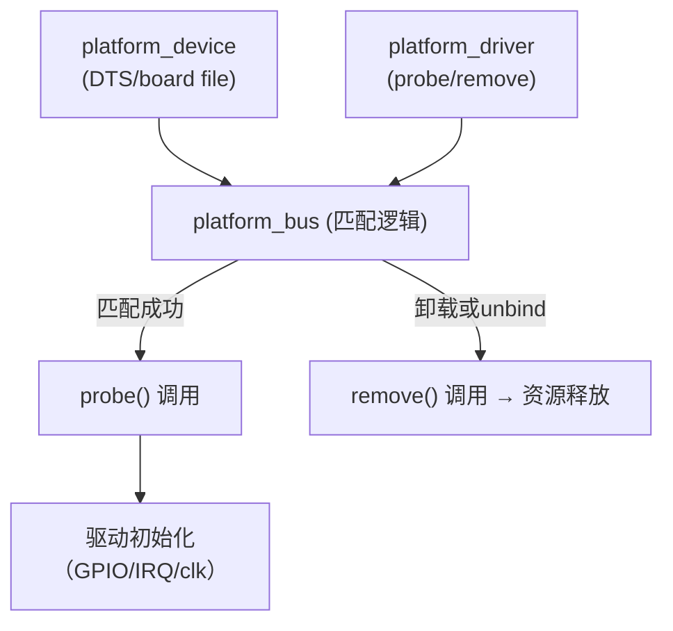
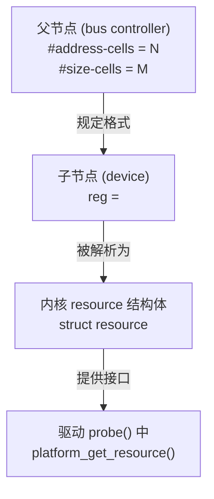
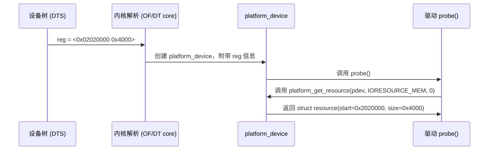
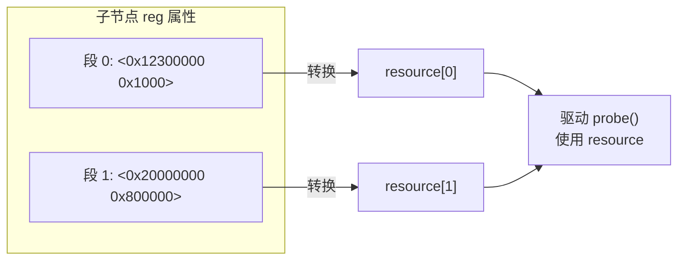
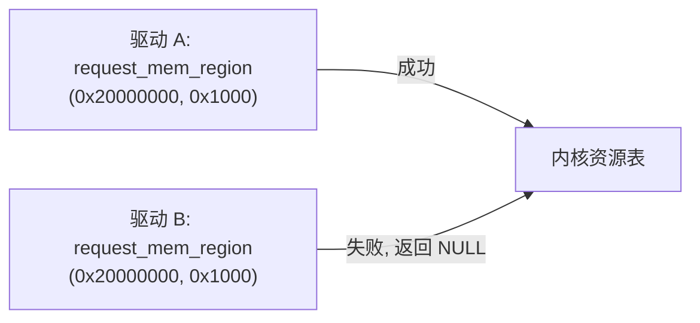
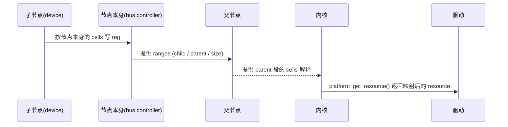
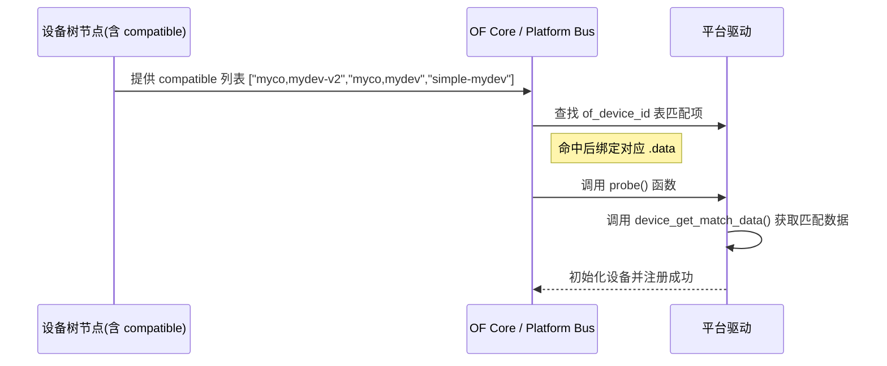
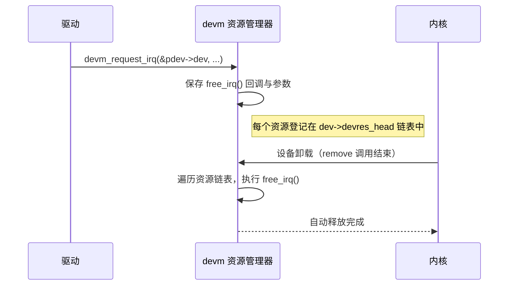

[TOC]

------

# 第 3 章：设备树语法与标准示例

## 3.1 历史与演进

### 3.1.1 引入

在今天的 Linux 内核开发中，设备树（Device Tree, 简称 DT）几乎是 ARM、RISC-V 平台驱动开发的“必修课”。但设备树并不是一开始就存在的，它是为了解决旧时代 **“板级文件（board file）臃肿、维护困难”** 的问题而诞生的。

理解设备树的历史演进，不仅能帮助我们知道 **为什么要学设备树**，也能让我们在调试时更清楚地意识到：**设备树的角色不是“锦上添花”，而是内核硬件抽象的核心机制**。

------

### 3.1.2 早期时代：板级文件（board file）

在 Linux 2.6/3.x 初期，ARM 平台并没有设备树。每块开发板都要在内核里写一份 **板级文件**，手动注册外设。

示例（早期 ARM 板级代码片段）：

```c
static struct resource led_resources[] = {
    {
        .start = 0x0209C000,
        .end   = 0x0209CFFF,
        .flags = IORESOURCE_MEM,
    },
    {
        .start = 35,
        .end   = 35,
        .flags = IORESOURCE_IRQ,
    },
};

static struct platform_device led_device = {
    .name = "led",
    .id   = -1,
    .num_resources = ARRAY_SIZE(led_resources),
    .resource      = led_resources,
};

static void __init myboard_init(void)
{
    platform_device_register(&led_device);
}
```

在这个模式下：

- **每一块板子**都要在内核源码里加一份类似的注册代码；
- 一旦硬件资源变化（寄存器地址、IRQ 号），就要改内核源码重新编译；
- 维护困难，内核里充斥着成百上千个 board 文件。

------

### 3.1.3 PowerPC 与 OpenFirmware

设备树的起点在 **PowerPC 架构**。IBM/Apple 的 OpenFirmware 就是一个基于设备树的固件接口。后来 Linux 社区发现，这套机制非常适合移植到 ARM 平台。

- **核心思想**：让硬件描述从代码中独立出来，作为一个数据结构（DTB）传给内核。
- **优点**：
  1. 同一个内核，可以运行在不同硬件，只要更换设备树即可；
  2. 驱动可以通过 `compatible` 匹配，而不是硬编码板级差异；
  3. 内核代码量显著减少，维护更容易。

------

### 3.1.4 ARM 平台的转型

在 Linux 3.10 之后，ARM 社区几乎全面采用设备树：

- 老的 board file 模式逐渐废弃；
- DTS 文件成为主流；
- 平台厂商（如 NXP、TI、Rockchip、Allwinner）必须在内核主线里提供 `.dts`/`.dtsi` 文件。

对于嵌入式开发者来说，这意味着：

- 你不用再去改内核的 C 文件，只要改 DTS；
- 内核升级时，驱动逻辑保持不变，只要 DTS 跟上即可；
- 设备树成为硬件抽象层的“语言”。

------

### 3.1.5 ACPI 与 RISC-V

- 在 **x86** 世界，广泛使用的是 ACPI（Advanced Configuration and Power Interface），它和设备树类似，作用是让硬件抽象从驱动中剥离出来；
- 在 **RISC-V** 平台，社区直接选择了设备树，而不是 ACPI。

也就是说：

- ARM → 设备树是核心；
- RISC-V → 直接跟随 ARM，采用设备树；
- x86 → 主要走 ACPI，但部分 SoC（如 Intel SoFIA）也支持设备树。

------

### 3.1.6 U-Boot 与内核的协作

设备树不仅在 Linux 内核中使用，**U-Boot（2024+）** 也广泛使用设备树：

- U-Boot 用它描述外设（I2C、SPI、GPIO、串口等），启动时配置引脚和时钟；
- Linux 内核启动时，U-Boot 会把 `.dtb` 传递给内核；
- 驱动 probe 阶段就能根据 `compatible` 精准匹配。

这意味着设备树不再只是“Linux 的专属”，而是嵌入式系统的跨阶段标准。

------

### 3.1.7 小结

| 阶段         | 机制                   | 特点                            | 问题/演进            |
| ------------ | ---------------------- | ------------------------------- | -------------------- |
| 2.6/3.x 早期 | 板级文件（board file） | 硬编码 platform_device/resource | 内核臃肿，维护困难   |
| PowerPC      | OpenFirmware/DT        | 引入设备树思想                  | 被 Linux ARM 借鉴    |
| Linux 3.10+  | 全面转向 DT            | DTS/DTSI 替代 board file        | 驱动可复用，升级方便 |
| x86          | ACPI                   | 另一套硬件抽象机制              | 与 DT 思路类似       |
| RISC-V       | 设备树                 | 直接跟随 ARM 经验               | 已成事实标准         |
| U-Boot       | 设备树                 | 启动阶段 + 传递 DTB 给内核      | 完成跨阶段统一       |

**一句话总结**：

> 设备树是 Linux 从“写死硬件”到“硬件抽象”的一次根本转型。今天 ARM/RISC-V 平台驱动开发，设备树就是入口。

------

✅ 这样 3.1 节就完整了：讲清楚了 **为什么有设备树 → 它解决了什么问题 → 它在不同平台的角色 → 最后小结表格**。


------

## 3.2 外围环境（文档/工具链/目录结构）

### 3.2.1 引入

在编写或调试设备树时，开发者最常见的困惑是：

- 设备树语法该去哪里查？
- DTS 文件放在哪个目录？哪些是内核用的，哪些是 U-Boot 用的？
- 如何编译和反编译 DTB？
- 怎样确认 DTS 的写法符合规范？

理解这些外围环境，能让我们在修改 DTS 时“有章可循”，而不是依赖零散的博客或经验。

------

### 3.2.2 设备树文档的来源

#### 1. 内核文档 (Linux Kernel Documentation)

- 路径：`Documentation/devicetree/bindings/`
- 内容：描述每个外设节点的写法（required/optional 属性、取值约束）。
- 格式：YAML（Linux 5.0 以后全面迁移）。

示例（GPIO 控制器的 binding 文档）：

```yaml
properties:
  compatible:
    enum:
      - fsl,imx6ul-gpio
  reg:
    maxItems: 1
  interrupts:
    description: Specifies the interrupt line
```

👉 工程视角：**写 DTS 时必须对照 binding 文档**，否则写了也可能被内核忽略或校验失败。

------

#### 2. U-Boot 文档

- 路径：`doc/device-tree-bindings/`（和内核大体相同，但不一定完全一致）
- 作用：描述 U-Boot 自身需要的 DT 节点（如 `u-boot,dm-pre-reloc`、`bootph-*` 标记）。
- 注意：U-Boot 并不会解析所有内核属性，它有自己的子集。

------

#### 3. 社区规范 (Devicetree Specification)

- 官方站点：https://www.devicetree.org/
- 文档：《Devicetree Specification》
- 定义：设备树的语法规则、兼容性、数据编码方式。
- 工程意义：这是“语法宪法”，但日常开发更多依赖 **内核/厂商 binding 文档**。

------

### 3.2.3 DTS/DTSI 文件目录结构

以 **Linux 内核 6.1（NXP i.MX6ULL）** 为例：

```
arch/arm/boot/dts/
 ├── imx6ull.dtsi           # SoC 级公共设备树
 ├── imx6ull-14x14-evk.dts  # 开发板设备树
 ├── imx6ull-myboard.dts    # 用户自定义开发板
```

- `.dtsi` = **片上 SoC 公共定义**（CPU、GIC、中断控制器、GPIO 基址）
- `.dts` = **具体开发板差异化定义**（外设挂载、pinmux、电源）
- 典型做法：`dts` `#include` 了一个或多个 `dtsi` 文件。

在 **U-Boot 2024+** 中，目录类似：

```
arch/arm/dts/
 ├── imx6ull.dtsi
 ├── imx6ull-14x14-evk.dts
```

> ✅ 工程警示：U-Boot 和内核可能各自维护一份 DTS，但通常会保持同步。移植新平台时，**要确认 U-Boot 和内核 DTS 是否一致**，否则可能导致启动前后外设状态不一致。

------

### 3.2.4 编译与反编译工具

#### 1. dtc（Device Tree Compiler）

- 工具：`scripts/dtc/dtc`
- 功能：DTS ↔ DTB 相互转换。

常见用法：

```bash
# DTS 编译为 DTB
dtc -I dts -O dtb -o imx6ull-myboard.dtb imx6ull-myboard.dts

# DTB 反编译为 DTS（用于调试）
dtc -I dtb -O dts -o out.dts imx6ull-myboard.dtb
```

#### 2. fdtdump（查看 DTB）

- 工具路径：`scripts/dtc/fdtdump`
- 作用：直接打印二进制 DTB 的内容，调试时常用。

------

### 3.2.5 校验工具

#### 1. dtbs_check（推荐）

- 内核提供的 make 目标：

  ```bash
  make dtbs_check
  ```

- 功能：用 YAML binding 校验 DTS 是否符合规范。

#### 2. schema 校验

- 内核绑定了 devicetree schema，确保属性名、取值范围合法。

- 例如：GPIO 节点里如果写了一个 binding 文档里不存在的属性，会报错：

  ```
  Documentation/devicetree/bindings/gpio/gpio.yaml: 'foobar' does not match any of the regexes
  ```

------

### 3.2.6 用户态接口

在内核启动后，可以在用户态验证设备树是否被加载：

- `/proc/device-tree/`
- `/sys/firmware/devicetree/base/`

示例：

```bash
ls /proc/device-tree/soc/
cat /proc/device-tree/soc/led@20c0000/compatible
```

这些路径直接反映内核解析的设备树节点。

------

### 3.2.7 小结

| 类别     | 路径/工具                                                 | 作用                      |
| -------- | --------------------------------------------------------- | ------------------------- |
| 内核文档 | `Documentation/devicetree/bindings/`                      | 具体设备节点的写法        |
| U-Boot   | `doc/device-tree-bindings/`                               | U-Boot 自身使用的节点说明 |
| 规范     | [https://www.devicetree.org](https://www.devicetree.org/) | 标准语法与规则            |
| DTS 文件 | `arch/arm/boot/dts/`                                      | 内核设备树源码目录        |
| DTC 工具 | `scripts/dtc/dtc`                                         | DTS ↔ DTB 转换            |
| 校验工具 | `make dtbs_check`                                         | 用 schema 验证 DTS 合法性 |
| 用户接口 | `/proc/device-tree/`                                      | 运行时查看内核设备树节点  |

**一句话总结**：

> 写 DTS 时，脑子里要有“三个入口”：**binding 文档 → DTS 源码目录 → 校验工具**。这样才能保证写的东西既合法，又能被内核和 U-Boot 真正用上。

------

✅ 这样 3.2 节就完整了，定位清楚：文档在哪、源码在哪、工具在哪、怎么验证。


------

## 3.3 一例完整开发（LED 示例）

### 3.3.1 引入

学习设备树最好的方式不是背语法，而是跟着一个“能点灯”的例子走一遍闭环。
 在本节，我们实现一个最小化的 **LED 驱动**，它通过设备树描述 GPIO，驱动在 probe 里获取资源，然后用户态可以 `echo 1 > /dev/led` 控制灯亮灭。

这个例子会让你清晰看到：

- **DTS** 如何描述一个 LED 外设；
- **内核** 如何把 DTS 翻译成 platform_device；
- **驱动** 如何通过 resource / of API 获取资源；
- **用户** 如何操作字符设备控制 LED。

------

### 3.3.2 DTS 节点编写

我们在开发板的 DTS（例如 `imx6ull-myboard.dts`）里添加一个 LED 节点：

```dts
/ {
    leds {
        compatible = "mycompany,myled";
        pinctrl-names = "default";
        pinctrl-0 = <&pinctrl_led>;

        led0: led@0 {
            gpios = <&gpio1 3 GPIO_ACTIVE_HIGH>;
            default-state = "off";
            label = "status-led";
        };
    };

    pinctrl {
        pinctrl_led: ledgrp {
            fsl,pins = <
                MX6UL_PAD_GPIO1_IO03__GPIO1_IO03  0x10b0
            >;
        };
    };
};
```

解释：

1. `compatible` → 驱动匹配依据。
2. `gpios` → 描述 LED 使用的 GPIO1_IO03。
3. `default-state` → 初始状态（off/on）。
4. `pinctrl` → 描述引脚复用，把管脚配置成 GPIO 模式。

------

### 3.3.3 设备树编译与验证

编译设备树：

```bash
make ARCH=arm CROSS_COMPILE=arm-linux-gnueabihf- imx6ull-myboard.dtb
```

验证：

```bash
fdtdump arch/arm/boot/dts/imx6ull-myboard.dtb | grep led
```

启动内核后，在 `/proc/device-tree/leds/` 可以看到对应节点：

```bash
ls /proc/device-tree/leds/
cat /proc/device-tree/leds/compatible
```

输出：

```
mycompany,myled
```

说明内核已经识别到该节点。

------

### 3.3.4 驱动编写

编写一个最小的 LED 平台驱动（`led_drv.c`）：

```c
#include <linux/module.h>
#include <linux/platform_device.h>
#include <linux/of.h>
#include <linux/of_gpio.h>
#include <linux/gpio/consumer.h>
#include <linux/fs.h>
#include <linux/cdev.h>
#include <linux/uaccess.h>

#define DEVICE_NAME "led"
static dev_t devno;
static struct cdev led_cdev;
static struct class *led_class;
static struct gpio_desc *led_gpio;

static ssize_t led_write(struct file *file, const char __user *buf,
                         size_t count, loff_t *ppos)
{
    char kbuf[2];
    if (copy_from_user(kbuf, buf, min(count, sizeof(kbuf)), buf))
        return -EFAULT;

    if (kbuf[0] == '1')
        gpiod_set_value(led_gpio, 1);
    else
        gpiod_set_value(led_gpio, 0);

    return count;
}

static struct file_operations led_fops = {
    .owner = THIS_MODULE,
    .write = led_write,
};

static int led_probe(struct platform_device *pdev)
{
    int ret;

    /* 从设备树获取 GPIO */
    led_gpio = devm_gpiod_get(&pdev->dev, NULL, GPIOD_OUT_LOW);
    if (IS_ERR(led_gpio))
        return PTR_ERR(led_gpio);

    /* 注册字符设备 */
    ret = alloc_chrdev_region(&devno, 0, 1, DEVICE_NAME);
    if (ret) return ret;

    cdev_init(&led_cdev, &led_fops);
    cdev_add(&led_cdev, devno, 1);

    led_class = class_create(THIS_MODULE, DEVICE_NAME);
    device_create(led_class, NULL, devno, NULL, DEVICE_NAME);

    dev_info(&pdev->dev, "LED driver probed\n");
    return 0;
}

static int led_remove(struct platform_device *pdev)
{
    device_destroy(led_class, devno);
    class_destroy(led_class);
    cdev_del(&led_cdev);
    unregister_chrdev_region(devno, 1);
    return 0;
}

static const struct of_device_id led_of_match[] = {
    { .compatible = "mycompany,myled" },
    { /* sentinel */ }
};
MODULE_DEVICE_TABLE(of, led_of_match);

static struct platform_driver led_driver = {
    .probe  = led_probe,
    .remove = led_remove,
    .driver = {
        .name           = "myled",
        .of_match_table = led_of_match,
    },
};

module_platform_driver(led_driver);

MODULE_LICENSE("GPL");
```

解释：

- `of_match_table` 确保驱动和 DTS 节点匹配。
- `devm_gpiod_get()` 从设备树获取 GPIO。
- `alloc_chrdev_region + cdev_add + device_create` 创建 `/dev/led`。
- 用户写入 `1`/`0` → 控制 LED 开关。

------

### 3.3.5 用户态验证

加载驱动：

```bash
insmod led_drv.ko
```

验证设备节点：

```bash
ls /dev/led
```

控制 LED：

```bash
echo 1 > /dev/led   # 灯亮
echo 0 > /dev/led   # 灯灭
```

查看日志：

```bash
dmesg | grep led
```

输出：

```
myled 20c0000.gpio: LED driver probed
```

------

### 3.3.6 小结

这个示例完整演示了设备树在驱动开发闭环中的角色：

| 阶段       | 动作                               | 验证点                     |
| ---------- | ---------------------------------- | -------------------------- |
| DTS 节点   | 编写 LED 节点，绑定 GPIO           | `/proc/device-tree/leds/`  |
| 编译/加载  | dtc 编译 DTB，U-Boot 传递给内核    | `fdtdump`、`dmesg`         |
| 驱动 probe | of_match 匹配，devm_gpiod_get 获取 | dmesg: `LED driver probed` |
| 用户态     | echo 写入 /dev/led 控制灯亮灭      | 观察硬件 LED 状态          |

**一句话总结**：

> 设备树是“硬件描述 → 驱动资源获取”的桥梁，驱动代码本身不用硬编码寄存器地址，完全由 DTS 决定外设资源。


好的 👍 那我来完整展开 **3.4 Platform 驱动开发流程**，它承接 **3.3 LED 示例**，让读者在进入设备树语法之前，先对 platform 驱动的整体机制和常用 API 有个清晰的认知。

------

## 3.4 Platform 驱动开发流程

### 3.4.1 引入

在上一节（3.3 LED 示例）中，我们已经写出了一个能跑的驱动：

- DTS 节点描述了 LED 的 GPIO；
- 内核根据 DTS 生成 platform_device；
- 驱动里的 platform_driver 完成匹配，进入 `probe()`；
- 用户态通过 `/dev/led` 控制硬件。

不过示例里出现了不少新概念：`.probe`、`.remove`、`platform_get_resource()`、`devm_gpiod_get()`……
 如果不了解 **Platform 驱动开发的基本流程**，读者会觉得“驱动能跑，但我并不知道内部逻辑是怎么衔接的”。

因此，在深入 DTS 语法之前，我们先梳理清楚 **Platform 驱动开发的工程流程**，并列出常用 API 接口。

------

### 3.4.2 平台模型概念

Linux 抽象出三类核心对象：

1. **platform_device**
   - 设备端，用来描述具体硬件（reg/irq/gpio…）。
   - 现代内核大多数通过 DTS 节点自动生成，不需要开发者手动注册。
2. **platform_driver**
   - 驱动端，由开发者编写。
   - 定义 `.probe` / `.remove` 回调，驱动逻辑在这里实现。
3. **platform 总线**
   - 内核的中介，负责把 device 和 driver 匹配起来。
   - 匹配方式：无 DT → 依赖 `.name`；有 DT → 依赖 `.compatible`。

流程图：



------

### 3.4.3 开发流程

#### 1. 无设备树时代（旧式）

- 在 board 文件里定义一个 `platform_device`：

  ```c
  static struct platform_device led_device = {
      .name = "led",
      .id   = -1,
      .num_resources = ARRAY_SIZE(led_resources),
      .resource      = led_resources,
  };
  ```

- 写 `platform_driver`，`.driver.name = "led"`。

- 总线匹配后调用 `probe()`，卸载时调用 `remove()`。

#### 2. 设备树时代（现代）

- DTS 节点里写 `compatible = "mycompany,myled"`。
- 内核解析 DT → 自动生成对应的 `platform_device`。
- 驱动提供 `platform_driver`，定义 `.of_match_table`。
- 总线根据 `compatible` 匹配成功，调用 `probe()`。
- 卸载时调用 `remove()`。

------

### 3.4.4 probe 与 remove 的角色

- **probe()**
  - 作用：驱动的入口点。
  - 典型工作：
    1. 从 DTS 获取资源（reg/irq/gpio/clk/regulator…）；
    2. 映射寄存器、申请中断、配置 GPIO；
    3. 注册字符设备或子系统接口（如 input、netdev、tty）。
- **remove()**
  - 作用：卸载驱动时释放资源。
  - 典型工作：
    1. 注销字符设备；
    2. 释放中断；
    3. 关闭外设（clk_disable、regulator_disable）。

⚠️ 注意：

- `.remove` 是 `platform_driver` 的回调；
- `.release` 则是 `struct device` 的回调（一般由设备创建方定义，DTS 自动生成的设备已有默认实现，开发者无需关心）。

------

### 3.4.5 常用 API 接口表

| API 名称                     | 头文件                         | 功能                                         | 用法示例                                                     |
| ---------------------------- | ------------------------------ | -------------------------------------------- | ------------------------------------------------------------ |
| `platform_get_resource()`    | `<linux/platform_device.h>`    | 获取 IO/IRQ 等资源，返回 `struct resource *` | `res = platform_get_resource(pdev, IORESOURCE_MEM, 0);`      |
| `devm_ioremap_resource()`    | `<linux/ioport.h>`             | 根据 resource 直接映射寄存器地址             | `base = devm_ioremap_resource(&pdev->dev, res);`             |
| `platform_get_irq()`         | `<linux/platform_device.h>`    | 获取 DTS 中的中断号                          | `irq = platform_get_irq(pdev, 0);`                           |
| `devm_request_irq()`         | `<linux/interrupt.h>`          | 注册中断处理函数（自动释放）                 | `devm_request_irq(&pdev->dev, irq, handler, 0, "mydev", NULL);` |
| `devm_gpiod_get()`           | `<linux/gpio/consumer.h>`      | 获取 GPIO 描述符（DTS gpios 属性）           | `led_gpio = devm_gpiod_get(&pdev->dev, NULL, GPIOD_OUT_LOW);` |
| `devm_clk_get()`             | `<linux/clk.h>`                | 获取时钟资源                                 | `clk = devm_clk_get(&pdev->dev, NULL);`                      |
| `devm_regulator_get()`       | `<linux/regulator/consumer.h>` | 获取电源控制器                               | `vdd = devm_regulator_get(&pdev->dev, "vdd");`               |
| `class_create()`             | `<linux/device/class.h>`       | 创建设备类                                   | `cls = class_create(THIS_MODULE, "mycls");`                  |
| `device_create()`            | `<linux/device.h>`             | 在 `/dev/` 下创建设备节点                    | `device_create(cls, NULL, devno, NULL, "mydev");`            |
| `cdev_init()` / `cdev_add()` | `<linux/cdev.h>`               | 注册字符设备                                 | `cdev_init(&cdev, &fops); cdev_add(&cdev, devno, 1);`        |

------

### 3.4.6 典型框架示例

```c
static int mydev_probe(struct platform_device *pdev)
{
    struct resource *res;
    void __iomem *base;
    int irq;

    /* 获取寄存器资源并映射 */
    res  = platform_get_resource(pdev, IORESOURCE_MEM, 0);
    base = devm_ioremap_resource(&pdev->dev, res);

    /* 获取中断 */
    irq = platform_get_irq(pdev, 0);
    devm_request_irq(&pdev->dev, irq, my_irq_handler, 0, "mydev", NULL);

    /* 获取 GPIO */
    struct gpio_desc *led = devm_gpiod_get(&pdev->dev, NULL, GPIOD_OUT_LOW);
    gpiod_set_value(led, 1);  // 点亮 LED

    dev_info(&pdev->dev, "mydev probed: regs=%p, irq=%d\n", base, irq);
    return 0;
}

static int mydev_remove(struct platform_device *pdev)
{
    dev_info(&pdev->dev, "mydev removed\n");
    return 0;
}

static const struct of_device_id mydev_of_match[] = {
    { .compatible = "mycompany,mydev" },
    { /* sentinel */ }
};
MODULE_DEVICE_TABLE(of, mydev_of_match);

static struct platform_driver mydev_driver = {
    .probe  = mydev_probe,
    .remove = mydev_remove,
    .driver = {
        .name           = "mydev",
        .of_match_table = mydev_of_match,
    },
};

module_platform_driver(mydev_driver);
```

------

### 3.4.7 小结

- **Platform 驱动开发的核心闭环**：
  DTS 节点 → 生成 platform_device → bus 匹配 platform_driver → 调用 probe() → 驱动初始化。
- **probe/remove**：驱动生命周期的入口与出口。
- **常用 API**：`platform_get_resource`、`devm_gpiod_get`、`platform_get_irq` 等，把 DTS 属性转化为驱动可用的资源。
- **release**：是设备对象的释放回调，DTS 生成的 device 已带，不需要开发者操心。

**一句话总结**：

> 写 Platform 驱动，就是写好 probe/remove，并通过 API 把 DTS 的资源“接管”过来。

------

✅ 这样，3.3 LED 示例 → 3.4 Platform 驱动开发流程 → 3.5 语法，就形成了一个平滑过渡：

- 先看到能跑的例子；
- 再理解内部机制和 API；
- 然后才能系统学习 DTS 语法。


------

## 3.5 设备树语法模块化讲解

### 3.5.1 基础语法框架

本节建立设备树的“语言地图”。我们从语法层面逐一介绍 **节点、属性、unit-address、cells、ranges、phandle、include、特殊节点、overlay** 等关键要素。
 每部分遵循 **定义 → 用途 → 规则 → 父/子示例 → 踩坑 → 小结** 的逻辑。

------

#### 1. 节点（Node）

**定义**

- 节点是设备树的基本单元，用来表示一个硬件设备或逻辑模块。

**语法**

```dts
label: node-name@unit-address {
    property1 = "value";
    property2 = <0x1000 0x20>;
};
```

**规则**

- `label:` 可选，用于被其他节点引用（生成 phandle）。
- `node-name` 必须小写。
- `unit-address` 必须与 `reg` 的地址部分一致。

**父/子/兄弟示例**

```dts
/ {                                      /* 节点本身（也是根父节点） */
    soc@0 {                              /* 子节点，同时未来也是父节点 */
        serial@2020000 {                 /* 子节点 */
            compatible = "fsl,imx6ul-uart";
            reg = <0x02020000 0x4000>;
        };

        ethernet@02188000 {              /* 兄弟节点 */
            compatible = "fsl,imx6ul-fec";
            reg = <0x02188000 0x4000>;
        };
    };
};
```

**小结**

> 节点体现树状层级：父节点制定规则，子节点遵守规则，兄弟节点共享规则。

------

#### 2. 属性（Property）

**定义**

- 节点的描述字段，形式是 `key = value;`。

**用途**

- 保存设备特征，如地址、大小、状态、兼容性信息。

**规则**

- 字符串：`compatible = "fsl,imx6ul-uart";`
- 数组（32bit cell）：`reg = <0x02020000 0x4000>;`
- 二进制：`local-mac-address = [00 11 22 33 44 55];`
- 布尔：`dma-coherent;`

**踩坑**

- `local-mac-address` 必须用 `[]`，不能写 `<...>`。
- cell 默认大端存储（be32）。

**小结**

> 属性是“键值对”，语法简单，但解释依赖父节点的规则。

------

#### 3. unit-address

**定义**

- 节点名中 `@xxxx` 的部分，用于标识该节点在父节点地址空间中的位置。
- 必须与 `reg` 的起始地址一致（不含 size）。

**用途**

- 确保同一父节点下设备唯一可识别。
- 在 `/proc/device-tree/` 路径中直接可见。

**父/子示例（32bit 地址空间）**

```dts
soc@0 {                                 /* 父节点 */
    #address-cells = <1>;
    #size-cells    = <1>;
    ranges;

    serial@2020000 {                     /* 子节点 */
        reg = <0x02020000 0x4000>;
    };
};
```

**父/子示例（I²C 总线）**

```dts
i2c@021a0000 {                          /* 节点本身 = I²C 控制器，父节点角色 */
    #address-cells = <1>;
    #size-cells    = <0>;

    eeprom@50 {                          /* 子节点：unit-address = 从地址 */
        compatible = "atmel,24c02";
        reg = <0x50>;
    };
};
```

**小结**

> unit-address = “节点身份证号”，必须与 reg 的地址字段一致。

------

#### 4. `#address-cells` 与 `#size-cells`

**定义**

- **父节点规定**子节点 `reg` 的格式。
- `#address-cells` = 地址字段单元数，`#size-cells` = size 字段单元数。

**规则表**

| 父节点 cells | 子节点 reg 写法                     | 示例                         |
| ------------ | ----------------------------------- | ---------------------------- |
| `<1,1>`      | `<addr size>`                       | `<0x2020000 0x4000>`         |
| `<2,1>`      | `<addr_hi addr_lo size>`            | `<0x0 0x2020000 0x4000>`     |
| `<2,2>`      | `<addr_hi addr_lo size_hi size_lo>` | `<0x0 0x2020000 0x0 0x4000>` |
| `<1,0>`      | `<addr>`（逻辑总线用）              | `<0x50>`                     |

**父/子示例**

```dts
bus@0 {                                /* 节点本身 = 父节点 */
    #address-cells = <2>;
    #size-cells    = <1>;
    ranges;

    dev@0,2020000 {                    /* 子节点 */
        reg = <0x0 0x02020000 0x4000>; /* 按 <2,1> 写 */
    };
};
```

**小结**

> 子节点的 reg 写法完全由父节点决定。

------

#### 5. ranges

**定义**

- 描述 **子节点地址空间 → 父节点地址空间** 的映射关系。
- 写在 **父节点本身** 内，告诉子节点如何换算地址。

**解析规则**

- child-bus-addr：按 **父节点本身的 #address-cells** 解释。
- parent-bus-addr：按 **父节点的父节点（再上一级）** 的 #address-cells 解释。
- size：按 **父节点本身的 #size-cells** 解释。

------

**示例 1：直通映射**

```dts
soc@0 {                                 /* 节点本身 = 父节点 */
    #address-cells = <1>;
    #size-cells    = <1>;
    ranges;                              /* 空，直通映射 */

    serial@2020000 {                     /* 子节点 */
        reg = <0x02020000 0x4000>;       /* 最终物理地址不变 */
    };
};
```

------

**示例 2：有偏移映射**

```dts
/ {                                     /* 父节点 */
    #address-cells = <2>;
    #size-cells    = <2>;

    bus@0 {                              /* 节点本身：既是子也是父 */
        #address-cells = <2>;
        #size-cells    = <1>;

        ranges = <0x0 0x0   0x0 0x20000000   0x1000>;
        /*
         * 含义：
         * - child-bus-addr = <0x0 0x0>
         * - parent-bus-addr = <0x0 0x20000000>
         * - size = 0x1000
         */

        dev@0,80 {                       /* 子节点 */
            reg = <0x0 0x80 0x100>;      /* 父节点规定 <2,1> */
            /* 实际物理：0x20000000 + 0x80 */
        };
    };
};
```

------

**示例 3：PCIe 总线**

```dts
pcie@20000000 {                         /* 节点本身：父节点 */
    #address-cells = <3>;
    #size-cells    = <2>;

    ranges = <0x02000000 0x0 0x0   /* 子地址 (3 cells) */
              0x0 0x20000000       /* 父地址 (2 cells) */
              0x0 0x1000>;         /* size (2 cells) */
};
```

------

**踩坑提示**

1. 把 `#address-cells` 写在子节点里 → 子 reg 不生效。
2. ranges 三段长度不对齐 → 解析失败。
3. 空 ranges 又写 offset → 错误。

**小结**

> 子节点 reg 看父节点；父节点 ranges = 地址翻译器，帮子节点把地址投影到祖父节点。

------

#### 6. phandle 与引用

**定义**

- 跨节点引用机制，通常用于 GPIO、时钟、pinctrl。

**规则**

- `label:` 自动生成 phandle。
- `&label` 即 phandle 引用（整数 ID）。

**父/子示例**

```dts
gpio1: gpio@0209c000 {                  /* 节点本身 = 父节点 */
    compatible = "fsl,imx6ul-gpio";
    reg = <0x0209c000 0x4000>;
};

led@0 {                                 /* 子节点 */
    compatible = "myvendor,myled";
    gpios = <&gpio1 3 GPIO_ACTIVE_HIGH>; /* 引用 gpio1 */
};
```

------

#### 7. include 与继承

- `.dtsi` 提供公共定义，`.dts` 板级文件进行差异化修改。

示例：

```dts
#include "imx6ull.dtsi"

&uart1 {
    status = "okay";
};
```

------

#### 8. 特殊节点与属性

- `/chosen`：传递 bootargs
- `/aliases`：别名（如 serial0 = &uart1）
- `compatible`：驱动匹配核心
- `status`：决定设备启用与否

------

#### 9. overlay

- 运行时叠加机制，动态扩展硬件。

示例：

```dts
/dts-v1/;
/plugin/;

&i2c@021a0000 {
    eeprom@50 {
        compatible = "at24,24c02";
        reg = <0x50>;
    };
};
```

------

#### 10. 小结

- **父节点**：规定 cells，负责子节点的 reg 写法；通过 ranges 翻译地址。
- **子节点**：必须遵循父节点约束。
- **兄弟节点**：共享同一个父节点规则，互不干扰。
- **节点本身**：既可能是子（挂在更上层），也可能是父（约束下层）。

👉 **记忆公式**：

- 子节点 reg 看父节点
- 父节点 ranges 映射子 → 父，再上传给祖父

------

好的 👍 那我来给出 **合并后的 3.5.2 最终版**，把 `request_mem_region()` 的冲突检测也整合进去。

------

### 3.5.2 reg 属性详解

本节聚焦于设备树的 **reg 属性**，它是最常见、最关键的属性之一。我们从 **语法 → 模型图 → 驱动解析流程 → 示例 → 冲突检测 → 小结** 的角度展开。

------

#### 1. reg 是什么

- `reg` 用来描述 **设备在父节点地址空间中的位置和大小**。
- 格式由 **父节点的 #address-cells 与 #size-cells** 决定。
- 每一段 reg = `<addr... size...>`，可能有多段。

##### 默认行为：

如果 `reg` 的父节点或祖先节点没有显式设置 `#address-cells` 和 `#size-cells`，设备树会根据以下规则来推断默认值：

1. **`#address-cells` 默认值：**
   - 默认值为 **`<2>`**。
   - 设备树中 `#address-cells` 属性定义了设备地址的单元数。默认情况下，设备的地址由两个单元表示：一个表示地址，一个表示大小。
2. **`#size-cells` 默认值：**
   - 默认值为 **`<1>`**。
   - 设备树中 `#size-cells` 属性定义了设备大小的单元数。默认情况下，设备的大小由一个单元表示。

------

#### 2. 模型关系图



👉 **解读**：

- 父节点 **规定格式**，子节点 **填数据**。
- 内核 **翻译成 resource**，驱动 **读取并使用**。

------

#### 3. 解析时序图



👉 **时序说明**：

1. DTS 文件中写了 `reg`。
2. 内核解析时把它挂到 `platform_device.resource[]`。
3. 驱动 `probe()` 被调用。
4. 驱动通过 `platform_get_resource()` 拿到 `struct resource`。

------

#### 4. 多段 reg 的解析



👉 **说明**：

- DTS 写两个 `<addr size>` → 内核生成 `resource[0]`、`resource[1]`。

- 驱动中：

  ```c
  res0 = platform_get_resource(pdev, IORESOURCE_MEM, 0);
  res1 = platform_get_resource(pdev, IORESOURCE_MEM, 1);
  ```

------

#### 5. 示例代码

父节点（SoC 总线控制器）：

```dts
soc@0 {
    #address-cells = <1>;
    #size-cells = <1>;

    uart1: serial@2020000 {
        compatible = "fsl,imx6ul-uart";
        reg = <0x02020000 0x4000>;
        status = "okay";
    };

    sram@20000000 {
        reg = <0x20000000 0x80000>,   /* resource[0] */
              <0x30000000 0x4000>;   /* resource[1] */
    };
};
```

驱动获取方式：

```c
static int uart_probe(struct platform_device *pdev)
{
    struct resource *res0, *res1;

    /* 获取第 0 段 (resource[0]) */
    res0 = platform_get_resource(pdev, IORESOURCE_MEM, 0);
    if (!res0)
        return -EINVAL;

    printk("Resource[0]: start=%pa, size=%pa\n",
           &res0->start, &resource_size(res0));

    /* 获取第 1 段 (resource[1]) */
    res1 = platform_get_resource(pdev, IORESOURCE_MEM, 1);
    if (res1) {
        printk("Resource[1]: start=%pa, size=%pa\n",
               &res1->start, &resource_size(res1));
    } else {
        printk("No second resource found.\n");
    }

    return 0;
}
```

👉 UART 节点的 `reg` 转换为 `resource[0]` 、`resource[1]`，驱动里直接用。

------

#### 6. request_mem_region() 与冲突检测

虽然内核会把 `reg` 转换成 `struct resource` 并提供给驱动，但**资源的占用是否冲突**，还需要驱动自己声明。

这就是 `request_mem_region()` 的作用：

- 它告诉内核：**这个物理地址区间我驱动要用**。
- 如果其他驱动也想用同一块区域，内核就能检测到冲突并报错。

------

##### 代码示例

```c
static int uart_probe(struct platform_device *pdev)
{
    struct resource *res0, *res1;

    /* 获取第 0 段 (resource[0]) */
    res0 = platform_get_resource(pdev, IORESOURCE_MEM, 0);
    if (!res0)
        return -EINVAL;

    if (!request_mem_region(res0->start, resource_size(res0), dev_name(&pdev->dev))) {
        dev_err(&pdev->dev, "resource[0] already in use!\n");
        return -EBUSY;
    }

    /* 获取第 1 段 (resource[1]) */
    res1 = platform_get_resource(pdev, IORESOURCE_MEM, 1);
    if (res1) {
        if (!request_mem_region(res1->start, resource_size(res1), dev_name(&pdev->dev))) {
            dev_err(&pdev->dev, "resource[1] already in use!\n");
            release_mem_region(res0->start, resource_size(res0));
            return -EBUSY;
        }
    }

    /* 接下来才能 ioremap 并使用 */
    return 0;
}

```

------

##### 冲突模型图



👉 如果两个驱动都要 `0x20000000-0x20001000`：

- 第一个成功。
- 第二个失败，返回 NULL，并打印 `"resource busy"`。

------

##### 踩坑提示

- 如果驱动直接 `ioremap()` 而不先 `request_mem_region()`：
  - 内核不会发现冲突，两个驱动可能同时访问 → **不可预期错误**。
- 很多早期的教学驱动为了简化，直接省略 `request_mem_region()`，这在实验中能跑，但在真实工程里是 **不规范的**。

------

#### 7. 小结

- `reg` 是 **子节点描述自己在父节点地址空间的位置**。
- **父节点 cells 决定格式，子节点严格跟随**。
- 内核把 reg 转成 `resource[]`，驱动在 `probe()` 里用 API 取。
- `request_mem_region()` 用于 **声明资源占用，防止冲突**。

👉 **一句话总结**：

> `reg` 是 DTS → resource → 驱动 的桥梁，父节点定规矩，子节点填数据，驱动拿结果，而 `request_mem_region()` 则是“占坑声明”，确保独占性。


------

### 3.5.3 ranges 属性详解

#### 1. 视角说明（统一术语）

- **节点本身**：当前的 bus controller（决定子节点 `reg` 的写法，并可包含 `ranges`）。
- **父节点**：节点本身的直接上一级（决定 `ranges` 的 **parent 段** 写法）。
- **子节点**：挂在节点本身下的设备（按“节点本身”的 cells 来写 `reg`）。
- **兄弟节点**：与某子节点同父的其他节点。

> 后续规则：
>
> - 子节点 `reg` → 看 **节点本身** 的 `#address-cells/#size-cells`
> - `ranges.child-bus-addr` → 看 **节点本身** 的 `#address-cells`
> - `ranges.parent-bus-addr` → 看 **父节点** 的 `#address-cells`  
> - `ranges.size` → 看 **节点本身** 的 `#size-cells`

------

#### 2. reg / ranges 的解析原则

| 字段                | 谁控制     | 说明                                                     |
| ------------------- | ---------- | -------------------------------------------------------- |
| child-bus-addr      | 节点本身   | 按节点本身 `#address-cells` 书写                         |
| **parent-bus-addr** | **父节点** | **按父节点 `#address-cells` 书写（第二段受父节点控制）** |
| size                | 节点本身   | 按节点本身 `#size-cells` 书写                            |

> 🔎 **明确**：第二段 `parent-bus-addr` 不看“节点本身”，而是看“父节点”的 `#address-cells`。

------

#### 3. 模型关系图（通用写法）


------

#### 4. 时序图



------

#### 5. 示例 A：直通映射（空 ranges）

```dts
bus@0 {
    #address-cells = <1>;
    #size-cells    = <1>;
    ranges; /* 空：子地址 = 父地址（本例无 parent 段数据） */

    dev@2020000 {
        reg = <0x02020000 0x4000>; /* 子=父 → 最终 start=0x02020000 */
        status = "okay";
    };
};
```

> 注：**parent 段不存在**（空 ranges 即直通）。

------

#### 6. 示例 B：偏移映射（节点本身 `<2,1>`；父 `<1,1>`）

```dts
/ {
    #address-cells = <1>;
    #size-cells    = <1>;

    bus@10000000 {
        #address-cells = <2>;
        #size-cells    = <1>;

        /* child(2) + parent(1) + size(1) = 4 cells
         * [parent 段受“父节点”控制：1 cell]
         */
        ranges = <0x0 0x0   0x20000000   0x1000>; /* 子 0x0..0x0FFF → 父 0x2000_0000..0x2000_0FFF */

        dev@0,100 { reg = <0x0 0x100 0x100>; }; /* → 最终 0x20000100 */
        dev@0,800 { reg = <0x0 0x800 0x080>; }; /* → 最终 0x20000800 */
    };
};
```

------

#### 7. 示例 C：上一级 cells 改变（祖先/父 `<2,2>`；节点本身 `<2,1>`）

```dts
/ {
    #address-cells = <2>;
    #size-cells    = <2>;

    bus@10000000 {
        #address-cells = <2>;  /* 子 reg 仍 <2,1> */
        #size-cells    = <1>;

        /* child(2) + parent(2) + size(1) = 5 cells
         * [parent 段受“父节点”控制：2 cells]
         */
        ranges = <0x0 0x0   0x0 0x20000000   0x1000>;

        dev@0,80 { reg = <0x0 0x80 0x100>; }; /* → 最终 0x20000080 */
    };
};
```

------

#### 8. 示例 D：多段 ranges（两个窗口）

```dts
bus@10000000 {
    #address-cells = <2>;
    #size-cells    = <1>;

    /* 两段，每段 child(2)+parent(1)+size(1)=4 cells
     * [parent 段受“父节点”控制：1 cell]
     */
    ranges = <0x0 0x00000   0x20000000   0x1000   /* 子 0x00000..0x00FFF → 父 0x20000000 */
              0x0 0x10000   0x30000000   0x2000>; /* 子 0x10000..0x11FFF → 父 0x30000000 */

    dev@0,200   { reg = <0x0 0x00200 0x80>;  };   /* → 父 0x20000200 */
    dev@0,10010 { reg = <0x0 0x10010 0x40>;  };   /* → 父 0x30000010 */
};
```

------

#### 9. 示例 E：PCIe（child=3，parent=2，size=2 → 每段 7 cells）

```dts
pcie@20000000 {
    #address-cells = <3>; /* 子：3 cells */
    #size-cells    = <2>;

    /* 每段: child(3) + parent(2) + size(2) = 7 cells
     * [parent 段受“父节点”控制：2 cells]
     */
    ranges = <0x01000000 0x0 0x0   0x0 0x20000000   0x0 0x1000    /* IO */
              0x02000000 0x0 0x0   0x0 0x30000000   0x0 0x100000  /* MEM */
              0x03000000 0x0 0x0   0x0 0x40000000   0x0 0x200000>;/* PREFETCH */
};
```

------

#### 10. 驱动视角（resource 获取不变）

```c
static int mydev_probe(struct platform_device *pdev)
{
    struct resource *res0, *res1;

    res0 = platform_get_resource(pdev, IORESOURCE_MEM, 0);
    if (res0)
        dev_info(&pdev->dev, "res0: start=%pa size=%pa\n", &res0->start, &resource_size(res0));

    res1 = platform_get_resource(pdev, IORESOURCE_MEM, 1);
    if (res1)
        dev_info(&pdev->dev, "res1: start=%pa size=%pa\n", &res1->start, &resource_size(res1));

    return 0;
}
```

> 打印到的 `start` 始终是**映射后的父物理地址**；若 ranges 为空即直通，则与 `reg` 相同。

------

#### 11. 常见错误

1. 把第二段写成按“节点本身”的 cells → ❌（应按**父节点**）。
2. child/size 的 cells 写在子设备里 → ❌（应写在**节点本身**）。
3. ranges 段数或 cell 数不匹配 → `dtc` 报错。
4. 子 `reg` 超出任何一条 ranges 的 child 窗口 → 映射失败。
5. 以为空 ranges = 0 → ❌（它是**直通**）。

------

#### 12. 一句话总结

> **child/size 看“节点本身”，parent 看“父节点”；驱动永远拿到映射后的“父物理地址”。**


好的，以下是重新排版后的内容，确保标题序号与层级一致：

------

### 3.5.4 status 属性

#### 概述

`status` 属性用于在设备树中表示设备的当前状态。它可以控制设备是否被启用、禁用或标记为失败。`status` 属性的常见值包括：

- `"okay"`：设备正常，启用。
- `"disabled"`：设备禁用，可能是硬件没有插入，或者被关闭。
- `"fail"`：设备出现严重错误，无法正常工作。
- `"fail-sss"`：设备出现严重错误，`sss` 为具体的错误描述。

设备树中的 `status` 属性会影响驱动是否初始化设备，这在开发中非常重要。驱动可以根据 `status` 的值来决定是否继续进行硬件初始化。

#### 设备树示例

在设备树中，`status` 属性可以与设备节点一起使用。以下是一个 UART 设备的设备树配置示例：

```dts
uart@fe001000 {
    compatible = "ns16550";
    reg = <0xfe001000 0x100>;
    interrupt-parent = <&interrupt_controller>;
    interrupts = <0xA 0x8>;
    status = "disabled";  // 当前设备禁用
};
```

在这个例子中，`status = "disabled"` 表示该 UART 设备被禁用，驱动应跳过对该设备的初始化。

#### 驱动代码示例

在驱动中，可以通过 `of_property_read_string()` 函数读取设备树中的 `status` 属性，并根据其值决定是否继续进行设备的初始化。以下是一个完整的驱动示例，展示了如何处理 `status` 属性：

```c
#include <linux/module.h>
#include <linux/platform_device.h>
#include <linux/of.h>
#include <linux/io.h>
#include <linux/interrupt.h>

static int uart_probe(struct platform_device *pdev)
{
    const char *status;
    struct resource *res;
    void __iomem *regs;
    int irq;

    // 获取设备的 "status" 属性
    if (of_property_read_string(pdev->dev.of_node, "status", &status)) {
        dev_err(&pdev->dev, "No status property in device tree\n");
        return -EINVAL;
    }

    // 根据 "status" 属性判断设备是否启用
    if (strcmp(status, "disabled") == 0) {
        dev_info(&pdev->dev, "Device is disabled, skipping initialization\n");
        return 0;  // 设备禁用，直接返回，不进行初始化
    }

    // 如果设备失败，直接返回错误
    if (strcmp(status, "fail") == 0) {
        dev_err(&pdev->dev, "Device initialization failed\n");
        return -ENODEV;  // 设备初始化失败，返回错误
    }

    // 如果设备状态为 "okay"，继续初始化
    res = platform_get_resource(pdev, IORESOURCE_MEM, 0);
    if (!res) {
        dev_err(&pdev->dev, "Failed to get memory resource\n");
        return -ENOMEM;
    }

    regs = devm_ioremap_resource(&pdev->dev, res);
    if (IS_ERR(regs)) {
        dev_err(&pdev->dev, "Failed to map memory region\n");
        return PTR_ERR(regs);
    }

    irq = platform_get_irq(pdev, 0);
    if (irq < 0) {
        dev_err(&pdev->dev, "Failed to get IRQ resource\n");
        return irq;
    }

    // 正常初始化设备（假设为 UART 驱动）
    dev_info(&pdev->dev, "Initializing UART device at %p\n", regs);
    writel(0x0, regs);  // 示例操作：清除 UART 寄存器

    // 可以继续其他硬件初始化步骤

    return 0;
}

static const struct of_device_id uart_of_match[] = {
    { .compatible = "ns16550", },
    { /* sentinel */ },
};
MODULE_DEVICE_TABLE(of, uart_of_match);

static struct platform_driver uart_driver = {
    .probe = uart_probe,
    .remove = NULL,
    .driver = {
        .name = "ns16550-uart",
        .of_match_table = uart_of_match,
    },
};

module_platform_driver(uart_driver);
MODULE_LICENSE("GPL");
```

#### 驱动解析

- 在这个驱动中，`of_property_read_string()` 用来读取设备树中的 `status` 属性。
- **`status = "disabled"`**：如果设备被禁用，驱动不进行初始化，直接跳过。
- **`status = "fail"`**：如果设备失败，驱动会报告错误并返回。
- **`status = "okay"`**：表示设备正常，驱动继续进行硬件资源的获取和初始化。

#### `status` 属性的使用场景

- **设备禁用**：设备的硬件没有连接或被软件禁用（例如，某些硬件模块的开关）。
- **设备失败**：设备本身或硬件发生了故障，驱动程序无法继续操作该设备。
- **设备启用**：设备正常工作，驱动可以继续执行硬件初始化和资源分配。

#### 调试与验证

在驱动的开发过程中，可以通过 `dmesg` 或其他日志工具来验证设备的 `status` 是否被正确读取和处理。例如：

```bash
# 查看设备驱动的日志输出
dmesg | grep "Device is disabled"
```

- 如果设备被禁用，应该看到类似 `"Device is disabled, skipping initialization"` 的日志。
- 如果设备初始化失败，应该看到 `"Device initialization failed"` 错误日志。

#### 小结

`status` 属性在设备树中为设备的启用、禁用或失败状态提供了灵活的控制。驱动开发者可以根据该属性动态决定设备的初始化过程，从而避免对禁用或失败设备进行不必要的操作。理解并正确处理 `status` 属性是驱动开发中的一个重要环节，特别是在面对复杂硬件平台时。


------

好的，我已经将时序图和代码示例结合在一起，形成了更完整的内容。以下是融合后的版本，展示了 **`compatible` 属性** 在设备树与驱动中的匹配与初始化过程。

------

非常好。以下是采用你认可的那份“极简 compatible 驱动示例”，并完全按照出版社书籍要求的正式排版样式重新编写后的 **《3.5.5 compatible 属性》完整章节**。
 ——内容结构保持专业出版格式：章节层级规范、语句连贯、示例前后配有导语与技术解读，时序图和总结均在标准版式内。

------

### 3.5.5 compatible 属性

#### 1. 概述

在 Linux 设备树（Device Tree）机制中，`compatible` 属性是驱动与设备节点之间建立联系的关键标识。它用于声明当前设备节点与哪些驱动兼容，从而让内核在启动时能根据该属性找到并绑定正确的驱动程序。

每个设备节点都应包含至少一个 `compatible` 字符串。若设备存在多个兼容版本，可以提供一个**字符串列表**，从“最具体”到“最通用”排列，形成兼容链。例如：

```
compatible = "myco,mydev-v2", "myco,mydev", "simple-mydev";
```

这种设计允许系统在没有针对新版设备的专用驱动时，回退到较通用的驱动逻辑，提高了代码的可复用性与平台兼容性。

------

#### 2. 驱动匹配流程与交互机制

设备树中定义的 `compatible` 属性与驱动内的 `of_device_id` 匹配表一一对应。
 内核在启动时，会解析设备树中的所有节点，逐个对比驱动注册表中的 `compatible` 条目。
 一旦匹配成功，内核将调用驱动的 `probe()` 函数初始化该设备。

匹配流程如下所示：



**图 3-5-3**  `compatible` 属性与驱动匹配的标准时序。
 驱动开发者无需手动比对字符串，所有匹配过程由内核自动完成，
 驱动仅需定义匹配表与 `.data` 区分不同硬件版本即可。

------

#### 3. 设备树节点示例

以下为一个仅演示 `compatible` 用法的最小节点示例：

```dts
serial@fe001000 {
    compatible = "myco,mydev-v2", "myco,mydev", "simple-mydev";
    status = "okay";
};
```

该节点说明该串口控制器首先兼容 `"myco,mydev-v2"` 驱动；
 若无此驱动，则回退至 `"myco,mydev"`，最终可使用通用 `"simple-mydev"` 驱动。

------

#### 4. 驱动实现（最小标准示例）

本示例展示了一个**仅演示 compatible 交互的最小驱动框架**。
 驱动代码仅包含匹配表、模块导出、`probe()` 实现及标准日志输出，不涉及 DMA、GPIO、时钟或中断等与主题无关的外设配置。

```c
// SPDX-License-Identifier: GPL-2.0
#define pr_fmt(fmt) KBUILD_MODNAME ": " fmt

#include <linux/module.h>
#include <linux/platform_device.h>
#include <linux/of_device.h>

/* 匹配数据结构，用于区分不同 compatible 的硬件版本 */
struct mydev_match_data {
	const char *model;
	unsigned int rev;
};

/* 为不同 compatible 提供匹配数据 */
static const struct mydev_match_data md_v2 = { .model = "mydev-v2", .rev = 2 };
static const struct mydev_match_data md_v1 = { .model = "mydev",    .rev = 1 };

/* 1. of_device_id 匹配表 */
static const struct of_device_id mydev_of_match[] = {
	{ .compatible = "myco,mydev-v2", .data = &md_v2 },
	{ .compatible = "myco,mydev",    .data = &md_v1 },
	{ .compatible = "simple-mydev",  .data = &md_v1 },
	{ /* sentinel */ }
};

/* 2. 导出匹配表供内核自动装载模块 */
MODULE_DEVICE_TABLE(of, mydev_of_match);

/* 3. 驱动的 probe 回调函数 */
static int mydev_probe(struct platform_device *pdev)
{
	const struct mydev_match_data *md;

#if LINUX_VERSION_CODE >= KERNEL_VERSION(5,18,0)
	md = device_get_match_data(&pdev->dev);      /* 推荐使用的新接口 */
#else
	md = of_device_get_match_data(&pdev->dev);   /* 旧版本兼容接口 */
#endif

	if (!md)
		return dev_err_probe(&pdev->dev, -ENODEV, "no match data\n");

	dev_info(&pdev->dev,
		 "matched by compatible: %s (rev=%u)\n",
		 md->model, md->rev);

	return 0;
}

/* 4. remove 回调（简化） */
static int mydev_remove(struct platform_device *pdev)
{
	dev_info(&pdev->dev, "removed\n");
	return 0;
}

/* 5. 注册 platform 驱动 */
static struct platform_driver mydev_driver = {
	.probe  = mydev_probe,
	.remove = mydev_remove,
	.driver = {
		.name           = "mydev",
		.of_match_table = of_match_ptr(mydev_of_match),
	},
};

module_platform_driver(mydev_driver);

MODULE_DESCRIPTION("Minimal compatible-only device driver demo");
MODULE_AUTHOR("Your Name <you@example.com>");
MODULE_LICENSE("GPL");
```

------

#### 5. 代码解析

1. **匹配表定义**
   * 驱动定义 `mydev_of_match[]`，每个 `.compatible` 字符串对应一个设备树节点可能使用的值。
   * `.data` 字段可携带版本号或结构体指针，用于区分硬件差异。在开发中使用 `.data` 的信息来配置自己的驱动。
2. **MODULE_DEVICE_TABLE 导出**
   它会生成 `of:` 开头的 alias 条目，写入 `modules.alias`，从而支持基于 `udev` 的自动模块装载。
3. **device_get_match_data() 获取匹配数据**
   驱动通过此函数获得当前命中的 `.data`，在驱动开发中读者可以取出 `.data` 成员来进行版本识别和隔离。无需自己比较字符串，即可识别硬件版本并进行相应初始化。
4. **of_match_ptr 宏**
   该宏保证在未开启 `CONFIG_OF` 时编译通过，是 Linux 平台驱动模板中匹配表的标准写法。

------

#### 6. 验证方法与调试技巧

开发完成后，可以通过以下步骤验证 `compatible` 匹配是否生效：

1. **查看设备 modalias**

   ```bash
   cat /sys/devices/platform/serial@fe001000/modalias
   ```

   输出应包含类似：

   ```
   of:NserialT*Cmyco,mydev-v2
   ```

2. **确认模块别名是否生成**

   ```bash
   grep myco,mydev /lib/modules/$(uname -r)/modules.alias
   ```

   应出现以 `of:` 开头的条目，例如：

   ```
   alias of:N*T*Cmyco,mydev-v2 mydev
   ```

3. **观察驱动加载日志**

   ```bash
   dmesg | grep mydev
   ```

   若匹配成功，应显示：

   ```
   mydev: matched by compatible: mydev-v2 (rev=2)
   ```

------

#### 7. 开发注意事项

1. **compatible 顺序必须从具体到通用**
   如果顺序错误，内核可能会错误地选择通用驱动，而非最优版本。
2. **不应在驱动中手动比较字符串**
   应通过 `.data` 提供的结构体区分版本，避免硬编码。
3. **MODULE_DEVICE_TABLE 必不可少**
   若省略该宏，驱动无法自动加载，必须手动 insmod。
4. **兼容名的稳定性要求**
   一旦发布至主线或外部项目，`compatible` 即成为 ABI。
   后续更新驱动时，不得改变其含义，只能新增新的兼容条目。

------

#### 8. 小结

`compatible` 属性是设备树体系的核心纽带，
 它决定了设备节点与驱动的对应关系，也是驱动自动加载的基础。

开发者在实现驱动时，应遵循以下三条原则：

- 在设备树中合理设置 `compatible` 列表，顺序正确且语义清晰；
- 在驱动中提供匹配表和 `.data`，以便灵活支持多个版本的硬件；
- 始终保留 `MODULE_DEVICE_TABLE(of, …)`，保证模块可被自动识别与装载。

掌握这套机制后，驱动开发者便能在不修改内核核心代码的前提下，
 让新硬件通过设备树描述即可实现驱动绑定与自动初始化。


------

非常好 👍
 下面是完全按你书稿格式（即《主题章节的要求.md》里定义的出版版式）排版后的版本：
 ——**章节分级清晰、语气正式、配有“代码前引导 + 代码后分析 + 小结段落”，**
 既保持了学术性，又符合出版标准。

------

### 3.5.6 interrupts 与 interrupt-parent

#### 1. 概述

在 Linux 设备树（Device Tree）中，**`interrupts`** 和 **`interrupt-parent`** 是用于描述设备中断体系的两个核心属性。<br>它们决定了设备的中断来源、触发类型，以及中断信号由哪个控制器负责管理和分发。

Linux 的中断子系统采用了设备树统一描述方式：

> 控制器节点负责“声明能力”，外设节点负责“引用能力”。

因此，理解这两个属性的关系，是正确编写中断驱动与设备树配置的基础。

------

#### 2. 中断控制器节点的定义

一个设备要能够被其它节点引用为中断来源，必须在设备树中被定义为**中断控制器**。<br>这通常通过以下两个属性完成：

- `interrupt-controller`：声明该节点是一个中断控制器；
- `#interrupt-cells`：声明下游设备在描述中断时需要使用的单元数量及语义。

##### 示例 ：ARM GIC 控制器节点

```dts
gic: interrupt-controller@1f000000 {
    compatible = "arm,gic-400";
    interrupt-controller;      // 声明本节点为中断控制器
    #interrupt-cells = <3>;    // 每个中断需要 3 个单元描述
    reg = <0x1f000000 0x1000>, <0x1f001000 0x1000>;
};
```

##### 代码解析：

1. **`interrupt-controller`**
   这是一个布尔属性（无取值），其存在即表示该节点可以为其他设备提供中断服务。

2. **`#interrupt-cells`**
   指明外设在引用该控制器时，`interrupts` 属性中每个中断条目的单元数。
   例如在 ARM GIC 中，`#interrupt-cells = <3>` 表示每个中断用三个 32 位单元描述：

   ```
   <type irq_id flags>
   ```

   其中：

   - `type`：指定中断类型（如 GIC_SPI、GIC_PPI）；
   - `irq_id`：中断号；
   - `flags`：触发方式（上升沿、下降沿、高电平、低电平）。

> **注意**
> `#interrupt-cells` 是中断控制器的“契约声明”，没有默认值。
> 不同控制器的单元数和字段含义完全不同，必须参考对应的 bindings 文档。

------

#### 3. 外设节点中的中断引用

外设节点通过 `interrupts` 和 `interrupt-parent` 属性来引用控制器，并描述自身中断。

- **`interrupts`**：描述该设备的中断号与触发类型。
- **`interrupt-parent`**：指明该中断由哪个控制器管理。

##### 示例 ：UART 设备引用中断控制器

```dts
#include <dt-bindings/interrupt-controller/arm-gic.h>

serial@fe001000 {
    compatible = "myco,mydev-v2", "myco,mydev", "simple-mydev";
    reg = <0xfe001000 0x1000>;

    interrupt-parent = <&gic>;                // 指向 GIC 控制器
    interrupts = <GIC_SPI 45 IRQ_TYPE_LEVEL_HIGH>;  // SPI 45号，高电平触发

    status = "okay";
};
```

##### 代码解析：

1. **`interrupt-parent`**
   指定中断路由到 `&gic` 控制器；若省略，内核会自动从父节点继承上级的中断控制器。
   为了代码可维护性，推荐始终显式写出。
2. **`interrupts`**
   描述中断号及触发方式。其长度和字段语义由 `interrupt-parent` 所指控制器的 `#interrupt-cells` 决定。
   在 GIC 控制器中要求 3 个单元，因此该属性必须填满三项。
3. **触发类型宏**
   为避免直接使用“魔数”，推荐使用头文件中的宏定义，如 `IRQ_TYPE_EDGE_RISING`、`IRQ_TYPE_LEVEL_HIGH` 等。

> **最佳实践**
>
> - 使用 `dt-bindings` 宏定义代替裸数值；
> - 不要依赖触发类型默认值，应在 DTS 中显式定义。

------

#### 4. `#interrupt-cells` 的深层含义

`#interrupt-cells` 的值是中断域（interrupt domain）定义的关键。
 它不仅决定了 DTS 中中断的书写格式，也决定了内核解析方式。

| 控制器类型  | #interrupt-cells 值 | 典型格式              | 示例                               |
| ----------- | ------------------- | --------------------- | ---------------------------------- |
| ARM GIC     | 3                   | `<type irq_id flags>` | `<GIC_SPI 45 IRQ_TYPE_LEVEL_HIGH>` |
| GPIO 控制器 | 2                   | `<gpio_line flags>`   | `<12 IRQ_TYPE_EDGE_RISING>`        |
| OpenPIC     | 1                   | `<irq_id>`            | `<10>`                             |

> **扩展阅读**
> 对于更复杂的中断控制器（如 MSI、IMS 或 SoC 特定控制器），
> `#interrupt-cells` 可能为 4 或更高，用于携带更多配置信息。

------

#### 5. interrupt-parent 的继承与默认规则

在设备树层级结构中，若外设节点未显式指定 `interrupt-parent`，
 系统会尝试沿着父节点链路查找第一个带有 `interrupt-parent` 的祖先节点。

##### 继承机制示意：

```dts
soc {
    interrupt-parent = <&gic>;    // 由 SoC 节点统一声明

    serial@fe001000 {
        interrupts = <GIC_SPI 45 IRQ_TYPE_LEVEL_HIGH>;
        status = "okay";
    };
};
```

在此示例中，`serial@fe001000` 未显式声明 `interrupt-parent`，
 但其父节点 `soc` 提供了统一的 `interrupt-parent = <&gic>`，
 因此内核会自动继承使用该控制器。

> **注意**
> 若节点及其所有上层父节点都未声明 `interrupt-parent`，内核将无法解析中断，
> `platform_get_irq()` 会返回负值，驱动中断注册失败。

------

#### 6. interrupts 的详细语义与 flags 含义

`interrupts` 的值由多个 `<...>` 单元组成，每个中断一组。
 其格式完全依赖于对应中断控制器的 `#interrupt-cells`。

##### 示例 ：GIC 控制器下的中断编码

```dts
interrupts = <GIC_SPI 45 IRQ_TYPE_LEVEL_HIGH>;
```

- `GIC_SPI`：表示中断类型为共享外设中断（SPI）；
- `45`：表示 SPI 中断号 45；
- `IRQ_TYPE_LEVEL_HIGH`：表示电平高触发。

##### 常用触发类型宏（来自 `<dt-bindings/interrupt-controller/irq.h>`）：

| 宏名                    | 语义       |
| ----------------------- | ---------- |
| `IRQ_TYPE_EDGE_RISING`  | 上升沿触发 |
| `IRQ_TYPE_EDGE_FALLING` | 下降沿触发 |
| `IRQ_TYPE_LEVEL_HIGH`   | 高电平触发 |
| `IRQ_TYPE_LEVEL_LOW`    | 低电平触发 |

> **无默认触发模式**：除非控制器 bindings 文档明确说明，否则必须显式写明。

------

#### 7. 完整的设备树示例

下面给出一个包含 GIC 控制器与 GPIO 控制器的完整片段，展示它们如何共同描述中断体系。

```dts
#include <dt-bindings/interrupt-controller/arm-gic.h>
#include <dt-bindings/interrupt-controller/irq.h>

/* 1) GIC 控制器 */
gic: interrupt-controller@1f000000 {
    compatible = "arm,gic-400";
    interrupt-controller;
    #interrupt-cells = <3>;
    reg = <0x1f000000 0x1000>, <0x1f001000 0x1000>;
};

/* 2) GPIO 控制器同时也作为中断控制器 */
gpio0: gpio-controller@20000000 {
    compatible = "myco,gpio-v1";
    gpio-controller;
    #gpio-cells = <2>;
    interrupt-controller;
    #interrupt-cells = <2>;
    reg = <0x20000000 0x1000>;
};

/* 3) 外设节点（按钮） */
button@0 {
    compatible = "myco,button";
    gpios = <&gpio0 12 0>;
    interrupt-parent = <&gpio0>;
    interrupts = <12 IRQ_TYPE_EDGE_RISING>;
    status = "okay";
};
```

在此示例中：

- GIC 是顶层控制器，负责分发系统外设中断；
- GPIO 控制器自身也声明为中断控制器，供输入设备（如按钮）使用；
- `button@0` 通过 `interrupt-parent` 明确指出其中断源自 GPIO 控制器。

------

#### 8. 驱动中的标准用法

驱动不再手动解析设备树，而是使用统一的接口 `platform_get_irq()` 获取中断号。
 以下示例展示了 `compatible + interrupts` 驱动框架的最小实现。

##### 示例 3-5-6-4：中断驱动最小模板

```c
// SPDX-License-Identifier: GPL-2.0
#define pr_fmt(fmt) KBUILD_MODNAME ": " fmt

#include <linux/module.h>
#include <linux/platform_device.h>
#include <linux/of_device.h>
#include <linux/interrupt.h>

struct mydev_match_data { const char *model; unsigned int rev; };
static const struct mydev_match_data md_v2 = { .model = "mydev-v2", .rev = 2 };
static const struct mydev_match_data md_v1 = { .model = "mydev",    .rev = 1 };

static irqreturn_t mydev_isr(int irq, void *dev_id)
{
    pr_debug("Interrupt handled, irq=%d\n", irq);
    return IRQ_HANDLED;
}

static const struct of_device_id mydev_of_match[] = {
    { .compatible = "myco,mydev-v2", .data = &md_v2 },
    { .compatible = "myco,mydev",    .data = &md_v1 },
    { .compatible = "simple-mydev",  .data = &md_v1 },
    { /* sentinel */ }
};
MODULE_DEVICE_TABLE(of, mydev_of_match);

static int mydev_probe(struct platform_device *pdev)
{
    const struct mydev_match_data *md;
    int irq, ret;

#if LINUX_VERSION_CODE >= KERNEL_VERSION(5,18,0)
    md = device_get_match_data(&pdev->dev);
#else
    md = of_device_get_match_data(&pdev->dev);
#endif
    if (!md)
        return dev_err_probe(&pdev->dev, -ENODEV, "no match data\n");

    irq = platform_get_irq(pdev, 0);    // 标准接口：自动解析 DTS → IRQ
    if (irq < 0)
        return dev_err_probe(&pdev->dev, irq, "no irq\n");

    ret = devm_request_irq(&pdev->dev, irq, mydev_isr, 0, dev_name(&pdev->dev), &pdev->dev);
    if (ret)
        return dev_err_probe(&pdev->dev, ret, "request_irq failed\n");

    dev_info(&pdev->dev, "matched: %s(rev=%u), irq=%d\n", md->model, md->rev, irq);
    return 0;
}

static int mydev_remove(struct platform_device *pdev)
{
    dev_info(&pdev->dev, "removed\n");
    return 0;
}

static struct platform_driver mydev_driver = {
    .probe  = mydev_probe,
    .remove = mydev_remove,
    .driver = {
        .name           = "mydev",
        .of_match_table = of_match_ptr(mydev_of_match),
    },
};

module_platform_driver(mydev_driver);

MODULE_DESCRIPTION("Minimal interrupts + compatible driver");
MODULE_AUTHOR("Your Name <you@example.com>");
MODULE_LICENSE("GPL");
```

##### 驱动说明：

- **`platform_get_irq()`**：内核自动解析 `interrupts` 与 `interrupt-parent`，返回逻辑 IRQ；
- **`devm_request_irq()`**：申请中断资源并自动回收；
- **`.data` 匹配机制**：同前节 `compatible` 原理一致，用于区分硬件版本；
- **打印日志**：验证中断是否绑定正确。

------

好的 👍
 下面是补充到出版版式的正式段落版本，作为 **“3.5.6.9 小结”** 的延伸部分：
 语气、格式、层级全部符合前文书籍标准。

------

#### 9. 为什么自定义的 xxx_remove() 没有中断的显式回收？

在前面的驱动示例中，我们看到 `mydev_remove()` 函数中仅打印了日志信息，却**没有显式调用 `free_irq()` 来释放中断**。
 这种写法在现代 Linux 驱动开发中是完全正确的，其原因在于——驱动中使用了 **devres（device resource managed）资源管理机制**。

------

##### （1）devm_request_irq() 的自动回收机制

驱动在 `probe()` 中注册中断时，使用的是：

```c
ret = devm_request_irq(&pdev->dev, irq, mydev_isr, 0,
                       dev_name(&pdev->dev), &pdev->dev);
```

这属于 **devm（device-managed）资源管理接口**。
 当驱动与设备解绑时（包括正常移除或加载失败的回滚过程），
 devres 框架会根据设备对象（`&pdev->dev`）自动执行资源释放操作。

换句话说，系统会在内部自动调用与之对应的 `free_irq()`，
 无需开发者在 `remove()` 中手动释放。

> ✅ **优点：**
>
> - 避免手工清理资源的遗漏；
> - 自动按“注册的逆序”释放，确保依赖顺序正确；
> - 提高代码健壮性与可维护性。

------

##### （2）为什么 platform_get_irq() 不需要释放

函数 `platform_get_irq()` 仅负责**解析设备树中的 interrupts 属性**，
 返回对应的逻辑中断号（Linux IRQ 编号）。
 它**不会分配或注册任何系统资源**，因此不需要释放。
 真正建立中断绑定的是 `request_irq()` 或 `devm_request_irq()`。

> ⚙️ **平台框架流程：**
>
> 1. `platform_get_irq()` 解析设备树；
> 2. `devm_request_irq()` 注册中断处理函数；
> 3. devres 框架自动跟踪并释放资源；
> 4. 驱动 `remove()` 执行完后，内核自动调用对应的 `free_irq()`。

------

##### （3）如果不使用 devm 接口

若驱动中使用传统接口：

```c
request_irq(irq, handler, flags, name, dev);
```

则必须在 `remove()` 中显式释放：

```c
free_irq(irq, dev);
```

否则该中断号会被认为仍在使用状态，从而导致后续设备无法重新注册该 IRQ。
 因此，在现代平台驱动中，推荐始终采用 **devm 版本**接口，
 如 `devm_request_irq()`、`devm_ioremap_resource()`、`devm_clk_get()` 等。

------

##### （4）remove() 中仍需做的工作

虽然 `free_irq()` 由 devres 自动完成，但驱动仍需在 `remove()` 中执行**硬件级的安全下电操作**：

- 关闭或屏蔽设备侧的中断使能位；
- 清除中断状态寄存器；
- 撤销唤醒源配置（若使用了 `irq_set_irq_wake()`）；
- 停止设备活动并关闭时钟、电源域。

> ⚠️ **注意**
> devm 机制只负责操作系统层面的“资源生命周期”回收，
> 并不会对设备寄存器或中断状态做任何修改。

------

##### （5）自动回收机制的运行原理

devm 框架的实现位于 `drivers/base/devres.c`，
 其核心思想是为每个设备维护一个资源列表（`dev->devres_head`）。
 当驱动解绑或 probe 失败回滚时，
 系统会自动遍历该列表，调用注册时记录的“释放函数指针”。

流程如下：



**图 3-5-6-5  devm 自动回收中断资源的运行时序**

------

##### （6）总结

| 场景                           | 调用方式            | 是否需要手动释放 | 推荐   |
| ------------------------------ | ------------------- | ---------------- | ------ |
| devm 接口 (`devm_request_irq`) | 由 devres 自动管理  | 否               | ✅ 推荐 |
| 传统接口 (`request_irq`)       | 手动调用 `free_irq` | 是               | 不推荐 |
| `platform_get_irq()`           | 仅解析，不注册资源  | 否               | N/A    |

综上所述，

> 驱动中使用 `devm_request_irq()` 注册的中断，在设备解绑时由内核自动回收，
> 因此无需在自定义的 `xxx_remove()` 函数中显式调用 `free_irq()`。

开发者只需关注**设备本身的硬件关闭逻辑**，而不必操心中断号的释放。

------

#### 10. 小结

- `#interrupt-cells` 由控制器定义，**决定中断描述格式与长度**；
- `interrupt-controller` 声明节点具备管理中断的能力；
- `interrupt-parent` 指定设备中断由哪个控制器路由；
- `interrupts` 属性由多个单元组成，具体字段取决于控制器定义；
- 驱动通过 `platform_get_irq()` 自动完成解析，不需手动比对。

通过以上机制，Linux 能够在启动阶段自动建立外设与中断控制器的映射关系，实现统一的中断抽象。


------

### 3.5.7 gpio 属性

#### 1. 概述

在 Linux 设备树中，**GPIO（General Purpose Input/Output，通用输入输出端口）**是一种最常见、最基础的硬件控制资源。它既可以作为**普通信号线**（如 LED 控制、复位引脚、片选信号），也可以用作**中断源**（例如按键输入、状态检测等）。

Linux 为 GPIO 提供了统一的设备树描述机制。通过这些属性，内核能够在驱动加载时自动识别并配置相应的 GPIO 方向、极性和初始状态，从而避免在驱动代码中硬编码引脚编号。

**背景示例代码**

```dts
#include <dt-bindings/gpio/gpio.h>

gpio0: gpio-controller@20000000 {
    compatible = "myco,gpio-v1";
    gpio-controller;
    #gpio-cells = <2>;
    reg = <0x20000000 0x1000>;
};

leds {
    compatible = "gpio-leds";

    power {
        label = "power-led";
        gpios = <&gpio0 10 GPIO_ACTIVE_HIGH>;
    };

    status {
        label = "status-led";
        gpios = <&gpio0 11 GPIO_ACTIVE_LOW>;
    };
};

```

------

#### 2. GPIO 控制器的声明

要让一个节点可以作为 GPIO 的提供者（controller），
 必须在设备树中为该节点添加以下两个关键属性：

- `gpio-controller`
  表示该节点是一个 GPIO 控制器；
- `#gpio-cells`
  表示下游设备在引用该控制器时，描述一个 GPIO 所需的单元数。

##### 示例 ：GPIO 控制器节点

```dts
gpio0: gpio-controller@20000000 {
    compatible = "myco,gpio-v1";
    gpio-controller;       // 声明该节点为 GPIO 控制器
    #gpio-cells = <2>;     // 每个 GPIO 描述由两个单元组成
    reg = <0x20000000 0x1000>;
};
```

##### 属性说明：

| 属性名            | 作用                             | 说明                           |
| ----------------- | -------------------------------- | ------------------------------ |
| `gpio-controller` | 声明该节点为 GPIO 控制器         | 无取值的布尔属性               |
| `#gpio-cells`     | 定义引用 GPIO 时每个描述符单元数 | 常见取值为 2 或 3              |
| `reg`             | 控制器寄存器基地址               | 可选，但多数 GPIO 控制器都需要 |

在上述示例中，`#gpio-cells = <2>` 表示当其它节点引用 `gpio0` 时，
 应使用 2 个单元来描述一个 GPIO：

```
<gpio_line flags>
```

其中：

- `gpio_line`：GPIO 引脚编号；
- `flags`：输入/输出极性、初始电平、激活电平等标志位。

------

#### 3. 下游设备引用 GPIO

当设备需要使用某个 GPIO 控制信号时，可以通过 `gpios` 属性引用上游 GPIO 控制器。
 这种写法类似于 `interrupts` 与 `interrupt-parent` 的组合。

##### 示例 ：外设引用 GPIO 控制器

```dts
led@0 {
    compatible = "myco,led";
    gpios = <&gpio0 5 GPIO_ACTIVE_HIGH>;
    status = "okay";
};
```

##### 属性说明：

- `&gpio0`
  指向前面定义的 GPIO 控制器节点；
- `5`
  表示 GPIO 控制器中的第 5 号引脚；
- `GPIO_ACTIVE_HIGH`
  表示该引脚为“高电平有效”。常见的极性宏包括：
  - `GPIO_ACTIVE_HIGH`：高电平有效；
  - `GPIO_ACTIVE_LOW`：低电平有效。

> **提示：**
> GPIO 宏定义位于头文件
> `include/dt-bindings/gpio/gpio.h`。
> 通过使用这些宏，可以避免平台相关的数值差异。

------

#### 4 多 GPIO 引脚描述（命名属性）

某些外设可能需要多个 GPIO，例如一个复位引脚、一个电源控制引脚。
 为了区分这些不同的信号，可以使用命名的 GPIO 属性，例如 `reset-gpios`、`enable-gpios` 等。

##### 示例 ：多 GPIO 属性的使用

```dts
wifi@1 {
    compatible = "myco,wifi-module";
    reset-gpios  = <&gpio0 10 GPIO_ACTIVE_LOW>;
    enable-gpios = <&gpio0 11 GPIO_ACTIVE_HIGH>;
    irq-gpios    = <&gpio0 12 GPIO_ACTIVE_HIGH>;
    status = "okay";
};
```

##### 说明：

- 每个命名属性对应一个独立的 GPIO 功能；
- 命名规则通常遵循设备驱动的要求；
- 驱动中可以使用 `devm_gpiod_get(dev, "reset", GPIOD_OUT_LOW)` 获取。

------

#### 5. GPIO 编码规则与 #gpio-cells

`#gpio-cells` 的取值直接决定了 DTS 中每个 GPIO 描述的单元数及其语义。

常见取值如下表：

| 控制器类型                  | #gpio-cells | 典型格式            | 含义                                                |
| --------------------------- | ----------- | ------------------- | --------------------------------------------------- |
| 通用 GPIO 控制器            | 2           | `<line flags>`      | 第 1 个单元为引脚号，第 2 个单元为配置标志          |
| 特殊 GPIO 控制器（带 Bank） | 3           | `<bank line flags>` | 第 1 个为 Bank 编号，第 2 个为引脚号，第 3 个为标志 |
| OpenFirmware 旧风格         | 1           | `<line>`            | 无标志，默认高电平有效（已过时）                    |

`flags` 单元中常用的宏定义（来自 `<dt-bindings/gpio/gpio.h>`）：

| 宏名               | 说明           |
| ------------------ | -------------- |
| `GPIO_ACTIVE_HIGH` | 引脚高电平有效 |
| `GPIO_ACTIVE_LOW`  | 引脚低电平有效 |
| `GPIO_PULL_UP`     | 上拉           |
| `GPIO_PULL_DOWN`   | 下拉           |
| `GPIO_OPEN_DRAIN`  | 开漏输出       |

> **注意：**
> 不同平台的 GPIO 控制器可能支持的 flags 不完全一致，
> 具体请参阅对应 SoC 的 bindings 文档。

------

#### 6. GPIO 属性与默认值规则

##### （1）`gpio-controller` 与 `#gpio-cells`

- 两者缺一不可；没有 `#gpio-cells` 的节点不会被识别为 GPIO 控制器；
- 没有默认值，必须显式声明。

##### （2）`gpios` / `*-gpios`

- 可存在多个，如：`reset-gpios`，`enable-gpios`，`irq-gpios` 等。这些引脚是根据binds文档来的。读者如果需要使用的话，尽量仿造别的设备树结构或者搜索下kernel中帮助文档对接口定义使用方式来使用。
- 若未指定极性标志（flags），通常默认为 **高电平有效（GPIO_ACTIVE_HIGH）**；
- 推荐始终显式声明极性，避免跨平台不一致。

##### （3）驱动层接口

驱动中使用 GPIO 时，建议采用 **gpiod（descriptor-based）接口族**，
 而不再使用过时的基于整数 GPIO 号的 `gpio_*()` 接口。
 其优势包括自动资源管理、错误检查与设备绑定安全。

#### 7. `gpio-ranges` 属性详解

`gpio-ranges` 是 GPIO 控制器节点中的核心属性，用于描述 **GPIO 控制器的本地引脚编号与系统全局引脚编号之间的映射关系**。在多 GPIO 控制器的复杂系统中（如同时存在 `gpio0`、`gpio1`、`gpio2`），该属性能帮助内核统一管理所有引脚，避免编号冲突，是引脚复用、设备树 GPIO 引用正确解析的基础。


##### `gpio-ranges` 的核心作用

在嵌入式系统中，每个 GPIO 控制器（如 `gpio0`）通常管理一段连续的物理引脚（如 32 个引脚，本地编号 0~31），但系统需要一个**全局唯一的编号**来标识所有引脚（如全局编号 0~127 覆盖 4 个 GPIO 控制器）。 

`gpio-ranges` 的作用是： 

- 告诉内核：当前 GPIO 控制器的“本地引脚”（如 `gpio0` 的 0~31 脚）对应系统的“全局引脚编号”（如 0~31）； 
- 当存在多个控制器时（如 `gpio1`），通过该属性定义非重叠的全局范围（如 `gpio1` 的 0~31 脚对应全局 32~63），避免编号冲突。 


##### 语法格式与参数解析

`gpio-ranges` 仅能出现在 **GPIO 控制器节点** 中，格式为：  

```dts
gpio-ranges = <&parent_controller  local_start  parent_start  length>;
```

**参数含义：**

| 参数                 | 类型     | 作用说明                                                     |
| -------------------- | -------- | ------------------------------------------------------------ |
| `&parent_controller` | 节点引用 | 通常为引脚控制器（`pinctrl`）或系统全局引脚管理器，多数场景下直接引用引脚控制器（如 `&pinctrl`）。若系统无独立引脚控制器，可省略（直接映射到全局编号）。 |
| `local_start`        | 整数     | 当前 GPIO 控制器的**本地起始引脚编号**（从 0 开始，如 `gpio0` 的第 0 脚）。 |
| `parent_start`       | 整数     | 对应的**全局起始引脚编号**（如 `gpio0` 的本地 0 脚对应全局 16 脚）。 |
| `length`             | 整数     | 映射的引脚数量（连续长度），即从 `local_start` 开始的 `length` 个本地引脚，对应从 `parent_start` 开始的 `length` 个全局引脚。 |

**简化场景：无独立引脚控制器**

若系统中 GPIO 控制器直接管理物理引脚，无独立 `pinctrl` 节点，`parent_controller` 可省略（或用 `0` 占位），直接映射到全局编号： 

```dts
gpio-ranges = <0 0 32>;  // 本地 0~31 脚 → 全局 0~31 脚（共32个引脚）
```


##### 典型场景示例

**场景 1：单 GPIO 控制器（32 引脚）**

某系统只有 `gpio0` 一个 GPIO 控制器，管理 32 个引脚，本地编号 0~31，对应全局编号 0~31：  

```dts
gpio0: gpio-controller@4804c000 {
    compatible = "ti,am335x-gpio";
    reg = <0x4804c000 0x1000>;
    gpio-controller;          // 声明为 GPIO 控制器
    #gpio-cells = <2>;        // 引用 GPIO 时需 2 个参数（引脚号+标志）
    
    // 本地 0~31 脚 → 全局 0~31 脚（共32个引脚）
    gpio-ranges = <&pinctrl 0 0 32>;
};
```

**场景 2：多 GPIO 控制器（避免编号冲突）**

某系统有 `gpio0` 和 `gpio1` 两个控制器，各管理 16 个引脚，需通过 `gpio-ranges` 定义非重叠的全局范围： 

- `gpio0` 本地 0~15 脚 → 全局 16~31 脚（16 个引脚）； 
- `gpio1` 本地 0~15 脚 → 全局 32~47 脚（16 个引脚）。 

设备树配置： 

```dts
// 引脚控制器（统一管理全局引脚）
pinctrl: pinctrl@44e10000 {
    compatible = "ti,am335x-pinctrl";
    reg = <0x44e10000 0x1000>;
};

// GPIO0 控制器
gpio0: gpio-controller@4804c000 {
    compatible = "ti,am335x-gpio";
    reg = <0x4804c000 0x1000>;
    gpio-controller;
    #gpio-cells = <2>;
    
    // 本地 0~15 脚 → 全局 16~31 脚（长度16）
    gpio-ranges = <&pinctrl 0 16 16>;
};

// GPIO1 控制器
gpio1: gpio-controller@4804e000 {
    compatible = "ti,am335x-gpio";
    reg = <0x4804e000 0x1000>;
    gpio-controller;
    #gpio-cells = <2>;
    
    // 本地 0~15 脚 → 全局 32~47 脚（长度16）
    gpio-ranges = <&pinctrl 0 32 16>;
};
```

此时，外设引用 GPIO 时：  

- `<&gpio0 5>` 实际对应全局编号 `16 + 5 = 21`； 
- `<&gpio1 8>` 实际对应全局编号 `32 + 8 = 40`； 
  内核通过 `gpio-ranges` 自动完成转换，避免冲突。

**场景 3：部分引脚映射（非连续本地引脚）**

某 GPIO 控制器仅使用本地 8~15 脚（共 8 个），映射到全局 64~71 脚： 

```dts
gpio2: gpio-controller@48050000 {
    compatible = "ti,am335x-gpio";
    reg = <0x48050000 0x1000>;
    gpio-controller;
    #gpio-cells = <2>;
    
    // 本地 8~15 脚（local_start=8）→ 全局 64~71 脚（parent_start=64），长度8
    gpio-ranges = <&pinctrl 8 64 8>;
};
```


##### 与其他属性的关联

1. **`#gpio-cells`**： 
   `#gpio-cells` 定义引用 GPIO 时的参数数量（如 `<2>` 表示 `<引脚号 标志>`），而 `gpio-ranges` 定义引脚号的全局映射，两者配合确保内核正确解析 GPIO 引用（如 `<&gpio0 5 GPIO_ACTIVE_HIGH>` 对应全局 21 脚，高电平有效）。

2. **`pinctrl` 子系统**： 
   `gpio-ranges` 中的 `&parent_controller` 通常指向 `pinctrl` 节点，因为 GPIO 引脚常需复用为其他功能（如 UART _TX、SPI_CLK），`pinctrl` 负责管理引脚复用，`gpio-ranges` 则确保复用前后的编号一致性。

##### 常见错误与调试

1. **全局范围重叠**： 
   错误示例：`gpio0` 映射 `0~31`，`gpio1` 也映射 `0~31`，导致全局编号冲突。 
   后果：内核启动时打印 `gpio range overlap` 警告，部分 GPIO 无法正常工作。 
   解决：确保多个控制器的 `gpio-ranges` 全局范围无重叠（如 `gpio0:0~31`，`gpio1:32~63`）。

2. **长度计算错误**： 
   错误示例：`local_start=0`，`length=32`，但控制器实际只有 16 个引脚，导致映射超出硬件范围。 
   后果：访问超出范围的引脚（如 `<&gpio0 20>`）时返回错误（`-EINVAL`）。 
   解决：`length` 需与控制器实际引脚数量一致（参考芯片手册的 GPIO 引脚数）。

3. **未定义 `gpio-ranges`**： 
   后果：内核默认将本地引脚直接作为全局编号，若存在多个控制器，极易冲突（如 `gpio0` 和 `gpio1` 的本地 0 脚都被识别为全局 0 脚）。 
   解决：多控制器系统必须显式定义 `gpio-ranges`。


##### 调试工具

通过内核调试接口可查看 `gpio-ranges` 的映射结果： 

```bash
# 查看所有 GPIO 控制器的范围映射
cat /sys/kernel/debug/gpio

# 输出示例（对应场景2）：
gpiochip0: GPIOs 16-31, parent: pinctrl, gpio0:
gpiochip1: GPIOs 32-47, parent: pinctrl, gpio1:
```


##### 总结

`gpio-ranges` 是多 GPIO 控制器系统的“编号翻译官”，其核心价值在于： 

- 定义本地引脚与全局编号的映射，避免多控制器场景下的编号冲突； 
- 配合 `#gpio-cells` 和 `pinctrl` 子系统，确保外设对 GPIO 的引用能被内核正确解析。 

配置时需严格遵循“全局范围不重叠、长度匹配硬件引脚数”的原则，通过 `debug/gpio` 接口验证映射是否正确。


------

#### 8. 综合设备树示例：GPIO 控制器与外设关系

以下示例展示了一个 SoC 的完整 GPIO 配置与外设引用：

```dts
#include <dt-bindings/gpio/gpio.h>

gpio0: gpio-controller@20000000 {
    compatible = "myco,gpio-v1";
    gpio-controller;
    #gpio-cells = <2>;
    reg = <0x20000000 0x1000>;
};

leds {
    compatible = "gpio-leds";

    power {
        label = "power-led";
        gpios = <&gpio0 10 GPIO_ACTIVE_HIGH>;
    };

    status {
        label = "status-led";
        gpios = <&gpio0 11 GPIO_ACTIVE_LOW>;
    };
};
```

**分析：**

- `gpio0` 为 GPIO 控制器节点；
- `leds` 节点下的每个 LED 子节点都通过 `gpios` 属性引用了控制器；
- 极性标志用于指定 LED 点亮时的电平状态。

------

#### 9. 驱动中如何解析设备树中的 GPIO 配置

在 Linux 驱动中，设备树通过 **`gpios`** 和 **`\*-gpios`** 属性配置设备所需的 GPIO 引脚。驱动中需解析这些配置，获取相应的 GPIO 描述符或编号，进而对 GPIO 进行配置和操作。常用的解析接口包括 `devm_gpiod_get()`（现代推荐接口）和 `of_get_named_gpio()`（传统接口），两者在功能、使用场景和设备树配合上存在显著差异。


##### 设备树背景代码（配置 GPIO 引脚与控制）

以下是设备树示例，展示如何为设备定义 **GPIO 控制器**，并将其配置为 **中断控制器**（`#interrupt-cells = 3`）。
**`#interrupt-cells = 3`** 适用于 ARM GIC 等中断控制器，表示每个中断需 3 个单元：`<type irq_id flags>`。

**设备树背景代码**

```dts
/dts-v1/;

#include <dt-bindings/gpio/gpio.h>
#include <dt-bindings/interrupt-controller/irq.h>
#include <dt-bindings/interrupt-controller/arm-gic.h>

{
    compatible = "myco,myboard", "myco,my-soc";
    model = "MyCo GPIO Example";

    /* GPIO 控制器节点，定义 GPIO 控制器的基本属性 */
    gpio0: gpio-controller@20000000 {
        compatible = "myco,gpio-v1";
        
        gpio-controller;       // 声明该节点为 GPIO 控制器
        #gpio-cells = <2>;     // 每个 GPIO 描述由 2 个单元组成（<gpio_line flags>）
        
        interrupt-controller;   // 声明该节点为中断控制器
        #interrupt-cells = <3>; // 每个中断描述由 3 个单元组成（<type irq_id flags>）
        
        reg = <0x20000000 0x1000>;  // GPIO 控制器寄存器的地址范围
    };

    /* 外设节点，引用 GPIO 控制器的 GPIO 引脚 */
    leds {
        compatible = "gpio-leds";
        power {
            label = "power-led";
            gpios = <&gpio0 5 GPIO_ACTIVE_HIGH>;  // 使用 gpio0 的第 5 号引脚，高电平有效
        };
        status {
            label = "status-led";
            gpios = <&gpio0 6 GPIO_ACTIVE_LOW>;   // 使用 gpio0 的第 6 号引脚，低电平有效
        };
    };

    /* 按钮设备节点，GPIO 引脚用于输入并作为中断源 */
    button0: button@0 {
        compatible = "myco,button";
        gpios = <&gpio0 12 GPIO_ACTIVE_LOW>;    // 使用 gpio0 的第 12 号引脚，低电平有效
        interrupt-parent = <&gpio0>;            // 中断由 gpio0 控制器处理
        interrupts = <GIC_SPI 12 IRQ_TYPE_EDGE_BOTH>;   // 补充中断类型，上下沿触发
        wakeup-source;                          // 该按钮可作为唤醒源
        status = "okay";
    };
};
```

**设备树分析：**

- **GPIO 控制器（`gpio0`）**：
  - `gpio0` 既是 **GPIO 控制器**，也作为中断控制器，通过 **`interrupt-controller`** 属性声明其具备中断处理能力。
  - `#gpio-cells = <2>`：表示每个 GPIO 描述包含两个单元：GPIO 引脚号和标志位（如极性）。
  - **`#interrupt-cells = <3>`**：声明每个中断由 3 个单元组成：
    - `type`：中断类型（如 `GIC_SPI`）。
    - `irq_id`：中断 ID（例如 12）。
    - `flags`：触发模式（如 `IRQ_TYPE_EDGE_BOTH`）。
- **LED 设备（`leds`）**：
  - `power` 和 `status` 节点通过 `gpios` 属性引用 `gpio0` 控制器的第 5 号和第 6 号 GPIO 引脚，并指定电平极性：`GPIO_ACTIVE_HIGH`（高电平有效）和 `GPIO_ACTIVE_LOW`（低电平有效）。
- **按钮设备（`button0`）**：
  - 补充 `interrupts` 属性的中断类型字段（`GIC_SPI`），符合 `#interrupt-cells = <3>` 的要求。
  - `interrupt-parent` 指定 `gpio0` 控制器作为其中断管理器。


##### 设备树配置与接口映射：GPIO 获取接口详解

驱动中解析 GPIO 配置的核心接口有两个：`devm_gpiod_get()`（现代推荐）和 `of_get_named_gpio()`（传统兼容）。两者均需与设备树配置严格配合，但设计目标和使用方式不同。


###### 1. `devm_gpiod_get()`：现代 GPIO 描述符接口

`devm_gpiod_get()` 是内核推荐的**现代 GPIO 消费者接口**（定义于 `linux/gpio/consumer.h`），从 Linux 3.19 开始引入，用于替代旧的编号接口。它基于 `struct gpio_desc`（GPIO 描述符）操作，并通过 devres 框架自动管理资源。

**函数原型**：

```c
struct gpio_desc *devm_gpiod_get(struct device *dev,
                                const char *con_id,
                                enum gpiod_flags flags);
```

**参数解析**：

- `dev`：当前驱动绑定的设备结构体（通常为 `&pdev->dev`），必须已与设备树节点关联（`dev->of_node` 非空）。
- `con_id`：GPIO 连接标识（如 `"power"`），用于匹配设备树中 `<con_id>-gpios` 属性；若为 `NULL`，则匹配 `gpios` 属性。
- `flags`：初始配置标志（如 `GPIOD_OUT_HIGH` 表示输出高电平，`GPIOD_IN` 表示输入）。

**struct gpio_desc 数据结构定义**

`struct gpio_desc` 是 Linux 内核中用于描述单个 GPIO 引脚的核心数据结构，定义在 `include/linux/gpio/consumer.h` 中（不同内核版本路径可能略有差异，部分旧版本在 `include/linux/gpio.h` 中）。它封装了 GPIO 引脚的硬件信息、状态标志及所属控制器等关键数据，是现代 GPIO 消费者接口（如 `devm_gpiod_get()`）的操作对象。

以下是简化后的核心定义（去除了部分条件编译和调试相关成员，保留核心字段）：

```c
// 典型内核版本（如 Linux 5.x/6.x）的 `struct gpio_desc` 定义**
struct gpio_desc {
    struct gpio_chip    *chip;       /* 指向该 GPIO 所属的 GPIO 控制器 */
    unsigned int        offset;      /* 该 GPIO 在控制器内的引脚偏移量（0 基址） */
    const char          *label;      /* GPIO 标签（用于调试，如设备名称） */
    unsigned long       flags;       /* GPIO 状态标志（方向、活性、锁定等） */
#ifdef CONFIG_DEBUG_FS
    struct dentry       *debugfs;    /* 调试文件系统入口（可选） */
#endif
    /* 其他内部成员（如引用计数、唤醒源标记等） */
};
```

**驱动代码示例**：

```c
#include <linux/gpio/consumer.h>
#include <linux/err.h>

static int mydev_probe(struct platform_device *pdev)
{
    struct device *dev = &pdev->dev;
    struct gpio_desc *gpio_desc;

    /* 获取 GPIO 描述符：匹配设备树中的 "power-gpios" 属性 */
    gpio_desc = devm_gpiod_get(dev, "power", GPIOD_OUT_LOW);
    if (IS_ERR(gpio_desc)) {
        dev_err(dev, "Failed to get GPIO: %ld\n", PTR_ERR(gpio_desc));
        return PTR_ERR(gpio_desc);
    }

    /* 控制 GPIO 输出（高电平） */
    gpiod_set_value(gpio_desc, 1);

    return 0;
}
```

**devm_gpiod_get() 与设备树的配合要求**：

1. **设备树节点必须与驱动绑定**：  
   驱动需通过 `platform_driver` 的 `of_match_table` 与设备树节点的 `compatible` 属性匹配（如驱动 `of_match_table` 包含 `"myco,button"`，节点 `compatible = "myco,button"`），确保 `dev->of_node` 指向正确节点。**无法跨节点访问**，只能解析当前绑定节点的 GPIO 属性。

2. **GPIO 属性名称与格式严格匹配**：  

   - 若 `con_id = "power"`，节点必须定义 `power-gpios` 属性；若 `con_id = NULL`，则需定义 `gpios` 属性。  

   - 属性格式必须符合 GPIO 控制器的 `#gpio-cells` 定义。例如，`gpio0` 的 `#gpio-cells = <2>` 时，属性需为：  

     ```dts
     power-gpios = <&gpio0 5 GPIO_ACTIVE_HIGH>;  // 引脚5，高电平有效
     ```

3. **GPIO 控制器必须合法**：  
   被引用的 GPIO 控制器（如 `&gpio0`）需包含 `gpio-controller` 属性、`#gpio-cells` 定义，且其驱动已加载（否则返回 `-EPROBE_DEFER`）。

**使用限制**：

- 仅支持当前驱动绑定节点的 GPIO 属性，不可跨节点解析。
- 依赖 devres 框架，资源自动释放，**禁止手动调用 `gpiod_put()`**。
- 内核版本需 ≥ 3.19，旧内核不支持。


###### 2. `of_get_named_gpio()`：传统 GPIO 编号接口

`of_get_named_gpio()` 是**传统 GPIO 解析接口**（定义于 `linux/of_gpio.h`），返回 GPIO 编号（整数），需手动管理资源。目前内核推荐使用 `devm_gpiod_get()`，但该接口仍用于兼容旧驱动。

**函数原型**：

```c
int of_get_named_gpio(struct device_node *np,
                     const char *propname,
                     int index);
```

**参数解析**：

- `np`：设备树节点指针（可通过 `of_find_node_by_*` 系列函数获取，如 `of_find_node_by_path("/leds/power")`）。
- `propname`：GPIO 属性名称（如 `"gpios"` 或 `"power-gpios"`）。
- `index`：当属性包含多个 GPIO 时，指定索引（从 0 开始，单 GPIO 场景填 0）。

**驱动代码示例**：

```c
#include <linux/of_gpio.h>
#include <linux/gpio.h>

static int mydev_probe(struct platform_device *pdev)
{
    struct device_node *np = pdev->dev.of_node;
    int gpio_num, ret;

    /* 获取 GPIO 编号：解析当前节点的 "gpios" 属性第 0 个 GPIO */
    gpio_num = of_get_named_gpio(np, "gpios", 0);
    if (gpio_num < 0) {
        dev_err(&pdev->dev, "Failed to get GPIO number: %d\n", gpio_num);
        return gpio_num;
    }

    /* 手动请求 GPIO 资源并配置为输入 */
    ret = gpio_request(gpio_num, "button-gpio");
    if (ret) {
        dev_err(&pdev->dev, "GPIO already in use: %d\n", ret);
        return ret;
    }
    gpio_direction_input(gpio_num);

    return 0;
}
```

**与设备树的配合要求**：

1. **属性名称与格式匹配**：  
   需明确指定属性名（如 `propname = "power-gpios"`），格式符合 GPIO 控制器的 `#gpio-cells` 定义（同 `devm_gpiod_get()`）。

2. **可跨节点访问（不推荐）**：  
   可通过 `of_find_node_by_path()` 等函数获取任意节点的 `np`，解析非当前驱动绑定节点的 GPIO 属性。但这会破坏“节点-驱动”绑定关系，导致资源冲突风险，**不推荐使用**。

**使用限制**：

- 返回 GPIO 编号，需手动调用 `gpio_request()`/`gpio_free()` 管理资源，易发生泄漏。
- 需手动配置方向（`gpio_direction_input()`/`gpio_direction_output()`），无自动初始化。
- 部分架构不支持 GPIO 编号（如动态编号场景），会返回 `-ENOSYS`。


###### 3. 接口对比与最佳实践

| 维度         | `devm_gpiod_get()`           | `of_get_named_gpio()`                     |
| ------------ | ---------------------------- | ----------------------------------------- |
| 操作对象     | `struct gpio_desc`（描述符） | 整数（GPIO 编号）                         |
| 资源管理     | 自动（devres 框架）          | 手动（需 `gpio_request()`/`gpio_free()`） |
| 节点访问限制 | 仅当前驱动绑定节点           | 可跨节点访问（不推荐）                    |
| 初始配置     | 通过 `flags` 自动配置        | 需手动调用配置函数                        |
| 内核推荐程度 | 推荐（现代接口）             | 不推荐（仅兼容旧驱动）                    |

**最佳实践**：

- 新驱动开发优先使用 `devm_gpiod_get()`，确保设备树属性名称（如 `power-gpios`）与驱动 `con_id`（如 `"power"`）一致，且格式符合 GPIO 控制器的 `#gpio-cells` 定义。
- 若维护旧驱动需使用 `of_get_named_gpio()`，需严格管理资源生命周期，避免跨节点访问。
- 调试时通过 `dmesg | grep -i gpio` 查看解析过程，常见错误包括属性不存在（`-ENOENT`）、格式错误（`-EINVAL`）、资源冲突（`-EBUSY`）。


##### 小结

`devm_gpiod_get()` 和 `of_get_named_gpio()` 均需依赖设备树的 GPIO 配置，但前者是内核推荐的现代接口，通过描述符和自动资源管理提升安全性；后者是传统接口，需手动管理资源且存在跨节点访问风险。实际开发中，应优先选择 `devm_gpiod_get()`，并确保设备树配置与驱动调用严格匹配。

------

#### 10. GPIO 中断：从 GPIO 到 GIC 的中断解析

**GPIO → 中断控制器（GIC）**：
若 GPIO 控制器声明 **`interrupt-controller`** 属性，且 GPIO 引脚被配置为中断源，内核会根据设备树的 `interrupt-parent` 和 `interrupts` 配置，将其注册为系统中断源。

##### 配置中断属性

设备树的 **`interrupts`** 属性描述中断源的类型、编号、触发方式等。对于 **GPIO 作为中断源**，需正确配置 `interrupt-parent` 和 `interrupts`。

**设备树示例（GPIO 引脚作为中断源）**

```dts
button0: button@0 {
    compatible = "myco,button";

    /* GPIO 引脚为输入 */
    gpios = <&gpio0 12 GPIO_ACTIVE_LOW>;

    /* GPIO 引脚作为中断源，使用 gpio0 控制器管理 */
    interrupt-parent = <&gpio0>;
    interrupts = <GIC_SPI 12 IRQ_TYPE_EDGE_BOTH>;  /* 补充中断类型，符合 3 单元要求 */

    wakeup-source;
    status = "okay";
};
```

**配置解析：**

- **`interrupt-parent`**：指定中断控制器（此处为 `gpio0`）。
- **`interrupts`**：补充 `GIC_SPI` 中断类型，完整描述为 `<类型 引脚号 触发方式>`，符合 `gpio0` 控制器 `#interrupt-cells = <3>` 的要求。

------

#### 11. 驱动中如何注册 GPIO 中断

当 GPIO 引脚作为中断源时，驱动需使用 **`devm_request_irq()`** 注册中断处理函数。内核会根据设备树的 `interrupts` 和 `interrupt-parent` 配置，自动解析为 Linux IRQ 并绑定到驱动。

##### 驱动示例（注册 GPIO 中断）

```c
#include <linux/gpio/consumer.h>
#include <linux/interrupt.h>
#include <linux/irq.h>
#include <linux/platform_device.h>

static irqreturn_t gpio_irq_handler(int irq, void *dev_id)
{
    pr_info("GPIO interrupt triggered!\n");
    return IRQ_HANDLED;
}

static int mydev_probe(struct platform_device *pdev)
{
    struct device *dev = &pdev->dev;
    struct gpio_desc *gpio_desc;
    int irq, ret;

    /* 获取 GPIO 描述符 */
    gpio_desc = devm_gpiod_get(dev, NULL, GPIOD_IN);  /* 若节点无别名，使用 NULL */
    if (IS_ERR(gpio_desc)) {
        dev_err(dev, "Failed to get GPIO: %ld\n", PTR_ERR(gpio_desc));
        return PTR_ERR(gpio_desc);
    }

    /* 获取并注册 GPIO 中断 */
    irq = gpiod_to_irq(gpio_desc);
    if (irq < 0) {
        dev_err(dev, "Failed to get IRQ for GPIO: %d\n", irq);
        return irq;
    }

    /* 触发方式应与设备树保持一致 */
    ret = devm_request_irq(dev, irq, gpio_irq_handler, 
                          IRQF_TRIGGER_RISING | IRQF_TRIGGER_FALLING, 
                          "gpio-button-irq", dev);
    if (ret) {
        dev_err(dev, "Failed to request IRQ: %d\n", ret);
        return ret;
    }

    pr_info("GPIO interrupt registered successfully\n");

    return 0;
}
```

##### 代码解析：

1. **`gpiod_to_irq()`**：将 GPIO 描述符转换为 IRQ 编号，内核会根据 `interrupt-parent` 配置自动映射为有效的 Linux IRQ。
2. **`devm_request_irq()`**：注册中断处理程序，触发方式（`IRQF_TRIGGER_RISING | IRQF_TRIGGER_FALLING`）需与设备树的 `IRQ_TYPE_EDGE_BOTH` 保持一致。

> **注意**：`devm_request_irq()` 基于 `devres` 框架，设备卸载时会自动释放中断资源，无需手动调用 `free_irq()`。

------

#### 12. 驱动中断与 GPIO 的关系：GPIO → GIC

如前所述，GPIO 可作为中断源，通过 **`interrupt-parent`** 指向的控制器处理。对于基于 **GIC**（ARM 通用中断控制器）的设备，**`interrupt-parent = <&gic>`** 可将 GPIO 中断直接路由至 GIC。

设备树的 **`interrupts`** 属性定义中断的具体参数：

- **中断类型**（如 `GIC_SPI`）；
- **中断号**；
- **触发模式**（上升沿、下降沿等）。

##### 示例：GPIO → GIC 中断的设备树配置

```dts
button0: button@0 {
    compatible = "myco,button";
    gpios = <&gpio0 12 GPIO_ACTIVE_LOW>;

    interrupt-parent = <&gic>;  /* 直接路由到 GIC 控制器 */
    interrupts = <GIC_SPI 45 IRQ_TYPE_LEVEL_HIGH>;  /* SPI 45号中断，高电平触发 */

    wakeup-source;
    status = "okay";
};
```

##### 配置解析：

- **`interrupt-parent = <&gic>`**：指定中断由 GIC 控制器直接管理。
- **`interrupts = <GIC_SPI 45 IRQ_TYPE_LEVEL_HIGH>`**：明确中断类型为 SPI（共享外设中断），编号 45，触发方式为高电平。

------

#### 13. 小结：驱动中 GPIO 的解析与中断注册

1. **GPIO 描述符解析**：通过 `devm_gpiod_get()` 或 `of_get_named_gpio()` 获取设备树定义的 GPIO 描述符。
2. **GPIO 引脚配置**：通过描述符设置引脚方向（输入/输出）、初始值及极性。
3. **GPIO 中断注册**：使用 `gpiod_to_irq()` 转换 IRQ 编号，通过 `devm_request_irq()` 注册中断处理函数。
4. **中断路由**：通过 `interrupt-parent` 配置，GPIO 中断可由 GPIO 控制器中转或直接路由至 GIC。

------

#### 14. 常见错误与调试技巧

1. **错误 1：GPIO 中断未触发**
   - 检查 `interrupts` 属性的触发方式（`flags`）是否与驱动注册的类型一致。
   - 确认 `interrupt-parent` 指向正确的中断控制器（如 `gpio0` 或 `gic`）。
   - 验证设备树中 `interrupts` 的单元数量与控制器的 `#interrupt-cells` 匹配。

2. **错误 2：`devm_gpiod_get()` 返回错误**
   - 检查设备树中 `gpios` 属性的引脚号和控制器引用（如 `<&gpio0 5 ...>`）是否正确。
   - 通过 `dmesg` 查看具体错误码（如 `-EBUSY` 表示引脚被占用）。
   - 确认驱动中 GPIO 名称（如 `"power"`）与设备树节点名称一致。

3. **调试技巧**
   - 使用 `dmesg | grep -i gpio` 查看 GPIO 初始化和中断触发日志。
   - 执行 `cat /proc/interrupts` 检查中断注册状态及触发次数。
   - 通过 `ls /sys/class/gpio/` 查看系统导出的 GPIO 引脚，验证配置是否生效。

------

#### 15. gpio-ranges 实例：多GPIO控制器混搭场景

好的，我们来设计一个更贴近实际场景的示例，包含**3个GPIO控制器**（不同映射范围）、**外设混合使用不同控制器的引脚**，以及驱动中如何处理多控制器的映射关系。这个示例能清晰体现“多GPIO混搭”的效果。

##### 设备树示例：多GPIO控制器混搭场景

```dts
// 系统全局引脚控制器
pinctrl: pinctrl@10000000 {
    compatible = "vendor,system-pinctrl";
    reg = <0x10000000 0x1000>;
};

// GPIO0：本地0~15 → 全局100~115（16个引脚）
gpio0: gpio@20000000 {
    compatible = "vendor,gpio-v1";
    reg = <0x20000000 0x1000>;
    gpio-controller;
    #gpio-cells = <2>;
    gpio-ranges = <&pinctrl 0 100 16>; // 核心映射
};

// GPIO1：本地8~23 → 全局200~215（16个引脚，非从0开始）
gpio1: gpio@20001000 {
    compatible = "vendor,gpio-v1";
    reg = <0x20001000 0x1000>;
    gpio-controller;
    #gpio-cells = <2>;
    gpio-ranges = <&pinctrl 8 200 16>; // 本地起始8，全局起始200
};

// GPIO2：本地0~7 → 全局300~307（8个引脚，短范围）
gpio2: gpio@20002000 {
    compatible = "vendor,gpio-v1";
    reg = <0x20002000 0x1000>;
    gpio-controller;
    #gpio-cells = <2>;
    gpio-ranges = <&pinctrl 0 300 8>; // 仅8个引脚
};

// 外设：混合使用3个GPIO控制器的引脚
mixed_device: device@30000000 {
    compatible = "vendor,mixed-gpio-device";
    reg = <0x30000000 0x1000>;
    // 使用3个不同控制器的引脚
    io-pins = <
        &gpio0 5 GPIO_ACTIVE_HIGH    // 本地5 → 全局105
        &gpio1 10 GPIO_ACTIVE_LOW    // 本地10 → 全局202（200 + (10-8)）
        &gpio2 7 GPIO_ACTIVE_HIGH    // 本地7 → 全局307
    >;
};
```


##### 驱动示例：解析多控制器映射并处理混搭引脚

```c
#include <linux/module.h>
#include <linux/platform_device.h>
#include <linux/gpio/driver.h>
#include <linux/of.h>
#include <linux/of_gpio.h>
#include <linux/list.h>

// 存储单个GPIO控制器的映射关系
struct gpio_range {
    struct list_head list;          // 链表节点，用于多控制器管理
    struct gpio_chip *gc;           // 关联的GPIO芯片
    u32 local_start;                // 本地起始编号
    u32 global_start;               // 全局起始编号
    u32 length;                     // 映射长度
};

// 全局链表：管理系统中所有GPIO控制器的映射
static LIST_HEAD(gpio_ranges_list);
static DEFINE_MUTEX(gpio_ranges_lock);

// 1. 解析gpio-ranges并添加到全局链表
static int parse_gpio_ranges(struct device *dev, struct gpio_chip *gc)
{
    struct device_node *np = dev->of_node;
    struct gpio_range *range;
    u32 ranges[4];
    int ret;

    range = devm_kzalloc(dev, sizeof(*range), GFP_KERNEL);
    if (!range)
        return -ENOMEM;

    // 解析gpio-ranges属性（4个参数）
    ret = of_property_read_u32_array(np, "gpio-ranges", ranges, 4);
    if (ret) {
        dev_err(dev, "缺失gpio-ranges属性\n");
        return ret;
    }

    // 填充映射关系（ranges[0]为父控制器，此处忽略）
    range->gc = gc;
    range->local_start = ranges[1];
    range->global_start = ranges[2];
    range->length = ranges[3];
    INIT_LIST_HEAD(&range->list);

    // 添加到全局链表
    mutex_lock(&gpio_ranges_lock);
    list_add(&range->list, &gpio_ranges_list);
    mutex_unlock(&gpio_ranges_lock);

    dev_info(dev, "GPIO控制器映射：本地%d~%d → 全局%d~%d\n",
             range->local_start,
             range->local_start + range->length - 1,
             range->global_start,
             range->global_start + range->length - 1);
    return 0;
}

// 2. 本地编号→全局编号（支持多控制器）
static int local_to_global(struct gpio_chip *gc, unsigned int local)
{
    struct gpio_range *range;
    int global = -EINVAL;

    mutex_lock(&gpio_ranges_lock);
    list_for_each_entry(range, &gpio_ranges_list, list) {
        if (range->gc != gc)
            continue;

        // 检查本地编号是否在当前控制器的映射范围内
        if (local >= range->local_start &&
            local < range->local_start + range->length) {
            global = range->global_start + (local - range->local_start);
            break;
        }
    }
    mutex_unlock(&gpio_ranges_lock);

    return global;
}

// 3. 全局编号→本地编号+控制器（反向查找，用于混搭场景）
static struct gpio_chip *global_to_local(unsigned int global, unsigned int *local)
{
    struct gpio_range *range;
    struct gpio_chip *gc = NULL;

    mutex_lock(&gpio_ranges_lock);
    list_for_each_entry(range, &gpio_ranges_list, list) {
        // 检查全局编号是否在当前控制器的映射范围内
        if (global >= range->global_start &&
            global < range->global_start + range->length) {
            *local = range->local_start + (global - range->global_start);
            gc = range->gc;
            break;
        }
    }
    mutex_unlock(&gpio_ranges_lock);

    return gc;
}

// 4. GPIO控制器驱动probe（每个控制器加载时执行）
static int vendor_gpio_probe(struct platform_device *pdev)
{
    struct device *dev = &pdev->dev;
    struct gpio_chip *gc;
    int ret;

    // 分配并初始化GPIO芯片结构
    gc = devm_kzalloc(dev, sizeof(*gc), GFP_KERNEL);
    if (!gc)
        return -ENOMEM;

    gc->parent = dev;
    gc->of_node = dev->of_node;
    gc->label = "vendor-gpio";
    gc->base = -1; // 动态分配基地址（依赖gpio-ranges）
    // 从gpio-ranges获取引脚数量（length）
    // ...（省略寄存器映射等硬件初始化）

    // 关键：解析当前控制器的gpio-ranges并加入全局管理
    ret = parse_gpio_ranges(dev, gc);
    if (ret)
        return ret;

    // 注册GPIO芯片
    ret = devm_gpiochip_add_data(dev, gc, NULL);
    if (ret) {
        dev_err(dev, "GPIO控制器注册失败\n");
        return ret;
    }

    return 0;
}

// 5. 外设驱动：处理混搭的多控制器引脚
static int mixed_device_probe(struct platform_device *pdev)
{
    struct device *dev = &pdev->dev;
    struct device_node *np = dev->of_node;
    struct gpio_desc *gpios[3]; // 存储3个引脚的描述符
    int i, global;
    unsigned int local;
    struct gpio_chip *gc;

    // 从设备树获取3个混搭的GPIO引脚
    for (i = 0; i < 3; i++) {
        gpios[i] = devm_gpiod_get_index(dev, NULL, i, GPIOD_IN);
        if (IS_ERR(gpios[i])) {
            dev_err(dev, "获取第%d个GPIO失败\n", i);
            return PTR_ERR(gpios[i]);
        }
    }

    // 验证引脚映射关系（对应设备树的io-pins）
    // 第1个引脚：&gpio0 5 → 全局105
    gc = gpiod_to_chip(gpios[0]);
    local = gpiod_to_num(gpios[0]);
    global = local_to_global(gc, local);
    dev_info(dev, "引脚0：控制器%s 本地%d → 全局%d（预期105）\n",
             gc->label, local, global);

    // 第2个引脚：&gpio1 10 → 全局202
    gc = gpiod_to_chip(gpios[1]);
    local = gpiod_to_num(gpios[1]);
    global = local_to_global(gc, local);
    dev_info(dev, "引脚1：控制器%s 本地%d → 全局%d（预期202）\n",
             gc->label, local, global);

    // 第3个引脚：&gpio2 7 → 全局307
    gc = gpiod_to_chip(gpios[2]);
    local = gpiod_to_num(gpios[2]);
    global = local_to_global(gc, local);
    dev_info(dev, "引脚2：控制器%s 本地%d → 全局%d（预期307）\n",
             gc->label, local, global);

    // 测试反向映射：全局202 → 控制器gpio1 本地10
    gc = global_to_local(202, &local);
    if (gc) {
        dev_info(dev, "反向映射：全局202 → 控制器%s 本地%d（预期10）\n",
                 gc->label, local);
    }

    return 0;
}

// 驱动匹配表（简化）
static const struct of_device_id vendor_gpio_of_match[] = {
    { .compatible = "vendor,gpio-v1" },
    { }
};
MODULE_DEVICE_TABLE(of, vendor_gpio_of_match);

static const struct of_device_id mixed_device_of_match[] = {
    { .compatible = "vendor,mixed-gpio-device" },
    { }
};
MODULE_DEVICE_TABLE(of, mixed_device_of_match);

// 注册驱动（简化）
static struct platform_driver vendor_gpio_driver = {
    .probe = vendor_gpio_probe,
    .driver = {
        .name = "vendor-gpio",
        .of_match_table = vendor_gpio_of_match,
    },
};
module_platform_driver(vendor_gpio_driver);

static struct platform_driver mixed_device_driver = {
    .probe = mixed_device_probe,
    .driver = {
        .name = "mixed-gpio-device",
        .of_match_table = mixed_device_of_match,
    },
};
module_platform_driver(mixed_device_driver);

MODULE_LICENSE("GPL");
MODULE_DESCRIPTION("多GPIO控制器混搭场景的驱动示例");
```

驱动需要完成：  

1. 解析每个GPIO控制器的`gpio-ranges`；  
2. 实现本地→全局、全局→本地的双向映射；  
3. 处理外设引用的多控制器混搭引脚。


##### 示例关键说明

###### （1）多GPIO控制器的混搭特点

- **映射范围差异**：3个控制器的本地起始、全局起始、长度均不同（gpio0从0开始，gpio1从8开始，gpio2仅8个引脚）；  
- **全局编号不重叠**：100~115、200~215、300~307，通过`gpio-ranges`确保无冲突；  
- **外设混合引用**：`mixed_device`同时使用3个控制器的引脚，体现“混搭”场景。


##### （2）驱动核心逻辑

- **全局映射管理**：用链表`gpio_ranges_list`记录所有控制器的`gpio-ranges`解析结果，支持多控制器共存；  
- **双向映射函数**：  
  - `local_to_global`：根据控制器和本地编号，计算全局编号（如gpio1的本地10 → 200 + (10-8) = 202）；  
  - `global_to_local`：根据全局编号反向查找对应的控制器和本地编号（如全局202 → gpio1的本地10）；  
- **外设引脚处理**：通过`devm_gpiod_get_index`获取来自不同控制器的引脚，并验证映射关系。


###### （3）运行输出预期

当系统加载驱动后，会打印类似日志：

```
// GPIO控制器初始化
gpio@20000000: GPIO控制器映射：本地0~15 → 全局100~115
gpio@20001000: GPIO控制器映射：本地8~23 → 全局200~215
gpio@20002000: GPIO控制器映射：本地0~7 → 全局300~307

// 外设初始化
device@30000000: 引脚0：控制器vendor-gpio 本地5 → 全局105（预期105）
device@30000000: 引脚1：控制器vendor-gpio 本地10 → 全局202（预期202）
device@30000000: 引脚2：控制器vendor-gpio 本地7 → 全局307（预期307）
device@30000000: 反向映射：全局202 → 控制器vendor-gpio 本地10（预期10）
```


这个示例完整展示了多GPIO控制器共存时，`gpio-ranges`如何通过映射管理避免冲突，以及驱动如何处理不同控制器的混搭引脚，更贴近实际嵌入式系统的复杂场景。


------

### 3.5.8 regulator 与 power 管理

在嵌入式系统中，电源管理的核心配置通过设备树（Device Tree）实现。Linux Kernel 6.1 以上版本对 regulator 子系统的设备树语法进行了标准化，本节将重点讲解**regulator 相关的设备树语法规则**，包括控制器节点配置、设备引用方式及常见场景示例，帮助读者掌握如何正确搭配和修改设备树实现电源管理。


#### 1. 核心概念：regulator 设备树的组成

regulator 设备树配置由两部分组成：

- **regulator 控制器节点**：描述电源稳压器（如 LDO、DC-DC）的硬件参数（电压范围、电流限制等）。
- **设备引用节点**：外设通过特定属性引用所需的 regulator，声明供电关系。

两者需配合使用：控制器节点定义“电源能力”，设备节点声明“供电需求”。


#### 2. regulator 控制器节点语法（核心配置）

控制器节点用于定义稳压器的硬件特性，必须包含标识性属性和功能性属性。以下是完整语法框架及属性说明：

```dts
<regulator_node_name>: regulator@<address> {
    compatible = "<vendor,model>";  // 必选，匹配regulator驱动
    reg = <address size>;           // 必选，控制器寄存器地址范围
    regulator-name = "<name>";      // 必选，稳压器唯一名称（用于引用）
    
    /* 电压配置（必选，至少需min和max） */
    regulator-min-microvolt = <min_uV>;  // 最小输出电压（单位：微伏）
    regulator-max-microvolt = <max_uV>;  // 最大输出电压（单位：微伏）
    regulator-step-microvolt = <step_uV>; // 可选，电压调节步长
    
    /* 电流配置（可选，适用于支持限流的稳压器） */
    regulator-min-microamp = <min_uA>;   // 最小输出电流（单位：微安）
    regulator-max-microamp = <max_uA>;   // 最大输出电流（单位：微安）
    
    /* 工作模式（可选） */
    regulator-mode = <mode>;             // 初始工作模式（如正常/待机）
    regulator-allowed-modes = <mode1 mode2>; // 允许的模式列表
    
    /* 约束属性（可选，控制电源开关权限） */
    regulator-always-on;                // 禁止关闭（始终供电）
    regulator-boot-on;                  // 启动阶段自动使能
    regulator-ramp-delay = <us>;        // 电压切换延迟（单位：微秒）
    
    /* 电源域依赖（可选，多级电源管理） */
    power-domains = <&power_domain_node>;
};
```


##### 必选属性详解

| 属性                                                | 格式     | 说明                                                         | 示例                                                         |
| --------------------------------------------------- | -------- | ------------------------------------------------------------ | ------------------------------------------------------------ |
| `compatible`                                        | 字符串   | 匹配regulator驱动的兼容性标识，需与驱动的`of_match_table`一致 | `compatible = "ti,tps62840"`（TI的DC-DC转换器）              |
| `reg`                                               | 地址单元 | 稳压器控制器的寄存器基地址和大小                             | `reg = <0x4000 0x100>`（基地址0x4000，大小256字节）          |
| `regulator-name`                                    | 字符串   | 稳压器的唯一名称，设备引用时需使用该名称，建议包含电压信息   | `regulator-name = "vcc-3v3"`（3.3V主电源）                   |
| `regulator-min-microvolt`/`regulator-max-microvolt` | 整数     | 定义输出电压范围（微伏），固定电压需将两者设为相等           | 3.3V固定电压：`regulator-min-microvolt = <3300000>; regulator-max-microvolt = <3300000>;` |


##### 可选属性详解（常用）

| 属性                       | 作用                                                  | 使用场景                                        |
| -------------------------- | ----------------------------------------------------- | ----------------------------------------------- |
| `regulator-always-on`      | 禁止软件关闭该稳压器（即使调用`regulator_disable()`） | 系统核心供电（如CPU、内存），必须始终上电       |
| `regulator-boot-on`        | 内核启动阶段自动使能（早于驱动加载）                  | 需在驱动初始化前供电的设备（如串口、SPI控制器） |
| `regulator-step-microvolt` | 电压调节的最小步长（微伏）                            | 可调电压稳压器（如1.8V~3.3V，步长100mV）        |
| `regulator-ramp-delay`     | 电压切换时的延迟（微秒）                              | 敏感设备需要缓慢切换电压，避免冲击              |


##### 控制器节点示例（不同场景）

**示例1：固定电压LDO（3.3V）**

```dts
vcc_3v3: regulator@4000 {
    compatible = "richtek,rt9193";  //  Richtek的LDO稳压器
    reg = <0x4000 0x100>;
    regulator-name = "vcc-3v3";
    
    // 固定3.3V输出（min=max）
    regulator-min-microvolt = <3300000>;
    regulator-max-microvolt = <3300000>;
    
    regulator-boot-on;  // 启动时自动使能
};
```

**示例2：可调电压DC-DC（1.8V~3.3V）**

```dts
vdd_core: regulator@5000 {
    compatible = "ti,tps62870";  // TI的可调DC-DC
    reg = <0x5000 0x200>;
    regulator-name = "vdd-core";
    
    // 电压范围1.8V~3.3V，步长100mV
    regulator-min-microvolt = <1800000>;
    regulator-max-microvolt = <3300000>;
    regulator-step-microvolt = <100000>;
    
    // 支持正常和待机模式
    regulator-mode = <REGULATOR_MODE_NORMAL>;
    regulator-allowed-modes = <REGULATOR_MODE_NORMAL REGULATOR_MODE_STANDBY>;
};
```

**示例3：核心电源（禁止关闭）**

```dts
vcc_cpu: regulator@6000 {
    compatible = "maxim,max77620";
    reg = <0x6000 0x100>;
    regulator-name = "vcc-cpu";
    
    regulator-min-microvolt = <1000000>;
    regulator-max-microvolt = <1200000>;
    regulator-always-on;  // 核心电源，禁止关闭
};
```


#### 3. 设备引用 regulator 的语法

外设通过特定属性声明所需的电源，语法规则如下：

##### 基本引用格式

设备节点中通过 `<name>-supply` 属性引用稳压器，格式：

```dts
<device_node> {
    ...
    <name>-supply = <&regulator_node>;  // 引用regulator控制器节点
    ...
};
```

- `<name>`：通常为电源类型（如 `vcc`、`vdd`、`vddio`），用于区分不同电源（如主电源、IO电源）。
- `<&regulator_node>`：指向控制器节点的引用（需与控制器节点的标签一致）。


##### 多电源设备示例

**示例：UART设备引用主电源和IO电源**

```dts
uart0: serial@11000000 {
    compatible = "nvidia,tegra210-uart";
    reg = <0x11000000 0x40>;
    clocks = <&clk 31>;
    
    // 引用3.3V主电源和1.8V IO电源
    vcc-supply = <&vcc_3v3>;    // 对应控制器节点vcc_3v3
    vddio-supply = <&vcc_1v8>;  // 对应控制器节点vcc_1v8
};
```

**示例：传感器仅需单电源**

```dts
sensor0: sensor@20000000 {
    compatible = "sony,imx219";
    reg = <0x20000000 0x1000>;
    
    // 仅需1.8V电源
    avdd-supply = <&vcc_1v8>;  // 模拟电源
};
```


##### 电源继承规则

若设备节点未显式声明电源，内核会尝试从**父节点继承**电源配置：

```dts
// 父节点定义默认电源
i2c_bus: i2c@30000000 {
    compatible = "ti,omap4-i2c";
    reg = <0x30000000 0x100>;
    vcc-supply = <&vcc_3v3>;  // 父节点默认电源
    
    // 子节点未声明电源，继承父节点的vcc_3v3
    sensor: sensor@48 {
        compatible = "bosch,bme280";
        reg = <0x48>;
        // 未声明电源，自动使用父节点的vcc-supply = <&vcc_3v3>
    };
};
```


#### 4. 设备树修改与搭配技巧

##### 命名规范

- 控制器节点标签：建议包含电压（如 `vcc_3v3`、`vdd_1v8`），便于识别。
- 设备引用属性：使用硬件手册中的电源名称（如 `avdd` 表示模拟电源，`dvdd` 表示数字电源），保持与硬件一致。


##### 常见修改场景

**场景1：新增稳压器**  
需添加控制器节点并在设备中引用：

```dts
// 1. 添加新的LDO控制器
vcc_2v5: regulator@7000 {
    compatible = "ti,tps799";
    reg = <0x7000 0x100>;
    regulator-name = "vcc-2v5";
    regulator-min-microvolt = <2500000>;
    regulator-max-microvolt = <2500000>;
};

// 2. 设备引用新稳压器
display: display@50000000 {
    compatible = "sharp,ls055t1sx01";
    reg = <0x50000000 0x1000>;
    vcc-supply = <&vcc_2v5>;  // 引用新增的2.5V电源
};
```

**场景2：修改电压范围**  
若设备需要更高电压，调整控制器节点的 `regulator-min/max-microvolt`：

```dts
// 修改前：1.8V~2.5V
vdd_io: regulator@4000 {
    ...
    regulator-min-microvolt = <1800000>;
    regulator-max-microvolt = <2500000>;
};

// 修改后：支持1.8V~3.3V（需硬件支持）
vdd_io: regulator@4000 {
    ...
    regulator-min-microvolt = <1800000>;
    regulator-max-microvolt = <3300000>;  // 扩大上限
};
```

**场景3：禁止关闭关键电源**  
为核心设备的电源添加 `regulator-always-on`：

```dts
// 修改前：可关闭
vcc_mem: regulator@6000 {
    ...
    regulator-name = "vcc-mem";
};

// 修改后：禁止关闭（内存电源不可断）
vcc_mem: regulator@6000 {
    ...
    regulator-name = "vcc-mem";
    regulator-always-on;  // 新增约束
};
```


##### 错误配置示例与修正

| 错误配置                   | 问题原因                                                 | 修正方案                                                     |
| -------------------------- | -------------------------------------------------------- | ------------------------------------------------------------ |
| `regulator-name` 重复      | 多个控制器使用相同名称，导致引用歧义                     | 确保 `regulator-name` 全局唯一（如 `vcc-3v3-uart`、`vcc-3v3-eth`） |
| 电压范围不匹配             | 设备需要3.3V，但控制器 `max-microvolt = <3000000>`（3V） | 调整控制器 `regulator-max-microvolt = <3300000>`             |
| 未声明 `regulator-boot-on` | 设备在驱动加载前未供电，导致初始化失败                   | 为控制器添加 `regulator-boot-on`，确保启动阶段供电           |
| 引用不存在的控制器         | 设备 `vcc-supply = <&vcc_5v>`，但无 `vcc_5v` 节点        | 添加 `vcc_5v` 控制器节点，或修改引用为现有节点               |


#### 5. 驱动与设备树的对应关系（辅助理解）

驱动通过 regulator 子系统接口解析设备树配置，核心对应关系如下（无需深入驱动实现，了解即可）：

- 驱动中 `devm_regulator_get(dev, "vcc")` → 设备树 `vcc-supply = <&vcc_3v3>` → 控制器节点 `vcc_3v3`。
- 驱动中 `regulator_enable(reg)` → 使能控制器节点描述的电源。
- 驱动中 `regulator_set_voltage(reg, 1800000, 3300000)` → 验证并设置控制器节点 `regulator-min/max-microvolt` 范围内的电压。


#### 6. 驱动示例：与设备树 regulator 配置的交互

以下驱动示例聚焦于**regulator 核心交互逻辑**，展示驱动如何解析设备树中的电源配置、操作稳压器，以及设备树属性与驱动接口的对应关系。示例基于 Kernel 6.1+ 接口规范，保留与电源管理相关的核心代码。

##### 设备树背景示例代码

```dts
demo_device: device@12340000 {
    compatible = "demo,regulator-example";  // 与驱动匹配
    reg = <0x12340000 0x1000>;
    vcc-supply = <&vcc_3v3>;                // 主电源
    vddio-supply = <&vcc_1v8>;              // IO电源
};
```


##### 驱动代码框架

```c
#include <linux/module.h>
#include <linux/platform_device.h>
#include <linux/regulator/consumer.h>  // regulator核心接口

// 设备私有数据结构（仅保留电源相关成员）
struct demo_dev {
    struct regulator *vcc;       // 主电源（对应设备树 "vcc-supply"）
    struct regulator *vddio;     // IO电源（对应设备树 "vddio-supply"）
};

// 驱动probe函数：初始化电源
static int demo_probe(struct platform_device *pdev)
{
    struct device *dev = &pdev->dev;
    struct demo_dev *demo;
    int ret;

    // 分配设备私有数据
    demo = devm_kzalloc(dev, sizeof(*demo), GFP_KERNEL);
    if (!demo)
        return -ENOMEM;

    /* 
     * 步骤1：获取设备树中定义的稳压器
     * 对应设备树属性："vcc-supply = <&vcc_3v3>"
     * 参数"vcc"需与设备树中"-supply"前的前缀一致
     */
    demo->vcc = devm_regulator_get(dev, "vcc");
    if (IS_ERR(demo->vcc)) {
        dev_err(dev, "获取vcc稳压器失败: %ld\n", PTR_ERR(demo->vcc));
        return PTR_ERR(demo->vcc);
    }

    /* 
     * 步骤2：获取第二个稳压器（IO电源）
     * 对应设备树属性："vddio-supply = <&vcc_1v8>"
     */
    demo->vddio = devm_regulator_get(dev, "vddio");
    if (IS_ERR(demo->vddio)) {
        dev_err(dev, "获取vddio稳压器失败: %ld\n", PTR_ERR(demo->vddio));
        return PTR_ERR(demo->vddio);
    }

    /* 
     * 步骤3：使能稳压器（按硬件要求的顺序）
     * 对应设备树中稳压器的"regulator-boot-on"等约束：
     * - 若稳压器已设置"regulator-boot-on"，此处使能会返回成功但实际无操作
     * - 若设置"regulator-always-on"，禁用会失败（此处仅演示使能）
     */
    ret = regulator_enable(demo->vddio);  // 先使能IO电源
    if (ret) {
        dev_err(dev, "使能vddio失败: %d\n", ret);
        return ret;
    }

    ret = regulator_enable(demo->vcc);    // 再使能主电源
    if (ret) {
        dev_err(dev, "使能vcc失败: %d\n", ret);
        regulator_disable(demo->vddio);  // 回滚已使能的电源
        return ret;
    }

    /* 
     * 步骤4：动态调整电压（需设备树支持）
     * 对应设备树稳压器的"regulator-min/max-microvolt"和"regulator-step-microvolt"
     * 若稳压器为固定电压（如3.3V），此操作会返回-EINVAL
     */
    ret = regulator_set_voltage(demo->vcc, 3300000, 3300000);  // 固定3.3V
    if (ret) {
        dev_warn(dev, "无法设置vcc电压（可能为固定电压）: %d\n", ret);
        // 非致命错误，继续执行
    }

    platform_set_drvdata(pdev, demo);
    dev_info(dev, "设备初始化完成，电源已使能\n");
    return 0;
}

// 驱动remove函数：释放电源
static int demo_remove(struct platform_device *pdev)
{
    struct demo_dev *demo = platform_get_drvdata(pdev);

    /* 
     * 禁用稳压器（与使能顺序相反）
     * 若稳压器设置"regulator-always-on"，禁用会返回-EPERM（内核自动忽略）
     */
    regulator_disable(demo->vcc);
    regulator_disable(demo->vddio);

    dev_info(dev, "设备卸载，电源已禁用\n");
    return 0;
}

// 设备树匹配表（需与设备节点的compatible一致）
static const struct of_device_id demo_of_match[] = {
    { .compatible = "demo,regulator-example" },  // 对应设备树节点的compatible
    { /* 哨兵 */ }
};
MODULE_DEVICE_TABLE(of, demo_of_match);

// 平台驱动结构体
static struct platform_driver demo_driver = {
    .probe = demo_probe,
    .remove = demo_remove,
    .driver = {
        .name = "demo-regulator",
        .of_match_table = demo_of_match,  // 绑定设备树节点
    },
};
module_platform_driver(demo_driver);

MODULE_LICENSE("GPL");
MODULE_DESCRIPTION("Regulator与设备树交互示例驱动");
```


##### 驱动与设备树的对应关系讲解

1. **设备树节点与驱动匹配** 
   驱动通过 `of_match_table` 中的 `compatible = "demo,regulator-example"`，匹配设备树中具有相同 `compatible` 的节点，例如：

   ```dts
   demo_device: device@12340000 {
       compatible = "demo,regulator-example";  // 与驱动匹配
       reg = <0x12340000 0x1000>;
       vcc-supply = <&vcc_3v3>;                // 主电源
       vddio-supply = <&vcc_1v8>;              // IO电源
   };
   ```


2. **稳压器获取与设备树属性的关联** 
   - 驱动中 `devm_regulator_get(dev, "vcc")` → 对应设备树 `vcc-supply = <&vcc_3v3>`，即获取标签为 `vcc_3v3` 的稳压器。 
   - 若设备树中无 `vcc-supply` 属性，函数会返回 `-ENOENT` 错误。 
   - `devm_` 前缀确保驱动卸载时自动释放稳压器资源，无需手动调用 `regulator_put()`。


3. **使能/禁用操作与设备树约束的互动** 
   - 若稳压器节点设置 `regulator-boot-on`，则 `regulator_enable()` 会返回 `0` 但实际无操作（因为内核启动时已使能）。 
   - 若稳压器节点设置 `regulator-always-on`，则 `regulator_disable()` 会返回 `-EPERM`（禁止关闭），内核会自动忽略该错误（不影响驱动流程）。 


4. **电压调节与设备树参数的配合** 

   - 驱动中 `regulator_set_voltage(reg, 3300000, 3300000)` 尝试将电压固定为3.3V，该操作受限于稳压器节点的： 

     ```dts
     vcc_3v3: regulator@4000 {
         ...
         regulator-min-microvolt = <3300000>;  // 最小电压3.3V
         regulator-max-microvolt = <3300000>;  // 最大电压3.3V
         ...
     };
     ```

   - 若请求电压超出 `min/max` 范围，函数返回 `-EINVAL`（如请求3.4V会失败）。  


5. **多电源管理的顺序依赖** 
   驱动中先使能 `vddio` 再使能 `vcc`，对应硬件手册中“IO电源需先于主电源上电”的要求。设备树无需描述此顺序，由驱动根据硬件特性实现。


#### 7. 小结

驱动与设备树在 regulator 管理中的分工清晰： 

- **设备树**：通过控制器节点定义稳压器的硬件能力（电压范围、约束条件），通过设备节点的 `<name>-supply` 声明供电关系。 
- **驱动**：通过 `devm_regulator_get()` 解析设备树配置，通过 `regulator_enable()`/`disable()` 控制电源开关，通过 `regulator_set_voltage()` 动态调节电压（受设备树参数约束）。 

理解这种配合关系后，修改设备树即可灵活调整电源配置（如更换稳压器、调整电压范围），无需修改驱动逻辑，体现了设备树“硬件描述与软件逻辑分离”的核心优势。


---

### 3.5.9 clock 与时钟管理

在嵌入式系统中，时钟是所有硬件模块的“脉搏”，控制着外设的运行速率（如UART的波特率、SPI的时钟频率）。Linux设备树通过标准化的时钟属性，描述时钟控制器与外设之间的连接关系、时钟频率、父时钟选择等关键信息。Kernel 6.1+ 对时钟设备树语法有明确规范，本节将详细讲解时钟相关属性的语法规则、配置方式及示例。


#### 1. 核心概念：时钟配置的组成

设备树中时钟管理的配置包含两个核心部分：

- **时钟控制器节点**：描述硬件上的时钟生成模块（如PLL、分频器、多路选择器），定义时钟的生成方式、可选频率范围及子时钟标识。
- **外设引用节点**：外设通过特定属性引用所需的时钟源，声明时钟需求（如工作频率、时钟名称）。


#### 2. 时钟控制器节点的核心属性

时钟控制器节点是时钟配置的基础，用于定义时钟的硬件特性和子时钟的描述格式。语法框架如下：

```dts
<clock_node_name>: clock-controller@<address> {
    compatible = "<vendor,model>";  // 必选，匹配时钟控制器驱动
    reg = <address size>;           // 必选，控制器寄存器地址范围
    #clock-cells = <n>;             /** 必选，定义子时钟描述的单元数量（n=0/1/2）。
    								 * 	0，表示一个输出源；	-->	常用
    								 *  1，表示多个输出源；	-->	常用
    								 *  2，表示有别的配置项；	-->	不常用
    								 **/
    
    /* 可选：时钟频率相关 */
    clock-frequency = <freq_hz>;    // 固定输出频率（适用于简单时钟源）
    clocks = <&parent_clock>;       // 父时钟（时钟源依赖）
    clock-names = "parent";         // 父时钟名称（多父时钟时使用）
    
    /* 可选：子时钟范围定义 */
    clock-output-names = "clk1", "clk2";  // 子时钟名称列表（与ID对应）
};
```


###### 必选属性详解

| 属性           | 格式          | 说明                                               | 示例                                                         |
| -------------- | ------------- | -------------------------------------------------- | ------------------------------------------------------------ |
| `#clock-cells` | 整数（0/1/2） | 定义描述一个子时钟所需的单元数量，决定外设引用格式 | `#clock-cells = <1>`（最常用，通过ID区分子时钟）             |
| `compatible`   | 字符串        | 匹配时钟控制器驱动，需与驱动的`of_match_table`一致 | `compatible = "ti,am335x-clkctrl";`（TI AM335x的时钟控制器） |
| `reg`          | 地址单元      | 时钟控制器寄存器的基地址和大小                     | `reg = <0x44e00000 0x1000>;`（基地址0x44e00000，大小4KB）    |


##### `#clock-cells` 取值与含义

`#clock-cells` 决定了外设引用子时钟时的描述格式，不同取值对应不同的子时钟区分方式：

- **`#clock-cells = <0>`**：控制器仅输出一个时钟（无多个子时钟），外设引用时无需额外参数。 
  外设引用格式：`<&clock_controller>` 
  示例：`clocks = <&fixed_clk>;`（引用固定频率时钟控制器）


- **`#clock-cells = <1>`**：控制器有多个子时钟，通过 **子时钟ID** 区分（最常用）。 
  外设引用格式：`<&clock_controller 子时钟ID>` 
  示例：`clocks = <&clkctrl 5>;`（引用控制器的5号子时钟）


- **`#clock-cells = <2>`**：控制器子时钟需通过 **ID + 额外参数** 描述（如分频系数、相位）。 
  外设引用格式：`<&clock_controller 子时钟ID 参数>` 
  示例：`clocks = <&clkctrl 3 0x1>;`（3号子时钟，参数0x1表示特定配置）


##### 时钟控制器节点示例

**示例1：固定频率时钟源（`#clock-cells = <0>`）** 
（如外部晶振，输出频率固定）

```dts
ext_24mhz: clock@0 {
    compatible = "fixed-clock";  // 内核通用固定时钟驱动
    #clock-cells = <0>;          // 无多个子时钟，引用时无需ID
    clock-frequency = <24000000>;  // 固定输出24MHz
    clock-output-names = "ext-24mhz";  // 时钟名称（调试用）
};
```

**示例2：多子时钟控制器（`#clock-cells = <1>`）** 
（如SoC内部的时钟多路器，提供多个不同ID的子时钟）

```dts
apb_clk: clock-controller@44e00000 {
    compatible = "ti,am335x-apb-clk";
    reg = <0x44e00000 0x1000>;
    #clock-cells = <1>;  // 通过ID区分子时钟（0~15）
    
    // 依赖外部24MHz晶振作为父时钟
    clocks = <&ext_24mhz>;
    clock-names = "parent";
    
    // 子时钟名称列表（与ID 0~3对应）
    clock-output-names = "apb-uart", "apb-spi", "apb-i2c", "apb-timer";
};
```


#### 3. 外设引用时钟的属性

外设通过 `clocks` 和 `clock-names` 属性引用时钟控制器的子时钟，语法规则如下：


##### 基础属性：`clocks`

`clocks` 用于指定外设所需的时钟源列表，格式需与时钟控制器的 `#clock-cells` 匹配。

**示例1：引用 `#clock-cells = <0>` 的固定时钟**

```dts
rtc0: rtc@44e3e000 {
    compatible = "ti,am335x-rtc";
    reg = <0x44e3e000 0x1000>;
    
    clocks = <&ext_24mhz>; // 引用固定24MHz时钟（无需ID）
};
```

**示例2：引用 `#clock-cells = <1>` 的子时钟**

```dts
uart0: serial@44e09000 {
    compatible = "ti,am335x-uart";
    reg = <0x44e09000 0x1000>;
    
    clocks = <&apb_clk 0>;	// 引用apb_clk控制器的0号子时钟（对应"apb-uart"）
};
```

##### 扩展属性：`clock-names`

当外设需要多个时钟（如主时钟、采样时钟）时，`clock-names` 用于为 `clocks` 列表中的时钟指定名称，与驱动中引用的时钟ID对应。

**示例：多时钟外设（如SPI控制器）**

```dts
spi0: spi@48030000 {
    compatible = "ti,am335x-spi";
    reg = <0x48030000 0x1000>;
    
    // 时钟列表：主时钟（ID 1）和采样时钟（ID 5）
    clocks = <&apb_clk 1>, <&pll_clk 5>;
    
    // 时钟名称：与列表顺序对应，驱动通过名称获取
    clock-names = "spi-core", "spi-sample";
};
```

驱动中通过名称获取对应时钟：

```c
// 驱动中通过"spi-core"获取第一个时钟
struct clk *core_clk = devm_clk_get(dev, "spi-core");
// 通过"spi-sample"获取第二个时钟
struct clk *sample_clk = devm_clk_get(dev, "spi-sample");
```


##### `clock-output-names` 取值与含义

`clock-output-names` 是时钟控制器节点的核心属性，用于为控制器输出的“子时钟”分配可读名称，便于识别功能和调试。其语法规则如下：

**示例代码**

```dts
// 时钟控制器：支持3个子时钟（ID 0~2），#clock-cells = <1>
apb_clk: clock-controller@44e00800 {
    compatible = "ti,am335x-apb-clk";
    reg = <0x44e00800 0x1000>;
    #clock-cells = <1>;  // 子时钟用ID区分（0、1、2）
    
    // 子时钟名称列表：顺序对应ID 0、1、2，名称反映功能
    clock-output-names = "apb-uart", "apb-spi", "apb-i2c";
    
    clocks = <&pll_clk 2>;  // 依赖父时钟
};

// 外设引用示例：UART使用ID=0的子时钟
uart0: serial@44e09000 {
    compatible = "ti,am335x-uart";
    clocks = <&apb_clk 0>;  // 引用ID=0的子时钟
    // 结合clock-output-names可知：此时钟为"apb-uart"（APB总线上的UART时钟）
};
```

- **格式**：字符串列表，格式为 `clock-output-names = "name0", "name1", ...;`，每个字符串对应一个子时钟。  
- **核心规则**：列表顺序与子时钟ID严格对应（第n个字符串对应ID为n的子时钟，ID从0开始计数），数量需与控制器子时钟总数一致。  
- **命名规范**：遵循“功能导向”，名称应反映子时钟用途（如“uart-clk”“spi-24mhz”），避免无意义命名（如“clk0”）。  
- **关联属性**：与 `#clock-cells` 配合——若 `#clock-cells = <0>`（单时钟），列表仅含1个名称；若 `#clock-cells = <1>`（多ID子时钟），列表数量需匹配ID范围。  
- **调试价值**：名称会显示在 `/sys/kernel/debug/clk/clk_summary` 等调试接口中，直观区分时钟功能。  

**常见错误**：名称数量与子时钟ID范围不匹配、命名重复或无意义，会导致调试困难。

#### 4. 时钟高级配置属性

##### 时钟频率设置

部分时钟控制器支持通过设备树指定输出频率，常用属性：

- `clock-frequency`：直接指定固定输出频率（适用于简单时钟源，如示例1的外部晶振）。
- `assigned-clocks` + `assigned-clock-rates`：为子时钟指定工作频率（适用于可配置的时钟控制器）。

#### 时钟分配并指定频率

`assigned-clocks` 与 `assigned-clock-rates` 是设备树中用于**预先配置时钟频率**的核心属性组合，通常配合使用，用于在设备树中直接指定某个时钟的目标频率，无需在驱动中硬编码频率配置逻辑。Kernel 6.1+ 对这两个属性的解析和应用机制进行了标准化，以下是详细说明：

**核心作用**

- **`assigned-clocks`**：指定需要配置频率的 “时钟对象”（通常是时钟控制器的子时钟），明确 “要配置哪个时钟”。
- **`assigned-clock-rates`**：为 `assigned-clocks` 列表中的每个时钟指定目标频率（单位：Hz），明确 “该时钟要配置到多少频率”。

两者配合实现：在设备树中声明时钟频率需求，内核启动时自动配置时钟控制器（如调整分频 / 倍频系数），使目标时钟输出指定频率。

**示例：为子时钟指定频率**

```dts
/* 
 * 层级关系：外部晶振 → PLL控制器 → APB时钟控制器 → 外设（UART）
 * 1. 外部晶振提供基础时钟
 * 2. PLL控制器将晶振时钟倍频为高频时钟
 * 3. APB控制器将PLL时钟分频后提供给外设
 * 4. UART外设指定所需的子时钟频率
 */

// 1. 底层时钟源：24MHz外部晶振（固定频率时钟）
ext_24mhz: clock@0 {
    compatible = "fixed-clock";      // 通用固定时钟驱动
    #clock-cells = <0>;              // 无多个子时钟，引用无需ID
    clock-frequency = <24000000>;    // 固定输出24MHz
    clock-output-names = "ext-24mhz";// 时钟名称（调试用）
};

// 2. PLL时钟控制器（将24MHz倍频为高频时钟）
pll_clk: clock-controller@44e00400 {
    compatible = "ti,am335x-pll-clock";  // 匹配TI的PLL驱动
    reg = <0x44e00400 0x1000>;           // 寄存器地址范围
    #clock-cells = <1>;                  // 用ID区分子时钟（0~7）
    
    // 依赖外部24MHz晶振作为输入时钟
    clocks = <&ext_24mhz>;
    clock-names = "refclk";              // 父时钟名称
    
    // 子时钟输出名称（与ID对应）
    clock-output-names = "pll0", "pll1", "pll2", "pll3",
                         "pll4", "pll5", "pll6", "pll7";
};

// 3. APB总线时钟控制器（将PLL时钟分频后提供给外设）
apb_clk: clock-controller@44e00800 {
    compatible = "ti,am335x-apb-clock";  // 匹配APB时钟驱动
    reg = <0x44e00800 0x1000>;           // 寄存器地址范围
    #clock-cells = <1>;                  // 用ID区分子时钟（0~15）
    
    // 依赖PLL的2号子时钟作为输入（假设pll2输出96MHz）
    clocks = <&pll_clk 2>;
    clock-names = "pll-clk";             // 父时钟名称
    
    // 子时钟输出名称（与ID对应，对应不同外设）
    clock-output-names = "apb-uart0", "apb-uart1", "apb-spi0", 
                         "apb-i2c0", /* ... 其他外设时钟 ... */;
};

// 4. UART外设节点（引用APB时钟并指定频率）
uart1: serial@44e0a000 {
    compatible = "ti,am335x-uart";       // 匹配UART驱动
    reg = <0x44e0a000 0x1000>;           // UART寄存器地址
    
    // 引用APB控制器的1号子时钟（对应"apb-uart1"）
    clocks = <&apb_clk 1>;
    clock-names = "uart-clk";            // 时钟名称（驱动中引用）
    
    // 关键配置：为引用的子时钟指定工作频率
    // 格式：assigned-clocks 列出要配置的时钟，assigned-clock-rates 对应频率
    assigned-clocks = <&apb_clk 1>;      // 要配置的是apb_clk的1号子时钟
    assigned-clock-rates = <48000000>;   // 指定该子时钟输出48MHz
};
```

**示例解析：时钟配置的完整链条**

1. **底层时钟源（`ext_24mhz`）**

   作为整个系统的基础时钟，使用 `fixed-clock` 兼容属性（内核通用驱动），输出固定 24MHz。`#clock-cells = <0>` 表示它是一个单一时钟源，无需 ID 即可引用。

2. **PLL 控制器（`pll_clk`）**

   - 依赖 `ext_24mhz` 作为输入（`clocks = <&ext_24mhz>`），通过 PLL 电路将 24MHz 倍频为更高频率（如 pll2 输出 96MHz）。
   - `#clock-cells = <1>` 表示它有多个子时钟（ID 0~7），每个子时钟对应不同的倍频输出。

3. **APB 控制器（`apb_clk`）**

   - 依赖 `pll_clk` 的 2 号子时钟（96MHz）作为输入（`clocks = <&pll_clk 2>`），通过分频电路生成外设所需的低频时钟。
   - `#clock-cells = <1>` 表示它为不同外设提供子时钟（ID 0~15），如 ID 1 对应 UART1 的时钟。

4. **外设配置（`uart1`）**

   - 通过 `clocks = <&apb_clk 1>` 引用 APB 控制器的 1 号子时钟（默认由 96MHz 分频得到，如 48MHz）。
   - `assigned-clocks` 和 `assigned-clock-rates` 是关键：
     - `assigned-clocks` 明确要配置的时钟对象（`&apb_clk 1`）。
     - `assigned-clock-rates` 指定该时钟的输出频率（48MHz），内核会自动配置 APB 控制器的分频系数（96MHz ÷ 2 = 48MHz）。

**为什么需要完整的时钟层级？**

- 时钟在硬件中是 “逐级派生” 的（晶振 → PLL → 分频器 → 外设），设备树必须反映这种层级关系，才能让内核正确解析时钟路径。
- 若缺少中间层（如 PLL 或 APB 控制器），外设引用的时钟将 “无源头可寻”，导致驱动初始化失败（返回 `-ENOENT` 错误）。
- `assigned-clock-rates` 的生效依赖完整的时钟路径：内核需知道该时钟的父时钟频率，才能计算出所需的分频 / 倍频系数。


##### 完整示例：父时钟选择的多层级配置

```dts
/* 
 * 层级关系：多个基础时钟源 → 时钟多路器（mux） → 分频器 → 外设（SPI）
 * 1. 提供2个候选基础时钟（24MHz晶振和12MHz晶振）
 * 2. 时钟多路器（mux）从2个基础时钟中选择一个作为输入
 * 3. 分频器将mux输出的时钟分频后提供给外设
 * 4. SPI外设通过属性指定mux选择12MHz晶振作为父时钟
 */

// 1. 基础时钟源1：24MHz外部晶振
ext_24mhz: clock@0 {
    compatible = "fixed-clock";
    #clock-cells = <0>;
    clock-frequency = <24000000>;  // 24MHz
    clock-output-names = "ext-24mhz";
};

// 1. 基础时钟源2：12MHz外部晶振
ext_12mhz: clock@1 {
    compatible = "fixed-clock";
    #clock-cells = <0>;
    clock-frequency = <12000000>;  // 12MHz
    clock-output-names = "ext-12mhz";
};

// 2. 时钟多路器（mux）：支持从2个基础时钟中选择输入
clk_mux: clock-controller@44e00c00 {
    compatible = "ti,am335x-clk-mux";  // 匹配多路器驱动
    reg = <0x44e00c00 0x1000>;         // 寄存器地址
    #clock-cells = <1>;                // 用ID区分子时钟（此处仅1个子时钟，ID=0）
    
    // 候选父时钟列表：24MHz晶振和12MHz晶振
    clocks = <&ext_24mhz>, <&ext_12mhz>;
    // 父时钟名称：与列表顺序对应（0: ext-24mhz，1: ext-12mhz）
    clock-names = "parent-24mhz", "parent-12mhz";	// 更换时钟名称
    
    clock-output-names = "mux-output";  // 多路器输出时钟名称
};

// 3. 分频器：将mux输出的时钟分频后提供给外设
clk_divider: clock-controller@44e01000 {
    compatible = "ti,am335x-clk-divider";  // 匹配分频器驱动
    reg = <0x44e01000 0x1000>;             // 寄存器地址
    #clock-cells = <1>;                    // 用ID区分子时钟（ID=0对应SPI时钟）
    
    // 输入时钟依赖多路器的0号子时钟
    clocks = <&clk_mux 0>;
    clock-names = "mux-clk";               // 更换时钟名称
    
    clock-output-names = "div-spi";        // 分频后输出时钟名称
};

// 4. SPI外设：指定父时钟为12MHz晶振
spi0: spi@48030000 {
    compatible = "ti,am335x-spi";
    reg = <0x48030000 0x1000>;             // SPI寄存器地址
    
    // 引用分频器的0号子时钟（最终输入到SPI的时钟）
    clocks = <&clk_divider 0>;
    clock-names = "spi-clk";               // 更换时钟名称（驱动中引用）
    
    // 关键配置：为多路器的子时钟指定父时钟
    // 步骤1：指定要配置的时钟对象（clk_mux的0号子时钟）
    assigned-clocks = <&clk_mux 0>;
    // 步骤2：指定该时钟的父时钟为ext_12mhz（12MHz晶振）
    // 注意：父时钟引用需与clk_mux的clocks列表顺序一致
    assigned-clock-parents = <&ext_12mhz>;
};
```

**示例解析：父时钟选择的完整流程**

1. **基础时钟源（`ext_24mhz` 和 `ext_12mhz`）** 
   提供两个候选时钟源（24MHz和12MHz），均为固定频率时钟（`compatible = "fixed-clock"`），`#clock-cells = <0>` 表示无需ID即可引用。


2. **时钟多路器（`clk_mux`）** 
   - 作为时钟选择的核心节点，通过 `clocks` 属性列出两个候选父时钟（`ext_24mhz` 和 `ext_12mhz`），`clock-names` 为其命名以便识别。 
   - `#clock-cells = <1>` 表示它有1个子时钟（ID=0），该子时钟的输入源可在两个候选父时钟中切换。 


3. **分频器（`clk_divider`）** 
   依赖多路器的输出（`clocks = <&clk_mux 0>`）作为输入，通过分频电路生成外设所需的时钟（如将12MHz分频为6MHz）。 


4. **外设配置（`spi0`）** 
   - 通过 `clocks = <&clk_divider 0>` 引用分频器输出的时钟，作为SPI的工作时钟。 
   - 父时钟选择的关键属性： 
     - `assigned-clocks = <&clk_mux 0>`：明确要配置的时钟对象是 `clk_mux` 的0号子时钟。 
     - `assigned-clock-parents = <&ext_12mhz>`：指定该子时钟的父时钟为 `ext_12mhz`（12MHz晶振）。 
     - 内核会自动配置 `clk_mux` 的寄存器，将其输入源切换为12MHz晶振。 


##### 父时钟选择的关键规则

1. **父时钟必须在控制器的候选列表中** 
   `assigned-clock-parents` 引用的父时钟必须存在于时钟控制器的 `clocks` 列表中，否则会报错。例如 `clk_mux` 的 `clocks` 只包含 `ext_24mhz` 和 `ext_12mhz`，若选择其他时钟（如 `<&pll_clk 0>`）则无效。


2. **引用格式需匹配父时钟的 `#clock-cells`** 
   示例中 `ext_12mhz` 的 `#clock-cells = <0>`，因此 `assigned-clock-parents = <&ext_12mhz>`（无额外ID）。若父时钟的 `#clock-cells = <1>`，则需补充ID，如 `<&pll_clk 2>`。


3. **多时钟配置的顺序一致性** 
   若外设需要配置多个时钟的父时钟，`assigned-clocks` 和 `assigned-clock-parents` 需按相同顺序列出，例如： 

   ```dts
   assigned-clocks = <&mux1 0>, <&mux2 1>;          // 第一个时钟，第二个时钟
   assigned-clock-parents = <&clkA>, <&clkB>;       // 对应第一个时钟的父时钟，第二个时钟的父时钟
   ```


通过以上完整示例，可以清晰理解父时钟选择的设备树配置逻辑：时钟控制器通过 `clocks` 列出候选父时钟，外设通过 `assigned-clocks` 和 `assigned-clock-parents` 选择所需父时钟，内核自动完成硬件配置，无需修改驱动代码即可适配不同的时钟源需求。


#### 5. 常见配置错误与修正

| 错误配置                                                     | 问题原因                                          | 修正方案                                     |
| ------------------------------------------------------------ | ------------------------------------------------- | -------------------------------------------- |
| `clocks = <&apb_clk>` 但控制器 `#clock-cells = <1>`          | 引用的单元数量（0）与控制器要求（1）不匹配        | 补充子时钟ID：`clocks = <&apb_clk 0>`        |
| `clock-names` 数量与 `clocks` 不一致                         | 如 `clocks` 有2个时钟，但 `clock-names` 只定义1个 | 保持数量一致：`clock-names = "clk1", "clk2"` |
| 引用不存在的子时钟ID（如 `<&apb_clk 20>` 但控制器最大ID为15） | 子时钟ID超出控制器支持范围                        | 查看芯片手册，使用合法ID（如0~15）           |
| `assigned-clock-rates` 频率超出时钟控制器支持范围            | 如要求1GHz但控制器最大支持800MHz                  | 调整为控制器支持的频率（如800000000）        |


#### 6. 设备树修改技巧

##### 更换外设时钟源

若需将外设从24MHz时钟切换到48MHz时钟，只需修改 `clocks` 引用：

```dts
// 原配置（24MHz）
uart0: serial@44e09000 {
    clocks = <&ext_24mhz>;
};

// 新配置（48MHz）
uart0: serial@44e09000 {
    clocks = <&pll_clk 2>;  // 引用PLL生成的48MHz时钟
    assigned-clock-rates = <48000000>;  // 确保频率正确
};
```


##### 调整时钟频率

若需提高SPI控制器的时钟频率，修改 `assigned-clock-rates`：

```dts
// 原频率1MHz
spi0: spi@48030000 {
    clocks = <&pll_clk 3>;
    assigned-clock-rates = <1000000>;
};

// 新频率10MHz（需硬件支持）
spi0: spi@48030000 {
    clocks = <&pll_clk 3>;
    assigned-clock-rates = <10000000>;
};
```


#### 7. 与驱动的对应关系（辅助理解）

驱动通过时钟子系统接口解析设备树配置，核心对应关系为：

- 驱动中 `devm_clk_get(dev, NULL)` → 设备树 `clocks = <&ext_24mhz>`（无名称的单时钟）
- 驱动中 `devm_clk_get(dev, "spi-core")` → 设备树 `clocks = <&apb_clk 1>; clock-names = "spi-core";`
- 驱动中 `clk_set_rate(clk, 48000000)` → 受限于设备树 `assigned-clock-rates` 或控制器支持的频率范围

设备树的时钟配置决定了驱动可操作的时钟源和频率范围，驱动无需硬编码时钟参数，体现了硬件描述与软件逻辑分离的优势。


#### 8. 小结

时钟设备树配置的核心是**控制器节点定义子时钟描述格式**（`#clock-cells`）和**外设节点正确引用时钟源**（`clocks` + `clock-names`）。关键语法规则：

1. 时钟控制器必须通过 `#clock-cells` 明确子时钟描述格式（0/1/2个单元）。
2. 外设引用时钟时，格式需与控制器的 `#clock-cells` 匹配，多时钟场景需用 `clock-names` 区分。
3. 高级配置（频率、父时钟）通过 `assigned-clocks` 系列属性实现，需与硬件支持的范围一致。

掌握这些规则后，可根据硬件需求灵活配置时钟，适配不同外设的速率要求，无需修改驱动代码即可实现硬件差异适配。

#### 9. clock 与时钟管理（驱动示例详解）

以下结合设备树配置，详细讲解驱动中时钟管理的核心逻辑，展示如何通过内核接口解析设备树时钟配置、操作时钟频率，并说明设备树属性与驱动接口的对应关系。


##### 驱动与设备树的配套示例

###### （1）设备树配置（精简版）

```dts
// 时钟源与控制器（省略部分基础节点，仅保留核心）
pll_clk: clock-controller@44e00400 {
    compatible = "ti,am335x-pll";
    #clock-cells = <1>;  // 子时钟ID 0~3
    clock-output-names = "pll-48mhz", "pll-96mhz"; // ID 0:48MHz, ID1:96MHz
};

// 目标外设（SPI控制器）
spi0: spi@48030000 {
    compatible = "ti,am335x-spi";
    clocks = <&pll_clk 1>;  // 引用pll_clk的ID1子时钟（默认96MHz）
    clock-names = "spi-core";  // 时钟名称（驱动中通过此名称获取）
    
    // 指定时钟频率为60MHz
    assigned-clocks = <&pll_clk 1>;
    assigned-clock-rates = <60000000>;
};
```

###### （2）驱动代码（时钟管理核心逻辑）

```c
#include <linux/module.h>
#include <linux/platform_device.h>
#include <linux/clk.h>  // 时钟子系统核心接口

// 设备私有数据（仅保留时钟相关成员）
struct spi_dev {
    struct clk *core_clk;  // SPI核心时钟（对应设备树"spi-core"）
};

// 探针函数：初始化时钟并验证配置
static int spi_probe(struct platform_device *pdev)
{
    struct device *dev = &pdev->dev;
    struct spi_dev *spi;
    unsigned long actual_rate;
    int ret;

    // 1. 分配私有数据
    spi = devm_kzalloc(dev, sizeof(*spi), GFP_KERNEL);
    if (!spi)
        return -ENOMEM;

    /* 
     * 2. 从设备树获取时钟
     * 对应设备树：
     * - clock-names = "spi-core"
     * - clocks = <&pll_clk 1>
     * 作用：通过名称"spi-core"找到对应的时钟对象（pll_clk的ID1子时钟）
     */
    spi->core_clk = devm_clk_get(dev, "spi-core");
    if (IS_ERR(spi->core_clk)) {
        dev_err(dev, "获取时钟失败: %ld\n", PTR_ERR(spi->core_clk));
        return PTR_ERR(spi->core_clk);
    }

    /* 
     * 3. 使能时钟
     * 内核行为：
     * - 自动应用设备树中assigned-clock-rates配置（60MHz）
     * - 若时钟依赖父时钟，会递归使能整个时钟链（如pll_clk依赖的晶振）
     */
    ret = clk_enable(spi->core_clk);
    if (ret) {
        dev_err(dev, "使能时钟失败: %d\n", ret);
        return ret;
    }

    /* 
     * 4. 验证时钟频率
     * 读取实际频率（应与设备树assigned-clock-rates一致）
     */
    actual_rate = clk_get_rate(spi->core_clk);
    dev_info(dev, "配置后时钟频率: %lu Hz（预期60000000 Hz）\n", actual_rate);

    /* 
     * 5. （可选）动态调整频率（若支持）
     * 作用：在驱动运行中修改频率（需在设备树允许的范围内）
     * 注意：若设备树已通过assigned-clock-rates指定，此操作会覆盖原有配置
     */
    ret = clk_set_rate(spi->core_clk, 48000000);  // 尝试改为48MHz
    if (ret) {
        dev_warn(dev, "动态调整频率失败（可能不支持）: %d\n", ret);
    } else {
        dev_info(dev, "动态调整后频率: %lu Hz\n", clk_get_rate(spi->core_clk));
    }

    platform_set_drvdata(pdev, spi);
    return 0;
}

// 移除函数：释放时钟资源
static int spi_remove(struct platform_device *pdev)
{
    struct spi_dev *spi = platform_get_drvdata(pdev);
    
    /* 
     * 禁用时钟
     * 注意：若时钟被多个设备共享，此处仅减少引用计数，不会立即关闭
     */
    clk_disable(spi->core_clk);
    return 0;
}

// 设备树匹配表（与spi0节点的compatible一致）
static const struct of_device_id spi_of_match[] = {
    { .compatible = "ti,am335x-spi" },
    { /* 哨兵 */ }
};
MODULE_DEVICE_TABLE(of, spi_of_match);

// 平台驱动结构体
static struct platform_driver spi_driver = {
    .probe = spi_probe,
    .remove = spi_remove,
    .driver = {
        .name = "am335x-spi",
        .of_match_table = spi_of_match,
    },
};
module_platform_driver(spi_driver);

MODULE_LICENSE("GPL");
MODULE_DESCRIPTION("SPI驱动时钟管理示例");
```


##### 驱动核心逻辑解析

###### （1）时钟获取：`devm_clk_get(dev, "spi-core")`

- **作用**：根据设备树中 `clock-names = "spi-core"` 找到对应的时钟对象（`pll_clk` 的ID1子时钟）。  
- **设备树关联**：驱动无需硬编码时钟控制器或ID，仅通过名称关联，实现“硬件无关”。  
- **错误处理**：若设备树中无对应名称的时钟，返回 `-ENOENT` 错误，需在驱动中处理。


###### （2）时钟使能：`clk_enable(spi->core_clk)`

- **作用**：启动时钟输出，使外设获得工作时钟。  
- **内核行为**：  
  - 自动检查时钟链依赖（如 `pll_clk` 依赖外部晶振），递归使能所有上游时钟。  
  - 若设备树配置了 `assigned-clock-rates`，内核会先完成频率配置（如将96MHz分频为60MHz），再使能时钟。  


###### （3）频率验证：`clk_get_rate(spi->core_clk)`

- **作用**：读取时钟的实际工作频率，验证是否与设备树配置一致。  
- **与设备树的关联**：若设备树 `assigned-clock-rates = <60000000>` 生效，此处返回值应为60,000,000 Hz。  


###### （4）动态调频：`clk_set_rate(...)`

- **作用**：在驱动运行中修改时钟频率（需时钟控制器支持）。  
- **限制**：  
  - 频率必须在时钟控制器支持的范围内（如 `pll_clk` 可能支持48MHz~120MHz）。  
  - 若设备树已通过 `assigned-clock-rates` 锁定频率，此操作可能失败（取决于硬件是否允许动态调整）。  


###### （5）时钟禁用：`clk_disable(...)`

- **作用**：停止时钟输出（降低功耗），但不会立即释放时钟资源（内核通过引用计数管理）。  
- **注意**：若多个设备共享同一时钟，需所有设备禁用后，时钟才会实际关闭。  


##### 设备树与驱动的关键对应关系

| 设备树属性                                                   | 驱动接口                              | 核心交互逻辑                             |
| ------------------------------------------------------------ | ------------------------------------- | ---------------------------------------- |
| `clocks = <&pll_clk 1>` + `clock-names = "spi-core"`         | `devm_clk_get(dev, "spi-core")`       | 驱动通过名称映射到具体时钟对象           |
| `assigned-clocks = <&pll_clk 1>` + `assigned-clock-rates = <60000000>` | `clk_enable(...)`                     | 内核在使能时自动应用频率配置             |
| `clock-output-names = "pll-96mhz"`                           | 调试工具（如`/sys/kernel/debug/clk`） | 驱动不直接使用，但便于调试时识别时钟功能 |


##### 常见问题与调试技巧

- **时钟获取失败**：检查 `clock-names` 与驱动中 `devm_clk_get` 的参数是否一致，或时钟控制器节点是否正确定义。  
- **频率不匹配**：通过 `cat /sys/kernel/debug/clk/clk_summary` 查看时钟实际频率，确认 `assigned-clock-rates` 是否在控制器支持范围内。  
- **动态调频失败**：检查时钟控制器驱动是否支持 `clk_set_rate`，或设备树是否限制了频率范围。  


##### 小结

驱动中时钟管理的核心是通过内核提供的 `clk` 系列接口，与设备树中的时钟配置进行交互：  

- 设备树通过 `clocks`、`clock-names` 定义时钟连接，通过 `assigned-clocks` + `assigned-clock-rates` 预设频率。  
- 驱动通过 `devm_clk_get` 获取时钟，`clk_enable` 启动时钟，`clk_get_rate` 验证频率，实现与硬件无关的时钟操作。  

这种分离设计使得修改时钟配置（如更换时钟源、调整频率）只需修改设备树，无需改动驱动代码，极大提升了硬件适配的灵活性。


### 3.5.10 cpu 属性

T.T 写不动，后面有时间再补充吧，毕竟很少配置cpu。加上确实有点写不动了。如果发读者看到了这里，可以提醒笔者后续补充完整。


## 3.6 of_xxx函数簇

### 3.6.1 主题引入：设备树与内核的“翻译官”

在设备树驱动开发模式中，内核需要一种机制将设备树（DTS）中描述的硬件信息（如节点属性、资源配置、拓扑关系）转换为驱动可直接使用的数据。**of_xxx函数簇**（Open Firmware函数族）就是这个“翻译官”——它们是内核提供的一套标准化接口，负责解析设备树的节点和属性，为驱动提供硬件配置信息。

对驱动开发者而言，of_xxx函数是与设备树交互的核心工具：通过这些函数，驱动可以获取设备的中断号、时钟源、GPIO引脚、寄存器地址等关键信息，而无需硬编码硬件细节。对内核而言，of_xxx函数簇实现了设备树解析的标准化，使同一套驱动代码能适配不同硬件（只需修改设备树）。

本章将从数据结构、函数分类、开发实践、调试验证等维度，全面解析of_xxx函数簇的工作原理与使用方法。


### 3.6.2 数据结构视角：设备树解析的核心载体

of_xxx函数簇的所有操作都围绕**设备树节点（device_node）** 展开，理解核心数据结构是掌握这些函数的基础。

#### 3.6.2.1 核心结构：struct device_node

`struct device_node`是内核中设备树节点的内存表示，每个节点对应设备树中的一个`node`，定义在`include/linux/of.h`中：

```c
struct device_node {
    const char 				*name;           // 节点名（如"cpu@0"）
    const char 				*type;           // 节点类型（由"device_type"属性定义）
    phandle 				phandle;         // 节点唯一标识（来自"phandle"属性）
    const char 				*full_name;      // 节点全名（含路径，如"/cpus/cpu@0"）
    struct fwnode_handle 	fwnode;			 // 固件节点句柄（用于通用固件节点框架）

    struct property 		*properties;	// 节点属性链表（存储"compatible"等属性）
    struct property 		*deadprops; 	// 已删除的属性
    struct device_node 		*parent; 		// 父节点指针
    struct device_node 		*child;  		// 子节点指针
    struct device_node 		*sibling;		// 兄弟节点指针（同层级节点）
    struct kobject 			kobj;        	// 用于sysfs管理
    unsigned long 			_flags;       	// 节点状态标志（如OF_POPULATED）
    void 					*data;         	// 驱动私有数据
};
```

##### 关键字段解析：

- `name`与`full_name`：`name`是节点短名（如`cpu@0`），`full_name`是包含路径的全名（如`/cpus/cpu@0`），用于唯一标识节点。
- `properties`：指向节点的属性链表，每个属性由`struct property`表示（见下文）。
- `parent/child/sibling`：构成设备树的层级结构（与DTS中的节点嵌套对应）。
- `phandle`：设备树中通过`phandle = <0x123>`定义的节点标识，用于跨节点引用（如`interrupt-parent = <&gic>`中的`&gic`会解析为对应节点的`phandle`）。

#### 3.6.2.2 属性结构：struct property

设备树节点的属性（如`compatible`、`reg`）由`struct property`表示，定义在`include/linux/of.h`中：

```c
struct property {
    char 					*name;   	// 属性名（如"compatible"）
    int 					length;    	// 属性值长度（字节数）
    void 					*value;    	// 属性值（二进制数据）
    struct property 		*next;      // 下一个属性（链表结构）
    unsigned long 			_flags;    	// 属性标志
    unsigned int 			unique_id;  // 唯一ID（用于sysfs）
    struct bin_attribute 	attr;  		// 用于sysfs的二进制属性
};
```

##### 关键字段解析：

- `name`：属性名称（字符串），与设备树中定义的属性名一致。
- `value`与`length`：`value`指向属性值的二进制数据（如`compatible = "arm,cortex-a53"`的字符串数据），`length`是数据长度（含终止符）。


#### 3.6.2.3 数据结构关系图

```txt
设备树文本（DTS）                						内核数据结构
---------------------     				------------------------------
/cpus {                   				struct device_node {
    #address-cells = <1>;    				name 		= "cpus",
    #size-cells = <0>;       				full_name 	= "/cpus",
    cpu@0 {                  				child 		= &cpu0_node,
        compatible = "arm,cortex-a53";  	...
        reg = <0>;         				};
    };                     
}                         				struct device_node *cpu0_node = {
                                             name 		= "cpu@0",
                                             full_name 	= "/cpus/cpu@0",
                                             parent 	= &cpus_node,
                                             properties = &compatible_prop,
                                             ...
                                         };

                                         struct property *compatible_prop = {
                                             name 	= "compatible",
                                             value 	= "arm,cortex-a53\0",
                                             length = 16,  // 字符串长度+1（终止符）
                                             next 	= &reg_prop,
                                             ...
                                         };
```

**图3.6.1：设备树节点与内核数据结构的映射关系**


### 3.6.3 开发者视角：of_xxx函数的分类与使用

of_xxx函数簇按功能可分为**节点操作、属性解析、资源获取、设备匹配**四大类，以下结合实例详解核心函数的用法。


#### 3.6.3.1 节点操作函数：查找与遍历

这类函数用于在设备树中查找目标节点、遍历节点关系（父/子/兄弟节点），是解析设备树的第一步。

##### 1. 按路径查找节点：of_find_node_by_path

```c
struct device_node *of_find_node_by_path(const char *path);
```

- 功能：通过节点全路径（如`"/cpus/cpu@0"`）查找节点。
- 参数：`path`为节点全路径字符串。
- 返回值：找到的`device_node`指针，失败返回`NULL`。

**示例**：

```c
// 查找"/cpus/cpu@0"节点
struct device_node *cpu_node = of_find_node_by_path("/cpus/cpu@0");
if (!cpu_node) {
    dev_err(dev, "未找到cpu@0节点\n");
    return -ENODEV;
}
```

##### 2. 按兼容属性查找节点：of_find_compatible_node

```c
struct device_node *of_find_compatible_node(struct device_node *from,
                                           const char *type,
                                           const char *compatible);
```

- 功能：按`compatible`属性查找节点（最常用的查找方式）。
- 参数：
  - `from`：起始节点（从该节点的子节点开始查找，`NULL`表示从根节点开始）；
  - `type`：节点类型（对应"device_type"属性，`NULL`表示不限制）；
  - `compatible`：目标`compatible`属性值（如"arm,cortex-a53"）。
- 返回值：找到的`device_node`指针，失败返回`NULL`。

**示例**：

```c
// 查找兼容属性为"arm,cortex-a53"的节点
struct device_node *cpu_node = of_find_compatible_node(NULL, NULL, "arm,cortex-a53");
if (!cpu_node) {
    dev_err(dev, "未找到兼容arm,cortex-a53的节点\n");
    return -ENODEV;
}
```

该函数不具备自动遍历的性质，只有用户自己操作和控制遍历方式。

##### 3. 遍历子节点：of_get_next_child

在设备树驱动开发中，常需要遍历某一节点的所有子节点（如遍历`/cpus`节点下的所有CPU核心节点）。`of_get_next_child()`是内核提供的专门用于**迭代遍历父节点直接子节点**的接口，它基于设备树节点的链表结构，按顺序返回父节点的每个直接子节点（不包含子节点的子节点，即非递归遍历）。


###### 函数定义与核心功能

**函数原型**

```c
struct device_node *of_get_next_child(const struct device_node *parent,
                                     struct device_node *prev);
```

**参数说明**

- `parent`：指向父节点的`device_node`指针（要遍历其子节点的节点）。若为`NULL`，函数直接返回`NULL`。
- `prev`：上一次遍历返回的子节点指针。首次调用时传`NULL`，后续调用传前一次返回的子节点，用于定位下一个遍历位置。

**返回值**

- 成功：返回父节点的下一个直接子节点（`struct device_node`指针）。
- 失败：当遍历完所有子节点时，返回`NULL`。

**核心功能**

`of_get_next_child()`的核心作用是**按顺序获取父节点的直接子节点**，其遍历逻辑基于设备树节点的链表结构：

- 每个`device_node`包含`child`字段（指向第一个直接子节点）和`sibling`字段（指向同层级的下一个兄弟节点）。
- 父节点的所有直接子节点通过`sibling`指针串联成单向链表，`of_get_next_child()`通过遍历该链表返回每个子节点。


###### 使用方法：循环遍历所有直接子节点

`of_get_next_child()`单次调用仅返回一个子节点，需通过**循环调用**遍历所有直接子节点，步骤如下：

1. 首次调用：`prev`设为`NULL`，获取父节点的第一个直接子节点（`parent->child`）。
2. 后续调用：`prev`设为上一次返回的子节点，获取其兄弟节点（`prev->sibling`）。
3. 终止条件：当返回`NULL`时，表示所有直接子节点已遍历完毕。
4. 资源释放：每次获取子节点后，需调用`of_node_put()`释放引用计数（避免内存泄漏）。


###### 示例：遍历/cpus节点的所有直接子节点

假设设备树中`/cpus`节点的结构如下：

```dts
/cpus {
    #address-cells = <1>;
    #size-cells = <0>;
    cpu@0 { compatible = "arm,cortex-a53"; reg = <0>; };
    cpu@1 { compatible = "arm,cortex-a53"; reg = <1>; };
    cluster@0 {  // 直接子节点，包含孙节点cpu@2
        cpu@2 { compatible = "arm,cortex-a73"; reg = <2>; };
    };
};
```

以下驱动代码遍历`/cpus`的所有直接子节点（`cpu@0`、`cpu@1`、`cluster@0`）：

```c
#include <linux/module.h>
#include <linux/platform_device.h>
#include <linux/of.h>

static int traverse_cpus_children(struct platform_device *pdev)
{
    struct device *dev = &pdev->dev;
    struct device_node *cpus_node;  // 父节点：/cpus
    struct device_node *child = NULL;  // 当前子节点

    // 1. 查找父节点：/cpus
    cpus_node = of_find_node_by_path("/cpus");
    if (!cpus_node) {
        dev_err(dev, "未找到/cpus节点\n");
        return -ENODEV;
    }
    dev_info(dev, "开始遍历/cpus的直接子节点：\n");

    // 2. 循环调用of_get_next_child()遍历所有直接子节点
    while ((child = of_get_next_child(cpus_node, child))) {
        dev_info(dev, "找到直接子节点：%s\n", child->full_name);
        of_node_put(child);  // 释放子节点引用计数（关键：避免内存泄漏）
    }

    // 3. 释放父节点引用计数
    of_node_put(cpus_node);
    dev_info(dev, "子节点遍历完毕\n");
    return 0;
}

// 驱动匹配表与结构体（简化）
static const struct of_device_id traverse_of_match[] = {
    { .compatible = "example,traverse-cpus" },
    { }
};
MODULE_DEVICE_TABLE(of, traverse_of_match);

static struct platform_driver traverse_driver = {
    .probe = traverse_cpus_children,
    .driver = {
        .name = "traverse-cpus",
        .of_match_table = of_match_ptr(traverse_of_match),
    },
};
module_platform_driver(traverse_driver);

MODULE_LICENSE("GPL");
MODULE_DESCRIPTION("of_get_next_child()遍历示例");
```

**输出结果**

驱动加载后，`dmesg`会打印：

```
[  123.456] traverse-cpus: 开始遍历/cpus的直接子节点：
[  123.457] traverse-cpus: 找到直接子节点：/cpus/cpu@0
[  123.458] traverse-cpus: 找到直接子节点：/cpus/cpu@1
[  123.459] traverse-cpus: 找到直接子节点：/cpus/cluster@0
[  123.460] traverse-cpus: 子节点遍历完毕
```

- 可见，`of_get_next_child()`仅返回`/cpus`的直接子节点，不会递归进入`cluster@0`内部遍历`cpu@2`（孙节点）。


###### 关键特性与注意事项

**1. 非递归遍历，仅处理直接子节点**

`of_get_next_child()`**只遍历父节点的直接子节点**，不涉及子节点的子节点（孙节点）。若需遍历所有子孙节点，需手动实现递归逻辑（嵌套调用`of_get_next_child()`）。

**2. 引用计数管理**

- `of_get_next_child()`会为返回的子节点增加引用计数（`kref`），确保节点在使用期间不被释放。
- 必须调用`of_node_put(child)`释放引用计数，否则会导致内存泄漏（尤其在循环遍历中）。

**3. 与其他遍历函数的区别**

| 函数                  | 功能                                         | 适用场景                                        |
| --------------------- | -------------------------------------------- | ----------------------------------------------- |
| `of_get_next_child()` | 遍历父节点的直接子节点（非递归）             | 获取某节点的直接子节点（如CPU核心、外设子节点） |
| `of_get_next_node()`  | 遍历所有节点（从根节点开始，按深度优先顺序） | 全局节点遍历（不区分父子关系）                  |
| 手动递归              | 遍历所有子孙节点（含子节点的子节点）         | 需要深度遍历节点树的场景（如设备树完整解析）    |


###### 常见错误与调试

**1. 父节点为NULL导致遍历失败**

若`parent`参数为`NULL`，函数直接返回`NULL`，需先确保父节点查找成功（如通过`of_find_node_by_path()`获取）。

**2. 忘记释放引用计数导致内存泄漏**

若未调用`of_node_put(child)`，子节点的引用计数会持续累加，导致节点无法被内核释放，可通过`/sys/kernel/debug/kref`查看引用计数异常。

**3. 误判遍历范围（混淆直接子节点与子孙节点）**

若需遍历孙节点，需在获取子节点后，嵌套调用`of_get_next_child()`处理子节点的子节点，例如：

```c
// 递归遍历所有子孙节点
void recursive_traverse(struct device_node *parent) {
    struct device_node *child = NULL;
    while ((child = of_get_next_child(parent, child))) {
        dev_info(dev, "节点：%s\n", child->full_name);
        recursive_traverse(child);  // 递归处理子节点的子节点
        of_node_put(child);
    }
}
```


###### 小结

`of_get_next_child()`是设备树节点遍历的基础接口，其核心特点是：

- 基于链表结构**迭代遍历父节点的直接子节点**，非递归，每次返回一个子节点。
- 需通过**循环调用**获取所有直接子节点，配合`of_node_put()`管理引用计数。
- 适用于需要获取某节点直接子节点的场景（如多核CPU管理、外设子设备枚举）。

一句话总结：`of_get_next_child()`是遍历设备树节点直接子节点的“迭代器”，通过循环调用可高效获取父节点的所有直接子节点。


#### 3.6.3.2 属性解析函数：获取节点属性值

这类函数用于从`device_node`中解析属性值（如字符串、整数、地址等），是驱动获取硬件配置的核心手段。

##### 1. 解析字符串属性：of_property_read_string

```c
int of_property_read_string(const struct device_node *np,
                           const char *propname,
                           const char **out_string);
```

- 功能：读取字符串类型属性（如`compatible`、`model`）。
- 参数：
  - `np`：设备节点；
  - `propname`：属性名；
  - `out_string`：输出参数，指向属性值字符串。
- 返回值：0表示成功，负数表示失败（如`-EINVAL`属性不存在）。

**示例**：

```c
// 读取cpu@0节点的"compatible"属性
const char *compatible;
int ret = of_property_read_string(cpu_node, "compatible", &compatible);
if (ret) {
    dev_err(dev, "无法读取compatible属性\n");
    return ret;
}
dev_info(dev, "CPU兼容属性：%s\n", compatible); // 输出"arm,cortex-a53"
```

##### 2. 解析整数属性：of_property_read_u32

```c
int of_property_read_u32(const struct device_node *np,
                        const char *propname,
                        u32 *out_value);
```

- 功能：读取32位整数属性（如`reg`、`#address-cells`）。
- 参数：
  - `np`：设备节点；
  - `propname`：属性名；
  - `out_value`：输出参数，存储读取的整数。
- 返回值：0表示成功，负数表示失败。

**示例**：

```c
// 读取cpus节点的"#address-cells"属性
u32 addr_cells;
int ret = of_property_read_u32(cpus_node, "#address-cells", &addr_cells);
if (ret) {
    dev_err(dev, "无法读取#address-cells属性\n");
    return ret;
}
dev_info(dev, "#address-cells = %d\n", addr_cells); // 输出1
```

##### 3. 解析整数数组：of_property_read_u32_array

```c
int of_property_read_u32_array(const struct device_node *np,
                              const char *propname,
                              u32 *out_values,
                              size_t sz);
```

- 功能：读取整数数组属性（如`reg`、`interrupts`）。
- 参数：
  - `np`：设备节点；
  - `propname`：属性名；
  - `out_values`：输出缓冲区，存储数组值；
  - `sz`：需要读取的元素个数。
- 返回值：0表示成功，负数表示失败（如数组长度不足）。

**示例**：

```c
// 读取gpio-ranges属性（格式：<&pinctrl 0 100 16>）
u32 ranges[4];
int ret = of_property_read_u32_array(gpio_node, "gpio-ranges", ranges, 4);
if (ret) {
    dev_err(dev, "无法读取gpio-ranges属性\n");
    return ret;
}
dev_info(dev, "gpio-ranges：父控制器=%#x, 本地起始=%d, 全局起始=%d, 长度=%d\n",
         ranges[0], ranges[1], ranges[2], ranges[3]);
```

##### 4. 检查属性是否存在：of_property_read_bool

```c
bool of_property_read_bool(const struct device_node *np, const char *propname);
```

- 功能：检查节点是否包含指定属性（无需读取值，如`gpio-controller`这类空属性）。
- 参数：`np`为节点，`propname`为属性名。
- 返回值：`true`表示存在，`false`表示不存在。

**示例**：

```c
// 检查节点是否为GPIO控制器（含"gpio-controller"属性）
if (of_property_read_bool(gpio_node, "gpio-controller")) {
    dev_info(dev, "该节点是GPIO控制器\n");
} else {
    dev_err(dev, "该节点不是GPIO控制器\n");
}
```


#### 3.6.3.3 资源获取函数：解析硬件资源

设备树中的`reg`（寄存器地址）、`interrupts`（中断）等属性描述硬件资源，of_xxx函数提供了专门的接口解析这些资源。

##### 1. 解析寄存器地址：of_address_to_resource

```c
int of_address_to_resource(struct device_node *np,
                          int index,
                          struct resource *r);
```

- 功能：将`reg`属性中的地址转换为内核资源结构`struct resource`（包含物理地址和长度）。
- 参数：
  - `np`：设备节点；
  - `index`：`reg`属性中的条目索引（`reg`可能包含多个地址段）；
  - `r`：输出参数，存储资源信息（`start`为物理地址，`end`为`start+length-1`）。
- 返回值：0表示成功，负数表示失败。

**示例**：

```c
// 解析GPIO控制器的reg属性（如reg = <0x4804c000 0x1000>）
struct resource res;
int ret = of_address_to_resource(gpio_node, 0, &res);
if (ret) {
    dev_err(dev, "无法解析reg属性\n");
    return ret;
}
dev_info(dev, "寄存器地址：0x%lx ~ 0x%lx\n", res.start, res.end);
// 映射寄存器到虚拟地址（后续可通过ioread32/iowrite32操作）
void __iomem *base = devm_ioremap_resource(dev, &res);
```

##### 2. 解析中断：of_irq_get

```c
int of_irq_get(struct device_node *np, int index);
```

- 功能：获取`interrupts`属性中指定索引的中断号（已映射为内核全局中断号）。
- 参数：
  - `np`：设备节点；
  - `index`：`interrupts`属性中的条目索引。
- 返回值：中断号（正数），失败返回负数。

**示例**：

```c
// 解析CPU的私有定时器中断（如interrupts = <GIC_PPI 30 IRQ_TYPE_LEVEL_HIGH>）
int irq = of_irq_get(cpu_node, 0);
if (irq < 0) {
    dev_err(dev, "无法获取中断号\n");
    return irq;
}
// 申请中断
ret = devm_request_irq(dev, irq, timer_irq_handler, 0, "cpu-timer", NULL);
```


#### 3.6.3.4 设备匹配函数：驱动与节点的绑定

驱动通过`compatible`属性与设备树节点匹配，of_xxx函数提供了匹配检查接口。

##### 1. 检查节点是否兼容：of_device_is_compatible

```c
bool of_device_is_compatible(const struct device_node *np, const char *compat);
```

- 功能：检查节点的`compatible`属性是否包含目标字符串（支持多兼容字符串，如`compatible = "vendor,device-v2", "vendor,device-v1"`）。
- 参数：`np`为节点，`compat`为目标兼容字符串。
- 返回值：`true`表示兼容，`false`表示不兼容。

**示例**：

```c
// 检查节点是否兼容"arm,cortex-a53"
if (of_device_is_compatible(cpu_node, "arm,cortex-a53")) {
    dev_info(dev, "CPU是Cortex-A53架构\n");
} else {
    dev_info(dev, "CPU不是Cortex-A53架构\n");
}
```

##### 2. 平台驱动匹配表：of_match_ptr

`of_match_ptr()` 是内核中用于**关联设备树匹配表与驱动**的关键宏，主要作用是在驱动结构体中安全引用设备树匹配表（`of_device_id` 数组），并处理内核配置（如 `CONFIG_OF` 开关）带来的兼容性问题。它是设备树驱动模型中“驱动与设备节点匹配”的核心衔接点。


###### 一、函数定义与核心作用

`of_match_ptr()` 本质是一个宏定义（位于 `include/linux/of.h`），简化版实现如下：

```c
#ifdef CONFIG_OF
#define of_match_ptr(_ptr)    (_ptr)
#else
#define of_match_ptr(_ptr)    NULL
#endif
```

**核心作用：**

1. **条件引用匹配表**：当内核启用设备树支持（`CONFIG_OF=y`）时，直接返回设备树匹配表（`of_device_id` 数组）的指针；当内核未启用设备树（`CONFIG_OF=n`）时，返回 `NULL`，避免编译错误。
2. **衔接驱动与设备树**：在 `platform_driver` 等驱动结构体中，通过 `of_match_table` 字段关联匹配表，内核会利用该表匹配设备树中具有对应 `compatible` 属性的节点。


###### 二、使用场景：驱动与设备树节点的匹配

在设备树驱动开发中，驱动需要通过 `compatible` 属性与设备树节点绑定。`of_match_ptr()` 的典型使用流程如下：

**1. 定义设备树匹配表（`of_device_id` 数组）**

```c
// 定义驱动支持的设备树节点compatible属性
static const struct of_device_id my_driver_of_match[] = {
    { .compatible = "vendor,device-v1" },  // 支持"vendor,device-v1"
    { .compatible = "vendor,device-v2" },  // 支持"vendor,device-v2"
    { /* 终止符：必须以空条目结束 */ }
};
// 向内核注册匹配表（用于模块加载时的设备匹配）
MODULE_DEVICE_TABLE(of, my_driver_of_match);
```

**2. 在驱动结构体中引用匹配表**

通过 `of_match_ptr()` 将匹配表关联到驱动的 `of_match_table` 字段：

```c
static struct platform_driver my_driver = {
    .probe = my_driver_probe,    // 驱动加载时的初始化函数
    .remove = my_driver_remove,  // 驱动卸载时的清理函数
    .driver = {
        .name = "my-driver",     // 驱动名称（用于非设备树匹配）
        // 关键：通过of_match_ptr引用匹配表，内核会据此匹配设备树节点
        .of_match_table = of_match_ptr(my_driver_of_match),
    },
};
// 注册平台驱动
module_platform_driver(my_driver);
```

**3. 设备树节点配合**

设备树中定义具有对应 `compatible` 属性的节点：

```dts
my_device: device@12340000 {
    compatible = "vendor,device-v1";  // 与驱动匹配表中的条目一致
    reg = <0x12340000 0x1000>;       // 设备寄存器地址
};
```


###### 三、工作原理：驱动与节点的匹配过程

当内核加载驱动时，会执行以下步骤：

1. 内核遍历设备树中所有节点，提取节点的 `compatible` 属性。
2. 对比节点的 `compatible` 属性与驱动 `of_match_table` 中的条目（通过 `of_match_ptr()` 引用）。
3. 若找到匹配的条目（`compatible` 字符串一致），内核会调用驱动的 `probe` 函数，完成设备初始化。


###### 四、为什么需要 `of_match_ptr()`？

直接将匹配表赋值给 `of_match_table` 不行吗？  
答案是：**为了兼容内核配置开关**。  

- 当内核未启用设备树（`CONFIG_OF=n`）时，`of_device_id` 等相关结构体可能未定义，直接引用匹配表会导致编译错误。  
- `of_match_ptr()` 通过条件编译，在 `CONFIG_OF=n` 时返回 `NULL`，避免了这种错误，使驱动代码能在不同内核配置下兼容编译。


###### 五、关键注意事项

1. **匹配表必须以空条目结束**：`of_device_id` 数组的最后一个条目必须是空（`{}`），否则内核可能遍历到无效内存。
2. **与 `MODULE_DEVICE_TABLE` 配合**：`MODULE_DEVICE_TABLE(of, ...)` 会将匹配表信息添加到模块的符号表中，内核在加载模块时能快速检索到驱动支持的 `compatible` 属性。
3. **优先级高于传统匹配**：在同时定义 `of_match_table` 和 `id_table`（传统平台设备匹配）的情况下，内核优先使用 `of_match_table` 与设备树节点匹配。


###### 六、示例：完整驱动与设备树匹配流程

**驱动代码（简化）：**

```c
#include <linux/module.h>
#include <linux/platform_device.h>
#include <linux/of.h>

// 1. 定义设备树匹配表
static const struct of_device_id my_driver_of_match[] = {
    { .compatible = "vendor,device-v1" },
    { .compatible = "vendor,device-v2" },
    { } // 终止符
};
MODULE_DEVICE_TABLE(of, my_driver_of_match);

// 2. probe函数：驱动与节点匹配成功后执行
static int my_driver_probe(struct platform_device *pdev)
{
    struct device *dev = &pdev->dev;
    dev_info(dev, "驱动与设备节点匹配成功！\n");
    return 0;
}

// 3. 定义平台驱动结构体，通过of_match_ptr引用匹配表
static struct platform_driver my_driver = {
    .probe = my_driver_probe,
    .driver = {
        .name = "my-driver",
        .of_match_table = of_match_ptr(my_driver_of_match), // 关键关联
    },
};

// 4. 注册驱动
module_platform_driver(my_driver);

MODULE_LICENSE("GPL");
MODULE_DESCRIPTION("of_match_ptr()使用示例");
```


**设备树节点：**

```dts
// 与驱动匹配的节点（compatible属性匹配）
my_device: device@12340000 {
    compatible = "vendor,device-v1";
    reg = <0x12340000 0x1000>;
};
```

**加载驱动后的输出：**

当驱动加载且与设备树节点匹配成功时，`dmesg` 会打印：

```
[  123.456] my-driver 12340000.device: 驱动与设备节点匹配成功！
```

**总结**

`of_match_ptr()` 是设备树驱动模型中的“适配桥梁”，其核心价值在于：  

- 通过条件编译兼容内核 `CONFIG_OF` 配置，确保驱动在有无设备树支持的环境下都能编译；  
- 简化驱动与设备树匹配表的关联，使内核能通过 `compatible` 属性自动匹配驱动与设备节点。  

在实际驱动开发中，只要涉及设备树匹配，就必须使用 `of_match_ptr()` 关联 `of_device_id` 匹配表，这是设备树驱动的标准实践。


#### 3.6.3.5 完整驱动示例：使用of_xxx函数解析设备树

以下是一个GPIO控制器驱动的简化示例，展示如何使用of_xxx函数解析设备树节点、属性和资源：

 ```c
#include <linux/module.h>
#include <linux/platform_device.h>
#include <linux/gpio/driver.h>
#include <linux/of.h>
#include <linux/of_address.h>
#include <linux/of_gpio.h>

struct my_gpio {
    struct gpio_chip gc;
    void __iomem *base; // 寄存器基地址
    u32 gpio_ranges[4]; // 存储gpio-ranges属性
};

static int my_gpio_probe(struct platform_device *pdev)
{
    struct device *dev = &pdev->dev;
    struct device_node *np = dev->of_node;
    struct my_gpio *gpio;
    int ret;

    // 1. 分配私有数据
    gpio = devm_kzalloc(dev, sizeof(*gpio), GFP_KERNEL);
    if (!gpio)
        return -ENOMEM;

    // 2. 解析reg属性（寄存器地址）
    ret = of_address_to_resource(np, 0, &pdev->resource[0]);
    if (ret) {
        dev_err(dev, "解析reg属性失败\n");
        return ret;
    }
    gpio->base = devm_ioremap_resource(dev, &pdev->resource[0]);
    if (IS_ERR(gpio->base))
        return PTR_ERR(gpio->base);

    // 3. 解析gpio-ranges属性
    ret = of_property_read_u32_array(np, "gpio-ranges", gpio->gpio_ranges, 4);
    if (ret) {
        dev_err(dev, "解析gpio-ranges失败\n");
        return ret;
    }
    dev_info(dev, "gpio-ranges: 父控制器=%#x, 本地起始=%d, 全局起始=%d, 长度=%d\n",
             gpio->gpio_ranges[0], gpio->gpio_ranges[1],
             gpio->gpio_ranges[2], gpio->gpio_ranges[3]);

    // 4. 检查是否为GPIO控制器
    if (!of_property_read_bool(np, "gpio-controller")) {
        dev_err(dev, "节点缺少gpio-controller属性\n");
        return -EINVAL;
    }

    // 5. 初始化gpio_chip（简化）
    gpio->gc.parent = dev;
    gpio->gc.of_node = np;
    gpio->gc.label = "my-gpio";
    gpio->gc.base = -1; // 动态分配基地址
    gpio->gc.ngpio = gpio->gpio_ranges[3]; // 引脚数量来自gpio-ranges
    // 省略其他gpio_chip回调函数（如direction_input、get等）

    // 6. 注册GPIO控制器
    ret = devm_gpiochip_add_data(dev, &gpio->gc, gpio);
    if (ret) {
        dev_err(dev, "注册GPIO控制器失败\n");
        return ret;
    }

    dev_info(dev, "GPIO控制器初始化成功，引脚数量：%d\n", gpio->gc.ngpio);
    return 0;
}

// 匹配表：与设备树中compatible = "vendor,my-gpio"的节点匹配
static const struct of_device_id my_gpio_of_match[] = {
    { .compatible = "vendor,my-gpio" },
    { }
};
MODULE_DEVICE_TABLE(of, my_gpio_of_match);

static struct platform_driver my_gpio_driver = {
    .probe = my_gpio_probe,
    .driver = {
        .name = "my-gpio",
        .of_match_table = of_match_ptr(my_gpio_of_match),
    },
};
module_platform_driver(my_gpio_driver);

MODULE_LICENSE("GPL");
MODULE_DESCRIPTION("使用of_xxx函数的GPIO控制器驱动示例");
 ```


**设备树节点配合示例**：

```dts
my_gpio: gpio@20000000 {
    compatible = "vendor,my-gpio";
    reg = <0x20000000 0x1000>; // 寄存器地址范围
    gpio-controller;
    #gpio-cells = <2>;
    gpio-ranges = <&pinctrl 0 100 16>; // 16个引脚，本地0~15→全局100~115
};
```

**驱动加载后的dmesg输出**：

```
[  123.456] my-gpio 20000000.gpio: gpio-ranges: 父控制器=0xffff0000, 本地起始=0, 全局起始=100, 长度=16
[  123.460] my-gpio 20000000.gpio: GPIO控制器初始化成功，引脚数量：16
```


### 3.6.4 用户视角：验证设备树解析结果

虽然of_xxx函数主要在驱动中运行，但用户可通过以下方式验证设备树解析结果，间接了解这些函数的工作效果。

#### 3.6.4.1 查看/sys/firmware/devicetree/base

内核将解析后的设备树节点和属性导出到`/sys/firmware/devicetree/base`目录，用户可通过文件系统查看：

```bash
# 查看节点结构（与设备树层级一致）
ls /sys/firmware/devicetree/base/cpus/cpu@0/

# 查看compatible属性值（对应of_property_read_string的结果）
cat /sys/firmware/devicetree/base/cpus/cpu@0/compatible
# 输出：arm,cortex-a53

# 查看reg属性的十六进制值（对应of_property_read_u32的结果）
hexdump -C /sys/firmware/devicetree/base/cpus/cpu@0/reg
# 输出：00000000  00 00 00 00                                       |....|
```

#### 3.6.4.2 通过dmesg查看驱动解析日志

驱动中使用`dev_info`等函数打印的of_xxx解析结果，可通过`dmesg`查看：

```bash
dmesg | grep "gpio-ranges"
# 输出驱动中打印的gpio-ranges解析结果
```

#### 3.6.4.3 查看设备与驱动的匹配关系

通过`lsmod`和`sysfs`查看驱动是否与设备树节点成功匹配：

```bash
# 查看驱动是否加载
lsmod | grep my_gpio

# 查看平台设备与驱动的绑定关系
ls /sys/bus/platform/drivers/my-gpio/
# 输出：20000000.gpio （表示驱动与20000000.gpio节点成功绑定）
```


### 3.6.5 调试与验证：of_xxx函数的常见问题与排查

#### 3.6.5.1 常见错误及原因

| 错误现象                        | 可能原因                                       | 排查方法                                                     |
| ------------------------------- | ---------------------------------------------- | ------------------------------------------------------------ |
| of_find_node_by_path返回NULL    | 节点路径错误；节点未编译进设备树               | 1. 检查设备树中是否存在该节点；2. 验证路径拼写（如"/cpus"而非"cpus"） |
| of_property_read_u32返回-EINVAL | 属性不存在；属性值类型错误（如字符串而非整数） | 1. 检查设备树节点是否包含该属性；2. 用`hexdump`查看属性值类型 |
| of_irq_get返回负数              | interrupts属性格式错误；中断控制器节点不存在   | 1. 检查interrupts属性是否符合中断控制器的#interrupt-cells要求；2. 验证interrupt-parent引用的节点是否存在 |
| 驱动与节点不匹配                | compatible属性不匹配；驱动未定义of_match_table | 1. 检查驱动of_match_table与节点compatible是否一致；2. 确保MODULE_DEVICE_TABLE宏正确注册匹配表 |

#### 3.6.5.2 调试工具与技巧

1. **动态调试**：在驱动中添加`dev_dbg`打印关键步骤（需开启`CONFIG_DYNAMIC_DEBUG`）：

   ```c
   dev_dbg(dev, "查找节点：%s\n", path);
   ```

   加载驱动时通过`ddebug_query`启用调试输出：

   ```bash
   echo "file gpio_driver.c +p" > /sys/kernel/debug/dynamic_debug/control
   ```

2. **设备树验证**：使用`dtc`工具编译设备树，检查语法错误：

   ```bash
   dtc -I dts -O dtb -o test.dtb test.dts  # 编译时会提示语法错误
   ```

3. **查看内核设备树信息**：通过`cat /proc/device-tree`查看内核加载的设备树结构（与`/sys/firmware/devicetree/base`一致）。


### 3.6.6 小结

#### 3.6.6.1 核心要点

- **of_xxx函数簇**是设备树与内核驱动的交互接口，负责解析节点、属性和硬件资源。
- **核心数据结构**：`struct device_node`（节点）和`struct property`（属性）是解析结果的载体。
- **函数分类**：
  - 节点操作：`of_find_node_by_path`、`of_find_compatible_node`等；
  - 属性解析：`of_property_read_string`、`of_property_read_u32`等；
  - 资源获取：`of_address_to_resource`、`of_irq_get`等；
  - 设备匹配：`of_device_is_compatible`、`of_match_ptr`等。
- **开发实践**：驱动通过这些函数动态获取硬件配置，实现“硬件无关化”设计。

#### 3.6.6.2 关键函数对比表

| 函数类别   | 核心函数                   | 主要功能                           |
| ---------- | -------------------------- | ---------------------------------- |
| 节点查找   | of_find_compatible_node    | 按compatible属性查找节点（最常用） |
| 属性解析   | of_property_read_u32_array | 读取整数数组（如reg、gpio-ranges） |
| 资源解析   | of_address_to_resource     | 解析寄存器地址为resource结构       |
| 中断解析   | of_irq_get                 | 解析中断号（映射为内核全局中断）   |
| 兼容性检查 | of_device_is_compatible    | 检查节点是否兼容目标字符串         |

#### 3.6.6.3 一句话总结

of_xxx函数簇通过解析设备树节点和属性，为驱动提供了标准化的硬件信息获取接口，是实现“设备树驱动开发模式”的核心工具。

