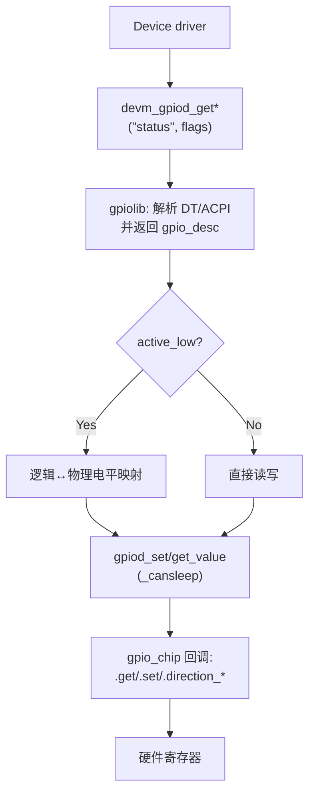
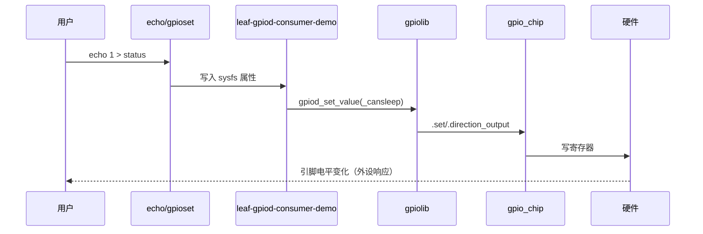
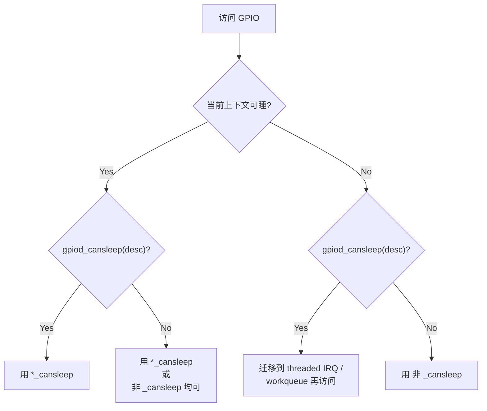
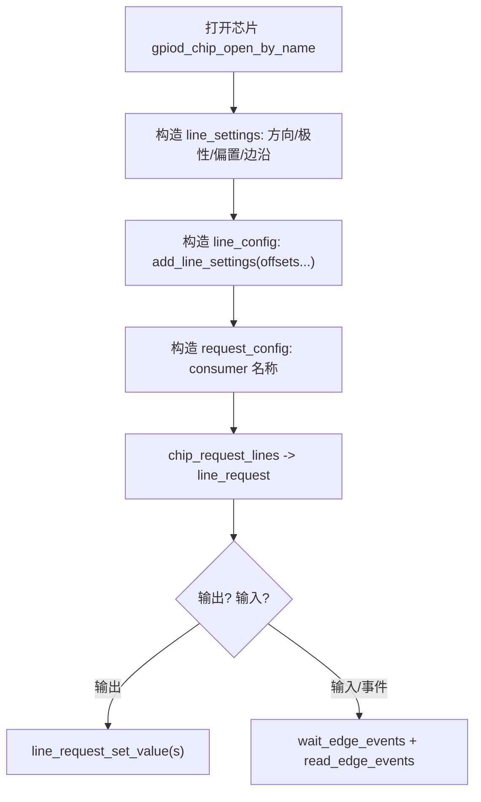
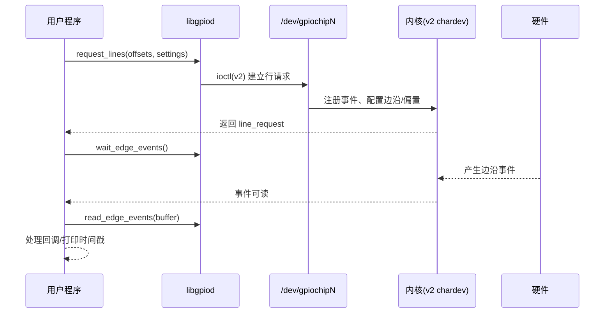

我是 **GPT-5 Thinking**。

------

# 第 4 章：GPIO Consumer 描述符 API（内核侧）

## 4.1 主题引入

**本章要解决的问题：**

* 如何在**内核驱动**中正确使用 **GPIO 描述符 API（`gpiod_\*`）** 获取/控制 GPIO？包括：
  * 获取方式（单线/可选/按索引/批量）、
  * 方向设置、
  * 逻辑/物理电平、
  * `_cansleep` 语义，
  * 以及与 DeviceTree 的标准写法配合。


**为什么重要：**

- 描述符 API 自 3.x 时代逐步确立为推荐接口；旧的整数 API（`gpio_*`）属于历史兼容。
- 正确使用 `gpiod_*` 能减少并发/睡眠上下文问题，清晰处理 **active-low** 等硬件极性。
- 在 6.x 时代，结合字符设备 ABI（用户态），这是最稳妥的“生产级范式”。

------

## 4.2 数据结构视角（原理 & 调用链）

### 4.2.1 核心对象与职责

| 对象/概念                      | 作用                                  | 典型来源/使用                                                |
| ------------------------------ | ------------------------------------- | ------------------------------------------------------------ |
| `struct gpio_desc`             | **不透明句柄**，代表一根 GPIO 线      | `devm_gpiod_get*(dev,"name",flags)` 获取；`gpiod_put()` 释放（devm 自动） |
| `gpiod_is_active_low()`        | 读取**极性**信息（低有效时取反）      | 与 DT `GPIO_ACTIVE_LOW/HIGH` 对应                            |
| `gpiod_get_value[_cansleep]()` | 读电平（逻辑值：已考虑 `active_low`） | 中断/睡眠上下文选用 `_cansleep` 变体                         |
| `gpiod_set_value[_cansleep]()` | 写电平（逻辑值）                      | 同上；需先设置方向                                           |
| `gpiod_set_raw/get_raw_*()`    | **原始电平**（不做 active_low 取反）  | 少用，调试/特殊场景才需要                                    |
| `GPIOD_OUT_LOW/HIGH`           | 获取时指定**方向+默认电平**           | 避免“先输出后置值”的毛刺                                     |
| `GPIOD_IN`                     | 获取为输入                            | 与 `gpiod_direction_input()` 等价                            |

> **逻辑 vs 物理电平**：`gpiod_set_value(desc, 1)` 表示“**逻辑 1**”。若 `active_low`，则最终写入**物理低电平**。原始模式用 `gpiod_set_raw_value()`。

### 4.2.2 调用链（驱动侧 → gpiolib → 控制器）



> 分支 `|Yes|` 与后续节点名之间**无多余空格**（保证在 Typora 正常渲染）。

------

## 4.3 开发者视角（API 用法与最小驱动）

### 4.3.1 与 DeviceTree 的标准约定（Consumer）

常见属性：`<name>-gpios = <&chip pin flags>;`
 示例（与第 3 章风格一致）：

```dts
mydev@0 {
    compatible = "leaf,mydev-consumer";
    /* 允许 default/sleep 两态，但本章聚焦 Consumer API */
    pinctrl-names = "default";
    pinctrl-0 = <&pinctrl_mydev_default>;

    status-gpios = <&gpio1 3 GPIO_ACTIVE_LOW>;  /* 输出口：状态指示 */
    reset-gpios  = <&gpio1 7 GPIO_ACTIVE_HIGH>; /* 输出口：外设复位 */
    ctrl-gpios   = <&gpio2 1 GPIO_ACTIVE_HIGH>,
                   <&gpio2 2 GPIO_ACTIVE_HIGH>; /* 多根线（按索引 0/1 获取） */

    status = "okay";
};
```

### 4.3.2 API 速查表（常用子集）

| 需求                 | 首选接口                                     | 备注                                      |
| -------------------- | -------------------------------------------- | ----------------------------------------- |
| 获取一根线（必须有） | `devm_gpiod_get(dev,"name",flags)`           | `flags`: `GPIOD_OUT_LOW/HIGH`、`GPIOD_IN` |
| 获取一根线（可选）   | `devm_gpiod_get_optional(...)`               | 若属性缺失返回 `NULL` 而非错误            |
| 同名属性按索引       | `devm_gpiod_get_index(dev,"ctrl",idx,flags)` | `ctrl-gpios` 的第 `idx` 项                |
| 读取/写入（逻辑值）  | `gpiod_get/set_value[_cansleep]()`           | 根据 `can_sleep` 选择变体                 |
| 读取/写入（原始值）  | `gpiod_get/set_raw_value[_cansleep]()`       | **不**处理 active_low                     |
| 方向切换             | `gpiod_direction_input/output()`             | 通常获取时用 `flags` 一步到位             |

> **`_cansleep` 何时用？** 控制器访问需要可能睡眠（I²C/SPI 扩展器等）时，使用 `_cansleep` 变体（或者在不确定时**保守地**使用 `_cansleep`）。

------

### 4.3.3 可运行最小驱动：多路 GPIO 的 Consumer 示例

**目标**：演示 **必须/可选/按索引** 三种获取方式，统一处理 **active_low**，导出几个 sysfs 属性便于验证。

```c
// drivers/misc/leaf_gpiod_consumer_demo.c
// SPDX-License-Identifier: GPL-2.0
#include <linux/module.h>
#include <linux/platform_device.h>
#include <linux/of.h>
#include <linux/gpio/consumer.h>
#include <linux/sysfs.h>

struct lgcd {
    struct device *dev;
    struct gpio_desc *g_status;                 /* 必须存在 */
    struct gpio_desc *g_reset;                  /* 可选 */
    struct gpio_desc *g_ctrl[2];                /* 按索引 0/1 */
    bool status_active_low, reset_active_low, ctrl_active_low[2];
};

static int lgcd_set_logic(struct gpio_desc *g, bool alow, int on)
{
    int level = alow ? !on : on;
    if (!g) return -ENODEV;
    if (gpiod_cansleep(g)) return gpiod_set_value_cansleep(g, level);
    gpiod_set_value(g, level);
    return 0;
}
static int lgcd_get_logic(struct gpio_desc *g, bool alow)
{
    int v = gpiod_get_value_cansleep(g);
    if (v < 0) return v;
    return alow ? !v : v;
}

/* 生成两个简单的属性: status / reset （0/1） */
static ssize_t status_show(struct device *dev, struct device_attribute *a, char *buf)
{
    struct lgcd *d = dev_get_drvdata(dev);
    return sysfs_emit(buf, "%d\n", lgcd_get_logic(d->g_status, d->status_active_low));
}
static ssize_t status_store(struct device *dev, struct device_attribute *a, const char *buf, size_t cnt)
{
    struct lgcd *d = dev_get_drvdata(dev); int on;
    if (kstrtoint(buf, 0, &on) || (on&~1)) return -EINVAL;
    return lgcd_set_logic(d->g_status, d->status_active_low, on) ? -EIO : cnt;
}
static DEVICE_ATTR_RW(status);

static ssize_t reset_show(struct device *dev, struct device_attribute *a, char *buf)
{
    struct lgcd *d = dev_get_drvdata(dev);
    if (!d->g_reset) return sysfs_emit(buf, "NA\n");
    return sysfs_emit(buf, "%d\n", lgcd_get_logic(d->g_reset, d->reset_active_low));
}
static ssize_t reset_store(struct device *dev, struct device_attribute *a, const char *buf, size_t cnt)
{
    struct lgcd *d = dev_get_drvdata(dev); int on;
    if (!d->g_reset) return -ENODEV;
    if (kstrtoint(buf, 0, &on) || (on&~1)) return -EINVAL;
    return lgcd_set_logic(d->g_reset, d->reset_active_low, on) ? -EIO : cnt;
}
static DEVICE_ATTR_RW(reset);

/* ctrl0/ctrl1 两根线（按索引获取），属性名 ctrl0/ctrl1 */
static ssize_t ctrlN_show(struct device *dev, struct device_attribute *a, char *buf)
{
    struct lgcd *d = dev_get_drvdata(dev);
    int idx = (a->attr.name[4] - '0'); /* "ctrl0"/"ctrl1" */
    if (idx < 0 || idx > 1 || !d->g_ctrl[idx]) return -ENODEV;
    return sysfs_emit(buf, "%d\n", lgcd_get_logic(d->g_ctrl[idx], d->ctrl_active_low[idx]));
}
static ssize_t ctrlN_store(struct device *dev, struct device_attribute *a, const char *buf, size_t cnt)
{
    struct lgcd *d = dev_get_drvdata(dev); int on, idx = (a->attr.name[4] - '0');
    if (idx < 0 || idx > 1 || !d->g_ctrl[idx]) return -ENODEV;
    if (kstrtoint(buf, 0, &on) || (on&~1)) return -EINVAL;
    return lgcd_set_logic(d->g_ctrl[idx], d->ctrl_active_low[idx], on) ? -EIO : cnt;
}
static DEVICE_ATTR(ctrl0, 0644, ctrlN_show, ctrlN_store);
static DEVICE_ATTR(ctrl1, 0644, ctrlN_show, ctrlN_store);

static struct attribute *lgcd_attrs[] = {
    &dev_attr_status.attr, &dev_attr_reset.attr,
    &dev_attr_ctrl0.attr, &dev_attr_ctrl1.attr, NULL
};
static const struct attribute_group lgcd_group = { .attrs = lgcd_attrs };

static int lgcd_probe(struct platform_device *pdev)
{
    struct device *dev = &pdev->dev;
    struct lgcd *d;
    int i, ret;

    d = devm_kzalloc(dev, sizeof(*d), GFP_KERNEL);
    if (!d) return -ENOMEM;
    d->dev = dev;
    platform_set_drvdata(pdev, d);

    /* 1) 必须存在的 status 线（输出低为安全态） */
    d->g_status = devm_gpiod_get(dev, "status", GPIOD_OUT_LOW);
    if (IS_ERR(d->g_status)) return PTR_ERR(d->g_status);
    d->status_active_low = gpiod_is_active_low(d->g_status);

    /* 2) 可选的 reset 线（缺失则允许继续） */
    d->g_reset = devm_gpiod_get_optional(dev, "reset", GPIOD_OUT_HIGH);
    if (IS_ERR(d->g_reset)) return PTR_ERR(d->g_reset);
    if (d->g_reset) d->reset_active_low = gpiod_is_active_low(d->g_reset);

    /* 3) 同名属性 ctrl-gpios，按索引 0/1 获取 */
    for (i = 0; i < 2; i++) {
        d->g_ctrl[i] = devm_gpiod_get_index_optional(dev, "ctrl", i, GPIOD_OUT_LOW);
        if (IS_ERR(d->g_ctrl[i])) return PTR_ERR(d->g_ctrl[i]);
        if (d->g_ctrl[i]) d->ctrl_active_low[i] = gpiod_is_active_low(d->g_ctrl[i]);
    }

    /* 4) 导出属性组：/sys/bus/platform/devices/.../{status,reset,ctrl0,ctrl1} */
    ret = sysfs_create_group(&dev->kobj, &lgcd_group);
    if (ret) return ret;

    dev_info(dev, "consumer ready (status%s, reset%s, ctrl[0..1])\n",
             d->status_active_low ? " AL" : "", d->g_reset ? (d->reset_active_low ? " AL" : "") : " NA");
    return 0;
}

static int lgcd_remove(struct platform_device *pdev)
{
    sysfs_remove_group(&pdev->dev.kobj, &lgcd_group);
    return 0;
}

static const struct of_device_id lgcd_of_match[] = {
    { .compatible = "leaf,mydev-consumer" }, { }
};
MODULE_DEVICE_TABLE(of, lgcd_of_match);

static struct platform_driver lgcd_driver = {
    .probe = lgcd_probe,
    .remove = lgcd_remove,
    .driver = {
        .name = "leaf-gpiod-consumer-demo",
        .of_match_table = lgcd_of_match,
    },
};
module_platform_driver(lgcd_driver);

MODULE_LICENSE("GPL");
MODULE_AUTHOR("Leaf Book");
MODULE_DESCRIPTION("Demo: GPIO descriptor consumer (required/optional/index)");
```

**Kbuild 提示**

```make
obj-m += leaf_gpiod_consumer_demo.o
# make -C /path/to/linux-6.1 M=$(PWD) modules
```

> 要点回顾：
>
> - `devm_gpiod_get_optional()` 让属性缺失时**不失败**。
> - `devm_gpiod_get_index_optional()` 对 `ctrl-gpios` **按索引**取第 0/1 根。
> - 统一用“逻辑值”操作，并由 `active_low` 自动映射到“物理电平”。
> - 使用 `_cansleep` 变体保证在可能睡眠的控制器上安全；不确定时也可保守选用。

------

## 4.4 用户视角（如何操作/验证）

### 4.4.1 上电自检（字符设备与工具）

```bash
ls /dev/gpiochip*
gpiodetect
gpioinfo gpiochip0     # 观察 consumer 名称与 active-low 标记
```

### 4.4.2 驱动导出的 sysfs 属性

```bash
cd /sys/bus/platform/devices
ls | grep leaf-gpiod-consumer-demo -n
cd <devdir>
cat status    # 0/1
echo 1 | sudo tee status
echo 0 | sudo tee status

cat reset     # 若 NA 说明 reset-gpios 未提供
echo 1 | sudo tee ctrl0
echo 0 | sudo tee ctrl1
```

### 4.4.3 与 libgpiod 交叉验证

```bash
# 比对 sysfs 的写入效果与芯片线电平变化
gpioget gpiochip0 <line>     # 根据你的板级偏移号
gpioset gpiochip0 <line>=1   # 注意进程持有语义
```

> **可视化路径**：`gpioinfo` 中的 consumer 一般会展示 `<devname>:<con_id>`，便于追踪是哪段驱动在占用该线。

------

## 4.5 可视化图示

### 4.5.1 获取与控制流程（flowchart）

```mermaid
flowchart TD
A[解析 DT: <name>-gpios] --> B[devm_gpiod_get*(\"name\", flags)]
B --> C[gpio_desc]
C --> D{active_low?}
D -->|Yes| E[gpiod_set/get_value(_cansleep) 映射后操作]
D -->|No|  F[gpiod_set/get_value(_cansleep) 直接操作]
E --> G[gpio_chip -> HW]
F --> G[gpio_chip -> HW]
```

### 4.5.2 驱动-用户交互（sequenceDiagram）



------

## 4.6 调试与验证（Checklist）

| 现象                                | 可能原因                       | 排查与修复                                                   |
| ----------------------------------- | ------------------------------ | ------------------------------------------------------------ |
| `-EPROBE_DEFER`                     | 依赖控制器/电源未就绪          | 允许重试；确认依赖驱动顺序与电源域                           |
| `-ENOENT`（get_optional 返回 NULL） | 属性缺失                       | 合理：代表“可选未提供”；驱动需容错                           |
| `-EBUSY`                            | 该线已被其他驱动占用           | `gpioinfo` 看 `consumer`，排重或改线                         |
| “睡眠中写GPIO”告警                  | 使用了非 `_cansleep` 变体      | 改用 `_cansleep`，或确认控制器可原子访问                     |
| 逻辑/物理颠倒                       | 极性配置不当                   | 检查 DT `GPIO_ACTIVE_LOW`；用 `gpiod_is_active_low()` 统一映射 |
| “能写但硬件不动”                    | pinmux 不是 GPIO、pad 电气不当 | 参考第 3 章：`pinmux-pins`/`pinconf-pins` 交叉验证           |

**动态调试建议**

```bash
# 查看所有 GPIO 注册与占用情况
sudo cat /sys/kernel/debug/gpio

# 打开 gpiolib 动态调试
echo 'file drivers/gpio/gpiolib*.c +p' | sudo tee /sys/kernel/debug/dynamic_debug/control
dmesg -w
```

------

## 4.7 小结

### 4.7.1 API 要点表

| 类别   | 推荐做法                                       | 反例/不推荐                    |
| ------ | ---------------------------------------------- | ------------------------------ |
| 获取   | `devm_gpiod_get/optional/index` + 合理 `flags` | 先 `output` 再 `set` 容易毛刺  |
| 读写   | **逻辑值**：`gpiod_set/get_value(_cansleep)`   | 混用 raw/逻辑导致行为混乱      |
| 极性   | 统一以 `gpiod_is_active_low()` 做映射          | 代码里手翻极性、处处写 `!`     |
| 上下文 | 不确定能否原子访问→用 `_cansleep`              | 在可能睡眠路径用非 `_cansleep` |
| 兼容   | 新代码用 `gpiod_*` 描述符 API                  | 继续写 `gpio_*` 整数 API       |

**一句话总结：**
 👉 **在驱动里只谈“逻辑值”，把“物理细节”交给 `gpiod_\*` 与 `active_low` 映射处理；获取时用好 `flags`，访问时选对 `_cansleep` 变体。**

------

## 4.8 `_cansleep` 系列函数（结构化详解）

### 4.8.1 背景与术语

- **描述符 API：** gpiolib 提供两套读写接口（“逻辑值”与“原始值”各一套）：
  - 逻辑值（考虑极性）：
     `gpiod_get_value()` / `gpiod_set_value()`
     `gpiod_get_value_cansleep()` / `gpiod_set_value_cansleep()`
  - 原始值（不考虑极性）：
     `gpiod_get_raw_value()` / `gpiod_set_raw_value()`
     `gpiod_get_raw_value_cansleep()` / `gpiod_set_raw_value_cansleep()`
- **`can_sleep` 语义：** GPIO 控制器驱动在 `struct gpio_chip` 中声明 `can_sleep`：
  - `false`：访问寄存器无需睡眠（典型：SoC 内部 MMIO）。
  - `true`：可能通过 I²C/SPI/Regmap 等间接访问，**访问可能睡眠**（典型：GPIO 扩展器）。
- **核心约束：** `_cansleep` 版本**必须**在可睡眠上下文调用；非 `_cansleep` 版本**仅**能在 `can_sleep=false` 的线且调用点允许的上下文中使用。

------

### 4.8.2 语义与上下文约束

- **可睡眠上下文（✅ 可用 `_cansleep`）：** 线程上下文（`probe/remove`、普通 file ops、`workqueue`、`kthread`）、**threaded IRQ** 处理函数。
- **原子上下文（❌ 禁止 `_cansleep`）：** 硬中断上半部、软中断/tasklet、自旋锁持有区、硬定时器回调等。
- **非 `_cansleep` 的前提：** 只有当 `gpiod_cansleep(desc) == false` 时，才能在原子上下文使用 `gpiod_get/set_value()` 系列。

> 实现细节：`*_cansleep` 路径包含 `might_sleep()` 检查；即使底层最终不睡，也会在原子上下文触发告警。因此 **不要**在原子上下文调用 `_cansleep` 版本。

------

### 4.8.3 选择规则（决策树）

1. **先判上下文**：当前是否允许睡眠？
2. **再判线能力**：`gpiod_cansleep(desc)` 返回是否可能睡眠？
3. **据此选函数族**：



> 备注：在可睡上下文中，`*_cansleep` 与非 `_cansleep` 对 `can_sleep=false` 的线都可用；但为跨平台稳定性，**推荐统一用 `\*_cansleep`**。

------

### 4.8.4 控制器分类与判断方法

- **SoC GPIO（MMIO，常见于 `pinctrl-<SoC>` 旗下）**：通常 `can_sleep=false`。

- **GPIO 扩展器（I²C/SPI/PMIC 等）**：通常 `can_sleep=true`。

- **运行时判断：**

  ```c
  if (gpiod_cansleep(desc))   // true 表示该线访问可能睡眠
      gpiod_set_value_cansleep(desc, level);
  else
      gpiod_set_value(desc, level);
  ```

------

### 4.8.5 逻辑值与原始电平（与极性的一致处理）

- **逻辑值接口**：`gpiod_get/set_value[_cansleep]()` —— 自动考虑 DT 的 `GPIO_ACTIVE_LOW/HIGH`。
- **原始值接口**：`gpiod_get/set_raw_value[_cansleep]()` —— 不做极性映射。
- **建议：** 驱动统一使用“逻辑值接口”，由 `gpiod_is_active_low(desc)` 做一次性映射，避免各处手写 `!`。

> 逻辑到物理的统一写法：

```c
static inline int gpiod_set_logic_safe(struct gpio_desc *d, bool active_low, int on)
{
    int level = active_low ? !on : on;
    if (!d) return -ENODEV;
    if (gpiod_cansleep(d)) return gpiod_set_value_cansleep(d, level);
    gpiod_set_value(d, level);
    return 0;
}

static inline int gpiod_get_logic_safe(struct gpio_desc *d, bool active_low)
{
    int v = gpiod_cansleep(d) ? gpiod_get_value_cansleep(d)
                              : gpiod_get_value(d);
    return (v < 0) ? v : (active_low ? !v : v);
}
```

------

### 4.8.6 编码模板（可直接复用）

**A）通用读写模板（可睡/不可睡自适应）**

```c
int my_gpio_write(struct gpio_desc *d, bool on)
{
    bool al = gpiod_is_active_low(d);
    int level = al ? !on : on;
    if (gpiod_cansleep(d)) return gpiod_set_value_cansleep(d, level);
    gpiod_set_value(d, level);
    return 0;
}

int my_gpio_read(struct gpio_desc *d)
{
    bool al = gpiod_is_active_low(d);
    int v = gpiod_cansleep(d) ? gpiod_get_value_cansleep(d)
                              : gpiod_get_value(d);
    return (v < 0) ? v : (al ? !v : v);
}
```

**B）硬中断上半部安全调用（仅限 `can_sleep=false` 的线）**

```c
irqreturn_t my_irq_handler(int irq, void *data)
{
    struct gpio_desc *d = data;
    if (unlikely(gpiod_cansleep(d)))  // 保险检查
        return IRQ_NONE;              // 或标记并延后到线程化处理
    gpiod_set_value(d, 1);            // 非 _cansleep，原子安全
    return IRQ_HANDLED;
}
```

**C）线程化中断 / 工作队列（通吃 `can_sleep=true/false`）**

```c
irqreturn_t my_irq_thread(int irq, void *data)
{
    struct gpio_desc *d = data;
    /* 线程上下文，可睡；统一走 *_cansleep */
    return gpiod_set_value_cansleep(d, 0) ? IRQ_NONE : IRQ_HANDLED;
}
```

------

### 4.8.7 端到端示例 A：I²C 扩展器（`can_sleep=true`）

**场景：** PCF8574 等 I²C GPIO 控制 LED，在中断事件里翻转 LED。

**DTS（节选）：**

```dts
i2c1: i2c@40066000 {
    exp0: gpio@20 {
        compatible = "nxp,pcf8574";
        reg = <0x20>;
        gpio-controller;
        #gpio-cells = <2>;
        /* ... 省略 pinctrl ... */
    };
};

mydev@0 {
    compatible = "leaf,my-cansleep-demo";
    status-gpios = <&exp0 0 GPIO_ACTIVE_LOW>;
    status = "okay";
};
```

**驱动处理：** 使用 **threaded IRQ** 或 `workqueue`，在可睡上下文调用 `_cansleep`：

```c
static irqreturn_t my_top(int irq, void *p) { return IRQ_WAKE_THREAD; } // 上半部最小化
static irqreturn_t my_thread(int irq, void *p)
{
    struct gpio_desc *d = p; // 来自 devm_gpiod_get(...)
    /* 线程上下文：安全使用 *_cansleep */
    int val = gpiod_get_value_cansleep(d);
    if (val >= 0)
        gpiod_set_value_cansleep(d, !val);
    return IRQ_HANDLED;
}

/* 绑定中断 */
devm_request_threaded_irq(dev, irq, my_top, my_thread,
                          IRQF_ONESHOT, "mycansleep", desc);
```

------

### 4.8.8 端到端示例 B：SoC GPIO（`can_sleep=false`）硬中断快路径

**场景：** SoC 内部 GPIO 控制一个引脚脉冲，要求中断上半部立刻拉高 10us 再拉低。

```c
static irqreturn_t my_top_fast(int irq, void *p)
{
    struct gpio_desc *d = p;
    if (unlikely(gpiod_cansleep(d)))
        return IRQ_NONE; /* 设计上不应发生，保护性返回 */

    gpiod_set_value(d, 1);          /* 非 _cansleep，原子安全 */
    udelay(10);                     /* 原子上下文短延时 */
    gpiod_set_value(d, 0);
    return IRQ_HANDLED;
}
```

> 若移植到含扩展器的平台，**必须**改为线程化中断或下发工作队列。

------

### 4.8.9 调试与验证方法

1. **检查谁在使用 GPIO：**

   ```bash
   sudo cat /sys/kernel/debug/gpio
   gpioinfo  # 查看 consumer 名称与 active-low 标记
   ```

2. **启用 gpiolib 动态调试（观察调用路径）：**

   ```bash
   echo 'file drivers/gpio/gpiolib*.c +p' | sudo tee /sys/kernel/debug/dynamic_debug/control
   dmesg -w
   ```

3. **定位上下文错误：** 若在原子上下文调用 `_cansleep`，内核会打印类似
    `BUG: sleeping function called from invalid context`。出现该日志，说明调用点需要迁移到可睡位置。

------

### 4.8.10 常见问题与修复

| 问题                                 | 典型根因                              | 修复建议                                                     |
| ------------------------------------ | ------------------------------------- | ------------------------------------------------------------ |
| 原子上下文触发 “sleeping function …” | 在 top-half/softirq 调用 `*_cansleep` | 使用 **threaded IRQ/workqueue**；或仅在 `gpiod_cansleep(desc)==false` 时用非 `_cansleep` |
| 在 MMIO 平台正常，换扩展器平台异常   | 代码全程使用非 `_cansleep`            | 按 **4.8.3** 决策树改造；统一在可睡上下文用 `_cansleep`      |
| 亮灭颠倒/跨板不一致                  | 混用 raw/逻辑接口或随处手写 `!`       | 统一逻辑接口 + `gpiod_is_active_low()` 一次性映射            |
| 读写卡顿                             | 扩展器访问在快路径                    | 把慢路径移到线程/worker；快路径仅做标记                      |

------

### 4.8.11 兼容性与性能注意

- 在**可睡上下文**对 `can_sleep=false` 的线调用 `*_cansleep` **没有功能问题**；只是多了一次 `might_sleep()` 检查的开销，通常可忽略。
- 在**原子上下文**调用 `*_cansleep` **不被允许**，即使底层当前不会睡，也会触发检查告警。

------

### 4.8.12 小结

- **规则**：先判上下文、再判 `gpiod_cansleep(desc)`，据此选择 `_cansleep` 或非 `_cansleep`。
- **实践**：可睡上下文统一用 `*_cansleep`，原子上下文仅在 `can_sleep=false` 时使用非 `_cansleep`。
- **一致性**：逻辑值接口 + 极性一次映射，避免跨平台行为差异。

**一句话总结：**
 **在能睡的地方使用 `\*_cansleep`，在不能睡的地方只操作 `can_sleep=false` 的 GPIO；拿不准就用 `gpiod_cansleep()` 判定并迁移到可睡上下文。**


------

# 第 5 章：字符设备 ABI 与 libgpiod（用户态）

## 5.1 主题引入

**本章要解决的问题：**

* 用户态如何通过 **GPIO 字符设备 ABI** 与 **libgpiod 2.x** 安全、可移植地控制 GPIO（输出、输入、边沿事件）？
* 如何在 v1/v2 ABI 差异下写出可维护的脚本与程序？


**为什么重要：**

- 旧的 **sysfs GPIO** 接口已在内核中标记弃用（多年历史），现代系统应使用 **/dev/gpiochipN** 字符设备。
- **libgpiod 2.x**（配合内核 **v2 chardev ABI：≥5.10**）提供统一、可移植的 C API 与命令行工具集。
- 正确的**请求/持有/释放**模型与**事件读取**模式，是避免竞态与权限问题的关键。

------

## 5.2 概念与时间线

- **4.8（2016）**：首次引入 **GPIO chardev v1**（/dev/gpiochipN）。
- **5.10（2020）**：引入 **GPIO chardev v2**（增强批量请求、事件、设置）。v1 仍可回退。
- **6.1（2022 LTS）**：大量发行版默认采用 **chardev + libgpiod** 路线；libgpiod 2.x **优先使用 v2**，**内核不支持时自动回退 v1**。
- **现状**：新项目一律使用 **chardev + libgpiod 2.x**；sysfs 仅用于遗留系统。

------

## 5.3 角色与对象（用户空间视角）

| 对象                                                         | 含义/职责                            | 典型作用                                                 |
| ------------------------------------------------------------ | ------------------------------------ | -------------------------------------------------------- |
| `/dev/gpiochipN`                                             | 一个 GPIO 控制器的字符设备           | 通过 ioctl（v1/v2 ABI）进行行（line）请求/释放、事件订阅 |
| libgpiod（C 语言库）                                         | chardev 的轻量封装                   | 芯片打开、line 配置（方向/极性/偏置/驱动）、事件读取     |
| 工具集（gpiodetect/gpioinfo/gpioget/gpioset/gpiomon/gpiofind） | 运维/调试命令                        | 快速查看、拉高/拉低、边沿监听、按名称查线                |
| “行（line）”/“偏移（offset）”                                | 控制器中的某个 GPIO 号（0..ngpio-1） | 在一个 request 中按 **索引**顺序操作                     |

> 术语注意：在 libgpiod 2.x 中，请求一个或多根线后，**请求内的“索引”\**与\**原始 offset**是两个概念：后续读写以**索引 0..N-1**为主（按你传入 offsets 数组的顺序映射）。

------

## 5.4 工具法（零代码快速验证）

### 5.4.1 安装与自检

- RootFS 中安装 **libgpiod-tools**（Buildroot、Yocto 或手工交叉编译，见第 2 章补充）。

- 验证字符设备：

  ```bash
  ls /dev/gpiochip*
  gpiodetect          # 列出芯片
  gpioinfo gpiochip0  # 列出线的名称、方向、active-low、consumer 等
  ```

### 5.4.2 读写与持有语义

```bash
# 读一根线（逻辑值；自动考虑 active-low）
gpioget gpiochip0 3

# 设置为 1 并“保持持有”（进程退出前保持）
gpioset gpiochip0 3=1

# 设置为 1 并退出时释放（-m exit 让工具退出后恢复默认）
gpioset -m exit gpiochip0 3=1
```

> “进程持有语义”：**谁持有就谁生效**。工具退出会释放行，电平可能回到默认或被其他消费者接管。

### 5.4.3 边沿事件监听

```bash
# 监听两根输入线的上/下沿，打印时间戳
gpiomon --rising --falling gpiochip0 5 6
```

------

## 5.5 C 语言：libgpiod 2.x 最小示例

> 下面两段 C 代码分别演示 **输出** 与 **事件输入**。均基于 **libgpiod 2.x** 的对象式 API（`chip` / `line_settings` / `line_config` / `request`）。

### 5.5.1 单线输出（设为高，再拉低）

```c
// build: cc -Wall -O2 -o gpio_out gpio_out.c -lgpiod
#include <gpiod.h>
#include <stdio.h>
#include <stdlib.h>

int main(void)
{
    const char *chipname = "gpiochip0";
    unsigned int offsets[] = { 3 };  // 目标偏移
    struct gpiod_chip *chip = NULL;
    struct gpiod_line_settings *ls = NULL;
    struct gpiod_line_config *lc = NULL;
    struct gpiod_request_config *rc = NULL;
    struct gpiod_line_request *req = NULL;
    int ret = 0;

    chip = gpiod_chip_open_by_name(chipname);
    if (!chip) { perror("chip_open"); return 1; }

    ls = gpiod_line_settings_new();
    gpiod_line_settings_set_direction(ls, GPIOD_LINE_DIRECTION_OUTPUT);
    gpiod_line_settings_set_output_value(ls, GPIOD_LINE_VALUE_INACTIVE); // 初始低

    lc = gpiod_line_config_new();
    gpiod_line_config_add_line_settings(lc, offsets, 1, ls);

    rc = gpiod_request_config_new();
    gpiod_request_config_set_consumer(rc, "gpio_out_demo");

    req = gpiod_chip_request_lines(chip, rc, lc);
    if (!req) { 
        perror("request_lines"); 
        ret = 1; 
        goto out; 
    }

    // 注意：请求内索引 0 对应 offsets[0]（即芯片偏移 3）
    gpiod_line_request_set_value(req, 0, GPIOD_LINE_VALUE_ACTIVE);   // 置高
    gpiod_line_request_set_value(req, 0, GPIOD_LINE_VALUE_INACTIVE); // 置低

out:
    if (req)  gpiod_line_request_release(req);
    if (rc)   gpiod_request_config_free(rc);
    if (lc)   gpiod_line_config_free(lc);
    if (ls)   gpiod_line_settings_free(ls);
    if (chip) gpiod_chip_close(chip);
    return ret;
}
```

**关键点：**

- `gpiod_line_request_set_value(req, **索引** , value)`：**索引**是你在 `add_line_settings()` 里传入 offsets 的顺序（0..N-1），不是原始 offset。
- `ACTIVE/INACTIVE` 是**逻辑值**。若线为 active-low，逻辑 1 会写入物理低电平（底层映射）。

### 5.5.2 单线输入 + 边沿事件（RISING/FALLING）

```c
// build: cc -Wall -O2 -o gpio_evt gpio_evt.c -lgpiod
#include <gpiod.h>
#include <stdio.h>
#include <stdlib.h>
#include <inttypes.h>
#include <time.h>

static void print_event(const struct gpiod_edge_event *ev)
{
    const struct timespec *ts = gpiod_edge_event_get_timestamp(ev);
    enum gpiod_edge_event_type tp = gpiod_edge_event_get_event_type(ev);
    printf("%ld.%09ld: %s\n", (long)ts->tv_sec, ts->tv_nsec,
           tp == GPIOD_EDGE_EVENT_RISING_EDGE ? "rising" : "falling");
}

int main(void)
{
    const char *chipname = "gpiochip0";
    unsigned int offsets[] = { 5 }; // 监听偏移 5
    struct gpiod_chip *chip = NULL;
    struct gpiod_line_settings *ls = NULL;
    struct gpiod_line_config *lc = NULL;
    struct gpiod_request_config *rc = NULL;
    struct gpiod_line_request *req = NULL;
    struct gpiod_edge_event_buffer *buf = NULL;
    int ret = 0;

    chip = gpiod_chip_open_by_name(chipname);
    if (!chip) { 
        perror("chip_open"); 
        return 1; 
    }

    ls = gpiod_line_settings_new();
    gpiod_line_settings_set_direction(ls, GPIOD_LINE_DIRECTION_INPUT);
    gpiod_line_settings_set_edge_detection(ls, GPIOD_LINE_EDGE_BOTH);
    // 可选：上拉/下拉/去抖
    // gpiod_line_settings_set_bias(ls, GPIOD_LINE_BIAS_PULL_UP);
    // gpiod_line_settings_set_debounce_period_us(ls, 5000);

    lc = gpiod_line_config_new();
    gpiod_line_config_add_line_settings(lc, offsets, 1, ls);

    rc = gpiod_request_config_new();
    gpiod_request_config_set_consumer(rc, "gpio_evt_demo");

    req = gpiod_chip_request_lines(chip, rc, lc);
    if (!req) { perror("request_lines"); ret = 1; goto out; }

    buf = gpiod_edge_event_buffer_new(16);

    while (1) {
        int n = gpiod_line_request_wait_edge_events(req, NULL); // NULL=无限等待
        if (n < 0) { perror("wait_edge"); break; }
        n = gpiod_line_request_read_edge_events(req, buf, 16);
        if (n < 0) { perror("read_edge"); break; }
        for (int i = 0; i < n; i++) {
            const struct gpiod_edge_event *ev = gpiod_edge_event_buffer_get_event(buf, i);
            print_event(ev);
        }
    }

out:
    if (buf)  gpiod_edge_event_buffer_free(buf);
    if (req)  gpiod_line_request_release(req);
    if (rc)   gpiod_request_config_free(rc);
    if (lc)   gpiod_line_config_free(lc);
    if (ls)   gpiod_line_settings_free(ls);
    if (chip) gpiod_chip_close(chip);
    return ret;
}
```

**关键点：**

- 事件读取流程：`wait_edge_events` → `read_edge_events` → 遍历 `buffer`。
- 去抖（可选）：在 **line settings** 设置 `debounce_period_us`，内核支持则生效（与控制器能力相关）。

------

## 5.6 目录结构与交互流程（图示）

### 5.6.1 用户态请求流程（flowchart）



### 5.6.2 事件读取时序（sequenceDiagram）



------

## 5.7 常见错误与排查

| 现象/报错                                | 可能原因                               | 解决                                              |
| ---------------------------------------- | -------------------------------------- | ------------------------------------------------- |
| `No such file or directory`（工具/程序） | rootfs 未安装 libgpiod 工具或库        | 将 **libgpiod-tools**（或静态二进制）加入 rootfs  |
| `Permission denied` / `EPERM`            | /dev/gpiochip* 权限不足                | `sudo` 或配置 udev 规则                           |
| `Device or resource busy` / `EBUSY`      | 该线已被其他 consumer 持有             | `gpioinfo` 查看 consumer，释放或换线              |
| 电平“没变化”                             | pinmux 未切到 GPIO（第 3 章）          | `debugfs`：`pinmux-pins`、`pinconf-pins` 交叉验证 |
| 事件“收不到”                             | 方向/边沿设置错误，或外部上拉/下拉不对 | `gpioinfo` 查 bias/方向；检查硬件电气与阈值       |
| 逻辑与物理颠倒                           | active-low 未配置或误用 raw 接口       | 统一使用**逻辑接口**，由 settings/DT 决定极性     |

> 调试通道：
>
> - `gpioinfo` 看 consumer/active-low；
> - `sudo cat /sys/kernel/debug/gpio` 看全局占用；
> - `dmesg` 观察字符设备/权限相关日志。

------

## 5.8 与内核/设备树的衔接（回顾要点）

- 用户态的逻辑成立，前提是：
   **① pinmux 已将目标 PAD 复用为 GPIO**，**② pinconf 电气设置合理**（上拉/下拉/驱动），**③ 控制器驱动已注册 gpiochip**。
- `gpioinfo` 的 **line-name** 来源：
  - 控制器 `gpio-line-names`；
  - 或由内核/驱动消费时填充的 consumer 名称（便于排查谁在用这根线）。
- 事件监听的可靠性依赖硬件电气（上拉/下拉）与边沿阈值——对于抖动强的按键，优先在 **line settings** 或硬件侧提供去抖。

------

## 5.9 小结

### 5.9.1 工具与 API 对照

| 目标            | 工具命令                                 | C API（libgpiod 2.x）                                     |
| --------------- | ---------------------------------------- | --------------------------------------------------------- |
| 查看芯片/线信息 | `gpiodetect` / `gpioinfo`                | `gpiod_chip_*` / `gpiod_line_*_settings`                  |
| 读单线          | `gpioget chip off`                       | `gpiod_line_request_get_value(req, idx)`                  |
| 写单线          | `gpioset chip off=1`                     | `gpiod_line_request_set_value(req, idx, ACTIVE/INACTIVE)` |
| 监听边沿        | `gpiomon --rising --falling chip off...` | `wait_edge_events` + `read_edge_events`                   |

**一句话总结：**
 **在用户态，统一走 `/dev/gpiochipN + libgpiod 2.x`；按“请求→持有→读写/事件→释放”的生命周期操作，逻辑值与极性交给库处理，电气与复用交给第 3 章的方法验证。**

------

