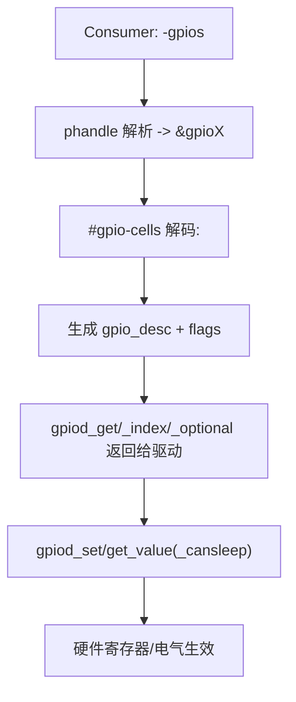
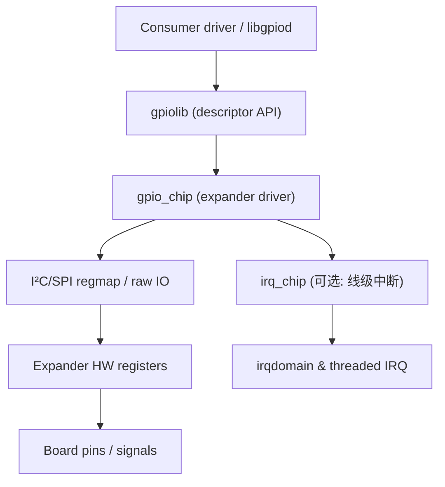
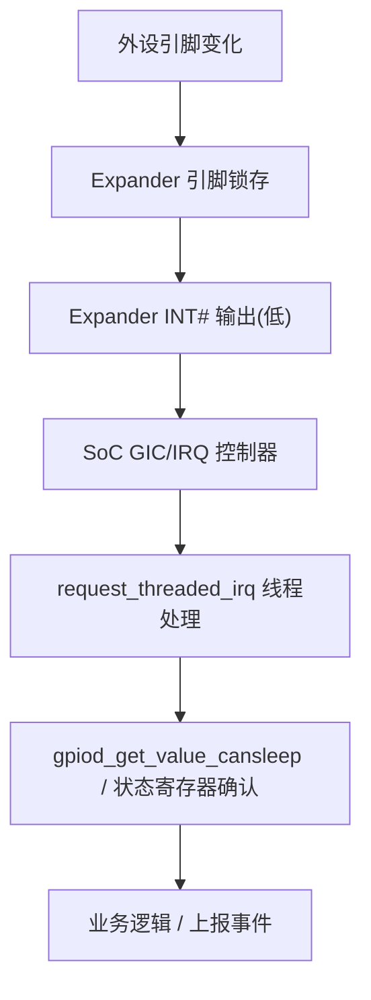
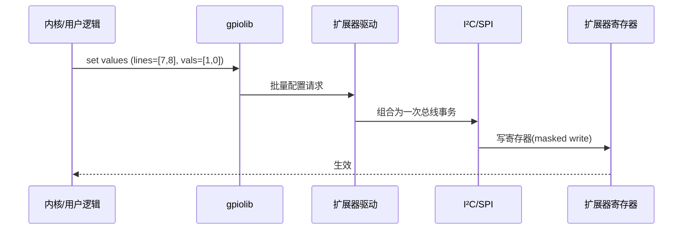
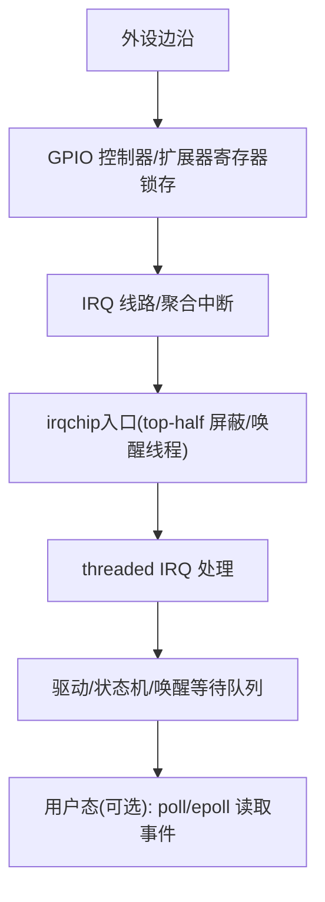
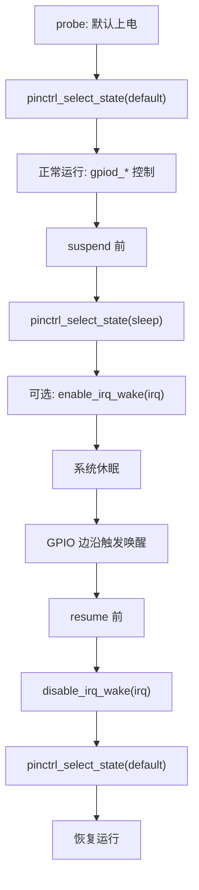
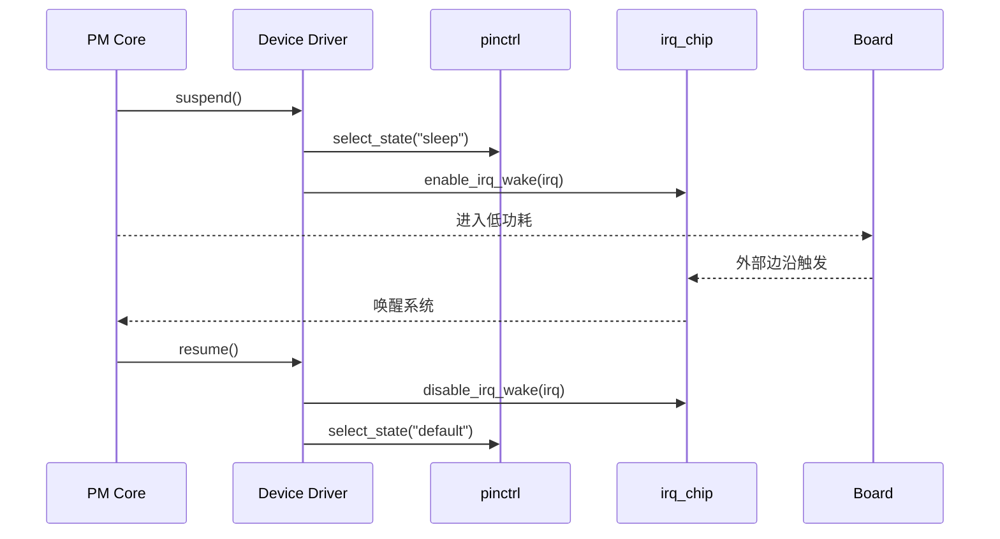
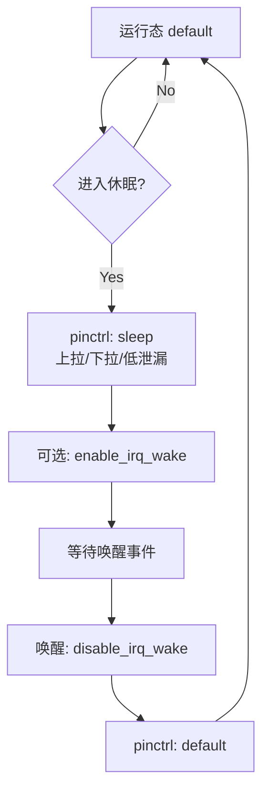

我是 **GPT-5 Thinking**。

------

# 第 8 章：设备树 GPIO 绑定通用范式

## 8.1 主题引入

**本章要解决的问题：**

- 设备树里 GPIO 的**通用书写范式**是什么？`<name>-gpios = <&chip pin flags>` 的每一项代表什么？
- `GPIO_ACTIVE_LOW/HIGH`、`GPIO_OPEN_DRAIN/SOURCE`、`GPIO_PULL_*` 等 **flags** 如何配合 **pinctrl** 电气设置？
- 如何用 `gpio-line-names` 统一命名、用 `gpio-hog` 设定上电默认态、用 `gpio-ranges` 对齐 pinctrl 与 gpiolib？


**为什么重要：**
 GPIO 绑定是**驱动无感**的“协议层”。写对它，换脚/换板/量产变体都只改 DTS；写错它，驱动再完美也“拉不动电平”。

> 时间线提示：本章描述的绑定范式自 **4.x** 即稳定，至 **6.1+** 仍然适用；个别 flags/控制器能力与具体 SoC 有差异，会在文中说明。

------

## 8.2 数据结构视角（绑定要素与结构）

### 8.2.1 控制器节点（provider）

一个 GPIO 控制器（通常在 pinctrl/IOMUX 节点下或并列）应具备：

```dts
gpio1: gpio@0209c000 {
    compatible = "fsl,imx6ul-gpio";  /* 举例：i.MX6ULL */
    reg = <0x0209c000 0x4000>;
    interrupts = <GIC_SPI 66 IRQ_TYPE_LEVEL_HIGH>;
    gpio-controller;                 /* 关键：声明为 GPIO 提供者 */
    #gpio-cells = <2>;               /* 常见为 2：<pin flags> */
    gpio-line-names = "LED_STAT", "BTN_USER", /* ...数量=ngpio ... */;
    /* 可选：与 pinctrl 对齐的 ranges（见 8.2.4） */
    gpio-ranges = <&iomuxc 0 0 32>;  /* 含义：从 pinctrl 起始 0 到本控制器 0，共 32 个 */
};
```

- **`gpio-controller`**：声明“我是一个 GPIO 提供者”。
- **`#gpio-cells`**：GPIO 规格器（specifier）的单元数：
  - **2**（最常见）：`<pin flags>`。
  - **3**（少数控制器）：`<port pin flags>` 或 `<bank pin flags>`。
- **`gpio-line-names`**（可选）：为每条线起“人类可读名字”（便于 `gpioinfo`、调试与生产测试）。

> **兼容差异**：大多数主流 SoC（NXP i.MX、Rockchip、TI、Allwinner 等）采用 `#gpio-cells = <2>`。若控制器使用 **3 cells**，文档会明确说明其含义（例：`<bank pin flags>`）。

------

### 8.2.2 消费者节点（consumer）与 `<name>-gpios`

消费者节点通过 **`<name>-gpios`** 属性指向具体 GPIO 线：

```dts
mydev@0 {
    compatible = "leaf,my-consumer";
    /* pinctrl 负责把 PAD 复用为 GPIO，详见第 3 章 */
    pinctrl-names = "default";
    pinctrl-0 = <&pinctrl_mydev_default>;

    reset-gpios = <&gpio1 7 GPIO_ACTIVE_HIGH>;  /* 单根线 */
    ctrl-gpios  = <&gpio2 1 GPIO_ACTIVE_HIGH>,  /* 多根线，按索引 0/1 获取 */
                  <&gpio2 2 GPIO_ACTIVE_HIGH>;
    /* ... */
};
```

**解析规则**：

- `<&gpioX ...>` 是 **phandle** 指向 provider；后续单元在 provider 的 `#gpio-cells` 解释下解码。
- 常见 **flags** 来自 `include/dt-bindings/gpio/gpio.h`：
  - **极性**：`GPIO_ACTIVE_HIGH`/`GPIO_ACTIVE_LOW`
  - **驱动**：`GPIO_OPEN_DRAIN`/`GPIO_OPEN_SOURCE`
  - **偏置**：`GPIO_PULL_UP`/`GPIO_PULL_DOWN`/`GPIO_PULL_DISABLE`
- **多根线**用逗号分隔；驱动端通过 `devm_gpiod_get_index()` 获取索引 **0..N-1**。

------

### 8.2.3 flags 的作用域（与 pinconf 的关系）

| 分类        | flags（放在 `<name>-gpios`） | pinconf（放在 pinctrl 状态）          | 谁生效                                     |
| ----------- | ---------------------------- | ------------------------------------- | ------------------------------------------ |
| 极性        | `GPIO_ACTIVE_LOW/HIGH`       | —                                     | **gpiolib/驱动层**：逻辑↔物理映射          |
| 开漏/开源   | `GPIO_OPEN_DRAIN/SOURCE`     | 部分 SoC 也可在 pinconf 设定          | **共同**：gpiolib 可模拟，控制器可硬件支持 |
| 逻辑偏置    | `GPIO_PULL_UP/DOWN/DISABLE`  | `pinconf` 的 bias 上拉/下拉           | **建议以 pinconf 为准**（更接近硬件）      |
| 强驱动/速率 | —                            | `pinconf`（drive-strength/slew-rate） | **pinconf**                                |

> **工程建议**：**电气与时序尽量放在 pinconf（pinctrl）**；`<name>-gpios` 的 flags 主要表达**语义（极性/开漏）\**与\**最小偏置**，保持分层清晰。

------

### 8.2.4 `gpio-ranges` 与 pinctrl 的对齐

`gpio-ranges` 用来把 **GPIO line 编号空间**与 **pinctrl pin 索引**对齐，便于调试/查表及某些平台的跨框架协作：

```dts
gpio1: gpio@... {
    gpio-controller;
    #gpio-cells = <2>;
    gpio-ranges = <&iomuxc 0 0 32>;  /* pinctrl起始 0 ↔ gpio1 起始 0 ↔ 数量 32 */
};
```

不是所有平台都要求该属性；但在多 bank/跨控制器平台上，配齐能减少“编号对不上”的困惑。

------

### 8.2.5 `gpio-line-names`（统一命名）

在 **provider** 上声明各线含义，`gpioinfo` 会显示：

```dts
gpio1: gpio@... {
    gpio-controller;
    #gpio-cells = <2>;
    gpio-line-names = "LED_STAT", "BTN_USER", "MODE_SW", "RF_EN", /* ...共ngpio */;
};
```

好处：生产测试脚本无需记偏移；与文档、原理图统一。

------

### 8.2.6 `gpio-hog`（上电即占用）

在 **provider** 下创建子节点，声明某条线在**内核早期**即被驱动为固定输入/输出：

```dts
gpio1: gpio@... {
    gpio-controller;
    #gpio-cells = <2>;

    keep_rf_off {
        gpio-hog;
        gpios = <12 GPIO_ACTIVE_HIGH>; /* hog使用 gpios 指定“控制器内部 pin 编号+flags” */
        output-low;                     /* 选一：input / output-low / output-high */
        line-name = "RF_KILL";
    };
};
```

> **典型用途**：上电先“拉低禁用某电源/射频”，待驱动接管后再释放或改变。

------

## 8.3 开发者视角（通用写法与最小示例）

### 8.3.1 模式 A：单根线（必选）

**DTS**

```dts
mydev@0 {
    compatible = "leaf,my-consumer";
    pinctrl-names = "default";
    pinctrl-0 = <&pinctrl_mydev_default>;
    reset-gpios = <&gpio1 7 GPIO_ACTIVE_HIGH>;
};
```

**驱动（获取+安全输出）**

```c
struct gpio_desc *g_reset;
bool alow;

/* probe 中 */
g_reset = devm_gpiod_get(dev, "reset", GPIOD_OUT_LOW); /* 先设安全态 */
if (IS_ERR(g_reset)) return PTR_ERR(g_reset);
alow = gpiod_is_active_low(g_reset);

/* 需要拉复位：逻辑 1 表示“复位有效”，底层负责极性映射 */
gpiod_set_value_cansleep(g_reset, 1);
/* 释放复位 */
gpiod_set_value_cansleep(g_reset, 0);
```

------

### 8.3.2 模式 B：多根线（按索引）

**DTS**

```dts
mydev@0 {
    compatible = "leaf,my-consumer";
    ctrl-gpios = <&gpio2 1 GPIO_ACTIVE_HIGH>,
                 <&gpio2 2 GPIO_ACTIVE_HIGH>;
};
```

**驱动**

```c
struct gpio_desc *g_ctrl[2];
for (int i = 0; i < 2; i++) {
    g_ctrl[i] = devm_gpiod_get_index(dev, "ctrl", i, GPIOD_OUT_LOW);
    if (IS_ERR(g_ctrl[i])) return PTR_ERR(g_ctrl[i]);
}
/* 使用：索引 0/1 即对应 DTS 顺序 */
gpiod_set_value_cansleep(g_ctrl[0], 1);
gpiod_set_value_cansleep(g_ctrl[1], 0);
```

------

### 8.3.3 模式 C：可选线（属性可有可无）

**DTS**

```dts
mydev@0 {
    compatible = "leaf,my-consumer";
    irq-gpios = <&gpio3 5 GPIO_ACTIVE_LOW>; /* 也许某些机型不焊接 */
};
```

**驱动**

```c
struct gpio_desc *g_irq;
g_irq = devm_gpiod_get_optional(dev, "irq", GPIOD_IN);
if (IS_ERR(g_irq)) return PTR_ERR(g_irq);
if (g_irq) {
    /* 有这根线才注册中断/事件 */
}
```

------

### 8.3.4 模式 D：开漏（Open-Drain）与极性

**DTS**

```dts
mydev@0 {
    compatible = "leaf,my-consumer";
    alert-gpios = <&gpio1 9 (GPIO_ACTIVE_LOW | GPIO_OPEN_DRAIN)>;
};
```

**说明与建议**

- **开漏**常见于**线与电源的“拉低触发”**，例如外设复位脚、RF 开关等；
- 若硬件有上拉电阻，**释放**时应保证线被“拉高/高阻”；`GPIO_OPEN_DRAIN` 会让 gpiolib 采取**只拉低/不强拉高**策略；
- 和 pinconf 的 **bias** 上拉/下拉配置**配合使用**，以确保释放态稳定。

------

### 8.3.5 模式 E：gpio-hog（默认拉低外设使能）

**DTS（provider 下）**

```dts
gpio2: gpio@... {
    gpio-controller;
    #gpio-cells = <2>;

    hold_periph_off {
        gpio-hog;
        gpios = <7 GPIO_ACTIVE_HIGH>;
        output-low;          /* 上电即拉低：关闭某外设 */
        line-name = "PERIPH_EN";
    };
};
```

> 这会在**内核早期**就把 `GPIO2_7` 拉低，避免外设乱入电源/噪声状态；等消费者驱动加载后再接管。

------

### 8.3.6 模式 F：`gpio-line-names`（统一命名与测试）

**DTS（provider）**

```dts
gpio1: gpio@... {
    gpio-controller;
    #gpio-cells = <2>;
    gpio-line-names = "LED_STAT","BTN_USER","MODE_SW","RF_EN", /* ... */;
};
```

**用户验证**

```bash
gpioinfo gpiochip0 | sed -n '1,25p'
# 可看到每行的 name/consumer/flags
```

------

## 8.4 用户视角（如何验证绑定是否正确）

### 8.4.1 直接查看设备树（运行时）

```bash
# 方式一：从 /sys 反编译（多数发行版提供）
sudo dtc -I fs -O dts /sys/firmware/devicetree/base | less

# 方式二：定位特定节点/属性
grep -R "my-consumer" -n /proc/device-tree 2>/dev/null
```

### 8.4.2 查看 GPIO 芯片与线状态

```bash
gpiodetect
gpioinfo gpiochip0     # 关注 line name / consumer / active-low / open-drain 等
sudo cat /sys/kernel/debug/gpio  # 可看到 hog、占用者、方向等
```

### 8.4.3 交叉验证 pinctrl（与第 3 章配合）

```bash
sudo mount -t debugfs none /sys/kernel/debug
grep -E 'GPIO.*|mydev_default' /sys/kernel/debug/pinctrl/*/pinmux-pins
grep -E 'GPIO.*'               /sys/kernel/debug/pinctrl/*/pinconf-pins
```

### 8.4.4 基本读写/事件测试（用户态）

```bash
# 注意：若该线被驱动持有，会返回 EBUSY
gpioget gpiochip0 7
gpioset -m exit gpiochip0 7=1
gpiomon --rising --falling gpiochip0 5
```

------

## 8.5 可视化图示

### 8.5.1 绑定解析流程（flowchart）



### 8.5.2 目录结构与验证路径（tree）

```
/sys/firmware/devicetree/base/
 ├─ gpio@... (provider)       # gpio-controller, #gpio-cells, gpio-line-names, gpio-ranges
 ├─ mydev@0 (consumer)        # reset-gpios, ctrl-gpios, ...
/sys/kernel/debug/
 ├─ gpio                       # 全局占用、hog、方向
 └─ pinctrl/...                # pinmux-pins / pinconf-pins
```

------

## 8.6 调试与验证（Checklist）

| 现象               | 快速定位                   | 常见原因                                   | 处理                                             |
| ------------------ | -------------------------- | ------------------------------------------ | ------------------------------------------------ |
| `-EINVAL` 解析失败 | dmesg + `dtc -I fs`        | `#gpio-cells` 不匹配、specifier 单元数写错 | 对照 SoC binding 文档修正单元数                  |
| 逻辑颠倒           | `gpioinfo` 显示 active-low | flags 写反                                 | 改为 `GPIO_ACTIVE_LOW` 或修正硬件                |
| 写入无效           | `pinmux-pins` 非 GPIO      | pinctrl 未复用为 GPIO / 冲突               | 修正 `pinctrl-0`；查重复用                       |
| `EBUSY` 占用       | `gpioinfo`/debugfs         | 被别的驱动/工具持有                        | 换线或释放占用                                   |
| 上电异常           | debugfs `gpio` 中看到 hog  | hog 配置不当                               | 调整 `output-low/high` 或移除 hog                |
| 抖动多发           | gpiomon / 驱动计数         | 硬件无上拉/线长/电磁干扰                   | pinconf bias 上拉/下拉 + `set_debounce`/软件去抖 |
| 控制器编号混乱     | `gpio-ranges` 缺失         | 多 bank 映射不清                           | 补充 `gpio-ranges` 与文档对齐                    |
| 名称混乱           | `gpio-line-names` 缺失     | 没起名/与原理图不一致                      | 填写 line-names，统一文档与测试                  |

------

## 8.7 小结

### 8.7.1 一页式要点表

| 要点           | 建议                                                        |
| -------------- | ----------------------------------------------------------- |
| `<name>-gpios` | 用 `<&gpioX pin flags>`，多根按索引取                       |
| flags 用途     | 极性/开漏/最小偏置放 `<name>-gpios`；**电气细节放 pinconf** |
| 命名           | 在 provider 写 `gpio-line-names`，统一文档/测试             |
| 默认态         | 早期需要固定电平→用 `gpio-hog`                              |
| 对齐           | 多 bank/多控制器建议写 `gpio-ranges`                        |
| 验证           | `dtc -I fs`/`gpioinfo`/`debugfs(gpio,pinctrl)` 交叉验证     |

**一句话总结：**
 **让“语义与连接”写在 `<name>-gpios`，让“电气与时序”落在 pinctrl；命名用 `gpio-line-names`，上电态用 `gpio-hog`，多控制器对齐用 `gpio-ranges`。**

------

# 第 9 章：GPIO 扩展器与桥接器（I²C / SPI / PMIC）

## 9.1 主题引入

**本章要解决的问题：**
 当片上 GPIO 不够或需要隔离/跨板时，如何选择/使用 **I²C/SPI GPIO 扩展器**？如何在**设备树**正确绑定，在**驱动**里安全使用（`_cansleep`、threaded IRQ、批量 I/O），并在**用户态**验证事件与电平？

**为什么重要：**

- 扩展器把 GPIO 搬到**慢总线**，带来**时延/并发/抖动**等新约束；
- 很多扩展器带**中断聚合、去抖、PWM**等特性，合理使用可大幅减负；
- 选择/配置一旦不当，会出现“偶现翻车”：丢沿、卡顿、占用冲突。

------

## 9.2 数据结构与内核路径（概览）

### 9.2.1 逻辑关系



**要点**

- 扩展器的 `gpio_chip.can_sleep = true` → **驱动/上层必须走 `\*_cansleep`**；
- 存在 `irq_chip` 的扩展器可把**多条线事件**汇总到**一根中断**（中断聚合）。

### 9.2.2 常见器件能力对比（简表）

| 器件         | 总线 | 线数 | 中断                       | 去抖/滤波        | 额外特性               | 典型用例                   |
| ------------ | ---- | ---- | -------------------------- | ---------------- | ---------------------- | -------------------------- |
| **PCF8574**  | I²C  | 8    | 无（仅引脚层次，通常轮询） | 否               | 准双向端口             | 最简单的扩展，低速控制指示 |
| **MCP23017** | I²C  | 16   | 有（两路 INT）             | 否               | 方向/极性/上拉寄存器   | 多键输入、通用 IO          |
| **TCA9539**  | I²C  | 16   | 有（单/双 INT，低有效）    | 限               | 简明寄存器映射         | 大量输入、边沿响应         |
| **SX1509**   | I²C  | 16   | 有                         | 有（寄存器去抖） | **内建 PWM、键盘引擎** | 键盘矩阵、呼吸灯           |
| **MCP23S17** | SPI  | 16   | 有                         | 否               | 与 MCP23017 类似       | SPI 场景/更高吞吐          |

> 以上为**概念级**对比；具体绑定与属性以对应内核 binding 文档为准。

------

## 9.3 设备树绑定（Provider 与 Consumer）

> 下面是**典型片段**，用于说明结构与关键属性；请按目标器件的 binding 文档具体调整。

### 9.3.1 I²C：MCP23017（带中断）

```dts
i2c1: i2c@40066000 {
    /* ... I²C 控制器属性略 ... */

    exp_mcp23017: gpio-expander@20 {
        compatible = "microchip,mcp23017";
        reg = <0x20>;
        gpio-controller;
        #gpio-cells = <2>;                 /* <pin flags> */
        interrupt-controller;               /* 线级中断提供者 */
        #interrupt-cells = <2>;             /* <pin IRQ_TYPE_*> */
        interrupts = <GIC_SPI 150 IRQ_TYPE_LEVEL_LOW>; /* 与 SoC 连接的外部 INT */
        /* 可选：gpio-line-names，省略 */
    };
};

/* Consumer: 用 expander 的第3号脚作为输入中断线，和第7号脚作为复位输出 */
periph@0 {
    compatible = "leaf,exp-consumer";
    intr-gpios = <&exp_mcp23017 3 GPIO_ACTIVE_LOW>;
    reset-gpios = <&exp_mcp23017 7 GPIO_ACTIVE_HIGH>;
    /* 也可使用来自扩展器的中断作为中断源（若需要）：
     * interrupts-extended = <&exp_mcp23017 3 IRQ_TYPE_EDGE_FALLING>;
     */
    status = "okay";
};
```

### 9.3.2 I²C：TCA9539（结构类似）

```dts
i2c1: i2c@40066000 {
    exp_tca9539: gpio-expander@74 {
        compatible = "ti,tca9539";
        reg = <0x74>;
        gpio-controller;
        #gpio-cells = <2>;
        interrupt-controller;
        #interrupt-cells = <2>;
        interrupts = <GIC_SPI 151 IRQ_TYPE_LEVEL_LOW>; /* INT# 低有效 */
    };
};
```

### 9.3.3 I²C：PCF8574（无专用中断，适合轮询或简化输入）

```dts
i2c1: i2c@40066000 {
    exp_pcf8574: gpio-expander@20 {
        compatible = "nxp,pcf8574";
        reg = <0x20>;
        gpio-controller;
        #gpio-cells = <2>;
        /* 无 interrupt-controller，一般不提供线级中断 */
    };
};
```

### 9.3.4 SPI：MCP23S17（SPI 版本）

```dts
spi2: spi@4003c000 {
    exp_mcp23s17: gpio-expander@0 {
        compatible = "microchip,mcp23s17";
        reg = <0>;                   /* 片选四号，依具体控制器 */
        spi-max-frequency = <10000000>;
        gpio-controller;
        #gpio-cells = <2>;
        interrupt-controller;
        #interrupt-cells = <2>;
        interrupts = <GIC_SPI 152 IRQ_TYPE_LEVEL_LOW>;
        /* 可选：microchip,spi-present-mask 等，依 binding */
    };
};
```

------

## 9.4 开发者视角：驱动使用范式（`_cansleep` + threaded IRQ）

### 9.4.1 获取与读写（逻辑值，线程上下文）

```c
/* probe 中 */
struct gpio_desc *g_rst = devm_gpiod_get(dev, "reset", GPIOD_OUT_LOW);
if (IS_ERR(g_rst)) return PTR_ERR(g_rst);
/* 统一逻辑值语义，扩展器上必走 *_cansleep */
gpiod_set_value_cansleep(g_rst, 1);
gpiod_set_value_cansleep(g_rst, 0);
```

**原则**：**扩展器 = can_sleep=true**。在**可睡眠上下文**使用 `*_cansleep`；中断处理走**threaded IRQ**。

### 9.4.2 扩展器线级中断（threaded IRQ 模板）

```c
/* 获取作为输入中断的线 */
struct gpio_desc *g_intr = devm_gpiod_get(dev, "intr", GPIOD_IN);
if (IS_ERR(g_intr)) 
    return PTR_ERR(g_intr);

int irq = gpiod_to_irq(g_intr);
if (irq < 0) 
    return irq;

/* 触发类型：多数扩展器中断为“latch + 低有效”，建议 BOTH + 在线程中读寄存器确认 */
irq_set_irq_type(irq, IRQ_TYPE_EDGE_BOTH);

ret = devm_request_threaded_irq(dev, irq,
        NULL,                                   /* top-half最小化 */
        my_threaded_isr,                        /* 在线程里安全访问扩展器 */
        IRQF_ONESHOT | IRQF_TRIGGER_RISING | IRQF_TRIGGER_FALLING,
        "expander-event", data);
static irqreturn_t my_threaded_isr(int irq, void *data)
{
    /* 在线程上下文：允许 *_cansleep，或者由扩展器驱动内部完成寄存器清中断 */
    int v = gpiod_get_value_cansleep(((struct myctx*)data)->g_intr);
    if (v < 0) return IRQ_HANDLED;
    /* 根据逻辑电平或进一步的“状态寄存器读取”确认事件源 */
    /* ... do work ... */
    return IRQ_HANDLED;
}
```

> **注意**：很多扩展器的中断为“电平+锁存”，需要**读取状态寄存器**清除；若你的驱动只是消费 **GPIO 逻辑值**，扩展器的**核心驱动**通常已处理清中断，你只需在**线程化处理**里读线的逻辑值做业务。

### 9.4.3 批量 I/O（降低总线开销）

- 优先使用**批量设置**（驱动侧由扩展器 core 完成寄存器合并）；
- 同一请求内多线设置 → 尽量合并为**一次**总线事务；
- 避免在**高频路径**里频繁 `get/set` 单线；把控制集中到**workqueue**。

------

## 9.5 用户视角：识别、读写、监听

### 9.5.1 识别芯片与线

```bash
gpiodetect
# 例：gpiochip2 [mcp23017] (16 lines)
gpioinfo gpiochip2 | sed -n '1,40p'
```

### 9.5.2 快速读写/持有语义

```bash
# 读第7号线（逻辑值）
gpioget gpiochip2 7

# 拉高并在进程退出后释放（-m exit）
gpioset -m exit gpiochip2 7=1
```

### 9.5.3 监听边沿（若扩展器支持中断/驱动映射）

```bash
# 监听第3号输入边沿
gpiomon --rising --falling gpiochip2 3
```

> **EBUSY** 提示：可能线被内核驱动持有（比如你的 consumer 驱动）；用 `gpioinfo` 看 **consumer**，避免冲突。

------

## 9.6 可视化图示

### 9.6.1 事件路径（flowchart）



### 9.6.2 读写批处理（sequenceDiagram）



------

## 9.7 调试与验证（Checklist）

| 现象                                     | 快速定位                   | 常见原因                                   | 处理建议                                                     |
| ---------------------------------------- | -------------------------- | ------------------------------------------ | ------------------------------------------------------------ |
| `sleeping function from invalid context` | dmesg                      | 在**原子上下文**调用了 `*_cansleep`        | 改为 **threaded IRQ / workqueue**                            |
| 收不到中断 / 丢沿                        | `/proc/interrupts` 不增长  | 触发类型/电平型中断未清，或 INT 线极性不符 | 设对 `IRQ_TYPE_*`；在线程中**读取状态寄存器以清中断**        |
| 写入很慢/抖动大                          | 逻辑高频翻转               | I²C/SPI 往返开销过大                       | 批量写/合并事务，必要时改用 **PWM/专用外设**                 |
| 线被占用 `EBUSY`                         | `gpioinfo` 的 consumer     | 工具/其他驱动持有                          | 释放/避免并发，或改线                                        |
| 逻辑颠倒                                 | `gpioinfo` 显示 active-low | flags 写反/理解错误                        | 修正为 `GPIO_ACTIVE_LOW`；统一“逻辑值”操作                   |
| 电平噪声触发                             | gpiomon 频繁               | 无上拉/线缆长/EMI                          | **硬件上拉/下拉** + 寄存器去抖/软件时间窗                    |
| 同名/编号混乱                            | 多个扩展器                 | 命名与顺序变化                             | 用 `gpio-line-names` 与 `label` 统一，或通过 **/dev/by-path** 间接定位 |

------

## 9.8 小结

### 9.8.1 关键要点表

| 主题        | 要点                                                         |
| ----------- | ------------------------------------------------------------ |
| `_cansleep` | 扩展器必然 `can_sleep=true` → 在可睡上下文使用 `*_cansleep`，中断用 **threaded** |
| 中断        | 多数扩展器为“锁存+低有效” → 线程中**读状态寄存器**清中断     |
| 批量 I/O    | 合并事务，避免高频单线翻转；必要时上 **SPI** 或专用外设      |
| 设备树      | provider：`gpio-controller`/`interrupt-controller`；consumer：`*-gpios`/`interrupts-extended` |
| 验证        | `gpiodetect/gpioinfo/gpioget/gpioset/gpiomon` + `/proc/interrupts` |

**一句话总结：**
 **扩展器 ≙ 慢总线 GPIO**：把“原子快路径”改成“线程化 + 批量 I/O + 正确清中断”，设备树写清 provider/consumer，用户态用 libgpiod 交叉验证。

------

（第 9 章 完）
 如果你认可本章节奏，下一章我将写 **第 10 章：性能、并发与实时性考量**，把“延迟预算、RT、亲和、批量 I/O、波形极限、DVFS/Idle 影响、测量方法”系统性展开为工程清单。

我是 **GPT-5 Thinking**。
 按你确认的“v1×V2 合并大纲”与章节写作规范，下面给出**完整第 10 章**。本章聚焦 **性能、并发与实时性**，所有示例遵循 6.1+ 语义；Mermaid 使用 **Typora 通用语法**；示例代码兼顾 **SoC MMIO GPIO** 与 **扩展器（`can_sleep=true`）** 的差异；避免与标准属性同名的 label。

------

# 第 10 章：性能、并发与实时性考量

## 10.1 主题引入

**本章要解决的问题：**

- GPIO 路径的**延迟**由哪些环节组成？SoC MMIO 与 I²C/SPI 扩展器差异多大？
- 如何在 **中断/线程/锁/调度/电源管理** 等层面拿到**稳定且可预测**的响应？
- 用户态（libgpiod 2.x）如何写出**低抖动**的监听/控制程序？


**为什么重要：**

* GPIO 常用于**按键/唤醒/在位检测/简单时序**。一旦延迟、抖动或并发处理不当，极易出现**丢沿、误触发、卡顿**。
* 本章提供一套**工程化 checklist** 与**可复用代码模板**。

------

## 10.2 延迟预算与路径分解

### 10.2.1 路径分解模型



**总延迟估算：**
$$
t_{\mathrm{total}} \approx t_{\mathrm{latch}} + t_{\mathrm{irq}} + t_{\mathrm{sched}} + t_{\mathrm{handler}} + t_{\mathrm{busIO}} 
$$

**MMIO SoC**：`t_busIO≈0`，纳秒~微秒级；

- **I²C/SPI 扩展器**：`t_busIO` 由总线速率决定（100 kHz I²C 一次传输 ~ 数百 µs；10 MHz SPI 则 ~ 数十 µs 量级）。

### 10.2.2 典型数量级（经验表）

| 路径                     | 典型量级（仅供预算） | 说明                    |
| ------------------------ | -------------------- | ----------------------- |
| SoC MMIO 单次读/写       | 几十 ns ~ 数百 ns    | 缓存/总线/栅栏影响      |
| I²C 100 kHz 单寄存器访问 | 200–800 µs           | 起停/ACK/仲裁/驱动开销  |
| I²C 400 kHz              | 80–300 µs            | 受控制器/板级线长影响   |
| SPI 10 MHz 单寄存器访问  | 5–30 µs              | 片选/首字节开销显著     |
| 线程调度切换（CFS）      | 50–500 µs            | 负载与 cgroup/亲和相关  |
| 线程调度切换（RT/FIFO）  | 5–50 µs              | 核心隔离/IRQ 亲和优化后 |

> 预算策略：**先画红线**（最大允许延迟/抖动），再反推选择 **MMIO / 扩展器 / 专用外设** 与 **调度/亲和/DVFS** 设置。

------

## 10.3 内核配置与调度（PREEMPT/RT 基线）

| 目标                    | 选项/做法                                  | 影响                              |
| ----------------------- | ------------------------------------------ | --------------------------------- |
| 可抢占内核              | `CONFIG_PREEMPT` 或 `PREEMPT_DYNAMIC=y`    | 缩短内核临界区抖动                |
| 实时补丁                | `PREEMPT_RT`                               | 把大多数硬 IRQ 线程化，确定性更强 |
| 高精度时钟              | `CONFIG_HIGH_RES_TIMERS`                   | hrtimer 抖动更小                  |
| 禁用 irqbalance（按需） | 停止 `irqbalance` 服务                     | 避免中断漂移                      |
| 绑定亲和                | `/proc/irq/<n>/smp_affinity`、`taskset -c` | 降低跨核迁移                      |

**线程优先级建议：**

- 中断线程/关键工作线程用 `SCHED_FIFO` 或 `SCHED_RR`，**固定亲和**到**隔离核**。
- 用户态监听线程同样用 `chrt -f` 提升优先级，避免被 CFS 抢占。

------

## 10.4 中断与线程化策略

### 10.4.1 SoC MMIO（`can_sleep=false`）快路径

- **允许**在 top-half 做**极少量**寄存器操作（如清中断标志、快速打点）；
- 真正业务一律放到 **threaded IRQ**，并设置 `IRQF_ONESHOT` 防止重复入栈。

### 10.4.2 扩展器（`can_sleep=true`）唯一正确姿势

- **必须**使用 **threaded IRQ**，在**线程上下文**里访问 `gpiod_*_cansleep()` 或由扩展器驱动完成寄存器读取/清中断；
- 触发类型优先 `EDGE_BOTH`，**在处理函数里**用当前值 + 上次值判定边沿，或读取**状态寄存器**确认。

**模板：**

```c
ret = devm_request_threaded_irq(dev, irq,
        NULL, my_thread,            /* top-half 置 NULL 最简单 */
        IRQF_ONESHOT | IRQF_TRIGGER_RISING | IRQF_TRIGGER_FALLING,
        "evt", ctx);
```

------

## 10.5 并发控制与内存一致性

### 10.5.1 锁与上下文选择

| 原子性要求                 | 推荐                                           | 备注                                                         |
| -------------------------- | ---------------------------------------------- | ------------------------------------------------------------ |
| 中断线程与工作线程共享数据 | `spinlock_t`                                   | 线程上下文用 `spin_lock` 即可；若可能在硬中断（不建议）用 `spin_lock_irqsave` |
| 仅计数/标志                | `atomic_t/atomic64_t` + `READ_ONCE/WRITE_ONCE` | 避免编译器重排                                               |
| 无锁读多写少               | `rcu` 读侧 + `spinlock` 写侧                   | 大规模读路径                                                 |

### 10.5.2 事件计数的无锁示例（内核）

```c
struct evcnt {
    atomic64_t rising;
    atomic64_t falling;
};

static inline void evcnt_report(struct evcnt *c, bool level_now, bool level_prev)
{
    if (level_now ^ level_prev) {
        if (level_now) atomic64_inc(&c->rising);
        else           atomic64_inc(&c->falling);
        /* 原子操作自带合适的内存序，读侧建议 READ_ONCE/atomic64_read */
    }
}
```

### 10.5.3 跨 CPU 的阅读一致性

- 读侧：`v = atomic64_read(&c->rising);` 或 `READ_ONCE(x)`，避免编译器/CPU 乱序；
- 写侧：尽量**单点写**，或用 `smp_store_release()` / `smp_load_acquire()` 形成**发布/获取**关系。

------

## 10.6 用户态路径（libgpiod 2.x）性能要点

### 10.6.1 批量请求/批量写

- 用 **同一个 request** 持有多线，使用**批量设置**（示例函数名：`gpiod_line_request_set_values()`）；
- 一次调用携带多线值，底层可合并为**一次 ioctl**→**一次总线事务**（扩展器场景显著受益）。

### 10.6.2 事件监听用 `epoll`

**示例：边沿事件 + epoll（简化版）**

```c
// build: cc -O2 -o evt_epoll evt_epoll.c -lgpiod
#include <gpiod.h>
#include <sys/epoll.h>
#include <unistd.h>
#include <stdio.h>

int main() {
    struct gpiod_chip *chip = gpiod_chip_open_by_name("gpiochip0");
    unsigned int offsets[] = {5};
    struct gpiod_line_settings *ls = gpiod_line_settings_new();
    gpiod_line_settings_set_direction(ls, GPIOD_LINE_DIRECTION_INPUT);
    gpiod_line_settings_set_edge_detection(ls, GPIOD_LINE_EDGE_BOTH);

    struct gpiod_line_config *lc = gpiod_line_config_new();
    gpiod_line_config_add_line_settings(lc, offsets, 1, ls);

    struct gpiod_request_config *rc = gpiod_request_config_new();
    gpiod_request_config_set_consumer(rc, "epoll-demo");

    struct gpiod_line_request *req = gpiod_chip_request_lines(chip, rc, lc);

    int fd = gpiod_line_request_get_fd(req);      // 与 epoll/poll 集成
    int ep = epoll_create1(0);
    struct epoll_event ev = {.events = EPOLLIN};
    epoll_ctl(ep, EPOLL_CTL_ADD, fd, &ev);

    struct gpiod_edge_event_buffer *buf = gpiod_edge_event_buffer_new(16);
    while (1) {
        epoll_wait(ep, &ev, 1, -1);
        int n = gpiod_line_request_read_edge_events(req, buf, 16);
        for (int i = 0; i < n; i++) {
            const struct gpiod_edge_event *e = gpiod_edge_event_buffer_get_event(buf, i);
            printf("type=%d\n", gpiod_edge_event_get_event_type(e));
        }
    }
}
```

**要点**：

- 监听线程用 `chrt -f 80 taskset -c 2 ./evt_epoll` 固定优先级与亲和；
- 事件缓冲大小按**峰值**配置（例如 64/128），避免 burst 丢失。

------

## 10.7 抖动与去抖：响应 vs 误报的折中

| 方案                  | 延迟 | 抖动 | 可靠性 | 说明                        |
| --------------------- | ---- | ---- | ------ | --------------------------- |
| 硬件 RC 去抖          | 最小 | 最小 | 最高   | **首选**；占板级资源        |
| 控制器 `set_debounce` | 小   | 小   | 高     | 依赖 GPIO 控制器/扩展器能力 |
| 软件时间窗（线程内）  | 中   | 中   | 中     | 简单可靠，增加延迟窗口      |
| 用户态去抖            | 最大 | 最大 | 低~中  | 慎用（CFS 抢占/抖动大）     |

**建议窗口**（机械按键）：5–20 ms；**高速传感器**则改用**滤波 + 边沿确认**，窗口越小越需硬件支持。

------

## 10.8 波形/比特翻转（bit-banging）的边界

- **用户态**频繁翻转 GPIO：**不可预测**，jitter 大；
- **内核态**在 SoC MMIO 上 + `hrtimer` 可做到 **~几十 µs / kHz 级**，但**不可替代 PWM/SPI/I2S 等外设**。

**hrtimer + MMIO 示例（演示性质）**

```c
static enum hrtimer_restart pulse_cb(struct hrtimer *t)
{
    struct ctx *c = container_of(t, struct ctx, tim);
    bool v = READ_ONCE(c->level) ^ 1;
    WRITE_ONCE(c->level, v);
    
    /* 仅适用于 can_sleep=false 的 SoC MMIO 线 */
    gpiod_set_value(c->g_mmio, v);
    hrtimer_forward_now(t, ns_to_ktime(c->period_ns));
    return HRTIMER_RESTART;
}
```

> **切记**：扩展器 `can_sleep=true`，**禁止**在 hrtimer 回调里访问；需要波形就用 **PWM 控制器**或 **SPI DMA** 生成。

------

## 10.9 DVFS / Idle 对时延的影响

- **频率伸缩（cpufreq）**：低频→调度/执行变慢。
- **深度空闲（cpuidle C-states）**：退出耗时增加。
- **QoS 约束**：
  - 用户态：`echo 0 | sudo tee /dev/cpu_dma_latency`（保持最低延迟）；
  - 内核态：`dev_pm_qos_add_request(dev, &req, DEV_PM_QOS_LATENCY, 0);`
- **必要时**固定性能：`cpupower frequency-set -g performance`。

------

## 10.10 度量与分析方法

### 10.10.1 ftrace/trace-cmd 快速测时

```bash
# 1) 开启函数/事件跟踪（root）
sudo trace-cmd record -e irq:* -e sched:* -e gpio:* -e timer:* sleep 10
sudo trace-cmd report | less
```

### 10.10.2 观测中断与亲和

```bash
cat /proc/interrupts | grep -i gpio
# 绑核（示例绑到 CPU2）：写掩码（bit2=1 -> 0x4）
echo 4 | sudo tee /proc/irq/<IRQ>/smp_affinity
```

### 10.10.3 周期稳定性（cyclictest 基线）

```bash
sudo chrt -f 90 cyclictest -p90 -t1 -n -i1000 -l100000
# 关注 max latency；对比启用/禁用 DVFS/IRQ 亲和变化
```

------

## 10.11 最佳实践清单

1. **线程化中断**：MMIO 也尽量线程化，top-half 只做最小化工作。
2. **扩展器固定**：所有扩展器访问在**可睡上下文**进行，IRQ 必须线程化。
3. **批量 I/O**：把“多线多次”合并为“一次事务”；用户态用 `set_values()`。
4. **亲和/优先级**：中断线程与关键工作线程固定到**同一核**，用 `SCHED_FIFO`。
5. **去抖优先级**：硬件/控制器 > 软件时间窗；参数用“最小可用”。
6. **避免用户态翻转**：需要波形改用 PWM/SPI；libgpiod 只做控制/事件。
7. **电源与 QoS**：在关键时段施加 `pm_qos` / performance governor。
8. **可观测性**：自带统计/sysfs，只暴露**逻辑值/计数**，便于线上诊断。
9. **回退策略**：检测 v2 不可用时回退 v1；检测 `set_debounce` 不支持时启用软件去抖。

------

## 10.12 反模式（坚决避免）

- 在 **top-half** 里做 I²C/SPI 访问或睡眠路径。
- 在**高频路径**里频繁单线 `get/set` 导致总线风暴。
- 让 `irqbalance` 任意搬迁关键中断。
- 无去抖接机械按键，导致中断风暴。
- 用户态用 `while(1){ gpioset; }` 做波形。
- 共享数据不加任何同步，跨核读写产生幽灵边沿。

------

## 10.13 小结

### 10.13.1 要点对照表

| 领域         | 关键动作                                     | 收益            |
| ------------ | -------------------------------------------- | --------------- |
| 线程化与亲和 | `request_threaded_irq` + 绑核 + `SCHED_FIFO` | 降抖动/稳响应   |
| 扩展器访问   | `_cansleep` + 批量 I/O                       | 降时延/避免 BUG |
| 去抖策略     | 硬件/控制器优先，软件兜底                    | 兼顾可靠与延迟  |
| 电源 QoS     | 禁 DVFS/降 C-state 或设最小延迟              | 避免长尾        |
| 度量工具     | trace-cmd/perf/cyclictest                    | 找到瓶颈与长尾  |

**一句话总结：**
 **把不确定性清空**：线程化中断 + 亲和与优先级 + 批量 I/O + 合理去抖 + 电源 QoS；用户态只做控制/监听，波形交给专用外设。


------

# 第 11 章：低功耗与唤醒协同

## 11.1 主题引入

**本章要解决的问题：**

- 系统挂起（suspend-to-RAM/standby）时，GPIO 引脚应处于**什么电气状态**？
- 设备如何在休眠中**被 GPIO 唤醒**（wake-up），并在恢复后**自动还原**默认态？
- Bootloader→内核**引脚接管一致性**如何保证，避免“瞬时误动作”？

**为什么重要：**

- 低功耗设计离不开**pinctrl 的 default/sleep/idle 状态机**与**IRQ wake**；
- 若状态切换、极性、电气配置不当，常导致**漏电、误触发、复位异常**；
- 工程上需要**可验证**的路径与**可复用**的代码模板。

------

## 11.2 数据结构视角（状态机与唤醒链路）

### 11.2.1 核心对象与关系

| 组件 / 结构                           | 功能                   | 关键点                                              |
| ------------------------------------- | ---------------------- | --------------------------------------------------- |
| `pinctrl_state`（default/sleep/idle） | 引脚复用与电气配置集合 | 设备树通过 `pinctrl-names` / `pinctrl-0/1/...` 绑定 |
| `gpio_desc` + gpiod API               | GPIO 逻辑值读写        | 休眠前后的“安全电平”需要与 pinconf 协同             |
| `irq_chip` / `irqdomain`              | 线路中断控制           | `enable_irq_wake()` 允许休眠期间将中断作为唤醒源    |
| `dev_pm_ops`                          | 设备系统电源管理回调   | `suspend` 进入 sleep 状态，`resume` 还原 default    |

### 11.2.2 状态机（pinctrl）与驱动（PM）的协作



------

## 11.3 开发者视角（DTS + 驱动模板）

### 11.3.1 设备树：default / sleep 两态示例（i.MX6ULL 为例）

```dts
/* 负责把 PAD 复用为 GPIO 并设置电气参数 */
&pinctrl {
    pinctrl_dev_default: dev_default {
        fsl,pins = <
            /* 运行态：复用为 GPIO，合适的驱动强度/上拉 */
            MX6UL_PAD_GPIO1_IO06__GPIO1_IO06  0x10B1   /* 输入唤醒脚 */
            MX6UL_PAD_GPIO1_IO07__GPIO1_IO07  0x10B0   /* 输出：外设EN，默认低 */
        >;
    };

    pinctrl_dev_sleep: dev_sleep {
        fsl,pins = <
            /* 休眠态：输入脚开上拉/下拉稳态；输出脚进入低泄漏、安全电平 */
            MX6UL_PAD_GPIO1_IO06__GPIO1_IO06  0x10A1   /* 输入：保持上拉，抗干扰 */
            MX6UL_PAD_GPIO1_IO07__GPIO1_IO07  0x10B0   /* 输出：保持低或高阻(按硬件) */
        >;
    };
};

mydev@0 {
    compatible = "leaf,my-lowpower-demo";
    pinctrl-names = "default", "sleep";
    pinctrl-0 = <&pinctrl_dev_default>;
    pinctrl-1 = <&pinctrl_dev_sleep>;

    intr-gpios = <&gpio1 6 GPIO_ACTIVE_LOW>; /* 低有效唤醒 */
    en-gpios   = <&gpio1 7 GPIO_ACTIVE_HIGH>;/* 设备使能脚 */

    /* 若走 gpio-keys 生成 input 事件作为唤醒： */
    // wakeup-source;  /* 放在 gpio-keys 的子节点内，见第7章 */
    status = "okay";
};
```

> 规范提醒：**电气属性尽量放在 pinconf（pinctrl）**；`*-gpios` 主要用于极性语义（ACTIVE_LOW/HIGH）。
>  避免用与标准属性同名的 *label*（不要用 `status:` 作为节点 label）。

### 11.3.2 平台驱动：PM + pinctrl + IRQ wake（可编可跑骨架）

```c
// drivers/misc/leaf_lowpower_demo.c
// SPDX-License-Identifier: GPL-2.0
#include <linux/module.h>
#include <linux/platform_device.h>
#include <linux/of.h>
#include <linux/gpio/consumer.h>
#include <linux/interrupt.h>
#include <linux/pinctrl/consumer.h>
#include <linux/pm.h>

struct lpw_dev {
    struct device        *dev;
    struct pinctrl       *pctl;
    struct pinctrl_state *st_def, *st_slp;
    struct gpio_desc     *g_en;
    struct gpio_desc     *g_intr;
    int                   irq;
    bool                  active_low;
};

static irqreturn_t lpw_irq_thread(int irq, void *data)
{
    struct lpw_dev *m = data;
    /* 线程上下文：可用 *_cansleep；这里仅打印/唤醒 waitqueue */
    int v = gpiod_get_value_cansleep(m->g_intr);
    dev_dbg(m->dev, "wake event: logic=%d\n", (m->active_low ? !v : v));
    return IRQ_HANDLED;
}

static int lpw_probe(struct platform_device *pdev)
{
    struct lpw_dev *m;
    int ret;

    m = devm_kzalloc(&pdev->dev, sizeof(*m), GFP_KERNEL);
    if (!m) return -ENOMEM;
    m->dev = &pdev->dev;
    platform_set_drvdata(pdev, m);

    /* pinctrl */
    m->pctl = devm_pinctrl_get(m->dev);
    if (IS_ERR(m->pctl)) return PTR_ERR(m->pctl);
    m->st_def = pinctrl_lookup_state(m->pctl, "default");
    m->st_slp = pinctrl_lookup_state(m->pctl, "sleep");
    if (!IS_ERR_OR_NULL(m->st_def))
        pinctrl_select_state(m->pctl, m->st_def);

    /* 设备使能脚：运行态默认拉低，避免外设误上电 */
    m->g_en = devm_gpiod_get(m->dev, "en", GPIOD_OUT_LOW);
    if (IS_ERR(m->g_en)) return PTR_ERR(m->g_en);

    /* 唤醒输入脚（可选） */
    m->g_intr = devm_gpiod_get_optional(m->dev, "intr", GPIOD_IN);
    if (IS_ERR(m->g_intr)) return PTR_ERR(m->g_intr);
    if (m->g_intr) {
        m->active_low = gpiod_is_active_low(m->g_intr);
        m->irq = gpiod_to_irq(m->g_intr);
        if (m->irq < 0) return m->irq;
        irq_set_irq_type(m->irq, IRQ_TYPE_EDGE_BOTH);
        ret = devm_request_threaded_irq(m->dev, m->irq,
              NULL, lpw_irq_thread,
              IRQF_ONESHOT | IRQF_TRIGGER_RISING | IRQF_TRIGGER_FALLING,
              "lpw-wake", m);
        if (ret) return ret;
    }

    device_init_wakeup(m->dev, true); /* 标记设备可被唤醒 */
    dev_info(m->dev, "lowpower demo ready\n");
    return 0;
}

static int lpw_remove(struct platform_device *pdev)
{
    struct lpw_dev *m = platform_get_drvdata(pdev);
    device_init_wakeup(m->dev, false);
    return 0;
}

/* 系统休眠/恢复 */
static int __maybe_unused lpw_suspend(struct device *dev)
{
    struct lpw_dev *m = dev_get_drvdata(dev);
    /* 切换 pinctrl 到 sleep 状态（低泄漏/安全电平） */
    if (!IS_ERR_OR_NULL(m->st_slp))
        pinctrl_select_state(m->pctl, m->st_slp);

    /* 允许该 IRQ 作为唤醒源 */
    if (device_may_wakeup(dev) && m->irq > 0)
        enable_irq_wake(m->irq);

    /* 关闭外设电源（若需要） */
    if (m->g_en)
        gpiod_set_value_cansleep(m->g_en, 0);
    return 0;
}

static int __maybe_unused lpw_resume(struct device *dev)
{
    struct lpw_dev *m = dev_get_drvdata(dev);

    if (device_may_wakeup(dev) && m->irq > 0)
        disable_irq_wake(m->irq);

    /* 恢复 pinctrl default，重新上电外设 */
    if (!IS_ERR_OR_NULL(m->st_def))
        pinctrl_select_state(m->pctl, m->st_def);

    if (m->g_en)
        gpiod_set_value_cansleep(m->g_en, 1); /* 需要的话再上电 */
    return 0;
}

static const struct dev_pm_ops lpw_pm_ops = {
    SET_SYSTEM_SLEEP_PM_OPS(lpw_suspend, lpw_resume)
};

static const struct of_device_id lpw_of_match[] = {
    { .compatible = "leaf,my-lowpower-demo" }, 
    { }	/* 哨兵节点 */
};
MODULE_DEVICE_TABLE(of, lpw_of_match);

static struct platform_driver lpw_driver = {
    .probe  = lpw_probe,
    .remove = lpw_remove,
    .driver = {
        .name           = "leaf-lowpower-demo",
        .of_match_table = lpw_of_match,
        .pm             = &lpw_pm_ops,
    },
};
module_platform_driver(lpw_driver);

MODULE_LICENSE("GPL");
MODULE_DESCRIPTION("Demo: pinctrl default/sleep + IRQ wake");
MODULE_AUTHOR("Leaf Book");
```

**要点**

- **pinctrl**：`default` 用于运行态；`sleep` 用于休眠态（弱上拉/下拉、低泄漏）。
- **唤醒**：`device_init_wakeup()` + `enable_irq_wake()` / `disable_irq_wake()`。
- **扩展器线**（`can_sleep=true`）在 `suspend/resume` 中也必须使用 `*_cansleep`。

### 11.3.3 可选：运行时 PM（autosuspend，节电但不改变系统休眠流程）

```c
// probe 末尾：
pm_runtime_enable(dev);
pm_runtime_set_active(dev);
pm_runtime_use_autosuspend(dev);
pm_runtime_set_autosuspend_delay(dev, 200); // 200ms 空闲自动挂起

// 空闲时：
pm_runtime_put_autosuspend(dev);
// 访问前：
pm_runtime_get_sync(dev);
```

> 运行时 PM 面向**设备空闲**节电；系统休眠仍走 `dev_pm_ops` 的 suspend/resume。两者应配合，而非互斥。

------

## 11.4 Bootloader → 内核：引脚接管一致性

**问题**：Bootloader 可能已配置了引脚（上拉/下拉/输出电平）。内核接管时若 `pinctrl-0` 与之不同，会出现**瞬时翻转**（glitch）。
 **建议**：

1. **对齐默认态**：把 Bootloader 的 GPIO 复用/电平尽量与内核 `default` 一致；
2. **避免上电抖动**：必要时在 Bootloader 也按“default/sleep”理念初始化；
3. **FDT 传递**：U-Boot 传递的设备树中 pinctrl 应与内核一致；若有 fixup，请审核差异；
4. **敏感脚保护**：对复位、电源使能、片选等敏感脚，优先选择**电路层面的保护**（RC、FET 软启动、上拉/下拉）。

------

## 11.5 用户视角（验证低功耗与唤醒）

### 11.5.1 检查 pinctrl 状态切换

```bash
sudo mount -t debugfs none /sys/kernel/debug

# 进入休眠前打开跟踪
echo 1 | sudo tee /sys/kernel/debug/pinctrl/*/debug
# 另一终端观察
dmesg -w

# 触发系统休眠（以 s2ram 为例）
echo mem | sudo tee /sys/power/state

# 日志中应见：
# pinctrl core: selected state 'sleep'
# ... 唤醒后 ...
# pinctrl core: selected state 'default'
```

### 11.5.2 验证 IRQ 唤醒

```bash
cat /proc/interrupts | grep -i gpio
# 休眠前对准目标 IRQ
echo mem | sudo tee /sys/power/state
# 触发相应外部信号（按键/插拔） → 系统应被唤醒
dmesg | tail -n 50
```

### 11.5.3 观测休眠功耗（示意）

- 断电源法：串联电流计/电源分析仪，记录休眠与唤醒电流；
- 对比 `pinctrl_dev_default` vs `pinctrl_dev_sleep` 的差异（上拉/下拉/驱动强度对静态漏电的影响）。

------

## 11.6 可视化图示

### 11.6.1 系统休眠/唤醒时序（sequenceDiagram）



### 11.6.2 引脚电气切换（flowchart）



------

## 11.7 调试与验证（Checklist）

| 现象           | 快速定位                       | 常见原因                                | 处置                                         |
| -------------- | ------------------------------ | --------------------------------------- | -------------------------------------------- |
| 休眠功耗偏高   | `pinconf-pins`、外设 datasheet | sleep 状态未配置弱上拉/下拉；外设未断电 | 修正 `pinctrl` 电气；用 regulator-fixed 断电 |
| 唤不醒         | `/proc/interrupts` 无增长      | `enable_irq_wake()` 漏掉；触发类型不对  | 加 wake；校正 `IRQ_TYPE_*`                   |
| 唤醒即反复中断 | dmesg 中断风暴                 | 电平型中断未清；sleep 电气导致漂移      | 读状态寄存器清中断；调整上拉/阈值            |
| 唤醒后外设异常 | 恢复流程时序不当               | 未先恢复 pinctrl default 就上电         | 先 `select_state(default)`，再上电初始化     |
| 上电瞬间误动作 | 启动早期波形                   | Bootloader 与内核默认态不一致           | 统一两侧的默认态；硬件 RC 保护               |
| 扩展器线报错   | dmesg `_cansleep`              | suspend/resume 中访问了不可睡上下文     | 全部使用 `*_cansleep`，或迁移到线程          |

------

## 11.8 小结

### 11.8.1 要点表

| 要点   | 建议                                                 |
| ------ | ---------------------------------------------------- |
| 状态机 | **default** 运行、**sleep** 低泄漏、必要时 **idle**  |
| 唤醒   | `device_init_wakeup()` + `enable/disable_irq_wake()` |
| 电气   | 电气属性放 **pinconf**，与 `*-gpios` 极性分层        |
| 一致性 | Bootloader ↔ 内核默认态对齐，避免瞬时翻转            |
| 访问   | 扩展器/可睡路径用 `*_cansleep`，中断线程化           |
| 验证   | debugfs pinctrl 日志、`/proc/interrupts`、功耗测量   |

**一句话总结：**
 **低功耗=状态机 + 电气稳态；唤醒=IRQ wake + 线程化；启动一致性要从 Bootloader 到内核一条线对齐。**


------


