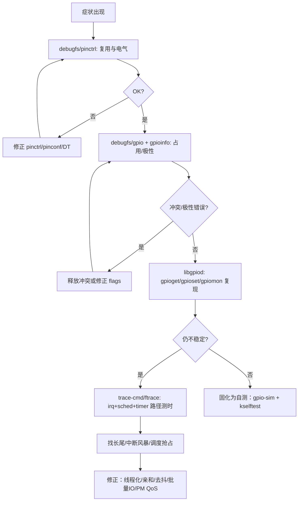
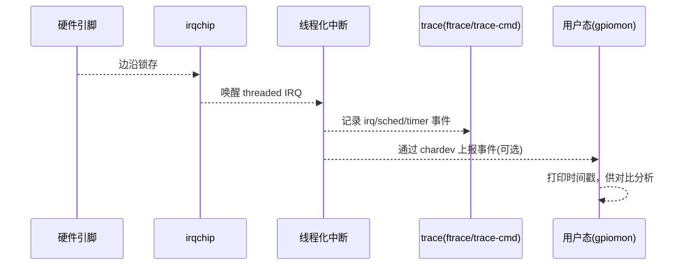
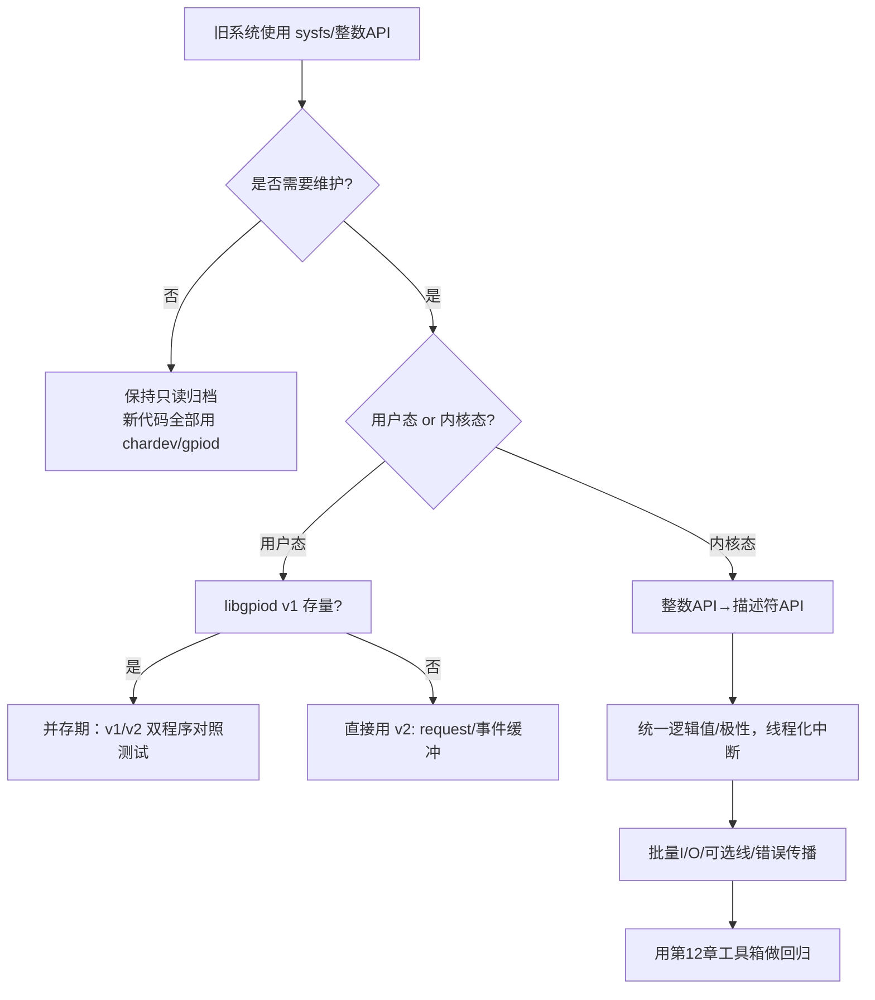
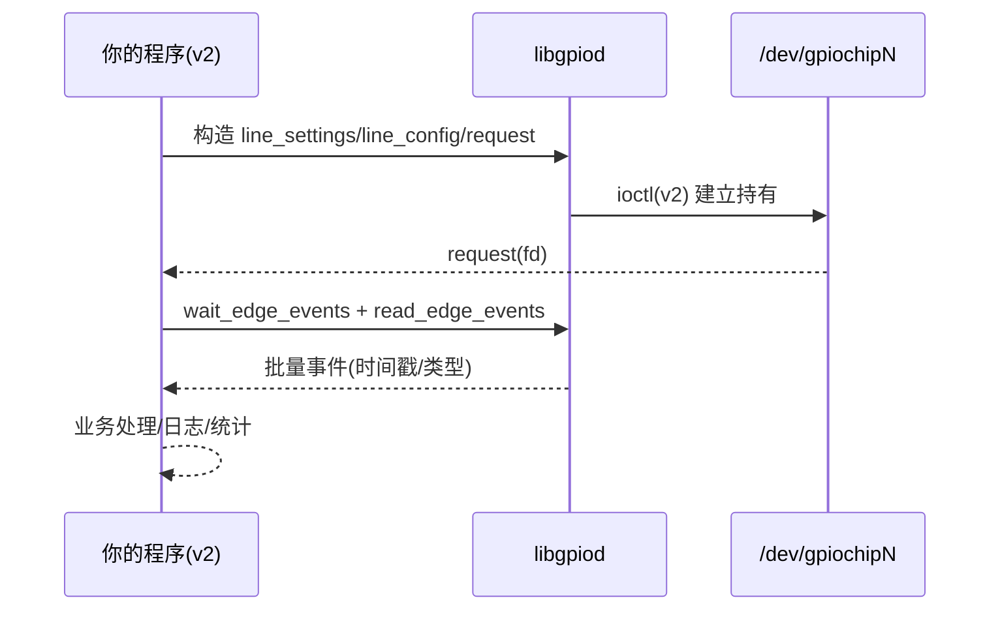
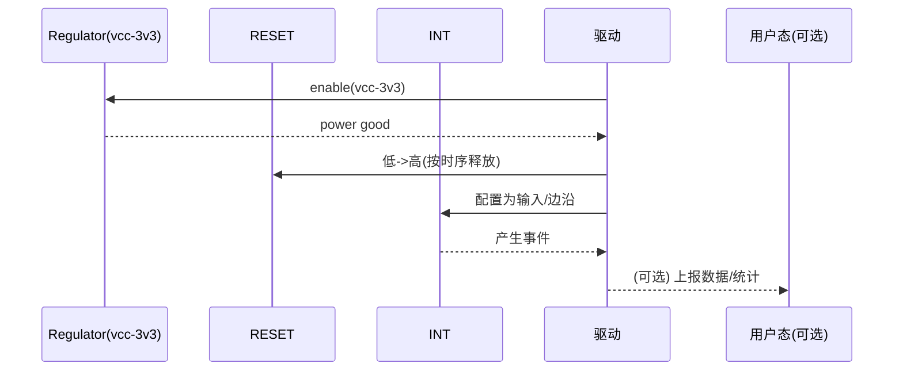
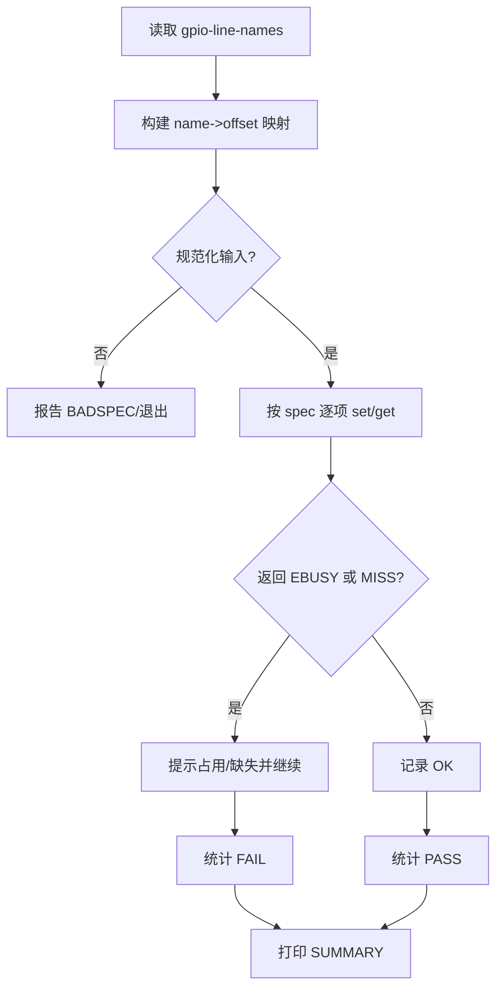
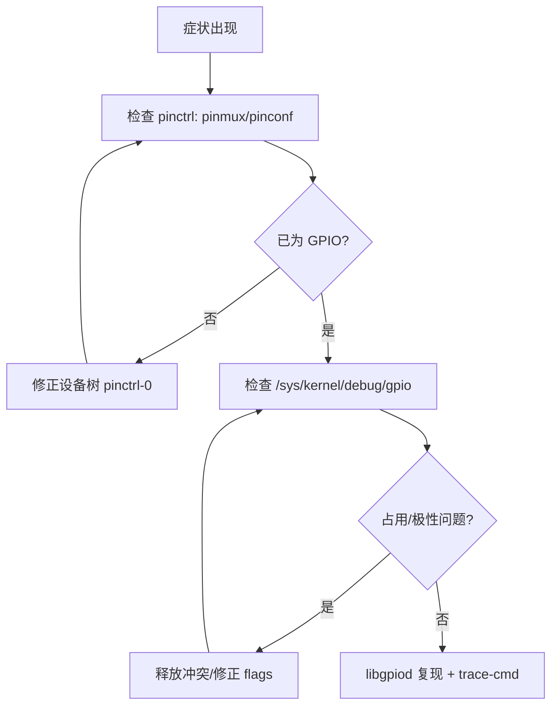
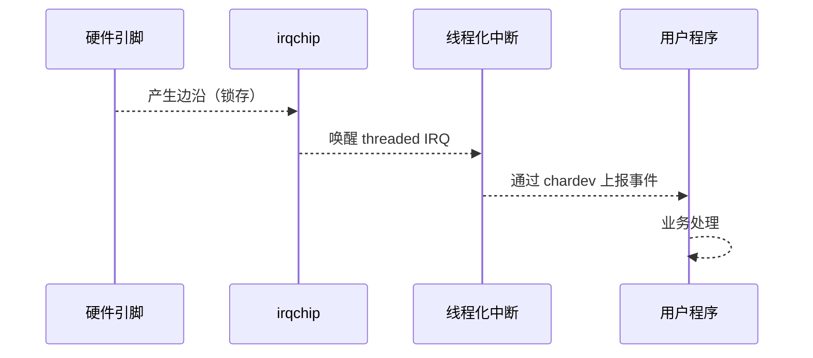

# 第 12 章：调试与自测工具箱

## 12.1 主题引入

**本章要解决的问题：**

- 如何系统地**定位 GPIO 相关故障**：复用不生效、极性错误、占用冲突、边沿“丢/抖”、时序长尾？
- 内核与用户态各有哪些**标配工具面板**？怎样组合它们形成**稳定流程**而不是零散尝试？
- 如何在**不改板子**的情况下做自动化自测（自建 gpiochip、回放事件）？


**为什么重要：**

* GPIO 开发的 80% 问题不是“不会写代码”，而是**多子系统联动**引起的“看不清”。这章给出一套**工程化流程**：

> 先确认 **pinctrl** → 再看 **gpio 占用与极性** → 复现 **事件/中断** → **Trace/Ftrace** 定位长尾 → 用 **自测/仿真** 固化回归。

------

## 12.2 “数据结构视角”：核心调试端口一览（路径与职责）

| 面板 / 文件系统          | 典型路径                                                     | 用途                                         | 何时用               |
| ------------------------ | ------------------------------------------------------------ | -------------------------------------------- | -------------------- |
| **debugfs: pinctrl**     | `/sys/kernel/debug/pinctrl/*/pinmux-pins`、`pinconf-pins`、`pinctrl-maps` | 看“是否复用到 GPIO”“电气配置是否生效”        | 一切 GPIO 失败先看它 |
| **debugfs: gpio**        | `/sys/kernel/debug/gpio`                                     | 全局 gpiochip/line 占用、方向、consumer 名称 | 查 **EBUSY/谁占用**  |
| **tracefs (ftrace)**     | `/sys/kernel/debug/tracing/*`                                | 函数/事件级 Trace，测时与长尾剖析            | 性能、抖动、丢沿     |
| **dynamic_debug**        | `/sys/kernel/debug/dynamic_debug/control`                    | 动态开启 `dev_dbg()`/`pr_debug()`            | 细粒度日志           |
| **/proc/interrupts**     | `/proc/interrupts`                                           | 中断计数与亲和                               | 事件是否到达、绑核   |
| **libgpiod 工具**        | `gpiodetect/gpioinfo/gpioget/gpioset/gpiomon`                | 用户态快速验证/复现                          | 功能/连通性/事件     |
| **kselftest / gpio-sim** | `tools/testing/selftests/gpio/`、`gpio-sim`                  | 自建 gpiochip、自动化回归                    | 无板/CI/复现困难     |

> **检查可用性**：`mount | grep -E 'debugfs|tracefs'`；若无，`sudo mount -t debugfs none /sys/kernel/debug && sudo mount -t tracefs none /sys/kernel/debug/tracing`。

------

## 12.3 开发者视角：最小可用操作清单

### 12.3.1 pinctrl 与 GPIO 快速体检（必做）

```bash
# 1) pinctrl：复用与电气
sudo mount -t debugfs none /sys/kernel/debug
ls /sys/kernel/debug/pinctrl/
cat /sys/kernel/debug/pinctrl/*/pinmux-pins    | grep -E 'GPIO|grp|led|btn'
cat /sys/kernel/debug/pinctrl/*/pinconf-pins  | grep -E 'PULL|DRIVE|SLEW|HYS'

# 2) gpio：占用与极性
sudo cat /sys/kernel/debug/gpio
gpioinfo | sed -n '1,80p'                     # 看 line-name/consumer/active-low
```

**判读要点**

- `pinmux-pins` 若显示仍为 `UART/I2C/...` 等外设功能，而非 `GPIOx_yy`，说明复用没切到 GPIO（回到第 3 章排查）。
- `debugfs/gpio` 的 **consumer 名称** 是“谁在持有”，定位 `EBUSY` 的第一手证据。
- `gpioinfo` 的 `active-low` 反映逻辑极性（来自 `<name>-gpios` flags），可交叉核对。

------

### 12.3.2 dynamic_debug：只在需要时“开口说话”

```bash
# 开启 gpiolib 核心调试日志（所有文件）
echo 'file drivers/gpio/gpiolib*.c +p' | sudo tee /sys/kernel/debug/dynamic_debug/control

# 只开启你的驱动（假设名为 leaf_gpio_irq_demo）
echo 'module leaf_gpio_irq_demo +p' | sudo tee /sys/kernel/debug/dynamic_debug/control

# 关闭
echo 'file drivers/gpio/gpiolib*.c -p' | sudo tee /sys/kernel/debug/dynamic_debug/control
```

> 开关后 `dmesg -w` 实时看日志。动态调试能**精准到文件/函数/模块**，避免“全局 debug 淹没关键信息”。

------

### 12.3.3 tracefs/ftrace：事件与时序测量

**常见事件组**是否可用取决于内核配置，可先浏览：
 `ls /sys/kernel/debug/tracing/events/ | grep -Ei 'gpio|irq|sched|timer'`

**一键记录 10s 的关键事件：**

```bash
sudo trace-cmd record \
  -e irq:* \
  -e sched:sched_switch -e sched:sched_wakeup \
  -e timer:* \
  -e 'gpio:*' \
  sleep 10
sudo trace-cmd report | less
```

**手动 ftrace（function_graph）测路径长尾：**

```bash
cd /sys/kernel/debug/tracing
echo function_graph | sudo tee current_tracer
echo mono_raw       | sudo tee trace_clock
echo 1              | sudo tee events/irq/irq_handler_entry/enable
echo 1              | sudo tee tracing_on
sleep 5
echo 0              | sudo tee tracing_on
cat trace | less
```

> 若没有 `gpio:*` 事件组，依然可用 `function_graph`/`sched`/`irq` 组合，定位 ISR→线程化→业务处理的真实耗时。

------

### 12.3.4 /proc/interrupts 与亲和/优先级

```bash
# 观察计数是否增长
cat /proc/interrupts | grep -i gpio

# 绑核（示例绑到 CPU2，bit2=1 -> 0x4）
echo 4 | sudo tee /proc/irq/<IRQ>/smp_affinity

# 提升线程优先级（用户态监听）
sudo chrt -f 80 taskset -c 2 ./your_user_process
```

------

### 12.3.5 libgpiod 工具：零代码复现

```bash
# 芯片与线信息
gpiodetect
gpioinfo gpiochip0

# 逻辑读/写（-m exit 释放持有）
gpioget gpiochip0 7
gpioset -m exit gpiochip0 7=1

# 监听边沿（按需 --rising/--falling）
gpiomon --rising --falling gpiochip0 5
```

> **冲突提醒**：若线被你的驱动持有，`gpiomon/gpioset` 会 `EBUSY`，用 `gpioinfo` 看 consumer。

------

### 12.3.6 kselftest / gpio-sim（自动化）

> 目标：**无硬件**也能构造 gpiochip 与边沿事件，做回归测试。不同内核版本可用 `gpio-mockup` 或较新的 `gpio-sim`。
>  建议流程（概略）：
>
> 1. 启用并加载仿真模块（例如 `modprobe gpio-sim`）；
> 2. 挂载 configfs：`sudo mount -t configfs none /sys/kernel/config`；
> 3. 在 `/sys/kernel/config/gpio-sim/` 下创建实例与线数；
> 4. 用 **libgpiod** 对新出现的 `/dev/gpiochipN` 做自动化读写/事件测试；
> 5. 清理实例。

检查入口（不同内核可能略有差异）：

```bash
ls /sys/kernel/config/gpio-sim/           # 存在则可直接使用
ls /lib/modules/$(uname -r)/kernel/drivers/gpio | grep -E 'gpio-(sim|mockup)'
```

> **提示**：自测脚本应包含**创建 → 测试 → 清理**的完整生命周期，并在 CI 里跑。若你的内核没有 `gpio-sim`，可采用发行版提供的 **kselftest/gpio** 脚本作为参考基线。

------

## 12.4 用户视角：标准化验证剧本（脚本可复用）

### 12.4.1 “三步走”基本剧本

```bash
# 1) 看芯片/线状态
gpiodetect
gpioinfo gpiochip0 | sed -n '1,50p'

# 2) 读/写/监听
gpioget  gpiochip0 7
gpioset  -m exit gpiochip0 7=1
gpiomon  --rising --falling gpiochip0 5

# 3) 交叉验证 pinctrl（需要 debugfs）
sudo cat /sys/kernel/debug/pinctrl/*/pinmux-pins   | grep -E 'GPIO|grp'
sudo cat /sys/kernel/debug/pinctrl/*/pinconf-pins  | grep -E 'PULL|DRIVE|SLEW'
```

### 12.4.2 复现“丢沿/抖动/卡顿”的剧本

```bash
# 1) 记录关键事件 15s（irq+sched+timer+gpio）
sudo trace-cmd record -e irq:* -e sched:* -e timer:* -e 'gpio:*' sleep 15

# 2) 并行施压（用户态高频读写或业务触发）
stdbuf -oL gpioset -m exit gpiochip0 7=1; sleep 0.05; gpioset -m exit gpiochip0 7=0
# 或你的按键/传感器抖动场景

# 3) 报告与定位
sudo trace-cmd report | less
```

------

## 12.5 可视化图示

### 12.5.1 调试流程（flowchart）



### 12.5.2 事件观测时序（sequenceDiagram）



------

## 12.6 调试与验证（Checklist）

| 现象               | 首查位置                        | 常见原因                  | 对策                                               |
| ------------------ | ------------------------------- | ------------------------- | -------------------------------------------------- |
| `EBUSY` 请求失败   | `debugfs/gpio`、`gpioinfo`      | 线被别的驱动/工具持有     | 释放/换线；为你的驱动起**唯一 consumer 名**        |
| 亮灭或按键逻辑颠倒 | `gpioinfo` 的 active-low        | `<name>-gpios` flags 写反 | 改为 `GPIO_ACTIVE_LOW`（或调整硬件）               |
| 写值无效           | `pinmux-pins`                   | 复用未到 GPIO / 冲突      | 修正 `pinctrl-0` 与 group                          |
| 边沿风暴/抖动      | `trace-cmd report` 事件高频     | 无上拉/下拉，未去抖       | 加硬件上拉/`gpiod_set_debounce`/软件时间窗         |
| 丢沿/长尾          | `trace-cmd report` 显示调度阻塞 | 未线程化/亲和/RT/批量IO   | 使用 **threaded IRQ**；绑核+`SCHED_FIFO`；合并事务 |
| 休眠后异常         | `pinctrl` 的 state 变更         | 未切 sleep/default        | 第 11 章：补全 pinctrl 状态机与 `enable_irq_wake`  |
| 工具不可用         | `/dev/gpiochip*`/权限           | udev 规则/权限不足        | `sudo` 或配置组权限；确认 `GPIO_CDEV`              |

------

## 12.7 小结

- **面板就这几块**：`pinctrl(debugfs)` → `gpio(debugfs)` → `libgpiod 工具` → `tracefs/trace-cmd` → `kselftest/gpio-sim`。
- **遵循流程，而非拍脑袋**：先看复用与电气，再查占用与极性，之后才是事件/时序。
- **把经验固化为脚本**：每修一个问题，就加一条 **自测用例**，让回归可重复。

**一句话总结：**
 👉 **看得见，才能改得对**：用 `debugfs + tracefs + libgpiod` 搭建“可观测”闭环，再用 `gpio-sim/kselftest` 把它变成**可重复的回归**。


------

# 第 13 章：迁移与最佳实践（sysfs→chardev、libgpiod v1→v2、整数 API→描述符 API）

## 13.1 主题引入

**本章要解决的问题：**

- 旧项目还在用 **sysfs GPIO** 或 **整数 GPIO API**，如何平滑迁到 **字符设备（/dev/gpiochipN）+ 描述符 API**？
- 用户态从 **libgpiod v1** 升级到 **v2** 要改哪些代码与运行脚本？
- 迁移时如何验证等效、把坑填平（权限、极性、占用、去抖、时序）？


**为什么重要：**

- **sysfs GPIO** 已被官方长期标记为过时，现代内核（≥5.10，含 6.1 LTS）以 **chardev + libgpiod** 为主线。
- **整数 API**（`gpio_request()`/`gpio_set_value()`）在新代码中不再推荐；**描述符 API**（`gpiod_*`）具备更好的设备树绑定、一致的极性语义与资源管理（`devm_*`）。

------

## 13.2 时间线与迁移范围（简明）

- **内核层**：整数 API → **描述符 API（gpiod_…）**。
- **用户层**：sysfs → **chardev**；脚本/工具 → **libgpiod-tools**；C 代码 → **libgpiod 2.x**。
- **配套**：设备树 `<name>-gpios` 保持不变；但强烈建议把**电气属性**放在 **pinctrl/pinconf**（见第 3 章、第 8 章）。

------

## 13.3 总览对照（一页表）

| 目标          | 旧方法                                                       | 新方法（推荐）                                       | 迁移要点                                         |
| ------------- | ------------------------------------------------------------ | ---------------------------------------------------- | ------------------------------------------------ |
| **脚本/运维** | `/sys/class/gpio/{export,direction,value}`                   | `gpiodetect/gpioinfo/gpioget/gpioset/gpiomon`        | chardev 为“**持有**”模型；`gpioset -m exit` 释放 |
| **用户态 C**  | libgpiod **v1**：`gpiod_line_get_value()`、`gpiod_line_request_input()` | libgpiod **v2**：`line_settings/line_config/request` | **索引 ≠ 偏移**；事件使用 `edge_event_buffer`    |
| **内核 C**    | `gpio_request()`、`gpio_direction_output()`、`gpio_set_value()` | `devm_gpiod_get()`、`gpiod_set_value[_cansleep]()`   | 统一**逻辑值**；扩展器必须 `_cansleep`           |

------

## 13.4 生产脚本：sysfs → libgpiod 工具

### 13.4.1 常见操作映射

| 需求        | sysfs（旧）                                  | libgpiod 工具（新）                       |
| ----------- | -------------------------------------------- | ----------------------------------------- |
| 导出 7 号线 | `echo 7 > /sys/class/gpio/export`            | **无需导出**                              |
| 设为输出    | `echo out > /sys/class/gpio/gpio7/direction` | `gpioset gpiochip0 7=1`（持有到进程退出） |
| 写 0/1      | `echo 0 > /sys/class/gpio/gpio7/value`       | `gpioset -m exit gpiochip0 7=0/1`         |
| 读值        | `cat /sys/class/gpio/gpio7/value`            | `gpioget gpiochip0 7`                     |
| 监听边沿    | 轮询 `value` + `edge`                        | `gpiomon --rising --falling gpiochip0 5`  |

> **注意**：`gpioset` 默认**保持持有**（进程在则电平保持）。需要“写完即走”请用 `-m exit`。

### 13.4.2 一键替换脚本（示例）

```bash
#!/bin/sh
# legacy: ./led.sh gpiochip0 3 on|off
chip="$1"; off="$2"; cmd="$3"
case "$cmd" in
  on)  gpioset -m exit "$chip" "$off"=1 ;;
  off) gpioset -m exit "$chip" "$off"=0 ;;
  *)   echo "usage: $0 <chip> <offset> on|off" ;;
esac
```

------

## 13.5 用户态 C：libgpiod v1 → v2（对照与示例）

### 13.5.1 API 心智模型变化

- **v1**：以 **line** 为中心，`gpiod_chip` + `gpiod_line` + `request_input/output`。
- **v2**：以 **request** 为中心，`line_settings` → `line_config` → `line_request`，**一次持有多线**、事件缓冲更规范。
- **偏移 vs 索引**：在 v2 中，读写 API 以 **“请求内索引”**（0..N-1）为主，不是原始 offset。

### 13.5.2 v1 读取（旧）

```c
/* build: cc -O2 -o v1get v1get.c -lgpiod */
#include <gpiod.h>
#include <stdio.h>
int main() {
    struct gpiod_chip *c = gpiod_chip_open_by_name("gpiochip0");
    struct gpiod_line *l = gpiod_chip_get_line(c, 5);
    gpiod_line_request_input(l, "v1get");
    int v = gpiod_line_get_value(l);
    printf("%d\n", v);
    gpiod_line_release(l);
    gpiod_chip_close(c);
    return 0;
}
```

### 13.5.3 v2 读取（新，推荐）

```c
/* build: cc -O2 -o v2get v2get.c -lgpiod */
#include <gpiod.h>
#include <stdio.h>

int main() {
    struct gpiod_chip *chip = gpiod_chip_open_by_name("gpiochip0");
    unsigned int offsets[] = {5};

    struct gpiod_line_settings *ls = gpiod_line_settings_new();
    gpiod_line_settings_set_direction(ls, GPIOD_LINE_DIRECTION_INPUT);

    struct gpiod_line_config *lc = gpiod_line_config_new();
    gpiod_line_config_add_line_settings(lc, offsets, 1, ls);

    struct gpiod_request_config *rc = gpiod_request_config_new();
    gpiod_request_config_set_consumer(rc, "v2get");

    struct gpiod_line_request *req = gpiod_chip_request_lines(chip, rc, lc);

    int v = gpiod_line_request_get_value(req, 0); /* 索引0对应offsets[0] */
    printf("%d\n", v);

    gpiod_line_request_release(req);
    gpiod_request_config_free(rc);
    gpiod_line_config_free(lc);
    gpiod_line_settings_free(ls);
    gpiod_chip_close(chip);
    return 0;
}
```

### 13.5.4 v2 边沿事件（最小）

```c
/* build: cc -O2 -o v2evt v2evt.c -lgpiod */
#include <gpiod.h>
#include <stdio.h>
int main() {
    struct gpiod_chip *chip = gpiod_chip_open_by_name("gpiochip0");
    unsigned int offsets[] = {5};
    struct gpiod_line_settings *ls = gpiod_line_settings_new();
    gpiod_line_settings_set_direction(ls, GPIOD_LINE_DIRECTION_INPUT);
    gpiod_line_settings_set_edge_detection(ls, GPIOD_LINE_EDGE_BOTH);
    struct gpiod_line_config *lc = gpiod_line_config_new();
    gpiod_line_config_add_line_settings(lc, offsets, 1, ls);
    struct gpiod_request_config *rc = gpiod_request_config_new();
    gpiod_request_config_set_consumer(rc, "v2evt");
    struct gpiod_line_request *req = gpiod_chip_request_lines(chip, rc, lc);
    struct gpiod_edge_event_buffer *buf = gpiod_edge_event_buffer_new(16);

    while (1) {
        int n = gpiod_line_request_wait_edge_events(req, NULL);
        if (n <= 0) continue;
        n = gpiod_line_request_read_edge_events(req, buf, 16);
        for (int i=0;i<n;i++) {
            const struct gpiod_edge_event *e = gpiod_edge_event_buffer_get_event(buf, i);
            printf("%s\n", gpiod_edge_event_get_event_type(e)==GPIOD_EDGE_EVENT_RISING_EDGE?"rising":"falling");
        }
    }
}
```

> **编译**：`pkg-config --cflags --libs libgpiod`；迁移期可同时保留 v1/v2 两套程序，通过 pkg-config 的版本选择在 CI 中双跑对比。

------

## 13.6 内核驱动：整数 API → 描述符 API

### 13.6.1 对照表

| 整数 API（旧）                | 描述符 API（新，推荐）                                       | 备注                                     |
| ----------------------------- | ------------------------------------------------------------ | ---------------------------------------- |
| `gpio_request(n, "name")`     | `devm_gpiod_get(dev, "func", flags)`                         | 从 `<func>-gpios` 解析；`devm_` 自动释放 |
| `gpio_direction_output(n, v)` | `gpiod_direction_output(desc, v)` / `devm_gpiod_get(dev, "func", GPIOD_OUT_LOW/HIGH)` | 推荐一次性在 `get` 指定方向/初始值       |
| `gpio_set_value(n, v)`        | `gpiod_set_value(desc, v)` / `gpiod_set_value_cansleep(desc, v)` | 扩展器必须 `_cansleep`                   |
| `gpio_get_value(n)`           | `gpiod_get_value(desc)` / `_cansleep`                        | 逻辑值自动考虑 active-low                |
| DT 手撸极性                   | `<&gpioX pin GPIO_ACTIVE_LOW>`                               | 用 **flags**，驱动侧少写 `!`             |
| `gpio_free(n)`                | `devm_…` 自动                                                | 资源安全                                 |

### 13.6.2 迁移示例（前后对比）

**旧（简化示意）**

```c
int gpio = 7;
gpio_request(gpio, "reset");
gpio_direction_output(gpio, 0);
gpio_set_value(gpio, 1);
```

**新（推荐写法）**

```c
struct gpio_desc *g_reset;
g_reset = devm_gpiod_get(dev, "reset", GPIOD_OUT_LOW); /* 从 reset-gpios 解析 */
if (IS_ERR(g_reset)) return PTR_ERR(g_reset);
gpiod_set_value_cansleep(g_reset, 1);
```

> **最佳实践**：一次 `devm_gpiod_get()` 就把**方向与安全初值**定好；把所有访问放进**线程上下文**（结合 4.8 节与第 6、9、10 章）。

### 13.6.3 可选/多线/索引

```c
/* 可选线：没有就跳过相关逻辑 */
struct gpio_desc *g_irq = devm_gpiod_get_optional(dev, "intr", GPIOD_IN);
if (IS_ERR(g_irq)) return PTR_ERR(g_irq);
if (g_irq) { /* 注册中断等 */ }

/* 多线：按索引取 */
struct gpio_desc *g_ctrl[2];
for (int i=0;i<2;i++)
    g_ctrl[i] = devm_gpiod_get_index(dev, "ctrl", i, GPIOD_OUT_LOW);
```

------

## 13.7 权限与部署：从 root-only 到 udev 规则

### 13.7.1 udev 规则（示例）

```
# /etc/udev/rules.d/99-gpio.rules
SUBSYSTEM=="gpio", GROUP="gpio", MODE="0660"
KERNEL=="gpiochip*", GROUP="gpio", MODE="0660"
sudo groupadd -f gpio
sudo usermod -aG gpio $USER
sudo udevadm control --reload && sudo udevadm trigger
```

> 之后无需 `sudo` 即可运行 `gpioget/gpioset/gpiomon`（当前用户需重新登录生效）。

### 13.7.2 容器与最小 rootfs

- 把 **libgpiod-tools** 和运行期依赖打入镜像；
- 以 `--device=/dev/gpiochip0`（或整组 `--device-cgroup-rule`）方式映射；
- 保持容器内的 **gid=“gpio”** 与宿主匹配。

------

## 13.8 迁移验证剧本（工程化）

1. **等效性**：对每根线做 **读/写/事件**三件套，旧→新对比。
2. **极性**：确认 `gpiod_is_active_low(desc)` 与 `gpioinfo` 标记一致。
3. **占用**：新代码运行时用 `gpioinfo` 检查 **consumer 名称**是否正确、是否释放。
4. **扩展器**：确认所有访问都在**线程上下文**，`dmesg` 无 “sleeping function … from invalid context”。
5. **性能**：用第 10 章方法（trace-cmd/cyclictest）比较迁移前后**长尾**。
6. **脚本替换**：把常用 sysfs 操作逐条替换为 libgpiod 工具，并纳入生产测试清单。

------

## 13.9 可视化图示

### 13.9.1 迁移决策（flowchart）



### 13.9.2 用户态事件管线（sequenceDiagram）



------

## 13.10 常见问题与修复

| 现象                      | 可能原因                              | 修复                                                         |
| ------------------------- | ------------------------------------- | ------------------------------------------------------------ |
| `Device or resource busy` | 线被其他 consumer 持有                | `gpioinfo` 定位，改线或释放                                  |
| 逻辑颠倒/“亮灭反”         | flags 未用 `GPIO_ACTIVE_*` 或滥用 raw | 用**逻辑接口**，修正 `<name>-gpios`                          |
| `_cansleep` 告警          | 在原子/上半部访问扩展器               | 改 **threaded IRQ** 或 workqueue                             |
| 事件丢失                  | 缓冲太小/调度长尾                     | `edge_event_buffer` 放大、RT/FIFO、绑核                      |
| 权限拒绝                  | /dev 权限不足                         | 配置 udev 规则 + 组权限                                      |
| v1/v2 混淆                | 链接到旧 lib                          | 用 `pkg-config --modversion libgpiod` 校验，或静态链接目标版本 |

------

## 13.11 最佳实践（Checklist）

- **一律新写用**：`/dev/gpiochipN + libgpiod 2.x`（用户态）、`gpiod_*` 描述符 API（内核态）。
- **一次性设置**：`devm_gpiod_get(..., GPIOD_OUT_LOW/HIGH)`；不在多处散落方向切换。
- **逻辑值优先**：不要手写 `!`，让 `active-low` 由框架处理。
- **线程化与 `_cansleep`**：扩展器必须在线程上下文访问。
- **批量请求**：同类线合并持有、合并写入，降低系统调用与总线开销。
- **工具闭环**：`gpioinfo/gpioget/gpioset/gpiomon` + 第 12 章 trace 工具箱。
- **CI 回归**：没有板也能用 **gpio-sim/kselftest** 跑用例。
- **权限侧写**：在镜像/容器里预置 udev 规则与 `gpio` 组。

**一句话总结：**
 👉 **迁移不是“翻译 API”，而是“换范式”**：把 **“导出+文件写入”** 变为 **“请求+持有+事件/批量”**，把 **“整数号”** 变为 **“描述符+语义”**，把**极性/电气**交给 **DT + pinctrl**，把**时序与稳定性**交给 **线程化+批量 I/O+QoS**。


------

# 第 14 章：案例集与版型（可直接复用）

## 14.1 主题引入

**本章要解决的问题：**
 把前 3–13 章的方法论落到“能拷贝即用”的模板：**LED/按键/复位钩子**、**传感器电源+复位+唤醒**、**gpio-mux 复用切换**、**生产测试脚本**。每个模板都给出**设备树 + 代码（如需）+ 用户验证 + 调试要点**。

**为什么重要：**
 工程落地最需要“**版型**”：结构规范、边界清晰、便于移植。模板能显著减少**反复踩坑与返工**。

------

## 14.2 数据结构视角（模板中的共性）

| 领域    | 关键对象                                      | 在模板中的体现                                     |
| ------- | --------------------------------------------- | -------------------------------------------------- |
| pinctrl | `pinctrl_state`（default/sleep）              | 每个外设给出 default/sleep 两态，休眠安全          |
| gpiolib | `struct gpio_desc`（required/optional/index） | 驱动端统一用 `devm_gpiod_get*`                     |
| 中断    | `request_threaded_irq()`                      | 需要事件的模板全部线程化                           |
| 电源    | regulator 框架                                | 由 `regulator-fixed` 提供使能；消费者用 `*-supply` |
| 用户态  | libgpiod 2.x                                  | `gpioget/gpioset/gpiomon` 验证闭环                 |

------

## 14.3 版型 A：板载 LED + 按键 + “复位钩子”最小实现

### 14.3.1 设备树（LED + 按键 + 复位钩子）

```dts
/* 1) pinctrl：给 LED/BTN/RESET 各自分组（i.MX6ULL 示例） */
&pinctrl {
    pinctrl_led_default: led_default {
        fsl,pins = <MX6UL_PAD_GPIO1_IO03__GPIO1_IO03 0x10B0>;
    };
    pinctrl_btn_default: btn_default {
        fsl,pins = <MX6UL_PAD_GPIO1_IO05__GPIO1_IO05 0x10B1>;
    };
    pinctrl_rst_default: rst_default {
        fsl,pins = <MX6UL_PAD_GPIO1_IO07__GPIO1_IO07 0x10B0>;
    };
}

/* 2) LED：gpio-leds 子模块 */
leds {
    compatible = "gpio-leds";
    pinctrl-names = "default";
    pinctrl-0 = <&pinctrl_led_default>;

    led_status_node {
        gpios = <&gpio1 3 GPIO_ACTIVE_LOW>;
        default-state = "off";
        linux,default-trigger = "heartbeat";
        function = "status";
        color = <LED_COLOR_ID_GREEN>;
    };
};

/* 3) 按键：gpio-keys 子模块 */
gpio_keys: gpio-keys {
    compatible = "gpio-keys";
    pinctrl-names = "default";
    pinctrl-0 = <&pinctrl_btn_default>;

    button_enter: button@0 {
        gpios = <&gpio1 5 GPIO_ACTIVE_LOW>;
        linux,code = <KEY_ENTER>;
        label = "user-enter";
        debounce-interval = <10>;
        wakeup-source;
    };
};

/* 4) 复位钩子：提供一个专用 platform 设备，给驱动读取 reset-gpios */
reset-hook@0 {
    compatible = "leaf,reset-hook";
    pinctrl-names = "default";
    pinctrl-0 = <&pinctrl_rst_default>;
    reset-gpios = <&gpio1 7 GPIO_ACTIVE_HIGH>;
    status = "okay";
};
```

### 14.3.2 复位钩子最小驱动（可编可跑）

> 功能：在 `/sys/bus/platform/devices/leaf-reset-hook/` 暴露 `reset_now` 与 `pulse_us`，用于板级“短按复位线”。

```c
// drivers/misc/leaf_reset_hook.c
// SPDX-License-Identifier: GPL-2.0
#include <linux/module.h>
#include <linux/platform_device.h>
#include <linux/gpio/consumer.h>
#include <linux/delay.h>

struct reset_ctx {
    struct device *dev;
    struct gpio_desc *g_rst;
    unsigned int pulse_us;
};

static ssize_t pulse_us_show(struct device *d, struct device_attribute *a, char *buf)
{
    struct reset_ctx *c = dev_get_drvdata(d);
    return sysfs_emit(buf, "%u\n", c->pulse_us);
}
static ssize_t pulse_us_store(struct device *d, struct device_attribute *a,
                              const char *buf, size_t len)
{
    struct reset_ctx *c = dev_get_drvdata(d);
    unsigned int v;
    if (kstrtouint(buf, 0, &v) == 0) c->pulse_us = v;
    return len;
}

static ssize_t reset_now_store(struct device *d, struct device_attribute *a,
                               const char *buf, size_t len)
{
    struct reset_ctx *c = dev_get_drvdata(d);
    if (!c->g_rst) return -ENODEV;
    /* 安全：用户态写 sysfs 在可睡眠上下文，使用 *_cansleep */
    gpiod_set_value_cansleep(c->g_rst, 1);
    if (c->pulse_us) udelay(c->pulse_us);
    gpiod_set_value_cansleep(c->g_rst, 0);
    dev_info(c->dev, "reset pulse %u us\n", c->pulse_us);
    return len;
}

static DEVICE_ATTR_RW(pulse_us);
static DEVICE_ATTR_WO(reset_now);

static struct attribute *attrs[] = {
    &dev_attr_pulse_us.attr,
    &dev_attr_reset_now.attr,
    NULL,
};
static const struct attribute_group grp = { .attrs = attrs };

static int reset_probe(struct platform_device *pdev)
{
    struct device *dev = &pdev->dev;
    struct reset_ctx *c = devm_kzalloc(dev, sizeof(*c), GFP_KERNEL);
    if (!c) return -ENOMEM;
    platform_set_drvdata(pdev, c);
    c->dev = dev;
    c->pulse_us = 10000; /* 默认 10ms */

    c->g_rst = devm_gpiod_get(dev, "reset", GPIOD_OUT_LOW);
    if (IS_ERR(c->g_rst)) return PTR_ERR(c->g_rst);

    return sysfs_create_group(&dev->kobj, &grp);
}

static int reset_remove(struct platform_device *pdev)
{
    sysfs_remove_group(&pdev->dev.kobj, &grp);
    return 0;
}

static const struct of_device_id of_match[] = {
    { .compatible = "leaf,reset-hook" }, { }
};
MODULE_DEVICE_TABLE(of, of_match);

static struct platform_driver drv = {
    .probe = reset_probe,
    .remove = reset_remove,
    .driver = { .name = "leaf-reset-hook", .of_match_table = of_match },
};
module_platform_driver(drv);

MODULE_LICENSE("GPL");
MODULE_AUTHOR("Leaf Book");
MODULE_DESCRIPTION("Board reset hook via GPIO");
```

**Kbuild**

```make
obj-m += leaf_reset_hook.o
# make -C /path/to/linux-6.1 M=$(PWD) modules
```

### 14.3.3 用户验证

```bash
# LED：查看/控制
ls /sys/class/leds/
cat /sys/class/leds/status:green:status/trigger
echo none | sudo tee /sys/class/leds/status:green:status/trigger
echo 1    | sudo tee /sys/class/leds/status:green:status/brightness

# 按键：监听 input 事件
sudo evtest /dev/input/eventX

# 复位钩子：触发一次 8ms 脉冲
cd /sys/bus/platform/devices/leaf-reset-hook/
echo 8000 | sudo tee pulse_us
echo 1    | sudo tee reset_now
```

### 14.3.4 调试 Checklist

- LED 亮灭颠倒 → 检查 `GPIO_ACTIVE_LOW/HIGH`。
- 按键抖动 → 用 `debounce-interval` 或控制器 `set_debounce`。
- `reset_now` 无效 → 查 `debugfs/pinctrl` 是否复用为 GPIO；看 `gpioinfo` consumer。

------

## 14.4 版型 B：传感器（VDD 使能 + 复位 + 唤醒按钮）组合

### 14.4.1 设备树（regulator-fixed + 复位 + 唤醒）

```dts
/* 电源：用 GPIO 使能 3v3，供传感器引用 */
reg_3v3: regulator-3v3 {
    compatible = "regulator-fixed";
    regulator-name = "vcc-3v3";
    regulator-boot-on;
    enable-active-high;
    gpio = <&gpio2 7 GPIO_ACTIVE_HIGH>;
};

&pinctrl {
    pinctrl_snsr_default: snsr_default {
        fsl,pins = <
            MX6UL_PAD_GPIO1_IO10__GPIO1_IO10 0x10B0  /* RESET# */
            MX6UL_PAD_GPIO1_IO11__GPIO1_IO11 0x10B1  /* DRDY/INT */
        >;
    };
    pinctrl_snsr_sleep: snsr_sleep {
        fsl,pins = <
            MX6UL_PAD_GPIO1_IO10__GPIO1_IO10 0x10A0
            MX6UL_PAD_GPIO1_IO11__GPIO1_IO11 0x10A0
        >;
    };
}

/* 传感器节点（举例） */
sensor@1a {
    compatible = "leaf,my-sensor";
    reg = <0x1a>;
    pinctrl-names = "default", "sleep";
    pinctrl-0 = <&pinctrl_snsr_default>;
    pinctrl-1 = <&pinctrl_snsr_sleep>;

    vdd-supply = <&reg_3v3>;                 /* 电源依赖 */
    reset-gpios = <&gpio1 10 GPIO_ACTIVE_LOW>;
    intr-gpios  = <&gpio1 11 GPIO_ACTIVE_LOW>;
    wakeup-source;                            /* 可唤醒 */
    status = "okay";
};
```

### 14.4.2 最小驱动逻辑（PM + 线程化 IRQ）

```c
// 片段：probe/PM/IRQ 主干
struct snsr {
    struct device *dev;
    struct gpio_desc *g_rst, *g_int;
    struct pinctrl *pctl;
    struct pinctrl_state *st_def, *st_slp;
    int irq;
};

static irqreturn_t snsr_thread(int irq, void *data)
{
    struct snsr *s = data;
    int v = gpiod_get_value_cansleep(s->g_int); /* 线程上下文，安全 */
    if (v < 0) return IRQ_HANDLED;
    /* TODO: 读取 I2C/SPI 状态寄存器，清中断/上报数据 */
    return IRQ_HANDLED;
}

static int snsr_probe(struct platform_device *pdev)
{
    struct device *dev = &pdev->dev;
    struct snsr *s = devm_kzalloc(dev, sizeof(*s), GFP_KERNEL);
    int ret;

    platform_set_drvdata(pdev, s);
    s->dev = dev;

    s->pctl = devm_pinctrl_get(dev);
    s->st_def = pinctrl_lookup_state(s->pctl, "default");
    s->st_slp = pinctrl_lookup_state(s->pctl, "sleep");
    if (!IS_ERR_OR_NULL(s->st_def)) pinctrl_select_state(s->pctl, s->st_def);

    s->g_rst = devm_gpiod_get(dev, "reset", GPIOD_OUT_HIGH); /* 低有效，先释放复位 */
    if (IS_ERR(s->g_rst)) return PTR_ERR(s->g_rst);
    s->g_int = devm_gpiod_get_optional(dev, "intr", GPIOD_IN);
    if (IS_ERR(s->g_int)) return PTR_ERR(s->g_int);

    /* 上电时序：regulator 框架会由消费者自动申请；如需延时，使用 usleep_range */
    usleep_range(1000, 2000);
    gpiod_set_value_cansleep(s->g_rst, 0); /* 断言复位 */
    usleep_range(1000, 2000);
    gpiod_set_value_cansleep(s->g_rst, 1); /* 释放复位 */

    if (s->g_int) {
        s->irq = gpiod_to_irq(s->g_int);
        irq_set_irq_type(s->irq, IRQ_TYPE_EDGE_BOTH);
        ret = devm_request_threaded_irq(dev, s->irq, NULL, snsr_thread,
              IRQF_ONESHOT | IRQF_TRIGGER_RISING | IRQF_TRIGGER_FALLING,
              "snsr-int", s);
        if (ret) return ret;
        device_init_wakeup(dev, true);
    }
    dev_info(dev, "sensor ready\n");
    return 0;
}

static int __maybe_unused snsr_suspend(struct device *dev)
{
    struct snsr *s = dev_get_drvdata(dev);
    if (device_may_wakeup(dev) && s->irq > 0)
        enable_irq_wake(s->irq);
    if (!IS_ERR_OR_NULL(s->st_slp)) pinctrl_select_state(s->pctl, s->st_slp);
    return 0;
}
static int __maybe_unused snsr_resume(struct device *dev)
{
    struct snsr *s = dev_get_drvdata(dev);
    if (device_may_wakeup(dev) && s->irq > 0)
        disable_irq_wake(s->irq);
    if (!IS_ERR_OR_NULL(s->st_def)) pinctrl_select_state(s->pctl, s->st_def);
    return 0;
}
```

### 14.4.3 用户验证

```bash
# 供电：regulator 关系
sudo cat /sys/kernel/debug/regulator/regulator_summary | grep -E 'vcc-3v3|sensor'

# 复位线：快速翻转测试（需要你的驱动暴露 sysfs 或 debug 接口）
# 中断：是否计数
cat /proc/interrupts | grep -i snsr-int
```

### 14.4.4 调试 Checklist

- 上电后无响应 → 核对 **时序**（电源→复位→配置），必要时在驱动里留 `dev_dbg()` 打点。
- 休眠唤不醒 → 检查 `wakeup-source` + `enable_irq_wake()`。
- 中断风暴 → 加 `gpiod_set_debounce()` 或软件时间窗（第 6、10 章）。

------

## 14.5 版型 C：gpio-mux 复用切换（两根位选→四路通道）

> 目标：用两根 GPIO 选择一个外部多路器的四个通道（`00/01/10/11`）。提供一个极简 **policy 驱动**，通过 sysfs 设置通道。

### 14.5.1 设备树

```dts
&pinctrl {
    pinctrl_mux_default: mux_default {
        fsl,pins = <
            MX6UL_PAD_GPIO1_IO12__GPIO1_IO12 0x10B0  /* SEL0 */
            MX6UL_PAD_GPIO1_IO13__GPIO1_IO13 0x10B0  /* SEL1 */
        >;
    };
}

mux4@0 {
    compatible = "leaf,gpio-mux4";
    pinctrl-names = "default";
    pinctrl-0 = <&pinctrl_mux_default>;
    sel-gpios = <&gpio1 12 GPIO_ACTIVE_HIGH>,
                <&gpio1 13 GPIO_ACTIVE_HIGH>;  /* 两根位选，按索引 0/1 取 */
    idle-state = <0>;                           /* 空闲态 = 00 */
    status = "okay";
};
```

### 14.5.2 极简 policy 驱动（sysfs: `channel`）

```c
// drivers/misc/leaf_gpio_mux4.c
// SPDX-License-Identifier: GPL-2.0
#include <linux/module.h>
#include <linux/platform_device.h>
#include <linux/gpio/consumer.h>

struct mux4 {
    struct device *dev;
    struct gpio_desc *sel[2];
    int chan;     /* 0..3 */
    int idle;     /* 空闲态 */
};

static int mux4_apply(struct mux4 *m, int ch)
{
    if (ch < 0 || ch > 3) return -EINVAL;
    gpiod_set_value_cansleep(m->sel[0], (ch >> 0) & 1);
    gpiod_set_value_cansleep(m->sel[1], (ch >> 1) & 1);
    m->chan = ch;
    return 0;
}

static ssize_t channel_show(struct device *d, struct device_attribute *a, char *buf)
{
    struct mux4 *m = dev_get_drvdata(d);
    return sysfs_emit(buf, "%d\n", m->chan);
}
static ssize_t channel_store(struct device *d, struct device_attribute *a,
                             const char *buf, size_t len)
{
    struct mux4 *m = dev_get_drvdata(d);
    int ch;
    if (kstrtoint(buf, 0, &ch) == 0) mux4_apply(m, ch);
    return len;
}
static DEVICE_ATTR_RW(channel);

static int mux4_probe(struct platform_device *pdev)
{
    struct device *dev = &pdev->dev;
    struct mux4 *m = devm_kzalloc(dev, sizeof(*m), GFP_KERNEL);
    int ret;
    platform_set_drvdata(pdev, m);
    m->dev = dev;

    for (int i = 0; i < 2; i++) {
        m->sel[i] = devm_gpiod_get_index(dev, "sel", i, GPIOD_OUT_LOW);
        if (IS_ERR(m->sel[i])) return PTR_ERR(m->sel[i]);
    }
    device_property_read_u32(dev, "idle-state", &m->idle);
    ret = mux4_apply(m, m->idle);
    if (ret) return ret;

    return device_create_file(dev, &dev_attr_channel);
}

static int mux4_remove(struct platform_device *pdev)
{
    struct mux4 *m = platform_get_drvdata(pdev);
    mux4_apply(m, m->idle);
    device_remove_file(&pdev->dev, &dev_attr_channel);
    return 0;
}

static const struct of_device_id of_match[] = {
    { .compatible = "leaf,gpio-mux4" }, { }
};
MODULE_DEVICE_TABLE(of, of_match);

static struct platform_driver drv = {
    .probe = mux4_probe,
    .remove = mux4_remove,
    .driver = { .name = "leaf-gpio-mux4", .of_match_table = of_match },
};
module_platform_driver(drv);

MODULE_LICENSE("GPL");
MODULE_DESCRIPTION("GPIO 2-bit mux policy");
```

### 14.5.3 用户验证

```bash
# 切换通道
cd /sys/bus/platform/devices/leaf-gpio-mux4/
cat channel
echo 2 | sudo tee channel     # SEL1:SEL0 = 1:0

# 结合仪器/业务数据验证通道切换是否生效
```

### 14.5.4 调试 Checklist

- “通道对不上” → 核对硬件位权（SEL0/SEL1 接线是否与 0/1 对应）。
- 休眠唤醒后乱序 → 在驱动 `suspend/resume` 中恢复 `idle-state`（可按第 11 章范式扩展）。

------

## 14.6 版型 D：生产测试脚本（零侵入，依赖 line-names）

> 目标：在**不修改驱动**的前提下，基于 **`gpio-line-names`** 做快速连通性测试。
>  假设已在 provider 节点写入：`gpio-line-names = "LED_STAT","BTN_USER","MODE_SW","RF_EN", ...;`

### 14.6.1 脚本（可直接用）

```bash
#!/usr/bin/env bash
# file: gpci.sh  (GPIO Production Check - i/o)
# 用法: ./gpci.sh gpiochip0 LED_STAT:out=1 RF_EN:out=0 BTN_USER:in
set -euo pipefail
chip="${1:-gpiochip0}"; shift || true

mapfile -t lines < <(gpioinfo "$chip" | awk -F: '/line/ {gsub(/^[ ]+|[ ]+$/,"",$2); print $2}')
# 生成 name -> offset 映射
declare -A idx; i=0
for nm in "${lines[@]}"; do idx["$nm"]="$i"; ((i++)); done

pass=0; fail=0
for spec in "$@"; do
  name="${spec%%:*}"; rest="${spec#*:}"
  off="${idx[$name]:-__NA__}"
  if [["$off"_==_"_NA_"]]; then echo "MISS:$name"; ((fail++)); continue; fi

  if [["$rest"_=~_^out=(0|1)$ ]]; then
      v="${BASH_REMATCH[1]}"
      gpioset -m exit "$chip" "$off"="$v" || { echo "FAIL:set $name"; ((fail++)); continue; }
      echo "OK:set $name=$v (offset $off)"
      ((pass++))
  elif [["$rest"_==_"in"]]; then
      val=$(gpioget "$chip" "$off" || echo "E")
      [["$val"_==_"E"]] && { echo "FAIL:get $name"; ((fail++)); continue; }
      echo "OK:get $name=$val (offset $off)"
      ((pass++))
  else
      echo "BADSPEC:$spec"; ((fail++))
  fi
done
echo "SUMMARY: PASS=$pass FAIL=$fail"
[[$fail_-eq_0]] || exit 1
```

**运行示例**

```bash
chmod +x gpci.sh
./gpci.sh gpiochip0 LED_STAT:out=1 RF_EN:out=0 BTN_USER:in
```

### 14.6.2 调试 Checklist

- `MISS:<name>` → provider 未配置 `gpio-line-names` 或名字不一致。
- `EBUSY` → 线被驱动占用；改用可用时段/更换线或在固件中开放测试窗口。

------

## 14.7 可视化图示

### 14.7.1 传感器上电与事件时序（sequenceDiagram）



### 14.7.2 生产测试流程（flowchart）



------

## 14.8 调试与验证（总表）

| 现象         | 优先查看                       | 常见原因               | 对策                                          |
| ------------ | ------------------------------ | ---------------------- | --------------------------------------------- |
| LED 反相     | `gpioinfo` active-low          | flags 写反             | 修正 `<&gpioX pin GPIO_ACTIVE_LOW>`           |
| 按键不进事件 | `/proc/interrupts`、`debounce` | 复用未到 GPIO/去抖不足 | 修正 pinctrl；加 `debounce-interval`/硬件上拉 |
| 复位钩子无效 | `pinmux-pins`                  | 未复用/驱动没拿到线    | 查 DTS 和 `devm_gpiod_get()` 返回值           |
| 传感器唤不醒 | `enable_irq_wake()`            | 缺少 wake 配置         | 按第 11 章补齐                                |
| mux 通道混乱 | 线序/位权错误                  | SEL0/SEL1 反了         | 交换索引或改线                                |
| 脚本 MISS    | `gpio-line-names` 缺失         | 未命名                 | 在 provider 填好 line-names                   |

------

## 14.9 小结

- **可直接复用的四个模板**：
  1. **LED+按键+复位钩子**（纯子模块 + 极简 sysfs 钩子）；
  2. **传感器（电源+复位+IRQ+唤醒）**（regulator 协同 + 线程化中断）；
  3. **gpio-mux 四路选择**（两位编码 + 空闲态）；
  4. **生产测试脚本**（基于 `gpio-line-names` 的零侵入自检）。
- **工程共性**：pinctrl 状态机、描述符 API、线程化 IRQ、`*_cansleep`、line-names、regulator 依赖。
- **落地方法**：先用模板跑通**单一功能**，再按项目需求拓展属性/时序，最后把验证脚本纳入 CI。

**一句话总结：**
 👉 **先有版型，再做变化**：用模板把“结构与职责”钉牢，再在 DTS/属性/时序上做定制，能以最小代价拿到稳定方案。


------

# 第 15 章：FAQ / 附录

## 15.1 主题引入

**本章要解决的问题：**
 把工程里最常见的**错误码与 dmesg 提示**、**设备树片段**、**Kconfig/Kbuild 模板**、**Mermaid 图元规范**与**术语表**打成一个“随手查”的附录，帮助你快速定位和复用。

**使用方法：**

- 先按 15.2 的 **错误码速查表** 定位方向；
- 再参考 15.3 的 **DTS Cookbook** 验证绑定是否标准；
- 需要写最小驱动时用 15.4 的 **Kconfig/Kbuild 模板**；
- 画图遵循 15.5 的 **Mermaid 规范**；
- 不确定术语就翻 15.6 **术语表**。

------

## 15.2 常见错误码与 dmesg 速查

| 现象 / 错误       | 典型 dmesg / 返回码                             | 常见根因                                                     | 快速修复                                                     |
| ----------------- | ----------------------------------------------- | ------------------------------------------------------------ | ------------------------------------------------------------ |
| 请求线失败        | `-EBUSY` / `Device or resource busy`            | 该线被别的驱动/工具持有（consumer 冲突）                     | `gpioinfo` 查 **consumer**，释放或换线；清理残留进程         |
| 解析 GPIO 失败    | `-EINVAL` / `Failed to parse <name>-gpios`      | `<#gpio-cells>` 或 specifier 单元数/顺序写错；phandle 拼写错 | 对照 SoC binding 修正 `<&ctrl pin flags>`；检查 `&label`     |
| 方向/极性逻辑颠倒 | 设备“亮灭反”/“按下松开反”                       | `GPIO_ACTIVE_LOW`/`HIGH` 写错；驱动用原始值而非逻辑值        | 改 flags；在驱动只用 **`gpiod_\*` 逻辑接口**                 |
| 写入无效          | “值写了不动”                                    | **pinctrl** 未把 PAD 复用为 GPIO；或有别的功能抢占           | 看 `/sys/kernel/debug/pinctrl/*/pinmux-pins`；修 `pinctrl-0` |
| 内核告警          | `sleeping function called from invalid context` | 在原子/中断上半部调用了 `*_cansleep`（常见于扩展器）         | 改用 **threaded IRQ/工作队列**；所有扩展器访问走 `_cansleep` |
| 中断风暴/丢沿     | `/proc/interrupts` 激增 / 计数不增              | 触发类型错；未清电平型中断；抖动未去除                       | 设对 `IRQ_TYPE_*`；线程里读寄存器清中断；配置去抖            |
| 设备延迟大/抖动大 | 用户体感卡顿                                    | 无线程化；CPU 亲和漂移；DVFS/C-State 长尾                    | `request_threaded_irq` + 绑核 + `SCHED_FIFO`；`pm_qos`/performance |
| probe 次序问题    | `-EPROBE_DEFER`                                 | 依赖（regulator/clk/gpio-provider）尚未就绪                  | 正常现象，等待重试；核对 `*-supply`/phandle 是否写对         |
| 工具不可用        | `gpiodetect: No such file or directory`         | 未启用 `GPIO_CDEV` 或权限不足                                | 配置内核选项；添加 udev 规则与用户组                         |

------

## 15.3 设备树片段速查（Cookbook）

> 片段只示范结构与关键属性；电气参数请放到 **pinctrl/pinconf**（见第 3 章）。

### 15.3.1 Provider 基本形态（以 i.MX 为例）

```dts
gpio1: gpio@0209c000 {
    compatible = "fsl,imx6ul-gpio";
    reg = <0x0209c000 0x4000>;
    interrupts = <GIC_SPI 66 IRQ_TYPE_LEVEL_HIGH>;
    gpio-controller;
    #gpio-cells = <2>;                      /* <pin flags> */
    gpio-line-names = "LED_STAT", "BTN_USER", /* ... */ ;
    gpio-ranges = <&iomuxc 0 0 32>;         /* 可选：与 pinctrl 对齐 */
};
```

### 15.3.2 单根输出线（安全初值）

```dts
&pinctrl {
    pinctrl_led_default: led_default {
        fsl,pins = <MX6UL_PAD_GPIO1_IO03__GPIO1_IO03 0x10B0>;
    };
};

mydev@0 {
    compatible = "leaf,mydev";
    pinctrl-names = "default";
    pinctrl-0 = <&pinctrl_led_default>;
    led-gpios = <&gpio1 3 GPIO_ACTIVE_LOW>; /* 逻辑1=点亮 */
};
```

**驱动要点**（逻辑值、一次性设初值）：

```c
desc = devm_gpiod_get(dev, "led", GPIOD_OUT_LOW); /* 上电默认灭 */
gpiod_set_value_cansleep(desc, 1);                /* 点亮（考虑 active_low） */
```

### 15.3.3 输入 + 边沿中断

```dts
sensor@0 {
    compatible = "leaf,sensor";
    intr-gpios = <&gpio2 5 GPIO_ACTIVE_LOW>;
    /* 可选：直接用 GPIO 控制器的中断 */
    interrupts-extended = <&gpio2 5 IRQ_TYPE_EDGE_FALLING>;
};
```

### 15.3.4 开漏/开源（与上拉配合）

```dts
reset-gpios = <&gpio1 7 (GPIO_ACTIVE_LOW | GPIO_OPEN_DRAIN)>; /* 只拉低，释放靠上拉 */
```

> 上拉/下拉建议在 pinconf 配置：`bias-pull-up/down`。

### 15.3.5 gpio-keys / gpio-leds（优先用子模块）

```dts
gpio_keys: gpio-keys {
    compatible = "gpio-keys";
    button_ok: button@0 {
        gpios = <&gpio1 5 GPIO_ACTIVE_LOW>;
        linux,code = <KEY_ENTER>;
        debounce-interval = <10>;
        wakeup-source;
    };
};

leds {
    compatible = "gpio-leds";
    led_status_node {
        gpios = <&gpio1 3 GPIO_ACTIVE_LOW>;
        default-state = "off";
        linux,default-trigger = "heartbeat";
    };
};
```

### 15.3.6 regulator-fixed（GPIO 使能电源）

```dts
reg_3v3: regulator-3v3 {
    compatible = "regulator-fixed";
    regulator-name = "vcc-3v3";
    regulator-boot-on;
    enable-active-high;
    gpio = <&gpio2 7 GPIO_ACTIVE_HIGH>;
    vin-supply = <&reg_5v>;
};
```

### 15.3.7 gpio-hog（上电默认拉位）

```dts
gpio1: gpio@... {
    gpio-controller; #gpio-cells = <2>;
    hold_rf_off {
        gpio-hog;
        gpios = <12 GPIO_ACTIVE_HIGH>;
        output-low;
        line-name = "RF_KILL";
    };
};
```

### 15.3.8 扩展器（MCP23017，带中断）

```dts
i2c@... {
    exp_mcp23017: gpio-expander@20 {
        compatible = "microchip,mcp23017";
        reg = <0x20>;
        gpio-controller; #gpio-cells = <2>;
        interrupt-controller; #interrupt-cells = <2>;
        interrupts = <GIC_SPI 150 IRQ_TYPE_LEVEL_LOW>;
    };
};

periph@0 {
    compatible = "leaf,periph";
    intr-gpios = <&exp_mcp23017 3 GPIO_ACTIVE_LOW>;
    reset-gpios = <&exp_mcp23017 7 GPIO_ACTIVE_HIGH>;
};
```

------

## 15.4 Kconfig / Kbuild 模板（可直接用）

**Kconfig**

```kconfig
config LEAF_GPIO_DEMO
    tristate "Leaf GPIO demo driver"
    depends on GPIOLIB && OF
    help
      Minimal gpiod consumer demo for 6.1+.
```

**Makefile**

```make
obj-$(CONFIG_LEAF_GPIO_DEMO) += leaf_gpio_demo.o
```

**leaf_gpio_demo.c（最小驱动骨架）**

```c
// SPDX-License-Identifier: GPL-2.0
#include <linux/module.h>
#include <linux/platform_device.h>
#include <linux/gpio/consumer.h>
#include <linux/of.h>
#include <linux/delay.h>

struct leaf_ctx { struct gpio_desc *g_rst; };

static int leaf_probe(struct platform_device *pdev)
{
    struct leaf_ctx *c = devm_kzalloc(&pdev->dev, sizeof(*c), GFP_KERNEL);
    if (!c) return -ENOMEM;
    platform_set_drvdata(pdev, c);

    c->g_rst = devm_gpiod_get(&pdev->dev, "reset", GPIOD_OUT_LOW);
    if (IS_ERR(c->g_rst)) return PTR_ERR(c->g_rst);

    gpiod_set_value_cansleep(c->g_rst, 1);
    msleep(10);
    gpiod_set_value_cansleep(c->g_rst, 0);

    dev_info(&pdev->dev, "reset toggled\n");
    return 0;
}

static const struct of_device_id leaf_of_match[] = {
    { .compatible = "leaf,mydev" }, {}
};
MODULE_DEVICE_TABLE(of, leaf_of_match);

static struct platform_driver leaf_drv = {
    .probe = leaf_probe,
    .driver = { .name = "leaf-gpio-demo", .of_match_table = leaf_of_match },
};
module_platform_driver(leaf_drv);

MODULE_AUTHOR("Leaf/GPT");
MODULE_DESCRIPTION("Minimal gpiod consumer demo for 6.1+");
MODULE_LICENSE("GPL");
```

------

## 15.5 Mermaid 图元库与约定（Typora 兼容）

> 结合你前面的反馈，这里列出**可直接复制**的图元，并强调**语法细节**，避免渲染错误。

### 15.5.1 流程图（flowchart）



**避免错误的小贴士**

- **方括号/圆角**任选，但**节点 ID 不带空格**：`A`、`B1`，不要写 `中 | I` 这类带空格/管道符的 ID。
- 带说明的文字**放在方括号里**，不要在连线 `-- 文本 -->` 的文本周围加多余空格或奇怪字符。
- 若要**竖线标签**（如 `--No-->`），写在连线中间，不要和节点 ID 混在一起。

### 15.5.2 时序图（sequenceDiagram）



------

## 15.6 术语表（到 6.1+）

| 术语                       | 含义                     | 要点                                       |
| -------------------------- | ------------------------ | ------------------------------------------ |
| **gpiolib**                | 内核 GPIO 框架           | 提供 `gpio_chip`、描述符 API、chardev 接口 |
| **gpio_chip**              | 控制器抽象               | 每个 SoC/扩展器注册一个或多个 chip         |
| **descriptor**             | `struct gpio_desc*`      | 绑定 `<name>-gpios`，统一**逻辑值**、极性  |
| **active-low/high**        | 逻辑与物理电平映射       | 逻辑 1/0 → 根据 flags 自动翻转             |
| **pinctrl/pinmux/pinconf** | 复用/电气配置框架        | “脚干什么/电气如何”，在 **pinctrl** 配     |
| **gpio-hog**               | 上电即占用               | 在 provider 子节点声明固定输入/输出        |
| **gpio-line-names**        | 线命名                   | 统一生产测试/脚本，可读性高                |
| **gpio-cdev**              | 字符设备接口             | /dev/gpiochipN（v1/v2 ABI）                |
| **libgpiod**               | 用户态库/工具            | 推荐 v2：`request/edge_event_buffer`       |
| **can_sleep**              | 控制器是否可在原子态访问 | 扩展器=**true** → 必须 `_cansleep`         |
| **threaded IRQ**           | 线程化中断               | 在可睡上下文处理 GPIO/扩展器               |
| **debounce**               | 去抖                     | 硬件/控制器优先，软件兜底                  |

------

## 15.7 小结

- 这份附录提供了**查错→改 DT → 写驱动 → 画图 → 对术语**的一站式速查。
- 工程侧的核心纪律依旧：**极性归 flags，电气归 pinconf；线程化中断，扩展器 `_cansleep`；复用用子模块**。

**一句话总结：**
 👉 **遇事先翻附录，按表格改，不走弯路。**

------

