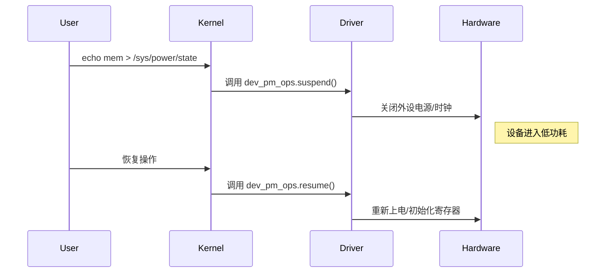
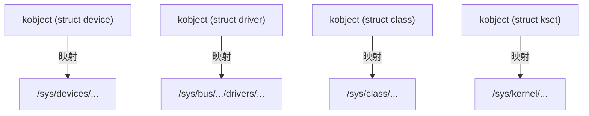
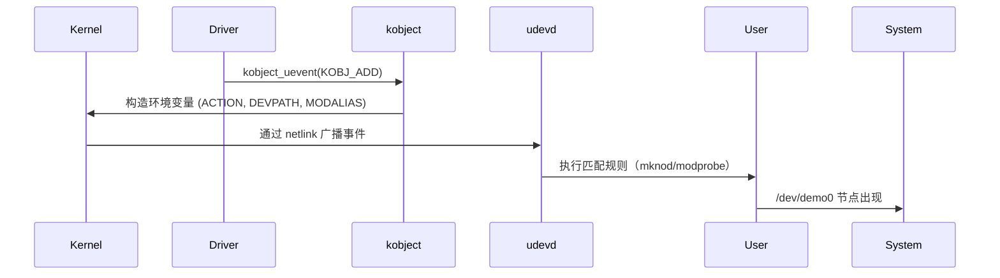
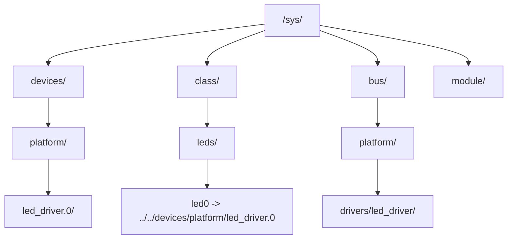

# 第11章　电源管理（PM）在设备模型中的集成

## 11.1　主题引入

Linux 内核的电源管理（Power Management, PM）是系统级运行效率的重要组成部分。
 在 SoC 驱动开发中，每个外设都可以单独被挂起、恢复或动态关断，以降低功耗。

driver core 将 **PM 管理机制** 深度嵌入进设备模型体系，使得：

- 每个设备（`struct device`）都具备独立的电源管理信息；
- 每个驱动（`struct dev_pm_ops`）都可以定义电源管理回调；
- 所有挂起/恢复/动态电源操作都通过 driver core 统一调度。

> **一句话概括：**
>  PM 机制让设备“有生命”，driver core 让它“有秩序地休眠与唤醒”。

------

## 11.2　设计哲学

| 原则     | 说明                                                |
| -------- | --------------------------------------------------- |
| 分层管理 | 驱动不直接操作硬件电源，由 PM 核心统一调度          |
| 统一接口 | 所有设备遵循相同 suspend/resume/pm_runtime 回调规范 |
| 按需唤醒 | 支持 runtime PM（设备闲置时自动休眠）               |
| 层级传播 | 父设备 suspend 时自动 cascade 到子设备              |
| 驱动自控 | 驱动可通过 dev_pm_ops 自定义各阶段动作              |

> **哲学核心：**
>  电源管理是设备模型的“垂直扩展”，贯穿 device-driver-bus 全层。

------

## 11.3　数据结构视角

### 11.3.1　struct dev_pm_info（设备电源状态信息）

定义于 `include/linux/pm.h`：

```c
struct dev_pm_info {
    pm_message_t 			power_state;
    unsigned int 			can_wakeup:1;
    unsigned int 			async_suspend:1;
    atomic_t 				usage_count;
    struct device 			*power_parent;
    struct completion 		completion;
    struct pm_subsys_data 	*subsys_data;
};
```

| 字段            | 含义                           |
| --------------- | ------------------------------ |
| `power_state`   | 当前电源状态（D0~D3）          |
| `can_wakeup`    | 是否支持唤醒系统               |
| `async_suspend` | 是否异步挂起                   |
| `usage_count`   | 动态电源引用计数（runtime PM） |
| `power_parent`  | 父设备指针（层级控制）         |
| `completion`    | 异步同步控制                   |
| `subsys_data`   | 指向总线子系统 PM 状态数据     |

------

### 11.3.2　struct dev_pm_ops（驱动电源回调）

定义于 `include/linux/pm.h`：

```c
struct dev_pm_ops {
    int (*prepare)(struct device *dev);
    void (*complete)(struct device *dev);
    int (*suspend)(struct device *dev);
    int (*resume)(struct device *dev);
    int (*freeze)(struct device *dev);
    int (*thaw)(struct device *dev);
    int (*poweroff)(struct device *dev);
    int (*restore)(struct device *dev);
    int (*runtime_suspend)(struct device *dev);
    int (*runtime_resume)(struct device *dev);
    int (*runtime_idle)(struct device *dev);
};
```

| 回调                | 阶段       | 说明                 |
| ------------------- | ---------- | -------------------- |
| `prepare()`         | 挂起前准备 | 同步状态、禁止 I/O   |
| `suspend()`         | 设备挂起   | 停止工作、断电       |
| `resume()`          | 设备恢复   | 重新上电、恢复寄存器 |
| `complete()`        | 挂起结束   | 通知应用可访问       |
| `runtime_suspend()` | 动态挂起   | 空闲时自动休眠       |
| `runtime_resume()`  | 动态恢复   | 访问时自动唤醒       |

> **备注：** suspend/resume 用于系统级挂起（system sleep）；
>  runtime_* 系列用于运行时节能（runtime PM）。

------

### 11.3.3　struct device 中的集成点

```c
struct device {
    ...
    struct dev_pm_info power;
    const struct dev_pm_ops *pm;
};
```

这意味着每个设备都自带电源信息与回调指针。
 当系统进入休眠或恢复时，driver core 依次调用这些钩子。

------

## 11.4　开发者视角

### 11.4.1　驱动注册电源管理回调

```c
static const struct dev_pm_ops led_pm_ops = {
    .suspend = led_suspend,
    .resume  = led_resume,
    .runtime_suspend = led_runtime_suspend,
    .runtime_resume  = led_runtime_resume,
};
```

注册到驱动：

```c
static struct platform_driver led_driver = {
    .probe = led_probe,
    .remove = led_remove,
    .driver = {
        .name = "led_driver",
        .pm = &led_pm_ops,
    },
};
```

------

### 11.4.2　系统级挂起/恢复（suspend/resume）

```c
static int led_suspend(struct device *dev)
{
    pr_info("LED: enter suspend\n");
    // 关闭 GPIO、电源、时钟
    return 0;
}

static int led_resume(struct device *dev)
{
    pr_info("LED: resume from suspend\n");
    // 重新上电、恢复寄存器
    return 0;
}
```

当系统执行：

```bash
echo mem > /sys/power/state
```

内核将触发：

```
device_suspend()
   → bus->pm->suspend()
   → driver->pm->suspend()
```

------

### 11.4.3　运行时电源管理（Runtime PM）

Runtime PM 用于设备在系统运行期间的动态节能。

核心接口定义于 `include/linux/pm_runtime.h`：

```c
int pm_runtime_get_sync(struct device *dev);
int pm_runtime_put_sync(struct device *dev);
int pm_runtime_enable(struct device *dev);
```

#### 示例：

```c
static int led_probe(struct platform_device *pdev)
{
    pm_runtime_enable(&pdev->dev);
    return 0;
}

static int led_runtime_suspend(struct device *dev)
{
    pr_info("LED runtime suspend\n");
    return 0;
}

static int led_runtime_resume(struct device *dev)
{
    pr_info("LED runtime resume\n");
    return 0;
}
```

- 当设备空闲时，PM 核心自动调用 `runtime_suspend()`；
- 当上层访问设备（如写寄存器）时，调用 `pm_runtime_get_sync()` 唤醒设备；
- 使用完毕后，调用 `pm_runtime_put_sync()` 重新进入休眠。

------

### 11.4.4　分层传播机制（Cascade）

在挂起/恢复阶段，driver core 会递归遍历设备树：

```text
device_suspend()
 ├── parent (bus, power domain)
 │    └── child1
 │        └── child2
```

执行顺序：

1. 自顶向下挂起（parent → child）
2. 自底向上恢复（child → parent）

这保证了依赖关系（如 clock → UART → console）的正确顺序。

------

### 11.4.5　PM 与 devres 的结合

devm 系列接口同样与 PM 机制集成。
 例如：

```c
clk = devm_clk_get(&pdev->dev, NULL);
```

当设备 suspend 时：

- 时钟自动关闭；
- resume 时重新开启；
- 驱动不需手动管理。

------

## 11.5　用户视角

从用户层面看，PM 的状态可通过以下接口查看：

| 文件路径                                      | 功能            | 示例                               |
| --------------------------------------------- | --------------- | ---------------------------------- |
| `/sys/power/state`                            | 系统级挂起控制  | `echo mem > /sys/power/state`      |
| `/sys/devices/.../power/control`              | runtime PM 控制 | `echo auto > /sys/.../control`     |
| `/sys/devices/.../power/runtime_status`       | 当前状态        | `active` / `suspended`             |
| `/sys/devices/.../power/autosuspend_delay_ms` | 自动休眠延时    | `echo 2000 > autosuspend_delay_ms` |

示例：

```bash
cat /sys/devices/platform/led_driver/power/runtime_status
# 输出: suspended
```

------

## 11.6　可视化：电源管理流程图



------

## 11.7　调试与验证

| 检查项               | 命令                                         | 说明                                 |
| -------------------- | -------------------------------------------- | ------------------------------------ |
| 查看系统挂起状态     | `cat /sys/power/state`                       | 可选状态：`mem`, `freeze`, `standby` |
| 查看 runtime 状态    | `cat /sys/devices/.../power/runtime_status`  | 当前电源状态                         |
| 强制 runtime suspend | `echo auto > /sys/devices/.../power/control` | 启用自动节能                         |
| 追踪日志             | `dmesg                                       | grep suspend`                        |
| 分析依赖顺序         | `cat /sys/kernel/debug/devices_deferred`     | 检查延迟设备                         |

------

## 11.8　小结

| 模块     | 数据结构                  | 核心函数                  | 说明           |
| -------- | ------------------------- | ------------------------- | -------------- |
| 电源信息 | `struct dev_pm_info`      | -                         | 保存设备状态   |
| 驱动回调 | `struct dev_pm_ops`       | suspend/resume            | 驱动自定义操作 |
| 动态节能 | runtime PM                | pm_runtime_*()            | 自动空闲休眠   |
| 系统挂起 | suspend/resume            | system PM                 | 整机休眠与唤醒 |
| 依赖控制 | parent-child 层级         | device_suspend()/resume() | 层次传播       |
| 用户接口 | `/sys/devices/.../power/` | sysfs                     | 控制与调试     |

> **总结：**
>
> - driver core 与 PM 紧密耦合，设备模型天然支持多层电源控制；
> - 驱动只需实现 `dev_pm_ops` 即可接入整个电源管理体系；
> - runtime PM 提供动态节能机制，是嵌入式 SoC 的关键特性；
> - suspend/resume 机制保证系统安全进入与退出低功耗状态；
> - 所有动作都经过 driver core 统一调度，确保依赖顺序一致。


------

# 第12章　sysfs 与 kobject 内核对象模型

## 12.1　主题引入

设备模型并非直接以 C 结构体的形式存在于用户空间；
 它依赖一套统一的对象可视化机制，将内核对象（device、driver、bus、class 等）
 映射为 `/sys/` 文件系统中的目录和文件。

这一机制的核心组件有：

- **`kobject`（Kernel Object）**：内核对象的基础单位；
- **`kset`**：同类对象的集合；
- **`kobj_type`**：对象类型描述；
- **`sysfs`**：用户空间接口，将对象以目录/文件形式暴露。

> **一句话概括：**
>  `kobject` 是设备模型的“对象化基础”，`sysfs` 是它的“外部映射”。

------

## 12.2　设计哲学

| 原则       | 说明                                           |
| ---------- | ---------------------------------------------- |
| 对象可视化 | 一切内核设备、驱动、总线都以 `kobject` 存在    |
| 层级映射   | 内核对象树与 `/sys/` 目录结构一一对应          |
| 统一管理   | 通过 `kset` 管理同类对象，统一注册/销毁        |
| 动态可追踪 | 对象的创建/删除都触发 `uevent`，供 `udev` 监听 |
| 轻量与独立 | `kobject` 只负责管理层，不关心业务逻辑         |

> kobject 是所有内核“对象”的元模型（meta-object）。

------

## 12.3　数据结构视角

### 12.3.1　struct kobject

定义于 `include/linux/kobject.h`：

```c
struct kobject {
    const char *name;
    struct list_head entry;
    struct kobject *parent;
    struct kset *kset;
    struct kobj_type *ktype;
    struct kernfs_node *sd;
    struct kref kref;
    unsigned int state_initialized:1;
};
```

| 字段     | 含义                           |
| -------- | ------------------------------ |
| `name`   | 对象名称（目录名）             |
| `parent` | 父对象（对应 sysfs 层级结构）  |
| `kset`   | 所属集合                       |
| `ktype`  | 对象类型（定义操作集）         |
| `sd`     | 对应 sysfs 节点（kernfs node） |
| `kref`   | 引用计数，用于自动释放         |
| `entry`  | 链入 kset 链表                 |

------

### 12.3.2　struct kobj_type

定义对象的行为与属性集合：

```c
struct kobj_type {
    void (*release)(struct kobject *kobj);
    const struct sysfs_ops *sysfs_ops;
    struct attribute **default_attrs;
};
```

| 字段            | 说明                         |
| --------------- | ---------------------------- |
| `release`       | 对象引用计数归零时的释放函数 |
| `sysfs_ops`     | 文件操作接口（show/store）   |
| `default_attrs` | 默认属性文件列表             |

------

### 12.3.3　struct kset

定义于 `include/linux/kobject.h`：

```c
struct kset {
    struct list_head list;
    spinlock_t list_lock;
    struct kobject kobj;
    const struct kset_uevent_ops *uevent_ops;
};
```

| 字段         | 含义                      |
| ------------ | ------------------------- |
| `list`       | 管理同类 kobject 链表     |
| `kobj`       | kset 自身也是一个 kobject |
| `uevent_ops` | 用于控制 uevent 通知行为  |

------

### 12.3.4　struct sysfs_ops

定义 sysfs 文件的访问函数：

```c
struct sysfs_ops {
    ssize_t (*show)(struct kobject *, struct attribute *, char *);
    ssize_t (*store)(struct kobject *, struct attribute *, const char *, size_t);
};
```

用于实现 `/sys/...` 下文件的 `cat` 与 `echo` 功能。

------

## 12.4　开发者视角

### 12.4.1　kobject 创建与注册

#### 方法 1：静态注册（最常用）

```c
int kobject_init_and_add(struct kobject *kobj,
                         const struct kobj_type *ktype,
                         struct kobject *parent,
                         const char *fmt, ...);
```

示例：

```c
static struct kobject *demo_kobj;

demo_kobj = kobject_create_and_add("demo", kernel_kobj);
if (!demo_kobj)
    return -ENOMEM;
```

这将在 `/sys/kernel/demo/` 下创建一个目录。

> `kernel_kobj` 是全局根对象，对应 `/sys/kernel/`。

------

#### 方法 2：手动控制生命周期

```c
kobject_init(kobj, &kobj_type);
kobject_add(kobj, parent, "name");
kobject_put(kobj);  // 释放引用计数
```

`kobject_put()` 会在引用计数归零时调用 `ktype->release()`。

------

### 12.4.2　添加属性文件

```c
static ssize_t value_show(struct kobject *kobj, struct kobj_attribute *attr, char *buf)
{
    return sprintf(buf, "%d\n", demo_value);
}

static ssize_t value_store(struct kobject *kobj, struct kobj_attribute *attr,
                           const char *buf, size_t count)
{
    sscanf(buf, "%d", &demo_value);
    return count;
}

static struct kobj_attribute value_attr = __ATTR(value, 0664, value_show, value_store);

sysfs_create_file(demo_kobj, &value_attr.attr);
```

生成：

```
/sys/kernel/demo/value
```

> 读写文件即触发 `value_show()` / `value_store()`。

------

### 12.4.3　kset 示例：创建自定义集合

```c
static struct kset *demo_kset;

demo_kset = kset_create_and_add("demo_set", NULL, kernel_kobj);
if (!demo_kset)
    return -ENOMEM;

struct kobject *obj = kzalloc(sizeof(*obj), GFP_KERNEL);
kobject_init_and_add(obj, &demo_ktype, &demo_kset->kobj, "obj0");
```

结果：

```
/sys/kernel/demo_set/
└── obj0/
```

------

### 12.4.4　对象释放机制（release）

kobject 的内存释放遵循引用计数原则：

```c
static void demo_release(struct kobject *kobj)
{
    pr_info("kobject released: %s\n", kobject_name(kobj));
}

static const struct kobj_type demo_ktype = {
    .release = demo_release,
};
```

完整示例：

```c
// SPDX-License-Identifier: GPL-2.0
#include <linux/module.h>
#include <linux/kobject.h>
#include <linux/sysfs.h>

static struct kobject *demo_kobj;

/* --- 属性文件 --- */
static int demo_value = 0;

static ssize_t value_show(struct kobject *kobj,
                          struct kobj_attribute *attr, char *buf)
{
    return sprintf(buf, "%d\n", demo_value);
}

static ssize_t value_store(struct kobject *kobj,
                           struct kobj_attribute *attr,
                           const char *buf, size_t count)
{
    sscanf(buf, "%d", &demo_value);
    return count;
}

static struct kobj_attribute value_attr =
    __ATTR(value, 0664, value_show, value_store);

/* --- kobject 类型描述符 --- */
static void demo_release(struct kobject *kobj)
{
    pr_info("demo_release() called for kobject: %s\n", kobject_name(kobj));
}

static const struct kobj_type demo_ktype = {
    .release = demo_release,     // 关键：告诉内核该对象释放方式
};

/* --- 模块加载 --- */
static int __init demo_init(void)
{
    int ret;

    demo_kobj = kzalloc(sizeof(*demo_kobj), GFP_KERNEL);
    if (!demo_kobj)
        return -ENOMEM;

    /* 初始化并绑定 ktype */
    kobject_init(demo_kobj, &demo_ktype);

    /* 注册到 sysfs，设置父目录为 /sys/kernel/ */
    ret = kobject_add(demo_kobj, kernel_kobj, "demo_kobj");
    if (ret) {
        kobject_put(demo_kobj);  // 出错立即释放
        return ret;
    }

    /* 创建属性文件 */
    sysfs_create_file(demo_kobj, &value_attr.attr);

    pr_info("demo_kobj created under /sys/kernel/demo_kobj/\n");
    return 0;
}

/* --- 模块卸载 --- */
static void __exit demo_exit(void)
{
    sysfs_remove_file(demo_kobj, &value_attr.attr);
    kobject_put(demo_kobj);  // 引用计数减 1 -> 自动调用 demo_release()
    pr_info("demo_kobj removed\n");
}

module_init(demo_init);
module_exit(demo_exit);
MODULE_LICENSE("GPL");
```

调用：

```c
kobject_put(demo_kobj);
```

当引用计数归零时，自动执行 `demo_release()`。

------

## 12.5　sysfs 文件系统结构

sysfs 是一种专门为内核对象设计的虚拟文件系统，
 其根目录结构如下：

```
/sys/
├── bus/
│   ├── platform/
│   └── i2c/
├── class/
│   ├── net/
│   └── leds/
├── devices/
│   └── platform/
├── kernel/
│   └── debug/
└── module/
    └── demo/
```

每个目录都对应一个 kobject，每个文件对应一个 attribute。

------

## 12.6　可视化：kobject 与 sysfs 映射关系



------

## 12.7　kobject 与设备模型的关系

| 模块              | 是否包含 kobject | sysfs 目录映射             |
| ----------------- | ---------------- | -------------------------- |
| `struct device`   | ✅                | `/sys/devices/...`         |
| `struct driver`   | ✅                | `/sys/bus/.../drivers/...` |
| `struct bus_type` | ✅                | `/sys/bus/...`             |
| `struct class`    | ✅                | `/sys/class/...`           |
| `struct module`   | ✅                | `/sys/module/...`          |

> 所有设备模型组件都是 kobject 的“衍生对象”。

------

## 12.8　用户视角

用户空间访问 sysfs 本质上是通过文件 I/O 与内核交互：

| 操作     | 命令                      | 内核调用                      |
| -------- | ------------------------- | ----------------------------- |
| 读取属性 | `cat /sys/.../value`      | `sysfs_ops.show()`            |
| 写入属性 | `echo 1 > /sys/.../value` | `sysfs_ops.store()`           |
| 删除对象 | 模块卸载                  | `kobject_put()` → `release()` |
| 监听事件 | `udevadm monitor`         | `uevent` 通知                 |

------

## 12.9　调试与验证

| 检查项            | 命令                                     | 说明                    |
| ----------------- | ---------------------------------------- | ----------------------- |
| 查看 sysfs 根结构 | `tree /sys/ -L 2`                        | 验证层次结构            |
| 查看 kobject 名称 | `cat /sys/kernel/debug/kobject_list`     | 调试对象注册            |
| 追踪 uevent       | `udevadm monitor --kernel`               | 监听 kobject add/remove |
| 内核日志追踪      | `dmesg                                   | grep kobject`           |
| 确认引用计数      | `cat /sys/kernel/debug/kobject_refcount` | 验证内存安全性          |

------

## 12.10　小结

| 层次     | 数据结构           | 核心函数                 | 说明           |
| -------- | ------------------ | ------------------------ | -------------- |
| 基础对象 | `struct kobject`   | `kobject_init_and_add()` | 内核对象抽象   |
| 类型定义 | `struct kobj_type` | `.release`, `.sysfs_ops` | 行为与属性描述 |
| 对象集合 | `struct kset`      | `kset_create_and_add()`  | 管理同类对象   |
| 属性接口 | `struct sysfs_ops` | `sysfs_create_file()`    | 文件访问接口   |
| 可视化   | sysfs              | `/sys/...`               | 用户空间映射   |
| 生命周期 | kref 引用计数      | `kobject_put()`          | 自动释放机制   |

> **总结：**
>
> - `kobject` 是 Linux 一切对象的基础；
> - 每个 `device`、`driver`、`bus`、`class` 都是一个 `kobject`；
> - `sysfs` 将这些对象层次化映射到用户空间；
> - 文件的读写通过 `sysfs_ops` 调度；
> - 设备模型的整个结构可视化完全依赖于 `kobject` 框架。


------

# 第13章　uevent 与 udev：内核事件通知机制

## 13.1　主题引入

Linux 的设备模型并非静态系统。
 当新设备注册、驱动绑定、模块加载或设备被移除时，
 内核都会通过 **uevent（用户空间事件）** 通知用户空间。

这些事件由 **`driver core` → `kobject` → `udev`** 三层协作实现：

| 层次             | 角色                             | 职责                                 |
| ---------------- | -------------------------------- | ------------------------------------ |
| 内核层           | `kobject_uevent()`               | 生成事件消息                         |
| 内核空间接口     | netlink (NETLINK_KOBJECT_UEVENT) | 事件通道                             |
| 用户空间守护进程 | `udevd`                          | 监听并执行规则（如创建 `/dev` 节点） |

> **一句话概括：**
>  uevent 是内核对外发出的“事件广播”；
>  udev 是用户空间的“自动执行者”。

------

## 13.2　设计哲学

| 原则               | 说明                                   |
| ------------------ | -------------------------------------- |
| 事件驱动           | 一切设备变化均通过事件通知，而非轮询   |
| 用户空间可编程     | 用户可用规则脚本定义响应行为           |
| 内核只广播，不处理 | 内核不直接创建设备节点，只发送通知     |
| 用户态与内核态分离 | uevent 在内核态生成，udev 在用户态执行 |

> Linux 保持“**内核负责机制，用户空间负责策略**”的哲学一致性。

------

## 13.3　数据结构视角

### 13.3.1　struct kobj_uevent_env

定义于 `include/linux/kobject.h`：

```c
struct kobj_uevent_env {
    char 	*envp[UEVENT_NUM_ENVP];   // 环境变量字符串指针数组
    int 	envp_idx;                  // 当前索引
    char 	buf[UEVENT_BUFFER_SIZE];  // 缓冲区（默认 2048 字节）
    int 	buflen;
};
```

| 字段     | 说明                                            |
| -------- | ----------------------------------------------- |
| `envp[]` | 保存事件环境变量，如 ACTION、DEVPATH、SUBSYSTEM |
| `buf`    | 存放 key=value 字符串                           |
| `buflen` | 当前缓冲长度                                    |

------

### 13.3.2　struct kset_uevent_ops

定义于 `include/linux/kobject.h`：

```c
struct kset_uevent_ops {
    int 		(*filter)(struct kset *kset, struct kobject *kobj);
    const char*  (*name)(struct kset *kset, struct kobject *kobj);
    int 		(*uevent)(struct kset *kset, struct kobject *kobj, struct kobj_uevent_env *env);
};
```

| 回调       | 说明                                     |
| ---------- | ---------------------------------------- |
| `filter()` | 控制是否发送事件                         |
| `name()`   | 指定子系统名称（如 "platform"、"block"） |
| `uevent()` | 添加自定义环境变量                       |

> 每个子系统（如 platform、i2c、block）可通过此结构自定义事件行为。

------

## 13.4　开发者视角

### 13.4.1　uevent 事件的触发路径

内核中任何对象（kobject）被 **添加、移除、修改** 时，都会调用：

```c
int kobject_uevent(struct kobject *kobj, enum kobject_action action);
```

其中 `action` 可为：

```
KOBJ_ADD, KOBJ_REMOVE, KOBJ_CHANGE, KOBJ_MOVE,
KOBJ_ONLINE, KOBJ_OFFLINE, KOBJ_BIND, KOBJ_UNBIND
```

------

### 13.4.2　事件构造流程

简化执行流程如下（位于 `lib/kobject_uevent.c`）：

```c
kobject_uevent()
  ↓
kset->uevent_ops->filter()
  ↓
kset->uevent_ops->name()
  ↓
kset->uevent_ops->uevent()
  ↓
add_uevent_var(env, "ACTION=%s", action_name)
  ↓
add_uevent_var(env, "DEVPATH=%s", devpath)
  ↓
add_uevent_var(env, "SUBSYSTEM=%s", subsystem_name)
  ↓
broadcast_uevent_netlink()
```

最终通过 **netlink** 向用户空间广播。

------

### 13.4.3　驱动中手动触发 uevent

驱动可显式调用：

```c
kobject_uevent(&pdev->dev.kobj, KOBJ_CHANGE);
```

这将触发：

```
ACTION=change
DEVPATH=/devices/platform/led_driver.0
SUBSYSTEM=platform
```

------

### 13.4.4　uevent 与 sysfs 的联动

当执行：

```c
device_add()
```

时，系统会自动调用：

```c
kobject_uevent(&dev->kobj, KOBJ_ADD);
```

于是用户空间 `udevd` 收到事件：

```
ACTION=add
DEVPATH=/devices/platform/led_driver.0
SUBSYSTEM=platform
MODALIAS=of:NnxpCimx6ull-led
```

udev 根据 MODALIAS 触发驱动模块加载：

```
/sbin/modprobe of:NnxpCimx6ull-led
```

------

### 13.4.5　环境变量列表（典型字段）

| 字段              | 含义                            |
| ----------------- | ------------------------------- |
| `ACTION`          | add / remove / change           |
| `DEVPATH`         | `/sys/devices/...` 路径         |
| `SUBSYSTEM`       | 设备所属子系统（如 platform）   |
| `SEQNUM`          | 事件序号                        |
| `MODALIAS`        | 模块别名，用于自动加载驱动      |
| `DEVNAME`         | 设备节点名称（如 `/dev/ttyS0`） |
| `MAJOR` / `MINOR` | 主次设备号                      |

------

### 13.4.6　手动测试 uevent

驱动中添加：

```c
kobject_uevent(&pdev->dev.kobj, KOBJ_ADD);
```

用户端运行：

```bash
udevadm monitor --kernel --property
```

输出：

```
KERNEL[1245.123456] add /devices/platform/led_driver.0 (platform)
ACTION=add
DEVPATH=/devices/platform/led_driver.0
SUBSYSTEM=platform
```

------

## 13.5　用户空间视角：udev 守护进程

### 13.5.1　udev 作用

用户空间的 `systemd-udevd` 进程持续监听 `NETLINK_KOBJECT_UEVENT` 套接字，
 并根据 `/etc/udev/rules.d/` 中的规则执行相应操作：

| 操作           | 行为                       |
| -------------- | -------------------------- |
| 创建设备节点   | `mknod /dev/<name>`        |
| 加载驱动模块   | `modprobe <module>`        |
| 设置权限与属主 | `chmod` / `chown`          |
| 执行脚本       | `RUN+="path/to/script.sh"` |

------

### 13.5.2　udev 规则文件示例

路径：`/etc/udev/rules.d/99-demo.rules`

```bash
SUBSYSTEM=="platform", KERNEL=="led_driver.*", ACTION=="add", \
    RUN+="/usr/bin/logger 'LED driver detected'"
```

也可以为设备自动创建设备节点：

```bash
KERNEL=="demo[0-9]*", MODE="0666", GROUP="users"
```

------

### 13.5.3　udev 与 modalias 自动加载

当内核发送带有 MODALIAS 的事件时：

```bash
ACTION=add
SUBSYSTEM=platform
MODALIAS=of:NnxpCimx6ull-led
```

udev 会自动调用：

```
/sbin/modprobe of:NnxpCimx6ull-led
```

只要驱动模块中存在：

```c
MODULE_DEVICE_TABLE(of, led_of_match);
```

udev 即可自动加载正确的驱动。

------

## 13.6　可视化：uevent 与 udev 协作流程



------

## 13.7　调试与验证

| 检查项           | 命令                                  | 说明             |
| ---------------- | ------------------------------------- | ---------------- |
| 查看 uevent 内容 | `cat /sys/devices/.../uevent`         | 显示最近事件信息 |
| 监听事件         | `udevadm monitor --kernel --property` | 实时事件流       |
| 查看规则匹配     | `udevadm info -a -p /sys/devices/...` | 检查 udev 属性链 |
| 重载规则         | `udevadm control --reload`            | 更新规则文件     |
| 模拟事件         | `udevadm trigger`                     | 重新广播 uevent  |
| 自动加载驱动验证 | `dmesg                                | grep modprobe`   |

------

## 13.8　小结

| 模块     | 数据结构                     | 核心函数                 | 说明           |
| -------- | ---------------------------- | ------------------------ | -------------- |
| 内核层   | `struct kobj_uevent_env`     | `kobject_uevent()`       | 构造与发送事件 |
| 过滤接口 | `struct kset_uevent_ops`     | `.filter()`, `.uevent()` | 控制事件输出   |
| 用户层   | `udevd`                      | `NETLINK_KOBJECT_UEVENT` | 接收并执行动作 |
| 自动加载 | `MODULE_DEVICE_TABLE()`      | udev `modprobe`          | 自动匹配驱动   |
| 手动触发 | `echo add > /sys/.../uevent` | 模拟事件                 | 测试通道稳定性 |

> **总结：**
>
> - `kobject_uevent()` 是驱动模型与用户空间的桥梁；
> - 事件内容以环境变量方式通过 Netlink 广播；
> - `udev` 根据规则自动执行创建节点、加载模块；
> - 驱动与用户空间完全解耦，保持机制与策略分离；
> - 这是 Linux 自动设备识别、热插拔与模块加载的根基。


------

# 第14章　device 与 subsystem 层级管理机制

## 14.1　主题引入

在 Linux 内核中，设备模型的所有对象（`device`、`driver`、`bus`、`class`）并非平面存放，
 而是构成一棵由 **driver core** 管理的有向层次树（device hierarchy tree）。
 这棵树以 **`/sys/devices`** 为根节点，向上挂接 `/sys/bus`、`/sys/class`、`/sys/module` 等目录。

每个设备节点都拥有：

- **父设备（parent）**
- **总线（bus）**
- **类（class）**
- **驱动（driver）**

> **一句话概括：**
>  Linux 的设备模型是一棵多根复合树，由 driver core 动态维护、sysfs 可视化。

------

## 14.2　设计哲学

| 原则       | 说明                                 |
| ---------- | ------------------------------------ |
| 层级统一   | 所有设备都属于 `/sys/devices` 根层   |
| 关系显式   | 父设备、总线、类别均显式建链         |
| 可递归操作 | suspend/resume/remove 都基于层级递归 |
| 自动同步   | sysfs 与 kobject 树结构保持一致      |
| 子系统自治 | 每个 subsystem 可独立管理自身子树    |

------

## 14.3　数据结构视角

### 14.3.1　struct device：层级节点的核心

定义于 `include/linux/device.h`：

```c
struct device {
    struct device           *parent;
    struct bus_type         *bus;
    struct device_driver    *driver;
    struct class            *class;
    struct kobject          kobj;
    ...
};
```

| 成员     | 说明                             |
| -------- | -------------------------------- |
| `parent` | 指向父设备（形成设备层级）       |
| `bus`    | 所属总线，如 `platform_bus_type` |
| `class`  | 所属类别，如 `leds`、`input`     |
| `driver` | 当前绑定的驱动                   |
| `kobj`   | sysfs 对象，用于目录映射         |

------

### 14.3.2　struct bus_type：总线层

```c
struct bus_type {
    const char 					*name;
    struct bus_attribute 		*bus_attrs;
    struct device_attribute 	*dev_attrs;
    struct driver_attribute 	*drv_attrs;
    struct kset 				subsys;           // 关键成员
};
```

`bus_type` 的 `subsys.kobj` 决定 `/sys/bus/<bus>/` 的创建。

------

### 14.3.3　struct class：类别层

```c
struct class {
    const char 		*name;
    struct kobject 	*dev_kobj;
    struct kset 	*p;
};
```

当创建一个 class 时（如 `class_create(THIS_MODULE, "leds")`），
 内核自动生成 `/sys/class/leds` 目录。
 其内部的每个 `device` 会以软链接形式指向 `/sys/devices/...` 的真实对象。

------

### 14.3.4　device_subsys 层结构

在内核启动时，`driver_init()` 调用：

```c
subsys_system_register(&devices_subsys, NULL);
subsys_system_register(&drivers_subsys, NULL);
subsys_system_register(&bus_subsys, NULL);
subsys_system_register(&class_subsys, NULL);
```

这些 subsystem 的根节点形成 `/sys/devices`、`/sys/class` 等主目录。

------

## 14.4　开发者视角

### 14.4.1　设备注册时的层级挂接

当调用：

```c
device_register(dev);
```

时，会执行：

```c
device_initialize(dev);
device_add(dev);
```

在 `device_add()` 中：

```c
if (dev->parent)
    kobject_add(&dev->kobj, &dev->parent->kobj, dev_name(dev));
else
    kobject_add(&dev->kobj, &devices_kset->kobj, dev_name(dev));
```

这行代码决定了：

> 如果设备没有 parent，则直接挂载到 `/sys/devices/` 下；
>  否则，挂载到父设备对应的 sysfs 路径下。

------

### 14.4.2　父子设备关系（parent-child）

**示例：**

```c
struct device parent_dev, child_dev;

device_initialize(&parent_dev);
device_add(&parent_dev);

child_dev.parent = &parent_dev;
device_initialize(&child_dev);
device_add(&child_dev);
```

sysfs 结构：

```
/sys/devices/parent_dev/
└── child_dev/
```

> 当卸载 `parent_dev` 时，`driver core` 会递归释放所有子设备。

------

### 14.4.3　总线层级的注册机制

平台总线注册过程：

```c
bus_register(&platform_bus_type);
```

其内部执行：

```c
kset_create_and_add("platform", NULL, &bus_kset->kobj);
```

最终 sysfs 中出现：

```
/sys/bus/platform/
├── devices/
├── drivers/
└── uevent
```

> 其中 `devices/` 与 `drivers/` 子目录分别通过
>  `bus_add_device()` 与 `bus_add_driver()` 动态填充。

------

### 14.4.4　class 层级的软链接结构

在驱动中调用：

```c
device_create(led_class, NULL, devt, NULL, "led0");
```

内核自动创建：

```
/sys/class/leds/led0 → /sys/devices/platform/led_driver.0
```

即 class 层下的设备是指向 devices 层的**符号链接**，
 两者共享同一 `struct device` 实例。

------

### 14.4.5　subsystem_register() 机制

每个子系统（如 bus、class、devices）都通过以下函数注册：

```c
int subsys_system_register(struct subsystem *subsys,
                           const struct attribute_group **groups)
{
    kset_register(&subsys->kset);
}
```

从而在 sysfs 创建顶级目录：

```
/sys/class/
/sys/devices/
/sys/bus/
```

------

## 14.5　可视化结构：设备模型的分层树



------

## 14.6　子系统间的交叉引用关系

| 层级            | 示例路径       | 描述                    |
| --------------- | -------------- | ----------------------- |
| `/sys/devices/` | 实体设备节点树 | device 实体             |
| `/sys/bus/`     | 总线分组       | device-driver 匹配关系  |
| `/sys/class/`   | 功能分组       | 用户空间访问入口        |
| `/sys/module/`  | 模块信息       | 模块与驱动关联          |
| `/sys/kernel/`  | 内核内部对象   | kobject/kset 测试对象等 |

所有这些目录的根节点均由 `driver core` 在初始化阶段通过 `subsys_system_register()` 自动创建。

------

## 14.7　调试与验证

| 检查项            | 命令                                  | 说明             |
| ----------------- | ------------------------------------- | ---------------- |
| 查看设备层级      | `tree /sys/devices/platform -L 2`     | 查看设备父子关系 |
| 查看 bus 层结构   | `tree /sys/bus/platform`              | 总线与驱动对应   |
| 查看 class 层链接 | `ls -l /sys/class/leds/`              | 确认符号链接关系 |
| 查看设备属性      | `udevadm info -a -p /sys/devices/...` | 属性层级追踪     |
| 验证释放顺序      | `rmmod <driver>` + `dmesg`            | 检查递归释放     |

------

## 14.8　小结

| 层次     | 数据结构           | 注册函数                   | sysfs 路径      | 说明       |
| -------- | ------------------ | -------------------------- | --------------- | ---------- |
| 设备层   | `struct device`    | `device_add()`             | `/sys/devices/` | 物理设备树 |
| 总线层   | `struct bus_type`  | `bus_register()`           | `/sys/bus/`     | 按协议分类 |
| 类层     | `struct class`     | `class_create()`           | `/sys/class/`   | 按功能分组 |
| 模块层   | `struct module`    | `module_init()`            | `/sys/module/`  | 模块可见性 |
| 子系统层 | `struct subsystem` | `subsys_system_register()` | 顶层目录        | 系统主树根 |

> **总结：**
>
> - 所有对象（device、driver、bus、class）都通过 `kobject` 构成统一层级；
> - `device` 层是真实的实体树，`class` 层是软链接抽象；
> - `bus` 层负责匹配关系，`module` 层负责加载逻辑；
> - 设备树的结构与 sysfs 层的树完全一致；
> - 设备模型的整个运行时关系都可以通过 `/sys` 完整可见。


------

