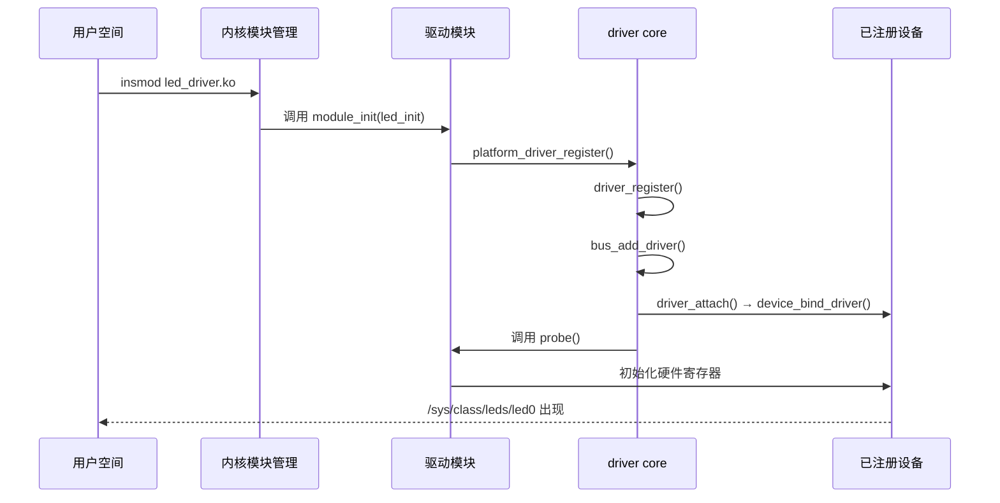
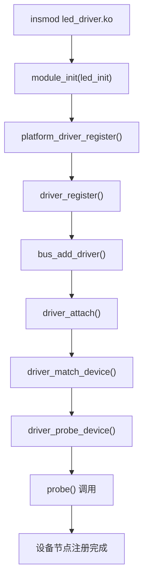
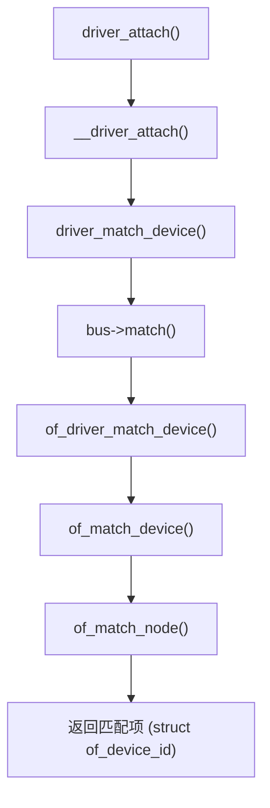
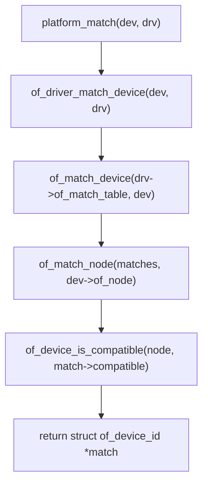
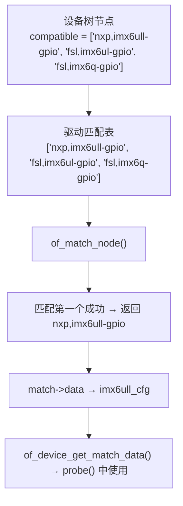
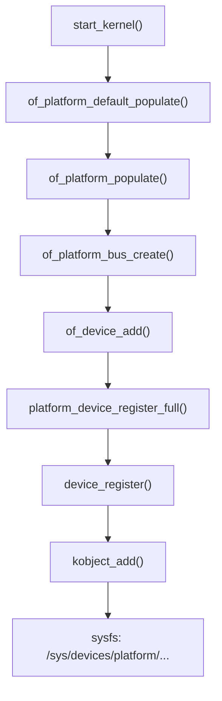
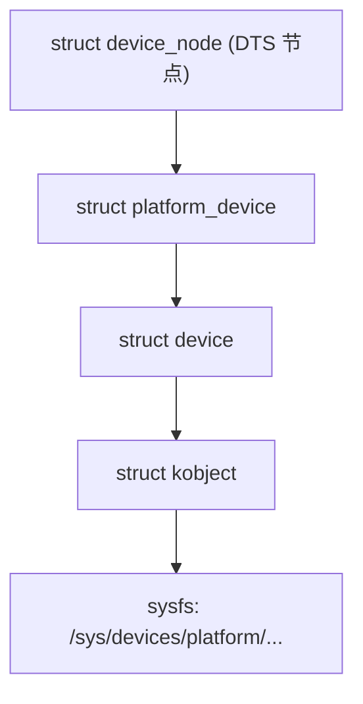
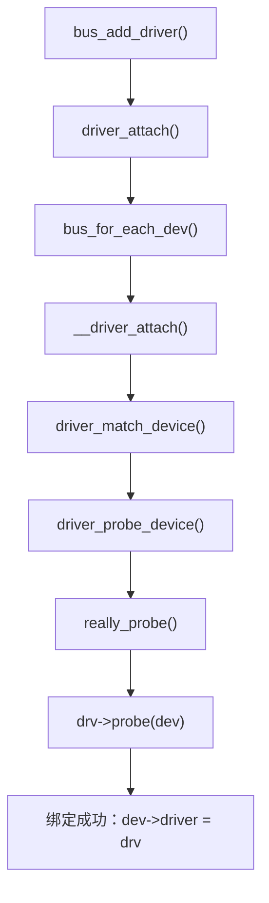
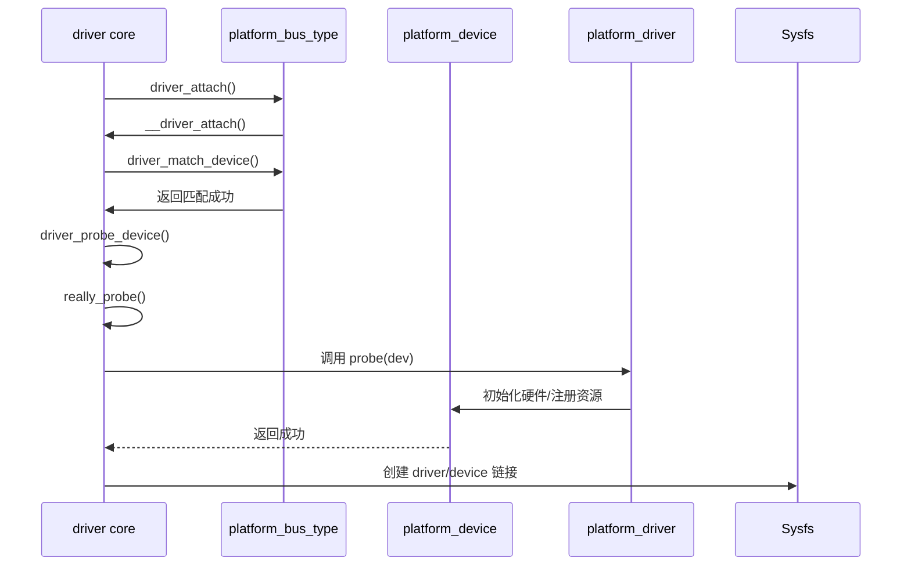

# 第15章　设备模型与模块加载：从 insmod 到 probe 的全流程

## 15.1　主题引入

当我们执行：

```bash
insmod led_driver.ko
```

系统会自动完成：

1. 模块加载与初始化；
2. 驱动在设备模型中注册；
3. 与设备树中已存在的 device 匹配；
4. 调用驱动的 `probe()` 函数建立硬件连接。

这一过程是 Linux 驱动模型的“心脏”路径，
 由 **driver core** 驱动整个设备发现与绑定流程。

> **一句话概括：**
> `insmod` 是入口，`driver core` 是引擎，`probe()` 是目标。

------

## 15.2　总体调用链

下图展示了从模块加载到驱动绑定的完整路径：



------

## 15.3　模块加载阶段：module_init()

驱动模块的入口函数通常定义为：

```c
static int __init led_init(void)
{
    return platform_driver_register(&led_driver);
}
module_init(led_init);
```

### 15.3.1　`module_init()` 宏展开

定义于 `include/linux/init.h`：

```c
#define module_init(x)  __initcall(x);
```

这会将 `led_init()` 放入 `.initcall6.init` 段，
 模块加载时由内核模块加载器调用。

### 15.3.2　对应的退出函数

```c
static void __exit led_exit(void)
{
    platform_driver_unregister(&led_driver);
}
module_exit(led_exit);
```

当 `rmmod` 执行时，系统会自动调用该函数完成注销与解绑。

------

## 15.4　驱动注册阶段：platform_driver_register()

```c
int platform_driver_register(struct platform_driver *drv)
{
    drv->driver.bus = &platform_bus_type;
    return driver_register(&drv->driver);
}
```

该函数完成：

1. 指定所属总线 `platform_bus_type`；
2. 调用 `driver_register()` 在系统中注册该驱动。

------

## 15.5　driver_register()：驱动正式接入系统

定义于 `drivers/base/driver.c`：

```c
int driver_register(struct device_driver *drv)
{
    bus_add_driver(drv);
    return 0;
}
```

------

## 15.6　bus_add_driver()：驱动与总线绑定

核心步骤如下：

```c
int bus_add_driver(struct device_driver *drv)
{
    struct bus_type *bus = drv->bus;

    kobject_init_and_add(&drv->p->kobj, &driver_ktype,
                         &bus->p->drivers_kset->kobj, "%s", drv->name);
    list_add_tail(&drv->p->klist_devices, &bus->p->klist_drivers);
    driver_attach(drv);   // 核心：开始匹配设备
}
```

这一步：

- 将驱动注册为总线下的一个对象；
- 遍历总线上所有设备尝试匹配；
- 若匹配成功，调用 `probe()`。

------

## 15.7　device_attach()：遍历设备匹配驱动

```c
int driver_attach(struct device_driver *drv)
{
    return bus_for_each_dev(drv->bus, NULL, drv, __driver_attach);
}
```

内部遍历总线上的所有 `device`：

```c
static int __driver_attach(struct device *dev, void *data)
{
    struct device_driver *drv = data;
    if (driver_match_device(drv, dev))
        driver_probe_device(drv, dev);
}
```

------

## 15.8　设备匹配阶段：driver_match_device()

每个 bus 都定义自己的匹配函数。

以 **platform 总线** 为例（`drivers/base/platform.c`）：

```c
static int platform_match(struct device *dev, struct device_driver *drv)
{
    struct platform_device *pdev = to_platform_device(dev);
    struct platform_driver *pdrv = to_platform_driver(drv);

    /* 优先用设备树匹配 */
    if (of_driver_match_device(dev, drv))
        return 1;

    /* 否则用 name 匹配 */
    return (strcmp(pdev->name, pdrv->driver.name) == 0);
}
```

> 匹配优先级：
>
> 1. **compatible**（设备树）
> 2. **id_table**（platform_id）
> 3. **name**（驱动与设备名）

------

## 15.9　设备绑定阶段：driver_probe_device()

```c
int driver_probe_device(struct device_driver *drv, struct device *dev)
{
    if (dev->driver)
        return -EBUSY;

    if (driver_call_probe(drv, dev) == 0)
        dev->driver = drv;
}
```

最终执行：

```c
drv->probe(dev);
```

这就是驱动开发者编写的 `probe()` 函数，负责初始化硬件、申请资源、注册字符设备、创建 sysfs 节点等。

------

## 15.10　设备注销阶段：rmmod 反向路径

当执行：

```bash
rmmod led_driver
```

系统调用：

```c
platform_driver_unregister(&led_driver)
  → driver_unregister()
  → bus_remove_driver()
  → driver_detach()
```

从而调用：

```c
drv->remove(dev);
```

释放资源并清除绑定关系。

------

## 15.11　示例：完整驱动注册路径

```c
static int led_probe(struct platform_device *pdev)
{
    pr_info("led_probe: matched device %s\n", dev_name(&pdev->dev));
    return 0;
}

static int led_remove(struct platform_device *pdev)
{
    pr_info("led_remove: device %s removed\n", dev_name(&pdev->dev));
    return 0;
}

static const struct of_device_id led_of_match[] = {
    { .compatible = "nxp,imx6ull-led" },
    { /* sentinel */ }
};
MODULE_DEVICE_TABLE(of, led_of_match);

static struct platform_driver led_driver = {
    .driver = {
        .name = "led_driver",
        .of_match_table = led_of_match,
    },
    .probe = led_probe,
    .remove = led_remove,
};

module_platform_driver(led_driver);
```

加载结果：

```
[  1.234567] led_driver: probe() for nxp,imx6ull-led
/sys/devices/platform/led_driver.0
/sys/class/leds/led0
```

------

## 15.12　可视化：驱动注册流程图



------

## 15.13　调试与验证

| 检查项           | 命令                                                         | 说明                 |
| ---------------- | ------------------------------------------------------------ | -------------------- |
| 查看驱动绑定     | `ls /sys/bus/platform/drivers/`                              | 驱动注册状态         |
| 查看匹配设备     | `ls /sys/bus/platform/devices/`                              | 当前挂接设备         |
| 检查驱动绑定关系 | `ls -l /sys/bus/platform/devices/led_driver.0/driver`        | 确认软链接           |
| 追踪 probe 调用  | `dmesg                                                | grep led_probe` |                      |
| 查看模块符号     | `cat /sys/module/led_driver/sections/.init.text`             | 确认加载地址         |
| 查看设备别名     | `cat /sys/devices/.../modalias`                              | 检查 MODALIAS 字符串 |

------

## 15.14　小结

| 阶段     | 函数                    | 说明                  |
| -------- | ----------------------- | --------------------- |
| 模块加载 | `module_init()`         | 注册驱动入口          |
| 驱动注册 | `driver_register()`     | 接入总线系统          |
| 匹配过程 | `driver_match_device()` | 设备树/名字匹配       |
| 绑定过程 | `driver_probe_device()` | 调用 probe() 建立连接 |
| 卸载过程 | `driver_unregister()`   | 移除驱动与设备绑定    |

> **总结：**
>
> - `insmod` 驱动模块后，最终通过 `driver core` 完成注册与匹配；
> - 每个 bus 定义独立的匹配策略；
> - 设备与驱动的关系通过 `driver_attach()` 递归扫描建立；
> - `probe()` 是整个加载过程的收尾，也是驱动开发者最常工作的阶段；
> - 设备模型的运行核心在于 “统一注册 + 按总线匹配 + 分层绑定”。


------

# 第16章　driver core 设备匹配机制详解：from of_match_device() 到 of_match_node()

## 16.1　主题引入

驱动模型中最关键的动作之一是**设备与驱动的匹配**。
 在设备模型中，一个设备（`struct device`）可能来源于：

- 设备树 (`Device Tree`)；
- 平台代码 (`platform_device_register()`)；
- 动态发现的总线设备（如 PCI、USB）。

而一个驱动（`struct device_driver`）则通过：

- `.of_match_table`（设备树匹配表）；
- `.id_table`（传统 ID 表）；
- `.name`（最后兜底匹配）
  来确定它能匹配哪些设备。

内核通过统一入口：

```c
driver_match_device()
```

启动一条匹配链路。

------

## 16.2　匹配调用链总览



------

## 16.3　第一层入口：driver_match_device()

定义于 `drivers/base/driver.c`：

```c
int driver_match_device(struct device_driver *drv, struct device *dev)
{
    struct bus_type *bus = drv->bus;
    return bus->match ? bus->match(dev, drv) : 1;
}
```

它只是一个**分发器**：
 真正的匹配逻辑由各总线自定义，例如：

- platform 总线 → `platform_match()`
- i2c 总线 → `i2c_device_match()`
- spi 总线 → `spi_match_device()`

------

## 16.4　第二层：platform_match()

定义于 `drivers/base/platform.c`：

```c
static int platform_match(struct device *dev, struct device_driver *drv)
{
    struct platform_device *pdev = to_platform_device(dev);
    struct platform_driver *pdrv = to_platform_driver(drv);

    /* ① 设备树匹配 */
    if (of_driver_match_device(dev, drv))
        return 1;

    /* ② id_table 匹配 */
    if (pdrv->id_table)
        return platform_match_id(pdrv->id_table, pdev) != NULL;

    /* ③ name 匹配 */
    return (strcmp(pdev->name, pdrv->driver.name) == 0);
}
```

> 匹配优先级：
>
> 1. **设备树 compatible**
> 2. **platform_id**
> 3. **驱动名字符串**

------

## 16.5　第三层：of_driver_match_device()

定义于 `drivers/of/device.c`：

```c
int of_driver_match_device(struct device *dev, const struct device_driver *drv)
{
    const struct of_device_id *match;

    if (!dev->of_node || !drv->of_match_table)
        return 0;

    match = of_match_device(drv->of_match_table, dev);
    return match != NULL;
}
```

功能：

- 验证设备是否具备 OF node；
- 验证驱动是否定义匹配表；
- 调用 `of_match_device()` 进行逐项匹配。

------

## 16.6　第四层：of_match_device()

定义于 `drivers/of/device.c`：

```c
const struct of_device_id *of_match_device(const struct of_device_id *matches,
                                           const struct device *dev)
{
    if (!dev->of_node)
        return NULL;
    return of_match_node(matches, dev->of_node);
}
```

这层是一个中转：

- 获取设备的设备树节点；
- 将匹配操作下放到 `of_match_node()`；
- 最终返回匹配表项。

------

## 16.7　第五层：of_match_node()

定义于 `drivers/of/base.c`：

```c
const struct of_device_id *of_match_node(const struct of_device_id *matches,
                                         const struct device_node *node)
{
    const struct of_device_id *match;

    for (match = matches; match->compatible[0]; match++) {
        if (of_device_is_compatible(node, match->compatible))
            return match;
    }

    return NULL;
}
```

------

### 关键调用：of_device_is_compatible()

```c
int of_device_is_compatible(const struct device_node *device,
                            const char *compat)
{
    const char *cp;
    int index = 0;

    while ((cp = of_get_property(device, "compatible", NULL)) != NULL) {
        if (strcmp(cp + index, compat) == 0)
            return 1;
        index += strlen(cp + index) + 1;
    }
    return 0;
}
```

该函数逐项对比设备节点中的 `"compatible"` 字符串。

------

## 16.8　数据结构解读

### 16.8.1　设备树节点

```c
struct device_node {
    const char *name;
    const char *type;
    phandle phandle;
    const char *full_name;
    struct property *properties;  // 包含 compatible、reg 等
    struct device_node *parent;
    struct device_node *child;
};
```

### 16.8.2　匹配表

```c
struct of_device_id {
    char name[32];
    char type[32];
    char compatible[128];
    const void *data;
};
```

驱动中常见定义：

```c
static const struct of_device_id led_of_match[] = {
    { .compatible = "nxp,imx6ull-led" },
    { }
};
MODULE_DEVICE_TABLE(of, led_of_match);
```

------

## 16.9　示例：匹配流程追踪

假设设备树中定义：

```dts
led_driver: led@0 {
    compatible = "nxp,imx6ull-led";
    reg = <0x20 0x04>;
};
```

驱动定义：

```c
static const struct of_device_id led_of_match[] = {
    { .compatible = "nxp,imx6ull-led" },
    { }
};

MODULE_DEVICE_TABLE(of, led_of_match);

static struct platform_driver led_driver = {
    .driver = {
        .name = "led_driver",
        .of_match_table = led_of_match,
    },
};
```

执行匹配流程如下：

| 阶段 | 调用函数                   | 匹配结果                |
| ---- | -------------------------- | ----------------------- |
| 1    | `driver_match_device()`    | 调用 platform_match()   |
| 2    | `platform_match()`         | 检测设备树匹配          |
| 3    | `of_driver_match_device()` | 检查匹配表              |
| 4    | `of_match_device()`        | 提取 device.of_node     |
| 5    | `of_match_node()`          | 比对 compatible         |
| ✅    | 匹配成功                   | 返回 `&led_of_match[0]` |

------

## 16.10　可视化：匹配调用流程



------

## 16.11　debug 方法与验证手段

| 检查项               | 命令                                                         | 说明                     |
| -------------------- | ------------------------------------------------------------ | ------------------------ |
| 查看设备树匹配路径   | `cat /sys/devices/.../of_node/full_name`                     | 确认节点路径             |
| 查看 compatible 属性 | `cat /sys/firmware/devicetree/base/.../compatible`           | 验证字符串               |
| 驱动匹配表           | `modinfo led_driver.ko`                                      | 查看 compiled 模块匹配表 |
| 事件日志             | `dmesg                                             | grep 'probe'` |                          |
| 手动触发匹配         | `echo 1 > /sys/bus/platform/drivers_probe`                   | 强制重新匹配             |
| 禁用自动加载         | `modprobe --show-depends`                                    | 查看 modalias 解析路径   |

------

## 16.12　小结

| 层级                       | 函数           | 作用                         | 返回值                |
| -------------------------- | -------------- | ---------------------------- | --------------------- |
| `driver_match_device()`    | 顶层分发器     | 调用 bus->match()            | bool                  |
| `platform_match()`         | 平台总线匹配   | 优先使用设备树               | bool                  |
| `of_driver_match_device()` | 设备树匹配入口 | 检查 of_node / of_table      | bool                  |
| `of_match_device()`        | 节点中转       | 提取 of_node 调用 match_node | ptr                   |
| `of_match_node()`          | 实际字符串比较 | 比对 compatible              | struct of_device_id * |

> **总结：**
>
> - 匹配链路是自顶向下的分层回调；
> - 每一层负责不同维度（bus / of / id / name）；
> - 驱动与设备树之间通过 `"compatible"` 完成绑定；
> - 返回值为匹配表项指针，后续被传入 `probe()`；
> - 这条链路是设备模型“自动识别驱动”的核心逻辑。


------

# 第17章　设备树匹配的高级机制与多层继承（compatible 列表与 fallback 匹配）

## 17.1　主题引入

Linux 设备树（Device Tree）中的 `"compatible"` 属性并不仅仅是一个字符串。
 它实际上是一个**字符串数组**，包含一组从最具体到最通用的匹配项。

例如：

```dts
compatible = "nxp,imx6ull-gpio", "fsl,imx6ul-gpio", "fsl,imx6q-gpio";
```

这意味着：

- 如果驱动支持 `"nxp,imx6ull-gpio"`，将优先匹配；
- 若找不到，则回退到 `"fsl,imx6ul-gpio"`；
- 若仍无对应驱动，则使用 `"fsl,imx6q-gpio"` 作为最终 fallback。

> **一句话概括：**
> “compatible” 是设备匹配的继承链，最前面是“精确匹配”，最后是“兼容匹配”。

------

## 17.2　设计哲学

| 原则     | 说明                                  |
| -------- | ------------------------------------- |
| 向下兼容 | 新 SoC 可继承旧驱动实现，避免重复编写 |
| 精确优先 | 驱动表按具体 SoC 优先匹配             |
| 可扩展   | 允许同一驱动服务多个兼容字符串        |
| 数据差异 | 每个匹配项可绑定不同配置数据指针      |
| 稳定性   | 旧内核仍可识别新版设备树（反之亦然）  |

------

## 17.3　compatible 属性的定义规则

设备树语法支持一组字符串：

```dts
compatible = "<vendor>,<specific>", "<vendor>,<generic>", "<family>";
```

> 符号规则：
>
> - vendor：厂商名，如 `nxp`、`fsl`、`ti`、`rockchip`；
> - specific：具体 SoC 或 IP 实例，如 `imx6ull-gpio`；
> - generic：通用控制器类别，如 `imx-gpio`。

示例：

```dts
gpio1: gpio@0209c000 {
    compatible = "nxp,imx6ull-gpio", "fsl,imx6ul-gpio", "fsl,imx6q-gpio";
    reg = <0x0209c000 0x4000>;
};
```

------

## 17.4　of_match_node() 的多值匹配逻辑

前章已提到：

```c
of_device_is_compatible(node, compat);
```

该函数实际逐项遍历设备节点中的所有 `"compatible"` 值：

```c
while ((cp = of_get_property(node, "compatible", &len))) {
    while (len > 0) {
        if (strcmp(cp, compat) == 0)
            return 1;
        len -= strlen(cp) + 1;
        cp += strlen(cp) + 1;
    }
}
```

**匹配策略：**

1. 从第一个字符串开始逐一匹配；
2. 一旦匹配成功立即返回；
3. 驱动匹配表中按定义顺序逐项检查；
4. 匹配成功后返回对应的 `struct of_device_id *`。

------

## 17.5　驱动端的匹配表设计

### 示例：GPIO 控制器驱动

```c
static const struct of_device_id imx_gpio_of_match[] = {
    { .compatible = "nxp,imx6ull-gpio", .data = &imx6ull_cfg },
    { .compatible = "fsl,imx6ul-gpio",  .data = &imx6ul_cfg },
    { .compatible = "fsl,imx6q-gpio",   .data = &imx6q_cfg  },
    { /* sentinel */ }
};
MODULE_DEVICE_TABLE(of, imx_gpio_of_match);
```

`of_match_node()` 匹配成功后会返回指针 `match`，
 driver core 会将其传入 `probe()` 中的 `of_device_get_match_data()`。

------

## 17.6　使用 of_device_get_match_data() 提取匹配数据

```c
const void *of_device_get_match_data(const struct device *dev)
{
    const struct of_device_id *match;

    match = of_match_device(dev->driver->of_match_table, dev);
    return match ? match->data : NULL;
}
```

驱动中使用示例：

```c
static int imx_gpio_probe(struct platform_device *pdev)
{
    const struct imx_gpio_config *cfg;

    cfg = of_device_get_match_data(&pdev->dev);
    if (!cfg)
        return -EINVAL;

    pr_info("GPIO: base addr = 0x%x, irq_num = %d\n",
            cfg->base_addr, cfg->irq_num);
    return 0;
}
```

这样就能针对不同 SoC 使用不同配置结构体。

------

## 17.7　可视化：多层 compatible 匹配逻辑



------

## 17.8　兼容继承的工程意义

| 优势     | 实际效果                          |
| -------- | --------------------------------- |
| 平台兼容 | 同一驱动支持多 SoC                |
| 版本回退 | 新硬件可复用旧驱动                |
| 快速移植 | 仅修改 DTS，不改驱动              |
| 精确区分 | 可通过 `.data` 加载不同寄存器配置 |
| 向下兼容 | 旧内核仍可运行新硬件              |

------

## 17.9　实例：i.MX GPIO 控制器继承关系

| SoC      | compatible 列表                                           | 驱动配置数据  |
| -------- | --------------------------------------------------------- | ------------- |
| i.MX6ULL | `"nxp,imx6ull-gpio", "fsl,imx6ul-gpio", "fsl,imx6q-gpio"` | `imx6ull_cfg` |
| i.MX6UL  | `"fsl,imx6ul-gpio", "fsl,imx6q-gpio"`                     | `imx6ul_cfg`  |
| i.MX6Q   | `"fsl,imx6q-gpio"`                                        | `imx6q_cfg`   |

驱动中：

```c
struct imx_gpio_config imx6ull_cfg = {
    .base_addr = 0x0209C000,
    .irq_num   = 80,
};
```

------

## 17.10　匹配优先级总结

| 优先级 | 匹配方式                   | 来源                        | 典型使用场景 |
| ------ | -------------------------- | --------------------------- | ------------ |
| ①      | 设备树 compatible 精确匹配 | `.of_match_table`           | SoC 驱动     |
| ②      | 平台 ID 匹配               | `.id_table`                 | 非设备树平台 |
| ③      | 驱动名匹配                 | `.driver.name == dev->name` | 旧式注册设备 |
| ④      | fallback compatible        | compatible 列表后项         | 向下兼容     |
| ⑤      | 通用 driver 注册           | `default_driver`            | 无匹配时备用 |

------

## 17.11　验证与调试

| 检查项                   | 命令                                                         | 说明                |
| ------------------------ | ------------------------------------------------------------ | ------------------- |
| 查看节点 compatible 列表 | `cat /sys/firmware/devicetree/base/.../compatible`           | 显示全部兼容项      |
| 查看驱动匹配表           | `modinfo driver.ko`                                          | 验证 of_match_table |
| 打印匹配结果             | `dmesg                                             | grep "matched device"` |                     |
| 检查匹配数据             | 在 probe() 中打印 `cfg->base_addr`                           | 验证匹配正确性      |
| 模拟匹配失败             | 删除前缀 compatible 项                                       | 验证 fallback 生效  |

------

## 17.12　小结

| 主题            | 关键点            | 说明                 |
| --------------- | ----------------- | -------------------- |
| compatible 属性 | 多字符串数组      | 支持多层继承与回退   |
| 匹配机制        | of_match_node()   | 顺序匹配第一个成功项 |
| 数据绑定        | of_device_id.data | 支持不同硬件配置     |
| 工程意义        | 通用驱动与兼容性  | 实现跨 SoC 复用      |
| fallback 策略   | 向后兼容匹配      | 保证旧驱动继续工作   |

> **总结：**
>
> - `"compatible"` 是内核设备模型中最具弹性的匹配机制；
> - 它不仅是匹配字符串，更是 SoC 继承链；
> - `of_match_node()` 顺序遍历字符串，最先匹配者优先；
> - `.data` 字段让驱动可根据匹配项加载特定配置；
> - fallback 机制使同一驱动可适配整个系列的控制器或外设。


------

# 第18章　从 device_node 到 platform_device：设备树节点在设备模型中的注册过程

## 18.1　主题引入

Linux 启动时，内核会解析设备树（Device Tree Blob, `.dtb`），
 将每个设备节点（`struct device_node`）转换为可管理的设备对象（`struct platform_device`）。

这些对象最终出现在：

```
/sys/devices/platform/
```

每个节点都通过 `platform_bus_type` 总线注册，并可与驱动的 `.of_match_table` 自动匹配。

> **一句话概括：**
> “设备树的节点是静态描述，platform_device 是运行时实体。”

------

## 18.2　设计哲学

| 原则     | 说明                                            |
| -------- | ----------------------------------------------- |
| 动态生成 | 所有设备节点由设备树动态创建，而非静态表定义    |
| 统一注册 | 所有非总线型设备均挂载在 `platform_bus_type`    |
| 分层递归 | 节点注册遵循设备树层级结构                      |
| 自动关联 | 注册过程中建立 `device.of_node` 链接            |
| 透明匹配 | 驱动无需关心解析逻辑，只需定义 `of_match_table` |

------

## 18.3　关键函数调用链概览



------

## 18.4　of_platform_populate()：设备树扫描入口

定义于 `drivers/of/platform.c`：

```c
int of_platform_populate(struct device_node *root,
                         const struct of_device_id *matches,
                         const struct of_dev_auxdata *aux,
                         struct device *parent)
{
    struct device_node *child;
    for_each_child_of_node(root, child)
        of_platform_bus_create(child, matches, aux, parent, true);
    return 0;
}
```

功能说明：

- 从 `root` 节点（通常是 `"soc"`）开始；
- 遍历子节点；
- 对每个节点调用 `of_platform_bus_create()`；
- 递归创建所有子节点对应的设备。

------

## 18.5　of_platform_bus_create()

核心逻辑（简化版）：

```c
static int of_platform_bus_create(struct device_node *bus,
                                  const struct of_device_id *matches,
                                  const struct of_dev_auxdata *aux,
                                  struct device *parent, bool strict)
{
    if (!of_match_node(matches, bus))
        return 0;

    /* 注册当前节点 */
    of_device_add(bus, parent);

    /* 递归创建子节点 */
    for_each_child_of_node(bus, child)
        of_platform_bus_create(child, matches, aux, parent, strict);

    return 0;
}
```

特点：

- 每个节点都由设备树匹配表过滤；
- 调用 `of_device_add()` 实际注册设备；
- 子节点继续递归处理。

------

## 18.6　of_device_add()：从节点到 platform_device

```c
struct platform_device *of_device_add(struct device_node *np,
                                      struct device *parent)
{
    struct platform_device *pdev;

    pdev = of_platform_device_create_pdata(np, NULL, parent);
    return pdev;
}
```

功能：

- 创建 `platform_device`；
- 绑定 `device_node`；
- 注册至设备模型。

------

## 18.7　of_platform_device_create_pdata()

核心代码（`drivers/of/platform.c`）：

```c
struct platform_device *
of_platform_device_create_pdata(struct device_node *np,
                                const void *pdata,
                                struct device *parent)
{
    struct platform_device_info pinfo = { };
    pinfo.name = np->name;
    pinfo.id = of_alias_get_id(np, np->name);
    pinfo.of_node = np;
    pinfo.parent = parent;
    pinfo.fwnode = of_fwnode_handle(np);
    pinfo.data = pdata;

    return platform_device_register_full(&pinfo);
}
```

此函数完成**设备信息封装**，
 并调用 `platform_device_register_full()` 完成注册。

------

## 18.8　platform_device_register_full()

定义于 `drivers/base/platform.c`：

```c
struct platform_device *
platform_device_register_full(const struct platform_device_info *pinfo)
{
    struct platform_device *pdev;

    pdev = platform_device_alloc(pinfo->name, pinfo->id);
    pdev->dev.parent = pinfo->parent;
    pdev->dev.of_node = pinfo->of_node;
    pdev->dev.fwnode = pinfo->fwnode;

    return platform_device_add(pdev);
}
```

------

## 18.9　platform_device_add()

```c
int platform_device_add(struct platform_device *pdev)
{
    pdev->dev.bus = &platform_bus_type;
    device_register(&pdev->dev);
    return 0;
}
```

该函数正式将设备注册到系统：

- 设置所属总线；
- 调用 `device_register()`；
- 自动触发 `uevent`；
- 进入设备模型树 `/sys/devices/platform/`。

------

## 18.10　device_register()

```c
int device_register(struct device *dev)
{
    device_initialize(dev);
    device_add(dev);
}
```

`device_add()` 会创建 `kobject`、加入全局链表、并在 sysfs 创建对应目录。

------

## 18.11　注册结果示例（以 i.MX6ULL 为例）

设备树：

```dts
leds {
    compatible = "simple-bus";
    #address-cells = <1>;
    #size-cells = <0>;

    led@0 {
        compatible = "nxp,imx6ull-led";
        reg = <0x020C406C>;
    };
};
```

内核注册后 sysfs 结构：

```
/sys/devices/platform/
├── leds/
│   └── led@0/
│       ├── of_node -> /sys/firmware/devicetree/base/leds/led@0
│       ├── uevent
│       └── modalias
```

------

## 18.12　数据结构关系可视化



------

## 18.13　of_node 与 device 的绑定机制

每个 `device` 都有指针：

```c
struct device {
    ...
    struct device_node *of_node;
    ...
};
```

`of_node` 直接指向对应的设备树节点。

示例：

```
/sys/devices/platform/led@0/of_node
    -> /sys/firmware/devicetree/base/leds/led@0
```

这样驱动就能通过：

```c
dev->of_node
```

获取原始的设备树定义，实现驱动与 DTS 属性解耦。

------

## 18.14　of_alias_get_id()：别名 ID 的生成

设备树中可定义：

```dts
aliases {
    led0 = &led_driver;
};
```

对应函数：

```c
int of_alias_get_id(struct device_node *np, const char *stem)
```

它为节点分配 ID，例如：

```
/sys/devices/platform/led_driver.0/
```

中的 `.0` 就是 alias ID。

------

## 18.15　调试与验证

| 检查项                 | 命令                                                         | 说明                |
| ---------------------- | ------------------------------------------------------------ | ------------------- |
| 查看 platform 设备列表 | `ls /sys/bus/platform/devices/`                              | 所有已注册节点      |
| 查看节点路径           | `readlink /sys/devices/platform/.../of_node`                 | 验证绑定关系        |
| 查看设备属性           | `cat /sys/devices/platform/.../uevent`                       | 确认 modalias 输出  |
| 查看匹配表             | `modinfo led_driver.ko`                                      | 验证 of_match_table |
| 内核日志               | `dmesg                                       | grep platform` |                     |

------

## 18.16　小结

| 层级       | 函数                              | 说明                         |
| ---------- | --------------------------------- | ---------------------------- |
| 设备树解析 | `of_platform_populate()`          | 从根节点递归扫描             |
| 节点注册   | `of_device_add()`                 | 将节点转换为 platform_device |
| 设备生成   | `platform_device_register_full()` | 构建完整设备结构体           |
| 设备挂载   | `device_register()`               | 加入 `/sys/devices/`         |
| 绑定节点   | `dev->of_node`                    | 连接设备树定义与驱动实体     |

> **总结：**
>
> - 设备树节点并非直接被驱动使用，而是转换为 `platform_device`；
> - 整个注册过程由 `of_platform_populate()` 驱动递归完成；
> - 每个节点的 `of_node` 被绑定到 `device`；
> - 所有设备最终汇聚到 `/sys/devices/platform/`；
> - 驱动匹配通过 `of_match_table` 与 `of_node` 的 compatible 实现。


---

# 第19章　platform_device 与 platform_driver 的绑定过程（device_attach 与 probe 调用）

## 19.1　主题引入

当内核加载驱动模块后（第 15 章已讲解 `insmod → driver_register` 流程），
 如果系统中存在设备（`platform_device`），
 driver core 会自动执行如下匹配与绑定序列：

```
driver_attach()
    → __driver_attach()
        → driver_match_device()
        → driver_probe_device()
            → really_probe()
                → drv->probe()
```

从设备模型的角度看，这一步的作用是：

> **将 “静态设备对象” 与 “动态驱动对象” 完成双向绑定。**

绑定完成后：

- 设备节点 `dev->driver` 指向驱动；
- 驱动结构 `drv->p->klist_devices` 增加设备；
- sysfs 下生成双向符号链接（`devices/.../driver` 与 `drivers/.../device`）。

------

## 19.2　设计哲学

| 原则       | 说明                                             |
| ---------- | ------------------------------------------------ |
| 双向绑定   | 每个设备仅能绑定一个驱动，每个驱动可服务多个设备 |
| 分层递归   | bus 层负责遍历所有设备并尝试匹配                 |
| 异常可回退 | probe 失败会自动清理已注册资源                   |
| sysfs 同步 | 绑定关系会在 `/sys/bus/...` 下自动创建链接       |
| 可重复匹配 | 支持后加载驱动或后注册设备的双向动态检测         |

------

## 19.3　核心调用路径概览



------

## 19.4　driver_attach()：驱动遍历设备的起点

定义于 `drivers/base/dd.c`：

```c
int driver_attach(struct device_driver *drv)
{
    return bus_for_each_dev(drv->bus, NULL, drv, __driver_attach);
}
```

该函数会遍历当前总线下的所有设备，
 对每个设备执行 `__driver_attach()`。

------

## 19.5　__driver_attach()：匹配与 probe 调用调度点

```c
static int __driver_attach(struct device *dev, void *data)
{
    struct device_driver *drv = data;

    if (!driver_match_device(drv, dev))
        return 0;

    if (device_attach(dev))
        return 0;
    return 0;
}
```

流程：

1. 调用 `driver_match_device()` 判断是否匹配（详见第 16 章）；
2. 若匹配成功，调用 `device_attach()` 进入绑定阶段。

------

## 19.6　device_attach()：驱动与设备绑定入口

```c
int device_attach(struct device *dev)
{
    struct device_driver *drv = dev->driver;

    if (drv)
        return device_bind_driver(dev);

    return bus_for_each_drv(dev->bus, NULL, dev, __device_attach_driver);
}
```

### 情况一：

若设备已绑定驱动（`dev->driver != NULL`） → 调用 `device_bind_driver()`。

### 情况二：

若设备尚未绑定 → 遍历当前总线下所有驱动，尝试匹配。

对于 platform 总线，这会再次进入：

```
__device_attach_driver()
    → driver_match_device()
    → driver_probe_device()
```

------

## 19.7　driver_probe_device()：执行真正的 probe 调用

定义于 `drivers/base/dd.c`：

```c
int driver_probe_device(struct device_driver *drv, struct device *dev)
{
    if (dev->driver)
        return -EBUSY;

    if (!driver_match_device(drv, dev))
        return 0;

    return really_probe(dev, drv);
}
```

> `really_probe()` 才是实际调用驱动 `probe()` 函数的地方。

------

## 19.8　really_probe()：绑定与错误回滚的核心

完整函数（摘自 `drivers/base/dd.c`，省略异常路径）：

```c
static int really_probe(struct device *dev, struct device_driver *drv)
{
    int ret;

    dev->driver = drv;

    /* 增加引用计数，防止驱动模块卸载 */
    if (!try_module_get(drv->owner))
        return -ENODEV;

    /* 创建 sysfs 链接 */
    ret = device_bind_driver(dev);
    if (ret)
        goto probe_failed;

    /* 调用 probe() 函数 */
    ret = drv->probe(dev);
    if (ret)
        goto probe_failed;

    driver_bound(dev);
    return 0;

probe_failed:
    dev->driver = NULL;
    device_unbind_driver(dev);
    module_put(drv->owner);
    return ret;
}
```

执行逻辑：

| 阶段 | 动作                   | 说明                     |
| ---- | ---------------------- | ------------------------ |
| ①    | `dev->driver = drv;`   | 建立设备 → 驱动指针      |
| ②    | `try_module_get()`     | 增加模块引用，防止被卸载 |
| ③    | `device_bind_driver()` | 创建 sysfs 双向链接      |
| ④    | `drv->probe(dev)`      | 执行驱动 `probe()`       |
| ⑤    | `driver_bound()`       | 完成绑定并更新列表       |
| ⑥    | 异常路径               | 回滚引用计数与链接       |

------

## 19.9　device_bind_driver()：建立 sysfs 双向链接

```c
int device_bind_driver(struct device *dev)
{
    sysfs_create_link(&dev->driver->p->kobj, &dev->kobj, dev_name(dev));
    sysfs_create_link(&dev->kobj, &dev->driver->p->kobj, "driver");
    return 0;
}
```

结果：

```
/sys/bus/platform/devices/led_driver.0/driver -> ../../drivers/led_driver
/sys/bus/platform/drivers/led_driver/led_driver.0 -> ../../devices/platform/led_driver.0
```

------

## 19.10　driver_bound()：更新绑定状态

```c
void driver_bound(struct device *dev)
{
    klist_add_tail(&dev->p->knode_driver, &dev->driver->p->klist_devices);
}
```

> 该函数将设备加入驱动的设备链表，
> 驱动即可通过 `drv->p->klist_devices` 遍历所有绑定设备。

------

## 19.11　probe() 函数的执行语义

驱动作者定义的 `probe()` 是整个绑定链路的**最终落点**。

示例：

```c
static int led_probe(struct platform_device *pdev)
{
    struct resource *res;
    void __iomem *base;

    res = platform_get_resource(pdev, IORESOURCE_MEM, 0);
    base = devm_ioremap_resource(&pdev->dev, res);

    pr_info("LED probe: ioremap base=%p\n", base);
    return 0;
}
```

执行顺序：

1. `pdev->dev.of_node` 已绑定设备树节点；
2. `platform_get_resource()` 解析 `reg`；
3. `devm_*` 系列接口注册资源；
4. 完成硬件初始化。

------

## 19.12　probe() 调用完成后的系统状态

| 对象                               | 状态变化             |
| ---------------------------------- | -------------------- |
| `dev->driver`                      | 指向绑定驱动         |
| `drv->p->klist_devices`            | 新增设备节点         |
| `/sys/bus/platform/drivers/...`    | 增加链接项           |
| `/sys/devices/platform/.../driver` | 指向驱动目录         |
| `dmesg`                            | 打印 “probe success” |

系统中已建立完整设备与驱动对应关系。

------

## 19.13　可视化：probe 调用序列图



------

## 19.14　调试与验证

| 检查项              | 命令                                                         | 说明                  |
| ------------------- | ------------------------------------------------------------ | --------------------- |
| 查看绑定关系        | `ls -l /sys/bus/platform/devices/led_driver.0/driver`        | 确认双向链接          |
| 查看 probe 调用日志 | `dmesg                                                       | grep led_probe` |                       |
| 查看驱动加载计数    | `cat /proc/modules                                           | grep led_driver` |                       |
| 检查设备链表        | `cat /sys/bus/platform/drivers/led_driver/bind`              | 手动绑定接口          |
| 模拟解绑            | `echo led_driver.0 > /sys/bus/platform/drivers/led_driver/unbind` | 验证 remove()         |
| 重新绑定            | `echo led_driver.0 > /sys/bus/platform/drivers/led_driver/bind` | 验证 probe() 再次调用 |

------

## 19.15　小结

| 阶段     | 函数                    | 作用                    |
| -------- | ----------------------- | ----------------------- |
| 遍历设备 | `driver_attach()`       | 扫描总线下所有设备      |
| 匹配验证 | `driver_match_device()` | 检查 compatible/id/name |
| 执行绑定 | `driver_probe_device()` | 调用 really_probe()     |
| 执行回调 | `drv->probe()`          | 初始化硬件与资源        |
| 建立链接 | `device_bind_driver()`  | 创建 sysfs 双向链接     |
| 更新状态 | `driver_bound()`        | 记录绑定关系            |

> **总结：**
>
> - probe() 是驱动加载过程的“终点”，也是硬件初始化的起点；
> - driver core 负责调用链调度、异常回滚、sysfs 同步；
> - 所有驱动与设备绑定都经过统一机制，不论总线类型；
> - 双向引用确保生命周期安全；
> - 设备模型的真正运行态（Runtime）始于 probe 成功的那一刻。

