# 第30章 设备模型与模块依赖：modalias 与 modprobe 自动加载机制

> 本章是整个设备模型体系中**驱动加载阶段**的核心内容，
>  它解释了当内核发现一个设备节点（device）后，
>  如何通过 **modalias** 自动找到匹配的内核模块（module），
>  并由用户空间的 **modprobe** 自动加载对应驱动。
>
> ——这是从 “设备模型” 到 “模块系统” 的桥梁章节。

------

## 30.1　主题引入：从匹配到模块自动加载

在驱动开发实践中，我们常常看到这样一个现象：

```bash
# 插入新设备节点或启用设备树节点后
[    2.115000] platform 20a0000.gpio: registered successfully
[    2.125000] platform 20a0000.gpio: using driver gpio-imx
```

但驱动模块并没有手动加载，系统却自动识别了驱动并加载成功。

这正是 **modalias 机制** 在起作用。

------

## 30.2　modalias 的定义与作用

`modalias` 是“module alias”的缩写，
 它是设备模型为每个设备自动生成的“驱动匹配别名字符串”，
 用于在内核与模块系统之间传递匹配信息。

| 概念           | 说明                                                         |
| -------------- | ------------------------------------------------------------ |
| **modalias**   | 表示设备的唯一匹配标识（字符串形式）                         |
| **作用**       | 向用户空间（udev/modprobe）报告设备类型，以触发加载匹配模块  |
| **生成时机**   | 设备注册时（`device_add()`）或热插拔时（`kobject_uevent()`） |
| **典型值示例** | `"platform:gpio-imx"`、`"of:Nimx6ull-ledC"`、`"usb:v1D6Bp0002"` |

------

## 30.3　modalias 的来源与形成路径

modalias 的生成方式因设备类型而异，
 但核心原则相同：**从 device → driver 的匹配表中抽取关键信息，形成字符串**。

### 1️⃣ Platform 设备

由 `platform_device` 的 `name` 决定：

```c
dev->modalias = "platform:" + dev_name(dev);
```

例如：

```c
platform_device_register_simple("led_demo", -1, NULL, 0);
```

→ modalias: `"platform:led_demo"`

------

### 2️⃣ OF（设备树）设备

若设备来自设备树，则由 `of_modalias_node()` 生成：

```c
modalias = of_modalias_node(np, alias, sizeof(alias));
```

会根据 `compatible` 属性提取第一个条目：

```dts
led@3 {
    compatible = "nxp,imx6ull-led";
};
```

→ modalias: `"of:NnxpCimx6ull-led"`
 （内核将 `"nxp,imx6ull-led"` 进行编码处理）

------

### 3️⃣ USB 设备

根据设备的 `vendor_id` 与 `product_id`：

```
modalias = "usb:v<VID>p<PID>"
```

例如：

```
usb:v1D6Bp0002
```

------

### 4️⃣ PCI 设备

来自 PCI 设备 ID：

```
modalias = "pci:v00008086d000024F3"
```

------

## 30.4　内核侧 modalias 的传播路径

modalias 并不是直接打印出来的字符串，而是通过 **uevent** 系统传递给用户空间。

### 调用链

```text
device_add()
  ↓
kobject_uevent(KOBJ_ADD)
  ↓
add_uevent_var("MODALIAS=%s", modalias)
  ↓
netlink_broadcast() → udevd
```

### 可视化流程

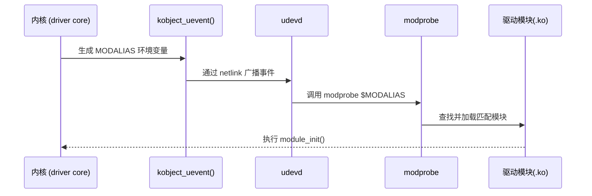

------

## 30.5　kobject_uevent() 与环境变量添加

函数定义：`lib/kobject_uevent.c`

```c
int kobject_uevent(struct kobject *kobj, enum kobject_action action)
{
	struct kobj_uevent_env *env;
	env = kzalloc(sizeof(struct kobj_uevent_env), GFP_KERNEL);

	add_uevent_var(env, "ACTION=%s", action_string);
	add_uevent_var(env, "DEVPATH=%s", devpath);
	add_uevent_var(env, "SUBSYSTEM=%s", subsystem);
	add_uevent_var(env, "MODALIAS=%s", modalias);

	netlink_broadcast(uevent_sock, env->buf, env->buflen, ...);
}
```

------

## 30.6　udev 监听机制

用户空间守护进程 `udevd` 在启动后会监听 `NETLINK_KOBJECT_UEVENT`。
 当内核通过 `kobject_uevent()` 广播时，udevd 收到事件后：

1. 解析环境变量；

2. 若发现 `MODALIAS`；

3. 执行：

   ```bash
   /sbin/modprobe $MODALIAS
   ```

例如：

```bash
/sbin/modprobe platform:led_demo
```

→ modprobe 会在 `/lib/modules/$(uname -r)/modules.alias` 查找匹配项。

------

## 30.7　MODULE_DEVICE_TABLE 宏的作用

`MODULE_DEVICE_TABLE()` 宏用于在编译阶段**生成模块与 modalias 的匹配关系**，
 使得 modprobe 能够自动识别模块是否支持某个设备。

### 示例：

```c
static const struct of_device_id led_of_match[] = {
    { .compatible = "nxp,imx6ull-led" },
    { }
};
MODULE_DEVICE_TABLE(of, led_of_match);
```

编译后，内核构建工具会生成 `modules.alias` 中的条目：

```
alias of:N*T*Cnxp,imx6ull-led* led_driver
```

这样，当内核发出：

```
MODALIAS=of:N*T*Cnxp,imx6ull-led*
```

时，`modprobe` 就能根据别名表加载 `led_driver.ko`。

------

## 30.8　设备模型与 modprobe 的协作关系

| 阶段         | 触发者                | 关键函数                         | 作用                            |
| ------------ | --------------------- | -------------------------------- | ------------------------------- |
| 设备注册     | `device_add()`        | `kobject_uevent(KOBJ_ADD)`       | 通知用户空间有新设备            |
| 用户空间监听 | `udevd`               | `NETLINK_KOBJECT_UEVENT`         | 接收内核事件                    |
| 匹配模块     | `modprobe`            | `/lib/modules/.../modules.alias` | 查找匹配模块                    |
| 模块加载     | `insmod` / `modprobe` | `sys_init_module()`              | 加载 .ko 并执行 `module_init()` |

------

## 30.9　常见 modalias 示例表

| 总线类型 | 示例 modalias                                           | 来源结构体        | 说明               |
| -------- | ------------------------------------------------------- | ----------------- | ------------------ |
| platform | `platform:led_demo`                                     | `platform_device` | name               |
| of       | `of:N*T*Cnxp,imx6ull-led*`                              | `device_node`     | compatible         |
| usb      | `usb:v1D6Bp0002d0100dc09dsc00dp01ic09isc00ip00in00`     | `usb_device`      | idVendor/idProduct |
| pci      | `pci:v00008086d000024F3sv00008086sd000024F3bc02sc80i00` | `pci_dev`         | vendor/device      |
| i2c      | `i2c:tmp102`                                            | `i2c_client`      | name               |
| spi      | `spi:spidev`                                            | `spi_device`      | name               |

------

## 30.10　调试与验证方法

| 目标               | 命令                                                     | 说明                                   |
| ------------------ | -------------------------------------------------------- | -------------------------------------- |
| 查看 modalias 文件 | `cat /sys/bus/platform/devices/led_demo/modalias`        | 输出 `platform:led_demo`               |
| 模拟触发加载       | `udevadm trigger --subsystem-match=platform`             | 手动触发 uevent                        |
| 查看 udev 日志     | `udevadm monitor --kernel --environment`                 | 实时打印内核事件                       |
| 查看 alias 表      | `modinfo led_driver.ko`                                  | 显示 `alias: of:N*T*Cnxp,imx6ull-led*` |
| 强制加载模块       | `modprobe platform:led_demo`                             | 手动验证自动加载路径                   |
| 禁用自动加载       | `echo 0 > /sys/bus/platform/drivers_autoprobe`           | 阻止自动探测                           |
| 查看 modules.alias | `grep led_driver /lib/modules/$(uname -r)/modules.alias` | 验证生成条目                           |

------

## 30.11　内核源码位置参考

| 文件路径                          | 内容                         |
| --------------------------------- | ---------------------------- |
| `drivers/base/bus.c`              | bus 属性与驱动绑定逻辑       |
| `lib/kobject_uevent.c`            | uevent 系统实现              |
| `scripts/mod/file2alias.c`        | MODULE_DEVICE_TABLE 解析工具 |
| `drivers/base/module.c`           | 模块 alias 注册逻辑          |
| `include/linux/mod_devicetable.h` | 各总线 alias 定义宏          |
| `kernel/module.c`                 | 模块加载与符号解析实现       |

------

## 30.12　小结

| 模块                | 作用                 | 关键函数                                      |
| ------------------- | -------------------- | --------------------------------------------- |
| modalias            | 驱动匹配标识字符串   | `of_modalias_node()`、`platform_device_add()` |
| uevent              | 内核事件传递机制     | `kobject_uevent()`                            |
| udevd               | 用户空间事件守护进程 | 监听 `NETLINK_KOBJECT_UEVENT`                 |
| modprobe            | 自动加载模块         | 根据 `modules.alias` 匹配                     |
| MODULE_DEVICE_TABLE | 模块别名生成宏       | 编译期生成 alias 表                           |

> **总结：**
>
> - modalias 是设备与模块系统的桥梁；
> - 内核通过 uevent 将其广播给用户空间；
> - udev 调用 modprobe 自动加载对应模块；
> - MODULE_DEVICE_TABLE 宏使编译生成 alias；
> - 这套机制实现了驱动加载的“全自动化”。

------


# 第31章 驱动卸载与 remove() 调用链

> 本章承接第 30 章（模块加载），系统解析驱动卸载阶段的完整流程。
>  内容从 `rmmod` 命令开始，追踪到 `driver_detach()`、`device_release_driver()`、`device_del()` 等核心函数的内部机制。
>
> ——理解这一章，就能彻底掌握 Linux 设备模型中 *设备与驱动生命周期的终止过程*。

------

## 31.1　主题引入：从自动加载到安全卸载

Linux 驱动生命周期包括三个主要阶段：

| 阶段         | 动作                  | 入口函数                       | 对象状态变化         |
| ------------ | --------------------- | ------------------------------ | -------------------- |
| **加载阶段** | 模块插入 / probe 成功 | `module_init()`、`probe()`     | `dev->driver = drv`  |
| **运行阶段** | 正常工作 / IO 调度    | ——                             | 驱动保持绑定         |
| **卸载阶段** | 模块卸载 / 解绑设备   | `rmmod`、`driver_unregister()` | `dev->driver = NULL` |

卸载阶段的重点是：
 如何 **解除设备与驱动的绑定**，并确保所有资源都被安全释放。

------

## 31.2　驱动卸载的三种触发方式

| 触发来源         | 场景示例              | 内核响应                                   |
| ---------------- | --------------------- | ------------------------------------------ |
| **手动卸载模块** | `rmmod led_driver.ko` | 执行 `driver_unregister()` → `remove()`    |
| **设备移除事件** | 热插拔设备断开        | `device_del()` → `device_release_driver()` |
| **总线注销**     | 平台或子系统退出      | 遍历总线设备并解绑驱动                     |

------

## 31.3　rmmod 的卸载流程

当用户执行 `rmmod led_driver` 时，系统调用链如下：

```text
sys_delete_module()
  ↓
free_module()
  ↓
driver_unregister()
  ↓
bus_remove_driver()
  ↓
driver_detach()
  ↓
device_release_driver_internal()
  ↓
drv->remove(dev)
```

可视化：

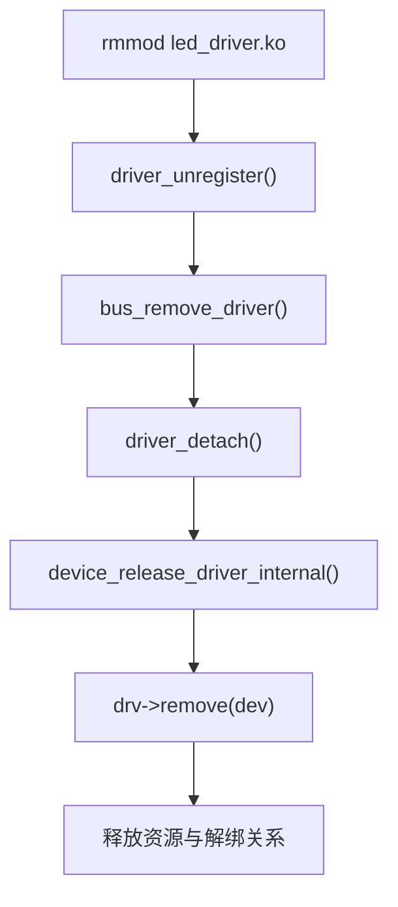

------

## 31.4　driver_unregister() 与 bus_remove_driver()

### 源码节选（drivers/base/driver.c）

```c
void driver_unregister(struct device_driver *drv)
{
	bus_remove_driver(drv);
}
void bus_remove_driver(struct device_driver *drv)
{
	driver_detach(drv);
	kobject_put(&drv->p->kobj);
}
```

`driver_detach()` 是真正执行解绑的关键步骤。

------

## 31.5　driver_detach()：驱动解绑入口

```c
void driver_detach(struct device_driver *drv)
{
	struct device *dev;

	while ((dev = driver_find_device(drv, NULL, NULL, NULL)))
		device_release_driver(dev);
}
```

含义：

- 遍历当前驱动所绑定的所有设备；
- 调用 `device_release_driver()` 解除每个设备的绑定。

------

## 31.6　device_release_driver_internal()：解绑核心逻辑

```c
static void device_release_driver_internal(struct device *dev,
					   struct device_driver *drv)
{
	if (dev->driver != drv)
		return;

	if (drv->remove)
		drv->remove(dev);

	dev->driver = NULL;
	kobject_uevent(&dev->kobj, KOBJ_UNBIND);
	put_device(dev);
}
```

### 关键点说明

| 步骤 | 动作                    | 说明                                  |
| ---- | ----------------------- | ------------------------------------- |
| 1️⃣    | 调用 `remove()`         | 由驱动开发者实现，用于释放资源        |
| 2️⃣    | 清空 `dev->driver`      | 解除驱动与设备的关系                  |
| 3️⃣    | 发出 `KOBJ_UNBIND` 事件 | 通知用户空间（udev）解绑事件          |
| 4️⃣    | 引用计数减一            | 若为最后引用，则触发释放（`release`） |

------

## 31.7　remove() 函数的作用与规则

驱动中定义：

```c
static int led_remove(struct platform_device *pdev)
{
    gpio_free(LED_GPIO);
    device_destroy(led_class, devt);
    pr_info("led_driver removed\n");
    return 0;
}
```

### remove() 的设计规范

| 规则                | 说明                                    |
| ------------------- | --------------------------------------- |
| 不返回错误码        | remove() 只应释放资源，不影响流程       |
| 负责资源复位        | 关闭设备、释放 GPIO、释放中断、销毁节点 |
| 不需调用 kfree(dev) | 设备内存由 core 管理                    |
| 保证幂等性          | 多次调用不应造成崩溃                    |

------

## 31.8　device_del()：设备删除流程

在设备层，`device_del()` 执行反向操作，负责删除 sysfs 节点与 class 链接。

```c
void device_del(struct device *dev)
{
	kobject_uevent(&dev->kobj, KOBJ_REMOVE);
	device_release_driver(dev);
	sysfs_remove_link(&dev->class->p->subsys.kobj, dev_name(dev));
	kobject_del(&dev->kobj);
}
```

### 调用时机：

- 模块卸载时（驱动侧触发）；
- 热插拔设备拔出时（设备侧触发）。

------

## 31.9　devres 自动释放机制

在使用 `devm_*()` 系列 API 的驱动中，
 资源释放不必手动执行，而由 `devres_release_all()` 自动完成。

```c
void devres_release_all(struct device *dev)
{
	struct devres_node *node;

	while ((node = list_first_entry_or_null(&dev->devres_head, ...)))
		devres_release(dev, node);
}
```

该函数会在：

```c
device_release_driver_internal()
```

中被自动调用，确保资源在 `remove()` 执行前释放。

------

## 31.10　卸载与 devm 的关系图

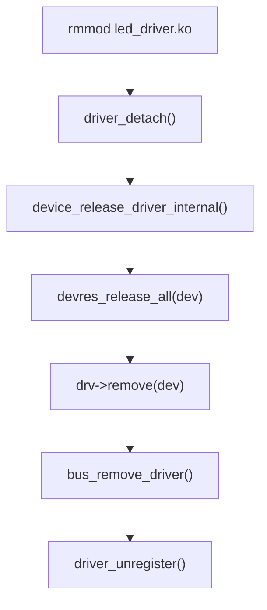

------

## 31.11　引用计数与 kobject_put() 关系

当驱动解除绑定后，`put_device()` 会使引用计数递减：

```c
void put_device(struct device *dev)
{
	if (dev)
		kobject_put(&dev->kobj);
}
```

若计数归零，则触发：

```
kobject_cleanup()
  ↓
dev->release(dev)
```

这就是为什么我们必须在注册设备时提供：

```c
dev->release = led_dev_release;
```

否则内核会报：

```
Device 'led_demo' does not have a release() function, it is broken and must be fixed.
```

------

## 31.12　完整的卸载流程图

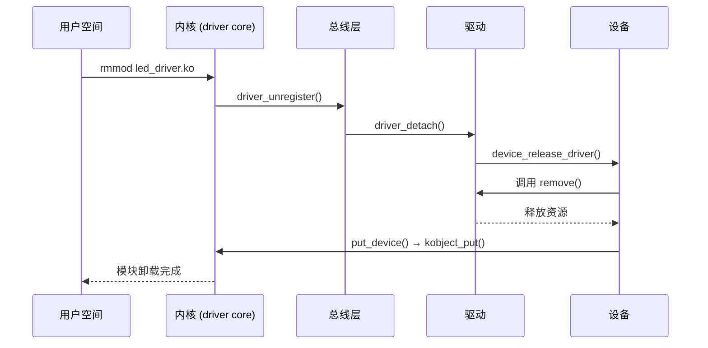

------

## 31.13　调试与验证方法

| 操作目标                | 命令                                               | 说明                              |
| ----------------------- | -------------------------------------------------- | --------------------------------- |
| 手动卸载模块            | `rmmod led_driver.ko`                              | 触发 driver_unregister()          |
| 查看解绑日志            | `dmesg                                             | grep led_driver`                  |
| 验证设备释放            | `ls /sys/class/leds/`                              | 确认节点消失                      |
| 查看 uevent             | `udevadm monitor --kernel --environment`           | 监听 `KOBJ_UNBIND`、`KOBJ_REMOVE` |
| 查看引用计数            | `grep . /sys/devices/.../refcnt`（若内核开启调试） | 验证对象释放                      |
| 检查 release() 是否执行 | 在 release 函数中 `pr_info()`                      | 确认资源销毁时机                  |

------

## 31.14　小结

| 阶段         | 关键函数                                      | 功能             |
| ------------ | --------------------------------------------- | ---------------- |
| 驱动卸载入口 | `rmmod` / `driver_unregister()`               | 启动卸载流程     |
| 驱动解绑     | `driver_detach()` / `device_release_driver()` | 解开绑定关系     |
| 资源释放     | `devres_release_all()` / `remove()`           | 清理设备资源     |
| sysfs 清理   | `device_del()`                                | 删除 `/sys` 节点 |
| 引用计数终止 | `put_device()` / `kobject_put()`              | 触发最终释放     |
| 用户空间通知 | `kobject_uevent(KOBJ_UNBIND/REMOVE)`          | 通知 udev        |

> **总结：**
>
> - 卸载过程的核心是：**解绑 → 释放资源 → 引用归零 → 删除节点**；
> - `remove()` 是驱动编写者唯一必须实现的卸载逻辑；
> - devm 系列函数自动管理大部分资源释放；
> - 若忘记定义 `release()`，内核将报错并拒绝释放设备。


------

# 第32章 多总线协作与复合设备机制（Composite / MFD / Component 框架）

> 本章重点：
>  在复杂 SoC 平台（如 i.MX、RK、STM32MP1）中，一个硬件节点往往同时涉及多个子设备（I²C 控制器、SPI 控制器、GPIO、ADC、音频 codec、PMIC 等）。
>
> 为了解决 “一个物理设备 → 多个逻辑功能驱动” 的问题，Linux 内核提供了三种重要机制：
>
> - **MFD（Multi-Function Device）框架**
> - **Component 框架（Master/Slave 绑定）**
> - **Composite 框架（设备聚合）**
>
> 本章将以驱动开发者视角剖析这三种机制在设备模型中的关系与实现逻辑。

------

## 32.1　主题引入：为何需要“复合设备机制”

在单功能设备中，一个驱动负责一个设备节点，例如：

```dts
led@0 {
    compatible = "nxp,imx6ull-led";
};
```

→ 对应一个 `platform_driver` 与一个 `platform_device`。

但在多功能设备（如 PMIC 或摄像头控制器）中，
 一个硬件块包含多个功能子模块：

```
PMIC
├── Regulator
├── GPIO
├── ADC
└── RTC
```

如果由单一驱动负责所有模块，
 将导致代码臃肿且难以维护。

因此 Linux 内核引入了三类协作机制：

| 框架          | 核心思想                 | 使用场景                     |
| ------------- | ------------------------ | ---------------------------- |
| **MFD**       | 父设备拆分子设备         | PMIC、Codec、Camera Hub      |
| **Component** | 主从驱动分离后协同初始化 | 显示子系统（VPU、HDMI、DRM） |
| **Composite** | USB 复合设备             | USB Gadget、UVC/UAC          |

------

## 32.2　MFD 框架（Multi-Function Device）

### 1️⃣ 核心结构

MFD 框架的核心是：

- 一个 **父设备（Parent Device）**；
- 多个 **子设备（Sub-Devices）**；
- 父设备负责资源划分与注册；
- 子设备独立加载各自的驱动。

### 2️⃣ MFD 注册流程

```text
父驱动 probe()
  ↓
mfd_add_devices(parent, platform_data)
  ↓
创建多个 platform_device 子节点
  ↓
platform_driver 匹配并加载各自驱动
```

### 3️⃣ 代码示例

```c
#include <linux/mfd/core.h>

static const struct mfd_cell pmic_cells[] = {
    { .name = "pmic-gpio", },
    { .name = "pmic-regulator", },
    { .name = "pmic-rtc", },
};

static int pmic_probe(struct platform_device *pdev)
{
    return mfd_add_devices(&pdev->dev, PLATFORM_DEVID_AUTO,
                           pmic_cells, ARRAY_SIZE(pmic_cells),
                           NULL, 0, NULL);
}

static int pmic_remove(struct platform_device *pdev)
{
    mfd_remove_devices(&pdev->dev);
    return 0;
}
```

注册后 `/sys/devices/platform/pmic/` 下会自动生成：

```
pmic-gpio/
pmic-regulator/
pmic-rtc/
```

------

## 32.3　mfd_add_devices() 的内部实现

```c
int mfd_add_devices(struct device *parent, int id,
		    const struct mfd_cell *cells, int n_devs,
		    struct resource *mem_base, int irq_base,
		    struct irq_domain *domain)
{
	for (i = 0; i < n_devs; i++)
		platform_device_register_full(&p);
}
```

功能：

- 为每个 `mfd_cell` 创建一个独立的 `platform_device`；
- 继承父设备的资源（mem/irq）；
- 自动挂载到同一总线（通常为 platform）。

------

## 32.4　Component 框架（主从设备绑定）

### 1️⃣ 背景

在 GPU、VPU、显示控制器（DRM）等复杂硬件中，
 各个功能模块驱动可能独立编译、独立注册。
 Component 框架的目的就是**将分散的驱动在运行时合并成一个逻辑整体**。

### 2️⃣ 基本接口

```c
int component_master_add_with_match(   struct device 					*dev,
									const struct component_master_ops  *ops,
									struct component_match 			  *match);

int component_add(struct device *dev, const struct component_ops *ops);
```

### 3️⃣ 工作机制

```text
Slave 驱动注册 → component_add()
  ↓
Master 驱动注册 → component_master_add_with_match()
  ↓
框架自动匹配所有子组件
  ↓
调用 master->bind() / slave->bind()
  ↓
系统功能生效
```

------

## 32.5　Component 框架示例：显示子系统（DRM）

```c
static const struct component_ops hdmi_component_ops = {
    .bind   = hdmi_bind,
    .unbind = hdmi_unbind,
};

static int hdmi_probe(struct platform_device *pdev)
{
    return component_add(&pdev->dev, &hdmi_component_ops);
}

static const struct component_master_ops display_master_ops = {
    .bind   = display_bind,
    .unbind = display_unbind,
};

static int display_probe(struct platform_device *pdev)
{
    struct component_match *match = NULL;
    component_match_add(&pdev->dev, &match, match_of_node, np_hdmi);
    return component_master_add_with_match(&pdev->dev, &display_master_ops, match);
}
```

结构图：

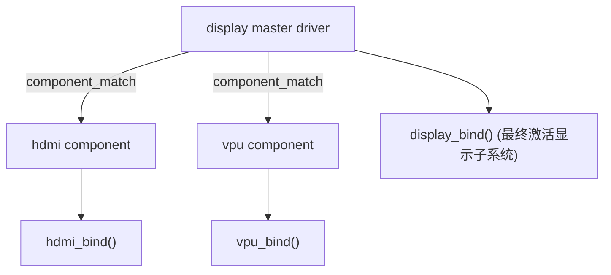

------

## 32.6　Composite 框架（复合 USB 设备）

该框架主要用于 **USB Gadget 子系统**，
 允许多个功能（如 UVC、UAC、Mass Storage）
 共享一个 USB 设备接口。

```c
usb_composite_probe(&composite_driver);
```

### 结构图：

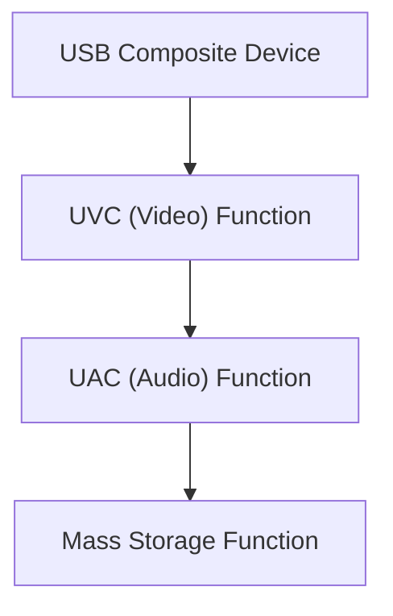

> 每个 Function 都对应一个独立的驱动模块，
>  Composite 框架负责统一描述符与端点管理。

------

## 32.7　三种机制的对比总结

| 特征       | MFD                       | Component                           | Composite               |
| ---------- | ------------------------- | ----------------------------------- | ----------------------- |
| 典型应用   | PMIC / Codec / Sensor Hub | DRM / VPU / GPU / Camera            | USB Gadget              |
| 主体逻辑   | 父驱动拆分子设备          | 主驱动协调多个子设备                | 聚合多个功能接口        |
| 注册入口   | `mfd_add_devices()`       | `component_master_add_with_match()` | `usb_composite_probe()` |
| 驱动关系   | 父子                      | 主从                                | 聚合                    |
| 通信方式   | 共享 resource / IRQ       | 回调 bind/unbind                    | function ops            |
| 总线层关系 | 统一 platform             | 可跨总线                            | USB 设备专用            |
| 生命周期   | 父决定子                  | Master 控制 Slave                   | USB Stack 控制          |

------

## 32.8　调试与验证

| 操作                    | 命令                                                | 说明                       |
| ----------------------- | --------------------------------------------------- | -------------------------- |
| 查看 MFD 子设备         | `ls /sys/devices/platform/pmic/`                    | 列出自动创建的子设备       |
| 查看 Component 绑定状态 | `cat /sys/kernel/debug/component`                   | 打印已注册 master/slave    |
| 查看 USB 复合设备       | `lsusb -v`                                          | 显示多个 function 描述符   |
| 模拟 MFD 卸载           | `rmmod pmic-core.ko`                                | 验证子设备同步释放         |
| 查看调用链              | `trace-cmd record -p function_graph -l component_*` | 调试 master/slave 绑定过程 |

------

## 32.9　小结

| 框架          | 目标                                 | 典型函数                            | 内核子系统    |
| ------------- | ------------------------------------ | ----------------------------------- | ------------- |
| **MFD**       | 把一个设备拆分为多个 platform 子设备 | `mfd_add_devices()`                 | PMIC, Codec   |
| **Component** | 把多个独立驱动绑定为一个逻辑整体     | `component_master_add_with_match()` | DRM, GPU, VPU |
| **Composite** | 把多个 USB 功能聚合为一个复合设备    | `usb_composite_probe()`             | USB Gadget    |

> **总结：**
>
> - MFD 解决“一个硬件多功能”问题；
> - Component 解决“多个驱动协作”问题；
> - Composite 解决“多个 USB 功能聚合”问题；
> - 它们共同构成了 Linux 驱动模型中“多对象协作”的基础层。


------

# 第33章 ACPI/OF 抽象与 fwnode_handle 框架

> 本章聚焦 Linux 驱动模型中的**固件节点抽象层（Firmware Node Abstraction）**，
>  解释 `fwnode_handle` 如何统一封装 **设备树（OF）** 与 **ACPI** 的属性访问机制。
>
> 该框架的目标是让驱动开发者无需区分“设备树”与“ACPI”来源，
>  通过统一接口访问硬件属性，从而实现平台无关的驱动代码。

------

## 33.1　主题引入：统一 ACPI 与 Device Tree 的抽象需求

Linux 支持多种固件描述机制：

| 固件类型             | 主要平台     | 数据结构             | 属性访问方式             |
| -------------------- | ------------ | -------------------- | ------------------------ |
| **Device Tree (OF)** | ARM / RISC-V | `struct device_node` | `of_property_read_*()`   |
| **ACPI**             | x86 / ARM64  | `struct acpi_device` | `acpi_evaluate_object()` |

在驱动层面，很多通用驱动需要同时支持：

- **x86 平台（ACPI）**
- **ARM 平台（Device Tree）**

过去的做法是写两套代码，例如：

```c
#ifdef CONFIG_OF
of_property_read_u32(np, "reg", &val);
#endif
#ifdef CONFIG_ACPI
acpi_evaluate_integer(handle, "_CRS", NULL, &val);
#endif
```

这严重破坏了驱动的可移植性。
 因此，内核引入了统一抽象层：**`struct fwnode_handle`**。

------

## 33.2　fwnode_handle 设计理念

`fwnode_handle` 是一个**统一封装固件节点（Firmware Node）**的结构体，
 可同时表示：

- Device Tree 的 `struct device_node`
- ACPI 的 `struct acpi_device`
- 甚至是 Software Node（虚拟节点）

从而提供统一访问接口。

### 定义（include/linux/fwnode.h）

```c
struct fwnode_handle {
	struct fwnode_operations *ops;
};
```

### 对应关系

| 固件来源      | 内核结构体           | fwnode_handle 获取方式       |
| ------------- | -------------------- | ---------------------------- |
| Device Tree   | `struct device_node` | `of_fwnode_handle(np)`       |
| ACPI          | `struct acpi_device` | `acpi_fwnode_handle(adev)`   |
| Software Node | `struct swnode`      | `software_node_fwnode(node)` |

------

## 33.3　struct fwnode_operations

不同固件类型通过各自的 ops 实现属性访问函数：

```c
struct fwnode_operations {
	bool (*property_present)(const struct fwnode_handle *fwnode, const char *propname);
	int  (*property_read_int_array)(const struct fwnode_handle *fwnode, const char *propname, unsigned int elem_size, void *val, size_t nval);
	const char *(*get_name)(const struct fwnode_handle *fwnode);
	struct fwnode_handle *(*get_parent)(const struct fwnode_handle *fwnode);
	...
};
```

当驱动调用 `fwnode_property_read_u32()` 时，
 框架会自动判断底层是 OF 还是 ACPI，并调用对应实现。

------

## 33.4　统一属性访问接口

| 函数                            | 说明             |
| ------------------------------- | ---------------- |
| `fwnode_property_read_u32()`    | 读取 32 位整数   |
| `fwnode_property_read_string()` | 读取字符串       |
| `fwnode_property_read_bool()`   | 读取布尔值       |
| `fwnode_property_present()`     | 判断属性是否存在 |
| `fwnode_get_parent()`           | 获取父节点       |
| `fwnode_get_next_child_node()`  | 获取子节点       |
| `fwnode_for_each_child_node()`  | 遍历子节点       |

示例：

```c
u32 val;
if (fwnode_property_read_u32(dev_fwnode(dev), "reg", &val) == 0)
    dev_info(dev, "reg = 0x%x\n", val);
```

> 上述代码在 ACPI 与 Device Tree 平台上都有效。

------

## 33.5　fwnode_handle 与 device 的关系

`struct device` 中新增成员：

```c
struct device {
	...
	struct fwnode_handle *fwnode;
	...
};
```

它在设备注册时被自动填充：

| 来源        | 赋值函数                             | 说明                                       |
| ----------- | ------------------------------------ | ------------------------------------------ |
| Device Tree | `device_add()` 调用 `set_dev_node()` | `dev->fwnode = of_fwnode_handle(np)`       |
| ACPI        | `acpi_bind_one()`                    | `dev->fwnode = acpi_fwnode_handle(adev)`   |
| 纯软件节点  | `device_register()` 后手动绑定       | `dev->fwnode = software_node_fwnode(node)` |

因此在驱动中，只需使用：

```c
struct fwnode_handle *fwnode = dev_fwnode(dev);
```

即可访问固件节点，而无需判断系统架构。

------

## 33.6　设备树与 ACPI 的映射关系

| 语义     | Device Tree 属性 | ACPI 对应     | fwnode 抽象接口                  |
| -------- | ---------------- | ------------- | -------------------------------- |
| 设备标识 | compatible       | _HID / _CID   | fwnode_device_is_compatible()    |
| 地址     | reg              | _CRS          | fwnode_property_read_u32_array() |
| 中断     | interrupt        | _INT          | fwnode_irq_get()                 |
| GPIO     | gpios            | _DSD / GpioIo | fwnode_gpiod_get_index()         |
| 子节点   | 子 node          | _SUB          | fwnode_get_next_child_node()     |

------

## 33.7　代码示例：统一读取属性

```c
#include <linux/fwnode.h>

static int demo_probe(struct platform_device *pdev)
{
	struct fwnode_handle *fwnode = dev_fwnode(&pdev->dev);
	u32 val;

	if (fwnode_property_read_u32(fwnode, "reg", &val))
		dev_warn(&pdev->dev, "no reg property found\n");
	else
		dev_info(&pdev->dev, "reg = 0x%x\n", val);

	return 0;
}
```

在设备树中：

```dts
demo@0 {
    compatible = "vendor,demo";
    reg = <0x10>;
};
```

在 ACPI 表中：

```asl
Device (DEMO)
{
    Name (_HID, "VEN0001")
    Name (_CRS, ResourceTemplate() { Memory32Fixed(ReadWrite, 0x10, 0x4) })
}
```

两者都能通过同一驱动逻辑解析成功。

------

## 33.8　fwnode_get_named_gpiod() 示例

GPIO 获取也通过 fwnode 统一：

```c
desc = fwnode_gpiod_get_index(fwnode, "reset", 0, GPIOD_OUT_LOW, "reset_gpio");
if (IS_ERR(desc))
    dev_warn(dev, "failed to get reset gpio\n");
```

对应：

- Device Tree:

  ```dts
  reset-gpios = <&gpio1 3 GPIO_ACTIVE_LOW>;
  ```

- ACPI:

  ```asl
  Name (_DSD, Package () {
      ToUUID ("daffd814-6eba-4d8c-8a91-bc9bbf4aa301"),
      Package () {
          Package () {"reset-gpios", Package () { ^GPIO, 3, 0 }},
      }
  })
  ```

------

## 33.9　与 Software Node 的扩展关系

Software Node (`struct software_node`)
 允许内核或模块在**没有设备树和 ACPI 的情况下**创建虚拟固件节点。

示例：

```c
static const struct property_entry demo_props[] = {
    PROPERTY_ENTRY_U32("reg", 0x10),
    PROPERTY_ENTRY_BOOL("enable"),
    {}
};

static const struct software_node demo_node = {
    .name = "demo",
    .properties = demo_props,
};

device_create_with_groups(&platform_bus, NULL, 0, NULL, NULL, "demo");

dev->fwnode = software_node_fwnode(&demo_node);
```

这样，驱动依旧能使用 `fwnode_property_read_*()` 系列接口访问属性。

------

## 33.10　可视化关系图

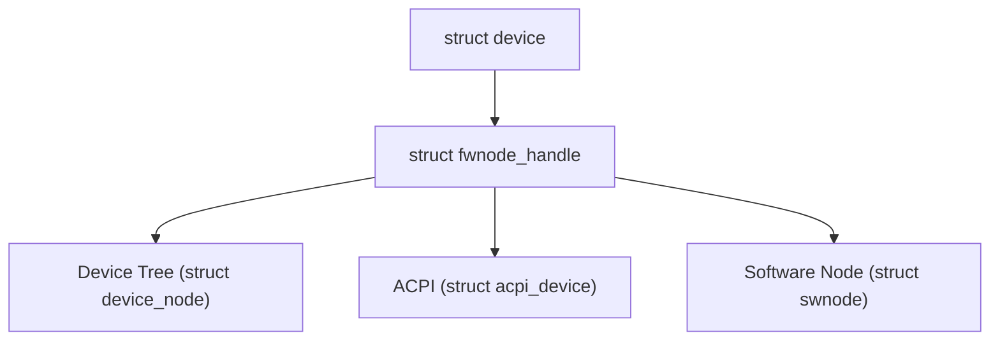

> 所有固件描述最终都通过同一个接口被访问。

------

## 33.11　调试与验证方法

| 操作               | 命令                                               | 说明             |
| ------------------ | -------------------------------------------------- | ---------------- |
| 查看设备树节点     | `cat /sys/firmware/devicetree/base/.../compatible` | 验证 OF 属性     |
| 查看 ACPI 设备     | `cat /sys/bus/acpi/devices/*/hid`                  | 验证 HID         |
| 验证统一接口       | 内核打印 `dev_info(dev, "reg = ...")`              | 确认属性读取成功 |
| 调试 Software Node | `grep demo /sys/kernel/debug/sofwnodes`            | 显示虚拟节点信息 |
| 检查 fwnode 绑定   | `cat /sys/devices/.../fwnode`（调试内核）          | 验证 handle 链接 |

------

## 33.12　小结

| 特性         | 说明                                               |
| ------------ | -------------------------------------------------- |
| **统一性**   | 融合 ACPI、Device Tree 与 Software Node            |
| **透明性**   | 驱动代码无需关心底层固件类型                       |
| **可扩展性** | 允许动态注册虚拟固件节点                           |
| **关键结构** | `struct fwnode_handle`、`struct fwnode_operations` |
| **关键接口** | `fwnode_property_read_*()`、`dev_fwnode()`         |
| **典型场景** | 通用传感器、GPIO、regulator、IIO 框架              |

> **总结：**
>
> - `fwnode_handle` 是 Linux 驱动模型中的“固件抽象层”；
> - 统一封装 ACPI、Device Tree、Software Node；
> - 让驱动代码实现一次编写，多平台运行；
> - 彻底消除 “#ifdef CONFIG_OF / CONFIG_ACPI” 的代码割裂问题。


------

# 第34章 Driver Core 全景总结与架构整合

> 本章将以系统性视角，
>  对前 33 章所讲述的所有核心结构体、调用路径、属性体系和生命周期管理机制进行统一整合。
>
> 我们将从四个层次——**对象模型、调用链、资源管理、调试验证**——
>  展示 `device`、`driver`、`bus`、`class`、`kobject` 等核心结构之间的内在逻辑。
>
> ——理解本章后，你将具备阅读、修改、扩展 Linux Driver Core 的整体能力。

------

## 34.1　主题引入：从单设备到全局模型

设备驱动的本质，是**在内核对象系统（kobject）之上组织和管理硬件资源的抽象层**。
 驱动核心（driver core）提供了如下统一框架：

| 模块层次       | 内核结构体                                     | 作用                                    |
| -------------- | ---------------------------------------------- | --------------------------------------- |
| **对象抽象层** | `kobject`、`kset`                              | 通用对象管理与 sysfs 映射               |
| **设备模型层** | `device`、`device_driver`、`bus_type`、`class` | 管理设备与驱动的绑定关系                |
| **生命周期层** | `get_device()`、`put_device()`、`devres`       | 控制内存与资源释放                      |
| **属性层**     | `DEVICE_ATTR()`、`CLASS_ATTR()`、`BUS_ATTR()`  | 向用户空间导出调试与控制接口            |
| **固件抽象层** | `fwnode_handle`                                | 统一 Device Tree / ACPI / Software Node |

------

## 34.2　核心对象体系概览

Driver Core 是围绕五大核心结构构建的：

| 层次       | 结构体                 | 主要作用                         |
| ---------- | ---------------------- | -------------------------------- |
| **基础层** | `struct kobject`       | 提供统一对象模型和 sysfs 接口    |
| **抽象层** | `struct device`        | 代表一个物理或虚拟设备           |
| **驱动层** | `struct device_driver` | 管理设备操作函数（probe/remove） |
| **总线层** | `struct bus_type`      | 负责设备与驱动的匹配逻辑         |
| **类别层** | `struct class`         | 用于导出统一设备节点到 `/dev/`   |
| **固件层** | `struct fwnode_handle` | 抽象硬件描述（OF/ACPI）          |

------

## 34.3　内核设备模型对象关系图

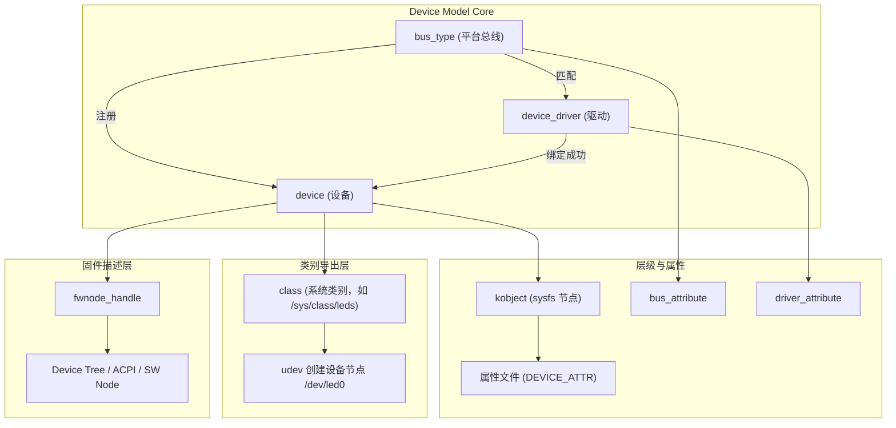

------

## 34.4　设备注册到驱动绑定全过程

这一过程贯穿了整个 Driver Core：

```text
platform_device_register()        → 注册设备
  ↓
device_add()
  ↓
bus_add_device()
  ↓
bus_probe_device()
  ↓
driver_probe_device()
  ↓
drv->probe(dev)                   → 绑定成功
```

卸载反向过程：

```text
rmmod
  ↓
driver_unregister()
  ↓
driver_detach()
  ↓
device_release_driver()
  ↓
drv->remove(dev)
  ↓
put_device() → release()
```

> 这两条路径构成了 Driver Core 的**完整生命周期闭环**。

------

## 34.5　核心结构体之间的关联关系

| 结构体                 | 内部成员                       | 关联对象         | 说明              |
| ---------------------- | ------------------------------ | ---------------- | ----------------- |
| `struct device`        | `struct device_driver *driver` | 指向当前绑定驱动 | 建立设备驱动关联  |
| `struct device`        | `struct bus_type *bus`         | 所属总线         | 平台或外设类型    |
| `struct device`        | `struct class *class`          | 所属类别         | 对应 /sys/class   |
| `struct device`        | `struct fwnode_handle *fwnode` | 固件节点         | 访问 DT/ACPI 属性 |
| `struct device_driver` | `struct bus_type *bus`         | 驱动所属总线     | 匹配规则定位      |
| `struct bus_type`      | `int (*match)()`               | 匹配函数         | 控制设备/驱动关联 |
| `struct class`         | `struct kset *p->subsys`       | sysfs 目录       | 管理设备节点集合  |

------

## 34.6　资源与生命周期管理

| 功能模块         | 内核接口                                                    | 说明                      |
| ---------------- | ----------------------------------------------------------- | ------------------------- |
| **引用计数**     | `get_device()` / `put_device()`                             | 防止过早释放              |
| **自动资源回收** | `devm_kzalloc()` / `devm_ioremap()` / `devm_gpio_request()` | 失败自动释放              |
| **手动释放**     | `release()`                                                 | 必须定义，否则警告        |
| **依赖管理**     | `device_link_add()`                                         | 控制 suspend/resume 顺序  |
| **对象销毁**     | `kobject_put()` → `kobject_cleanup()`                       | 内存与 sysfs 节点同步销毁 |

------

## 34.7　属性层次与访问规则

| 属性类型 | 宏定义             | 挂载位置                | sysfs 路径                 | 用途         |
| -------- | ------------------ | ----------------------- | -------------------------- | ------------ |
| 设备属性 | `DEVICE_ATTR_RW()` | `device->kobj`          | `/sys/devices/.../`        | 控制单设备   |
| 类别属性 | `CLASS_ATTR_RW()`  | `class->p->subsys.kobj` | `/sys/class/.../`          | 控制整类设备 |
| 驱动属性 | `DRIVER_ATTR_RW()` | `driver->p->kobj`       | `/sys/bus/.../drivers/...` | 控制驱动行为 |
| 总线属性 | `BUS_ATTR_RW()`    | `bus->p->subsys.kobj`   | `/sys/bus/.../`            | 控制全局总线 |
| 模块属性 | `module_param()`   | `sysfs`/`/proc`         | `/sys/module/...`          | 参数化控制   |

> 所有属性最终都基于 `struct attribute` + `sysfs_ops`。

------

## 34.8　统一调试路径

常见调试命令：

| 目标         | 命令                                                   | 说明                   |
| ------------ | ------------------------------------------------------ | ---------------------- |
| 查看设备     | `ls /sys/devices/platform/`                            | 验证注册是否成功       |
| 查看驱动绑定 | `ls /sys/bus/platform/drivers/`                        | 列出绑定关系           |
| 手动绑定     | `echo led_demo > /sys/bus/platform/drivers_probe`      | 强制 probe             |
| 手动解绑     | `echo 20a0000.gpio > /sys/bus/platform/drivers_unbind` | 解除绑定               |
| 查看属性     | `cat /sys/class/leds/led0/brightness`                  | 查看值                 |
| 动态加载模块 | `udevadm monitor --kernel --environment`               | 查看 modalias 自动加载 |
| 检查依赖     | `grep . /sys/bus/*/drivers/*/power/runtime_status`     | 验证电源管理           |

------

## 34.9　Driver Core 核心调用栈全景图

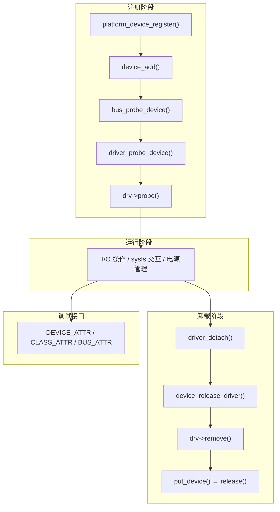

------

## 34.10　Driver Core 内部调用结构表

| 阶段     | 入口函数                     | 内部函数                                      | 说明               |
| -------- | ---------------------------- | --------------------------------------------- | ------------------ |
| 注册设备 | `platform_device_register()` | `device_initialize()` / `device_add()`        | 初始化并注册设备   |
| 注册驱动 | `platform_driver_register()` | `driver_register()`                           | 向总线注册驱动     |
| 匹配绑定 | `bus_probe_device()`         | `driver_probe_device()`                       | 匹配后调用 probe   |
| 自动加载 | `device_add()`               | `kobject_uevent()`                            | 生成 MODALIAS      |
| 卸载解绑 | `rmmod`                      | `driver_detach()` / `device_release_driver()` | 调用 remove 并清理 |
| 销毁对象 | `put_device()`               | `kobject_put()`                               | 引用归零时释放     |
| 调试接口 | `/sys/*`                     | `sysfs_create_file()`                         | 导出属性节点       |

------

## 34.11　Driver Core 与电源管理集成

Driver Core 与 PM（Power Management） 子系统通过 **device_link** 与 **dpm_list** 机制协作。

| 功能             | 内核结构                                       | 说明                        |
| ---------------- | ---------------------------------------------- | --------------------------- |
| suspend 顺序管理 | `device_link_add()`                            | 保证依赖先 suspend          |
| runtime 电源管理 | `pm_runtime_enable()` / `pm_runtime_suspend()` | 设备空闲自动休眠            |
| 系统休眠         | `device_shutdown()`                            | 遍历所有设备执行 shutdown() |

流程：

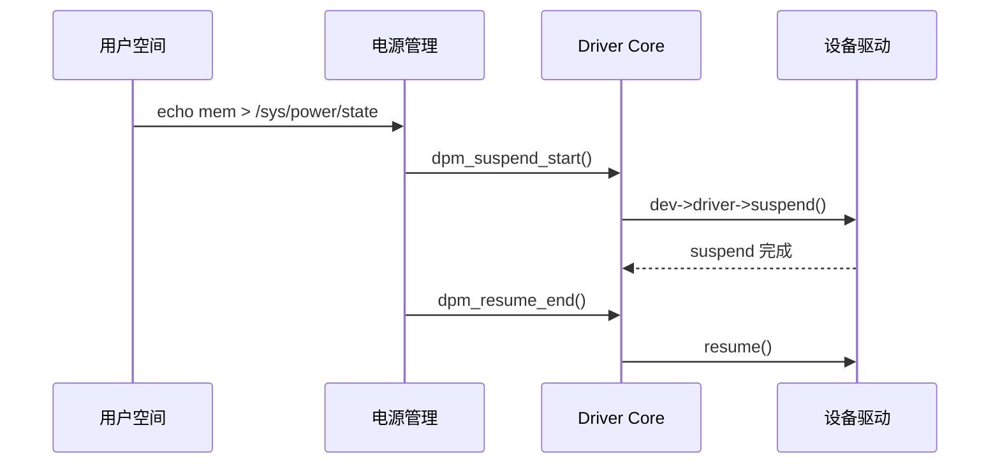

------

## 34.12　Driver Core 全景汇总表

| 层次   | 核心结构       | 关键函数                                    | 典型文件                  |
| ------ | -------------- | ------------------------------------------- | ------------------------- |
| 对象层 | kobject / kset | `kobject_add()` / `sysfs_create_file()`     | `lib/kobject.c`           |
| 设备层 | device         | `device_add()` / `device_del()`             | `drivers/base/core.c`     |
| 驱动层 | device_driver  | `driver_register()` / `driver_unregister()` | `drivers/base/driver.c`   |
| 总线层 | bus_type       | `bus_register()` / `bus_probe_device()`     | `drivers/base/bus.c`      |
| 类别层 | class          | `class_register()` / `device_create()`      | `drivers/base/class.c`    |
| 资源层 | devres         | `devm_*()` / `devres_release_all()`         | `drivers/base/devres.c`   |
| 固件层 | fwnode_handle  | `fwnode_property_read_*()`                  | `drivers/base/property.c` |
| 电源层 | device_link    | `device_link_add()` / `device_pm_add()`     | `drivers/base/power/`     |

------

## 34.13　全体系总结图

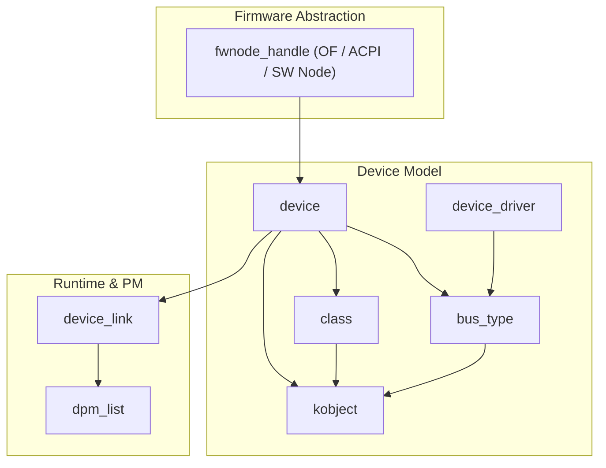

> 图中每一条连线对应一种引用或依赖关系。
>  所有模块最终在 `/sys` 文件系统中具象化。

------

## 34.14　全书结语

Linux 的 **Driver Core** 是一个贯穿内核各层的统一管理框架。
 它让驱动开发者只需关注设备逻辑，而无需手动维护对象关系。

> **一句话总结：**
>  Linux 设备模型是以 `kobject` 为核心的层级对象系统，
>  以 `device` / `driver` / `bus` / `class` 为四大支柱，
>  以 `fwnode` / `devres` / `sysfs` 为三大支撑层，
>  实现了内核对象的统一生命周期、属性暴露与依赖管理。

------

