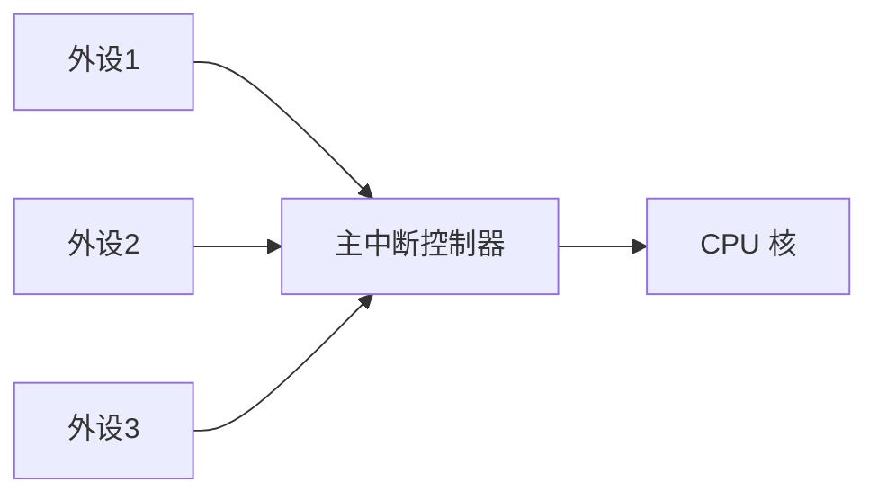
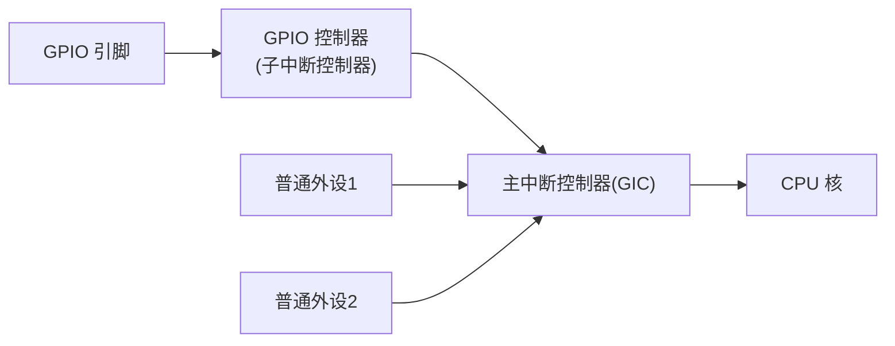
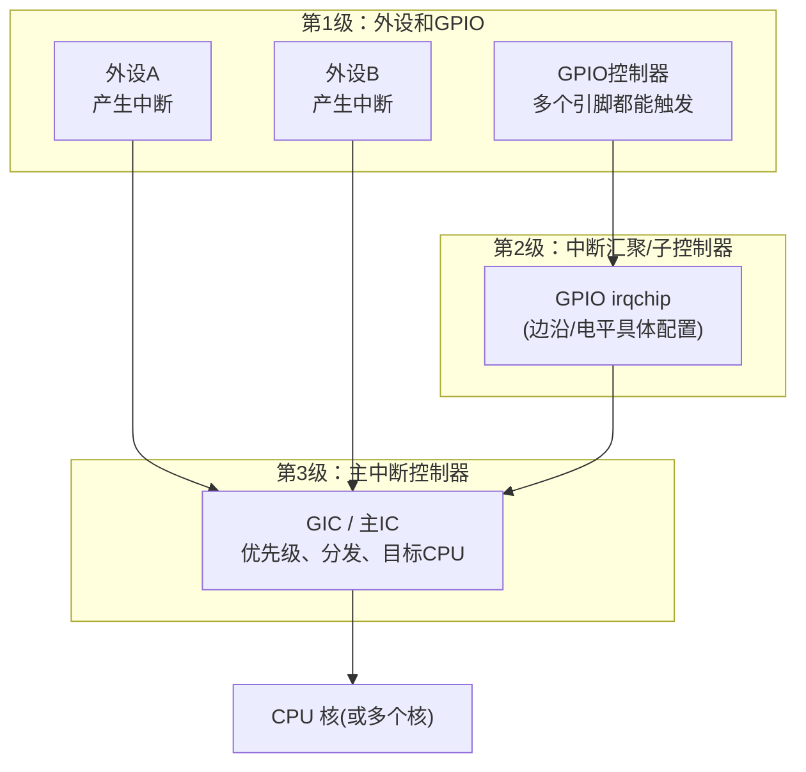

# 第2章 SoC 视角下的中断体系

## 2.1 章节内容说明

第1章把“中断”放在计算机发展和操作系统出现的背景下，说明了它为什么重要、为什么必须存在、为什么要短。本章往下走一步：把中断放进一块**真实的 SoC** 里看。只要进入 SoC 级别，问题立刻变多：

1. 不再是一条中断线，而是几十条、上百条中断源；
2. 不再只有“主中断控制器”，还会有 GPIO 这样的外设自己也能发中断；
3. 不再只有一个 CPU 核，可能要把中断分发到不同的核上；
4. 不同中断源对触发方式、电平保持、清除方式的要求不一样。

所以，本章的目标是把下面几件事讲清楚：

- 为什么 SoC 里一定要有“中断控制器”这种部件；
- 为什么会出现“多级/级联中断”（比如“GPIO → GIC”）；
- 为什么很多板子上“DTS 写的那个中断”跟 CPU 最终看到的不是一个号；
- 为什么操作系统必须把这些硬件形态统一起来，才能给驱动一个稳定的“中断号”。

本章仍然是概念性章节，但会开始出现 SoC 场景、控制器角色和简单的设备树形态描述，为下一章真正进入“Linux 的中断抽象”做铺垫。

------

## 2.2 单控制器模型：理想但不真实的情况

先看最简单的、教科书式的情况：一块芯片上，所有外设都把中断线直接接到同一个中断控制器上，这个控制器再接到 CPU。可以用下面的图表示：

在这个模型下，中断控制器的工作非常明确：

1. 收集来自各个外设的中断请求；
2. 把“是哪个外设发的中断”编码成一个可识别的中断号；
3. 把这次中断送给 CPU；
4. 等 CPU 处理完后，再把这次中断“结束/确认”掉。

如果世界永远是这样，操作系统其实可以非常简单：CPU 收到一个中断号，查一下表，调用对应的处理函数即可。

问题是，**绝大多数实际 SoC 都不是这样。**

------

## 2.3 多源中断问题：GPIO 也能发中断之后，一切都变复杂了

现代 SoC 上，有一类外设既是“通用 IO”，又可以“作为外部中断源”使用，比如很多 ARM SoC 上的 GPIO 控制器。它们的工作方式大致是：

1. 引脚由 GPIO 控制器管理；
2. 引脚可以配置成“上升沿触发”“下降沿触发”“低电平触发”等；
3. 一旦满足触发条件，**GPIO 控制器本身就会生成一条中断请求**。

问题是：**GPIO 控制器本身通常不会直接连 CPU**，它还要再“汇报”给更高一级的中断控制器（比如 GIC）。于是就变成下面的情况：

这就是所谓的**多级/级联中断**：下面这一层（GPIO）自己能产生中断，但它要靠上一层（GIC）来真正通知 CPU。

由此引出两个非常现实的问题：

1. **CPU 实际上只直接看到了最上面那一层的中断号**；
2. **下面这一层的中断号要先在上面这一层“登记”一下，CPU 才能识别**。

所以，在这种 SoC 上，中断号就不能再简单地理解为“外设的第 N 条线”，而应该理解成：

> **“子控制器里的第 X 条中断源，通过父控制器里的第 Y 个入口，最终送到了 CPU”**。

这也是后面 Linux 一定要有“中断父节点”“中断控制器节点”“中断号映射”的根本原因。

------

## 2.4 中断控制器在 SoC 里的职责（不是可选的）

当中断源变多、变分层之后，“中断控制器（Interrupt Controller）”在整个系统里就不是一个“辅助外设”，而是一个**必须存在的中间层**，它要完成至少下面这5件事：

1. **收集**：从多个外设、多级控制器手里把中断请求收集起来，而不是只能接一个；
2. **识别**：判断这一次中断到底是哪一个来源发出来的（向量化的核心意义）；
3. **裁决**：在同时有多个中断到达时，决定先处理哪一个（优先级、屏蔽、嵌套）；
4. **通知**：把最终确认过的中断送给 CPU（可能是一个或多个 CPU 核）；
5. **回收**：在 CPU 处理完之后，负责把这次中断“结束掉/清掉/允许下次再来”。

如果没有这五步，SoC 上就会出现下面几种很难处理的情况：

- 一个 GPIO 引脚因为没人清中断，一直向上报，主控制器不停地给 CPU 发中断，形成中断风暴；
- CPU 收到了“有中断”这个事实，但不知道“是谁发的”，还得再跑一段软件逻辑去枚举；
- 两个外设同时发中断，CPU 不知道先处理谁，结果把一个需要低延迟的中断拖慢了；
- 一个中断源还在处理，另一个中断源又来了，结果前一个被“覆盖”了。

也就是说，**一旦中断源不是“一条线”，中断控制器就成了 SoC 里的调度器。**

------

## 2.5 为什么会有多级/级联中断

多级中断（cascaded interrupt）不是为了“搞复杂”，而是被下面三个现实问题逼出来的：

1. **中断线数量不够**
   - 主控制器的中断输入是有限的；
   - 但 GPIO 引脚可能有几十上百个都想当中断；
   - 只能让 GPIO 那一层先“汇总”，再用一两条线报给 GIC。
2. **功能/时序不一致**
   - 主控制器只管中断的分发、优先级、CPU 目标；
   - GPIO 那一层要管的是“上升沿/下降沿/双边沿/电平”等更细的触发条件；
   - 所以要拆成两层，各司其职。
3. **可复用性要求**
   - 同一套主控制器（比如 GIC）要在很多产品线上用；
   - 但下面每个 SoC 的 GPIO 数量、触发方式、功耗要求都不一样；
   - 最合理的方式就是统一主控制器，然后按产品加“子中断控制器”。

这就是为什么在很多 ARM SoC、特别是带 GIC 的平台上，会看到“主中断控制器 + 很多挂上去的 GPIO irqchip”的形态。
 从操作系统视角看，这就等于说：

> **中断源在硬件里是有父子关系的，OS 必须知道这个关系，才能把“GPIO 的第 7 个中断”最终变成“CPU 能识别的一个逻辑中断号”。**

下面这张图可以作为本节的标准图示：

这张图的重点是：**不是所有中断都直接进 GIC，有的要先进 GPIO irqchip，再进 GIC。**
 后面讲 Linux 的 irq_domain 时，这张图会直接映射成“父 domain / 子 domain”那种层级。

------

## 2.6 多核/SMP 下的中断分发问题

当 SoC 上有不止一个 CPU 核时，中断控制器还多了一项责任：**这次中断要交给哪一个核处理**。这件事之所以要在控制器层面解决，有两个原因：

1. **外设不知道也不该知道系统当前在哪个核上最合适处理**；
2. **OS 可能希望把某些中断固定给某个核**（比如定时器/IPI），而把高负载中断在核之间做分摊。

因此，多核系统的中断控制器通常会具备下面这些能力中的一部分：

- 给固定的 CPU 发中断（固定路由）；
- 按优先级选择一个当前可用的 CPU；
- 允许 OS 在运行时重配中断的目标 CPU；
- 支持跨 CPU 的中断（IPI）以便做调度、TLB 失效等系统性工作。

这一节的要点是：**一旦进入 SoC 和 SMP，单纯“有一个中断号”已经不够了，OS 还要知道“它来自哪一层、它该分给谁、它的触发语义是什么”。**
 这正是 Linux 一定要把中断拆成多个结构体、多个层次的直接动因。

------

## 2.7 与设备树的衔接（预告）

在设备树（DTS）里之所以要写：

- `interrupt-controller`
- `interrupt-parent`
- `interrupts = <...>`

是因为**硬件上确实存在这种父子关系、分层关系**；OS 必须知道“这条中断是从哪一层来的、是谁的孩子、要走到哪个总的中断控制器那里去”。
 所以，下一章在讲“Linux 中断抽象（irq_chip / irq_domain / irq_desc）”时，读者可以直接把这一章的图映射过去：**GPIO irqchip 对应子域，GIC 对应父域，设备树就是把这条路径描述出来的文本。**

------

## 2.8 本章小结

1. 把中断放进一块真实的 SoC 里看，就会发现：**中断源很多、分好几层、而且不全是直接连 CPU 的**。
2. 中断控制器在 SoC 里不是“可选的外设”，而是**必须的汇聚/裁决/分发层**，负责把“来自很多地方的不同时序的中断”变成“能交给 CPU 的一种统一形式”。
3. 出现多级/级联中断（GPIO → GIC）的根本原因有三条：**中断线不够、功能不一致、产品线要复用。**
4. 一旦有了多级中断，**中断就天然带“父子关系”**，操作系统必须知道这个关系，否则驱动拿到的只是“一个数字”，但这个数字未必能直接送到 CPU。
5. 多核/SMP 场景又引入了“中断要分配给哪一核”的问题，这也只能在中断控制器和 OS 这一层解决。
6. 这一章到此为止仍然不需要 Linux 的专有名词；从下一章开始，才需要解释：**Linux 为什么要用 irq_chip/irq_domain/irq_desc 这一组三件套，来把这一章的硬件现实抽成一套统一的、驱动能用的中断模型。**