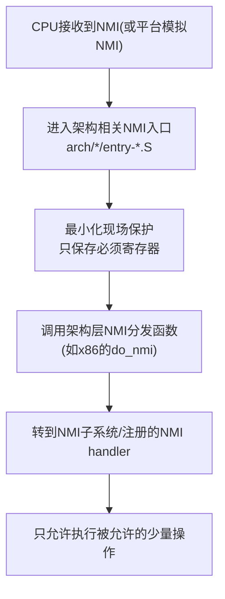
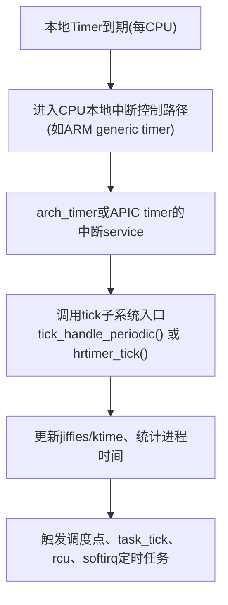
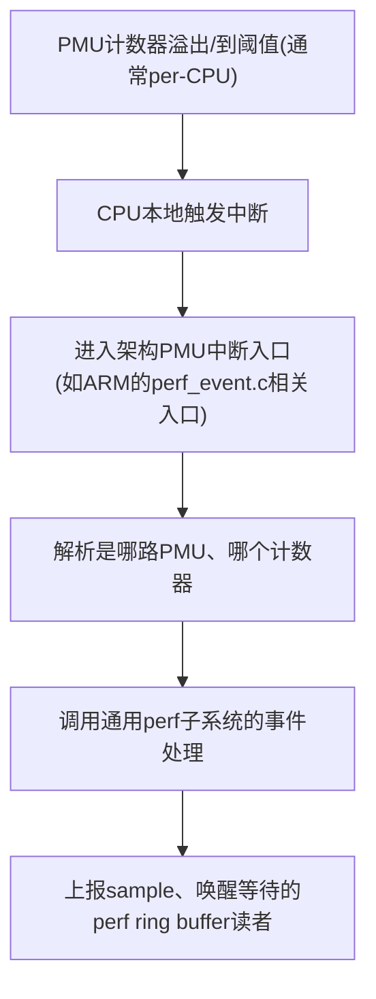
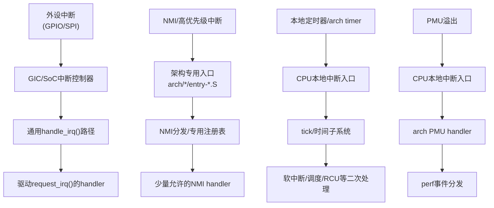
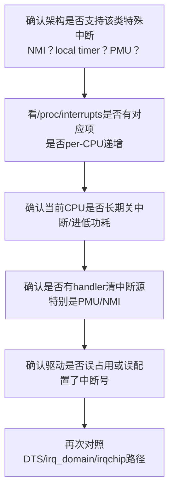

# 第13章 特殊与高优先级中断：NMI、定时器、性能中断

## 章节内容说明

本章聚焦那些**不按照普通外设中断路径办事**的中断类型：NMI（Non-Maskable Interrupt，不可屏蔽中断）、本地定时器/时钟中断（local timer / tick）以及 PMU/性能计数器中断。它们的共同点是：**优先级高、路径特殊、调度/时钟子系统强依赖、驱动不应该随便碰**。本章目标是：

1. 说明这些中断在内核中的入口、建模方式与和普通 IRQ 的差异；
2. 说明它们为什么常常不走平台通用的 request_irq → 中断控制器路径；
3. 给驱动开发者一个明确的“能做/不能做”边界，避免误用这些中断资源；
4. 给调试者一套判断“这个中断为什么抓不到/不能改触发/绑不到 CPU”的参考流程。

> 说明：本章以通用 Linux 内核机制为主，穿插 ARM 平台（如 i.MX6ULL 上的 GIC + local timer、ARMv7/ARMv8 的本地定时器、PMU）说明。不同架构（x86 vs ARM）会点名差异。

------

## 13.1 NMI 在 Linux 中的入口与约束

### 13.1.1 是什么

- **定义**：NMI 是一种**不可屏蔽**的中断源，CPU 在大多数中断屏蔽场景（如关本地 IRQ）下仍然要对它做响应。
- **定位**：NMI 不面向普通外设驱动，它更多是**内核自用/平台自用**，典型用途包括：锁死检测（lockup/watchdog）、性能采样、严重错误报告。
- **历史/背景**：
  - 在 x86 上，NMI 是架构级能力，内核有明确的 NMI 处理框架。
  - 在很多 ARM SoC 上并没有真正意义上的“硬 NMI”，而是用**高优先级 FIQ**或**平台私有的高优先级中断**去“模拟”类似语义，因此“有没有真正 NMI”要看 SoC 和内核移植。
  - 因此：**不能假定 ARM = 一定有 NMI**，要看 `arch/arm/` 或 `arch/arm64/` 下的中断子系统初始化代码。

### 13.1.2 要解决的问题

NMI 要解决的是普通 IRQ 解决不了的两个场景：

1. **IRQ 被关了还得打断**：如内核正在处理某个关键路径，关了本地中断，但 watchdog 必须还能抢过来。
2. **要尽量避免被延迟**：优先级要高、不能排队在普通硬中断后面。

换句话说，NMI 的核心诉求是**可靠打断**，而不是“帮设备上报数据”。

### 13.1.3 内核里的基本实现思路

不同架构实现细节不同，但通用思路可以抽象成下面这条链路：



关键特点：

- 入口在**架构专用路径**，不是普通 `handle_irq()` 那条。
- 现场保护是**最小化**的，因为 NMI 需要尽量短。
- 分发给的 handler 是**专用注册接口**，并不是你熟悉的 `request_irq()` 那组。

### 13.1.4 约束（非常重要）

NMI handler 一般有这些**强约束**，这一段必须让驱动开发者牢记：

1. **不能睡眠**：不能调用可能 schedule 的接口，也不能拿可能睡眠的锁（如普通 mutex）。
2. **不能做重锁顺序**：因为 NMI 能打断几乎任何上下文，很容易和正在持锁的上下文形成死锁。
3. **不能依赖普通中断上下文的设施**：比如有些统计、延迟队列、work 触发点，在 NMI 下是不安全的。
4. **执行时间必须极短**：NMI 本身就很高优先级，如果你在里面跑长逻辑，会阻塞真正的中断与调度。
5. **不能随意打印**：过度的 printk 会破坏现场，有的架构对 NMI 下的 printk 另行处理。

所以，NMI 的编程模型与普通驱动的中断处理函数**不是同一等级的 API**。驱动如果想做高频采样，应优先考虑：**PMU 中断、hrtimer + 普通 IRQ、或工作队列**，而不是抢 NMI。

### 13.1.5 NMI 与 irq_domain/irq_chip 的关系

- 通常 NMI **不会**作为一个普通的 `irq_domain` 域里申请出来的中断号给你用；
- 有的平台会在 GIC 之外再做一层“高优先级/安全世界的中断入口”，这条路径也不会走你设备树里写的 `interrupts = <...>;`；
- 因此，在设备树里**不要企图**写一个“这是 NMI”的中断然后 `request_irq()`；大概率根本不会触发，或根本不会映射到你那里。

### 13.1.6 示例：x86 NMI 注册（概念性代码）

```c
/* 概念性示例，展示“专用注册入口”的意思 */
int register_nmi_handler(unsigned int type,
                         nmi_handler_t handler,
                         unsigned long flags,
                         const char *name);
```

特点：

- 有**专用**的 `register_nmi_handler()`；
- 有**类型**区分（性能监控、watchdog、unknown NMI 等）；
- 和普通的 `request_irq()` **是两条线**；
- 可以看到：NMI 不是面向“随便一个外设”的。

### 13.1.7 调试与验证要点

1. **先确认架构是不是有 NMI**：看 `dmesg` 里是否有 NMI/lockup 相关初始化，或看 `arch/*/kernel/` 里的 NMI 支持。
2. **确认是不是被 NMI 打断了**：很多内核会在 NMI 打印里附带当前寄存器和栈信息，用来查死锁。
3. **如果你写的平台驱动“以为自己是 NMI”但收不到中断**：先检查 DTS 和中断控制器，十有八九你拿到的是普通 SPI/PPIs，而不是 NMI。
4. **遇到 NMI storm**：说明你的 NMI 源一直在触发，但 NMI handler 没有清除源，排查思路和普通中断 storm 类似，但要注意 NMI handler 可用的 API 更少。

------

## 13.2 本地定时器中断与 tick 子系统

这一节目标是把“为什么定时器中断看起来不像普通 IRQ”的问题说清楚——很多人想用“中断调度器”或“统计延迟”时，会发现它根本不在自己的控制范围里。

### 13.2.1 是什么

- **本地定时器中断（per-CPU timer / local timer）**是每个 CPU 各自拥有的定时中断源，用于驱动：
  1. **内核的时间轮/时间过期检查**（scheduler tick）；
  2. **进程时间统计**；
  3. **调度器周期性调度点**；
  4. **NOHZ / tickless 模式下的下一次唤醒**。
- 在 ARM 上，这通常由 **ARM architected timer** 或本地 timer 实现（如 ARMv7 的 local timer，ARMv8 的 generic timer），而不是外部中断控制器的 SPI。
- 在 x86 上，则是本地 APIC timer。

### 13.2.2 要解决的问题

普通的外设中断是**事件驱动**的：设备有事 → 拉中断 → 驱动处理。
 本地定时器中断是**内核自己要的节拍**：**就算没有外设，它也必须来**，不然时间子系统、调度器都跑不起来。

因此它要解决的是：

- 内核需要一个**可预期的周期性中断源**；
- 这个中断源必须是**每 CPU 私有**的，不能所有 CPU 抢一个；
- 必须能在关了一些外部中断/进入低功耗时保持基本的时钟能力，至少能把 CPU 拉回来。

### 13.2.3 内核里的处理路径

概念流程如下：



你会看到三个显著特征：

1. 它是**per-CPU** 的；
2. 它优先保证**内核时间与调度**，而不是给驱动用；
3. 后续可能会**触发软中断**、RCU、调度等一串链路，是系统级的。

### 13.2.4 和普通外设中断的区别

| 对比项     | 本地定时器中断                        | 普通外设中断                                        |
| ---------- | ------------------------------------- | --------------------------------------------------- |
| 归属       | 每 CPU 一路                           | 通常是 GIC/SOC 控制器统一管理                       |
| 目的       | 驱动时间/调度                         | 响应设备事件                                        |
| 请求者     | 内核自己                              | 外设/控制器                                         |
| 可屏蔽性   | 通常受更严格限制，可能在CPU本地路径上 | 受 irq_chip 控制，可通过 `disable_irq()` 等接口控制 |
| 绑定CPU    | 固定到当前CPU                         | 可通过 affinity 调整目标CPU                         |
| 驱动可用性 | 一般不给普通驱动用                    | 驱动常用                                            |

所以：

- 你**不应该**写一个普通驱动去“占用”这个中断；
- 你**不应该**在 DTS 里给自己的设备填一个“看起来像本地 timer 的中断号”；
- 你看到的很多“怎么查也查不到的中断”其实就是本地定时器，它不会出现在你期望的普通中断列表里。

### 13.2.5 和 tickless / NOHZ 的关系

- 在 NOHZ 或 NOHZ_FULL 模式下，内核会尽量**减少**不必要的周期性 tick，来降低功耗和性能开销；
- 但这不意味着本地定时器中断“没了”，而是变成**按需唤醒**；
- 所以如果你在调试“为什么我机器几秒才来一次某个中断”，要先看是不是进了 NOHZ。

### 13.2.6 对驱动开发者的影响

1. **不要和它抢中断号**：平台有时会把本地 timer 的中断号也暴露出来，但这不是给你用的。
2. **不要假设它能设置成别的触发类型**：很多时候触发类型是架构定死的。
3. **不要在驱动里随意关整个 CPU 的本地中断**：会影响调度和时间，故障表现会非常诡异。
4. **调试系统性卡顿**时要看：是不是本地 timer 没触发、是不是有 CPU 被长期关中断导致 tick 不来。

### 13.2.7 调试与验证

- `cat /proc/interrupts` 可以看到与 timer 或 arch timer 相关的项，且是每 CPU 一列；
- 如在 ARM 平台看到 `arch_timer`、`local_timer`、`timer0` 之类的，注意它们的计数是否在所有 CPU 上都正常增加；
- 如某一 CPU 的计数停了，优先怀疑：该 CPU 长期关中断、卡在 NMI/fiq、或进了不该进的低功耗。

### 13.2.8 自旋锁与定时器中断的关系

提问：

> 如果我的spin_lock()期间出现定时器中断触发，它是会触发还是等待spin_unlock()然后继续触发，还是等spin_unlock()之后都不会触发呢？

我是 GPT-5 Thinking.

这个要分场景说，核心就一句话先放在前面：

> **普通的 `spin_lock()` 本身并不会关本地中断，所以“定时器中断”是可以在你持锁期间打断你的；只有你用了会关本地中断的那几种锁（`spin_lock_irq()` / `spin_lock_irqsave()` / 已经处在本地中断关闭的上下文）时，定时器中断才会被延后，等你 `spin_unlock_irq\*()` 之后才真正进中断。**

下面细拆三种典型情况：

------

#### 1. 情况A：你用的是最普通的 `spin_lock(&lock); ...; spin_unlock(&lock);`

- 这种锁**不关本地IRQ**。
- CPU 正在跑你这段临界区时，**本地定时器中断到期了，就会直接进中断**。
- 中断跑完再回来继续执行你持锁的这段代码。
- 这也是为什么“在中断里不能再去抢同一把自旋锁（非irq版）”——因为它可能刚好打断了一个已经持有这把锁的上下文，结果中断里又要拿同一把锁，就会死锁。

所以：普通 `spin_lock()` → **中断会照常触发**。

------

#### 2. 情况B：你用的是 `spin_lock_irq()` / `spin_lock_irqsave()`

- 这两种都会**在拿锁之前先关本地中断**。
- 本地中断被关了，本 CPU 上的定时器中断就**进不来**，只能等你后面 `spin_unlock_irq()` / `spin_unlock_irqrestore()` 把中断打开后，**才会一次性处理/继续调度到该中断**。
- 也就是说它不是“永远不触发”，而是**延后到你解锁并开中断之后**。

所以：`spin_lock_irq*()` → **中断会被延后到 unlock 之后**。

------

#### 3. 情况C：你本来就在“中断已关”的上下文里（比如中断上半部里，又用了普通 `spin_lock()`）

- 有时候你没写 `spin_lock_irqsave()`，但你所在的上下文本来就关了本地中断（典型：硬件中断处理函数上半部）。
- 这时即使你只是写了个普通 `spin_lock()`，**本地中断也进不来**，因为它早就被上层关了。
- 效果等同于前一种：**等到上层重新开中断时，定时器中断才会真正触发**。

------

#### 4. 延伸一句：为什么大家常说“中断里抢不到进程上下文拿着的自旋锁会死”

- 场景是这样的：进程上下文里用了**不会关中断的** `spin_lock()`，然后被**本地中断**打断；
- 中断处理函数也去拿**同一把锁**，但这把锁被刚才的进程上下文拿着；
- 进程上下文又要等中断返回才能继续跑→出现“自己打断自己然后等自己”的死锁。
- 这就是建议：**中断里要用的锁，在进程上下文里必须用 `spin_lock_irqsave()` 那一套来保护**，保证中断进不来，就不会出现这种自抢。

------

#### 5. 小结一句话版

- `spin_lock()`：中断能打进来。
- `spin_lock_irq()` / `spin_lock_irqsave()`：中断会被推迟到 `spin_unlock_irq*()` 之后。
- 已经在关中断的上下文里：和上面一样，会推迟。

------

## 13.3 PMU / 性能计数器中断

PMU（Performance Monitoring Unit）中断是另一个经常被误解成“也就是个普通中断”的类型，但它的路径和分配策略明显更像“内核自用 + 工具链要用的中断”。

### 13.3.1 是什么

- PMU 是 CPU/SoC 提供的**性能事件计数硬件**，比如指令数、cache miss、分支失败、周期数等；
- 内核通过 PMU 框架（perf 子系统）去**编程这些计数器**，当计数达到门限时，会**触发中断**，把采样数据上报；
- perf、ftrace、BPF 一些高级场景都会用到 PMU 提供的能力。

### 13.3.2 要解决的问题

- 要在**不干扰业务代码**的情况下，采样系统运行状态；
- 要做到**细粒度采样**：比如每 N 次 cache miss 就中断一次；
- 要支持**多核/每 CPU 采样**；
- 要能把采样数据喂给用户态的 perf 工具。

这就决定了：

- PMU 中断往往是**per-CPU** 的；
- PMU 中断的频度可以很高，必须能扛高 PPS；
- PMU 中断的处理逻辑要服务于 perf，而不是你的外设。

### 13.3.3 内核里的处理路径（抽象）



### 13.3.4 和普通外设中断的区别

1. **中断来源不是 DTS 配的外设**，而是 CPU 自己；
2. **经常是每 CPU 一份**；
3. **handler 由 perf/PMU 框架接管**，不是驱动随便 `request_irq()` 就能拿走；
4. **触发频率可能极高**，因此内核会做速率控制或批量上报。

### 13.3.5 驱动开发者需要知道的边界

1. **不要和 perf 抢这个中断**：这条中断通常是给 perf 的；
2. **不要以为能像 GPIO 中断一样改触发类型**：PMU 中断的触发语义是硬件内部计数溢出，不是外部电平/边沿；
3. **观察到中断号但改不了 affinity**：很多 PMU 中断是 per-CPU 固定的，不能随便绑到别的 CPU；
4. **高频 PMU 中断会影响系统实时性**：系统性能调优时要看 perf 采样频率，别让它打爆中断子系统；
5. **容错性**：如果你在一个 SoC 上发现 perf 总是报 “interrupt not delivered” 或 “overflow but no interrupt”，要优先排查平台 PMU 中断有没有在 GIC / local interrupt 里放行，而不是先怀疑 perf 代码。

### 13.3.6 示例代码（以 ARM 平台 perf 驱动为视角的极简示意）

```c
/* 注意：此处为示意，实际代码分散在arch/arm*/kernel/perf_event*.c中 */

static irqreturn_t arm_pmu_handle_irq(int irq, void *dev)
{
    struct arm_pmu *armpmu = dev;

    /* 1. 读PMU的溢出状态寄存器 */
    u32 overflowed = pmu_read_overflow_status();

    if (!overflowed)
        return IRQ_NONE;

    /* 2. 清除溢出，否则会形成"一直来" */
    pmu_clear_overflow_status(overflowed);

    /* 3. 通知perf框架有事件发生 */
    armpmu->pmu.handle_irq(&armpmu->pmu, overflowed);

    return IRQ_HANDLED;
}
```

要点：

- 你能看到它也是 `request_irq()` 风格的 handler，但这是**PMU 驱动自己注册的**；
- 真正的事件处理是回调给 perf；
- **清除中断源是必须的**，否则就是 14 章会讲的“中断风暴”。


## 13.4 这些中断与普通外设中断的区别

这一节把前面分散说的 NMI、本地定时器、PMU 中断和“普通外设中断”做一次**同表对照**，方便你后面写书或查问题时快速定位。

### 13.4.1 总体对照表

| 维度               | NMI（不可屏蔽中断）                      | 本地定时器中断（per-CPU timer / tick） | PMU / 性能计数器中断                         | 普通外设中断（GPIO/外设SPI）   |
| ------------------ | ---------------------------------------- | -------------------------------------- | -------------------------------------------- | ------------------------------ |
| 设计目标           | 强制打断、死锁/卡死检测、关键诊断        | 驱动时间与调度、维持系统节拍           | 高频性能采样、perf、BPF                      | 外设事件上报                   |
| 谁触发             | CPU/平台硬件主动                         | CPU本地定时器                          | CPU本地PMU单元                               | 外设/控制器                    |
| 是否走 irq_domain  | 多数情况**不走**或走专用路径             | 一般是架构本地路径，不走你的 DTS 中断  | 通常由 perf/PMU 驱动注册，不是普通设备树节点 | 标准地走 irq_domain → irq_chip |
| 是否可屏蔽         | 设计上“不可屏蔽”或“高优先级不可轻易屏蔽” | 受CPU本地中断状态影响                  | 受CPU本地中断状态影响                        | 可通过内核IRQ API屏蔽/使能     |
| 是否 per-CPU       | 常见为CPU本地/特殊入口                   | **是**，天然 per-CPU                   | **是**，常 per-CPU                           | 一般不是，可设定亲和性         |
| 触发频率           | 低但要求必达                             | 周期性/按需                            | 可能很高（按采样率）                         | 取决于外设                     |
| handler 约束       | 最严格：不可睡眠、不可重锁、打印受限     | 较严格：时间路径内使用                 | 较严格：要快、要清源、交给 perf              | 标准中断上下文约束             |
| 是否面向驱动开发者 | **否**，内核/平台自用                    | **否**，时间子系统自用                 | **否**，perf/性能工具自用                    | **是**                         |
| DTS 中配置的意义   | 几乎没有，很多平台根本不从 DTS 给 NMI    | 几乎没有，架构层初始化                 | 一般不在 DTS 里配                            | **主要方式**                   |

从这张表看得很清楚：**这三类中断（NMI / 本地定时器 / PMU）都是“内核要用的中断”，而不是“给驱动分配的中断”**。只要搞清楚“谁要用这条中断”，就不会去想“能不能 request_irq() 一下”。

------

### 13.4.2 路径层面的差异

可以用一张简化的流程对比这几条中断的进入路径：



注意几点：

1. **外设中断**这条线才是你平时写驱动用的那条；
2. **NMI**是完全独立的入口；
3. **本地定时器、PMU**都走“CPU自己的一条本地中断路径”，不是从 GIC → irq_domain → request_irq() 这条；
4. 所以当你在 `/proc/interrupts` 里看到一些“看起来不像设备”的中断号，不要急着去 DTS 里找，是这三条“内核自己用的线”。

------

### 13.4.3 可屏蔽性与时序差异

这三类中断在“你当前是否关了本地中断”的时候，表现也不一样：

- **普通外设中断**：你 `spin_lock_irqsave()` / `local_irq_disable()` 之后，本 CPU 上就进不来了，会延到你重新开中断。
- **本地定时器中断**：也要遵守本地中断开关，所以你长期关中断，会看到 timer/tick 不增加。
- **PMU 中断**：同样要遵守，延后执行。
- **NMI**：设计目标就是“就算你关了中断我也要打断你”，所以**只有它最有可能在你自以为安全的代码里打进来**，这是它和普通外设最大的区别。

这点非常重要，因为它直接影响到“能不能在这里拿这把锁”“能不能用这块内存”“能不能在这里做长时间复制”。能被 NMI 打断的代码，要当成**几乎任何时刻都可能被打断**来写。

------

### 13.4.4 资源占用与冲突风险

- 普通外设中断如果写错 DTS、写错触发类型、没清中断源，会变成**中断风暴**，但这条风暴通常比较容易看出来、也比较容易通过 `/proc/interrupts` 找到是谁。
- 本地定时器、PMU、NMI 如果“没清源”或者“错误配置”导致一直打，**危害更大**，因为它们优先级高、频率高，甚至可能影响时间子系统/调度，表现成“整机一卡一卡”或“高 CPU 占用但栈不明显”。
- 所以内核对这几条中断的 handler 限制更严格，就是为了防止“内核自用的中断”被写成“用户驱动里的那种长处理函数”。

------

## 13.5 对驱动开发者需要知道的边界

这一节就是给你一个**最终版清单**：哪些能做，哪些不能做，哪些要小心。你在写 i.MX6ULL、RK356x 上的设备树中断节点时，基本就参照这份就行。

### 13.5.1 能做的

1. **你可以假定普通外设中断都要走 irq_domain → irq_chip → request_irq() 这条线**，并且可以在 DTS 里写触发类型、标注 `interrupt-parent`。
2. **你可以在驱动里用 hrtimer/工作队列/softirq 来“间接享受”本地定时器带来的时间基准**，而不用也不能直接去“占用”本地定时器中断。
3. **你可以调 perf / PMU 来做性能分析**，这本质上是用 PMU 中断，但它是走 perf 框架，不是你驱动里随便 request 的。
4. **你可以在调试“定时器不走/时间不准”时，把本地定时器中断当成排查点**：看它是不是在所有 CPU 都在走，看是不是被你长时间关中断挡住了。
5. **你可以在设计中断处理函数时，考虑“NMI 有可能打断我”**，所以不要在“看起来只有本地中断会打断的地方”做太重的操作。

### 13.5.2 不能做的

1. **不能在 DTS 里随便定义一个中断就叫 NMI**，也不能期望 `request_irq()` 拿到真正的 NMI。
2. **不能把本地定时器/PMU 的中断号当成普通外设中断去抢**，即使你看到了那个号。
3. **不能假设这些中断能像普通 IRQ 一样随便设触发方式、随便绑 IRQ affinity**。
4. **不能在可能被 NMI 打断的路径里写出“必须要不被打断才能成立”的逻辑**，比如依赖某个时序窗口一定成立。
5. **不能在 PMU/NMI handler 里写长逻辑或睡眠逻辑**，会直接破坏它存在的意义。

### 13.5.3 必须小心的

1. **调 `/proc/interrupts` 时要分清楚哪条是设备、哪条是系统的**，别一看到“中断号很多”就怀疑是 DTS 配多了。
2. **关中断的临界区要尽量短**，不然本地定时器和 PMU 中断就会堆积；如果平台上本地 timer 是整个时钟的唯一入口，长时间关中断会表现成“时间停了”。
3. **在中断里要拿的锁，在进程上下文里要用 irqsave 那一套**，否则会出现你刚才问的那种“我被中断打断然后中断又要拿这把锁”的自死锁。
4. **平台如果宣称有 NMI/fast interrupt，要看清楚它的清源方法**，不清源就是硬件级的 storm，内核挡都挡不住。

### 13.5.4 驱动里可参考的最小模板

下面给一个“我知道系统里还有别的高优先级中断，所以我要写得更安全一点”的普通外设中断模板：

```c
static irqreturn_t demo_irq_handler(int irq, void *dev_id)
{
    struct demo_dev *d = dev_id;
    u32 status;

    /* 1. 先读中断状态，尽快判断是不是我的 */
    status = demo_read_irq_status(d);
    if (!status)
        return IRQ_NONE;

    /* 2. 先清中断源，避免一直打 */
    demo_clear_irq_status(d, status);

    /* 3. 做最小量的硬件读写，剩下的丢到下半部/工作队列 */
    demo_schedule_work(d, status);

    return IRQ_HANDLED;
}
```

要点：

- **先清源**，防止变成“系统型”中断风暴；
- **少做事**，给高优先级中断让路；
- **能丢下半部就丢下半部**，不要跟本地 timer、PMU 抢时间；
- 这也是第14章要讲的防御思路的基础。

------

### 13.5.5 驱动作者常见误区清单

1. “我能不能直接拿到 NMI 的号？”→ 一般不能，那是架构/平台自用的。
2. “为什么我写了中断却从来没触发？”→ 你写的是普通 IRQ，但你以为能接到本地 timer/PMU/NMI，这是两条线。
3. “我把中断关住了结果时间不走了”→ 是的，你挡住了本地 timer（或挡太久了）。
4. “我在中断里能不能再开中断？”→ 要看你是不是在保护一条要和本地 timer/PMU/NMI 竞争的路径，盲目开中断可能引入更难复现的重入问题。

------

## 13.x 调试与验证（本章通用）

这一章涉及的都是“内核自己要的中断”，调试时建议走下面这条顺序：



> 引号已转义。

要点说明：

1. **先看有没有**：很多 ARM SoC 根本没真 NMI，别一上来就按 x86 那套查。
2. **再看计数是不是在所有 CPU 上增加**：只在 CPU0 增、其他不增，要看本地 timer/PMU 初始化是不是 per-CPU 的。
3. **再看是不是你自己挡住了**：长时间关中断、死循环、禁抢占都会让这些“系统中断”看起来“不来了”。
4. **最后才是 DTS**：因为这几条里真正用 DTS 的不多。

------

## 小结

1. 本章讲的三类中断（NMI、本地定时器、PMU）都是**系统级/内核级中断**，不是日常驱动分配的那个层次。
2. 它们的入口、触发语义、是否可屏蔽、是否 per-CPU 都和“普通外设中断”不同，**不能用一套思维硬套**。
3. 对驱动开发者来说，最重要的是**边界感**：这几条你基本不能去占，但要知道它们的存在、要给它们让路。
4. 真遇到“中断不来/时间不走/性能采样失效”，要按“架构支持 → /proc/interrupts → 本地中断状态 → 是否清源 → DTS/irq_domain”这个顺序查。
5. 下一章（第14章）会从“中断风暴、抖动与防御机制”出发，把这里说到的“要清源”“要让路”“要限流”变成一套可复用的防御模板。