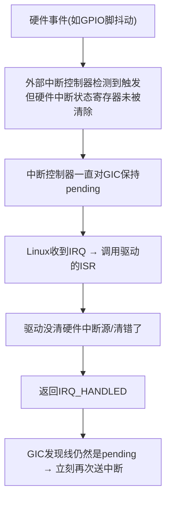
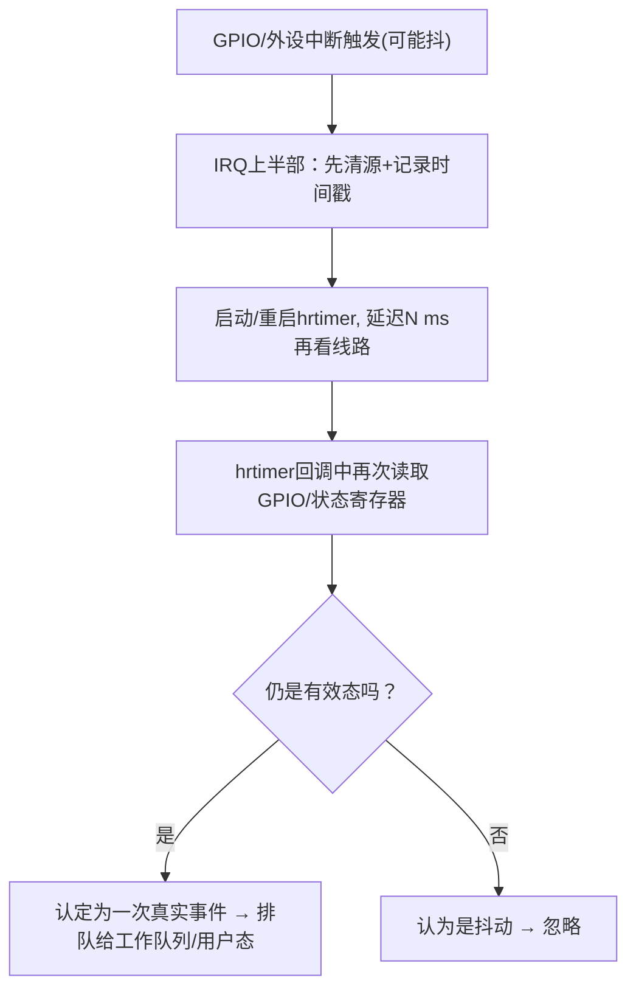

# 第14章 中断风暴、抖动与防御机制

## 章节内容说明

本章讨论的是**中断异常变多、变密、不断重复**这一类问题，重点聚焦两种典型形态：

1. **中断风暴（interrupt storm）**：同一个 IRQ 在线上一直处于“触发态”，CPU 不断进同一条中断，`/proc/interrupts` 里该 IRQ 计数疯狂上涨，系统其他任务明显被拖住。
2. **中断抖动（interrupt bouncing / jitter）**：一次真实的物理事件，却被上报成多次中断，常见于机械按键、没有硬件消抖的 GPIO 输入口、边沿+电平配置不一致的场景。

本章将按以下结构展开：

- 14.1 先把“形成路径”说清楚：到底是谁没清、是谁没放行、是谁抖了
- 14.2 再看内核层面的防御：hard IRQ 层面的 disable / oneshot / 限流
- 14.3 再看软中断/工作队列怎么卸压
- 14.4 再和“硬件消抖 + hrtimer 二次确认”做协同（关联第8章）
- 14.5 给一套可直接粘贴进驱动的“故障处理模板”

> 说明：本章所有 Mermaid 图按你前面说的规则做 HTML 实体转义。

------

## 14.1 中断风暴的形成路径

### 14.1.1 是什么

**中断风暴**指的是：**内核不断接收到同一个 IRQ 的中断请求，但每次中断处理函数都没有真正让硬件退出中断状态，于是中断立刻再次到来，周而复始**。表面现象是：

- `/proc/interrupts` 某个中断号涨得特别快；
- top/htop 看到 ksoftirqd 或某个中断处理相关的内核线程占很高；
- 用户空间感觉“系统卡住了/输入变慢了”。

### 14.1.2 形成的典型链路

下面这条是最典型的一条（GPIO → 外部中断控制器 → GIC → Linux）：



> 引号已转义。

关键点有两个：

1. **驱动必须清硬件中断源**，否则外面那层控制器会一直认为“还有中断没处理完”；
2. **中断控制器是电平型还是边沿型**很关键：电平型如果输入一直是有效电平，就会一直报。

### 14.1.3 常见触发原因分类

1. **驱动没清源**：最常见。ISR 里只做了业务处理，没有写回清除位。
2. **清源时机不对**：必须“先清源再做长处理”，否则处理时间里硬件又产生了新中断。
3. **触发类型配错**：硬件是电平，DTS 配成边沿，或反之；结果是驱动的清源动作和硬件真正的中断保持条件对不上。
4. **GPIO 输入没硬件消抖**：机械按键一按/一放会产生多次边沿，外部中断控制器全收到了。
5. **外部中断控制器没放行/没清自身 pending**：GPIO 控制器里还有一层 pending，需要在驱动里先清这层。
6. **真的是外部干扰/线悬空**：线上一直抖，软件只能限流。

### 14.1.4 电平触发 vs 边沿触发在风暴里的差异

- **电平触发**：只要输入电平一直是“有效态”，控制器就会一直报；所以**清源动作要能让输入电平恢复正常**（比如读状态寄存器会拉低中断线，或者写1清除）。
- **边沿触发**：只有发生一次边沿才报，一般不会无限风暴；但**抖动**会制造很多边沿，相当于高 PPS。
- 因此：**电平型 → 更容易一直来；边沿型 → 更容易变成“很多次”**。

### 14.1.5 驱动侧最小防御要求

1. **ISR 第一行就要读状态/判定是不是我的**；
2. **确认是我的就立刻清源**（很多控制器是写1清除、读后写回清除，必须看手册）；
3. **真正的业务放到下半部/工作队列**；
4. **清不了源要打印一次错误并考虑禁用该 IRQ**（见 14.2）。

------

## 14.2 内核层面的限流、disable、oneshot 化

这一节说“就算驱动写得不完美，内核也不会无限被打爆”——内核在 IRQ 子系统里其实做了一些防御，典型是把一个“老是触发的中断”先暂时**disable**，交给你驱动去“复活”。

### 14.2.1 是什么

Linux 中断子系统里有一套基本策略：

- 如果某个 IRQ 在很短时间内被反复触发，但 handler 又不真正解决它，**内核会认为这是“bad IRQ”**；
- 为了保护系统可用性，它会**临时关掉这个 IRQ**，避免 CPU 全部花在这条中断上；
- 驱动要负责在排查/重新初始化硬件之后，再把它 enable 回来。

这就是你有时会在 dmesg 里看到的类似提示：

- “Disabling IRQ #xx”
- “irq X: nobody cared”
- “irq X: interrupt storm”

### 14.2.2 工作机制要点

1. **内核会统计中断触发频率**，如果过高且 handler 返回的状态说明“没有真正处理掉”，就会走“坏中断”路径；
2. **被 disable 的 IRQ 不会再调你驱动的 ISR**，这是为了保命；
3. **你要在驱动里想办法重新打开**，比如在合适的时机调用 `enable_irq()`，或者在 probe 失败后做一次完整 reset。

### 14.2.3 oneshot 化的意义

- 对电平型中断或“处理期间可能继续产生中断”的场景，可以让它变成**一次触发 → 先屏蔽 → 处理完成再开**的风格；
- 在线程化中断（threaded IRQ）里，用 `IRQF_ONESHOT` 可以做到这种效果；
- 这样做的好处是：**在你还没清源/没处理完的时候，控制器先别再把中断往上送**，从而防止风暴。

简化示例（线程化中断）：

```c
int ret = request_threaded_irq(irq,
                               demo_irq_top,     /* 可以为NULL */
                               demo_irq_thread,  /* 真正处理的线程 */
                               IRQF_ONESHOT | IRQF_TRIGGER_FALLING,
                               "demo", dev);
```

要点：

- `IRQF_ONESHOT` 表示：中断线程没跑完之前，这个 IRQ 会被 mask；
- 你在线程里清源，清完再返回，内核再帮你 unmask；
- 对“清源要花一点时间”的硬件非常有用。

### 14.2.4 跟第8章的关系

第8章讲的“用 hrtimer 做二次确认/延时确认”本质也是一种**限流**：不要一上来就把不干净的信号当成有效中断，要延迟几 ms 再确认一次。如果再结合 `IRQF_ONESHOT`，就能做到：

1. 第一次触发 → 先不让它一直接着来；
2. hrtimer 到点，看看线是不是还有效；
3. 确认有效再做真正的业务。

### 14.2.5 内核策略的边界

- 内核只能做到“我先不让你这条中断继续打我”，它**不能帮你清硬件的中断源**；
- 所以最终你还是得回到驱动里把状态寄存器、GPIO 控制器、外部中断控制器一层层清；
- 如果硬件线真的脏（短路、悬空、硬件抖），只能在驱动/board 层加额外防御。

------

## 14.3 软中断/工作队列维度的卸压

### 14.3.1 核心思路

很多“看起来像风暴”的问题，其实不是“硬中断真的来这么多”，而是**你的硬中断处理函数干得太多**，导致系统一直在中断上下文里，表现出来像被“中断淹没”了。
 解决办法就是经典的：**硬中断只做最小动作，把剩下的事情丢到软中断、tasklet、工作队列、kthread 里做**。

### 14.3.2 最小化硬中断的“四步法”

1. **进来先判定是不是我的**（如果不是就立刻 `IRQ_NONE`）；
2. **是我的就清源**；
3. **把要处理的数据/标志放到一个安全的队列里**；
4. **唤醒下半部/工作队列**做真正耗时的事。

这样做的好处：

- 真正会形成风暴的是“硬中断没有把线清掉”这一瞬间；
- 你越早清线，外部中断控制器越早停止往上送；
- 慢的事放下面跑，不会阻塞别的高优先级中断（13章说的那几条）。

### 14.3.3 和工作队列的典型配合示例

```c
static irqreturn_t demo_irq_handler(int irq, void *dev_id)
{
    struct demo_dev *d = dev_id;
    u32 status;

    /* 1. 判定 */
    status = demo_read_status(d);
    if (!status)
        return IRQ_NONE;

    /* 2. 先清源，避免形成风暴 */
    demo_clear_status(d, status);

    /* 3. 留一个标志/数据给下半部 */
    d->irq_status_cached = status;

    /* 4. 唤醒工作队列 */
    schedule_work(&d->work);

    return IRQ_HANDLED;
}

static void demo_work(struct work_struct *work)
{
    struct demo_dev *d = container_of(work, struct demo_dev, work);
    /* 这里做慢的事：I2C访问、SPI读大块数据、唤醒用户态等 */
}
```

要点：

- **清源在上半部**；
- **慢操作在下半部**；
- 上半部越短，就越不容易被判定成风暴。


## 14.4 与硬件消抖、hrtimer 二次确认的协同

### 14.4.1 背景

很多“中断风暴/抖动”其实不是软件写错，而是**物理信号本身不干净**：机械按键、长线、外部传感器开漏输出、上拉过大、没有 RC 滤波。这种情况下，IRQ 控制器拿到的就是一串密集边沿或短暂电平，**单纯靠 IRQ handler 很难一次性把它判成“就一回”**。

所以建议的做法是**硬件 + 软件两层消抖**：

1. 能在硬件里消的先硬件消（GPIO 控制器有 debounce、外部中断控制器有 filter、板子上有 RC）；
2. 不能硬件消的再用软件 hrtimer/定时确认做第2层；
3. IRQ 上半部只做“记录+触发二次确认”，不直接认定业务事件。

### 14.4.2 协同的基本思路



> 引号已转义。

核心要点：

- **第一次中断只负责“开始观察”**，不要急着做业务；
- **二次确认时线路还在，就说明是真事**；
- 这样能极大降低“线抖 → 中断风暴”的概率。

### 14.4.3 hrtimer 二次确认的写法要点

1. hrtimer 必须工作在 **相对短的超时时间**（典型是几 ms 到十几 ms，按硬件特性定）；
2. hrtimer 回调里要**再次读硬件状态**，不能只看软件变量；
3. 如果你在上半部已经 `disable_irq_nosync()` 了，记得在确认后再 `enable_irq()`；
4. 配合第13章说的“本地定时器/高优先级中断”时要注意**不要做太长的 hrtimer 回调**。

### 14.4.4 与设备树属性的配合（示例思路）

很多 SoC 的 GPIO/外部中断控制器支持在 DTS 中配置消抖/滤波，比如（示意）：

```dts
button0: demo_led_key_int@0 {
    compatible = "nxp,imx6ull-led_key_int";
    interrupt-parent = <&gpio1>;
    interrupts = <18 IRQ_TYPE_EDGE_FALLING>;
    nxp,debounce-ms = <10>;
    /* ... 其他GPIO/LED属性 ... */
};
```

内核驱动在 probe 时可以：

1. 先读 `nxp,debounce-ms`；
2. 能写进控制器的就写控制器寄存器；
3. 写不进去的，就把这个值拿来当 hrtimer 的二次确认时间。

这样就能做到**DTS → 驱动 → hrtimer**的完整链路，适配你现在这颗 i.MX6ULL 的写书场景。

------

## 14.5 一套通用的故障处理模板

这一节给的就是能直接贴进“排查记录/书稿/项目文档”的模板，顺序照着走，一般能定位到是“驱动没清”还是“硬件在抖”还是“内核把它禁了”。

### 14.5.1 故障现象收集

1. 看 `/proc/interrupts`，锁定是哪个 IRQ 在涨；
2. 看 `dmesg` 有没有 “Disabling IRQ #xx” 或 “irq XXX: nobody cared”；
3. 确认问题是**单条 IRQ 涨**，还是**多条 IRQ 一起涨**（多条一起要怀疑总线/电源/EMI）。

### 14.5.2 快速分层判断

1. **内核层判断**：有无被内核 disable → 有就说明内核已经认为它是坏IRQ；
2. **驱动层判断**：ISR 里是否**第一时间清源** → 没有就先补上；
3. **控制器层判断**：GPIO 控制器/EXTI/IMX 的 IOMUXC 或 GPC 里是否还有 pending 没清；
4. **硬件层判断**：信号线是否实际在抖/被外设一直拉低。

### 14.5.3 标准化的软件修复步骤

1. ISR 开头加“读状态+不是我的就 `IRQ_NONE`”；
2. 是我的 → 立刻清源；
3. 清源失败 → 打一条错误日志 + `disable_irq_nosync(irq)`，防止炸机；
4. 把真正的处理丢到工作队列；
5. 需要多次确认的，加 hrtimer；
6. 在一个安全点（比如工作队列里确认硬件恢复了）再 `enable_irq(irq)`。

代码示意：

```c
static irqreturn_t demo_irq_handler(int irq, void *dev_id)
{
    struct demo_dev *d = dev_id;
    u32 st;

    /* 1. 判定 */
    st = demo_read_irq_status(d);
    if (!st)
        return IRQ_NONE;

    /* 2. 先清源 */
    if (demo_clear_irq_status(d, st)) {
        dev_err(d->dev, "irq%u: clear failed, disable irq\n", irq);
        disable_irq_nosync(irq);
        return IRQ_HANDLED;
    }

    /* 3. 快速排队到下半部 */
    d->last_irq_status = st;
    schedule_work(&d->irq_work);

    return IRQ_HANDLED;
}

static void demo_irq_work(struct work_struct *work)
{
    struct demo_dev *d = container_of(work, struct demo_dev, irq_work);

    /* 可选：二次确认/重试硬件 */
    if (demo_hw_ready(d))
        enable_irq(d->irq);
}
```

### 14.5.4 与“线程化中断 + IRQF_ONESHOT”的模板

对明显会抖、或清源要访问 I2C/SPI 的外设，建议一开始就走线程化：

```c
request_threaded_irq(irq,
                     NULL,                 /* 不要重活在硬中断里 */
                     demo_thread_fn,       /* 真正工作在这里 */
                     IRQF_ONESHOT | IRQF_TRIGGER_FALLING,
                     "demo-dev", d);
```

线程函数里可以做：

1. 再清一次源（双保险）；
2. 做慢 I/O；
3. 失败就不返回成功，让你有机会在上层逻辑里决定是否暂时屏蔽 IRQ。

### 14.5.5 文档化的排查问答清单

- **Q1：这个 IRQ 是谁的？** → `/proc/interrupts` + DTS 对照
- **Q2：它是电平还是边沿？** → DTS / 控制器手册
- **Q3：ISR 里是不是第一时间清源了？** → 看代码
- **Q4：清的是哪一层？GPIO 自己的？还是外部中断控制器？还是设备内部的？**
- **Q5：内核是不是已经把它 disable 掉了？** → dmesg
- **Q6：要不要加 hrtimer 二次确认？** → 机械/长线场景统一加
- **Q7：要不要直接线程化？** → 慢 I/O 必须线程化

------

## 小结

1. 中断风暴本质上是“中断源一直保持触发态 + ISR 没能让硬件退出触发态”的组合问题；
2. 软件侧防御的顺序应该是：**ISR 先清源 → 减少上半部工作量 → 必要时 oneshot → 必要时 hrtimer 二次确认 → 必要时临时 disable**；
3. 硬件侧要尽量打开控制器自带的消抖/滤波功能，不要把全部成本压给软件；
4. Linux 内核有自保机制，会把“坏中断”先关掉，驱动要负责把它再开回来；
5. 这一章的模板可以直接用于你前面那颗 `demo_led_key_int@0` 节点的驱动说明，把 `nxp,debounce-ms` 落进 hrtimer 或控制器寄存器即可。

（第14章完）