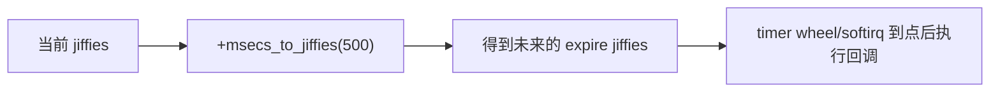
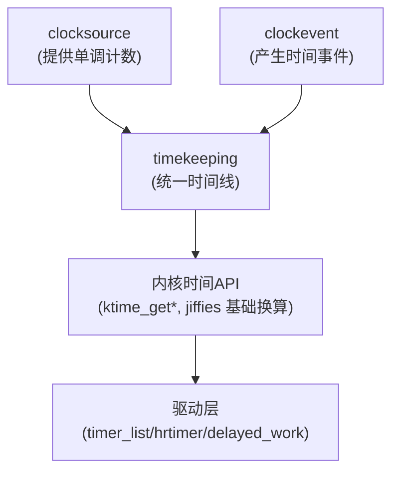

# 第2章 Linux 时间基础与 timekeeping 框架速览

## 2.1 章节内容说明

这一章的作用是：**解释为什么内核时间看起来比用户态麻烦，以及驱动为什么要知道 timekeeping/clocksource/clockevent 这三个角色。**驱动一般不直接操作这些核心时间代码，但你必须知道：

1. 你的定时器是“跟着节拍走的”还是“真的高精度的”；
2. 平台/配置一变（比如启用 NO_HZ / 高精度定时器），你的定时任务会不会被推迟；
3. 为啥同一份驱动在 A 板子上周期性回调很准，在 B 板子上就有轻微抖动。

所以本章的目标是：

- 搭建“Linux 内核时间体系”的最小认知模型；
- 把 `jiffies`、HZ、tick 的来源说清楚；
- 把 timekeeping/clocksource/clockevent 的分工说清楚；
- 给后面第3章“时间表示与转换接口”提供语义基础。

## 2.2 内核时间体系的定位

内核时间子系统要同时满足四种完全不同的需求：

1. **内核自己要有一条“系统时间”**（wall time），给日志、文件时间戳、用户态看；
2. **调度和定时器要有一条“节拍/事件时间”**，用来触发 tick、软中断、timer wheel；
3. **要能提供一个“尽量单调的、高精度的时间源”**，给高精度定时器、追踪、性能分析用；
4. **要能在不同硬件上工作**，哪怕底层只有粗糙的定时中断，也能模拟出一条时间线。

这就导致：**时间在内核里不是一根线，而是几根线拼在一起的效果**。对驱动来说，最直接的体现是：

- 你能看到 `jiffies` 这种“很内核味”的节拍式时间；
- 你也能看到 `ktime_get()` 这种纳秒级的获取接口；
- 你还能看到各种“到期时间”的结构（timer_list 的 expires，hrtimer 的 expires）；
- 还有和硬件/平台耦合很重的 RTC/clocksource/clockevent 部分。

所以，驱动作者要先接受一个事实：**我们不会也不应该去改 timekeeping，但要写出“能和它和平共处”的驱动**。这就是本章的“开发者视角”——知道框架，选对接口，别和它对着干。

## 2.3 tick、HZ 与 `jiffies`

这一节是整个时间专题的“最小公约数”。你说的很多“500ms”“10ms 去抖”“1s 轮询”最后其实都会走到这里。

### 2.3.1 HZ 是什么

- `CONFIG_HZ` 决定了内核每秒钟有多少个“节拍中断”（tick）；
- 常见值是 100、250、1000，也有 300、1024 这种；
- HZ 越大，**定时器粒度越细**，但**调度和中断负担越重**。

所以：**不能在驱动里写死对 HZ 的假设**。否则同一驱动在服务器核和嵌入式核上表现就会不同。

### 2.3.2 `jiffies` 是什么

- `jiffies` 是一个**随 tick 自增的全局节拍计数器**；
- 每来一个 tick，`jiffies` 就 +1；
- 所有基于 `struct timer_list` 的低精度定时器，底子都是这个；
- 它一般是 `unsigned long`，内核还会有 `jiffies_64` 版本防止溢出。

所以你常看到：

```c
mod_timer(&dev->timer, jiffies + msecs_to_jiffies(500));
```

这句话的语义其实是：“请在**当前节拍的基础上**，再加上 500ms 对应的节拍数，在那个节拍点把这个定时器拉起来”。

### 2.3.3 为什么要用转换宏

因为你不知道 HZ 是多少，所以 500ms → jiffies 必须要用内核提供的宏，把“时间长度”翻译成“节拍数”：

```c
unsigned long to = msecs_to_jiffies(500);
mod_timer(&dev->timer, jiffies + to);
```

你如果直接写 `+ 500`，就是在假定 1 tick = 1ms（也就是 HZ=1000）。这在 ARM 嵌入式上经常不成立。

### 2.3.4 jiffies 驱动的定时器精度

基于 jiffies 的定时器有两个天然限制：

1. **它只能在节拍边界上触发**，不会在两个 tick 之间精准触发；
2. **它可能会被推迟**，尤其是在系统繁忙或开启某些节电/tickless 配置时。

但换个角度看，它也有明显优点：

- 成本低：软中断拉起来做；
- 写法简单：`mod_timer()` 周期化特别方便；
- 对绝大多数“几十毫秒、几百毫秒”的驱动任务来说已经够用。

所以正确的认识是：**不是所有定时任务都要上 hrtimer，基于 jiffies 的 timer 是默认方案。**

### 2.3.5 简单时间线示意



（说明：这里用的是“到点就回调”的最简单路径，后面第4章会画真正的 timer 流程图，包含 softirq 分发。）

## 2.4 timekeeping / clocksource / clockevent 的基本角色

这一节是本章最重要的“数据结构视角”。虽然你写驱动不会天天去看这些结构，但你要知道**它们各司其职**，否则你会把“时间不准”错怪到定时器头上。

### 2.4.1 timekeeping：维护“当前时间线”的那一层

- **职责**：维护系统当前的“墙钟时间”（wall time）和“单调时间”（monotonic time），提供统一的读法；
- **你能看到的接口**：`ktime_get()`, `ktime_get_ns()`, `ktime_get_boottime()`, `do_gettimeofday()`（旧）；
- **驱动为何要知道它**：当你要做“跟系统时间对齐/打时间戳/和用户态比时间”的事，需要拿这条线的时间；
- **特点**：这层会处理时钟源偏差、NTP 校时、重启后基准时间恢复等问题，**所以它可能会被调整**。

也就是说：**timekeeping 是“标准时间出口”，不是硬件时钟本体。**

### 2.4.2 clocksource：提供“读数”的硬件或软件源

- **职责**：提供一个“能被快速读取的、单调递增的计数器”；
- 常见实现：TSC、ARM arch timer、SoC 专用定时器；
- 内核会从多个可用的 clocksource 里选一个最合适的；
- 精度、读取开销、是否单调、是否跨 CPU 一致，会成为选择条件；
- **如果 clocksource 出问题，所有依赖它的高精度时间都会受影响**，比如 hrtimer 精度下降。

对驱动的意义是：**你看起来是在用统一的 `ktime_get_ns()`，但底下其实是某个 clocksource 在跑**，不同板子可能表现不同，这就是你有时会看到“在 A 板子上 hrtimer 很准，在 B 板子上偶尔飘”的根源。

### 2.4.3 clockevent：负责“产生事件”的那层

- **职责**：按设定的时间点/周期，发出一个“现在该执行定时相关工作的事件”（本质上是中断）；
- 内核调度器的 tick、定时器的驱动、延后执行的触发，都会依赖它；
- 有的硬件只能以固定频率发事件，有的能编程到具体时间点；
- 在 tickless/NO_HZ 模式下，clockevent 更重要，因为要“多久后再叫醒我”；

所以，简单说：

- **clocksource = 读时间**
- **clockevent = 到点叫你**
- **timekeeping = 把时间变成统一口径、还能调**

可以画成一张你后面也能复用的示意图：



说明：

- 驱动在最上层看到的是“API”，实际下面是 timekeeping 聚合了 clocksource 和 clockevent；
- 这张图的意义是：**驱动如果发现“时间不准/被推迟”，要想到下面三个点都可能影响，而不是只看自己那一行代码。**


------

## 2.5 NO_HZ / 高精度定时器配置对驱动的影响

这一节只讲对**驱动**的影响，不讲完整实现。内核里跟时间相关的两组典型配置是：

- `CONFIG_NO_HZ_IDLE` / `CONFIG_NO_HZ_FULL`（统称 tickless）
- `CONFIG_HIGH_RES_TIMERS`（高精度定时器）

它们的共同点是：**内核不再“均匀地每隔一个 tick 都叫你一下”，而是能睡就多睡，能精就更精。**这对驱动有三个直接影响。

### 2.5.1 周期性任务可能会被“推一会儿”

你如果用的是基于 jiffies 的普通定时器 / delayed_work 来做**低优先级、非关键**的周期任务（比如每 1s 打印温度），在 NO_HZ 下可能会看到它偶尔不是 1s，而是 1.x s；在系统空闲、CPU 为了省电延长睡眠时尤其明显。

**这不是你的代码错了**，是内核在做节电/减少 tick。驱动要允许这种“轻微推迟”，除非你要硬实时。

### 2.5.2 hrtimer 的价值会变高

当系统启用高精度定时器配置（`CONFIG_HIGH_RES_TIMERS=y`）时，内核可以在**tick 之间**安排定时事件，这就让 `hrtimer` 能真正发挥“我就要在 5ms + 300us 这个点触发”的能力。

如果你的驱动时间要求是：

- 要求 jitter 很小；
- 要在一个 tick 之内完成；
- 要配合音频/工业控制等子系统；

那么在这个配置下就应当优先选 `hrtimer`，而不是 `timer_list`。

### 2.5.3 不要假定“每个 CPU 都在规律地收 tick”

在 NO_HZ / idle 系统里，某些 CPU 很久才被叫醒一次，这是节电优化的正常表现。你的驱动如果是“挂在哪个 CPU 上就靠那个 CPU 周期执行”的写法，就要注意：**真正执行的时间可能和你设定的周期不完全一致**。这类问题在你做 per-CPU 定时器/工作时要特别注意。

------

## 2.6 内核时间获取接口速览（驱动常用）

本节是一个“用户视角”的小目录，给你一个印象：**内核时间不止一条线，不同函数取到的时间语义不一样**。后面章节提到的我就不再重复解释。

| 接口/宏                 | 含义/语义                      | 是否单调 | 驱动典型用途                   |
| ----------------------- | ------------------------------ | -------- | ------------------------------ |
| `jiffies`               | 节拍计数，跟 HZ 绑定           | 单调     | 定时器到期、差值超时           |
| `get_jiffies_64()`      | 64 位 jiffies，防溢出          | 单调     | 长时间运行系统                 |
| `ktime_get()`           | 单调时间（monotonic：单调的）  | 单调     | 高精度时间戳                   |
| `ktime_get_ns()`        | 单调时间，ns                   | 单调     | 高精度日志/trace               |
| `ktime_get_boottime()`  | 启动以来的时间，含 suspend     | 单调     | 统计运行时长                   |
| `do_gettimeofday()`(旧) | 近似墙钟时间                   | 否       | 很少在驱动中用                 |
| `sched_clock()`         | 非稳定快速时钟，多核不一定同步 | 否       | 快速打点、调试，不要做精确度量 |

你要记住的是：**能用 jiffies 做的先用 jiffies；要精度再上 ktime/hrt；要对外报时间再走 timekeeping。**

------

## 2.7 调试与验证

第1章说过一遍了，这里补充**跟 timekeeping 这一层相关的调试点**，方便你判断“问题到底在驱动还是在系统时间”。

### 2.7.1 看 dmesg 里的 clocksource 选择

启动日志里一般会有一行类似：

```text
clocksource: arch_sys_counter: mask: 0xffffffffffffff max_cycles: ...
```

或

```text
clocksource: tsc: ...
```

如果你在两个板子上定时表现不同，**先看它们是不是同一个 clocksource**。不是同一个，就不要用同一组“定时误差”去比较驱动。

### 2.7.2 用 trace 看 timer/softirq

打开 `events/timer/*`，能看到定时器添加、触发、回调的时间点。你可以核对：

- 你下发的 expires 值；
- 真正触发的时间；
- 中间有没有被推。

### 2.7.3 检查 NO_HZ 相关的配置

如果你怀疑“怎么总是晚一点”，可以查 `/proc/timer_list`（不同版本格式不同）或看内核配置确认是否启用了 NO_HZ、highres。这样能避免你在驱动里反复怀疑“是不是我 mod_timer() 写错了”。

### 2.7.4 人工压测法

写个简单的测试定时器/延迟工作：

```c
static void demo_timer_fn(struct timer_list *t)
{
    pr_info("demo: fired at jiffies=%lu\n", jiffies);
    mod_timer(t, jiffies + msecs_to_jiffies(1000));
}
```

在不同配置的同一块板子上跑，记录触发间隔，就能看出该平台的“周期性精度”大概在什么级别。**这能帮你给正式驱动定“合理预期”**，比如你就别要求它做到 1ms 级周期性。

------

## 2.8 小结

1. Linux 的时间不是一条线，是 **clocksource（读）+ clockevent（叫）+ timekeeping（统一）** 三层叠出来的；
2. 驱动大部分时候只看到 `jiffies` 和 `ktime_*`，但它们背后受 clocksource 选择、NO_HZ、highres 等配置影响；
3. 基于 jiffies 的定时器是默认方案，但要接受在节电/NO_HZ 下会有轻微推迟；
4. 要做高精度、低 jitter 的任务，优先看 `CONFIG_HIGH_RES_TIMERS`，然后选 `hrtimer`；
5. 调试时间问题时，不要只看你的驱动函数，要看系统时间配置和 clocksource；
6. 本章是后面几章的“地基”，第3章开始就只讲一件事：**怎么把“外部给的时间”安全地转换成“内核要的时间”**。

------

