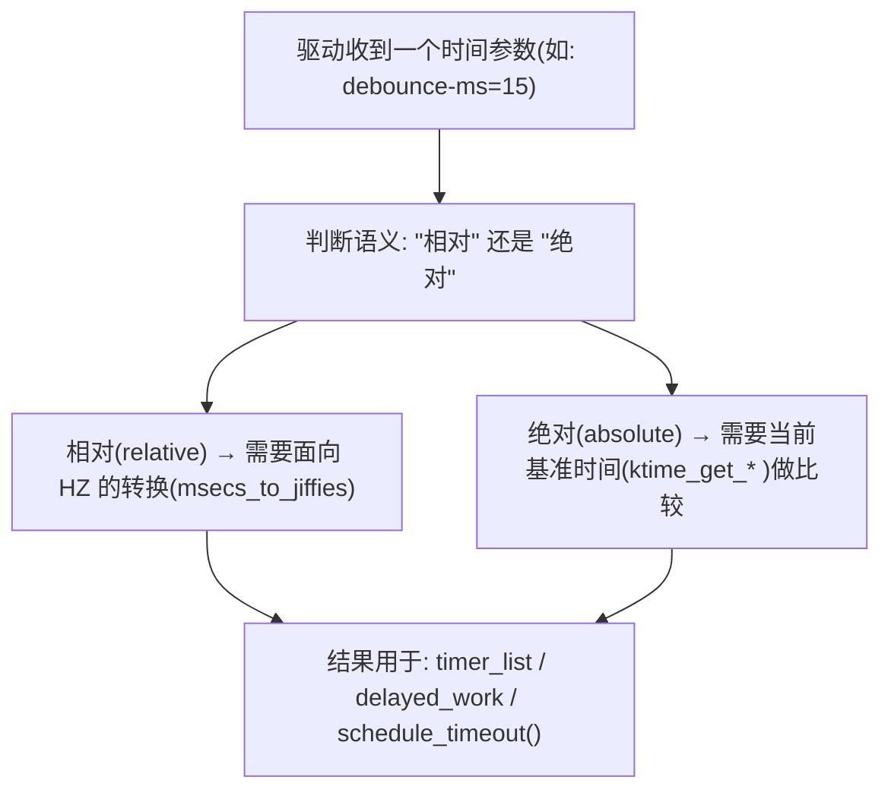
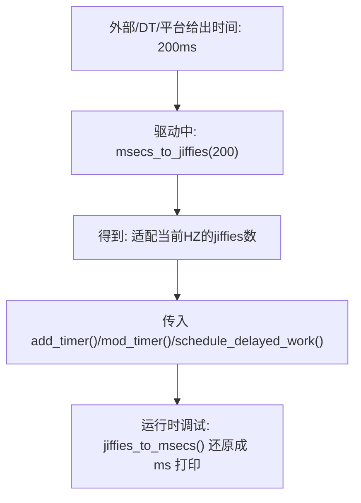
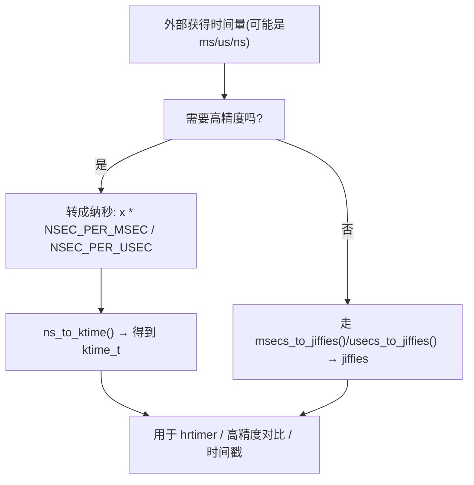
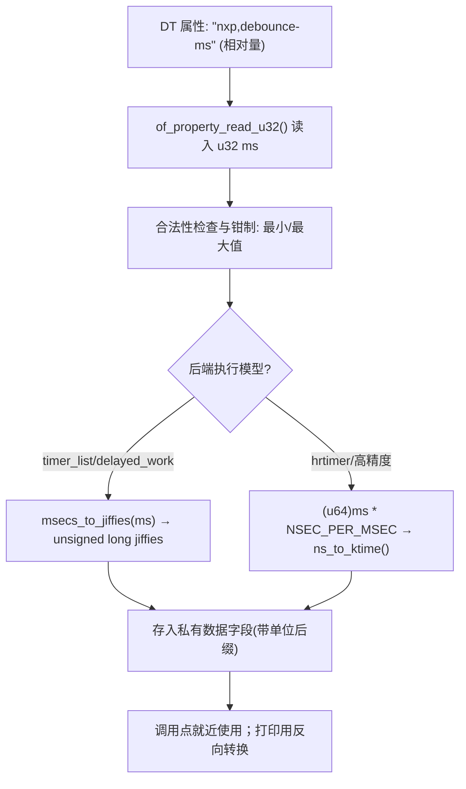
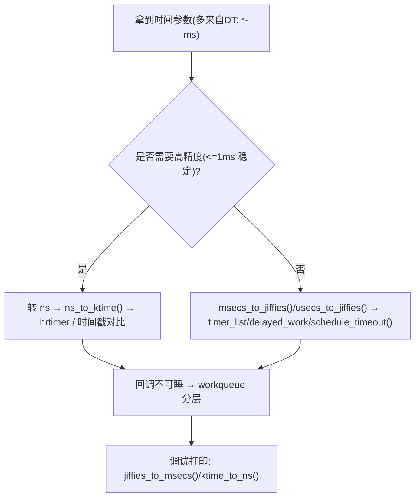

# 第3章 时间表示与转换接口详解

【章节内容说明】
 本章解决“驱动里到底该用什么时间单位、怎么从 ms/us 转到内核能用的表示、怎么避免 HZ 差异带来的移植问题、怎么和设备树里的 `*-ms` 映射”这类高频问题。前两章讲了“时间体系是怎么来的”；本章开始正式落到**写驱动代码时的时间写法标准化**。本章的核心目标有三点：

1. 把**相对时间 vs 绝对时间**这条线彻底分开；
2. 把**jiffies 系（面向普通定时器/延迟调度）**和**ns/ktime 系（面向高精度/统一时间戳）**区分开；
3. 把**转换必须写宏**这件事讲清楚，说明“不写”的后果。


------

## 3.1 相对时间与绝对时间的概念区分

### 3.1.1 主题引入

驱动开发中你几乎每天都要写“等一会儿再做”“去抖 15ms”“超时 1s 内完成”这类代码，但内核的时间体系本身是围绕 **timekeeping + tick + 多种 clock 源**构建的，既有**时刻**，也有**长度**。如果这两者不分，典型后果是：中断里用错了接口、不同 SoC 上延时表现不一致、设备树传进来的时间语义被写反。

### 3.1.2 概念与定义

- **绝对时间（absolute time）**：描述“什么时候”，是**时间点**。如：当前系统时间、RTC 时间、`ktime_get_real_ns()` 返回值、PTP 对齐时间。它与“现在”相比没有长度语义。
- **相对时间（relative time / interval / duration）**：描述“要等多久”，是**时间段**。如：20ms 延时、100ms debounce、1s 轮询周期。它与当前时刻绑定，语义是“从现在起再过 X”。

这两者在驱动里常见的入口不同：

- 绝对时间常见于：时间戳对齐、RTC/PM、某些高精度唤醒、协议规定的时间标号；
- 相对时间常见于：去抖、重试、退避、轮询、超时等待、延迟执行。

### 3.1.3 数据结构视角（内核里怎么放）

- **jiffies**：内核的节拍计数，是**单调递增的相对量基础**，适合“再过多久”这类计算。
- **`ktime_t`**：统一的内核时间表示，内部是 ns 级的 64 位值，既可以表示绝对时间（取当前 ktime）、也可以表示时长（构造一个 `X ns` 的 ktime）。
- **wall time / real time**：更多面向 timekeeping，对驱动日常定时意义不大。
- **总结**：普通驱动的“等一下”→ 优先走 **jiffies 系 + 转换宏**；需要高精度或与别的时间戳统一 → 走 **ktime 系**。

### 3.1.4 开发者视角（写代码时的约束）

1. **变量要带单位后缀**：`debounce_ms`、`timeout_ms`、`interval_jiffies`，不要只写 `timeout`。
2. **进入内核接口前做转换**：真正调用 `mod_timer()` / `schedule_delayed_work()` / `schedule_timeout()` 时再把 ms → jiffies，这样能看见来源。
3. **语义要写明是相对的**：注释里写 `/* relative: from now */`，防止后来人误认为是绝对时间戳。

### 3.1.5 用户视角（从设备树/平台参数进来时）

- 设备树、板级数据、用户可调参数**大多是相对量**（`*-ms`、`debounce-ms`、`poll-interval-ms`），进驱动后必须转成 jiffies 或 ktime，不能裸用。
- 必须把“设备树给的是 ms”这一事实留在代码注释或变量名里，否则以后改 HZ、改 SoC 时很难定位问题。

### 3.1.6 可视化图示



### 3.1.7 示例代码

```c
/* demo: 把设备树里来的去抖时间(单位ms)转换成内核可用的相对时间 */
unsigned int debounce_ms;      /* from DT, relative, unit: ms */
unsigned long debounce_jiffies;

/* ... of_property_read_u32(np, "nxp,debounce-ms", &debounce_ms); ... */

debounce_jiffies = msecs_to_jiffies(debounce_ms); /* now safe for timer_list */
```

### 3.1.8 调试与验证

- 打印时记得反向转：`pr_debug("debounce=%u ms\n", jiffies_to_msecs(debounce_jiffies));`
- 如发现“在 A 板上延时正常，在 B 板上太长/太短”，首先看：两个板的 `CONFIG_HZ` 是否一致；其次看：是不是有人手写了 `ms * HZ / 1000`。

### 3.1.9 小结

- 驱动里绝大多数是**相对时间**；
- 相对时间要**随 HZ 变化**，所以必须用转换宏；
- 把语义、单位、来源写清楚，是后面整章内容能顺利展开的前提。

------

## 3.2 常用宏：`msecs_to_jiffies()`、`usecs_to_jiffies()`、`jiffies_to_msecs()`

### 3.2.1 主题引入

本节回答一句话：**“我手里就是一个 ms/us，怎么转成内核能用、还能在所有 HZ 下表现一致的时间量？”**
 内核已经把这事做好了，你只要用它的宏，不要自己算。

### 3.2.2 概念与定义

- `msecs_to_jiffies(unsigned int m)`
   把**毫秒**的相对时长 → 当前系统 HZ 下的 jiffies，适合 1ms~几秒以内的延时、debounce、轮询周期。
- `usecs_to_jiffies(unsigned int u)`
   把**微秒**的相对时长 → jiffies，适合几十~几百 μs 级的需求，但要注意：**不是所有 HZ 下都能精确表现微秒**，可能会被向上取整。
- `jiffies_to_msecs(unsigned long j)`
   把 jiffies → 毫秒，常用于：调试打印、回写到 sysfs、和用户态对齐。
- 还有同族：`jiffies_to_usecs()`、`secs_to_jiffies()`，语义一致。

### 3.2.3 数据结构视角

- 本质都是围绕**全局递增的 jiffies**做单位换算；
- 转换宏内部会根据 `HZ` 做不同分支，保证在低 HZ 时不会出现 0 jiffies 或溢出；
- 这样写出来的代码**与 timekeeping 框架解耦**，你不用关心底层实际的 clocksource 是啥。

### 3.2.4 开发者视角（怎么写才算合格）

1. **不要手写公式**：`ms * HZ / 1000` 看似对，但边界和精度不安全；而且别人一眼看不出你要的是 ms。

2. **就近转换**：离真正使用的地方最近做转化，不要在很远的地方算好一个 jiffies 再传来传去。

3. **日志里做反向转换**：便于确认最终效果：

   ```c
   unsigned long interval = msecs_to_jiffies(200);
   pr_debug("polling every %u ms\n", jiffies_to_msecs(interval));
   ```

4. **在公共头文件/平台代码中存 ms，不存 jiffies**：这样平台代码不会被具体 HZ 绑死。

### 3.2.5 用户视角（和外部接口的对应）

- 用户只认识 ms → 你就收 ms，然后 `msecs_to_jiffies()`；
- sysfs 里最好仍然用 ms → 写回去时 `jiffies_to_msecs()`；
- 这样可以避免“内核里一会儿是 200、一会儿是 2（jiffies）、一会儿又是 20（ms）”的困惑。

### 3.2.6 可视化图示



### 3.2.7 示例代码

```c
// SPDX-License-Identifier: GPL-2.0
#include <linux/module.h>
#include <linux/platform_device.h>
#include <linux/of.h>
#include <linux/timer.h>
#include <linux/jiffies.h>
#include <linux/printk.h>

#define DRV_NAME "demo_timer_device"

struct demo_dev {
    struct device    *dev;
    struct timer_list debounce_tmr;
    u32               debounce_ms;       /* DT 原值: 人类可读单位 */
    unsigned long     debounce_jiffies;  /* 内核用: jiffies */
};

/* 绑定到 timer_list 的回调函数（= timer->function） */
static void demo_debounce_fn(struct timer_list *t)
{
    /* 从 timer_list 指针取回所属的 demo_dev（字段名要与 struct 中一致） */
    struct demo_dev *dd = from_timer(dd, t, debounce_tmr);

    /* 这里不能睡；做一些快速的状态采样、标记，然后必要时唤醒工作队列 */
    dev_dbg(dd->dev, "debounce fired: %u ms\n",
            jiffies_to_msecs(dd->debounce_jiffies));

    /* 若需要周期性去抖/合并事件，也可以在这里继续调度下一次 */
    /* mod_timer(&dd->debounce_tmr, jiffies + dd->debounce_jiffies); */
}

static int demo_probe(struct platform_device *pdev)
{
    struct device *dev = &pdev->dev;
    struct device_node *np = dev->of_node;
    struct demo_dev *dd;
    u32 ms;

    dd = devm_kzalloc(dev, sizeof(*dd), GFP_KERNEL);
    if (!dd)
        return -ENOMEM;

    dd->dev = dev;

    if (of_property_read_u32(np, "nxp,debounce-ms", &ms))
        ms = 15; /* 默认值：相对时间、单位 ms */
    /* 合理钳制，避免 0 或过大 */
    ms = clamp_t(u32, ms, 1, 5000);

    dd->debounce_ms      = ms;
    dd->debounce_jiffies = msecs_to_jiffies(ms);

    /* 绑定 timer->function = demo_debounce_fn */
    timer_setup(&dd->debounce_tmr, demo_debounce_fn, 0);

    /* 如果想立刻启动一次（比如在 probe 末尾先做首轮稳定判定）： */
    mod_timer(&dd->debounce_tmr, jiffies + dd->debounce_jiffies);

    platform_set_drvdata(pdev, dd);

    dev_info(dev, "debounce=%u ms (jiffies=%lu)\n",
             dd->debounce_ms, dd->debounce_jiffies);
    return 0;
}

static int demo_remove(struct platform_device *pdev)
{
    struct demo_dev *dd = platform_get_drvdata(pdev);

    /* 驱动卸载/设备移除时必须同步删除，避免回调访问已释放内存 */
    del_timer_sync(&dd->debounce_tmr);
    return 0;
}

static const struct of_device_id demo_of_match[] = {
    { .compatible = "nxp,imx6ull-led_key_int" }, /* 与你的节点一致 */
    { /* sentinel */ }
};
MODULE_DEVICE_TABLE(of, demo_of_match);

static struct platform_driver demo_driver = {
    .probe  = demo_probe,
    .remove = demo_remove,
    .driver = {
        .name           = DRV_NAME,
        .of_match_table = demo_of_match,
    },
};
module_platform_driver(demo_driver);

MODULE_LICENSE("GPL");
MODULE_AUTHOR("Leaf & ChatGPT");
MODULE_DESCRIPTION("Device-private timer_list demo with DT ms→jiffies");
```

#### 说明与要点回顾

- **“连线”就是 `timer_setup(&obj->tmr, callback, flags)`**：这一步把 `tmr.function = callback` 配好，同时初始化内部链表、状态。**新接口**无需手动给 `function` 赋值。
- **启动**用 `mod_timer(&tmr, jiffies + interval)`；**停止**用 `del_timer_sync(&tmr)`。
- 回调上下文是 **softirq**，**不可睡**；若要可睡（I2C/SPI/clk/regulator 等），请在回调里 `schedule_work()` 或 `mod_delayed_work()`（这会在第 6 章展开）。
- 变量名**带单位**：`*_ms`、`*_jiffies`，并“就近转换+反向打印”，便于移植与排错。

如果你还想看**旧接口**（`setup_timer()` / 直接赋 `timer.function = xxx`）的对照版，我也可以补一份“旧 vs 新”的并排示例。

### 3.2.8 调试与验证

- 在 `CONFIG_HZ=100` 和 `CONFIG_HZ=1000` 的内核上各跑一遍，确认延时行为接近；
- 把 ms 设为 1、2 这样的小值，确认不会被吃成 0（宏内部做了保护）；
- 如果是热路径，请确认转换没有被频繁调用 —— 可以把 ms 存下来，被动转换一次再复用。

### 3.2.9 不写转换宏的后果（预告 3.4）

- 会写出对 HZ 敏感的代码；
- 会在 32bit 平台上更早遇到溢出；
- 别人一眼看不懂单位，文档性差；
- 这一点在 3.4 会单独展开。

------

## 3.3 纳秒系与 `ktime_t`：`ktime_set()`、`ns_to_ktime()`

### 3.3.1 主题引入

前两小节主要是“面向普通定时、适配 HZ 的 jiffies 系统”。但 Linux 内核里还有一条**纳秒级统一时间线**，主要通过 `ktime_t` 表示，是高精度定时器（`hrtimer`）、部分时间戳、部分同步机制的首选。做高精度驱动、做和 PM/RTC/同步关联的驱动，或者你要写一个**“不想被 HZ 影响”**的时间量时，就要用到它。

### 3.3.2 概念与定义

- **`ktime_t`**：内核统一时间类型，内部是 64 位 ns，封装成一个结构，便于内核在不同架构下做操作。
- **`ktime_set(sec, nsec)`**：用“秒 + 纳秒”构造一个 `ktime_t`，典型场景是你手里有一个比较长的超时，比如 3 秒 500ms，可以写成 `(3, 500*1000000)`.
- **`ns_to_ktime(u64 ns)`**：你手里已经是纳秒数了，直接转成 `ktime_t`。
- 常见配对接口还包括：`ktime_to_ns()`, `ktime_add()`, `ktime_sub()`, `ktime_after()` 等，用于计算和比较。

### 3.3.3 数据结构视角

- jiffies 是**节拍驱动**的；`ktime_t` 是**真实时间/高精度时间驱动**的；
- hrtimer 内部基本都走 ktime 系，不走 jiffies；
- 当驱动既要跟普通定时器打交道，又要跟高精度子系统对接时，常常会出现“两条线同时存在”的情况：
  - 面向传统接口的：`msecs_to_jiffies()`；
  - 面向高精度/统一表示的：`ns_to_ktime()`。

### 3.3.4 开发者视角（什么时候选 ktime）

1. **要高精度/稳定精度**：你希望“1000us 就是 1ms，别给我往上取一两个 jiffies”，那就用 ktime。
2. **要和内核别的时间戳统一**：比如你要拿当前时间去和 trace/ptp/rtc 对比，就别用 jiffies。
3. **要写 hrtimer**：hrtimer 的回调和启动参数都是 ktime；你用 jiffies 写不进去。
4. **要做长时间但不想自己算 ns**：用 `ktime_set(sec, nsec)` 直观又安全。

### 3.3.5 用户视角（从外部/DT 来的值怎么进 ktime）

- 如果设备树里已经是 ms ，你可以先 `msecs_to_jiffies()` 走普通定时器，也可以直接走 ns：
  - `u64 ns = (u64)ms * NSEC_PER_MSEC;`
  - `ktime_t kt = ns_to_ktime(ns);`
- 选择原则：
  - 你后面要用的是 **timer_list / delayed_work** → 转 jiffies；
  - 你后面要用的是 **hrtimer / 高精度对比** → 转 ktime。

### 3.3.6 可视化图示



### 3.3.7 示例代码

下面把 **3.3.7 示例代码**补全为**可直接编译**的小范例，分别覆盖三种典型用法：

- A：**周期性 hrtimer（相对模式 + 精确定时）**
- B：**DT 的 `\*-ms` → ktime（高精度去抖）+ 工作队列分层**
- C：**绝对超时点（deadline）计算与判断**

> 代码均基于内核 5.x/6.x 的常用接口；如你所述环境（Kernel ≥6.1），可直接使用。示例里包含 `ms_to_ktime()`；若某些旧内核缺少此 helper，已给出 `ns_to_ktime()` 的回退写法（注释可切换）。

------

#### 示例 A：周期性 hrtimer（HRTIMER_MODE_REL + forward_now）

> 关键点：
>
> 1. `hrtimer_init()` 绑定 **CLOCK_MONOTONIC** 与 **相对模式**；
> 2. 回调里用 `hrtimer_forward_now()` 精确前推，返回 `HRTIMER_RESTART` 实现稳定周期；
> 3. 使用 `ms_to_ktime()`（或回退 `ns_to_ktime()`）构造周期。

```c
// SPDX-License-Identifier: GPL-2.0
#include <linux/module.h>
#include <linux/ktime.h>
#include <linux/hrtimer.h>
#include <linux/printk.h>

#define DRV_NAME         "demo_hrtimer_periodic"
#define PERIOD_MS        5   /* 5ms 周期，示例为高频 */

static struct hrtimer    demo_tmr;
static ktime_t           period;  /* 周期长度，ktime_t */

static enum hrtimer_restart demo_hrtimer_cb(struct hrtimer *t)
{
    /* 这里是 hardirq/softirq 语境的回调，不可睡 */
    pr_debug("%s: tick\n", DRV_NAME);

    /* 前推下一次触发点，保证周期稳定 */
    hrtimer_forward_now(t, period);
    return HRTIMER_RESTART;
}

static int __init demo_init(void)
{
    /* period = ms_to_ktime(PERIOD_MS); */
    period = ns_to_ktime((u64)PERIOD_MS * NSEC_PER_MSEC); /* 兼容写法 */

    hrtimer_init(&demo_tmr, CLOCK_MONOTONIC, HRTIMER_MODE_REL);
    demo_tmr.function = demo_hrtimer_cb;

    /* 从现在起相对启动 */
    hrtimer_start(&demo_tmr, period, HRTIMER_MODE_REL);

    pr_info("%s: started, period=%d ms\n", DRV_NAME, PERIOD_MS);
    return 0;
}

static void __exit demo_exit(void)
{
    /* 停止并同步，确保回调不在执行 */
    hrtimer_cancel(&demo_tmr);
    pr_info("%s: stopped\n", DRV_NAME);
}

module_init(demo_init);
module_exit(demo_exit);

MODULE_LICENSE("GPL");
MODULE_AUTHOR("Leaf & ChatGPT");
MODULE_DESCRIPTION("Periodic hrtimer demo using forward_now()");
```

------

#### 示例 B：设备树 `nxp,debounce-ms` → ktime（高精度去抖）+ 工作队列分层

> 关键点：
>
> 1. DT 读入 **相对量（ms）** → 转 **ktime_t**；
> 2. hrtimer 回调不可睡，仅做轻量工作并切到 `workqueue`；
> 3. `hrtimer_start(timer, kt, HRTIMER_MODE_REL)` 在中断或事件路径上启动去抖窗口。

```c
// SPDX-License-Identifier: GPL-2.0
#include <linux/module.h>
#include <linux/platform_device.h>
#include <linux/of.h>
#include <linux/ktime.h>
#include <linux/hrtimer.h>
#include <linux/workqueue.h>
#include <linux/printk.h>

#define DRV_NAME "demo_hrtimer_debounce"

struct demo_dev {
    struct device   *dev;
    struct hrtimer   debounce_tmr;
    struct work_struct debounce_work;

    u32      debounce_ms;  /* DT 原值（相对量，ms） */
    ktime_t  debounce_kt;  /* 高精度相对量 */
};

static void demo_debounce_workfn(struct work_struct *ws)
{
    struct demo_dev *d = container_of(ws, struct demo_dev, debounce_work);
    /* 这里是进程上下文，可睡，执行稳定态判断/上报等 */
    dev_dbg(d->dev, "debounce work: %u ms window elapsed\n", d->debounce_ms);
}

static enum hrtimer_restart demo_debounce_hrfn(struct hrtimer *t)
{
    struct demo_dev *d = container_of(t, struct demo_dev, debounce_tmr);
    /* hrtimer 回调不可睡，把工作下沉 */
    schedule_work(&d->debounce_work);
    return HRTIMER_NORESTART;
}

static int demo_probe(struct platform_device *pdev)
{
    struct device *dev = &pdev->dev;
    struct device_node *np = dev->of_node;
    struct demo_dev *d;
    u32 ms;

    d = devm_kzalloc(dev, sizeof(*d), GFP_KERNEL);
    if (!d) return -ENOMEM;

    d->dev = dev;

    if (of_property_read_u32(np, "nxp,debounce-ms", &ms))
        ms = 15;  /* 默认 15ms */
    ms = clamp_t(u32, ms, 1, 5000);

    d->debounce_ms = ms;
    /* d->debounce_kt = ms_to_ktime(ms); */
    d->debounce_kt = ns_to_ktime((u64)ms * NSEC_PER_MSEC); /* 兼容写法 */

    INIT_WORK(&d->debounce_work, demo_debounce_workfn);

    hrtimer_init(&d->debounce_tmr, CLOCK_MONOTONIC, HRTIMER_MODE_REL);
    d->debounce_tmr.function = demo_debounce_hrfn;

    platform_set_drvdata(pdev, d);

    dev_info(dev, "debounce=%u ms (ktime)\n", d->debounce_ms);
    return 0;
}

static int demo_remove(struct platform_device *pdev)
{
    struct demo_dev *d = platform_get_drvdata(pdev);
    /* 收尾顺序：先停 hrtimer，再冲刷工作队列 */
    hrtimer_cancel(&d->debounce_tmr);
    flush_scheduled_work(); /* 或针对性 flush_work(&d->debounce_work) */
    return 0;
}

static const struct of_device_id demo_of_match[] = {
    { .compatible = "nxp,imx6ull-led_key_int" },
    { /* sentinel */ }
};
MODULE_DEVICE_TABLE(of, demo_of_match);

static struct platform_driver demo_driver = {
    .probe  = demo_probe,
    .remove = demo_remove,
    .driver = {
        .name = DRV_NAME,
        .of_match_table = demo_of_match,
    },
};
module_platform_driver(demo_driver);

MODULE_LICENSE("GPL");
MODULE_AUTHOR("Leaf & ChatGPT");
MODULE_DESCRIPTION("High-precision debounce via hrtimer + workqueue");
```

> 使用方式（典型场景）：
>
> - 在你的 GPIO 中断处理里调用
>    `hrtimer_start(&d->debounce_tmr, d->debounce_kt, HRTIMER_MODE_REL);`
> - 每次边沿来都重启一次去抖窗口；窗口结束时由 `workfn` 在可睡环境中读取稳定态并上报。

------

#### 示例 C：绝对超时点（deadline）计算与判断（ktime_get + ktime_add）

> 关键点：
>
> 1. `ktime_get()` 取**当前绝对时间点**；
> 2. 用 `ms_to_ktime()`（或 `ns_to_ktime()`）构造**相对时长**，与当前时间相加得到**绝对 deadline**；
> 3. 后续轮询中使用 `ktime_get()` 与 `deadline` 比较（`ktime_after()` / `ktime_before()`）。

```c
// SPDX-License-Identifier: GPL-2.0
#include <linux/module.h>
#include <linux/ktime.h>
#include <linux/delay.h>
#include <linux/printk.h>

#define DRV_NAME    "demo_ktime_deadline"
#define TIMEOUT_MS  200   /* 事务超时 200ms */

static int __init demo_init(void)
{
    ktime_t start, delta, deadline, now;

    start = ktime_get();                        /* 当前绝对时刻 */
    /* delta = ms_to_ktime(TIMEOUT_MS); */
    delta = ns_to_ktime((u64)TIMEOUT_MS * NSEC_PER_MSEC); /* 兼容写法 */
    deadline = ktime_add(start, delta);         /* 绝对超时点 = 起点 + 时长 */

    pr_info("%s: start=%lld ns, deadline=%lld ns (+%dms)\n",
            DRV_NAME,
            (long long)ktime_to_ns(start),
            (long long)ktime_to_ns(deadline),
            TIMEOUT_MS);

    /* 模拟一段轮询过程：每 20ms 检查一次是否超时 */
    while (1) {
        now = ktime_get();
        if (ktime_after(now, deadline)) {
            pr_info("%s: timeout\n", DRV_NAME);
            break;
        }
        /* 这里可以放你的条件检查；达到条件也可提前跳出 */
        /* ... do quick check ... */

        msleep(20); /* 仅为示例；真实场景按可睡/不可睡选择接口 */
    }

    return -EINVAL; /* 作为演示模块：初始化后即报错退出，避免常驻 */
}

module_init(demo_init);
MODULE_LICENSE("GPL");
MODULE_AUTHOR("Leaf & ChatGPT");
MODULE_DESCRIPTION("Absolute deadline by ktime_get + ktime_add");
```

> 说明：
>
> - `ktime_after(a, b)`/`ktime_before(a, b)` 用于比较两个 **绝对时间点**；不要手动比较 `tv64`。
> - 如果你的检查在不可睡上下文（如硬中断/softirq），请用非睡眠的等待/重试策略，或用 hrtimer 驱动到期回调。

------

#### 要点回顾（与 3.3 一致）

- **相对量 → ktime**：`ms_to_ktime(x)` 或 `ns_to_ktime(x * NSEC_PER_MSEC)`。
- **周期性 hrtimer**：回调里 `hrtimer_forward_now()` + `HRTIMER_RESTART`。
- **回调不可睡**：把可睡操作下沉到 `workqueue`。
- **绝对 deadline**：`ktime_get()` + `ktime_add()`，比较用 `ktime_after()`。

如果需要“**A/B 两版（jiffies vs ktime）**”的同题对照，我也可以把示例 A 改写成 `timer_list` 版本并排给出，以便你在 6.1 的工程里做快速 A/B 验证。


### 3.3.8 调试与验证

- 打印时用 `ktime_to_ns()`，确认你构造出来的是你期望的值；
- 做比较时用内核现成的 ktime 比较辅助（如 `ktime_after()` / `ktime_before()`），不要自己直接比较 `tv64`；
- 如果你发现“同一段代码在高精度开启/关闭的内核上表现不同”，先看你用的到底是 jiffies 线还是 ktime 线。

### 3.3.9 小结

- jiffies 线 → 适合绝大多数普通驱动定时；
- ktime 线 → 适合高精度、要和别的时间戳对齐、要进 hrtimer 的场景；
- 两条线都要从“明确单位→用内核提供的转换接口”这个动作开始。


------

## 3.4 不写转换宏的后果与可移植性问题

### 3.4.1 是什么（问题的本质）

很多驱动直接写 `ms * HZ / 1000`、`us * HZ / 1000000` 来“自己算 jiffies”。这属于**把与平台相关的时间刻度硬编码进驱动**。问题在于 **HZ 可变**、**取整规则复杂**、**边界/溢出风险** 与 **可读性差**。

### 3.4.2 干什么（转换宏解决的目标）

- **与 HZ 解耦**：在 `CONFIG_HZ=100/250/1000`、NO_HZ 开启与否都能得到合理的 jiffies。
- **自动边界保护**：保证最小 1 jiffy、生效上限不溢出、避免 0 jiffies 被立刻触发。
- **表达更清晰**：`msecs_to_jiffies(20)` 一眼看懂“20ms 的相对延时”。

### 3.4.3 怎么实现（为什么手算会错）

典型坑点：

1. **向下取整导致 0 jiffies**
   - 例：`5ms * HZ / 1000` 在 `HZ=100`（1 jiffy=10ms）下结果为 0 → 立刻触发或被忽略。
   - 宏内部会做**向上取整 + 最小 1 jiffy**。
2. **不同 HZ 下语义漂移**
   - 相同源码在 `HZ=100` 与 `HZ=1000` 上延时完全不同，表现不可预期。宏会尽量给出一致性更好的近似。
3. **32 位溢出**
   - 大超时或链式乘法（例如 `secs * 1000 * HZ`）在 32 位上容易溢出；宏实现考虑了安全上限。
4. **可维护性差**
   - 读代码的人需要 mental math 才知道单位；与设备树字段（通常是 ms）脱节。

### 3.4.4 怎么用（替换策略）

- **一律使用转换宏/内联函数**：
  - `msecs_to_jiffies()` / `usecs_to_jiffies()` / `secs_to_jiffies()`
  - `jiffies_to_msecs()` / `jiffies_to_usecs()`
- **就近转换、反向打印**：
  - 用前转 jiffies，用后 `jiffies_to_msecs()` 打印，验证落地值。
- **大区间用 ktime**：
  - 超过几秒或需精确控制 → 转 ns，再 `ns_to_ktime()`。

### 3.4.5 对比示例（错误 VS 正确）

#### 节拍计算

错误：

```c
/* 错误：容易在低 HZ 下得到 0 jiffies，且读者看不出单位 */
unsigned long t = 5 * HZ / 1000;   /* 我想等 5ms… */

mod_timer(&tmr, jiffies + t);
```

正确：

```c
/* 正确：宏会保证至少 1 jiffy，语义一眼明了 */
mod_timer(&tmr, jiffies + msecs_to_jiffies(5));
```

---

#### 溢出处理

错误：

```c
/* 错误：大延时/32 位上可能溢出 */
unsigned long tout = seconds * 1000 * HZ;
```

正确：

```c
/* 正确：走 secs_to_jiffies() */
unsigned long tout = secs_to_jiffies(seconds);
```


### 3.4.6 驱动中的“不可移植信号”

- `* HZ / 1000`、`/ (1000 / HZ)` 等“魔法算式”；
- 成员命名没有单位：`timeout`、`delay`（建议改为 `timeout_ms` 等）；
- 打印信息里混用 ms 与 jiffies，且没有反向转换。

------

## 3.5 与设备树时间属性的映射（以 `demo_led_key_int@0` / `nxp,debounce-ms` 为例）

### 3.5.1 是什么

把设备树里的“**人类可读单位**”（常见为 `*-ms`、`*-us`）转换为**内核可用单位**（`jiffies` 或 `ktime_t`），并保障**语义相对**（绝大多数是“从现在起延时 X”）。

### 3.5.2 干什么（对接目标）

- 让板级可配的时间参数（如按键去抖、轮询周期、事务超时）**在不改驱动**的前提下可调；
- 保证不同内核配置、不同 SoC 的行为接近一致；
- 保持**驱动内部只认统一单位**（jiffies 或 ktime），减少混乱。

### 3.5.3 怎么实现（流程与约束）



#### 关键细节

- **字段命名带单位后缀**：`debounce_ms`、`debounce_jiffies`、`debounce_kt`。
- **就近转换**：靠近 `mod_timer()`/`schedule_delayed_work()`/`hrtimer_start()` 的地方做转换。
- **钳制（clamp）**：给出合理上/下限，避免 0 或离谱大值。
- **反向转换打印**：便于排错。

### 3.5.4 参考节点（与你的环境对齐）

以你约定的节点为例（i.MX6ULL）：

- 节点名：`demo_led_key_int@0`
- `compatible = "nxp,imx6ull-led_key_int";`
- 关键属性：`led-gpios = <&gpio1 3 GPIO_ACTIVE_LOW>;`、`key-gpios = <&gpio1 18 GPIO_ACTIVE_LOW>;`
- 中断：`interrupt-parent = <&gpio1>; interrupts = <18 IRQ_TYPE_EDGE_FALLING>;`
- 去抖：`nxp,debounce-ms = <15>;`（相对时间、单位毫秒）

### 3.5.5 代码模板（delayed_work 版：可睡）

```c
struct demo_dev {
    struct device       *dev;
    struct gpio_desc    *key_gpiod;
    struct delayed_work  debounce_work;
    u32                  debounce_ms;        /* DT 原值: 人类单位 */
    unsigned long        debounce_jiffies;   /* 内核用: jiffies */
};

static void demo_debounce_workfn(struct work_struct *ws)
{
    struct demo_dev *dd = container_of(to_delayed_work(ws), struct demo_dev, debounce_work);
    /* 这里可睡：读 GPIO、电源域交互、上报 input 事件等 */
    /* ... */
}

static irqreturn_t demo_isr(int irq, void *dev_id)
{
    struct demo_dev *dd = dev_id;
    /* 边沿触发后推迟处理，合并抖动 */
    mod_delayed_work(system_wq, &dd->debounce_work, dd->debounce_jiffies);
    return IRQ_HANDLED;
}

static int demo_probe(struct platform_device *pdev)
{
    struct device *dev = &pdev->dev;
    struct device_node *np = dev->of_node;
    struct demo_dev *dd;
    u32 ms;

    dd = devm_kzalloc(dev, sizeof(*dd), GFP_KERNEL);
    if (!dd) return -ENOMEM;

    dd->dev = dev;

    /* 读取 DT: nxp,debounce-ms（相对量、单位 ms） */
    if (of_property_read_u32(np, "nxp,debounce-ms", &ms))
        ms = 15; /* 默认值，可根据产品策略设定 */

    /* 钳制：避免 0 或离谱大值 */
    ms = clamp_t(u32, ms, 1, 5000);

    dd->debounce_ms      = ms;
    dd->debounce_jiffies = msecs_to_jiffies(ms);

    INIT_DELAYED_WORK(&dd->debounce_work, demo_debounce_workfn);

    /* 申请中断与 GPIO 省略… */

    dev_info(dev, "debounce: %u ms (jiffies=%lu)\n",
             dd->debounce_ms, dd->debounce_jiffies);
    return 0;
}
```

### 3.5.6 代码模板（hrtimer 版：高精度 + 分层）

> 下面把示例拆成 **两个独立且可直接编译的模板**，都**明确使用**成员 `debounce_kt`：
>
> - **模板 A（边沿去抖 one-shot）**：在 **IRQ 回调**里用 `debounce_kt` 启动 hrtimer（相对模式），到期切到工作队列处理；
> - **模板 B（高精度周期轮询 periodic）**：设备成员里存 `period_kt`，回调里 `hrtimer_forward_now(t, period_kt)` 复用成员，保证周期稳定。

------

#### 模板 A：边沿去抖（one-shot，IRQ 中启动）——**使用成员 `debounce_kt`**

> 场景：GPIO 边沿触发 → 重启去抖窗口（相对 `debounce_kt`）→ 到期后在工作队列中读取稳定态。
>  关键点：
>
> 1. `d->debounce_kt` **在 probe 中**由 DT 的 `nxp,debounce-ms` 转换得到；
> 2. **IRQ handler 中**调用 `hrtimer_start(&d->debounce_tmr, d->debounce_kt, HRTIMER_MODE_REL)`；
> 3. 回调里 `schedule_work(&d->debounce_work)`，不可睡的事不在回调里做。

```c
// SPDX-License-Identifier: GPL-2.0
#include <linux/module.h>
#include <linux/platform_device.h>
#include <linux/of.h>
#include <linux/ktime.h>
#include <linux/hrtimer.h>
#include <linux/workqueue.h>
#include <linux/interrupt.h>
#include <linux/gpio/consumer.h>

#define DRV_NAME "demo_hrtimer_debounce_irq"

struct demo_dev {
    struct device     *dev;
    struct gpio_desc  *key_gpiod;
    int                irq;

    struct hrtimer     debounce_tmr;
    struct work_struct debounce_work;

    u32      debounce_ms;  /* DT 原值 */
    ktime_t  debounce_kt;  /* **成员：高精度相对时间** */
};

static void demo_debounce_workfn(struct work_struct *ws)
{
    struct demo_dev *d = container_of(ws, struct demo_dev, debounce_work);
    /* 可睡环境：读取稳定态、上报 input 事件等 */
    int val = gpiod_get_value_cansleep(d->key_gpiod);
    dev_dbg(d->dev, "debounce window %u ms elapsed, stable=%d\n",
            d->debounce_ms, val);
}

static enum hrtimer_restart demo_debounce_hrfn(struct hrtimer *t)
{
    struct demo_dev *d = container_of(t, struct demo_dev, debounce_tmr);
    /* 不可睡：仅下沉工作 */
    schedule_work(&d->debounce_work);
    return HRTIMER_NORESTART;
}

static irqreturn_t demo_isr(int irq, void *dev_id)
{
    struct demo_dev *d = dev_id;

    /* 每次边沿都重启去抖窗口 —— **这里用到了成员 debounce_kt** */
    hrtimer_start(&d->debounce_tmr, d->debounce_kt, HRTIMER_MODE_REL);
    return IRQ_HANDLED;
}

static int demo_probe(struct platform_device *pdev)
{
    struct device *dev = &pdev->dev;
    struct device_node *np = dev->of_node;
    struct demo_dev *d;
    u32 ms;

    d = devm_kzalloc(dev, sizeof(*d), GFP_KERNEL);
    if (!d) return -ENOMEM;
    d->dev = dev;

    /* GPIO 与 IRQ 只是示例，按你的板级改 */
    d->key_gpiod = devm_gpiod_get(dev, "key", GPIOD_IN);
    if (IS_ERR(d->key_gpiod))
        return dev_err_probe(dev, PTR_ERR(d->key_gpiod), "get key gpio\n");

    d->irq = gpiod_to_irq(d->key_gpiod);
    if (d->irq < 0)
        return dev_err_probe(dev, d->irq, "to irq\n");

    if (of_property_read_u32(np, "nxp,debounce-ms", &ms))
        ms = 15;
    ms = clamp_t(u32, ms, 1, 5000);

    d->debounce_ms = ms;
    /* 如果所在内核缺少 ms_to_ktime()，用 ns_to_ktime() 回退 */
    /* d->debounce_kt = ms_to_ktime(ms); */
    d->debounce_kt = ns_to_ktime((u64)ms * NSEC_PER_MSEC);  /* **明确赋值成员** */

    INIT_WORK(&d->debounce_work, demo_debounce_workfn);

    hrtimer_init(&d->debounce_tmr, CLOCK_MONOTONIC, HRTIMER_MODE_REL);
    d->debounce_tmr.function = demo_debounce_hrfn;

    /* 申请边沿中断，示例用 Falling/Rising 视你的 DTS 设置 */
    if (devm_request_threaded_irq(dev, d->irq, NULL, demo_isr,
                                  IRQF_TRIGGER_RISING | IRQF_TRIGGER_FALLING | IRQF_ONESHOT,
                                  DRV_NAME, d))
        return dev_err_probe(dev, -EINVAL, "request irq\n");

    platform_set_drvdata(pdev, d);

    dev_info(dev, "debounce=%u ms (ktime %lld ns)\n",
             d->debounce_ms, (long long)ktime_to_ns(d->debounce_kt));
    return 0;
}

static int demo_remove(struct platform_device *pdev)
{
    struct demo_dev *d = platform_get_drvdata(pdev);
    hrtimer_cancel(&d->debounce_tmr);
    flush_work(&d->debounce_work);
    return 0;
}

static const struct of_device_id demo_of_match[] = {
    { .compatible = "nxp,imx6ull-led_key_int" },
    { }
};
MODULE_DEVICE_TABLE(of, demo_of_match);

static struct platform_driver demo_driver = {
    .probe  = demo_probe,
    .remove = demo_remove,
    .driver = {
        .name = DRV_NAME,
        .of_match_table = demo_of_match,
    },
};
module_platform_driver(demo_driver);

MODULE_LICENSE("GPL");
MODULE_AUTHOR("Leaf & ChatGPT");
MODULE_DESCRIPTION("One-shot debounce using member debounce_kt + hrtimer");
```

**为什么把 `ktime_t` 存成员？**

- IRQ/其他路径里**随时**需要启动窗口，无需每次现算 ns；
- 运行期可以**热更新**（例如 sysfs 改 `debounce_ms` 后重新计算 `debounce_kt`），统一对外暴露 ms、对内统一 `ktime_t`。

------

#### 模板 B：高精度周期轮询（periodic，`hrtimer_forward_now()`）——**使用成员 `period_kt`**

> 场景：设备需要稳定的毫秒级周期轮询（不受 `HZ` 影响）。
>  关键点：
>
> 1. `d->period_kt` 在 probe 中由 DT 的 `poll-interval-ms` 或宏常量转换得到；
> 2. 回调里 `hrtimer_forward_now(t, d->period_kt)` —— **复用成员**保证统一周期；
> 3. 回调不可睡，若需可睡操作下沉到 `workqueue`。

```c
// SPDX-License-Identifier: GPL-2.0
#include <linux/module.h>
#include <linux/platform_device.h>
#include <linux/of.h>
#include <linux/ktime.h>
#include <linux/hrtimer.h>
#include <linux/workqueue.h>

#define DRV_NAME "demo_hrtimer_periodic_member"

struct demo_dev {
    struct device   *dev;
    struct hrtimer   poll_tmr;
    struct work_struct poll_work;

    u32      period_ms;  /* DT/宏：周期毫秒 */
    ktime_t  period_kt;  /* **成员：高精度周期** */
};

static void demo_poll_workfn(struct work_struct *ws)
{
    struct demo_dev *d = container_of(ws, struct demo_dev, poll_work);
    /* 可睡：I2C/SPI 访问、耗时处理等 */
    dev_dbg(d->dev, "poll work at %u ms period\n", d->period_ms);
}

static enum hrtimer_restart demo_poll_hrfn(struct hrtimer *t)
{
    struct demo_dev *d = container_of(t, struct demo_dev, poll_tmr);

    /* 回调不可睡：下沉可睡操作到工作队列 */
    schedule_work(&d->poll_work);

    /* **关键：使用成员 period_kt 做 forward，保证周期稳定** */
    hrtimer_forward_now(&d->poll_tmr, d->period_kt);
    return HRTIMER_RESTART;
}

static int demo_probe(struct platform_device *pdev)
{
    struct device *dev = &pdev->dev;
    struct device_node *np = dev->of_node;
    struct demo_dev *d;
    u32 ms;

    d = devm_kzalloc(dev, sizeof(*d), GFP_KERNEL);
    if (!d) return -ENOMEM;

    d->dev = dev;

    if (of_property_read_u32(np, "poll-interval-ms", &ms))
        ms = 5;  /* 示例默认 5ms 周期 */
    ms = clamp_t(u32, ms, 1, 5000);

    d->period_ms = ms;
    /* d->period_kt = ms_to_ktime(ms); */
    d->period_kt = ns_to_ktime((u64)ms * NSEC_PER_MSEC);  /* **明确赋值成员** */

    INIT_WORK(&d->poll_work, demo_poll_workfn);

    hrtimer_init(&d->poll_tmr, CLOCK_MONOTONIC, HRTIMER_MODE_REL);
    d->poll_tmr.function = demo_poll_hrfn;

    /* 初次启动：相对当前时刻，使用成员 period_kt */
    hrtimer_start(&d->poll_tmr, d->period_kt, HRTIMER_MODE_REL);

    platform_set_drvdata(pdev, d);

    dev_info(dev, "periodic poll=%u ms (ktime %lld ns)\n",
             d->period_ms, (long long)ktime_to_ns(d->period_kt));
    return 0;
}

static int demo_remove(struct platform_device *pdev)
{
    struct demo_dev *d = platform_get_drvdata(pdev);
    hrtimer_cancel(&d->poll_tmr);
    flush_work(&d->poll_work);
    return 0;
}

static const struct of_device_id demo_of_match[] = {
    { .compatible = "nxp,imx6ull-led_key_int" }, /* 仅示例，按需替换 */
    { }
};
MODULE_DEVICE_TABLE(of, demo_of_match);

static struct platform_driver demo_driver = {
    .probe  = demo_probe,
    .remove = demo_remove,
    .driver = {
        .name = DRV_NAME,
        .of_match_table = demo_of_match,
    },
};
module_platform_driver(demo_driver);

MODULE_LICENSE("GPL");
MODULE_AUTHOR("Leaf & ChatGPT");
MODULE_DESCRIPTION("Periodic hrtimer using member period_kt + forward_now()");
```

------

#### 使用成员 `ktime_t` 的好处（总结）

- **一次转换，多处复用**：避免在热路径（IRQ/回调）里每次都做 `u64` 乘法；
- **统一调参**：外部只改 `*_ms`，驱动内只改一次 `*_kt`，其余路径全复用；
- **语义清晰**：看见 `hrtimer_start(..., d->debounce_kt, ...)`/`hrtimer_forward_now(..., d->period_kt)` 就知道是“相对、成员化、高精度”。

如果你需要把 **A（去抖）和 B（周期）** 合并到同一驱动里，建议把时间参数抽成一个小的 `struct time_cfg { u32 ms; ktime_t kt; }`，并提供统一的“更新函数”，在 sysfs 改值时同时更新 `ms` 与 `kt`，然后在 IRQ/回调路径复用 `cfg.kt` 即可。

------

## 3.6 小结与调试要点

### 3.6.1 关键信息回顾

- 驱动里的时间几乎都是**相对量**（“从现在起再过 X”）；
- **jiffies 线**（`msecs_to_jiffies()` 等）适合绝大多数定时/延迟调度；
- **ktime 线**（`ns_to_ktime()`/`ktime_set()`）适合高精度与统一时间戳、hrtimer；
- **不要手算**，一律用转换宏/内联函数；变量名带单位后缀，调用点就近转换。

### 3.6.2 调试与验证清单（可直接当作交付核对表）

-  设备树字段是否明确单位（`*-ms`/`*-us`），并在驱动里保留 `*_ms` 变量？
-  进入内核接口（timer_list / delayed_work / hrtimer / schedule_timeout）前是否**就近转换**？
-  是否全部使用 `msecs_to_jiffies()` / `usecs_to_jiffies()` / `secs_to_jiffies()`，无手工 `* HZ / 1000`？
-  小值是否被钳制为 **≥1 jiffy** 或合适的最小 ns？
-  打印/导出时是否做了**反向转换**（`jiffies_to_msecs()` / `ktime_to_ns()`）？
-  在 `HZ=100` 与 `HZ=1000` 的内核各验证一次行为一致性？
-  使用 hrtimer 时，是否把**可睡操作**下沉到工作队列？
-  异常值与上限保护是否到位（避免 32 位溢出与长延时误设）？

### 3.6.3 可视化：选择路线决策



### 3.6.4 本章小结

- **语义先行**：先判定“相对/绝对”，再选 jiffies 线或 ktime 线。
- **接口成对使用**：输入方向用 `*_to_jiffies()`/`ns_to_ktime()`，输出方向用 `jiffies_to_*()`/`ktime_to_ns()`。
- **移植第一**：杜绝手算、就近转换、单位自描述，是跨 SoC、跨内核版本稳定运行的前提。

------

