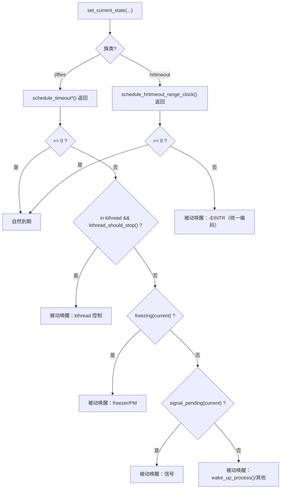
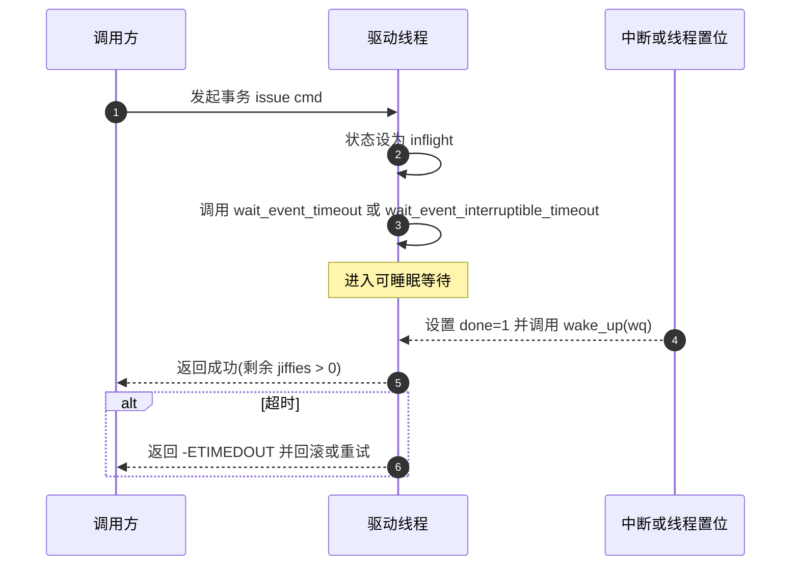

# 第7章 睡眠与超时调度接口

> **章节导语（阅读导航）**
>  在驱动中，“时间”几乎无处不在：上电后的稳定期、总线时序的留白、一次事务的完成、噪声窗口的过滤，以及用户可取消的等待。要把这类问题写得可靠，你必须同时回答三件事：
>  1）**为什么要睡？**——如果不睡，CPU 会被无意义的忙等拖垮，功耗与抖动失控。
>  2）**睡多久？**——过短无效，过长拖慢路径；等待应当“有限且可证”。
>  3）**谁会把我叫醒？**——如果不厘清“自然到期”与“被动唤醒”，你无法正确解释任何返回值。
>  本章按照“**概念与渊源 → 语义与数据结构 → 接口表 → 用法小结与示例 → 可视化 → 调试与验证**”的节奏展开：先从**主动延时**（7.1）入门，再进入本章核心**调度型超时**（7.2，详解“被动唤醒”的所有来源与判别骨架），之后给出**等待队列带超时**（7.3）作为“事件驱动”的主力写法。7.4～7.7  completion、上下文矩阵、工程模板与小结。

------

## 7.1 主动延时接口：`msleep()`、`usleep_range()`、`ssleep()`

### 7.1.1 引入（是什么 / 为什么）

主动延时表达的是“**仅等待一段时间**”——不关心任何条件，只要到点再继续。它诞生的动机是**把 CPU 还给调度器**，避免以 `udelay()` 之类的忙等方式烧掉 CPU 时间与电能。**注意：\**这类接口\**只允许在可睡的进程上下文**使用；在中断/软中断/原子区域里使用会触发 `might_sleep()` 甚至更严重的后果。

### 7.1.2 接口与特性对照表

| 接口                                               | 时间单位/粒度                                 | 可中断性 | 返回语义                         | 典型场景                     | 关键注意                                 |
| -------------------------------------------------- | --------------------------------------------- | -------- | -------------------------------- | ---------------------------- | ---------------------------------------- |
| `ssleep(unsigned int s)`                           | 秒级，粗粒度                                  | 否       | 无返回值（到点继续）             | 粗粒度停顿、长退避           | 粒度过粗，不适合短路径                   |
| `msleep(unsigned int ms)`                          | 毫秒级，受 `HZ/调度粒度` 影响                 | 否       | 无返回值                         | 上电稳定、PHY 链路 settle    | `<20ms` 场景常改用 `usleep_range()`      |
| `msleep_interruptible(unsigned int ms)`            | 毫秒级                                        | **是**   | 被信号可提前返回（需自行判信号） | 可取消的停顿                 | 只代表停顿，可取消并不代表事务完成       |
| `usleep_range(unsigned int min, unsigned int max)` | 微秒级窗口；内核在 `[min,max]` 区间内择机唤醒 | 否       | 无返回值                         | I²C/SPI 尾沿留白、短停顿省电 | **推荐**微秒级睡眠，避免 `udelay()` 忙等 |

> **推荐理由**：微秒级等待请优先 `usleep_range()`——给调度器一个“弹性窗”能显著降低功耗与调度抖动；把 `<1ms` 的 `msleep(1)` 改写为 `usleep_range(800, 1200)` 常更稳。

### 7.1.3 用法小结（含示例）

- **写法建议**
  - `<20ms`：倾向 `usleep_range(x*1000, x*1000+2000)`；
  - `≥20ms`：用 `msleep()`；
  - “只要等一会”而无条件：优先本节接口，而不是 `schedule_timeout*()`。

```c
/* 毫秒级停顿：优先选择合适接口 */
void wait_stable_ms(unsigned int ms)
{
    if (ms >= 20) {
        msleep(ms);
    } else {
        /* 微秒级窗口：给调度弹性，减少抖动与功耗 */
        usleep_range(ms * 1000, ms * 1000 + 2000);
    }
}

/* 微秒级停顿：统一使用 usleep_range */
void wait_stable_us(unsigned int us)
{
    /* 根据平台经验给 100~300us 的窗口 */
    usleep_range(us, us + 200);
}
```

- **反例与后果**
  - 在原子区/中断里 `msleep()` → 直接违反上下文语义；
  - 用 `msleep(1)` 模拟 1ms——实际常为**数毫秒到十余毫秒**；
  - 用 `udelay()` 模拟毫秒级等待——**忙等**导致 CPU 饱和与发热。

------

## 7.2 调度型超时：`schedule_timeout()` 系列（本章核心）

### 7.2.1 引入（本质与渊源）

当你不只是“睡一段时间”，而是要**“在有限时间内等待某条件可能变真”**、或“\**每轮睡一小会再检查\**”，就需要**调度型超时**：

- **本质**：在可睡上下文中，以调度器为执行体让当前任务**限时挂起**。到**时间到期**或**被动唤醒**即返回。
- **关键前提**：在调用前**你必须选择并设置任务状态**——可中断（`TASK_INTERRUPTIBLE`）或不可中断（`TASK_UNINTERRUPTIBLE`）。

### 7.2.2 接口族谱与对照表

| 接口                                                         | 时间单位/精度          | 先置状态                          | 可中断性           | 返回语义                                      | 典型场景                          | 上下文     |
| ------------------------------------------------------------ | ---------------------- | --------------------------------- | ------------------ | --------------------------------------------- | --------------------------------- | ---------- |
| `schedule_timeout(long j)`                                   | jiffies（低/中精度）   | **需要**（`set_current_state()`） | 取决于你设置的状态 | **0**=到期；**>0**=被动唤醒（带剩余 jiffies） | 轮询+限时、分片睡眠               | **仅**可睡 |
| `schedule_timeout_interruptible(long j)`                     | jiffies                | 内部置为 `TASK_INTERRUPTIBLE`     | **是**             | 同上；是否为信号需 `signal_pending()` 判定    | 可取消等待                        | **仅**可睡 |
| `schedule_timeout_uninterruptible(long j)`                   | jiffies                | 内部置为 `TASK_UNINTERRUPTIBLE`   | 否                 | 同上                                          | 短而可控的硬等待（必须有上限）    | **仅**可睡 |
| `schedule_hrtimeout_range_clock(ktime_t *exp, unsigned long delta, enum hrtimer_mode mode, clockid_t clk)` | **ns/ktime**（高精度） | **需要**（你负责置状态）          | 取决于状态         | **0**=到期；**-EINTR**=被动唤醒               | 微/亚毫秒“节拍睡眠”、精度敏感路径 | **仅**可睡 |

> **两点务必牢记**：
>  1）jiffies 族**从不返回负数**；被动唤醒需你再判**信号/显式唤醒/冻结**。
>  2）hrtimeout 族**直接以 `-EINTR` 表示被动唤醒**，无需再判信号（但你仍可按需检查以记录原因）。

### 7.2.3 “自然到期 vs 被动唤醒”——把“谁来叫醒我”说清楚

在任何“限时等待”的讨论中，**如果你不先把“被动唤醒”的来源讲明白，所有返回值解释都不成立**。工程上可把来源收敛为四类（已足够覆盖内核常见场景）：

1. **信号（仅对 `TASK_INTERRUPTIBLE` 生效）**
   - 系统调用线程收到 `SIGINT/SIGTERM/SIGKILL` 等；
   - 判据：`signal_pending(current)`。
2. **显式唤醒**
   - 任何持有你 `task_struct*` 的代码调用 `wake_up_process()`/`wake_up_state()`；
   - kthread 的控制面也可显式唤醒。
3. **kthread 控制**
   - `kthread_stop()` 会唤醒睡眠中的 kthread；
   - 判据：`kthread_should_stop()`。
4. **freezer/电源管理**
   - 冻结流程打断可中断睡眠，使线程进入冻结点；解冻后继续；
   - 判据：`freezing(current)`/`try_to_freeze()`。

> **反证提醒**：不在 kthread、无信号、无 freezer、且无人能拿到你的 `task_struct*`，却频繁“提前醒”，**首先检查写法**（是否先置状态？是否用了转换宏？是否在可睡上下文？）。

**“零号原因”：写法导致“看似被唤醒”**

反例：

```c
/* 反例：未先置状态 → schedule_timeout() 看到 TASK_RUNNING，几乎立即返回 */
long t = msecs_to_jiffies(20);
t = schedule_timeout(t);  /* 错误用法 */
```

正例：

```c
long t = msecs_to_jiffies(20);
set_current_state(TASK_INTERRUPTIBLE);   /* 正确：先置状态再调度 */
t = schedule_timeout(t);
```


**封装版也别误判：**

```c
long left = schedule_timeout_interruptible(j);
if (left > 0) {
    if (signal_pending(current)) { 
        /* 信号导致 */ 
    } else { 
        /* 显式唤醒 / kthread 控制 / 冻结 */ 
    }
} else {
    /* 自然到期 */
}
```

### 7.2.4 用法小结（含可运行示例）

**（A）轮询+限时：分片睡眠，降低负载（可中断）**
 场景：硬件没有可靠唤醒点，只能“睡一下再查”。

```c
#define SLICE_MS 5
#define LIMIT_MS 120

static inline bool hw_ready(void __iomem *base)
{
    return readl(base + STAT_REG) & STAT_RDY;
}

int wait_hw_ready_poll(void __iomem *base)
{
    long left = msecs_to_jiffies(LIMIT_MS);

    while (!hw_ready(base)) {
        if (left <= 0) 
            return -ETIMEDOUT;

        set_current_state(TASK_INTERRUPTIBLE);
        schedule_timeout(msecs_to_jiffies(SLICE_MS));

        if (signal_pending(current)) 
            return -ERESTARTSYS;
        left -= msecs_to_jiffies(SLICE_MS);
    }
    return 0;
}
```

**（B）不可中断“硬等待”：必须短、必须有上限**
 场景：上电后等 PLL/时钟域稳定，不希望信号打断。

```c
#define PLL_STABLE_MS 12
#define GUARD_MS      50

int wait_pll_lock_unintr(void __iomem *base)
{
    long guard = msecs_to_jiffies(GUARD_MS);

    schedule_timeout_uninterruptible(msecs_to_jiffies(PLL_STABLE_MS));
    guard -= msecs_to_jiffies(PLL_STABLE_MS);

    if (readl(base + PLL_STAT) & PLL_LOCK) 
        return 0;

    while (!(readl(base + PLL_STAT) & PLL_LOCK)) {
        if (guard <= 0) 
            return -ETIMEDOUT;
        
        schedule_timeout_uninterruptible(msecs_to_jiffies(2));
        guard -= msecs_to_jiffies(2);
    }
    return 0;
}
```

**（C）微/亚毫秒“节拍睡眠”：高精度且一行判定**
 场景：以 2ms 周期拉取一次数据，允许 100μs 的 slack 以降低功耗。

```c
int run_tick_hr(unsigned int period_us, unsigned int slack_us)
{
    ktime_t exp = ktime_add_us(ktime_get(), period_us);

    set_current_state(TASK_INTERRUPTIBLE);
    if (schedule_hrtimeout_range_clock(&exp,
                                       slack_us * 1000UL, /* ns */
                                       HRTIMER_MODE_ABS,
                                       CLOCK_MONOTONIC) == -EINTR)
        return -ERESTARTSYS;  /* 被动唤醒（统一编码为 -EINTR） */
    return 0;                 /* 自然到期 */
}
```

**（D）演示“显式唤醒”：kthread & `wake_up_process()`**
 用最小内核线程演示：线程每轮准备睡 2s；他处可调用 `kick_worker()` 让它提前醒来。

```c
static struct task_struct *worker;

static int worker_fn(void *data)
{
    while (!kthread_should_stop()) {
        long left;

        pr_info("loop: do work\n");

        set_current_state(TASK_INTERRUPTIBLE);
        left = schedule_timeout(msecs_to_jiffies(2000));

        if (left == 0)         
            pr_info("woke by timeout\n");
        else if (signal_pending(current))
            pr_info("woke by signal\n");
        else                   
            pr_info("woke by explicit wake (left=%ld)\n", left);
    }
    return 0;
}

void kick_worker(void)
{
    if (worker) 
        wake_up_process(worker);
}
```

### 7.2.5 可视化（等待结束的判定流程）



### 7.2.6 调试与验证（把“谁叫醒我”坐实）

- **就地判别骨架**（强烈建议直接嵌入等待循环）：

```c
enum wake_reason { WR_TIMEOUT=0, WR_SIGNAL=1, WR_EXPLICIT=2, WR_FREEZER=3 };

static int sleep_once_jiffies(long *p_left, bool interruptible, bool in_kthread)
{
    long left = *p_left;

    if (interruptible) 
        set_current_state(TASK_INTERRUPTIBLE);
    else               
        set_current_state(TASK_UNINTERRUPTIBLE);

    left = schedule_timeout(left);

    if (left == 0)                        
        return WR_TIMEOUT;
    if (in_kthread && kthread_should_stop()) 
        return WR_EXPLICIT;
    if (freezing(current)) { 
        try_to_freeze(); 
        return WR_FREEZER; 
    }
    if (interruptible && signal_pending(current)) 
        return WR_SIGNAL;
    return WR_EXPLICIT;
}
```

- **tracepoints 证据链**（无需改内核）：

  ```
  echo 1 > /sys/kernel/debug/tracing/events/sched/sched_wakeup/enable
  echo 1 > /sys/kernel/debug/tracing/events/sched/sched_switch/enable
  echo function > /sys/kernel/debug/tracing/current_tracer
  ```

  结合日志中的 `WR_*` 原因打印，你能看到**谁**沿着 `try_to_wake_up()` 链条把任务叫醒。

- **AB 对照实验**：

  - `_interruptible` ↔ `_uninterruptible` 短时切换验证“信号能否打断”；
  - `hrtimeout` 的 `delta=0 ↔ 1000us`，对比功耗/唤醒抖动。

### 7.2.7 常见坑（与后果）

1）**未先置状态就调度** → 几乎立即返回，误判为“被动唤醒”。
 2）**把 jiffies 返回值当 errno** → jiffies 族**从不返回负数**；是否被信号打断要看 `signal_pending()`。
 3）**滥用 `_uninterruptible`** → 异常时形成长时间 **D 状态**；必须设置**上限**并准备兜底。
 4）**硬编码超时** → 跨平台 `HZ` 不同导致时长失真；请使用转换宏或 `ktime`。
 5）**在不可睡上下文调用** → `might_sleep()`/潜在死锁。

------

## 7.3 等待队列带超时：`wait_event_timeout()` / `wait_event_interruptible_timeout()`

### 7.3.1 引入（为什么还需要等待队列）

如果你的等待具有**明确的“条件—唤醒点”**（例如：IRQ 线程置位 `done=1`），那么等待队列的“**条件 + 超时**”形式比“轮询 + 限时”更贴近事件驱动，也**更不易丢唤醒** —— 你声明的不是“睡多久”，而是**“等到条件变真，或到达上限就放弃”**。

### 7.3.2 接口与返回语义对照表

| 接口                                           | 可中断性 | 返回语义                                                     | 典型场景                       | 关键注意                                      |
| ---------------------------------------------- | -------- | ------------------------------------------------------------ | ------------------------------ | --------------------------------------------- |
| `wait_event_timeout(q, cond, j)`               | 否       | **>0**：剩余 jiffies（条件成立并被唤醒）；**0**：超时        | 一次事务的完成对齐（不可取消） | `cond` 必须在唤醒后可靠为真（原子/锁/可见性） |
| `wait_event_interruptible_timeout(q, cond, j)` | **是**   | **>0**：成功；**0**：超时；**<0**：被信号打断（典型 `-ERESTARTSYS`） | 可取消的事务等待               | 正确向上传递“可重启/已取消”语义               |

> **超时单位**仍是 jiffies，务必用 `msecs_to_jiffies()` 等宏转换。

### 7.3.3 用法小结（含示例）

**（A）不可中断的一次“完整一单”**

```c
struct trans {
    wait_queue_head_t 	 wq;
    atomic_t 			done;  /* 0/1 */
    int 				rc;
};

static inline bool trans_done(struct trans *t)
{ 
    return atomic_read(&t->done) == 1; 
}

void trans_complete(struct trans *t, int rc)
{
    WRITE_ONCE(t->rc, rc);
    atomic_set(&t->done, 1);
    wake_up(&t->wq);                 /* 先置位，再唤醒 */
}

int trans_exec(struct trans *t, unsigned int timeout_ms)
{
    long left = wait_event_timeout(t->wq,
                    trans_done(t),
                    msecs_to_jiffies(timeout_ms));
    if (left > 0)  
        return READ_ONCE(t->rc);
    
    if (left == 0) 
        return -ETIMEDOUT;
    
    return (int)left;                /* 不会 <0，仅保持结构对称 */
}
```

**（B）可中断事务（用户可取消）**

```c
int trans_exec_intr(struct trans *t, unsigned int timeout_ms)
{
    long left = wait_event_interruptible_timeout(t->wq,
                    trans_done(t),
                    msecs_to_jiffies(timeout_ms));
    if (left > 0)  
        return READ_ONCE(t->rc);
    
    if (left == 0) 
        return -ETIMEDOUT;
    
    return (int)left;                /* 典型 -ERESTARTSYS */
}
```

**（C）去抖确认期：中断轻、确认慢（与第 6 章 delayed_work 配合）**

- 中断线程仅记录候选事件并 `mod_delayed_work(debounce_ms)`；
- 若上层同步等待结果，则在 `read()/ioctl()` 路径使用 `wait_event*_timeout()` 限定窗口，避免永久阻塞；
- 设备树中的 `nxp,debounce-ms` 转换为 jiffies/ktime，统一进入超时与延迟策略。

### 7.3.4 可视化（一次“带超时的事务”）



### 7.3.5 调试与验证（避免“醒了却看不见条件为真”）

- **顺序保证**：**先写状态，再唤醒**。
- **可见性**：`atomic_t`、自旋锁，或 `WRITE_ONCE/READ_ONCE` + 必要的内存屏障，确保等待者醒来后能“看见”条件为真。
- **trace**：在 `wake_up()` 与 `wait_event*_timeout()` 返回处放置 `trace_printk()`；必要时启用 `sched_wakeup/sched_switch` 事件。
- **压测方法**：把超时调短、引入重试上限，确保任何异常都能在测试中“快速显形”。


------

## 7.4 completion 超时：`wait_for_completion*_timeout()`

### 7.4.1 导语（为什么还有 completion）

等待队列擅长表达“**条件为真 → 唤醒**”。而 **completion** 更像“**一次事件的对齐点**”：生产者在某刻宣布“完成”，消费者在有限时间内等待“那一次完成”。写事务、IRQ 对齐、一次性握手时，它的表达更**直接**、**不易丢语义**。

### 7.4.2 接口与特性对照表

| 接口/宏                                                      | 语义与返回                                    | 可中断性   | 上下文          | 典型用途                      | 关键注意                             |
| ------------------------------------------------------------ | --------------------------------------------- | ---------- | --------------- | ----------------------------- | ------------------------------------ |
| `init_completion(struct completion *c)`                      | 初始化，`done=0`                              | —          | 进程/中断均可   | 首次使用                      | 若在栈上，请成对使用                 |
| `reinit_completion(struct completion *c)`                    | 重置为未完成状态                              | —          | 进程/中断均可   | **重复使用**同一个 completion | 避免“上次完成残留”导致新一轮立即返回 |
| `complete(struct completion *c)`                             | 标记完成并唤醒**一个**等待者                  | 不睡眠     | 硬中断/线程均可 | IRQ/工作线程“宣布完成”        | “一对一”语义，内部递增 `done`        |
| `complete_all(struct completion *c)`                         | 唤醒**全部**等待者                            | 不睡眠     | 硬中断/线程均可 | 广播完成                      | 等价“多对一次完成”                   |
| `wait_for_completion(struct completion *c)`                  | 阻塞直到完成                                  | 不可中断   | **仅可睡**      | 事务对齐                      | 可能永久等待，建议用带超时版本       |
| `wait_for_completion_timeout(struct completion *c, j)`       | **>0**：剩余 jiffies；**0**：超时             | 不可中断   | **仅可睡**      | 常用（推荐）                  | 与 `msecs_to_jiffies()` 配套         |
| `wait_for_completion_interruptible_timeout(struct completion *c, j)` | **>0**：成功；**0**：超时；**<0**：被信号打断 | **可中断** | **仅可睡**      | 用户可取消的路径              | 向上传递 `-ERESTARTSYS` 等           |
| `try_wait_for_completion(struct completion *c)`              | 非阻塞尝试：1=已完成且消费，0=未完成          | 不睡眠     | 任意            | 快速探测                      | 常用于快路径/轮询避锁                |
| `completion_done(struct completion *c)`                      | 仅查询是否“曾完成”（不消费）                  | 不睡眠     | 任意            | 诊断/条件分支                 | 不能代替 wait，避免竞态误判          |

> 语义提醒：`complete()` 会让 `done` 递增；`wait_for_completion*()` 返回时会**消费一次**（递减），因此**“一次完成 ↔ 一次消费”**。如果要复用同一个 completion 做下一次事件，对消费者侧**重置 `reinit_completion()`** 是必须动作。

### 7.4.3 用法小结（含示例）

**（A）IRQ 对齐的一次性事务（不可中断 + 超时）**

```c
struct mydev {
    struct completion done;
    int rc;
};

static irqreturn_t my_irq_thread(int irq, void *data)
{
    struct mydev *d = data;
    d->rc = 0;              /* 填写结果，保证可见性即可 */
    complete(&d->done);     /* 允许在硬/线程中断上下文调用 */
    return IRQ_HANDLED;
}

int my_once(struct mydev *d, unsigned int timeout_ms)
{
    reinit_completion(&d->done);                   /* 复用前重置 */
    /* issue: 向硬件发出一次命令或启动一次传输 */

    if (!wait_for_completion_timeout(&d->done, msecs_to_jiffies(timeout_ms)))
        return -ETIMEDOUT;                         /* 自然到期 */

    return d->rc;                                   /* 正常完成 */
}
```

**（B）可中断版本：向上暴露“可取消”**

```c
int my_once_intr(struct mydev *d, unsigned int timeout_ms)
{
    reinit_completion(&d->done);
    /* issue ... */
    long left = wait_for_completion_interruptible_timeout(&d->done,
                          msecs_to_jiffies(timeout_ms));
    if (left > 0)  
        return d->rc;
    if (left == 0) 
        return -ETIMEDOUT;
    return (int)left;           /* 典型 -ERESTARTSYS */
}
```

**（C）广播完成：多个等待者同时起跑**

```c
/* 多条路径在同一个完成点等待启动信号 */
complete_all(&global_go);  /* 全部等待者一并唤醒 */
```

**常见坑与后果**

1. **忘记 `reinit_completion()`**：第二轮等待会发现 `done` 仍为正数，从而“瞬时返回”，误判为“被动唤醒”。
2. **先唤醒后置位业务结果**：消费者醒来读到旧值，形成“醒而不真”。请先写结果，再 `complete()`。
3. **把 `completion_done()` 当条件**：并发下易误判，应坚持“**wait 才是唯一承诺**”。
4. **在不可睡上下文等待**：同样会触发 `might_sleep()`，请只在可睡环境调用 wait 系列。

------

## 7.5 哪些上下文可用、哪些绝不可用（可睡矩阵）

### 7.5.1 导语

“会不会睡”的判断先于一切 API 选择。下面矩阵帮你在动手前就把**上下文边界**收紧，避免把不可睡接口用到“原子区/中断”里。

### 7.5.2 可睡矩阵（速查）

| 上下文/接口族                   | `msleep / usleep_range / ssleep` | `schedule_timeout*` | `schedule_hrtimeout*` | `wait_event*_timeout` | `wait_for_completion*_timeout` |
| ------------------------------- | -------------------------------- | ------------------- | --------------------- | --------------------- | ------------------------------ |
| 进程上下文 / 内核线程（可睡）   | ✅                                | ✅                   | ✅                     | ✅                     | ✅                              |
| 工作队列线程（process context） | ✅                                | ✅                   | ✅                     | ✅                     | ✅                              |
| 软中断/BH                       | ❌                                | ❌                   | ❌                     | ❌                     | ❌                              |
| 硬中断（top-half / 线程化前）   | ❌                                | ❌                   | ❌                     | ❌                     | ❌                              |
| 持自旋锁 / 禁抢占的原子区       | ❌                                | ❌                   | ❌                     | ❌                     | ❌                              |

> 记忆法：**所有 wait/sleep 系列都只属于“可睡”世界**。
>  在**不可睡**环境（中断/原子区）：要么用**忙轮询**短等（第 8 章），要么**hrtimer 回调 + 推迟到工作队列**。

------

## 7.6 工程模板与常见陷阱（把话说到能落地）

> 本节把本章的接口拼成可直接上板的“工程骨架”，并用**原因判别**与**trace 工具**保证可证。为贴近你的现场，示例采用你固定的节点约定：`demo_led_key_int@0`、`nxp,debounce-ms` 等。

### 7.6.1 模板一：**完整一单 + 超时 + 回滚/重试**（等待队列版）

**场景**：一次 I/O 命令或状态转换，期望在窗口内完成；失败时回滚，必要时退避重试。
 **要点**：先置位再唤醒；`timeout` 用转换宏；记录“成功/超时/信号”。

```c
struct txn {
    wait_queue_head_t 	 wq;
    atomic_t 			done;       /* 0/1 */
    int 				rc;
    unsigned 			backoff_ms; /* 退避窗 */
    unsigned 			max_retry;  /* 次数上限 */
};

static void txn_reset(struct txn *t)
{ 
    atomic_set(&t->done, 0); 
    WRITE_ONCE(t->rc, -EINPROGRESS); 
}

static void txn_complete(struct txn *t, int rc)
{ 
    WRITE_ONCE(t->rc, rc); 
    atomic_set(&t->done, 1); 
    wake_up(&t->wq); 
}

/* 可中断版：用户可以取消 */
int txn_exec(struct txn *t, unsigned timeout_ms)
{
    for (unsigned n = 0; n <= t->max_retry; ++n) {
        long left;
        txn_reset(t);

        /* 1) 下发命令到硬件（可睡） */
        /* issue... 若失败→直接返回错误 */

        /* 2) 等待完成/信号/超时 */
        left = wait_event_interruptible_timeout(t->wq,
                   atomic_read(&t->done),
                   msecs_to_jiffies(timeout_ms));
        
        if (left > 0)  
            return READ_ONCE(t->rc);   /* 成功 */
        
        if (left < 0)  
            return (int)left;          /* -ERESTARTSYS 等 */

        /* 3) 超时：回滚并退避重试 */
        /* hw_abort_or_reset(); 与设备协议一致 */
        if (n == t->max_retry) 
            return -ETIMEDOUT;
        
        if (t->backoff_ms) 
            msleep(t->backoff_ms);
    }
    return -ETIMEDOUT;
}
```

**常见坑**

- 先唤醒、后置位 → “醒了却看不见条件”。
- 忘记把 `timeout_ms` 转换为 jiffies。
- 重试不做退避 → 抢占总线、引发抖动。

### 7.6.2 模板二：**完整一单 + 超时 + 回滚/重试**（completion 版）

**场景**：典型“发一次 → 等一次”，由 IRQ 或工作线程在完成点调用 `complete()`。

```c
struct txn_c {
    struct completion 	 done;
    int 				rc;
    unsigned 			backoff_ms, max_retry;
};

static inline void txn_c_init(struct txn_c *t)
{ 
    init_completion(&t->done); 
    t->rc = -EINPROGRESS; 
}

/* 完成点：可在硬/线程中断里调用 */
static inline void txn_c_finish(struct txn_c *t, int rc)
{ 
    t->rc = rc; 
    complete(&t->done); 
}

int txn_c_exec(struct txn_c *t, unsigned timeout_ms)
{
    for (unsigned n = 0; n <= t->max_retry; ++n) {
        reinit_completion(&t->done);
        t->rc = -EINPROGRESS;

        /* issue ... */

        if (!wait_for_completion_timeout(&t->done, msecs_to_jiffies(timeout_ms))) {
            /* 超时 */
            /* hw_abort_or_reset(); */
            if (n == t->max_retry) 
                return -ETIMEDOUT;
            
            if (t->backoff_ms) 
                msleep(t->backoff_ms);
            continue;
        }
        return t->rc;      /* 成功 */
    }
    return -ETIMEDOUT;
}
```

**常见坑**

- 忘记 `reinit_completion()`：下一轮会“瞬时返回”。
- 在不可睡上下文里调用 wait 系列：违反上下文。
- 完成点未先写结果：消费者读到旧值。

### 7.6.3 模板三：**按键/传感器去抖确认（与第 6 章协同）**

**场景**：`demo_led_key_int@0` 使用 `nxp,debounce-ms`。中断只做“记录候选并推迟”；稳定确认在工作队列里完成；若用户同步等待，使用等待队列带超时以免卡死。

```c
struct key_demo {
    struct device 		*dev;
    struct delayed_work  db_work;
    unsigned 			debounce_ms;       /* 取自 DT: nxp,debounce-ms */
    wait_queue_head_t 	 wq;
    atomic_t 			stable;            /* 0=未知/未稳定, 1=稳定按下/释放 */
};

static irqreturn_t key_irq_thread(int irq, void *data)
{
    struct key_demo *k = data;
    /* 只做轻量工作：推迟到进程上下文去确认 */
    mod_delayed_work(system_wq, &k->db_work, msecs_to_jiffies(k->debounce_ms));
    return IRQ_HANDLED;
}

static void key_db_work(struct work_struct *ws)
{
    struct key_demo *k = container_of(to_delayed_work(ws), struct key_demo, db_work);
    /* 读取 GPIO 电平并判稳，结果写入 stable */
    atomic_set(&k->stable, 1);     /* 示例：认为稳定为“真” */
    wake_up(&k->wq);               /* 唤醒同步等待者（若有） */
}

/* 同步等待一个稳定结果，最多等 debounce_ms + 额外留白 */
int key_wait_stable(struct key_demo *k)
{
    atomic_set(&k->stable, 0);
    /* 已在中断里安排了 db_work，这里只需等待结果或超时 */
    long left = wait_event_timeout(k->wq,
                    atomic_read(&k->stable),
                    msecs_to_jiffies(k->debounce_ms + 20));
    if (left > 0)  
        return 0;
    
    if (left == 0) 
        return -ETIMEDOUT;
    
    return (int)left; /* 不会 <0，保持结构一致 */
}
```

**要点**

- 中断里不要睡，确认放到工作队列（第 6 章）。
- 若上层同步等待，务必加超时窗口；并保证**先写结果，再唤醒**。

### 7.6.4 统一“原因判别”封装（便于排障）

对于 `schedule_timeout*()` 我们已提供 `WR_TIMEOUT / WR_SIGNAL / WR_EXPLICIT / WR_FREEZER` 的判别骨架。
 对 **wait/completion** 路径，可统一打印：**SUCCESS / TIMEOUT / INTERRUPTED** 三类，再用 tracepoints 定位唤醒源（`sched_wakeup / sched_switch`）。

------

## 7.7 小结（选型规则 + 验证路线）

### 7.7.1 选型三问

1. **是否有明确唤醒点？**
   - 有 → `wait_event*_timeout()` 或 `wait_for_completion*_timeout()`。
   - 无 → `schedule_timeout*()` 分片睡眠 + 条件检查。
2. **是否需要亚毫秒/纳秒级节拍？**
   - 需要 → `schedule_hrtimeout_range_clock()` 或第 5 章 `hrtimer`。
3. **是否允许用户取消？**
   - 允许 → 选“可中断”版本（`interruptible_timeout` / `wait_for_completion_interruptible_timeout`），向上返回 `-ERESTARTSYS` 或自定义错误。

### 7.7.2 被动唤醒判定口诀

- **jiffies 族**：`==0` 自然到期；`>0` 被动唤醒 → 依次检查 **kthread_stop → freezer → signal_pending → 其他显式唤醒**。
- **hrtimeout 族**：`==0` 自然到期；`-EINTR` 被动唤醒。
- **wait/completion**：`>0` 成功，`0` 超时，`<0` 被信号打断（仅可中断型）。

### 7.7.3 验证路线（把“感觉”变成“证据”）

- **代码侧**：嵌入“原因判别骨架”，每次返回都打标签。

- **系统侧**：开启

  ```
  /sys/kernel/debug/tracing/events/sched/sched_wakeup/enable
  /sys/kernel/debug/tracing/events/sched/sched_switch/enable
  ```

  配合 `function` tracer/`trace-cmd` 观察调用栈中的 `try_to_wake_up`、`kthread_stop`、`wake_up_process` 等。

- **AB 实验**：

  - `_interruptible` ↔ `_uninterruptible` 短时切换，验证信号影响；
  - hrtimeout 的 `delta=0 ↔ 1000us`，验证功耗与抖动；
  - completion 版加/缺 `reinit_completion()`，观察是否出现“瞬时返回”。

