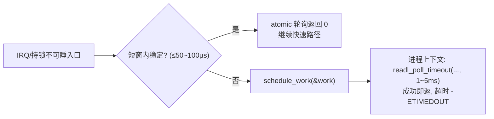
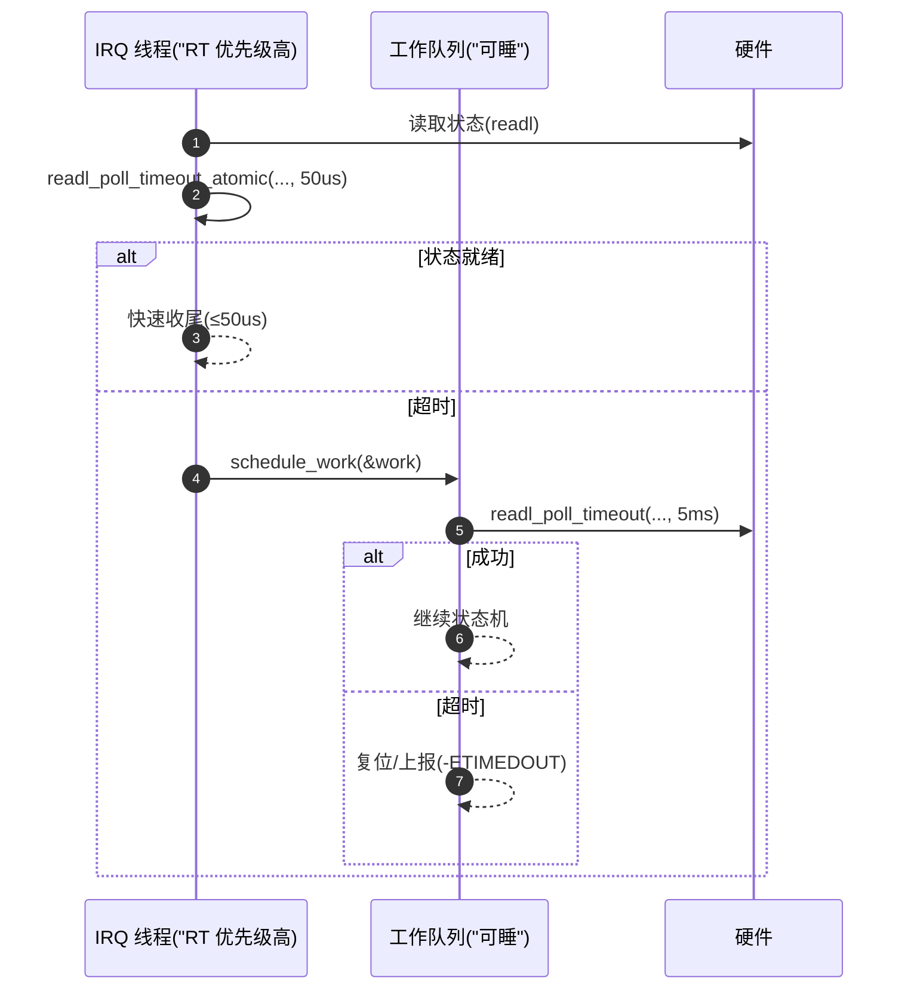
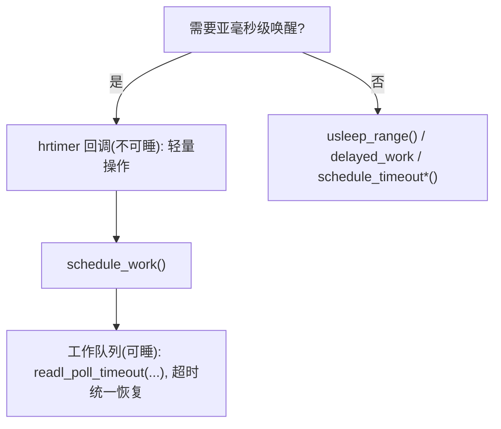
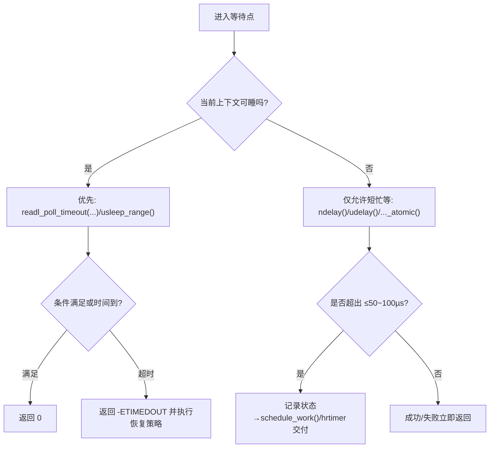

# 第8章 忙等待与短延时：`udelay()` / `ndelay()` 的边界

## 8.0 章节导读（编辑部体例·阅读提示）

忙等待（busy-wait）是驱动里最容易“下手快、后患长”的手段：它以**占用 CPU**换取**短时延的相对确定性**。正确使用的关键，不在“会不会写 `udelay()`/`ndelay()`”，而在**知道它该出现在哪里、不该出现在哪里**。本章以“**能睡就不忙**、**不可睡只短忙**”为底线，系统展开：

- 忙等待的**实现机理**与**参数上限**（开发者应知的边界条件）；
- 为什么不能用忙等待“顶住”长时间窗口（系统副作用清单与替代方案）；
- 与寄存器轮询/总线就绪检测的**组合写法**（`*_poll_timeout*()` 宏族的两种上下文路径）；
- 在 **SMP / PREEMPT / PREEMPT_RT** 配置下的行为变化与风险收敛策略。

读完本章，你应能：

1. 为每一处短延时选择**最合适**的接口与上下文路径；
2. 统一将“等待+超时”改造为**策略化**与**可回退**的模板；
3. 对 RT(real-time) 环境给出**可预期**的延迟与证明材料（trace、回归用例）。

------

## 8.1 忙等待的实现思路与适用范围

### 8.1.1 定义与边界陈述

- **忙等待（busy-wait）**：在**当前 CPU 上自旋**至条件满足；不触发调度、不进入睡眠。
- **常用接口**：
  - `ndelay(nsec)`：纳秒级目标保持；
  - `udelay(usec)`：微秒级目标保持；
  - `cpu_relax()`：自旋中的提示性指令（体系结构相关），降低功耗/改善 SMT 资源占用；
  - `readl_poll_timeout*()` / `readl_poll_timeout_atomic()`：带**条件**与**超时**的标准轮询封装。
- **经验区间（建议）**：
  - `ndelay()`：≤~500 ns 目标区间（非硬实时保证）；
  - `udelay()`：**1–50 µs 推荐上限**，**≤100 µs 极限**；
  - 若需求 ≥100 µs：考虑 `usleep_range()`（能睡路径）；若 ≥1 ms：考虑 `schedule_timeout*()`、`delayed_work`、或 `hrtimer`（不能睡但需高精度唤醒）。

> 结论先行：**`udelay()` 不是“可用即用”的通用延时**；它是“**短、急、不可睡**”语境下的**权衡**。

### 8.1.2 内核实现要点（供开发者核对）

- **循环校准**：启动期计算 `loops_per_jiffy`，`udelay()` 以此推导循环次数；在不同 **HZ**、不同 **cpufreq** 动态下，最终抖动会受限于平台。
- **高精度不等于硬实时**：`ndelay()`/`udelay()`的延时是**目标**，非严格 SLA；中断、抢占、频率转换、温控限频都会造成偏差。
- **编译/体系结构行为**：
  - 自旋体内建议显式 `cpu_relax()`；
  - 不要在忙循环中插入可能带来屏障语义变化的重负载操作（例如误用 `readl()` 作为“延时”，会造成总线侧效应）。
- **功耗与温控耦合**：较长忙等将触发 DVFS/温控策略，反过来破坏“短延时稳定性”，这是**正反馈式变坏**的常见根因。

### 8.1.3 何时必须忙？

- **硬中断/不可睡**路径的极短等待窗口（如读取确认位后需保持若干微秒再清除）；
- **位打拍（bit-banging）\**中无法外包给定时外设、且可接受一定抖动的\**亚微秒/微秒**保持；
- **不可拆分的总线时序片段**（例如某些复位序列的紧邻保持），但应**证明**不可拆分，且**给出替代论证**（见 8.2.2）。

------

## 8.2 为何不能用 busy-wait 模拟长超时

### 8.2.1 系统副作用总表

| 副作用         | 触发条件                         | 典型表现                   | 对策                                                         |
| -------------- | -------------------------------- | -------------------------- | ------------------------------------------------------------ |
| 100% 占核      | `udelay()` >= 数百微秒或循环多次 | 可运行队列堆积、交互卡顿   | 改用可睡等待（`usleep_range()`/`*_poll_timeout()` 非 atomic） |
| 可预期性下降   | PREEMPT/RT 环境                  | 高优先级线程 deadline miss | 缩短忙等；将等待转交工作队列                                 |
| 频率/温控干扰  | 长忙等导致高功耗                 | CPU 降频后延时更不准       | 避免长忙等，使用事件/定时器                                  |
| 中断延迟拉长   | IRQ 中重复忙等                   | 其他中断响应变慢           | 在 IRQ 里仅做极短阶段，立即下放                              |
| 软件维护成本高 | 手写 while+时间判断              | 漏超时/重复逻辑            | 统一用 `*_poll_timeout*()` 宏族                              |

> **编辑部提示**：任何“≥100 µs 且无不可分割时序理由”的忙等，均视为**需要重构**。

### 8.2.2 正确替代路径（按时间尺度与上下文）

1. **10–200 µs，且可睡**：
   - 使用 `usleep_range(min, max)`。
   - 选择窗口建议 `min=需求下界，max=min+10%~20%`，给调度器安排空间与省电收益。
2. **≥1 ms，或需要周期性**：
   - 使用 `schedule_timeout_*()` 或 `delayed_work`；如需更紧致周期抖动，可用 `hrtimer` 触发、再下放到工作队列处理。
3. **等待“条件成立”而非“纯时间流逝”**：
   - 使用 `readl_poll_timeout()`（能睡）/`readl_poll_timeout_atomic()`（不可睡），并**显式**给出 `delay_us` 和 `timeout_us`。
4. **严格时序（纳秒级）**：
   - 迁移至**硬件定时外设**（PWM、定时捕获、序列引擎、DMA 带等待槽位等），不要期待 `ndelay()` 提供硬实时保证。

### 8.2.3 从误用到重构：两段式改写范式

**误用（示意）**：

```c
/* 反例：IRQ 内忙等 1ms，系统退化明显 */
static irqreturn_t bad_irq(int irq, void *d)
{
    /* ... */
    udelay(1000);  /* 不可取 */
    /* ... */
    return IRQ_HANDLED;
}
```

**改写（建议）**：

```c
/* 第 1 段：IRQ 内仅做极短确认（≤50~100us），失败则下放 */
static irqreturn_t good_irq(int irq, void *data)
{
    struct my *m = data;
    u32 v;

    if (readl_poll_timeout_atomic(m->base + STATUS, v, v & READY, 1, 50)) {
        /* 未就绪：下放至工作队列（可睡） */
        schedule_work(&m->wq);
        return IRQ_HANDLED;
    }
    /* 快速路径：READY 已就绪，执行最小处理 */
    /* ... */
    return IRQ_HANDLED;
}

/* 第 2 段：可睡上下文内进行最长 5ms 的等待与恢复 */
static void my_work(struct work_struct *w)
{
    struct my *m = container_of(w, struct my, wq);
    u32 v;

    if (readl_poll_timeout(m->base + STATUS, v, v & READY, 20, 5000)) {
        dev_warn(m->dev, "hw not ready in 5ms, reset\n");
        my_reset(m);
    }
    /* ... 后续处理 ... */
}
```

### 8.2.4 参数选型与可证性（审稿用校核点）

- **是否给出**明确的 `delay_us` 与 `timeout_us`（而非裸 `while`）？
- **是否区分**能睡与不可睡上下文，并采用对应宏族（非 `_atomic` vs `_atomic`）？
- **是否提供**失败路径的**统一返回码**（普遍采用 `-ETIMEDOUT`）与**恢复动作**（复位/重试/上报）？
- **是否说明**在 **PREEMPT_RT** 与**低频态**下的回归测试结果（8.9 节将给出建议用例）？

------

### 8.2.5 实操速查表（本章前半建议随手翻）

| 目标            | 上下文    | 优先手段                                           | 典型参数（起步）               | 备注                        |
| --------------- | --------- | -------------------------------------------------- | ------------------------------ | --------------------------- |
| 保持 100–300 ns | 不可睡    | `ndelay()`                                         | 100–300                        | 抖动不可避免，谨慎评审      |
| 保持 1–50 µs    | 不可睡    | `udelay()`                                         | 1–50                           | **≤100 µs 上限**            |
| 轮询就绪 ≤5 ms  | 可睡      | `readl_poll_timeout()`                             | delay=10–50 µs, timeout=1–5 ms | 成功即返、统一 `-ETIMEDOUT` |
| 10–200 µs 延时  | 可睡      | `usleep_range()`                                   | min=需求值, max=+10%~20%       | 省电与可预期性更优          |
| ≥1 ms 延时/周期 | 可睡/分层 | `delayed_work` / `schedule_timeout*()` / `hrtimer` | 依据场景                       | hrtimer 回调中不可睡        |

------

## 8.2.6 最小可粘贴模板（可直接替换魔数）

**可睡轮询（推荐默认）**：

```c
#include <linux/iopoll.h>

int wait_ready_sleepable(void __iomem *base, u32 mask,
                         u32 delay_us, u32 timeout_us)
{
    u32 v;
    return readl_poll_timeout(base, v, (v & mask), delay_us, timeout_us);
}
```

**不可睡极短窗口**：

```c
#include <linux/iopoll.h>

int wait_ready_atomic(void __iomem *base, u32 mask,
                      u32 delay_us, u32 timeout_us)
{
    u32 v;
    return readl_poll_timeout_atomic(base, v, (v & mask), delay_us, timeout_us);
}
```

------

## 8.2.7 常见反模式与修正（工程化口径）

| 反模式                           | 典型代码                                 | 修正                                                     |
| -------------------------------- | ---------------------------------------- | -------------------------------------------------------- |
| “先来个 1ms udelay 保险”         | `udelay(1000);`                          | 能睡：`usleep_range(1000,1100)`；不可睡：拆成短忙等+下放 |
| 手写 while+时间戳                | `while (!ready && now<deadline) { ... }` | 用 `*_poll_timeout*()`，语义、超时与返回码统一           |
| 期待 `ndelay(50)` 的 50ns 硬保证 | `ndelay(50);`                            | 改硬件：PWM/定时外设/序列引擎                            |
| IRQ 内多轮 `udelay(100)`         | 循环 `udelay`                            | `_atomic` 轮询 ≤50–100 µs，余下交工作队列                |


------

## 8.3 与寄存器轮询、总线就绪检测的组合写法

### 8.3.1 编辑部引导

驱动要等待的，往往不是“时间本身”，而是**事件条件**（寄存器位、状态机阶段、FIFO 水位）。因此，本节建议把“纯忙等的时间观”升级为“**事件就绪 + 有界超时**”的**统一轮询语义**：

- **能睡**→ 使用可睡轮询（调度友好、低开销）；
- **不可睡**→ 仅允许短窗口的不可睡轮询（忙等占核，但有上限）。
   这种“条件+超时”的表达，请优先使用 `iopoll.h` 宏族，避免手搓 `while + udelay()`。

### 8.3.2 接口族谱与语义（以 32 位寄存器为例）

| 接口                                                         | 语义/作用                                                    | 使用场景                          | 可睡        | 典型参数建议                         | 不写的后果                              |
| ------------------------------------------------------------ | ------------------------------------------------------------ | --------------------------------- | ----------- | ------------------------------------ | --------------------------------------- |
| `readl_poll_timeout(addr, val, COND, delay_us, timeout_us)`  | 循环 `readl(addr)` 到 `val`，若 `COND` 成立返回 0；超时返回 `-ETIMEDOUT` | 进程上下文                        | 是          | `delay_us=10~50`，`timeout_us=1~5ms` | 手写循环易漏超时/返回码不一，调度不友好 |
| `readl_poll_timeout_atomic(...)`                             | 与上相同，但**不可睡**，内部以 `udelay()`/`cpu_relax()` 间隔 | 硬中断、软中断、持锁等不可睡路径  | 否          | `delay_us=1`，`timeout_us≤50~100`    | 超出窗口会占核拉长 IRQ 延迟             |
| `read_poll_timeout(op, addr, val, COND, delay_us, timeout_us, args...)` | 自定义读取函数的通用版本                                     | 需要包裹特定 `read_fn()` 或多步读 | 取决于 `op` | 同上                                 | 手写 while 导致重复逻辑与边界缺失       |

> 说明：`readb/readw/readl/readq` 均有 `*_poll_timeout` 变体；`readq_*` 仅在平台提供 `readq()` 时可用。

### 8.3.3 组合写法：就绪位轮询（可睡版本，推荐）

```c
// SPDX-License-Identifier: GPL-2.0
#include <linux/iopoll.h>
#include <linux/io.h>

#define REG_STATUS     0x10
#define ST_READY       BIT(0)

int my_wait_ready_sleepable(void __iomem *base)
{
    u32 v;
    /* 每 20us 轮询，总超时 5ms；成功即返，失败 -ETIMEDOUT */
    return readl_poll_timeout(base + REG_STATUS, v,
                              (v & ST_READY),
                              20, 5000);
}
```

**驱动中的使用逻辑**

- 进程上下文优先用此版本；
- 返回 0：继续状态机；返回 `-ETIMEDOUT`：立刻走**统一恢复路径**（复位/重试/上报）。
   **不写的后果**：改用 `while + usleep_range()` 容易遗漏“提前成功即返”的逻辑，导致**无谓等待**。

### 8.3.4 组合写法：不可睡短轮询（IRQ/持锁路径）

```c
#include <linux/iopoll.h>
int my_wait_ready_atomic(void __iomem *base)
{
    u32 v;
    /* 每 1us 忙等，最多 50us；超过即交给可睡路径处理 */
    return readl_poll_timeout_atomic(base + REG_STATUS, v,
                                     (v & ST_READY),
                                     1, 50);
}
```

**驱动中的使用逻辑**

- 在 IRQ 内或持有不可睡锁的代码段，只允许**≤50~100µs**的忙等窗口；超出立即**下放工作队列**。
   **不写的后果**：把 1ms、5ms 等长等待强行塞进 IRQ，造成“系统整体迟滞”。

### 8.3.5 面向 `demo_led_key_int@0` 的落地示例

结合你给定的节点（`compatible = "nxp,imx6ull-led_key_int"`，GPIO 中断输入 + 去抖属性 `nxp,debounce-ms`）：

```c
// SPDX-License-Identifier: GPL-2.0
#include <linux/module.h>
#include <linux/platform_device.h>
#include <linux/of.h>
#include <linux/iopoll.h>
#include <linux/gpio/consumer.h>
#include <linux/interrupt.h>
#include <linux/workqueue.h>

#define REG_STATUS      0x10
#define ST_KEY_STABLE   BIT(1)

struct lk_dev {
    struct device     *dev;
    void __iomem      *base;
    struct gpio_desc  *key;
    unsigned int       irq;
    unsigned int       debounce_ms; /* from DT: nxp,debounce-ms */
    struct work_struct work;
};

static int lk_wait_stable_sleepable(struct lk_dev *d)
{
    u32 v;
    /* 按 DT 去抖时间上限做超时（例如 10ms） */
    return readl_poll_timeout(d->base + REG_STATUS, v,
                              (v & ST_KEY_STABLE),
                              50, d->debounce_ms * 1000);
}

static irqreturn_t lk_irq(int irq, void *data)
{
    struct lk_dev *d = data;
    u32 v;

    /* 尝试极短确认：≤50us */
    if (readl_poll_timeout_atomic(d->base + REG_STATUS, v,
                                  (v & ST_KEY_STABLE),
                                  1, 50)) {
        schedule_work(&d->work); /* 转入可睡等待 */
    }
    return IRQ_HANDLED;
}

static void lk_work(struct work_struct *w)
{
    struct lk_dev *d = container_of(w, struct lk_dev, work);
    if (lk_wait_stable_sleepable(d)) {
        dev_dbg(d->dev, "key not stable within debounce window\n");
        return;
    }
    /* ...上报稳定态... */
}

/* 资源化说明：使用 devres 管理映射与中断，避免收尾遗漏 */
```

**devres 对比说明**

- 本示例中 `devm_*`（如 `devm_ioremap_resource()`、`devm_request_threaded_irq()`）可避免在错误路径或 remove 阶段遗留映射/IRQ；虽然与 `iopoll` 宏族无直接从属关系，但**二者互补**：`devm_*` 负责生命周期，`iopoll` 负责“条件+超时”的等待语义。

### 8.3.6 可视化：两路轮询的调度友好转换



------

## 8.4 SMP / PREEMPT / PREEMPT_RT 下的注意事项

### 8.4.1 编辑部引导

系统配置会改变忙等待的**副作用版图**：在多核（SMP）上，它独占一个硬件线程；在可抢占内核（PREEMPT）上，它可能被打断而**延时被拉长**；在实时化内核（PREEMPT_RT）上，长忙等会破坏高优先级线程的期限保证。本节给出**边界准绳**与**验证要点**。

### 8.4.2 行为差异与对策

| 配置           | 关键差异                         | 风险                                     | 对策（落地化）                                             |
| -------------- | -------------------------------- | ---------------------------------------- | ---------------------------------------------------------- |
| **SMP**        | 忙等独占一个 CPU 线程            | 与同核高优线程竞争，导致迟滞             | 缩短忙等窗口；如需较长等待，交给可睡路径                   |
| **PREEMPT**    | 忙等可被抢占                     | `udelay()` 实际耗时扩散，亚稳态更明显    | 不把忙等用于精确时序；事件转轮询或硬件定时                 |
| **PREEMPT_RT** | IRQ 线程化、部分自旋锁转成可睡锁 | 高优线程 deadline miss；忙等抬升系统抖动 | IRQ 中仅短轮询；主处理移至工作队列/RT 线程；严格 ≤50~100µs |

### 8.4.3 参数标定与“可证性”清单

- **忙等上限**：
  - 单点 `udelay()`：建议 ≤50µs，极限 ≤100µs；
  - 累计忙等（同一次调用栈）：建议 ≤100µs。
- **轮询参数起步**：
  - 可睡：`delay_us=10~50`，`timeout_us=1~5ms`；
  - 不可睡：`delay_us=1`，`timeout_us≤50~100`。
- **验证要点**：
  - ftrace 观察中断延迟与你函数的时间关联；
  - 在 **RT** 内核以更高优线程施压，确保没有 deadline miss；
  - 低频态（DVFS 降频）下复现，记录抖动范围。

### 8.4.4 可视化：RT 内核下的“短忙等→线程化处理”路径



------

## 8.5 hrtimer + 工作队列：把“短忙等”升级为“高精度唤醒”

### 8.5.1 编辑部引导

当硬件需要**亚毫秒级**的精确唤醒，但回调里还要做**可睡**的重活时，单纯的 `udelay()`/`usleep_range()` 要么占核太多，要么抖动不可控。标准做法是：**hrtimer 负责准点唤醒（不可睡）**，**工作队列负责可睡处理**。这是一种**分层延时模型**。

### 8.5.2 是什么 / 干什么 / 怎么实现（三步要点）

- **是什么**：`hrtimer` 基于高精度时钟源的内核定时器；回调在硬中断语义（或软中断）下执行，**不可睡**。
- **干什么**：在**几十微秒～数毫秒**的范围内提供**较稳定的唤醒点**，避免长忙等；
- **怎么实现**：回调中仅做少量不可睡动作（如置位、快速采样、排队工作项），把可睡事务丢给 `workqueue`。

### 8.5.3 模板：`hrtimer` 触发 + 工作队列收尾

```c
// SPDX-License-Identifier: GPL-2.0
#include <linux/hrtimer.h>
#include <linux/workqueue.h>
#include <linux/ktime.h>

struct ht_ctx {
    struct hrtimer      tmr;
    struct work_struct  work;
    ktime_t             period;   /* 周期或单次延迟 */
    void __iomem       *base;
};

static enum hrtimer_restart ht_cb(struct hrtimer *t)
{
    struct ht_ctx *c = container_of(t, struct ht_ctx, tmr);

    /* 在不可睡上下文做极短操作：例如打点或读一次寄存器 */
    /* ... 快速路径 ... */

    schedule_work(&c->work); /* 把重活交给可睡上下文 */
    /* 若周期任务：重启周期 */
    hrtimer_forward_now(&c->tmr, c->period);
    return HRTIMER_RESTART;
}

static void ht_work(struct work_struct *w)
{
    struct ht_ctx *c = container_of(w, struct ht_ctx, work);
    u32 v;
    /* 可睡轮询：最多 5ms，失败 -ETIMEDOUT 后走恢复 */
    if (readl_poll_timeout(c->base + REG_STATUS, v, (v & ST_READY), 20, 5000)) {
        /* 统一恢复路径 */
        /* reset / retry / report */
    }
}

/* 初始化（建议与 devres 配套：在父设备 .probe 里 devm_add_action_or_reset 停止定时器） */
static int ht_init(struct device *dev, struct ht_ctx *c, ktime_t first, ktime_t period)
{
    c->period = period;
    INIT_WORK(&c->work, ht_work);
    hrtimer_init(&c->tmr, CLOCK_MONOTONIC, HRTIMER_MODE_REL_PINNED);
    c->tmr.function = ht_cb;
    hrtimer_start(&c->tmr, first, HRTIMER_MODE_REL_PINNED);

    /* devres 收尾：device 销毁或 probe 失败时自动停止 */
    devm_add_action_or_reset(dev, (void(*)(void *))hrtimer_cancel, &c->tmr);
    return 0;
}
```

**使用逻辑与边界**

- `hrtimer` 回调里**不要**睡；只做标志设置、极短读写；
- 周期任务用 `hrtimer_forward_now()`，避免漂移；
- 统一在 `devm_add_action_or_reset()` 里登记 `hrtimer_cancel`，保证资源化收尾（呼应你对 devres 的要求）。
   **不写的后果**：把 1ms 级等待留在 `udelay()` 会极大抬升占核与抖动；把可睡操作写进 hrtimer 回调会**直接违规上下文规则**。

### 8.5.4 什么时候选 `hrtimer`，而不是 `udelay()` / `usleep_range()`？

| 需求                            | `udelay()`   | `usleep_range()` | `hrtimer + work` | 结论                               |
| ------------------------------- | ------------ | ---------------- | ---------------- | ---------------------------------- |
| 几十 µs 内精准唤醒 + 不可睡收尾 | 可用，但占核 | 否（可睡）       | 可用             | **选 hrtimer**，占核更低、可控     |
| 纯微秒级保持（bit-bang）        | 可用         | 不合适           | 过度             | 选 `udelay()/ndelay()`             |
| ≥1 ms 级调度型延时              | 不合适       | 合适             | 过度             | 选 `usleep_range()`/`delayed_work` |
| 周期精确唤醒 + 可睡重活         | 占核严重     | 抖动较大         | 合适             | **选 hrtimer+work**                |

### 8.5.5 可视化：分层延时模型（避免长忙等）




------

## 8.6 用户视角：接口速览与使用边界（一页速查）

### 8.6.1 结论先行（能睡就不忙、不可睡只短忙）

- **能睡路径**优先：`usleep_range()` 与 `readl_poll_timeout()` 等**可睡轮询**接口。
- **不可睡路径**仅允许**极短窗口**：`ndelay()` / `udelay()` / `*_poll_timeout_atomic()`，**≤50~100µs** 为实用上限。
- **≥1ms** 的等待一律改用**调度型**（`schedule_timeout*()` / `delayed_work`），或**hrtimer 分层**。

### 8.6.2 接口对照表（精度 × 开销 × 上下文）

| 接口                          | 精度取向   | 上下文 | 典型区间             | 使用要点                     | 常见踩坑                              |
| ----------------------------- | ---------- | ------ | -------------------- | ---------------------------- | ------------------------------------- |
| `ndelay(n)`                   | ns 级目标  | 不可睡 | ≤~500ns              | 仅做极短保持；不可期望硬实时 | 在 DVFS/RT 下抖动明显，勿用作严格时序 |
| `udelay(u)`                   | µs 级目标  | 不可睡 | 1–50µs（极限≤100µs） | 单点短忙等；累计时长也要受限 | 长忙等导致占核与中断延迟              |
| `usleep_range(min,max)`       | µs→ms      | 可睡   | 10–200µs 起步        | 为调度器留出 10%~20% 窗口    | 用在 IRQ/持锁会违反上下文             |
| `readl_poll_timeout()`        | 事件就绪   | 可睡   | 10µs–几 ms           | 成功即返，失败 `-ETIMEDOUT`  | 手搓 while 易漏边界                   |
| `readl_poll_timeout_atomic()` | 事件就绪   | 不可睡 | ≤50~100µs            | 失败后**立刻下放**           | 误用成 1ms+ 忙轮询                    |
| `hrtimer`（回调）             | 高精度唤醒 | 不可睡 | ≥几十µs              | 回调只做轻量操作             | 回调里睡眠会出错                      |
| `delayed_work`                | 调度唤醒   | 可睡   | ≥1ms                 | 周期/退避/重试               | 退出路径忘记 cancel                   |

------

## 8.7 可视化图示（行为与分流）

### 8.7.1 “能睡/不可睡”判定与等待分流



### 8.7.2 端到端事务（以 `demo_led_key_int@0` 为例）

```mermaid
sequenceDiagram
  autonumber
  participant IRQ as IRQ/不可睡路径
  participant W as 工作队列/可睡路径
  participant DEV as 设备(寄存器)
  participant U as 上层状态机

  IRQ->>DEV: readl_poll_timeout_atomic(..., 50us)
  alt 条件达成
    IRQ-->>U: 快速返回(成功)
  else 超时
    IRQ->>W: schedule_work(&amp;work)
    W->>DEV: readl_poll_timeout(..., 5ms)
    alt 成功
      W-->>U: 继续状态机
    else 失败
      W-->>U: -ETIMEDOUT → 复位/重试/上报
    end
  end
```

------

## 8.8 可粘贴模板（扩展版）

> 目标：把“等待”抽象为策略，使**上下文可睡性**与**参数**解耦；确保**收尾资源化**，并附**端到端示例**。

### 8.8.1 策略化轮询 Helper（统一 sleep/atomic 两路）

```c
// SPDX-License-Identifier: GPL-2.0
#include <linux/iopoll.h>

struct poll_policy {
    bool can_sleep;     /* true: 用可睡轮询; false: 用 atomic 轮询 */
    u32  delay_us;      /* 间隔 */
    u32  timeout_us;    /* 超时上限 */
};

static inline int poll_ready32(void __iomem *addr, u32 mask,
                               struct poll_policy p)
{
    u32 v;
    if (p.can_sleep)
        return readl_poll_timeout(addr, v, (v & mask), p.delay_us, p.timeout_us);
    else
        return readl_poll_timeout_atomic(addr, v, (v & mask), p.delay_us, p.timeout_us);
}
```

### 8.8.2 `devres` 化收尾：`hrtimer` 与 `delayed_work`

```c
#include <linux/hrtimer.h>
#include <linux/workqueue.h>

/* delayed_work 的 devres 收尾：在 device 销毁/失败路径上确保取消 */
static void __dw_cancel(void *dw)
{
    cancel_delayed_work_sync((struct delayed_work *)dw);
}

static int devm_init_delayed_work(struct device *dev, struct delayed_work *dw,
                                  work_func_t func)
{
    INIT_DELAYED_WORK(dw, func);
    return devm_add_action_or_reset(dev, __dw_cancel, dw);
}

/* hrtimer 的 devres 收尾 */
static void __hr_cancel(void *ht)
{
    hrtimer_cancel((struct hrtimer *)ht);
}

static int devm_init_hrtimer(struct device *dev, struct hrtimer *t,
                             clockid_t clk, enum hrtimer_mode mode,
                             enum hrtimer_restart (*fn)(struct hrtimer *))
{
    hrtimer_init(t, clk, mode);
    t->function = fn;
    return devm_add_action_or_reset(dev, __hr_cancel, t);
}
```

### 8.8.3 端到端示例：`demo_led_key_int@0`（整合 DT 参数与两路轮询）

```c
// SPDX-License-Identifier: GPL-2.0
#include <linux/module.h>
#include <linux/platform_device.h>
#include <linux/of.h>
#include <linux/io.h>
#include <linux/iopoll.h>
#include <linux/gpio/consumer.h>
#include <linux/interrupt.h>
#include <linux/workqueue.h>
#include <linux/hrtimer.h>

#define REG_STATUS      0x10
#define ST_KEY_STABLE   BIT(1)

struct lk_dev {
    struct device       *dev;
    void __iomem        *base;
    unsigned int         irq;
    unsigned int         debounce_ms;  /* nxp,debounce-ms */
    struct work_struct   work;
};

static int lk_wait_sleepable(struct lk_dev *d, u32 mask, u32 to_ms)
{
    u32 v;
    return readl_poll_timeout(d->base + REG_STATUS, v, (v & mask),
                              20, to_ms * 1000);
}

static irqreturn_t lk_irq(int irq, void *data)
{
    struct lk_dev *d = data;
    u32 v;
    /* IRQ 内仅允许 ≤50us 的短忙等 */
    if (readl_poll_timeout_atomic(d->base + REG_STATUS, v, (v & ST_KEY_STABLE),
                                  1, 50)) {
        schedule_work(&d->work);
    }
    return IRQ_HANDLED;
}

static void lk_work(struct work_struct *w)
{
    struct lk_dev *d = container_of(w, struct lk_dev, work);
    int ret = lk_wait_sleepable(d, ST_KEY_STABLE, d->debounce_ms ?: 10);
    if (ret) {
        dev_dbg(d->dev, "key not stable within %ums\n", d->debounce_ms);
        /* 统一恢复: 可选复位/重试/上报 */
        return;
    }
    /* 上报稳定键值... */
}

static int lk_probe(struct platform_device *pdev)
{
    struct lk_dev *d;
    struct resource *res;
    int ret;

    d = devm_kzalloc(&pdev->dev, sizeof(*d), GFP_KERNEL);
    if (!d) return -ENOMEM;
    d->dev = &pdev->dev;

    of_property_read_u32(pdev->dev.of_node, "nxp,debounce-ms", &d->debounce_ms);

    res = platform_get_resource(pdev, IORESOURCE_MEM, 0);
    d->base = devm_ioremap_resource(&pdev->dev, res);
    if (IS_ERR(d->base)) return PTR_ERR(d->base);

    INIT_WORK(&d->work, lk_work);
    /* devres 化: remove/失败路径自动 flush */
    devm_add_action_or_reset(&pdev->dev,
                             (void(*)(void *))flush_work, &d->work);

    d->irq = platform_get_irq(pdev, 0);
    if ((int)d->irq < 0) return d->irq;

    ret = devm_request_irq(&pdev->dev, d->irq, lk_irq, IRQF_TRIGGER_FALLING,
                           dev_name(&pdev->dev), d);
    if (ret) return ret;

    return 0;
}

static const struct of_device_id lk_of_match[] = {
    { .compatible = "nxp,imx6ull-led_key_int" },
    { }
};
MODULE_DEVICE_TABLE(of, lk_of_match);

static struct platform_driver lk_driver = {
    .driver = {
        .name = "lk_udelay_bounds",
        .of_match_table = lk_of_match,
    },
    .probe = lk_probe,
};
module_platform_driver(lk_driver);
MODULE_LICENSE("GPL");
```

**要点回顾**

- IRQ 内只做**短忙等**与**下放**；
- 可睡路径用 `readl_poll_timeout()` 接 `nxp,debounce-ms`；
- `flush_work` 通过 `devm_add_action_or_reset()` 资源化收尾；
- 统一 `-ETIMEDOUT` 失败语义，便于上层恢复。

------

## 8.9 调试与验证（可复制命令清单）

> 目标：证明**没有**长忙等与系统迟滞；若存在，定位到具体调用栈与参数，并给出修正建议。

### 8.9.1 ftrace：确认忙等窗口与中断延迟

```bash
# 1) 启用 function_graph，观察关键函数
echo function_graph > /sys/kernel/debug/tracing/current_tracer
echo 1 > /sys/kernel/debug/tracing/options/funcgraph-abstime
# 只跟踪你的驱动与 iopoll
echo lk_udelay_bounds* :readl_poll_timeout* > /sys/kernel/debug/tracing/set_ftrace_filter
echo 1 > /sys/kernel/debug/tracing/tracing_on
sleep 1; cat /sys/kernel/debug/tracing/trace > /tmp/trace.txt
```

**判定**：`readl_poll_timeout_atomic()` 单次停留不应超过 **~50µs**；若出现多次累加至 100µs 以上，需下放或缩短窗口。

### 8.9.2 irq 事件与 hrtimer/timer 事件

```bash
# irq/softirq 与 hrtimer 事件
echo 1 > /sys/kernel/debug/tracing/events/irq/irq_handler_entry/enable
echo 1 > /sys/kernel/debug/tracing/events/hrtimer/hrtimer_expire_entry/enable
```

**判定**：你的 IRQ 与其他关键 IRQ 之间的**间隔**是否因忙等拉长。

### 8.9.3 PREEMPT_RT 回归与压力

- 在 RT 内核上，把系统中某高优线程设为更高优先级；重复 8.9.1 的跟踪；
- 若该线程出现 deadline miss，同时 trace 显示你的 IRQ 线程内存在多次 `udelay()` 片段，按 **8.4** 收缩窗口并下放。

### 8.9.4 DVFS/低频态验证

- 锁定低频或强制降频（平台相关工具），复现等待路径；
- 记录 `udelay()`/`ndelay()` 周期抖动扩大情况；若抖动过大，迁移到 `hrtimer + work` 或硬件定时外设。

------

## 8.10 常见陷阱与加深版对照表

| 陷阱                            | 表现                       | 根因                   | 修复                                                  |
| ------------------------------- | -------------------------- | ---------------------- | ----------------------------------------------------- |
| 在 IRQ 中 `udelay(1000)`        | 系统明显卡顿、其他中断延迟 | 长忙等占核             | 拆成 `_atomic` ≤50µs + 下放工作队列                   |
| 自己实现 `while(time<deadline)` | 偶发“永不返回”或漏判       | 时间基/屏障/抢占干扰   | 用 `*_poll_timeout*()` 统一超时与返回码               |
| `ndelay(50)` 追求硬实时脉冲     | 时序散布大                 | 通用 CPU 无硬实时保证  | 迁移硬件外设（PWM/定序/定时器）                       |
| PREEMPT_RT 下卡顿               | 高优线程被压制             | IRQ 线程内忙等累计过长 | 降忙等阈值，更多交付工作队列                          |
| 忘记收尾                        | 卸载/失败路径残留定时任务  | 未资源化               | 用 `devm_add_action_or_reset()` 绑定 `*_cancel/flush` |

------

## 8.11 小结与交付核对清单

### 8.11.1 小结（驱动口径）

- **原则**：能睡不用忙等；不可睡只做极短忙等。
- **工具**：统一使用 `iopoll.h` 宏族表达“条件+超时”，成功即返、失败 `-ETIMEDOUT`。
- **分层**：亚毫秒准点唤醒用 `hrtimer`，重活交 `workqueue`。
- **资源化**：用 `devm_add_action_or_reset()` 为 `delayed_work` 与 `hrtimer` 绑定 `*_cancel/flush`。
- **验证**：ftrace 与 irq/hrtimer 事件双证据，外加 RT/DVFS 压力回归。

### 8.11.2 交付核对清单（逐项打勾）

-  等待点是否首先判断**可睡性**并选择合适接口？
-  **不可睡**路径的忙等是否**≤50~100µs** 且有**下放**？
-  是否用 `*_poll_timeout*()` 替代手搓 while，并给出**明确参数**？
-  失败语义是否统一为 `-ETIMEDOUT` 并有**恢复动作**（复位/重试/上报）？
-  `delayed_work` / `hrtimer` 是否通过 `devm_add_action_or_reset()` 资源化收尾？
-  是否提供 ftrace/irq/hrtimer 的**验证脚本**与记录样例？
-  在 **PREEMPT_RT** 与低频态下是否完成**抖动评估**与**修正**？

—— **第 8 章完** ——

