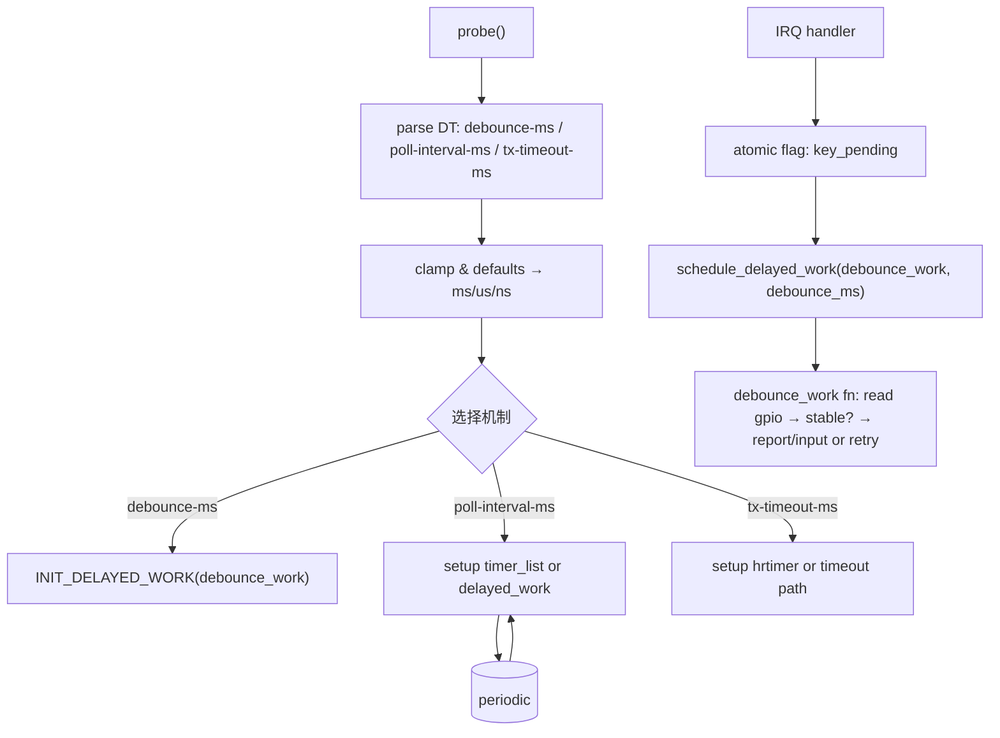

# 第9章 时间与设备树/平台数据的对接

> 章节内容说明：本章聚焦“驱动中的时间参数如何从设备树/平台数据输入，并在内核中落到 jiffies/ktime/延迟执行机制上”。我们将给出：常见时间类属性清单与语义 → 解析与单位转换策略 → 结合用户基准节点 `demo_led_key_int@0` 的完整接入流程（含去抖动与中断后的延迟处理）→ 运行期动态调整方案（sysfs/debugfs）→ 调试与验证方法与常见陷阱。全章保持开发者/内核数据结构/用户视角三线并行，配套代码可直接落地到 Linux 6.1+ 驱动。

------

## 9.1 是什么：设备树中的时间类属性与定位

**定义与定位**

- 设备树（DTS）向驱动提供**静态、平台相关**的时间参数，例如去抖时长、事务超时、轮询周期、告警/退避时间等。
- 这些参数必须在驱动中**明确转换**到内核时间表示：`jiffies`（相对时间，tick 粒度）、`ktime_t`（纳秒域，适合 hrtimer）、以及延迟执行框架（`timer_list`/`hrtimer`/`delayed_work`）。

**要解决的问题**

- 把 **人类可读单位**（常见为 ms/us/ns）稳定、无歧义地映射到**可执行时间**（jiffies/ktime/延迟队列）。
- 在**不同上下文**中选择合适的定时机制（中断上下文不可睡 → hrtimer 或软中断后移交；需要睡眠 → delayed_work）。
- 与**设备生命周期**与**PM**（挂起/恢复）配合，避免“设备没了，定时器还在跑”的竞态。

**不写会怎样（后果）**

- 直接使用“魔法数字”或混乱的单位将导致**可移植性与精度不可控**（不同 HZ、不同 NO_HZ/RT 配置，行为差异大）。
- 未做范围校验会引入**超大延时**导致软锁或**过小延时**导致忙等过度与抖动。

------

## 9.2 数据结构视角：从 DTS 节点到内核对象

**9.2.1 典型时间属性命名与类型**

| 属性例名                   | 推荐单位 | 类型      | 语义要点与使用场景                       |
| -------------------------- | -------- | --------- | ---------------------------------------- |
| `*-ms`（如 `debounce-ms`） | ms       | `u32`     | 去抖、轮询周期、退避时间的常见表达       |
| `*-us`                     | us       | `u32`     | 短延时/接口时序（SPI/I2C 设备脉冲/保持） |
| `*-ns`                     | ns       | `u32/u64` | 高精度时序（PWM 边沿/CSI/DSI 等时序窗）  |
| `timeout-ms`               | ms       | `u32`     | 事务超时（等待硬件 ready/状态机步进）    |
| `interval-ms`              | ms       | `u32`     | 周期轮询/维护任务                        |

> 说明：属性命名最好**直指语义**（debounce/timeout/interval），建议统一以 `*-ms/us/ns` 结尾来避免歧义。

**9.2.2 解析 API 与目标类型**

- 设备树读取：`of_property_read_u32()`, `of_property_read_u64()`；若兼容 ACPI/fwnode，用 `device_property_read_u32()` 等。
- jiffies 方向：`msecs_to_jiffies()`, `usecs_to_jiffies()`；反向 `jiffies_to_msecs()`。
- ktime 方向：`ms_to_ktime()`, `ns_to_ktime()`, `ktime_set()`。
- 延迟执行：
  - 低精度/软中断驱动：`struct timer_list` + `mod_timer()`
  - 高精度/不可睡：`struct hrtimer` + `hrtimer_start()`
  - 可睡/需要上下文：`struct delayed_work` + `schedule_delayed_work()`

**9.2.3 与设备生命周期的绑定**

- 定时器/工作项不具备 devres 封装（详见第10章），但**其使用的资源**（GPIO、clk、regmap 等）通常用 `devm_*` 管理。
- 驱动需在 `remove()` / `error path` / `pm` 钩子中**明确停表与同步**：
  - `del_timer_sync()`、`hrtimer_cancel()`、`cancel_delayed_work_sync()`。
- 多对一关系：**多个时间参数** → **不同定时机制**（去抖用 delayed_work / 短窗口用 hrtimer / 周期维护用 timer_list）。

------

## 9.3 开发者视角：从 DT 到 jiffies/ktime 的策略与落地

**9.3.1 核心转换策略**

1. **单位即策略**

- `*-ms` → 优先 `msecs_to_jiffies()`（低精度）或 `ms_to_ktime()`（高精度）。
- `*-us` → `usecs_to_jiffies()`（但受 HZ 影响，短 us 可能被四舍五入）或转 `ktime`（`ktime_set(0, us*1000)`）。
- `*-ns` → 直接 `ns_to_ktime()`，适合 `hrtimer`。

1. **上下文驱动选择**

- **中断上下文不可睡**：不要 `msleep()`，用 `hrtimer` 或快速记录状态后**移交**到工作队列。
- **需要可睡**：用 `delayed_work`，回调里可拿 mutex、可访问睡眠 API。
- **低占用周期性**：`timer_list` 足够且开销更低。

1. **健壮性**

- 缺省值与范围夹紧（clamp）：避免 0/超大值。
- 一旦运行期支持动态调参，要同步**重启定时机制**（如重新 `mod_timer()`/`hrtimer_start()`）。

**9.3.2 以 `demo_led_key_int@0` 节点为例（用户基准）**

目标节点（示意）：

```dts
demo_led_key_int@0 {
    compatible = "nxp,imx6ull-led_key_int";
    led-gpios = <&gpio1 3 GPIO_ACTIVE_LOW>;
    key-gpios = <&gpio1 18 GPIO_ACTIVE_LOW>;
    interrupt-parent = <&gpio1>;
    interrupts = <18 IRQ_TYPE_EDGE_FALLING>;
    nxp,debounce-ms = <20>;
    nxp,poll-interval-ms = <100>;
    nxp,tx-timeout-ms = <500>;
};
```

**接入决策**

- `nxp,debounce-ms`：按键去抖 → **delayed_work**（可睡，便于读取稳定电平、上报 input 事件）。
- `nxp,poll-interval-ms`：周期任务（例如 LED 心跳/状态轮询）→ `timer_list`（或 `delayed_work`，二选一，视是否需要睡）。
- `nxp,tx-timeout-ms`：事务超时（需精确/短窗）→ 若严格时序，**hrtimer**；非严格可 `schedule_timeout()` / `wait_for_completion_timeout()`。

------

## 9.4 用户视角：运行期动态调整与可观测性

- **动态调整**：通过 `sysfs`（每设备属性）或 `debugfs`（开发期）暴露 `debounce_ms`、`poll_interval_ms`、`tx_timeout_ms`，写入后**立即生效**（同步取消并重启对应定时机制）。
- **可观测性**：
  - 读回当前参数与有效单位；
  - 统计触发次数/超时次数；
  - 使用 `trace_events`（timer/hrtimer/workqueue）定位异常。

------

## 9.5 可视化图示：从 probe 到中断去抖与轮询



------

## 9.6 示例代码（可直接落地，Linux 6.1+）

> 说明：示例展示**DTS 解析 → 单位转换 → 三类定时机制组合**，并含运行期 `sysfs` 动态调参。GPIO 获取与中断注册略去细节，聚焦时间参数接入。请按你的工程风格接好 `gpio_desc`、`request_irq()` 等。

```c
// SPDX-License-Identifier: GPL-2.0
#include <linux/module.h>
#include <linux/platform_device.h>
#include <linux/of.h>
#include <linux/of_irq.h>
#include <linux/gpio/consumer.h>
#include <linux/interrupt.h>
#include <linux/jiffies.h>
#include <linux/hrtimer.h>
#include <linux/workqueue.h>
#include <linux/timer.h>
#include <linux/mutex.h>
#include <linux/sysfs.h>

struct demo_time_cfg {
	u32 debounce_ms;
	u32 poll_interval_ms;
	u32 tx_timeout_ms;
};

struct demo_priv {
	struct device       *dev;
	struct gpio_desc    *led_gpiod;
	struct gpio_desc    *key_gpiod;
	int                  irq;

	/* 时间配置与锁 */
	struct demo_time_cfg cfg;
	struct mutex         cfg_lock;

	/* 去抖: 需要可睡 */
	struct delayed_work  debounce_work;
	bool                 key_pending;

	/* 周期轮询: 低精度 */
	struct timer_list    poll_timer;

	/* 事务超时: 高精度示例 */
	struct hrtimer       tx_hrtimer;
	atomic_t             tx_inflight;

	/* 统计 */
	atomic64_t           stat_debounce_runs;
	atomic64_t           stat_poll_ticks;
	atomic64_t           stat_tx_timeouts;
};

#define DEF_DEBOUNCE_MS      20
#define DEF_POLL_INTERVAL_MS 100
#define DEF_TX_TIMEOUT_MS    500

/* ========== DTS 解析与夹紧 ========== */
static void demo_parse_dt(struct demo_priv *dp)
{
	struct device *dev = dp->dev;
	struct device_node *np = dev->of_node;
	u32 v;

	dp->cfg.debounce_ms      = DEF_DEBOUNCE_MS;
	dp->cfg.poll_interval_ms = DEF_POLL_INTERVAL_MS;
	dp->cfg.tx_timeout_ms    = DEF_TX_TIMEOUT_MS;

	if (of_property_read_u32(np, "nxp,debounce-ms", &v) == 0)
		dp->cfg.debounce_ms = clamp_t(u32, v, 1, 2000);

	if (of_property_read_u32(np, "nxp,poll-interval-ms", &v) == 0)
		dp->cfg.poll_interval_ms = clamp_t(u32, v, 10, 60000);

	if (of_property_read_u32(np, "nxp,tx-timeout-ms", &v) == 0)
		dp->cfg.tx_timeout_ms = clamp_t(u32, v, 1, 600000);
}

/* ========== 去抖: delayed_work ========== */
static void demo_debounce_workfn(struct work_struct *work)
{
	struct demo_priv *dp = container_of(to_delayed_work(work),
					    struct demo_priv, debounce_work);
	bool stable;

	atomic64_inc(&dp->stat_debounce_runs);

	/* 读取键值并判稳，示意： */
	stable = gpiod_get_value_cansleep(dp->key_gpiod);

	/* ... 根据 stable 上报 input/切换 LED 等 ... */
	dp->key_pending = false;
}

/* ========== 周期轮询: timer_list ========== */
static void demo_poll_timer_fn(struct timer_list *t)
{
	struct demo_priv *dp = from_timer(dp, t, poll_timer);

	atomic64_inc(&dp->stat_poll_ticks);

	/* 执行轻量轮询（不可睡）：
	 * 若需要睡眠或较重任务，可改用 schedule_delayed_work()
	 */

	/* 重新调度 */
	mod_timer(&dp->poll_timer, jiffies + msecs_to_jiffies(dp->cfg.poll_interval_ms));
}

/* ========== 事务超时: hrtimer ========== */
static enum hrtimer_restart demo_tx_hrtimer_fn(struct hrtimer *hr)
{
	struct demo_priv *dp = container_of(hr, struct demo_priv, tx_hrtimer);

	if (atomic_xchg(&dp->tx_inflight, 0)) {
		/* 事务超时处理：标记、唤醒等待者等（不可睡） */
		atomic64_inc(&dp->stat_tx_timeouts);
	}

	return HRTIMER_NORESTART;
}

/* 启动一次“事务”，并设置超时 */
static void demo_start_tx_with_timeout(struct demo_priv *dp)
{
	ktime_t to = ms_to_ktime(dp->cfg.tx_timeout_ms);

	atomic_set(&dp->tx_inflight, 1);
	hrtimer_start(&dp->tx_hrtimer, to, HRTIMER_MODE_REL_PINNED);
	/* 启动真实 I/O ... 完成后记得 hrtimer_cancel() 或让回调检测到完成 */
}

/* ========== IRQ：快速记账后去抖 ========== */
static irqreturn_t demo_irq_thread(int irq, void *data)
{
	struct demo_priv *dp = data;
	unsigned long delay = msecs_to_jiffies(dp->cfg.debounce_ms);

	/* 线程化中断可睡；若为硬中断，用 schedule_delayed_work() 也可以 */
	if (!dp->key_pending) {
		dp->key_pending = true;
		mod_delayed_work(system_wq, &dp->debounce_work, delay);
	}
	return IRQ_HANDLED;
}

/* ========== sysfs 动态调参 ========== */
/* 简洁起见，仅以 debounce_ms 为例，其它同理 */
static ssize_t debounce_ms_show(struct device *dev,
		struct device_attribute *attr, char *buf)
{
	struct demo_priv *dp = dev_get_drvdata(dev);
	return sysfs_emit(buf, "%u\n", READ_ONCE(dp->cfg.debounce_ms));
}

static ssize_t debounce_ms_store(struct device *dev,
		struct device_attribute *attr, const char *buf, size_t count)
{
	struct demo_priv *dp = dev_get_drvdata(dev);
	unsigned long v;

	if (kstrtoul(buf, 10, &v))
		return -EINVAL;

	v = clamp_t(unsigned long, v, 1, 2000);

	mutex_lock(&dp->cfg_lock);
	dp->cfg.debounce_ms = v;
	mutex_unlock(&dp->cfg_lock);

	/* 让新参数尽快生效：若有 pending，重新排程一次 */
	mod_delayed_work(system_wq, &dp->debounce_work,
			 msecs_to_jiffies(dp->cfg.debounce_ms));
	return count;
}
static DEVICE_ATTR_RW(debounce_ms);

static struct attribute *demo_attrs[] = {
	&dev_attr_debounce_ms.attr,
	NULL,
};
ATTRIBUTE_GROUPS(demo);

static int demo_probe(struct platform_device *pdev)
{
	struct demo_priv *dp;
	int irq, ret;

	dp = devm_kzalloc(&pdev->dev, sizeof(*dp), GFP_KERNEL);
	if (!dp)
		return -ENOMEM;
	dp->dev = &pdev->dev;
	mutex_init(&dp->cfg_lock);
	platform_set_drvdata(pdev, dp);

	demo_parse_dt(dp);

	/* GPIO 省略错误处理细节： */
	dp->led_gpiod = devm_gpiod_get(&pdev->dev, "led", GPIOD_OUT_LOW);
	dp->key_gpiod = devm_gpiod_get(&pdev->dev, "key", GPIOD_IN);

	/* IRQ（线程化示例） */
	irq = platform_get_irq(pdev, 0);
	if (irq < 0)
		return irq;
	dp->irq = irq;
	ret = devm_request_threaded_irq(&pdev->dev, irq, NULL, demo_irq_thread,
					IRQF_ONESHOT, dev_name(&pdev->dev), dp);
	if (ret)
		return ret;

	/* delayed_work 去抖 */
	INIT_DELAYED_WORK(&dp->debounce_work, demo_debounce_workfn);

	/* 周期轮询 timer_list */
	timer_setup(&dp->poll_timer, demo_poll_timer_fn, 0);
	mod_timer(&dp->poll_timer,
		  jiffies + msecs_to_jiffies(dp->cfg.poll_interval_ms));

	/* hrtimer 事务超时 */
	hrtimer_init(&dp->tx_hrtimer, CLOCK_MONOTONIC, HRTIMER_MODE_REL_PINNED);
	dp->tx_hrtimer.function = demo_tx_hrtimer_fn;

	/* 可选：启动一次事务以演示超时 */
	// demo_start_tx_with_timeout(dp);

	/* sysfs 组（使能动态调参） */
	ret = sysfs_create_groups(&pdev->dev.kobj, demo_groups);
	if (ret)
		goto err_cancel_timers;

	dev_info(&pdev->dev, "demo-time ready: debounce=%ums poll=%ums tx_to=%ums\n",
		 dp->cfg.debounce_ms, dp->cfg.poll_interval_ms, dp->cfg.tx_timeout_ms);
	return 0;

err_cancel_timers:
	del_timer_sync(&dp->poll_timer);
	hrtimer_cancel(&dp->tx_hrtimer);
	cancel_delayed_work_sync(&dp->debounce_work);
	return ret;
}

static int demo_remove(struct platform_device *pdev)
{
	struct demo_priv *dp = platform_get_drvdata(pdev);

	sysfs_remove_groups(&pdev->dev.kobj, demo_groups);
	del_timer_sync(&dp->poll_timer);
	hrtimer_cancel(&dp->tx_hrtimer);
	cancel_delayed_work_sync(&dp->debounce_work);
	return 0;
}

static const struct of_device_id demo_of_match[] = {
	{ .compatible = "nxp,imx6ull-led_key_int" },
	{ /* sentinel */ }
};
MODULE_DEVICE_TABLE(of, demo_of_match);

static struct platform_driver demo_driver = {
	.probe  = demo_probe,
	.remove = demo_remove,
	.driver = {
		.name = "demo-led-key-int",
		.of_match_table = demo_of_match,
	},
};
module_platform_driver(demo_driver);

MODULE_LICENSE("GPL");
MODULE_DESCRIPTION("Demo: DT time parameters to jiffies/ktime");
MODULE_AUTHOR("Leaf & Coauthor");
```

**要点回顾**

- **DTS → clamp → 单位转换**：在 `probe()` 早期完成。
- **三类机制并存**：`delayed_work`（去抖，可睡）、`timer_list`（轻量周期）、`hrtimer`（严格超时）。
- **remove/error/pm**：对称地同步取消。
- **sysfs**：立即生效并重排程。

------

## 9.7 调试与验证

**9.7.1 观察与追踪**

- `trace_events=timer:*,workqueue:*,hrtimer:*` 观察触发与回调时序。
- `ftrace function_graph` 包围 `demo_*timer*` 与 `demo_*work*` 确认路径与耗时。
- `cat /sys/.../debounce_ms` 与写入后对比定时行为。

**9.7.2 常见坑与对策**

| 问题                  | 症状                           | 根因                        | 处理                                                         |
| --------------------- | ------------------------------ | --------------------------- | ------------------------------------------------------------ |
| HZ 相关的 us 精度丢失 | “几十 us”的延时被放大到 1 tick | `usecs_to_jiffies()` 的量化 | 短窗用 `hrtimer`/`ktime`                                     |
| 设备移除崩溃          | `remove` 后仍进回调            | 未 `*_sync/cancel`          | 使用 `del_timer_sync()/hrtimer_cancel()/cancel_delayed_work_sync()` |
| 去抖不稳              | 报告抖动                       | IRQ 风暴 + 去抖过短         | 增大 `debounce-ms` 或改高精度策略                            |
| 动态调参无效          | 写 sysfs 后无变化              | 未重排程                    | 写入后 `mod_timer()` / `hrtimer_start()`                     |
| PM 后丢时机           | 恢复后周期性错位               | 挂起期间暂停/丢 tick        | 在 `resume` 中补偿或重启定时器                               |

------

## 9.8 小结

- 设备树是**时间语义的输入口**，驱动需负责**单位转换、上下文匹配与机制选择**。
- **规则化命名 + 范围夹紧 + 即时重排程** 是三项铁律。
- `delayed_work` 解决“可睡+去抖/延时处理”；`timer_list` 适合低成本周期；`hrtimer` 用于高精度/短窗超时。
- 结合 `sysfs/debugfs` 实现**运行期可调与可观测**，配合 trace/ftrace 完成定位。
- 与生命周期/PM 的对接要做到**对称与可恢复**，否则“设备没了，时间还在跑”将成为稳定性杀手。

> 至此，时间参数从 DTS/平台数据进入驱动、落地为 jiffies/ktime/延迟执行的完整通路已建立。下一章（第10章）将进一步讨论与 devres、生命周期与 PM 的协作与收尾顺序。