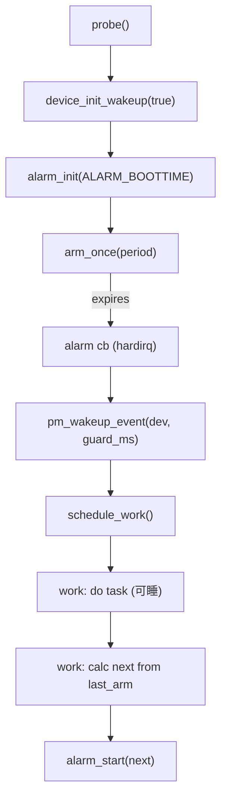
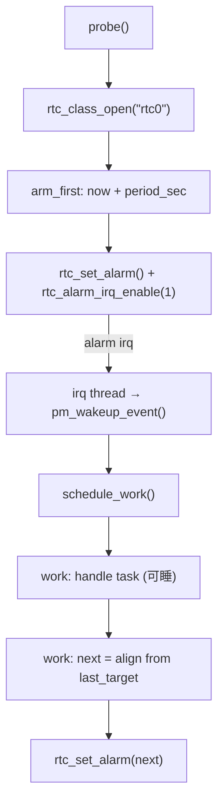
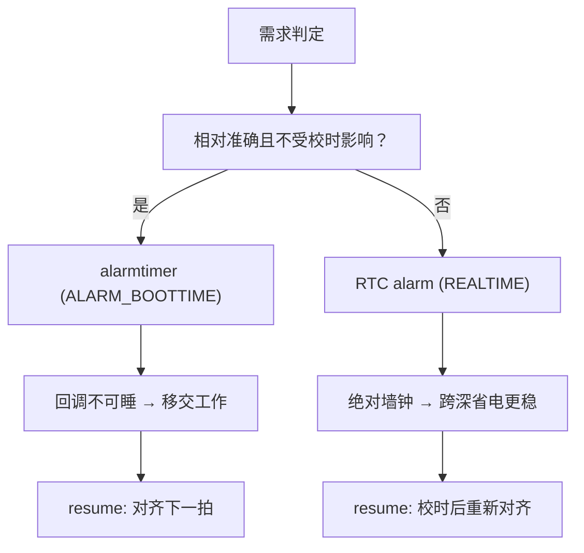

# 第11章 电源管理、系统挂起与定时唤醒

> 阅读指引：
>  本章带你**一步步搭建**一个“既省电、又准时”的驱动：先弄清挂起时哪些定时器会停走，再选能唤醒系统的工具（alarmtimer / RTC），最后把它们**落到一个可编译的驱动里**。过程中，我们把“对齐、补偿、唤醒保护、runtime PM”这些细节一并写进代码，避免纸上谈兵。

------

## 11.1 先把问题说清楚：挂起时你的定时器在做什么？

先问自己三个问题：

1. **是否需要到点就把系统叫醒？**
    — 需要：用 **alarmtimer** 或 **RTC alarm**。
    — 不需要，只要“醒来后尽快继续”：用 `CLOCK_BOOTTIME` 做**补偿与相位对齐**，普通 `timer_list/hrtimer` 即可。
2. **你的处理逻辑能否睡眠？**
    — 不能睡：不要把重活塞进 alarm 回调；**正确做法**是**回调只移交**到工作队列。
    — 能睡：在工作队列里处理，必要时配 `pm_runtime_get/put`。
3. **平台是否支持系统唤醒？**
    — 需要 `device_init_wakeup(dev, true)` 打通链路；
    — 唤醒后避免立即再睡，**记得** `pm_wakeup_event(dev, window_ms)` 给一小段“清醒窗口”。

> 这三个问题分别约束：**用哪个时间域**、**回调里做多少**、**如何让唤醒链闭环**。下面把方案写成真正能跑的驱动。

------

## 11.2 该用哪些“时间域”和“闹钟”？

- `CLOCK_MONOTONIC`：挂起时**不走**；大多数普通 `timer_list/hrtimer` 归此，无法在挂起中触发/唤醒。
- `CLOCK_BOOTTIME`：**包含挂起区间**；适合“恢复后计算错过多久并对齐下一拍”。
- **alarmtimer（ALARM_BOOTTIME/ALARM_REALTIME）**：在平台支持下可**唤醒系统**；回调在硬中断上下文，**不能睡**，只做极简操作然后移交到工作队列。

> 一句话：**到点唤醒 → alarmtimer；恢复后对齐 → BOOTTIME**。

------

## 11.3 把方案落到代码结构：要做哪几步？

1. **probe()**
   - `device_init_wakeup(dev, true)` 启用设备唤醒；
   - `alarm_init(ALARM_BOOTTIME, cb)` 初始化 alarm；
   - 读取周期/保护窗口参数；
   - **arm** 第一次闹钟，进入 steady-state。
2. **alarm 回调（硬中断上下文）**
   - 立刻 `pm_wakeup_event(dev, guard_ms)` 给“清醒窗口”；
   - 不做重活，**移交**到工作队列。
3. **工作队列（可睡）**
   - 执行业务；
   - 基于“**上次 arm 的 boottime**”计算下一拍，**对齐**，不要一次性“补跑 N 次”。
4. **remove()/错误路径**
   - `alarm_cancel()` + `cancel_work_sync()`；
   - 关闭唤醒能力，撤销额外策略（如 PM QoS）。

------

## 11.4 示例：alarmtimer + workqueue 的“准时唤醒 + 相位对齐”驱动（可直接编译）

**适用环境**：Linux 6.1+（含 i.MX6ULL 等常见 SoC，只要平台支持 alarmtimer/唤醒）。
 **要点**：`ALARM_BOOTTIME` 跨挂起计时；回调最小化 + `pm_wakeup_event` 保持“清醒窗口”；工作队列里**对齐下一拍**；设备树读取周期与保护窗口；收尾顺序完整。

```c
// SPDX-License-Identifier: GPL-2.0
// File: drivers/misc/leaf_alarm_demo.c
#include <linux/module.h>
#include <linux/platform_device.h>
#include <linux/of.h>
#include <linux/alarmtimer.h>
#include <linux/pm_wakeup.h>
#include <linux/workqueue.h>
#include <linux/ktime.h>
#include <linux/mutex.h>
#include <linux/pm_runtime.h>

struct leaf_alarm {
	struct device *dev;

	/* 参数（来自 DT 或默认） */
	u32 period_ms;           /* 周期：到点唤醒 + 对齐 */
	u32 wake_guard_ms;       /* 唤醒保护窗口：防止刚醒又睡 */

	/* alarmtimer（BOOTTIME） */
	struct alarm alarm;
	ktime_t last_arm;        /* 上一次 arm 的 boottime */
	bool armed;

	/* 后移处理 */
	struct work_struct work;

	/* 并发保护 */
	struct mutex lock;
};

static enum alarmtimer_restart leaf_alarm_cb(struct alarm *a, ktime_t now)
{
	struct leaf_alarm *la = container_of(a, struct leaf_alarm, alarm);

	/* 给系统一个“清醒窗口”，避免回调结束后立即再睡 */
	pm_wakeup_event(la->dev, la->wake_guard_ms);

	/* 回调里不做重活，移交到工作队列（可睡） */
	schedule_work(&la->work);
	return ALARMTIMER_NORESTART;
}

/* 以 last_arm 为基准，用 BOOTTIME 向未来“对齐下一拍” */
static ktime_t leaf_calc_next(ktime_t last, u32 period_ms, ktime_t now)
{
	const s64 step = (s64)period_ms * 1000000LL;
	const s64 miss = ktime_to_ns(ktime_sub(now, last));
	const s64 k = (miss >= 0) ? (miss / step) + 1 : 1;
	return ktime_add_ns(last, k * step);
}

static void leaf_work(struct work_struct *w)
{
	struct leaf_alarm *la = container_of(w, struct leaf_alarm, work);
	ktime_t now = ktime_get_boottime();
	ktime_t next;

	/* === 可睡的业务处理（示例：访问可能 runtime suspend 的资源） === */
	pm_runtime_get_sync(la->dev);
	/* ... 放你的业务逻辑：读稳定键值、刷新状态、上报事件等 ... */
	pm_runtime_put(la->dev);

	/* === 对齐下一拍：以 last_arm 为相位基准，避免补跑 N 次 === */
	mutex_lock(&la->lock);
	if (la->period_ms) {
		next = leaf_calc_next(la->last_arm, la->period_ms, now);
		alarm_start(&la->alarm, next);   /* 绝对时间（BOOTTIME） */
		la->last_arm = next;
		la->armed = true;
	}
	mutex_unlock(&la->lock);
}

static int leaf_arm_once_locked(struct leaf_alarm *la, u32 delay_ms)
{
	ktime_t now = ktime_get_boottime();
	ktime_t when = ktime_add_ms(now, delay_ms);

	la->last_arm = when;
	la->armed = true;
	return alarm_start(&la->alarm, when);
}

static int leaf_probe(struct platform_device *pdev)
{
	struct device *dev = &pdev->dev;
	struct leaf_alarm *la;

	la = devm_kzalloc(dev, sizeof(*la), GFP_KERNEL);
	if (!la)
		return -ENOMEM;
	la->dev = dev;
	mutex_init(&la->lock);
	platform_set_drvdata(pdev, la);

	/* 读取 DT（给出合理默认） */
	la->period_ms     = 5000;  /* 5s 周期 */
	la->wake_guard_ms = 200;   /* 唤醒保护 200ms */
	of_property_read_u32(dev->of_node, "leaf,period-ms", &la->period_ms);
	of_property_read_u32(dev->of_node, "leaf,wake-guard-ms", &la->wake_guard_ms);
	la->period_ms     = clamp_t(u32, la->period_ms, 50, 24*60*60*1000);
	la->wake_guard_ms = clamp_t(u32, la->wake_guard_ms, 50, 60000);

	/* 允许该设备唤醒系统（形成完整唤醒链） */
	device_init_wakeup(dev, true);

	/* 初始化 alarmtimer（选 BOOTTIME，跨挂起） */
	alarm_init(&la->alarm, ALARM_BOOTTIME, leaf_alarm_cb);

	/* 工作项：回调移交到这里 */
	INIT_WORK(&la->work, leaf_work);

	/* 首次 arm：直接进入稳态 */
	mutex_lock(&la->lock);
	leaf_arm_once_locked(la, la->period_ms);
	mutex_unlock(&la->lock);

	dev_info(dev, "leaf-alarm: armed period=%u ms, guard=%u ms\n",
		 la->period_ms, la->wake_guard_ms);
	return 0;
}

static int leaf_remove(struct platform_device *pdev)
{
	struct leaf_alarm *la = platform_get_drvdata(pdev);

	mutex_lock(&la->lock);
	alarm_cancel(&la->alarm);
	la->armed = false;
	mutex_unlock(&la->lock);

	cancel_work_sync(&la->work);
	device_init_wakeup(&pdev->dev, false);
	return 0;
}

static const struct of_device_id leaf_of_match[] = {
	{ .compatible = "leaf,alarm-demo" },
	{ /* sentinel */ }
};
MODULE_DEVICE_TABLE(of, leaf_of_match);

static struct platform_driver leaf_driver = {
	.probe  = leaf_probe,
	.remove = leaf_remove,
	.driver = {
		.name = "leaf-alarm-demo",
		.of_match_table = leaf_of_match,
	},
};
module_platform_driver(leaf_driver);

MODULE_LICENSE("GPL");
MODULE_DESCRIPTION("Alarmtimer periodic wake + alignment (BOOTTIME)");
MODULE_AUTHOR("Leaf & Coauthor");
```

**设备树片段**

```dts
alarm-demo@0 {
	compatible = "leaf,alarm-demo";
	leaf,period-ms = <5000>;
	leaf,wake-guard-ms = <200>;
};
```

**验证清单**

- **挂起测试**：`echo mem > /sys/power/state`，到点应被唤醒；dmesg 中能看到回调→工作→下一拍。
- **对齐行为**：让系统长时间睡眠后恢复，不会“补跑好多次”，而是**对齐到下一拍**。
- **runtime PM**：若工作中访问外设，请保持 `pm_runtime_get/put` 成对出现。
- **收尾路径**：`remove` 后不应再有回调进入，`cancel_work_sync()` 要配齐。

------

## 11.5 可视化：整条唤醒与对齐链路



------

### 实操建议

1. 直接在你的板子上编译运行本示例，确认“到点唤醒、醒后对齐”的行为是否符合预期。
2. 把 `period-ms`、`wake-guard-ms` 做成 **sysfs 可调**，对比不同参数下的负载与准确性。
3. 如需“跨断电/重挂的硬唤醒”，将相同业务迁移到 **RTC alarm** 路线做横向对比，并在驱动内补上 `suspend/resume` 的补偿与对齐逻辑。


------

## 11.6 示例二：RTC alarm 路线（内核消费者 + 用户态对照）

### 11.6.1 场景与选择

- 如果你的产品希望在**更深的低功耗**下依然可靠唤醒（跨长时间挂起、平台对 alarmtimer 支持不稳、甚至断电后仍能记时），优先使用 **RTC alarm**。
- 工程上常见两种落点：
  1. **用户态**（推荐）：服务或守护进程通过 `/dev/rtcX` 设置闹钟；
  2. **内核侧消费者**：驱动内直接 `rtc_class_open()` 获取 `struct rtc_device *` 并设置闹钟（更靠近硬件，但要承担更多时序与回收细节）。

> 本节给出**内核消费者驱动**的最小可用实现，并附上**用户态**样例，便于你做端到端联调。

------

### 11.6.2 内核消费者驱动：周期性 RTC 唤醒 + 对齐

**要点**

- 通过 `rtc_class_open("rtc0")` 取得句柄；
- 用 `rtc_read_time()` 获取当前 `rtc_time`，计算下一拍的 `rtc_wkalrm`；
- `rtc_set_alarm()` + `rtc_alarm_irq_enable(rtc, 1)` 生效；
- 闹钟中断到来时，**只做移交**（回调线程化/工作队列），随后**按“上次目标时刻”对齐下一拍**；
- `remove()` 和错误路径对称取消、关闭闹钟，并 `rtc_class_close()`。

```c
// SPDX-License-Identifier: GPL-2.0
// File: drivers/misc/leaf_rtc_consumer.c
#include <linux/module.h>
#include <linux/platform_device.h>
#include <linux/of.h>
#include <linux/rtc.h>
#include <linux/workqueue.h>
#include <linux/mutex.h>
#include <linux/pm_wakeup.h>
#include <linux/pm_runtime.h>

struct leaf_rtc {
	struct device *dev;
	struct rtc_device *rtc;

	u32 period_sec;          /* 周期（秒）：绝对墙钟语义 */
	u32 wake_guard_ms;       /* 唤醒保护窗口 */

	/* 上次目标时间（墙钟）——用于“对齐下一拍” */
	struct rtc_time last_target;

	/* 工作项（可睡） */
	struct work_struct work;

	/* 并发保护 */
	struct mutex lock;

	/* 中断号与标志（部分 SoC 的 RTC 报中断经 IRQ；也可能走 class 回调） */
	int irq;
	bool armed;
};

static void rtc_time_add_seconds(struct rtc_time *t, unsigned int sec)
{
	time64_t now = rtc_tm_to_time64(t);
	now += sec;
	rtc_time64_to_tm(now, t);
}

/* 计算“基于上次目标”的下一拍（避免补跑） */
static void rtc_calc_next_from_last(struct rtc_time *last_target,
				    u32 period_sec,
				    struct rtc_time *now_rt,
				    struct rtc_time *next_out)
{
	time64_t last = rtc_tm_to_time64(last_target);
	time64_t now  = rtc_tm_to_time64(now_rt);
	time64_t step = period_sec;
	time64_t k    = (now >= last) ? ((now - last) / step) + 1 : 1;
	time64_t next = last + k * step;

	rtc_time64_to_tm(next, next_out);
}

static void leaf_rtc_work(struct work_struct *w)
{
	struct leaf_rtc *lr = container_of(w, struct leaf_rtc, work);
	struct rtc_wkalrm alm;
	struct rtc_time now_rt, next;

	/* （可睡）执行你的业务；如需外设，请成对获取 runtime pm */
	pm_runtime_get_sync(lr->dev);
	/* ... 你的任务：读传感器、刷新状态、上报事件 ... */
	pm_runtime_put(lr->dev);

	/* 重新对齐下一拍 */
	mutex_lock(&lr->lock);
	if (!lr->armed)
		goto out_unlock;

	rtc_read_time(lr->rtc, &now_rt);
	rtc_calc_next_from_last(&lr->last_target, lr->period_sec, &now_rt, &next);

	memset(&alm, 0, sizeof(alm));
	alm.time = next;
	alm.enabled = 1;

	rtc_set_alarm(lr->rtc, &alm);
	rtc_alarm_irq_enable(lr->rtc, 1);

	lr->last_target = next;
	dev_dbg(lr->dev, "RTC rearmed for %ptR (%lld)\n", &next,
		(long long)rtc_tm_to_time64(&next));
out_unlock:
	mutex_unlock(&lr->lock);
}

/* 线程化中断处理：把 RTC 闹钟中断移交到工作 */
static irqreturn_t leaf_rtc_irq_thread(int irq, void *data)
{
	struct leaf_rtc *lr = data;

	/* 防止刚唤醒又睡回去，留一小段清醒窗口 */
	pm_wakeup_event(lr->dev, lr->wake_guard_ms);

	/* 只移交，不做重活 */
	schedule_work(&lr->work);
	return IRQ_HANDLED;
}

static int leaf_rtc_arm_first(struct leaf_rtc *lr)
{
	struct rtc_wkalrm alm;
	struct rtc_time now_rt, first;

	rtc_read_time(lr->rtc, &now_rt);
	first = now_rt;
	rtc_time_add_seconds(&first, lr->period_sec);

	memset(&alm, 0, sizeof(alm));
	alm.time = first;
	alm.enabled = 1;

	lr->last_target = first;
	lr->armed = true;

	rtc_set_alarm(lr->rtc, &alm);
	return rtc_alarm_irq_enable(lr->rtc, 1);
}

static int leaf_rtc_probe(struct platform_device *pdev)
{
	struct leaf_rtc *lr;
	u32 v;
	int ret;

	lr = devm_kzalloc(&pdev->dev, sizeof(*lr), GFP_KERNEL);
	if (!lr)
		return -ENOMEM;
	lr->dev = &pdev->dev;
	mutex_init(&lr->lock);
	platform_set_drvdata(pdev, lr);

	/* 参数：周期（秒）、唤醒保护（毫秒） */
	lr->period_sec    = 5;    /* 默认 5s */
	lr->wake_guard_ms = 200;  /* 默认 200ms */
	of_property_read_u32(pdev->dev.of_node, "leaf,period-sec", &lr->period_sec);
	of_property_read_u32(pdev->dev.of_node, "leaf,wake-guard-ms", &lr->wake_guard_ms);
	lr->period_sec    = clamp_t(u32, lr->period_sec, 1, 24*60*60);
	lr->wake_guard_ms = clamp_t(u32, lr->wake_guard_ms, 50, 60000);

	/* 打开 RTC 设备（rtc0 可按需改为 alias） */
	lr->rtc = rtc_class_open("rtc0");
	if (!lr->rtc)
		return -ENODEV;

	INIT_WORK(&lr->work, leaf_rtc_work);

	/* 有的 SoC 把闹钟 IRQ 暴露为独立中断 */
	lr->irq = platform_get_irq_optional(pdev, 0);
	if (lr->irq > 0) {
		ret = devm_request_threaded_irq(&pdev->dev, lr->irq,
						NULL, leaf_rtc_irq_thread,
						IRQF_ONESHOT, dev_name(&pdev->dev), lr);
		if (ret)
			goto err_close;
	}

	/* 允许设备唤醒（形成完整路径） */
	device_init_wakeup(&pdev->dev, true);

	/* 首次 arm：从当前墙钟延后一个周期 */
	ret = leaf_rtc_arm_first(lr);
	if (ret)
		goto err_close;

	dev_info(&pdev->dev, "leaf-rtc: armed every %u sec, guard=%u ms\n",
		 lr->period_sec, lr->wake_guard_ms);
	return 0;

err_close:
	rtc_class_close(lr->rtc);
	return ret;
}

static int leaf_rtc_remove(struct platform_device *pdev)
{
	struct leaf_rtc *lr = platform_get_drvdata(pdev);

	mutex_lock(&lr->lock);
	if (lr->rtc) {
		rtc_alarm_irq_enable(lr->rtc, 0);
		lr->armed = false;
	}
	mutex_unlock(&lr->lock);

	cancel_work_sync(&lr->work);

	if (lr->rtc)
		rtc_class_close(lr->rtc);

	device_init_wakeup(&pdev->dev, false);
	return 0;
}

static const struct of_device_id leaf_rtc_of_match[] = {
	{ .compatible = "leaf,rtc-consumer" },
	{ /* sentinel */ }
};
MODULE_DEVICE_TABLE(of, leaf_rtc_of_match);

static struct platform_driver leaf_rtc_driver = {
	.probe  = leaf_rtc_probe,
	.remove = leaf_rtc_remove,
	.driver = {
		.name = "leaf-rtc-consumer",
		.of_match_table = leaf_rtc_of_match,
	},
};
module_platform_driver(leaf_rtc_driver);

MODULE_LICENSE("GPL");
MODULE_DESCRIPTION("RTC alarm consumer: periodic wake + alignment");
MODULE_AUTHOR("Leaf & Coauthor");
```

**设备树片段**

```dts
rtc-consumer@0 {
	compatible = "leaf,rtc-consumer";
	leaf,period-sec = <5>;
	leaf,wake-guard-ms = <200>;
	/* 若平台把 RTC alarm 暴露为专用 IRQ，可在此节点绑定 IRQ 资源 */
	/* interrupts = <&intc 123 IRQ_TYPE_EDGE_RISING>; */
};
```

**说明与权衡**

- RTC alarm 的语义是“**绝对墙钟**”，通常不受 NO_HZ 与 CPU 深睡的影响，是更稳定的系统级闹钟；
- 代价是**对时效（NTP 校时）敏感**，如果系统时间被校正，下一拍的“绝对点”也会被移动；
- 若你的需求更偏“相对准确但不受校时影响”，alarmtimer 的 `ALARM_BOOTTIME` 更合适；如果需要“深度省电 + 强唤醒可靠”，RTC alarm 更合适。

------

### 11.6.3 用户态对照：最小 RTC alarm 工具（便于联调）

> 这段程序把“下一拍时间 = 现在 + N 秒”写入 `/dev/rtc0`，并开启闹钟中断。便于你在没有内核消费者时也能做端到端唤醒验证。

```c
// File: tools/rtc_arm.c
// gcc -O2 -o rtc_arm rtc_arm.c
#include <stdio.h>
#include <unistd.h>
#include <fcntl.h>
#include <sys/ioctl.h>
#include <linux/rtc.h>
#include <time.h>
#include <string.h>

int main(int argc, char **argv)
{
	int fd = open("/dev/rtc0", O_RDWR);
	struct rtc_time now, next;
	struct rtc_wkalrm alm;
	int sec = (argc > 1) ? atoi(argv[1]) : 5;

	if (fd < 0) { perror("open"); return 1; }
	if (ioctl(fd, RTC_RD_TIME, &now) < 0) { perror("RTC_RD_TIME"); return 1; }

	next = now;
	next.tm_sec += sec;
	mktime((struct tm *)&next); /* 归一化 */

	memset(&alm, 0, sizeof(alm));
	alm.time = next;
	alm.enabled = 1;

	if (ioctl(fd, RTC_ALM_SET, &alm) < 0) { perror("RTC_ALM_SET"); return 1; }
	if (ioctl(fd, RTC_AIE_ON, 0) < 0) { perror("RTC_AIE_ON"); return 1; }

	printf("armed alarm for +%d sec\n", sec);
	return 0;
}
```

------

### 11.6.4 RTC 唤醒路径可视化



------

## 11.7 `suspend/resume` 钩子：补偿与对齐的完整模板

> 不论你走 alarmtimer 还是 RTC alarm，**系统挂起与恢复**后，周期性任务都要“回到正确相位”。下面的模板给出**统一做法**：
>
> - 挂起前记录 `boottime`；
> - 恢复时计算“睡了多久”；
> - 决定**立即跑一次**（用于强实时需求）或**对齐到下一拍**（更稳更省电）。

```c
// 统一 PM 钩子（可嵌入前述驱动）
#include <linux/pm.h>
#include <linux/ktime.h>

struct pm_phase {
	ktime_t last_boottime;
	bool periodic_enabled;
};
static struct pm_phase gpm;

static int demo_suspend(struct device *dev)
{
	/* 记录挂起前的 boottime，用于恢复时对齐或补偿 */
	gpm.last_boottime = ktime_get_boottime();
	/* 若使用 timer_list/delayed_work 的周期任务，挂起前可停表 */
	gpm.periodic_enabled = false;
	return 0;
}

static int demo_resume(struct device *dev)
{
	ktime_t now = ktime_get_boottime();
	s64 delta_ms = ktime_to_ms(ktime_sub(now, gpm.last_boottime));

	/* 策略 A：对齐到下一拍（推荐，避免补跑风暴） */
	/* rearm_next_aligned(); */

	/* 策略 B：若错过窗口太久，可先立即执行一次，再对齐 */
	/* if (delta_ms > THRESHOLD) run_once_immediately(); rearm_next_aligned(); */

	gpm.periodic_enabled = true;
	dev_dbg(dev, "resume: slept %lld ms, periodic rearmed\n", delta_ms);
	return 0;
}

static const struct dev_pm_ops demo_pm_ops = {
	.suspend = demo_suspend,
	.resume  = demo_resume,
	/* .runtime_suspend/.runtime_resume 同理处理 */
};
```

**说明**

- 对 **alarmtimer(ALARM_BOOTTIME)**：闹钟会跨挂起自然“对时”，仍推荐在 `resume` 后做一次**相位确认**；
- 对 **RTC alarm**：它本身是墙钟绝对时间，若 NTP 在挂起期间发生校时，**下一拍点位**也会变化——恢复后仍建议以“上次目标”做基准重新对齐。

------

## 11.8 关键窗口的 `PM QoS`：把延迟压到可接受范围

> 在“从唤醒到执行”的短窗口内，你可能要避免系统进入过深的 C-state 以致**唤醒路径过长**。用 `PM QoS` 临时拉低延迟上限，**用完立即撤销**。

```c
#include <linux/pm_qos.h>

struct qos_guard {
	struct pm_qos_request req;
	bool on;
};

static void qos_enter(struct qos_guard *q, s32 usec)
{
	if (!q->on) {
		pm_qos_add_request(&q->req, PM_QOS_CPU_DMA_LATENCY, usec);
		q->on = true;
	} else {
		pm_qos_update_request(&q->req, usec);
	}
}

static void qos_exit(struct qos_guard *q)
{
	if (q->on) {
		pm_qos_remove_request(&q->req);
		q->on = false;
	}
}

/* 用法示例（配合 alarm 回调→工作项）：
 * - 在 cb 或工作开始处 qos_enter(&q, 1000);
 * - 工作结束或对齐完下一拍后 qos_exit(&q);
 */
```

**边界**

- `PM_QOS_CPU_DMA_LATENCY` 设置过小会显著提升功耗；
- 仅在**关键路径**短暂使用，完成任务立即撤销，避免成为“常开高耗能”开关。

------

## 11.9 调试与验证清单（面向工程落地）

| 目标                   | 方法与抓手                                                   |
| ---------------------- | ------------------------------------------------------------ |
| 验证“到点唤醒”         | `echo mem > /sys/power/state` 后，观察是否在期望时间被唤醒；打印闹钟目标/实际触发时间戳 |
| 区分 BOOTTIME/REALTIME | 人为调整系统时间（`date -s`），比较下一拍是否被移动；BOOTTIME 不随校时变，REALTIME 会 |
| 观察移交链路           | `trace_events=timer:*,hrtimer:*,workqueue:*`，确认回调→工作→对齐顺序 |
| 评估唤醒路径延迟       | 开/关 `PM QoS` 前后对比任务首字节执行时间间隔；结合 `powertop` 观察能耗差异 |
| 稳定性                 | 高频/长睡混合压力测试，确保 `remove()` 后无回调进入、无悬空 work、无重复 arm |

------

## 11.10 常见陷阱与对照表

| 场景                 | 症状           | 根因                                 | 解决                                                         |
| -------------------- | -------------- | ------------------------------------ | ------------------------------------------------------------ |
| 挂起中“定时器没触发” | 任务迟迟不执行 | 以 `MONOTONIC` 的普通 timer 期望唤醒 | 改用 alarmtimer 或 RTC alarm                                 |
| 醒来后“补跑一大串”   | CPU 峰值、抖动 | 以“当前时间”为基准逐拍补偿           | **以“上次目标时刻”为基准对齐下一拍**                         |
| 回调里睡眠           | 报 WARN/死锁   | alarm/IRQ 回调上下文不可睡           | 回调**只移交**到工作队列                                     |
| 校时导致拍点漂移     | 唤醒早/晚      | 使用 `REALTIME` 且发生 NTP 校时      | 对“相对准确”需求使用 `BOOTTIME`，或在 `resume` 后重新校正相位 |
| 长期高功耗           | 电池掉得快     | PM QoS 长期开启、周期过短            | 只在关键窗口启用 QoS；能事件驱动就不上周期                   |

------

## 11.11 可视化：两条路线的一目了然



------

### 小结

- **alarmtimer（BOOTTIME）**：更像“相对时间闹钟”，不受校时影响，跨挂起自然对齐；
- **RTC alarm（REALTIME）**：面向“绝对墙钟 + 深低功耗可靠唤醒”，但会随校时漂移；
- 不论哪条路线，都要把**回调极简 + 工作移交 + 唤醒保护 + 对齐下一拍**写实写透；
- `PM QoS` 是**临时工具**，只在关键窗口压降唤醒延迟，用完即撤。

> 下一步建议：把本章两套示例与第9、10章的 DTS 解析与 devres/PM 收尾模板拼在一起，形成你项目内的“周期任务/唤醒”**通用骨架**。