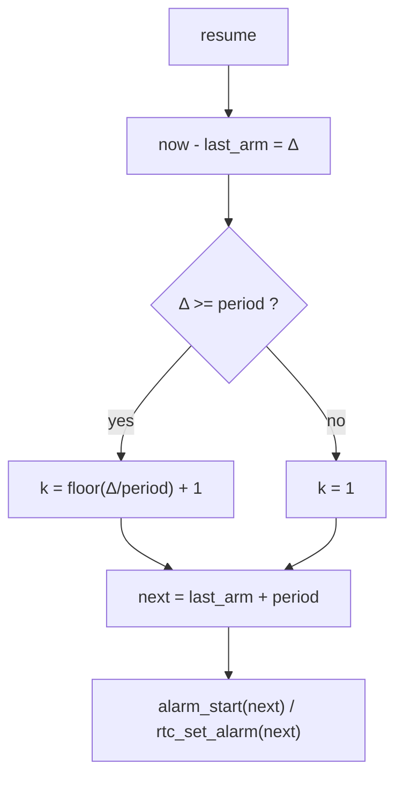
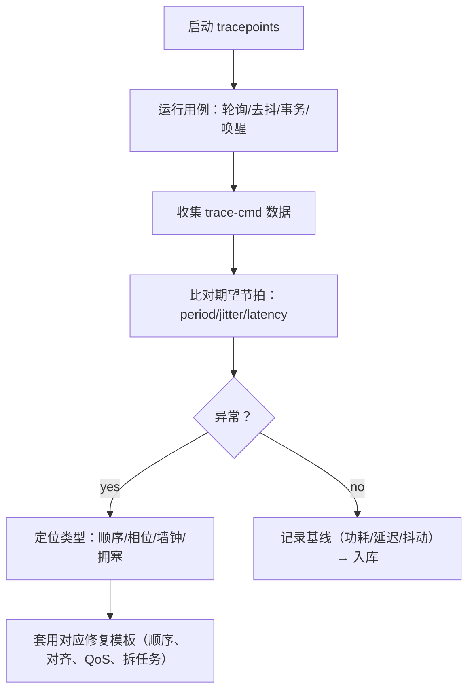

# 第13章 调试、验证与常见陷阱

> 现在，我们把“时间/定时”这套机制真正跑在板子上，并**看见**它。你将一步步开启 tracepoints、ftrace、trace-cmd，验证 timer/hrtimer/workqueue 的时序是否吻合期望；然后我们会针对“设备没了定时器还在跑”“时间回拨/时钟源异常”“挂起后相位漂移”“补跑风暴”等高频问题，给出**可复现的定位路径**与**修复模板**。如果你按本章走完，基本可以独立完成一个驱动的时间子系统验收。

------

## 13.1 怎么确认定时器真的被调度了（最小闭环）

先用最少的工具，把“排程→回调→重排程”闭环跑起来。下面以第 12 章的三个典型为例：`timer_list`、`hrtimer`、`delayed_work`。

### 13.1.1 内核日志与高分辨时间戳

- 启用相对准确的日志时间：

  ```bash
  # dmesg 使用可读时间戳（可选）
  echo Y | sudo tee /sys/module/printk/parameters/time
  dmesg -w
  ```

- 在你的回调里放入**极简**日志（不要频繁打印以免扰动）：

  ```c
  pr_debug("poll tick @%llu ms\n", ktime_to_ms(ktime_get_boottime()));
  ```

### 13.1.2 tracefs 打开关键 tracepoint

- 进入 tracefs：`/sys/kernel/tracing`（旧路径 `/sys/kernel/debug/tracing`）。

- 打开与 timer/工作队列相关的事件：

  ```bash
  cd /sys/kernel/tracing
  echo 0 > tracing_on
  echo 0 > events/enable
  
  # 定时器
  echo 1 > events/timer/timer_start/enable
  echo 1 > events/timer/timer_expire_entry/enable
  echo 1 > events/timer/timer_expire_exit/enable
  
  # 高精度定时器
  echo 1 > events/hrtimer/hrtimer_start/enable
  echo 1 > events/hrtimer/hrtimer_expire_entry/enable
  echo 1 > events/hrtimer/hrtimer_expire_exit/enable
  
  # 工作队列
  echo 1 > events/workqueue/workqueue_queue_work/enable
  echo 1 > events/workqueue/workqueue_execute_start/enable
  echo 1 > events/workqueue/workqueue_execute_end/enable
  
  # 上下文/软中断（观察回调所处上下文）
  echo 1 > events/irq/irq_handler_entry/enable
  echo 1 > events/irq/irq_handler_exit/enable
  echo 1 > events/softirq/softirq_raise/enable
  echo 1 > events/softirq/softirq_entry/enable
  echo 1 > events/softirq/softirq_exit/enable
  
  echo 1 > tracing_on
  sleep 3
  echo 0 > tracing_on
  cat trace > /tmp/timers.trace
  ```

- 你要在 `timers.trace` 中看到**以下链条**：

  - 对 `timer_list`：`timer_start` → `timer_expire_entry`/`exit`；
  - 对 `hrtimer`：`hrtimer_start` → `hrtimer_expire_entry`/`exit`；
  - 对 `delayed_work`：`workqueue_queue_work` → `workqueue_execute_start`/`end`。
     这三类事件的**时间顺序与间隔**，应该与你设置的 `period_ms`、`period_us`、`debounce_ms` 一致。

### 13.1.3 function_graph 复核回调栈（只开自己的函数）

```bash
cd /sys/kernel/tracing
echo function_graph > current_tracer
# 仅跟踪你的驱动符号，避免刷屏
echo leaf_alarm_cb > set_ftrace_filter
echo leaf_work >> set_ftrace_filter
echo poll_timer_fn >> set_ftrace_filter
echo hrt_cb >> set_ftrace_filter
echo defer_workfn >> set_ftrace_filter

echo 1 > tracing_on; sleep 2; echo 0 > tracing_on
cat trace > /tmp/fg.txt
```

在 `fg.txt` 里核对**回调上下文**是否如你设计（hrtimer 在硬中断上下文、work 在进程上下文），并注意是否出现**意外的可睡调用**（那会带来警告或死锁风险）。

------

## 13.2 用 trace-cmd/KernelShark 做“可视化对齐”检查

有时候原始 trace 太长。我们让 `trace-cmd` 把数据打包，丢进 KernelShark 看时序波形和 CPU 迁移。

```bash
sudo trace-cmd record \
  -e timer:timer_start -e timer:timer_expire_entry -e timer:timer_expire_exit \
  -e hrtimer:hrtimer_start -e hrtimer:hrtimer_expire_entry -e hrtimer:hrtimer_expire_exit \
  -e workqueue:workqueue_queue_work -e workqueue:workqueue_execute_start -e workqueue:workqueue_execute_end \
  -e irq:irq_handler_entry -e irq:irq_handler_exit \
  -e softirq:softirq_entry -e softirq:softirq_exit \
  sleep 5
sudo trace-cmd report > /tmp/rep.txt
```

- 期望现象：
  - 周期稳定，抖动在可接受范围；
  - `hrtimer` 的到期点间隔接近设定周期；
  - `workqueue_execute_start` 跟随在回调之后，不发生长时间排队；
  - CPU 迁移可接受（必要时 pin 线程）。

------

## 13.3 “定时器还在跑，但设备没了”——最危险的崩溃类型

这是驱动时间机制中**最常见的致命问题**。症状往往是：`remove()` 后某个回调仍在访问 `struct device` 或寄存器，导致 Use-after-free 或 BUG/Oops。

### 13.3.1 复现与定位步骤

1. **再现窗口**：在设备反复 open/close 或 insmod/rmmod 的压力场景下，使用高频 IRQ 和短周期定时器。
2. **打开 KASAN/KMEMLEAK（可选）**：帮助定位 UAF。
3. **trace 要看三类点**：
   - `remove()` 或错误路径调用 `*_cancel/_sync` 的时刻；
   - 回调重入/尾部；
   - 中断触发（上游）是否在停表之后仍投递。

### 13.3.2 修复模板（顺序是救命稻草）

- **先阻断产生者**（例如禁用 IRQ 或设置“停止派生”的状态位）；

- **再同步取消消费者**：

  ```c
  /* release() 里统一做，remove/error 路径都可调用 */
  disable_irq(dp->irq);                 /* 1. 阻断上游触发 */
  del_timer_sync(&dp->poll_timer);      /* 2. 停周期源 */
  hrtimer_cancel(&dp->tx_hrtimer);      /* 3. 停 watchdog/高精度 */
  cancel_delayed_work_sync(&dp->debounce_work); /* 4. 停延迟工作 */
  enable_irq(dp->irq); /* 若设备仍在而你只是复位，可在最后再使能；remove 场景可不再开启 */
  ```

- 用 `devm_add_action_or_reset()` 把这段变成**资源化收尾**，确保 error path 和 remove 路径一致。

### 13.3.3 验证要点

- `remove()` 时刻之后，在 trace 中**不应**再出现你的回调事件；
- 若仍出现，说明**上游还在投递**或你**漏了某个 cancel**；重复检查顺序与路径。

------

## 13.4 时间回拨/时钟源异常导致的诡异超时

### 13.4.1 现象与基本判断

- 使用 `REALTIME` 相关接口（如 RTC alarm 或 `CLOCK_REALTIME`）时，如果系统被 NTP 校时，闹钟**绝对时刻**会被移动；
- clocksource 不稳定时，可能看到“到期早/晚”“抖动突刺”。

### 13.4.2 快速区分：BOOTTIME vs REALTIME

- 在测试环境里**人为校时**：`sudo date -s "2025-01-01 00:00:00"`；
- 若你的下一个到期点也跟着移动，说明你用的是**墙钟语义**（REALTIME/RTC）；
- 若下一个到期点保持“相对间隔”不变，你用的是**BOOTTIME**（推荐用于“相对准确”需求）。

### 13.4.3 修复与加固

- **相对准确首选 BOOTTIME**（alarmtimer/BOOTTIME、`ktime_get_boottime()` 为基准对齐）；
- **需要绝对墙钟**时，在 `resume` 或下次排程前**重新取“现在的墙钟”**做对齐；
- clocksource 异常请复查平台的 `clocksource` 选择，并把 `sched_clock` 等信息纳入日志。

------

## 13.5 用 ftrace/tracepoints 验证“补跑风暴”是否被抑制

“补跑风暴”指恢复后按“当前时间”逐拍补偿，导致一次性触发大量任务。

### 13.5.1 观察指标

- 统计 1s 内的 `workqueue_execute_start` 次数，若远大于期望值，说明你在**补跑**；
- 观察 `hrtimer_expire_entry` 在恢复后的密集群发。

### 13.5.2 修复做法（再次强调一遍）

- **以“上次目标时刻（last_arm/last_target）为基准”，推算下一拍**：
  - alarmtimer 使用 `ktime_get_boottime()`；
  - RTC 使用 `rtc_read_time()`；
- 不要用“当前时间 + period”去反复补齐历史。

### 13.5.3 可视化检查（对齐前后）



------

## 13.6 性能与精度的取舍记录（怎么量、怎么记）

给自己定一套**可复现**的量化方法，然后把结果写进项目 wiki：周期偏差、抖动、唤醒路径延迟、功耗。

### 13.6.1 抖动与周期偏差

- 使用 `hrtimer` 测时小工具或 eBPF 采样两次事件的时间差，建立统计分布（平均、P95、P99）。
- 对 `timer_list`：注意 NO_HZ/idle 的影响，空闲时刻可能合并 tick。

### 13.6.2 唤醒路径延迟

- 在 alarm 回调里记录**硬触发时刻**（tracepoint 时间）与**工作开始时刻**（`workqueue_execute_start`）差值。
- 在开启/关闭 `PM QoS` 时各跑一轮，记录改善幅度与功耗代价。

### 13.6.3 功耗

- `powertop` + 你的业务日志：对比不同 `period`、`wake_guard_ms`、`PM QoS` 策略的耗电差异。
- 记录“能达标的最小醒来窗口”“能容忍的最大相位误差”。

------

## 13.7 调试“工具箱”清单（开关与配置）

- **内核配置**
  - `CONFIG_FTRACE`, `CONFIG_FUNCTION_TRACER`, `CONFIG_FUNCTION_GRAPH_TRACER`
  - `CONFIG_EVENT_TRACING`, `CONFIG_TRACING`, `CONFIG_TIMER_STATS`（如有）
  - `CONFIG_HRTIMER`, `CONFIG_HIGH_RES_TIMERS`, `CONFIG_NO_HZ_IDLE`（按平台）
  - `CONFIG_WORKQUEUE_PROFILING`（如有）
- **运行时开关**（tracefs）
  - `events/timer/*`, `events/hrtimer/*`, `events/workqueue/*`, `events/irq/*`, `events/softirq/*`
  - `current_tracer=function_graph` + `set_ftrace_filter`
- **分析工具**
  - `trace-cmd`, `KernelShark`
  - `perf sched record/report`（观察调度延迟）
  - eBPF（`bpftool prog load`，为特定回调建立直方图）

------

## 13.8 典型问题场景与“判词表”

| 现象                 | 快速判断                         | 一句话“判词”                 | 处方                                      |
| -------------------- | -------------------------------- | ---------------------------- | ----------------------------------------- |
| remove 后偶发崩溃    | trace 里先有回调后有 cancel      | **上游没关，停表顺序错**     | 先关 IRQ/源，再 `*_cancel/_sync`          |
| 挂起后醒来跑了一大串 | `workqueue_execute_start` 聚簇   | **补跑风暴**                 | 以 “last_arm/last_target” 为基准对齐      |
| 闹钟时刻漂移         | 校时后下一拍移动                 | **用了 REALTIME 语义**       | 需求允许则改 BOOTTIME；否则恢复时重新对齐 |
| 抖动远超预期         | `hrtimer` 到期间隔散点大         | **CPU 迁移/抢占/深 C-state** | pin 到 CPU、临时 PM QoS、适当增大 period  |
| 回调卡顿影响周期     | `workqueue_execute_start` 延迟大 | **工作过重或队列拥塞**       | 拆小任务、专用 wq、调整优先级             |

------

## 13.9 可视化：调试闭环一览



------

## 13.10 小结

- **先看见**：打开 timer/hrtimer/workqueue/irq/softirq 的 tracepoints，让“发生了什么”无可争辩地摆在你面前。
- **先顺序后相位**：remove/error/PM 路径先阻断上游，再同步取消；恢复后以“上次目标”为基准对齐下一拍。
- **区分时间域**：相对准确选 BOOTTIME；绝对墙钟选 REALTIME/RTC，但要接受校时影响。
- **抖动与延迟要量化**：用 trace-cmd/KernelShark/perf 建立基线，调整 PM QoS/队列/CPU 亲和以达标。
- **留档**：把可复现的调试脚本与指标表放到项目 wiki，后续平台迁移时直接复用。

> 你已经具备对驱动“时间与定时”行为做**可证明的验证**与**系统化修复**的能力。下一章，我们会给出附录：接口速查与对照表，把你常用的 API、上下文限制、精度/开销/可睡眠性放进一张“随手查”的页面，并附上推荐源码路径。

