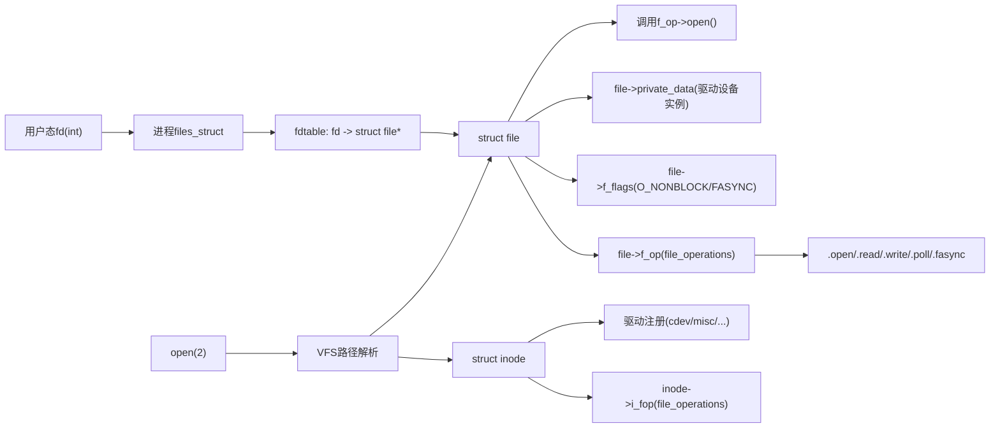
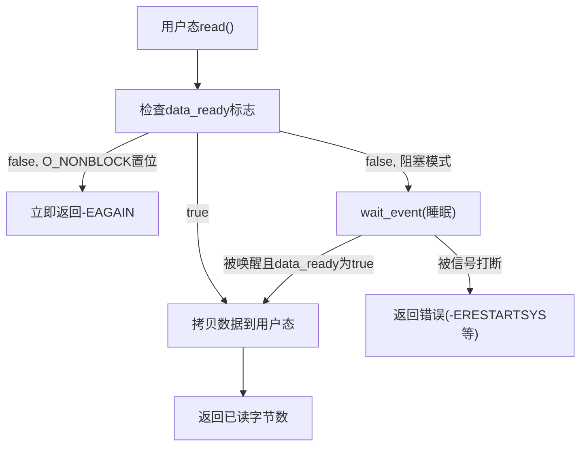
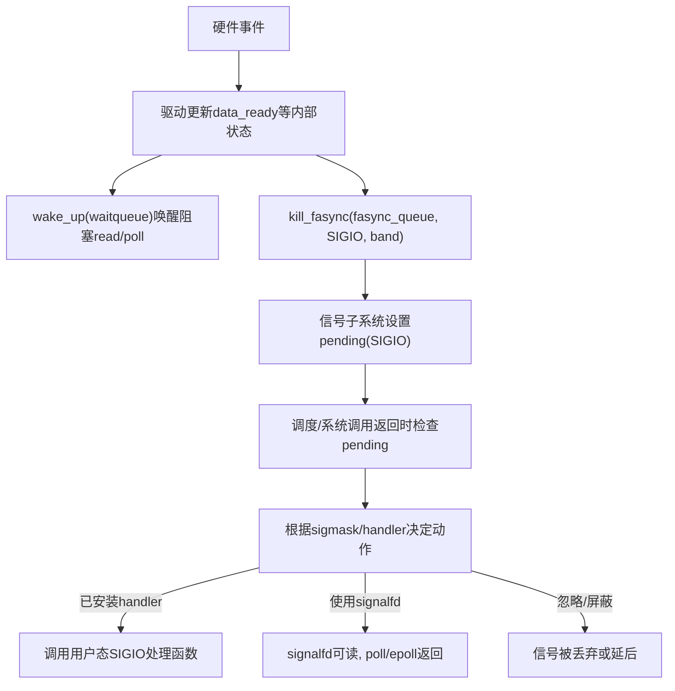
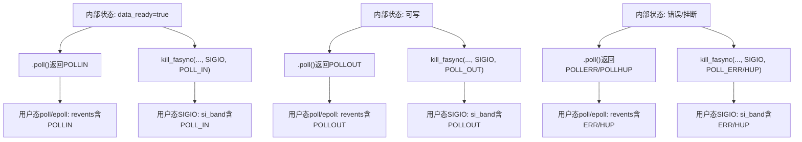

# 第 2 章 Linux I/O 与信号机制基础

> 章节内容说明：本章从内核与用户态双视角，回顾异步通知相关的基础：
>
> - 文件描述符与 `struct file` / inode / VFS 抽象；
> - 阻塞 / 非阻塞 I/O 行为；
> - `select`/`poll`/`epoll` 的事件模型；
> - Linux 信号子系统、`SIGIO`/`SIGPOLL` 的位置。
>    本章是后续 fasync 机制的“底座”，只讲与本书主题直接相关的部分。

------

## 2.1 文件描述符与 VFS 基础回顾

### 2.1.1 引入：为什么先讲 VFS 和 fd

fasync 机制所有行为都“挂”在 **文件描述符（fd）** 上：

- 用户态是用 `int fd` 做一切 I/O 操作：`read`/`write`/`poll`/`fcntl`/`ioctl`；
- 内核态则围绕 `struct file`、`struct inode` 做统一抽象；
- fasync 绑定在 `struct file` 上，`FASYNC` 在 `file->f_flags` 中，`fasync_struct` 链表也以 `file` 为粒度。

如果不先把“fd ↔ struct file ↔ 驱动回调”这条链条弄清楚：

- 很难准确理解 `F_SETFL(FASYNC)` 为什么会触发 `.fasync`；
- 很难区分“同一设备、多进程、多 fd”的行为差异；
- 在调试时也很难从 `strace` 输出映射到内核侧的具体 `struct file`。

本小节的目标是：

- 只抓异步通知相关的 VFS 概念：fd、`struct file`、`file_operations`、`inode`；
- 把“用户态调用 → VFS 层 → 驱动回调”的路径梳理清楚；
- 为后面讨论 `fasync_helper()`、`kill_fasync()` 等函数的绑定点打基础。

------

### 2.1.2 数据结构视角：fd / struct file / inode 的最小关系

从数据结构角度看，与本书主题直接相关的主要对象是：

1. **用户态的 fd（文件描述符）**
   - 本质：进程内一个非负整数索引；
   - 内核视角：进程的 `files_struct` 内有一个 `fdtable`，其中 fd 索引指向 `struct file *`；
   - 对本书的意义：
     - `fcntl(F_SETFL, FASYNC | ...)` 是以 fd 为入口；
     - 同一进程中多个 fd 可能指向同一个 `struct file`，也可能是独立的 `struct file`。
2. **`struct file`（打开实例）**
   - 代表一次“打开”的结果，是 VFS 层的抽象：
     - `f_op`：指向 `struct file_operations`；
     - `f_flags`：包含 `O_NONBLOCK`、`O_ASYNC`(=FASYNC) 等标志；
     - `private_data`：驱动侧自定义上下文。
   - 对本书的意义：
     - `.fasync` 回调挂在 `struct file_operations` 上，VFS 在处理 `F_SETFL(FASYNC)` 时会调用该回调；
     - fasync 链表记录的是订阅异步通知的 `struct file` 集合；
     - 驱动在 `.open` 中通常会把自己的 `struct demo_async_dev *` 填到 `filp->private_data`，后续在 `.read` / `.poll` / `.fasync` 中使用。
3. **`struct inode`（索引节点 / 文件对象）**
   - 描述文件本身（设备、普通文件等）的“静态属性”：
     - 文件类型（普通文件、目录、字符设备、块设备等）；
     - 主次设备号（对于字符/块设备）；
     - 权限、属主等。
   - 多个 `struct file` 可以指向同一个 `struct inode`（即多个打开实例对同一文件）。
4. **驱动的 `struct file_operations`**
   - 对字符设备来说，这是驱动向 VFS 提供的一系列回调：
     - `.open` / `.release`；
     - `.read` / `.write`；
     - `.poll`；
     - `.fasync`；
     - `.unlocked_ioctl` 等。
   - VFS 在处理系统调用时，会通过 `file->f_op` 调用这些回调。

> 对 fasync 来说，**唯一必须掌握的是：`F_SETFL(FASYNC)` 最终让 VFS 调用 `file->f_op->fasync()`，驱动在这个回调里使用 `fasync_helper()` 维护 fasync 链表。**

------

### 2.1.3 开发者视角：打开设备后内核内部发生了什么

以一个典型字符设备 `/dev/demo_async` 为例，从驱动开发者角度理解打开过程（只保留与 fasync 相关的重要节点）：

1. 用户态调用：

   ```c
   int fd = open("/dev/demo_async", O_RDONLY | O_NONBLOCK);
   ```

2. 内核 VFS 侧过程（简化）：

   - 解析路径 `/dev/demo_async`，得到对应的 `struct inode`；
   - 创建一个新的 `struct file`：
     - 初始化 `filp->f_op = inode->i_fop`（即驱动注册的 `file_operations`）；
     - 设置 `filp->f_flags` 中的 `O_NONBLOCK` 等标志；
   - 调用 `filp->f_op->open(inode, filp)`，进入驱动的 `.open`。

3. 驱动侧 `.open` 的典型行为：

   ```c
   static int demo_open(struct inode *inode, struct file *filp)
   {
   	struct demo_async_dev *ddev;
   
   	ddev = container_of(inode->i_cdev, struct demo_async_dev, cdev);
   	filp->private_data = ddev;	/* 绑定设备实例 */
   
   	/* 此处可根据需要初始化 per-open 状态，如非阻塞标志缓存等 */
   
   	return 0;
   }
   ```

4. 此时：

   - 用户态：拿到一个 `fd` 整数；
   - 内核态：
     - 在当前进程的 `fdtable` 中，新建一条 fd → `struct file *` 的映射；
     - `struct file` 记录了 `f_flags` / `f_op` / `private_data` 等信息。

> 当用户后续调用 `fcntl(fd, F_SETFL, flags | FASYNC)` 时，就是基于这条 fd → `struct file` 映射，VFS 在内部找到对应 `struct file`，并据此调用 `.fasync` 维护 fasync 链表。

------

### 2.1.4 用户 / 平台视角：fd 的生命周期与多进程/多 fd 情况

从用户和系统层面，fd 生命周期和共享方式会直接影响异步通知行为：

1. **单进程、单 fd**（最简单情况）

   - 一个进程打开设备一次，得到一个 fd；
   - fasync 对象就是“这一对（进程、fd）”；
   - 信号路由较为简单。

2. **单进程、多 fd 打开同一设备**

   ```c
   int fd1 = open("/dev/demo_async", O_RDONLY);
   int fd2 = open("/dev/demo_async", O_RDONLY);
   ```

   - 内核通常会创建两个独立 `struct file`；
   - 若对 `fd1` 设置 FASYNC，对 `fd2` 不设置：
     - fasync 链表只包含 `fd1` 对应的 `struct file`；
     - 事件到来时，只会根据 `fd1`/其 owner 发送信号。

3. **多进程共享 fd（例如 fork 后的继承）**

   ```c
   int fd = open("/dev/demo_async", O_RDONLY);
   pid_t pid = fork();
   ```

   - 子进程继承父进程的 fd，且 **共享同一个 `struct file`**（引用计数增加）；
   - 对 fasync 来说：
     - 如果父进程设置了 FASYNC，则可能需要仔细控制 `F_SETOWN`，避免信号被路由到不期望的进程。

4. **多进程各自打开同一设备**

   ```c
   int fd1 = open("/dev/demo_async", O_RDONLY); /* in process A */
   int fd2 = open("/dev/demo_async", O_RDONLY); /* in process B */
   ```

   - 内核为每个进程创建各自的 `struct file`；
   - fasync 链表中可能存在多个节点，对应不同进程/进程组。

> 这些差异在后面讲 `F_SETOWN`、`F_SETSIG` 和信号路由时会非常关键，因此在这里先从 fd/VFS 层面明确“一个 fd 背后可能是共享或独立的 `struct file`”。

------

### 2.1.5 可视化：从 fd 到驱动回调的路径图

用一张简单的图来总结“用户态 fd → 内核 VFS → 驱动”的路径：



你后面只要记住一条：

> **一切都是从 fd 找到 `struct file`，再通过 `file->f_op` 调到驱动。**

------

### 2.1.6 示例代码：最小字符设备骨架（带 .fasync 预留位）

这里给出一个“只展示关键字段”的骨架，后续章节会在这个基础上逐步填充 fasync 相关内容：

```c
/* demo_async_dev.h */

#ifndef _DEMO_ASYNC_DEV_H_
#define _DEMO_ASYNC_DEV_H_

#include <linux/cdev.h>
#include <linux/wait.h>
#include <linux/fasync.h>
#include <linux/poll.h>

#define DEMO_ASYNC_BUF_SIZE_BYTES	256

struct demo_async_dev {
	struct cdev		cdev;		/* 字符设备对象 */
	wait_queue_head_t	wq;		/* 读等待队列 */
	char			buf[DEMO_ASYNC_BUF_SIZE_BYTES];
	size_t			data_len;
	bool			data_ready;

	struct fasync_struct	*fasync_queue;	/* fasync 链表头，后续章节详细讲解 */
};

#endif /* _DEMO_ASYNC_DEV_H_ */
/* demo_async_main.c: 仅展示与 struct file / file_operations 相关部分 */

static int demo_open(struct inode *inode, struct file *filp)
{
	struct demo_async_dev *ddev;

	ddev = container_of(inode->i_cdev, struct demo_async_dev, cdev);
	filp->private_data = ddev;

	return 0;
}

static int demo_release(struct file *filp)
{
	/* 这里后续会补上 fasync 清理等逻辑 */
	return 0;
}

static ssize_t demo_read(struct file *filp, char __user *buf,
			 size_t count, loff_t *ppos)
{
	/* 这里只是占位，后续章节补充等待队列与数据逻辑 */
	return 0;
}

static unsigned int demo_poll(struct file *filp, poll_table *wait)
{
	/* 占位，后续补充 poll 与 data_ready 状态映射 */
	return 0;
}

static int demo_fasync(int fd, struct file *filp, int on)
{
	/* 占位，后续章节给出完整 fasync_helper 调用逻辑 */
	return 0;
}

static const struct file_operations demo_fops = {
	.owner		= THIS_MODULE,
	.open		= demo_open,
	.release	= demo_release,
	.read		= demo_read,
	.poll		= demo_poll,
	.fasync		= demo_fasync,
};
```

这个骨架体现了几个关键点：

- `file_operations` 是 VFS 调用驱动的入口集合；
- `.open` / `.release` / `.read` / `.poll` / `.fasync` 都以 `struct file *filp` 为中心；
- `filp->private_data` 绑定驱动自己的 `struct demo_async_dev` 对象。

后续所有 fasync 相关实现，都是在这个骨架上一步一步补充完成。

------

### 2.1.7 调试与验证视角：从用户态 fd 映射到内核对象

在调试异步通知问题时，经常需要回答问题：

- “这个 fd 在内核里对应哪一个 `struct file` / 驱动实例？”

常见手段有：

1. 在驱动 `.open` 中打印关键信息：

   ```c
   static int demo_open(struct inode *inode, struct file *filp)
   {
   	struct demo_async_dev *ddev;
   
   	ddev = container_of(inode->i_cdev, struct demo_async_dev, cdev);
   	filp->private_data = ddev;
   
   	pr_info("demo_async: open, filp=%p, ddev=%p\n", filp, ddev);
   
   	return 0;
   }
   ```

2. 在 `.fasync` / `.poll` / `.read` 中也打印 `filp` 指针和 `current->pid`，确认：

   - 同一个进程是否通过多个 fd 访问同一个 `ddev`；
   - 多个进程是否在访问同一 `ddev`。

3. 结合 `strace -f -o trace.log your_program` 观察每个 fd 的 `open`/`fcntl` 调用，对应驱动侧的日志。

通过这些手段，可以把“用户态看到的 fd 行为”与“内核看到的 `struct file` / `demo_async_dev` 行为”对应起来，为后面调试 fasync 链表和信号路由打基础。

------

### 2.1.8 小结：本节对后续 fasync 内容的支撑作用

本节的核心结论：

1. fd 在用户态只是一个整数，但在内核中通过 `files_struct` 与 `fdtable` 映射到具体的 `struct file`；
2. `struct file` 是 VFS 的核心运行时对象：记录 `f_flags`（包含 FASYNC）、`f_op`（驱动回调）、`private_data`（驱动实例）；
3. 驱动通过 `file_operations` 向 VFS 暴露 `.open` / `.read` / `.poll` / `.fasync` 等接口，所有 fasync 入口都经过 `struct file`；
4. 一个设备可以被多个进程、多次打开，每次打开形成一个 `struct file`，fasync 就是管理这些“订阅者”的链表；
5. 调试时需要从“fd → struct file → 驱动设备实例”的链条去分析问题。

在这个基础上，后续 **2.2 阻塞 I/O 与非阻塞 I/O 的行为差异** 会在 `file->f_flags` 与 `O_NONBLOCK` 的语义上继续展开，为理解 fasync 与 `O_ASYNC/FASYNC` 的关系做铺垫。


------

## 2.2 阻塞 I/O 与非阻塞 I/O 的行为差异

### 2.2.1 引入：为什么要先把阻塞 / 非阻塞讲清楚

fasync 依赖 `file->f_flags` 里的标志位（包括 `FASYNC`），而 **`O_NONBLOCK` 与阻塞读写的语义**，直接决定：

- 驱动 `.read()` 在“暂时无数据”时的返回策略（睡眠 vs 立即 `-EAGAIN`）；
- `.poll()` 如何与 `waitqueue` 结合，向用户态暴露“可读/不可读”状态；
- 用户态是否会配合 `FASYNC` 使用 `O_NONBLOCK`，避免在信号驱动场景中出现“卡死式 read”。

如果对“阻塞 / 非阻塞”行为不清楚：

- 很容易把“阻塞 read 等待数据”误认为“异步通知”；
- 在调试 fasync 时分不清“收不到 SIGIO” vs “其实是在阻塞 read 里卡住”；
- 驱动内部容易写出逻辑混乱的 `read`/`poll`，给后续 fasync 链路制造干扰。

本节的目标是：

- 把**阻塞/非阻塞 I/O 的语义**讲清楚；
- 给出驱动实现 `read` 时的典型模板；
- 为后面的 `poll` 与 fasync 行为统一打基础。

------

### 2.2.2 数据结构视角：`file->f_flags` 中的 `O_NONBLOCK`

在内核中，阻塞/非阻塞行为主要通过 `file->f_flags` 里的 `O_NONBLOCK` 标志控制：

1. **`file->f_flags` 的来源**

   - 用户态调用 `open()` 或 `fcntl(F_SETFL)`，传入的 `O_RDONLY` / `O_NONBLOCK` / `O_SYNC` / `O_ASYNC` 等 flag，最终会体现在 `file->f_flags` 中；
   - `O_ASYNC` 在内核侧对应 `FASYNC` 位，本书后续重点谈；
   - `O_NONBLOCK` 控制 `.read()` / `.write()` 等是否允许阻塞。

2. **驱动如何读取这个标志**

   在任何使用 `struct file *filp` 的回调中，驱动都可以通过：

   ```c
   if (filp->f_flags & O_NONBLOCK) {
   	/* 非阻塞模式下的行为 */
   }
   ```

   来决定：在暂时无数据时是返回 `-EAGAIN`，还是把当前进程挂到 `waitqueue` 上睡眠。

3. **与等待队列的联动**

   - 阻塞读：
     - 在无数据时将当前进程加入 `waitqueue`，`schedule()` 睡眠，等待 `wake_up`;
   - 非阻塞读：
     - 在无数据时**不睡眠**，直接返回 `-EAGAIN`；
   - 这两种行为在驱动内部往往是同一套逻辑，通过 `O_NONBLOCK` 分支切换。

4. **与 fasync 的组合**

   - 用户态常见模式：`O_NONBLOCK + FASYNC`；
   - 驱动必须保证：
     - 即使用户态通过 SIGIO 得知“有事件”，`read()` 在再次调用时依然遵守阻塞/非阻塞语义；
     - 即便用户没有用 fasync，只使用阻塞/非阻塞 + poll，也不会出“奇怪行为”。

------

### 2.2.3 开发者视角：`read()` 在阻塞/非阻塞场景下的典型写法

一个合理的 `.read()` 实现，通常要满足以下模式：

1. **检查是否有数据**（例如 `data_ready` 标志）；
2. **没有数据时，根据 `O_NONBLOCK` 决定行为**：
   - 阻塞：挂入等待队列并睡眠；
   - 非阻塞：直接返回 `-EAGAIN`；
3. **有数据时，拷贝到用户空间，更新内部状态**。

示例模板（略去锁与错误处理细节，后续章节再补充）：

```c
static ssize_t demo_read(struct file *filp, char __user *buf,
			 size_t count, loff_t *ppos)
{
	struct demo_async_dev *ddev = filp->private_data;
	size_t to_copy;
	int ret;

	/* 1. 如果当前没有数据，先处理阻塞/非阻塞语义 */
	if (!ddev->data_ready) {
		if (filp->f_flags & O_NONBLOCK)
			return -EAGAIN;

		/* 阻塞模式：睡眠等待数据到来 */
		ret = wait_event_interruptible(ddev->wq, ddev->data_ready);
		if (ret < 0)
			return ret;
	}

	/* 到这里，data_ready 为 true，表示有数据可读 */

	to_copy = min_t(size_t, count, ddev->data_len);

	if (copy_to_user(buf, ddev->buf, to_copy))
		return -EFAULT;

	/* 简化：一次读完，清空标志 */
	ddev->data_ready = false;
	ddev->data_len = 0;

	return to_copy;
}
```

要点：

- 阻塞/非阻塞的区别仅在“无数据时”的分支；
- 一旦 `data_ready == true`，两者行为完全一致；
- `wait_event_interruptible()` 保证如果在等待期间被信号打断，会返回 `-ERESTARTSYS` 等错误码，用户态需自己处理。

------

### 2.2.4 用户 / 平台视角：阻塞/非阻塞对应用行为的影响

从用户态和系统层面看，阻塞/非阻塞的选择直接影响：

1. **线程/进程模型**

   - 阻塞模式下：
     - 一个线程调用 `read()` 时会被挂起，直到有数据；
     - 适合“专线线程”，专门负责某个 fd 的 I/O。
   - 非阻塞模式下：
     - 调用 `read()` 会立刻返回，不会影响当前线程的执行流；
     - 一般配合 `poll`/`epoll`，以及**事件循环**使用。

2. **响应延迟与 CPU 利用率**

   - 阻塞 + 合理事件唤醒，通常 CPU 利用率较低；
   - 非阻塞 + 盲目轮询，会造成 CPU 空转；
   - 非阻塞 + `poll/epoll` 或 fasync，可以在一定程度上兼顾实时性与 CPU 利用率。

3. **与 fasync 的协同**

   典型模式是：

   - 用户态：
     - `open(..., O_NONBLOCK | ...)`；
     - `fcntl(F_SETOWN)` + `F_SETFL(FASYNC | O_NONBLOCK | ...)`；
     - 主循环只做其他工作或 `pause()`，等 SIGIO 告诉它“可以去读数据了”；
   - 驱动：
     - 保证在数据到来时 `data_ready = true`；
     - 调用 `wake_up()` 和 `kill_fasync()`；
     - `read` 在无数据时仍然返回 `-EAGAIN`（非阻塞），在有数据时返回实际字节数。

> 换句话说：**fasync 只是“告诉你现在去读”，实际读的语义（阻塞/非阻塞）仍由 `O_NONBLOCK` 决定**。

------

### 2.2.5 可视化：阻塞 / 非阻塞 `read()` 流程对比

用一张简图描述“在没有数据时调用 read()”的两种情况：



后续当我们把 `poll` 与 fasync 加进去时，会在“data_ready 从 false 变成 true”的那个时刻，额外挂接：

- `wake_up(waitqueue)` → 唤醒阻塞 read 和 poll；
- `kill_fasync()` → 触发 SIGIO。

------

### 2.2.6 示例代码：用户态阻塞 / 非阻塞示例对比

这里给出两个极简用户态示例，用来对比行为。

#### 1）阻塞模式

```c
/* demo_block_read_user.c */

#include <stdio.h>
#include <unistd.h>
#include <fcntl.h>

#define DEMO_USER_READ_BUF_SIZE_BYTES	128

int main(void)
{
	int fd;
	char buf[DEMO_USER_READ_BUF_SIZE_BYTES];
	ssize_t n;

	fd = open("/dev/demo_async", O_RDONLY);
	if (fd < 0) {
		perror("open");
		return 1;
	}

	for (;;) {
		/* 会被阻塞，直到有数据或被信号打断 */
		n = read(fd, buf, sizeof(buf));
		if (n < 0) {
			perror("read");
			break;
		}

		/* 此处处理数据，略 */
	}

	close(fd);
	return 0;
}
```

#### 2）非阻塞 + 简单轮询模式（仅用于对比，不推荐长期使用）

```c
/* demo_nonblock_poll_user.c */

#include <stdio.h>
#include <unistd.h>
#include <fcntl.h>
#include <errno.h>

#define DEMO_USER_READ_BUF_SIZE_BYTES	128
#define DEMO_USER_POLL_INTERVAL_US	10000	/* 10ms */

int main(void)
{
	int fd;
	char buf[DEMO_USER_READ_BUF_SIZE_BYTES];
	ssize_t n;

	fd = open("/dev/demo_async", O_RDONLY | O_NONBLOCK);
	if (fd < 0) {
		perror("open");
		return 1;
	}

	for (;;) {
		n = read(fd, buf, sizeof(buf));
		if (n < 0) {
			if (errno == EAGAIN) {
				/* 暂时无数据，休眠一会儿再试 */
				usleep(DEMO_USER_POLL_INTERVAL_US);
				continue;
			}
			perror("read");
			break;
		}

		/* 有数据时处理，略 */
	}

	close(fd);
	return 0;
}
```

实际工程中，第二种一般会换成“非阻塞 + `poll/epoll`”，或者“非阻塞 + fasync + 信号”，避免忙等。

------

### 2.2.7 调试与验证：判断当前是阻塞还是非阻塞行为

在调试驱动和应用时，常见问题之一是：

> “我以为是非阻塞，结果进程莫名其妙卡住了。”

可以按以下步骤排查：

1. **在用户态确认 `O_NONBLOCK` 是否真的生效**

   - 使用 `fcntl(fd, F_GETFL)` 获取当前 flag，检查是否包含 `O_NONBLOCK`；
   - `strace` 输出中也可以看到 `open` 或 `fcntl(F_SETFL)` 的参数。

2. **在内核中打印 `filp->f_flags`**

   在 `.read` / `.poll` 中打印：

   ```c
   pr_debug("demo_async: read, f_flags=0x%x\n", filp->f_flags);
   ```

   查看是否带 `O_NONBLOCK`。

3. **观察 `wait_event` 是否被调用**

   在 `wait_event_interruptible()` 调用前后打日志：

   ```c
   pr_debug("demo_async: read, no data, going to wait\n");
   ```

   若在预期的非阻塞模式下看到这条日志，则说明驱动逻辑没有正确按 `O_NONBLOCK` 分支。

4. **结合 fasync 场景**

   - 如遇到“已经设置 FASYNC，却发现 `read` 一直阻塞”的情况：
     - 先确认是不是用户态 `open` 时没有加 `O_NONBLOCK`；
     - 如果确实需要阻塞行为，也要在设计上明确：
       - 信号仅作为“提醒”，但实际读仍然允许阻塞。

------

### 2.2.8 小结：阻塞 / 非阻塞与后续 fasync 的关系

本节要点可以压缩为：

1. 阻塞/非阻塞 I/O 的核心在于 `file->f_flags` 中的 `O_NONBLOCK` 标志；
2. 驱动在 `.read()` 中根据 `O_NONBLOCK` 决定“无数据时是睡眠等待，还是立即返回 `-EAGAIN`”；
3. 即使启用 fasync，**`read()` 的阻塞/非阻塞语义仍然由 `O_NONBLOCK` 控制**，fasync 只是“另外发一条通知”；
4. 合理的模式往往是：
   - 阻塞 + `waitqueue`，适合简单专线线程；
   - 非阻塞 + `poll/epoll` 或 非阻塞 + `fasync + SIGIO`，适合事件驱动架构；
5. 调试时要先确认“当前 fd 的阻塞模式”，以免把阻塞导致的现象误判为 fasync 或信号问题。

后续 **2.3 `select/poll/epoll` 的事件等待模型** 会在此基础上继续往上加一层，说明事件等待与 `waitqueue` 的关系，为后面“`poll` + fasync + 信号”的组合做好铺垫。


------

## 2.3 select/poll/epoll 的事件等待模型

### 2.3.1 引入：为什么要在 fasync 之前先讲 poll/epoll

在绝大多数驱动中，**`poll` / `epoll` 是事件通知的“基础设施”**，fasync 只是一个额外分支：

- 驱动要支持 fasync，通常已经支持 `.read()` + `.poll()`；
- `poll` / `epoll` 与 fasync 共享同一套“就绪条件”（例如 `data_ready`）；
- debug 时，习惯上先检查“`poll` 是否正常工作”，再看 fasync/信号链路。

因此，本节目标是：

1. 从内核数据结构视角说明：`poll_wait()`、等待队列、`struct eventpoll` 的基本关系；
2. 从驱动开发者视角说明：**`.poll` 的标准写法**是什么；
3. 从用户态视角说明：`select` / `poll` / `epoll` 的常见使用模型；
4. 为后续章节中“`poll` + fasync + SIGIO”三者协同打基础。

------

### 2.3.2 数据结构视角：`wait_queue` + `poll_table` + eventpoll

从内核实现上看，`select`/`poll`/`epoll` 的核心在于一组数据结构协同工作：

1. **等待队列：`wait_queue_head_t`**

   - 是驱动内部用来挂睡眠任务的通用结构；
   - `read()` 阻塞时，会把当前任务挂到对应的 `wait_queue_head_t` 上；
   - `poll` 的实现也依赖同一个 `wait_queue_head_t`，以便在事件就绪时唤醒等待 `poll` 的任务。

2. **`poll_table_struct` 与 `poll_wait()`**

   - 当用户态调用 `poll()` 或 `select()` 时，内核会构造一个 `poll_table_struct`，并依次调用每个 fd 的 `.poll()`：

     ```c
     unsigned int (*poll)(struct file *filp, poll_table *wait);
     ```

   - 在 `.poll()` 实现中，驱动应调用：

     ```c
     poll_wait(filp, &ddev->wq, wait);
     ```

     这行代码的作用是：

     - 告诉内核：“如果将来有事件发生，需要唤醒在这个 `wait_queue_head_t` 上等待的 `poll` 调用”；
     - 内核会把 `(wait_queue_head_t, current)` 的关系记录下来。

   - `poll_wait()` 不会睡眠，只是建立“**poll 调用 ↔ 等待队列**”的关联。

3. **`.poll()` 返回值：事件掩码（mask）**

   - `.poll()` 最终返回一个 `unsigned int` 掩码：
     - `POLLIN` / `POLLRDNORM`：可读；
     - `POLLOUT` / `POLLWRNORM`：可写；
     - `POLLERR` / `POLLHUP` / `POLLNVAL` 等：错误 / 挂断 / 无效。
   - 用户态 `poll()` / `epoll` 会根据这些掩码判断哪些 fd 处于就绪状态。

4. **epoll 的额外结构：`struct eventpoll` + 红黑树/链表**

   - `epoll` 不是新的事件类型，只是对 `poll` 的一个高效封装：
     - 内部有 `struct eventpoll`，管理待监视 fd 的集合（红黑树 + 链表）；
     - 本质上仍使用各 fd 的 `.poll()` 回调来获取就绪掩码；
     - `epoll_wait()` 只是从 `eventpoll` 中取出已经就绪的 fd。

5. **与 fasync 共用的“就绪条件”**

   - `.poll()` 中判断就绪的条件（例如 `ddev->data_ready == true`）
   - 中断/下半部更新 `data_ready` 后：
     - `wake_up(&ddev->wq)` 用于唤醒阻塞 `read` / `poll`；
     - `kill_fasync()` 用于触发 SIGIO；
   - 三者实际上都依赖同一个内部状态。

> 数据结构视角的结论：
>
> - `wait_queue_head_t` 是统一的“等待点”；
> - `poll_table` 是“把 `poll` 调用挂到等待队列上的桥”；
> - epoll 是构建在 `.poll()` 基础上的高层封装；
> - fasync 与这些结构共用“事件就绪条件”，但走的是信号通路。

------

### 2.3.3 开发者视角：`.poll` 的标准实现模式

对驱动开发者来说，“写好 `.poll()`”通常遵循以下模式：

1. 在设备结构中包含一个等待队列和状态变量，例如：

   ```c
   struct demo_async_dev {
   	wait_queue_head_t	wq;
   	bool			data_ready;
   	/* 其他字段略 */
   };
   ```

2. 在 `.open()` 中初始化等待队列（也可以在 probe 时完成）：

   ```c
   static int demo_open(struct inode *inode, struct file *filp)
   {
   	struct demo_async_dev *ddev;
   
   	ddev = container_of(inode->i_cdev, struct demo_async_dev, cdev);
   	filp->private_data = ddev;
   
   	/* 确保等待队列已经初始化，一般在 probe 里 init_waitqueue_head() 即可 */
   
   	return 0;
   }
   ```

3. `.poll()` 的标准模板：

   ```c
   static unsigned int demo_poll(struct file *filp, poll_table *wait)
   {
   	struct demo_async_dev *ddev = filp->private_data;
   	unsigned int mask = 0;
   
   	/* 1. 建立 poll 与等待队列的关联：后续 wake_up(&ddev->wq) 时能唤醒 poll */
   	poll_wait(filp, &ddev->wq, wait);
   
   	/* 2. 根据内部状态设置就绪掩码 */
   	if (ddev->data_ready)
   		mask |= POLLIN | POLLRDNORM;
   
   	/* 若支持写就绪，则在此处根据可写条件设置 POLLOUT/POLLWRNORM */
   
   	return mask;
   }
   ```

4. 在中断 / 下半部 / 定时器等事件产生点中：

   ```c
   static void demo_irq_handler_work(struct demo_async_dev *ddev)
   {
   	/* 更新内部状态，示例：设置 data_ready 为 true */
   	ddev->data_ready = true;
   
   	/* 唤醒等待队列上的任务（包括阻塞 read 和 poll） */
   	wake_up_interruptible(&ddev->wq);
   
   	/* 后续章节会在这里补上 kill_fasync() 调用 */
   }
   ```

要点总结：

- `.poll()` 必须调用 `poll_wait()`，否则 `poll()`/`epoll` 无法知道要挂在哪个等待队列上；
- 返回的掩码必须与 `read` 行为一致（即 `data_ready` 为 true 时 `read` 不应再阻塞）；
- 中断/下半部中的 `wake_up()` 是 `poll` 机制和阻塞 `read` 的共同触发点。

------

### 2.3.4 用户 / 平台视角：select/poll/epoll 的使用模型

从应用程序角度，三者的典型使用方式是：

1. **select**
   - 早期 POSIX 接口，使用 `fd_set` 管理 fd 集合；
   - fd 数量受 `FD_SETSIZE` 限制，不适合大规模 fd；
   - 现代项目中除非为了兼容，很少作为首选。
2. **poll**
   - 使用 `struct pollfd` 数组；
   - 每次调用 `poll()`，需要重新传递整个数组；
   - 适合 fd 数量较少、简单场景。
3. **epoll**
   - Linux 特有、适合大量 fd 的高效接口；
   - 将 fd 先添加到一个 epoll 实例，然后再 `epoll_wait()`；
   - 适合长期运行的服务/守护进程。

与 fasync 的关系：

- `poll/epoll` 属于“**内核态维护等待队列 + 用户态显式等待**”模式；
- fasync 属于“**内核主动发信号，用户态信号处理**”模式；
- 在很多工程中，你会将“重要设备”放入一个 epoll 事件循环，同时对某些特殊设备启用 fasync，用于快速唤醒处理逻辑。

------

### 2.3.5 可视化：poll/epoll 的事件流与等待队列关系

先看 `poll()` 的简化流程：

```mermaid
flowchart TD
    "用户态poll()" --> "内核准备poll_table"
    "内核准备poll_table" --> "依次调用每个fd的.fpoll()"
    "依次调用每个fd的.fpoll()" --> "驱动内.poll()实现"
    "驱动内.poll()实现" --> "poll_wait(filp, &wq, wait)"
    "驱动内.poll()实现" --> "根据data_ready返回mask"
    "poll_wait(filp, &wq, wait)" --> "建立wq与当前任务的关联"
    "根据data_ready返回mask" -->|"有就绪事件"| "poll()立即返回"
    "根据data_ready返回mask" -->|"无就绪事件"| "当前任务睡眠在wq上"
    "硬件事件/中断" --> "驱动更新data_ready并wake_up(&wq)"
    "驱动更新data_ready并wake_up(&wq)" --> "唤醒poll()中的任务"
    "唤醒poll()中的任务" --> "poll()再次检查mask并返回就绪fd"
```

`epoll` 在此基础上，只是把“多个 fd 的 `.poll()` 调用”和“就绪列表”封装在 `eventpoll` 对象内部，`epoll_wait()` 从 ready 列表中返回事件。

------

### 2.3.6 示例代码：驱动 `.poll` + 用户态 `poll` / `epoll` 示例

#### 1）驱动 `.poll` 完整一点的示例

```c
/* demo_async_poll.c */

#include <linux/poll.h>
#include "demo_async_dev.h"

static unsigned int demo_poll(struct file *filp, poll_table *wait)
{
	struct demo_async_dev *ddev = filp->private_data;
	unsigned int mask = 0;

	/* 建立 poll 与等待队列的关联 */
	poll_wait(filp, &ddev->wq, wait);

	/* 读就绪：缓冲区中有数据 */
	if (ddev->data_ready)
		mask |= POLLIN | POLLRDNORM;

	/* 若支持写操作，可根据内部可写条件设置写掩码 */
	/* if (写缓冲有空间) */
	/*	mask |= POLLOUT | POLLWRNORM; */

	return mask;
}
```

#### 2）用户态 `poll` 示例（与 2.2 中不同，这次侧重事件循环）

```c
/* demo_user_poll_loop.c */

#include <stdio.h>
#include <unistd.h>
#include <fcntl.h>
#include <poll.h>
#include <errno.h>
#include <string.h>

#define DEMO_USER_POLL_TIMEOUT_MS	5000
#define DEMO_USER_READ_BUF_SIZE_BYTES	128

int main(void)
{
	int fd;
	struct pollfd pfd;
	char buf[DEMO_USER_READ_BUF_SIZE_BYTES];
	ssize_t n;
	int ret;

	fd = open("/dev/demo_async", O_RDONLY | O_NONBLOCK);
	if (fd < 0) {
		perror("open");
		return 1;
	}

	memset(&pfd, 0, sizeof(pfd));
	pfd.fd = fd;
	pfd.events = POLLIN;

	for (;;) {
		ret = poll(&pfd, 1, DEMO_USER_POLL_TIMEOUT_MS);
		if (ret < 0) {
			perror("poll");
			break;
		} else if (ret == 0) {
			/* 超时，可以在此处执行其他周期性任务 */
			continue;
		}

		if (pfd.revents & POLLIN) {
			n = read(fd, buf, sizeof(buf));
			if (n < 0) {
				if (errno == EAGAIN)
					continue;
				perror("read");
				break;
			}
			/* 有数据时的处理逻辑，略 */
		}

		if (pfd.revents & (POLLERR | POLLHUP | POLLNVAL)) {
			fprintf(stderr, "device error/hangup\n");
			break;
		}
	}

	close(fd);
	return 0;
}
```

#### 3）用户态 `epoll` 示例骨架

```c
/* demo_user_epoll.c */

#include <stdio.h>
#include <unistd.h>
#include <fcntl.h>
#include <sys/epoll.h>
#include <errno.h>
#include <string.h>

#define DEMO_USER_EPOLL_MAX_EVENTS	16
#define DEMO_USER_READ_BUF_SIZE_BYTES	128

int main(void)
{
	int fd, epfd;
	struct epoll_event ev, events[DEMO_USER_EPOLL_MAX_EVENTS];
	char buf[DEMO_USER_READ_BUF_SIZE_BYTES];
	int nready, i;

	fd = open("/dev/demo_async", O_RDONLY | O_NONBLOCK);
	if (fd < 0) {
		perror("open");
		return 1;
	}

	epfd = epoll_create1(0);
	if (epfd < 0) {
		perror("epoll_create1");
		close(fd);
		return 1;
	}

	memset(&ev, 0, sizeof(ev));
	ev.events = EPOLLIN;
	ev.data.fd = fd;

	if (epoll_ctl(epfd, EPOLL_CTL_ADD, fd, &ev) < 0) {
		perror("epoll_ctl ADD");
		close(epfd);
		close(fd);
		return 1;
	}

	for (;;) {
		nready = epoll_wait(epfd, events, DEMO_USER_EPOLL_MAX_EVENTS, -1);
		if (nready < 0) {
			if (errno == EINTR)
				continue;
			perror("epoll_wait");
			break;
		}

		for (i = 0; i < nready; i++) {
			if (events[i].data.fd != fd)
				continue;

			if (events[i].events & EPOLLIN) {
				ssize_t n;

				n = read(fd, buf, sizeof(buf));
				if (n < 0) {
					if (errno == EAGAIN)
						continue;
					perror("read");
					goto out;
				}

				/* 处理数据，略 */
			}

			if (events[i].events & (EPOLLERR | EPOLLHUP)) {
				fprintf(stderr, "EPOLLERR/EPOLLHUP\n");
				goto out;
			}
		}
	}

out:
	close(epfd);
	close(fd);
	return 0;
}
```

后面当我们加上 fasync + `signalfd` 时，你会看到：`signalfd` 本身也是一个 fd，同样可以加入 epoll 事件循环，从而实现“**epoll + fasync + SIGIO** 的组合模式”。

------

### 2.3.7 调试与验证：常见 `.poll` 问题与排查方法

在驱动中实现 `.poll` 时，常见错误及排查思路如下：

1. **现象：`poll()` 一直不返回（即使有数据）**

   排查思路：

   - 确认驱动是否在 `.poll()` 中调用了 `poll_wait(filp, &ddev->wq, wait)`；
   - 确认在事件产生路径中是否调用了 `wake_up_interruptible(&ddev->wq)`；
   - 确认 `.poll()` 在 `data_ready == true` 时是否正确设置 `POLLIN` 掩码；
   - 用 `strace` 查看用户态 `poll()` 是否确实在等待该 fd（排除用户态逻辑错误）。

2. **现象：`poll()` 一直立即返回，但 `read()` 却返回 `-EAGAIN`**

   - 说明 `.poll()` 返回了 “可读” 掩码，但实际 `read()` 并没有数据可读；

   - 常见原因：

     - `data_ready` 标志位没与缓冲区状态同步；
     - `.poll()` 使用了错误的条件判断；
     - `read()` 在读完数据后没有正确清除 `data_ready`。

   - 修复原则：

     > “`poll` 就绪条件”必须与“`read` 不阻塞且返回正字节数”的条件一致。

3. **现象：`epoll` 只在第一次事件后正常，再也没有事件**

   - 常见原因：
     - 驱动在一次事件后没有再次设置 `data_ready`；
     - 中断处理逻辑只在第一次触发，后续被错误屏蔽；
     - 用户态读走数据后，驱动没有在下一次数据到来时重新 `wake_up()`。

4. **如何在内核侧观察 `.poll` 行为**

   - 在 `.poll()` 添加调试输出：

     ```c
     pr_debug("demo_async: poll, data_ready=%d\n", ddev->data_ready);
     ```

   - 在 `wake_up()` 处打印：

     ```c
     pr_debug("demo_async: wake_up, data_ready=%d\n", ddev->data_ready);
     ```

   - 结合 `strace` 的 `poll` / `epoll_wait` 返回值分析，对照时间戳。

5. **与 fasync 调试的关系**

   - 若 `poll` 正常，而 fasync/SIGIO 不正常：问题大概率在 `.fasync` / `kill_fasync` / `F_SETOWN` / 用户态信号处理；
   - 若 `poll` 本身就不正常，则必须先修复 `.poll` 与 `waitqueue` 逻辑，再讨论 fasync。

------

### 2.3.8 小结：`poll/epoll` 在 fasync 体系中的基础角色

本节的关键结论：

1. `select` / `poll` / `epoll` 是基于 `wait_queue_head_t` 和 `.poll()` 回调构建的 **通用事件等待机制**；
2. 驱动 `.poll()` 的标准实现模式是：
   - 使用 `poll_wait(filp, &wq, wait)` 把 `poll` 调用挂到等待队列上；
   - 根据内部状态（例如 `data_ready`）返回 `POLLIN`/`POLLOUT` 等掩码；
   - 在事件产生点调用 `wake_up_interruptible(&wq)` 唤醒等待中的任务。
3. epoll 只是对 `.poll()` 的高效封装，本质仍依赖驱动提供正确的 `.poll()` 语义；
4. 与 fasync 的关系：
   - `poll/epoll` 与 fasync 通常共用同一套“事件就绪条件”（如 `data_ready`）；
   - `wake_up()` 负责唤醒阻塞 `read`/`poll`；
   - `kill_fasync()` 则负责通过信号通知用户态。

在这个基础上，后续 **2.4 Linux 信号子系统概要（同步 vs 异步、可重入性、信号队列）** 会补齐信号层面的必要知识，为理解 `SIGIO`、`F_SETOWN`、`F_SETSIG` 与 fasync 的衔接做准备。


------

## 2.4 Linux 信号子系统概要（同步 vs 异步、可重入性、信号队列）

### 2.4.1 引入：为什么在讲 fasync 之前必须理解信号

fasync 的终点是 **信号**：

- 驱动调用 `kill_fasync()`；
- 内核把事件转换成 `SIGIO`/`SIGPOLL`；
- 最终由目标进程的信号处理逻辑（`sigaction`、`signalfd` 等）接收。

如果对 Linux 信号的行为没有清晰认识，就会出现典型误判：

- 驱动明明调用了 `kill_fasync()`，但用户态“什么都没收到”——实际是信号被屏蔽或忽略；
- 多线程程序中“信号有时候到，有时候不到”——实际是线程组内信号路由问题；
- 在信号处理函数里做复杂操作，引入难以复现的竞态和死锁。

本节目标是：

- 只讲与 **fasync/SIGIO** 直接相关的信号基础：同步 vs 异步、安全 vs 不安全、信号队列模型；
- 从数据结构、开发者、用户三个视角建立一个最小而够用的信号模型；
- 为后面第 9 章的 `SIGIO` / `signalfd` 用户态实现打基础。

------

### 2.4.2 数据结构视角：task_struct 与信号队列的最小模型

在内核内部，信号子系统与几个核心结构相关（只说和本书相关的部分）：

1. **`struct task_struct` 中的信号相关字段（简化视角）**
   - 每个线程都有一个 `task_struct`；
   - 与信号相关的主要是：
     - 当前 pending 信号集合；
     - 信号屏蔽（blocked）集合；
     - 信号处理动作（handler）表（通常挂在共享的 `struct sighand_struct`）。
2. **进程 vs 线程组**
   - Linux 经典视角是“**线程也是任务**”，一个“进程”就是一组共享某些资源（如地址空间、信号处理表）的任务；
   - 向“进程”发送信号时：
     - 内核会在同线程组内选择一个合适的任务来实际接收和执行该信号（复杂细节略）；
   - 对 `SIGIO` 而言，谁收到信号，受 `F_SETOWN` / `F_SETSIG` 与线程模型共同影响。
3. **信号 pending 队列**
   - 每个任务有一个“**待处理信号集合**”：
     - 非实时信号（如 `SIGIO`）通常是按位图表示的：相同类型的信号可能合并；
     - 实时信号（`SIGRTMIN+N`）通常有队列特性：同一个信号可排队多次。
   - 当驱动或内核其他部分调用“发送信号”的接口时：
     - 信号会被标记为 pending；
     - 当任务返回到内核态合适位置（系统调用返回、内核调度点）时，内核检查 pending 信号并交付。
4. **信号处理动作表（`sigaction`）**
   - 内核为每个信号维护一份“处理动作”：
     - 默认动作（终止、忽略、dump core 等）；
     - 用户自定义 handler（通过 `sigaction()` 设置）；
     - 或者“忽略/屏蔽”设置。
   - `SIGIO` 的默认处理动作通常是“忽略”，必须显式安装 handler 或 `signalfd` 才有实际效果。

> 对 fasync 来说，最重要的是：
>
> - `kill_fasync()` 只是“发信号”的入口之一；
> - 实际交付取决于 pending 集合、屏蔽状态和 handler 设置。

------

### 2.4.3 开发者视角：驱动能看到/能做的信号操作

从驱动代码的角度，你通常不会直接操作信号队列数据结构，而是通过几个接口间接参与信号系统：

1. **`kill_fasync()`**

   - 这是 fasync 驱动最常用的接口：

     ```c
     void kill_fasync(struct fasync_struct **fp, int sig, int band);
     ```

   - 参数含义：

     - `fp`：fasync 链表头指针地址（驱动维护的 `struct fasync_struct *`）；
     - `sig`：信号类型（常用 `SIGIO` / `SIGPOLL`）；
     - `band`：事件类型 band（通常与 `POLL_IN` / `POLL_OUT` 等对应）。

   - 内核会遍历 fasync 链表，给每个订阅者发送信号。

2. **其他发送信号接口（仅了解）**

   - 内核中还存在诸如 `send_sig_info()`、`kill_pid_info()` 等通用发送信号函数；
   - fasync 驱动一般不直接调用它们，而是通过 `kill_fasync()`，由 fasync 层统一处理“目标进程/进程组”的选择。

3. **驱动不应做的事情**

   - 不应该在驱动中直接修改用户进程的 `sigmask`、`sigaction` 等；
   - 不应该在中断上下文中做复杂的信号相关阻塞操作；
   - 不应该假定信号一定会被用户态处理（用户可能屏蔽或忽略）。

> 驱动开发者的边界：
>
> - 维护好 fasync 链表；
> - 在“事件已经变为就绪”的时刻调用 `kill_fasync()`；
> - 不介入信号路由和处理策略，这属于用户态和内核信号核心的职责。

------

### 2.4.4 用户 / 平台视角：信号的基本行为规则

从用户态程序和系统视角来看，信号的基本规则如下（与 fasync/SIGIO 直接相关）：

1. **同步 vs 异步**
   - **同步信号**：
     - 典型例子如 `SIGSEGV`、`SIGFPE`：在特定指令执行时产生，只与当前线程相关；
   - **异步信号**：
     - 例如从其他进程/内核驱动发来的 `SIGIO`、`SIGUSR1` 等，与当前线程正在执行的指令无直接关系。
   - fasync 产生的 `SIGIO` 一般属于“**异步信号**”。
2. **可重入性与异步信号安全**
   - 信号处理函数可以在**任意时刻**打断当前执行流（在用户态）；
   - 在 handler 中只能调用所谓“异步信号安全”的函数，否则可能造成竞态或死锁；
   - 对 `SIGIO` 驱动场景，很常见的做法是：
     - 在 handler 中只设置一个标志，实际 I/O 处理交给主循环或其他线程。
3. **信号的阻塞、忽略、默认动作**
   - 每个信号可以被：
     - 屏蔽（阻塞）：加入 `sigprocmask` ；
     - 忽略：`sigaction` 安装 `SIG_IGN`；
     - 使用默认动作：终止、忽略、Dump 等；
     - 自定义 handler。
   - 对 `SIGIO` 来说：
     - 默认是“忽略”，若不安装 handler 或 `signalfd`，即使驱动发信号，应用也看不到。
4. **线程与进程组**
   - `F_SETOWN` 可以设置信号接收者为：
     - 某个进程 PID；
     - 某个进程组 ID（负值）。
   - 对多线程程序，则涉及“**信号送往线程组中哪一个线程**”的问题，后续第 9 章会给出专门说明。

------

### 2.4.5 可视化：从驱动 `kill_fasync` 到用户 handler 的路径

用一张图简化描述“fasync 触发 → 信号子系统 → 用户态”的路径：



关键观察点：

- fasync 与 `wake_up()` 并行工作——一个走“阻塞/`poll`”路径，一个走“信号”路径；
- 若用户态屏蔽或忽略 `SIGIO`，fasync 这条分支会“消失”，但 `wake_up()` 仍然有效；
- 使用 `signalfd` 时，SIGIO 实际上又回到了一个“fd + poll/epoll”模型，这为后面“统一事件循环”提供了基础。

------

### 2.4.6 示例代码：信号 handler 与 signalfd 的两种用法

这里列出两个用户态模式：

1. **传统 `sigaction` 模式（更接近教科书写法）**

   ```c
   /* demo_sigio_handler.c */
   
   #include <stdio.h>
   #include <unistd.h>
   #include <fcntl.h>
   #include <signal.h>
   #include <string.h>
   #include <errno.h>
   
   #define DEMO_USER_READ_BUF_SIZE_BYTES	128
   
   static volatile sig_atomic_t g_sigio_flag = 0;
   static int g_fd = -1;
   
   static void demo_sigio_handler(int signo)
   {
   	/* 只做极简单的标记，避免在handler中做复杂操作 */
   	if (signo == SIGIO)
   		g_sigio_flag = 1;
   }
   
   int main(void)
   {
   	struct sigaction sa;
   	int flags;
   	char buf[DEMO_USER_READ_BUF_SIZE_BYTES];
   	ssize_t n;
   
   	g_fd = open("/dev/demo_async", O_RDONLY | O_NONBLOCK);
   	if (g_fd < 0) {
   		perror("open");
   		return 1;
   	}
   
   	memset(&sa, 0, sizeof(sa));
   	sa.sa_handler = demo_sigio_handler;
   	sigemptyset(&sa.sa_mask);
   	/* 可根据需要设置 SA_RESTART 等 */
   	if (sigaction(SIGIO, &sa, NULL) < 0) {
   		perror("sigaction");
   		close(g_fd);
   		return 1;
   	}
   
   	if (fcntl(g_fd, F_SETOWN, getpid()) < 0) {
   		perror("F_SETOWN");
   		close(g_fd);
   		return 1;
   	}
   
   	flags = fcntl(g_fd, F_GETFL);
   	if (flags < 0) {
   		perror("F_GETFL");
   		close(g_fd);
   		return 1;
   	}
   
   	if (fcntl(g_fd, F_SETFL, flags | FASYNC | O_NONBLOCK) < 0) {
   		perror("F_SETFL");
   		close(g_fd);
   		return 1;
   	}
   
   	for (;;) {
   		/* 简单轮询标志，实际工程中可用条件变量等更优方案 */
   		if (g_sigio_flag) {
   			g_sigio_flag = 0;
   
   			for (;;) {
   				n = read(g_fd, buf, sizeof(buf));
   				if (n < 0) {
   					if (errno == EAGAIN)
   						break;
   					perror("read");
   					goto out;
   				}
   				/* 处理数据，略 */
   			}
   		}
   
   		/* 做一些其他工作，避免忙等，这里简单sleep */
   		usleep(10000);
   	}
   
   out:
   	close(g_fd);
   	return 0;
   }
   ```

2. **`signalfd + epoll` 模式（推荐的“统一事件循环”写法）**

   ```c
   /* demo_sigio_signalfd.c */
   
   #define _GNU_SOURCE
   #include <stdio.h>
   #include <unistd.h>
   #include <fcntl.h>
   #include <signal.h>
   #include <sys/epoll.h>
   #include <sys/signalfd.h>
   #include <string.h>
   #include <errno.h>
   
   #define DEMO_USER_EPOLL_MAX_EVENTS	8
   #define DEMO_USER_READ_BUF_SIZE_BYTES	128
   
   int main(void)
   {
   	int fd_dev, fd_sfd, epfd;
   	sigset_t mask;
   	struct epoll_event ev, events[DEMO_USER_EPOLL_MAX_EVENTS];
   	char buf[DEMO_USER_READ_BUF_SIZE_BYTES];
   
   	fd_dev = open("/dev/demo_async", O_RDONLY | O_NONBLOCK);
   	if (fd_dev < 0) {
   		perror("open dev");
   		return 1;
   	}
   
   	/* 屏蔽SIGIO，使其不再以“传统信号”形式打断线程 */
   	sigemptyset(&mask);
   	sigaddset(&mask, SIGIO);
   	if (sigprocmask(SIG_BLOCK, &mask, NULL) < 0) {
   		perror("sigprocmask");
   		close(fd_dev);
   		return 1;
   	}
   
   	fd_sfd = signalfd(-1, &mask, SFD_NONBLOCK | SFD_CLOEXEC);
   	if (fd_sfd < 0) {
   		perror("signalfd");
   		close(fd_dev);
   		return 1;
   	}
   
   	if (fcntl(fd_dev, F_SETOWN, getpid()) < 0) {
   		perror("F_SETOWN");
   		goto out;
   	}
   
   	int flags = fcntl(fd_dev, F_GETFL);
   	if (flags < 0) {
   		perror("F_GETFL");
   		goto out;
   	}
   
   	if (fcntl(fd_dev, F_SETFL, flags | FASYNC | O_NONBLOCK) < 0) {
   		perror("F_SETFL");
   		goto out;
   	}
   
   	epfd = epoll_create1(0);
   	if (epfd < 0) {
   		perror("epoll_create1");
   		goto out;
   	}
   
   	memset(&ev, 0, sizeof(ev));
   	ev.events = EPOLLIN;
   	ev.data.fd = fd_sfd;
   	if (epoll_ctl(epfd, EPOLL_CTL_ADD, fd_sfd, &ev) < 0) {
   		perror("epoll_ctl signalfd");
   		goto out_ep;
   	}
   
   	/* 如需同时监控设备fd的可读事件，也可以把fd_dev加到epoll中 */
   
   	for (;;) {
   		int nready = epoll_wait(epfd, events, DEMO_USER_EPOLL_MAX_EVENTS, -1);
   		int i;
   
   		if (nready < 0) {
   			if (errno == EINTR)
   				continue;
   			perror("epoll_wait");
   			break;
   		}
   
   		for (i = 0; i < nready; i++) {
   			if (events[i].data.fd == fd_sfd && (events[i].events & EPOLLIN)) {
   				struct signalfd_siginfo si;
   				ssize_t n;
   
   				n = read(fd_sfd, &si, sizeof(si));
   				if (n != sizeof(si)) {
   					perror("read signalfd");
   					continue;
   				}
   
   				if (si.ssi_signo == SIGIO) {
   					/* 收到来自fasync的SIGIO，读取设备数据 */
   					for (;;) {
   						ssize_t m = read(fd_dev, buf, sizeof(buf));
   						if (m < 0) {
   							if (errno == EAGAIN)
   								break;
   							perror("read dev");
   							goto out_ep;
   						}
   						/* 处理数据，略 */
   					}
   				}
   			}
   		}
   	}
   
   out_ep:
   	close(epfd);
   out:
   	close(fd_sfd);
   	close(fd_dev);
   	return 0;
   }
   ```

> signalfd 模式的优势在于：
>
> - 所有“事件”（包括来自 fasync 的 SIGIO）都变为“fd 上可读”事件，可以统一用 `epoll` 管理；
> - 避免了传统信号 handler 的可重入性问题。

------

### 2.4.7 调试与验证：信号相关问题的常用检查手段

在调试 fasync/SIGIO 场景时，常见问题是“驱动看起来在发信号，用户态却收不到或行为异常”。可以按以下步骤排查：

1. **确认驱动侧确实调用了 `kill_fasync()`**
   - 在 `kill_fasync()` 调用前后加 `pr_debug()` 或 `printk()`：
     - 打印 `sig`、`band`、`current->pid` 等；
     - 确认调用次数和时机符合预期。
2. **确认用户态设置了正确的 owner 与 flags**
   - 用 `strace` 查看：
     - 是否调用了 `fcntl(fd, F_SETOWN, pid)` 或 `F_SETOWN_EX`；
     - 是否调用了 `fcntl(fd, F_SETFL, ... | FASYNC | ...)`；
   - 在驱动 `.fasync` 回调中打印 `fd`、`filp`、`on`，确认 `.fasync` 被调用。
3. **检查信号屏蔽与处理设置**
   - 在目标进程中查看 `/proc/<pid>/status`：
     - `SigBlk`：被屏蔽的信号；
     - `SigIgn`：被忽略的信号；
     - `SigCgt`：自定义 handler。
   - 确认 `SIGIO` 没有被屏蔽/忽略；
   - 确认已经通过 `sigaction()` 或 `signalfd` 安装了处理逻辑。
4. **多线程/进程组情况下的路由问题**
   - 确认 `F_SETOWN` 指向的是你期望接收信号的 pid 或进程组；
   - 对多线程程序，观察 `getpid()` vs `gettid()` 的差异（线程 ID）；
   - 若怀疑信号被路由到“别的线程”，可以临时在所有线程中安装日志型 handler，协助观察。
5. **用 `strace` 观察信号收发**
   - `strace -f -e trace=signal ./your_app` 可以看到哪些信号被内核交付、哪些被应用接收或屏蔽；
   - 可结合内核打印的 `kill_fasync` 调用次数，判断是否存在“信号发了但在内核就被屏蔽/忽略”的情况。

------

### 2.4.8 小结：信号子系统在 fasync 中扮演的角色

本节的关键点可以归纳为：

1. fasync 本质上是 **“从 fd 侧发出 `SIGIO`/`SIGPOLL` 的一条专用信号通道”**；
2. 内核信号子系统负责：
   - 保存 pending 信号；
   - 根据掩码、handler 设置和线程/进程组关系决定何时交付、交付给谁；
   - 执行默认动作或调用用户态 handler / 将信息写入 `signalfd`。
3. 驱动开发者的主要职责是：
   - 正确维护 fasync 链表；
   - 在合适的事件时刻调用 `kill_fasync()`；
   - 不修改用户态信号掩码，不假定信号一定被处理。
4. 用户态必须显式配置：
   - 通过 `fcntl(F_SETOWN)` 指定接收信号的目标；
   - 通过 `fcntl(F_SETFL, ... | FASYNC)` 打开异步通知；
   - 通过 `sigaction` 或 `signalfd` 安装处理逻辑，避免默认忽略。
5. 调试时要区分三个层次：
   1. 驱动是否发信号（看 `kill_fasync` 日志）；
   2. 内核是否把信号标记为 pending（看 `/proc/<pid>/status`）；
   3. 用户态是否正确处理信号（看 `strace`、handler / signalfd 行为）。

在此基础上，下一节 **2.5 SIGIO / SIGPOLL 与 I/O 事件的关系** 会进一步精确化：

- 为什么通知信号是 `SIGIO` / `SIGPOLL`；
- `band` 参数与 `POLL_IN` / `POLL_OUT` 等之间的对应关系；
- 驱动如何选择合适的 `sig` 与 `band` 组合。


------

## 2.5 SIGIO / SIGPOLL 与 I/O 事件的关系

### 2.5.1 引入：为什么是 SIGIO / SIGPOLL，而不是别的信号

在 fasync 机制里，驱动调用 `kill_fasync()` 时，常见的调用形式是：

```c
kill_fasync(&ddev->fasync_queue, SIGIO, POLL_IN);
```

也就是说：

- **信号类型（sig）** 通常是 `SIGIO` 或 `SIGPOLL`；
- **band 参数** 通常与 `POLL_IN` / `POLL_OUT` 等 poll 事件掩码对应。

如果不了解 `SIGIO` / `SIGPOLL` 的定位与 `band` 的语义，很容易出现：

- 驱动乱用其他信号号（`SIGUSR1` 等），导致用户态难以统一处理；
- band 参数随便写，用户态读取 `siginfo.si_band` 时完全对不上；
- 在 `signalfd` 或复杂事件循环下，很难把信号事件和 `poll` 事件统一起来。

本节的目标是：

1. 解释 **为什么 fasync 使用 SIGIO / SIGPOLL**；
2. 说明 **`sig` 与 `band` 的组合**如何与 `POLLIN` / `POLLOUT` / `POLLERR` 等事件对应；
3. 给出驱动侧合理使用 `SIGIO` / `SIGPOLL` + `band` 的实践建议；
4. 为后面章节的 fasync 驱动模板与用户态处理打下清晰的语义基础。

------

### 2.5.2 数据结构视角：sig、band 与 poll 事件掩码的映射

从内核信号与 I/O 层的抽象看，几个关键元素是：

1. **信号类型：`SIGIO` / `SIGPOLL`**

   - 历史上，`SIGIO` 与 `SIGPOLL` 被用于“**I/O 相关的异步通知**”；
   - 一般情况下，两者可以视作“同类用途的信号”，区别在于历史兼容和实现习惯；
   - `kill_fasync()` 的第二个参数 `sig` 就是要发送的信号类型。

2. **`band` 参数与 poll 事件掩码**

   - `kill_fasync()` 的第三个参数 `band` 用于表达“哪个方向/类型的 I/O 事件”：

     - 典型值是：`POLL_IN` / `POLL_OUT` / `POLL_ERR` / …；
     - 在用户态的 `siginfo_t` 中，会反映到 `si_band` 字段。

   - 因此可以理解为：

     > `sig` 表示“这是一个 I/O 通知信号”；
     >  `band` 表示“具体是读就绪、写就绪还是错误/挂断等”。

3. **`siginfo_t` 中与 I/O 相关的字段**

   当安装 `SA_SIGINFO` 的 handler 或通过 `signalfd` 读取时，可以看到：

   - `si_signo`：信号号，例如 `SIGIO`；
   - `si_code`：通常为 `SI_SIGIO` 等，表示来源是异步 I/O 相关；
   - `si_fd`：与事件相关的文件描述符（实现细节可能与具体内核有关）；
   - `si_band`：与 poll 事件掩码相似的“band”值，驱动传进来的 `band` 会影响这里的内容。

4. **事件语义的一致性要求**

   - 当驱动在 `.poll()` 中返回 `POLLIN` 时，`kill_fasync()` 通常也应该用 `POLL_IN` 作为 `band`；
   - 当发生错误/挂断时，`.poll()` 可能返回 `POLLERR` / `POLLHUP`，相应地 `kill_fasync()` 可以传入同样的 `band`；
   - 这样用户态在处理信号时，可以根据 `si_band` 判断事件类型，并与普通 `poll` 行为保持一致。

> 数据结构视角结论：
>
> - `SIGIO` / `SIGPOLL` 承载“这是 I/O 异步通知”的语义；
> - `band` 承载“具体是哪一类 I/O 事件”的语义，应与 `.poll()` 的返回掩码保持一致。

------

### 2.5.3 开发者视角：驱动如何选择 sig 与 band

从驱动开发者角度，通常需要做三件事：

1. **决定使用 `SIGIO` 还是 `SIGPOLL`**

   - 绝大多数场景可以**统一使用 `SIGIO`**：
     - 更常见、文档多，用户态示例丰富；
     - 避免混用两个信号给调试带来困扰。
   - 仅在有明确历史兼容需求时（比如某旧应用明确依赖 `SIGPOLL`）才考虑使用 `SIGPOLL`。

2. **为不同事件选择合适的 `band`**

   常见映射建议：

   ```c
   /* 新数据可读 */
   kill_fasync(&ddev->fasync_queue, SIGIO, POLL_IN);
   
   /* 可写（缓冲腾出空间） */
   kill_fasync(&ddev->fasync_queue, SIGIO, POLL_OUT);
   
   /* 错误事件 */
   kill_fasync(&ddev->fasync_queue, SIGIO, POLL_ERR);
   
   /* 挂断/设备不可用 */
   kill_fasync(&ddev->fasync_queue, SIGIO, POLL_HUP);
   ```

   - `POLL_IN` 通常对应“新数据可读”；
   - `POLL_OUT` 对应“可写入”；
   - `POLL_ERR` / `POLL_HUP` 对应出错或连接中断等。

3. **保持 `.poll()` 与 `kill_fasync()` 的逻辑同步**

   - `.poll()` 返回 `POLLIN` 的条件应该等价于 `kill_fasync(..., POLL_IN)` 的触发条件；
   - 否则用户态会出现：收到 SIGIO 时 `poll` 却看不到对应事件的情况，增加调试困难。

示例场景：

- 中断到来 → 驱动写入缓冲区 → `data_ready = true` →
  - `.poll()` 之后返回 `POLLIN`；
  - `kill_fasync(..., SIGIO, POLL_IN)` 告诉用户态有输入事件。

------

### 2.5.4 用户 / 平台视角：用户态如何利用 sig 与 band 信息

从用户态程序视角，可以用三种层级程度来使用 `SIGIO` / `SIGPOLL`：

1. **只关心“有 I/O 事件发生”**
   - 最简单：
     - 安装 `SIGIO` handler 或使用 `signalfd`；
     - 收到任意 `SIGIO` 就认为“相关 fd 可能有事件”，重新去 `poll` / `epoll` 或 `read`；
   - 优点：实现简单；
   - 缺点：无法区分读/写/错误等事件类型。
2. **利用 `si_band` 区分事件类型**
   - 安装 `SA_SIGINFO` handler 或通过 `signalfd` 读取 `signalfd_siginfo`：
     - 使用 `info->si_band` 或 `si.ssi_band` 检查事件类型；
   - 根据 `POLL_IN` / `POLL_OUT` / `POLL_ERR` / `POLL_HUP` 等，决定是否调用 `read` / `write` / 执行错误处理。
3. **配合统一事件循环（signalfd + epoll）**
   - 使用 `signalfd` 把 `SIGIO` 转换成一个“可读 fd”；
   - 再把这个 fd 与设备 fd 一起放入 epoll；
   - 在主循环中统一处理：普通 fd 事件 + 来自信号的 I/O 通知事件。
   - 这样可以轻松做到：
     - `si_band` 决定读/写路径；
     - 对一致性有高要求的应用，可以在处理 `SIGIO` 时结合 `poll(epoll)` 进行双重检查。

> 用户/平台视角结论：
>
> - 对简单应用，`SIGIO` 仅作为“有事找你”的粗粒度通知；
> - 对复杂应用，可以通过 `si_band` 把“信号事件”与“poll 事件”在语义上严格对齐。

------

### 2.5.5 可视化：`band` 与 `.poll()` 掩码的对应关系

用一张简化的关系图表示“驱动内部状态 → `.poll()` 掩码 → `kill_fasync` band → 用户态处理”的关系：



目标是做到：

> **同一个内部事件，通过 `.poll()` 与 `kill_fasync()` 对用户态暴露一致的事件类型。**

------

### 2.5.6 示例代码：驱动中合理使用 SIGIO/SIGPOLL 与 band

这里给出驱动侧一段相对完整的事件通知代码，涵盖读、写、错误三类场景。

```c
/* demo_async_notify.c */

#include <linux/poll.h>
#include <linux/fasync.h>
#include "demo_async_dev.h"

#define DEMO_EVENT_READ_READY		(POLLIN | POLLRDNORM)
#define DEMO_EVENT_WRITE_READY		(POLLOUT | POLLWRNORM)
#define DEMO_EVENT_ERROR		(POLLERR)
#define DEMO_EVENT_HANGUP		(POLLHUP)

static void demo_notify_read_ready(struct demo_async_dev *ddev)
{
	ddev->data_ready = true;
	wake_up_interruptible(&ddev->wq);

	if (ddev->fasync_queue)
		kill_fasync(&ddev->fasync_queue, SIGIO, DEMO_EVENT_READ_READY);
}

static void demo_notify_write_ready(struct demo_async_dev *ddev)
{
	/* 根据需要更新内部“可写”状态，这里略 */

	wake_up_interruptible(&ddev->wq);

	if (ddev->fasync_queue)
		kill_fasync(&ddev->fasync_queue, SIGIO, DEMO_EVENT_WRITE_READY);
}

static void demo_notify_error(struct demo_async_dev *ddev)
{
	/* 设置错误标志等，这里略 */

	wake_up_interruptible(&ddev->wq);

	if (ddev->fasync_queue)
		kill_fasync(&ddev->fasync_queue, SIGIO, DEMO_EVENT_ERROR);
}

static void demo_notify_hangup(struct demo_async_dev *ddev)
{
	/* 设置挂断/不可用标志等，这里略 */

	wake_up_interruptible(&ddev->wq);

	if (ddev->fasync_queue)
		kill_fasync(&ddev->fasync_queue, SIGIO, DEMO_EVENT_HANGUP);
}

/* .poll 对应实现 */

static unsigned int demo_poll(struct file *filp, poll_table *wait)
{
	struct demo_async_dev *ddev = filp->private_data;
	unsigned int mask = 0;

	poll_wait(filp, &ddev->wq, wait);

	if (ddev->data_ready)
		mask |= DEMO_EVENT_READ_READY;

	if (/* 可写条件 */ 0)
		mask |= DEMO_EVENT_WRITE_READY;

	if (/* 错误条件 */ 0)
		mask |= DEMO_EVENT_ERROR;

	if (/* 挂断条件 */ 0)
		mask |= DEMO_EVENT_HANGUP;

	return mask;
}
```

要点：

- 使用带语义的宏（`DEMO_EVENT_READ_READY` 等），避免裸 `POLLIN | POLLRDNORM`；
- `.poll()` 与 `kill_fasync()` 公用这些宏，保持语义一致；
- 读、写、错误、挂断的通知都统一走 `wake_up + kill_fasync` 两条线。

------

### 2.5.7 调试与验证：如何确认 band 与 poll 掩码一致

在调试 fasync 时，经常要检查“驱动通知的 band 与 `.poll()` 掩码是否一致”。常见方法：

1. **在驱动中打印 band 与 poll 掩码**

   ```c
   static void demo_notify_read_ready(struct demo_async_dev *ddev)
   {
   	unsigned int band = DEMO_EVENT_READ_READY;
   
   	ddev->data_ready = true;
   	pr_debug("demo_async: notify read ready, band=0x%x\n", band);
   
   	wake_up_interruptible(&ddev->wq);
   
   	if (ddev->fasync_queue)
   		kill_fasync(&ddev->fasync_queue, SIGIO, band);
   }
   
   static unsigned int demo_poll(struct file *filp, poll_table *wait)
   {
   	struct demo_async_dev *ddev = filp->private_data;
   	unsigned int mask = 0;
   
   	poll_wait(filp, &ddev->wq, wait);
   
   	if (ddev->data_ready)
   		mask |= DEMO_EVENT_READ_READY;
   
   	pr_debug("demo_async: poll, data_ready=%d, mask=0x%x\n",
   		 ddev->data_ready, mask);
   
   	return mask;
   }
   ```

   对照日志，检查在同一次事件中，`band` 与 `.poll()` 返回的 `mask` 是否一致。

2. **在用户态打印 `si_band` 与 `revents`**

   - 使用 `signalfd` 或 `SA_SIGINFO` 获取 `si_band`；
   - 使用 `poll`/`epoll` 获取 `revents`；
   - 在相同时间窗口内，打印对比：

   ```c
   printf("SIGIO: si_band=0x%lx\n", (unsigned long)si.ssi_band);
   printf("poll: revents=0x%x\n", pfd.revents);
   ```

   若二者完全不一致，说明驱动端的映射存在问题。

3. **观察极端情况**

   - 若 `.poll()` 永远返回 0，而 `si_band` 却经常带 `POLLIN`：
     - 说明 `kill_fasync` 触发太宽松，而 `.poll()` 条件过严；
   - 若 `.poll()` 频繁返回 `POLLIN`，但 `si_band` 一直为 0 或异常值：
     - 说明 `kill_fasync` 使用的 band 与宏定义不匹配，或调用路径有 bug。

通过“驱动端 band/mask 日志 + 用户态 si_band/revents 输出”的双向比对，可以快速发现映射不一致的问题。

------

### 2.5.8 小结：SIGIO / SIGPOLL 与 I/O 事件的精确对应

本节可以总结为以下几点：

1. **信号类型层面**
   - fasync 中通常使用 `SIGIO`（或在特殊兼容场景下使用 `SIGPOLL`），表示“这是 I/O 异步通知”；
   - 驱动通过 `kill_fasync(..., SIGIO, band)` 把事件送入信号子系统。
2. **事件类型层面**
   - `band` 参数承载“具体是哪一类 I/O 事件”，应与 `.poll()` 中的掩码保持一致：
     - 输入事件 → `POLLIN` / `POLLRDNORM`；
     - 输出就绪事件 → `POLLOUT` / `POLLWRNORM`；
     - 错误/挂断事件 → `POLLERR` / `POLLHUP` 等。
3. **用户态处理层面**
   - 简单应用：收到 `SIGIO` 即认为“可能有 I/O 事件”，再用 `read`/`poll` 检查；
   - 复杂应用：利用 `si_band` 区分事件类型，并通过 `signalfd + epoll` 将信号事件统一纳入事件循环。
4. **一致性与可调试性**
   - `.poll()` 返回的掩码与 `kill_fasync` 的 band，必须基于同一套内部条件；
   - 调试时通过驱动日志 + 用户态 `si_band` / `revents` 的对比，验证两者一致。

至此，第 2 章关于“Linux I/O 与信号机制基础”的关键拼图基本齐了：

- 2.1 讲了 fd / VFS / `struct file`；
- 2.2 讲了阻塞 / 非阻塞与 `O_NONBLOCK`；
- 2.3 讲了 `poll/epoll` 的事件等待模型；
- 2.4 讲了信号子系统基础；
- 2.5 把 `SIGIO/SIGPOLL` 与 I/O 事件类型精确对上。

接下来进入 **第 3 章：fasync 的历史与设计动机** 时，就可以在不再回顾这些基础的前提下，直接聚焦 fasync 本身的设计目的和局限了。

------

