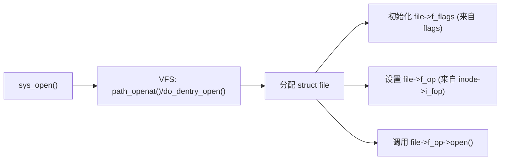
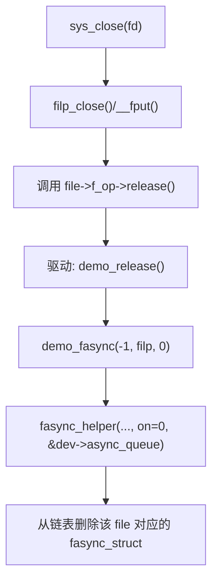
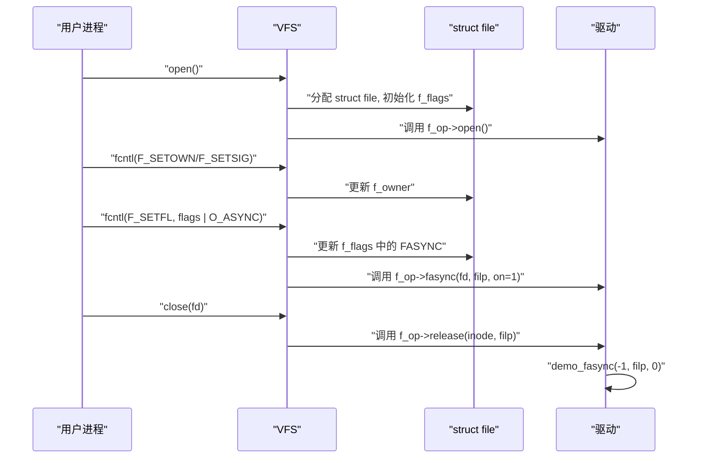
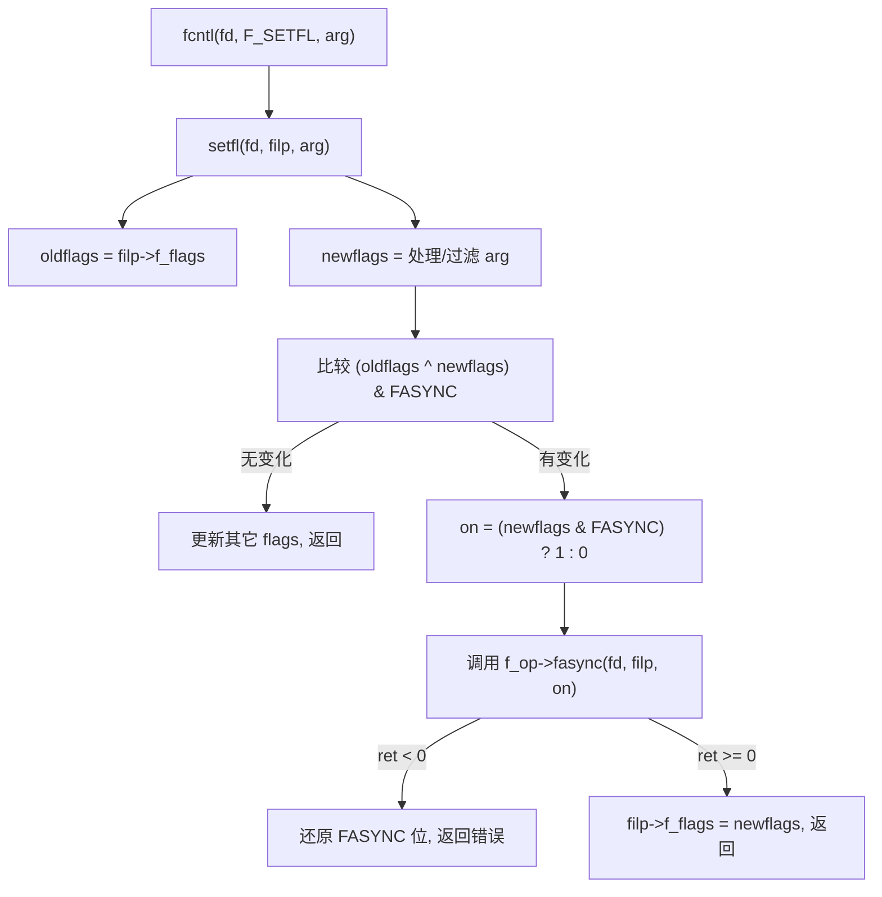
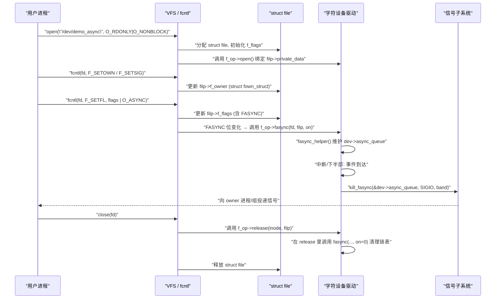

# 第 5 章 VFS 与文件系统中的异步通知支持

> **章节内容说明**
>  第 4 章从“数据结构 + 函数调用链”的角度说明了 fasync 在内核里的内部组织方式。本章换一个视角：
>
> - 从 VFS（Virtual File System）这一层，看 `FASYNC` 是如何在 **open / close / fcntl / 不同文件类型** 之间传播和生效的；
> - 让你理解：为什么同样是 `O_ASYNC`，在“普通文件、管道、socket、字符设备”上的行为差异这么大；
> - 为后面第 6 章“字符设备最小 fasync 模板”提供 VFS 背景。

------

## 5.1 VFS 打开/关闭路径中 `FASYNC` 的传播机制

> 本节目标：
>
> - 答清楚：**open 与 close 时，VFS 和文件系统对 `FASYNC`/`.fasync` 做了什么；**
> - 明确“谁负责初始化 `f_flags`、谁在 close 时触发清理”；
> - 给出与字符设备驱动最直接相关的那部分路径。

------

### 5.1.1 open()：`f_flags` 的初始化，但通常不触发 fasync

从用户态角度，`open()` 一般长这样：

```c
int fd = open("/dev/demo_async", O_RDONLY | O_NONBLOCK);
```

这个调用在内核会走到：

- `sys_openat()` → `do_sys_open()` → `do_filp_open()` → `path_openat()` → `do_dentry_open()` 这一整套 VFS 路径；
- 在 `do_dentry_open()` 中，会为新建的 `struct file` 填充 `f_flags`、`f_op` 等字段，并调用底层文件系统或字符设备驱动的 `.open()`。

关键点：

1. **`f_flags` 的初值来源是 open 的 `flags` 参数**
   - 例如 `O_RDONLY | O_NONBLOCK`；
   - 在字符设备场景下，这些标志会写入 `file->f_flags`；
   - 通常此时并不会主动设置 `FASYNC`，除非你在 `open()` 时就传 `O_ASYNC`。
2. **`open()` 阶段一般不会自动调用 `.fasync` 回调**
   - fasync 的“标准入口”是 `fcntl(F_SETFL)` 中 `FASYNC` 位发生变化时；
   - 虽然 open 时传 `O_ASYNC` 也有可能触发相关逻辑，但在多数实际使用中我们更推荐在 open 之后再做一次 `F_SETFL` 显式打开。
3. **对驱动来说，`.open()` 做的是“建立上下文”，不是“建立 fasync”**
   - 典型 `.open()` 做的事情包括：
     - 从 `inode` 找到设备实例结构体（`struct demo_dev`）；
     - 把 `dev` 塞进 `filp->private_data`；
     - 初始化 per-file 状态；
   - 不建议在 `.open()` 中手工修改 `FASYNC` 或维护 fasync 链表，这会与 VFS 设计冲突。

用一个简化图表示 open 阶段的角色分工：



此时，fasync 还处于“未激活”状态：`file->f_flags` 的 `FASYNC` 位通常为 0，`dev->async_queue` 也还是 NULL。

------

### 5.1.2 close()/release()：VFS 调用 `.release()`，驱动负责清理 fasync

当用户执行：

```c
close(fd);
```

内核侧路径大致是：

- `sys_close()` → `close_fd()` → `filp_close()` → `fput()` → `__fput()`；

在 `__fput()` 中，会调用 `file->f_op->release(inode, filp)`，然后释放 `struct file` 对象引用。

**这里有一个非常重要但容易忽略的事实：**

> VFS 不会自动帮你调用 `.fasync(..., on=0)` 来清理 fasync 链表；
>  它只会在 `F_SETFL` / `FASYNC` 位变化时调用 `.fasync`。
>  **close 时是否清理 fasync 节点，完全由驱动在 `.release()` 中负责。**

所以标准做法才是：

```c
static int demo_release(struct inode *inode, struct file *filp)
{
	/* 将该 file 对应的 fasync 节点从 dev->async_queue 中移除 */
	demo_fasync(-1, filp, 0);

	return 0;
}
```

对应的流程图：



若 `.release()` 忘记调用 `.fasync(..., 0)`，会导致：

- fasync 链表里还残留该 file 对应的节点；
- 之后任何 `kill_fasync()` 的调用都有可能试图向已经关闭/退出的进程发信号；
- 在竞态激烈的场景下甚至可能导致 UAF 类 bug。

------

### 5.1.3 VFS 不关心“设备是什么”，只关心“file 与 f_op 的约定”

从 VFS 视角看，open/close 路径是统一的：

- 对普通文件、目录、字符设备、块设备、Socket、管道等，**open/close 的 VFS 框架是一致的**；
- 区别在于 `inode->i_fop` 中挂的是哪个 `struct file_operations`，也就是 `.open`、`.release`、`.fasync` 等是由谁实现的。

这意味着：

- VFS 不关心 fasync 到底怎么用，也不关心 `kill_fasync()` 在何时被调用；
- 它只负责在 `F_SETFL` / `close()` 等通用操作中调用你提供的 `.fasync` / `.release`；
- “fasync 在字符设备里怎么做”、“在 pipe/socket 里怎么做”，由各自的子系统代码决定。

从驱动作者角度，重要的是：

1. 在 `.open()` 中建立 `filp->private_data` 与设备实例的绑定；
2. 在 `.fasync` 中通过 `fasync_helper()` 维护 `dev->async_queue`；
3. 在 `.release()` 中确保调用 `.fasync(..., 0)` 清理状态。

VFS 会保证：

- `open()` 被执行一次（或在错误时回滚）；
- `release()` 在最后一个 fd 关闭时被执行一次；
- `F_SETFL` 中 `FASYNC` 变化时，`.fasync` 被调用相应次数。

------

### 5.1.4 与 `fcntl(F_SETFL)` 的协作：`FASYNC` 从 VFS 到驱动

虽然本小节主题是“open/close”，但为了完整把握 VFS 的角色，需要把 `F_SETFL` 一起放到时序里，形成完整图像：



也就是说：

- open：**建立 file 与驱动的关系**；
- `F_SETFL(O_ASYNC)`：**通过 `.fasync` + `fasync_helper()` 建立“file → fasync 链表”关系**；
- close：**通过 `.release` + `.fasync(..., 0)` 删除“file → fasync 链表”关系**。

------

### 5.1.5 小结：VFS 在 open/close 中对 fasync 的“有限参与”

小结这一节，可以归纳为：

1. **open 阶段**
   - VFS 分配并初始化 `struct file`；
   - 设置 `file->f_flags`（来自 open 的 flags）；
   - 调用 `file->f_op->open()`；
   - **一般不主动触发 `.fasync`**。
2. **close 阶段**
   - VFS 走 `filp_close()` / `fput()` / `__fput()`；
   - 调用 `file->f_op->release()`；
   - **是否清理 fasync 链表由驱动在 `.release()` 中负责**（调用 `.fasync(..., 0)`）。
3. **VFS 不决定 fasync 的内部行为，只负责在合适的时机回调驱动**
   - fasync 的“订阅建立/删除”完全通过 `.fasync` + `fasync_helper()`；
   - 具体何时调用 `kill_fasync()` 也由驱动决定。

掌握这一点后，你在看 VFS 源码时就不会迷路：**把 open/close 看成“fd 生命周期管理层”，把 fasync 看成“驱动与信号之间的辅助层”，两者通过 `.fasync` / `.release` 松散耦合。**


------

## 5.2 `fcntl(F_SETFL)` 与 `O_ASYNC/FASYNC` 的交互

> 本节目标：
>
> - 把第 2 章里用户态 `fcntl(F_SETFL)` 的行为，和 VFS 内部的 `setfl()` / `.fasync` 调用路径一一对上；
> - 讲清楚：**“什么时候会调用 `.fasync`、`on` 是怎么来的、`file->f_flags` 是怎么更新的”**；
> - 为后面调试“FASYNC 已设置但 `.fasync` 没被调用”这类问题提供坚实基础。

------

### 5.2.1 用户视角回顾：`F_SETFL` 做了什么

典型用户态调用模式，再回顾一次（这是后面所有内容的起点）：

```c
int flags = fcntl(fd, F_GETFL);
flags |= O_ASYNC;          /* 想开启异步通知 */
if (fcntl(fd, F_SETFL, flags) == -1) {
    perror("fcntl(F_SETFL)");
}
```

从 POSIX / man-page 的语义来看：

- `F_GETFL`：返回当前 `file->f_flags`；
- `F_SETFL`：
  - 在用户态看，就是“设置各种 `O_*` 标志”；
  - 在内核看，则是：**修改 `file->f_flags`，并在必要时触发 `.fasync`、`.flush` 等回调**。

本节主要就是拆解内核对 `F_SETFL` 的处理逻辑。

------

### 5.2.2 内核视角：`fcntl()` → `setfl()` → `.fasync`

在内核中，`fcntl()` 的实现大致结构是（只保留相关部分，基于 `fs/fcntl.c`）：

```c
SYSCALL_DEFINE3(fcntl, unsigned int, fd, unsigned int, cmd, unsigned long, arg)
{
	struct fd f = fdget(fd);
	long err = -EBADF;

	if (!f.file)
		goto out;

	switch (cmd) {
	case F_SETFL:
		err = setfl(fd, f.file, arg);
		break;
	/* 其它 cmd 略 */
	}

	/* ... */
}
```

`setfl()` 是真正处理 `F_SETFL` 的函数，其典型逻辑可以概括为：

1. 从 `file->f_flags` 读出旧标志 `oldflags`；
2. 根据用户传入的 `arg` 合理地构造新标志 `newflags`（掐掉不允许修改的位，只保留如 `O_APPEND`、`O_NONBLOCK`、`O_ASYNC` 等可改动标志）；
3. **比较新旧 `O_ASYNC/FASYNC` 的差异**，如果发生变化：
   - 计算 `on = (newflags & FASYNC) ? 1 : 0`；
   - 调用 `file->f_op->fasync(fd, filp, on)`；
4. 若 `.fasync` 调用失败（返回负值），回滚 `file->f_flags`；
5. 否则，更新 `file->f_flags = newflags`。

可以用一个逻辑流程图表示：



**关键点：**

- `.fasync` 回调只在 `FASYNC` 位发生变化时调用；
- `.fasync` 失败时，内核会回滚 `FASYNC` 位，保持 `file->f_flags` 状态与驱动一致；
- `file->f_flags` 只通过 VFS/文件系统修改，驱动不应直接篡改该位。

------

### 5.2.3 `O_ASYNC` / `FASYNC` 的转换关系

用户态看到的是 `O_ASYNC`，内核内部使用的是 `FASYNC`。在多数架构上二者数值相同，但语义层面有一个转换：

- `O_ASYNC`：用户态宏，在 libc / 应用程序中使用；
- `FASYNC`：内核内部使用的标志，用在 `file->f_flags` 中以及 `setfl()` 逻辑。

在 `setfl()` 里，大致会有类似代码（示意）：

```c
int setfl(int fd, struct file *filp, unsigned long arg)
{
	unsigned int oldflags = filp->f_flags;
	unsigned int flags;

	/* 基于 arg 构造新的 flags，屏蔽掉不可改变的位 */
	flags = arg;
	/* ... 屏蔽 O_RDONLY/O_WRONLY/O_RDWR 等访问模式位 ... */
	/* ... 保留 O_APPEND/O_NONBLOCK/O_ASYNC 等 ... */

	/* 用 newflags 替换旧的可修改部分 */
	unsigned int newflags = (oldflags & ~SETTABLE_MASK) | (flags & SETTABLE_MASK);

	/* 如果 FASYNC 位发生了变化，则调用 .fasync */
	if ((newflags ^ oldflags) & FASYNC) {
		int on = (newflags & FASYNC) != 0;
		int ret;

		if (filp->f_op->fasync) {
			ret = filp->f_op->fasync(fd, filp, on);
			if (ret < 0)
				return ret;
		}
	}

	filp->f_flags = newflags;
	return 0;
}
```

你在阅读内核源码时见到的形式可能与上述伪代码略有出入，但逻辑核心是一样的：**通过 `newflags` 与 `oldflags` 的异或判断 FASYNC 是否变化，再调用 `.fasync`**。

------

### 5.2.4 开发者视角：`.fasync` 如何感知“打开/关闭 FASYNC”

前面章节已经分析过 `.fasync(fd, filp, on)` 的含义，这里再结合 `F_SETFL` 的 context 进行一次总结合并：

- 当用户执行 `flags |= O_ASYNC; fcntl(fd, F_SETFL, flags);` 时：
  - 若之前 `file->f_flags` 中 `FASYNC == 0`：
    - `newflags` 的 `FASYNC` 位会变为 1；
    - `on = 1`；
    - 内核调用 `.fasync(fd, filp, 1)`，驱动应通过 `fasync_helper()` 将 `filp` 添加进 fasync 链表。
- 当用户执行 `flags &= ~O_ASYNC; fcntl(fd, F_SETFL, flags);` 时：
  - 若之前 `file->f_flags` 中 `FASYNC == 1`：
    - `newflags` 的 `FASYNC` 位会变为 0；
    - `on = 0`；
    - 内核调用 `.fasync(fd, filp, 0)`，驱动应通过 `fasync_helper()` 将对应节点从链表中移除。
- 当用户重复设置同一状态（例如已经有 `O_ASYNC` 再设置一次）：
  - `newflags` 与 `oldflags` 在 `FASYNC` 位上没有差异；
  - `.fasync` **不会被调用**。

因此，对驱动来说，可以做这样的心理映射：

```text
on == 1  →  “这个 filp 刚刚启用了 FASYNC，请把它加入 async_queue”
on == 0  →  “这个 filp 刚刚关闭了 FASYNC，请把它从 async_queue 中删除”
```

进一步，对 `.release()` 的行为也可以理解为：

- close 时，VFS 不会再帮你触发 FASYNC 位变化，因此不会自动调用 `.fasync(..., 0)`；
- 所以驱动在 `.release()` 中主动调用一次 `.fasync(-1, filp, 0)`，相当于**模拟了“FASYNC 从 1 变 0”** 的效果，把残留节点删除。

------

### 5.2.5 调试视角：如何验证 `.fasync` 是不是因为 `F_SETFL` 被调用

在实际调试中，如果遇到“驱动 `.fasync` 从来没被调过”的情况，可以从以下几个角度排查：

1. **确认用户态确实调用了 `F_SETFL` 并带有 `O_ASYNC`**

   - 使用 `strace` 抓用户程序：

     ```sh
     strace -e fcntl ./demo_user
     ```

   - 确认有类似：

     ```text
     fcntl(fd, F_GETFL)   = ...
     fcntl(fd, F_SETFL, flags|O_ASYNC) = 0
     ```

   - 若 `F_SETFL` 失败返回 `-1`，说明 `.fasync` 可能返回了错误。

2. **在 `.fasync` 中加日志**（仅调试用）

   ```c
   static int demo_fasync(int fd, struct file *filp, int on)
   {
       struct demo_dev *dev = filp->private_data;
       int ret;
   
       pr_info("demo_fasync: fd=%d, on=%d, f_flags=0x%x\n",
               fd, on, filp->f_flags);
   
       ret = fasync_helper(fd, filp, on, &dev->async_queue);
       if (ret < 0)
               return ret;
   
       return 0;
   }
   ```

   - 若 `strace` 显示 `F_SETFL` 成功，但内核日志没有输出，说明可能：
     - 该文件类型没有实现 `.fasync`（`file->f_op->fasync == NULL`）；
     - 或者某些文件系统的 `setfl()` 路径并不支持 FASYNC（普通文件基本如此）。

3. **确认 `setfl()` 没有提前过滤掉 `O_ASYNC`**

   - 某些文件系统或特殊 fd 可能拒绝设置异步通知；
   - 比如某些 pseudo-fs 只允许部分标志生效。

------

### 5.2.6 不同文件类型上的 `F_SETFL(O_ASYNC)` 行为差异（预告）

这一小节先简单埋个钩子，后面 5.3 会展开：

> **同样是 `F_SETFL(O_ASYNC)`，在不同类型文件上的效果很不一样，关键在于：底层 `file_operations` 是否实现了 `.fasync`，以及文件系统/子系统是否愿意支持它。**

例如：

- **普通磁盘文件**（ext4 等）：
  - 一般不会实现 `.fasync`；
  - `F_SETFL(O_ASYNC)` 会成功还是失败，取决于文件系统；
  - 即便成功，通常也不会收到 SIGIO。
- **管道/Socket**：
  - 内核 socket 层有较完整的 fasync 支持；
  - `F_SETFL(O_ASYNC)` 后，收到网络数据/写端关闭等事件时，会产生 SIGIO/SIGURG 等。
- **字符设备**：
  - 是否支持，完全取决于该驱动是否实现 `.fasync` + `kill_fasync()`；
  - 你写的 demo 驱动就属于这一类。

后续 5.3 会系统对比这几类行为差异。

------

### 5.2.7 小结：`F_SETFL` 是 fasync 的“真正开关”

本节可以用几句话收束：

1. `fcntl(F_SETFL)` 是 **唯一标准路径** 来打开/关闭 `file->f_flags` 中的 `FASYNC` 位；
2. `setfl()` 在 `FASYNC` 位变化时调用 `file->f_op->fasync(fd, filp, on)`：
   - `on = 1`：启用异步通知；
   - `on = 0`：关闭异步通知；
3. `.fasync` 中应调用 `fasync_helper(fd, filp, on, &dev->async_queue)` 来维护链表，错误时将错误码向上返回，让 `F_SETFL` 失败；
4. VFS 会根据 `.fasync` 返回值决定是否真正更新 `file->f_flags` 中的 `FASYNC`；
5. close 时**不会自动触发 `.fasync(..., 0)`**，驱动必须在 `.release()` 中手工调用一次，以避免悬挂 `fasync_struct` 节点。

理解了这一层，你就可以在源码层面对 `F_SETFL` 与 `.fasync` 的关系进行完整推理，并能在调试时判断问题出在用户态调用、VFS 逻辑，还是驱动 `.fasync` 的实现。


------

## 5.3 各类文件（常规文件、管道、socket、字符设备）的行为差异

> 本节目标：
>
> - 用统一视角对比：**同样是 `F_SETOWN` + `F_SETSIG` + `F_SETFL(O_ASYNC)`，在不同文件类型上的实际效果**；
> - 说明“哪些类型几乎不支持 fasync，哪些子系统大量使用 fasync”；
> - 帮你把“fasync 是字符设备特有东西吗？”这个直觉纠正成“**通用机制 + 各子系统选择性实现**”。

------

### 5.3.1 引入：统一接口，不同后端

站在用户态看，fasync 的配置接口是统一的：

- `fcntl(fd, F_SETOWN, ...)`
- `fcntl(fd, F_SETSIG, ...)`
- `fcntl(fd, F_SETFL, flags | O_ASYNC)`

但 `fd` 背后的对象可能是：

- 普通文件（ext4 上的一个 `.log`）；
- FIFO/匿名管道；
- socket（TCP/UDP）；
- 字符设备（串口、GPIO、中断型设备等）；
- 甚至是 eventfd、signalfd 等特殊 fd。

VFS 对所有 fd 用的是同一套 `fcntl()` 框架，但**真正的行为取决于**：

1. 这个 fd 对应的 `file->f_op` 是否实现 `.fasync`；
2. 该子系统是否在适当时机调用 `kill_fasync()`。

下面按类型拆开讲。

------

### 5.3.2 常规文件（普通文件）的 fasync 行为

**典型场景**：ext4 上的 `/home/leaf/data.bin` 用 `open()` 打开。

特点：

1. 多数普通文件的 `file_operations` **没有实现 `.fasync`**
   - `F_SETFL(O_ASYNC)` 要么返回成功但不产生任何信号，要么被底层拒绝（实际行为取决于文件系统实现）；
   - 即使成功，你几乎不会看到内核给你发 SIGIO。
2. 设计原因：
   - 普通文件 I/O 通常由页缓存、块层异步提交控制；
   - 面向“异步 I/O”的主流方案是 POSIX AIO、`io_uring`、直接 `O_DIRECT` + 多线程，而不是通过 SIGIO；
   - fasync 机制在常规文件上不具备明显优势，反而让内核路径复杂。
3. 对开发者的结论：
   - **不要期望对普通文件启用 fasync 后能收到 SIGIO**；
   - 如果你想对普通文件做异步 I/O，应该优先考虑 `io_uring` / AIO 或使用多线程 + 阻塞 I/O。

简短记忆：**“普通文件几乎不玩 fasync，这块你可以直接当做不支持。”**

------

### 5.3.3 管道 / FIFO：读写两侧的 fasync

**场景**：

- 匿名管道：`pipe()` 创建的 fd；
- 有名管道：`mkfifo()` 创建的节点。

内核中它们会走到 `pipe_inode_info` 这一套结构，里面有：

```c
struct pipe_inode_info {
	/* ... */
	struct fasync_struct	*fasync_readers;
	struct fasync_struct	*fasync_writers;
	/* ... */
};
```

特点：

1. **读端 / 写端分别维护 fasync 队列**
   - 读端有自己的 `fasync_readers`；
   - 写端有自己的 `fasync_writers`；
   - 当缓冲区从“不可读 → 可读”或“不可写 → 可写”等状态发生变化时，对应一侧会调用 `kill_fasync()`。
2. 典型行为：

- 读端启用 `O_ASYNC`：
  - 当有新数据写入管道时，会收到 SIGIO，`band` 通常含 `POLL_IN`；
- 写端启用 `O_ASYNC`：
  - 当缓冲区变得可写（例如读端消耗了数据、或读端关闭导致 `SIGPIPE`/错误）时，可产生通知（具体语义视内核版本和实现）。

1. 从用户角度看：

- 对管道使用 fasync 是“**历史上比较多见，但现在常被 poll/epoll 取代**”的一种玩法；
- 管道本身是“流式”，状态变化频繁，配合 SIGIO 容易出现“信号风暴”；
- 在现代工程中，如果你已经打算统一用 `epoll`/`signalfd` 等，一般不会再对管道单独搞 fasync。

简短记忆：**“管道支持 fasync，但更适合用 poll/epoll 管它。”**

------

### 5.3.4 Socket：网络栈中大量使用 fasync

**场景**：

- `socket()` 创建的 TCP/UDP fd；
- 套接字上调用 fcntl 配置 fasync。

在网络栈实现中，可以看到类似：

- `struct socket { struct fasync_struct *fasync_list; ... }`
- 某些路径使用 `sock_fasync()` 注册/注销 fasync；
- 数据到达、可写、错误发生时，调用 `sock_wake_async()` → `kill_fasync()`。

特点：

1. **socket 是 fasync 使用最重的“内核子系统之一”**
   - 支持 `SIGIO` / `SIGURG` 等多种信号；
   - 支持对不同事件类型使用不同 `band` 值（如 `POLL_IN`、`POLL_OUT`、`POLL_ERR`、`POLL_PRI` 等）。
2. 常见行为模式：

- 对 socket 启用 fasync：
  - 新数据到达 → 内核给 owner 发 SIGIO（`si_band` 包含 `POLL_IN`）；
  - socket 可写（缓冲区从满变成有空间） → 可能发 SIGIO，`si_band` 带 `POLL_OUT`；
  - out-of-band 数据（TCP OOB） → `SIGURG` 或 `SIGIO` with `POLL_PRI`；
  - 错误/断开 → `POLL_ERR`，也可能伴随 `POLL_HUP`。

1. 用户态使用现状：

- 早期很多网络程序（特别是老式服务器/守护进程）会用 SIGIO 来驱动 I/O；
- 现代主流服务器/网络程序则更偏向使用 `epoll`/`kqueue` 等事件循环；
- 但 socket 层的 fasync 机制仍在使用（例如与 `F_SETOWN`/`F_SETSIG` 结合，用于少量 fd 的异步告警）。

简短记忆：**“socket 对 fasync 的支持是内核级一等公民，这也是 SIGIO 最早的主战场。”**

------

### 5.3.5 字符设备：你写的驱动可以决定一切

**场景**：

- `/dev/ttyS0`、`/dev/input/event*`、`/dev/gpiochip*` 等字符设备；
- 你未来编写的 `/dev/demo_async` 这类自定义设备。

特点：

1. **是否支持 fasync，完全由驱动自己决定**

- 驱动完全可以不实现 `.fasync`，此时 `F_SETFL(O_ASYNC)` 要么失败，要么静默成功但不会有任何通知；
- 驱动实现 `.fasync` + `kill_fasync()` 后，这个字符设备就具备完整的“SIGIO 异步通知”能力。

1. 典型模式（你会在第 6 章完整实现）：

- 设备结构体里放 `struct fasync_struct *async_queue;`；
- `.fasync(fd, filp, on)` 里调用 `fasync_helper()` 维护链表；
- `.release()` 里调用 `.fasync(..., 0)` 清理；
- 中断/下半部/定时器等事件发生时调用 `kill_fasync(&dev->async_queue, SIGIO, POLL_IN)`。

1. 与 socket/pipe 等系统原生对象相比：

- socket/pipe 的 fasync 由网络栈 / pipe 子系统统一处理，驱动工程师通常不“碰”那部分实现；
- 字符设备的 fasync 则是驱动工程师需要亲手写出来的部分；
- 好处是：你可以在设备的上下文中更细粒度控制通知策略（节流、聚合、阈值等）。

简短记忆：**“字符设备的 fasync 支持是驱动作者的舞台——你写多少，就有多少。”**

------

### 5.3.6 行为差异对比表

为方便回顾，本节给一个简单对比表：

| 文件类型    | `.fasync` 是否常见 | 典型 SIGIO 行为                     | 常见替代方案                  | 适合用 fasync 的典型场景                      |
| ----------- | ------------------ | ----------------------------------- | ----------------------------- | --------------------------------------------- |
| 普通文件    | 几乎没有           | 几乎不会收到 SIGIO                  | `io_uring` / AIO / 线程+阻塞  | 一般不推荐，几乎不使用                        |
| 管道 / FIFO | 有（读/写分队列）  | 数据到达 / 可写时触发               | `select` / `poll` / `epoll`   | 少量 fd，简化代码，但易信号风暴               |
| socket      | 非常常见           | 数据到达、可写、OOB、错误等各类事件 | `epoll` / `select`            | 旧式网络服务、小规模 fd 的异步通知            |
| 字符设备    | 视驱动而定         | 设备事件发生时由驱动控制            | `poll` / `read` + `waitqueue` | 外部事件输入、中断型设备、控制事件/告警类设备 |

这张表主要强调两点：

1. fasync 是一个 **“VFS + 信号子系统 + 各子系统驱动”共同组成的机制**，并不是“驱动私有小玩具”；
2. 对你作为驱动开发者来说，**真正要操心的是“字符设备这一列”**，其他列更多是理解现有内核行为、而不是自己去写那部分实现。

------

### 5.3.7 小结：fasync 在不同文件类型上的“存在感”

本节可以用一组“印象句”收束：

- 普通文件：**几乎当作不支持 fasync**；
- 管道/FIFO：**有 fasync 能力，但实务上多用 poll/epoll**；
- socket：**fasync 的传统主战场之一**，但现代服务普遍转向 epoll 等；
- 字符设备：**fasync 能否可用、语义是否清晰，全看你这个驱动怎么写。**

这也解释了为什么学习 fasync 时，大部分教材/资料会以“字符设备 + 中断驱动”为例：这里的行为可控、易于实验验证，也最贴近你在实际嵌入式系统中的需求。

------

## 5.4 字符设备与 `.fasync` 回调的注册与调用时机

> 本节目标：
>
> - 站在“字符设备驱动作者”的视角，梳理 `.fasync` 是如何“注册”给 VFS 的；
> - 指明 `.fasync` 在**什么时机**会被 VFS 调用（open/close/`F_SETFL` 这几个阶段各自扮演什么角色）；
> - 给出一个可以直接套用的“最小骨架”，为第 6 章的完整 demo 做准备。

------

### 5.4.1 引入：从 `cdev` 注册到 `.fasync` 生效

写字符设备驱动的标准套路你已经很熟悉了：

1. 分配并初始化 `struct cdev`；
2. 填写 `struct file_operations`；
3. 调用 `cdev_init()` + `cdev_add()` 把 `cdev` 注册到内核；
4. 配合 `register_chrdev_region()` / `alloc_chrdev_region()` 和 `device_create()` 在 `/dev/` 下创建设备节点。

在这个过程中，**你在 `file_operations` 中填的 `.fasync` 就是 VFS 将来调用 fasync 逻辑的入口**：

```c
static const struct file_operations demo_fops = {
	.owner		= THIS_MODULE,
	.open		= demo_open,
	.release	= demo_release,
	.read		= demo_read,
	.poll		= demo_poll,
	.fasync		= demo_fasync,	/* 关键：在这里挂钩 */
};
```

一旦这个 `file_operations` 被挂在某个 `inode->i_fop` 上，对应路径下的 `open()` 得到的 `file->f_op` 就包含你的 `.fasync`，后续 `F_SETFL(O_ASYNC)` 时 VFS 就会调用它。

------

### 5.4.2 “注册 `.fasync`” 的真正含义

从代码角度看，“注册 `.fasync`”其实就是：

1. 在 `struct file_operations` 里提供一个函数指针；
2. 在设备初始化的时候，把这个 `file_operations` 挂给 `cdev`（`cdev_init(&cdev, &demo_fops);`）；
3. VFS 在 `open()` 时将 `inode->i_fop` 拷贝到 `file->f_op`。

没有额外“fasync 专门注册 API”，所有的注册动作都发生在 `cdev/file_operations` 这一套标准框架里。这意味着：

- 如果你漏填 `.fasync`，那么对该字符设备调用 `F_SETFL(O_ASYNC)` 时：
  - `setfl()` 会发现 `file->f_op->fasync == NULL`；
  - 即便 `FASYNC` 位设置成功，后端也不会有任何驱动侧链表建立行为；
  - 结果就是：**不会有任何 SIGIO**。

总结一句话：

> **“注册 `.fasync`”的唯一动作就是：在 `file_operations` 里填上它。**

------

### 5.4.3 `.fasync` 的调用时机：只在 FASYNC 位变化时

在字符设备场景下，`.fasync` 的调用时机与上一节 5.2 的分析一致，但这里再用“字符设备”的语言重述一遍：

#### 1）open 时

- 一般情况下，open 不会调用 `.fasync`；
- 即便你在 `open()` 传入了 `O_ASYNC`，实际是否在 open 路径中触发 `.fasync`，取决于文件系统/字符设备的实现，但**标准做法并不依赖 open 阶段**；
- 你可以把 open 看作“建立上下文”的阶段，不是“建立 fasync”的阶段。

#### 2）`fcntl(F_SETFL)` 时

- 当用户执行 `F_SETFL` 并提出新的 flags 时：
  - VFS 算出 `newflags`；
  - 比较新旧 `file->f_flags` 的 `FASYNC` 位；
  - 若有变化：
    - 算出 `on = (newflags & FASYNC) ? 1 : 0`；
    - 调用 `.fasync(fd, filp, on)`。

对驱动来说，这相当于收到“**从 off→on 或 from on→off**”的通知。

#### 3）close / `.release()` 时

- close 本身不会自动触发 `.fasync`；
- 驱动应在 `.release()` 中手动调用一次 `.fasync(-1, filp, 0)`，以确保“最后一个引用被关闭时，该 file 对应的 fasync 节点一定被删除”；
- 也就是说，这是驱动自己模拟了“**FASYNC 从 1 变为 0**”的过程。

因此，从“调用时机”角度记住一句就够：

> **“`.fasync` 只在 FASYNC 状态变化时被调用，而 close 时的那次变化需要你自己在 `.release()` 里用 `.fasync(..., 0)` 主动触发。”**

------

### 5.4.4 字符设备最小骨架：含 `.fasync` 的完整路径

下面给一个“包含 `.fasync` 的最小骨架”，你可以直接改名移植到后面章节。
 （这里先略去 `devm`，第 6 章再补“devm vs 非 devm”的版本对比。）

```c
/* demo_async_drv.c */

#include <linux/module.h>
#include <linux/fs.h>
#include <linux/cdev.h>
#include <linux/uaccess.h>
#include <linux/slab.h>

#define DEMO_DEV_NAME		"demo_async"
#define DEMO_MAX_BUF_LEN	256

struct demo_dev {
	struct cdev		cdev;		/* 字符设备结构体 */
	struct fasync_struct	*async_queue;	/* fasync 链表头 */
	char			data[DEMO_MAX_BUF_LEN];
	size_t			data_len;
	spinlock_t		lock;		/* 保护 data/data_len 等 */
};

static dev_t demo_devno;
static struct demo_dev *demo_device;

/* fasync 回调：维护 async_queue */
static int demo_fasync(int fd, struct file *filp, int on)
{
	struct demo_dev *dev = filp->private_data;
	int ret;

	ret = fasync_helper(fd, filp, on, &dev->async_queue);
	if (ret < 0)
		return ret;

	return 0;
}

/* open：建立 filp 与 demo_dev 的绑定 */
static int demo_open(struct inode *inode, struct file *filp)
{
	struct demo_dev *dev;

	dev = container_of(inode->i_cdev, struct demo_dev, cdev);
	filp->private_data = dev;

	return 0;
}

/* release：确保关闭时从 fasync 链表中删除该 file 对应的节点 */
static int demo_release(struct inode *inode, struct file *filp)
{
	/* 模拟“关闭 FASYNC”：on=0 */
	demo_fasync(-1, filp, 0);

	return 0;
}

/* read：仅示意，用于后续配合 SIGIO 实验 */
static ssize_t demo_read(struct file *filp, char __user *buf,
			 size_t count, loff_t *ppos)
{
	struct demo_dev *dev = filp->private_data;
	size_t to_copy;
	unsigned long flags;

	spin_lock_irqsave(&dev->lock, flags);

	if (dev->data_len == 0) {
		spin_unlock_irqrestore(&dev->lock, flags);
		return 0;
	}

	to_copy = min(count, dev->data_len);
	if (copy_to_user(buf, dev->data, to_copy)) {
		spin_unlock_irqrestore(&dev->lock, flags);
		return -EFAULT;
	}

	dev->data_len = 0;

	spin_unlock_irqrestore(&dev->lock, flags);

	return to_copy;
}

/* 假设有某个地方会写入数据并调用 kill_fasync()，后面章节补齐 */

static const struct file_operations demo_fops = {
	.owner		= THIS_MODULE,
	.open		= demo_open,
	.release	= demo_release,
	.read		= demo_read,
	.fasync		= demo_fasync,
};

static int __init demo_init(void)
{
	int ret;

	/* 1. 分配设备号 */
	ret = alloc_chrdev_region(&demo_devno, 0, 1, DEMO_DEV_NAME);
	if (ret < 0)
		return ret;

	/* 2. 分配并初始化设备结构体 */
	demo_device = kzalloc(sizeof(*demo_device), GFP_KERNEL);
	if (!demo_device) {
		unregister_chrdev_region(demo_devno, 1);
		return -ENOMEM;
	}

	spin_lock_init(&demo_device->lock);

	/* 3. 初始化 cdev 并注册 */
	cdev_init(&demo_device->cdev, &demo_fops);
	demo_device->cdev.owner = THIS_MODULE;

	ret = cdev_add(&demo_device->cdev, demo_devno, 1);
	if (ret < 0) {
		kfree(demo_device);
		unregister_chrdev_region(demo_devno, 1);
		return ret;
	}

	pr_info("demo_async: registered at major=%d minor=%d\n",
		MAJOR(demo_devno), MINOR(demo_devno));

	return 0;
}

static void __exit demo_exit(void)
{
	cdev_del(&demo_device->cdev);
	kfree(demo_device);
	unregister_chrdev_region(demo_devno, 1);
}

module_init(demo_init);
module_exit(demo_exit);

MODULE_LICENSE("GPL");
MODULE_AUTHOR("demo");
MODULE_DESCRIPTION("Demo async notification char device");
```

后续章节（第 6 章）会在这个骨架上加上：

- 中断/下半部模拟（或软实现）事件来源；
- `kill_fasync()` 调用位置；
- `.poll` 的实现以保证与 SIGIO 一致的状态语义；
- devm 与非 devm 两种版本对比。

当前这一小节主要是让你看到：**“注册 `.fasync`”其实只是 `file_operations` 结构中的一个函数指针，但通过它可以接上 VFS 的 fasync 机制。**

------

### 5.4.5 `.fasync` 与 `.poll` / `.read` 的时序关系（预热）

虽然真正的详细讨论要到 **6.5** 才展开，这里先给一点“预热式”的提示：

- `.fasync` 只管“**建立/删除订阅**”；
- `.poll` / `.read` 决定“**事件何时被视为就绪、何时消耗事件**”；
- `kill_fasync()` 通常在“设备状态刚刚变为可读/可写”这一刻调用；
- 为了避免“信号说有数据但 poll/read 说没数据”的矛盾，你需要保证：
  - `kill_fasync()` 调用之前，设备的内部状态已经更新为“poll/read 看起来也是可读”；
  - `kill_fasync()` 调用之后，即使用户还没立刻来 read/poll，也不会“把状态改回不可读”。

这些属于“**状态一致性**”问题，本章只是点名，后面会具体设计一个例子来说明。

------

### 5.4.6 小结：字符设备与 `.fasync` 的粘合点

本节可以用几点总结：

1. **“注册 `.fasync`” = 在 `file_operations` 填上 `.fasync` 函数指针，并通过 `cdev`/`inode` 绑定到 `file`**；
2. `.fasync` 的调用时机由 VFS 决定：
   - 只在 `FASYNC` 位变化时（主要通过 `F_SETFL(O_ASYNC)`）调用；
   - close 时不会自动触发，需要驱动在 `.release()` 中主动调用 `.fasync(..., 0)` 清理链表；
3. 字符设备是否支持 fasync 完全由驱动决定：
   - 不实现 `.fasync` 就等于“这个设备没有 fasync 能力”；
   - 实现 `.fasync` + `kill_fasync()` 就可以把 fasync 融入自己的事件模型；
4. 一个最小可用的字符设备 fasync 骨架基本只需做三件事：
   - 设备结构体里有 `struct fasync_struct *async_queue`;
   - `.fasync` 中调用 `fasync_helper()` 维护它；
   - `.release` 中调用 `.fasync(..., 0)` 确保关闭时清理。

到这里，**VFS 视角 + 字符设备视角**就已经对齐了：你可以清楚地说明 fasync 在字符设备路径里“哪里挂钩、什么时候被调用、谁负责清理”。


------

## 5.5 特定文件系统/驱动中对异步通知的扩展实现概览

> 本节目标：
>
> - 说明一些典型子系统（tty、socket、pipe、专用字符设备）是如何在“通用 fasync 机制”之上做扩展的；
> - 帮你建立一个概念：**fasync 是统一骨架，每个子系统可以挂上自己的语义和策略**；
> - 为后面挑内核源码阅读对象（“从哪里下手看 demo”）提供导航。

这一节不再铺开所有源码细节，而是做“地图式总览”。真正细啃时，你可以按这里给的线索去搜对应的 `.c` 文件和结构体。

------

### 5.5.1 TTY/串口子系统：典型的“复合语义”扩展

**TTY（包括串口、虚拟终端等）**是典型的“味道很重”的 fasync 使用者：

1. **fasync 队列挂在 `struct tty_struct` 上**

   你会在 TTY 相关结构里看到类似成员：

   ```c
   struct tty_struct {
   	/* ... */
   	struct fasync_struct *fasync;	/* 异步通知队列 */
   	/* ... */
   };
   ```

   - `.fasync` 回调通常是 `tty_fasync()`，内部调用 `fasync_helper(fd, filp, on, &tty->fasync)`；
   - 事件发生时则调用 `kill_fasync(&tty->fasync, SIGIO, band)`。

2. **扩展语义：按不同事件类型设置 band**

   对于 TTY/串口来说，“有事件”不止一种：

   - 缓冲区中有可读数据；
   - 输出缓冲区有可写空间；
   - modem 状态变化（DCD、CTS 等）；
   - 突发错误、挂起等。

   因此，TTY 代码中会根据事件类型，传不同的 `band` 比特组合给 `kill_fasync()`，例如 `POLL_IN`、`POLL_OUT`、`POLL_PRI`、`POLL_ERR` 等。用户态在 SIGIO handler 中通过 `si_band` 可以区分不同类型事件（或用 `signalfd` 统一处理）。

3. **与 line discipline（行规程）的互动**

   TTY 层还有 line discipline（如 N_TTY）的概念，会对原始数据进行行缓冲、回显、转义等处理，因此可读性和事件语义受到行规程影响。fasync 通知往往是在行规程处理完后才认为“对用户真正可读”。

对于你以后看代码的建议：

- 读 TTY 的 `.fasync` / `kill_fasync` 路径，可以看到比较复杂但很完整的 fasync 使用方式，适合作为“丰富场景的参考样本”。

------

### 5.5.2 网络 socket：`sock_fasync()` / `sock_wake_async()`

前面 5.3 已经提过：**socket 是 fasync 的传统主战场**。稍微总结一下典型扩展点：

1. **统一封装：`sock_fasync()`**

   网络栈提供了一个通用封装（名字在不同版本略有差异），用于在 socket 层统一操作 fasync 队列，比如：

   ```c
   int sock_fasync(int fd, struct file *filp, int on, struct socket *sock)
   {
   	return fasync_helper(fd, filp, on, &sock->fasync_list);
   }
   ```

   - 好处是：不同协议族（TCP/UDP/UNIX 域）都可以用这一套；
   - 所有 socket 共用 `struct socket` 中的 `fasync_list` 队列。

2. **事件统一入口：`sock_wake_async()`**

   当 socket 状态变化（可读、可写、异常）时，网络栈调用一个统一入口，如：

   ```c
   void sock_wake_async(struct socket *sock, int how, int band)
   {
   	if (sock->fasync_list)
   		kill_fasync(&sock->fasync_list, SIGIO, band);
   }
   ```

   - `how` 代表哪一类事件（读/写/带外）；
   - `band` 作为 `kill_fasync()` 的第三个参数，让用户态能够区分。

3. **协议栈内部会在多个路径调用 `sock_wake_async()`**

   比如：

   - 收到数据报 → 设置 `POLL_IN` 类型 band；
   - 发送缓冲从满转为有空间 → 设置 `POLL_OUT`；
   - out-of-band 数据到达 → `POLL_PRI` 或 `SIGURG`；
   - 连接错误、RST 等 → `POLL_ERR`，同时可能触发其他短路路径。

这套抽象模式可以类比到你自己的驱动里：你也可以封一层 `demo_wake_async(dev, band)`，内部统一 `if (dev->async_queue) kill_fasync(...);`，避免到处散落 `kill_fasync()` 调用。

------

### 5.5.3 管道/FIFO：读写两端各一队列，配合 buffer 状态

**管道 / FIFO** 的扩展实现特点在 5.3 已经概述，这里再从“实现策略”角度提一下：

1. **分别维护读写 fasync 队列**

   `struct pipe_inode_info` 中有：

   ```c
   struct fasync_struct *fasync_readers;
   struct fasync_struct *fasync_writers;
   ```

   - 在读端 `file_operations` 的 `.fasync` 中维护 `fasync_readers`；
   - 在写端 `.fasync` 中维护 `fasync_writers`。

2. **基于 buffer occupancy 做策略**

   例如：

   - 当缓冲从“空 → 非空”时，对读端调用 `kill_fasync(&fasync_readers, SIGIO, POLL_IN)`；
   - 当缓冲从“满 → 非满”时，对写端调用 `kill_fasync(&fasync_writers, SIGIO, POLL_OUT)`；
   - 读端/写端关闭时，也可以触发 `POLL_HUP`、`POLL_ERR` 类型通知。

3. **配合 poll/select 保持一致语义**

   管道实现里，`poll()` 和 fasync 通知使用同一套“缓冲状态评估逻辑”，确保：

   - poll 认为可读时，fasync 也会在同一时刻或稍早发 SIGIO；
   - 不会出现“信号说有，poll/read 说没有”的严重不一致。

这一点非常值得你在自己的驱动里借鉴：**poll/read/fasync 的“事件判定逻辑”必须来自同一份状态数据**。

------

### 5.5.4 专用字符设备：input、evdev、misc 设备等

还有一些子系统虽然对外暴露的是字符设备节点，但内部已经做了很厚的抽象层。例如：

- input 子系统（`/dev/input/event*`）；
- 一些 misc 设备（`/dev/uinput` 等）；
- 某些子系统内部自用的控制设备（调试、统计、告警类）。

它们对 fasync 的使用往往具有以下特点：

1. **用 fasync 做“附加告警通道”**
   - 主数据通道通过 `read()/poll()` 搭配 input 事件缓冲使用；
   - fasync 只用于“重要告警”（例如设备断开、严重错误）或“较粗粒度的事件提醒”；
   - 这样避免因高频事件导致信号风暴。
2. **与 netlink / uevent 等机制组合**
   - 某些驱动同时支持 fasync 和 netlink/kobject_uevent；
   - 比如：
     - 使用 netlink 通知复杂状态变化；
     - 使用 fasync/SIGIO 做简单可用性/心跳提醒。
3. **在子系统层封装 fasync 逻辑**
   - 子系统内部提供类似 `subsys_fasync()` / `subsys_wake_async()` 封装；
   - 具体驱动只需在自己的 `probe()` / `remove()` 中注册/注销即可；
   - 类似 socket 栈的套路，只是目标换成“某个子系统内的虚拟设备”。

------

### 5.5.5 对你写驱动的启发

总结一下这些子系统对 fasync 的“玩法”，对你后面写 demo 或实战驱动有几条直接启发：

1. **可以封装一层自己的 `demo_wake_async()`，不要在 N 处散落 `kill_fasync()`**；
2. **尽量让 poll/read/fasync 共用一份“事件判定逻辑”**，比如同一个 `data_ready` 标志或者 ring buffer；
3. **在高频场景考虑节流和聚合**：
   - 不一定每个事件都发 SIGIO，而是可以按时间片、按累计计数等策略触发；
   - 后面第 8 章会专门讲“信号风暴”与缓冲管理。

------

## 5.6 本章小结：从 VFS 视角看 fasync 是如何“插”进去的

> 本节目标：
>
> - 把第 5 章的 VFS 视角做一个集中收束；
> - 用一张“全路径图 + 几条总结语”让你以后在脑子里能随时还原：fasync 在 open/close/fcntl/poll/各种文件类型之间的具体位置。

------

### 5.6.1 全路径回顾：从 open 到 close

先用一张“横向时间轴”把这一章最重要的路径收束起来：



这是**字符设备**这一列的完整故事。对其它文件类型（管道、socket 等），只是“D”那一块的具体实现换成对应子系统逻辑。

------

### 5.6.2 关键角色再梳理一次

按“结构体/接口”的维度再做一次极简梳理：

1. **`struct file`**
   - `f_flags`：包含 `FASYNC` 位，控制是否启用 fasync；
   - `f_owner`（`struct fown_struct`）：记录 owner pid/pgid、signum 等信息；
   - `f_op`（`struct file_operations`）：包含 `.fasync` / `.release` / `.poll` 等回调。
2. **`struct fasync_struct` 链表**
   - 存放“哪些 `struct file` 订阅了某个设备/对象的异步通知”；
   - 头指针一般挂在设备实例或子系统结构上，例如 `dev->async_queue`、`socket->fasync_list`；
   - 通过 `fasync_helper()` 增删节点。
3. **`file_operations.fasync`**
   - VFS 在 `FASYNC` 位发生变化时调用；
   - 驱动在其中调用 `fasync_helper()` 维护 `async_queue`；
   - `.release` 中再调用一次 `.fasync(..., 0)` 清理节点。
4. **`kill_fasync()`**
   - 驱动在事件发生时调用；
   - 遍历 fasync 链表，取 `fa->fa_file->f_owner`，调用 `send_sigio()`；
   - 可以在中断上下文调用，不会睡眠。
5. **`F_SETOWN` / `F_SETSIG` / `F_SETFL`**（用户接口）
   - `F_SETOWN`：决定信号打给哪个进程/进程组；
   - `F_SETSIG`：决定使用哪个信号号（默认 SIGIO）；
   - `F_SETFL(O_ASYNC)`：真正打开/关闭 `FASYNC`，触发 `.fasync`。

------

### 5.6.3 “从 VFS 视角看 fasync 是如何插进去的”

用一句偏抽象的话概括本章标题：

> **VFS 提供了一个统一“插槽”，通过 `file_operations.fasync` 和 `F_SETFL(FASYNC)` 这个组合，让任何文件类型都有机会插入自己的“异步通知行为”；具体行为由各子系统/驱动在该插槽实现。**

换成更工程化的语气：

- 对于普通文件：这个插槽基本没用（.fasync 通常为 NULL）；
- 对于管道/Socket：这个插槽被网络栈 / pipe 子系统充分利用；
- 对于字符设备：这个插槽就是你写 fasync 驱动的入口。

理解这一点，本章的全部 VFS 细节就都有了合理位置。

------

### 5.6.4 对后续章节的承接

第 5 章整体的作用是帮你：

- 把“驱动-内核-用户”三方的接口和职责分工理清楚；
- 知道 fasync 在 VFS/open/close/fcntl 路径中的“坐标”；
- 为后面“写一个可跑的 demo 驱动 + 用户态程序”打下路径理解。

接下来：

- **第 6 章**会基于你最熟悉的“字符设备 + 中断型事件模型”，构造一个“最小可用 fasync 模板”，然后逐步加上 `.read()` / `.poll()` 一致性、devm 与非 devm 对比；
- 再往后第 7 章会把这个模板嵌入到“GPIO 中断 + i.MX6ULL”这样更贴近你项目的场景里。

------

这一批到这里收束：**第 5 章已完成**。