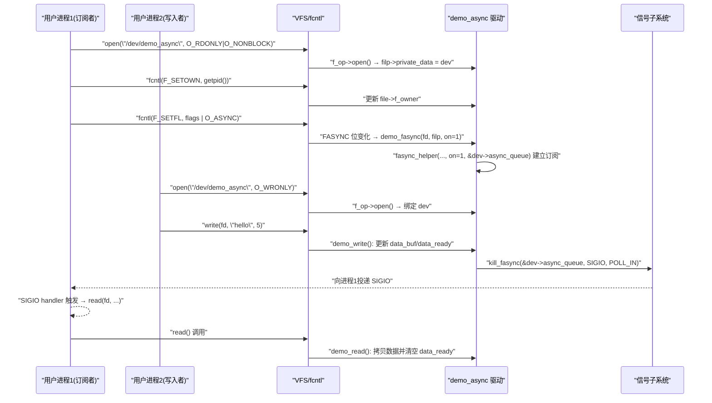
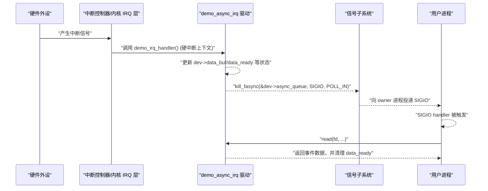

# 第 6 章 字符设备中实现异步通知的基础模式

## 6.1 面向字符设备的最小 fasync 模板

> 本节目标：
>
> - 给出一个“**可以实际跑起来**”的最小 fasync 模板，涵盖驱动侧与用户态两端；
> - 串起：`open` / `release` / `.fasync` / `kill_fasync` / `read` / `poll` 的基本协作关系；
> - 为后续章节（中断场景、并发问题、devm 对比）建立一个标准参考实现。

------

### 6.1.1 场景与设计目标（引入）

我们先约定一个非常具体、但足够简单的场景：

- 设备：`/dev/demo_async`，字符设备；
- 行为：
  - 内核里有一个“事件计数器”；
  - 每次你通过 **写** 操作向设备写入数据时，相当于“产生一个事件”；
  - 每产生一个事件：
    - 设备内部 `data_ready` 置位；
    - `demo_read()` 会读到这次事件的数据；
    - 若有订阅者（FASYNC 已开启），就调用 `kill_fasync()` 发一个 SIGIO。

先不用中断、GPIO，这样你可以直接在虚拟机里 `insmod` + `echo > /dev/demo_async` 做实验，不依赖硬件。

本小节要达成的最小目标：

1. 内核模块：**一个字符设备驱动 + fasync 最小实现**；
2. 用户程序：**一个用 SIGIO 收通知的 demo**；
3. 行为验证：
   - 用户程序设置 `F_SETOWN` / `F_SETFL(O_ASYNC)`；
   - 另一个终端 `echo hello > /dev/demo_async`；
   - 用户程序收到 SIGIO，并在 handler 中 `read()` 到数据。

------

### 6.1.2 数据结构与状态设计（数据结构视角）

我们定义一个最小设备结构体，用于承载 fasync 相关状态：

```c
struct demo_dev {
	struct cdev		cdev;		/* 字符设备对象 */
	struct fasync_struct	*async_queue;	/* fasync 链表头 */

	spinlock_t		lock;		/* 保护以下数据 */
	char			data_buf[128];	/* 简单缓冲区 */
	size_t			data_len;	/* 当前缓冲区中有效数据长度 */
	bool			data_ready;	/* 标记是否有未读数据 */
};
```

关键字段说明：

- `async_queue`
  - 这是 **fasync 链表头**，所有对本设备订阅异步通知的 `file` 都会出现在这条链里；
  - `.fasync` 通过 `fasync_helper()` 维护它；
  - `kill_fasync()` 用它来遍历订阅者。
- `data_ready` + `data_buf` + `data_len`
  - 这三者是“设备内部事件状态”的最小抽象；
  - `write()` 时填数据、置 `data_ready = true`；
  - `read()` 时消耗数据、清空标志；
  - `.poll` 和 `kill_fasync` 都应该基于 `data_ready` 判定“是否可读”。
- `lock`
  - 用于在 `read`、`write`、`poll`、`kill_fasync` 可能交错的情况下保护状态；
  - 当前示例里只会在进程上下文中调用 `kill_fasync()`，但我们仍然按“未来可能在中断上下文使用”的标准写成 `spin_lock_irqsave()`，方便迁移。

------

### 6.1.3 驱动路径：open / release / fasync / read / write（开发者视角）

围绕上面的结构体，我们设计最小的驱动调用路径：

1. `.open`
   - 建立 `filp->private_data = dev` 绑定；
   - 不做 fasync 相关操作（交给 `.fasync` + `.release`）。
2. `.release`
   - 在关闭 fd 时，调用 `.fasync(-1, filp, 0)`，删除该 file 对应的 fasync 节点；
   - 保证没有悬挂的 `struct fasync_struct`。
3. `.fasync`
   - 只做一件事：调用 `fasync_helper(fd, filp, on, &dev->async_queue)`；
   - 错误则直接返回，让 `F_SETFL` 失败；
   - 不再手写任何链表逻辑。
4. `.write`
   - 用 `copy_from_user()` 把用户写入的数据放到 `data_buf` 中；
   - 设置 `data_len` 与 `data_ready = true`；
   - 然后，如果 `async_queue` 不为空，调用
      `kill_fasync(&dev->async_queue, SIGIO, POLL_IN);`
   - **注意顺序**：必须先把状态更新成“可读”，再调 `kill_fasync()`。
5. `.read`
   - 当 `data_ready == true` 时，将缓冲区内容拷贝到用户空间，并清除 `data_ready`；
   - 若没有数据而你又想支持阻塞 read，则需要用 `waitqueue`，本小节先不加（简单版：没有数据就返回 0）。
6. `.poll`（可选，但建议一并写）
   - 若 `data_ready == true`，返回 `POLLIN | POLLRDNORM`；
   - 否则返回 0；
   - 这样可以验证 fasync 与 poll 对“可读状态”的判断一致性。

------

### 6.1.4 用户态：配置 F_SETOWN / F_SETSIG / F_SETFL（用户视角）

用户态的动作流程：

1. `open("/dev/demo_async", O_RDONLY | O_NONBLOCK);`
2. `sigaction(SIGIO, ...)` 注册信号 handler（使用 `SA_SIGINFO` 得到 `siginfo_t`）；
3. `fcntl(fd, F_SETOWN, getpid());` 指定本进程为 owner；
4. `fcntl(fd, F_SETSIG, SIGIO);`（可以省略，默认也是 SIGIO，这里写上更清晰）；
5. `flags = fcntl(fd, F_GETFL); fcntl(fd, F_SETFL, flags | O_ASYNC);` 打开 FASYNC；
6. 主循环使用 `pause()` 或其他业务逻辑，当 SIGIO 到来时，handler 中调用 `read()` 读取设备数据。

在后续章节里，你可以选择把 SIGIO 转为 `signalfd` + `epoll` 的组合，这里先用最经典的“信号 handler + read”。

------

### 6.1.5 时序图：从 write() 到 SIGIO 的完整链路（可视化）

下面用时序图把这一最小模板的事件链画出来：



------

### 6.1.6 驱动最小示例代码（可直接编译的版本）

下面给出一个完整的、可在内核 5.x/6.x 上编译运行的“最小 fasync 字符设备驱动”。
 （未涉及中断，只是用 `write()` 触发事件，便于在你的环境里快速验证。）

> 说明：
>
> - 代码采用 K&R 风格、tab 缩进；
> - 没有使用 devm，方便你后续在 6.6 中对 devm / 非 devm 做对比；
> - 未注册 `class`/`device_create()`，需要你手动用 `mknod` 创建设备节点，后续也可以自行加上。

```c
// demo_async_drv.c

#include <linux/module.h>
#include <linux/fs.h>
#include <linux/cdev.h>
#include <linux/uaccess.h>
#include <linux/slab.h>
#include <linux/spinlock.h>
#include <linux/poll.h>

#define DEMO_DEV_NAME		"demo_async"
#define DEMO_BUF_SIZE		128

struct demo_dev {
	struct cdev		cdev;		/* 字符设备对象 */
	struct fasync_struct	*async_queue;	/* fasync 链表头 */

	spinlock_t		lock;		/* 保护以下数据 */
	char			data_buf[DEMO_BUF_SIZE];
	size_t			data_len;
	bool			data_ready;
};

static dev_t demo_devno;
static struct demo_dev *demo_device;

/* fasync 回调：维护 async_queue */
static int demo_fasync(int fd, struct file *filp, int on)
{
	struct demo_dev *dev = filp->private_data;
	int ret;

	/* 使用 fasync_helper 维护 dev->async_queue 链表 */
	ret = fasync_helper(fd, filp, on, &dev->async_queue);
	if (ret < 0)
		return ret;

	return 0;
}

/* open：建立 filp 与 demo_dev 的绑定 */
static int demo_open(struct inode *inode, struct file *filp)
{
	struct demo_dev *dev;

	dev = container_of(inode->i_cdev, struct demo_dev, cdev);
	filp->private_data = dev;

	return 0;
}

/* release：关闭 fd 时确保从 fasync 链表中删除该 file 对应节点 */
static int demo_release(struct inode *inode, struct file *filp)
{
	/* on=0，模拟 FASYNC 关闭，删除该 file 的 fasync 节点 */
	demo_fasync(-1, filp, 0);

	return 0;
}

/* read：读取一次 data_buf 的数据，并清除 data_ready 标志 */
static ssize_t demo_read(struct file *filp, char __user *buf,
			 size_t count, loff_t *ppos)
{
	struct demo_dev *dev = filp->private_data;
	unsigned long flags;
	size_t to_copy;

	spin_lock_irqsave(&dev->lock, flags);

	if (!dev->data_ready) {
		spin_unlock_irqrestore(&dev->lock, flags);
		/* 简单起见：没有数据就返回 0（非阻塞语义） */
		return 0;
	}

	to_copy = min(count, dev->data_len);
	if (copy_to_user(buf, dev->data_buf, to_copy)) {
		spin_unlock_irqrestore(&dev->lock, flags);
		return -EFAULT;
	}

	/* 数据被读走后，清空状态 */
	dev->data_len = 0;
	dev->data_ready = false;

	spin_unlock_irqrestore(&dev->lock, flags);

	return to_copy;
}

/* write：写入数据并触发异步通知（SIGIO） */
static ssize_t demo_write(struct file *filp, const char __user *buf,
			  size_t count, loff_t *ppos)
{
	struct demo_dev *dev = filp->private_data;
	unsigned long flags;
	size_t to_copy;

	if (count == 0)
		return 0;

	to_copy = min(count, (size_t)DEMO_BUF_SIZE);

	spin_lock_irqsave(&dev->lock, flags);

	if (copy_from_user(dev->data_buf, buf, to_copy)) {
		spin_unlock_irqrestore(&dev->lock, flags);
		return -EFAULT;
	}

	dev->data_len = to_copy;
	dev->data_ready = true;

	/* 先更新 data_ready，再发异步通知，保证状态一致 */
	if (dev->async_queue)
		kill_fasync(&dev->async_queue, SIGIO, POLL_IN);

	spin_unlock_irqrestore(&dev->lock, flags);

	return to_copy;
}

/* poll：用于验证与 fasync 一致的可读语义 */
static __poll_t demo_poll(struct file *filp, poll_table *wait)
{
	struct demo_dev *dev = filp->private_data;
	unsigned long flags;
	__poll_t mask = 0;

	spin_lock_irqsave(&dev->lock, flags);

	if (dev->data_ready)
		mask |= POLLIN | POLLRDNORM;

	spin_unlock_irqrestore(&dev->lock, flags);

	return mask;
}

static const struct file_operations demo_fops = {
	.owner		= THIS_MODULE,
	.open		= demo_open,
	.release	= demo_release,
	.read		= demo_read,
	.write		= demo_write,
	.poll		= demo_poll,
	.fasync		= demo_fasync,
};

static int __init demo_init(void)
{
	int ret;

	/* 分配主次设备号 */
	ret = alloc_chrdev_region(&demo_devno, 0, 1, DEMO_DEV_NAME);
	if (ret < 0)
		return ret;

	/* 分配设备结构体 */
	demo_device = kzalloc(sizeof(*demo_device), GFP_KERNEL);
	if (!demo_device) {
		unregister_chrdev_region(demo_devno, 1);
		return -ENOMEM;
	}

	spin_lock_init(&demo_device->lock);

	/* 初始化 cdev 并注册 */
	cdev_init(&demo_device->cdev, &demo_fops);
	demo_device->cdev.owner = THIS_MODULE;

	ret = cdev_add(&demo_device->cdev, demo_devno, 1);
	if (ret < 0) {
		kfree(demo_device);
		unregister_chrdev_region(demo_devno, 1);
		return ret;
	}

	pr_info("demo_async: registered at %d:%d\n",
		MAJOR(demo_devno), MINOR(demo_devno));

	return 0;
}

static void __exit demo_exit(void)
{
	cdev_del(&demo_device->cdev);
	kfree(demo_device);
	unregister_chrdev_region(demo_devno, 1);

	pr_info("demo_async: unregistered\n");
}

module_init(demo_init);
module_exit(demo_exit);

MODULE_LICENSE("GPL");
MODULE_AUTHOR("demo");
MODULE_DESCRIPTION("Demo async notification char device");
```

> 实际使用时，你可以再加上 `class_create()` + `device_create()`，自动在 `/dev/demo_async` 下创建设备节点；
>  当前示例可以用手动 `mknod`，例如：
>
> ```bash
> sudo mknod /dev/demo_async c <major> <minor>
> ```

------

### 6.1.7 调试与验证步骤（调试与验证）

要验证这个最小模板，你可以按下面步骤来：

1. 编译并加载驱动模块

   - 写一个简单的 `Makefile`，使用内核模块构建方式；
   - `make` 编译，`sudo insmod demo_async_drv.ko`。

2. 确认设备号

   - `dmesg | grep demo_async`，记下 `major:minor`；
   - `sudo mknod /dev/demo_async c <major> <minor>`。

3. 编写用户态 demo（示例见下一小节），编译运行。

4. 在另一个终端执行：

   ```bash
   echo "hello" > /dev/demo_async
   echo "world" > /dev/demo_async
   ```

   观察用户程序是否每次收到 SIGIO 并打印读取到的数据。

5. 使用 `strace -e fcntl ./demo_user`，确认：

   - `F_SETOWN` / `F_SETSIG` / `F_SETFL(O_ASYNC)` 调用成功；
   - 内核日志是否在 `.fasync` 处有你加的调试输出（如果临时加上了）。

6. 关闭用户程序，观察：

   - `demo_release()` 是否被调用（可短期加 `pr_info`）；
   - 若你继续在另一终端 `echo > /dev/demo_async`，是否不再有 SIGIO 被发送（说明 fasync 节点已经被删干净）。

------

### 6.1.8 用户态最小示例与小结

#### 1）用户态最小示例代码

```c
// demo_async_user.c

#define _GNU_SOURCE
#include <signal.h>
#include <fcntl.h>
#include <unistd.h>
#include <stdio.h>
#include <string.h>
#include <stdlib.h>

static int g_fd = -1;

static void sigio_handler(int signo, siginfo_t *info, void *ucontext)
{
	char buf[128];
	ssize_t n;

	(void)ucontext;

	printf("[SIGIO] signo=%d", signo);
	if (info) {
		printf(", si_fd=%d, si_band=0x%lx",
		       info->si_fd, (unsigned long)info->si_band);
	}
	printf("\n");

	if (g_fd < 0)
		return;

	n = read(g_fd, buf, sizeof(buf) - 1);
	if (n < 0) {
		perror("read");
		return;
	}

	if (n == 0) {
		printf("[SIGIO] no data (read 0)\n");
		return;
	}

	buf[n] = '\0';
	printf("[SIGIO] read %zd bytes: \"%s\"\n", n, buf);
}

int main(void)
{
	struct sigaction sa;
	int flags;

	g_fd = open("/dev/demo_async", O_RDONLY | O_NONBLOCK);
	if (g_fd < 0) {
		perror("open");
		return 1;
	}

	memset(&sa, 0, sizeof(sa));
	sa.sa_sigaction = sigio_handler;
	sa.sa_flags = SA_SIGINFO;
	sigemptyset(&sa.sa_mask);

	if (sigaction(SIGIO, &sa, NULL) < 0) {
		perror("sigaction");
		return 1;
	}

	if (fcntl(g_fd, F_SETOWN, getpid()) < 0) {
		perror("F_SETOWN");
		return 1;
	}

	/* 可不写，默认 SIGIO；这里写上更清晰 */
	if (fcntl(g_fd, F_SETSIG, SIGIO) < 0) {
		perror("F_SETSIG");
		return 1;
	}

	flags = fcntl(g_fd, F_GETFL);
	if (flags < 0) {
		perror("F_GETFL");
		return 1;
	}

	if (fcntl(g_fd, F_SETFL, flags | O_ASYNC) < 0) {
		perror("F_SETFL");
		return 1;
	}

	printf("demo_async_user: waiting for SIGIO, pid=%d\n", getpid());
	printf("  echo \"hello\" > /dev/demo_async in another terminal.\n");

	for (;;) {
		pause();	/* 等待信号 */
	}

	close(g_fd);
	return 0;
}
```

#### 2）本节小结

本节给出的“最小 fasync 模板”实现了你后面所有章节都要反复引用的核心模式：

- 数据结构层：
  - 设备实例包含 `struct fasync_struct *async_queue` + 基本数据缓冲；
- 驱动侧接口层：
  - `.open`：只做绑定；
  - `.fasync`：完全交给 `fasync_helper()`；
  - `.release`：用 `.fasync(..., 0)` 清理节点；
  - `.write`：更新状态后调用 `kill_fasync()`；
  - `.read` / `.poll`：基于同一 `data_ready` 语义返回数据/可读标志；
- 用户态层：
  - `F_SETOWN` / `F_SETSIG` / `F_SETFL(O_ASYNC)` + SIGIO handler 这一套标准配置流程。

从这一刻起，后续章节你可以把这个模板当作“**fasync 的最小可用骨架**”，在此基础上：

- 第 6.2：细化 open / release 中维护 fasync 状态的各种变体（单进程、多进程、多 fd）；
- 第 6.3：讨论 `.fasync` 回调的标准写法与异常处理；
- 第 6.4：把 `write()` 中的“软事件”替换成“中断处理函数/下半部 + kill_fasync()`”；
- 第 6.5：严谨地处理 `.read()` / `.poll()` / fasync 的状态一致性；
- 第 6.6：给出 devm 与非 devm 版本的资源/状态管理对比；
- 第 6.7：对“一个最小可用 fasync 字符设备驱动长什么样”做系统小结。


------

## 6.2 在 `open()` / `release()` 中维护 fasync 状态

> 本节目标：
>
> - 讲清楚：**什么叫“fasync 状态”**，哪些在 VFS 层，哪些在驱动里；
> - 分场景说明：单进程 / 多进程 / 多 fd 时，`open()` / `release()` 应该做什么、不应该做什么；
> - 给出一份“推荐 open/release 模式”，后面章节都以它为基准。

------

### 6.2.1 “fasync 状态”到底指什么？

从本书前面章节到现在，我们至少提到过三类状态：

1. **`file->f_flags` 中的 `FASYNC` 位（VFS 层）**
   - 控制“这个 `struct file` 是否启用异步通知”；
   - 只通过 `fcntl(F_SETFL)` 修改；
   - 驱动不应该直接改 `f_flags`。
2. **设备实例中的 fasync 链表头：`struct fasync_struct \*async_queue`（驱动层）**
   - 表示“这个设备当前有哪些 file 订阅了异步通知”；
   - 由 `.fasync` 中的 `fasync_helper()` 维护；
   - `kill_fasync()` 遍历它，决定给谁发信号。
3. **“哪些 file 节点还活着”（VFS 的生命周期）**
   - 每次 `open()` 产生一个 `struct file`；
   - 每次 `close()`（最后一个引用）会调用 `.release()`；
   - `.release()` 不一定意味着“FASYNC 现在是 0”，但对你来说，**这是删掉对应 fasync 节点的唯一机会**。

本节讨论的“在 `open()/release()` 中维护 fasync 状态”，本质上就是：

> **围绕“设备实例中的 `async_queue` 这一块”，在 open/close 生命周期内保证链表干净、不悬空、不误删。**

------

### 6.2.2 单进程单 fd：最简单的“标配行为”

先看最简单的情况：只有一个进程，只打开一次 `fd`。

流程回顾（基于 6.1 的 demo）：

1. `open("/dev/demo_async", O_RDONLY | O_NONBLOCK)`
   - VFS 分配 `struct file`；
   - 调用 `demo_open()`：把 `dev` 塞进 `filp->private_data`；
   - 不触碰 fasync 链表。
2. `fcntl(F_SETOWN)` / `F_SETSIG` / `F_SETFL(O_ASYNC)`
   - `F_SETFL` 使 `FASYNC` 位从 0→1；
   - 调用 `demo_fasync(fd, filp, 1)`；
   - `fasync_helper()` 在 `dev->async_queue` 链表中添加一个节点。
3. 设备事件发生 → `kill_fasync(&dev->async_queue, SIGIO, POLL_IN);`
   - 正常发信号。
4. `close(fd)`
   - VFS 调用 `demo_release()`；
   - `demo_release()` 调用 `demo_fasync(-1, filp, 0)`；
   - `fasync_helper(..., on=0)` 删除链表中的该节点；
   - `dev->async_queue` 重新变回 NULL（对于单 fd 场景）。

这一套路径中，`open` 和 `release` 的关键行为可以抽象成两行：

```c
/* open: 只做绑定，不碰 fasync */
filp->private_data = dev;

/* release: 一定调用 fasync(..., 0) 清理链表 */
demo_fasync(-1, filp, 0);
```

**在单 fd 场景下，你基本不需要额外考虑计数、共享等问题，只要保证 release 里这句不漏就可以。**

------

### 6.2.3 同一进程多次 `open()` 同一设备：多 `struct file` 节点

当同一进程对同一个设备多次 `open()` 时，内核会分配多个 `struct file`：

```c
int fd1 = open("/dev/demo_async", O_RDONLY | O_NONBLOCK);
int fd2 = open("/dev/demo_async", O_RDONLY | O_NONBLOCK);

/* 甚至对两个 fd 分别开 FASYNC */
fcntl(fd1, F_SETOWN, getpid());
fcntl(fd1, F_SETFL, flags1 | O_ASYNC);

fcntl(fd2, F_SETOWN, getpid());
fcntl(fd2, F_SETFL, flags2 | O_ASYNC);
```

此时：

- `fd1` 和 `fd2` 对应 **不同的 `struct file`**；
- `.open` 会被调用两次，`filp->private_data` 分别指向同一个 `dev`；
- `.fasync` 被调两次：`(fd1, filp1, 1)` 与 `(fd2, filp2, 1)`；
- `fasync_helper()` 会在 `dev->async_queue` 中添加两个节点（对应两个不同 `filp`）。

对 `release()` 来说：

- `close(fd1)` → 调用 `demo_release()` 一次 → `demo_fasync(-1, filp1, 0)` 删除 `filp1` 对应节点；
- `close(fd2)` → 再调用一次 `demo_release()` → 再删除 `filp2` 对应节点；
- 当所有 fd 都关闭时，`dev->async_queue` 重新变为 NULL。

**结论：**

- **你不需要在 `demo_dev` 中额外维护“打开计数”来管理 fasync 链表**；
- `fasync_helper()` 以“`filp` 为键”管理节点，**每个 `struct file` 至多对应一个 fasync 节点**；
- 只要 `.release()` 中做 `fasync(..., 0)`，可以保证多 fd 多进程场景下的链表最终被清空。

------

### 6.2.4 `dup()` / `fork()` 的影响：共享 `struct file` vs 复制 `struct file`

这块稍微绕一点，但理解之后会对“fasync 行为为什么有时显得怪怪的”更有底。

#### 1）`dup()`：多个 fd 共享同一个 `struct file`

```c
int fd1 = open("/dev/demo_async", O_RDONLY);
int fd2 = dup(fd1);
```

- `fd1` 和 `fd2` 引用的是**同一个 `struct file` 对象**；
- 因此它们共享：
  - `file->f_flags`（包括 `FASYNC` 位）；
  - `file->f_owner`；
  - `.fasync` 订阅状态（实际上由这个 `file` 唯一决定）。

结果就是：

- 给 `fd1` 调 `F_SETFL(O_ASYNC)`，实际上修改的是这份共享的 `file->f_flags`；
- 再给 `fd2` 调一次 `F_SETFL(O_ASYNC)`，`FASYNC` 位没有变化，`.fasync` 不会被再次调用；
- `close(fd1)` 只会减少该 `struct file` 的引用计数，不会触发 `.release()`（因为还有 fd2）；
- 只有当最后一个 fd（比如 `fd2`）被 close 时，才会真正调用 `.release()`，也就只会调用一次 `demo_fasync(-1, filp, 0)`。

所以在驱动里：**你根本不需要区分“是通过 open 还是 dup/fork 获得的 fd”**，因为 VFS 帮你把 `struct file` 的生命周期聚合好了，`.release()` 只在“最后一个引用”消失的时候调用一次。

#### 2）`fork()`：子进程继承父进程的打开文件

`fork()` 的行为类似 `dup()`：子进程继承父进程的 fd 表，而每个 fd 引用同一个 `struct file`：

- 子进程对 fd 调 `F_SETFL` 会影响同一个 `struct file`；
- 对 `.fasync` 的调用依旧只与 `FASYNC` 位变化有关。

**驱动侧的结论仍然是：**不管是 `open()` 还是 `dup()` 还是 `fork()` 造成的引用增加，你始终只用 `filp->private_data` 和 `.release()` 那一次 `fasync(..., 0)` 处理，其他都不需要特殊区分。

------

### 6.2.5 `open()` / `release()` 里“该做什么 / 不该做什么”

综合上面这些场景，可以给出一份推荐 checklist：

#### 1）`open()` 中应该做的事情

- 绑定设备实例：

  ```c
  static int demo_open(struct inode *inode, struct file *filp)
  {
  	struct demo_dev *dev;
  
  	dev = container_of(inode->i_cdev, struct demo_dev, cdev);
  	filp->private_data = dev;
  
  	/* 可选：若你需要 per-open 的状态，可以在这里初始化 */
  
  	return 0;
  }
  ```

- **不要**在 `open()` 中直接修改 `FASYNC` 或手动调用 `.fasync(fd, filp, 1)`：

  - fasync 的启用/禁用应该由用户态 `F_SETFL` 决定；
  - open 就启用 fasync 会导致“打开即收信号”，可控性差。

- 可选：维护一个“打开计数”：

  ```c
  atomic_t open_count;
  
  static int demo_open(struct inode *inode, struct file *filp)
  {
  	struct demo_dev *dev = container_of(inode->i_cdev,
  			struct demo_dev, cdev);
  
  	filp->private_data = dev;
  
  	if (atomic_inc_return(&dev->open_count) == 1) {
  		/* 第一个打开者，可以在这里重置 data_ready 等状态 */
  	}
  
  	return 0;
  }
  ```

  这个计数与 fasync 无直接关系，只是方便你在“第一个打开时做初始化、最后一个关闭时做清理”。

#### 2）`release()` 中必须做的事情

- **必须**调用 `.fasync(..., 0)` 删除该 `file` 对应的 fasync 节点：

  ```c
  static int demo_release(struct inode *inode, struct file *filp)
  {
  	struct demo_dev *dev = filp->private_data;
  
  	/* 保证无论 FASYNC 当前是否为 1，都尝试把该 file 从队列中删掉 */
  	demo_fasync(-1, filp, 0);
  
  	/* 若维护了 open_count，可以在这里做最后一个关闭者的清理 */
  	/* if (atomic_dec_and_test(&dev->open_count)) { ... } */
  
  	return 0;
  }
  ```

- **不要**在 `release()` 里直接修改 `file->f_flags` 或 `file->f_owner`；

  - 这些都是 VFS 和 `fcntl()` 管的东西；
  - release 做的是“清理与这个 file 关联的驱动内部状态”。

- 如果你的驱动中还有其他与 `filp` 相关的资源（例如 per-file 缓冲、per-file 等待队列），也应该在 release 中一并释放，保持结构整洁。

------

### 6.2.6 一个稍微“增强版”的 open/release 模板

在 6.1 的最简版驱动上，我们可以把 open/release 稍微增强一下，加上打开计数和日志，方便你调试：

```c
struct demo_dev {
	struct cdev		cdev;
	struct fasync_struct	*async_queue;

	spinlock_t		lock;
	char			data_buf[DEMO_BUF_SIZE];
	size_t			data_len;
	bool			data_ready;

	atomic_t		open_count;	/* 打开计数 */
};

static int demo_open(struct inode *inode, struct file *filp)
{
	struct demo_dev *dev;

	dev = container_of(inode->i_cdev, struct demo_dev, cdev);
	filp->private_data = dev;

	if (atomic_inc_return(&dev->open_count) == 1) {
		/* 第一次被打开，可以做一些设备级初始化 */
		spin_lock_irq(&dev->lock);
		dev->data_len = 0;
		dev->data_ready = false;
		spin_unlock_irq(&dev->lock);
	}

	pr_debug("demo_async: open, open_count=%d\n",
		 atomic_read(&dev->open_count));

	return 0;
}

static int demo_release(struct inode *inode, struct file *filp)
{
	struct demo_dev *dev = filp->private_data;

	/* 确保移除该 file 的 fasync 节点 */
	demo_fasync(-1, filp, 0);

	if (atomic_dec_and_test(&dev->open_count)) {
		/* 最后一个关闭，可以做设备级收尾工作 */
		pr_debug("demo_async: last close, cleanup\n");
	}

	pr_debug("demo_async: release, open_count=%d\n",
		 atomic_read(&dev->open_count));

	return 0;
}
```

要点：

- `atomic_t open_count` 与 fasync 没有直接耦合，只是帮助你管理“设备级生命周期”；
- 即便你不关心 open 次数，也不要省掉 `demo_fasync(-1, filp, 0)` 这行；
- `pr_debug()` 可以配合 `dynamic_debug` 或 `dyndbg` 查看，这对于以后查 fasync 链表异常非常有用。

------

### 6.2.7 小结：open/release 中对 fasync 的“唯一刚性要求”

本节可以用一句话概括关键点：

> **fasync 的订阅链表由 `.fasync` + `fasync_helper()` 管，open/release 的唯一硬性要求是：release 一定要调用 `.fasync(..., 0)` 清理“这个 file 对应的节点”。**

补充几条记忆点：

- `open()` 只建立 `filp->private_data` 绑定，fasync 是否启用由 `F_SETFL(O_ASYNC)` 决定；
- `dup()` / `fork()` 带来的共享 `struct file` 生命周期细节由 VFS 处理，你不需要在驱动里区分；
- 多进程、多 fd 对同一设备启用 fasync，只是 `async_queue` 链表里多了几个节点，`release()` 会一一清理；
- 维护打开计数是“可选加分项”，但清理 fasync 节点是“必做项”。

后续章节我们会在这个基础上继续往下走：

- **6.3**：`.fasync` 回调的标准写法与异常处理（`fasync_helper` 错误、内存不足、多次重复设置等）；
- **6.4**：中断处理函数/下半部里调用 `kill_fasync()` 的正确时序与上下文约束；
- **6.5**：如何保证 `.read()` / `.poll()` 与 fasync 的状态语义一致；
- **6.6**：devm 风格与非 devm 风格下 fasync 相关资源/状态的管理思路。


------

## 6.3 `.fasync` 回调的标准写法与异常处理

> 本节目标：
>
> - 给出 `.fasync` 的**推荐写法**，让它在复杂驱动里保持“薄、可读、可维护”；
> - 说明 `fasync_helper()` 的调用规律、返回值语义、可能失败的情况；
> - 总结常见误用模式，避免后面在中断驱动场景里踩坑。

------

### 6.3.1 设计目标：`.fasync` 要“薄”，只做一件事

从前面几章的调用链可以归纳出一个很重要的结论：

- `.fasync` 的**唯一职责**：
  - 根据 `on`（1 或 0），维护“这个 `file` 是否在某个 fasync 链表上”；
  - 具体维护动作交给 `fasync_helper()` 完成。

换句话说，一个“健康”的 `.fasync` 应该：

1. 不关心 `F_SETFL` 具体怎么触发；
2. 不直接操作 `struct fasync_struct` 链表；
3. 不做复杂业务逻辑（不在这里发信号，不在这里更新设备状态）；
4. 尽量保持为“一个薄薄的封装 + 少量日志”。

典型目标形态就是类似下面这几行：

```c
static int demo_fasync(int fd, struct file *filp, int on)
{
	struct demo_dev *dev = filp->private_data;

	return fasync_helper(fd, filp, on, &dev->async_queue);
}
```

后面我们会再给一版“稍微增强、带容错与日志”的写法，但核心思想不变：**不要在 `.fasync` 里堆额外逻辑**。

------

### 6.3.2 调用规律再复习：`on` 的取值与多次 F_SETFL

先把 `.fasync` 到底什么时候被叫、`on` 是如何得出的，再明确一遍（这一点搞清楚后，很多“诡异行为”就好理解了）：

1. `fcntl(fd, F_SETFL, flags | O_ASYNC)`
   - 若之前 `file->f_flags` 中 `FASYNC == 0`：
     - `newflags` 的 `FASYNC` 位变为 1；
     - 内核调用 `.fasync(fd, filp, 1)`；
   - 若之前已经是 1，再次设置：
     - `FASYNC` 位无变化；
     - `.fasync` 不会被调用。
2. `fcntl(fd, F_SETFL, flags & ~O_ASYNC)`
   - 若之前 `FASYNC == 1`：
     - `newflags` 的 `FASYNC` 位变为 0；
     - 内核调用 `.fasync(fd, filp, 0)`，从链表中删除。
   - 若之前已经是 0：
     - `.fasync` 不被调用。
3. `.release()` 中调用 `.fasync(-1, filp, 0)`
   - 这是驱动自己模拟的一次“从 1→0”的变化，用于确保 close 时清理链表；
   - 即使此时 `FASYNC` 位在 VFS 看来已经是 0，我们照样调用 `fasync_helper(..., on=0)`，它会安全地尝试从链表删除对应节点（若不存在则什么都不做）。

因此，从驱动角度可以简单记忆：

```text
on == 1 → 把这个 filp 加入 async_queue
on == 0 → 从 async_queue 中删除这个 filp
```

其它状态管理（如 `FASYNC` 位、`f_owner` 等）由 VFS / fcntl 管，你只管让 `async_queue` 与“当前启用 fasync 的 file 集合”保持一致即可。

------

### 6.3.3 标准 `.fasync` 模板（推荐版本）

在 6.1 的最小例子里，我们用了一个极简版本。这里给一个更接近实际工程的“推荐版本”，包含：

- 对 `filp->private_data` 的判空；
- 对 `fasync_helper()` 返回值的处理；
- 可选的日志输出。

```c
static int demo_fasync(int fd, struct file *filp, int on)
{
	struct demo_dev *dev = filp->private_data;
	int ret;

	if (!dev)
		return -EINVAL;	/* 正常情况下不会发生，防御性检查 */

	/* 维护 dev->async_queue 链表 */
	ret = fasync_helper(fd, filp, on, &dev->async_queue);
	if (ret < 0) {
		/* 这里返回负值会让 fcntl(F_SETFL) 失败 */
		pr_warn("demo_async: fasync_helper(fd=%d, on=%d) failed: %d\n",
			fd, on, ret);
		return ret;
	}

	pr_debug("demo_async: fasync(fd=%d, on=%d) ok\n", fd, on);

	return 0;
}
```

几点说明：

1. **返回值必须往上抛**
   - 若 `fasync_helper()` 返回负值（常见为 `-ENOMEM`），必须把这个错误返回给 VFS；
   - VFS 会让 `fcntl(F_SETFL)` 返回 `-1`，`errno` 为对应错误码；
   - 用户态就能知道“开启异步通知失败了”。
2. **不要在错误情况下偷偷保持 `FASYNC == 1`**
   - 这会造成 `file->f_flags` 里显示 FASYNC 已开启，但链表中没有该节点；
   - 之后 `kill_fasync()` 遍历不到这个 `file`，用户就会遇到“看起来设置成功，却收不到 SIGIO”的困惑。
3. **日志建议只在调试阶段打开**
   - 使用 `pr_debug()` 或 `pr_warn()` 即可；
   - 正式版本可以依靠动态调试机制控制开关。

------

### 6.3.4 `fasync_helper()` 的返回值与错误场景

`fasync_helper()` 的典型返回值语义（简化理解）：

- `0`：一切正常（成功加入 / 成功删除 / 重复设置导致无动作）；
- `<0`：出现错误，一般是分配 `struct fasync_struct` 节点失败（如 `-ENOMEM`）。

几种典型调用场景：

1. 首次 `F_SETFL(O_ASYNC)`
   - `.fasync(fd, filp, 1)` → `fasync_helper()` 需要分配新的 `struct fasync_struct`；
   - 若内存充足，返回 0；
   - 若内存不足，返回 `-ENOMEM`，`.fasync` 应原样返回，VFS 让 `F_SETFL` 失败。
2. 再次 `F_SETFL(O_ASYNC)`（状态不变）
   - `.fasync` 不会被调用（FASYNC 位没变）；
   - 即使调用也应该只是发现“已经在链表中”，返回 0，无副作用。
3. `F_SETFL` 去掉 `O_ASYNC`
   - `.fasync(fd, filp, 0)` → `fasync_helper()` 把对应节点从链表删除；
   - 正常情况返回 0；
   - 若链表中找不到该 `filp` 对应节点，按实现细节通常也是返回 0（无变化），不会报错。
4. `.release()` 中调用 `.fasync(-1, filp, 0)`
   - 同 3，只是 fd 参数不再重要，重要的是 `filp` 和 `on=0`；
   - 即使 `FASYNC` 位已经被清掉，`fasync_helper()` 至多是看到没有对应节点、返回 0。

**这个返回值机制的核心意义：**

> **只要你在 `.fasync` 中对 `ret < 0` 进行原样返回，就可以正确地把内核资源问题反馈给用户态；反之，如果你吞掉错误，用户只能看到“设置成功”却永远收不到信号。**

------

### 6.3.5 常见错误模式与后果

这里列几个在实际驱动里常见的错误模式，以及该怎么避免：

#### 错误 1：在 `.fasync` 里手动维护链表，不用 `fasync_helper()`

表现：

- 自己写 `struct fasync_struct` 的 `kmalloc` / `list_add` / `list_del` 等逻辑；
- 忽略了 `fd` / `filp` 之间的对应规则；
- 多次 `F_SETFL` 时容易出现重复节点、内存泄漏、悬空指针等问题。

后果：

- `kill_fasync()` 遍历链表时会遇到异常节点，甚至出现 UAF；
- 与 VFS 的语义对不上（例如当 `F_SETFL` 调用失败时未回滚）。

建议：

- **不要重复造轮子**，使用官方提供的 `fasync_helper()` 即可；
- 它已经封装好了“每个 `filp` 对应一个节点”的逻辑。

------

#### 错误 2：忽略 `on` 参数，总是当做“添加订阅”

表现：

```c
static int bad_fasync(int fd, struct file *filp, int on)
{
	struct demo_dev *dev = filp->private_data;

	return fasync_helper(fd, filp, 1, &dev->async_queue);	/* on 被忽略 */
}
```

后果：

- 当用户执行 `F_SETFL` 去掉 `O_ASYNC` 或驱动在 `.release()` 调用 `.fasync(..., 0)` 时，链表实际上仍然保留该节点；
- 即使应用已经关闭或禁用了 fasync，驱动仍然会对它发 SIGIO，导致“幽灵信号”。

建议：

- 始终使用 `on` 作为第三个参数传给 `fasync_helper()`：
   `fasync_helper(fd, filp, on, &dev->async_queue);`

------

#### 错误 3：在 `.release()` 中忘记调用 `.fasync(..., 0)`

表现：

```c
static int bad_release(struct inode *inode, struct file *filp)
{
	/* 只做自己的清理，完全没考虑 fasync */
	return 0;
}
```

后果：

- 关闭 fd 时，`async_queue` 中该 `filp` 的节点不会被删除；
- 之后任何 `kill_fasync()` 都可能尝试向“已经退出的进程”发送信号；
- 在极端场景下可能导致内核访问无效任务结构，引发日志噪音或更严重的问题（视内核版本和实现）。

建议：

- 把 `.release()` 是否调用 `.fasync(..., 0)` 当作“fasync 驱动最低门槛”，一条都不能省。

------

#### 错误 4：在 `.fasync` 中做复杂逻辑（加锁、睡眠、IO）

表现：

- 在 `.fasync` 函数里做大量逻辑，比如：
  - 分配复杂结构、注册中断、进行 I/O 操作；
  - 持有长时间锁，甚至睡眠。

后果：

- `.fasync` 是由 `fcntl(F_SETFL)` 内部调用的，属于系统调用路径；
- 在 `.fasync` 里做重操作会拖慢 `fcntl`，对业务层造成意料之外的性能影响；
- 若误用睡眠锁，极端情况下可能和其它路径产生锁依赖，埋下死锁风险。

建议：

- 把 `.fasync` 限制在“**调用 `fasync_helper` + 轻量日志**”的范围内；
- 其它复杂逻辑（如资源分配/释放）放在 `.open` / `.release` / `probe` / `remove` 等更合适的地方。

------

### 6.3.6 多队列场景：读写分队列 / 多通道 fasync

有些设备需要在驱动内部区分不同类型的事件，例如：

- 读事件与写事件分别有独立的订阅者（类似 pipe 的 read/write fasync）；
- 多通道设备，每个通道都有自己的 fasync 链表。

在这种场景下，你可以“水平扩展”当前模式：

#### 1）读/写分队列

数据结构：

```c
struct demo_dev {
	struct cdev		cdev;
	struct fasync_struct	*async_read;
	struct fasync_struct	*async_write;
	/* 其它字段略 */
};
```

`.fasync` 需要根据 open 模式（或其它信息）决定挂在哪个队列：

```c
static int demo_fasync(int fd, struct file *filp, int on)
{
	struct demo_dev *dev = filp->private_data;

	if ((filp->f_mode & FMODE_READ) && !(filp->f_mode & FMODE_WRITE))
		return fasync_helper(fd, filp, on, &dev->async_read);

	if ((filp->f_mode & FMODE_WRITE) && !(filp->f_mode & FMODE_READ))
		return fasync_helper(fd, filp, on, &dev->async_write);

	/* 读写都开或其它组合时，可以根据需求决定放哪边或两个队列都放 */
	return fasync_helper(fd, filp, on, &dev->async_read);
}
```

发通知时：

```c
/* 收到新数据 → 通知读队列 */
if (dev->async_read)
	kill_fasync(&dev->async_read, SIGIO, POLL_IN);

/* 缓冲可写 → 通知写队列 */
if (dev->async_write)
	kill_fasync(&dev->async_write, SIGIO, POLL_OUT);
```

#### 2）多通道（多实例） fasync

更复杂的情况是，一个物理设备内部有多个“通道/子设备”，每个通道有自己的一套事件。

思路：

- 每个子通道对应一个 `struct demo_channel`，里面有自己的 `struct fasync_struct *async_queue`；
- `.fasync` 先在 `filp->private_data` 中找到对应通道，再调用 `fasync_helper()`。

**总之：**不管多队列还是多通道，本质都是“多个 `async_queue` 指针 + 多次 `fasync_helper` / `kill_fasync`”。只要遵守 `.fasync` 本身的“薄封装”原则，实现不会变得太乱。

------

### 6.3.7 小结：`.fasync` 的“生存守则”

本节可以用一组“守则式”的句子来收束：

1. `.fasync` 的唯一核心工作：调用 `fasync_helper(fd, filp, on, &async_queue)`；
2. 必须对 `fasync_helper()` 的负返回值进行原样传递，让 `fcntl(F_SETFL)` 能正确报告错误；
3. 必须在 `.release()` 中调用 `.fasync(-1, filp, 0)`，确保关闭 fd 时从链表删除对应节点；
4. 不要在 `.fasync` 里写复杂逻辑，更不要自己维护 `struct fasync_struct` 链表；
5. 在多队列/多通道场景下，扩展的是“`async_queue` 指针的数量”，而不是 `.fasync` 的复杂度。

结合 6.1 和 6.2，目前你已经具备了一个“**在字符设备中正确、安全地挂上 fasync 的基本模式**”。接下来：

- **6.4** 会把“软件触发的 `write()` 事件”升级成“中断处理函数/下半部中的 `kill_fasync()` 调用”，重点讨论上下文限制、锁的选择与时序保证；
- **6.5** 则会更系统地分析 `.read()` / `.poll()` / fasync 三者之间的状态一致性问题，避免让应用陷入“信号说有数据但 read 读不到”的混乱状态。


------

## 6.4 在中断处理函数/下半部中调用 `kill_fasync()` 的流程

> 本节目标：
>
> - 把 6.1 的“软件 write 触发事件”升级为“硬件中断触发事件”；
> - 说明在 **硬中断 / 下半部** 中调用 `kill_fasync()` 的注意点（上下文、锁、状态更新顺序）；
> - 给出一份可运行的“中断型 demo fasync 驱动骨架”，后面 7 章会替换为 i.MX6ULL GPIO 场景。

------

### 6.4.1 场景与设计目标（引入）

我们换一个更贴近真实硬件的场景：

- 设备有一个外部中断源（例如 GPIO 中断、外部信号线）；
- 每次中断来临，说明“有一个新事件发生”；
- 驱动在 **中断处理函数/下半部** 中：
  1. 更新内部状态（`data_ready` 等）；
  2. 调用 `kill_fasync()` 给所有订阅者发 SIGIO；
- 用户态通过 `SIGIO` + `read()` 读出这一事件的数据。

和 6.1 的差异只有一点：**事件源从“write()”变成了“中断”**。
 但这点差异，会带来一系列新的约束：

- 中断上下文不能睡眠；
- 需要与 `.read()` / `.poll()` 的并发访问共享状态；
- 可能存在高频中断，必须考虑“信号风暴”和节流策略（8 章展开）。

本节聚焦于“**上下文 + 锁 + 时序**”，先不讨论节流问题。

------

### 6.4.2 从中断到 SIGIO 的完整数据流（可视化）

先用时序图，把“硬中断→SIGIO→用户 read”这一链路画出来：



你可以把它理解为：
 **6.1 里由 `write()` 调用 `kill_fasync()` 的那条路径，现在被替换成“中断 handler 调用 `kill_fasync()`”。**

------

### 6.4.3 在硬中断中调用 `kill_fasync()`：可行但要严格控制

#### 1）`kill_fasync()` 是否可以在硬中断上下文调用？

内核实现上，`kill_fasync()` 内部使用自旋锁保护 fasync 链表，并通过非睡眠路径投递信号，因此是 **可以在硬中断上下文调用的**（不会直接睡眠）。

但需要注意：

- **不能在调用 `kill_fasync()` 之前拿可能睡眠的锁**（mutex 等）；
- 尽量缩小“硬中断中的工作量”，不要在 handler 中做字符串处理、复杂格式化 LOG 等；
- 若你的状态更新需要较重的处理（例如访问 I2C/SPI、操作寄存器组、做算法），应该放到下半部。

因此，推荐模式是：

- **轻量事件**（例如简单清标志、标记 data_ready）：可以在硬中断中直接调用 `kill_fasync()`；
- **复杂事件**（需要访问慢速总线、做多步状态更新）：在硬中断中只做“记录 + 调度下半部”，由 tasklet/workqueue/threaded IRQ 再调用 `kill_fasync()`。

#### 2）锁的选择与时序要求

在中断 handler 中你通常会写类似：

```c
irqreturn_t demo_irq_handler(int irq, void *dev_id)
{
	struct demo_dev *dev = dev_id;
	unsigned long flags;

	/* 保护 data_ready/data_buf，避免与 read/poll 并发冲突 */
	spin_lock_irqsave(&dev->lock, flags);

	/* 1. 更新状态：标记 data_ready，填充数据 */
	dev->data_ready = true;
	dev->data_len = ...;	/* 填写事件数据长度 */

	/* 2. 发异步通知：前提是状态已是“可读” */
	if (dev->async_queue)
		kill_fasync(&dev->async_queue, SIGIO, POLL_IN);

	spin_unlock_irqrestore(&dev->lock, flags);

	return IRQ_HANDLED;
}
```

几点关键：

- `spin_lock_irqsave()`：
  - 确保与进程上下文中的 `.read()` / `.poll()` 对 `data_ready` 等状态访问互斥；
  - `irqsave` 版本可以在硬中断上下文使用。
- **“先更新状态，再 `kill_fasync()`”这一顺序必须保证**：
  - 否则用户 SIGIO handler 中立刻 `read()` 会看到“没有数据”，产生语义不一致。
- 不要在持有 `spin_lock` 的情况下进行繁重运算，尽量只更新简单状态字段。

------

### 6.4.4 在下半部调用 `kill_fasync()`：tasklet / workqueue / threaded IRQ

对于很多实际设备，中断 handler 内会连锁触发更多动作，比如读取设备寄存器、清除中断源、拉一批数据。
 在这些场景下，推荐把 `kill_fasync()` 移到 **下半部**，同时保证：

1. **下半部运行在进程上下文**（如 workqueue、threaded IRQ handler），可以使用阻塞版本锁甚至睡眠；
2. `data_ready` 等状态在下半部更新，`kill_fasync()` 紧随其后调用；
3. 确保 `.read()` / `.poll()` 的状态判定逻辑与“下半部更新结果”一致。

一个典型的模式是：

#### 1）使用 threaded IRQ

```c
static irqreturn_t demo_irq_handler(int irq, void *dev_id)
{
	/* 快速中断处理：只做“确认有中断，交给线程处理” */
	return IRQ_WAKE_THREAD;
}

static irqreturn_t demo_irq_thread(int irq, void *dev_id)
{
	struct demo_dev *dev = dev_id;
	unsigned long flags;

	/* 线程上下文，可适度做更多事情 */
	spin_lock_irqsave(&dev->lock, flags);

	/* 读设备寄存器、获取事件数据 ... */
	dev->data_ready = true;
	dev->data_len = ...;

	if (dev->async_queue)
		kill_fasync(&dev->async_queue, SIGIO, POLL_IN);

	spin_unlock_irqrestore(&dev->lock, flags);

	return IRQ_HANDLED;
}
```

在 `request_threaded_irq()` 时注册这两个 handler：

```c
ret = request_threaded_irq(dev->irq,
			   demo_irq_handler,	/* 硬中断 */
			   demo_irq_thread,	/* 线程上下文 handler */
			   IRQF_ONESHOT,
			   "demo_async_irq", dev);
```

#### 2）使用 workqueue

如果你不想用 threaded IRQ，而是用工作队列，也可以：

```c
static void demo_work_func(struct work_struct *work)
{
	struct demo_dev *dev =
		container_of(work, struct demo_dev, work);
	unsigned long flags;

	spin_lock_irqsave(&dev->lock, flags);

	/* 从硬件取事件数据，更新 data_ready 等 */
	dev->data_ready = true;
	dev->data_len = ...;

	if (dev->async_queue)
		kill_fasync(&dev->async_queue, SIGIO, POLL_IN);

	spin_unlock_irqrestore(&dev->lock, flags);
}

static irqreturn_t demo_irq_handler(int irq, void *dev_id)
{
	struct demo_dev *dev = dev_id;

	/* 硬中断中仅调度工作队列 */
	schedule_work(&dev->work);

	return IRQ_HANDLED;
}
```

这种模式下：

- 硬中断 handler 更轻量；
- `demo_work_func()` 在进程上下文运行，可适当做复杂处理；
- `kill_fasync()` 在工作函数中调用，避免在硬中断中做过多事情。

------

### 6.4.5 示例：基于中断的 `demo_async_irq` 驱动骨架

下面给出一个 **基于中断事件** 的简化骨架，它在前面 6.1/6.2/6.3 的基础上加上了 `request_irq()` 和中断 handler。

> 说明：
>
> - 仍然是“逻辑 demo”，具体 IRQ 号、触发方式要根据你实际平台（比如 i.MX6ULL GPIO 中断）调整；
> - 这里使用硬中断 + `kill_fasync()` 的模式，后面第 7 章会替换为 GPIO 中断 + 去抖动等完整方案；
> - 中断号、模拟事件内容都写在宏里，避免裸数字。

```c
// demo_async_irq.c

#include <linux/module.h>
#include <linux/fs.h>
#include <linux/cdev.h>
#include <linux/uaccess.h>
#include <linux/slab.h>
#include <linux/spinlock.h>
#include <linux/poll.h>
#include <linux/interrupt.h>

#define DEMO_DEV_NAME		"demo_async_irq"
#define DEMO_BUF_SIZE		128

/* 示例中断号：实际使用时根据平台设备树/板级文件调整 */
#define DEMO_IRQ_NUM_DEFAULT	42

struct demo_dev {
	struct cdev		cdev;
	struct fasync_struct	*async_queue;

	spinlock_t		lock;
	char			data_buf[DEMO_BUF_SIZE];
	size_t			data_len;
	bool			data_ready;

	int			irq;		/* 中断号 */
	atomic_t		open_count;
};

static dev_t demo_devno;
static struct demo_dev *demo_device;

/* fasync 回调 */
static int demo_fasync(int fd, struct file *filp, int on)
{
	struct demo_dev *dev = filp->private_data;
	int ret;

	if (!dev)
		return -EINVAL;

	ret = fasync_helper(fd, filp, on, &dev->async_queue);
	if (ret < 0) {
		pr_warn("demo_async_irq: fasync_helper(fd=%d, on=%d) failed: %d\n",
			fd, on, ret);
		return ret;
	}

	pr_debug("demo_async_irq: fasync(fd=%d, on=%d) ok\n", fd, on);
	return 0;
}

/* open */
static int demo_open(struct inode *inode, struct file *filp)
{
	struct demo_dev *dev;

	dev = container_of(inode->i_cdev, struct demo_dev, cdev);
	filp->private_data = dev;

	if (atomic_inc_return(&dev->open_count) == 1) {
		unsigned long flags;

		/* 第一次打开，清空已有数据 */
		spin_lock_irqsave(&dev->lock, flags);
		dev->data_len = 0;
		dev->data_ready = false;
		spin_unlock_irqrestore(&dev->lock, flags);
	}

	pr_debug("demo_async_irq: open, open_count=%d\n",
		 atomic_read(&dev->open_count));

	return 0;
}

/* release */
static int demo_release(struct inode *inode, struct file *filp)
{
	struct demo_dev *dev = filp->private_data;

	/* 清理该 file 对应的 fasync 节点 */
	demo_fasync(-1, filp, 0);

	if (atomic_dec_and_test(&dev->open_count)) {
		pr_debug("demo_async_irq: last close\n");
	}

	pr_debug("demo_async_irq: release, open_count=%d\n",
		 atomic_read(&dev->open_count));

	return 0;
}

/* read：读取一次 data_buf 数据 */
static ssize_t demo_read(struct file *filp, char __user *buf,
			 size_t count, loff_t *ppos)
{
	struct demo_dev *dev = filp->private_data;
	unsigned long flags;
	size_t to_copy;

	spin_lock_irqsave(&dev->lock, flags);

	if (!dev->data_ready) {
		spin_unlock_irqrestore(&dev->lock, flags);
		return 0;	/* 简单起见：无数据直接返回 0 */
	}

	to_copy = min(count, dev->data_len);
	if (copy_to_user(buf, dev->data_buf, to_copy)) {
		spin_unlock_irqrestore(&dev->lock, flags);
		return -EFAULT;
	}

	dev->data_len = 0;
	dev->data_ready = false;

	spin_unlock_irqrestore(&dev->lock, flags);

	return to_copy;
}

/* poll：与 fasync 保持一致的“可读”语义 */
static __poll_t demo_poll(struct file *filp, poll_table *wait)
{
	struct demo_dev *dev = filp->private_data;
	unsigned long flags;
	__poll_t mask = 0;

	spin_lock_irqsave(&dev->lock, flags);

	if (dev->data_ready)
		mask |= POLLIN | POLLRDNORM;

	spin_unlock_irqrestore(&dev->lock, flags);

	return mask;
}

/* 中断处理函数：事件发生时更新数据并发 SIGIO */
static irqreturn_t demo_irq_handler(int irq, void *dev_id)
{
	struct demo_dev *dev = dev_id;
	unsigned long flags;
	static const char demo_msg[] = "irq-event\n";
	size_t msg_len = sizeof(demo_msg) - 1;

	if (!dev)
		return IRQ_NONE;

	spin_lock_irqsave(&dev->lock, flags);

	/* 示例：写入固定字符串作为“事件内容” */
	memcpy(dev->data_buf, demo_msg, msg_len);
	dev->data_len = msg_len;
	dev->data_ready = true;

	/* 在状态更新之后再调用 kill_fasync() */
	if (dev->async_queue)
		kill_fasync(&dev->async_queue, SIGIO, POLL_IN);

	spin_unlock_irqrestore(&dev->lock, flags);

	return IRQ_HANDLED;
}

static const struct file_operations demo_fops = {
	.owner		= THIS_MODULE,
	.open		= demo_open,
	.release	= demo_release,
	.read		= demo_read,
	.poll		= demo_poll,
	.fasync		= demo_fasync,
};

static int __init demo_init(void)
{
	int ret;

	ret = alloc_chrdev_region(&demo_devno, 0, 1, DEMO_DEV_NAME);
	if (ret < 0)
		return ret;

	demo_device = kzalloc(sizeof(*demo_device), GFP_KERNEL);
	if (!demo_device) {
		unregister_chrdev_region(demo_devno, 1);
		return -ENOMEM;
	}

	spin_lock_init(&demo_device->lock);
	atomic_set(&demo_device->open_count, 0);

	demo_device->irq = DEMO_IRQ_NUM_DEFAULT;

	cdev_init(&demo_device->cdev, &demo_fops);
	demo_device->cdev.owner = THIS_MODULE;

	ret = cdev_add(&demo_device->cdev, demo_devno, 1);
	if (ret < 0) {
		kfree(demo_device);
		unregister_chrdev_region(demo_devno, 1);
		return ret;
	}

	/* 注册中断处理函数 */
	ret = request_irq(demo_device->irq,
			  demo_irq_handler,
			  IRQF_TRIGGER_RISING,	/* 实际触发方式视硬件而定 */
			  DEMO_DEV_NAME,
			  demo_device);
	if (ret < 0) {
		pr_err("demo_async_irq: request_irq(%d) failed: %d\n",
		       demo_device->irq, ret);
		cdev_del(&demo_device->cdev);
		kfree(demo_device);
		unregister_chrdev_region(demo_devno, 1);
		return ret;
	}

	pr_info("demo_async_irq: registered at %d:%d, irq=%d\n",
		MAJOR(demo_devno), MINOR(demo_devno), demo_device->irq);

	return 0;
}

static void __exit demo_exit(void)
{
	free_irq(demo_device->irq, demo_device);
	cdev_del(&demo_device->cdev);
	kfree(demo_device);
	unregister_chrdev_region(demo_devno, 1);

	pr_info("demo_async_irq: unregistered\n");
}

module_init(demo_init);
module_exit(demo_exit);

MODULE_LICENSE("GPL");
MODULE_AUTHOR("demo");
MODULE_DESCRIPTION("Demo async notification char device (IRQ-based)");
```

后面在第 7 章，我们会把 `DEMO_IRQ_NUM_DEFAULT` 和 `request_irq()` 换成基于 i.MX6ULL GPIO 控制器、设备树 `irq` 描述等更真实的实现，现在先用这个骨架理清“中断→fasync→SIGIO→read”的关系。

------

### 6.4.6 调试与验证：从“中断触发”到“用户 SIGIO”

结合前面 6.1 的用户态 demo（`demo_async_user.c`），你可以这样验证这个中断版驱动：

1. **加载模块并创建设备节点**
   - `insmod demo_async_irq.ko`
   - 从 `dmesg` 查看分配的 `major:minor` 和 `irq`；
   - `mknod /dev/demo_async_irq c <major> <minor>`。
2. **运行用户态 demo**（只需把设备路径改为 `/dev/demo_async_irq`）：
   - `open("/dev/demo_async_irq", O_RDONLY|O_NONBLOCK);`
   - `F_SETOWN` / `F_SETFL(O_ASYNC)`；
   - 等待 SIGIO。
3. **手段触发中断**：
   - 若当前只是逻辑 demo，可暂时用 `echo` 写一个调试寄存器或使用 `request_any_context_irq` 等方式模拟；
   - 真正接 i.MX6ULL GPIO 时，可以用按键/跳线把 GPIO 拉高/拉低触发中断。
4. **观察结果**：
   - 每触发一次中断，用户程序应收到一次 SIGIO，handler 中 `read()` 到 `"irq-event\n"`；
   - 用 `strace -e fcntl` 确认 fcntl 配置流程是否正常；
   - 如有需要，在 `demo_irq_handler()`、`.fasync`、`.read` 中临时加 `pr_debug()` 校验时序。

------

### 6.4.7 小结：中断场景下 `kill_fasync()` 的基本规范

本节可以用以下几点收束：

1. **上下文**：
   - `kill_fasync()` 可以在硬中断上下文调用，但要避免在持有会睡眠的锁时调用；
   - 如果需要大量工作，应在硬中断中只做“标记 + 调度下半部”，在下半部（threaded IRQ / workqueue）中做状态更新和 `kill_fasync()`。
2. **锁与时序**：
   - 使用 `spin_lock_irqsave()` 保护 `data_ready` / `data_buf` 等状态，确保与 `.read()` / `.poll()` 一致；
   - 一定要先更新为“可读状态”，再调用 `kill_fasync()`，避免信号与数据语义不一致。
3. **结构与模式**：
   - 在已有“软事件 demo”的基础上，只需把“事件发生位置”从 `.write()` 移到中断路径即可；
   - 核心 fasync 逻辑（`.fasync` / `.release` / `async_queue` / `kill_fasync`）完全复用，无需改动。
4. **骨架可复用**：
   - `demo_async_irq` 可以看作第 7 章“基于 i.MX6ULL GPIO 中断的异步通知驱动”的前置模板：
     - 把 `DEMO_IRQ_NUM_DEFAULT` 换成从设备树解析的 IRQ；
     - 在中断线程中增加 GPIO 去抖动、事件聚合等逻辑；
     - 保留 fasync + poll + read 的整体结构。


------

## 6.5 与 `.read()` / `.poll()` 的状态一致性约束

> 本节目标：
>
> - 说明 **“信号说有事件 / 数据，`read` / `poll` 一定也要认为有”** 这条基本约束；
> - 分析典型竞态：信号先到 / read 先到 / poll 先到 时如何保持语义一致；
> - 给出一份“fasync + waitqueue + poll + read 共用一套状态”的标准写法模板。

------

### 6.5.1 为什么要强调“一致性”

在前面的 demo 中，我们已经实现了：

- 中断/`write()` 更新 `data_ready` 等状态；
- `kill_fasync()` 给订阅者发 SIGIO；
- `.read()` 与 `.poll()` 根据 `data_ready` 返回数据 / 可读标志。

看起来一切正常，但如果你不刻意约束，**很容易出现下面这种情况**：

- 驱动在某个时刻调用 `kill_fasync()`，用户 SIGIO handler 被触发；
- handler 里立刻调用 `read()`，却返回 0 或 `EAGAIN`；
- 应用侧就会质疑：“既然你发了信号，为什么我读不到数据？”

从语义上，**fasync 的核心承诺是：当驱动调用 `kill_fasync(..., SIGIO, band)` 时，`read` / `poll` 应该已经可以观察到对应事件**。
 这也是本节要建立的约束：**信号语义与可读状态语义必须统一**。

------

### 6.5.2 一个简化“状态机”：`data_ready` 及其生命周期

在 6.1/6.4 的 demo 中，我们用一个简单的布尔标志 `data_ready` 来表示“设备里是否存在尚未读出的数据”。

可以把它抽象成一个两态状态机：

```text
data_ready = false    →  无可读数据
data_ready = true     →  至少有 1 个事件/数据可读
```

事件流大致是：

1. 事件到达（中断 / write）：
   - 写入 `data_buf` / 更新计数；
   - 令 `data_ready = true`；
   - 调用 `kill_fasync()`，再唤醒 waitqueue（如果使用阻塞 read/poll）。
2. 用户 `read()`：
   - 若 `data_ready == true`，则拷贝数据并设置 `data_ready = false`；
   - 若 `data_ready == false`：
     - 阻塞调用 → 挂入 waitqueue 等待；
     - 非阻塞调用 → 直接返回 0 或 `-EAGAIN`（按设计）。

**核心要求：**

- **`kill_fasync()` 只能在步骤 1 的“令 `data_ready = true` 之后”调用；**
- `.read()` 的读取逻辑只能在数据真正被消耗时把 `data_ready` 置回 `false`。

这样才能保证：“只要信号到达时，状态机一定处于 `data_ready == true`”。

------

### 6.5.3 典型竞态场景分析

下面按照几个典型时序来分析：

#### 场景 A：事件与 `read()` 并发（中断更早）

- CPU0：中断 handler 执行：
  1. 更新 `data_buf` / `data_len`；
  2. 设置 `data_ready = true`；
  3. 调用 `kill_fasync()`；
- CPU1：几乎同时用户 read：
  1. 进入 `.read()`，在 `spin_lock` 下观察到 `data_ready == true`；
  2. 读取数据并清 `data_ready = false`；

**结果：**

- SIGIO handler 中的第一次 `read()` 要么读到数据，要么读到 0，取决于 read 发生时机；
- 但由于我们要求“`kill_fasync()` 在 `data_ready = true` 之后调用”，**SIGIO 对应的时刻，状态已经是可读**，因此不违背语义。

如果应用写成“在 handler 中循环 `read()`，直到返回 0 或 `EAGAIN` 为止”，那么在这种竞态下行为依然可预测。

------

#### 场景 B：`read()` 更早，事件稍后发生

- 用户执行 `read()`，发现 `data_ready == false`：
  - 阻塞版本：挂入 waitqueue，`schedule()`；
  - 非阻塞版本：直接返回 0/`-EAGAIN`。
- 随后事件到达，中断 handler：
  1. 设置 `data_ready = true`；
  2. 调用 `kill_fasync()`；
  3. `wake_up_interruptible(&dev->wait);` 唤醒阻塞 read。

**结果：**

- 阻塞 read 被唤醒，接下来在进程上下文再次检测 `data_ready`，发现为 true，从而读取数据；
- 同一时刻订阅 fasync 的其他进程也收到 SIGIO；
- **被唤醒的 read 与接收到的 SIGIO 对“可读性”的判断是一致的**。

这也是“fasync 与 waitqueue 组合使用”最常见的用法：**事件发生时既发信号又唤醒等待队列**。

------

#### 场景 C：多事件合并（第二个事件覆盖第一个）

很多实际设备只维护一个“最新值”（如当前温度、当前计数），并不对每个事件进行排队。

这种场景下：

- 第二个事件到达时覆盖了 `data_buf`/`data_len`；
- `data_ready` 自始至终保持为 true（没有被 `read()` 清零）；
- 但 fasync 可能只发了一个信号或者发了 N 个信号，被应用视作“至少有新数据”。

**这里的一致性要求略不同**：

- **信号不再代表“有一个新的独立事件”，而是代表“现在有数据可读（并且可能是最新状态）”**；
- `.read()` 的每次读取都可以返回当前快照，而不是“原子事件”。

这一点需要在设备协议层明确：

- 如果设备逻辑是“按次事件传递”，那么你通常需要一个 ring buffer 或计数器来保存每个事件；
- 如果设备逻辑是“当前状态快照”，那么只要保证 `data_ready == true` 代表“状态有效”，而不要求“一信号一事件”。

本节暂时不构造复杂 ring buffer，主线先围绕“有/无可读数据”的二值语义：**只要 data_ready 的含义清楚，fasync 与 read/poll 仍然可以保持一致性。**

------

### 6.5.4 与 `waitqueue` 组合：阻塞 read + fasync 的标准写法

为了把“**阻塞 read**”和 “fasync” 统一在一个状态模型内，我们把前面的 demo 稍微改造一下，引入 `waitqueue_head_t`。

#### 1）数据结构扩展

```c
struct demo_dev {
	struct cdev		cdev;
	struct fasync_struct	*async_queue;

	spinlock_t		lock;
	char			data_buf[DEMO_BUF_SIZE];
	size_t			data_len;
	bool			data_ready;

	wait_queue_head_t	wait;		/* 等待数据到来的等待队列 */

	atomic_t		open_count;
};
```

在 `demo_init()` 中初始化：

```c
init_waitqueue_head(&demo_device->wait);
```

#### 2）中断/事件路径：统一唤醒 waitqueue 与 fasync

```c
static irqreturn_t demo_irq_handler(int irq, void *dev_id)
{
	struct demo_dev *dev = dev_id;
	unsigned long flags;
	static const char demo_msg[] = "irq-event\n";
	size_t msg_len = sizeof(demo_msg) - 1;

	if (!dev)
		return IRQ_NONE;

	spin_lock_irqsave(&dev->lock, flags);

	memcpy(dev->data_buf, demo_msg, msg_len);
	dev->data_len = msg_len;
	dev->data_ready = true;

	/* 先保证状态可见，再进行通知 */
	if (dev->async_queue)
		kill_fasync(&dev->async_queue, SIGIO, POLL_IN);

	spin_unlock_irqrestore(&dev->lock, flags);

	/* 唤醒阻塞在 waitqueue 上的进程（read/poll） */
	wake_up_interruptible(&dev->wait);

	return IRQ_HANDLED;
}
```

#### 3）阻塞 read：`wait_event_interruptible()`

```c
static ssize_t demo_read(struct file *filp, char __user *buf,
			 size_t count, loff_t *ppos)
{
	struct demo_dev *dev = filp->private_data;
	unsigned long flags;
	size_t to_copy;
	int ret;

	/* 阻塞直到 data_ready 为 true（非阻塞 read 可以绕过这一段） */
	ret = wait_event_interruptible(dev->wait, dev->data_ready);
	if (ret)
		return ret;	/* 被信号打断，返回 -ERESTARTSYS 等 */

	spin_lock_irqsave(&dev->lock, flags);

	if (!dev->data_ready) {
		/* 理论上 wait_event 条件保证这里不会为假，但为了稳妥再防御一次 */
		spin_unlock_irqrestore(&dev->lock, flags);
		return 0;
	}

	to_copy = min(count, dev->data_len);
	if (copy_to_user(buf, dev->data_buf, to_copy)) {
		spin_unlock_irqrestore(&dev->lock, flags);
		return -EFAULT;
	}

	dev->data_len = 0;
	dev->data_ready = false;

	spin_unlock_irqrestore(&dev->lock, flags);

	return to_copy;
}
```

#### 4）`.poll`：与 `data_ready` 保持同一条件

```c
static __poll_t demo_poll(struct file *filp, poll_table *wait)
{
	struct demo_dev *dev = filp->private_data;
	unsigned long flags;
	__poll_t mask = 0;

	poll_wait(filp, &dev->wait, wait);

	spin_lock_irqsave(&dev->lock, flags);

	if (dev->data_ready)
		mask |= POLLIN | POLLRDNORM;

	spin_unlock_irqrestore(&dev->lock, flags);

	return mask;
}
```

这样一来：

- 中断路径：**更新 `data_ready` → `kill_fasync()` → `wake_up_interruptible()`**；
- 阻塞 read：`wait_event_interruptible()` 等待 `data_ready` 为 true；
- poll：`poll_wait()` 等待同一个 `waitqueue`，但依旧由 `data_ready` 判断是否 ready；
- fasync：`kill_fasync()` 兄弟地位，与 `wake_up_interruptible()` 共同构成“通知层”。

整体语义统一在这一条规则上：

> **只要 `data_ready == true`，则：read 可读、poll 返回可读、SIGIO 会发出（只要之前设置了 FASYNC）。**

------

### 6.5.5 fasync 与 `waitqueue` 的组合注意点

在组合使用 fasync 与 waitqueue 时，有几个常见注意点：

1. **不要在 waitqueue 里再判断 FASYNC 状态**

   - waitqueue 只做“事件到来时唤醒阻塞进程”的职责；
   - FASYNC/F_SETFL 专门由 fasync 链表和 `kill_fasync` 控制；
   - 如果你在 waitqueue 条件里夹带 “只有当启用 fasync 才唤醒” 之类逻辑，读/写/poll 的行为会变得难以理解。

2. **唤醒顺序：一般先 `kill_fasync` 再 `wake_up` 或两者顺序不敏感**

   - 只要在“状态已经更新为可读”之后调用两者，顺序不会影响最终语义；

   - 通常会习惯放在一起，便于审查代码：

     ```c
     dev->data_ready = true;
     if (dev->async_queue)
     	kill_fasync(&dev->async_queue, SIGIO, POLL_IN);
     wake_up_interruptible(&dev->wait);
     ```

3. **注意信号打断阻塞 read**

   - `wait_event_interruptible()` 可能返回 `-ERESTARTSYS` 等错误值；
   - 应用需要正确处理被中断的阻塞 read；
   - 这与 fasync 本身无直接冲突，只是阻塞 read 与信号的通用语义问题。

4. **多次事件积累策略**

   - 当前示例中 `data_ready` 只是布尔值，代表“至少有一个事件尚未读”；
   - 如果多次中断在一次 read 前发生，`data_buf` 最后只保留最新事件内容；
   - 这在“状态快照型”设备中是合理的，在“事件流型”设备中则需要 ring buffer（第 8 章再展开）。

------

### 6.5.6 与 `poll()` 的一致性：`POLLIN`/`POLLERR` 等语义对齐

对于用户态来说，常见写法是：

- 要么完全用 SIGIO；
- 要么统一用 `epoll`/`poll` 检测事件；
- 也有部分程序同时注册 SIGIO 和 epoll，用于兼容不同模式。

为了让 fasync 与 poll 语义统一，你需要确保：

1. **判定“可读”的条件一致**
   - `.poll()` 返回 `POLLIN | POLLRDNORM` 的条件与 `kill_fasync(..., POLL_IN)` 的条件是同一条逻辑；
   - 不要出现“`kill_fasync()` 是基于 `flag_A` 判定，而 `.poll()` 是基于 `flag_B` 判定”的情况。
2. **错误/挂断等条件也相同**（如 `POLLERR` / `POLLHUP`）
   - 如果你在某些错误场景下打算发 `SIGIO` 并设置 `band = POLL_ERR`，那么 `.poll()` 里就应该在同一条件下返回 `POLLERR`；
   - 这样用户无论用 SIGIO 还是 poll，得到的“事件类型”是一致的。
3. **多事件类型时，可用 `si_band` 与 `poll` 掩码对齐**
   - 例如读可用 `POLLIN`，写可用 `POLLOUT`，异常可用 `POLLERR`；
   - 在 `kill_fasync()` 的第三个参数中传入一致的掩码，让 `signalfd` 或 handler 中通过 `si_band` 解读事件类型。

------

### 6.5.7 小结：一致性约束的“标准公式”

本节可以用一个“状态模型 + 通知模型”公式化地总结：

1. **状态模型**

   - 用一个（或一组）结构体字段描述“设备的可读/可写/错误状态”，例如：

     ```c
     struct demo_state {
     	bool data_ready;
     	bool error;
     	/* ... */
     };
     ```

   - 设备事件发生时，先在 **同一个锁保护下** 更新这些字段，使其处于正确的状态。

2. **通知模型**

   - 对于阻塞 read：使用 `waitqueue`（`wait_event_interruptible` + `wake_up_interruptible`）；
   - 对于 poll：使用 `poll_wait` 同一个 waitqueue，但用状态字段决定返回何种 `POLL*` 掩码；
   - 对于 fasync：在同一时刻调用 `kill_fasync(&async_queue, SIGIO, band)`，其中 `band` 反映同一套状态（POLLIN/POLLOUT/POLLERR 等）。

3. **一致性约束**

   用一句话概括：

   > **当驱动调用 `kill_fasync()` 发送 SIGIO 时，对所有已经订阅且未关闭的 fd 来说，`read` / `poll` 必须也能观察到与该信号一致的设备状态。**

实践上，这个约束通过以下简单规则即可达成：

- 在锁保护下：**先更新状态，再调 `kill_fasync`**；
- `.read()` / `.poll()` 只基于同一份状态做判断；
- 阻塞 read 用 `wait_event*()` 等待的条件，必须与 `.poll()` 与 fasync 的条件一致。

有了这一节的“状态一致性”基础，后面在第 10 章讲 fasync 相关的并发与内存可见性时，你会看到：

- 当前这套模型在单 CPU/简单锁的情况下已经足够安全；
- 在 SMP + 更复杂的并发场景下，只需在合适位置加上内存屏障或更严格的锁规则，就可以扩展到更高强度的竞态要求。


------

## 6.6 devm 风格与非 devm 风格下资源/状态管理思路

> 本节目标：
>
> - 对比 **非 devm 风格** 与 **devm 风格** 在 fasync 场景下的影响；
> - 说明“fasync 是 per-file 状态，而 devm 管的是 per-device 资源”这一层次划分；
> - 给出一套推荐模式：在不打乱 fasync 时序的前提下安全使用 `devm_*`。

------

### 6.6.1 资源 vs 状态：先把“职责边界”分清楚

在本章前面，我们已经反复用了三个不同层次的东西：

1. **per-file 状态**（随 `struct file` 生命周期走）
   - 典型代表：`file->f_flags`、`file->f_owner`、每个 `file` 对应的 `struct fasync_struct` 节点；
   - 生命周期：从 `open()` 得到 `file` 开始，到最后一个 `close()` 触发 `.release()` 结束；
   - 由 VFS + 驱动里的 `.open` / `.release` / `.fasync` 共同管理。
2. **per-device 状态**（随 `struct demo_dev` / 设备对象生命周期走）
   - 典型代表：`struct demo_dev` 包含的 `async_queue`、`data_ready`、`waitqueue_head_t` 等；
   - 生命周期：从驱动 `probe()`/`init()` 分配设备开始，到 `remove()`/`exit()` 释放设备结束；
   - 由驱动负责，和设备存在周期一致。
3. **per-device 资源**（内存、irq、clk、gpio 等）
   - 典型代表：
     - `request_irq()` / `free_irq()`；
     - `kzalloc()` / `kfree()`；
     - `gpio_request()` / `gpio_free()`；
   - 生命周期：通常与设备对象一致，但具体释放时机取决于你如何写代码（是否使用 devm）。

**devm 系列 API 的作用范围只在第 3 层**：它帮你管理“设备资源的释放时机”；
 而第 1、2 层状态（特别是 fasync 的 `async_queue`）仍然要由你显式在 `.fasync` / `.release` 中维护。

这一点很关键：**不要希望 devm 替你管 fasync，那不是 devm 的职责**。

------

### 6.6.2 非 devm 风格：手动 request/free 的典型模型

先看我们之前的非 devm 版本，资源管理基本是这样的逻辑：

- 模块初始化 / `probe()` 阶段：
  - `alloc_chrdev_region()`
  - `kzalloc()` 分配 `struct demo_dev`；
  - `cdev_add()`；
  - `request_irq()`；
  - 其它硬件资源（clk、gpio、regmap 等）。
- 模块退出 / `remove()` 阶段：
  - `free_irq()`；
  - `cdev_del()`；
  - `kfree(demo_dev)`；
  - `unregister_chrdev_region()`。

在这个模型里，你要自己保证 **释放顺序与时机**，避免出现：

- 设备节点和 `file_operations` 还在，但 `struct demo_dev` 已经被 `kfree()`；
- 中断还在触发，但 `demo_dev` 已经释放（`free_irq()` 少调用或次序错误）；
- `.release()` 中 `demo_fasync()` 访问了已释放的 `demo_dev`。

典型的安全顺序是：

1. **先确保再没有新的 open**
   - 比如先调用 `device_destroy()` / `unregister_chrdev_region()`；
   - 或者在 `remove()` 里标记设备“已下线”，在 `.open` 中直接失败。
2. **等待现有文件全部关闭**（长期资源会考虑引用计数 + 等待）
   - 复杂驱动中可能要等 `open_count` 降到 0；
   - 简单驱动里则通常假定卸载时没有 open 的 fd（开发调试阶段自己保证）。
3. **最后释放 IRQ / 内存 / 设备对象**
   - `free_irq()`；
   - `cdev_del()`；
   - `kfree(demo_dev)` 等。

这种方式的优点：完全可控；缺点：**容易写出时序 bug**，特别是在存在 fasync 时，如果 `.release()` 访问的 dev 已经释放，就会出大问题。

------

### 6.6.3 devm 风格：让“资源释放顺序”与设备生命周期绑定

`devm_*` 的核心思想可以归结为一句话：

> **当这个 device 被移除时，自动执行你之前登记的资源释放操作，顺序由内核保证。**

常见接口包括：

- `devm_kzalloc(dev, size, GFP_KERNEL)`
- `devm_request_irq(dev, irq, handler, flags, name, dev_id)`
- `devm_gpio_request()` / `devm_clk_get()` 等。

特点：

1. **释放时机**
   - 当对应 `struct device` 调用 `device_release()` 时，devres 框架会自动按“逆序”释放之前注册的资源；
   - 对 platform 驱动来说，就是在 `remove()` 返回后，device 被注销时自动释放。
2. **你仍然可以在 `remove()` 里做逻辑清理**
   - devm 不会阻止你在 `remove()` 中修改设备状态、与用户空间交互等；
   - 它只是免去了成对调用 `free_irq()` / `kfree()` 等资源回收函数。
3. **不会自动处理 fasync 链表**
   - `struct fasync_struct` 节点仍由 `fasync_helper()` 管理；
   - fasync 链表头 `dev->async_queue` 仍然是你设备的普通字段，不属于 devres 资源。

------

### 6.6.4 fasync 场景下使用 devm 的关键点

结合上面的层次划分，**devm 与 fasync 的互动点主要在“设备生命周期与文件生命周期的交叉”**。
 几个关键原则：

#### 1）保证“设备还活着”时，`file_operations` 才可用

如果你的驱动是 platform 型：

- `probe()` 里注册字符设备 / misc 设备（`cdev_add()` 或 `misc_register()`）；
- `remove()` 里注销字符设备（`cdev_del()` / `misc_deregister()`）。

只要保证：

- 在 `remove()` 中先把字符设备注销（让新 open 失败）；
- 再等待所有 open 的文件自然关闭（复杂驱动可选加同步）；

那么 devm 在释放 IRQ、内存时就不会再有 `.fasync` / `.release` 被执行。

简化的推荐顺序是：

```c
/* probe() */
devm_kzalloc()
devm_request_irq()
misc_register()		/* 让 /dev/demo_async 出现 */

/* remove() */
misc_deregister()	/* 让 /dev/demo_async 消失，阻断新 open */
	/* 如需严格同步，等待 open_count 变为 0（可选） */
	/* 无需显式 free_irq/kfree，交给 devm */
```

因为：

- `misc_deregister()` 之后，用户无法再打开新的 fd；
- 旧 fd 会在进程退出时自然 close，执行 `.release()` 清理 fasync 节点；
- 等所有 fd 关闭、`struct device` 被释放时，devm 才会释放 IRQ 和内存。
- **只要 open/release 清理逻辑正确，fasync 不会访问已经释放的 dev。**

#### 2）不要把 `struct demo_dev` 本身交给 devm 然后又在其他地方自己 `kfree`

错误写法示例（伪）：

```c
dev = devm_kzalloc(dev, sizeof(*dev), GFP_KERNEL);
/* ... */
kfree(dev);	/* remove 时又手动 kfree，导致双重释放 */
```

在 fasync 场景下，这种错误更危险：

- dev 被提前释放，`.release()` / `.fasync` / `kill_fasync()` 还有可能访问它。

正确方式：要么“完全 devm”（不再自己 kfree），要么“完全手动”（不用 devm_kzalloc）：

- 完全 devm：
  - `devm_kzalloc()` 分配 `struct demo_dev`；
  - `remove()` 中绝不 `kfree(dev)`；
  - `cdev`/`misc` 注销后，只保留 dev 做最后的 fasync 清理，直到 device 被销毁时 devm 自动释放 dev。
- 完全手动：
  - `kzalloc()` + `kfree()`；
  - 同时手动 `free_irq()`，注意释放顺序。

#### 3）IRQ 使用 `devm_request_irq()` 时，仍需注意 IRQ 回调访问 dev

典型写法：

```c
dev = devm_kzalloc(&pdev->dev, sizeof(*dev), GFP_KERNEL);
/* ... 填充 dev ... */
ret = devm_request_irq(&pdev->dev, dev->irq,
		       demo_irq_handler, flags,
		       "demo_async_irq", dev);
```

此时 IRQ 处理函数原型不变：

```c
static irqreturn_t demo_irq_handler(int irq, void *dev_id)
{
	struct demo_dev *dev = dev_id;
	/* ... */
}
```

devm 的保证是：

- 当 `pdev` 对应的 device 被删除时，它会先调用 devres 注册的“释放函数”，比如 `free_irq()`；
- 然后才真正销毁 `devm_kzalloc()` 的那块内存；
- 前提是你没有在别处提前手动 `free_irq()` / `kfree()`。

在 fasync 场景下，要求只多了一条：

> **在 `remove()` 中把字符设备注销掉，确保不会再有新的 open / read / fcntl 来操作 fasync 状态。**

------

### 6.6.5 对比：非 devm 版 vs devm 版 demo 驱动骨架

为了对比直观，简单写两段“初始化/退出”伪代码（省略错误处理）：

#### 1）非 devm 版（手动资源管理）

```c
static int demo_probe(struct platform_device *pdev)
{
	struct demo_dev *dev;

	dev = kzalloc(sizeof(*dev), GFP_KERNEL);
	platform_set_drvdata(pdev, dev);

	spin_lock_init(&dev->lock);
	init_waitqueue_head(&dev->wait);
	atomic_set(&dev->open_count, 0);

	ret = alloc_chrdev_region(&devno, 0, 1, DEMO_DEV_NAME);
	/* ... cdev_init / cdev_add ... */

	ret = request_irq(dev->irq, demo_irq_handler,
			  IRQF_TRIGGER_RISING, DEMO_DEV_NAME, dev);

	return 0;
}

static int demo_remove(struct platform_device *pdev)
{
	struct demo_dev *dev = platform_get_drvdata(pdev);

	/* 1. 注销字符设备，阻断新 open */
	cdev_del(&dev->cdev);
	unregister_chrdev_region(devno, 1);

	/* 2. 释放中断等资源 */
	free_irq(dev->irq, dev);

	/* 3. 释放 dev */
	kfree(dev);

	return 0;
}
```

#### 2）devm 版（设备管理资源）

```c
static int demo_probe(struct platform_device *pdev)
{
	struct demo_dev *dev;
	int ret;

	dev = devm_kzalloc(&pdev->dev, sizeof(*dev), GFP_KERNEL);
	if (!dev)
		return -ENOMEM;

	platform_set_drvdata(pdev, dev);

	spin_lock_init(&dev->lock);
	init_waitqueue_head(&dev->wait);
	atomic_set(&dev->open_count, 0);

	/* 这里仍然可以用 alloc_chrdev_region 或 misc_register */
	ret = alloc_chrdev_region(&devno, 0, 1, DEMO_DEV_NAME);
	/* ... cdev_init / cdev_add ... */

	/* 使用 devm_request_irq 管理 IRQ */
	ret = devm_request_irq(&pdev->dev, dev->irq,
			       demo_irq_handler,
			       IRQF_TRIGGER_RISING,
			       DEMO_DEV_NAME, dev);
	if (ret)
		return ret;

	return 0;
}

static int demo_remove(struct platform_device *pdev)
{
	struct demo_dev *dev = platform_get_drvdata(pdev);

	/* 不需要 free_irq / kfree，交给 devm */
	cdev_del(&dev->cdev);
	unregister_chrdev_region(devno, 1);

	return 0;
}
```

在 fasync 语境下，最关键的差异只有两点：

1. **资源释放逻辑是否简化**
   - devm 版不再手动 `free_irq()` / `kfree()`；
   - 这降低了“释放顺序写错”的概率；
2. **但 fasync 逻辑一点没减少**
   - open/release 中的 `demo_fasync()`、`.fasync()` 仍由你管理；
   - `async_queue` 的维护完全不受 devm 影响。

因此，你可以认为 devm 只是帮你减少 6.4 这类中断驱动里的“外围资源管理噪音”，**并不改变 fasync 的“核心工作模式”**。

------

### 6.6.6 fasync + devm 的推荐实践小结

归纳一下在 fasync 驱动里使用 devm 的几个建议：

1. **资源管理尽量 devm 化**
   - `devm_kzalloc()` / `devm_request_irq()` / `devm_clk_get()` 等；
   - 尽量减少成对 `request/free` 逻辑错误。
2. **fasync 状态保持手动管理**
   - `.fasync` 中统一使用 `fasync_helper()`；
   - `.release` 中始终调用 `.fasync(..., 0)` 清理节点；
   - 绝不依赖 devm 来帮你释放 fasync 节点或复位 `async_queue`。
3. **remove() 中优先注销字符设备**
   - `cdev_del()` / `misc_deregister()` 放在 remove 开头；
   - 确保之后不会再有新的 open / fcntl 调用 fasync；
   - 让历史 fd 自然在 close 时走完 `.release()` 清理逻辑。
4. **不要混用 devm 与手动释放同一资源**
   - `devm_kzalloc()` 的指针不要再 `kfree()`；
   - `devm_request_irq()` 的 IRQ 不要再手动 `free_irq()`；
   - 否则可能出现双重释放或释放过早，导致 fasync 路径上的访问越界。

------

## 6.7 本章小结：一个“最小可用”字符设备异步通知驱动长什么样

> 本节目标：
>
> - 对第 6 章内容做整体收束，形成一张“最小可用 fasync 字符设备驱动”的心智地图；
> - 明确后续章节（中断型设备实践、高级场景）的扩展点都基于这一章的骨架。

------

### 6.7.1 本章核心成果回顾

这一章做的事可以浓缩成一句话：

> **从零构建了一个“可编译、可运行”的 fasync 字符设备驱动 + 用户态 demo，覆盖 open/release/fasync/kill_fasync/read/poll 的基本模式，并把它推广到了中断场景。**

具体分解如下：

1. **6.1：最小 fasync 模板**
   - 给出一个“由 `write()` 触发事件”的 demo 驱动：
     - 设备结构体中有 `struct fasync_struct *async_queue`；
     - `.fasync` 调用 `fasync_helper()`；
     - `.release` 中调用 `.fasync(..., 0)` 清理节点；
     - `.write` 中更新 `data_ready` 后调用 `kill_fasync()`；
     - `.read` / `.poll` 基于同一个 `data_ready` 决定可读性；
   - 用户态通过 `F_SETOWN` / `F_SETFL(O_ASYNC)` + SIGIO handler 收到通知。
2. **6.2：open/release 中维护 fasync 状态**
   - 解释了 open/close、dup/fork 与 `struct file` / fasync 的关系；
   - 确立“`.release` 必须调用 `.fasync(..., 0)` 清理节点”这一硬性要求；
   - 给出带 `open_count` 的增强版 open/release 模板。
3. **6.3：`.fasync` 标准写法与异常处理**
   - 强调 `.fasync` 必须“薄”，只做 `fasync_helper()` + 少量日志；
   - 说明 `fasync_helper()` 的返回值语义，以及如何向用户态报告错误；
   - 列举常见错误模式（忽略 on、手写链表、不在 release 中清理等）。
4. **6.4：在中断/下半部中调用 `kill_fasync()`**
   - 从软件事件扩展到“基于中断”的事件源；
   - 给出“硬中断直接调用 `kill_fasync()`”与“threaded IRQ / workqueue 下半部调用 `kill_fasync()`”两种模式；
   - 提供 `demo_async_irq` 骨架，为后续 i.MX6ULL GPIO 场景打底。
5. **6.5：与 `.read()` / `.poll()` 的状态一致性**
   - 用 `data_ready` 状态机统一 fasync、waitqueue、poll 的可读语义；
   - 引入 `waitqueue_head_t`，给出阻塞 read + fasync 的标准写法；
   - 分析多事件合并、信号时序等典型竞态。
6. **6.6：devm vs 非 devm 下的资源/状态管理**
   - 把资源（irq/mem）与状态（fasync 链表 / `data_ready`）的职责边界分清；
   - 对比手动 `request/free` 与 `devm_*` 的差异，给出在 fasync 场景下使用 devm 的推荐实践。

------

### 6.7.2 一个“最小可用 fasync 驱动”的结构轮廓

如果用一个结构化列表来形容“最小可用 fasync 字符设备驱动长什么样”，大致是：

1. **数据结构**（per-device）

```c
struct demo_dev {
	struct cdev		cdev;
	struct fasync_struct	*async_queue;

	spinlock_t		lock;
	wait_queue_head_t	wait;

	char			data_buf[DEMO_BUF_SIZE];
	size_t			data_len;
	bool			data_ready;

	int			irq;		/* 若有中断 */
	atomic_t		open_count;
};
```

1. **file_operations 关键项**

```c
static const struct file_operations demo_fops = {
	.owner		= THIS_MODULE,
	.open		= demo_open,
	.release	= demo_release,
	.read		= demo_read,
	.poll		= demo_poll,
	.fasync		= demo_fasync,
};
```

1. **open/release**

- `demo_open()`：绑定 `filp->private_data`、维护 `open_count`。
- `demo_release()`：**调用 `.fasync(-1, filp, 0)`，确保 fasync 节点被删除**。

1. **`.fasync`**

- 标准形态：调用 `fasync_helper(fd, filp, on, &dev->async_queue)`；
- 对返回值 `< 0` 做日志并原样返回。

1. **事件路径**

- 软件事件（6.1）：`.write()` 更新 `data_ready` 后调用 `kill_fasync()`；
- 中断事件（6.4）：中断 handler 或下半部更新状态后调用 `kill_fasync()`；
- 一致使用 `spin_lock_irqsave()` 保护 `data_ready` / `data_buf`。

1. **等待与查询**

- `.read()`：基于 `data_ready` 决定是否阻塞 / 是否返回数据，并在成功读取后清 `data_ready`；
- `.poll()`：基于同一个 `data_ready` 返回 `POLLIN | POLLRDNORM`；
- 若支持阻塞 read，则使用 `waitqueue` 与 `wake_up_interruptible()`。

1. **资源管理**

- 非 devm 版：`kzalloc` / `kfree`，`request_irq` / `free_irq`，注意释放顺序；
- devm 版：`devm_kzalloc` / `devm_request_irq`，在 `remove()` 中先注销字符设备。

------

### 6.7.3 与后续章节的衔接

第 6 章完成后，你已经具备了：

- 从 0 搭起一个 fasync 字符设备驱动的完整能力；
- 理解 fasync 在 open/close/fcntl/中断/读/轮询中的位置与职责；
- 能够在简单项目里直接复用这一套模板，快速做出“信号驱动的用户态通知”。

接下来：

- **第 7 章** 会把这一章的“抽象 demo”替换成具体场景：
  - 以 i.MX6ULL GPIO 中断为例；
  - 加入去抖动、节流、事件聚合；
  - 展示 fasync 与 waitqueue、completion、workqueue 的组合实践。
- **第 8 章** 会进一步考虑“流式设备、高速场景”，重点讨论：
  - 信号风暴问题；
  - 大量事件下的缓冲策略；
  - 与 input 子系统事件模型、netlink 通知的对比。

你可以把第 6 章当作一个“**模板章**”：

- 以后不管遇到哪种设备，只要需要 fasync 通知，都建议先按这一章的模式做出一个最小可用版本，再逐步加上场景特有的逻辑。

