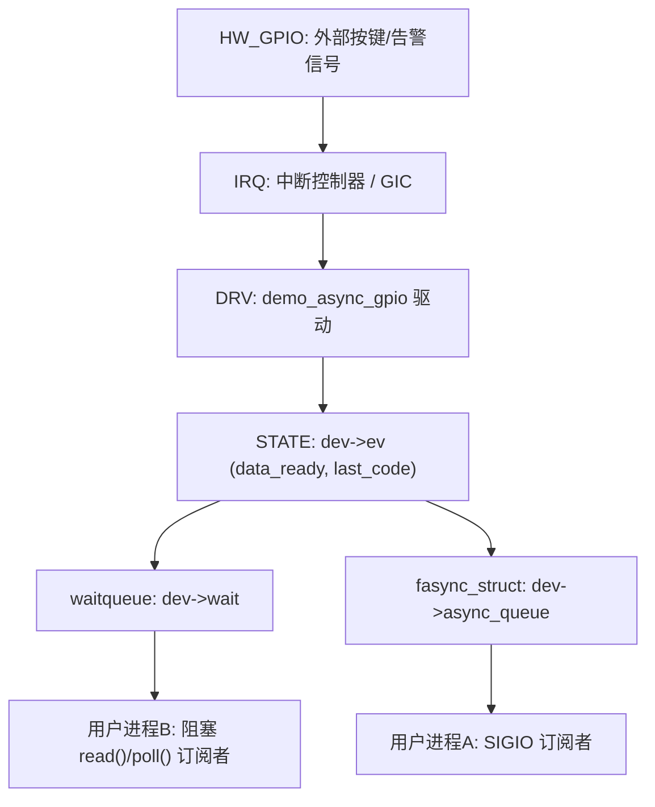
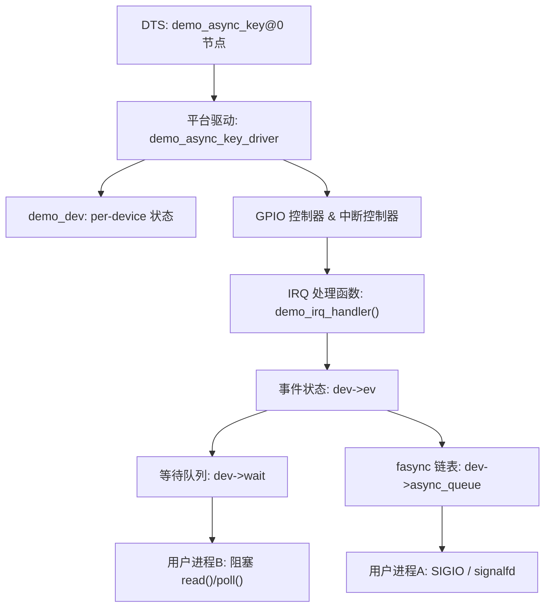
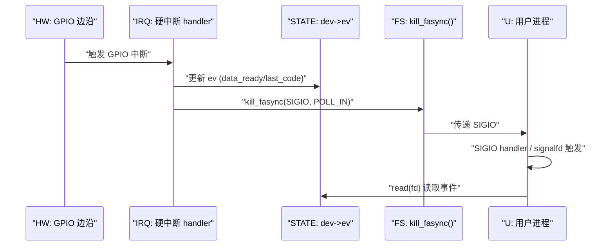
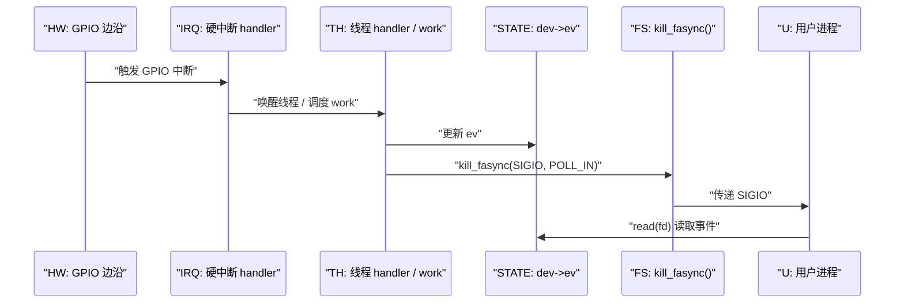
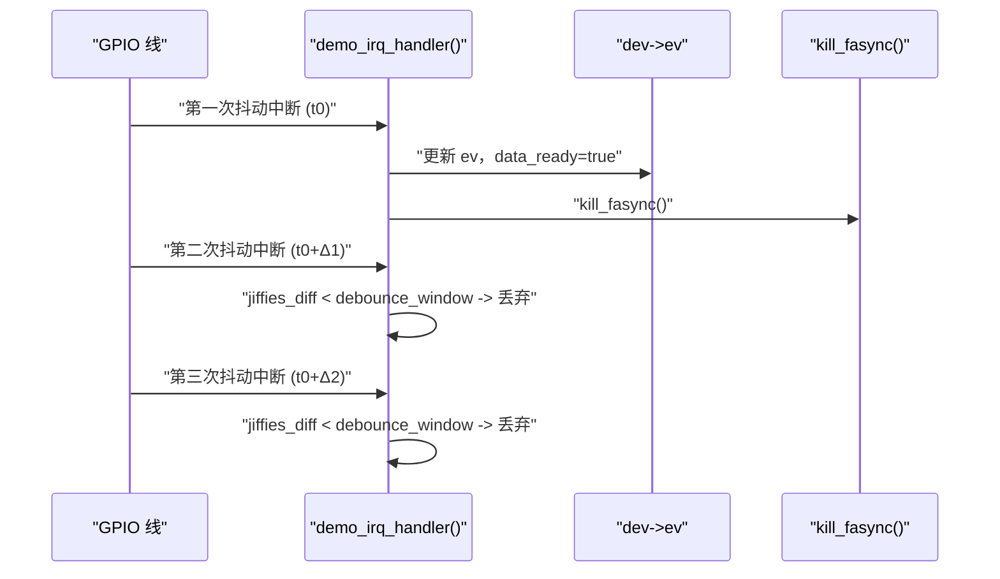
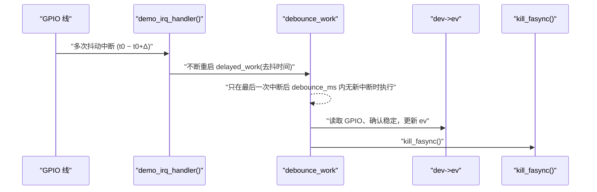

# 第 7 章 中断驱动设备的异步通知实践

> **章节内容说明**
>  本章在第 6 章“字符设备基础模式”的基础上，引入真实的**中断驱动设备**，重点围绕：
>
> - 事件来源从“软件 write()”升级为“硬件中断（GPIO、外设 IRQ 等）”；
> - 在中断上下文/下半部中调用 `kill_fasync()` 的具体模式；
> - 如何在 **GPIO 按键 / 外部事件输入** 这类典型场景中组合使用：
>    `中断 + fasync + waitqueue + poll + 去抖动/节流`。
>
> 本章最终目标，是得到一个可直接在 i.MX6ULL 环境上运行的 `demo` 驱动骨架，并形成一套“中断型设备使用 fasync 的判断与设计模板”。

------

## 7.1 适合使用 fasync 的中断型设备特征

### 7.1.1 引入：不是所有中断驱动设备都适合 fasync

从内核角度看，“中断驱动设备”只是说明 **事件来源是中断**，并不自动意味着“适合用 fasync 发 SIGIO”。
 要不要用 fasync，而不是仅仅依赖 `waitqueue + poll`，取决于至少三个维度：

1. **事件频率与重要性**
   - 事件比较稀疏、每次都相对重要（按键、告警输入、少量状态变化）→ 适合 fasync；
   - 高频、海量事件（高速采集、中断风暴）→ 用 fasync 需要非常严格的节流策略，否则会引入信号风暴。
2. **应用层结构**
   - 应用核心是“事件驱动循环”，需要统一管理多路事件（socket、管道、设备）→ 可以考虑用 `signalfd + epoll + fasync`；
   - 仅仅是一个简单阻塞 `read()` 的单线程程序 → `waitqueue + poll` 就很够用，fasync 只是可选增强。
3. **通知的粒度和语义**
   - 驱动希望在“事件发生”那一刻主动打断用户线程（信号语义）→ fasync 很合适；
   - 驱动只是需要一个“有数据时可读”的查询接口 → poll/epoll 就足够。

本小节的目标，就是给出一组**“中断型设备适配 fasync 的特征清单”**，后面章节都基于这组特征展开。

------

### 7.1.2 数据结构视角：什么样的中断事件模型适合挂在 `async_queue` 上

从数据结构角度来看，一个“适合 fasync 的中断型设备”通常满足：

1. **事件模型是“离散事件 + 简单状态机”**

   - 可以抽象为一个简单结构，例如：

     ```c
     struct demo_event_state {
     	bool		data_ready;	/* 是否存在未处理事件 */
     	u32		event_cnt;	/* 已发生事件计数（可选） */
     	u32		last_code;	/* 最近一次事件代码（按键值/告警码等） */
     };
     ```

   - 中断到来时只需要更新若干字段（计数、代码、时间戳），不需要大规模搬运数据。

2. **事件的“保留策略”简单**

   - 要么是“最近一次状态快照”（例如：当前告警状态、当前按钮状态）；
   - 要么是“小容量环形缓冲”，事件总量相对有限；
   - 这样 `kill_fasync()` 只要表达“现在有可读事件”，不需要承诺一一对应每个中断。

3. **设备状态与 fasync 订阅关系是正交的**

   - 设备内部的中断状态（pending 标志、计数器）独立于用户是否订阅 fasync；
   - 即使没有订阅者，驱动也照常处理中断，仅仅不调用 `kill_fasync()`；
   - 这样 `async_queue == NULL` 时路径保持简单，不需要特殊分支。

在这种数据结构前提下，`async_queue` 本身可以被看作：

```c
struct demo_dev {
	/* ... */
	struct fasync_struct *async_queue;	/* 谁订阅了这个事件源的 SIGIO */
	struct demo_event_state ev;		/* 这个事件源的内部状态 */
	/* ... */
};
```

> **原则：**
>  fasync 只负责 “**谁** 需要收到 SIGIO”，
>  中断驱动的数据结构负责 “**事件内容** 是什么 / 应该如何消费”。
>
> 只要这两部分是清晰分层的，fasync 的加入就不会打乱中断驱动的基本结构。

------

### 7.1.3 开发者视角：什么时候你应该给中断型设备加上 fasync

从驱动开发者的角度，可以用一组问题判断：

1. **应用是否需要“被动唤醒”而不仅仅是“等待可读”**
   - 如果应用是“上层框架负责事件循环，插件/模块只提供 fd”，往往已经有一套 poll/epoll 机制；
   - 如果应用需要在 **任何时刻被中断**（例如某些监控/告警系统希望第一时间做处理），用 SIGIO 可以减少轮询延迟。
2. **是否需要“统一的通知通道”**
   - 例如：一个进程同时监听 **socket + 管道 + 特定字符设备**；
   - 使用 `signalfd(SIGIO)` + `epoll`，可以把所有 SIGIO 汇入统一的事件循环；
   - 这时让字符设备提供 fasync，就能自然接入这套事件框架，而不仅仅依赖读阻塞。
3. **设备是否适合“低频重要事件”模型**
   - GPIO 按键、门磁开关、外部告警输入等，都属于低频重要事件：
     - 不会每秒上万次；
     - 每次都需要上层处理；
   - 这类设备用 fasync 非常合适——信号数量可控，又能确保延迟较小。
4. **是否存在“多进程监听同一事件”的需求**
   - fasync 的链表可以挂多个 file，每个订阅者都能收到报告；
   - 如果你的设备自然符合“广播式事件”的需求（如告警），fasync 的“多订阅者”能力是优势；
   - 相比之下，简单的 `read()` 往往是“谁先读谁拿走”，不适合广播语义。

如果以上问题你至少满足 2～3 条，那么可以考虑给该中断驱动设备加上 fasync 支持；否则建议优先使用 `waitqueue + poll`，避免引入额外复杂度。

------

### 7.1.4 用户/平台视角：以 i.MX6ULL GPIO 按键为例

从用户（应用开发者）与平台（SoC）视角来解构一个典型场景：**i.MX6ULL 上的 GPIO 按键/告警输入**。

1. **硬件方面**
   - 一根 GPIO 线上接一个按键或开关；
   - 配置为边沿触发中断（上升、下降或双沿）；
   - 中断频率通常很低（人按键、继电器动作等），但每次都具有明确业务含义。
2. **驱动方面**
   - 使用 `request_irq()` 或 `devm_request_irq()` 注册中断处理函数；
   - 中断 handler 中更新 `dev->ev` 状态（按键按下/释放、时间戳等）；
   - 调用 `wake_up_interruptible()` 唤醒阻塞 read；
   - 如果启用了 fasync，则再调用 `kill_fasync()` 发 SIGIO。
3. **用户态方面**
   - 某些简单应用只需要 `read()` 得到按键事件，或者用 `poll()` 等待事件发生即可；
   - 某些复杂应用（例如统一管理 UART、socket、GPIO 告警的守护进程）可能已经采用 `epoll + signalfd` 结构：
     - socket → epoll 监控；
     - GPIO 按键 → 驱动发 SIGIO，用户态通过 `signalfd(SIGIO)` 收集；
     - 所有事件在一个事件循环中处理。

在这个 i.MX6ULL 场景下，**是否加 fasync**取决于：

- 你是否希望“按键/告警事件”与其它 I/O 事件统一到同一个“信号/epoll 管线”里；
- 你的应用是否真的需要被 SIGIO 这种 “**强通知**”机制唤醒，而不是简单轮询。

本书后面会给出一个完整的 **“i.MX6ULL GPIO 中断 + fasync + SIGIO + signalfd/epoll”** 示例，让你在实际代码中看到这一组合。

------

### 7.1.5 可视化：中断驱动设备接入 fasync 的结构图

下面用一个结构图，展示“中断驱动设备 + fasync + 传统同步等待（waitqueue/poll）”三者之间的关系：



含义：

- 中断到达后，驱动更新 `STATE`（事件状态）；
- **同一份 `STATE`** 决定：
  - 谁被 `wake_up_interruptible()` 唤醒（走 waitqueue）；
  - 谁被 `kill_fasync()` 送 SIGIO（走 fasync_struct 链表）；
- 只要 `STATE` 的定义清晰、更新顺序正确，**两条通知路径自然保持一致语义**。

------

### 7.1.6 示例代码骨架：典型“适合用 fasync 的中断型设备”抽象

为了让本节不只是概念，这里给一个**非常抽象化的骨架**，只用于表达“适合用 fasync 的中断型设备”的关键特征。后面 7.7 才会给完整可编译的 i.MX6ULL GPIO demo。

```c
/* 语义性常量，避免魔法数字 */
#define DEMO_IRQ_INVALID		(-1)
#define DEMO_EVENT_NONE		0U
#define DEMO_EVENT_BUTTON_PRESSED	1U
#define DEMO_EVENT_BUTTON_RELEASED	2U

struct demo_event_state {
	bool		data_ready;	/* 是否有未处理事件 */
	u32		last_code;	/* 最近一次事件代码 */
	u32		event_cnt;	/* 发生次数统计 */
};

struct demo_dev {
	struct cdev		cdev;
	struct fasync_struct	*async_queue;

	spinlock_t		lock;
	wait_queue_head_t	wait;

	struct demo_event_state	ev;

	int			irq;
	atomic_t		open_count;
};

/* 中断处理函数：典型“低频重要事件” */
static irqreturn_t demo_irq_handler(int irq, void *dev_id)
{
	struct demo_dev *dev = dev_id;
	unsigned long flags;
	u32 event_code = DEMO_EVENT_BUTTON_PRESSED;	/* 示例：按键按下 */

	if (!dev)
		return IRQ_NONE;

	spin_lock_irqsave(&dev->lock, flags);

	/* 更新事件状态 */
	dev->ev.data_ready = true;
	dev->ev.last_code = event_code;
	dev->ev.event_cnt++;

	/* fasync: 有订阅者就发 SIGIO */
	if (dev->async_queue)
		kill_fasync(&dev->async_queue, SIGIO, POLL_IN);

	spin_unlock_irqrestore(&dev->lock, flags);

	/* 同时唤醒阻塞 read/poll 的线程 */
	wake_up_interruptible(&dev->wait);

	return IRQ_HANDLED;
}
```

这个骨架体现了三点：

1. 事件是典型的“**低频重要离散事件**”——按键按下/释放；
2. 事件状态很轻量：只需要 `data_ready` + `last_code` + 计数；
3. 通知路径清晰：**状态更新后同时走 fasync 和 waitqueue**，语义统一。

------

### 7.1.7 调试与验证：如何确认“这个中断型设备真的适合 fasync”

在实际项目中，你可以通过下列方式判断并验证：

1. **统计中断频率**
   - 查看 `/proc/interrupts` 中对应 IRQ 的计数，在真实负载下观测每秒中断次数；
   - 若频率常态在几百 Hz 以内（尤其是按键/告警级别的设备），可以考虑 fasync；
   - 若频率动辄几 kHz 甚至 MHz 级，建议谨慎使用 fasync，否则容易导致大量 SIGIO。
2. **评估事件重要性与处理路径**
   - 如果每个中断都需要用户态立即处理（如安全级告警），fasync 是加分项；
   - 如果大部分事件只是统计用途，那么仅凭 `read()` 或定期轮询即可。
3. **试验性的 demo 驱动**
   - 按 6 章 + 本章模板写一个最小 demo（不用上整个子系统）；
   - 用 SIGIO demo 程序 + `strace -e fcntl,rt_sig*` 观察：
     - SIGIO 是否次数对得上；
     - `read()` 是否总能读到对应事件。
4. **检查用户态对信号的处理能力**
   - 如果上层完全不了解信号机制，开发成本会被抬高；
   - 在没有成熟框架的情况下，可以优先用 poll/epoll，后续再升级为 fasync。

------

### 7.1.8 小结：中断型设备适配 fasync 的“特征清单”

本小节的结论可以整理成一份“适合使用 fasync 的中断型设备特征表”：

1. **事件模型**
   - 离散事件、低频重要（按键、开关、告警）；
   - 事件状态可以用简单 struct 表示，并且不需要大规模数据搬运。
2. **通知需求**
   - 需要在事件到达时主动打断用户流程，而不是单纯轮询；
   - 需要和 socket / 管道 等一起进入统一事件循环（`signalfd + epoll`）。
3. **多订阅者需求**
   - 事件天然具有“广播”性质，多个进程需要同时获知（例如系统级告警）；
   - fasync 的链表机制可以自然支持多订阅者。
4. **平台适配**
   - 中断控制器和 GPIO 子系统稳定；
   - 中断频率在可控范围内，不至于引发信号风暴。
5. **驱动实现**
   - 中断 handler 更新统一状态结构，然后同时唤醒 waitqueue + 调用 `kill_fasync()`；
   - fasync 逻辑保持薄、简单、可验证。

后续 7.2～7.7 都会围绕“**以 i.MX6ULL GPIO 按键/外部事件输入为代表的中断型设备**”展开，逐步实现：

- 具体的 GPIO 中断配置与设备树解析；
- 去抖动、节流、事件聚合策略；
- 与 `waitqueue` / `completion` / `poll` 等机制的组合使用；
- 完整的驱动 + 用户态 SIGIO / signalfd / epoll 示例。


------

## 7.2 GPIO 按键 / 外部事件输入的异步通知设计

> 本节目标：
>
> - 以 **i.MX6ULL 外部 GPIO 中断** 为场景，设计一个完整的“按键/告警输入 + fasync 异步通知”模型；
> - 明确：设备树、平台设备、`struct demo_dev`、中断 handler、fasync、waitqueue 之间的映射关系；
> - 形成后续 7.7 完整示例代码的“架构蓝图”。

------

### 7.2.1 引入：从抽象中断事件到“GPIO 按键/外部事件输入”

第 7.1 节从抽象层面给出了“适合 fasync 的中断型设备特征”。
 本节需要把抽象映射到具体平台和硬件：

- 平台：i.MX6ULL
- 事件源：GPIO 引脚上的 **按键 / 外部告警信号**
- 通信模式：
  - 驱动侧：GPIO 配置为边沿中断，使用 `request_irq()` / `devm_request_irq()`；
  - 用户侧：既可以用 `read()` / `poll()`，也可以用 **SIGIO / signalfd + epoll**。

我们要完成的不是“完整代码”，而是清晰的 **设计方案**：

1. DTS 如何描述这个按键/外部事件输入；
2. `struct demo_dev` 如何封装 GPIO 和中断相关状态；
3. 中断 handler 如何更新事件状态并触发 fasync；
4. `.read()` / `.poll()` 如何根据同一状态对用户态暴露一致语义。

------

### 7.2.2 数据结构视角：从设备树到 `struct demo_dev`

#### 1）设备树节点抽象

结合你前面章节中使用的节点风格，我们假设有一个节点描述 GPIO 中断按键/告警输入（仅作本章使用示意，后续章节可以统一成你现有的 `demo_led_key_int@0`）：

```dts
demo_async_key@0 {
	compatible = "nxp,imx6ull-async-key";
	pinctrl-names = "default";
	pinctrl-0 = <&pinctrl_demo_key>;

	/* 作为输入 GPIO */
	key-gpios = <&gpio1 18 GPIO_ACTIVE_LOW>;

	/* 使用 gpio1_18 作为中断源，下降沿触发 */
	interrupt-parent = <&gpio1>;
	interrupts = <18 IRQ_TYPE_EDGE_FALLING>;

	nxp,debounce-ms = <10>;		/* 去抖动时间，仅示意 */
};
```

要点：

- `key-gpios`：描述具体 GPIO 引脚及其电气属性；
- `interrupt-parent` / `interrupts`：描述这根线对应的 GPIO 控制器和中断号、触发类型；
- `nxp,debounce-ms`：驱动可选读取的去抖参数，用于软件去抖逻辑。

#### 2）`struct demo_dev` 的设计

在第 6 章的基础上，我们现在需要把“GPIO + 中断 + 事件状态”整合到一个设备结构体中：

```c
#define DEMO_KEY_NAME_MAX_LEN	32
#define DEMO_DEBOUNCE_DISABLED	0U

struct demo_key_event_state {
	bool		data_ready;	/* 是否存在未读按键事件 */
	u32		last_code;	/* 最近一次事件代码，比如 按下/释放 */
	u32		event_cnt;	/* 已发生事件总次数统计 */
};

struct demo_dev {
	struct device		*dev;		/* 绑定的 struct device */
	struct cdev		cdev;
	struct fasync_struct	*async_queue;

	spinlock_t		lock;
	wait_queue_head_t	wait;

	struct demo_key_event_state	ev;

	int			irq;		/* GPIO 中断号 */
	unsigned int		debounce_ms;	/* 软件去抖时间，0 表示不启用 */

	/* GPIO 描述，可选 gpiod 或旧式 gpio 编号 */
	struct gpio_desc	*gpiod_key;
	char			name[DEMO_KEY_NAME_MAX_LEN];

	atomic_t		open_count;
};
```

几个关键点：

- `ev`：承载本章的“事件状态”，你后续所有逻辑都围绕它展开；
- `async_queue`：完全继承第 6 章的用途，只负责 “订阅者列表”；
- `wait`：用于阻塞 read/poll 场景；
- `gpiod_key` 与 `irq`：紧密结合 i.MX6ULL 的 GPIO/IRQ 子系统；
- `debounce_ms`：为后续第 7.4 的去抖逻辑预留字段。

#### 3）事件编码策略

控制和用户态约定简单的 **事件编码** 有利于接口清晰。示例：

```c
#define DEMO_KEY_EVENT_NONE		0U
#define DEMO_KEY_EVENT_PRESS		1U
#define DEMO_KEY_EVENT_RELEASE		2U
```

`last_code` 的语义是：**最后一次检测到的有效边沿所对应的逻辑动作**（按下或释放），用户态读取后按照这个编码解释事件。

------

### 7.2.3 开发者视角：路径分解与职责划分

从驱动实现角度，把整个“GPIO 中断 + fasync”分解成几个路径：

1. **probe 路径**
   - 从 DTS 中解析 GPIO 和 IRQ：
     - `devm_gpiod_get()`
     - `gpiod_to_irq()` 或 `platform_get_irq()`
   - 分配并初始化 `struct demo_dev`：
     - `devm_kzalloc()`
     - `spin_lock_init()` / `init_waitqueue_head()` / `atomic_set()`
   - 注册字符设备（或 misc 设备）：
     - `alloc_chrdev_region()` + `cdev_add()`，或者 `misc_register()`。
   - 注册中断：
     - `devm_request_irq()`，并指定 handler。
2. **中断路径**
   - 硬件中断到达 → 中断 handler 被调用；
   - 读取 GPIO 电平、根据边沿类型得出事件编码（press/release）；
   - 经过去抖判断（如需要）；
   - 更新 `dev->ev` 状态；
   - 通知路径：
     - `kill_fasync(&dev->async_queue, SIGIO, POLL_IN)`；
     - `wake_up_interruptible(&dev->wait)`。
3. **文件操作路径**
   - `.open` / `.release`：参照第 6 章模板管理 `open_count` 和 fasync 节点；
   - `.fasync`：只用 `fasync_helper()` + 日志；
   - `.read`：
     - 阻塞 read 使用 `wait_event_interruptible()` 等待 `ev.data_ready == true`；
     - 读取后清 `data_ready` 并返回 `last_code`；
   - `.poll`：
     - 使用与 `wait` 同一等待队列；
     - `ev.data_ready == true` 时返回 `POLLIN | POLLRDNORM`。

#### 职责划分小结

- **probe/remove**：负责 per-device 资源与 `demo_dev` 生命周期；
- **open/release/fasync**：负责 per-file / fasync 节点生命周期；
- **中断 + read + poll**：围绕 `ev` 状态实现统一的“事件语义”。

------

### 7.2.4 用户/平台视角：对用户态暴露怎样的接口才合理

从用户态看，这样一个“GPIO 按键/外部事件输入 + fasync”设备应该具备以下特征：

1. **设备节点简单明确**
   - 举例：`/dev/demo_async_key0`；
   - 多个按键/告警输入可以用多个节点：`demo_async_key0` / `demo_async_key1` 等。
2. **数据格式清晰**
   - 每次 `read()` 返回一个固定大小结构或简单整数；
   - 例如返回一个 `struct demo_key_user_event` 或一个 `u32` 的事件编码。

简单起见，本章采用“**每次 read 返回一个 32 位事件编码**”模式（用户态用 `uint32_t` 解读）：

```c
/* 用户态视角的事件编码，与内核保持一致 */
#define DEMO_KEY_EVENT_NONE		0u
#define DEMO_KEY_EVENT_PRESS		1u
#define DEMO_KEY_EVENT_RELEASE		2u
```

用户态 `read()` 逻辑示例：

```c
uint32_t event;
ssize_t n = read(fd, &event, sizeof(event));
if (n == sizeof(event)) {
	/* 解析 event，做对应处理 */
}
```

1. **通知方式可选择**
   - 简单应用：
     - 只用阻塞 read 或 poll；
   - 复杂应用：
     - 配置 fasync 以 SIGIO 形式收到事件；
     - 或将 SIGIO 转入 `signalfd`，并在统一的 `epoll` 循环中处理。
2. **错误与边界行为明确**
   - 若没有事件：
     - 阻塞 read → 挂起直到有事件或被信号打断；
     - 非阻塞 read → 返回 `-EAGAIN` 或 `0`（具体在后面示例中明确）；
   - 如果设备被移除或关闭：
     - read/poll 返回错误；
     - 不再产生新的 SIGIO。

------

### 7.2.5 可视化：以 i.MX6ULL GPIO 为例的完整路径图

用一个流程图把 i.MX6ULL GPIO 中断场景下的主要路径串起来：



含义：

- DTS 决定硬件接线和 irq 配置；
- 平台驱动 (`probe`) 从 DTS 中解析信息，构造 `demo_dev`；
- 中断发生时由 `demo_irq_handler()` 更新 `STATE`；
- `STATE` 决定是否唤醒 `WQ` 和是否通过 `FAS` 发送 SIGIO；
- 用户态进程可以通过 SIGIO 或阻塞 read/poll 获取同一事件。

------

### 7.2.6 示例代码片段：设计层面需要的关键函数形态

这里不写完整驱动，只给出 **设计层面关键函数原型与核心逻辑片段**，后面第 7.7 会整合为完整可编译版本。

#### 1）probe：解析 DTS 并初始化设备

```c
static int demo_probe(struct platform_device *pdev)
{
	struct device *dev = &pdev->dev;
	struct demo_dev *d;
	int ret;

	d = devm_kzalloc(dev, sizeof(*d), GFP_KERNEL);
	if (!d)
		return -ENOMEM;

	d->dev = dev;
	spin_lock_init(&d->lock);
	init_waitqueue_head(&d->wait);
	atomic_set(&d->open_count, 0);
	d->ev.data_ready = false;
	d->ev.last_code = DEMO_KEY_EVENT_NONE;
	d->ev.event_cnt = 0;

	/* 从 DTS 获取 GPIO 描述 */
	d->gpiod_key = devm_gpiod_get(dev, "key", GPIOD_IN);
	if (IS_ERR(d->gpiod_key)) {
		ret = PTR_ERR(d->gpiod_key);
		dev_err(dev, "failed to get key-gpios: %d\n", ret);
		return ret;
	}

	/* 将 GPIO 转换为 IRQ，或直接用 platform_get_irq() */
	d->irq = gpiod_to_irq(d->gpiod_key);
	if (d->irq < 0) {
		dev_err(dev, "failed to get irq from gpio: %d\n", d->irq);
		return d->irq;
	}

	/* 读取可选去抖配置 */
	of_property_read_u32(dev->of_node,
			     "nxp,debounce-ms",
			     &d->debounce_ms);
	if (d->debounce_ms == 0)
		d->debounce_ms = DEMO_DEBOUNCE_DISABLED;

	/* 注册字符设备 / misc 设备（略，7.7 中完整给出） */

	/* 注册中断 */
	ret = devm_request_irq(dev, d->irq,
			       demo_irq_handler,
			       IRQF_TRIGGER_FALLING,
			       "demo_async_key", d);
	if (ret) {
		dev_err(dev, "request_irq failed: %d\n", ret);
		/* 其它资源由 devm 自动释放 */
		return ret;
	}

	platform_set_drvdata(pdev, d);

	return 0;
}
```

这里体现了：

- 使用 `devm_*` 管理 per-device 资源（内存、GPIO、IRQ）；
- 为后续 fasync/事件处理填充 `demo_dev` 的基础字段。

#### 2）中断 handler：从 GPIO 到事件状态再到通知

```c
static irqreturn_t demo_irq_handler(int irq, void *dev_id)
{
	struct demo_dev *d = dev_id;
	unsigned long flags;
	int value;
	u32 event_code;

	if (!d)
		return IRQ_NONE;

	/* 读取 GPIO 当前电平 */
	value = gpiod_get_value(d->gpiod_key);

	/* 简单示例：低电平为按下，高电平为释放 */
	if (value == 0)
		event_code = DEMO_KEY_EVENT_PRESS;
	else
		event_code = DEMO_KEY_EVENT_RELEASE;

	/* 此处预留去抖逻辑（7.4 中展开），目前略过 */

	spin_lock_irqsave(&d->lock, flags);

	d->ev.data_ready = true;
	d->ev.last_code = event_code;
	d->ev.event_cnt++;

	if (d->async_queue)
		kill_fasync(&d->async_queue, SIGIO, POLL_IN);

	spin_unlock_irqrestore(&d->lock, flags);

	wake_up_interruptible(&d->wait);

	return IRQ_HANDLED;
}
```

和第 6 章的中断示例相比，这里多了：

- 从 `gpiod_key` 读取实际电平；
- 根据电平映射到自定义事件编码（press/release）；
- 后面可以在“去抖 + 边沿状态机”基础上继续扩展。

------

### 7.2.7 调试与验证：设计层面的检查点

在真正写完 7.7 的完整代码之前，可以先拿本节的设计做一些“思维检查”：

1. **结构合理性**
   - `demo_dev` 是否把 **GPIO + IRQ + 事件状态 + 通知机制** 封装在一个统一对象里；
   - fasync 与 waitqueue 是否只依赖统一的 `ev` 状态。
2. **路径完整性**
   - DTS → probe → demo_dev → IRQ handler → ev → kill_fasync + wake_up → read/poll/SIGIO
   - 是否每条路径都能找到落点，没有“不可达的状态”。
3. **行为一致性**
   - 当 `ev.data_ready == true` 时：
     - `read()` 是否能读到事件编码；
     - `poll()` 是否返回 `POLLIN`；
     - fasync 是否会发 SIGIO。
   - 若某一环节没有使用（例如用户不开启 fasync），是否不会影响其他路径。
4. **可扩展性**
   - 后续加入去抖、节流、事件队列时，是否可以在 `demo_dev` 基础上自然扩展，而不破坏接口语义；
   - 是否可以支持多个 GPIO 输入（多个 `demo_dev` 实例或一个 dev 带 channel 数组）。

------

### 7.2.8 小结：从“抽象中断事件”到“i.MX6ULL GPIO + fasync”设计蓝图

本节在第 7.1 的抽象基础上，给出了一个面向 i.MX6ULL 的具体设计方案，主要完成了：

1. 从设备树节点到 `demo_dev` 的字段映射：
   - `key-gpios` → `gpiod_key` → `irq`；
   - `interrupts` → `devm_request_irq()`；
   - `nxp,debounce-ms` → `debounce_ms`。
2. 将 fasync 与 GPIO 中断绑定到统一的事件状态结构 `ev`：
   - 中断 handler 负责更新 `ev`，并调用 `kill_fasync()` + `wake_up_interruptible()`；
   - `.read()` / `.poll()` 与 SIGIO 都基于 `ev` 判定行为。
3. 明确了驱动、平台和用户态三方的职责边界：
   - DTS 描述硬件连接；
   - 驱动实现事件检测和通知分发；
   - 用户态根据事件编码决定业务行为，并可以选择使用阻塞 read、poll 还是 SIGIO。

在这个设计蓝图之上，接下来的小节会逐步填上“现实世界”的复杂细节：

- **7.3**：中断上下文、tasklet、workqueue 与 `kill_fasync()` 的时序选择（在这个 GPIO 场景下如何权衡）；
- **7.4**：去抖动、节流与事件聚合策略（结合 `nxp,debounce-ms`）；
- **7.5**：与 `waitqueue` / `completion` / `poll` 的组合使用模式（在这个具体场景中展开）；
- **7.6**：典型错误模式在 GPIO 场景下的具体表现；
- **7.7**：基于 i.MX6ULL GPIO 中断的完整 demo 异步通知驱动结构与代码。


------

## 7.3 中断上下文、tasklet、workqueue 与 `kill_fasync()` 的时序选择

> 本节目标：
>
> - 结合“i.MX6ULL GPIO + 按键/外部事件输入”的实际场景，讨论：
>   - 直接在 **硬中断上下文** 调用 `kill_fasync()` 的利弊；
>   - 使用 **threaded IRQ / workqueue** 作为下半部再调用 `kill_fasync()` 的适用场景；
> - 给出一套可操作的 **决策过程**：
>   - 什么时候可以“硬中断里直接 `kill_fasync()`”；
>   - 什么时候必须“在下半部（线程/工作队列）中 `kill_fasync()`”。

------

### 7.3.1 引入：同一个 GPIO 事件，可能有多种“通知时机”

以上一节的 i.MX6ULL GPIO 按键为例，在中断到来时我们至少有三种选择：

1. **硬中断 handler 中直接调用 `kill_fasync()`**
2. **使用 threaded IRQ（`request_threaded_irq()`），在线程 handler 中调用 `kill_fasync()`**
3. **在硬中断 handler 中仅调度 workqueue / tasklet，由工作函数再调用 `kill_fasync()`**

从 ABI（对用户）角度看，这三种方式的“最终效果”都是：

> 用户态在某个时间点收到 SIGIO，再通过 `read()` / `signalfd` / `epoll` 读出事件。

但从内核实现角度，这三种方式对以下因素影响极大：

- 中断处理时间（中断延迟、系统实时性）；
- 允许使用的锁类型（自旋锁 vs mutex 等）；
- 是否可以访问慢速总线（I2C/SPI）、调度线程、sleep 等；
- 不同 CPU 上的缓存一致性与可见性问题。

本节要做的事情，就是**在“GPIO 按键/告警输入”这个具体场景下，把这三种选择的适用边界讲清楚**。

------

### 7.3.2 数据结构视角：哪些状态必须在“同一个上下文”里完成

在 7.2 的 `demo_dev` 中，我们使用了如下事件状态结构：

```c
struct demo_key_event_state {
	bool		data_ready;
	u32		last_code;
	u32		event_cnt;
};
```

中断路径的关键逻辑是：

1. 在某个上下文（硬中断 / 线程 / 工作队列）中：

   ```c
   spin_lock_irqsave(&d->lock, flags);
   d->ev.data_ready = true;
   d->ev.last_code = event_code;
   d->ev.event_cnt++;
   if (d->async_queue)
   	kill_fasync(&d->async_queue, SIGIO, POLL_IN);
   spin_unlock_irqrestore(&d->lock, flags);
   wake_up_interruptible(&d->wait);
   ```

2. `.read()` / `.poll()` 在进程上下文中读取 `ev`，并基于 `data_ready` 做判断。

**从一致性角度看**，有一条硬约束：

> “更新 `ev` 状态”和“调用 `kill_fasync()`”必须在 **同一个“状态视角”下完成**，
>  即在同一个锁保护的临界区内，或者至少满足“`data_ready == true` 在 `kill_fasync()` 的所有观察者看来已经成立”。

因此，在选择“在哪里 `kill_fasync()`”时，必须同时考虑：

- 状态更新与通知之间是否存在**其它异步操作**（例如下半部、工作队列之间的延迟）；
- 这段延迟内，是否可能有 `read()` / `poll()` 先一步观察到“尚未更新的状态”。

总结一句：**无论你放在硬中断还是下半部，必须保证：发 SIGIO 对应的时刻，`ev.data_ready` 已经变成 true（或对应的事件状态），且不会再被回滚。**

在这个前提下，我们可以分别考察三种模式。

------

### 7.3.3 方案一：在硬中断上下文中直接调用 `kill_fasync()`

#### 1）基本形态

```c
static irqreturn_t demo_irq_handler(int irq, void *dev_id)
{
	struct demo_dev *d = dev_id;
	unsigned long flags;
	u32 event_code;

	if (!d)
		return IRQ_NONE;

	/* 读取电平、计算 event_code ... */

	spin_lock_irqsave(&d->lock, flags);

	d->ev.data_ready = true;
	d->ev.last_code = event_code;
	d->ev.event_cnt++;

	if (d->async_queue)
		kill_fasync(&d->async_queue, SIGIO, POLL_IN);

	spin_unlock_irqrestore(&d->lock, flags);

	wake_up_interruptible(&d->wait);

	return IRQ_HANDLED;
}
```

特点：

- **优点**
  - 延迟最小：中断到达 → 状态更新 → `kill_fasync()` → 用户态 SIGIO，路径最短；
  - 实现简单，无需额外线程或工作队列；
  - 适合“非常简单”的事件源（GPIO 读取 + 少量标志位更新）。
- **限制**
  - handler 运行在硬中断上下文：
    - 不能睡眠（不能使用 mutex、`msleep` 等）；
    - 不适合做复杂运算或访问慢速总线；
  - 若中断频率偏高，信号发送 + 调度开销会增加中断处理时间。

对“GPIO 按键 / 低频告警输入”这类典型应用来说：

- 中断频率非常低（人手按键不可能 1ms 几百次）；
- 中断 handler 里的工作量非常小（读取 GPIO + 简单状态更新）；
- 使用硬中断直接 `kill_fasync()` 通常是 **完全可接受** 的。

#### 2）适用条件归纳

你可以用下面几条判断条件来做快速决策：

- 中断处理逻辑是否足够简单：
  - 只做：读寄存器/GPIO → 更新几项字段 → 调用 `kill_fasync()`；
  - 不做：I2C/SPI 访问、大量运算、复杂字符串处理。
- 中断频率是否低：
  - 人为操作（按键）级别；
  - 或硬件告警的重要事件，频率有限。
- 对系统延迟是否有严格要求：
  - 如果确实希望“事件到来那一刻尽可能快打断用户”，硬中断路径优先。

若以上条件基本满足，“硬中断中直接 `kill_fasync()`”是最简单、延迟最小、**也是本书在 GPIO 场景中优先推荐的模式**。

------

### 7.3.4 方案二：使用 threaded IRQ，在线程 handler 中 `kill_fasync()`

#### 1）基本形态

```c
static irqreturn_t demo_irq_handler(int irq, void *dev_id)
{
	/* 硬中断处理函数只做“确认有中断” */
	return IRQ_WAKE_THREAD;
}

static irqreturn_t demo_irq_thread(int irq, void *dev_id)
{
	struct demo_dev *d = dev_id;
	unsigned long flags;
	u32 event_code;

	if (!d)
		return IRQ_NONE;

	/* 线程上下文，可以适度做更多工作
	 * 包括 I2C/SPI 读写、复杂状态机等 */
	/* 例如：通过 I2C 读取一个寄存器获取事件信息 */

	spin_lock_irqsave(&d->lock, flags);

	d->ev.data_ready = true;
	d->ev.last_code = event_code;
	d->ev.event_cnt++;

	if (d->async_queue)
		kill_fasync(&d->async_queue, SIGIO, POLL_IN);

	spin_unlock_irqrestore(&d->lock, flags);

	wake_up_interruptible(&d->wait);

	return IRQ_HANDLED;
}
```

注册 IRQ 时使用 `request_threaded_irq()`：

```c
ret = devm_request_threaded_irq(dev, d->irq,
				demo_irq_handler,     /* 硬中断 */
				demo_irq_thread,      /* 线程 handler */
				IRQF_TRIGGER_FALLING | IRQF_ONESHOT,
				"demo_async_key", d);
```

特点：

- **优点**
  - 将实际处理逻辑放在线程上下文中：
    - 可以使用可能会睡眠的锁（mutex）和 API（如 I2C 传输）；
    - 适合“中断里需要做适量慢操作”的场景。
  - 硬中断 handler 极短，只负责返回 `IRQ_WAKE_THREAD`。
- **限制**
  - 相比硬中断直接 `kill_fasync()`，多了一次调度开销（从硬中断唤醒线程 handler）；
  - 若 `demo_irq_thread` 内逻辑仍然复杂、执行过久，会影响同一 IRQ 线上的其他中断；
  - 需要用 `IRQF_ONESHOT` 确保线程 handler 不被并发执行（通常推荐）。

对 i.MX6ULL GPIO 按键而言，如果你需要在中断后通过 I2C 读取某个外设寄存器确认按键状态、做较重处理，那么：

- **threaded IRQ 是更合适的选择**；
- 但对单纯 GPIO 电平检测，threaded IRQ 通常是“可选而非必需”。

#### 2）适用条件归纳

当同时满足以下条件时，可以考虑使用 threaded IRQ：

- 中断处理逻辑需要做 **相对慢** 的操作：
  - 访问 I2C/SPI 设备；
  - 调用会睡眠的 API；
  - 简单的算法处理但仍不希望在硬中断里做。
- 中断频率中等（不是极低、也不是极高），要平衡处理时间和实时性：
  - 例如几十 Hz～几百 Hz 范围的外设事件。
- 能接受“比硬中断略大但可控”的延迟。

------

### 7.3.5 方案三：硬中断中调度 workqueue，在工作函数中 `kill_fasync()`

#### 1）基本形态

```c
struct demo_dev {
	/* ... */
	struct work_struct	work;
	/* 或者 struct delayed_work debounce_work; */
	/* ... */
};

static irqreturn_t demo_irq_handler(int irq, void *dev_id)
{
	struct demo_dev *d = dev_id;

	if (!d)
		return IRQ_NONE;

	/* 硬中断中只调度工作队列 */
	schedule_work(&d->work);

	return IRQ_HANDLED;
}

static void demo_work_func(struct work_struct *work)
{
	struct demo_dev *d =
		container_of(work, struct demo_dev, work);
	unsigned long flags;
	u32 event_code;

	/* 这里是进程上下文，允许适度复杂操作 */

	/* 例如：读取 GPIO、电平辅助判断、去抖时间戳判断等 */

	spin_lock_irqsave(&d->lock, flags);

	d->ev.data_ready = true;
	d->ev.last_code = event_code;
	d->ev.event_cnt++;

	if (d->async_queue)
		kill_fasync(&d->async_queue, SIGIO, POLL_IN);

	spin_unlock_irqrestore(&d->lock, flags);

	wake_up_interruptible(&d->wait);
}
```

特点：

- **优点**
  - 与 threaded IRQ 类似，工作函数运行在进程上下文，可以做稍慢的工作；
  - 多个设备可以共用一套系统工作队列，减少线程数量；
  - 适合需要在中断后做适度延迟处理的情况（例如软去抖、合并事件）。
- **限制**
  - 中断到真正发 SIGIO 之间的路径更长（硬中断 → 调度 work → 调度工作线程）；
  - 在事件间隔极短的情况下，如果不做限流，可能出现工作队列里排大量 work 的问题（通常可以用 `queue_work()` + `work_pending()` 防止重复排队）。

#### 2）与去抖/节流结合的典型场景

在 GPIO 按键场景中，如果你打算在软件层做去抖/节流，可以利用 workqueue：

- 在硬中断中仅记录“第一次边沿时间”并调度 `delayed_work`；
- 在 `delayed_work` 到期时再次读取 GPIO 电平，判断是否稳定；
- 若稳定，再更新 `ev` 并调用 `kill_fasync()`。

这部分会在 7.4 中展开，这里只先说明：**workqueue 模式与“去抖/节流/事件聚合”天然适配**，但要注意控制工作量和排队策略。

------

### 7.3.6 在 GPIO 按键场景下的具体决策建议

结合 i.MX6ULL GPIO 按键的现实特征，可以给出一份“**专门针对 GPIO 的决策建议**”：

1. **最简单场景：边沿中断 + 低频按键 + 无复杂处理需求**

   建议：**硬中断 handler 中直接 `kill_fasync()`**，代码最简单，延迟最小。

   - 中断 handler 做的事情仅包括：
     - 读取 GPIO 电平；
     - 映射到事件编码（press/release）；
     - 更新 `ev`；
     - 发信号 + 唤醒 waitqueue。
   - 不需要 threaded IRQ 和工作队列。

2. **需要软件去抖但频率仍然很低**

   - 若去抖逻辑非常轻量（简单计数、时间戳判断），仍可以在硬中断或 threaded IRQ 中完成；
   - 若去抖需要 `delayed_work` 等机制：
     - 可以在硬中断中只安排 `delayed_work`；
     - 在 `delayed_work` 工作函数中运行去抖逻辑 + `kill_fasync()`。

   具体怎么选，取决于你对去抖复杂度的设计，7.4 会给出两种不同复杂度方案。

3. **需要访问外部设备确认事件（如通过 I2C 扩展 GPIO）**

   - 不建议在硬中断 handler 中访问 I2C/SPI；
   - 建议使用 **threaded IRQ** 或 **workqueue** 完成外设访问后，再更新 `ev` 和 `kill_fasync()`。

4. **中断频率中等且不稳定，可能有抖动/噪声**

   - 强烈建议配合去抖/节流（7.4）；
   - 并在 `workqueue` 或 threaded IRQ 中合并多个事件，避免信号风暴。

------

### 7.3.7 可视化：三种时序模式对比

用一个时序图对比“硬中断直接 `kill_fasync()`”与“threaded IRQ/工作队列模式”的差异。

#### 1）硬中断直接 `kill_fasync()`



#### 2）threaded IRQ / workqueue 模式



**区别在于：**

- 硬中断模式：路径短但上下文限制多；
- 线程/work 模式：路径长一点但可做更多工作，更适合复杂事件处理。

------

### 7.3.8 小结：以 GPIO 场景为例的“时序选择”结论

本节以 i.MX6ULL GPIO 按键/告警场景为核心，给出了以下结论：

1. **硬中断中直接调用 `kill_fasync()` 是完全合法且常见的模式**，尤其适用于：
   - 低频、简单的 GPIO 事件；
   - 中断 handler 中只做轻量状态更新；
   - 对延迟敏感、希望快速向用户发送 SIGIO 的场景。
2. **threaded IRQ 与 workqueue 是“复杂事件处理”的工具**，适用于：
   - 需要访问外设、执行耗时逻辑、使用可能睡眠的 API；
   - 需要在软层面进行去抖、节流、事件聚合；
   - 不希望在硬中断中做太多工作的场景。
3. **无论选择哪种模式，必须保证：**
   - 状态更新（`dev->ev`）与 `kill_fasync()` 的语义一致；
   - 发出 SIGIO 的那一刻，`.read()` / `.poll()` 一定能观察到与之对应的状态；
   - 这通常通过“在同一锁保护下先更新状态，再调用 `kill_fasync()`”来实现。

后续：

- **7.4** 将在本节的基础上，专门针对“GPIO 按键/告警输入”的 **去抖动、节流与事件聚合策略** 展开，并给出“在 workqueue / delayed_work 里做去抖 + `kill_fasync()`”的具体实现模式；
- **7.5** 则会把 fasync 与 `waitqueue` / `completion` / `poll` 的组合使用放到这个 GPIO 场景里，给出几种成熟的搭配模式。


------

## 7.4 去抖动、节流与事件聚合策略

> **本节目标**
>
> - 围绕 GPIO 按键 / 外部事件输入，说明为什么在中断 + fasync 场景下必须认真对待“抖动”和“频率控制”；
> - 给出两类实现方案：
>   - 轻量级：“中断内基于时间窗的简单去抖/节流”；
>   - 严格型：“基于 `delayed_work` 的软件去抖 + 事件聚合”；
> - 明确在两种方案下，`kill_fasync()` 的触发时机如何设计，如何保证与 `.read()` / `.poll()` 语义一致。

------

### 7.4.1 引入：电平抖动 + 信号风暴 + 事件丢失

在 GPIO 按键 / 开关 / 继电器接点这类场景中，中断线存在以下典型特性：

1. **机械抖动（bounce）**
   - 按键按下/释放的短时间内，接点会出现多次快速断开/接通；
   - 表现在中断上就是短时间内多个上升/下降沿。
2. **噪声触发**
   - EMI、供电干扰等可能导致偶发边沿；
   - 如果不加过滤，驱动会把这些噪声当成真实事件。
3. **信号风暴**
   - 如果每一次抖动都触发中断，且中断 handler 每次都调用 `kill_fasync()`，用户态会收到大量 SIGIO；
   - 对应用来说，真正有意义的只是“按下”和“释放”，不希望关注抖动阶段的所有边沿。

因此，在 **“中断 + fasync + SIGIO”** 的组合中，必须设计合理的策略：

- 抑制抖动带来的多余中断；
- 控制向用户态发出的 SIGIO 数量；
- 当存在多次抖动时，尽量只向用户态报告“稳定后的结果”。

------

### 7.4.2 数据结构视角：去抖/节流状态放在哪里

在 7.2 的 `struct demo_dev` 基础上，为了支持去抖/节流，需要增加一些字段：

```c
#define DEMO_DEBOUNCE_DISABLED		0U
#define DEMO_DEBOUNCE_MIN_MS		1U

struct demo_key_event_state {
	bool		data_ready;
	u32		last_code;
	u32		event_cnt;
};

struct demo_dev {
	struct device		*dev;
	struct cdev		cdev;
	struct fasync_struct	*async_queue;

	spinlock_t		lock;
	wait_queue_head_t	wait;

	struct demo_key_event_state	ev;

	int			irq;
	unsigned int		debounce_ms;		/* 去抖时间 */
	unsigned long		last_irq_jiffies;	/* 上一次中断时间戳 */

	struct gpio_desc	*gpiod_key;

	/* 用于严格去抖 / 事件聚合 */
	struct delayed_work	debounce_work;
	u32			pending_code;		/* 候选事件编码 */
	bool			debounce_pending;	/* 是否已有待处理事件 */

	atomic_t		open_count;
};
```

这里分别为两种策略预留状态：

1. **基于 `last_irq_jiffies` 的简单节流/去抖**
   - 中断发生时，比较 `jiffies - last_irq_jiffies` 与 `debounce_ms` 对应的 jiffies；
   - 时间间隔过短时直接丢弃该中断；
   - 适合“抖动不太严重、对严格性要求不高”的场景。
2. **基于 `delayed_work` 的严格去抖与事件聚合**
   - 中断发生时不立即更新 `ev`，而是记录 `pending_code` 并安排 `delayed_work` 延时执行；
   - 在延时到期时再次读取 GPIO 电平，如果稳定，再更新 `ev` 和 `kill_fasync()`；
   - 若在去抖窗口内多次中断，可以合并/覆盖为一次有效事件。

**关键：**
 无论采用哪种方案，`ev` 的字段仍然是对外唯一的事件状态；
 `kill_fasync()` 和 `wake_up_interruptible()` 只在 `ev` 被确认可用时调用。

------

### 7.4.3 开发者视角：两种策略的对比与决策

从驱动开发者角度，可以这样划分两种方案的适用范围：

1. **简单时间窗去抖/节流（基于 `jiffies`）**

   适用条件：

   - 按键抖动时间范围已知，并且不太长（如 < 10ms）；
   - 对“极端抖动形态”不要求严格处理；
   - 可以接受少量噪声事件被视作“独立按键”，但数量有限。

   特点：

   - 代码简单，全部在中断 handler 中完成；
   - 不需要额外 workqueue；
   - 延迟仅由中断路径决定。

2. **严格去抖 + 事件聚合（基于 `delayed_work`）**

   适用条件：

   - 按键/开关抖动严重，且应用对事件边界要求严格；
   - 希望在软件层“看到的事件”完全是“稳定后”的按下/释放；
   - 能接受额外几毫秒的去抖延迟。

   特点：

   - 实现更复杂，需要使用 `delayed_work` 或 hrtimer；
   - 中断 handler 中只负责调度工作，对实时性负担小；
   - `kill_fasync()` 在工作函数中调用，意味着信号有固定的延时。

本书在后续示例中会 **同时给出两种实现**，你可以在不同项目中按需选择。

------

### 7.4.4 用户/平台视角：对应用暴露怎样的行为是合理的

从用户态角度，应当明确以下几点：

1. **每次 `read()` 返回的事件应该是“去抖后的语义事件”，而不是“物理抖动边沿”**
   - 对按键来说，用户更关心“按下”和“释放”，而不是抖动产生的 N 个边沿；
   - 因此无论采用哪种去抖策略，最终反馈的 `last_code` 都应该是语义层事件。
2. **`debounce_ms` 带来的延迟是可预期的**
   - 在使用严格去抖方案时，应用可能会观察到“按键按下 → 若干毫秒后才收到 SIGIO”；
   - 这种延迟应该在接口文档中说明好，以免误解为驱动响应慢。
3. **节流策略可能会合并快速重复事件**
   - 如果应用希望识别“快速连击”，则需要合理设置 `debounce_ms` 或关闭节流；
   - 对于告警类事件，通常希望合并大量抖动，保证“每次告警只报告一次”。

从平台（i.MX6ULL）视角，由于 GPIO 控制器本身只提供基础中断功能，不主动做去抖，所以驱动层策略就显得重要。
 软去抖逻辑应当尽量放在单个驱动之内，而不是散落在多个用户程序中。

------

### 7.4.5 可视化：两种去抖策略的时间线

#### 1）简单时间窗去抖（基于 `jiffies`）



可见：只有第一次在时间窗外的中断会触发事件，其余被丢弃。

#### 2）基于 `delayed_work` 的严格去抖



可见：只有抖动结束后、信号稳定一个去抖窗口时，才真正更新状态并发 SIGIO。

------

### 7.4.6 示例代码：两种去抖方案的具体实现

下面给出两个可直接使用的内核代码片段。
 注意：仅展示与去抖、`kill_fasync()` 时机相关的部分，完整驱动会在 7.7 整合。

#### 7.4.6.1 方案一：中断内基于时间窗的简单去抖/节流

关键字段：

```c
#define DEMO_DEBOUNCE_DISABLED		0U

struct demo_dev {
	/* ... 其他字段略 ... */
	unsigned int		debounce_ms;
	unsigned long		last_irq_jiffies;
	/* ... */
};
```

初始化（在 `probe()` 中）：

```c
d->last_irq_jiffies = 0;
/* 如果 DTS 没有配置 nxp,debounce-ms，则可选择默认值 */
if (d->debounce_ms == DEMO_DEBOUNCE_DISABLED)
	d->debounce_ms = 10U;	/* 默认 10ms 去抖窗口 */
```

中断处理函数：

```c
static irqreturn_t demo_irq_handler_simple(int irq, void *dev_id)
{
	struct demo_dev *d = dev_id;
	unsigned long flags;
	unsigned long now_jiffies;
	unsigned long interval_jiffies;
	int value;
	u32 event_code;

	if (!d)
		return IRQ_NONE;

	now_jiffies = jiffies;

	if (d->debounce_ms != DEMO_DEBOUNCE_DISABLED) {
		interval_jiffies = msecs_to_jiffies(d->debounce_ms);

		/* 距离上一次有效事件太近，则认为是抖动，直接丢弃 */
		if (time_before(now_jiffies,
				d->last_irq_jiffies + interval_jiffies)) {
			return IRQ_HANDLED;
		}

		/* 更新 last_irq_jiffies，只要通过了时间窗就视为新的事件 */
		d->last_irq_jiffies = now_jiffies;
	}

	/* 读取 GPIO 电平 */
	value = gpiod_get_value(d->gpiod_key);

	if (value == 0)
		event_code = DEMO_KEY_EVENT_PRESS;
	else
		event_code = DEMO_KEY_EVENT_RELEASE;

	spin_lock_irqsave(&d->lock, flags);

	d->ev.data_ready = true;
	d->ev.last_code = event_code;
	d->ev.event_cnt++;

	if (d->async_queue)
		kill_fasync(&d->async_queue, SIGIO, POLL_IN);

	spin_unlock_irqrestore(&d->lock, flags);

	wake_up_interruptible(&d->wait);

	return IRQ_HANDLED;
}
```

说明：

- 去抖逻辑完全在中断 handler 中完成；
- 若中断间隔小于 `debounce_ms` 对应的 jiffies，直接 `return IRQ_HANDLED`，不更新 `ev`，也不发 SIGIO；
- `last_irq_jiffies` 仅在通过时间窗判定后更新；
- 对用户态来说，看到的是“经过简单去抖后”的按键事件。

#### 7.4.6.2 方案二：基于 `delayed_work` 的严格去抖与事件聚合

关键字段（在 `struct demo_dev` 中）：

```c
struct demo_dev {
	/* ... */
	unsigned int		debounce_ms;
	struct delayed_work	debounce_work;
	u32			pending_code;
	bool			debounce_pending;
	/* ... */
};
```

初始化（在 `probe()` 中）：

```c
INIT_DELAYED_WORK(&d->debounce_work, demo_debounce_work_func);
d->pending_code = DEMO_KEY_EVENT_NONE;
d->debounce_pending = false;
```

中断 handler：

```c
static irqreturn_t demo_irq_handler_debounce(int irq, void *dev_id)
{
	struct demo_dev *d = dev_id;
	int value;
	u32 event_code;
	unsigned long delay_jiffies;

	if (!d)
		return IRQ_NONE;

	/* 读取 GPIO 当前电平 */
	value = gpiod_get_value(d->gpiod_key);

	if (value == 0)
		event_code = DEMO_KEY_EVENT_PRESS;
	else
		event_code = DEMO_KEY_EVENT_RELEASE;

	/* 记录候选事件编码 */
	d->pending_code = event_code;
	d->debounce_pending = true;

	if (d->debounce_ms == DEMO_DEBOUNCE_DISABLED)
		d->debounce_ms = 10U;

	delay_jiffies = msecs_to_jiffies(d->debounce_ms);

	/* 在去抖时间内重复触发中断，只会重新排程同一个 delayed_work */
	mod_delayed_work(system_wq, &d->debounce_work, delay_jiffies);

	return IRQ_HANDLED;
}
```

去抖工作函数：

```c
static void demo_debounce_work_func(struct work_struct *work)
{
	struct demo_dev *d =
		container_of(to_delayed_work(work),
			     struct demo_dev, debounce_work);
	unsigned long flags;
	int value;
	u32 stable_code;

	/* 若没有 pending 事件，直接返回 */
	if (!d->debounce_pending)
		return;

	/* 去抖时间已过，再次读取 GPIO 电平确认最终状态 */
	value = gpiod_get_value(d->gpiod_key);

	if (value == 0)
		stable_code = DEMO_KEY_EVENT_PRESS;
	else
		stable_code = DEMO_KEY_EVENT_RELEASE;

	/* 根据需要，也可以选择与 pending_code 对比，决定是否丢弃 */

	spin_lock_irqsave(&d->lock, flags);

	d->ev.data_ready = true;
	d->ev.last_code = stable_code;
	d->ev.event_cnt++;
	d->debounce_pending = false;

	if (d->async_queue)
		kill_fasync(&d->async_queue, SIGIO, POLL_IN);

	spin_unlock_irqrestore(&d->lock, flags);

	wake_up_interruptible(&d->wait);
}
```

说明：

- 中断 handler 不再直接触发事件，而是记录 `pending_code` 并 `mod_delayed_work()`；
- 多次抖动导致的中断只会不断重新排程同一个 `delayed_work`，不会重复排队；
- 只有在“最后一个中断之后 `debounce_ms` 时间内未再有新中断”时，`demo_debounce_work_func()` 才会执行；
- 在工作函数中再次读取 GPIO 电平，以确认稳定状态，然后更新 `ev` 并调用 `kill_fasync()`；
- 这样对用户态来说，收到的 SIGIO 只对应“抖动结束后的稳定事件”，不会看到抖动。

------

### 7.4.7 调试与验证：如何确认去抖/节流策略正确工作

在实际验证时，可以按以下步骤进行：

1. **启用调试日志**
   - 在中断 handler、`debounce_work` 中加 `pr_debug()`，输出：
     - 当前 jiffies；
     - `pending_code` / `stable_code`；
     - `ev.event_cnt`；
   - 观察在一次按键动作期间，日志输出次数与预期是否一致。
2. **配合 `strace` 观察用户态行为**
   - 使用 SIGIO demo 应用 + `strace -e rt_sig*`；
   - 观察每次按键动作对应多少次 SIGIO；
   - 对比简单节流 vs 严格去抖的差异。
3. **在应用层统计事件**
   - 在用户态程序中统计收到的事件数量、时间间隔；
   - 尝试快速按键/抖动，观察是否产生多余事件。
4. **调整 `debounce_ms` 参数**
   - DTS 中设置不同 `nxp,debounce-ms` 值（如 5 / 10 / 20 ms）；
   - 观察不同配置下实际效果，找到适合所用按键/继电器的参数范围。
5. **验证极端情况**
   - 长时间按住不放：应只有一次“按下”事件（视设计而定）；
   - 快速连按：若间隔 > `debounce_ms`，应被识别为多次独立按键事件；
   - 抖动极严重的劣质按键：严格去抖方案会比简单节流更稳定。

------

### 7.4.8 小结：去抖/节流/聚合与 fasync 的关系

本节从 GPIO 按键/外部事件输入的角度，建立了如下事实：

1. **去抖/节流/事件聚合是“事件产生侧”的问题，而 fasync 是“事件分发机制”**
   - 去抖/节流决定“什么时候认为一个事件有效”；
   - 一旦事件有效，才通过 fasync / waitqueue / poll 让用户态观察到。
2. **简单时间窗节流方案：快速、中断内完成，但不够严格**
   - 优点：实现简单、延迟低、对中断场景友好；
   - 缺点：极端抖动模式下可能仍产生多次事件；
   - 适合按键质量较好、抖动时间短的系统。
3. **基于 `delayed_work` 的严格去抖与事件聚合：更可靠但有固定延迟**
   - 优点：对抖动模式更加鲁棒，只要 `debounce_ms` 设置合理，用户态收到的都是稳定事件；
   - 缺点：引入了一个可控但不可避免的时间延迟；
   - 适合对事件边界要求严格的场景（告警、关键按键）。
4. **`kill_fasync()` 的触发时机必须在“事件被认定为有效之后”**
   - 在简单节流方案中，`kill_fasync()` 在通过时间窗判定后立即调用；
   - 在严格去抖方案中，`kill_fasync()` 只在 `delayed_work` 重新确认 GPIO 电平后调用；
   - 无论哪种方案，`ev.data_ready` 与 SIGIO 一定保持一致。

在接下来的小节中：

- **7.5** 会在当前 GPIO + 去抖 + `kill_fasync()` 的基础上，系统性地展示 fasync 与 `waitqueue` / `completion` / `poll` 的组合使用模式；
- **7.6** 会把前面所有错误模式（错误上下文调用 `kill_fasync()`、重复通知、丢事件等）具体化到 GPIO 场景；
- **7.7** 则会给出一个完整的“**基于 i.MX6ULL GPIO 中断的 demo 异步通知驱动**”，整合 6 章和 7 章前面所有设计点，形成一份可以直接在板子上测试的代码。


------

## 7.5 与 `waitqueue` / `completion` / `poll` 的组合使用模式

> **本节目标**
>
> - 在“GPIO 中断 + fasync + 去抖”的基础架构上，总结几种常见组合模式：
>   - 只用 `waitqueue + 阻塞 read()`；
>   - `waitqueue + poll`；
>   - `waitqueue + poll + fasync` 三合一；
>   - 与 `completion` 的互补使用场景；
> - 给出统一的数据结构与状态模型，让多种等待原语共享一套语义；
> - 从用户态视角对比不同组合的代码形态与适用场景。

------

### 7.5.1 引入：多个“等待原语”必须围绕同一套状态工作

到目前为止，我们已经有了：

- `waitqueue`：
  - 为阻塞 `read()` / `poll()` 提供“睡眠-唤醒”机制；
- `poll`：
  - 让用户态用 `select/poll/epoll` 检测设备可读状态；
- fasync / `kill_fasync()`：
  - 通过 SIGIO/`signalfd` 主动通知用户进程；
- （可选）`completion`：
  - 在某些场景下用于“一次性操作完成”的等待。

**关键点在于**：
 这些原语本身只是“等待工具”，它们真正依赖的是**同一套“设备状态”**，在本书统一抽象为 `dev->ev`：

```c
struct demo_key_event_state {
	bool		data_ready;	/* 是否有未读事件 */
	u32		last_code;	/* 最近一次事件编码 */
	u32		event_cnt;	/* 发生次数统计 */
};
```

本节要做的事，就是把“**各种等待原语如何围绕这一套状态组合使用**”系统化。
 目标是：不管你选择 `read` / `poll` / fasync / `completion` 中的哪种或几种，**语义都前后一致**，不会出现：

- 信号说有事件、poll 说没有；
- poll 说有事件、read 读不到；
- completion 完成了，但 fasync 没信号等。

------

### 7.5.2 数据结构视角：统一状态 + 多种等待原语

我们在 7.2 的 `struct demo_dev` 基础上，再把需要的原语完整列一次：

```c
struct demo_dev {
	struct device		*dev;
	struct cdev		cdev;

	/* fasync 订阅链表 */
	struct fasync_struct	*async_queue;

	/* 事件状态 */
	spinlock_t		lock;
	struct demo_key_event_state	ev;

	/* 等待队列：阻塞 read/poll 共用 */
	wait_queue_head_t	wait;

	/* 一次性事件的 completion（可选） */
	struct completion	setup_done;

	/* GPIO / IRQ / 去抖相关字段略 */

	atomic_t		open_count;
};
```

对应关系：

- `ev` —— 统一的“事件状态”；
- `wait` —— 所有需要“阻塞等待事件”的路径（`read` / `poll`）都挂在上面；
- `async_queue` —— 所有希望收到 SIGIO 的 file 节点都在链表里；
- `setup_done` —— 用于某些“只等待一次”的操作（如初始化完成），不直接表示“每次 GPIO 事件”。

**原则：**

> - “**重复发生的外部事件**”（GPIO 按键/告警） → 用 `ev + wait + poll + fasync` 这套组合；
> - “**一次性的操作完成**”（某个命令完成、初始化结束） → 用 `completion`。
>
> 两者不要混用一个状态字段，否则语义会变得不可控。

------

### 7.5.3 模式一：仅 `waitqueue + 阻塞 read()` 的基线模型

在加入 poll 和 fasync 之前，最基础的模型是：

- 驱动在中断 handler 或下半部更新 `ev` 并 `wake_up_interruptible(&dev->wait)`；
- `.read()` 使用 `wait_event_interruptible()` 阻塞，直到 `ev.data_ready == true`。

#### 1）驱动侧关键代码

事件发生路径（基于 7.4 任一去抖方案）：

```c
/* 事件最终被认定有效的时刻（中断或 work 中） */
spin_lock_irqsave(&d->lock, flags);

d->ev.data_ready = true;
d->ev.last_code = stable_code;
d->ev.event_cnt++;

spin_unlock_irqrestore(&d->lock, flags);

/* 唤醒阻塞 read 的线程 */
wake_up_interruptible(&d->wait);
```

`.read()`：

```c
static ssize_t demo_read(struct file *filp, char __user *buf,
			 size_t count, loff_t *ppos)
{
	struct demo_dev *d = filp->private_data;
	unsigned long flags;
	u32 event_code;
	int ret;

	/* 仅支持按事件粒度读取一个 u32 */
	if (count < sizeof(event_code))
		return -EINVAL;

	/* 阻塞直到 data_ready 为 true */
	ret = wait_event_interruptible(d->wait, d->ev.data_ready);
	if (ret)
		return ret;	/* 被信号打断，返回 -ERESTARTSYS 等 */

	spin_lock_irqsave(&d->lock, flags);

	/* 再次防御性检查 */
	if (!d->ev.data_ready) {
		spin_unlock_irqrestore(&d->lock, flags);
		return 0;
	}

	event_code = d->ev.last_code;
	d->ev.data_ready = false;

	spin_unlock_irqrestore(&d->lock, flags);

	if (copy_to_user(buf, &event_code, sizeof(event_code)))
		return -EFAULT;

	return sizeof(event_code);
}
```

这里的语义非常直接：

- 每发生一次事件，`data_ready` 被设为 true，阻塞 read 被唤醒；
- 下一次 `read()` 获取 `last_code` 并清 `data_ready`；
- 没有 fasync、没有 poll，行为简单可预期。

#### 2）用户态典型使用方式

阻塞版本用户态伪代码：

```c
for (;;) {
	uint32_t event;
	ssize_t n = read(fd, &event, sizeof(event));
	if (n == sizeof(event)) {
		/* 处理事件 */
	} else if (n < 0 && errno == EINTR) {
		/* 可选择在被信号打断后继续读 */
		continue;
	} else {
		/* 其他错误处理 */
	}
}
```

**这是所有后续组合的基础**：无论你加入 poll 或 fasync，这条“阻塞 read + waitqueue”路径始终应该保持语义不变。

------

### 7.5.4 模式二：在基线上加入 `poll`（`waitqueue + poll`）

在很多应用中，用户不会只盯着一个 fd，而是多个：

- socket、管道、字符设备等等；
   此时 `poll`/`epoll` 是最自然的选择。

驱动侧只需要基于前面的 `waitqueue` 再实现 `.poll`，用同一个 `ev.data_ready` 作为谓词。

#### 1）驱动 `.poll` 实现

```c
static __poll_t demo_poll(struct file *filp, poll_table *wait)
{
	struct demo_dev *d = filp->private_data;
	unsigned long flags;
	__poll_t mask = 0;

	/* 注册等待队列：当有事件时 wake_up_interruptible() 会唤醒 poll */
	poll_wait(filp, &d->wait, wait);

	spin_lock_irqsave(&d->lock, flags);

	if (d->ev.data_ready)
		mask |= POLLIN | POLLRDNORM;

	spin_unlock_irqrestore(&d->lock, flags);

	return mask;
}
```

注意：

- `poll_wait()` 和 `wait_event_interruptible()` 使用同一个 `d->wait`；
- “可读”的条件也是同一个 `d->ev.data_ready`；
- 这样 `read()` 和 `poll()` 的语义自然一致。

#### 2）用户态 `poll` 使用示例

用户态以 `poll()` 方式等待多个 fd 之一可读：

```c
struct pollfd fds[1];
fds[0].fd = fd_key;
fds[0].events = POLLIN;

for (;;) {
	int ret = poll(fds, 1, -1);
	if (ret < 0) {
		if (errno == EINTR)
			continue;
		/* 错误处理 */
		break;
	}

	if (fds[0].revents & POLLIN) {
		uint32_t event;
		if (read(fd_key, &event, sizeof(event)) == sizeof(event)) {
			/* 处理事件 */
		}
	}
}
```

在这一模式下，**我们仍然没有使用 fasync**，但已经支持了 `poll`/`epoll` 的经典用法。
 从语义角度看，**`waitqueue + poll` 是 fasync 出现之前就成熟的一套模型**。

------

### 7.5.5 模式三：`waitqueue + poll + fasync` 三合一（推荐组合）

在本书的设计中，GPIO 场景最终推荐的是这一组合：

- `waitqueue` 仍然是**唯一的阻塞等待通道**；
- `.poll` 基于 `waitqueue + ev.data_ready` 提供 `POLLIN` 语义；
- fasync **不改变状态模型**，只是增加一条“主动通知路径”：

> 设备状态从“无事件”变为“有事件”的那一刻：
>
> - 通过 `wake_up_interruptible(&wait)` 唤醒阻塞 read/poll；
> - 若有 fasync 订阅者，则通过 `kill_fasync()` 发送 SIGIO。

#### 1）统一事件处理路径

结合前面章节，把“事件有效”那一刻写在一起：

```c
static void demo_report_event(struct demo_dev *d, u32 event_code)
{
	unsigned long flags;

	spin_lock_irqsave(&d->lock, flags);

	d->ev.data_ready = true;
	d->ev.last_code = event_code;
	d->ev.event_cnt++;

	/* fasync: 主动通知 */
	if (d->async_queue)
		kill_fasync(&d->async_queue, SIGIO, POLL_IN);

	spin_unlock_irqrestore(&d->lock, flags);

	/* waitqueue: 唤醒阻塞 read/poll */
	wake_up_interruptible(&d->wait);
}
```

然后，在中断 handler 或去抖工作函数中统一调用 `demo_report_event()`：

```c
static irqreturn_t demo_irq_handler_simple(int irq, void *dev_id)
{
	struct demo_dev *d = dev_id;
	u32 event_code;

	/* ... GPIO 读取 + 去抖判断 ... */

	event_code = DEMO_KEY_EVENT_PRESS;	/* 示例 */

	demo_report_event(d, event_code);

	return IRQ_HANDLED;
}
```

**好处**：

- 状态更新 + 通知路径集中在一个函数里，审查容易；
- `.read()` / `.poll` / fasync 无论从哪里进入，都见到同一套 `ev` 状态；
- fasync 的出现完全不影响原有阻塞 read/poll 行为。

#### 2）用户态同时使用 poll 与 SIGIO

用户有三种典型用法：

1. 只用 SIGIO：
   - 配置 `F_SETOWN` / `F_SETFL(O_ASYNC)`；
   - 在 signal handler 或 `signalfd` 中处理事件；
   - 每次收到 SIGIO 就 `read()` 一次。
2. 只用 poll：
   - 不配置 fasync；
   - `poll()` 发现 `POLLIN` 后 `read()`。
3. poll + SIGIO 混合：
   - 通过 fasync 让事件“推”到进程；
   - 但真正处理仍在一个统一的 `epoll` 循环中（通过 `signalfd(SIGIO)` 把信号转化为 fd 事件）。

这种混合用法的好处是：

- 对旧代码兼容 SIGIO；
- 对现代事件框架兼容 epoll；
- 驱动侧不需要为不同模式写不同逻辑，只维护一套状态 + 三种通知形式。

------

### 7.5.6 模式四：`completion` 在“命令完成”场景中的辅助角色

`completion` 不适合直接用在“重复发生的外部事件”（如按键）上，但在 fasync 场景中有一个常见辅助用途：

> **等待某个一次性的“操作完成”**，例如：
>
> - 用户向设备写入某个配置命令；
> - 驱动向硬件发送配置并等待硬件确认中断；
> - 收到确认后，使用 `complete()` 唤醒等待中的线程。

这种场景下，组合模型通常是：

- 外部事件（按键/告警）——> `ev + wait + poll + fasync`；
- 内部“命令完成”事件——> `completion`。

#### 1）典型例子：配置命令 + 硬件确认中断

假设用户通过 `ioctl` 发起一条“重新配置 GPIO 模式”的命令，需要等待硬件确认：

- 用户态：阻塞在 `ioctl()` 内部，等待命令完成；
- 内核态：
  - 启动配置操作；
  - 注册一个专门的中断/状态位；
  - 收到确认后调用 `complete()`。

简化代码示意：

```c
/* dev 中的 completion 字段 */
init_completion(&d->setup_done);
```

`ioctl` 中：

```c
static long demo_ioctl(struct file *filp, unsigned int cmd,
		       unsigned long arg)
{
	struct demo_dev *d = filp->private_data;
	int ret;

	switch (cmd) {
	case DEMO_CMD_RECONFIG:
		reinit_completion(&d->setup_done);

		/* 启动硬件配置操作 ... */

		/* 等待硬件完成（带超时） */
		ret = wait_for_completion_interruptible_timeout(
				&d->setup_done,
				msecs_to_jiffies(1000));
		if (ret == 0)
			return -ETIMEDOUT;
		else if (ret < 0)
			return ret;

		return 0;

	default:
		return -ENOTTY;
	}
}
```

中断 handler 中：

```c
static irqreturn_t demo_irq_handler_cfg(int irq, void *dev_id)
{
	struct demo_dev *d = dev_id;

	/* 检查是否是配置完成中断 ... */

	complete(&d->setup_done);

	return IRQ_HANDLED;
}
```

注意：

- 这里的 completion 只与“配置命令完成”相关，而不是普通 GPIO 事件；
- 不会调用 `kill_fasync()`，也不会改变 `ev.data_ready`；
- fasync 仍只负责“外部事件”，不掺和“命令完成”语义。

**结论：**
 `completion` 和 fasync 在设计上是 orthogonal 的两个维度：

- fasync = “外部事件通知机制”；
- completion = “一次性操作的同步等待手段”。

------

### 7.5.7 用户态视角：三种模式的代码对比

从用户视角，可以用一张对比表总结本节三个主要模式：

| 模式 | 内核侧组合                | 用户侧常用写法            | 适用场景                               |
| ---- | ------------------------- | ------------------------- | -------------------------------------- |
| A    | waitqueue + 阻塞 read     | while(read)               | 简单单线程程序，只盯一个设备           |
| B    | waitqueue + poll          | poll/epoll + read         | 同时监听 socket/管道/设备 fd           |
| C    | waitqueue + poll + fasync | SIGIO 或 signalfd + epoll | 统一事件框架，既要主动通知又要集中处理 |

简单伪代码对比：

#### 模式 A：阻塞 read

```c
for (;;) {
	uint32_t event;
	ssize_t n = read(fd, &event, sizeof(event));
	if (n == sizeof(event)) {
		handle_event(event);
	}
}
```

#### 模式 B：poll

```c
for (;;) {
	struct pollfd fds[1] = {
		{ .fd = fd, .events = POLLIN }
	};
	int ret = poll(fds, 1, -1);
	if (ret > 0 && (fds[0].revents & POLLIN)) {
		uint32_t event;
		if (read(fd, &event, sizeof(event)) == sizeof(event))
			handle_event(event);
	}
}
```

#### 模式 C：SIGIO + signalfd + epoll

```c
/* 1. 设置 F_SETOWN / F_SETFL(O_ASYNC) 获取 SIGIO */
/* 2. 使用 signalfd(SIGIO) 获取一个信号 fd */
/* 3. 把 signalfd 和其他 fd 一起丢进 epoll */

for (;;) {
	int nfds = epoll_wait(epfd, events, MAX_EVENTS, -1);
	for (int i = 0; i < nfds; ++i) {
		if (events[i].data.fd == sigfd) {
			/* 读取 signalfd，解析 SI_QUEUE / si_band 等 */
			/* 再调用 read(fd_dev, ...) 取事件 */
		} else if (events[i].data.fd == other_fd) {
			/* 处理其他事件 */
		}
	}
}
```

驱动只要遵守本节给出的统一状态模型，三种模式可以自由切换或组合，而无需调整内核侧代码。

------

### 7.5.8 小结：统一状态，多种等待原语的“安全组合”

本节围绕“GPIO 中断 + fasync”构建了一套**可组合的等待机制体系**，核心结论如下：

1. **统一状态是基础**
   - 使用 `dev->ev` 这样的结构集中描述“设备事件状态”；
   - 所有等待机制（`waitqueue` / `poll` / fasync / completion）都**只从这个状态推导行为**，而不是各自维护一套标志。
2. **`waitqueue + 阻塞 read` 是一切的基线**
   - 不管是否加入 poll 和 fasync，阻塞 read 的语义始终不变；
   - `waitqueue` 是所有“睡眠等待”的统一通道。
3. **`waitqueue + poll + fasync` 是推荐的三合一结构**
   - 事件生效时统一调用：
     - `update(ev)`；
     - `kill_fasync()`（如有订阅者）；
     - `wake_up_interruptible(&wait)`；
   - `.read()` / `.poll()` / SIGIO 对“有无事件”的判断完全一致。
4. **`completion` 是一次性命令的辅助工具，不直接表示“外部事件”**
   - 只用于等待某个一-shot 操作完成；
   - 不参与日常 GPIO 事件的流动与统计。

在完成本节之后，你已经具备了：

- 在单一驱动中合理组合多种等待原语的能力；
- 基于统一状态模型同时支持传统阻塞 read / poll 和 fasync / signalfd 的完整路径；
- 将 `completion` 放在正确位置的判断标准。


------

## 7.6 典型错误模式：在错误上下文调用 `kill_fasync()`、重复通知、丢事件

> **本节目标**
>
> - 汇总 fasync 在“GPIO 中断 + 去抖 + waitqueue/poll”场景下的常见错误写法；
> - 对照“错误代码 vs 正确代码”，说明问题根源在 **状态建模** 和 **调用时机**；
> - 给出一份可直接用于代码审查的“fasync 错误模式 checklist”。

------

### 7.6.1 引入：fasync 的典型失败方式

在前面章节里，我们已经构造了一套“**统一状态 + fasync + waitqueue/poll**”的模型。
 在实际代码里，fasync 出问题一般集中在三类：

1. **在错误上下文调用 `kill_fasync()`**
   - 设备对象已经释放/正在退出；
   - 事件状态尚未更新；
   - 或者处在与驱动状态不一致的上下文（例如未加锁访问共享状态）。
2. **重复通知 / 信号风暴**
   - 高频中断 + 无节流的 `kill_fasync()`；
   - 多个路径重复调用 `kill_fasync()`；
   - 没有与 `data_ready` 等状态做关联，导致同一事件被通知多次。
3. **丢事件**
   - 事件状态被覆盖或者清得过早；
   - `kill_fasync()` 在错误时机调用，用户看到“没有事件”；
   - 错误的 open/release/fasync 清理逻辑导致部分订阅者收不到通知。

本节从 **数据结构 / 驱动开发者 / 用户态** 三个视角逐项分析这些错误模式，并给出对应的修正方式。

------

### 7.6.2 数据结构视角：错误模式的本质都是“状态与通知脱节”

我们统一使用下面的事件结构与设备结构（与前文一致、简化版）：

```c
struct demo_key_event_state {
	bool		data_ready;
	u32		last_code;
	u32		event_cnt;
};

struct demo_dev {
	struct device		*dev;
	struct cdev		cdev;
	struct fasync_struct	*async_queue;
	spinlock_t		lock;
	wait_queue_head_t	wait;
	struct demo_key_event_state	ev;

	/* 去抖相关、GPIO/IRQ 相关略 */
};
```

前面章节的“正确模型”可以概括为一句话：

> **当 `ev` 从“无事件”变为“有事件”时，必须在同一个逻辑点上统一执行：**
>
> - `ev.data_ready = true;`
> - `kill_fasync(&async_queue, SIGIO, POLL_IN);`（如有订阅者）
> - `wake_up_interruptible(&wait);`

所有典型错误模式，本质上都是在这条规则的某一环节上“脱节”：

- 通知发生时，状态还没更新；
- 状态更新了，但没有通知；
- 通知被重复触发，而状态没变化或已经清空。

------

### 7.6.3 错误模式一：在错误上下文调用 `kill_fasync()`

#### 7.6.3.1 症状与危害

典型症状：

- 内核 oops：
  - `kill_fasync()` 间接访问了已经释放的 `fasync_struct` 链表或 `demo_dev`；
- 用户态收到 SIGIO，但 `read()` 返回 `-EIO` 或直接崩溃；
- 或者在模块卸载/设备 remove 过程中，偶发崩溃。

本质上，**`kill_fasync()` 调用时所在的上下文对设备与状态没有“完整一致的视图”**：

- 要么设备正在被释放；
- 要么 `async_queue` 已被清理；
- 要么没有合适的锁保护。

#### 7.6.3.2 错误写法示例：remove 之后还在中断中 `kill_fasync()`

简化错误示例（伪）：

```c
static int demo_remove(struct platform_device *pdev)
{
	struct demo_dev *d = platform_get_drvdata(pdev);

	/* 1. 直接 kfree(dev) */
	kfree(d);

	/* 2. 再 free_irq，甚至忘了 free_irq */
	free_irq(d->irq, d);

	return 0;
}

static irqreturn_t demo_irq_handler(int irq, void *dev_id)
{
	struct demo_dev *d = dev_id;

	/* d 已在 remove 中被 kfree，访问非法内存 */
	if (d->async_queue)
		kill_fasync(&d->async_queue, SIGIO, POLL_IN);

	return IRQ_HANDLED;
}
```

问题：

- `demo_dev` 在 remove 中先被释放；
- 中断仍然可能发生，并访问已释放的 `demo_dev` 和 `async_queue`；
- 在 fasync 场景下，这个问题尤其隐蔽，因为只有开启 fasync 的时候才触发。

#### 7.6.3.3 正确写法要点：释放顺序与“先下线后释放”

对于 platform 驱动 + 字符设备的典型组合，应遵守：

1. **先让设备“下线”**：阻断新的 open/fcntl 调用
   - `cdev_del()` 或 `misc_deregister()`；
   - 被 remove 后， `/dev/demo_async_key` 不再可见。
2. **保证不存在正在使用的 fd**（复杂驱动可选）
   - 利用 `open_count` + `wait_for_completion()` 等等待所有 fd 关闭；
   - 简单 demo 中可假设 remove 时无打开 fd。
3. **最后释放 IRQ 与内存**
   - `free_irq()` 或 devm 回收；
   - `kfree(d)`（若不是 devm）；

在 devm 模式下，更推荐的写法是：

```c
static int demo_remove(struct platform_device *pdev)
{
	struct demo_dev *d = platform_get_drvdata(pdev);

	/* 只做"下线"，资源释放交给 devm */
	cdev_del(&d->cdev);
	unregister_chrdev_region(demo_devno, 1);

	return 0;
}
```

此时 `devm_kzalloc()` 分配的 `d` 与 `devm_request_irq()` 分配的 irq 在 `struct device` 销毁时自动回收，前提是你没有重复手动释放。

**fasync 的核心要求**：

> `.release()` 必须在设备内存释放之前调用完毕（由 VFS 保证），
>  在 `.release()` 中调用 `.fasync(..., 0)` 清理 `async_queue`，
>  remove/exit 中不再访问 `async_queue`。

------

### 7.6.4 错误模式二：重复通知（信号风暴）

#### 7.6.4.1 症状与危害

表现形式：

- 用户态在短时间内收到大量 SIGIO，CPU 使用率异常升高；
- 用户态处理完一次事件后，发现信号持续到来，但 `read()` 读不到更多新事件；
- `kill_fasync()` 调用频率远高于“事件的实际语义频率”。

根本原因：

- 把“**每次中断**”都当成“**一次独立事件**”，而没有考虑去抖/节流/状态变化；
- 或者没有检查 `ev.data_ready` 是否已经代表“事件尚未消费”，仍然重复 `kill_fasync()`。

#### 7.6.4.2 错误写法示例：对同一个状态反复 `kill_fasync()`

极端简化错误代码：

```c
static irqreturn_t demo_irq_handler_bad(int irq, void *dev_id)
{
	struct demo_dev *d = dev_id;
	unsigned long flags;

	spin_lock_irqsave(&d->lock, flags);

	/* 只要中断来一次，就发一次 SIGIO，不管 data_ready 是否已经 true */
	d->ev.data_ready = true;
	d->ev.last_code = DEMO_KEY_EVENT_PRESS;
	d->ev.event_cnt++;

	if (d->async_queue)
		kill_fasync(&d->async_queue, SIGIO, POLL_IN);

	spin_unlock_irqrestore(&d->lock, flags);

	return IRQ_HANDLED;
}
```

再加上 **没有去抖** 的机械按键，中断抖动期间可能触发 N 次 `kill_fasync()`，形成信号风暴。

更隐蔽的错误：**事件已读完，但中断仍在重复触发，对同一状态持续 `kill_fasync()`：**

```c
/* 驱动误把设备写成"只要电平为低就一直报事件" */
spin_lock_irqsave(&d->lock, flags);

if (gpiod_get_value(d->gpiod_key) == 0) {
	d->ev.data_ready = true;	/* 一直保持 true */
	d->ev.last_code = DEMO_KEY_EVENT_PRESS;
	/* 每一次中断都 kill_fasync() */
	if (d->async_queue)
		kill_fasync(&d->async_queue, SIGIO, POLL_IN);
}

spin_unlock_irqrestore(&d->lock, flags);
```

用户态侧表现为：

- “按住按键不放”产生大量 SIGIO；
- 而应用其实只需要“一次按下事件”。

#### 7.6.4.3 正确写法要点：只在“状态从 0 → 1”时发通知

一种简单可靠的约束是：

> **只有在 `data_ready` 从 false 变为 true 时，才触发通知。**

修正示例：

```c
static void demo_report_event(struct demo_dev *d, u32 event_code)
{
	unsigned long flags;
	bool notify = false;

	spin_lock_irqsave(&d->lock, flags);

	/* 仅当之前没有未读事件时，才认为需要通知 */
	if (!d->ev.data_ready) {
		d->ev.data_ready = true;
		notify = true;
	}

	d->ev.last_code = event_code;
	d->ev.event_cnt++;

	if (notify && d->async_queue)
		kill_fasync(&d->async_queue, SIGIO, POLL_IN);

	spin_unlock_irqrestore(&d->lock, flags);

	if (notify)
		wake_up_interruptible(&d->wait);
}
```

效果：

- 若事件频率远高于用户态消费速度：
  - 后续事件只更新 `last_code`/`event_cnt`，不再重复发 SIGIO；
  - 用户态看到的 SIGIO 数量上限接近“用户态实际消费节奏”；
- 配合 7.4 中的去抖/节流，可进一步确保“每次按下/释放只触发一次通知”。

当然，如果你的设备语义是“**每个边沿都要报告**”，而且希望用户知道中间所有事件，那就需要真正的队列或 ring buffer，这属于第 8 章“流式设备与高级场景”的内容，本节不展开。

------

### 7.6.5 错误模式三：丢事件

#### 7.6.5.1 症状与危害

常见表现：

- 用户态认为已经启用 fasync，但有时不收到 SIGIO；
- `poll` 说有 `POLLIN`，而 `read()` 返回 0 或旧数据；
- 快速按键 / 告警下，部分事件“凭空消失”。

常见原因：

1. `kill_fasync()` 调用在状态更新之前（次序错误）；
2. 状态被清理得过早，或被覆盖；
3. fasync 订阅关系维护不当，导致部分 file 没在 `async_queue` 上。

#### 7.6.5.2 错误写法示例 1：先 `kill_fasync()` 再更新状态

错误代码：

```c
static void demo_report_event_bad(struct demo_dev *d, u32 event_code)
{
	unsigned long flags;

	/* 错误顺序：先通知，再修改状态 */
	spin_lock_irqsave(&d->lock, flags);

	if (d->async_queue)
		kill_fasync(&d->async_queue, SIGIO, POLL_IN);

	d->ev.data_ready = true;
	d->ev.last_code = event_code;
	d->ev.event_cnt++;

	spin_unlock_irqrestore(&d->lock, flags);

	wake_up_interruptible(&d->wait);
}
```

问题：

- 在某些场景下，SIGIO 到达时用户态立即 `read()`，但 `data_ready` 仍为 false，导致 `read()` 返回 0 或 `-EAGAIN`；
- `waitqueue` 与信号路径的可见顺序被打乱。

#### 7.6.5.3 错误写法示例 2：错误清理 `data_ready` 导致覆盖或丢失

错误代码（读路径）：

```c
static ssize_t demo_read_bad(struct file *filp, char __user *buf,
			     size_t count, loff_t *ppos)
{
	struct demo_dev *d = filp->private_data;
	unsigned long flags;
	u32 event_code;

	spin_lock_irqsave(&d->lock, flags);

	if (!d->ev.data_ready) {
		spin_unlock_irqrestore(&d->lock, flags);
		/* 直接返回 0，不等待 */
		return 0;
	}

	event_code = d->ev.last_code;

	/* 错误：没有清 data_ready，后续事件会被覆盖且无法触发新的通知策略 */
	spin_unlock_irqrestore(&d->lock, flags);

	if (copy_to_user(buf, &event_code, sizeof(event_code)))
		return -EFAULT;

	return sizeof(event_code);
}
```

结果：

- `data_ready` 永远保持 true；
- 如果事件生成端有按“0→1 时才发通知”的逻辑，则后续事件不会触发新的通知；
- `last_code` 被覆盖而用户态只看到第一次之后紧接着读出的无变化数据。

#### 7.6.5.4 正确写法要点：顺序与状态管理

修正写法遵循两个原则：

1. **先更新状态，再通知**（保证“通知时状态已可见”）

```c
static void demo_report_event(struct demo_dev *d, u32 event_code)
{
	unsigned long flags;

	spin_lock_irqsave(&d->lock, flags);

	d->ev.data_ready = true;
	d->ev.last_code = event_code;
	d->ev.event_cnt++;

	if (d->async_queue)
		kill_fasync(&d->async_queue, SIGIO, POLL_IN);

	spin_unlock_irqrestore(&d->lock, flags);

	wake_up_interruptible(&d->wait);
}
```

1. **在 read 路径中，在“成功消费事件”之后清除 data_ready**

```c
static ssize_t demo_read(struct file *filp, char __user *buf,
			 size_t count, loff_t *ppos)
{
	struct demo_dev *d = filp->private_data;
	unsigned long flags;
	u32 event_code;
	int ret;

	if (count < sizeof(event_code))
		return -EINVAL;

	/* 阻塞等待 data_ready */
	ret = wait_event_interruptible(d->wait, d->ev.data_ready);
	if (ret)
		return ret;

	spin_lock_irqsave(&d->lock, flags);

	if (!d->ev.data_ready) {
		spin_unlock_irqrestore(&d->lock, flags);
		return 0;
	}

	event_code = d->ev.last_code;
	d->ev.data_ready = false;

	spin_unlock_irqrestore(&d->lock, flags);

	if (copy_to_user(buf, &event_code, sizeof(event_code)))
		return -EFAULT;

	return sizeof(event_code);
}
```

**要点**：

- 对于“单槽”状态机（只有一个 `last_code`），后续事件会覆盖之前的，但总是有一个“尚未消费”的槽位与 `data_ready` 对应；
- 若需要逐个保留所有事件，则必须采用 ring buffer 或 FIFO，这属于后面章节的范畴。

------

### 7.6.6 错误模式四：fasync 订阅关系维护不当

虽然章节标题主要强调 `kill_fasync()` 与事件，但在实际 fasync 使用中，**错误的 open/release/.fasync 实现也会导致事件“莫名其妙丢失”**：

#### 常见错误：

1. `.release()` 中忘记调用 `.fasync(-1, filp, 0)` 清理节点；
2. `.fasync` 中错误处理 `on` 参数，导致关闭 FASYNC 时没有从链表中删除；
3. 多进程 `fork()` 后，子进程的 fd 没有正确挂入 `async_queue`；（通常 `fasync_helper()` 会处理，只在手写链表时会出问题）

正确的 `.fasync` / `.release` 模板在第 6 章已经给出，这里只强调要点：

```c
static int demo_fasync(int fd, struct file *filp, int on)
{
	struct demo_dev *d = filp->private_data;
	int ret;

	ret = fasync_helper(fd, filp, on, &d->async_queue);
	if (ret < 0)
		return ret;

	return 0;
}

static int demo_release(struct file *filp)
{
	struct demo_dev *d = filp->private_data;

	/* 确保关闭 fd 时自动把该 file 节点从 async_queue 上摘掉 */
	demo_fasync(-1, filp, 0);

	return 0;
}
```

遵守这一模板基本可以避免“订阅关系错误导致有些进程收不到 SIGIO”的问题。

------

### 7.6.7 小结：fasync 相关错误模式 checklist

本节把前面所有错误模式浓缩为一份审查 checklist，用于你以后检查自己的驱动代码：

1. **上下文与生命周期**
   -  remove/exit 中 **先下线设备**（`cdev_del()`/`misc_deregister()`），再释放 IRQ/内存；
   -  不在 `demo_dev` 已释放/未初始化的情况下调用 `kill_fasync()`；
   -  `.release()` 中始终调用 `.fasync(-1, filp, 0)` 清理节点。
2. **通知时机与顺序**
   -  `kill_fasync()` 调用点之前已经在锁保护下更新完 `ev`（如 `data_ready/last_code`）；
   -  `wake_up_interruptible()` 在状态更新之后调用；
   -  没有“先通知、后更新状态”的代码。
3. **重复通知 / 信号风暴**
   -  对机械按键/接点，已经实现硬件/软件去抖（时间窗或 delayed_work）；
   -  若 `data_ready` 表示“有未消费事件”，则仅在其从 false 变为 true 时发通知；
   -  没有在同一事件上重复调用 `kill_fasync()`（例如在硬中断和 work 中各调用一次）。
4. **丢事件**
   -  `read()` 成功读取事件后再清 `data_ready`；
   -  不会在 `data_ready == false` 且无阻塞等待的情况下直接返回 0 掩盖事件；
   -  确认一旦 `ev` 更新为“有事件”，至少会触发一次通知（SIGIO 或 waitqueue 唤醒）。
5. **订阅关系**
   -  `.fasync` 中统一调用 `fasync_helper()`，不手写链表；
   -  `.release` 中调用 `.fasync(..., 0)`，确保 fd 关闭时从 `async_queue` 删除；
   -  没有在 remove/exit 中直接操作 `async_queue` 指针。

通过这一节，你可以在实现和审查“GPIO 中断 + fasync + 去抖 + waitqueue/poll”驱动时，有系统化标准来检查是否容易出现崩溃、信号风暴或事件丢失问题。


------

## 7.7 案例：基于 i.MX6ULL GPIO 中断的 demo 异步通知驱动结构

> **本节目标**
>
> - 给出一个在 **i.MX6ULL 平台**上可运行的 demo 驱动：
>   - 使用 **GPIO 中断** 作为事件源；
>   - 使用 **简单时间窗去抖**；
>   - 同时支持 **阻塞 read / poll / fasync(SIGIO)** 三种通知路径；
> - 驱动采用 **devm 风格** 编写（资源自动释放），并在文中说明与非 devm 风格的差异点；
> - 附带一个用户态测试程序：
>   - 使用 `fcntl(F_SETOWN/F_SETFL(FASYNC))` 注册 SIGIO；
>   - 也支持 `poll()` 等待事件；
> - 形成一个完整的“从 DTS → 驱动 → 用户态”的闭环样例。

------

### 7.7.1 引入：把前面所有设计落到一份可编译驱动上

到目前为止，本章已经分解了：

- 适合 fasync 的中断型设备特征（7.1）；
- 针对 i.MX6ULL GPIO 的结构设计（7.2）；
- 中断上下文 / 线程化中断 / workqueue 的时序选择（7.3）；
- 去抖/节流/事件聚合策略（7.4）；
- fasync 与 `waitqueue` / `poll` / `completion` 的组合模式（7.5）；
- 错误模式与代码审查 checklist（7.6）。

本节目标就是：**整合这些内容，给出一份可以实装到板子上的 demo 驱动**，并用一个简单用户态程序验证：

- 每次按键按下/释放，用户态能收到 SIGIO；
- `poll()` / `read()` 的语义与 fasync 始终一致；
- 去抖后不会出现明显信号风暴。

------

### 7.7.2 数据结构与 DTS 视角：以 `demo_led_key_int@0` 节点为基础

#### 1）设备树节点（参考你之前的按键节点约定）

假定在 i.MX6ULL 设备树中已有如下节点（与前面统一）：

```dts
demo_led_key_int@0 {
	compatible = "nxp,imx6ull-led_key_int";
	pinctrl-names = "default";
	pinctrl-0 = <&pinctrl_demo_led_key>;

	/* LED 输出，非本节重点，仅保留 */
	led-gpios = <&gpio1 3 GPIO_ACTIVE_LOW>;

	/* 按键 / 外部事件输入 GPIO */
	key-gpios = <&gpio1 18 GPIO_ACTIVE_LOW>;

	/* 使用 gpio1_18 作为中断源，下降沿触发 */
	interrupt-parent = <&gpio1>;
	interrupts = <18 IRQ_TYPE_EDGE_FALLING>;

	/* 软件去抖时间，单位 ms */
	nxp,debounce-ms = <10>;
};
```

本节驱动只使用：

- `key-gpios`（GPIO 输入 + 中断源），
- `interrupt-parent` / `interrupts`（获取 IRQ），
- `nxp,debounce-ms`（简单时间窗去抖配置）。

LED GPIO 可以暂时不使用，或在后续章节扩展为“按下时点亮 LED”的反馈。

#### 2）核心数据结构：`struct demo_dev`

结合前面章节最终定稿的结构：

```c
#define DEMO_DEV_NAME			"demo_async_key"
#define DEMO_DEBOUNCE_DISABLED_MS	0U
#define DEMO_DEBOUNCE_DEFAULT_MS	10U

#define DEMO_KEY_EVENT_NONE		0U
#define DEMO_KEY_EVENT_PRESS		1U
#define DEMO_KEY_EVENT_RELEASE		2U

struct demo_key_event_state {
	bool		data_ready;	/* 是否存在未读事件 */
	u32		last_code;	/* 最近一次事件编码 */
	u32		event_cnt;	/* 事件计数 */
};

struct demo_dev {
	struct device		*dev;
	struct miscdevice	miscdev;

	/* fasync 链表 */
	struct fasync_struct	*async_queue;

	/* 事件状态与锁 */
	spinlock_t		lock;
	struct demo_key_event_state	ev;

	/* 等待队列：阻塞 read/poll 共用 */
	wait_queue_head_t	wait;

	/* GPIO / IRQ / 去抖相关 */
	struct gpio_desc	*gpiod_key;
	int			irq;
	unsigned int		debounce_ms;
	unsigned long		last_irq_jiffies;

	/* 打开次数统计（可用于 remove 时判定是否还有用户） */
	atomic_t		open_count;
};
```

说明：

- `miscdevice` 用于简化字符设备注册，避免本节再展开 `alloc_chrdev_region()` 细节；
- `ev` 是前面所有章节统一使用的事件状态结构；
- `wait` + `async_queue` 实现“阻塞 read / poll / fasync 三合一”；
- `debounce_ms` + `last_irq_jiffies` 实现“中断内时间窗去抖”。

非 devm 版本的差异主要是资源释放方式（`kzalloc` + `free_irq` + `misc_deregister` + `kfree`），本节后面会简单列出对比点。

------

### 7.7.3 开发者视角：路径与职责总结

在给代码之前，先用文字再确认一次各路径职责：

- **probe：**
  - 解析 DTS（`key-gpios` / `nxp,debounce-ms`）；
  - `devm_kzalloc()` 分配 `demo_dev`；
  - `devm_gpiod_get()` 获取 GPIO；
  - `gpiod_to_irq()` 获取 IRQ；
  - `misc_register()` 注册 `/dev/demo_async_key`；
  - `devm_request_irq()` 注册中断 handler。
- **中断 handler：**
  - 读取 GPIO 电平 → 映射为 `DEMO_KEY_EVENT_PRESS/RELEASE`；
  - 做简单时间窗去抖（基于 `debounce_ms` / `last_irq_jiffies`）；
  - 调用 `demo_report_event()` 更新 `ev` + 触发 `kill_fasync()` + 唤醒 `waitqueue`。
- **文件操作：**
  - `.open` / `.release`：维护 `open_count` 和 fasync 订阅；
  - `.fasync`：完全由 `fasync_helper()` 管理 `async_queue`；
  - `.read`：阻塞等待 `ev.data_ready == true`，读出 `last_code` 并清 `data_ready`；
  - `.poll`：使用 `poll_wait()` + `ev.data_ready` 实现 `POLLIN`。

整个驱动围绕 `demo_dev` 和 `ev` 展开，fasync 只是“多了一条通知路径”，不会改变状态模型。

------

### 7.7.4 用户/平台视角：使用方式概览

对用户态开发者而言，使用流程是：

1. **加载模块**，生成 `/dev/demo_async_key`；
2. **打开设备**：
   - `int fd = open("/dev/demo_async_key", O_RDONLY | O_NONBLOCK);`
3. **配置 SIGIO：**
   - `fcntl(fd, F_SETOWN, getpid());`
   - `int flags = fcntl(fd, F_GETFL);`
   - `fcntl(fd, F_SETFL, flags | O_ASYNC | O_NONBLOCK);`
4. **在 signal handler 中调用 `read(fd, &event, sizeof(event))` 获取事件编码**；
5. 可选：再配合 `poll()` 或 `epoll`，通过 `POLLIN` 确认是否可读。

后面会给出一份完整的测试程序示例。

------

### 7.7.5 可视化：驱动内部路径结构图

```mermaid
flowchart LR
    "DTS"["DTS: \"demo_led_key_int@0\" 节点"]
    "PDRV"["平台驱动: demo_async_key_driver"]
    "DEV"["demo_dev: per-device 状态"]
    "MISC"["miscdevice: /dev/demo_async_key"]
    "GPIO"["GPIO 控制器 & 中断控制器"]
    "IRQH"["IRQ 处理: demo_irq_handler()"]
    "STATE"["事件状态: dev->ev"]
    "WQ"["waitqueue: dev->wait"]
    "FAS"["fasync 链表: dev->async_queue"]
    "UP_RD"["用户: 阻塞 read()/poll()"]
    "UP_SIG"["用户: SIGIO/signalfd"]

    "DTS" --> "PDRV"
    "PDRV" --> "DEV"
    "PDRV" --> "MISC"
    "PDRV" --> "GPIO"
    "GPIO" --> "IRQH"
    "IRQH" --> "STATE"
    "STATE" --> "WQ"
    "STATE" --> "FAS"
    "WQ" --> "UP_RD"
    "FAS" --> "UP_SIG"
```

------

### 7.7.6 示例代码：devm 版本 demo 驱动（可直接编译）

下面给出 **devm 版本** 的完整驱动源码（单文件模块），遵守内核 K&R 风格 + tab 缩进 + 中文注释。

> 假定文件名：`demo_async_key.c`

```c
// SPDX-License-Identifier: GPL-2.0
/*
 * demo_async_key.c - 基于 i.MX6ULL GPIO 中断的异步通知 demo 驱动
 *
 * 功能概述:
 * - 使用 key-gpios + 中断作为事件源
 * - 支持阻塞 read()/poll() + fasync(SIGIO)
 * - 简单时间窗去抖 (nxp,debounce-ms)
 */

#include <linux/module.h>
#include <linux/kernel.h>
#include <linux/init.h>
#include <linux/fs.h>
#include <linux/miscdevice.h>
#include <linux/platform_device.h>
#include <linux/of.h>
#include <linux/of_gpio.h>
#include <linux/gpio/consumer.h>
#include <linux/interrupt.h>
#include <linux/poll.h>
#include <linux/fcntl.h>
#include <linux/slab.h>
#include <linux/spinlock.h>
#include <linux/wait.h>
#include <linux/jiffies.h>
#include <linux/uaccess.h>

#define DEMO_DEV_NAME			"demo_async_key"
#define DEMO_DEBOUNCE_DISABLED_MS	0U
#define DEMO_DEBOUNCE_DEFAULT_MS	10U

#define DEMO_KEY_EVENT_NONE		0U
#define DEMO_KEY_EVENT_PRESS		1U
#define DEMO_KEY_EVENT_RELEASE		2U

struct demo_key_event_state {
	bool		data_ready;	/* 是否存在未读事件 */
	u32		last_code;	/* 最近一次事件编码 */
	u32		event_cnt;	/* 事件计数 */
};

struct demo_dev {
	struct device		*dev;
	struct miscdevice	miscdev;

	struct fasync_struct	*async_queue;

	spinlock_t		lock;
	struct demo_key_event_state	ev;

	wait_queue_head_t	wait;

	struct gpio_desc	*gpiod_key;
	int			irq;
	unsigned int		debounce_ms;
	unsigned long		last_irq_jiffies;

	atomic_t		open_count;
};

/* 统一上报事件的函数: 更新状态 + fasync + 唤醒 waitqueue */
static void demo_report_event(struct demo_dev *d, u32 event_code)
{
	unsigned long flags;
	bool notify = false;

	spin_lock_irqsave(&d->lock, flags);

	/* 只在之前没有未读事件时触发一次通知，避免信号风暴 */
	if (!d->ev.data_ready) {
		d->ev.data_ready = true;
		notify = true;
	}

	d->ev.last_code = event_code;
	d->ev.event_cnt++;

	if (notify && d->async_queue)
		kill_fasync(&d->async_queue, SIGIO, POLL_IN);

	spin_unlock_irqrestore(&d->lock, flags);

	if (notify)
		wake_up_interruptible(&d->wait);
}

/* 中断处理函数: GPIO 边沿 + 简单时间窗去抖 */
static irqreturn_t demo_irq_handler(int irq, void *dev_id)
{
	struct demo_dev *d = dev_id;
	unsigned long now_jiffies;
	unsigned long interval_jiffies;
	int value;
	u32 event_code;

	if (!d)
		return IRQ_NONE;

	now_jiffies = jiffies;

	if (d->debounce_ms == DEMO_DEBOUNCE_DISABLED_MS)
		d->debounce_ms = DEMO_DEBOUNCE_DEFAULT_MS;

	interval_jiffies = msecs_to_jiffies(d->debounce_ms);

	/* 时间窗去抖: 两次有效事件间隔必须 >= debounce_ms */
	if (time_before(now_jiffies, d->last_irq_jiffies + interval_jiffies))
		return IRQ_HANDLED;

	d->last_irq_jiffies = now_jiffies;

	/* 读取 GPIO 当前电平 */
	value = gpiod_get_value(d->gpiod_key);

	if (value == 0)
		event_code = DEMO_KEY_EVENT_PRESS;
	else
		event_code = DEMO_KEY_EVENT_RELEASE;

	demo_report_event(d, event_code);

	return IRQ_HANDLED;
}

/* file_operations: open */
static int demo_open(struct inode *inode, struct file *filp)
{
	struct demo_dev *d;

	d = container_of(filp->private_data,
			 struct demo_dev, miscdev);
	filp->private_data = d;

	atomic_inc(&d->open_count);

	nonseekable_open(inode, filp);

	return 0;
}

/* file_operations: release */
static int demo_release(struct file *filp)
{
	struct demo_dev *d = filp->private_data;

	/* 清理 fasync 链表中的该 file 节点 */
	fasync_helper(-1, filp, 0, &d->async_queue);

	atomic_dec(&d->open_count);

	return 0;
}

/* file_operations: fasync 回调 */
static int demo_fasync(int fd, struct file *filp, int on)
{
	struct demo_dev *d = filp->private_data;

	return fasync_helper(fd, filp, on, &d->async_queue);
}

/* file_operations: read */
static ssize_t demo_read(struct file *filp, char __user *buf,
			 size_t count, loff_t *ppos)
{
	struct demo_dev *d = filp->private_data;
	unsigned long flags;
	u32 event_code;
	int ret;

	if (count < sizeof(event_code))
		return -EINVAL;

	/* 阻塞等待 data_ready 变为 true */
	ret = wait_event_interruptible(d->wait, d->ev.data_ready);
	if (ret)
		return ret;

	spin_lock_irqsave(&d->lock, flags);

	if (!d->ev.data_ready) {
		/* 理论上不应发生，作为防御 */
		spin_unlock_irqrestore(&d->lock, flags);
		return 0;
	}

	event_code = d->ev.last_code;
	d->ev.data_ready = false;

	spin_unlock_irqrestore(&d->lock, flags);

	if (copy_to_user(buf, &event_code, sizeof(event_code)))
		return -EFAULT;

	return sizeof(event_code);
}

/* file_operations: poll */
static __poll_t demo_poll(struct file *filp, poll_table *wait)
{
	struct demo_dev *d = filp->private_data;
	unsigned long flags;
	__poll_t mask = 0;

	poll_wait(filp, &d->wait, wait);

	spin_lock_irqsave(&d->lock, flags);

	if (d->ev.data_ready)
		mask |= POLLIN | POLLRDNORM;

	spin_unlock_irqrestore(&d->lock, flags);

	return mask;
}

static const struct file_operations demo_fops = {
	.owner		= THIS_MODULE,
	.open		= demo_open,
	.release	= demo_release,
	.read		= demo_read,
	.poll		= demo_poll,
	.fasync		= demo_fasync,
	.llseek		= no_llseek,
};

/* 平台设备 probe */
static int demo_probe(struct platform_device *pdev)
{
	struct device *dev = &pdev->dev;
	struct demo_dev *d;
	int ret;

	d = devm_kzalloc(dev, sizeof(*d), GFP_KERNEL);
	if (!d)
		return -ENOMEM;

	d->dev = dev;
	spin_lock_init(&d->lock);
	init_waitqueue_head(&d->wait);
	atomic_set(&d->open_count, 0);
	d->ev.data_ready = false;
	d->ev.last_code = DEMO_KEY_EVENT_NONE;
	d->ev.event_cnt = 0;
	d->debounce_ms = DEMO_DEBOUNCE_DISABLED_MS;
	d->last_irq_jiffies = 0;
	d->async_queue = NULL;

	/* 从 DTS 获取 key-gpios */
	d->gpiod_key = devm_gpiod_get(dev, "key", GPIOD_IN);
	if (IS_ERR(d->gpiod_key)) {
		ret = PTR_ERR(d->gpiod_key);
		dev_err(dev, "failed to get key-gpios: %d\n", ret);
		return ret;
	}

	/* GPIO 转换为 IRQ */
	d->irq = gpiod_to_irq(d->gpiod_key);
	if (d->irq < 0) {
		dev_err(dev, "failed to get irq from key-gpio: %d\n", d->irq);
		return d->irq;
	}

	/* 读取去抖配置，缺省则后续使用 DEFAULT */
	of_property_read_u32(dev->of_node,
			     "nxp,debounce-ms",
			     &d->debounce_ms);

	/* 注册 misc 设备 */
	d->miscdev.minor = MISC_DYNAMIC_MINOR;
	d->miscdev.name = DEMO_DEV_NAME;
	d->miscdev.fops = &demo_fops;
	d->miscdev.parent = dev;

	ret = misc_register(&d->miscdev);
	if (ret) {
		dev_err(dev, "misc_register failed: %d\n", ret);
		return ret;
	}

	/* 请求中断，触发类型优先使用 DTS 配置，这里 flags 设为 0 */
	ret = devm_request_irq(dev, d->irq,
			       demo_irq_handler,
			       0,
			       DEMO_DEV_NAME, d);
	if (ret) {
		dev_err(dev, "request_irq failed: %d\n", ret);
		misc_deregister(&d->miscdev);
		return ret;
	}

	platform_set_drvdata(pdev, d);

	dev_info(dev, "demo_async_key probed, devnode=/dev/%s, irq=%d, debounce=%u ms\n",
		 DEMO_DEV_NAME, d->irq, d->debounce_ms);

	return 0;
}

/* 平台设备 remove（devm 版本只需下线 miscdev） */
static int demo_remove(struct platform_device *pdev)
{
	struct demo_dev *d = platform_get_drvdata(pdev);

	misc_deregister(&d->miscdev);

	return 0;
}

static const struct of_device_id demo_of_match[] = {
	{
		.compatible = "nxp,imx6ull-led_key_int",
	},
	{ /* sentinel */ }
};
MODULE_DEVICE_TABLE(of, demo_of_match);

static struct platform_driver demo_driver = {
	.probe		= demo_probe,
	.remove		= demo_remove,
	.driver		= {
		.name		= DEMO_DEV_NAME,
		.of_match_table	= demo_of_match,
	},
};

module_platform_driver(demo_driver);

MODULE_AUTHOR("demo");
MODULE_DESCRIPTION("i.MX6ULL GPIO async notification demo driver");
MODULE_LICENSE("GPL");
```

#### devm 与非 devm 对比说明（简要）

若写成非 devm 版本，大致变化是：

- `devm_kzalloc()` → `kzalloc()` + `kfree()`；
- `devm_gpiod_get()` → `gpiod_get()` + `gpiod_put()`；
- `devm_request_irq()` → `request_irq()` + `free_irq()`；
- 在 `remove()` 中手动释放所有资源 + 在错误路径中小心清理。

由于资源释放逻辑与 devm 差异较大，且本节主线聚焦 fasync，本书在本章仅给 devm 版。非 devm 版本可以在后面 devres 专章（或附录）给出系统对比。

------

### 7.7.7 示例代码：用户态 SIGIO + poll 测试程序

下面是一个用户态 C 程序示例，同时支持：

- 用 SIGIO 收通知；
- 主循环中使用 `poll()` 等待设备可读。

> 假定文件名：`test_async_key.c`

```c
/*
 * test_async_key.c - 测试 /dev/demo_async_key 的 SIGIO + poll 行为
 *
 * 编译:
 *     gcc -Wall -O2 -o test_async_key test_async_key.c
 *
 * 运行:
 *     ./test_async_key /dev/demo_async_key
 */

#include <stdio.h>
#include <stdlib.h>
#include <stdint.h>
#include <unistd.h>
#include <fcntl.h>
#include <signal.h>
#include <poll.h>
#include <errno.h>
#include <string.h>
#include <sys/types.h>

#define DEMO_DEFAULT_DEV_PATH	"/dev/demo_async_key"
#define DEMO_POLL_TIMEOUT_MS	(-1)
#define DEMO_EVENT_BUF_SIZE	1

static int g_fd = -1;

static void handle_event_from_fd(const char *tag)
{
	uint32_t event;
	ssize_t n;

	n = read(g_fd, &event, sizeof(event));
	if (n < 0) {
		perror("read");
		return;
	}

	if (n == 0) {
		printf("[%s] read: no data\n", tag);
		return;
	}

	printf("[%s] read event: code=%u\n", tag, event);
}

static void sigio_handler(int signo)
{
	if (signo != SIGIO)
		return;

	printf("[SIGIO] received\n");
	handle_event_from_fd("SIGIO");
}

int main(int argc, char *argv[])
{
	const char *devpath = DEMO_DEFAULT_DEV_PATH;
	struct sigaction sa;
	int flags;
	int ret;

	if (argc > 1)
		devpath = argv[1];

	g_fd = open(devpath, O_RDONLY | O_NONBLOCK);
	if (g_fd < 0) {
		perror("open");
		return EXIT_FAILURE;
	}

	printf("opened %s, fd=%d\n", devpath, g_fd);

	/* 安装 SIGIO 处理函数 */
	memset(&sa, 0, sizeof(sa));
	sa.sa_handler = sigio_handler;
	sigemptyset(&sa.sa_mask);
	sa.sa_flags = 0;

	if (sigaction(SIGIO, &sa, NULL) < 0) {
		perror("sigaction");
		close(g_fd);
		return EXIT_FAILURE;
	}

	/* 将 SIGIO 所有者设为当前进程 */
	if (fcntl(g_fd, F_SETOWN, getpid()) < 0) {
		perror("fcntl(F_SETOWN)");
		close(g_fd);
		return EXIT_FAILURE;
	}

	/* 打开 FASYNC 标志，启用异步通知 */
	flags = fcntl(g_fd, F_GETFL);
	if (flags < 0) {
		perror("fcntl(F_GETFL)");
		close(g_fd);
		return EXIT_FAILURE;
	}

	if (fcntl(g_fd, F_SETFL, flags | O_ASYNC | O_NONBLOCK) < 0) {
		perror("fcntl(F_SETFL)");
		close(g_fd);
		return EXIT_FAILURE;
	}

	printf("SIGIO enabled, waiting for events...\n");

	for (;;) {
		struct pollfd pfd;
		int nfds;

		pfd.fd = g_fd;
		pfd.events = POLLIN;

		nfds = poll(&pfd, DEMO_EVENT_BUF_SIZE, DEMO_POLL_TIMEOUT_MS);
		if (nfds < 0) {
			if (errno == EINTR)
				continue;
			perror("poll");
			break;
		}

		if (nfds == 0)
			continue;

		if (pfd.revents & POLLIN) {
			printf("[poll] POLLIN set\n");
			handle_event_from_fd("poll");
		}
	}

	close(g_fd);
	return EXIT_SUCCESS;
}
```

**测试行为预期：**

- 每次按下/释放按键：
  - `sigio_handler()` 会打印 `[SIGIO] received`；
  - 随后 `handle_event_from_fd("SIGIO")` 会从 fd 读出事件编码；
- 同时主循环中的 `poll()` 也会在同一事件上返回 `POLLIN`，并打印 `[poll] POLLIN set`；
- 若你在一次按键动作中看到多次输出，则需要根据板上按键实际抖动情况调整 `nxp,debounce-ms` 或更换为 7.4 中的 `delayed_work` 严格去抖方案。

------

### 7.7.8 调试与验证步骤

简单建议一组验证步骤：

1. **编译并加载模块**

```sh
# 假设内核源码路径与交叉编译环境已配置完毕
make M=$(pwd) modules
insmod demo_async_key.ko
dmesg | tail
```

确认内核日志出现类似：

```text
demo_async_key demo_led_key_int@0: demo_async_key probed, devnode=/dev/demo_async_key, irq=..., debounce=10 ms
```

1. **检查设备节点与中断计数**

```sh
ls -l /dev/demo_async_key
cat /proc/interrupts | grep -i demo_async_key
```

1. **运行用户态测试程序**

```sh
./test_async_key /dev/demo_async_key
```

1. **按键测试**

- 按下/释放板上连接到 `gpio1_18` 的按键；
- 观察终端输出的 `[SIGIO]` 和 `[poll]` 行；
- 若信号过多或 event 计数异常，可使用 `debuounce-ms` 调整或改为严格去抖方案。

1. **卸载模块**

```sh
rmmod demo_async_key
dmesg | tail
```

确认无 oops / warning，`/dev/demo_async_key` 消失。

------

### 7.7.9 小结：将 fasync 理论转化为可运行 demo

本节通过一份完整、可编译的 demo 驱动，实现了：

1. **从 DTS → 平台驱动 → 字符设备 → 中断 → fasync 的全链路示例**；
2. 统一使用 `demo_dev` + `dev->ev` 作为事件状态中心，使 `read` / `poll` / SIGIO 始终围绕同一语义工作；
3. 在中断路径中结合简单时间窗去抖，避免机械抖动直接引发信号风暴；
4. 用户态通过单一测试程序同时验证 SIGIO 和 `poll` 行为；

到此为止，第 7 章已经完成了“**中断驱动设备的 fasync 实践**”所需的所有元素：

- 机制与设计目标；
- 去抖/节流/事件聚合；
- 与其他等待原语的组合；
- 完整实战驱动与用户态代码。

后续章节（第 8 章及以后）将基于这些基础，扩展到：

- 流式设备/高速采集场景中 fasync 的适用范围与限制；
- 使用 ring buffer、事件队列消除“覆盖/丢失”问题；
- 与 input 子系统、netlink 等高级通知机制的对比与整合。

------

**第 7 章完。**
