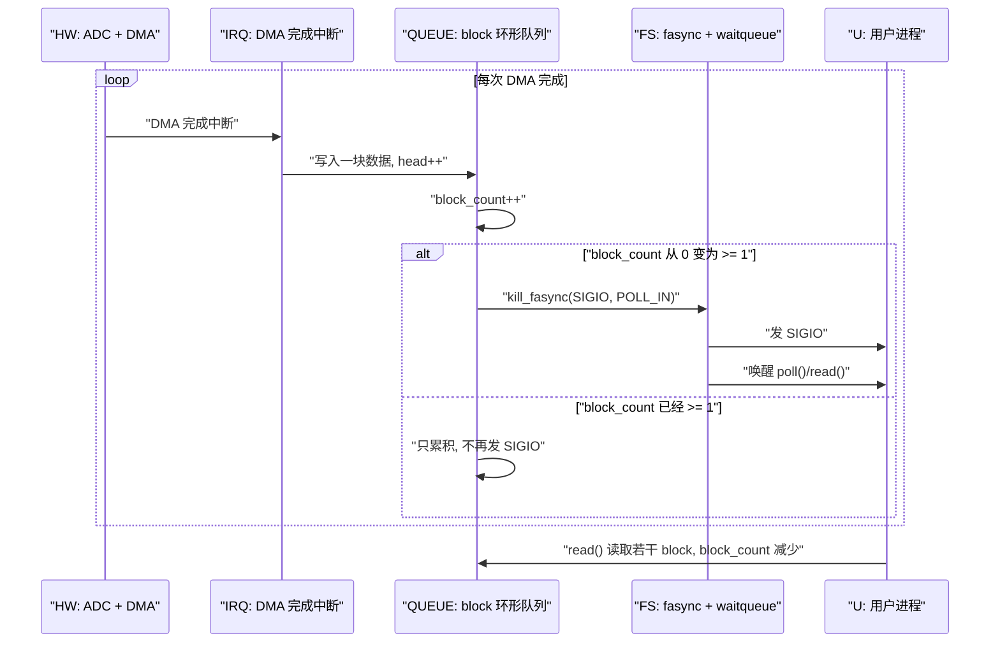
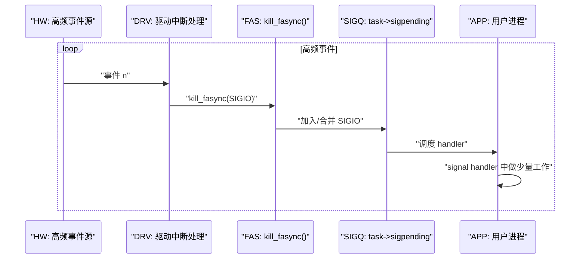
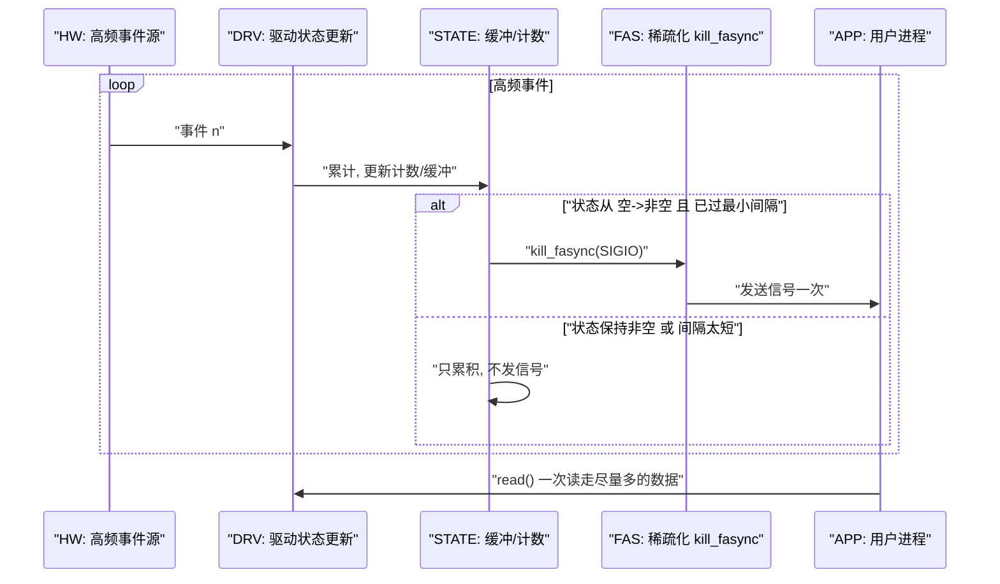

# 第 8 章 流式设备与高级场景中的异步通知

> 本章重点：从 GPIO 这类“离散事件设备”扩大到 **流式设备**（如 TTY、串口、某些采集设备），分析：
>
> - fasync 在“稳定长连接 + 持续流数据”里的典型使用方式；
> - 在“数据量大 / 事件频率高”的场景下，fasync 的 **局限** 与折中方案；
> - 实战中如何与 ring buffer、丢帧策略、input/netlink 等机制协同。

------

## 8.1 串口 / TTY 等流式设备中的异步通知习惯用法

> 本小节目标：
>
> - 说明 **TTY/串口驱动** 在历史上如何使用 fasync + SIGIO；
> - 与“GPIO 按键型设备”的事件语义对比：
>   - GPIO 更接近“离散事件”（按一次 → 一个事件）；
>   - 串口更接近“持续流入的字节流”；
> - 给出一套适用于“流式设备”的 fasync 设计模式，以及为什么在现代工程里，常常不再把 fasync 当作主力，而更多作为 **兼容接口** 存在。

------

### 8.1.1 引入：从“按键事件”到“字节流事件”

在第 7 章的 GPIO 场景中，一个事件的粒度比较清晰：

- 一次按键有效动作 → 视为 **一个事件**；
- 驱动内部可以把 `ev.last_code` 理解为“按下/释放”；
- 对用户态来说，事件速率较低，信号流量有限。

而在 **串口 / TTY** 场景中：

- 设备更像一个“持续打开的数据通道”：
  - 任意时间点都可能有字节进入 RX FIFO；
  - 数据可能成片段、行、帧形式出现；
- 用户更关心的是 **“缓冲区内是否有数据可读”**，而不是“某一瞬间的单个边沿”。

因此，流式设备的 fasync 使用方式与 GPIO 有显著差异：

- 对 GPIO 来说：
  - fasync 通知 = “有一个新的离散事件到达”；
- 对串口来说：
  - fasync 通知 = “当前接收缓冲区变为非空 / 可读”；
  - 之后用户一般会 **一次性读取当前可读的全部数据**，而不是只取一个“事件编码”。

------

### 8.1.2 数据结构视角：从单一 `ev` 到“环形缓冲区 + 统计字段”

在 GPIO 示例里，我们用的是简单的单槽事件结构：

```c
struct demo_key_event_state {
	bool		data_ready;
	u32		last_code;
	u32		event_cnt;
};
```

对于串口类设备，典型的数据结构会变成：

```c
#define DEMO_RX_BUF_SIZE	1024U

struct demo_stream_state {
	/* 环形缓冲区 */
	u8		rx_buf[DEMO_RX_BUF_SIZE];
	u32		rx_head;	/* 写入位置 */
	u32		rx_tail;	/* 读取位置 */

	/* 状态统计 */
	bool		rx_overflow;	/* 是否发生过溢出 */
	u32		rx_total;	/* 接收总字节数 */
};
```

并在外层设备结构体中仍保留 fasync/waitqueue：

```c
struct demo_stream_dev {
	struct device		*dev;
	struct fasync_struct	*async_queue;
	wait_queue_head_t	wait;
	spinlock_t		lock;

	struct demo_stream_state	stream;

	/* 其他串口资源，比如 UART 寄存器基址、中断号等 */
};
```

**区别在于：**

- 串口类设备的“事件”不再是一个 **单值**，而是“缓冲区状态变化”：
  - 从 `空 → 非空`：可以视为一个可读事件；
  - 从 `非空 → 空`：不会发通知；
- 因此，**无论是 `poll` 还是 fasync，判断条件都变成“环形缓冲区是否非空”**，而不是 `data_ready` 这样的布尔字段。

------

### 8.1.3 开发者视角：典型的流式设备 fasync 模式

从驱动实现者视角，可以抽出一条通用模式（以 RX 接收路径为例）：

1. **接收中断或 DMA 完成中断** 到来；
2. 在中断/下半部中 **将新数据写入环形缓冲区**：
   - 更新 `rx_head` / `rx_tail`；
   - 更新统计字段（`rx_total`、`rx_overflow` 等）；
3. 如果“缓冲区之前为空，现在变为非空”：
   - `wake_up_interruptible(&wait)` 唤醒阻塞 read/poll；
   - 如果 `async_queue != NULL`，调用 `kill_fasync(&async_queue, SIGIO, POLL_IN)` 发送信号；
4. 用户态收到 SIGIO 或 `poll()` 返回 `POLLIN` 后，通过 `read()` 将缓冲区数据读取到用户空间。

**核心差异点：**

- GPIO：事件生成端通常一次只更新一个“编码”；
- 串口：一次中断可能写入多个字节，甚至一个 DMA buffer 的数据，在 **一次通知下** 提供一整段数据。

------

### 8.1.4 用户视角：串口场景下 SIGIO 的典型用法

历史上，许多串口程序使用 SIGIO 的习惯用法是：

1. 打开串口 fd，并配置：
   - `fcntl(fd, F_SETOWN, getpid())`；
   - `fcntl(fd, F_SETFL, O_ASYNC | O_NONBLOCK)`；
2. 设置 SIGIO handler，例如：

```c
static int g_fd = -1;

static void sigio_handler(int signo)
{
	char buf[256];
	ssize_t n;

	if (signo != SIGIO)
		return;

	for (;;) {
		n = read(g_fd, buf, sizeof(buf));
		if (n < 0) {
			if (errno == EAGAIN)
				break;
			/* 其他错误处理 */
			break;
		} else if (n == 0) {
			break;
		}

		/* 在 handler 中简单缓存或标记事件，通常不建议做重处理 */
		/* 例如将数据放入某个线程安全队列，由主线程处理 */
	}
}
```

这种用法有几个特点：

- **信号触发粗粒度事件**：
  - “有数据可读” → 触发 SIGIO → 用户态循环 `read()` 把所有数据读完；
- **read() 不以“一个事件”为单位，而是以“缓冲区大小”或“当前可读字节数”为单位**；
- 在更现代的写法里，很多项目会改用：
  - `signalfd(SIGIO)` + `epoll`；
  - 或完全不用 SIGIO，只用 `epoll` + 阻塞 read。

因此，在流式设备场景中，fasync 更像是**一种额外通知管道**，而不是像 GPIO 那样“直接承载事件语义”。

------

### 8.1.5 设计模式：把“缓冲区从空到非空”视为“事件”

将前面总结抽象成一个规则：

> 对于流式设备，**fasync / poll 的通知粒度**应该是：
>
> - 从“缓冲区为空”变为“缓冲区非空”的瞬间；
> - 而不是每来一个字节都通知一次。

在伪代码层面，可以写成：

```c
static void demo_stream_rx_push(struct demo_stream_dev *d,
				const u8 *data, u32 len)
{
	unsigned long flags;
	bool was_empty;
	u32 i;

	spin_lock_irqsave(&d->lock, flags);

	/* 记录之前是否为空，用于决定是否发送通知 */
	was_empty = (d->stream.rx_head == d->stream.rx_tail);

	for (i = 0; i < len; ++i) {
		u32 next_head =
			(d->stream.rx_head + 1) % DEMO_RX_BUF_SIZE;

		if (next_head == d->stream.rx_tail) {
			/* 缓冲区满，丢弃这个字节并标记 overflow */
			d->stream.rx_overflow = true;
			break;
		}

		d->stream.rx_buf[d->stream.rx_head] = data[i];
		d->stream.rx_head = next_head;
		d->stream.rx_total++;
	}

	/* 若之前为空，现在有数据，则通知一次 */
	if (was_empty && d->stream.rx_head != d->stream.rx_tail) {
		if (d->async_queue)
			kill_fasync(&d->async_queue, SIGIO, POLL_IN);

		spin_unlock_irqrestore(&d->lock, flags);

		wake_up_interruptible(&d->wait);
	} else {
		spin_unlock_irqrestore(&d->lock, flags);
	}
}
```

结合 `.read()`：

```c
static ssize_t demo_stream_read(struct file *filp, char __user *buf,
				size_t count, loff_t *ppos)
{
	struct demo_stream_dev *d = filp->private_data;
	unsigned long flags;
	size_t copied = 0;
	int ret;

	/* 阻塞直到有数据 */
	ret = wait_event_interruptible(d->wait,
				       d->stream.rx_head != d->stream.rx_tail);
	if (ret)
		return ret;

	spin_lock_irqsave(&d->lock, flags);

	while (copied < count &&
	       d->stream.rx_head != d->stream.rx_tail) {
		u8 ch = d->stream.rx_buf[d->stream.rx_tail];

		spin_unlock_irqrestore(&d->lock, flags);

		if (copy_to_user((u8 __user *)buf + copied, &ch, 1))
			return -EFAULT;

		copied++;

		spin_lock_irqsave(&d->lock, flags);
		d->stream.rx_tail =
			(d->stream.rx_tail + 1) % DEMO_RX_BUF_SIZE;
	}

	spin_unlock_irqrestore(&d->lock, flags);

	return copied;
}
```

在这个模型里：

- **fasync 的语义与 `poll` 一致**：
  - 一旦缓冲区从空变为非空，发送一次 SIGIO / `POLLIN`；
- 若用户态读得不够快，驱动不会为每个字节都追加 SIGIO，而是通过 `read()` 一次性读取多字节数据；
- 若用户长期不读，缓冲区满时会产生 `rx_overflow`，应用可以通过 ioctl 或 read 的扩展接口读取到这个统计信息。

------

### 8.1.6 与 GPIO 按键场景的对比：何时用“单槽事件”，何时用“流式缓冲”

可以从“**语义和速率**”两个维度对比：

1. **语义维度**
   - GPIO 按键：
     - 事件粒度是“按下/释放”，通常可以抽象成有限状态机；
     - `last_code` / `data_ready` 足以表达当前未消费事件；
   - 串口/TTY：
     - 事件粒度是“缓冲区非空”，内部包含若干字节；
     - 对应用来说，数据的“内容和顺序”比“每个边沿”的精确时间更重要。
2. **速率维度**
   - GPIO：
     - 事件速率极低（人手按键级别）；
     - fasync 一次一个事件，压根不担心信号风暴。
   - 串口/TTY：
     - 可能达到几十 kB/s 甚至更高；
     - 若每字节都 `kill_fasync()`，用户态会被 SIGIO 淹没。

**结论：**

- 对 **低频离散事件设备**：可以用“单槽事件 + fasync 每事件一信号”的模型（第 7 章）；
- 对 **流式设备**：必须使用“环形缓冲区 + 状态变化通知”的模型，将通知频率与数据速率解耦。

------

### 8.1.7 实战中的习惯：fasync 往往是“兼容接口”，`epoll` 才是主力

在现代 Linux 应用里，尤其是复杂系统中，典型做法是：

1. 统一使用 `epoll` 作为事件循环核心；
2. 对串口/TTY 设备：
   - **首选**：`epoll` + 阻塞读（或非阻塞 read + EAGAIN 重试）；
   - 若历史原因需要兼容 SIGIO：
     - 使用 `signalfd(SIGIO)` 把信号变成一个 fd；
     - 仍然丢进 `epoll` 统一处理；
3. 对需要 fasync 的旧应用/库：
   - 驱动保留 `.fasync` / `kill_fasync()` 实现，使老程序从新驱动中仍能收到 SIGIO；
   - 新应用可以忽略 fasync，只用 `epoll` + read。

换句话说，在串口/TTY 等流式设备中：

- fasync 是一种“**通知机制**”，而不是“事件缓冲机制”；
- 真正的数据是通过“**普通 read + 内核缓冲区**”传递；
- 在新项目里，如果没有历史负担，可以考虑 **直接不使用 fasync**，只使用 poll/epoll；
- 如果要写书或做教学，则 fasync 更像是“理解 Linux 早期异步通知的入口”，帮助你读懂 TTY 等子系统中的历史代码。

------

### 8.1.8 小结：流式设备中的 fasync 使用原则

本小节完成了从“GPIO 按键”到“串口/TTY 字节流”的过渡，主要结论：

1. **事件语义不同 → 状态模型不同**
   - GPIO：单槽事件 + `data_ready` + `last_code`；
   - 串口：环形缓冲区 + “缓冲区从空到非空”的状态变化。
2. **fasync 的角色**
   - 在 GPIO 场景中，fasync 可直接对应“每个离散事件”；
   - 在流式场景中，fasync 仅用来提示“当前有数据可读”，具体数据仍经由 `read()`。
3. **避免信号风暴的关键是“缓冲区级别通知”而不是“字节级通知”**
   - 在环形缓冲区模型中，只在从空到非空时发送通知；
   - 用户态用 `read` 将现有数据一次性读走，降低通知频率。
4. **在现代工程中的定位**
   - fasync 在流式设备中更多是作为“向后兼容接口”存在；
   - 新项目通常以 `epoll` + 阻塞 read 为主，必要时用 `signalfd` 把 SIGIO 改造为 fd 事件。


------

## 8.2 高速采集设备中使用 fasync 的限制与折中方案

### 8.2.1 引入：从“几次按键/秒”到“上万次采样/秒”

在 GPIO/按键场景中，我们在第 7 章几乎可以“无脑”使用 fasync：

- 事件频率低（人手级别）；
- 每个事件的语义清晰（按下/释放）；
- 即使每次事件都 `kill_fasync()`，系统负荷也几乎可以忽略。

但在 **高速采集设备** 中，情况完全不同。典型场景包括：

- 高速 ADC：
  - 例如以 10 kHz、100 kHz 频率采样，甚至更高；
  - 每个采样点可能触发一次“数据就绪”中断或 DMA 完成中断。
- 逻辑分析器 / FPGA 捕获模块：
  - 短时间内产生大量边沿事件；
  - 以 DMA 批量 / 帧 的形式交给 CPU。
- 专用高速串行链路接收端：
  - 接收的数据流本身是“帧级别”，需要高吞吐处理。

如果在这些设备上仍然沿用“**每次数据就绪就 `kill_fasync()`**”的策略，很快就会遇到：

- 内核侧：中断频率高 + `kill_fasync()` 开销明显；
- 用户态：SIGIO 信号密集到无法处理，甚至还没来得及 `read()`，下一批信号已经到达。

因此，本节重点不是“如何让 fasync 支持这些场景”，而是：

> **在高速采集场景下，fasync 的角色应该被主动“降级”：**
>
> - 不再尝试“一事件一信号”；
> - 而是被用作“**低频汇总通知**”；
> - 真正的高频数据流通过 ring buffer / DMA + `read()`/`mmap()` 来处理。

------

### 8.2.2 数据结构视角：从“事件”为单位到“块/帧”为单位

在高速采集场景中，数据通常不是按“单个点/单个边沿”交给用户，而是：

- 以 **一定大小的数据块（block）** 为单位；
- 或者以 **帧/packet** 为单位（例如 N 个采样点组成一帧）。

一个常见的内核侧抽象是“**采样环形队列 + 每块描述符**”，例如：

```c
#define DEMO_SAMPLE_PER_BLOCK	1024U
#define DEMO_BLOCK_COUNT_MAX	8U

struct demo_sample_block {
	u32	seq_id;			/* 块序号，递增 */
	u32	valid_samples;		/* 本块有效采样点个数 */
	bool	ready;			/* 是否已经采集完成 */
	bool	consumed;		/* 用户是否已经读走 */
	void	*data;			/* 指向实际采样数据区域 */
};

struct demo_capture_state {
	struct demo_sample_block	blocks[DEMO_BLOCK_COUNT_MAX];
	u32				head;	/* 写入块索引（生产者） */
	u32				tail;	/* 读取块索引（消费者） */

	bool				overflow;	/* 是否发生过丢块 */
	u32				total_blocks;	/* 总共完成的块数 */
};
```

设备结构（简化）：

```c
struct demo_capture_dev {
	struct device		*dev;
	struct fasync_struct	*async_queue;
	wait_queue_head_t	wait;
	spinlock_t		lock;

	struct demo_capture_state	cap;

	/* 与硬件相关：寄存器、DMA 通道、中断号等 */
};
```

在这种设计中：

- 单个 block 内可能包含非常多的采样点（例如 1024、4096）；
- “事件”不再是一点，而是“**一个 block 填满并 ready**”；
- fasync/poll 的“通知粒度”应当与“block ready”对齐，而不是与“每个采样点”对齐。

------

### 8.2.3 开发者视角：fasync 的限制与典型折中策略

从驱动开发者角度看，在高速采集场景中，fasync 会遭遇几个“硬限制”：

1. **信号机制本身的吞吐限制**
   - SIGIO 是逐个信号排队/合并的机制，调度到用户态的路径比“普通 poll + read”更重；
   - 在 kHz 级甚至更高频率下，**信号数量必须被严格限制**。
2. **内核中断/下半部中调用 `kill_fasync()` 的开销**
   - 每次 `kill_fasync()` 需要遍历 `async_queue` 链表、构造信号、与调度器交互；
   - 当“每个 block 完成都发一次信号”时，还勉强可接受；
   - 当“每个采样点都发一次信号”时，系统几乎不可用。
3. **用户态处理频率与内核采样频率之间的差距**
   - 内核端可能每毫秒采集很多 block；
   - 用户态线程（即使是单独的实时线程）可以处理的事件频率有限；
   - 必须有中间缓冲与降采样/聚合机制。

因此，在高速采集场景中，对 fasync 的典型折中策略是：

- **只在“周期性汇总事件”上使用 fasync**，例如：
  - 每 N 个 block 完成发一次 SIGIO；
  - 阈值型：缓冲区中可读 block 数量从 0 变到 ≥1 时发一次 SIGIO；
  - 时间型：每隔 T ms 汇总一次“当前有多少数据可读”，然后发一个 SIGIO。
- **允许“丢掉部分 fine-grained 信息”**：
  - 不要求用户收到每个采样点/每个 block 的单独通知；
  - 用户自己在 `read()` 数据流中做时间戳分析。

------

### 8.2.4 用户/平台视角：高速场景下用户真正在意的是什么

从用户（应用开发者）角度看，高速采集设备的需求通常是：

1. **数据吞吐**
   - 确保在给定的采样率下，不发生数据丢失（或明确知道丢失情况）；
   - 能够从用户态以流方式连续读出数据。
2. **时序/同步信息可恢复**
   - 每个采样点的时间位置可以通过采样率 + 首个时间戳推算；
   - 不一定需要为每一个采样中断使用 fasync 通知。
3. **事件感知粒度**
   - “缓冲区中是否有数据可以读”；
   - “是否发生过溢出/丢块”；
   - 有时需要告诉用户“当前 backlog 有多少 block”，以便做负载调节。

因此，对用户态而言，一个合理的 fasync 行为是：

- SIGIO 被视为“**有新一批数据可处理**”的粗粒度提醒；
- 用户收到 SIGIO 后，在自己的主循环里调用 `read()` 或其他接口，一次读取多个 block；
- 不指望 SIGIO 逐个同步每个采样 block 的边界。

**对 i.MX6ULL 这类 MCU+Linux SoC 平台来说**，高速采集通常会通过：

- ADC + DMA 定时搬运数据到内存；
- 或外接 FPGA/逻辑芯片，将数据打包后送入 SoC 的某个总线通道；
- Linux 驱动则负责“DMA 完成 → 数据入队 → 低频通知 + 高吞吐 read”。

------

### 8.2.5 可视化：高速采集中“降频通知”的示意

下面用一个时序图表示“DMA block 完成 + 阈值型 fasync 通知”的关系。



关键点：

- `block_count` 从 0 变为 ≥1 时发一次 SIGIO；
- 当 `block_count` 已经 ≥1 时，继续新 block 只累积数据，不再额外发 SIGIO；
- 用户态收到一次 SIGIO 后，可以在循环内以 `read()` 的方式尽量把 backlog 读空。

------

### 8.2.6 示例代码：“阈值型 fasync 通知”的核心逻辑

下面给出一个简化的高速采集设备的关键逻辑片段，展示如何“以 block 为单位 + 阈值触发 fasync”。

#### 8.2.6.1 数据结构（简化版）

```c
#define DEMO_BLOCK_COUNT_MAX	8U

struct demo_sample_block {
	u32	seq_id;
	u32	valid_samples;
	bool	ready;
	bool	consumed;
	void	*data;
};

struct demo_capture_state {
	struct demo_sample_block	blocks[DEMO_BLOCK_COUNT_MAX];
	u32				head;
	u32				tail;
	u32				block_count;
	bool				overflow;
};

struct demo_capture_dev {
	struct device		*dev;
	struct fasync_struct	*async_queue;
	wait_queue_head_t	wait;
	spinlock_t		lock;

	struct demo_capture_state	cap;

	/* 省略: DMA 相关 */
};
```

#### 8.2.6.2 在 DMA 完成中断里入队 block 并触发阈值型通知

```c
#define DEMO_BLOCK_COUNT_MAX	8U

static void demo_capture_block_done(struct demo_capture_dev *d,
				    unsigned int samples)
{
	unsigned long flags;
	struct demo_capture_state *c = &d->cap;
	bool notify = false;

	spin_lock_irqsave(&d->lock, flags);

	if (c->block_count >= DEMO_BLOCK_COUNT_MAX) {
		/* 队列已满，丢弃最旧的一块或标记溢出 */
		c->overflow = true;

		/* 简化处理: 丢弃最旧一块 */
		c->tail = (c->tail + 1) % DEMO_BLOCK_COUNT_MAX;
		c->block_count--;
	}

	/* 写入新的块 */
	{
		struct demo_sample_block *blk = &c->blocks[c->head];

		blk->seq_id++;
		blk->valid_samples = samples;
		blk->ready = true;
		blk->consumed = false;

		c->head = (c->head + 1) % DEMO_BLOCK_COUNT_MAX;
		c->block_count++;
	}

	/* 阈值策略: 仅在从 0 -> 1 时发送通知 */
	if (c->block_count == 1)
		notify = true;

	if (notify && d->async_queue)
		kill_fasync(&d->async_queue, SIGIO, POLL_IN);

	spin_unlock_irqrestore(&d->lock, flags);

	if (notify)
		wake_up_interruptible(&d->wait);
}
```

#### 8.2.6.3 `.read()` 端按 block 粒度取数据

用户态可以定义一个结构体来读出“一个 block + 元数据”：

```c
struct demo_block_user {
	u32	seq_id;
	u32	valid_samples;
	u8	data[];	/* 柔性数组: 紧跟样本数据 */
};
```

驱动中 `.read()` 的核心逻辑类似：

```c
static ssize_t demo_capture_read(struct file *filp, char __user *buf,
				 size_t count, loff_t *ppos)
{
	struct demo_capture_dev *d = filp->private_data;
	struct demo_capture_state *c = &d->cap;
	unsigned long flags;
	struct demo_sample_block *blk;
	size_t need;
	int ret;

	/* 等待至少有一个 block 就绪 */
	ret = wait_event_interruptible(d->wait, c->block_count > 0);
	if (ret)
		return ret;

	spin_lock_irqsave(&d->lock, flags);

	if (c->block_count == 0) {
		spin_unlock_irqrestore(&d->lock, flags);
		return 0;
	}

	blk = &c->blocks[c->tail];

	need = sizeof(struct demo_block_user) +
	       blk->valid_samples * sizeof(u16);	/* 例如每点 16bit */

	if (count < need) {
		spin_unlock_irqrestore(&d->lock, flags);
		return -EINVAL;
	}

	/* 标记该块已消费并从队列中移除 */
	c->tail = (c->tail + 1) % DEMO_BLOCK_COUNT_MAX;
	c->block_count--;

	spin_unlock_irqrestore(&d->lock, flags);

	/* 先拷贝头部 */
	if (copy_to_user(buf, blk, sizeof(struct demo_block_user)))
		return -EFAULT;

	/* 再拷贝采样数据部分 */
	if (copy_to_user(buf + sizeof(struct demo_block_user),
			 blk->data,
			 blk->valid_samples * sizeof(u16)))
		return -EFAULT;

	return need;
}
```

这里 `.poll` 与 fasync 依然共用 `wait` 与 `block_count > 0` 这一谓词即可，原理与 7.5 中完全一致，这里不重复展开。

------

### 8.2.7 调试与验证：如何确认“数据流正常、通知频率合理”

在高速采集场景中，调试的重点从“事件是否到达”转变为“**吞吐是否足够**”和“**通知节奏是否合理**”。可以采用如下步骤：

1. **内核侧统计**
   - `cap.total_blocks`：采集到的 block 总数；
   - `cap.overflow`：是否发生过丢块；
   - 可以通过 `debugfs` / `sysfs` 暴露这些统计信息，或通过专用 ioctl 返回。
2. **用户态统计**
   - 记录收到的 block 序号（`seq_id`）是否连续；
   - 统计在一段时间内读到的 block 数量，是否接近硬件采样配置；
   - 统计 SIGIO 次数，确认“通知次数远小于 block 数”。
3. **压力测试**
   - 配置较高采样率、较小 block 大小和较小环形队列容量；
   - 验证在高负载情况下，系统是否保持稳定（CPU 使用率、延迟等）；
   - 根据需要增加 block 大小或队列深度。
4. **调整策略**
   - 若用户态压力过大：
     - 增大每个 block 的采样点数量（减少 block 数量）；
     - 在 `demo_capture_block_done()` 中采用“每 N 块通知一次”的策略。
   - 若数据延迟过大：
     - 减小 block 大小或适当增加通知频率；
     - 但仍需避免“每块都发信号”导致信号风暴。

------

### 8.2.8 小结：高速采集场景中的 fasync 角色定位

本节在“流式设备”的基础上，进一步聚焦“高速采集”这一更极端的场景，得到的结论是：

1. **fasync 不适合承载“高频原始采样事件”本身**
   - 每个采样点/每个中断都 `kill_fasync()` 在工程上不可行；
   - 必须以“block/帧”为单位，并对通知进行严重限频。
2. **合理的设计是：fasync 提供“粗粒度、降频的到达通知”，数据通过 ring buffer + read 传输**
   - 核心数据结构是“block 环形队列 + 阈值触发通知”；
   - 阈值条件可以是 `block_count` 从 0 变为 ≥1，或“累计 N 块后通知一次”。
3. **高速采集中，正确指标是“吞吐/丢帧控制”，不是“信号数量”**
   - 用户更关心：是否丢数据、是否能实时处理，而不是每块是否都有独立 SIGIO；
   - 通过统计字段（总 block 数、溢出标志等）向用户表达真实状态。
4. **在现代系统中，fasync 更多是作为辅助通知机制，而核心仍然是大块数据 + 高效 read/mmap**
   - 对于诸如 ADC、逻辑分析器、DMA 流等场景，应优先考虑：
     - DMA + 大块缓冲；
     - 用户态采用专用线程循环 `read()` 或基于 `epoll` 的事件循环；
     - fasync 只在“数据 backlog 从空到非空”或“异常状态发生”时发送少量信号。

在理解了高速采集场景中 fasync 的边界之后，下一节（8.3）会更聚焦到一个具体问题上：

> **大量事件场景下的“信号风暴”问题**：
>
> - 如何形式化地描述“信号风暴”；
> - 在 GPIO、流式设备、高速采集等不同场景中，fasync 会如何触发信号风暴；
> - 以及可行的“信号稀疏化 / 分级通知策略”。


------

## 8.3 大量事件场景下的“信号风暴”问题

### 8.3.1 引入：什么是“信号风暴”

在前面的章节里，你已经多次看到“**信号风暴**”这个词：

- 第 7 章：去抖不当或者重复 `kill_fasync()`，在按键抖动期间疯狂发 SIGIO；
- 第 8.1、8.2：流式设备、高速采集设备中，如果以“每个字节 / 每个 block”为粒度发信号，会迅速压垮用户态。

**所谓“信号风暴”**，可以给一个比较工程化的定义：

> 在一定时间窗口内，设备向一个或多个进程发送的 **信号数量**
>  明显超过了进程在同一时间内 **能实际处理的上限**，
>  导致 CPU 时间大部分浪费在信号处理与上下文切换上，
>  而非“实际的数据处理”。

典型现象包括：

- 单个进程的 `top` CPU 占比很高，但业务逻辑实际处理量并不大；
- 使用 `strace -f -e signal` 能看到高频 SIGIO/其它信号；
- `/proc/PID/status` 中 `SigQ` 长时间保持在一个接近上限的水平（标准信号队列被占满）；
- 随着信号频率继续升高，应用开始出现明显的“掉帧”“超时”甚至无响应。

**本节目标**：

1. 从 **内核数据结构** 出发，说明信号风暴在什么路径上“堆积”；
2. 从 **驱动开发者** 视角总结典型错误模式；
3. 从 **用户/平台** 视角给出可观测指标与应对策略；
4. 提出一套可落地的“**信号稀疏化 / 分级通知**”编码模板。

------

### 8.3.2 数据结构视角：信号风暴在内核哪里“堆积”

fasync 只是“触发信号的入口”，实际的信号在内核中仍然走的是 **信号子系统** 通路，大致涉及以下结构（简化）：

- `struct fasync_struct`
  - fasync 链表，记录订阅某个 file 的进程/进程组信息；
  - `kill_fasync()` 会遍历这个链表，对每个订阅者调用内部的信号发送函数。
- `struct task_struct` 中的信号相关字段：
  - `struct signal_struct *signal;`
  - `struct sigpending pending;`
  - `sigset_t blocked;` 等。
- `struct sigpending` 内部维护了一个信号队列：
  - 标准信号（非实时信号）通常按位表示 + 合并；
  - 实时信号可以带多个排队实例（有上限）。

信号风暴在数据路径上的表现是：

1. **`fasync_struct` 链表被反复遍历**
   - 订阅者越多，每次 `kill_fasync()` 的开销越大；
   - 若一个设备 fd 被多个进程共享，风暴会同步放大到每个进程。
2. **每个 `task_struct` 的 `sigpending` 不断被更新**
   - 标准信号会合并，但仍需频繁唤醒调度器；
   - 实时信号会排队，队列可能接近上限，从而丢信号或返回错误。
3. **调度器不断处理“被信号唤醒的任务”**
   - 即使用户态的 handler 只是做一点简单工作，也要付出完整的上下文切换与信号处理代价；
   - 当信号频率逼近或超过 CPU 能处理的上限时，系统进入“信号处理优先、业务逻辑被挤压”的不良状态。

因此，从数据结构角度看，**信号风暴本质是 “事件发生速率 > 内核信号子系统 + 用户态处理链路的吞吐上限”**，而 fasync 的“链表 + `kill_fasync()` 调用模式”会在这种情况下放大成本。

------

### 8.3.3 开发者视角：导致信号风暴的典型模式与“稀疏化”策略

#### 8.3.3.1 典型错误模式（驱动侧）

在以前的章节已经部分提到，这里系统列一下“最危险”的模式：

1. **每次中断直接 `kill_fasync()`，不做任何节流**
   - GPIO：抖动期间几十 / 上百次中断；
   - 串口：每个字节一个中断；
   - 高速采集：每个采样点或每个小 block 一个中断。
2. **忽略订阅者数量 N 的影响**
   - 一个 file 被多个进程 `dup()` / `fork()` 之后，`async_queue` 链表上有多个节点；
   - 每次 `kill_fasync()` 实际生成 N 个信号；
   - 当 N 较大时，信号风暴会成倍放大。
3. **在状态未变化时仍重复发送信号**
   - 例如数据缓冲区已经非空，驱动仍然在每次硬件事件发生时重复 `kill_fasync()`；
   - 用户态读得不够快，就会收到大量“重复通知”，但每次 `read()` 都只能读出之前的数据。
4. **在错误的上下文或错误时机调用 `kill_fasync()`**
   - 在内核线程里不停轮询硬件并发信号；
   - 在没有事件到来的情况下周期性发信号“心跳”；
   - 把 fasync 当成“可靠事件队列”来使用。

#### 8.3.3.2 稀疏化策略一：基于状态变化（0→1）触发

最基本、最通用的一条规则：

> 只有当“可读状态”从 **没有事件** 变成 **有事件** 时，
>  才触发一次 `kill_fasync()` / `wake_up_interruptible()`。

实现方式在前面章节已经大量使用，核心逻辑类似：

```c
#define DEMO_MIN_SIG_INTERVAL_MS	1U

static void demo_notify_event(struct demo_dev *d, bool *p_state_flag)
{
	unsigned long flags;
	bool notify = false;
	unsigned long now_jiffies;
	static const unsigned int min_interval_ms = DEMO_MIN_SIG_INTERVAL_MS;
	static unsigned long last_sig_jiffies;

	now_jiffies = jiffies;

	spin_lock_irqsave(&d->lock, flags);

	/* 状态从 0 -> 1 才触发通知 */
	if (!*p_state_flag) {
		*p_state_flag = true;

		/* 可选: 限制最小间隔，避免极端频率下的风暴 */
		if (time_after(now_jiffies,
			       last_sig_jiffies +
			       msecs_to_jiffies(min_interval_ms))) {
			last_sig_jiffies = now_jiffies;
			notify = true;
		}
	}

	if (notify && d->async_queue)
		kill_fasync(&d->async_queue, SIGIO, POLL_IN);

	spin_unlock_irqrestore(&d->lock, flags);

	if (notify)
		wake_up_interruptible(&d->wait);
}
```

要点：

- `*p_state_flag` 表示“是否存在未消费数据/事件”；
- 状态从 false 变为 true 的瞬间，认为需要通知；
- 可选的间隔控制 `DEMO_MIN_SIG_INTERVAL_MS` 可以进一步限制“每毫秒最多一个信号”。

#### 8.3.3.3 稀疏化策略二：基于 “阈值”/“批量” 触发

在高速采集或高频事件场景中，仅仅按 0→1 触发，仍可能出现信号频率较高的情况（例如每个 block 的 `block_count` 都从 0 变到 1）。

这时可以采用“**阈值触发**”或“**批量触发**”策略：

- 按 block 数量：
  - 当 `block_count` 从 0 变为 1 时发信号；
  - 在 `block_count > 1` 时仅累积数据，不再追加信号；
  - 用户态一次 `read()` 尽量读掉多个 block。
- 按时间窗口：
  - 记录 `last_sig_jiffies`；
  - 只有距离上次信号发送超过 `MIN_SIG_INTERVAL_MS` 时才能再发；
  - 在窗口期间继续累积数据，待窗口结束后统一通知。

这类策略已在 8.2 通过示例代码说明，这里不再重复。

#### 8.3.3.4 稀疏化策略三：可配置的“通知级别”

对于可配置性要求较高的工程项目，可以给驱动增加一个“**通知级别**”：

- `notify_mode = LEVEL_FAST`：
  - 尽可能即时通知，只做最基本的 0→1 控制；
- `notify_mode = LEVEL_NORMAL`：
  - 使用 0→1 + 最小间隔 + batch 机制；
- `notify_mode = LEVEL_SLOW`：
  - 每 N 个事件或每 T ms 发一次信号（如告警、日志）。

可以通过：

- `ioctl` 设置模式；
- 或者通过 `sysfs` 属性（如 `/sys/class/.../notify_mode`）动态调节。

这样，在测试阶段可以开大通知频率，方便验证；在生产环境则可切换到较慢模式，避免信号风暴。

------

### 8.3.4 用户 / 平台视角：如何从外部识别与缓解信号风暴

从用户态或系统维护者视角，可以通过以下指标判断是否存在信号风暴：

1. **进程 `SigQ` 与 `SigPnd` 指标**
   - `/proc/PID/status` 中的 `SigQ` 字段：
     - `SigQ: queued/limit`，如果 `queued` 长期接近 `limit`，说明信号队列压力很大。
2. **`strace` 观察**
   - 使用 `strace -f -e signal -p PID`：
     - 若看到 SIGIO 或其它信号高频打印，明显超过应用本身“业务事件频率”，则基本可以判断有风暴问题。
3. **CPU 使用率与业务处理量比对**
   - `top` 或 `perf top` 中看到信号处理路径（如 `do_signal` / `get_signal` / handler）占用高；
   - 而业务逻辑（数据处理函数）的时间占比相对很低。
4. **应用层现象**
   - 即使输入数据流量稳定，应用观察到“时不时处理一小批数据，然后长时间几乎空转”，但 CPU 占用高；
   - 表明大量时间被消耗在信号往返而不是实际处理。

缓解策略（用户侧）：

- 若应用本身不需要 SIGIO，可直接关闭 fasync，改用 `poll` / `epoll`；
- 使用 `signalfd(SIGIO)` + `epoll`，减少异步 handler 带来的复杂度，便于限频控制；
- 与驱动开发者协同：
  - 要求增加“通知级别 / 通知间隔”配置；
  - 定义协议：例如“应用保证每次收到通知后迅速 `read()` 直到返回 `EAGAIN`”。

------

### 8.3.5 可视化：信号风暴 vs 稀疏化的对比

#### 1）错误模式：每事件都 `kill_fasync()` 的信号风暴



问题：

- `HW` 事件频率很高；
- `FAS` 与 `SIGQ` 承载高频操作；
- `APP` 频繁被打断，消耗大量调度与上下文切换成本。

#### 2）改进模式：基于“0→1 + 时间间隔”的稀疏化通知



效果：

- 对高频事件进行汇总；
- `APP` 收到少量 SIGIO，每次 `read()` 时都读取多事件数据；
- 大部分 CPU 开销用在真正的业务处理上。

------

### 8.3.6 示例代码：通用的“信号限频 + 状态变化”辅助函数

为了在项目中复用，可以抽象出一个简单的“**通用通知辅助函数**”，专门完成：

- 维护“0→1 状态变化”；
- 维护“最小信号间隔”；
- 统一调用 `kill_fasync()` + `wake_up_interruptible()`。

下面是一个可嵌入到驱动中的示例（简化版）。注意所有时间常量都使用带单位的宏命名，以符合你的偏好。

```c
#define DEMO_SIG_MIN_INTERVAL_MS	10U

struct demo_notify_state {
	bool		active;			/* 是否存在未消费事件 */
	unsigned long	last_sig_jiffies;	/* 最近一次发信号的时间 */
};

static void demo_notify_init(struct demo_notify_state *ns)
{
	ns->active = false;
	ns->last_sig_jiffies = 0;
}

/*
 * demo_notify_event() - 封装好的通知接口
 * @d:      设备对象, 持有 async_queue 和 waitqueue
 * @ns:     通知状态 (0->1 + 时间间隔)
 * @lock:   保护 ns 和设备状态的自旋锁
 *
 * 语义：
 * - 当 ns->active 从 false 变为 true 且与上次信号间隔超过阈值时:
 *     - 调用 kill_fasync()
 *     - 唤醒 waitqueue
 * - 若 active 已经为 true, 则只更新内部状态, 不重复发信号
 */
static void demo_notify_event(struct demo_dev *d,
			      struct demo_notify_state *ns,
			      spinlock_t *lock)
{
	unsigned long flags;
	unsigned long now_jiffies;
	unsigned long min_interval_jiffies;
	bool do_signal = false;

	now_jiffies = jiffies;
	min_interval_jiffies =
		msecs_to_jiffies(DEMO_SIG_MIN_INTERVAL_MS);

	spin_lock_irqsave(lock, flags);

	if (!ns->active) {
		ns->active = true;

		if (time_after(now_jiffies,
			       ns->last_sig_jiffies +
			       min_interval_jiffies)) {
			ns->last_sig_jiffies = now_jiffies;
			do_signal = true;
		}
	}

	if (do_signal && d->async_queue)
		kill_fasync(&d->async_queue, SIGIO, POLL_IN);

	spin_unlock_irqrestore(lock, flags);

	if (do_signal)
		wake_up_interruptible(&d->wait);
}
```

在不同设备中：

- 对 GPIO，`ns->active` 可以与 `ev.data_ready` 绑定；
- 对流式设备，`ns->active` 可以与“缓冲区非空”绑定；
- 对高速采集设备，`ns->active` 可以与 `block_count > 0` 或“backlog 超过某阈值”绑定。

注意：这只是一个“信号限频 + 状态变化”的骨架，具体如何与实际事件状态（`ev` / 缓冲队列）挂钩，需要在各自驱动里适配。

------

### 8.3.7 调试与验证：如何确认“限频逻辑”生效

在实现上述限频/稀疏化策略后，需要验证它们是否有效。可以从以下几个维度进行确认：

1. **测量信号频率**
   - 在用户态统计单位时间内收到的 SIGIO 数量；
   - 与硬件事件实际频率对比，确保前者被显著压缩。
2. **测量数据吞吐**
   - 在一定时间窗口内统计采集到的数据量（字节/样本数）；
   - 确认限频后，**数据吞吐不应明显下降**（否则说明通知不足、应用未及时 `read()`）。
3. **CPU 使用率变化**
   - 对比限频前后，`top` 中应用进程与内核 signal 相关路径的 CPU 占用变化；
   - 期望：限频后 signal handler 的开销下降，业务逻辑（数据处理）占比增大。
4. **工具辅助**
   - `strace -f -e signal`：查看 SIGIO 的实际调用频率；
   - `perf record` + `perf report`：分析内核侧 `kill_fasync` / `get_signal` 等函数的比例；
   - `ftrace` 或 `trace_printk`：在驱动中为 `kill_fasync` 加 tracepoint 或日志，统计调用次数。
5. **极端压力测试**
   - 将硬件事件频率调到上限（如最大采样率）；
   - 验证：（1）系统不崩溃，不出现明显“卡死”；（2）应用可以稳定运行，并在可接受的延迟范围内处理数据；
   - 如有必要，进一步增大缓冲区或减小通知频率，寻找工程上的平衡点。

------

### 8.3.8 小结：系统化认识与控制“信号风暴”

本节从数据结构与工程实践的角度，系统化整理了“信号风暴”问题，核心结论如下：

1. **信号风暴的本质是“信号路径的吞吐不足以匹配事件发生速率”**
   - `fasync_struct` 链表 + `task_struct.sigpending` + 调度器 构成的链路都要付出 cost；
   - 当 `kill_fasync()` 调用频率与事件频率同量级时，系统容易进入“信号处理主导”的异常状态。
2. **错误模式集中在几个方面**
   - 每次中断都 `kill_fasync()`，不做节流与状态判断；
   - 忽略订阅者数量带来的乘法效应；
   - 在状态未变化时重复发送信号；
   - 在错误上下文、错误生命周期阶段调用 `kill_fasync()`。
3. **三类核心稀疏化策略**
   - 基于状态变化（0→1）触发：只有从“无事件”变为“有事件”时才发一次信号；
   - 基于阈值/批量触发：依赖 backlog 大小或时间窗口，将多个事件合并为一次通知；
   - 可配置通知级别：让驱动在调试与生产环境之间调整通知频率。
4. **驱动和应用共同承担责任**
   - 驱动负责合理设计数据结构与通知策略，避免无谓的高频 `kill_fasync()`；
   - 应用负责在收到通知后尽快 `read()` 并合理消费数据，避免 backlog 长期堆积；
   - 双方可通过 ioctl / sysfs 等配置通知级别、缓冲区大小等参数。

掌握本节内容后，你可以：

- 在阅读任何使用 fasync 的内核子系统（TTY、input、某些网络驱动）时，主动识别潜在的信号风暴风险；
- 为自己的驱动设计合理的“事件到信号”的映射与节流策略，保证 **语义清晰 + 吞吐可控**。


------

## 8.4 与缓冲区管理、丢帧策略、SYN_DROPPED 类语义的对应关系

### 8.4.1 引入：通知机制必须和“丢数据语义”一起设计

前面几节你已经看到：

- 对 GPIO / 按键这种低频设备，可以基本不考虑“缓冲区溢出”；
- 对串口 / 流式设备，需要环形缓冲区，但“丢一个字节”往往不致命；
- 对高速采集设备，如果吞吐设计不当，很容易出现“缓冲区满 → 丢块”。

**一个关键事实是：**

> 任何“异步通知 + 缓冲区”的设计，都绕不开一个问题：
>  **当缓冲区装不下所有事件时，怎么处理“丢数据”，以及如何告诉用户“已经丢了”？**

Linux input 子系统中有一个非常典型的设计：
 当事件缓冲区发生丢失时，会插入一个特殊事件（`SYN_DROPPED` 语义），告诉用户：

- 以前的事件流在某个时间点被截断了；
- 此后的状态是“重新同步后的状态”，而不是连续的事件流。

本节要做的，就是把这一思路抽象成通用模式，让你在设计 fasync+缓冲区驱动时，可以：

1. 明确地选择 **丢弃策略**（覆盖旧数据 / 丢弃新数据 / 阻塞生产者）；
2. 用类似 `SYN_DROPPED` 的“语义事件”把“缓冲区溢出/丢帧”显式地传递给用户；
3. 让用户在看到这个语义之后，知道应该如何重建状态，而不是“默默错下去”。

------

### 8.4.2 数据结构视角：缓冲区 + 丢帧标志 + 语义事件

从数据结构角度来看，一个“带丢帧语义的事件缓冲区”通常至少需要：

1. **事件队列本身**（环形缓冲区 / block 队列）；
2. **统计字段**：
   - 总事件数 / 总 block 数；
   - 丢失事件数 / 丢失 block 数；
3. **丢失标志**：
   - 当前批次是否出现过丢失；
4. **语义事件编码**：
   - 例如一个专门的 event code 表示“丢失发生，需要重同步”。

可以抽象成：

```c
#define DEMO_EVENT_QUEUE_SIZE		256U
#define DEMO_EVENT_LOST_FLAG_MASK	0x00000001U
#define DEMO_EVENT_FLAG_DROP		0x00000001U

enum demo_event_type {
	DEMO_EVENT_TYPE_DATA	= 0,
	DEMO_EVENT_TYPE_SYNC	= 1,
	DEMO_EVENT_TYPE_DROP	= 2,
};

struct demo_event {
	u32	type;		/* DEMO_EVENT_TYPE_* */
	u32	code;		/* 具体事件编码 */
	u32	value;		/* 附加数值，如采样值/状态位 */
	u32	flags;		/* DEMO_EVENT_FLAG_*，如是否伴随丢失 */
};

struct demo_event_queue {
	struct demo_event	events[DEMO_EVENT_QUEUE_SIZE];
	u32			head;		/* 写入位置 */
	u32			tail;		/* 读取位置 */

	u32			total_events;	/* 写入过的总事件数 */
	u32			lost_events;	/* 丢掉的事件数 */

	bool			overflowed;	/* 最近一次是否发生过溢出 */
};
```

在这个模型中：

- **缓冲区满时** 的行为必须被明确定义：
  - 若覆盖旧数据：`lost_events` 增加 + 插入一个 `DEMO_EVENT_TYPE_DROP`；
  - 若丢弃新数据：`lost_events` 增加，但不会破坏现有队列顺序；
  - 若阻塞生产者，则要有明确的等待/超时策略。
- **语义事件**（`DEMO_EVENT_TYPE_DROP`）会被插入到事件流中，以便用户态看到时知道：
  - “从这里开始，前面的某些事件已经不可恢复”。

这就是“**SYN_DROPPED 类语义**”的通用抽象：

- 它本身不是硬件事件，而是对“缓冲区丢失”这一事实的编码。

------

### 8.4.3 开发者视角：缓冲区策略 + 丢帧语义要一起设计

作为驱动开发者，在设计 fasync + 缓冲区时要先回答三个问题：

1. **丢弃策略**：
   - 覆盖旧事件（保持“最新状态”正确，但历史缺失）；
   - 丢弃新事件（保持“旧状态”仍可读，但最新状态延迟甚至丢失）；
   - 阻塞硬件/上层生产者（可能带来反向压力 / 丢硬件数据）。
2. **通知策略**：
   - 缓冲区刚从空变为非空时通知一次（低频）；
   - 每超过某个 backlog 阈值时通知；
   - 不依赖信号，而只让用户用 `poll()`/`epoll` 检测可读。
3. **语义事件设计**：
   - 当发生丢失时，是“静默丢失”，还是插入一个 `DROP` 事件；
   - 若需要兼容旧协议，可考虑扩展事件结构，例如增加 `flags` 或增加一个独立的“DROP 事件”。

#### 8.4.3.1 丢弃策略一：覆盖旧事件（“保持新状态正确”）

适用场景：

- 用户关心的是“当前状态”，而不是完整历史事件；
- 典型如：GPIO 电平监控、某些状态位变化记录。

实现方式：

- 缓冲区满时，将 `tail` 向前移动一位（丢弃最旧事件）；
- 在覆盖之前，对 `lost_events`+`overflowed` 做标记，并在合适位置插入 `DROP` 事件。

伪代码：

```c
static void demo_queue_push_overwrite(struct demo_event_queue *q,
				      const struct demo_event *e)
{
	struct demo_event *slot;

	if (((q->head + 1) % DEMO_EVENT_QUEUE_SIZE) == q->tail) {
		/* 环形队列即将满，丢弃最旧事件 */
		q->tail = (q->tail + 1) % DEMO_EVENT_QUEUE_SIZE;
		q->lost_events++;
		q->overflowed = true;
	}

	slot = &q->events[q->head];
	*slot = *e;
	q->head = (q->head + 1) % DEMO_EVENT_QUEUE_SIZE;
	q->total_events++;
}
```

此时，可以在适当时机（例如第一次检测到 `overflowed == true` 时）额外插入一个 `DROP` 事件：

```c
static void demo_queue_mark_drop(struct demo_event_queue *q)
{
	struct demo_event drop = {
		.type = DEMO_EVENT_TYPE_DROP,
		.code = 0,
		.value = 0,
		.flags = DEMO_EVENT_FLAG_DROP,
	};

	demo_queue_push_overwrite(q, &drop);
	q->overflowed = false;
}
```

#### 8.4.3.2 丢弃策略二：丢弃新事件（“保持历史连续但延迟增大”）

适用场景：

- 某些协议要求“已经入队的事件必须全部送达”，而最新事件可以被丢弃或重采样；
- 例如少量控制命令、配置请求，不适合覆盖旧命令。

实现方式：

- 缓冲区满时，不移动 `tail`，直接丢弃新事件，同时 `lost_events++`、`overflowed=true`；
- 同样可以插入 `DROP` 事件作为标记（有时放在队尾，有时由 read 时“虚拟产生”）。

伪代码简略：

```c
static void demo_queue_push_drop_new(struct demo_event_queue *q,
				     const struct demo_event *e)
{
	if (((q->head + 1) % DEMO_EVENT_QUEUE_SIZE) == q->tail) {
		q->lost_events++;
		q->overflowed = true;
		return;
	}

	q->events[q->head] = *e;
	q->head = (q->head + 1) % DEMO_EVENT_QUEUE_SIZE;
	q->total_events++;
}
```

#### 8.4.3.3 丢弃策略三：阻塞生产者（“以延迟换完整性”）

适用场景：

- 事件来源不是硬件实时中断，而是某个内核线程/上层协议栈，可以接受阻塞；
- 例如一个软件队列，从上层用户空间写入数据到内核驱动。

实现方式：

- 在入队前检测队列是否满，如果满则：
  - 阻塞当前线程在 `waitqueue` 上，直到空间可用或超时；
  - 或返回错误让上层处理。

这种策略不适用于典型硬件中断（ISR 不允许睡眠），但可用于：

- 中断驱动 → 下半部 → software queue 的场景；
- 或纯软件设备（如 netlink-like 驱动）。

#### 8.4.3.4 与 fasync 的协同

无论哪种丢弃策略，fasync 的设计都要满足：

- **丢失前后，通知语义保持一致**：
  - 即便发生丢失，用户还能通过类似 `DROP` 事件知道，从哪里开始数据不可靠；
- **不因丢失而产生信号风暴**：
  - 即发生大量丢帧时，仍然通过稀疏化策略控制信号频率；
- fasync 只传递“缓冲区状态变化/告警”，**不负责表达“具体丢了多少”**，后者应通过：
  - 统计字段（`lost_events`）；
  - 或 `DROP` 事件中的 `value` 参数。

------

### 8.4.4 用户 / 平台视角：SYN_DROPPED 类语义如何使用

对于用户态来说，“丢一个事件”和“完全不知道丢过事件”是两个完全不同的情况：

- **不知道**：
  - 应用以为事件流是完整的，从而做出错误的状态推导；
- **知道**（通过 `DROP` 语义）：
  - 可以在看到“丢失标记”后重新从驱动/设备获取当前完整状态，再继续处理。

可以约定如下应用层语义：

1. 当用户态通过 `read()` 收到一个 `DEMO_EVENT_TYPE_DROP` 事件时：
   - 知道之前的部分事件已不可恢复；
   - 之后应执行一个“状态重同步过程”，例如：
     - 通过 ioctl 查询当前完整状态；
     - 或重新读取一组基准数据（例如所有按键当前状态、缓冲区基准帧等）。
2. 在重同步完成之前：
   - 所有“时间敏感操作”应暂时停用或降级；
   - 可以把这段时间视为“事件流不可信”的空洞。
3. 附加信息：
   - 若 `value` 字段中携带了 `lost_events` 的增量，用户可以统计丢失数量；
   - 若事件提供了重新起点的时间戳，用户可以基于采样率重新估算后续数据的时间轴。

这与 input 子系统中 `SYN_DROPPED` 的整体思路类似：

- **事件流发生断裂** → 插入一个特殊的同步事件告诉用户“需要重建状态”；
- 重建之后的事件流再重新视为“连续状态更新”。

------

### 8.4.5 可视化：事件缓冲区 + 丢帧 + DROP 语义的流程图

```mermaid
flowchart LR
    "HW"["HW: 事件/采样源"]
    "ISR"["ISR/下半部: 生产事件"]
    "QUEUE"["QUEUE: 环形缓冲区"]
    "POLICY"["POLICY: 丢弃策略\n覆盖旧/丢新/阻塞"]
    "DROP"["DROP: 插入 DEMO_EVENT_TYPE_DROP"]
    "FAS"["FAS: fasync + waitqueue 通知"]
    "APP"["APP: 用户态\nread()/poll()/SIGIO"]

    "HW" --> "ISR"
    "ISR" --> "QUEUE"
    "QUEUE" --> "POLICY"
    "POLICY" -->|"缓冲区未满"| "FAS"
    "POLICY" -->|"缓冲区满, 丢弃"| "DROP"
    "DROP" --> "QUEUE"
    "FAS" --> "APP"
    "APP" -->|"read() 读取事件,\n遇到 DROP 触发重同步"| "APP"
```

要点：

- 硬件事件先进入 `QUEUE`；
- 当 `POLICY` 发现缓冲区满时，进行“丢弃策略决策”：
  - 丢旧 / 丢新 / 阻塞；
  - 若丢，则插入 `DROP` 事件表示断裂；
- `FAS` 负责通知用户，用户通过 `read()` 看到包括 `DROP` 在内的事件流。

------

### 8.4.6 示例代码：完整的“带 DROP 语义的事件读取”片段

下面给一个“事件队列 + DROP 语义”的核心例子（简化版），说明：

- 如何在队列溢出时插入 `DROP`；
- 如何在 `.read()` 侧让用户看到 `DROP`，并通过 ioctl 查询统计信息。

#### 8.4.6.1 队列 push + 溢出处理

```c
#define DEMO_EVENT_QUEUE_SIZE		256U
#define DEMO_EVENT_FLAG_DROP		0x00000001U

struct demo_event {
	u32	type;
	u32	code;
	u32	value;
	u32	flags;
};

struct demo_event_queue {
	struct demo_event	events[DEMO_EVENT_QUEUE_SIZE];
	u32			head;
	u32			tail;
	u32			total_events;
	u32			lost_events;
	bool			overflowed;
};

static bool demo_queue_is_full(const struct demo_event_queue *q)
{
	return ((q->head + 1) % DEMO_EVENT_QUEUE_SIZE) == q->tail;
}

static bool demo_queue_is_empty(const struct demo_event_queue *q)
{
	return q->head == q->tail;
}

static void demo_queue_push_internal(struct demo_event_queue *q,
				     const struct demo_event *e)
{
	q->events[q->head] = *e;
	q->head = (q->head + 1) % DEMO_EVENT_QUEUE_SIZE;
	q->total_events++;
}

static void demo_queue_push_with_drop(struct demo_event_queue *q,
				      const struct demo_event *e)
{
	if (demo_queue_is_full(q)) {
		/* 丢弃最旧事件 */
		q->tail = (q->tail + 1) % DEMO_EVENT_QUEUE_SIZE;
		q->lost_events++;
		q->overflowed = true;
	}

	/* 若是第一次检测到 overflow, 先插入一个 DROP 事件 */
	if (q->overflowed) {
		struct demo_event drop = {
			.type = DEMO_EVENT_TYPE_DROP,
			.code = 0,
			.value = q->lost_events,
			.flags = DEMO_EVENT_FLAG_DROP,
		};

		/*
		 * 注意: 这里也可能再次触发满队列逻辑,
		 * 但由于 DROP 自己也会挤掉最旧事件,
		 * lost_events 会继续累积.
		 */
		if (demo_queue_is_full(q)) {
			q->tail = (q->tail + 1) % DEMO_EVENT_QUEUE_SIZE;
			q->lost_events++;
		}

		demo_queue_push_internal(q, &drop);
		q->overflowed = false;
	}

	demo_queue_push_internal(q, e);
}
```

#### 8.4.6.2 `.read()` 读取事件流

```c
static ssize_t demo_read(struct file *filp, char __user *buf,
			 size_t count, loff_t *ppos)
{
	struct demo_dev *d = filp->private_data;
	struct demo_event_queue *q = &d->q;
	unsigned long flags;
	size_t copied = 0;
	int ret;

	/* 等待至少有一个事件 */
	ret = wait_event_interruptible(d->wait,
				       !demo_queue_is_empty(q));
	if (ret)
		return ret;

	spin_lock_irqsave(&d->lock, flags);

	while (copied + sizeof(struct demo_event) <= count &&
	       !demo_queue_is_empty(q)) {
		struct demo_event e = q->events[q->tail];

		q->tail = (q->tail + 1) % DEMO_EVENT_QUEUE_SIZE;

		spin_unlock_irqrestore(&d->lock, flags);

		if (copy_to_user((u8 __user *)buf + copied,
				 &e,
				 sizeof(e)))
			return -EFAULT;

		copied += sizeof(e);

		spin_lock_irqsave(&d->lock, flags);
	}

	spin_unlock_irqrestore(&d->lock, flags);

	return copied;
}
```

用户态看到的 `demo_event` 流中：

- 正常数据事件：`type = DEMO_EVENT_TYPE_DATA`；
- 缓冲区溢出 / 丢帧：`type = DEMO_EVENT_TYPE_DROP`，`value` 内可能携带丢失数；
- 应用可在收到 `DROP` 后执行重同步动作（例如发 ioctl 请求当前完整状态）。

------

### 8.4.7 调试与验证：如何确认丢帧语义与缓冲区策略匹配

在实际工程中，验证“丢帧策略 + DROP 语义”的合理性，可以从三个角度入手：

1. **数据一致性**
   - 在受控输入（例如模拟事件序列）的条件下，验证：
     - 事件无丢失时，队列输出与输入一一对应；
     - 事件超出队列容量时，`lost_events` 与 `DROP` 事件数量一致；
     - 重新同步后，事件流恢复为正确状态。
2. **性能与稳定性**
   - 在高频输入下，确认队列在“合理阈值内”稳定工作：
     - 不产生过多信号风暴；
     - 不频繁触发 `DROP` 事件（除非压力本身超过设计上限）。
3. **用户态行为验证**
   - 编写用户态 demo：
     - 在收到 `DROP` 事件后，执行重同步操作（例如 ioctl 获取状态）；
     - 确认重同步后的事件流可以重新被解析，系统状态不再“漂移”。

------

### 8.4.8 小结：把“丢帧”从隐性错误变成显性语义

本节把“缓冲区管理 + 丢帧策略 + SYN_DROPPED 类语义”系统化地拆解，总结如下：

1. **任何异步通知机制都必须配套一个明确的“缓冲区与丢帧策略”**
   - 否则，只要事件速率一高，驱动内部就会默默丢数据，而用户完全不知情；
   - fasync 只是通知手段，真正的信息在缓冲区里。
2. **丢帧策略必须在“丢谁”与“怎么告诉用户”两个维度上同时设计**
   - 覆盖旧事件 / 丢弃新事件 / 阻塞生产者，各有适用场景；
   - 通过 `lost_events` 计数 + `DROP` 事件，把“丢过”这个事实明确地暴露出来。
3. **SYN_DROPPED 类语义本质上是“事件流断裂标记”**
   - 它不是硬件事件，而是一种“状态事件”；
   - 告诉用户：“从这里开始，之前的事件序列不再可靠，需要重同步”。
4. **驱动与用户态共同承担“重同步”的责任**
   - 驱动提供 `DROP` 事件 + ioctl/sysfs 统计信息；
   - 用户态在看到 `DROP` 后，触发重同步逻辑，而不是继续假设事件流完整。

掌握本节之后，你可以在后续设计中：

- 为 GPIO/按键、流式设备、高速采集设备分别设计合适的缓冲区与丢帧语义；
- 把“丢帧”从隐藏 bug 变成明确语义，使系统在高负载场景下仍然可预测、可恢复。


------

## 8.5 与 input 子系统通知机制、netlink 通知的对比

### 8.5.1 引入：三种“通知通路”的定位

本书前几章主要围绕 **字符设备 + fasync + SIGIO** 展开。
 但在 Linux 内核实际工程里，还有两大常见的“通知路径”：

1. **input 子系统的事件模型**
   - 面向“人机输入事件”（按键、触摸、鼠标、游戏手柄等）；
   - 内核用 `struct input_event` 组织事件帧，通过 `/dev/input/eventX` 暴露给用户；
   - 使用 `EV_KEY/EV_ABS/EV_REL/EV_SYN` 等事件类型，支持 `SYN_DROPPED` 语义。
2. **netlink 通知**
   - 面向“控制平面通知”“管理事件”（网络接口上下线、路由变化、热插拔等）；
   - 内核通过 AF_NETLINK 套接字向用户空间广播消息；
   - 支持多播组、多订阅者、结构化属性。
3. **本章主线的 fasync + SIGIO**
   - 面向“传统字符设备异步通知”；
   - 一般是一对一或“一设备少量订阅者”；
   - 以信号为载体进行通知。

本节的目的不是简单罗列接口，而是：

> 从 **数据结构**、**驱动实现者**、**用户/平台** 三个视角，对比这三种机制的角色和适用范围，
>  让你在设计驱动时能有清晰的决策依据：
>  “什么时候只用 fasync，什么时候应转入 input 子系统，什么时候应该用 netlink。”

------

### 8.5.2 数据结构视角：三条通路的核心抽象

先从“核心数据结构”这一层进行对比。

#### 1）fasync + SIGIO

- 核心对象：
  - `struct file`：打开的设备文件实例；
  - `struct fasync_struct`：挂在设备上的 fasync 链表；
  - `struct task_struct`：接收信号的进程/进程组。
- 通常设备结构中会有：

```c
struct demo_fasync_dev {
	struct device		*dev;
	struct fasync_struct	*async_queue;
	wait_queue_head_t	wait;
	spinlock_t		lock;
	/* 你的事件/缓冲区状态 */
};
```

- 通路：
  - 设备生成事件 → 更新内部状态 →
  - 调用 `kill_fasync(&async_queue, SIGIO, POLL_IN)` →
  - 信号子系统将 SIGIO 送达“拥有者”进程。

特征：**基于 `struct file`，通知粒度由你自己定义**（按键事件、缓冲区状态变化、block 完成等）。

#### 2）input 子系统事件模型

- 核心对象：
  - `struct input_dev`：内核中的输入设备抽象；
  - `struct input_handle`：设备与某个 input 客户端之间的绑定；
  - `struct input_event`：单个事件结构 `{ __u16 type, code; __s32 value; }`。

典型设备结构中：

```c
struct demo_input_dev {
	struct device	*dev;
	struct input_dev	*input;
	/* 硬件状态、去抖、计数等 */
};
```

数据通路：

- 驱动调用 `input_report_key()` / `input_report_abs()` 等接口；
- 内核将这些调用组装为一帧 `input_event` 序列（以 `EV_SYN` 结尾）；
- 用户态从 `/dev/input/eventX` `read()` 一串 `struct input_event` 数组。

**`SYN_DROPPED`** 语义：

- 当 input 层内部缓冲区丢失事件时，会插入 `EV_SYN/SYN_DROPPED`，表示“事件流断裂需要重同步”。

特征：**事件类型与语义高度固定**，专门面向“人机输入”场景，已经内建好多约束（同步、丢帧语义等）。

#### 3）netlink 通知

- 核心对象：
  - `struct sock` / netlink socket；
  - `struct sk_buff`：承载 netlink 消息的 skb；
  - `struct nlmsghdr` + 族内自定义 payload 结构。

内核端常见结构：

```c
struct demo_nl_ctx {
	struct sock		*nlsock;
	u32			multicast_group;
	/* 统计信息、锁等 */
};
```

数据通路：

- 内核构造 `sk_buff`，填充 `nlmsghdr` 和自定义 payload；
- 调用 `nlmsg_multicast()` 或类似接口，将消息投递到订阅该多播组的用户；
- 用户态使用 netlink socket (`socket(AF_NETLINK, ...)`) + `recvmsg()` 收取通知。

特征：**面向结构化消息，多消费者，多播/单播均可**，适合系统级控制平面、配置/状态变化通知。

------

### 8.5.3 开发者视角：三种机制的典型使用场景与取舍

#### 8.5.3.1 fasync 适合的场景

通常选 fasync 的典型场景：

1. **已有字符设备驱动，需要提供简单异步通知**
   - 例如传统串口、一些简单传感器、GPIO 按键 demo；
   - 你的主接口就是 `/dev/XXX` 的 `read` / `ioctl`，只是想在“可读时”给用户发一个 SIGIO。
2. **驱动只面对少数进程/一个应用**
   - 不需要多播；
   - 不需要复杂消息格式，只是提示“有事发生”。
3. **希望保持用户态简单 POSIX 接口**
   - 通过 `fcntl(F_SETOWN/F_SETFL(FASYNC))` + signal handler；
   - 或 `signalfd` + `epoll` 简单集成到事件循环。

特点：

- 实现成本低；
- 对现有 char 驱动侵入性小；
- 结构简单，但不适合承载复杂、多订阅、结构化的大量事件。

#### 8.5.3.2 input 子系统适合的场景

推荐用 input 子系统而不是自制字符设备的场景：

1. **典型的人机输入设备**：
   - 按键、键盘、鼠标、触摸屏、游戏手柄等；
   - 事件语义就是“按下/释放”“坐标移动”等。
2. **设备行为可用 `EV_KEY/EV_ABS/EV_REL/...` 准确表达**：
   - 你希望复用 `libinput` / `evdev` 驱动栈；
   - 用户态应用（如 Xorg/Wayland、SDL）已经依赖 input 事件。
3. **需要标准化的同步和丢帧语义**：
   - 例如 `SYN_REPORT` 作为一帧结束；
   - `SYN_DROPPED` 表示丢事件需要重同步。

这时，用 input 子系统有明显优势：

- 不需要自己重新造“事件结构 + 丢帧语义 + 时间戳规范”；
- 直接享受已有工具：`evtest`、`libinput debug-events` 等；
- 中断/采样逻辑仍在你驱动内部，但事件组织交给 input core。

#### 8.5.3.3 netlink 适合的场景

选 netlink 的典型场景：

1. **系统级配置/状态变化通知**：
   - 网络接口 UP/DOWN、IP 地址变化、路由更新；
   - 模块状态变化、内核态守护线程的告警等。
2. **需要多订阅者**：
   - 一个事件要通知给多个管理进程或监控服务；
   - 不适合用“一个设备文件 + 多个 fasync 订阅”勉强实现。
3. **需要结构化消息、版本化扩展**：
   - 消息体是 TLV/属性列表，未来需要扩展字段；
   - 希望可以通过 `libnl` 等库统一解析。

特点：

- 更偏“控制面/管理面”，而不是“数据面”；
- 一个 netlink family 下可以同时承载查询/配置/通知；
- 工程上极其常用，如 rtnetlink、genetlink。

------

### 8.5.4 用户 / 平台视角：API 与可观测性对比

从用户态角度看，三种机制的使用体验差异很大。

#### 8.5.4.1 fasync + SIGIO

- 打开设备：

```c
int fd = open("/dev/demo_async", O_RDONLY | O_NONBLOCK);
```

- 配置 SIGIO：

```c
fcntl(fd, F_SETOWN, getpid());
int flags = fcntl(fd, F_GETFL);
fcntl(fd, F_SETFL, flags | O_ASYNC | O_NONBLOCK);
```

- 信号 handler 或 `signalfd` 读取事件，再用 `read(fd, ...)` 取数据。

特点：

- API 是“传统 Unix 风格”；
- 对于已经使用 `poll/epoll` 的程序，可以用 `signalfd` 把 SIGIO 收拢为 fd；
- 适合少量 fd、少量订阅者。

#### 8.5.4.2 input 子系统

- 从 `/dev/input/eventX` 直接 `read()` 一组 `struct input_event`：

```c
struct input_event ev[64];
ssize_t n = read(fd, ev, sizeof(ev));

for (i = 0; i < n / sizeof(struct input_event); ++i) {
	/* 处理 EV_KEY/EV_ABS/EV_SYN 等 */
}
```

- 通常结合 `poll/epoll` 使用，不需要信号；
- 对人机输入应用来说，几乎不需要了解底层驱动细节。

特点：

- 标准格式，生态工具丰富；
- 不依赖 fasync，input core 内部已实现事件缓冲与丢帧语义；
- 代码可移植性好。

#### 8.5.4.3 netlink

- 创建 netlink socket，绑定到 family/组：

```c
int fd = socket(AF_NETLINK, SOCK_RAW, NETLINK_GENERIC);
/* bind(), setsockopt() 加入多播组 */
```

- 使用 `recvmsg()` / `sendmsg()` 处理 `nlmsghdr` + payload。

特点：

- 适合对**结构化管理数据**敏感的系统服务；
- 有专门库（如 `libnl`）与工具；
- 不依赖 fasync（当然也可以对 netlink fd 使用 `poll/epoll`）。

------

### 8.5.5 可视化：三种通知机制的对比图

```mermaid
flowchart LR
    "HW"["HW: 硬件事件源"]
    "DRV"["DRV: 设备驱动逻辑"]
    "FASYNC"["fasync: kill_fasync + SIGIO"]
    "INPUT"["input core: input_dev/input_event"]
    "NL"["netlink core: sock/sk_buff/nlmsg"]
    "APP_SIG"["APP_SIG: 用户进程\nsignal/signalfd/read()"]
    "APP_INPUT"["APP_INPUT: 用户进程\nread(/dev/input/eventX)"]
    "APP_NL"["APP_NL: 用户进程\nnetlink socket"]

    "HW" --> "DRV"

    "DRV" --> "FASYNC"
    "FASYNC" --> "APP_SIG"

    "DRV" --> "INPUT"
    "INPUT" --> "APP_INPUT"

    "DRV" --> "NL"
    "NL" --> "APP_NL"
```

- 同一个硬件事件源，驱动可以选择将其映射到不同的通知通路；
- 也可以同时提供多种接口（例如一个按键既作为 input 设备，又在 char 设备里给出 fasync）。

------

### 8.5.6 示例代码：fasync vs input vs netlink 的最小片段对比

下面给出三个“最小骨架”片段，用来体现各自接口的差异（全部为简化版示例，结构命名统一使用 `demo_*`）。

#### 8.5.6.1 fasync 骨架

```c
struct demo_fasync_dev {
	struct device		*dev;
	struct fasync_struct	*async_queue;
	wait_queue_head_t	wait;
	spinlock_t		lock;
	bool			data_ready;
};

static void demo_fasync_notify(struct demo_fasync_dev *d)
{
	unsigned long flags;
	bool notify = false;

	spin_lock_irqsave(&d->lock, flags);

	if (!d->data_ready) {
		d->data_ready = true;
		notify = true;
	}

	if (notify && d->async_queue)
		kill_fasync(&d->async_queue, SIGIO, POLL_IN);

	spin_unlock_irqrestore(&d->lock, flags);

	if (notify)
		wake_up_interruptible(&d->wait);
}

static int demo_fasync(int fd, struct file *filp, int on)
{
	struct demo_fasync_dev *d = filp->private_data;

	return fasync_helper(fd, filp, on, &d->async_queue);
}

static int demo_release(struct file *filp)
{
	struct demo_fasync_dev *d = filp->private_data;

	fasync_helper(-1, filp, 0, &d->async_queue);
	return 0;
}
```

#### 8.5.6.2 input 子系统骨架

```c
struct demo_input_dev {
	struct device	*dev;
	struct input_dev	*input;
};

static irqreturn_t demo_input_irq(int irq, void *dev_id)
{
	struct demo_input_dev *d = dev_id;
	int pressed;

	pressed = /* 读取 GPIO 或硬件状态 */ 0;

	/* 上报按键事件 */
	input_report_key(d->input, KEY_ENTER, pressed);
	input_sync(d->input);

	return IRQ_HANDLED;
}

static int demo_input_probe(struct platform_device *pdev)
{
	struct demo_input_dev *d;
	int err;

	d = devm_kzalloc(&pdev->dev, sizeof(*d), GFP_KERNEL);
	if (!d)
		return -ENOMEM;

	d->dev = &pdev->dev;

	d->input = devm_input_allocate_device(&pdev->dev);
	if (!d->input)
		return -ENOMEM;

	d->input->name = "demo_input_button";

	/* 声明支持的事件类型 */
	input_set_capability(d->input, EV_KEY, KEY_ENTER);

	err = input_register_device(d->input);
	if (err)
		return err;

	/* 请求中断、省略... */

	return 0;
}
```

特点：你不再自己设计事件结构和同步语义，一切交给 input core。

#### 8.5.6.3 netlink 通知骨架（generic netlink 简化样式）

```c
struct demo_nl_ctx {
	struct sock		*nlsock;
	u32			mcast_group;
};

static int demo_nl_send_notify(struct demo_nl_ctx *ctx, u32 event_code)
{
	struct sk_buff *skb;
	void *msg_head;
	int err;

	skb = genlmsg_new(NLMSG_DEFAULT_SIZE, GFP_KERNEL);
	if (!skb)
		return -ENOMEM;

	msg_head = genlmsg_put(skb, 0, 0,
			       &demo_genl_family, 0,
			       DEMO_CMD_EVENT);
	if (!msg_head) {
		nlmsg_free(skb);
		return -EMSGSIZE;
	}

	/* 填充自定义属性 */
	err = nla_put_u32(skb, DEMO_ATTR_EVENT_CODE, event_code);
	if (err) {
		nlmsg_free(skb);
		return err;
	}

	genlmsg_end(skb, msg_head);

	/* 广播给订阅组 */
	return genlmsg_multicast(&demo_genl_family, skb, 0,
				 ctx->mcast_group, GFP_KERNEL);
}
```

特点：消息是结构化的（属性集合），可灵活扩展；无须 fasync，用户用 netlink socket + `recvmsg()` 即可。

------

### 8.5.7 调试与验证：三种机制的工具链

从调试角度看，三种机制也有不同的工具：

1. **fasync + SIGIO**
   - 内核侧：
     - `ftrace` / `trace_printk()` 针对 `kill_fasync`、中断 handler；
     - 自定义 debugfs/sysfs 统计 `kill_fasync()` 调用次数、`data_ready` 状态等。
   - 用户态：
     - `strace -f -e signal`：观察 SIGIO 频率；
     - `/proc/PID/status` 的 `SigQ` 字段；
     - `signalfd` + `epoll` 观察事件到达节奏。
2. **input 子系统**
   - 内核侧：
     - input 子系统本身已有 tracepoint 与 debug 设施；
     - 对端可以用 `evemu-record`、`evemu-describe` 分析事件流。
   - 用户态：
     - `evtest /dev/input/eventX`：直接查看 EV_KEY/EV_ABS 事件；
     - `libinput debug-events`：在桌面系统中观察输入事件。
3. **netlink**
   - 内核侧：
     - 使用 `trace_netlink` 相关 tracepoints；
     - 在 family 中增加统计计数，通过 debugfs 导出。
   - 用户态：
     - `ss -a -A netlink`：查看 netlink 套接字情况；
     - `tcpdump -i nlmon0`（需要 nlmon 接口）分析 netlink 消息；
     - `libnl` 提供多种调试工具（如 `nlmon`、`nl-addr-list` 等）。

通过这些工具，你可以针对不同通道分别验证：

- 事件是否按预期被生成、排队和消费；
- 是否存在丢事件或信号风暴；
- 是否有多订阅者、权限问题等。

------

### 8.5.8 小结：fasync、input、netlink 在工程中的角色划分

本节把本书主角 **fasync** 放在更大的内核生态里，与 **input 子系统** 和 **netlink 通知** 做了对比，总结如下：

1. **从抽象层级看**
   - fasync：
     - 作用在 `struct file` 层面，附着在字符设备接口上；
     - 通知粒度完全由驱动自定义。
   - input：
     - 作用在“输入设备”抽象层面，事件模型固定，包含同步与丢帧语义；
     - 极度适合按键/坐标等人机输入场景。
   - netlink：
     - 作用在“内核-用户空间控制平面”层面，支持多播与结构化消息；
     - 适合网络、管理、配置类通知。
2. **从适用场景看**
   - fasync：
     - 适合已有 char 驱动补充简单异步通知、少量订阅者场景；
   - input：
     - 凡是“人机输入事件”优先考虑用 input，而不是手写 fasync；
   - netlink：
     - 凡是系统级、控制平面、多订阅者事件优先考虑 netlink，而不是滥用 fasync。
3. **从工程复杂度与可维护性看**
   - fasync 实现成本低，但所有状态语义、丢帧语义、限频策略都由你自己负责；
   - input 提供了成熟框架，但适用面较窄（只适合输入设备）；
   - netlink 提供高可扩展的消息格式，但对用户态要求更高（需要专门解析）。

本书在后续章节（第 12 章）会构建一份更系统的 **“通知机制决策矩阵”**：

- 一维是设备属性（事件速率、语义类型、订阅者数量）；
- 另一维是工程约束（历史包袱、可维护性、生态工具）。
   fasync 会和 input / netlink / poll / epoll / signalfd / io_uring 等一起被放入同一张图中做决策说明。


------

## 8.6 适合 / 不适合使用 fasync 的高级场景分类

### 8.6.1 引入：从“能用”到“应该用”的差别

到目前为止，你已经看到：

- 只要是字符设备，理论上都可以挂 `.fasync` + `kill_fasync()`；
- 但在流式设备、高速采集、大量订阅者等场景里，fasync 会暴露出明显局限；
- 同时，input 子系统、netlink、epoll 等机制在各自领域已经高度成熟。

**本节要解决的问题是**：

> 在“高级场景”里，如何给出一套**可执行的分类标准**，区分：
>
> - “非常适合用 fasync”；
> - “可以用，但更推荐 poll/epoll / input / netlink”；
> - “不应使用 fasync”。

换句话说，这一节的目标是把前面 8.1–8.5 的分析压缩成一个“**场景决策模板**”，后面第 12 章会在此基础上扩展成完整的通知机制决策矩阵。

------

### 8.6.2 分类维度：速率、语义、订阅者、历史包袱

在做决策前，需要明确几个关键维度（后面所有结论都围绕这几个维度）：

1. **事件速率（Events per second）**
   - 低：几次/s ～ 几十次/s；
   - 中：几十 ～ 几千次/s；
   - 高：上万次/s 甚至更高。
2. **事件语义类型**
   - 离散事件：按键、状态翻转、告警；
   - 流式数据：字节流、采样流；
   - 控制/管理事件：接口上下线、配置更新。
3. **订阅者数量**
   - 单订阅者：典型“一设备 → 一个 user 进程”；
   - 少量订阅者：一设备 → 几个进程；
   - 多订阅者广播：大量进程需要同时接收。
4. **历史包袱 / 生态协同**
   - 是否需要兼容已有 fasync/SIGIO 程序；
   - 是否容易迁移到 input/netlink/epoll/io_uring。

这四个维度基本决定了 fasync 在某个场景里是“主力”“辅助”还是“负担”。

------

### 8.6.3 典型“适合使用 fasync”的场景

#### 8.6.3.1 场景 A：低频离散事件 + 单订阅者 + 传统 char 驱动

典型例子：

- GPIO 按键 demo；
- 简单传感器：温度/湿度、门磁开关等，事件频率低；
- 单路外部告警线（例如某芯片的 IRQ 输出），本身事件稀疏。

**特征：**

- 事件速率：低（几次/s）；
- 语义：以“事件”为单位，用户关心的是“发生了几次”;
- 订阅者：单个用户程序。

**建议：**

- 使用 fasync 做主要异步通知机制完全合理：
  - 在中断/下半部里：
    - 维护一个简单 `ev` 状态 + `data_ready`；
    - 状态从 0→1 时 `kill_fasync()` + `wake_up_interruptible()`；
  - 用户态：
    - `SIGIO` handler 或 `signalfd` + `epoll`；
    - 也可选用 `poll()`/`read()` 完成全部逻辑。

这种场景下的 fasync 使用成本低、语义清晰、负载可控，是 **fasync 的最优适用区间**。

#### 8.6.3.2 场景 B：中等频率的“告警/状态类事件” + 少量订阅者

例子：

- 设备状态监测：如电池状态变化、电源异常告警；
- 某些以太网 PHY/链路状态变化（UP/DOWN）事件，但由驱动侧做简单封装；
- 某些“限流”后的高频事件（例如已通过硬件/FPGA 汇总）。

特征：

- 事件速率：中等（几十–几百次/s）；
- 语义：告警/状态变化，不是每一个采样点；
- 订阅者：1～3 个左右。

建议：

- 可以用 fasync，但**必须有信号限频和状态变化触发**：
  - 严格使用“缓冲区从空到非空”或“状态从 0→1”触发通知；
  - 必要时增加最小间隔（如 10ms）避免抖动；
- 同时提供 `poll()` 接口，让“不想用信号”的程序可以只使用 epoll/poll。

在这类场景中，fasync 更像“**辅助通知**”，帮助进程从 sleep 中被拉到 active，但真正的处理仍通过 read/ioctl 完成。

------

### 8.6.4 明确“不适合使用 fasync”的场景

#### 8.6.4.1 场景 C：高频流式数据（高速串口、高速 ADC、逻辑分析器）

特征：

- 事件速率：极高（kHz–MHz 级采样；大量 block 完成中断）；
- 语义：数据流本身，而不是单个事件；
- 订阅者：通常一个，但数据吞吐是瓶颈。

问题：

- 若尝试“每个 block 完成就 `kill_fasync()`”，会迅速形成信号风暴；
- 用户态 signal handler 的开销远大于一次 `poll()`/`read()` 循环；
- fasync 无法提供精细的控制流管理。

建议：

- **不使用 fasync 作为主通知通路**；
- 主设计应是：
  - DMA + 大块 ring buffer；
  - 用户态使用 `epoll` + 阻塞 `read()` 或 `mmap()`；
  - 如需“提醒”，可以用：
    - 简单 poll；
    - 或 netlink 发告警（例如 buffer 长期 backlog 过大）。

若存在历史包袱（旧程序依赖 SIGIO），可保留限频 fasync 作为兼容接口，但不推荐在新项目中新增依赖。

#### 8.6.4.2 场景 D：多订阅者广播 / 管理事件

例子：

- 网络接口上下线、IP 地址变化、路由调整；
- 大量进程需要同时感知的系统级状态变化。

特征：

- 事件速率：中等或低，但订阅者数量未知/较多；
- 语义：结构化管理信息，需要版本演进与扩展；
- 订阅者：可能有很多。

问题：

- fasync 的 `async_queue` 只是一个 `struct fasync_struct` 链表，没有灵活的权限/组管理机制；
- 对几十甚至上百进程同时调用 `kill_fasync()`，成本很高且控制粗糙；
- 无法优雅地表达结构化 payload。

建议：

- **使用 netlink**（如 rtnetlink、generic netlink）而不是 fasync；
- fasync 不适合承载“多订阅者、结构化管理事件”的需求。

------

### 8.6.5 灰色地带：可以用，但“更推荐其它机制”的中间场景

#### 8.6.5.1 场景 E：中等频率流式设备 + 单订阅者

例子：

- 普通波特率串口（如 115200、921600 bps）；
- 中速采集（几 kHz 级别），单个用户程序。

从理论上看：

- 使用 fasync + SIGIO 可以做到“每次缓冲区变为非空时通知用户”；
- 再配合 `read()` 就能完整读取缓冲区数据；
- 速率不至于高到完全不可控。

但：

- 如果应用已经使用 `epoll` 管理大量 fd，直接将串口放入 `epoll` 更简洁；
- fasync + signal handler 会在应用结构上带来异步控制流，增加复杂度；
- 对多线程应用而言，SIGIO 的路由问题（哪个线程收信号）需要额外小心。

因此：

- **可以实现 fasync，但工程上更推荐仅暴露 poll/epoll 接口**；
- 若确有旧应用依赖 SIGIO，可保留一个限频 fasync 兼容路径即可。

#### 8.6.5.2 场景 F：需要同时向 GUI/CLI 多个进程提供“轻量事件通知”

例子：

- 某个设备状态既要展示在 GUI，又要被 CLI 工具实时查看；
- 事件频率较低（几十次/s 以下）。

可以方案：

- fasync + 多订阅者；
- 或 netlink family + 多播组。

从功能上看，两者都可以做；但从扩展性和后续演进看：

- 若未来可能新增更多订阅者/属性字段，**netlink 更适合**；
- 若只是 demo 或无演进压力的小工具，fasync 也可以作为简单实现。

建议：

- 若只是内部 demo 或短期工具：可以保留 fasync；
- 若是长期维护的产品，建议早期就将通知通路设计成 netlink/其他结构化方案。

------

### 8.6.6 决策矩阵示例（初版）

下表给出一个简化的“**fasync 使用决策矩阵**”，后面第 12 章会扩展成更完整的“通知机制选择矩阵”。

| 场景编号 | 事件速率 | 语义类型      | 订阅者数量 | 历史包袱            | fasync 建议          | 更推荐机制             |
| -------- | -------- | ------------- | ---------- | ------------------- | -------------------- | ---------------------- |
| A        | 低       | 离散事件      | 1          | 有/无均可           | 强烈推荐             | 可选 poll/epoll        |
| B        | 中       | 告警/状态     | 1–3        | 有/无均可           | 可以使用（限频）     | 同时提供 poll/epoll    |
| C        | 高       | 流式数据      | 1          | 无                  | 不推荐               | DMA + poll/epoll/mmap  |
| D        | 任意     | 控制/管理事件 | 多         | 无                  | 不推荐               | netlink                |
| E        | 中       | 流式数据      | 1          | 有（旧 SIGIO 程序） | 仅作兼容（限频）     | poll/epoll             |
| F        | 低/中    | 状态/告警     | 多         | 视情况              | 可用但不推荐做主通路 | netlink / 专用通知框架 |

你后面可以直接复用这张表，作为书稿中的“fasync 使用决策表”。

------

### 8.6.7 工程落地：如何在项目中使用这套分类

在实际项目中，可以按下列步骤落地：

1. **建模你的设备场景**
   - 明确：事件速率、语义类型、订阅者数量；
   - 判断是否有人要求“必须支持 SIGIO”。
2. **套用决策矩阵**
   - 确定当前场景最接近 A–F 中哪一类；
   - 若落在 C/D/E/F，考虑其它通路作为主通路，把 fasync 作为：
     - 兼容接口；
     - 或压根不实现。
3. **选定主通路后再考虑 fasync**
   - 若主通路是 `/dev/XXX` + read/poll：
     - fasync 只是一条平行通路；
   - 若主通路是 input：
     - 通常不需要 fasync；
   - 若主通路是 netlink：
     - fasync 完全可以省略。
4. **编码时遵守本书前几章总结的约束**
   - 所有 fasync 通知都应基于状态变化（0→1）+ 必要限频；
   - 始终保持 `.read()` / `.poll()` 语义与 SIGIO 一致；
   - 高速/丢帧场景要有明确“DROP 语义”或等价说明。

通过这套步骤，你不会在“勉强可用”的场景中滥用 fasync，也不会在最适合 fasync 的场景中错过它。

------

### 8.6.8 小结：在高级场景中给 fasync 划清使用边界

本节对第 8 章前面所有内容做了分类收束，结论可以简要表述为：

1. **fasync 的“黄金区间”非常明确**：
   - 低频离散事件 + 单订阅者 + char 驱动（场景 A）；
   - 中等频率的告警/状态类事件（场景 B），配合限频和状态变化触发。
2. **在高频流式和多订阅广播场景中，fasync 应该被视为“错误工具”**：
   - 高速采集/串流 → DMA + ring buffer + poll/epoll；
   - 管理平面、系统级广播 → netlink 或更高层框架。
3. **在灰色地带，它更多是“兼容手段”而非主接口**：
   - 若历史上有 SIGIO 程序，可以保留 fasync；
   - 新设计时，应优先关注 poll/epoll、input、netlink 等机制。
4. **通过决策矩阵把“感觉”转化为“可执行规范”**：
   - 工程中所有新驱动、新功能点，都可以先走一遍 A–F 场景分类；
   - 将结果写入项目文档，避免团队成员随意添加 fasync。

至此，第 8 章“流式设备与高级场景中的异步通知”结束，你已经具备从“GPIO demo”扩展到“流式、高速、多客户端”场景的系统分析能力。

------

**第 8 章完。**

下一步如果你继续说“继续”，我会从 **第 9 章 用户态编程：从 SIGIO 到 signalfd/epoll** 开始，先展开 **9.1 `fcntl(F_SETOWN)` / `F_SETSIG` / `F_SETFL(FASYNC)` 的调用顺序**，把用户态配置 fasync 的所有细节梳理成一整套“用户侧配置流程 + 典型错误顺序”的章节。