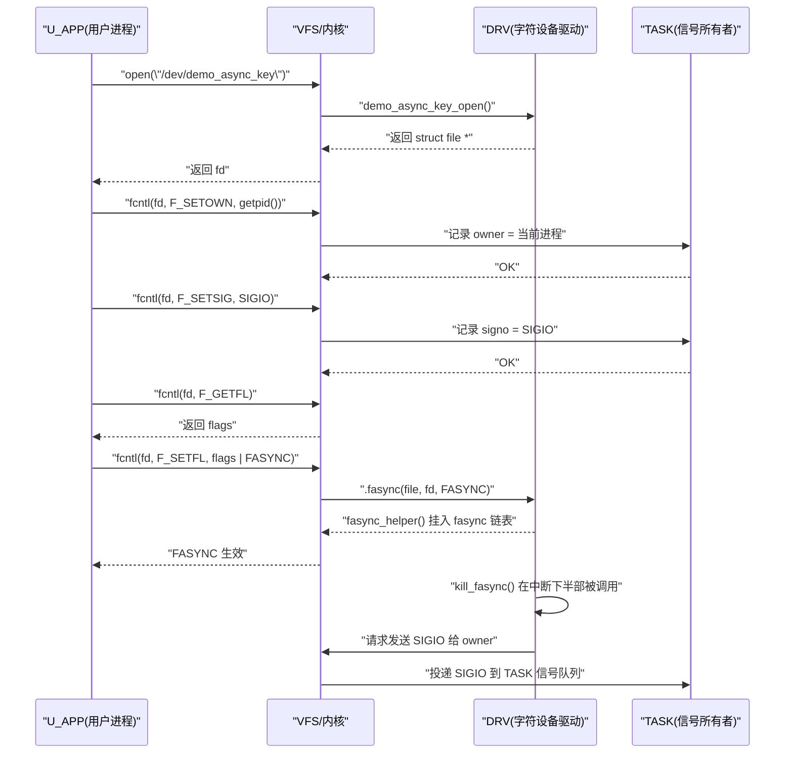
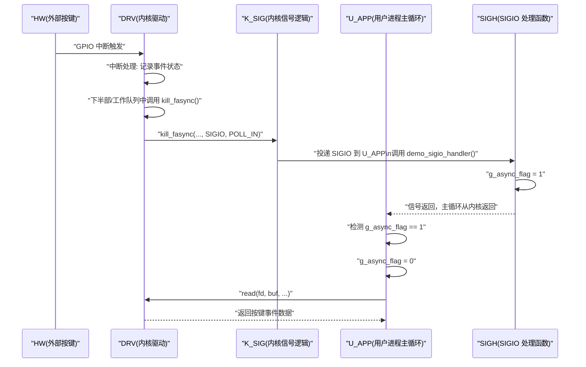
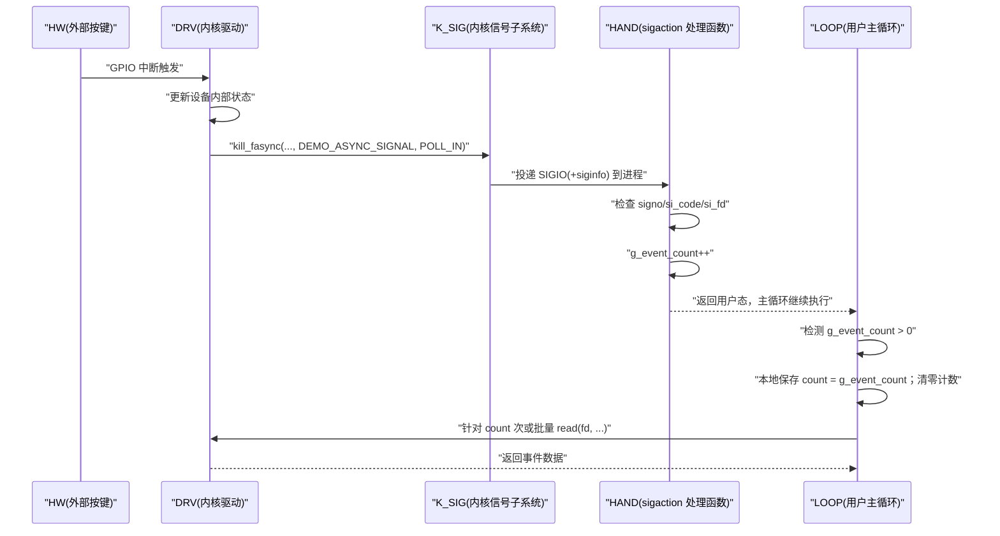
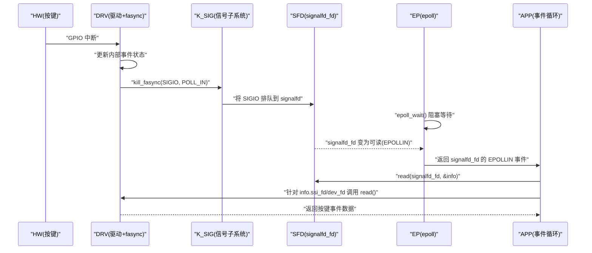

# 第 9 章 用户态编程：从 SIGIO 到 signalfd/epoll

## 9.0 章节内容说明

本章从**用户态**视角，系统化说明如何“接住”驱动通过 fasync 发出来的通知信号，并将其正确地并入现代事件循环（`epoll` + `signalfd` 等）中。具体目标：

- 搭建从**驱动 kill_fasync() → 内核信号队列 → 用户态 SIGIO / signalfd**的整体链路理解；
- 说明 `fcntl(F_SETOWN)` / `F_SETSIG` / `F_SETFL(FASYNC)` 的正确调用顺序及其失败模式；
- 给出经典的 `SIGIO` 写法，以及基于 `sigaction` 的可靠处理方式；
- 展示如何使用 `signalfd` 把 SIGIO 信号“转化”为普通可轮询事件，并接入 `epoll`；
- 剖析多线程/多进程环境下的所有权、fd 共享与信号路由问题；
- 总结用户态常见误用与调试策略。

默认前提与前几章一致：

- 内核版本：Linux 6.1+；
- 平台：以 i.MX6ULL + 自定义字符设备 `/dev/demo_async_key` 为主线（但用户态代码在任意 Linux 平台通用）；
- 驱动侧已经正确实现 `.fasync` + `kill_fasync()`，并能向设置了 FASYNC 的进程发送 `SIGIO`。

下面从**9.1 小节**开始，专门把“配置顺序”讲清楚。

------

## 9.1 `fcntl(F_SETOWN)` / `F_SETSIG` / `F_SETFL(FASYNC)` 的调用顺序

> 本小节按照你要求的固定结构：引入 → 数据结构视角 → 开发者视角 → 用户/平台视角 → 可视化 → 示例代码 → 调试与验证 → 小结。

### 9.1.1 引入：这三个调用“是什么、干什么、为什么要讲顺序”

先用“三步讲解法”把概念定死：

1. **是什么**
   - `F_SETOWN`：通过 `fcntl()` 设置**哪个任务或进程组**是此文件描述符的“所有者”（owner）。异步 I/O 信号（如 `SIGIO`）会发给它。
   - `F_SETSIG`：通过 `fcntl()` 指定**用哪个信号号**来承载 I/O 事件通知（默认是 `SIGIO`），可以切换为 `SIGRTMIN` 等实时信号。
   - `F_SETFL(FASYNC)`：在 `file->f_flags` 中设置 `FASYNC`，触发内核调用驱动的 `.fasync` 回调，从而把当前 `file` 节点挂入 fasync 链表中，让驱动的 `kill_fasync()` 知道要给谁发信号。
2. **干什么（要解决的问题）**
    驱动通过 `kill_fasync()` 告诉内核：“这个 `struct file *` 关联的进程应该收到一个 I/O 事件信号。”
    但内核还需要回答两个问题：
   - 事件要发给**谁**？（一个具体进程，还是一个进程组？）
   - 要发**哪一个信号号**？（`SIGIO` 还是你指定的别的信号？）
      上述两个问题由 `F_SETOWN` 和 `F_SETSIG` 决定，而 `FASYNC` 决定“这一端是否参与 fasync 机制”。
3. **怎么实现（为什么顺序很重要）**
    从内核视角：
   - `F_SETOWN` / `F_SETSIG` 只是在内核数据结构里写入“元信息”（owner、signum），暂时不触发 `.fasync`；
   - `F_SETFL(FASYNC)` 则会触发 VFS 调用 `.fasync`，把当前 `file` 插入/移出驱动的 fasync 链表。
      如果你**先打开 FASYNC，再设置 owner/signum**，可能会出现一段窗口期：
   - 驱动已经开始通过 `kill_fasync()` 发送信号；
   - 但 owner 还没设置好或信号号不正确 → 导致信号丢失或路由到错误的任务。

所以，本小节的目标是：给出一个**稳定的调用顺序模板**，并解释其底层原因和常见错误模式。

------

### 9.1.2 数据结构视角：owner / signum / f_flags 是怎么落到内核里的

为了后续用户态编程时能对现象做“反推”，先从数据结构角度看这三个调用分别写入哪里（与前几章的内核视角呼应）：

1. **文件所有权：`F_SETOWN` 对应的数据结构（简化说明）**
    用户态：

   ```c
   fcntl(fd, F_SETOWN, pid_or_pgid);
   ```

   落到内核（简化逻辑）：

   - 内核内部维护了与 `struct file` 关联的“所有者信息”：
     - 早期是 `file->f_owner`（类型 `struct fown_struct`）；
     - 其中会记录 `pid` 或 `pgid` 以及通知方式（`PIDTYPE_PID` / `PIDTYPE_PGID`）。
   - 当 `kill_fasync()` 被调用时，最终会根据这个 owner 决定发信给哪一个 `task_struct` 或进程组。

2. **信号号：`F_SETSIG` 对应的数据结构**

   ```c
   fcntl(fd, F_SETSIG, signo);
   ```

   - 内核会在 `struct fown_struct` 中记录一个“自定义信号号”；
   - 若未设置，则使用默认的 `SIGIO` 或 `SIGPOLL`；
   - 若设置为实时信号（`SIGRTMIN + n`），配合 `siginfo_t` 可以携带更多信息（在 9.4、9.7 再展开）。

3. **FASYNC 标志：`F_SETFL(FASYNC)` 对应的数据结构**

   ```c
   int flags = fcntl(fd, F_GETFL);
   fcntl(fd, F_SETFL, flags | FASYNC);
   ```

   - `F_SETFL` 修改的是 `file->f_flags`；
   - 当 `FASYNC` 位发生变化时，VFS 会调用 `file->f_op->fasync()`；
   - 驱动的 `.fasync` 通常会调用 `fasync_helper()` 把 `struct file *` 挂入 `struct fasync_struct` 链表。
   - 之后，驱动调用 `kill_fasync()` 时，会遍历这个链表，把信号发给前面记录的 owner。

> 结论：
>
> - `F_SETOWN` / `F_SETSIG`：**写 owner/signum 元信息**；
> - `F_SETFL(FASYNC)`：**触发 .fasync，把 fd 真正挂入 fasync 机制**。
>    因此，从“状态收敛”的角度看，应当先把 owner/signum 配好，再启用 `FASYNC`。

------

### 9.1.3 开发者视角：推荐调用顺序与语义约定

站在用户态开发者角度，下面给出一个**推荐模板顺序**以及原因说明。

#### 9.1.3.1 推荐顺序（单线程/单进程场景）

典型顺序如下：

1. `open()` 打开设备；
2. `fcntl(F_SETOWN)` 设置信号所有者（当前进程或进程组）；
3. （可选）`fcntl(F_SETSIG)` 设置使用的信号号（如果不想用 `SIGIO`）；
4. 使用 `F_GETFL` 读出原先的 flags；
5. 使用 `F_SETFL` 打开 `FASYNC`（可能还要保留 `O_NONBLOCK` 等）。

伪流程：

```c
fd = open("/dev/demo_async_key", O_RDWR | O_NONBLOCK);
fcntl(fd, F_SETOWN, getpid());              /* 1. 设置 owner */
fcntl(fd, F_SETSIG, SIGIO);                 /* 2. 可选：指定信号号 */
flags = fcntl(fd, F_GETFL);                 /* 3. 读原 flags */
fcntl(fd, F_SETFL, flags | FASYNC);         /* 4. 打开 FASYNC */
```

这样做的好处：

- 当驱动的 `.fasync` 第一次被调用时，owner/signum 已经确定；
- 从第一颗 fasync 信号开始，路由就是一致且可预期的；
- 若中间某一步失败（比如 `F_SETSIG` 不支持），你可以在启用 FASYNC 前直接报错/退回，不会出现“半配置状态”。

#### 9.1.3.2 常见错误顺序及后果

1. **错误模式 A：先 F_SETFL，再 F_SETOWN**

   ```c
   /* 先打开 FASYNC，再设置 owner —— 不推荐 */
   int flags = fcntl(fd, F_GETFL);
   fcntl(fd, F_SETFL, flags | FASYNC);
   fcntl(fd, F_SETOWN, getpid());
   ```

   可能后果：

   - 若驱动在这两个调用之间刚好触发 `kill_fasync()`，内核可能找不到正确的 owner，或者信号被路由到默认对象；
   - 会产生“偶现收不到第一次事件”的现象，难以排查。

2. **错误模式 B：只设置 FASYNC，不设置 owner**

   ```c
   /* 只设置 FASYNC 完全不调用 F_SETOWN —— 高度不推荐 */
   int flags = fcntl(fd, F_GETFL);
   fcntl(fd, F_SETFL, flags | FASYNC);
   /* 没有 F_SETOWN，可能依赖一些不明确的默认行为 */
   ```

   后果：

   - 依赖内核的默认 owner 逻辑（不同 libc / 不同年代的应用代码可能假设不同行为），容易产生**进程组混乱**；
   - 多进程/多线程场景中几乎不可控。

3. **错误模式 C：多线程环境下，在非“最终持有线程”中调用 F_SETOWN**

   - 当 fd 在多个线程间共享时，`F_SETOWN` 指定的 owner 仍然是一个具体的 `pid` 或 `pgid`；
   - 若你在一个辅助线程中调用 `F_SETOWN` 指向自己，但实际希望信号送到“主线程”，就会产生路由偏差；
   - 正确做法通常是：仅在**真正希望接收信号的线程**中调用 `F_SETOWN`（或使用进程组 + `SA_SIGINFO`/`signalfd` 再做分发，这部分在 9.5 展开）。

------

### 9.1.4 用户/平台视角：在 i.MX6ULL demo 异步驱动上的配置建议

以本书统一的示例设备节点 `/dev/demo_async_key` 为例（对应前面章节的 GPIO 中断 + fasync 驱动），推荐的用户态配置模式如下：

1. **平台无关性**
   - 以下调用顺序对 x86_64 / ARMv7 / ARMv8 都适用，与 i.MX6ULL 平台无关；
   - 唯一与平台有关的是设备节点名称（`/dev/demo_async_key`），由你的驱动决定。
2. **用户态建议**
   - 始终显式调用 `F_SETOWN`；
   - 推荐固定使用 `SIGIO` 或显式指定一个 `SIGRTMIN + n`；
   - 若你有多种通知来源（多个 fd、多个驱动），更推荐在后续使用 `signalfd` 统一处理（在 9.4 说明）。
3. **对“嵌入式系统进程模型”的特殊提示**
   - 在嵌入式场景下， often 有一个“总控进程”负责管理多个设备；
   - 此总控进程不一定是 PID=1，但通常是一个单实例 daemon；
   - 建议把 `F_SETOWN` 设为**该 daemon 的 pid**，而不是临时子进程，以保证重启子进程不影响信号路由；
   - 若必须通过 fork 派生子进程来处理业务，则要么：
     - 在 fork 后的子进程重新设置 `F_SETOWN`；
     - 要么使用 `signalfd` + `epoll` 在父进程中集中收集事件，再通过 IPC 分发给子进程。

------

### 9.1.5 可视化：从 open 到 FASYNC 生效的调用时序

下面用一个简单的时序图，把“正确顺序”和“驱动侧响应”画出来，方便你在脑子里建立映射（Mermaid 原生语法、节点统一用双引号包裹，符合你的最新要求）：



这个图对应的驱动路径和内核路径在前几章已经详细展开，这里只强调：**只有在 `F_SETFL(FASYNC)` 之后，驱动才真正知道要通知哪个 `file`；只有在 `F_SETOWN` / `F_SETSIG` 之后，内核才知道要把信号投递给谁/用哪个信号号。**

------

### 9.1.6 示例代码：最小配置模板（只负责把顺序写对）

本小节的示例代码只聚焦“配置顺序”和“错误处理”，不负责完整的 SIGIO 处理逻辑（完整处理在 9.2 / 9.3 展开）。代码风格按照你要求的 Linux kernel style（K&R/tab=4，中文注释，避免裸数字宏化）。

```c
/*
 * demo_async_user_setup.c
 *
 * 目的：演示如何以推荐顺序配置 F_SETOWN / F_SETSIG / F_SETFL(FASYNC)
 * 说明：这里只做配置，不处理信号逻辑，方便独立编译与 strace 验证
 */

#include <stdio.h>
#include <stdlib.h>
#include <unistd.h>
#include <fcntl.h>
#include <signal.h>
#include <errno.h>
#include <string.h>

#define DEMO_DEV_PATH          "/dev/demo_async_key"
#define DEMO_ASYNC_SIGNAL      SIGIO   /* 使用标准 SIGIO，避免魔法数字 */
#define DEMO_INVALID_FD        (-1)

static void print_errno(const char *msg)
{
	fprintf(stderr, "%s: %s\n", msg, strerror(errno));
}

int main(void)
{
	int fd = DEMO_INVALID_FD;
	int ret;
	int flags;

	/* 1. 打开设备，建议使用 O_NONBLOCK，避免后续 read 阻塞 */
	fd = open(DEMO_DEV_PATH, O_RDONLY | O_NONBLOCK);
	if (fd < 0) {
		print_errno("打开设备失败");
		return EXIT_FAILURE;
	}

	/* 2. 设置信号所有者为当前进程（也可以设置为负值表示进程组） */
	ret = fcntl(fd, F_SETOWN, getpid());
	if (ret < 0) {
		print_errno("F_SETOWN 失败");
		goto out_close;
	}

	/* 3. 可选：指定使用的信号号，默认是 SIGIO，
	 *    这里显式设置为 SIGIO，便于后续统一改成 SIGRTMIN + n
	 */
	ret = fcntl(fd, F_SETSIG, DEMO_ASYNC_SIGNAL);
	if (ret < 0) {
		print_errno("F_SETSIG 失败");
		goto out_close;
	}

	/* 4. 读取原始 flags，避免覆盖掉其他重要标志（如 O_NONBLOCK） */
	flags = fcntl(fd, F_GETFL);
	if (flags < 0) {
		print_errno("F_GETFL 失败");
		goto out_close;
	}

	/* 5. 设置 FASYNC 标志，触发 .fasync 回调，将 fd 挂入 fasync 链表 */
	ret = fcntl(fd, F_SETFL, flags | FASYNC);
	if (ret < 0) {
		print_errno("F_SETFL(FASYNC) 失败");
		goto out_close;
	}

	printf("异步通知配置完成：owner=%d, signal=%d, flags=0x%x\n",
	       getpid(), DEMO_ASYNC_SIGNAL, flags | FASYNC);

	/* 在本小节中，我们不做实际的信号处理，只是阻塞等待，方便你用 Ctrl+C 中断 */
	pause();

out_close:
	if (fd >= 0) {
		close(fd);
		fd = DEMO_INVALID_FD;
	}
	return (ret < 0) ? EXIT_FAILURE : EXIT_SUCCESS;
}
```

要点说明：

- 使用 `DEMO_DEV_PATH` 和 `DEMO_ASYNC_SIGNAL` 宏，避免硬编码字符串和信号号；
- 错误处理在启用 FASYNC 前统一退出，不会留下“半配置状态”；
- 代码里没有设置 `signal`/`sigaction`，只是 `pause()`，方便你在 9.2 再对比“完整版本”。

------

### 9.1.7 调试与验证：如何确认顺序正确且 FASYNC 生效

本小节只给出与“顺序相关”的最小调试手段，详细调试手段在第 11 章展开。

1. **使用 `strace` 观察 fcntl 调用顺序**

   ```sh
   strace -e trace=fcntl,open,close ./demo_async_user_setup
   ```

   你应当看到类似顺序：

   1. `open("/dev/demo_async_key", O_RDONLY|O_NONBLOCK) = 3`
   2. `fcntl(3, F_SETOWN, 1234)`
   3. `fcntl(3, F_SETSIG, SIGIO)`
   4. `fcntl(3, F_GETFL) = O_RDONLY|O_NONBLOCK`
   5. `fcntl(3, F_SETFL, O_RDONLY|O_NONBLOCK|O_ASYNC)`

   若顺序与本节推荐不一致，应先调整用户态代码，再排查内核/驱动。

2. **通过 `/proc/PID/fdinfo` 检查 FASYNC 与 owner**

   假设程序 PID 为 `1234`，fd 为 3：

   ```sh
   cat /proc/1234/fdinfo/3
   ```

   典型输出（内核版本不同略有差异）中，会有类似字段：

   - `flags:  0400002`（包含 `O_ASYNC` / `FASYNC`）；
   - `pos:    0`；
   - 若内核支持，还可能有一些与 owner 相关的信息。

   若 `flags` 中缺少 `O_ASYNC`，说明 `F_SETFL` 调用没有生效。

3. **配合驱动侧调试信息**

   - 在驱动的 `.fasync` 中使用 `pr_info()` 打印 `fd`、`pid`、`flags`，确认何时被调用；
   - 当你运行示例程序时，应能看到 `.fasync` 在 `F_SETFL(FASYNC)` 时被调用一次；
   - 若有重复设置/关闭 FASYNC，也能从该打印中看到对应日志。

------

### 9.1.8 小结：9.1 在整章中的位置

本小节只解决一个核心问题：

> **在用户态，应该以什么顺序调用 `F_SETOWN` / `F_SETSIG` / `F_SETFL(FASYNC)`，才能保证 fasync 通知链路的语义稳定且可调试？**

结论可以归纳为：

1. 从**内核数据结构**来说：
   - `F_SETOWN` / `F_SETSIG` → 设置 owner 和 signum 元信息；
   - `F_SETFL(FASYNC)` → 触发 `.fasync`，把 fd 真正挂入 fasync 链表。
2. 从**用户态开发者**视角：
   - 推荐顺序：`open` → `F_SETOWN` → `F_SETSIG`（可选）→ `F_GETFL` → `F_SETFL(FASYNC)`；
   - 避免先 FASYNC 后 owner，更不要只设置 FASYNC 不管 owner；
   - 多线程/多进程下，要特别小心“谁是 owner”，否则信号路由会非常混乱。
3. 从**调试与验证**视角：
   - 使用 `strace` 确认 fcntl 顺序；
   - 使用 `/proc/PID/fdinfo` 检查 `O_ASYNC` 标志；
   - 配合驱动的 `.fasync` 日志，形成端到端闭环。

接下来在 **9.2、9.3** 中，我们在这个顺序的基础上，分别展开：

- 如何用传统 `SIGIO` + `signal`/`sigaction` 写出一个“可靠的异步通知处理逻辑”；
- 如何避免在信号处理函数里做重操作，保证系统稳定性。


------

## 9.2 使用 `SIGIO` 的经典写法（signal handler + 全局状态）

### 9.2.1 引入：最常见、也是最“教材式”的用法

在很多老的 Linux 驱动示例中，你会看到这样的模式：

1. 用户进程通过 `F_SETOWN` + `F_SETFL(FASYNC)` 打开异步通知；
2. 安装一个 `SIGIO` 的信号处理函数（通常用 `signal()`）；
3. 信号处理函数把一个**全局标志位**设为 1；
4. 主循环在 `while(1)` 中检查这个标志位，一旦为 1，就去 `read()` 设备；
5. 读完后清零标志，继续干别的事。

这个模式的特点：

- 实现简单，几乎不需要额外的数据结构；
- 缺点也很明显：依赖全局状态、信号处理函数可重入性弱、可扩展性差；
- 但作为理解 fasync → SIGIO 的**第一站**，它足够直观，且在嵌入式单进程场景仍具有参考价值。

本小节就围绕这个“经典写法”，用规范的方式把它写到可以实战使用的程度，同时指出其边界，为下一节的 `sigaction`/`signalfd` 做铺垫。

------

### 9.2.2 数据结构视角：信号处理函数和全局标志在进程内部的位置

从内核角度，9.1 已经解释了 owner、signum 和 FASYNC 的位置；这里从**用户态进程内部**的数据结构来看：

1. **信号处理函数表**

   - 内核为每个进程维护一个“信号动作表”，可以理解为每个信号号对应一个 `struct k_sigaction`；
   - 用户态通过 `signal()` 或 `sigaction()` 修改这一表项；
   - 对于 `SIGIO`，经典写法就是把表项设置为用户的 handler。

2. **全局标志位**

   - 典型定义：

     ```c
     static volatile sig_atomic_t g_async_flag = 0;
     ```

   - 类型使用 `sig_atomic_t` 而不是 `int` 的原因：

     - 保证对该变量的读写在信号处理上下文中是**原子**的（C 标准语义），不会被编译器重排到奇怪的地方；
     - `volatile` 告诉编译器不要对其访问进行过度优化，避免把值缓存到寄存器而不刷回内存。

3. **设备 fd 的进程内保存**

   - 常见写法：将 `open()` 得到的 fd 记录到一个全局变量，例如：

     ```c
     static int g_dev_fd = DEMO_INVALID_FD;
     ```

   - 这样在主循环和信号处理函数里都可以访问它；

   - 但注意：**信号处理函数里不要调用 `read()`**，只使用 fd 做极短的操作（本小节坚持“只改标志”，不在 handler 中读）。

总结：
 在经典 SIGIO 写法中，进程里多了两个关键全局状态：

- `g_dev_fd`：指明哪一个 fd 对应设备；
- `g_async_flag`：告知主循环“设备有新事件，需要处理”。

------

### 9.2.3 开发者视角：经典模式的步骤拆解

把这个模式拆开，可以分成三个部分：

1. **配置阶段**（与 9.1 结合）

   - 步骤与 9.1 基本一致：
     1. `open()` 设备；
     2. `F_SETOWN` / `F_SETSIG`；
     3. `F_GETFL` / `F_SETFL(FASYNC)`；
   - 额外要做的是：**注册 `SIGIO` 的 handler**。

2. **信号处理阶段**

   - 使用 `signal()` 或 `sigaction()` 安装处理函数；

   - 经典写法通常使用 `signal()`，示例：

     ```c
     if (signal(DEMO_ASYNC_SIGNAL, demo_sigio_handler) == SIG_ERR) {
         /* 错误处理 */
     }
     ```

   - 处理函数只做一件事：把 `g_async_flag` 置 1，不在其中调用非 async-signal-safe 函数。

3. **主循环阶段**

   - 主循环执行逻辑大致为：

     - 判断 `g_async_flag` 是否为 1；
     - 若为 1，则清零，并对设备进行 `read()` 等操作；
     - 处理完设备事件后继续干其他事情（计算、网络、定时任务等）。

   - 典型结构：

     ```c
     while (!g_exit_flag) {
         if (g_async_flag) {
             g_async_flag = 0;
             /* 这里 read()/处理数据 */
         }
     
         /* 其他工作或小睡一会儿 */
     }
     ```

   - 注意处理 `read()` 返回值中的 `EAGAIN` / `EINTR` 等。

这种模式的语义可以理解为：

> 信号只是一个“软中断”，告诉你“有事发生”；具体事件有多少、内容是什么，仍然要靠你主动从设备（或内核缓存）中读取。

------

### 9.2.4 用户/平台视角：在嵌入式单进程/守护进程中的使用场景

在典型嵌入式系统中，这种写法经常出现在：

- 单进程“控制循环”程序中，例如：
  - `/dev/demo_async_key` 按键触发某个状态机转移；
  - GPIO 事件用于唤醒 CPU 或改变功耗模式；
- 无复杂框架的“小型守护进程”中：
  - 它既要处理按键/传感器事件，又要周期性地做一些简单任务；
  - 此时用完整的 `epoll`/`signalfd` 框架显得有点重。

对于这类场景，经典 SIGIO + 全局标志的优点是：

- **实现代价低**：不需要引入多线程、复杂事件系统；
- **可与轮询/定时器共存**：主循环里既可以处理 `g_async_flag`，也可以做周期任务；
- **易于移植到没有 glibc 的环境**（如部分 uClibc/musl 系统，只要有 `signal()`/`fcntl()`）。

但对于更复杂的场景（多线程、多fd、需要事件合并的 GUI 应用等），本模式很快就会暴露缺陷，这会在 9.5、9.6 和 9.7 中展开。

------

### 9.2.5 可视化：从硬件中断到用户循环的“软中断”链路

下面用时序图把整个流程串起来：从 GPIO 中断，到 driver `kill_fasync()`，再到用户态 handler 设置标志，最后主循环读设备。



图中关键点：

- `SIGH` 中的工作量被强制压缩为“设一个标志”；
- 所有实际 I/O 操作留在 `U_APP` 主循环中做，避免在信号上下文读设备。

------

### 9.2.6 示例代码：`signal()` + 全局标志的完整示例

下面给出一个完整的**可编译用户态程序**，使用 9.1 中的推荐顺序配置 fasync，再用经典写法处理 SIGIO。代码风格遵循你要求的内核风格（K&R/tab=4、中文注释，避免裸数字）。

```c
/*
 * demo_async_sigio_basic.c
 *
 * 目的：
 *     使用最经典的 SIGIO + 全局标志模式，演示如何接收
 *     /dev/demo_async_key 的异步通知，并在主循环中读取事件。
 *
 * 注意：
 *     1. 信号处理函数中只修改全局标志，不调用非异步安全函数；
 *     2. 本示例适合单进程、单设备 fd 的简单场景；
 *     3. 更复杂场景（多 fd、多线程）推荐使用 sigaction + signalfd，
 *        在本章后续小节中展开。
 */

#include <stdio.h>
#include <stdlib.h>
#include <unistd.h>
#include <fcntl.h>
#include <signal.h>
#include <errno.h>
#include <string.h>

#define DEMO_DEV_PATH          "/dev/demo_async_key"
#define DEMO_ASYNC_SIGNAL      SIGIO       /* 使用 SIGIO 承载异步通知 */
#define DEMO_INVALID_FD        (-1)

#define DEMO_READ_BUF_SIZE     64          /* 读取设备时的缓冲区大小，单位：字节 */
#define DEMO_IDLE_USEC         10000       /* 主循环空闲等待时间，单位：微秒 */
#define DEMO_TRUE              1
#define DEMO_FALSE             0

/* 全局状态：设备 fd 与异步标志 */
static int g_dev_fd = DEMO_INVALID_FD;
static volatile sig_atomic_t g_async_flag = 0;
static volatile sig_atomic_t g_exit_flag = 0;

static void print_errno(const char *msg)
{
	fprintf(stderr, "%s: %s\n", msg, strerror(errno));
}

/* SIGINT 处理函数：用于优雅退出 */
static void demo_sigint_handler(int signo)
{
	(void)signo;
	g_exit_flag = 1;
}

/* SIGIO 处理函数：只设置标志 */
static void demo_sigio_handler(int signo)
{
	if (signo == DEMO_ASYNC_SIGNAL) {
		/* 这里只能做非常小的工作：设置标志位 */
		g_async_flag = 1;
	}
}

static int demo_setup_signal_handlers(void)
{
	/* 为简单起见，这里使用 signal()，后续小节会改用 sigaction() */
	if (signal(DEMO_ASYNC_SIGNAL, demo_sigio_handler) == SIG_ERR) {
		print_errno("安装 SIGIO 处理函数失败");
		return -1;
	}

	if (signal(SIGINT, demo_sigint_handler) == SIG_ERR) {
		print_errno("安装 SIGINT 处理函数失败");
		return -1;
	}

	return 0;
}

static int demo_setup_async_fd(const char *dev_path)
{
	int fd;
	int ret;
	int flags;

	fd = open(dev_path, O_RDONLY | O_NONBLOCK);
	if (fd < 0) {
		print_errno("打开设备失败");
		return -1;
	}

	/* 设置信号所有者为当前进程 */
	ret = fcntl(fd, F_SETOWN, getpid());
	if (ret < 0) {
		print_errno("F_SETOWN 失败");
		goto out_close;
	}

	/* 显式指定使用 SIGIO，便于后续统一替换为 SIGRTMIN + n */
	ret = fcntl(fd, F_SETSIG, DEMO_ASYNC_SIGNAL);
	if (ret < 0) {
		print_errno("F_SETSIG 失败");
		goto out_close;
	}

	/* 打开 FASYNC 标志，触发 .fasync 回调 */
	flags = fcntl(fd, F_GETFL);
	if (flags < 0) {
		print_errno("F_GETFL 失败");
		goto out_close;
	}

	ret = fcntl(fd, F_SETFL, flags | FASYNC);
	if (ret < 0) {
		print_errno("F_SETFL(FASYNC) 失败");
		goto out_close;
	}

	g_dev_fd = fd;
	printf("异步通知配置完成：fd=%d, owner=%d, signal=%d\n",
	       g_dev_fd, getpid(), DEMO_ASYNC_SIGNAL);

	return 0;

out_close:
	close(fd);
	return -1;
}

/* 处理设备中的事件：在主循环中调用 */
static void demo_handle_device_event(void)
{
	char buf[DEMO_READ_BUF_SIZE];
	ssize_t n;

	for (;;) {
		n = read(g_dev_fd, buf, sizeof(buf));
		if (n > 0) {
			/* 这里根据你的驱动协议解析数据，本示例只做简单打印 */
			printf("收到设备事件：读取到 %zd 字节\n", n);
			/* 可以在这里根据 buf[0..n-1] 做更具体的业务逻辑 */
		} else if (n == 0) {
			/* 按键类设备一般不会返回 0，这里仅作防御性处理 */
			printf("设备 read 返回 0，可能表示无更多数据\n");
			break;
		} else {
			if (errno == EAGAIN || errno == EWOULDBLOCK) {
				/* 数据已经读完，等待下次 SIGIO */
				break;
			} else if (errno == EINTR) {
				/* read 被信号打断，继续重试 */
				continue;
			} else {
				print_errno("读取设备数据失败");
				break;
			}
		}
	}
}

int main(void)
{
	int ret;

	ret = demo_setup_signal_handlers();
	if (ret < 0) {
		return EXIT_FAILURE;
	}

	ret = demo_setup_async_fd(DEMO_DEV_PATH);
	if (ret < 0) {
		return EXIT_FAILURE;
	}

	printf("进入主循环，按 Ctrl+C 退出程序...\n");

	while (!g_exit_flag) {
		if (g_async_flag) {
			/* 抢占式清零，避免在处理过程中丢失新事件信息 */
			g_async_flag = 0;
			demo_handle_device_event();
		}

		/* 在简单示例中，用 usleep 作为“空闲等待”，避免死循环占满 CPU */
		usleep(DEMO_IDLE_USEC);
	}

	if (g_dev_fd >= 0) {
		close(g_dev_fd);
		g_dev_fd = DEMO_INVALID_FD;
	}

	printf("程序退出。\n");
	return EXIT_SUCCESS;
}
```

关键点回顾：

- `demo_setup_async_fd()` 完全沿用了 9.1 推荐的顺序；
- `demo_sigio_handler()` 中**只修改 `g_async_flag`**，符合 async-signal-safe 的要求；
- `demo_handle_device_event()` 在正常进程上下文中读设备、打印信息；
- 使用 `SIGINT` 处理函数实现优雅退出，这也演示了“多个信号并存”的基本用法。

------

### 9.2.7 调试与验证：如何确认经典写法工作正常

针对这个示例，建议使用以下步骤验证：

1. **确认 fcntl 和信号安装顺序**

   ```sh
   strace -e trace=fcntl,open,close,rt_sigaction ./demo_async_sigio_basic
   ```

   观察：

   - 是否有 `rt_sigaction(SIGIO, ...)` 或 `signal(SIGIO, ...)`；
   - 是否有 `F_SETOWN` / `F_SETSIG` / `F_SETFL`，顺序是否正确。

2. **观察运行时行为**

   - 运行程序后，按下与你驱动绑定的按键（或触发外部中断）；
   - 终端输出中应出现“收到设备事件：读取到 X 字节”；
   - 若按键动作频繁，输出应该对应每次事件，具体取决于驱动的缓冲策略。

3. **验证 `g_async_flag` 生效**

   - 可以在 `demo_sigio_handler()` 中临时增加一个计数器（注意 `sig_atomic_t`），然后在主循环中打印计数；
   - 这可以帮助你区分“信号触发次数”和“读到数据的次数”。

4. **典型排错线索**

   - **情况 A：驱动 `kill_fasync()` 调用确认执行，但用户态没有任何打印：**
     - 检查：`F_SETOWN` 是否成功？owner 是否是正确的 pid？
     - 检查：当前进程是否对 `SIGIO` 处于未屏蔽状态（后面使用 `sigprocmask` 会影响）？
   - **情况 B：程序能收到一次事件，以后就“安静了”：**
     - 检查：是否在某处不小心再次修改了 `F_SETFL` 覆盖掉 `FASYNC`；
     - 检查：是否在信号处理函数中做了阻塞操作导致死锁；
   - **情况 C：频繁事件时 CPU 占用异常高：**
     - 检查：主循环中是否没有任何休眠（`usleep`）或其他节流手段；
     - 检查：`demo_handle_device_event()` 中是否处理过重、引入了多次 I/O。

------

### 9.2.8 小结：经典 SIGIO 写法的定位与边界

本小节给出的“signal handler + 全局状态”模式，是理解 fasync 用户态使用的一个基础模板，其要点可以归纳为：

1. **语义定位**
   - `SIGIO` 被当成一个“软中断”：只负责告知“有事件”，不与具体事件数量一一对应；
   - 信号处理函数只做极少的工作：修改 `sig_atomic_t` 类型的全局标志；
   - 主循环负责“拉取数据、做业务处理”。
2. **实现要点**
   - 保持 9.1 所建议的 `F_SETOWN` / `F_SETSIG` / `F_SETFL(FASYNC)` 调用顺序；
   - 在 handler 中**只做 safe 操作**（设标志），不要直接 `printf` / `malloc` / `read` 等；
   - 使用非阻塞 fd + 循环 `read()`，用 `EAGAIN` 作为“读完”的终止条件。
3. **适用场景**
   - 单进程、单设备 fd、小规模事件的控制逻辑；
   - 简单的嵌入式守护进程，用于响应硬件事件并驱动状态机。
4. **局限与下一步**
   - 无法优雅支持多 fd、精细的信号参数解析、复杂的掩码/路由控制；
   - 对多线程环境支持不佳（owner 只有一个）；
   - 不利于整合进 `epoll` 等现代事件循环。

在下一小节 **9.3** 中，我们将在此基础上升级到：

- 使用 `sigaction` + `SA_SIGINFO` 的可靠信号处理模式；
- 更严谨地控制信号掩码、避免竞态；
- 为后续 `signalfd` + `epoll` 的“现代事件循环”打好基础。


------

## 9.3 使用 `sigaction` 的可靠信号处理模式

### 9.3.1 引入：为什么要从 `signal()` 升级到 `sigaction()`

上一小节我们用了最经典的写法：

- `signal(SIGIO, handler)`；
- handler 中设置全局标志；
- 主循环检查标志、主动 `read()`。

在实际工程中，这种写法有几个问题：

1. `signal()` 的行为在历史上不够统一，不同系统/不同 libc 对“自动复位、是否 SA_RESTART”等细节实现不同；
2. 不能方便地使用 `SA_SIGINFO` 获取 `siginfo_t`，只能拿到一个 `int signo`，难以区分不同 fd、不同来源；
3. 很难**精细控制信号掩码**（哪些信号在 handler 执行期间被屏蔽，哪些不屏蔽），对复杂系统不够安全。

`sigaction()` 则是现代 POSIX 推荐的接口，可以精确控制：

- 使用 `sa_sigaction` + `SA_SIGINFO` 拿到 `siginfo_t`，区分不同 fd/不同 source；
- 使用 `sa_mask` 指定 handler 执行期间需要屏蔽的信号集合；
- 使用 `sa_flags`（如 `SA_RESTART` 等）控制系统调用因信号被中断时的行为。

本小节的目标是：

- 用“语法四连问”的方式把 `sigaction()` 关键字段说明白；
- 给出一个**更可靠的 SIGIO 处理模式**，可以在实际项目中替换掉简单的 `signal()` 写法；
- 为下一节 `signalfd + epoll` 做准备（那里会进一步把信号“变成”可轮询事件）。

------

### 9.3.2 数据结构视角：`struct sigaction` 与 `siginfo_t`

先从数据结构看 `sigaction()` 到底在改什么。

#### 9.3.2.1 `struct sigaction` 的关键字段

典型定义（glibc 头文件中略有差异，这里抽象说明）：

```c
struct sigaction {
	void        (*sa_handler)(int);
	void        (*sa_sigaction)(int, siginfo_t *, void *);
	sigset_t    sa_mask;
	int         sa_flags;
};
```

几个关键点：

- `sa_handler`
  - 传统的简单 handler：只接收一个 `int signo`；
  - 当你**不使用 `SA_SIGINFO`** 时生效。
- `sa_sigaction`
  - 扩展 handler：接收 `signo` + `siginfo_t *` + `ucontext` 指针；
  - 只有在 `sa_flags` 中设置了 `SA_SIGINFO` 时才会被使用；
  - 适合需要知道**哪个 fd 触发信号、信号的附加信息**等场景。
- `sa_mask`
  - 一个 `sigset_t`，指定“在此 handler 执行期间自动额外屏蔽的信号集合”；
  - 能避免 handler 被同类或某些特定信号重入，降低嵌套复杂度。
- `sa_flags`
   常见标志（本书范围内重点关注）：
  - `SA_SIGINFO`：使用 `sa_sigaction` 而非 `sa_handler`；
  - `SA_RESTART`：被信号中断的**部分阻塞系统调用**会自动重启（例如 `read()` 在某些情况下）；
  - `SA_NODEFER`：允许在 handler 执行期间再次接收同一信号（默认是自动屏蔽同号信号）。

> **语法四连问：`sigaction()`**
>
> - 作用：设置或查询某个信号的处理动作（handler、mask、flags 等）；
> - 使用场景：需要可靠、可移植、可控制掩码/flags 的信号处理逻辑；
> - 不写/写错后果：
>   - 用 `signal()` 代替可能出现实现差异；
>   - 不设 `SA_SIGINFO` 则无法拿到 `siginfo_t`；
>   - `sa_mask` 未合理设置可能导致 handler 中被信号重入；
> - 驱动落点：与 fasync 结合时，`sigaction()` 决定了用户进程收到 SIGIO 后的行为模式及可见信息（如 `si_fd`）。

#### 9.3.2.2 `siginfo_t` 中与异步 I/O 相关的字段

当驱动通过 `kill_fasync()` 发送信号时，内核可能为某些信号填充 `siginfo_t` 中的字段（不同内核/不同类型事件支持程度略有差异）。对 fasync/SIGIO 而言，常用字段包括：

- `si_signo`：信号号（例如 `SIGIO` 或某个实时信号）；
- `si_code`：信号来源/类型（对 I/O 事件常见 `POLL_IN` / `POLL_OUT` 等）；
- `si_fd`：产生事件的 fd（需要内核支持，部分路径中可用）；
- 其他字段：如 `si_pid` / `si_uid` 等。

在通用代码里，应当对 `si_code` 做合理判断，以区分是否真的是 I/O 事件触发，而不是别的手段触发的同一信号。

> 语法四连问：`siginfo_t`（在 SA_SIGINFO 下的使用）
>
> - 作用：携带信号的附加信息（来源、fd、错误码等）；
> - 使用场景：需要区分多 fd、多来源，或需要获得更精细的错误/状态信息；
> - 不写/不用后果：handler 只有 `signo`，需要通过全局状态推断 fd，易混乱；
> - 驱动落点：当驱动调用 `kill_fasync()` 时，内核在构造 `siginfo_t` 时会根据 fasync 事件类型填写 `si_code`，间接把事件类型从内核传递到用户态。

------

### 9.3.3 开发者视角：基于 `sigaction` 的可靠 SIGIO 模式

站在开发者视角，我们希望从 9.2 的“全局标志 + signal()”升级到一个更严谨的模型：

1. 统一使用 `sigaction()` 而不是 `signal()`；
2. 使用 `SA_SIGINFO` 拿到 `siginfo_t`，为多 fd / 多设备扩展打基础；
3. 使用 `sa_mask` 抑制 handler 重入（尤其是同一个 SIGIO）；
4. 谨慎使用 `SA_RESTART`，避免难以察觉的“系统调用被自动重启”的语义变化。

#### 9.3.3.1 推荐的注册模式

注册 `SIGIO` handler 的典型模式：

```c
struct sigaction act;
memset(&act, 0, sizeof(act));

act.sa_sigaction = demo_sigio_sa_handler;  /* 使用 sa_sigaction */
sigemptyset(&act.sa_mask);                 /* handler 期间额外屏蔽哪些信号 */
act.sa_flags = SA_SIGINFO;                 /* 启用 SA_SIGINFO */

if (sigaction(DEMO_ASYNC_SIGNAL, &act, NULL) < 0) {
	/* 错误处理 */
}
```

可选：若你希望大部分阻塞系统调用在被 SIGIO 中断时自动重启，可以：

```c
act.sa_flags = SA_SIGINFO | SA_RESTART;
```

但在与 fasync 结合时，通常我们不希望依赖自动重启，而是显式处理 `EINTR`，因此本书示例只设置 `SA_SIGINFO`。

#### 9.3.3.2 handler 内部的推荐模式

在 `sa_sigaction` handler 中，推荐做的事情：

1. 验证 `info->si_signo` / `info->si_code` 是否为期望的异步 I/O 类型；
2. 将事件计数器或标志原子性修改（`sig_atomic_t`）；
3. 可选：把 `si_fd` 等信息压入一个固定大小的环形缓冲（需注意锁/lock-free）；
4. 避免任何非 async-signal-safe 操作（printf/malloc 等）。

例如：

```c
static volatile sig_atomic_t g_event_count = 0;

static void demo_sigio_sa_handler(int signo, siginfo_t *info, void *ucontext)
{
	(void)ucontext;

	if (signo != DEMO_ASYNC_SIGNAL) {
		return;
	}

	/* 可检查 si_code 是否为 POLL_IN 等期望事件 */
	if (info && (info->si_code == POLL_IN || info->si_code == POLL_PRI)) {
		/* 简单版本：仅增加计数器 */
		g_event_count++;
	} else {
		/* 其他 code，根据项目需求选择是否处理 */
		g_event_count++;
	}
}
```

这种模式比 9.2 中“只设一个布尔标志”更有弹性：

- 当多次事件在短时间内发生时，`g_event_count` 不会丢失“次数”信息；
- 主循环可以根据计数值估算是否需要多次 `read()` 或做批处理。

------

### 9.3.4 用户/平台视角：多 fd / 多线程时的注意事项

在嵌入式项目中，用户态一般会逐步从“一个进程处理一个设备”演化到：

- 一个进程同时管理多个设备（多个 fd）；
- 一个进程内多个线程分别处理不同业务功能；
- 有时甚至会把“信号接收”集中到某一个线程，然后转发给其他线程。

在这种情况下：

1. **多 fd 场景**

   - 使用 `sigaction` + `SA_SIGINFO` 的最大价值之一，就是可以借助 `siginfo_t` 中的 `si_fd` 区分事件来源；
   - 典型模式是：
     - handler 中把 `si_fd` 记录到一个无锁队列或简单数组；
     - 主循环取出所有待处理 fd，针对每个 fd 执行适当的 `read()`。
   - 若内核/路径没有填写 `si_fd`，则可以用多个进程/不同信号号来区分（这会牵涉到 9.4/9.7 中的组合模式，后文再说）。

2. **多线程场景**

   - Linux 线程与信号的关系比较复杂：
     - 进程共享信号处理器配置，但有**线程级别的信号掩码**；
     - 一个信号要么递送给整个进程中的某个线程，要么递送给特定线程。
   - 常见稳定做法有两种：
     - **做法 A：一个专门“信号线程”**
       - 在该线程中解除 SIGIO 屏蔽，其他线程则屏蔽 SIGIO；
       - 所有 SIGIO 都落到该线程，线程内部通过某种 IPC（队列、管道等）通知其他线程；
       - 若继续用 `sigaction` + handler，则该线程就是 handler 的执行上下文。
     - **做法 B：避免在多线程环境中直接使用 SIGIO + handler**
       - 统一改用 `signalfd` + `epoll`；
       - 由后续的 9.4 + 9.7 提供参考模板。

   在本书路线中，多线程场景更推荐“直接上 signalfd + epoll”，因此本节对多线程仅提示思路，不展开复杂方案。

------

### 9.3.5 可视化：`sigaction` 模式下的事件路径与状态机

下面用时序图描述：从驱动 `kill_fasync()` 到 `sigaction` handler，再到主循环处理事件计数。



你可以把 `g_event_count` 看成“用户态对于杀 fasync 事件次数的压缩计数”。
 相对于简单布尔标志，这个模型在“高频事件”场景下更不容易丢语义。

------

### 9.3.6 示例代码：基于 `sigaction` 的改进版 SIGIO 处理

下面给出一个比 9.2 更可靠的版本：

- 使用 `sigaction()` + `SA_SIGINFO`；
- 用计数器记录事件数量；
- 主循环中按“当前计数”批量处理。

```c
/*
 * demo_async_sigio_sa.c
 *
 * 目的：
 *     使用 sigaction + SA_SIGINFO 的方式处理 SIGIO，
 *     演示更可靠的异步通知接收模式。
 *
 * 场景：
 *     /dev/demo_async_key 为基于 fasync 的 GPIO 按键驱动。
 */

#include <stdio.h>
#include <stdlib.h>
#include <unistd.h>
#include <fcntl.h>
#include <signal.h>
#include <errno.h>
#include <string.h>

#define DEMO_DEV_PATH          "/dev/demo_async_key"
#define DEMO_ASYNC_SIGNAL      SIGIO
#define DEMO_INVALID_FD        (-1)

#define DEMO_READ_BUF_SIZE     64          /* 读取缓冲区大小，单位：字节 */
#define DEMO_IDLE_USEC         10000       /* 主循环空闲等待时间，单位：微秒 */

#define DEMO_TRUE              1
#define DEMO_FALSE             0

static int g_dev_fd = DEMO_INVALID_FD;
/* 事件计数器与退出标志，使用 sig_atomic_t 保证在信号上下文中的安全读写 */
static volatile sig_atomic_t g_event_count = 0;
static volatile sig_atomic_t g_exit_flag = 0;

static void print_errno(const char *msg)
{
	fprintf(stderr, "%s: %s\n", msg, strerror(errno));
}

/* SIGINT 处理：优雅退出 */
static void demo_sigint_handler(int signo)
{
	(void)signo;
	g_exit_flag = 1;
}

/* SA_SIGINFO 风格的 SIGIO 处理函数 */
static void demo_sigio_sa_handler(int signo, siginfo_t *info, void *ucontext)
{
	(void)ucontext;

	if (signo != DEMO_ASYNC_SIGNAL) {
		return;
	}

	/* 这里可以根据 info->si_code 做更精细的判断 */
	if (info) {
		/* 如果内核填充了 si_fd，可以选择检查是否等于 g_dev_fd */
		if (info->si_fd != 0 && g_dev_fd >= 0 && info->si_fd != g_dev_fd) {
			/* 多 fd 场景下可以在这里做路由，本示例只有一个 fd，简单忽略 */
		}
	}

	/* 简单实现：只增加计数器，避免在 handler 中做重操作 */
	g_event_count++;
}

/* 使用 sigaction 安装 SIGIO 和 SIGINT 处理函数 */
static int demo_setup_sigactions(void)
{
	struct sigaction act;

	/* 安装 SIGIO handler */
	memset(&act, 0, sizeof(act));
	act.sa_sigaction = demo_sigio_sa_handler;
	sigemptyset(&act.sa_mask);        /* handler 期间不额外屏蔽其他信号 */
	act.sa_flags = SA_SIGINFO;        /* 使用 sa_sigaction + siginfo_t */

	if (sigaction(DEMO_ASYNC_SIGNAL, &act, NULL) < 0) {
		print_errno("sigaction(SIGIO) 失败");
		return -1;
	}

	/* 安装 SIGINT handler，便于 Ctrl+C 退出 */
	memset(&act, 0, sizeof(act));
	act.sa_handler = demo_sigint_handler;
	sigemptyset(&act.sa_mask);
	act.sa_flags = 0;

	if (sigaction(SIGINT, &act, NULL) < 0) {
		print_errno("sigaction(SIGINT) 失败");
		return -1;
	}

	return 0;
}

static int demo_setup_async_fd(const char *dev_path)
{
	int fd;
	int ret;
	int flags;

	fd = open(dev_path, O_RDONLY | O_NONBLOCK);
	if (fd < 0) {
		print_errno("打开设备失败");
		return -1;
	}

	/* 设置 owner 为当前进程 */
	ret = fcntl(fd, F_SETOWN, getpid());
	if (ret < 0) {
		print_errno("F_SETOWN 失败");
		goto out_close;
	}

	/* 显式绑定 SIGIO，便于以后切换到实时信号 */
	ret = fcntl(fd, F_SETSIG, DEMO_ASYNC_SIGNAL);
	if (ret < 0) {
		print_errno("F_SETSIG 失败");
		goto out_close;
	}

	/* 开启 FASYNC 标志 */
	flags = fcntl(fd, F_GETFL);
	if (flags < 0) {
		print_errno("F_GETFL 失败");
		goto out_close;
	}

	ret = fcntl(fd, F_SETFL, flags | FASYNC);
	if (ret < 0) {
		print_errno("F_SETFL(FASYNC) 失败");
		goto out_close;
	}

	g_dev_fd = fd;

	printf("异步通知配置完成：fd=%d, owner=%d, signal=%d\n",
	       g_dev_fd, getpid(), DEMO_ASYNC_SIGNAL);

	return 0;

out_close:
	close(fd);
	return -1;
}

/* 主循环中处理事件计数，将其转化为实际设备读操作 */
static void demo_handle_device_events(int pending_events)
{
	char buf[DEMO_READ_BUF_SIZE];
	ssize_t n;
	int i;

	for (i = 0; i < pending_events; i++) {
		for (;;) {
			n = read(g_dev_fd, buf, sizeof(buf));
			if (n > 0) {
				printf("第 %d 次事件：读取到 %zd 字节数据\n", i + 1, n);
			} else if (n == 0) {
				printf("设备 read 返回 0，可能表示无更多数据\n");
				break;
			} else {
				if (errno == EAGAIN || errno == EWOULDBLOCK) {
					/* 本次事件对应的数据已经读完 */
					break;
				} else if (errno == EINTR) {
					/* 被其他信号打断，重试 */
					continue;
				} else {
					print_errno("读取设备数据失败");
					break;
				}
			}
		}
	}
}

int main(void)
{
	int ret;

	ret = demo_setup_sigactions();
	if (ret < 0) {
		return EXIT_FAILURE;
	}

	ret = demo_setup_async_fd(DEMO_DEV_PATH);
	if (ret < 0) {
		return EXIT_FAILURE;
	}

	printf("进入主循环（sigaction 模式），按 Ctrl+C 退出程序...\n");

	while (!g_exit_flag) {
		sig_atomic_t count_snapshot;

		if (g_event_count > 0) {
			/* 抢占式快照与清零，避免在处理过程中丢事件 */
			count_snapshot = g_event_count;
			g_event_count = 0;

			demo_handle_device_events(count_snapshot);
		}

		usleep(DEMO_IDLE_USEC);
	}

	if (g_dev_fd >= 0) {
		close(g_dev_fd);
		g_dev_fd = DEMO_INVALID_FD;
	}

	printf("程序退出。\n");
	return EXIT_SUCCESS;
}
```

和 9.2 相比，这个版本有几点升级：

- 使用 `sigaction()` 而不是 `signal()`，行为更可控；
- handler 使用 `SA_SIGINFO` 风格，为多 fd 场景预留了扩展点；
- 使用事件计数器 `g_event_count` 记录“可能的多次通知”，主循环按计数处理；
- 仍然严格遵守“handler 内仅做轻量操作”的原则。

------

### 9.3.7 调试与验证：如何确认 `sigaction` 配置正确

针对本示例，可以从以下角度验证：

1. **使用 `strace` 确认 `rt_sigaction` 调用**

   ```sh
   strace -e trace=rt_sigaction,fcntl,open,close ./demo_async_sigio_sa
   ```

   关注输出中是否有：

   - `rt_sigaction(SIGIO, {... SA_SIGINFO ...}, NULL, 8)`
   - `rt_sigaction(SIGINT, {...}, NULL, 8)`
   - 正确顺序的 `F_SETOWN` / `F_SETSIG` / `F_SETFL`。

2. **查看 `/proc/PID/status` 中的信号掩码**

   在程序运行时，找到其 PID：

   ```sh
   cat /proc/$PID/status | grep Sig
   ```

   可以看到 `SigCgt`（Catch）、`SigBlk`（Block）、`SigIgn` 等字段确认 SIGIO 当前处于被捕获状态。

3. **模拟信号测试**

   在另一个终端中，对该进程发送 SIGIO：

   ```sh
   kill -SIGIO $PID
   ```

   若 handler 正常工作，`g_event_count` 会增加，主循环会打印“第 X 次事件”；
    虽然没有真实驱动的 `si_fd`/`si_code` 信息，但能验证 `sigaction` 框架没问题。

4. **常见问题定位**

   - **问题 A：收不到 SIGIO**
     - 检查：`sigaction()` 是否返回错误（errno）；
     - 检查：是否在其他地方调用了 `sigprocmask` 把 SIGIO 屏蔽了；
     - 检查：驱动是否正确设置 fasync + `kill_fasync()`。
   - **问题 B：收到 SIGIO，但 `info->si_fd` 始终为 0 或无效**
     - 不同内核路径对 `si_fd` 支持不同，不能强依赖；
     - 解决思路：
       - 使用单 fd + 单进程简化问题；
       - 或者在多 fd 场景中使用不同信号号 / 不同 owner ；
       - 更推荐后续使用 `signalfd + epoll` 统一处理。
   - **问题 C：高频事件下 CPU 使用率过高**
     - 检查：主循环是否合理休眠（`usleep` / `nanosleep`）或有其它任务；
     - 检查：是否在 handler 中还有多余操作（调试阶段临时加的 printf 等）。

------

### 9.3.8 小结：`sigaction` 在 fasync 用户态链路中的位置

本小节相当于在 9.2 的基础上做了一次“工程级升级”，核心要点可以总结为：

1. **`sigaction` vs `signal`**
   - `sigaction` 提供可控的 `sa_mask` / `sa_flags`，适合实际工程；
   - `SA_SIGINFO` + `sa_sigaction` 允许获取 `siginfo_t`，对多 fd / 复杂事件有价值；
   - 使用 `sigaction` 是现代 Linux 程序的推荐做法。
2. **与 fasync 的关系**
   - fasync 决定“什么时候”发信号、发给“谁”（驱动 + 内核侧）；
   - `sigaction` 决定“进程接到信号后如何处理”（用户态侧）；
   - 二者结合才形成稳定的“驱动异步通知 → 用户态响应”链路。
3. **适用与局限**
   - 对单进程、fd 不太多、逻辑相对简单的嵌入式控制程序，`sigaction` 模式已经足够；
   - 对多线程、多 fd、需要统一事件循环的系统，则更适合使用 `signalfd` 把信号“降级”为普通 fd 事件，再统一接入 `epoll`。

下一小节 **9.4** 将在此基础上继续前进：

- 介绍 `signalfd` 的作用和使用方法；
- 讲解如何用 `signalfd` 接收 SIGIO，并与 `epoll` 融合成“现代风格”的事件循环；
- 为第 9 章后半部分的“epoll + signalfd + fasync 组合示例”打下基础。


------

## 9.4 使用 `signalfd` 接收 SIGIO，并接入 `epoll` 事件循环

### 9.4.1 引入：为什么要把信号“转化”为 fd 事件

前面两节从“传统信号方式”处理 fasync：

- 9.2：`signal()` + 全局标志；
- 9.3：`sigaction()` + `SA_SIGINFO` + 计数器。

这种方式的共同特点：

- 信号处理逻辑与主循环**分离**，需要在 handler 与主循环之间传递状态；
- 多线程、多 fd、多种事件类型混在一起时，状态同步复杂；
- 与 `select` / `poll` / `epoll` 这类 I/O 复用机制没有完全整合。

`signalfd` 的核心目标是：

> 将原本投递到“信号处理函数”的信号，改为**投递到一个特殊的文件描述符上**，从而可以像操作普通 fd 一样通过 `read()`/`poll()`/`epoll` 统一处理。

从 fasync + SIGIO 的角度看：

- 驱动仍通过 `kill_fasync()` 发送 `SIGIO`（或你设定的信号）；
- 进程将该信号**屏蔽掉**（使用 `sigprocmask`），并创建一个 `signalfd`；
- 所有被屏蔽的该类信号会被“排队”到这个 `signalfd` 上；
- 主循环只需要在 `epoll` 中关注：
  - 设备 fd（例如 `/dev/demo_async_key`）；
  - `signalfd` fd；
  - 其他普通 fd（套接字、管道等）。

本小节的目标是：

- 系统化说明 `signalfd` 的语义、数据结构与调用顺序；
- 给出“fasync + SIGIO → signalfd → epoll”的标准接法；
- 为 9.7 中“现代风格事件循环（epoll + signalfd + fasync）组合示例”奠定基础。

------

### 9.4.2 数据结构视角：`signalfd` 与 `signalfd_siginfo`

#### 9.4.2.1 `signalfd` 的语义简述

`signalfd` 是 Linux 特有的系统调用（内核 2.6.22+）：

```c
#include <sys/signalfd.h>

int signalfd(int fd, const sigset_t *mask, int flags);
```

关键语义：

- **mask**：指定要通过这个 signalfd 接收的信号集合；
- **flags**：常用 `SFD_NONBLOCK` / `SFD_CLOEXEC`；
- **fd 参数**：
  - 为 `-1` 时创建一个新的 signalfd；
  - 为已有的 signalfd 时可以更新其 mask。

重要约束：

- 要想让信号**不再通过传统 handler 方式投递**，而是通过 signalfd，“目标信号”必须在进程信号掩码中处于**阻塞状态**（`sigprocmask(SIG_BLOCK, ...)`）。

因此，`signalfd` 的“数据面”是一个 fd，`read()` 它会得到信号队列中的一组结构体；
 而“控制面”则仍然通过 `sigprocmask` 这种传统机制控制哪些信号会被路由到它。

#### 9.4.2.2 `struct signalfd_siginfo` 的字段

调用 `read(signalfd_fd, &info, sizeof(info))` 会返回一个或多个 `signalfd_siginfo` 结构。典型定义如下（根据内核头文件简化）：

```c
struct signalfd_siginfo {
	uint32_t ssi_signo;   /* 信号号 */
	int32_t  ssi_errno;   /* 通常为 0 */
	int32_t  ssi_code;    /* 信号来源/类型，如 POLL_IN 等 */
	uint32_t ssi_pid;     /* 发送信号的进程 PID（如果有） */
	uint32_t ssi_uid;     /* 发送者 UID */
	int32_t  ssi_fd;      /* 对应的 fd（若相关） */
	uint32_t ssi_tid;     /* 线程 ID（某些场景） */
	uint32_t ssi_band;    /* POLL_IN / POLL_OUT 等位图 */
	uint32_t ssi_overrun; /* 定时器溢出次数等 */
	uint32_t ssi_trapno;
	int32_t  ssi_status;
	int32_t  ssi_int;
	uint64_t ssi_ptr;
	uint64_t ssi_utime;
	uint64_t ssi_stime;
	uint64_t ssi_addr;
	/* 还有一些保留字段略去 */
};
```

与 fasync + SIGIO 直接相关的字段通常是：

- `ssi_signo`：信号号（例如 `SIGIO`、`SIGRTMIN + n`）；
- `ssi_code`：事件类型，常见值包括 `POLL_IN`、`POLL_OUT` 等，与 `kill_fasync()` 的事件掩码对应；
- `ssi_fd` / `ssi_band`：事件来源 fd 以及 POLL 位，具体填充与内核实现有关；
- `ssi_pid` / `ssi_uid`：发送信号的进程（对 fasync 场景一般意义不大）。

> 语法四连问：`signalfd` / `signalfd_siginfo`
>
> - 作用：把原本面向 handler 的信号流，转化为一个可 `read()` 的 fd 数据流；
> - 使用场景：需要将信号统一纳入 `poll`/`epoll` 事件循环管理；
> - 不写/写错后果：
>   - 未屏蔽信号直接用 signalfd → 信号仍然走 handler 路径，引发双重处理或不可预期的行为；
>   - 忘记使用 `SFD_NONBLOCK` → 读不到数据时阻塞，可能拖垮主循环；
> - 驱动落点：对驱动而言，仍然只是 `kill_fasync()` → SIGIO，用户态是否用 handler 还是 signalfd 完全是用户态策略，与驱动代码解耦。

------

### 9.4.3 开发者视角：从 SIGIO 到 signalfd + epoll 的步骤拆解

为了将 fasync + SIGIO 有序接入 `epoll`，可以拆成几步。

#### 9.4.3.1 步骤总览

1. **按 9.1 的顺序配置 fasync**
   - `open()` → `F_SETOWN` → `F_SETSIG`（可选，通常是 SIGIO）→ `F_SETFL(FASYNC)`；
2. **屏蔽 SIGIO**
   - 使用 `sigprocmask(SIG_BLOCK, ...)` 把 `SIGIO` 加入当前线程/进程的信号掩码；
3. **创建 signalfd**
   - 调用 `signalfd(-1, &mask, SFD_NONBLOCK | SFD_CLOEXEC)`，其中 `mask` 包含 `SIGIO`；
4. **创建 epoll 实例，并将 signalfd + 设备 fd 加入监听集合**；
5. **在 epoll 循环中统一处理事件**：
   - 如果 `signalfd` 就绪，使用 `read()` 读出 `signalfd_siginfo` 数组，针对每个信号执行相应处理（例如对某个 fd 调用 `read()`）；
   - 如果设备 fd 自身就绪（例如驱动同时支持 `poll`），也可以从 fd 直接读数据或者与 SIGIO 机制配合。

在本小节示例中，为了突出“信号 → signalfd → epoll”的链路，主逻辑将主要依赖 signalfd 的通知来驱动对 `/dev/demo_async_key` 的读取，而不是直接对设备 fd 使用 `EPOLLIN`。

#### 9.4.3.2 关键调用顺序与语义

重点强调几个容易写错的顺序：

1. **先配置 fasync，再屏蔽信号，再创建 signalfd**

   推荐顺序：

   1. `open()` + `F_SETOWN` + `F_SETSIG` + `F_SETFL(FASYNC)`；
   2. `sigemptyset()` / `sigaddset(SIGIO)`；
   3. `sigprocmask(SIG_BLOCK, &mask, NULL)`；
   4. `signalfd()` 创建 fd；
   5. `epoll_create1()` + `epoll_ctl(ADD signalfd_fd)`；
   6. `epoll_wait()` 循环。

   原因：

   - 保证从创建 signalfd 开始，SIGIO 就**不会再调用 handler**，而是排队到 signalfd；
   - 若顺序颠倒，有可能出现一段时间信号仍进入 handler 或直接终止进程。

2. **不再设置 SIGIO 的 handler**

   一旦准备使用 signalfd 接管信号，通常不再使用 `signal()`/`sigaction()` 为该信号注册 handler：

   - 由 signalfd 接收信号并转化为“普通事件”；
   - 如果你同时注册了 handler，又屏蔽了该信号，就会形成语义混乱；
   - 推荐模式：
     - 对要交给 signalfd 的信号：只用 `sigprocmask` + `signalfd`，**不注册 handler**；
     - 对其他信号（如 SIGINT）仍然使用 `sigaction()` 注册 handler。

3. **多线程下的注意**

   - `sigprocmask` 是**线程级别**的（POSIX 线程语义）；
   - 若你希望一个特定线程负责 signalfd 读取，则应在该线程中：
     - 执行 SIGIO 的 `SIG_BLOCK`；
     - 调用 `signalfd()`；
     - 在该线程中跑 epoll 循环。
   - 本小节示例仍假设单线程场景，多线程详细策略留待 10 章和 9.7 综合示例中再提。

------

### 9.4.4 用户/平台视角：在嵌入式事件循环中的接入方式

从嵌入式项目的视角，典型使用方式是：

- 你的“主控进程”已经有一个基于 `epoll` 的事件循环；
- 目前它可能监听：
  - 若干 socket；
  - 若干管道/伪终端；
  - 若干 timerfd；
- 现在你希望把 GPIO 按键等设备（通过 fasync）也纳入同一个 `epoll` 循环。

这时使用 signalfd 的好处是：

1. **统一事件模型**
   - 所有信息源都是“fd 上的事件”：
     - 网络：socket fd；
     - 定时：timerfd；
     - 子进程：`signalfd` 接收 `SIGCHLD`；
     - 设备 fasync：`signalfd` 接收 `SIGIO`；
   - epoll 只需一个主循环，减少“分裂的控制流”。
2. **减少全局变量 + handler 的复杂度**
   - 不需要在信号处理函数中维护复杂的全局状态；
   - 所有逻辑在一个线程/函数堆栈中完成，易于调试和日志记录。
3. **更自然的“驱动 + 用户态框架”分层**
   - 驱动仍然按 fasync 语义实现通知；
   - 用户态选择：
     - 简单系统 → 直接 `sigaction`；
     - 复杂系统 → `signalfd + epoll`；
   - 驱动不需要因为用户态框架的变化而做任何修改。

------

### 9.4.5 可视化：fasync + SIGIO + signalfd + epoll 的整体链路

下面用一个流程图，描述从硬件中断到 epoll 事件循环的整体路径。

```mermaid
flowchart LR
    "HW"["HW: 按键/外部信号"]
    "DRV"["DRV: demo_async_key 驱动\n(fasync + kill_fasync)"]
    "K_SIG"["K_SIG: 内核信号子系统"]
    "SFD"["SFD: signalfd fd"]
    "EPOLL"["EPOLL: 主事件循环"]
    "APP"["APP: 用户态业务逻辑\n(read / 状态机 / 日志)"]

    "HW" --> "DRV"
    "DRV" --> "K_SIG"
    "K_SIG" -->|"SIGIO 被阻塞"| "SFD"
    "SFD" -->|"EPOLLIN 事件"| "EPOLL"
    "EPOLL" -->|"read(signalfd_fd)"| "APP"
    "APP" -->|"根据 siginfo 解析事件\n对 /dev/demo_async_key 执行 read()"| "DRV"
```

逻辑顺序：

1. 驱动通过 `kill_fasync()` 触发 SIGIO；
2. 内核发现 SIGIO 在进程信号掩码内被阻塞 → 信号排队到 signalfd；
3. signalfd 对应的 fd 在内核视角可读 → `epoll_wait()` 返回；
4. 用户态通过 `read(signalfd_fd, ...)` 获取一个或多个 `signalfd_siginfo`；
5. 根据其中的 `ssi_signo` / `ssi_code` / `ssi_fd` 等字段，决定对哪个设备 fd 做 `read()` 或状态改变。

------

### 9.4.6 示例代码：`signalfd + epoll` 版 demo

下面给出一个**完整可编译**的示例程序：

- 使用 9.1 的推荐顺序配置 fasync；
- 屏蔽 `SIGIO`；
- 创建 signalfd 和 epoll；
- 在 epoll 循环中读取 signalfd，然后对 `/dev/demo_async_key` 调用 `read()`。

```c
/*
 * demo_async_signalfd_epoll.c
 *
 * 目的：
 *     演示如何使用 signalfd 接收 fasync 产生的 SIGIO 信号，
 *     并将其接入 epoll 事件循环。
 *
 * 场景：
 *     /dev/demo_async_key 为基于 fasync 的 GPIO 按键驱动。
 */

#define _GNU_SOURCE

#include <stdio.h>
#include <stdlib.h>
#include <unistd.h>
#include <fcntl.h>
#include <signal.h>
#include <errno.h>
#include <string.h>
#include <sys/signalfd.h>
#include <sys/epoll.h>

#define DEMO_DEV_PATH              "/dev/demo_async_key"
#define DEMO_ASYNC_SIGNAL          SIGIO
#define DEMO_INVALID_FD            (-1)

#define DEMO_READ_BUF_SIZE         64      /* 读取设备缓冲区大小，单位：字节 */
#define DEMO_EPOLL_MAX_EVENTS      8       /* epoll 每次能返回的最大事件数 */
#define DEMO_EPOLL_TIMEOUT_MS      1000    /* epoll_wait 超时时间，单位：毫秒 */

#define DEMO_TRUE                  1
#define DEMO_FALSE                 0

static int g_dev_fd = DEMO_INVALID_FD;
static int g_sfd_fd = DEMO_INVALID_FD;
static int g_epoll_fd = DEMO_INVALID_FD;
static volatile sig_atomic_t g_exit_flag = 0;

static void print_errno(const char *msg)
{
	fprintf(stderr, "%s: %s\n", msg, strerror(errno));
}

/* SIGINT 处理：优雅退出 */
static void demo_sigint_handler(int signo)
{
	(void)signo;
	g_exit_flag = 1;
}

/* 安装 SIGINT handler；SIGIO 由 signalfd 接管，不再注册 handler */
static int demo_setup_sigint_handler(void)
{
	struct sigaction act;

	memset(&act, 0, sizeof(act));
	act.sa_handler = demo_sigint_handler;
	sigemptyset(&act.sa_mask);
	act.sa_flags = 0;

	if (sigaction(SIGINT, &act, NULL) < 0) {
		print_errno("sigaction(SIGINT) 失败");
		return -1;
	}

	return 0;
}

/* 步骤 1：打开设备并配置 fasync（9.1 推荐顺序） */
static int demo_setup_async_fd(const char *dev_path)
{
	int fd;
	int ret;
	int flags;

	fd = open(dev_path, O_RDONLY | O_NONBLOCK);
	if (fd < 0) {
		print_errno("打开设备失败");
		return -1;
	}

	ret = fcntl(fd, F_SETOWN, getpid());
	if (ret < 0) {
		print_errno("F_SETOWN 失败");
		goto out_close;
	}

	ret = fcntl(fd, F_SETSIG, DEMO_ASYNC_SIGNAL);
	if (ret < 0) {
		print_errno("F_SETSIG 失败");
		goto out_close;
	}

	flags = fcntl(fd, F_GETFL);
	if (flags < 0) {
		print_errno("F_GETFL 失败");
		goto out_close;
	}

	ret = fcntl(fd, F_SETFL, flags | FASYNC);
	if (ret < 0) {
		print_errno("F_SETFL(FASYNC) 失败");
		goto out_close;
	}

	g_dev_fd = fd;

	printf("fasync 配置完成：fd=%d, owner=%d, signal=%d\n",
	       g_dev_fd, getpid(), DEMO_ASYNC_SIGNAL);

	return 0;

out_close:
	close(fd);
	return -1;
}

/* 步骤 2+3：屏蔽 SIGIO，并创建 signalfd */
static int demo_setup_signalfd(void)
{
	sigset_t mask;
	int sfd;

	sigemptyset(&mask);
	if (sigaddset(&mask, DEMO_ASYNC_SIGNAL) < 0) {
		print_errno("sigaddset(SIGIO) 失败");
		return -1;
	}

	/* 将 SIGIO 加入当前线程的阻塞信号集合 */
	if (sigprocmask(SIG_BLOCK, &mask, NULL) < 0) {
		print_errno("sigprocmask(SIG_BLOCK) 失败");
		return -1;
	}

	/* 创建 signalfd，用于接收 SIGIO */
	sfd = signalfd(-1, &mask, SFD_NONBLOCK | SFD_CLOEXEC);
	if (sfd < 0) {
		print_errno("signalfd 创建失败");
		return -1;
	}

	g_sfd_fd = sfd;

	printf("signalfd 创建完成：sfd_fd=%d (接收信号=%d)\n",
	       g_sfd_fd, DEMO_ASYNC_SIGNAL);

	return 0;
}

/* 步骤 4：创建 epoll，并将 signalfd 加入监听集合
 * 说明：
 *     这里重点演示 signalfd + epoll，因此只把 signalfd 加入 epoll。
 *     如果你的驱动同时支持 poll，可以把 g_dev_fd 也加进去。
 */
static int demo_setup_epoll(void)
{
	int epfd;
	struct epoll_event ev;

	epfd = epoll_create1(EPOLL_CLOEXEC);
	if (epfd < 0) {
		print_errno("epoll_create1 失败");
		return -1;
	}

	g_epoll_fd = epfd;

	memset(&ev, 0, sizeof(ev));
	ev.events = EPOLLIN;
	ev.data.fd = g_sfd_fd;

	if (epoll_ctl(g_epoll_fd, EPOLL_CTL_ADD, g_sfd_fd, &ev) < 0) {
		print_errno("epoll_ctl(ADD signalfd) 失败");
		return -1;
	}

	printf("epoll 初始化完成：epfd=%d，监听 signalfd_fd=%d\n",
	       g_epoll_fd, g_sfd_fd);

	return 0;
}

/* 从 signalfd 读取信号信息并处理 */
static void demo_handle_signalfd_events(void)
{
	struct signalfd_siginfo fdsi;
	ssize_t n;

	for (;;) {
		n = read(g_sfd_fd, &fdsi, sizeof(fdsi));
		if (n == 0) {
			/* EOF：一般不会出现，除非内核关闭了此 fd */
			printf("signalfd read 返回 0\n");
			break;
		} else if (n < 0) {
			if (errno == EAGAIN || errno == EWOULDBLOCK) {
				/* 数据读完 */
				break;
			} else if (errno == EINTR) {
				/* 被其他信号打断，重试 */
				continue;
			} else {
				print_errno("读取 signalfd 失败");
				break;
			}
		} else if (n != sizeof(fdsi)) {
			/* 按规范，signalfd 应该以结构体为粒度返回 */
			fprintf(stderr, "读取 signalfd 的大小异常：%zd\n", n);
			break;
		}

		/* 解析 signalfd_siginfo */
		if ((int)fdsi.ssi_signo != DEMO_ASYNC_SIGNAL) {
			printf("收到非预期信号：signo=%u\n", fdsi.ssi_signo);
			continue;
		}

		printf("收到异步信号：signo=%u, code=%d, fd=%d, band=0x%x\n",
		       fdsi.ssi_signo, fdsi.ssi_code, fdsi.ssi_fd, fdsi.ssi_band);

		/* 对 /dev/demo_async_key 执行实际的 read() 操作 */
		if (g_dev_fd >= 0) {
			char buf[DEMO_READ_BUF_SIZE];
			ssize_t m;

			for (;;) {
				m = read(g_dev_fd, buf, sizeof(buf));
				if (m > 0) {
					printf("从设备读取到 %zd 字节数据\n", m);
					/* 根据 buf[0..m-1] 做业务处理 */
				} else if (m == 0) {
					printf("设备 read 返回 0\n");
					break;
				} else {
					if (errno == EAGAIN || errno == EWOULDBLOCK) {
						/* 本次事件数据读取完毕 */
						break;
					} else if (errno == EINTR) {
						continue;
					} else {
						print_errno("读取设备数据失败");
						break;
					}
				}
			}
		}
	}
}

/* 步骤 5：epoll 主循环 */
static void demo_event_loop(void)
{
	struct epoll_event events[DEMO_EPOLL_MAX_EVENTS];

	printf("进入 epoll 主循环（signalfd + fasync），按 Ctrl+C 退出...\n");

	while (!g_exit_flag) {
		int nfds;
		int i;

		nfds = epoll_wait(g_epoll_fd,
				  events,
				  DEMO_EPOLL_MAX_EVENTS,
				  DEMO_EPOLL_TIMEOUT_MS);
		if (nfds < 0) {
			if (errno == EINTR) {
				/* 被其他信号打断，例如 SIGINT，检查退出标志后继续 */
				continue;
			}
			print_errno("epoll_wait 失败");
			break;
		} else if (nfds == 0) {
			/* 超时，无事件，可在此处理定时任务 */
			continue;
		}

		for (i = 0; i < nfds; i++) {
			int fd = events[i].data.fd;
			uint32_t ev = events[i].events;

			if (fd == g_sfd_fd && (ev & EPOLLIN)) {
				demo_handle_signalfd_events();
			} else {
				/* 这里可以处理其他 fd（socket/timerfd 等） */
				printf("收到未知 fd=%d 的事件：0x%x\n", fd, ev);
			}
		}
	}
}

int main(void)
{
	int ret;

	ret = demo_setup_sigint_handler();
	if (ret < 0) {
		return EXIT_FAILURE;
	}

	ret = demo_setup_async_fd(DEMO_DEV_PATH);
	if (ret < 0) {
		return EXIT_FAILURE;
	}

	ret = demo_setup_signalfd();
	if (ret < 0) {
		return EXIT_FAILURE;
	}

	ret = demo_setup_epoll();
	if (ret < 0) {
		return EXIT_FAILURE;
	}

	demo_event_loop();

	if (g_epoll_fd >= 0) {
		close(g_epoll_fd);
		g_epoll_fd = DEMO_INVALID_FD;
	}
	if (g_sfd_fd >= 0) {
		close(g_sfd_fd);
		g_sfd_fd = DEMO_INVALID_FD;
	}
	if (g_dev_fd >= 0) {
		close(g_dev_fd);
		g_dev_fd = DEMO_INVALID_FD;
	}

	printf("程序退出。\n");
	return EXIT_SUCCESS;
}
```

要点说明：

- **SIGIO 不再安装 handler**：由 signalfd 完整接管；
- **必须先 `sigprocmask(SIG_BLOCK, SIGIO)` 再 `signalfd()`**，否则信号仍可能按照旧机制递送；
- epoll 循环中只关心 signalfd（本示例未将设备 fd 本身加入 epoll）；
- 在 `demo_handle_signalfd_events()` 中打印了 `ssi_code` / `ssi_fd` / `ssi_band`，便于你观察内核实际提供的信息。

------

### 9.4.7 调试与验证：观察 `signalfd` 和 epoll 的行为

针对本示例，可以用如下步骤调试和验证。

1. **确认信号掩码与 signalfd 创建**

   使用 `strace` 观察关键系统调用：

   ```sh
   strace -e trace=rt_sigaction,rt_sigprocmask,signalfd,fcntl,epoll_ctl,epoll_wait ./demo_async_signalfd_epoll
   ```

   关注：

   - `rt_sigprocmask(SIG_BLOCK, [SIGIO], NULL, 8)`；
   - `signalfd4(-1, [SIGIO], SFD_NONBLOCK|SFD_CLOEXEC)`；
   - `epoll_ctl(ADD, signalfd_fd, EPOLLIN)`；
   - `epoll_wait(...)` 返回时，fd 是否为 signalfd。

2. **检查 `/proc/PID/status` 中的 `SigBlk`/`SigCgt`**

   在程序运行中：

   ```sh
   cat /proc/$PID/status | grep Sig
   ```

   你应看到：

   - `SigBlk` 中包含 `SIGIO` 对应的位；
   - 说明 SIGIO 确实被阻塞，通过 signalfd 接收。

3. **触发设备事件，观察 signalfd 行为**

   - 按下与 `/dev/demo_async_key` 绑定的按键；
   - 应在程序输出中看到“收到异步信号：signo=... code=... fd=... band=...”，以及“从设备读取到 X 字节数据”。

4. **模拟信号源**

   若暂时没有可用驱动，也可临时对进程发送 SIGIO：

   ```sh
   kill -SIGIO $PID
   ```

   即使没有驱动提供 `ssi_fd` 信息，你仍然可以验证：

   - `epoll_wait()` 会因 signalfd 可读而返回；
   - `demo_handle_signalfd_events()` 会读取到一个 `signalfd_siginfo`；
   - 方便先验证框架，再换成真实 fasync 驱动。

5. **常见问题与排查方向**

   - **情况 A：设备有事件，但 signalfd 一直无数据**
     - 检查：`F_SETOWN` / `F_SETSIG` / `F_SETFL(FASYNC)` 是否都成功；
     - 检查：是否在创建 signalfd 之前调用了 `sigprocmask(SIG_BLOCK, SIGIO)`；
     - 检查：信号号是否一致（驱动用 `SIGIO`，用户态却设成 `SIGRTMIN + n` 等）。
   - **情况 B：程序同时触发了 handler 和 signalfd**
     - 检查：是否仍然为 SIGIO 注册了 handler；
     - 检查：`sigprocmask` 是否实际将 SIGIO 加入阻塞集合。
   - **情况 C：多线程下行为异常**
     - 检查：`sigprocmask` 调用发生在哪个线程；
     - 检查：signalfd/epoll 是否在同一个线程中运行；
     - 必要时，将 SIGIO 只在“事件线程”中阻塞并创建 signalfd。

------

### 9.4.8 小结：signalfd + epoll 在本章中的定位

本小节完成了一次重要“形态转换”：

- 从“信号 → handler + 全局标志”的模式；
- 升级为“信号 → signalfd → epoll”的统一事件模型。

核心要点可以总结为：

1. **机制本质**
   - fasync 仍然通过 `kill_fasync()` → SIGIO（或其他信号号）实现通知；
   - `sigprocmask(SIG_BLOCK)` + `signalfd()` 改变了**信号在用户态的呈现方式**：从“异步调用 handler”变为“可读 fd 上的数据帧”；
   - epoll 负责将这一 fd 事件与其他 I/O 源统一整合。
2. **使用场景**
   - 适用于已经采用 epoll 的中大型用户态框架；
   - 适合多 fd、多类型事件统一管理；
   - 对嵌入式主控进程尤为实用：可以把所有硬件／进程／网络事件都汇聚在一个事件循环中。
3. **不写/写错后果**
   - 忘记屏蔽信号 → handler 与 signalfd 双重接收，逻辑混乱；
   - 没有合理处理 `signalfd_siginfo` → 无法区分不同信号／事件类型；
   - 在多线程场景错误使用 `sigprocmask` → 事件被路由到不期望的线程。
4. **和后续小节的关系**
   - 9.2 / 9.3：奠定“信号层面”的基础；
   - 9.4：完成“信号 → fd 事件”的转换；
   - 在 9.5 / 9.6 / 9.7：
     - 讨论多线程/多进程下的所有权与路由问题；
     - 分析用户态典型误用（顺序错误、未解掩、处理函数过重等）；
     - 给出“现代风格”的完整组合示例（`epoll + signalfd + fasync`）。


------

## 9.5 多线程/多进程下的所有权、fd 共享和信号路由问题

### 9.5.1 引入：单进程没问题，一上多线程/多进程就乱了

前面几节你可以基本假定：

- “进程” ≈ “一个执行流”；
- `F_SETOWN(getpid())` 就是把所有 SIGIO 都送给“这个程序”；
- `sigaction` / `signalfd` 只需要在这个进程里统一处理。

但真实工程里，常见模式是：

- 一个**守护进程**，内部有多个线程：
  - 网络线程；
  - 采集线程；
  - UI / RPC 线程；
  - 以及专门的“事件循环线程”；
- 或者一个**多进程系统**：
  - 父进程负责拉起/监控子进程；
  - 某个子进程负责管理 GPIO / 按键；
  - 中途 fork / exec，fd 被继承或重用。

在这种环境下，fasync + 信号会出现一系列“看不懂”的现象：

- 明明设置了 `F_SETOWN`，但 SIGIO 有时到主线程，有时到其他线程；
- 父子进程都打开了同一个设备，结果谁收到 SIGIO 完全不可控；
- 一个进程关闭 fd，另一个进程上依然收不到事件或出现奇怪报错；
- 使用 `signalfd` 后，发现 epoll 线程完全收不到预期事件。

本小节的目的就是把这些行为的**路由规则**说清楚，并给出可操作的设计建议：

- “所有权”在多线程/多进程时究竟指谁（process vs thread vs process group）；
- fd 共享（fork / dup / 线程间共享）对 fasync 和 SIGIO 的影响；
- 如何在工程中选择一个简单可靠的“信号路由方案”。

------

### 9.5.2 数据结构视角：谁是 owner？谁持有 fd？谁收到信号？

从内核视角看，多线程/多进程下有三类对象要区分：

1. **文件对象：`struct file`**
2. **文件描述符表：每个进程（或轻量级进程组）一个 `files_struct`**
3. **任务实体：`task_struct`（线程）和“线程组”（进程）**

#### 9.5.2.1 `struct file` 与 fd 共享

关键点：

- 内核中真正代表“打开文件”的是 `struct file`；
- 用户态看到的 `int fd` 只是进程 `files_struct` 中指向 `struct file *` 的索引；
- 多线程 / 多进程共享 fd 时，往往共享的是**同一个 `struct file`**。

几个典型共享方式：

- **线程**：同一进程中的所有线程共享同一个 `files_struct` → 相同的 `fd` 指向同一个 `struct file`；
- **fork**：子进程初始会继承父进程的 `files_struct`，因而共享同一个 `struct file`；之后如果任一方调用 `fork` 后的 `close`，引用计数才变化；
- **dup / dup2 / sendmsg 传递 fd**：多个 fd 号可以指向同一个 `struct file`。

对 fasync 来说，关键是：**fasync 链表是挂在 `struct file` 上的**，而不是挂在“fd 数字”上。

#### 9.5.2.2 `struct fown_struct`：owner 是谁

前面几节已经提到，文件的“信号所有者”由一个类似 `struct fown_struct` 的结构体表示，内部包括：

- “指向谁”的信息（PID / PGID / TID）；
- “用哪个信号号”的信息（`F_SETSIG`）；
- 其他与 `FL_OWNER_*` 相关的标志。

设置方式：

- 传统接口：`fcntl(fd, F_SETOWN, pid_or_minus_pgid);`
- 扩展接口：`fcntl(fd, F_SETOWN_EX, struct f_owner_ex *)`，可以指定：
  - `F_OWNER_PID`：按进程（线程组 id）路由信号；
  - `F_OWNER_PGRP`：按进程组路由；
  - `F_OWNER_TID`：按**具体线程**（轻量级进程）路由。

> 对于 POSIX 线程库，`getpid()` 返回的是**线程组 id（tgid）**，即“进程级别”的 id，所有线程共享；
>  `gettid()`（Linux 特有）返回的是**特定线程**的 id，对应特定 `task_struct`。

因此：

- `F_SETOWN(getpid())` → owner 是**整个进程**（线程组），内核会根据调度规则选择一个线程接收信号（通常是未屏蔽该信号的线程中的某一个）；
- `F_SETOWN_EX(F_OWNER_TID, gettid())` → owner 是**这个线程本身**，信号会定位到这个特定线程。

#### 9.5.2.3 信号路由规则（简化版）

在多线程/多进程场景下，内核路由 SIGIO 时的简化规则可以理解为：

1. kill_fasync() → 根据 `struct fown_struct` 找到“目标实体”（进程 / 进程组 / 线程）；
2. 若目标是**进程**：
   - 在该进程的线程中选择一个**未屏蔽该信号**的线程，将信号 deliver 给它；
   - 若所有线程都屏蔽了该信号，则信号在进程信号队列中挂起，直到有线程解掩；
3. 若目标是**进程组**：
   - 信号添加到进程组中的每个成员进程的信号队列中，再分别分派给各自的线程；
4. 若目标是**线程（tid）**：
   - 信号直接送达该线程。

你不需要记住所有细节，但要记住一个工程上非常关键的结论：

> 对 fasync + SIGIO 而言，**不要指望“自然行为”在多线程/多进程中“刚好符合你的设计意图”**，而应该**显式指定 owner + 显式设置信号掩码**，保证路由行为可控可预测。

------

### 9.5.3 开发者视角：在多线程/多进程中设计可靠的所有权与路由方案

下面从工程设计角度给出几条“硬规则”，你在写异步通知相关的用户态代码时可以直接采用。

#### 9.5.3.1 规则一：多线程时，用“专门信号线程”简化路由

**推荐做法（与 9.4 signalfd 方案高度兼容）：**

1. 在进程内创建一个**事件线程**（signal thread / epoll thread）；
2. 在该线程中：
   - 通过 `sigprocmask(SIG_BLOCK, ...)` 将 SIGIO（以及你希望通过 signalfd 处理的其他信号）加入阻塞集合；
   - 调用 `signalfd()` 创建 signalfd；
   - 建立 epoll 事件循环，专门处理 signalfd 事件；
3. 在其他所有线程中：
   - 保持 SIGIO 被阻塞（即继承事件线程创建前的掩码，或者显式再 `SIG_BLOCK`）；
4. 对 fasync 设备 fd，使用 `F_SETOWN(getpid())` 即可（owner 是进程，而不是某个线程）。

这样，信号路由链路会变得非常简单：

- 从内核视角：SIGIO → 进程；
- 因为 SIGIO 在整个进程中都被阻塞，实际会通过 signalfd 排队；
- signalfd 又只有在“事件线程”中创建并被 epoll 监听，所以所有 fasync 信号都在该线程上以“可读 fd”的形式出现；
- 其它线程**看不到任何信号细节**，只需要通过队列或共享状态拿到事件结果。

这是本书推荐的**多线程方案默认模式**。

#### 9.5.3.2 规则二：如确实需要“信号直接送到某个线程”，才用 `F_SETOWN_EX(F_OWNER_TID)`

在极少数场景，你可能不想用 signalfd，而是希望某一个特定线程：

- 直接执行 `sigaction` handler；
- 或直接使用 `sigwaitinfo` 之类的同步等待信号接口。

这时可以使用 Linux 特有的扩展接口 `F_SETOWN_EX`：

```c
#include <sys/types.h>
#include <sys/socket.h>   /* 实际在 <fcntl.h> 或 <sys/fcntl.h> 中声明 */

struct f_owner_ex owner;

owner.type = F_OWNER_TID;
owner.pid = gettid();     /* Linux 特有，返回当前线程 ID */

fcntl(fd, F_SETOWN_EX, &owner);
```

但在使用该模式前，你需要清楚几点：

1. 它是 **Linux 特有** 的，不是 POSIX 标准接口；
2. 与线程库的交互行为可能依赖 glibc/pthread 实现，移植性比 signalfd 差得多；
3. 一旦使用 TID 级别路由，你必须保证这个线程的生命周期足够长，且不会误杀该线程，否则 fasync 会向一个“已经不存在”的线程尝试送信号（通常表现为信号丢失或错误）。

因此，一般建议：

- 除非你明确需要“线程级信号”，否则**不要使用 F_SETOWN_EX + F_OWNER_TID**；
- 对于可控的工程项目，优先使用“进程级 owner + signalfd + 专门事件线程”的方案。

#### 9.5.3.3 规则三：多进程时，不要让多个进程同时对同一 `struct file` 开启 FASYNC

多进程环境下，fd 共享的典型情况：

- 父进程打开 `/dev/demo_async_key`，然后 `fork()`；
- 子进程继承 fd，并调用自己的 `F_SETOWN` / `F_SETFL(FASYNC)`；
- 父子进程都认为自己“拥有”这个设备的异步通知。

问题在于：底层只有一个 `struct file` 和一份 fasync 链表：

- 当父进程在 `F_SETFL(FASYNC)` / `F_SETFL(0)` 之间来回切时，实际上会反复修改**同一份 fasync 状态**；
- 子进程对 FASYNC 的修改也在修改这同一份状态；
- 结果就是：哪个进程最后一次成功设置 FASYNC，哪个进程的 owner/信号号就会生效，另外一个进程的设置很可能被覆盖。

**推荐原则：**

1. 对于同一个设备的 fasync 通知，**只允许一个“负责进程”持有 FASYNC**；
2. 如果确实需要多个进程消费这类事件，应设计成：
   - 一个专门的“事件代理进程”，负责 fasync + SIGIO/signalfd；
   - 其他进程通过 IPC（pipe、Unix 域 socket、共享内存等）接收该“代理”转发的事件；
3. 如必须在多个进程中打开同一设备：
   - 明确约定“只有某一个进程开启 FASYNC”，其他进程只做同步/阻塞 read 或 poll；
   - 并在开关 FASYNC 时注意不要误关闭其他进程中的 fasync 状态（尽量避免对同一 `struct file` 做多次 FASYNC 切换）。

#### 9.5.3.4 规则四：fork + exec 时重设 F_SETOWN / FASYNC

典型模式：

- 父进程打开设备 + 配置 fasync；
- `fork()` 出子进程；
- 子进程执行 `exec()`，用另一个程序替换自身；
- fd 可以（在未 `close-on-exec` 情况下）被继承到新程序中。

这时，为避免难以追踪的行为，建议：

1. 如果父程序只是在初始化阶段打开 fd，最终由新程序负责 fasync：
   - 在 `exec` 前关闭父进程中多余的 fd（`FD_CLOEXEC` 或显式 `close`）；
   - 让新程序自己重新打开设备并配置 fasync（最干净的方法）；
2. 如果必须在 exec 之后继承 fd，且继续使用 fasync：
   - 新程序启动后，应**重新调用**：
     - `F_SETOWN(getpid())`；
     - `F_SETSIG`；
     - `F_SETFL(FASYNC)`；
   - 不要依赖“继承来的 fasync 状态”，否则 owner 可能仍指向旧进程，甚至已退出的进程。

------

### 9.5.4 用户/平台视角：在嵌入式多线程守护进程中的具体建议

结合你现在的目标（做引擎/嵌入式守护进程），可以直接采用下面这个“标准模板”来组织进程内线程结构和 fasync 角色分工。

#### 9.5.4.1 典型线程拓扑

假设你要写一个主控程序 `/usr/sbin/demo_daemon`，内部有如下线程：

- `main` 线程：负责初始化、拉起子线程，并维护一个“应用状态机”；
- `io_thread`：基于 `epoll` 处理网络、管道、timerfd 等；
- `gpio_thread`：专门处理 GPIO / 按键事件（即本章的 signalfd + fasync）；
- `worker_thread`：执行较重的业务逻辑，如数据库或复杂计算。

推荐做法：

1. 在 `main` 线程启动的早期阶段：
   - 设置一个“全局信号掩码”，将 SIGIO、SIGCHLD 等信号先全部 block；
   - 之后所有新线程默认继承这一掩码（即“默认都 block SIGIO”）。
2. `gpio_thread` 创建后：
   - 在该线程中调用 `sigprocmask(SIG_BLOCK, &mask_with_SIGIO, NULL)` 确认 SIGIO 被阻塞；
   - 调用 `signalfd()` 创建 signalfd，用于接收 SIGIO；
   - 使用 `epoll` 监听 signalfd 和其他本线程关心的 fd；
   - 在此线程中调用 9.1–9.4 的 fasync 配置函数（`F_SETOWN(getpid())` + `F_SETSIG(SIGIO)` + `F_SETFL(FASYNC)`）。
3. 其他线程（如 `io_thread`、`worker_thread`）：
   - 不关心 SIGIO 细节，只从某种线程安全队列/pipe 中收 GPIO 事件抽象（例如“按键 A 被按下”）；
   - 这种队列由 `gpio_thread` 生产，其他线程消费。

在这个设计中：

- “所有权”始终是**进程级**（`getpid()`），不用考虑 TID 粒度的 F_SETOWN_EX；
- “信号路由”被 signalfd 和 `gpio_thread` 的 epoll 事件循环完全接管；
- 多线程/多进程混乱问题被压缩到很小范围。

#### 9.5.4.2 多进程系统下的角色划分

如果系统里有多个守护进程（例如 systemd / 自己实现的 supervisor）：

- 可以规定：
  - 只有 `/usr/sbin/demo_daemon` 作为“GPIO 事件守护进程”负责 fasync + signalfd；
  - 其他进程通过 Unix 域套接字或共享内存与它通信；
- 如果需要实现“多应用共享同一 GPIO 设备”：
  - 让 demo_daemon 在本地暴露一套高层 API（例如“订阅按键事件”）；
  - 其他应用只关心 demo_daemon 提供的逻辑接口，不直接触碰 fasync。

------

### 9.5.5 可视化：多线程 / 多进程路由拓扑示意

先画一个“单进程多线程 + signalfd”的结构图。

```mermaid
flowchart TB
    "PROC"["PROC: demo_daemon 进程(getpid)"]
    "T_MAIN"["T_MAIN: main 线程"]
    "T_GPIO"["T_GPIO: gpio_thread\n(持有 signalfd + epoll)"]
    "T_IO"["T_IO: io_thread"]
    "T_WORK"["T_WORK: worker_thread"]

    "DEVFD"["DEVFD: /dev/demo_async_key\n(struct file + fasync)"]
    "SFD"["SFD: signalfd_fd"]
    "EPOLL"["EPOLL: gpio_thread 内 epoll 循环"]

    "DEVFD" -->|"kill_fasync() → SIGIO"| "PROC"
    "PROC" -->|"SIGIO 被阻塞"| "SFD"
    "SFD" -->|"EPOLLIN"| "EPOLL"
    "EPOLL" -->|"read(signalfd_fd)"| "T_GPIO"

    "T_GPIO" -->|"封装为高层事件\n(按键 A/B/...)"| "T_MAIN"
    "T_GPIO" -->|"推入队列"| "T_WORK"
    "T_IO" -->|"仅处理网络/pipe/timerfd"| "EPOLL"
```

再画一个“多进程 + 事件代理”的结构：

```mermaid
flowchart LR
    "DRV"["DRV: demo_async_key 驱动\n(fasync + kill_fasync)"]
    "AGENT"["AGENT: demo_daemon\n(事件代理进程)"]
    "APP1"["APP1: 上层应用 1"]
    "APP2"["APP2: 上层应用 2"]

    "DRV" -->|"SIGIO → signalfd"| "AGENT"
    "AGENT" -->|"本地 IPC: UNIX 域 socket\n广播按键事件"| "APP1"
    "AGENT" -->|"本地 IPC: UNIX 域 socket\n广播按键事件"| "APP2"
```

这样的拓扑设计能极大减少你在“多进程/多线程 + fasync 信号路由”上的心智负担。

------

### 9.5.6 示例代码：多线程下“专门信号线程 + signalfd”的骨架

下面给一个**简化版骨架**程序：

- 使用 pthread 创建一个 `gpio_thread`；
- 在 `gpio_thread` 中处理 signalfd + epoll；
- 主线程负责初始化与简易业务逻辑；
- 为了聚焦路由问题，示例略去复杂错误处理和业务处理。

```c
/*
 * demo_async_mt_signalfd.c
 *
 * 目的：
 *     演示在多线程环境中，通过“专门信号线程 + signalfd”方式
 *     接收 fasync 产生的 SIGIO，并向其他线程分发高层事件。
 */

#define _GNU_SOURCE

#include <stdio.h>
#include <stdlib.h>
#include <unistd.h>
#include <fcntl.h>
#include <signal.h>
#include <errno.h>
#include <string.h>
#include <pthread.h>
#include <sys/signalfd.h>
#include <sys/epoll.h>

#define DEMO_DEV_PATH              "/dev/demo_async_key"
#define DEMO_ASYNC_SIGNAL          SIGIO
#define DEMO_INVALID_FD            (-1)

#define DEMO_READ_BUF_SIZE         64
#define DEMO_EPOLL_MAX_EVENTS      8
#define DEMO_EPOLL_TIMEOUT_MS      1000

#define DEMO_TRUE                  1
#define DEMO_FALSE                 0

static int g_dev_fd = DEMO_INVALID_FD;
static volatile sig_atomic_t g_exit_flag = 0;

/* 简单事件计数，实际工程应使用更完备的队列结构 */
static pthread_mutex_t g_event_lock = PTHREAD_MUTEX_INITIALIZER;
static int g_key_event_count = 0;

static void print_errno(const char *msg)
{
	fprintf(stderr, "%s: %s\n", msg, strerror(errno));
}

static void demo_sigint_handler(int signo)
{
	(void)signo;
	g_exit_flag = 1;
}

/* 与前面章节一致：配置 fasync */
static int demo_setup_async_fd(const char *dev_path)
{
	int fd;
	int ret;
	int flags;

	fd = open(dev_path, O_RDONLY | O_NONBLOCK);
	if (fd < 0) {
		print_errno("打开设备失败");
		return -1;
	}

	ret = fcntl(fd, F_SETOWN, getpid());
	if (ret < 0) {
		print_errno("F_SETOWN 失败");
		goto out_close;
	}

	ret = fcntl(fd, F_SETSIG, DEMO_ASYNC_SIGNAL);
	if (ret < 0) {
		print_errno("F_SETSIG 失败");
		goto out_close;
	}

	flags = fcntl(fd, F_GETFL);
	if (flags < 0) {
		print_errno("F_GETFL 失败");
		goto out_close;
	}

	ret = fcntl(fd, F_SETFL, flags | FASYNC);
	if (ret < 0) {
		print_errno("F_SETFL(FASYNC) 失败");
		goto out_close;
	}

	g_dev_fd = fd;

	printf("fasync 配置完成：fd=%d, owner=%d, signal=%d\n",
	       g_dev_fd, getpid(), DEMO_ASYNC_SIGNAL);

	return 0;

out_close:
	close(fd);
	return -1;
}

/* gpio_thread：在该线程中创建 signalfd + epoll，并循环处理事件 */
static void *demo_gpio_thread(void *arg)
{
	int sfd = DEMO_INVALID_FD;
	int epfd = DEMO_INVALID_FD;
	sigset_t mask;
	struct epoll_event ev;
	struct epoll_event events[DEMO_EPOLL_MAX_EVENTS];
	int ret;

	(void)arg;

	/* 1. 在本线程中屏蔽 SIGIO（继承自 main 的掩码基础上再次确认） */
	sigemptyset(&mask);
	if (sigaddset(&mask, DEMO_ASYNC_SIGNAL) < 0) {
		print_errno("sigaddset(SIGIO) 失败");
		goto out;
	}

	if (pthread_sigmask(SIG_BLOCK, &mask, NULL) != 0) {
		print_errno("pthread_sigmask(SIG_BLOCK) 失败");
		goto out;
	}

	/* 2. 创建 signalfd */
	sfd = signalfd(-1, &mask, SFD_NONBLOCK | SFD_CLOEXEC);
	if (sfd < 0) {
		print_errno("signalfd 创建失败");
		goto out;
	}

	/* 3. 创建 epoll，并将 signalfd 加入 */
	epfd = epoll_create1(EPOLL_CLOEXEC);
	if (epfd < 0) {
		print_errno("epoll_create1 失败");
		goto out;
	}

	memset(&ev, 0, sizeof(ev));
	ev.events = EPOLLIN;
	ev.data.fd = sfd;

	if (epoll_ctl(epfd, EPOLL_CTL_ADD, sfd, &ev) < 0) {
		print_errno("epoll_ctl(ADD signalfd) 失败");
		goto out;
	}

	printf("[gpio_thread] 启动完成：sfd=%d, epfd=%d\n", sfd, epfd);

	/* 4. epoll 事件循环 */
	while (!g_exit_flag) {
		int nfds;
		int i;

		nfds = epoll_wait(epfd, events,
				  DEMO_EPOLL_MAX_EVENTS,
				  DEMO_EPOLL_TIMEOUT_MS);
		if (nfds < 0) {
			if (errno == EINTR) {
				continue;
			}
			print_errno("[gpio_thread] epoll_wait 失败");
			break;
		} else if (nfds == 0) {
			continue;
		}

		for (i = 0; i < nfds; i++) {
			if ((events[i].data.fd == sfd) &&
			    (events[i].events & EPOLLIN)) {
				struct signalfd_siginfo fdsi;
				ssize_t n;

				for (;;) {
					n = read(sfd, &fdsi, sizeof(fdsi));
					if (n < 0) {
						if (errno == EAGAIN ||
						    errno == EWOULDBLOCK) {
							break;
						} else if (errno == EINTR) {
							continue;
						} else {
							print_errno("[gpio_thread] 读取 signalfd 失败");
							break;
						}
					} else if (n == 0) {
						printf("[gpio_thread] signalfd EOF\n");
						break;
					} else if (n != sizeof(fdsi)) {
						fprintf(stderr, "[gpio_thread] signalfd 读取大小异常: %zd\n", n);
						break;
					}

					if ((int)fdsi.ssi_signo != DEMO_ASYNC_SIGNAL) {
						printf("[gpio_thread] 收到非预期信号: %u\n",
						       fdsi.ssi_signo);
						continue;
					}

					/* 此处从设备 fd 读取数据，并转为高层事件 */
					if (g_dev_fd >= 0) {
						char buf[DEMO_READ_BUF_SIZE];
						ssize_t m;

						for (;;) {
							m = read(g_dev_fd, buf, sizeof(buf));
							if (m > 0) {
								/* 简单示例：只累加一个计数 */
								pthread_mutex_lock(&g_event_lock);
								g_key_event_count++;
								pthread_mutex_unlock(&g_event_lock);

								printf("[gpio_thread] 收到按键事件，计数=%d\n",
								       g_key_event_count);
							} else if (m == 0) {
								break;
							} else {
								if (errno == EAGAIN ||
								    errno == EWOULDBLOCK) {
									break;
								} else if (errno == EINTR) {
									continue;
								} else {
									print_errno("[gpio_thread] 读取设备失败");
									break;
								}
							}
						}
					}
				}
			}
		}
	}

out:
	if (epfd >= 0) {
		close(epfd);
	}
	if (sfd >= 0) {
		close(sfd);
	}
	printf("[gpio_thread] 退出\n");
	return NULL;
}

int main(void)
{
	pthread_t tid_gpio;
	sigset_t mask;
	int ret;

	/* 1. 屏蔽 SIGIO：整个进程默认不直接接收 SIGIO，
	 *    后续由 signalfd 统一接管。
	 */
	sigemptyset(&mask);
	if (sigaddset(&mask, DEMO_ASYNC_SIGNAL) < 0) {
		print_errno("sigaddset(SIGIO) 失败");
		return EXIT_FAILURE;
	}
	if (pthread_sigmask(SIG_BLOCK, &mask, NULL) != 0) {
		print_errno("pthread_sigmask(SIG_BLOCK) 失败");
		return EXIT_FAILURE;
	}

	/* 2. 安装 SIGINT handler（用于 Ctrl+C 退出） */
	if (signal(SIGINT, demo_sigint_handler) == SIG_ERR) {
		print_errno("安装 SIGINT 处理函数失败");
		return EXIT_FAILURE;
	}

	/* 3. 配置 fasync */
	ret = demo_setup_async_fd(DEMO_DEV_PATH);
	if (ret < 0) {
		return EXIT_FAILURE;
	}

	/* 4. 创建 gpio_thread，它内部会创建 signalfd + epoll */
	ret = pthread_create(&tid_gpio, NULL, demo_gpio_thread, NULL);
	if (ret != 0) {
		print_errno("创建 gpio_thread 失败");
		return EXIT_FAILURE;
	}

	printf("[main] 主线程进入业务循环，按 Ctrl+C 退出...\n");

	/* 5. 主线程可以处理其他任务，这里仅做简单演示 */
	while (!g_exit_flag) {
		int count_snapshot = 0;

		pthread_mutex_lock(&g_event_lock);
		if (g_key_event_count > 0) {
			count_snapshot = g_key_event_count;
			g_key_event_count = 0;
		}
		pthread_mutex_unlock(&g_event_lock);

		if (count_snapshot > 0) {
			printf("[main] 本轮收集到 %d 个按键事件，执行高层业务处理...\n",
			       count_snapshot);
		}

		usleep(100000);
	}

	pthread_join(tid_gpio, NULL);

	if (g_dev_fd >= 0) {
		close(g_dev_fd);
		g_dev_fd = DEMO_INVALID_FD;
	}

	printf("[main] 程序退出\n");
	return EXIT_SUCCESS;
}
```

要点：

- `pthread_sigmask()` 用于线程级别的信号掩码设置；
- 整个进程默认 block SIGIO，由 `gpio_thread` 通过 signalfd 统一接收；
- 主线程只看到“高层事件计数”，不直接处理 SIGIO。

------

### 9.5.7 调试与验证：如何定位多线程/多进程下的路由问题

在多线程/多进程场景出现“信号乱跑”时，可以按以下步骤排查：

1. **确认 owner 设置**

   - 使用 `strace` 或在代码中打印 `F_SETOWN` / `F_SETOWN_EX` 的参数；
   - 明确是否使用了 `getpid()` 还是 `gettid()`；
   - 确认是否在 fork/exec 之后重新设置 owner。

2. **检查每个线程的信号掩码**

   - 可以在各个线程中调用 `pthread_sigmask(SIG_SETMASK, NULL, &current)` 获取当前掩码，并打印；
   - 确保只有负责信号的线程对 SIGIO “可见”（即未屏蔽或通过 signalfd 接收），其他线程一致屏蔽。

3. **使用 `/proc/PID/status` 查看进程级信号状态**

   ```sh
   cat /proc/$PID/status | grep Sig
   ```

   - `SigBlk`：当前进程信号掩码（按线程组视角）；
   - `SigCgt`：被捕获的信号集合；
   - 对比这些字段与代码预期是否一致。

4. **观察 signalfd 事件**

   - 确认 `signalfd` fd 的可读事件确实在 epoll 中出现；
   - 结合 `ssi_signo` / `ssi_code` / `ssi_fd` / `ssi_band` 的打印，确认事件确实来自预期设备。

5. **多进程时的额外注意**

   - 确认只有一个进程在成功设置 FASYNC；
   - 通过 syslog/printk 在驱动 `.fasync` 中打印当前 `current->pid`，确认是谁在修改 fasync 状态；
   - 必要时在用户态加锁控制“配置 fasync 的唯一进程”。

------

### 9.5.8 小结：多线程/多进程下的 fasync 使用原则

本小节把“多线程/多进程 + fasync + SIGIO/signalfd”的核心要点收束为几条工程规则：

1. **所有权本质**
   - fasync 绑定的是 `struct file`，owner 存在于 `struct fown_struct` 中；
   - `F_SETOWN(getpid())` → owner 为进程（线程组），在多线程中由内核选择一个线程接收信号；
   - `F_SETOWN_EX(F_OWNER_TID, gettid())` → owner 为特定线程，但这是 Linux 特有扩展，慎用。
2. **多线程原则**
   - 推荐采用“专门信号线程 + signalfd + epoll”的方案；
   - 在该线程中创建 signalfd 并运行 epoll，其它线程统一屏蔽 SIGIO；
   - 避免依赖“哪个线程恰好收到信号”的 undefined-like 行为。
3. **多进程原则**
   - 同一 `struct file` 上的 FASYNC 状态只有一份，不要让多个进程同时对其进行不同配置；
   - 如需多进程消费事件，使用“事件代理进程 + IPC 抽象”的架构；
   - fork / exec 后，必要时重新设置 F_SETOWN / FASYNC，不要依赖继承状态。
4. **调试策略**
   - 从 owner（F_SETOWN）→ 掩码（sigprocmask/pthread_sigmask）→ signalfd/epoll 三层结构逐步检查；
   - 使用 `/proc/$PID/status` 和 `strace` 验证行为；
   - 在驱动和用户态均添加适量日志，形成闭环。

在后续的 **9.6 “用户态典型误用”** 与 **9.7 “现代风格组合示例（epoll + signalfd + fasync）”** 中，这些原则会以“反例 + 完整例程”的形式再次出现，帮助你把这一整条链路完全固化到自己的经验体系里。


------

## 9.6 用户态典型误用：顺序错误、信号未解掩、处理函数过重等

### 9.6.1 引入：机制本身不复杂，踩坑多在“用法细节”

前面几节你已经看到，fasync 用户态链路涉及的元素并不多：

- `fcntl(F_SETOWN / F_SETSIG / F_SETFL(FASYNC))`；
- `signal` / `sigaction` / `sigprocmask` / `signalfd`；
- 单线程/多线程、多进程时的 owner 与路由。

从机制角度看，每一块都相对明确；但在真实工程里，最容易出问题的往往不是“机制不懂”，而是：

- 调用顺序稍微乱一点；
- 忘记解掩或错误地掩蔽了信号；
- 在 handler / signalfd 处理逻辑中做了过重的操作；
- 多线程/多进程下，没有统一规划哪一个实体“对 fasync 负责”。

本小节的目标是把这些**典型误用模式**系统地列出来，并对应给出：

- 行为现象（“看起来像什么”）；
- 底层原因（在哪一层的状态不一致）；
- 修正策略（如何在你自己的工程模板里彻底避免）。

它更像一个“错误模式总览 + 现场排错速查表”，为第 11 章的调试章节埋下用户态视角的“坑位索引”。

------

### 9.6.2 机制层视角：错误分类按“层级”而不是按 API

从机制视角看，用户态 fasync 误用基本可以按四个层级分类，每个层级都有典型错误模式：

1. **配置层（owner / signum / FASYNC）**
   - 典型错误：
     - `F_SETFL(FASYNC)` 调用顺序在 `F_SETOWN` / `F_SETSIG` 之前；
     - 多次修改 `F_SETFL` 时覆盖掉 `FASYNC` 或覆盖掉 `O_NONBLOCK`；
     - 多进程/多线程对同一 `struct file` 反复、交叉配置 FASYNC。
2. **信号路由层（进程/线程掩码 + owner 粒度）**
   - 典型错误：
     - 没有正确设置 `sigprocmask` / `pthread_sigmask`，导致信号路由到意料之外的线程或进程；
     - 同时注册 handler 又使用 `signalfd`，形成“双重接收”；
     - 使用 `F_OWNER_TID` 但线程生命周期管理不当。
3. **处理层（handler / signalfd / 主循环）**
   - 典型错误：
     - 在 handler 中执行非 async-signal-safe 操作（`printf` / `malloc` / `pthread_mutex_lock` 等）；
     - 在 handler 中直接 `read()` 设备，产生死锁或长时间占用；
     - `signalfd` 读取逻辑没有 drain 完所有 pending 信号；
     - 主循环处理速度不足，导致事件积压。
4. **协同层（与 poll / waitqueue / 其它通知机制协同时的语义冲突）**
   - 典型错误：
     - 同时使用 fasync + `poll` + `waitqueue`，但没有统一“状态更新顺序”；
     - CPU 忙轮询 + 信号通知混用，导致重复处理或顺序错乱；
     - 使用 fasync 期望“每个事件只来一次信号”，但驱动设计上本来就不是“一次一信号”语义。

本节后续内容会围绕这四层，对典型误用进行逐一展开和归纳。

------

### 9.6.3 开发者视角：几种高频“坑”的具体形式与后果

下面从开发者角度，直接按问题形式列出几个最常见、最影响调试效率的错误模式。

#### 9.6.3.1 典型误用一：FASYNC 配置顺序错误或被覆盖

**误用形式 A：先 F_SETFL，再 F_SETOWN**

```c
int flags = fcntl(fd, F_GETFL);
fcntl(fd, F_SETFL, flags | FASYNC);    /* ① 打开 FASYNC */
fcntl(fd, F_SETOWN, getpid());         /* ② 设置 owner */
```

**后果：**

- 如果驱动在两个调用之间刚好触发 `kill_fasync()`：
  - 此时 owner 尚未设置为预期 pid；
  - 信号可能：
    - 被路由到错误的进程/线程；
    - 或者因为尚未有有效 owner 而被丢弃。
- 现象往往是：“第一次按键没有任何反应，从第二次开始才正常”。

**正确做法：**

- 一律遵循：

```c
open()
F_SETOWN
F_SETSIG（可选）
F_GETFL
F_SETFL(FASYNC)
```

并在后续再次修改 flags 时，保留已有的 `FASYNC` 和 `O_NONBLOCK` 等。

**误用形式 B：后续调用 F_SETFL 覆盖 FASYNC**

```c
/* 初始化时 */
flags = fcntl(fd, F_GETFL);
fcntl(fd, F_SETFL, flags | FASYNC | O_NONBLOCK);

/* 程序其他地方，为了打开 O_NONBLOCK 或关闭它 */
fcntl(fd, F_SETFL, O_NONBLOCK);    /* 直接写死新 flags，覆盖 FASYNC */
```

**后果：**

- 这一行相当于把 `file->f_flags` 改成仅包含 `O_NONBLOCK`；
- 内核会再次调用 `.fasync`，把 fd 从 fasync 链表中移除；
- 之后驱动再 `kill_fasync()`，不会再给这个 fd 对应的进程发信号；
- 现象是：“异步通知一开始是好的，用着用着就突然没信号了”。

**修正模式：**

- 对 `F_SETFL` 的修改一律遵循“基于旧值增减标志”的模式：

```c
int flags;

flags = fcntl(fd, F_GETFL);
if (flags < 0)
    /* 错误处理 */

flags |= O_NONBLOCK;        /* 或清除：flags &= ~O_NONBLOCK; */
flags |= FASYNC;            /* 确保 FASYNC 保持存在 */

fcntl(fd, F_SETFL, flags);
```

------

#### 9.6.3.2 典型误用二：信号未解掩/误掩，或与 signalfd 并存

**误用形式 A：没有任何 `sigprocmask` 配置，却期望 signalfd 生效**

```c
/* 错误思路：只调用 signalfd，没有阻塞 SIGIO */

sigemptyset(&mask);
sigaddset(&mask, SIGIO);
sfd = signalfd(-1, &mask, SFD_NONBLOCK | SFD_CLOEXEC);
```

**后果：**

- SIGIO 在进程信号掩码中并未被阻塞；
- 内核仍然按照传统机制递送 SIGIO（handler 或默认行为），不会排队到 signalfd；
- 结果就是：
  - signalfd 永远没有数据可读；
  - 如果同时配置了 `sigaction(SIGIO, ...)`，handler 照常被调用；
  - 程序看起来“完全没有走 signalfd 这条逻辑”。

**正确模式：**

- 一定要先 `SIG_BLOCK`，再 `signalfd()`：

```c
sigemptyset(&mask);
sigaddset(&mask, DEMO_ASYNC_SIGNAL);

/* 将 SIGIO 加入阻塞集合 */
sigprocmask(SIG_BLOCK, &mask, NULL);

/* 使用相同 mask 创建 signalfd */
sfd = signalfd(-1, &mask, SFD_NONBLOCK | SFD_CLOEXEC);
```

**误用形式 B：同时注册 SIGIO handler 又使用 signalfd**

```c
/* 既装了 handler： */
sigaction(SIGIO, &act_with_handler, NULL);

/* 又阻塞 SIGIO + signalfd： */
sigprocmask(SIG_BLOCK, &mask_with_SIGIO, NULL);
sfd = signalfd(-1, &mask_with_SIGIO, ...);
```

**后果：**

- 行为依赖细节：
  - 如果 SIGIO 被阻塞，handler 不会被调用，但 signalfd 会收到信号；
  - 如果 SIGIO 没有真正被加入 block 集合（或被其他地方修改掩码），就可能 handler 与 signalfd 双重接收；
- 对调试极不友好，很难判断某个事件究竟是在哪条路径上被“吃掉”的。

**建议：**

- 对于要交给 signalfd 的信号（本章重点是 SIGIO），**禁止为它注册 handler**；
- handler 模式与 signalfd 模式在设计阶段就选一条，不要混搭。

------

#### 9.6.3.3 典型误用三：信号处理函数做了过重的工作

**误用形式 A：handler 中直接 read/printf/加锁**

```c
static void demo_sigio_handler(int signo)
{
	char buf[64];
	ssize_t n;

	/* 非安全操作：printf、read、pthread_mutex_lock 等 */
	printf("got SIGIO\n");
	n = read(g_dev_fd, buf, sizeof(buf));
	if (n > 0)
		pthread_mutex_lock(&g_lock);   /* 典型陷阱 */
	/* ... */
}
```

**问题点：**

- 绝大部分 C 函数**不是 async-signal-safe**；
- printf 会操作内部缓冲，可能调用 `malloc` 等，存在死锁风险；
- `pthread_mutex_lock` 在 handler 中调用几乎必然会导致复杂的死锁场景；
- read 访问的 fd 可能在其他线程里正在被使用，缺乏同步。

**推荐做法：**

- handler 中只做“简单、可证明安全的状态写入”，例如：

```c
static volatile sig_atomic_t g_async_flag = 0;

static void demo_sigio_handler(int signo)
{
	(void)signo;
	g_async_flag = 1;
}
```

- 任何 I/O / 日志 / 重计算统一放到主循环或专门线程里。

**误用形式 B：signalfd 读取不“读空”队列，导致延迟积累**

```c
/* 只读一次，读到一个 signalfd_siginfo 就返回 */
read(sfd, &fdsi, sizeof(fdsi));
```

**问题点：**

- 如果短时间内积累了多个 SIGIO，signalfd 队列中会有多条记录；
- 只读一次意味着每次 epoll 唤醒只处理一个事件，其他事件留在队列中；
- 在高频事件场景下，延迟可能不断累加，甚至永远追不上生产速度。

**建议模式：**

- 在 `EPOLLIN` 触发时，用循环读到 `EAGAIN` 为止：

```c
for (;;) {
	n = read(sfd, &fdsi, sizeof(fdsi));
	if (n < 0) {
		if (errno == EAGAIN || errno == EWOULDBLOCK)
			break;
		/* 其他错误处理 */
	} else if (n == 0) {
		break;
	} else if (n == sizeof(fdsi)) {
		/* 正常处理 */
	}
}
```

------

#### 9.6.3.4 典型误用四：与 poll/waitqueue 组合使用时未统一“事件语义”

常见组合模式是：

- 驱动同时提供：
  - `poll` 回调（配合 `waitqueue`）；
  - fasync（`kill_fasync()`）；
- 用户态代码既调用 `poll`/`epoll` 监视 fd，又通过 fasync 接收 SIGIO；

如果用户态对两种通知的语义没有统一认知，容易出现：

- 重复读取同一批数据（poll 触发一次，SIGIO 再触发一次）；
- 某些路径只响应 poll，不响应 SIGIO，语义不一致；
- 或者 poll 轮询频率过高，信号反而变成“噪声”。

**建议：**

- 在你的项目中明确写出“通知语义说明”：
  - 是“以 SIGIO 为主，poll 仅作为备用机制”；还是
  - “以 poll 为主，SIGIO 只作为唤醒手段”；或
  - “只使用其中一种机制，另外一种在驱动中不启用”。
- 对于 fasync 章节的主线示例，可以选择：
  - **SIGIO/signalfd 负责“事件告知”**；
  - `read()` 的行为统一，poll 只用于调试或兼容老代码。

------

### 9.6.4 用户/平台视角：这些误用在嵌入式场景中的“表面症状”

在 i.MX6ULL 等嵌入式平台上，这些误用往往呈现为以下现象：

1. **“第一次按键没有反应，后面才正常”**
   - 高度怀疑：FASYNC 配置顺序错误（先 `F_SETFL` 再 `F_SETOWN`）；
   - 或者在刚启动过程中，多线程之间存在 FASYNC 状态竞争。
2. **“偶尔丢几次事件，无法稳定复现”**
   - 可能原因：
     - handler 做了重操作，某些情况下被打断或锁竞争；
     - signalfd 没有读空队列，积累导致延迟，用户误以为“丢事件”；
     - 多进程抢占 FASYNC/owner，导致某些时间窗口内信号路由到“错误实体”。
3. **“CPU 占用很高，但业务处理很少”**
   - 常见情况：
     - 主循环没有任何 sleep，在轮询标志位；
     - 同时又启用了 SIGIO，handler 不停触发；
   - 解决方式：
     - 要么完全靠事件驱动（epoll + signalfd），主循环只在事件到来时执行；
     - 要么把 poll/epoll 的超时时间设置得合理，不靠忙轮询。
4. **“在使用 signalfd 后，原来的 SIGIO handler 还在被调用”**
   - 直接指向：
     - 没有正确 `SIG_BLOCK`；
     - 或在其它线程中修改了信号掩码；
     - 或者工程代码中存在多个地方对同一信号做不同设置。

------

### 9.6.5 可视化：典型错误路径与修正路径对比

用一个简化的分支流程图，来表达“常见误用 → 诊断方向 → 推荐修正”。

```mermaid
flowchart TD
    "START"["START: 用户态收不到/乱收 SIGIO / signalfd 无事件"]

    "Q1"["Q1: F_SETOWN / F_SETSIG / F_SETFL(FASYNC) 调用顺序正确吗？"]
    "Q2"["Q2: SIGIO 是否在目标线程/进程中被正确阻塞？"]
    "Q3"["Q3: 是否同时存在 SIGIO handler 与 signalfd？"]
    "Q4"["Q4: handler / signalfd 读取逻辑是否做了过重操作？"]
    "Q5"["Q5: 是否有多个进程/线程对同一 struct file 配置 FASYNC？"]

    "FIX1"["FIX1: 统一顺序：open → F_SETOWN → F_SETSIG → F_GETFL → F_SETFL(FASYNC)"]
    "FIX2"["FIX2: 使用 sigprocmask/pthread_sigmask 在负责线程中 BLOCK SIGIO"]
    "FIX3"["FIX3: 在 signalfd 模式下不再注册 SIGIO handler"]
    "FIX4"["FIX4: handler 只做状态标志；signalfd 读取循环到 EAGAIN 为止"]
    "FIX5"["FIX5: 约定唯一“fasync 负责人”，其他进程通过 IPC 接收事件"]

    "START" --> "Q1"
    "Q1" -->|"否"| "FIX1"
    "Q1" -->|"是"| "Q2"

    "Q2" -->|"否"| "FIX2"
    "Q2" -->|"是"| "Q3"

    "Q3" -->|"是"| "FIX3"
    "Q3" -->|"否"| "Q4"

    "Q4" -->|"否"| "Q5"
    "Q4" -->|"是"| "FIX4"

    "Q5" -->|"是"| "FIX5"
    "Q5" -->|"否"| "FIX4"
```

你可以把这个流程图当作“用户态排错的最小诊断树”：
 碰到问题时，从 Q1–Q5 顺序检查，通常能在两三步内定位到具体配置错误。

------

### 9.6.6 示例代码：常见坏例子与修正版对照

下面给一个简短的“坏例子 + 修正例子”对照，聚焦三类典型问题：

1. FASYNC 顺序错误；
2. handler 做重操作；
3. signalfd 未读空队列。

#### 9.6.6.1 坏例子：顺序错 + handler 过重

```c
/*
 * demo_bad_sigio.c
 * 反例：不要复制此写法
 */

#include <stdio.h>
#include <stdlib.h>
#include <unistd.h>
#include <fcntl.h>
#include <signal.h>

#define DEMO_DEV_PATH          "/dev/demo_async_key"
#define DEMO_READ_BUF_SIZE     64

static int g_dev_fd = -1;

static void bad_sigio_handler(int signo)
{
	char buf[DEMO_READ_BUF_SIZE];
	ssize_t n;

	printf("got SIGIO: signo=%d\n", signo);      /* 非 async-signal-safe */

	n = read(g_dev_fd, buf, sizeof(buf));       /* handler 中直接读 */
	if (n > 0) {
		printf("read %zd bytes in handler\n", n);
	}
}

int main(void)
{
	int fd;
	int flags;

	signal(SIGIO, bad_sigio_handler);

	fd = open(DEMO_DEV_PATH, O_RDONLY);         /* 未设置 O_NONBLOCK */
	if (fd < 0) {
		perror("open");
		return 1;
	}
	g_dev_fd = fd;

	/* 先 F_SETFL 再 F_SETOWN —— 顺序错误 */
	flags = fcntl(fd, F_GETFL);
	fcntl(fd, F_SETFL, flags | FASYNC);
	fcntl(fd, F_SETOWN, getpid());

	/* 主循环空转 */
	while (1) {
		/* 没有任何 sleep，忙等 + handler 过重 */
	}

	return 0;
}
```

这个反例几乎把前面说的坑都踩了一遍：

- 调用顺序错；
- handler 里 `printf` + `read`；
- 没有 `O_NONBLOCK`，极易产生阻塞。

#### 9.6.6.2 修正版：顺序正确 + handler 轻量

```c
/*
 * demo_good_sigio_minimal.c
 * 纠正：
 *     1) 调用顺序：open → F_SETOWN → F_SETSIG → F_GETFL → F_SETFL(FASYNC)
 *     2) handler 只做标志位设置
 */

#include <stdio.h>
#include <stdlib.h>
#include <unistd.h>
#include <fcntl.h>
#include <signal.h>
#include <errno.h>
#include <string.h>

#define DEMO_DEV_PATH          "/dev/demo_async_key"
#define DEMO_ASYNC_SIGNAL      SIGIO
#define DEMO_INVALID_FD        (-1)

#define DEMO_READ_BUF_SIZE     64
#define DEMO_IDLE_USEC         10000

static int g_dev_fd = DEMO_INVALID_FD;
static volatile sig_atomic_t g_async_flag = 0;
static volatile sig_atomic_t g_exit_flag = 0;

static void print_errno(const char *msg)
{
	fprintf(stderr, "%s: %s\n", msg, strerror(errno));
}

static void good_sigio_handler(int signo)
{
	if (signo == DEMO_ASYNC_SIGNAL)
		g_async_flag = 1;
}

static void sigint_handler(int signo)
{
	(void)signo;
	g_exit_flag = 1;
}

static int setup_sigio(void)
{
	int fd;
	int ret;
	int flags;

	fd = open(DEMO_DEV_PATH, O_RDONLY | O_NONBLOCK);
	if (fd < 0) {
		print_errno("open 失败");
		return -1;
	}

	ret = fcntl(fd, F_SETOWN, getpid());
	if (ret < 0) {
		print_errno("F_SETOWN 失败");
		goto out_close;
	}

	ret = fcntl(fd, F_SETSIG, DEMO_ASYNC_SIGNAL);
	if (ret < 0) {
		print_errno("F_SETSIG 失败");
		goto out_close;
	}

	flags = fcntl(fd, F_GETFL);
	if (flags < 0) {
		print_errno("F_GETFL 失败");
		goto out_close;
	}

	ret = fcntl(fd, F_SETFL, flags | FASYNC);
	if (ret < 0) {
		print_errno("F_SETFL(FASYNC) 失败");
		goto out_close;
	}

	g_dev_fd = fd;
	return 0;

out_close:
	close(fd);
	return -1;
}

static void handle_device(void)
{
	char buf[DEMO_READ_BUF_SIZE];
	ssize_t n;

	for (;;) {
		n = read(g_dev_fd, buf, sizeof(buf));
		if (n > 0) {
			printf("read %zd bytes in main loop\n", n);
		} else if (n == 0) {
			break;
		} else {
			if (errno == EAGAIN || errno == EWOULDBLOCK)
				break;
			if (errno == EINTR)
				continue;
			print_errno("read 失败");
			break;
		}
	}
}

int main(void)
{
	if (signal(DEMO_ASYNC_SIGNAL, good_sigio_handler) == SIG_ERR) {
		print_errno("安装 SIGIO 失败");
		return EXIT_FAILURE;
	}
	if (signal(SIGINT, sigint_handler) == SIG_ERR) {
		print_errno("安装 SIGINT 失败");
		return EXIT_FAILURE;
	}

	if (setup_sigio() < 0)
		return EXIT_FAILURE;

	printf("进入主循环...\n");

	while (!g_exit_flag) {
		if (g_async_flag) {
			g_async_flag = 0;
			handle_device();
		}
		usleep(DEMO_IDLE_USEC);
	}

	if (g_dev_fd >= 0)
		close(g_dev_fd);

	return EXIT_SUCCESS;
}
```

这里你可以看到：

- 顺序严格遵循 9.1 的模板；
- handler 只设置 `sig_atomic_t` 标志；
- 所有 I/O 在主循环中完成。

------

### 9.6.7 调试与验证：基于错误类型的快速检查清单

当你遇到“用户态异步通知相关问题”时，可以按下面的清单快速检查：

1. **配置层（FASYNC/owner/signum）**
   - `strace` 是否显示调用顺序为：`F_SETOWN` → `F_SETSIG` → `F_SETFL`？
   - 是否存在后续 `F_SETFL` 覆盖了 `FASYNC` ？
   - `/proc/PID/fdinfo/FD` 中的 `flags` 是否包含 `O_ASYNC` / `FASYNC` ？
2. **信号路由层（掩码/handler/signalfd）**
   - `/proc/PID/status` 中 `SigBlk` 是否包含 `SIGIO`（在 signalfd 模式下）？
   - 是否同时存在 `sigaction(SIGIO, ...)` 与 `signalfd(SIGIO)`？
   - 多线程时，`pthread_sigmask` 在各线程中的设置是否一致且符合设计？
3. **处理层（handler/signalfd 逻辑）**
   - handler 中是否仅做简单状态更新，避免 I/O/锁/格式化输出？
   - signalfd 处理逻辑是否循环读取到 `EAGAIN`？
   - 主循环或 epoll 线程是否存在明显的性能瓶颈或阻塞点？
4. **协同层（与 poll/waitqueue/其它通知机制）**
   - 是否明确约定了“谁是主要通知机制”：fasync 还是 poll？
   - 是否在驱动中为同一事件重复调用 `wake_up_interruptible()` 和 `kill_fasync()` ，导致多重通知？
   - 用户态是否在多路径上重复处理同一事件？

------

### 9.6.8 小结：把“错误模式”固化为编码规范

本小节从“错误模式”角度对前面几节的内容做了一次反向总结，核心结论是：

1. **机制本身明确，问题主要出在“使用方式”**
   - 大部分问题都可以归类为：
     - 顺序不一致（FASYNC 配置顺序错误）；
     - 状态不一致（掩码/owner/struct file 被多方修改）；
     - 语义不一致（handler/loop/signalfd 之间职责划分不清）。
2. **建议在工程中形成“fasync 使用规范”**
   - 要求所有使用 fasync 的模块统一遵循：
     - 固定 F_SETOWN/F_SETSIG/F_SETFL 模板；
     - 固定 `sigaction` 或 `signalfd` 的使用模式；
     - 多线程/多进程下必须指定唯一“事件负责方”。
3. **与后续章节的衔接**
   - 第 10 章会从并发/竞态与内存可见性的角度进一步分析：
     - fasync 状态修改与中断上下文之间的竞态；
     - `kill_fasync()` 与 `waitqueue`/`poll` 的顺序关系；
     - 内存屏障与多 CPU 发送信号时的可见性问题。
   - 第 11 章则会基于“典型误用表”，给出系统化的调试脚本与 trace 方法。

到此，第 9 章关于“用户态典型误用”的部分已经完整，你可以把本小节作为**写用户态异步通知代码时的“自查表”**，在编码前后快速过滤掉绝大多数低级错误。


------

## 9.7 “现代风格”的用户态事件循环（epoll + signalfd + fasync）的组合示例

### 9.7.1 引入：把前面所有内容收束成一个“可直接复用”的模板

到目前为止，第 9 章已经分别从几个维度展开：

- 9.1：`F_SETOWN` / `F_SETSIG` / `F_SETFL(FASYNC)` 的**基础配置顺序**；
- 9.2：`signal()` + 全局标志的**最小可用模板**；
- 9.3：`sigaction` + `SA_SIGINFO` 的**可靠信号处理模式**；
- 9.4：`signalfd` + `epoll` 的**事件统一化**；
- 9.5：多线程/多进程下的**所有权与路由设计**；
- 9.6：用户态（尤其是 C 程序）在使用这些机制时的**典型误用与误区**。

本小节的目标是：给出一个可以直接当作工程骨架使用的**“现代风格”事件循环示例**：

- 单进程、单线程版本（易于理解与调试）；
- 使用 **fasync + SIGIO** 完成驱动 → 用户态的通知通路；
- 使用 **signalfd** 接收 SIGIO；
- 使用 **epoll** 统一管理：
  - `signalfd`（承载所有来自驱动的异步通知）；
  - 设备本身的 fd（可选：用于 poll 兼容或辅助调试）；
  - 一个 `timerfd`（模拟“周期性任务/心跳”等普通事件源）。

你可以把它当作“实际项目里 main loop 的模板”：
 今后只要有 fasync 型设备、需要统一进事件循环，都可以照这个结构改。

------

### 9.7.2 数据结构视角：把所有“参与者”装进一个上下文里

从数据结构角度看，这个现代事件循环涉及的核心对象可以归纳为：

1. **设备 fd**：`dev_fd`

   - `open("/dev/demo_async_key", O_RDONLY | O_NONBLOCK)` 得到；
   - 通过 `F_SETOWN` / `F_SETSIG` / `F_SETFL(FASYNC)` 绑定到 fasync 链路；
   - 实际数据读取仍靠 `read(dev_fd, ...)` 完成。

2. **signalfd fd**：`sfd_fd`

   - 通过 `signalfd(-1, &mask_with_SIGIO, ...)` 创建；
   - 所有被 `SIG_BLOCK` 掩蔽的 SIGIO 会排队到这里；
   - `read(sfd_fd, &info, sizeof(info))` 得到一系列 `signalfd_siginfo`。

3. **timerfd fd**（可选，但很有代表性）：`tfd_fd`

   - 用于模拟或承载“周期性业务任务”，例如每 500ms 做一次业务检查；
   - 与 fasync 完全无关，只是展示 epoll 如何同一时间管理多种事件源。

4. **epoll fd**：`epfd`

   - 所有上述 fd 都以 `EPOLLIN`（以及其它 flags）加入 epoll 集合；
   - `epoll_wait(epfd, ...)` 是事件循环的“核心驱动”。

5. **用户态上下文结构体**

   建议在工程中定义一个上下文结构体集中管理状态，例如：

   ```c
   struct demo_event_ctx {
   	int		dev_fd;        /* 设备 fd: /dev/demo_async_key */
   	int		sfd_fd;        /* signalfd fd: 承载 SIGIO */
   	int		tfd_fd;        /* timerfd fd: 周期任务 */
   	int		epoll_fd;      /* epoll 实例 */
   };
   ```

   这样可以避免到处用全局变量，后续你在书里扩展示例也更容易。

> 语法“四连问”在这个上下文里的对应关系：
>
> - 作用：
>   - fasync：负责“驱动侧 → 信号侧”的**事件告知**；
>   - signalfd：负责“信号侧 → fd 数据侧”的**形式转换**；
>   - epoll：负责“各种 fd 上的事件统一调度”；
> - 使用场景：
>   - 单进程（或有专门事件线程）、需要统一管理多个事件源的守护进程；
> - 不写/写错后果：
>   - fasync 配置顺序错误 → 首次事件丢失、路由异常；
>   - SIGIO 未正确阻塞 → signalfd 不工作、handler 仍被调用；
>   - epoll 未正确绑定所有 fd → 事件被遗漏或重复处理；
> - 驱动落点：
>   - 驱动代码完全不关心 signalfd/epoll，只需按 fasync 规范调用 `kill_fasync()`。

------

### 9.7.3 开发者视角：现代事件循环的搭建步骤

从工程实践角度，你可以把本小节的“现代模式”拆成几个清晰步骤：

1. **信号与 fasync 基础配置**
   1. `open()` 设备（`O_NONBLOCK` 推荐启用）。
   2. `F_SETOWN(getpid())`（单进程单线程场景）。
   3. `F_SETSIG(SIGIO 或自定义信号号)`。
   4. `F_GETFL` → `F_SETFL(flags | FASYNC)`。
2. **信号掩码与 signalfd**
   1. 使用 `sigemptyset()` / `sigaddset(SIGIO)` 构造 mask；
   2. 使用 `sigprocmask(SIG_BLOCK, &mask, NULL)` 在当前线程阻塞 SIGIO；
   3. 使用 `signalfd(-1, &mask, SFD_NONBLOCK | SFD_CLOEXEC)` 创建 signalfd fd。
3. **创建 timerfd（作为附加事件源）**
   - 使用 `timerfd_create(CLOCK_MONOTONIC, TFD_NONBLOCK | TFD_CLOEXEC)`；
   - 使用 `timerfd_settime()` 设置周期（如 500ms）；
   - 用于模拟“周期任务/心跳”等业务逻辑。
4. **创建 epoll 并添加所有 fd**
   - `epoll_create1(EPOLL_CLOEXEC)` 创建 epoll 实例；
   - `epoll_ctl(ADD)`：
     - `sfd_fd`（监听 `EPOLLIN`）
     - `tfd_fd`（监听 `EPOLLIN`）
     - 可选：`dev_fd`（兼容 poll 或辅助调试）。
5. **事件循环**
   - `epoll_wait(epoll_fd, events, MAX_EVENTS, TIMEOUT_MS)`；
   - 对每个事件：
     - 若 `fd == sfd_fd`：`read(signalfd_fd, &info, ...)`，根据 `ssi_code/ssi_fd` 判断类型，对 `dev_fd` 执行 `read()`，生成业务事件；
     - 若 `fd == tfd_fd`：`read(timerfd_fd, &exp, sizeof(exp))`，执行定时任务（如刷新状态/发送心跳）；
     - 若 `fd == dev_fd` 且 `EPOLLIN`：说明驱动也实现了 poll，可以直接从 dev_fd 读取数据（视你的设计选择是否启用）。
6. **退出与清理**
   - 统一处理 SIGINT / SIGTERM（例如通过另一个 `sigaction` 或 `signalfd`）；
   - 关闭所有 fd，保证资源释放干净。

这个步骤序列其实就是“现代模式”的实践模板；第 10、11 章讨论并发与调试时，都默认用户态使用类似的结构。

------

### 9.7.4 用户/平台视角：这个模式在嵌入式守护进程中的位置

对于一个嵌入式系统（如 i.MX6ULL）上的主控进程，这个“现代事件循环”几乎可以直接照搬：

- 你的进程往往需要同时关心：
  - 若干 GPIO 按键、外部输入事件（fasync + SIGIO）；
  - 若干网络 socket（远程管理、云平台交互）；
  - 若干本地 IPC（Unix 域 socket、管道、消息队列）；
  - 若干周期任务（通过 timerfd 或软件定时）；
- 这些东西如果被拆成多个 `while(1)` 与多个 `signal` handler，很快会失控；
- 用一个统一的 `epoll` 加上 `signalfd`，可以：
  - 明确把“事件源”全部收敛在一个地方；
  - 简化状态机（只需要在一处处理“事件类型 → 状态迁移”）；
  - 显著降低调试难度（所有路径都有统一的 trace 入口）。

从平台视角看，`epoll + signalfd + fasync` 是 **Linux 用户态事件框架** 的一个标准组合：

- fasync 提供“驱动级主动通知能力”，把中断事件往上抛；
- signalfd 把传统信号机制转换为“可读 fd”；
- epoll 把所有 fd 事件聚合成一个统一的“事件队列”。

------

### 9.7.5 可视化：现代事件循环的结构与时序

先用结构图描述整体组件关系：

```mermaid
flowchart LR
    "DEV"["DEV: /dev/demo_async_key\n(fasync + kill_fasync)"]
    "K_SIG"["K_SIG: 内核信号子系统"]
    "SFD"["SFD: signalfd_fd\n(接收 SIGIO)"]
    "TFD"["TFD: timerfd_fd\n(周期任务)"]
    "EP"["EP: epoll_fd\n(统一事件循环)"]
    "APP"["APP: 用户态业务逻辑\n(状态机/处理函数)"]

    "DEV" -->|"kill_fasync(..., SIGIO, POLL_IN)"| "K_SIG"
    "K_SIG" -->|"SIGIO 被阻塞"| "SFD"
    "SFD" -->|"EPOLLIN 事件"| "EP"

    "TFD" -->|"超时 → EPOLLIN"| "EP"
    "EP" -->|"epoll_wait 返回事件数组"| "APP"
    "APP" -->|"根据事件类型\nread(dev_fd)/read(tfd_fd)"| "DEV"
```

再用时序图描述一条典型“按键事件 + 周期任务”的时间线：



同一事件循环中，timerfd 的路径与此类似，只是由内核的定时器子系统触发，而不是 GPIO 中断。

------

### 9.7.6 示例代码：现代事件循环的完整单线程示例

下面给出一个**可以直接编译运行的单线程 demo**，整合了：

- fasync 配置；
- signalfd + SIGIO；
- timerfd 周期任务；
- epoll 主循环。

> 说明：
>
> - 代码仍然以 `/dev/demo_async_key` 为例，可以替换为你的实际设备节点；
> - 所有数值常量都用带单位后缀的宏命名；
> - 注释使用中文，风格遵循 K&R + tab 缩进。

```c
/*
 * demo_async_modern_loop.c
 *
 * 目的：
 *     演示一个“现代风格”的用户态事件循环：
 *     - 驱动侧：fasync + kill_fasync(SIGIO)
 *     - 用户侧：signalfd 接收 SIGIO
 *     - 框架侧：epoll 统一管理 signalfd + timerfd (+ 可选 dev_fd)
 */

#define _GNU_SOURCE

#include <stdio.h>
#include <stdlib.h>
#include <unistd.h>
#include <fcntl.h>
#include <signal.h>
#include <errno.h>
#include <string.h>
#include <sys/signalfd.h>
#include <sys/epoll.h>
#include <sys/timerfd.h>

#define DEMO_DEV_PATH              "/dev/demo_async_key"

#define DEMO_ASYNC_SIGNAL          SIGIO
#define DEMO_INVALID_FD            (-1)

/* 单位：字节 */
#define DEMO_READ_BUF_BYTES        64

/* 单位：毫秒 */
#define DEMO_EPOLL_TIMEOUT_MS      1000

/* 周期任务：心跳周期，单位：毫秒 */
#define DEMO_HEARTBEAT_PERIOD_MS   500

/* timerfd read 长度单位：字节 */
#define DEMO_TIMERFD_READ_BYTES    8

#define DEMO_TRUE                  1
#define DEMO_FALSE                 0

struct demo_event_ctx {
	int		dev_fd;		/* 设备 fd */
	int		sfd_fd;		/* signalfd fd */
	int		tfd_fd;		/* timerfd fd */
	int		epoll_fd;	/* epoll 实例 */
};

static volatile sig_atomic_t g_exit_flag = 0;

static void demo_print_errno(const char *msg)
{
	fprintf(stderr, "%s: %s\n", msg, strerror(errno));
}

/* Ctrl+C 退出 */
static void demo_sigint_handler(int signo)
{
	(void)signo;
	g_exit_flag = 1;
}

/*
 * 配置 fasync:
 *     open → F_SETOWN → F_SETSIG → F_GETFL → F_SETFL(FASYNC)
 */
static int demo_setup_fasync(struct demo_event_ctx *ctx)
{
	int fd;
	int ret;
	int flags;

	fd = open(DEMO_DEV_PATH, O_RDONLY | O_NONBLOCK);
	if (fd < 0) {
		demo_print_errno("打开设备失败");
		return -1;
	}

	ret = fcntl(fd, F_SETOWN, getpid());
	if (ret < 0) {
		demo_print_errno("F_SETOWN 失败");
		goto out_close;
	}

	ret = fcntl(fd, F_SETSIG, DEMO_ASYNC_SIGNAL);
	if (ret < 0) {
		demo_print_errno("F_SETSIG 失败");
		goto out_close;
	}

	flags = fcntl(fd, F_GETFL);
	if (flags < 0) {
		demo_print_errno("F_GETFL 失败");
		goto out_close;
	}

	ret = fcntl(fd, F_SETFL, flags | FASYNC);
	if (ret < 0) {
		demo_print_errno("F_SETFL(FASYNC) 失败");
		goto out_close;
	}

	ctx->dev_fd = fd;

	printf("[init] fasync 配置完成: dev_fd=%d owner=%d signal=%d\n",
	       ctx->dev_fd, getpid(), DEMO_ASYNC_SIGNAL);

	return 0;

out_close:
	close(fd);
	return -1;
}

/*
 * 创建 signalfd:
 *     1) 在当前线程阻塞 DEMO_ASYNC_SIGNAL
 *     2) 使用相同 mask 创建 signalfd
 */
static int demo_setup_signalfd(struct demo_event_ctx *ctx)
{
	sigset_t mask;
	int sfd;

	sigemptyset(&mask);
	if (sigaddset(&mask, DEMO_ASYNC_SIGNAL) < 0) {
		demo_print_errno("sigaddset(SIGIO) 失败");
		return -1;
	}

	if (sigprocmask(SIG_BLOCK, &mask, NULL) < 0) {
		demo_print_errno("sigprocmask(SIG_BLOCK) 失败");
		return -1;
	}

	sfd = signalfd(-1, &mask, SFD_NONBLOCK | SFD_CLOEXEC);
	if (sfd < 0) {
		demo_print_errno("signalfd 创建失败");
		return -1;
	}

	ctx->sfd_fd = sfd;

	printf("[init] signalfd 创建完成: sfd_fd=%d (接收信号=%d)\n",
	       ctx->sfd_fd, DEMO_ASYNC_SIGNAL);

	return 0;
}

/*
 * 创建 timerfd，用于周期任务（如心跳/超时检测等）
 */
static int demo_setup_timerfd(struct demo_event_ctx *ctx)
{
	int tfd;
	struct itimerspec its;
	int ret;

	tfd = timerfd_create(CLOCK_MONOTONIC, TFD_NONBLOCK | TFD_CLOEXEC);
	if (tfd < 0) {
		demo_print_errno("timerfd_create 失败");
		return -1;
	}

	memset(&its, 0, sizeof(its));

	/* 周期性定时器：初始到期时间 + 周期时间，单位：纳秒 */
	its.it_value.tv_sec = DEMO_HEARTBEAT_PERIOD_MS / 1000;
	its.it_value.tv_nsec = (DEMO_HEARTBEAT_PERIOD_MS % 1000) * 1000000L;

	its.it_interval = its.it_value;

	ret = timerfd_settime(tfd, 0, &its, NULL);
	if (ret < 0) {
		demo_print_errno("timerfd_settime 失败");
		close(tfd);
		return -1;
	}

	ctx->tfd_fd = tfd;

	printf("[init] timerfd 创建完成: tfd_fd=%d 周期=%d ms\n",
	       ctx->tfd_fd, DEMO_HEARTBEAT_PERIOD_MS);

	return 0;
}

/*
 * 创建 epoll，并将 signalfd + timerfd 加入监听集合
 * 说明：
 *     - dev_fd 是否加入 epoll 取决于你的驱动是否实现 poll
 *     - 本示例主要突出 signalfd + timerfd 的组合
 */
static int demo_setup_epoll(struct demo_event_ctx *ctx)
{
	int epfd;
	struct epoll_event ev;

	epfd = epoll_create1(EPOLL_CLOEXEC);
	if (epfd < 0) {
		demo_print_errno("epoll_create1 失败");
		return -1;
	}

	ctx->epoll_fd = epfd;

	/* 监听 signalfd */
	memset(&ev, 0, sizeof(ev));
	ev.events = EPOLLIN;
	ev.data.fd = ctx->sfd_fd;

	if (epoll_ctl(ctx->epoll_fd, EPOLL_CTL_ADD, ctx->sfd_fd, &ev) < 0) {
		demo_print_errno("epoll_ctl(ADD signalfd) 失败");
		return -1;
	}

	/* 监听 timerfd */
	memset(&ev, 0, sizeof(ev));
	ev.events = EPOLLIN;
	ev.data.fd = ctx->tfd_fd;

	if (epoll_ctl(ctx->epoll_fd, EPOLL_CTL_ADD, ctx->tfd_fd, &ev) < 0) {
		demo_print_errno("epoll_ctl(ADD timerfd) 失败");
		return -1;
	}

	printf("[init] epoll 初始化完成: epoll_fd=%d 监听 sfd_fd=%d tfd_fd=%d\n",
	       ctx->epoll_fd, ctx->sfd_fd, ctx->tfd_fd);

	return 0;
}

/*
 * 处理 fasync / SIGIO 事件：
 *     - 从 signalfd 读取一个或多个 signalfd_siginfo
 *     - 对应地从 dev_fd 读取设备数据
 */
static void demo_handle_signalfd_events(struct demo_event_ctx *ctx)
{
	struct signalfd_siginfo fdsi;
	ssize_t n;

	for (;;) {
		n = read(ctx->sfd_fd, &fdsi, sizeof(fdsi));
		if (n < 0) {
			if (errno == EAGAIN || errno == EWOULDBLOCK)
				break;
			if (errno == EINTR)
				continue;
			demo_print_errno("读取 signalfd 失败");
			break;
		} else if (n == 0) {
			/* EOF 不常见，打印后退出循环 */
			printf("[loop] signalfd EOF\n");
			break;
		} else if (n != (ssize_t)sizeof(fdsi)) {
			fprintf(stderr, "[loop] signalfd 读取大小异常: %zd\n", n);
			break;
		}

		if ((int)fdsi.ssi_signo != DEMO_ASYNC_SIGNAL) {
			printf("[loop] 收到非预期信号: signo=%u\n", fdsi.ssi_signo);
			continue;
		}

		printf("[loop] 收到 fasync 信号: signo=%u code=%d fd=%d band=0x%x\n",
		       fdsi.ssi_signo, fdsi.ssi_code, fdsi.ssi_fd, fdsi.ssi_band);

		/* 这里基于 dev_fd 执行实际读操作 */
		if (ctx->dev_fd >= 0) {
			char buf[DEMO_READ_BUF_BYTES];
			ssize_t m;

			for (;;) {
				m = read(ctx->dev_fd, buf, sizeof(buf));
				if (m > 0) {
					printf("[loop] 从设备读取到 %zd 字节数据\n", m);
					/* 根据 buf[0..m-1] 做实际业务处理 */
				} else if (m == 0) {
					/* 一般按键类设备不会出现，防御性打印 */
					printf("[loop] 设备 read 返回 0\n");
					break;
				} else {
					if (errno == EAGAIN || errno == EWOULDBLOCK) {
						/* 本次事件对应的数据已读完 */
						break;
					} else if (errno == EINTR) {
						/* 被其他信号打断，继续重试 */
						continue;
					} else {
						demo_print_errno("读取设备数据失败");
						break;
					}
				}
			}
		}
	}
}

/*
 * 处理周期性 timerfd 事件：
 *     - 读取超时时间次数字段，避免重复触发
 *     - 执行心跳/定时任务
 */
static void demo_handle_timerfd_events(struct demo_event_ctx *ctx)
{
	uint64_t expirations = 0;
	ssize_t n;

	(void)ctx;

	n = read(ctx->tfd_fd, &expirations, sizeof(expirations));
	if (n < 0) {
		if (errno == EAGAIN || errno == EWOULDBLOCK)
			return;
		if (errno == EINTR)
			return;
		demo_print_errno("读取 timerfd 失败");
		return;
	} else if (n != (ssize_t)sizeof(expirations)) {
		fprintf(stderr, "[loop] timerfd 读取大小异常: %zd\n", n);
		return;
	}

	if (expirations == 0)
		return;

	/* 此处可以执行周期性任务：心跳/超时检测/状态刷新等 */
	printf("[loop] 周期任务触发: expirations=%llu\n",
	       (unsigned long long)expirations);
}

/*
 * 统一事件循环：epoll_wait → 按 fd 分发事件
 */
static void demo_event_loop(struct demo_event_ctx *ctx)
{
	struct epoll_event events[8];

	printf("[loop] 进入 epoll 主循环，按 Ctrl+C 退出...\n");

	while (!g_exit_flag) {
		int nfds;
		int i;

		nfds = epoll_wait(ctx->epoll_fd,
				  events,
				  (int)(sizeof(events) / sizeof(events[0])),
				  DEMO_EPOLL_TIMEOUT_MS);
		if (nfds < 0) {
			if (errno == EINTR) {
				/* 可能是 SIGINT，检查退出标志后继续 */
				continue;
			}
			demo_print_errno("epoll_wait 失败");
			break;
		} else if (nfds == 0) {
			/* 超时，无事件，可在此处理后台任务 */
			continue;
		}

		for (i = 0; i < nfds; i++) {
			int fd = events[i].data.fd;
			uint32_t ev = events[i].events;

			if ((fd == ctx->sfd_fd) && (ev & EPOLLIN)) {
				demo_handle_signalfd_events(ctx);
			} else if ((fd == ctx->tfd_fd) && (ev & EPOLLIN)) {
				demo_handle_timerfd_events(ctx);
			} else {
				printf("[loop] 收到未知 fd=%d 事件: 0x%x\n", fd, ev);
			}
		}
	}
}

/*
 * 资源清理
 */
static void demo_cleanup(struct demo_event_ctx *ctx)
{
	if (ctx->epoll_fd >= 0) {
		close(ctx->epoll_fd);
		ctx->epoll_fd = DEMO_INVALID_FD;
	}
	if (ctx->sfd_fd >= 0) {
		close(ctx->sfd_fd);
		ctx->sfd_fd = DEMO_INVALID_FD;
	}
	if (ctx->tfd_fd >= 0) {
		close(ctx->tfd_fd);
		ctx->tfd_fd = DEMO_INVALID_FD;
	}
	if (ctx->dev_fd >= 0) {
		close(ctx->dev_fd);
		ctx->dev_fd = DEMO_INVALID_FD;
	}
}

int main(void)
{
	struct demo_event_ctx ctx;
	int ret;

	memset(&ctx, 0, sizeof(ctx));
	ctx.dev_fd = DEMO_INVALID_FD;
	ctx.sfd_fd = DEMO_INVALID_FD;
	ctx.tfd_fd = DEMO_INVALID_FD;
	ctx.epoll_fd = DEMO_INVALID_FD;

	/* Ctrl+C 退出 */
	if (signal(SIGINT, demo_sigint_handler) == SIG_ERR) {
		demo_print_errno("安装 SIGINT 处理函数失败");
		return EXIT_FAILURE;
	}

	ret = demo_setup_fasync(&ctx);
	if (ret < 0) {
		demo_cleanup(&ctx);
		return EXIT_FAILURE;
	}

	ret = demo_setup_signalfd(&ctx);
	if (ret < 0) {
		demo_cleanup(&ctx);
		return EXIT_FAILURE;
	}

	ret = demo_setup_timerfd(&ctx);
	if (ret < 0) {
		demo_cleanup(&ctx);
		return EXIT_FAILURE;
	}

	ret = demo_setup_epoll(&ctx);
	if (ret < 0) {
		demo_cleanup(&ctx);
		return EXIT_FAILURE;
	}

	demo_event_loop(&ctx);

	demo_cleanup(&ctx);

	printf("[main] 程序退出\n");
	return EXIT_SUCCESS;
}
```

你可以直接把这份代码保存为 `demo_async_modern_loop.c`，在 i.MX6ULL 的 rootfs 上用你自己的 fasync 驱动做实测。

------

### 9.7.7 调试与验证：针对现代事件循环的建议流程

在这种“现代模式”下，推荐用以下顺序调试：

1. **检查 fasync / owner 配置是否生效**

   - 使用 `strace -e trace=fcntl,epoll_ctl,signalfd,rt_sigprocmask ./demo_async_modern_loop`；
   - 确认存在：
     - `F_SETOWN(getpid)`；
     - `F_SETSIG(SIGIO)`；
     - `F_SETFL(... | FASYNC)`；
     - `rt_sigprocmask(SIG_BLOCK, [SIGIO])`；
     - `signalfd4(-1, [SIGIO], ...)`；
     - `epoll_ctl(ADD, sfd_fd)` / `epoll_ctl(ADD, tfd_fd)`。

2. **确认信号掩码**

   - 程序运行时，查看：

     ```sh
     cat /proc/$PID/status | grep Sig
     ```

   - `SigBlk` 中应包含 SIGIO 对应位；

   - 表示 SIGIO 已被阻塞，通过 signalfd 接收。

3. **触发设备与 timerfd**

   - 触发 GPIO 按键，应看到：
     - `signalfd` read 的日志输出；
     - 对应的 dev_fd read 日志；
   - 不触发任何按键，也会每 500ms 看到一次 timerfd 的“周期任务”。

4. **多事件源场景观察**

   - 若后续你在 epoll 中加入更多 fd（如 socket），可以：
     - 客户端连接、发送数据，确认 epoll 分支能区分不同 fd 类型；
     - 观察各分支的日志是否正确按顺序交错。

------

### 9.7.8 小结：把“现代模式”当作你以后项目的默认模板

在本小节中，我们完成了第 9 章的收束工作，把前面所有零散的机制整合成一个可以直接用于工程的“现代事件循环”：

1. **本质结构**
   - fasync 提供从中断 → 驱动 → 信号子系统的通知链；
   - signalfd 负责把信号队列转化为“可读 fd”，避免 handler 的复杂性与不可控性；
   - epoll 则把所有 fd 事件（包括 signalfd、timerfd、socket 等）统一调度。
2. **工程意义**
   - 大幅降低多线程/多进程场景下的信号“乱飞”问题；
   - 让驱动事件、周期任务、网络/IPC 等在一个统一的框架中协作；
   - 与后续第 10 章（并发与竞态）和第 11 章（调试与性能分析）紧密衔接。
3. **实践建议**
   - 日后你编写任何“需要处理硬件异步事件 + 普通 I/O + 定时任务”的守护进程，都可以直接以本小节的代码为骨架；
   - 只需要替换：
     - 设备节点路径；
     - 业务逻辑部分（处理设备数据、处理 timerfd 超时）；
     - 是否增加额外的 epoll 监听 fd。

至此，**第 9 章《用户态编程：从 SIGIO 到 signalfd/epoll》整体闭环完成**。
 后续在 **第 10 章**，我们将把视角移回到“并发、竞态与内存可见性”，分析：

- fasync 状态在多 CPU、多上下文（中断/进程）下的修改与可见性；
- `kill_fasync()` 与 `waitqueue` / `poll` 等机制之间的竞态；
- `memory barrier` 与原子操作在 fasync 相关路径中的实际作用。