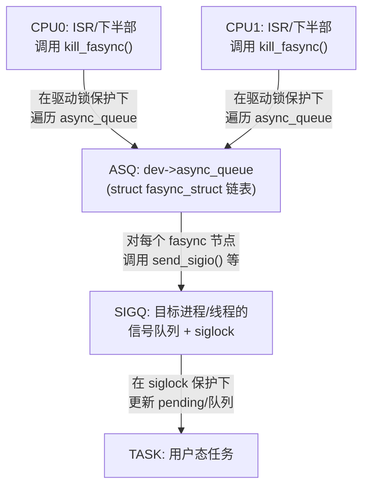
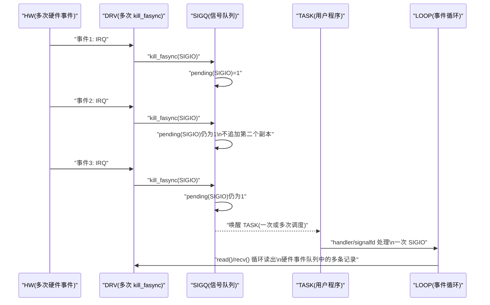
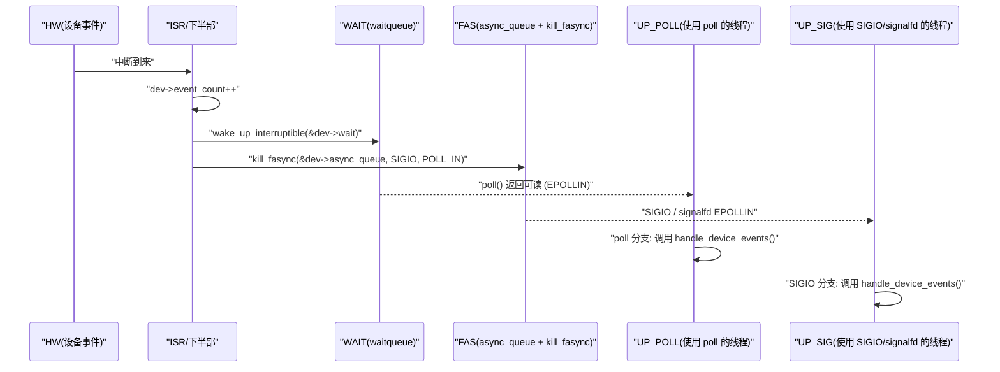
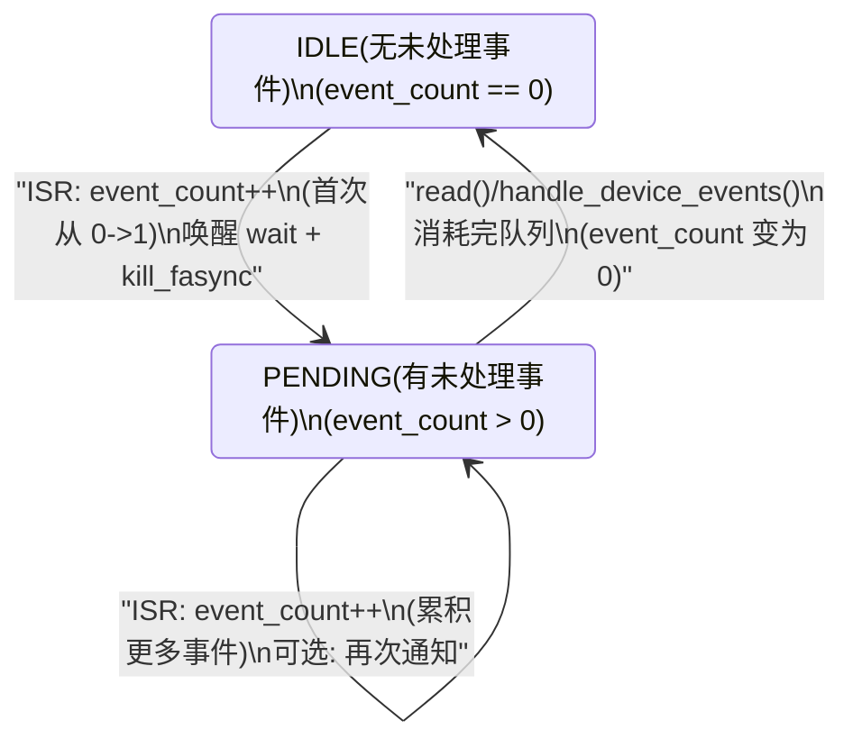
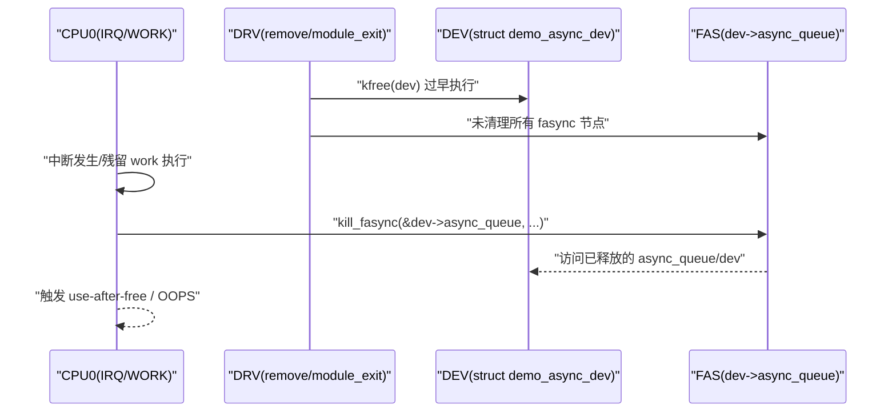
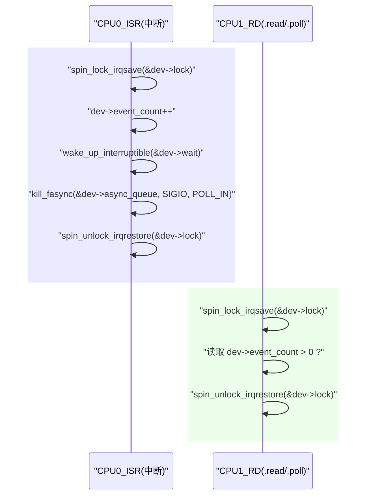
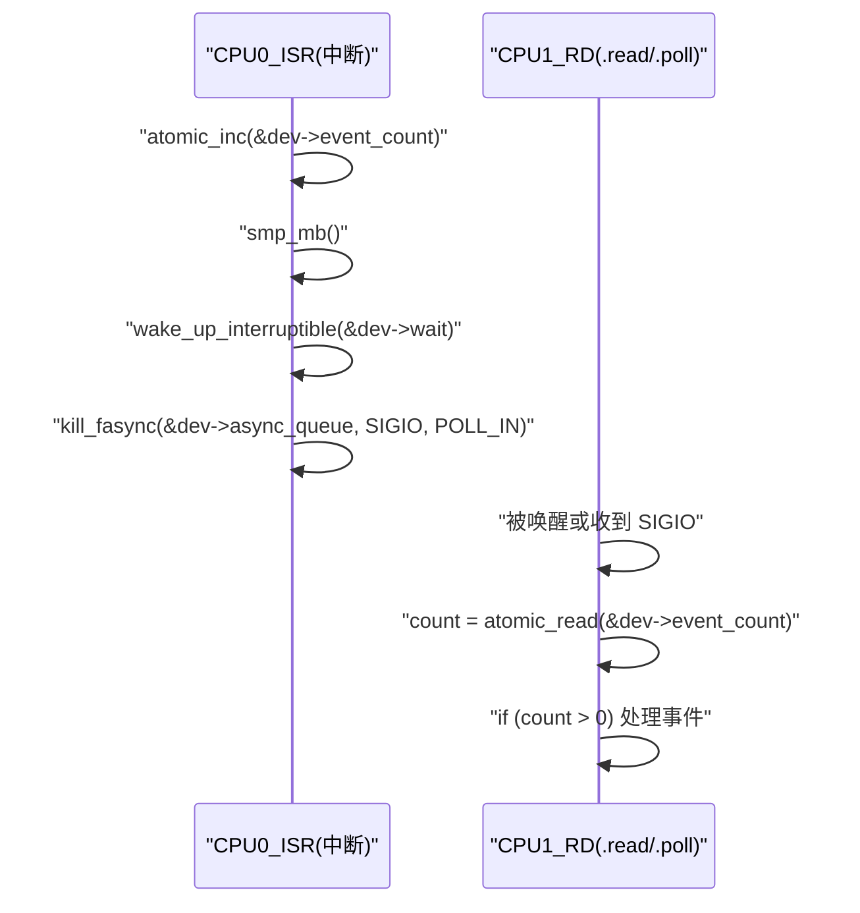

# 第 10 章 并发、竞态与内存可见性问题

> 章节内容说明：
>  本章从“并发与内存语义”的角度重新审视 fasync 机制，重点不再是“怎么用”，而是“在多 CPU、多上下文情况下会出现哪些竞态”，“需要哪些锁/屏障来约束这些竞态”。
>
> 全章结构：
>
> - 10.1：fasync 相关状态（链表、标志位）的并发访问问题——**都在抢什么东西？**
> - 10.2：中断上下文 vs 进程上下文：锁的选择（spinlock/mutex）；
> - 10.3：`kill_fasync()` 与进程信号队列的并发行为；
> - 10.4：fasync 与 `waitqueue` / `poll` 的竞态关系；
> - 10.5：fasync 相关状态释放与“悬垂 fasync_struct”；
> - 10.6：内存屏障、原子操作在 fasync 实现中的角色；
> - 10.7：实战竞态场景清单（Checklist）。

------

## 10.1 fasync 相关状态（链表、标志位）的并发访问问题

### 10.1.1 引入：在 fasync 场景里，到底“谁在和谁抢东西”

前几章更多站在“功能”和“调用顺序”的角度来描述 fasync：

- `.fasync` 回调负责在 `struct file` 对应的 fasync 链表中**增加/删除**当前打开实例；
- `kill_fasync()` 把“事件发生”的信息转换成 SIGIO，投递给链表上的每个对象；
- 用户态通过 SIGIO / signalfd / epoll 收到通知，完成数据消费。

到了本章，问题变成：

> 在真实系统中，这些“状态”是同时被哪些上下文读写？
>  哪些时候会出现争用？这些争用如果不加约束会导致什么后果？

典型的并发参与者至少包括三类上下文：

1. **进程上下文（普通系统调用）**
   - `open()` / `release()` / `fcntl(F_SETFL)` 调用 `.fasync`；
   - `read()` / `poll()` 根据内部“事件标志位”判断是否有数据可读。
2. **中断上下文（硬件事件）**
   - 中断处理函数（ISR）更新事件状态；
   - 某些驱动甚至在中断上下文直接调用 `kill_fasync()`。
3. **下半部上下文**
   - softirq / tasklet / workqueue 等，用于“延迟处理”事件；
   - 常见模式是：ISR 只置位标志并唤醒 workqueue，由 work 执行 `kill_fasync()`。

本小节要做的事情就是：
 **先列出 fasync 相关的“共享状态”，再说明它们被哪些上下文同时访问，会引出哪些竞态。**
 只有把这一层“谁在和谁抢资源”搞清楚，后面谈锁、屏障、悬垂指针等才有意义。

------

### 10.1.2 数据结构视角：哪些状态在“被抢”

从内核数据结构角度看，一个典型的“简单按键 + fasync”字符设备，大致会牵涉以下几类共享状态。

#### 10.1.2.1 `struct file` 上的 FASYNC 标志

- `file->f_flags` 中的 `FASYNC` 位：
  - 谁写？
    - 用户态 `fcntl(F_SETFL)` → VFS → `.fasync` 回调 → 内核通用 fasync 帮助函数；
  - 谁读？
    - 内核 fasync 子系统在决定是否在 `fput()` / `close()` 时自动做清理；
    - 某些文件系统/驱动在自己的路径上也会读取它。

`FASYNC` 的并发问题主要集中在：

- 同一个 `struct file` 被多个线程/进程共享时，**多处同时修改 `f_flags`**；
- 某些代码使用“覆盖式 F_SETFL”而不是“基于旧值增减标志”，导致 FASYNC 丢失。

这个问题在上一章 9.6 已从“用户态错误模式”角度分析过，本章会在 10.5 再从资源释放角度补一刀。此处先记住：
 **`f_flags` 是一个“共享整数标志”，理论上也需要以原子方式读写或通过更高层锁保护。**

#### 10.1.2.2 `struct fasync_struct` 链表

这是本小节的核心对象之一。

- 每个需要异步通知的 `struct file` 实例，对应一个 `struct fasync_struct` 节点；
- 节点按链表挂在某个 anchor 上（可以是 `struct file`、也可以是驱动自己维护的全局/设备局部链表）；
- `kill_fasync()` 遍历这个链表，为其中每个节点对应的 owner 发送 SIGIO。

**并发访问场景：**

1. `.fasync` 回调中调用 `fasync_helper()`：
   - 可能增加新的节点到链表；
   - 也可能删除节点（关闭 FASYNC 或 `close()` 时）；
2. `kill_fasync()`：
   - 遍历链表，向列表中的每个节点发送信号。

如果这两类操作并发发生（例如：关闭 fd 时，刚好有硬件中断到来并调用 `kill_fasync()`），会出现：

- 遍历过程中节点被删除/释放 → **悬垂指针**；
- 或者节点指针更新尚未对其他 CPU 可见 → 遍历遗漏/读到未初始化节点。

> 建议记忆点：
>
> - `.fasync` 和 `kill_fasync()` 之间天然存在竞态；
> - 它们对“同一条链表”的读写必须通过**同一把锁**或明确的内存序约束来协调。

#### 10.1.2.3 设备内部事件标志位（“有/无数据”）

几乎所有“中断型设备 + fasync”驱动，都会在自己的 `struct demo_dev` 里维护一个“事件状态”：

- 典型形式：

  ```c
  struct demo_dev {
  	/* ... 其它字段 ... */
  	int			event_pending;	/* 0: 无事件, 非 0: 有未处理事件 */
  	wait_queue_head_t	wait;		/* 给 .read/.poll 用 */
  	struct fasync_struct	*async_queue;	/* 给 fasync 用 */
  };
  ```

这个 `event_pending` 会被多个上下文访问：

1. **中断上下文**：
   - 中断处理函数中设置 `event_pending = 1`；
   - 然后 `wake_up_interruptible(&dev->wait)`，必要时 `kill_fasync()`。
2. **进程上下文 – `.read()`**：
   - 读路径中检查 `event_pending`；
   - 如果为 0，则阻塞在 `wait`（或返回 `-EAGAIN`）；
   - 如果为 1，则读取数据并将它清零（或减计数）。
3. **进程上下文 – `.poll()`**：
   - `poll()` 回调中检查 `event_pending`，决定是否返回 `POLLIN`。

**这一组访问如果不加锁，就有非常直观的竞态：**

- 中断刚把 `event_pending` 置 1，用户态 `.read()` 还没看到，就先跑去睡眠；
- 或相反：`.read()` 刚清零准备睡眠，中断又立刻产生事件，用户态可能睡到超时依然以为没事件。

这些属于“fasync 与 waitqueue/poll 组合”的竞态问题，10.4 会专门展开。
 在 10.1 我们只需要意识到：**`event_pending` 也是“多上下文共享状态”，不能当成普通 int 随意读写。**

#### 10.1.2.4 fasync 相关指针的生命周期状态

与 10.5 要讲的“悬垂 fasync_struct”高度相关，这里先粗略点名：

- 对驱动内部来说，常见写法是：

  ```c
  struct demo_dev {
  	struct fasync_struct *async_queue;
  	/* ... */
  };
  ```

- 它在以下路径可能被读/写：

  1. `.fasync()` 回调：
     - `fasync_helper(fd, filp, mode, &dev->async_queue);`
  2. 中断上下文或下半部：
     - `kill_fasync(&dev->async_queue, SIGIO, POLL_IN);`
  3. 设备 `release()`：
     - 调用 `.fasync` 清理；
     - 将 `async_queue` 置为 `NULL`。

如果 `.fasync()` 与 `kill_fasync()` 并发修改/读取 `async_queue`，而没有任何同步措施，很容易出现：

- `kill_fasync()` 使用的指针已经在另一 CPU 上被释放，但本 CPU 仍在访问；
- 或者 `async_queue` 被写为新地址，但写操作在某个 CPU 的缓存里，另一个 CPU 仍然看到旧值（或 NULL）。

------

### 10.1.3 开发者视角：把并发访问问题拆成几个“必看场景”

对于编驱动的人来说，与其死记各种“抽象术语”，不如明确记下几个**必须显式考虑并发的场景**。
 围绕 fasync，最常见可以归纳为四类：

#### 场景 1：`.fasync` 与 `kill_fasync()` 并发操作链表

- `.fasync` 在进程上下文中执行，被 `open()` / `release()` / `fcntl` 调用；
- `kill_fasync()` 往往在中断上下文或下半部执行；
- 两者需要同时访问 `struct fasync_struct *` 链表：
  - `.fasync`：插入/删除节点；
  - `kill_fasync`：遍历节点。

开发者必须回答的问题是：

> 你打算用哪一把锁，保证这两类操作不会互相破坏链表结构？

#### 场景 2：事件标志位在中断与 `.read()` / `.poll()` 之间的同步

- 中断更新 `event_pending`；
- `.read()` / `.poll()` 检查并修改它；
- waitqueue 与 fasync 共同依赖同一个标志位语义（“有没有新事件”）。

开发者需要决定：

- 是否用自旋锁保护这个标志位及其相关操作；
- 是否需要使用 `smp_mb()` / `READ_ONCE` / `WRITE_ONCE` 等保证可见性；
- 在“先设置标志还是先唤醒”的顺序问题上做出明确选择。

#### 场景 3：设备关闭 / 模块卸载 时与 `kill_fasync()` 的竞态

- 驱动卸载、字符设备注销或 `file->release()` 路径中，需要清理：
  - fasync 链表；
  - waitqueue；
  - 中断处理函数（`free_irq()`）；
- 若此时仍有中断在飞，或者仍有下半部在运行，就有可能发生：
  - 中断刚开始执行，设备数据结构已经被释放；
  - `kill_fasync()` 正在用 `dev->async_queue`，而另一个 CPU 正在把 `dev` 释放。

开发者需要有一个明确的“资源关闭序列”，确保：

- 先禁止新中断 & 等待所有下半部完成；
- 再处理 fasync/async_queue；
- 最后释放 `struct demo_dev` 等内存。

#### 场景 4：多 open 实例、多个 `struct file` 对同一设备的并发

- 如果驱动允许多个进程同时打开同一设备：
  - 每个 `struct file` 会有自己的 fasync 节点；
  - `.fasync` 会对链表进行多次插入/删除；
- 此时 `kill_fasync()` 需要遍历的链表规模变大，并发修改更复杂。

开发者需要回答：

- 你的 fasync 列表是“按设备聚合”还是“按 file 聚合”？
- 你是否接受“某些进程关闭 fd 时，把其它进程的 fasync 状态一起影响”的行为？如果不接受，如何设计链表组织方式避免这种情况？

------

### 10.1.4 用户/平台视角：这些并发问题对“上层程序”的影响

从上层应用/平台的视角来看，这些并发问题会以各种“古怪现象”出现：

1. **偶发丢信号**
   - 某些按键事件偶尔用户态完全收不到 SIGIO / signalfd 事件；
   - 多为 `.fasync` 和 `kill_fasync()` 在极短窗口内发生竞态，导致链表变更与信号投递错位。
2. **偶发重复信号 / 多次处理同一事件**
   - 驱动在“事件标志 + waitqueue + fasync”之间没有统一语义；
   - 导致一次硬件事件对应多个 SIGIO，或者 SIGIO 与 poll 同时触发而业务层缺乏去重逻辑。
3. **进程退出或驱动卸载时的 OOPS / BUG**
   - 最常见的是“释放后的 `demo_dev` 被中断使用”，或 fasync 节点变成悬垂指针；
   - 在复杂系统中可能表现为“偶发内核崩溃、stack trace 指向 fasync”。
4. **多线程场景下信号路由异常**（上一章 9.5 已讲）
   - 再叠加 fasync 链表并发访问问题，会让问题变得很难排查。

从平台维护者角度（比如写板级 SDK 的人），即使上层应用开发者完全不接触 fasync 细节，也会受到这些问题的影响，因此在“驱动设计评审”时，必须显式检查 fasync 路径上的并发访问设计。

------

### 10.1.5 可视化：fasync 状态在不同上下文中的访问关系

用一个简单的图把“fasync 相关状态”和“上下文”之间的访问关系画出来，便于记忆。

```mermaid
flowchart TB
    "ISR"["ISR: 中断处理函数"]
    "BH"["BH: 下半部(tasklet/workqueue)"]
    "OPEN"["OPEN: open()/fcntl()\n调用 .fasync"]
    "REL"["REL: close()/release()\n调用 .fasync 清理"]
    "READ"["READ: .read()"]
    "POLL"["POLL: .poll()"]

    "ASQ"["状态1: dev->async_queue\n(struct fasync_struct 链表)"]
    "EVP"["状态2: dev->event_pending\n(事件标志)"]
    "FFL"["状态3: file->f_flags\n(FASYNC 位)"]

    "OPEN" -->|"新增/修改 fasync 节点"| "ASQ"
    "REL" -->|"删除 fasync 节点\n清理 async_queue"| "ASQ"
    "ISR" -->|"kill_fasync() 读 async_queue"| "ASQ"
    "BH" -->|"kill_fasync() 读 async_queue"| "ASQ"

    "ISR" -->|"置 1"| "EVP"
    "BH" -->|"可能清 0/聚合"| "EVP"
    "READ" -->|"检查/清 0"| "EVP"
    "POLL" -->|"检查"| "EVP"

    "OPEN" -->|"设置/清除 FASYNC"| "FFL"
    "REL" -->|"关闭 FASYNC"| "FFL"
```

后面在 10.2–10.6 会分别讨论：

- 这几条箭头之间应由哪种锁（spinlock/mutex）或屏障串联起来；
- 哪些访问可以靠原子操作/屏障保证即可，哪些必须加锁；
- 错配时会具体表现为哪类崩溃或奇怪行为。

------

### 10.1.6 示例代码：一个“带锁的最小 fasync 模式骨架”（并发友好版）

下面给一个**简化版**字符设备内核代码骨架，展示如何显式考虑并发访问问题。
 重点不在完整驱动，而在于：

- `dev->async_queue` 只在一把自旋锁保护下由 `.fasync` 和中断下半部访问；
- `dev->event_pending` 也放在这把锁的保护范围内（或者至少用原子操作 + 屏障）。

> 注意：代码为**示意**，不包含注册/卸载、错误处理等完整逻辑，只体现并发访问相关的关键点。

```c
/* demo_async_concurrent.c
 *
 * 说明：
 *     展示如何在驱动里为 fasync 相关状态加上基本的并发保护。
 */

#include <linux/module.h>
#include <linux/fs.h>
#include <linux/cdev.h>
#include <linux/device.h>
#include <linux/interrupt.h>
#include <linux/wait.h>
#include <linux/poll.h>
#include <linux/slab.h>
#include <linux/uaccess.h>

struct demo_async_dev {
	struct cdev		cdev;
	wait_queue_head_t	wait;
	spinlock_t		lock;		/* 保护 async_queue + event_pending */

	struct fasync_struct	*async_queue;	/* fasync 链表 */
	int			event_pending;	/* 简化为 0/1，表示是否有事件 */
	/* 省略硬件资源、中断号等字段 */
};

static struct demo_async_dev *g_demo_dev;

static ssize_t demo_async_read(struct file *filp, char __user *buf,
			       size_t count, loff_t *ppos)
{
	struct demo_async_dev *dev = filp->private_data;
	int ret = 0;

	/* 阻塞等待事件 */
	if (wait_event_interruptible(dev->wait, ({
		unsigned long flags;
		int pending;

		spin_lock_irqsave(&dev->lock, flags);
		pending = dev->event_pending;
		spin_unlock_irqrestore(&dev->lock, flags);

		pending != 0;
	})))
		return -ERESTARTSYS;

	/* 真正读数据 */
	/* 示例仅清除状态，不做实际硬件访问 */
	spin_lock_irq(&dev->lock);
	dev->event_pending = 0;
	spin_unlock_irq(&dev->lock);

	/* 填充用户缓冲区（示意） */
	if (count > sizeof(int))
		count = sizeof(int);

	if (copy_to_user(buf, &dev->event_pending, count))
		ret = -EFAULT;
	else
		ret = count;

	return ret;
}

static __poll_t demo_async_poll(struct file *filp, poll_table *wait)
{
	struct demo_async_dev *dev = filp->private_data;
	__poll_t mask = 0;
	unsigned long flags;
	int pending;

	poll_wait(filp, &dev->wait, wait);

	spin_lock_irqsave(&dev->lock, flags);
	pending = dev->event_pending;
	spin_unlock_irqrestore(&dev->lock, flags);

	if (pending)
		mask |= EPOLLIN | EPOLLRDNORM;

	return mask;
}

static int demo_async_fasync(int fd, struct file *filp, int on)
{
	struct demo_async_dev *dev = filp->private_data;
	int ret;
	unsigned long flags;

	spin_lock_irqsave(&dev->lock, flags);
	ret = fasync_helper(fd, filp, on, &dev->async_queue);
	spin_unlock_irqrestore(&dev->lock, flags);

	return ret;
}

/* 典型中断处理函数或下半部 */
static void demo_async_event_raise(struct demo_async_dev *dev)
{
	unsigned long flags;

	spin_lock_irqsave(&dev->lock, flags);

	dev->event_pending = 1;
	wake_up_interruptible(&dev->wait);

	/* 在同一把锁下使用 async_queue */
	if (dev->async_queue)
		kill_fasync(&dev->async_queue, SIGIO, POLL_IN);

	spin_unlock_irqrestore(&dev->lock, flags);
}

static int demo_async_open(struct inode *inode, struct file *filp)
{
	struct demo_async_dev *dev;

	dev = container_of(inode->i_cdev, struct demo_async_dev, cdev);
	filp->private_data = dev;

	return 0;
}

static int demo_async_release(struct file *filp)
{
	struct demo_async_dev *dev = filp->private_data;

	/* 关闭时清理 fasync 状态，仍需在同一把锁下进行 */
	demo_async_fasync(-1, filp, 0);

	return 0;
}

static const struct file_operations demo_async_fops = {
	.owner		= THIS_MODULE,
	.open		= demo_async_open,
	.release	= demo_async_release,
	.read		= demo_async_read,
	.poll		= demo_async_poll,
	.fasync		= demo_async_fasync,
};
```

你可以把上面的骨架与之前“最小 fasync 模板”对比：

- 相同点：依然是经典的 `.fasync` + `kill_fasync` + `waitqueue` 组合；
- 区别：
  - `dev->async_queue` 的读写统一放在 `dev->lock` 下；
  - `dev->event_pending` 的读写也统一放到锁里（或者用更细致的原子/屏障策略）。

这就是 10.1 希望你建立的第一直觉：
 **“fasync 相关状态其实是一个小的共享状态子系统，任何访问它们的上下文都必须纳入统一的并发设计。”**

------

### 10.1.7 调试与验证：如何判断“锁和状态”设计是否正确

当你在自己的 fasync 驱动里引入这些锁和状态后，有几种简单的方法验证设计是否合理：

1. **配置 `CONFIG_PROVE_LOCKING` / `lockdep`**
   - 在调试内核里启用锁验证；
   - 对 `spin_lock_irqsave` 使用顺序不当、递归加锁、死锁风险，lockdep 会给出告警；
   - 特别关注 `.fasync` 与中断/下半部中锁的嵌套顺序是否一致。
2. **使用动态调试/tracepoint 观察 `kill_fasync` / `.fasync` 调用序列**
   - 在 `.fasync` / `kill_fasync` 中加 `pr_debug()` 或 `trace_printk()`：
     - 打印当前 CPU/irq state/锁标志；
     - 打印 `dev->async_queue` 的指针值与链表节点数量；
   - 检查是否出现“遍历的节点数量 < 当前链表计数”等异常行为。
3. **在 `demo_async_event_raise()` 中刻意注入延迟**
   - 使用 `udelay()` / `mdelay()`（调试时谨慎使用）或某种自制延迟；
   - 增大 `.fasync` 与 `kill_fasync` 并发的概率，观察是否出现 OOPS 或死锁。
4. **压力测试：快速 open/close + 高频中断**
   - 写一个用户态程序：
     - 在多个线程中快速 `open()` / `close()` 设备，并设置/取消 FASYNC；
     - 同时通过外设产生高频中断（快速按键、信号发生器等）；
   - 如果设计不合理，很容易出现：
     - 内核 OOPS；
     - BUG_ON/lockdep 报错；
     - 偶发 SIGIO 丢失或重复。

------

### 10.1.8 小结：把“状态并发访问”当作后续章节的基础图层

本小节的核心目的不是讲完所有细节，而是：

1. **列出 fasync 路径上所有“可能被抢”的共享状态**：
   - `file->f_flags` 中的 FASYNC 位；
   - `dev->async_queue`（fasync 链表）；
   - `dev->event_pending` 等事件标志位；
   - fasync 节点指针本身的生命周期状态。
2. **明确这些状态各自的“访问者集合”**：
   - `.fasync`（open/close/fcntl）
   - `kill_fasync`（中断/下半部）
   - `.read()` / `.poll()`（用户数据路径）
   - 驱动资源释放路径（release/remove/module_exit）。
3. **将后续章节的讨论“落在这张图上”**：
   - 10.2 会从“中断上下文 vs 进程上下文”的角度讨论：
     - 哪些地方必须用 spinlock；
     - 哪些地方可用 mutex；
     - 哪些地方不能在中断上下文拿的锁。
   - 10.3 会看 `kill_fasync()` 与进程信号队列之间的并发行为；
   - 10.4 会把 `event_pending` / waitqueue / poll / fasync 放在同一时间轴上讨论顺序语义；
   - 10.5、10.6 则继续解决“悬垂 fasync_struct”与内存可见性等更底层问题。

你可以把 10.1 理解为本章的“并发拓扑图”：
 后面所有内容都会在这张图上填具体规则、锁和屏障。


------

## 10.2 中断上下文 vs 进程上下文：锁的选择（spinlock/mutex）

### 10.2.1 引入：同一块状态，在“两个世界”里被同时访问

在 fasync 驱动里，我们已经看到这些典型共享状态：

- `dev->async_queue`：fasync 链表；
- `dev->event_pending`：事件标志位；
- `file->f_flags` 中的 `FASYNC` 位；
- `struct demo_dev` 以及其中各种计数和标志。

这些状态会同时被两个完全不同的执行环境访问：

1. **进程上下文**
   - `.open()` / `.release()` / `.fasync()` / `.read()` / `.poll()`；
   - 可以睡眠，可以调度，可以拿 mutex，可以 copy_to_user。
2. **中断相关上下文**
   - 硬中断（hard IRQ）：ISR；
   - 下半部：tasklet / softirq / workqueue；
   - 其中 **硬中断** 完全不能睡眠，只能执行极短的工作；
   - 软中断/ tasklet 也不能睡眠；
   - workqueue 运行在普通进程上下文，可以睡眠。

这就引出了核心问题：

> 同一块 fasync 相关状态，在“不可睡眠的世界”（中断）和“可睡眠的世界”（进程）之间如何共享？
>  你必须明确给出：哪些地方用 spinlock，哪些地方用 mutex，哪些地方只用原子 + 屏障。

本小节的目标是：
 **给出 fasync 场景下“锁的选择”和“上下文分工”的标准模板**，让你以后写任何 fasync 驱动时，都能在一开始就设计出清晰、可证明正确的并发结构。

------

### 10.2.2 语义与约束：spinlock 与 mutex 在 fasync 场景里的“硬边界”

先不讨论 fasync，先把两个基本事实说清楚：

#### 10.2.2.1 spinlock 的约束

- 自旋锁（`spinlock_t`）特点：
  - 不会睡眠，只是在本 CPU 上忙等待；
  - 可以用于中断上下文（ISR、软中断），前提是使用正确的变体；
- 常用形式：
  - `spin_lock()` / `spin_unlock()`：要求当前上下文不会被中断重入同一锁；
  - `spin_lock_irqsave()` / `spin_unlock_irqrestore()`：关本地中断 + 自旋，适用于可能在中断和进程之间共享的锁；
  - `spin_lock_bh()` / `spin_unlock_bh()`：屏蔽底半部（softirq）。

> 在 fasync 驱动里，如果某一把锁既要在 `.fasync()` / `.read()` / `.poll()`（进程上下文）里用，又要在 ISR 里用，那么它**必须是** `spinlock_t`，并且在进程上下文中需要用 `spin_lock_irqsave()` 这类 API，避免被中断打断时同一锁被再次尝试获取。

#### 10.2.2.2 mutex 的约束

- 互斥锁（`struct mutex`）特点：
  - 会睡眠，等待队列调度；
  - **完全不能** 在硬中断上下文或软中断上下文中使用（`mutex_lock()` 可能 sleep）。
- 适用范围：
  - 设备 probe/remove；
  - `.open()` / `.release()`；
  - 复杂的 `.ioctl()`、配置路径；
  - workqueue/内核线程中较长时间的工作。

> 结论：
>
> - 任何可能在 ISR 或软中断中被访问的数据结构，**不能** 依赖 mutex 保护；
> - 如果你需要在中断路径做较复杂操作（需要睡眠或持锁时间长），应该把它搬到 workqueue 中，然后在 workqueue 中使用 mutex。

------

### 10.2.3 开发者视角：在 fasync 驱动中制定完整的锁策略

结合 10.1 画出的“共享状态拓扑图”，我们可以为 fasync 驱动制定两种常用锁策略：

- **方案 A：ISR 直接调用 `kill_fasync()`，统一用自旋锁保护关键状态**；
- **方案 B：ISR 只做最小标志 + 调度 workqueue，fasync 相关操作全部在 workqueue + 进程上下文完成，可用 mutex**。

#### 10.2.3.1 方案 A：spinlock 统一保护 async_queue + event_pending（中断内直接 kill_fasync）

适用条件：

- 设备事件频率中等，不至于造成长期自旋；
- `kill_fasync()` 路径较短，不执行任何可能睡眠的操作（这是内核保证的）；
- 不需要在中断路径里访问复杂数据结构，只修改几个标志位。

锁设计要点：

1. 定义设备级自旋锁：

   ```c
   struct demo_async_dev {
   	spinlock_t		lock;		/* 保护 async_queue + event_pending */
   	struct fasync_struct *async_queue;
   	int			event_pending;
   	wait_queue_head_t	wait;
   	/* ... 其它字段 ... */
   };
   ```

2. `.fasync()` 中通过 `spin_lock_irqsave()` 保护 `async_queue`：

   ```c
   static int demo_async_fasync(int fd, struct file *filp, int on)
   {
   	struct demo_async_dev *dev = filp->private_data;
   	unsigned long flags;
   	int ret;
   
   	spin_lock_irqsave(&dev->lock, flags);
   	ret = fasync_helper(fd, filp, on, &dev->async_queue);
   	spin_unlock_irqrestore(&dev->lock, flags);
   
   	return ret;
   }
   ```

3. ISR/下半部更新 `event_pending` 并调用 `kill_fasync()` 时也使用同一把锁：

   ```c
   static void demo_async_event_raise(struct demo_async_dev *dev)
   {
   	unsigned long flags;
   
   	spin_lock_irqsave(&dev->lock, flags);
   
   	dev->event_pending = 1;
   	wake_up_interruptible(&dev->wait);
   
   	if (dev->async_queue)
   		kill_fasync(&dev->async_queue, SIGIO, POLL_IN);
   
   	spin_unlock_irqrestore(&dev->lock, flags);
   }
   ```

4. `.read()` / `.poll()` 访问 `event_pending` 时，同样通过自旋锁：

   ```c
   static __poll_t demo_async_poll(struct file *filp, poll_table *wait)
   {
   	struct demo_async_dev *dev = filp->private_data;
   	unsigned long flags;
   	__poll_t mask = 0;
   	int pending;
   
   	poll_wait(filp, &dev->wait, wait);
   
   	spin_lock_irqsave(&dev->lock, flags);
   	pending = dev->event_pending;
   	spin_unlock_irqrestore(&dev->lock, flags);
   
   	if (pending)
   		mask |= EPOLLIN | EPOLLRDNORM;
   
   	return mask;
   }
   ```

优点：

- 自洽：所有涉及 fasync 链表和事件标志的修改都在一把自旋锁下；
- ISR 与进程上下文共享这把锁，不需要额外的同步原语；
- 代码路径短、可预测。

缺点：

- 若中断频率很高且 `kill_fasync()` 路径较重，会增加中断处理时间；
- 对于部分复杂设备，可能仍然希望将事件处理下移到 workqueue，以避免中断上下文压力过大。

#### 10.2.3.2 方案 B：ISR 只置位标志 + 调度 workqueue，fasync 在 workqueue 中完成（允许使用 mutex）

适用条件：

- 设备事件较复杂，需要在“事件处理路径”里执行可能睡眠的操作；
- 你希望中断处理函数尽量短，只做最小的硬件确认和状态更新；
- 接受一小段延迟（ISR → workqueue → `kill_fasync()`）。

改造思路：

1. 引入工作队列（`struct work_struct` 或 `struct delayed_work`）：

   ```c
   struct demo_async_dev {
   	/* ... */
   	struct work_struct	event_work;
   	struct mutex		lock;		/* 用于保护 async_queue + 状态 */
   	int			event_pending;
   	struct fasync_struct	*async_queue;
   };
   ```

2. ISR 中只做最小工作：

   ```c
   static irqreturn_t demo_async_irq_handler(int irq, void *dev_id)
   {
   	struct demo_async_dev *dev = dev_id;
   
   	/* 只做最小的硬件确认 + 标志位设置 */
   	dev->event_pending = 1;
   
   	/* 调度工作队列，在进程上下文中处理 fasync + 其它逻辑 */
   	schedule_work(&dev->event_work);
   
   	return IRQ_HANDLED;
   }
   ```

3. 在 `event_work` 中使用 mutex 保护 async_queue 并调用 `kill_fasync()`：

   ```c
   static void demo_async_event_work(struct work_struct *work)
   {
   	struct demo_async_dev *dev =
   		container_of(work, struct demo_async_dev, event_work);
   
   	mutex_lock(&dev->lock);
   
   	if (dev->event_pending) {
   		dev->event_pending = 0;
   
   		wake_up_interruptible(&dev->wait);
   
   		if (dev->async_queue)
   			kill_fasync(&dev->async_queue, SIGIO, POLL_IN);
   	}
   
   	mutex_unlock(&dev->lock);
   }
   ```

4. `.fasync()` 与 `.read()` / `.poll()` 中也使用同一把 `mutex`：

   ```c
   static int demo_async_fasync(int fd, struct file *filp, int on)
   {
   	struct demo_async_dev *dev = filp->private_data;
   	int ret;
   
   	mutex_lock(&dev->lock);
   	ret = fasync_helper(fd, filp, on, &dev->async_queue);
   	mutex_unlock(&dev->lock);
   
   	return ret;
   }
   ```

优点：

- ISR 更短，提高系统实时性和可预测性；
- 可以在 `event_work` 中使用 mutex、访问更复杂的数据结构，甚至可以分配内存、访问慢速总线等；
- 对“需要做较多工作”的设备更友好。

缺点：

- 事件从硬件到用户态之间多了一个 hop（ISR → workqueue），增加一点延迟；
- 锁的选择要一致：一旦你选择了 `mutex`，就不能在 ISR 中直接拿它，所以必须保证所有访问都发生在进程上下文（workqueue + `.fasync` + `.read` 等）。

综上：

- 如果你的设备事件非常简单（例如 GPIO 按键），**方案 A（spinlock + 中断中 kill_fasync）** 足够；
- 如果你的事件处理逻辑较复杂，**优先考虑方案 B（ISR → workqueue + mutex）**。

------

### 10.2.4 用户/平台视角：锁选错了会对系统造成什么影响

从平台维护、系统集成的角度，锁策略错误对外表现大致是：

1. **使用 mutex 于中断上下文**
   - 直接触发 `BUG: sleeping function called from invalid context`；
   - 内核打印栈回溯，指向 `mutex_lock()` 被从 IRQ 上下文调用；
   - 严重时导致系统软锁死或直接 OOPS。
2. **自旋锁使用不当导致死锁**
   - 例如：在持锁时调用可能睡眠的 API（如 `copy_to_user`）；
   - 或在中断和进程上下文中嵌套顺序不一致，造成 lockdep 报死锁风险；
   - 表现为“高负载下偶发性系统卡死”。
3. **中断处理函数做了过多工作**
   - 系统延迟指标变差；
   - 某些实时任务出现不可接受的抖动；
   - ftrace/latencytop 等工具显示中断处理时间过长。
4. **fasync 链表与事件标志位缺乏统一锁保护**
   - 用户态看到随机丢信号或重复信号（第 10.1 和 9.6 中的症状）；
   - 驱动卸载时偶发 OOPS、stack trace 指向 `kill_fasync`。

对于一个“板级 SDK / 通用驱动”的设计来说，**锁方案是需要在设计文档中明确写出来并评审的部分，而不是凭感觉在代码里慢慢修补**。
 本小节的两个方案（A/B）可以直接作为此类文档中的“标准设计模板”。

------

### 10.2.5 可视化：两种锁方案的结构与时序对比

先用结构图对比方案 A 与方案 B。

#### 10.2.5.1 方案 A：spinlock + 中断中直接 kill_fasync

```mermaid
flowchart LR
    "HW"["HW: 设备/按键"]
    "ISR"["ISR: 中断处理函数\n(持 dev->lock 自旋锁)"]
    "DEV"["DEV: demo_async_dev\n{event_pending, async_queue}"]
    "WQ"["WAITQ: dev->wait"]
    "FAS"["FAS: dev->async_queue\n(fasync 链表)"]
    "SIG"["SIG: 信号子系统"]
    "UP"["UP: 用户态进程"]

    "HW" -->|"中断"| "ISR"
    "ISR" -->|"dev->event_pending=1\nwake_up_interruptible()"| "WQ"
    "ISR" -->|"kill_fasync(..., SIGIO)"| "FAS"
    "FAS" --> "SIG"
    "SIG" -->|"SIGIO"| "UP"
```

#### 10.2.5.2 方案 B：ISR 只置位 + 调度 workqueue，在 workqueue 中 kill_fasync

```mermaid
flowchart LR
    "HW"["HW: 设备/按键"]
    "ISR"["ISR: 中断处理函数\n(仅置位 event_pending)"]
    "WQK"["WQK: schedule_work()\n调度 event_work"]
    "WORK"["WORK: event_work\n(持 dev->lock mutex)"]
    "DEV"["DEV: demo_async_dev\n{event_pending, async_queue}"]
    "WAITQ"["WAITQ: dev->wait"]
    "FAS"["FAS: dev->async_queue"]
    "SIG"["SIG: 信号子系统"]
    "UP"["UP: 用户态进程"]

    "HW" -->|"中断"| "ISR"
    "ISR" -->|"dev->event_pending=1"| "DEV"
    "ISR" -->|"schedule_work(event_work)"| "WQK"
    "WQK" --> "WORK"
    "WORK" -->|"检查 event_pending\nwake_up_interruptible()"| "WAITQ"
    "WORK" -->|"kill_fasync(..., SIGIO)"| "FAS"
    "FAS" --> "SIG"
    "SIG" -->|"SIGIO"| "UP"
```

两者本质差异：

- 方案 A：
  - “事件 → SIGIO” 在中断上下文内完成；
  - 锁必须是 spinlock；
  - 延迟小，ISR 时间略长。
- 方案 B：
  - “事件 → SIGIO” 在 workqueue（进程上下文）内完成；
  - 锁可以是 mutex；
  - ISR 极短，事件延迟增加一个 workqueue hop。

------

### 10.2.6 示例代码：两个锁方案的对照实现骨架

下面给出两个简化版本骨架代码，对比同一设备在两种锁方案下的写法差异。

#### 10.2.6.1 方案 A：自旋锁 + 中断中直接 kill_fasync

```c
/* demo_async_lock_spin.c */

struct demo_async_dev {
	struct cdev		cdev;
	wait_queue_head_t	wait;
	spinlock_t		lock;		/* 保护 event_pending + async_queue */

	struct fasync_struct	*async_queue;
	int			event_pending;

	int			irq;
};

static irqreturn_t demo_async_irq_handler(int irq, void *dev_id)
{
	struct demo_async_dev *dev = dev_id;
	unsigned long flags;

	spin_lock_irqsave(&dev->lock, flags);

	/* 更新事件标志 */
	dev->event_pending = 1;

	/* 唤醒阻塞 read/poll 的进程 */
	wake_up_interruptible(&dev->wait);

	/* 给所有注册 fasync 的进程发送 SIGIO */
	if (dev->async_queue)
		kill_fasync(&dev->async_queue, SIGIO, POLL_IN);

	spin_unlock_irqrestore(&dev->lock, flags);

	return IRQ_HANDLED;
}

static ssize_t demo_async_read(struct file *filp, char __user *buf,
			       size_t count, loff_t *ppos)
{
	struct demo_async_dev *dev = filp->private_data;
	int ret;
	int pending;

	/* 阻塞等待事件 */
	if (wait_event_interruptible(dev->wait, ({
		unsigned long flags;

		spin_lock_irqsave(&dev->lock, flags);
		pending = dev->event_pending;
		spin_unlock_irqrestore(&dev->lock, flags);

		pending != 0;
	})))
		return -ERESTARTSYS;

	/* 清除事件标志 */
	spin_lock_irq(&dev->lock);
	dev->event_pending = 0;
	spin_unlock_irq(&dev->lock);

	/* 示例：返回一个固定值 */
	if (count > sizeof(int))
		count = sizeof(int);

	pending = 1;
	if (copy_to_user(buf, &pending, count))
		ret = -EFAULT;
	else
		ret = count;

	return ret;
}

static __poll_t demo_async_poll(struct file *filp, poll_table *wait)
{
	struct demo_async_dev *dev = filp->private_data;
	unsigned long flags;
	__poll_t mask = 0;
	int pending;

	poll_wait(filp, &dev->wait, wait);

	spin_lock_irqsave(&dev->lock, flags);
	pending = dev->event_pending;
	spin_unlock_irqrestore(&dev->lock, flags);

	if (pending)
		mask |= EPOLLIN | EPOLLRDNORM;

	return mask;
}

static int demo_async_fasync(int fd, struct file *filp, int on)
{
	struct demo_async_dev *dev = filp->private_data;
	unsigned long flags;
	int ret;

	spin_lock_irqsave(&dev->lock, flags);
	ret = fasync_helper(fd, filp, on, &dev->async_queue);
	spin_unlock_irqrestore(&dev->lock, flags);

	return ret;
}
```

#### 10.2.6.2 方案 B：workqueue + mutex，fasync 在 work 里执行

```c
/* demo_async_lock_work.c */

struct demo_async_dev {
	struct cdev		cdev;
	wait_queue_head_t	wait;

	struct work_struct	event_work;
	struct mutex		lock;		/* 保护 event_pending + async_queue */

	struct fasync_struct	*async_queue;
	int			event_pending;

	int			irq;
};

static void demo_async_event_work(struct work_struct *work)
{
	struct demo_async_dev *dev =
		container_of(work, struct demo_async_dev, event_work);

	mutex_lock(&dev->lock);

	if (dev->event_pending) {
		/* 清除标志并唤醒 waitqueue */
		dev->event_pending = 0;
		wake_up_interruptible(&dev->wait);

		/* 向用户态发送 SIGIO */
		if (dev->async_queue)
			kill_fasync(&dev->async_queue, SIGIO, POLL_IN);
	}

	mutex_unlock(&dev->lock);
}

static irqreturn_t demo_async_irq_handler(int irq, void *dev_id)
{
	struct demo_async_dev *dev = dev_id;

	/* 中断中只置位标志 + 调度 workqueue */
	dev->event_pending = 1;
	schedule_work(&dev->event_work);

	return IRQ_HANDLED;
}

static ssize_t demo_async_read(struct file *filp, char __user *buf,
			       size_t count, loff_t *ppos)
{
	struct demo_async_dev *dev = filp->private_data;
	int ret;
	int pending;

	/* 阻塞等待事件（waitqueue 的等待条件会被 event_work 中唤醒） */
	if (wait_event_interruptible(dev->wait, dev->event_pending))
		return -ERESTARTSYS;

	mutex_lock(&dev->lock);
	pending = dev->event_pending;
	dev->event_pending = 0;
	mutex_unlock(&dev->lock);

	if (count > sizeof(int))
		count = sizeof(int);

	if (copy_to_user(buf, &pending, count))
		ret = -EFAULT;
	else
		ret = count;

	return ret;
}

static __poll_t demo_async_poll(struct file *filp, poll_table *wait)
{
	struct demo_async_dev *dev = filp->private_data;
	__poll_t mask = 0;

	poll_wait(filp, &dev->wait, wait);

	mutex_lock(&dev->lock);
	if (dev->event_pending)
		mask |= EPOLLIN | EPOLLRDNORM;
	mutex_unlock(&dev->lock);

	return mask;
}

static int demo_async_fasync(int fd, struct file *filp, int on)
{
	struct demo_async_dev *dev = filp->private_data;
	int ret;

	mutex_lock(&dev->lock);
	ret = fasync_helper(fd, filp, on, &dev->async_queue);
	mutex_unlock(&dev->lock);

	return ret;
}
```

这两个骨架的差异非常清晰：

- 方案 A：
  - `dev->lock` 是 `spinlock_t`；
  - ISR/`read`/`poll`/`.fasync` 共享这把自旋锁；
  - `kill_fasync()` 在 ISR 中直接调用。
- 方案 B：
  - ISR 中**没有任何锁**；
  - `dev->lock` 是 `struct mutex`，只在 `event_work`、`.read`、`.poll`、`.fasync` 中使用；
  - `kill_fasync()` 只在 workqueue（进程上下文）里调用。

------

### 10.2.7 调试与验证：如何确认锁选择与上下文使用正确

在内核调试环境中，可以利用以下手段验证你的锁策略：

1. **启用 lockdep（`CONFIG_PROVE_LOCKING=y`）**
   - 如果你在中断上下文调用 `mutex_lock()`，lockdep 会直接报错；
   - 如果你在 spinlock 持锁期间调用可能睡眠的函数，lockdep 也会有提示；
   - 对 fasync 路径：
     - 在 `.fasync` / `kill_fasync` 中增加少量 `pr_debug()` 打印锁状态，配合 lockdep 日志分析。
2. **启用 `CONFIG_DEBUG_SPINLOCK` / `CONFIG_DEBUG_MUTEXES`**
   - 检查自旋锁是否存在非法解锁、两次解锁等问题；
   - 检查 mutex 是否存在递归锁、unlock 未锁定等问题。
3. **压力测试：高频中断 + 高频 open/close**
   - 用户态写测试程序：
     - 开多线程快速 `open()` / `close()` 设备，并不断设置/取消 FASYNC；
     - 同时通过硬件或模拟方式产生高频中断（例如定时器/按键）；
   - 若锁策略不合理，很快会触发：
     - 内核 WARN/BUG；
     - 死锁/卡死；
     - fasync 链表损坏导致 OOPS。
4. **对比两种方案的延迟与 CPU 占用**
   - 使用 ftrace 或 perf 记录：
     - ISR 执行时间；
     - workqueue 延迟（从中断到 work 函数开始执行的时间）；
   - 按需选择方案 A 或方案 B，或者先用 B 确保安全，再根据性能需求优化为 A。

------

### 10.2.8 小结：把“锁的选择”固化成 fasync 驱动设计规则

本小节给出的结论可以直接写进你自己的驱动设计规范中：

1. **任何会在中断上下文访问的状态，禁止用 mutex 保护**
   - fasync 的典型共有状态（`dev->async_queue`、`dev->event_pending`）如果要在 ISR 中访问，必须用 `spinlock_t`；
   - 在进程上下文访问这些状态时，用 `spin_lock_irqsave()` 以避免中断重入同一锁。
2. **两种可选模式：spinlock 直连 vs workqueue + mutex**
   - 方案 A：ISR 中直接 `kill_fasync()`，统一用自旋锁保护，延迟小、逻辑简单，适合简单事件；
   - 方案 B：ISR 只置位 + schedule_work，在 workqueue 中调用 `kill_fasync()`，统一用 mutex，适合复杂处理。
3. **锁策略必须在设计阶段明确，而不是事后修 patch**
   - 建议在章节/设计文档中画出：
     - 哪些共享状态；
     - 哪些上下文访问它们；
     - 哪一把锁保护它们；
     - 哪条路径允许睡眠，哪条路径不允许。
4. **配合 lockdep/调试选项做“锁设计验证”**
   - 在开发调试期间启用相关 Kconfig 选项；
   - 使用压力测试和 trace 手段尽早暴露潜在竞态和死锁问题。

在接下来的 **10.3 小节**，我们会进一步缩小视角，专门分析：

- `kill_fasync()` 在多 CPU、多进程信号队列中的并发行为；
- 信号队列本身的锁与 fasync 链表锁之间的配合；
- 在高频事件下，如何理解并控制 “fasync → 信号队列 → 用户态” 这一段的并发与性能特征。


------

## 10.3 `kill_fasync()` 与进程信号队列的并发行为

### 10.3.1 引入：从“链表并发”走到“信号队列并发”

在 10.1、10.2 里，我们主要关心的是：

- 驱动自己的共享状态：
  - `dev->async_queue`（`struct fasync_struct` 链表）；
  - `dev->event_pending` 等事件标志位；
- 上下文并发关系：
  - `.fasync()` vs `kill_fasync()`；
  - 中断 vs 进程上下文；
  - spinlock/mutex 的选择和作用范围。

但 `kill_fasync()` 做的事情不止是“遍历链表”。

> 它是“驱动世界 → 信号世界”的桥：
>
> - 前半段：在 fasync 链表上遍历；
> - 后半段：进入内核信号子系统，把事件写入对应进程/线程的信号队列。

所以本小节要回答的问题是：

1. **多个 CPU 同时调用 `kill_fasync()` 会怎样？**
2. **一个进程同时从多个驱动收到 SIGIO，会怎样？**
3. **同一个进程（或线程）上已有 SIGIO 在 pending，再次 `kill_fasync()` 会排队多个，还是合并？**
4. **这些行为对驱动设计和用户态代码有什么实际影响？**

重点是搞清楚：

- **驱动需要为 fasync 链表并发负责；**
- **信号队列本身的并发、安全与合并行为，由内核信号子系统负责；**
- 但两者之间的“交界面”（`kill_fasync()` 调用点）会牵涉到锁顺序、可能的性能瓶颈和信号风暴问题。

------

### 10.3.2 数据结构视角：`kill_fasync()` 穿过了哪些层

从数据结构角度，`kill_fasync()` 的路径可大致分为两段：

1. **驱动侧 fasync 链表段**

   - 驱动维护的 anchor，例如：

     ```c
     struct demo_async_dev {
     	/* ... */
     	struct fasync_struct *async_queue;
     	/* ... */
     };
     ```

   - 内核提供的帮助函数：

     ```c
     int fasync_helper(int fd, struct file *filp, int on,
     		  struct fasync_struct **fapp);
     void kill_fasync(struct fasync_struct **fp, int sig, int band);
     ```

   - `kill_fasync()` 的第一步就是在 `*fp` 指向的链表上遍历各个 `struct fasync_struct` 节点。

2. **信号子系统段**

   每个 `struct fasync_struct` 节点里记录了目标“接收者”的信息。

   深究下去会牵涉到以下结构（这里只做概念性描述）：

   - `struct fasync_struct`：
     - 记录了：
       - 对应的 `struct file *` 或 fd；
       - 所属的 `struct task_struct` / `struct pid`（用于确定 owner）；
       - 信号号、事件掩码等条件；
   - `struct task_struct`：
     - `signal` 成员指向 `struct signal_struct`；
     - `sighand` 成员指向 `struct sighand_struct`；
   - `struct signal_struct` / `struct sighand_struct`：
     - 包含 `siglock`（自旋锁）；
     - 包含 pending 信号队列（`shared_pending` / `struct sigpending`）；
   - `struct sigpending`：
     - 在非实时信号（如 SIGIO）场景下，以 bitmask 为主表示“某信号 pending 与否”；
     - 在实时信号场景下则通过链表维护 `struct sigqueue`。

`kill_fasync()` 大致做的事情可以粗略想象成：

1. 遍历 fasync 链表；
2. 对每个节点对应的“接收者”：
   - 通过 `send_sigio()` 或相关函数，把一个 SIGIO 挂入该任务/进程的 pending 集合；
   - 内部会获取 `siglock`，更新 pending 位图或队列；
   - 如果目标任务处于可唤醒状态，可能触发调度唤醒。

> 关键点：
>
> - **驱动不负责“信号队列层的并发”，内核信号子系统会通过 `siglock` 等机制保证；**
> - 驱动只需要保证调用 `kill_fasync()` 时自己的 `struct fasync_struct` 链表是自洽的（不会遍历到已经释放的节点等）。

------

### 10.3.3 开发者视角：`kill_fasync()` 在并发下的行为特征

站在驱动开发者视角，有几个问题特别关键。

#### 10.3.3.1 多 CPU 同时调用 `kill_fasync()`：会不会“把队列搞坏”

假设你有这样一种情况：

- 设备具有多路中断源，可能同时在多个 CPU 上触发 ISR；
- 每个 ISR 都可能调用 `kill_fasync(&dev->async_queue, SIGIO, POLL_IN)`；
- 同时，另一个 CPU 上的线程正在做 `.fasync()` 调整 fasync 链表。

从内核信号子系统的角度：

- 即便多个 CPU 同时向同一个 `task_struct` 发送 SIGIO：
  - 具体的 pending 队列/位图更新操作是受 `siglock` 保护的；
  - 不会出现 struct sigpending 内部结构损坏的问题；
  - 但大量并发竞争 `siglock` 会造成一定性能消耗。

但是，从驱动角度看，如果你对 `dev->async_queue` 不加任何锁，就会出现：

- 一个 CPU 正在 `kill_fasync()` 遍历链表；
- 另一个 CPU 在 `.fasync()` 中调用 `fasync_helper()` 删除节点 / 释放内存；
- 就有机会让 `kill_fasync()` 访问到已经无效的节点 → **悬垂指针** → 内核 OOPS。

所以：

> **结论一：**
>
> - 对于 fasync 链表本身的并发访问问题，需要驱动自己通过 spinlock/mutex 保护（10.1、10.2 已给出方案）；
> - `kill_fasync()` 内部对信号队列的并发是安全的，但你仍要避免在链表遍历过程中修改该链表。

#### 10.3.3.2 多次连续 `kill_fasync()`：事件是“合并”还是“排队”

这是影响语义与性能的一个关键点。

- SIGIO 属于 **非实时信号**（standard signal）；
- 对非实时信号，Linux 信号语义是：
  - 如果该信号已经处于 pending 状态，再次发送同一信号时 **不会排队多个副本**，而是简单维持“它是 pending 的”；
  - 也就是说：**不会为每次 `kill_fasync()` 生成一个独立排队单元**；
- 用户态看到的是：
  - “只要信号没被处理掉，后面的多个 `kill_fasync()` 也只会表现为一次 SIGIO”。

这引出两个非常重要的设计点：

1. **不要指望“一个事件对应一个 SIGIO”**
   - 对于 SIGIO 这种非实时信号，语义是“有事件发生过”，而不是“第 N 个事件”；
   - 多次 kill 一次聚合，将来凭“数据队列”而不是“信号次数”来区分多少事件。
2. **信号风暴的本质是“高频边缘 + handler 开销”，而不是“队列中堆了一堆 SIGIO”**
   - 多次 `kill_fasync()` 会反复试图唤醒目标任务，但 pending 标志早就是 1；
   - handler 或 signalfd 那边如果处理不当，会造成 CPU 占用高、上下文切换频繁。

> **结论二（语义层）：**
>
> - `kill_fasync()` 多次并发/连续调用 ≈ “尽快让目标任务感知到至少有一个事件”；
> - 它不提供“逐个事件计数”语义，计数应该由驱动或用户态自己的队列完成。

#### 10.3.3.3 多进程/多线程共享 fasync：信号如何路由

结合第 9 章的内容继续看：

1. **多进程：每个 open 导致一个 fasync 节点**
   - 驱动设计常见模式是：
     - `dev->async_queue` 是“设备级”链表；
     - 每个 `open()` + `F_SETFL(FASYNC)` 在链表上新增一个节点；
   - `kill_fasync()` 遍历时会对链表中的 **每个节点** 进行信号投递；
   - 这意味着：**同一个事件可以通知多个进程**。
2. **单进程多线程：所有权（owner）决定路由**
   - 第 9.5 已分析过：
     - `F_SETOWN` / `F_OWNER_TID` 决定 SIGIO 送到哪个线程/进程；
   - 从并发角度看：
     - 多线程共享 `struct file` 时，如果对 `F_SETOWN` / FASYNC 状态缺乏统一设计，可能出现：
       - 某些 kill_fasync 的目标 owner 是 A；
       - 后续 fcntl 调整后 owner 变为 B，但那时还有一些 pending 信号在路上；
   - 但无论如何，信号队列内部使用 `siglock` 等机制保证自身数据结构一致性。

> **结论三（路由层）：**
>
> - fasync 链表并发 + owner 并发调整，是驱动开发者和用户态共同决定的行为；
> - 信号子系统会保证队列的结构不被破坏，但不会帮你解决“事件语义混乱”。

------

### 10.3.4 用户/平台视角：`kill_fasync()` 并发行为在上层表现出来的“症状”

从用户态和平台调试者的视角，`kill_fasync()` 并发问题主要表现为：

1. **信号风暴 + handler/事件循环撑不住**
   - 多个 CPU、多个 fasync 节点频繁 `kill_fasync()`；
   - 由于 SIGIO 是非实时信号，pending 状态经常为 1，但内核仍频繁尝试唤醒任务；
   - signalfd / handler 如处理不当（例如每次事件都做大量 I/O），会造成：
     - CPU 占用尤其高；
     - 调度延迟增大；
     - 用户态事件处理不断堆积。
2. **“明明已经收到很多硬件事件，SIGIO 却只来了一两次”**
   - 典型误解：用户以为“每来一次中断就会有一次 SIGIO”；
   - 实际语义是：多个 `kill_fasync()` 会合并成一次 pending 状态；
   - 若用户在 handler/signalfd 逻辑中只读一次，而设备内部又未完全清空队列，就会误以为“丢信号”。
3. **多进程抢占 fasync / owner 时，信号路由错乱**
   - 如果多个进程同时对 `F_SETOWN` / FASYNC 状态操作缺乏约束：
     - 某个时间窗口内 `kill_fasync()` 的信号目标进程是“未预期”的那个；
     - 表现为：A 进程没做任何设置，却收到大量 SIGIO；B 进程设置了 fasync 却没收到。

对于平台维护者来说，这类问题往往需要结合：

- 驱动代码的 `kill_fasync()` 调用位置/频率；
- 用户态程序的 fcntl 配置、事件循环写法；
- `strace` / ftrace 的 trace 信息，

才能追踪到“从中断到信号队列”整个链路上哪里出现了语义偏差。

------

### 10.3.5 可视化：`kill_fasync()` 与信号队列的并发调用场景

用两个图来帮助建立直观认识。

#### 10.3.5.1 多 CPU 并发 `kill_fasync()` 的结构示意



上图强调：

- **驱动锁** 负责保护 `dev->async_queue`；
- **`siglock`**（信号子系统内部）负责保护信号队列；
- 驱动只要管好自己的锁，不需要操心 `siglock` 的并发细节。

#### 10.3.5.2 多次 `kill_fasync()` 合并为一个 SIGIO 的时序示意



关键点是：
 **多个硬件事件 → 多次 kill_fasync → signal pending 位仍为 1 → 用户态只看到有限次 SIGIO → 真实事件数量应该通过数据队列（而不是信号次数）来区分。**

------

### 10.3.6 示例代码：从伪代码角度理解 `kill_fasync()` 的工作流程

下面给出一个**高度简化的伪代码**，帮助你从“代码结构”角度理解 `kill_fasync()` 做了什么（注意：不是内核源码，只是逻辑示意）。

```c
/*
 * kill_fasync() 逻辑示意
 * 说明：
 *     - 省略了错误处理、特殊标志等细节
 *     - 真实内核实现中还会处理 TIF_SIGPENDING 等标志
 */

void kill_fasync(struct fasync_struct **fp, int sig, int band)
{
	struct fasync_struct *fa;

	/* fp 通常指向 dev->async_queue */
	fa = *fp;

	/* 遍历链表，把 SIGIO 投递给每个 fasync 节点对应的 owner */
	while (fa) {
		/*
		 * 检查 fd、有无特殊过滤条件等
		 * 真实实现中会调用 send_sigio() 或 rt_sigqueueinfo() 等
		 */
		send_sigio_to_owner(fa, sig, band);

		fa = fa->fa_next;
	}
}

/* send_sigio_to_owner() 逻辑示意 */
static void send_sigio_to_owner(struct fasync_struct *fa, int sig, int band)
{
	struct task_struct *t = fa->owner_task;

	/*
	 * 内部会获取 t->sighand->siglock
	 * 然后：
	 *   - 更新 t 的 pending 信号集合（非实时信号通常是置位）
	 *   - 若 t 处于可唤醒状态，则设置 TIF_SIGPENDING 并适当唤醒
	 */

	spin_lock(&t->sighand->siglock);

	/* 标记信号 pending: 对非实时信号，通常是位图 + 1 个 siginfo */
	mark_pending_signal(t, sig, band);

	spin_unlock(&t->sighand->siglock);
}
```

对驱动来说，这段逻辑的重要含义是：

1. `kill_fasync()` **会**在内部对目标任务/进程的信号队列加锁；
2. 多 CPU 并发调用 `kill_fasync()` 时，会在 `siglock` 上串行化对同一任务的信号队列访问；
3. 你不需要也不应该直接操作这些信号队列结构；
4. 你只要确保：在调用 `kill_fasync()` 时提供的 `*fp`（即 `dev->async_queue`）是安全且一致的。

------

### 10.3.7 调试与验证：如何从“信号队列视角”检查 `kill_fasync()` 的并发行为

当你怀疑自己的 fasync 驱动在高并发场景下行为异常时，可以用下面几个步骤从“信号队列视角”排查问题。

1. **观察进程的 pending 信号**

   - 在用户态触发一些硬件事件后，暂停程序（或在另一个终端中）查看：

     ```sh
     cat /proc/$PID/status | egrep 'SigPnd|SigBlk|SigIgn|SigCgt'
     ```

   - 关注：

     - `SigPnd`：进程级 pending 信号集合；
     - `SigBlk`：被阻塞的信号集合；
     - 若 SIGIO 长期处于 pending 状态而 handler/signalfd 却不处理，说明用户态逻辑有问题。

2. **使用 `strace -f -e signal=SIGIO,rt_sigaction,rt_sigprocmask`**

   - 确认：
     - 程序是否正确设置信号掩码（第 9 章）；
     - 是否频繁被 SIGIO 唤醒（可以观察 `--- SIGIO ... ---` 行的频率）；
   - 在高并发 `kill_fasync()` 下，若看到短时间内出现大量 SIGIO 打到同一 PID，上游可能存在信号风暴。

3. **使用 ftrace/trace_printk 观察 `kill_fasync()` 频率**

   - 在驱动的 `demo_async_event_raise()` 中加入 `trace_printk()`：

     ```c
     trace_printk("demo_async: kill_fasync cpu=%d\n", smp_processor_id());
     ```

   - 用 `trace-cmd` 或 `cat /sys/kernel/debug/tracing/trace` 观察：

     - 是不是某些情况下 `kill_fasync()` 被调用次数远超预期；
     - 多 CPU 上是否有明显的不均衡或“抖动”。

4. **对比“事件数量”与“信号数量”**

   - 统计：
     - 硬件侧产生的事件数量（例如设备寄存器中断计数）；
     - 驱动侧 `kill_fasync()` 调用次数；
     - 用户态实际收到的 SIGIO 次数；
   - 如果“事件数 ≫ 信号数”，但 `read()` 能正确读出所有事件 → 说明语义正常（信号合并）；
   - 如果“事件数 ≫ 信号数”，同时 `read()` 读出的事件数也偏少 → 说明某些事件在标志/队列层面真正被丢了，应回到 10.1/10.2 检查锁和状态。

------

### 10.3.8 小结：把 `kill_fasync()` 看成“对信号队列的一次写操作”，而不是“发出 N 个信号”

本小节重点完成了从“驱动自己的共享状态”到“内核信号队列”的视角延伸，主要结论可以概括为：

1. **驱动负责 fasync 链表并发，内核负责信号队列并发**
   - `dev->async_queue` 的读写与遍历需要由驱动通过 spinlock/mutex 保护；
   - `kill_fasync()` 内部调用信号子系统 API，由 `siglock` 等机制保证 pending 队列的一致性；
   - 你不需要也不应该直接操作信号队列的数据结构。
2. **多次 `kill_fasync()` 合并为“有信号 pending”的语义**
   - 对于非实时信号 SIGIO，多次 `kill_fasync()` 并不会产生多个排队的“信号副本”；
   - 语义是：**“有事件发生过/当前有事件未处理”**，而不是“第 N 个事件”；
   - 业务上的事件计数与排序，应通过数据队列与标志位实现，而不是依赖信号次数。
3. **多 CPU、多 fasync 节点并发时的路由与性能**
   - 多 CPU 并发 `kill_fasync()` 对同一进程，只要 fasync 链表有锁保护，信号队列不会被破坏；
   - 但过高频率的 `kill_fasync()` 会在 `siglock` 上造成竞争，也会在用户态形成“信号风暴”；
   - 实际工程中可以通过：
     - 去抖/限流（第 7.4、11.5 节）；
     - 事件聚合（例如只对“从无到有”的边缘发送 SIGIO）
        来降低 `kill_fasync()` 调用频率。
4. **与后续章节的衔接**
   - 在 10.4 中，我们会把视角放在“fasync 与 `waitqueue` / `poll` 的竞态：谁先感知、如何保持顺序语义”，进一步分析：
     - `event_pending` 标志位在中断 → `kill_fasync()` → `wake_up_interruptible()` 之间的顺序问题；
     - 用户态 `read()` / `poll` / SIGIO 在时间轴上的交织关系；
     - 如何设计状态机，保证用户态在多机制组合下看到一致的“事件顺序”。


------

## 10.4 fasync 与 `waitqueue` / `poll` 的竞态：谁先感知、如何保持顺序语义

### 10.4.1 引入：同一事件被“多个通知机制”消费时的顺序问题

到目前为止，你的典型中断型字符设备驱动已经同时具备：

- **同步等待链路**：
  - `dev->event_pending`（或计数器）；
  - `wait_queue_head_t wait`；
  - `.read()` / `.poll()` 通过 waitqueue 来阻塞/唤醒。
- **异步通知链路**：
  - `dev->async_queue`（`struct fasync_struct` 链表）；
  - `kill_fasync()` + SIGIO / signalfd；
  - 用户态 signal/epoll 事件循环。

于是同一个“硬件事件”会通过至少两条路径被感知：

1. **阻塞的 read/poll 被 `wake_up_interruptible()` 唤醒**；
2. **注册了 fasync 的进程收到 SIGIO（可能通过 signalfd/Epoll 消费）**。

问题来了：

> - 哪个先看到事件？
> - 会不会有一条路径“看不到”？
> - 会不会两边都看到，导致重复处理？
> - 如果你期望某种顺序语义（例如“先 SIGIO 再 poll 可读”），是否合理、能否保证？

本小节的目标是：

- 把 **“事件标志 + waitqueue + fasync” 在时间轴上的竞态**讲清楚；
- 给出几个**可证明正确的状态机模式**，保证：
  - 不会“丢事件”（missed wakeup）；
  - 不会因为竞态导致“永远睡过去”；
  - 允许在用户态层面**显式接受“不保证精确顺序”的事实**，把顺序设计在自己的状态机里，而不是指望内核帮你排好。

------

### 10.4.2 数据结构视角：三个通知相关元素的“单一事实来源”

一个合理的设计前提是：**必须有一个“单一事实来源”**，表示“当前是否/还有多少未处理事件”。

典型数据结构：

```c
struct demo_async_dev {
	wait_queue_head_t	wait;		/* 同步等待: read/poll */
	spinlock_t		lock;		/* 或 mutex，按 10.2 的方案 */

	struct fasync_struct	*async_queue;	/* 异步通知链表 */

	/*
	 * 事件状态:
	 *     - 对简单按键可以是 0/1
	 *     - 对高频事件更建议用计数器
	 */
	unsigned int		event_count;	/* 未消费事件个数 */
};
```

几个关键点：

1. **`event_count`（或 `event_pending`）必须是唯一的“真实性状态”**：
   - `.read()` / `.poll()` / `kill_fasync()` 都只围绕这个状态来决定“是否通知/唤醒”；
   - 不要同时维护多个语义重叠的标志位（例如 `has_data`、`irq_flag`、`sigio_sent` 等），否则极难证明一致性。
2. **waitqueue 与 fasync 仅仅是“通知机制”，不存储状态**：
   - waitqueue 只解决“谁在睡”和“谁被唤醒”；
   - fasync/SIGIO 只解决“哪些进程/线程需要被提醒去查状态”。
3. **通知机制之间的顺序不需要严格保证，但必须看到同一个状态机**：
   - ISR/下半部只需要在“状态变化时”通知；
   - 通知路径多次/顺序不同是允许的，只要**状态机不会错误地变回“无事件”**。

------

### 10.4.3 开发者视角：“状态 + 通知”的正确顺序与典型竞态

下面按几个关键点说明 ISR/下半部中 `event_count`、`wake_up_interruptible()` 和 `kill_fasync()` 的顺序问题。

#### 10.4.3.1 正确的事件更新顺序：**先更新状态，再发通知**

无论是给 waitqueue 还是给 fasync，正确模式都是：

```c
static void demo_async_event_raise(struct demo_async_dev *dev)
{
	unsigned long flags;

	spin_lock_irqsave(&dev->lock, flags);

	/* 1) 更新状态: 事件计数 +1 */
	dev->event_count++;

	/* 2) 通知所有等待者: 同步路径 */
	wake_up_interruptible(&dev->wait);

	/* 3) 通知所有 fasync 订阅者: 异步路径 */
	if (dev->async_queue)
		kill_fasync(&dev->async_queue, SIGIO, POLL_IN);

	spin_unlock_irqrestore(&dev->lock, flags);
}
```

理由：

1. **如果先唤醒再更新 `event_count`**：
   - 线程 A 进入 `.read()`：
     - 查看 `event_count == 0`，准备睡眠；
     - 在真正睡下之前，ISR 先 `wake_up_interruptible()`；
     - A 此时还没加入 waitqueue，唤醒被“丢掉”；
   - 然后 ISR 更新 `event_count = 1`；
   - A 终于加入 waitqueue 并睡眠；
   - 结果：**A 睡死**，除非后续还有其他事件唤醒它——典型的“missed wakeup”。
2. **如果先调用 `kill_fasync()` 再更新 `event_count`**：
   - 用户态通过 SIGIO 收到通知；
   - 立即 `read()` 设备，此时驱动还未更新 `event_count`；
   - 结果读到“没有数据”，可能返回 0 或 `-EAGAIN`；
   - 后续即使更新 `event_count`，用户态可能不会再次主动读取（逻辑错误）。

> **结论 1：** 在 ISR/下半部中，**所有通知机制（唤醒/信号）都必须在“状态已经变为有事件”的前提下发出**，即必须满足：
>
> - `状态更新（event_count++）` happens-before `wake_up_interruptible()` / `kill_fasync()`。

#### 10.4.3.2 `.read()` / `.poll()` 与 ISR 的竞态：如何用状态机避免“睡死/重复”

典型 `.read()` 的阻塞模式：

```c
static ssize_t demo_async_read(struct file *filp, char __user *buf,
			       size_t count, loff_t *ppos)
{
	struct demo_async_dev *dev = filp->private_data;
	int ret;

	/* 1) 阻塞等待: 条件函数必须基于 event_count */
	if (wait_event_interruptible(dev->wait, ({
		unsigned long flags;
		int ready;

		spin_lock_irqsave(&dev->lock, flags);
		ready = (dev->event_count > 0);
		spin_unlock_irqrestore(&dev->lock, flags);

		ready;
	})))
		return -ERESTARTSYS;

	/* 2) 真正消费事件 */
	spin_lock_irq(&dev->lock);
	if (dev->event_count == 0) {
		/* 理论上不应出现，如果出现说明有竞态或逻辑错误 */
		spin_unlock_irq(&dev->lock);
		return -EIO;
	}
	dev->event_count--;
	spin_unlock_irq(&dev->lock);

	/* 3) 填充用户缓冲区 */
	/* ... 省略具体数据读取 ... */
	ret = min(count, sizeof(int));
	/* 按照应用需要构造返回数据 */

	return ret;
}
```

`.poll()` 则基于同一个 `event_count` 判断：

```c
static __poll_t demo_async_poll(struct file *filp, poll_table *wait)
{
	struct demo_async_dev *dev = filp->private_data;
	unsigned long flags;
	__poll_t mask = 0;
	unsigned int count;

	poll_wait(filp, &dev->wait, wait);

	spin_lock_irqsave(&dev->lock, flags);
	count = dev->event_count;
	spin_unlock_irqrestore(&dev->lock, flags);

	if (count > 0)
		mask |= EPOLLIN | EPOLLRDNORM;

	return mask;
}
```

关键点：

1. `.read()` 没有先单独读 `event_count` 再睡，而是用 `wait_event_interruptible()` 包裹条件；
2. 条件使用 `spin_lock_irqsave()`，与 ISR 中更新使用同一把锁；
3. **条件判断与等待之间不会有“状态改变却没人通知”的窗口**。

#### 10.4.3.3 fasync 与 waitqueue/poll 的顺序：不能依赖“谁先唤醒”

在 `demo_async_event_raise()` 中，你可能会纠结：

- 先 `wake_up_interruptible()` 再 `kill_fasync()`，还是反过来？

例如：

```c
/* 版本 A */
dev->event_count++;
wake_up_interruptible(&dev->wait);
kill_fasync(...);

/* 版本 B */
dev->event_count++;
kill_fasync(...);
wake_up_interruptible(&dev->wait);
```

> 从 **语义正确性**角度，A/B **都必须是合法的**。

原因是：

- waitqueue 与 fasync 都只是“通知机制”，状态是 `event_count`；
- 你的驱动不能也不应该假设“用户态一定走哪条路径先感知事件”：
  - 有些应用只使用 poll/read，不注册 fasync；
  - 有些只使用 SIGIO/signalfd，不使用 poll；
  - 有些两者都用，而且在多线程/多进程下可能同时存在多个消费者。

因此：

> **结论 2：**
>
> - 你必须设计 `event_count` 的语义，使得无论“谁先唤醒/先收到信号”，都能从状态中看出“是否还有未处理事件”。
> - 不要在驱动里写类似 “先 kill_fasync，让用户先走信号通路，再唤醒 poll” 的逻辑假设。

通常建议的实践：

- **固定一个统一顺序**（比如上面的版本 A：`event_count++` → `wake_up` → `kill_fasync`），便于你在文档中说明；
- 在文档里明确对用户态讲：
  - “驱动不保证 SIGIO 与 poll 唤醒之间的具体先后顺序；
     若同时启用两种机制，应用层必须自行去重/合并。”

------

### 10.4.4 用户/平台视角：怎样在用户态“容忍并利用”这些竞态

从用户态事件循环视角看，组合 `poll` + `SIGIO`（或 signalfd）时应当遵循几个基本原则：

1. **始终以“是否有数据可读”为依据，而不是“收到多少次信号/被唤醒多少次”**

   - 每次被通知后（无论是通过 poll 还是 SIGIO），都应该：
     - 在一个循环中 `read()` 直到返回 `EAGAIN` / `EWOULDBLOCK`；
     - 或用内部事件队列的计数作为消费依据；
   - 不要依赖“事件次数 == 信号次数 == poll 唤醒次数”。

2. **避免“信号 + poll”的双重消费逻辑写成两套**

   错误模式：

   ```c
   if (got_sigio) {
       /* 在 handler/signalfd 分支里读一次 */
   }
   
   if (poll 返回可读) {
       /* 在 poll 分支里又读一次 */
   }
   ```

   正确模式：

   - 把“事件处理”写成一个统一函数，例如 `handle_device_events()`：
     - 内部循环读 dev_fd，直到 `EAGAIN`；
   - 无论是 `EPOLLIN` 还是 SIGIO 都只负责：
     - 把“某个 fd 上有事件待处理”的信息压入一个统一队列；
     - 再由一个主循环统一调用 `handle_device_events()`。

3. **接受“不保证严格先后”的事实**

   在高并发情况下，以下情况都是合法且必须被容忍的：

   - poll 先唤醒，信号后到；
   - 信号先到，poll 后唤醒；
   - 信号和 poll 多次交替唤醒，期间硬件事件在持续发生。

   你需要在业务状态机中设计一种“幂等”的处理方式：

   - 每次处理时，只写“新的状态快照”，而不是依赖某次唤醒的“边缘性质”。

------

### 10.4.5 可视化：在时间轴上看 3 条路径的竞态关系

#### 10.4.5.1 时间线：一次“事件 + 两次通知 + 多种消费”的可能顺序



从图上可以看出：

- 真正可靠的“有/无事件”信息只有 `dev->event_count`；
- `UP_POLL` 和 `UP_SIG` 都应调用同一个 `handle_device_events()`，避免重复逻辑；
- 通知顺序本身不影响 `event_count` 的正确性，只影响“哪条路径先被唤醒”。

#### 10.4.5.2 状态机图：基于 `event_count` 的简单语义



你可以在驱动里约定：

- 只有从 `0 → 1` 的边缘才真正调用 `wake_up_interruptible()` 和 `kill_fasync()`；
- `>1` 的累积事件在驱动内部排队，交由用户态一次性处理。

这样可以控制 `kill_fasync()` 调用频率，降低信号风暴风险。

------

### 10.4.6 示例代码：一个“统一状态 + 限制通知频率”的组合模板

下面给出一个**可直接改造为实际驱动的骨架片段**，展示如何：

- 用 `event_count` 作为单一事实来源；
- 在 `0→1` 时触发通知；
- 同时为 `.read()` / `.poll` / fasync 提供一致的语义。

```c
/*
 * demo_async_state.c
 * 说明：
 *     - 使用 event_count 作为单一事件状态
 *     - 只在 0->1 时触发 wake_up + kill_fasync，控制通知频率
 */

#include <linux/spinlock.h>
#include <linux/wait.h>
#include <linux/poll.h>
#include <linux/fs.h>
#include <linux/fasync.h>

#define DEMO_EVENT_COUNT_EMPTY     0U

struct demo_async_dev {
	wait_queue_head_t	wait;
	spinlock_t		lock;

	struct fasync_struct	*async_queue;
	unsigned int		event_count;
};

static void demo_async_event_raise(struct demo_async_dev *dev)
{
	unsigned long flags;
	bool need_notify = false;

	spin_lock_irqsave(&dev->lock, flags);

	/* 1) 更新状态 */
	if (dev->event_count == DEMO_EVENT_COUNT_EMPTY)
		need_notify = true;

	dev->event_count++;

	/* 2) 仅在 0->1 边缘做通知，防止信号风暴 */
	if (need_notify) {
		wake_up_interruptible(&dev->wait);

		if (dev->async_queue)
			kill_fasync(&dev->async_queue, SIGIO, POLL_IN);
	}

	spin_unlock_irqrestore(&dev->lock, flags);
}

static ssize_t demo_async_read(struct file *filp, char __user *buf,
			       size_t count, loff_t *ppos)
{
	struct demo_async_dev *dev = filp->private_data;
	unsigned int copied_events = 0;
	unsigned long flags;
	int ret = 0;

	/* 阻塞等待：确保不会睡死 */
	if (wait_event_interruptible(dev->wait, ({
		spin_lock_irqsave(&dev->lock, flags);
		copied_events = dev->event_count;
		spin_unlock_irqrestore(&dev->lock, flags);
		copied_events > DEMO_EVENT_COUNT_EMPTY;
	})))
		return -ERESTARTSYS;

	/* 根据业务需求决定一次 read 消耗多少事件
	 * 这里示例：一次 read 消耗所有累积事件 */
	spin_lock_irqsave(&dev->lock, flags);
	if (dev->event_count == DEMO_EVENT_COUNT_EMPTY) {
		/* 理论上不应触发 */
		spin_unlock_irqrestore(&dev->lock, flags);
		return -EIO;
	}
	copied_events = dev->event_count;
	dev->event_count = DEMO_EVENT_COUNT_EMPTY;
	spin_unlock_irqrestore(&dev->lock, flags);

	/* 此处构造返回数据（例如返回事件个数） */
	if (count < sizeof(copied_events))
		return -EINVAL;

	if (copy_to_user(buf, &copied_events, sizeof(copied_events)))
		ret = -EFAULT;
	else
		ret = sizeof(copied_events);

	return ret;
}

static __poll_t demo_async_poll(struct file *filp, poll_table *wait)
{
	struct demo_async_dev *dev = filp->private_data;
	unsigned long flags;
	__poll_t mask = 0;
	unsigned int count;

	poll_wait(filp, &dev->wait, wait);

	spin_lock_irqsave(&dev->lock, flags);
	count = dev->event_count;
	spin_unlock_irqrestore(&dev->lock, flags);

	if (count > DEMO_EVENT_COUNT_EMPTY)
		mask |= EPOLLIN | EPOLLRDNORM;

	return mask;
}

static int demo_async_fasync(int fd, struct file *filp, int on)
{
	struct demo_async_dev *dev = filp->private_data;
	unsigned long flags;
	int ret;

	spin_lock_irqsave(&dev->lock, flags);
	ret = fasync_helper(fd, filp, on, &dev->async_queue);
	spin_unlock_irqrestore(&dev->lock, flags);

	return ret;
}
```

这样：

- 中断路径只需调用 `demo_async_event_raise(dev)`；
- 用户态无论用 SIGIO/signalfd 还是 poll/read，看到的状态都是统一的 `event_count`；
- 通知频率由 `0→1` 边缘控制，有效抑制信号风暴。

------

### 10.4.7 调试与验证：针对“多通知机制”的竞态检测方法

在你把上述模式写进驱动后，可以通过以下手段验证：

1. **验证“不睡死”**
   - 写一段用户态程序：
     - 创建一个线程 A：阻塞 `read()`；
     - 创建一个线程 B：`poll()` 轮询 same fd；
     - 同时通过硬件/模拟方式频繁、 irregular 地触发中断；
   - 若一段时间后任一线程永久阻塞且 `event_count` 实际已非 0，则说明仍有竞态。
2. **验证“事件不重复”与“不会丢”**
   - 让硬件在可控频率下产生 N 次事件（例如用计数器寄存器）；
   - 用户态统一由一个事件处理函数读取事件数量并记录；
   - 比对：
     - 硬件计数 N；
     - `event_count` 累加总和；
     - 用户态处理的事件总数；
   - 若在压力测试下三者长期保持一致且无崩溃，即可认为“状态机 + 通知组合”是正确的。
3. **trace 检查顺序关系**
   - 在 `demo_async_event_raise()` / `.read()` / `.poll()` 中放置 `trace_printk()` 或 ftrace probe：
     - 打印 CPU、时间戳、`event_count` 值；
     - 分析“状态更新 → 唤醒 → 用户消费”的顺序是否符合设计。

------

### 10.4.8 小结：把 fasync 与 waitqueue/poll 视为“多个观察者，共享一个状态机”

本小节的核心思想可以概括为：

1. **单一状态机，多观察者**
   - `event_count`（或类似标志）是唯一的“真实事件状态”；
   - waitqueue、fasync/SIGIO 只是不同的“观察与通知通道”；
   - 所有观察者都必须基于同一个状态机判断“有无可读”。
2. **严格保证“先改状态，再通知”**
   - ISR/下半部必须满足：
     - `event_count++` happens-before `wake_up_interruptible` 和 `kill_fasync`；
   - 这样才能避免“睡死”与“通知无效”。
3. **不依赖通知顺序，只约定通知策略**
   - 驱动不保证 poll 与 SIGIO 的严格顺序；
   - 可以在设计中约定“仅在 0→1 时通知”，以控制频率；
   - 用户态必须以“读出所有待处理事件”为主，而不是以“唤醒/信号次数”为主。
4. **与后续小节的衔接**
   - 在 10.5 中，我们会讨论：
     - 设备关闭、驱动卸载时，如果 fasync 相关状态和 waitqueue 状态释放不当，如何导致“悬垂 fasync_struct”与其它资源悬挂；
   - 在 10.6 中，则会从更底层的角度解释：
     - 当多 CPU 访问 `event_count` 和 fasync 链表时，内存屏障和原子操作在什么地方起作用。


------

## 10.5 fasync 相关状态的释放与“悬垂 fasync_struct”问题

### 10.5.1 引入：为什么“关闭/卸载”阶段最容易把 fasync 搞崩

前面几小节我们一直在讨论“事件发生时”的并发问题：

- 中断上下文 vs 进程上下文；
- `event_count` 与 waitqueue；
- `kill_fasync()` 与信号队列。

但在真实项目里，**很多最难查的 BUG 不是在“正常工作时”出现，而是在“关闭/卸载/异常退出”阶段炸出来的**，比如：

- 模块卸载时偶发 OOPS，栈回溯在 `kill_fasync()`；
- 进程刚关闭 fd，内核马上就 panic，提示访问非法地址；
- 偶尔出现 `use-after-free` / KASAN 报告，指向 `struct fasync_struct`。

这些都可以归类为：

> **fasync 相关状态（`dev->async_queue`、`struct fasync_struct` 节点、`file->private_data` 所指设备数据）已经释放了，
>  但仍然有某个路径（中断、下半部、残留 ref）在使用它们 → 悬垂指针（dangling pointer）。**

本小节的目标是：

1. 把 **fasync 相关对象的生命周期** 讲清楚：谁先创建、谁最后释放、谁中途可能还在用；
2. 给出 **非 devres / devres 两种风格下的“关闭序列”模板**，说明如何在 `release()`、`remove()`、`module_exit()` 里避免悬垂；
3. 提供一套 **调试与验证方法**，帮助你在压力测试下找到这些“只在特定时机出现”的悬垂问题。

------

### 10.5.2 数据结构视角：四个生命周期叠在一起

从内核数据结构和生命周期角度看，一个最典型的 fasync 字符设备至少存在这四层对象：

1. **模块/驱动实例层**
   - 比如 `struct demo_async_dev`：
     - 在 `module_init()` 或 `probe()` 中 `kzalloc()` / `devm_kzalloc()` 创建；
     - 在 `module_exit()` 或 `remove()` 中 `kfree()` 或由 devres 自动释放；
   - 这层对象通常承载：
     - `wait_queue_head_t wait`；
     - `spinlock_t/mutex`；
     - `struct fasync_struct *async_queue`;
     - 中断号、寄存器映射、工作队列等。
2. **字符设备节点层**
   - `struct cdev` + `/dev/demo_async_xxx`；
   - 通过 `cdev_init` / `cdev_add` 注册；
   - 释放时 `cdev_del`；
   - 对 fasync 来说，cdev 负责把 `.file_operations` hooks（包括 `.fasync`）挂到 VFS。
3. **文件实例层（每个 `open()` 对应一个 `struct file`）**
   - 每次用户态 `open("/dev/demo_async", ...)` 会创建一个新的 `struct file`；
   - `file->private_data` 通常指向 `struct demo_async_dev`；
   - `file->f_flags` 中可能设置 `FASYNC`；
   - 关闭时 `release()` 被调用，最后 `filp` 被销毁。
4. **异步通知节点层（`struct fasync_struct`）**
   - 每个 `F_SETFL(FASYNC)` / `.fasync()` 调用可能为当前 `struct file` 创建一个 `struct fasync_struct` 节点；
   - 通常通过 `fasync_helper()` 自动增删，挂在 `dev->async_queue` 链表上；
   - 当 fd 关闭或取消 FASYNC 时，对应节点会从链表中移除并释放。

把它们叠在一起：

```text
module/probe 生命周期      : [--------- demo_async_dev 存在 ---------]
cdev 存在时间              : [----- cdev_init/cdev_add ~ cdev_del ----]
file 实例 (每个 open)       :       [-- open ~ release --] [-- ... --]
fasync 节点 (每个 FASYNC)   :       [-- fasync on ~ fasync off/close --] ...
```

**典型悬垂场景就是：**
 某一层的“用户”比对象本身活得还久——比如：

- `kill_fasync()` 还在跑，但 `dev->async_queue` 已经指向一个被释放的链表；
- 中断处理函数还在用 `struct demo_async_dev`，但该结构已经在 `remove()` 里被 `kfree()`。

------

### 10.5.3 开发者视角：安全关闭路径的“必选动作”

要避免“悬垂 fasync_struct”，本质上是要把**关闭/卸载路径**设计清楚。
 以下分三层：`release()`（文件关闭）、`remove()/module_exit()`（设备/驱动释放），以及 devres vs 非 devres 对比。

#### 10.5.3.1 文件关闭路径：`release()` 里必须做的事情

无论你是否使用 devres，只要有 fasync，**每个 `release()` 必须保证两件事**：

1. **从 fasync 链表中彻底移除当前 file 的节点**

   - 标准写法（前文已经用过）：

     ```c
     static int demo_async_release(struct file *filp)
     {
     	struct demo_async_dev *dev = filp->private_data;
     
     	/* 1) 关闭 fasync: 删掉本 file 对应的 fasync_struct 节点 */
     	demo_async_fasync(-1, filp, 0);
     
     	/* 2) 如有需要，做其它与本 file 相关的清理 */
     
     	return 0;
     }
     ```

   - 其中 `demo_async_fasync()` 一般是对 `fasync_helper()` 的包装，并且内部要用前文 10.2 中讲的自旋锁/互斥锁保护。

2. **确保 `filp->private_data` 指向的设备对象在本次关闭之后仍然有效**

   - `release()` 结束后，`filp` 会被销毁，但设备对象不会立刻释放；
   - 驱动的 `module_refcount` 机制保证模块不会被卸载，直到所有打开的 fd 都关闭；
   - 你需要保证的是：**不要在 `release()` 里提前 `kfree(dev)`**，否则未来仍可能有中断/下半部访问它。

> 实用规则：
>
> - `struct demo_async_dev` 的生命周期应该**长于任何 struct file** 的生命周期；
> - 即：**从 probe/init 到 remove/exit**，这中间才是设备对象存活期；
> - `release()` 只清理“与当前 fd 绑定”的状态（fasync 节点、私有 buffer 等），**不能释放设备本体**。

#### 10.5.3.2 设备/驱动释放路径：`remove()` / `module_exit()` 的正确顺序

在 platform 驱动或模块卸载时，释放顺序应遵守一个通用原则：

> **先阻断“未来可能的访问”，再等待“当前正在跑的访问结束”，最后释放对象本身。**

结合 fasync 的场景，可以按下列步骤设计：

**（A）字符设备/接口侧：**

1. **禁止新的 open / ioctl / fasync 调用**
   - 比如在 `remove()` 中先：
     - `cdev_del(&dev->cdev)`；
     - 或清理 `class_destroy()/device_destroy()`；
   - 这样，用户态再去 `open("/dev/demo_async")` 就会失败。
2. **确保所有已经打开的 fd 都被关闭**
   - 这是由 **模块引用计数** 和用户态行为共同决定的：
     - 如果用户态长期持有 fd、你又强制卸载模块，会触发内核报错；
     - 一般在生产系统中不会强制卸载正在使用的驱动模块；
   - 若你设计的是“platform_driver + devm + 固定内核驱动”，则 remove 通常只在“设备真正下线/重插”时触发，此时一般也应保证没有人再使用此设备。

**（B）中断/事件侧：**

1. **禁止新的硬件事件进入（中断/定时器/工作队列）**
   - 对中断型设备而言，需要在 `remove()` 中先做：
     - `disable_irq(dev->irq)` 或 `disable_irq_nosync(dev->irq)`；
     - 如果使用 devres：`devm_free_irq()` 会在 remove 返回后统一调用，但你依然要在 remove 中先逻辑上“停机”，避免新的事件；
   - 对工作队列/定时器：
     - 使用 `cancel_work_sync(&dev->event_work)`；
     - 使用 `del_timer_sync()` / `hrtimer_cancel()` 等。
2. **等待所有下半部执行完毕**
   - `disable_irq()` + `synchronize_irq()` 组合保证：
     - 当前 CPU 上正在执行的中断处理函数全部执行完毕；
     - 后续不会再有新的中断 handler 调用；
   - `cancel_work_sync()` 保证：
     - 所有已经排队的 work 都执行完毕（或被取消），不会再访问 `dev->async_queue` 和 `dev->event_count`。

**（C）最终释放：**

1. **此时可以安全地认为：不会再有 `kill_fasync()` / `.read()` / `.poll()` / `.fasync()` 访问 dev**
   - 若你之前正确地维护了模块 refcount（默认情况下，字符设备 + `file_operations` 会为你维护），此时应该没有未关闭的 fd；
   - 此时才能安全地：
     - `free_irq()`（或依赖 `devm_free_irq` 自动完成）；
     - `kfree(dev)`（非 devres）；
     - 或解除对 `dev` 的最后一层引用（devres 下由 core 释放）。

> 总结成一句话就是：
>  **“先关门（禁止新访问）、再把屋里的人都请出去（同步中断/工作队列/打开的 fd），最后再拆房子（kfree/unregister）。”**
>  对 fasync 而言，“屋里的人”包含了可能在 `kill_fasync()` 路径上访问 `dev->async_queue` 的所有上下文。

#### 10.5.3.3 devres vs 非 devres：谁帮你释放，谁帮不了你管并发

针对用户之前特别强调的 **devres 与非 devres 对比**，在 fasync 场景可以这样理解：

1. **非 devres 风格**

   - 你自己在 `probe()` / `module_init()` 中：
     - `dev = kzalloc(..., GFP_KERNEL);`
     - `request_irq(dev->irq, ...)`；
     - `INIT_WORK(&dev->event_work, ...)`；
   - 你必须在 `remove()` / `module_exit()` 中显式：
     - `disable_irq(dev->irq)`；
     - `cancel_work_sync(&dev->event_work)`；
     - `free_irq(dev->irq, dev)`；
     - `kfree(dev)`；
   - **你对释放顺序拥有完全控制权，但也要对一切负责**（包括避免释放早于并发访问）。

2. **devres 风格**

   - 使用：

     ```c
     dev = devm_kzalloc(&pdev->dev, sizeof(*dev), GFP_KERNEL);
     devm_request_threaded_irq(&pdev->dev, irq, ...);
     ```

   - 在 `remove()` 返回后，devres 核心将按注册顺序逆序释放：

     - `devm_free_irq()`；
     - `devm_kfree()`。

   - 但有两点要非常清楚：

     - devres **只帮你保证“最终一定释放”**，不替你解决“并发访问的停止与同步”；
     - devres 不知道你的 `dev->async_queue`、`event_count`、工作队列等内部语义，所以：
       - 你仍然必须在 `remove()` 里手动做：
         - 逻辑停机（屏蔽事件）；
         - `cancel_work_sync()`；
         - 确保没有残留 `kill_fasync()` 会访问已释放内存。

> 换句话说：
>
> - **devres ≈ 自动注册“释放动作”**；
> - **但“何时不再被并发访问”仍然要由驱动逻辑控制**。
>    fasync 的悬垂问题，核心在后者，而不是“有没有忘记 `kfree`”。

------

### 10.5.4 用户/平台视角：悬垂 fasync_struct 的典型症状

从平台维护和用户态开发的角度，悬垂 fasync 相关状态会以以下形式出现（通常是**低概率、难复现**）：

1. **模块卸载或设备拔掉时内核直接 OOPS**
   - 栈回溯中出现：
     - `kill_fasync()`；
     - `__wake_up_common`（如果 waitqueue 同样访问了已释放的 dev）；
     - 或某个中断处理函数；
   - 可能的根因：
     - `remove()` 中没有正确 `disable_irq()` / `synchronize_irq()`；
     - `cancel_work_sync()` 缺失；
     - 或 `release()` 未清理 fasync 节点，导致 dev->async_queue 链表里仍有悬垂 `fasync_struct`。
2. **启用 KASAN/KFENCE 后报告 use-after-free**
   - 报告指出：
     - 在 `kill_fasync` 路径或 `.poll()` 路径上读取一个已经被 `kfree()` 的 `dev` 或 `fasync_struct`；
   - 这类问题尤其容易在“高频 open/close + 高频中断”的压力测试中暴露。
3. **设备重插或 probe/remove 循环测试时异常**
   - 多次插拔设备、反复 probe/remove 时：
     - 某一次 remove 后立即出现 crash；
     - crash 栈上常见 `kill_fasync` 或你的 `event_work`。

这类问题如果没有事先设计好“关闭序列”，往往会在后期测试阶段不断冒出来，而且调试成本极高。

------

### 10.5.5 可视化：安全释放顺序与悬垂场景示意

#### 10.5.5.1 安全释放顺序（非 devres 版本）

```mermaid
flowchart TD
    "REL"["\"release()\": 用户关闭 fd"]
    "RM"["\"remove()/module_exit\": 驱动卸载"]
    "DIS"["\"disable_irq()/停止事件源\""]
    "SYNCIRQ"["\"synchronize_irq()/cancel_work_sync\""]
    "CDEV"["\"cdev_del()/device_destroy\""]
    "FREE"["\"free_irq()/kfree(dev)\""]

    "REL" -->|"清理 fasync 节点\n(dev->async_queue 不再包含本 file)"| "RM"

    "RM" -->|"禁止新 open/fasync\n(cdev_del, device_destroy)"| "CDEV"
    "CDEV" -->|"逻辑停机\n不再允许新事件"| "DIS"
    "DIS" -->|"等待所有中断/工作队列\n执行完成"| "SYNCIRQ"
    "SYNCIRQ" -->|"释放 IRQ/内存等硬件资源"| "FREE"
```

#### 10.5.5.2 典型悬垂场景（错误顺序）



------

### 10.5.6 示例代码：带关闭序列的最小 fasync 驱动骨架（非 devres + devres 对照）

下面给一个 **简化的、可直接套用的“关闭序列”骨架**，展示如何在非 devres / devres 下避免 fasync 相关悬垂。

> 重点是关闭顺序和关键动作，不是完整驱动。

#### 10.5.6.1 非 devres 版本骨架

```c
/* demo_async_cleanup_nodrm.c
 *
 * 目的：
 *     展示非 devres 风格下，如何在 remove/module_exit 中
 *     正确释放 fasync 相关状态，避免悬垂。
 */

struct demo_async_dev {
	struct cdev		cdev;
	wait_queue_head_t	wait;
	spinlock_t		lock;

	struct fasync_struct	*async_queue;
	unsigned int		event_count;

	int			irq;
	struct work_struct	event_work;
	/* 省略其它硬件资源 */
};

static struct demo_async_dev *g_demo_dev;

static int demo_async_open(struct inode *inode, struct file *filp)
{
	struct demo_async_dev *dev;

	dev = container_of(inode->i_cdev, struct demo_async_dev, cdev);
	filp->private_data = dev;

	return 0;
}

static int demo_async_release(struct file *filp)
{
	struct demo_async_dev *dev = filp->private_data;

	/* 1) 清理当前 file 对应的 fasync 节点 */
	demo_async_fasync(-1, filp, 0);

	/* 2) 其它与 file 相关的清理 */

	return 0;
}

/* 中断/工作队列逻辑略：与前文一致 */

static const struct file_operations demo_async_fops = {
	.owner		= THIS_MODULE,
	.open		= demo_async_open,
	.release	= demo_async_release,
	.read		= demo_async_read,
	.poll		= demo_async_poll,
	.fasync		= demo_async_fasync,
};

static int __init demo_async_init(void)
{
	/* 1) 分配 dev 结构体 */
	g_demo_dev = kzalloc(sizeof(*g_demo_dev), GFP_KERNEL);
	if (!g_demo_dev)
		return -ENOMEM;

	/* 2) 初始化锁、wait、work 等 */
	init_waitqueue_head(&g_demo_dev->wait);
	spin_lock_init(&g_demo_dev->lock);
	INIT_WORK(&g_demo_dev->event_work, demo_async_event_work);

	/* 3) 注册中断、cdev 等（略） */

	return 0;
}

static void __exit demo_async_exit(void)
{
	/* 假设这里相当于 remove() */

	/* 1) 禁止新的 open/fasync：删除字符设备节点 */
	cdev_del(&g_demo_dev->cdev);
	/* 若有 device_create()，也应 device_destroy() */

	/* 2) 禁止新的硬件事件进入 */
	disable_irq(g_demo_dev->irq);

	/* 3) 等待所有正在运行的中断处理完成 */
	synchronize_irq(g_demo_dev->irq);

	/* 4) 等待所有已经排队的 work 执行完毕 */
	cancel_work_sync(&g_demo_dev->event_work);

	/* 此时可以确定：不会再有代码访问 async_queue/event_count */

	/* 5) 释放中断、其它硬件资源 */
	free_irq(g_demo_dev->irq, g_demo_dev);

	/* 6) 释放 dev 结构体本身 */
	kfree(g_demo_dev);
	g_demo_dev = NULL;
}

module_init(demo_async_init);
module_exit(demo_async_exit);
MODULE_LICENSE("GPL");
```

#### 10.5.6.2 devres 版本骨架

```c
/* demo_async_cleanup_devm.c
 *
 * 目的：
 *     展示 devres 风格下 remove() 中仍需显式做停机和同步，
 *     防止 fasync 悬垂。
 */

struct demo_async_dev {
	wait_queue_head_t	wait;
	spinlock_t		lock;

	struct fasync_struct	*async_queue;
	unsigned int		event_count;

	int			irq;
	struct work_struct	event_work;
};

static int demo_async_probe(struct platform_device *pdev)
{
	struct demo_async_dev *dev;
	int ret;

	/* 1) 使用 devm_kzalloc 分配 dev */
	dev = devm_kzalloc(&pdev->dev, sizeof(*dev), GFP_KERNEL);
	if (!dev)
		return -ENOMEM;

	platform_set_drvdata(pdev, dev);

	init_waitqueue_head(&dev->wait);
	spin_lock_init(&dev->lock);
	INIT_WORK(&dev->event_work, demo_async_event_work);

	/* 2) devm_request_irq 等 */
	dev->irq = platform_get_irq(pdev, 0);
	if (dev->irq < 0)
		return dev->irq;

	ret = devm_request_irq(&pdev->dev, dev->irq,
			       demo_async_irq_handler,
			       0, "demo_async", dev);
	if (ret)
		return ret;

	/* 3) 注册 cdev/device 等（可用非 devm，按需设计） */

	return 0;
}

static int demo_async_remove(struct platform_device *pdev)
{
	struct demo_async_dev *dev = platform_get_drvdata(pdev);

	/* 1) 禁止新的 open/fasync：删除 cdev 和 /dev 节点 */
	/* 示例：假设你有全局 cdev，这里略写 */
	/* cdev_del(&dev->cdev); device_destroy(...); */

	/* 2) 逻辑停机：防止新事件进入 */
	disable_irq(dev->irq);

	/* 3) 等待当前正在执行的中断处理函数返回 */
	synchronize_irq(dev->irq);

	/* 4) 等待所有 work 执行完毕或取消 */
	cancel_work_sync(&dev->event_work);

	/* 注意：此处不要手动 free_irq/kfree，交给 devres：
	 * - devm_free_irq() 会在 remove 返回后自动调用
	 * - devm_kfree() 会自动释放 dev
	 */

	return 0;
}
```

你可以看到：

- **非 devres**：你手工写 `free_irq/kfree`，并负责保证它们在“所有访问结束之后”；
- **devres**：你不再自己写 `free_irq/kfree`，但仍然必须保证“所有访问结束之后再让 devres 去释放”。

fasync 的悬垂问题与 devres/非 devres 无关，本质仍然在“关闭顺序是否正确”。

------

### 10.5.7 调试与验证：专门针对“释放阶段 BUG”的检查方法

要验证你的 fasync 关闭路径是否正确，建议在开发/测试阶段采用如下手段：

1. **启用 KASAN/KFENCE / SLUB_DEBUG 等内存调试选项**

   - `CONFIG_KASAN` / `CONFIG_KFENCE` / `CONFIG_SLUB_DEBUG_ON`；
   - 配合高频 open/close 和高频中断，观察是否有 use-after-free 报告；
   - 尤其留意 stack trace 中是否包含：
     - `kill_fasync`；
     - `.poll` / `.read` / `event_work` 等。

2. **压力脚本：高频 open/close + 高频中断**

   - 写一个用户态脚本：
     - 多线程快速 `open()` / `close()` 设备；
     - 同时在另一个线程或进程中注册 fasync + SIGIO；
     - 后台用硬件或软件频繁触发中断；
   - 若关闭序列不正确，很快会在几十秒或几分钟内暴露问题。

3. **反复 probe/remove 或 module_init/module_exit**

   - 对于 platform 驱动：
     - 使用内核自带工具或 sysfs 接口反复 `unbind` / `bind`；
   - 对于模块：
     - 在开发机上用脚本反复 `insmod` / `rmmod`；
   - 如果每 N 次会 crash 一次，说明关闭序列中存在某种竞态。

4. **插桩日志：标记“停机点”与“最后访问点”**

   - 在 `remove()` / `exit()` 中打印：

     ```c
     pr_info("demo_async: disable_irq\n");
     pr_info("demo_async: synchronize_irq done\n");
     pr_info("demo_async: cancel_work_sync done\n");
     pr_info("demo_async: about to free dev\n");
     ```

   - 在 `event_work` / `kill_fasync` 的调用点也打印：

     ```c
     pr_debug("demo_async: event_work running, dev=%p\n", dev);
     ```

   - 然后通过 dmesg/ftrace 对比时间线，确认：

     - 在 “about to free dev” 之后，是否仍有 `event_work running`；
     - 如果有，说明同步动作不完整或顺序有问题。

------

### 10.5.8 小结：把“fasync 关闭序列”当成驱动设计的一等公民

本小节的核心结论可以浓缩为几条“设计规则”，建议在你写书/写驱动规范时直接摘录：

1. **理清四重生命周期**
   - 模块/设备对象（`struct demo_async_dev`）；
   - cdev/device 节点；
   - 每个 `struct file`；
   - 每个 `struct fasync_struct` 节点。
   - fasync 节点的生命周期应总是被 `file` 所覆盖，设备对象的生命周期应覆盖所有 `file`。
2. **`release()` 的刚性要求**
   - 每个 `release()` 必须调用 `.fasync(fd=-1, on=0)` 清理链表；
   - 不在 `release()` 中 `kfree(dev)`；设备对象只在 `remove/exit` 中释放；
3. **`remove()/exit` 的关闭顺序**
   1. 禁止新 open/fasync（`cdev_del` / `device_destroy`）；
   2. 禁止新的硬件事件（`disable_irq` / 逻辑停机）；
   3. 同步当前在跑的 ISR / workqueue（`synchronize_irq` / `cancel_work_sync`）；
   4. 释放中断/内存等资源（非 devres：`free_irq/kfree`； devres：交给 devm）。
4. **devres 不能替代并发设计**
   - devres 帮你记住“要释放哪些东西”，不帮你决定“什么时候不会再被访问”；
   - fasync 悬垂问题主要是并发与顺序问题，而非纯粹的“忘记释放”。
5. **用 KASAN+压力测试验证关闭路径**
   - 高频 open/close + 高频中断 + 多次卸载/重插；
   - 配合 KASAN/KFENCE 与 trace，尽早把 Use-after-free/悬垂指针问题暴露出来。

至此，fasync 的“关闭与释放”层面就基本讲清楚了。
 接下来在 **10.6 小节**，我们会进一步从 **内存可见性** 的角度分析：

- 在多 CPU 场景下，`event_count`、`async_queue` 等状态的读写，需要哪些显式内存屏障或 `READ_ONCE/WRITE_ONCE` 支持；
- 在已经使用 spinlock/mutex 的前提下，还有哪些地方需要额外的内存序保证；
- 哪些场景可以仅依赖锁的隐式屏障，哪些场景必须使用原子操作才能保证 fasync 路径正确。


------

## 10.6 内存屏障、原子操作在 fasync 实现中的角色

### 10.6.1 引入：锁解决“互斥”，屏障解决“顺序与可见性”

前面几小节，我们用 **锁（spinlock/mutex）+ 状态机** 的方式，解决了：

- 谁能同时访问 `dev->async_queue`、`dev->event_count`；
- 在中断上下文、workqueue、`read()`、`poll()` 之间如何互斥访问这些状态；
- 释放阶段如何避免“悬垂 fasync_struct”。

但在多核系统里，仅仅“互斥”还不够，还要考虑：

- **写入顺序**：
  - 先更新 `event_count`，再 `wake_up` / `kill_fasync`；
  - 这个顺序必须对其它 CPU 可见。
- **可见性**：
  - CPU0 在中断中把 `event_count` 更新为 1；
  - CPU1 在 `read()` 中看到的值不能长期停留在 0。

这些都属于 **内存模型与屏障（barrier）** 的范畴。

本小节目标是：

1. 说明在 fasync 场景下，**哪些地方完全依赖锁就够了，哪些地方需要显式内存屏障**；
2. 给出在 Linux 内核中常见的几种写法：
   - 全锁保护（推荐）；
   - 原子+屏障的“轻锁/无锁”模式（仅适合你真的理解内存模型时使用）；
3. 为后续“竞态清单”（10.7）打基础，把“可见性问题”从“纯逻辑 bug”里区分出来。

------

### 10.6.2 数据结构视角：哪些字段需要考虑“跨 CPU 可见性”

回忆前文我们使用的典型设备结构体：

```c
struct demo_async_dev {
	wait_queue_head_t	wait;
	spinlock_t		lock;

	struct fasync_struct	*async_queue;
	unsigned int		event_count;
};
```

从“可见性”角度看，涉及 fasync 的关键字段有：

1. **`dev->event_count`**
   - 谁写：
     - 中断上下文 / workqueue：事件发生时 `event_count++`；
     - `.read()`：消费事件时 `event_count--` 或清零；
   - 谁读：
     - `.read()` / `.poll()`：判断是否可读；
     - 调试路径（trace、调试命令）；
   - 问题：
     - 多个 CPU 可能并发读写这个字段；
     - 如果不通过锁/原子/屏障约束，可以出现“一个 CPU 写了，另一个 CPU 长时间看不到”的情况。
2. **`dev->async_queue`（`struct fasync_struct \*`）**
   - 谁写：
     - `.fasync()` 中调用 `fasync_helper()` 增删节点时；
   - 谁读：
     - 中断上下文 / workqueue：`kill_fasync(&dev->async_queue, ...)`；
   - 问题：
     - 指针本身是“共享读写”；
     - **如果所有读写都在同一把锁下完成，锁已经提供了足够的内存屏障；**
     - 如果你尝试“部分路径不加锁”，就必须显式使用 `READ_ONCE`/`WRITE_ONCE` 或屏障来保证可见性与一致性。
3. **`file->f_flags & FASYNC`**
   - 多线程共享同一个 `struct file` 时，多个 CPU 可能并发 `F_SETFL`；
   - 这个问题更多属于“VFS/应用错误模式”，前文 9.6 已讨论；
   - 对于驱动而言，一般通过 `.fasync()` 中的 `mode & FASYNC` 使用该信息，通常仍在锁保护下，不需要额外屏障。

结论：

> 对 fasync 驱动来说，**最需要内存模型概念的字段是 `event_count` 和 `async_queue`**；
>  大部分正确写法都可以通过“所有读写都放到锁里”避免显式使用屏障。

------

### 10.6.3 开发者视角：三种常见同步模式

在 fasync 驱动中，开发者实际会遇到三种模式：

1. **模式 A：所有相关状态都在锁保护下**（推荐）；
2. **模式 B：部分状态使用原子+内存屏障，无锁访问**；
3. **模式 C：混合模式（读无锁、写有锁）**，需要小心 `READ_ONCE` / `WRITE_ONCE` 与屏障。

#### 10.6.3.1 模式 A：锁 + 状态机（大部分驱动只用这一种即可）

这是我们在 10.2、10.4 已采用的主推模式：

- `event_count` 的读写全部在 `spin_lock_irqsave` / `spin_unlock_irqrestore`（或 mutex）中完成；
- `async_queue` 的读写也全部在同一把锁保护下；
- ISR/下半部、`.read()`、`.poll()`、`.fasync` 都使用同一把锁。

在这种模式下：

- Linux 内核保证：
  - **获取/释放锁本身就是 full barrier**；
  - 即：
    - **锁前的写入，对后获得同一锁的 CPU 必然可见**；
    - **锁后的读，也不会被重排到锁外**。
- 因此：
  - 你无需显式使用 `smp_mb()` / `smp_rmb()` / `smp_wmb()` 等；
  - 只要所有跨 CPU 共享状态都在锁下访问，就天然满足“顺序 + 可见性”。

> **建议：**
>
> - 对于绝大多数字符设备 + fasync 驱动，**模式 A 已经足够安全且容易验证**；
> - 不要为了“看起来无锁（快）”而乱用原子和屏障。

#### 10.6.3.2 模式 B：原子+屏障的“轻锁/无锁”模式

少数情况下，你可能想要：

- 不在 ISR 中拿自旋锁；
- 通过 `atomic_t`（或 `refcount_t`）管理 `event_count`；
- 在 `.poll()` 中无锁读取 `event_count`，以减少锁开销。

此时就需要显式考虑内存屏障。例如：

- 中断中：

  ```c
  static void demo_async_event_raise_atomic(struct demo_async_dev *dev)
  {
  	/* 原子增加事件计数 */
  	atomic_inc(&dev->event_count);
  
  	/*
  	 * 保证 event_count 的更新对其他 CPU 可见
  	 * 然后再唤醒 waitqueue 和发送 SIGIO。
  	 * 如果不使用锁，需要显式屏障。
  	 */
  	smp_mb();	/* 写后屏障：order(atomic_inc, wake_up/kill_fasync) */
  
  	wake_up_interruptible(&dev->wait);
  
  	if (dev->async_queue)
  		kill_fasync(&dev->async_queue, SIGIO, POLL_IN);
  }
  ```

- `.poll()` 中：

  ```c
  static __poll_t demo_async_poll_atomic(struct file *filp, poll_table *wait)
  {
  	struct demo_async_dev *dev = filp->private_data;
  	__poll_t mask = 0;
  	int count;
  
  	poll_wait(filp, &dev->wait, wait);
  
  	/*
  	 * 这里至少要确保不会因为编译器重排导致奇怪行为，
  	 * 在内核中一般用 READ_ONCE/atomic_read。
  	 */
  	count = atomic_read(&dev->event_count);
  
  	if (count > 0)
  		mask |= EPOLLIN | EPOLLRDNORM;
  
  	return mask;
  }
  ```

但要注意：

- `atomic_inc` 自身对这个内存位置的读写是原子的，但**对其他变量的访问顺序仍需要屏障保证**；
- 如果你在 `demo_async_event_raise_atomic()` 中还要更新其它与事件相关的字段（例如数据缓冲区），并希望这些字段对用户态在 `event_count>0` 时已经可见，则需要：
  - 在更新缓冲区后 `smp_wmb()`；
  - 再 `atomic_inc(event_count)`；
  - `.read()` 中在读取缓冲区前用 `smp_rmb()` 或 `smp_load_acquire()` 等。

> **模式 B 的要点：**
>
> - 原子操作解决的是“单个变量的读写原子性”；
> - 屏障解决的是“多个变量之间的先后关系”；
> - 无锁模式需要你自己证明所有路径的可见性与顺序正确，难度明显高于“锁 + 状态机”。

在本书面向的“普通平台驱动 + fasync”场景中，**除非你有非常明确的性能/实时性需求，不建议采用模式 B**。
 可以把它当作理解内存模型时的参考，而不是默认选项。

#### 10.6.3.3 模式 C：混合模式（读无锁，写加锁）与 `READ_ONCE` / `WRITE_ONCE`

有些驱动会希望：

- 在 `.poll()` 中为了快速检测事件，**只读 `event_count`，不加锁**；
- 在 ISR/下半部和 `.read()` 中对 `event_count` 做写操作时，仍然使用锁。

这就是典型的 **“读无锁，写有锁”** 模式。
 这种模式必须满足两个条件：

1. 所有写操作都在锁下进行（保证内部自恰与顺序）；
2. 无锁读需要使用 `READ_ONCE()`（或 `atomic_read`）避免编译器优化导致的重复/错误读取。

示例：

```c
static __poll_t demo_async_poll_fastpath(struct file *filp, poll_table *wait)
{
	struct demo_async_dev *dev = filp->private_data;
	__poll_t mask = 0;
	unsigned int count;

	poll_wait(filp, &dev->wait, wait);

	/* 无锁读取：避免被编译器重排/合并 */
	count = READ_ONCE(dev->event_count);

	if (count > 0)
		mask |= EPOLLIN | EPOLLRDNORM;

	return mask;
}
```

在 ISR/`.read()` 中仍使用锁：

```c
static void demo_async_event_raise_locked(struct demo_async_dev *dev)
{
	unsigned long flags;

	spin_lock_irqsave(&dev->lock, flags);

	dev->event_count++;

	wake_up_interruptible(&dev->wait);

	if (dev->async_queue)
		kill_fasync(&dev->async_queue, SIGIO, POLL_IN);

	spin_unlock_irqrestore(&dev->lock, flags);
}
```

- 锁已经保证：
  - 对 `event_count` 的写在锁释放前完成；
  - 在其它 CPU 上后续加锁的路径看到的是更新后的值；
- 无锁读使用 `READ_ONCE()`，保证：
  - 读取操作不会被编译器拆成多次，或者优化成“缓存到寄存器长期不更新”；
  - 对于大部分架构，也避免了奇怪的编译器重排问题。

> 这种混合模式对 fasync 来说一般可行，但仍要注意：
>
> - 如果你在 ISR 中除了更新 `event_count` 之外，还更新了其它需要被 `.poll()` 同时观察到的字段，就不得不考虑额外的屏障；
> - 为了避免复杂度，本书仍推荐在 fasync 路径上**统一采用“锁 + 状态机”模式**。

------

### 10.6.4 用户/平台视角：内存可见性问题在上层的“表象”

如果 fasync 路径存在内存可见性问题，不同于直接 OOPS，它更多表现为业务上的“怪异行为”：

1. **偶发性“明明有事件，poll/read 却说没有”**
   - 硬件侧确实产生事件（有中断计数可查）；
   - 偶发地出现：
     - 用户态已被 SIGIO 唤醒，但 `read()` 返回“无数据”；
     - 或 `poll()` 一直不返回可读，直到后续又有事件进来；
   - 常见根因：
     - 事件处理路径里先调用了 `wake_up` / `kill_fasync`，再更新 `event_count`；
     - 或无锁读路径缺少 `READ_ONCE`，导致一直看到旧值。
2. **多线程应用中，某些线程总比另外一些“晚看到事件”**
   - 两个线程同时对同一个 fd 调用 `poll` / `read`；
   - 线程 A 总能及时看到事件，线程 B 偶尔落后，仿佛某个 CPU 的缓存刷新不及时；
   - 若驱动采用了复杂的“半锁半无锁”设计，这种现象特别难排查。

对平台维护者来说，这类问题通常需要：

- 检查驱动中是否存在无锁写 `event_count` 或 `async_queue` 的路径；
- 检查 ISR 中更新状态与通知顺序是否正确；
- 在可疑路径上加入 `READ_ONCE` / `WRITE_ONCE` / `smp_mb` 等，并通过压力测试验证行为是否稳定。

------

### 10.6.5 可视化：在时间轴上理解“写-通知-读”的内存顺序

#### 10.6.5.1 有锁版本：锁隐含的顺序约束



- 锁保证：
  - 在 CPU1 获得 dev->lock 之前，CPU0 对 `event_count` 的写以及 `wake_up` / `kill_fasync` 已经“提交”；
  - CPU1 在锁内读取 `event_count` 时，不会看到锁外旧值。

#### 10.6.5.2 无锁 + 屏障版本：显式顺序



- 这里 `smp_mb()` 保证：
  - `atomic_inc()` 对 `event_count` 的写，对所有其他 CPU 在 `wake_up` / `kill_fasync` 之后都是可见的；
  - 从整体顺序看：**其他 CPU 看到“被唤醒/收到 SIGIO”时，`event_count` 至少已经完成 ++ 操作**。

------

### 10.6.6 示例代码：两种模式的对比实现

#### 10.6.6.1 示例一：纯锁模式（推荐实践，内存屏障由锁隐含）

```c
/* demo_async_barrier_lock.c
 *
 * 说明：
 *     - 所有与事件状态相关的字段都在锁保护下访问
 *     - 不使用显式 smp_mb/smp_rmb/smp_wmb
 *     - 内存顺序完全依赖 spin_lock/spin_unlock 提供的全栅栏语义
 */

struct demo_async_dev {
	wait_queue_head_t	wait;
	spinlock_t		lock;

	struct fasync_struct	*async_queue;
	unsigned int		event_count;
};

static void demo_async_event_raise_lock(struct demo_async_dev *dev)
{
	unsigned long flags;
	bool need_notify = false;

	spin_lock_irqsave(&dev->lock, flags);

	if (dev->event_count == 0U)
		need_notify = true;

	dev->event_count++;

	if (need_notify) {
		wake_up_interruptible(&dev->wait);

		if (dev->async_queue)
			kill_fasync(&dev->async_queue, SIGIO, POLL_IN);
	}

	spin_unlock_irqrestore(&dev->lock, flags);
}

static ssize_t demo_async_read_lock(struct file *filp, char __user *buf,
				    size_t count, loff_t *ppos)
{
	struct demo_async_dev *dev = filp->private_data;
	unsigned int events = 0U;
	unsigned long flags;
	int ret;

	/* 阻塞等待：条件测试内部持锁，避免 missed wakeup */
	if (wait_event_interruptible(dev->wait, ({
		spin_lock_irqsave(&dev->lock, flags);
		events = dev->event_count;
		spin_unlock_irqrestore(&dev->lock, flags);
		events > 0U;
	})))
		return -ERESTARTSYS;

	spin_lock_irqsave(&dev->lock, flags);
	if (dev->event_count == 0U) {
		spin_unlock_irqrestore(&dev->lock, flags);
		return -EIO;
	}
	events = dev->event_count;
	dev->event_count = 0U;
	spin_unlock_irqrestore(&dev->lock, flags);

	if (count < sizeof(events))
		return -EINVAL;

	if (copy_to_user(buf, &events, sizeof(events)))
		ret = -EFAULT;
	else
		ret = sizeof(events);

	return ret;
}

static __poll_t demo_async_poll_lock(struct file *filp, poll_table *wait)
{
	struct demo_async_dev *dev = filp->private_data;
	unsigned long flags;
	__poll_t mask = 0;
	unsigned int count;

	poll_wait(filp, &dev->wait, wait);

	spin_lock_irqsave(&dev->lock, flags);
	count = dev->event_count;
	spin_unlock_irqrestore(&dev->lock, flags);

	if (count > 0U)
		mask |= EPOLLIN | EPOLLRDNORM;

	return mask;
}

static int demo_async_fasync_lock(int fd, struct file *filp, int on)
{
	struct demo_async_dev *dev = filp->private_data;
	unsigned long flags;
	int ret;

	spin_lock_irqsave(&dev->lock, flags);
	ret = fasync_helper(fd, filp, on, &dev->async_queue);
	spin_unlock_irqrestore(&dev->lock, flags);

	return ret;
}
```

在这个版本中：

- 不需要显式 `smp_mb` 类操作；
- 所有共享状态在锁保护下访问；
- 这是本书推荐的默认实现方式。

#### 10.6.6.2 示例二：原子+屏障模式（仅作教学参考）

```c
/* demo_async_barrier_atomic.c
 *
 * 说明：
 *     - 使用 atomic_t 维护 event_count
 *     - 不使用锁保护该变量
 *     - 在事件产生路径中使用 smp_mb() 确保顺序
 *     - 仅供理解内存模型，不作为默认推荐写法
 */

struct demo_async_dev_atomic {
	wait_queue_head_t	wait;

	struct fasync_struct	*async_queue;
	atomic_t		event_count;
};

static void demo_async_event_raise_atomic(struct demo_async_dev_atomic *dev)
{
	/* 1) 更新事件计数 */
	atomic_inc(&dev->event_count);

	/*
	 * 2) 使用 full barrier 保证：
	 *    - 上面对 event_count 的更新
	 *      对后续任何 CPU 在 wake_up/kill_fasync 之后可见
	 */
	smp_mb();

	/* 3) 触发同步等待者与 fasync 订阅者 */
	wake_up_interruptible(&dev->wait);

	if (dev->async_queue)
		kill_fasync(&dev->async_queue, SIGIO, POLL_IN);
}

static ssize_t demo_async_read_atomic(struct file *filp, char __user *buf,
				      size_t count, loff_t *ppos)
{
	struct demo_async_dev_atomic *dev = filp->private_data;
	int ret;
	int events;

	/* 阻塞等待：条件依赖 atomic_read */
	if (wait_event_interruptible(dev->wait,
				     atomic_read(&dev->event_count) > 0))
		return -ERESTARTSYS;

	/* 简化：一次 read 消耗所有事件 */
	events = atomic_xchg(&dev->event_count, 0);
	if (events <= 0)
		return -EIO;

	if (count < sizeof(events))
		return -EINVAL;

	if (copy_to_user(buf, &events, sizeof(events)))
		ret = -EFAULT;
	else
		ret = sizeof(events);

	return ret;
}

static __poll_t demo_async_poll_atomic(struct file *filp, poll_table *wait)
{
	struct demo_async_dev_atomic *dev = filp->private_data;
	__poll_t mask = 0;
	int count;

	poll_wait(filp, &dev->wait, wait);

	/* 无锁读取，使用 atomic_read */
	count = atomic_read(&dev->event_count);

	if (count > 0)
		mask |= EPOLLIN | EPOLLRDNORM;

	return mask;
}
```

注意：

- 这个版本对 `async_queue` 仍未做任何并发保护，是不完整的；
- 现实中你需要为 `async_queue` 加锁或使用 RCU 等机制，这会进一步提升复杂度；
- 因此本示例仅用于说明“原子 + 屏障”在 `event_count` 上的使用方式，不建议在完整驱动中按此风格混合使用。

------

### 10.6.7 调试与验证：如何发现“内存可见性类”问题

与“锁/释放”问题不同，内存可见性问题通常不会直接崩溃，更难发现。可以用以下方式辅助定位：

1. **启用 KCSAN（Kernel Concurrency Sanitizer）**

   - `CONFIG_KCSAN` 可以在运行时检测数据竞争（data race），包括无锁访问共享变量的场景；
   - 如在 `event_count` 上存在未受保护的并发读写，很可能被 KCSAN 报告。

2. **构造极端并发场景**

   - 多核 CPU；
   - 高频中断或定时器触发 `demo_async_event_raise()`；
   - 多线程对同一设备 fd 反复 `poll()` / `read()`；
   - 若存在内存可见性问题，往往在压力测试下表现为“偶发读不到事件”。

3. **在状态变化边界插入断言**

   - 在 `.read()` 中加入防御性检查：

     ```c
     if (unlikely(dev->event_count == 0U)) {
     	/* 证明在被唤醒条件下，读到 0 是不期望的 */
     	pr_warn("demo_async: event_count zero after wakeup\n");
     }
     ```

   - 在中断/下半部中也可以对 `event_count` 做额外 trace：

     - 打印从 0→1 与 1→N 的边缘；
     - 比对 wakeup 次数和事件计数。

4. **使用 ftrace/perf 观察事件 + 唤醒路径**

   - 通过 ftrace 跟踪：
     - `demo_async_event_raise`；
     - `wake_up_interruptible`；
     - `.read` / `.poll`；
   - 在极端情况下分析：
     - 是否存在“已经触发了 wake_up，但 `event_count` 仍旧为 0”的时间窗口；
     - 若有，则说明顺序或可见性有问题。

------

### 10.6.8 小结：把“内存模型”落回到 fasync 的三条设计原则

本小节从内存模型角度，对 fasync 路径做了补充，总结为三条实际可操作的设计原则：

1. **优先策略：所有 fasync 相关状态都放到同一把锁里**
   - `event_count`、`async_queue`、与事件相关的其它标志位全部在锁保护下访问；
   - 不需要显式使用 `smp_mb`、`READ_ONCE`、`WRITE_ONCE`；
   - 锁负责“互斥 + 顺序 + 可见性”，是绝大多数驱动的正确选择。
2. **如果一定要无锁/半无锁，必须显式处理顺序与可见性**
   - 使用 `atomic_t` 等原子类型，解决同一变量读写的原子性；
   - 使用 `smp_mb/smp_rmb/smp_wmb` 或 acquire/release 风格，保证多变量顺序；
   - 使用 `READ_ONCE/WRITE_ONCE` 防止编译器重排与多次读取优化；
   - 在文档和代码注释中清楚声明这些内存序假设，避免后人误改。
3. **调试内存可见性问题需要针对性工具和极端并发测试**
   - 启用 KCSAN 等并发检测工具，捕捉数据竞争；
   - 通过高频事件 + 多线程访问的压力测试逼出潜在问题；
   - 使用 ftrace/调试打印验证“写 → 通知 → 读”的顺序是否符合设计。

把这些原则与 10.1–10.5 的锁与释放逻辑结合起来，
 你就具备了从“数据结构 → 并发控制 → 内存序与释放生命周期”完整审视一个 fasync 驱动的能力。


------

## 10.7 实战中值得显式考虑的竞态场景清单

### 10.7.1 引入：从“理解机制”到“可执行的核对表”

到目前为止，本章已经从多个维度把 fasync 相关的并发问题拆开讲了：

- `event_count` / `event_pending` 的共享访问；
- 中断上下文 vs 进程上下文的锁选择；
- `kill_fasync()` 与信号队列的行为；
- fasync 与 waitqueue / poll 的组合语义；
- 关闭和卸载时的悬垂问题；
- 内存可见性与屏障。

但是在真实工程场景中，驱动维护者通常不是按章节去记忆，而是需要一份**可以逐条打勾的“实战竞态清单”**，在：

- 设计阶段做评审；
- 编码/重构时做自检；
- 新人接手代码时快速判断风险点。

本小节的目标就是把前面零散的并发点收敛成若干**具体场景 + 检查项**，形成可直接应用在项目里的 checklist。

------

### 10.7.2 场景分类总览：从“什么时候会出问题”开始

可以把 fasync 相关的竞态场景粗略分成下面几类：

1. **运行期事件路径**
   - 中断 / 下半部 vs `.fasync()` vs `kill_fasync()`；
   - 中断 / 下半部 vs `.read()` / `.poll()` / `event_count`。
2. **配置与所有权路径**
   - 多线程/多进程对同一个 fd 调用 `fcntl(F_SETOWN/F_SETSIG/F_SETFL)` 的竞态。
3. **关闭/卸载路径**
   - `release()` vs 中断/下半部；
   - `remove()/module_exit` vs `kill_fasync()` / workqueue。
4. **高频/极端负载场景**
   - 高频中断下信号风暴与限流；
   - 事件丢失 vs 事件合并的语义问题。
5. **错误路径与异常恢复**
   - probe 失败、open 失败、中途硬件故障时的 fasync 状态清理。

下面分别把这些场景展开，并给出“应当显式考虑的检查点”。

------

### 10.7.3 场景 1：中断 vs `.fasync()` / `kill_fasync()` 链表修改竞态

#### 10.7.3.1 典型风险

- `.fasync()` 在进程上下文中调用 `fasync_helper()` 修改 `dev->async_queue`；
- 中断上下文或工作队列同时调用 `kill_fasync(&dev->async_queue, ...)`；
- 如果没有统一锁保护：
  - `kill_fasync()` 遍历链表时遇到刚被释放的节点 → use-after-free；
  - 链表头指针在遍历过程中被改到新节点，造成逻辑混乱甚至内存破坏。

#### 10.7.3.2 Checklist（实现侧）

1. **是否为 `dev->async_queue` 定义了唯一一把保护锁？**

   - 如：

     ```c
     struct demo_async_dev {
     	spinlock_t		lock;
     	struct fasync_struct *async_queue;
     	/* ... */
     };
     ```

2. **所有 `.fasync()` 调用 `fasync_helper()` 时，是否在这把锁下进行？**

   ```c
   static int demo_async_fasync(int fd, struct file *filp, int on)
   {
   	struct demo_async_dev *dev = filp->private_data;
   	unsigned long flags;
   	int ret;
   
   	spin_lock_irqsave(&dev->lock, flags);
   	ret = fasync_helper(fd, filp, on, &dev->async_queue);
   	spin_unlock_irqrestore(&dev->lock, flags);
   
   	return ret;
   }
   ```

3. **所有 `kill_fasync()` 的调用点（中断/下半部/工作队列）是否同样在这把锁下？**

4. **`release()` 中是否调用 `.fasync(fd=-1, on=0)` 来清理当前 file 的 fasync 节点？**

5. **是否避免在 `remove()/exit` 之后仍有路径可能访问 `dev->async_queue`？**

   - 参见 10.5 的关闭顺序。

#### 10.7.3.3 Checklist（测试侧）

- 压力场景：
  - 多线程快速 `F_SETFL(FASYNC)` / 取消 FASYNC；
  - 高频中断 + fasync；
  - 启用 KASAN/KCSAN，检查是否有链表越界或 use-after-free 报告。

------

### 10.7.4 场景 2：中断 vs `read` / `poll` vs 事件状态变量竞态

#### 10.7.4.1 典型风险

- ISR/下半部更新 `event_count` 或 `event_pending`；
- `.read()` / `.poll()` 在另一 CPU 上读/改这些变量；
- 如果顺序或锁设计不当，可能出现：
  - missed wakeup：线程睡下后，事件已发生却没有唤醒；
  - 读到错误值：被唤醒后 `event_count == 0`；
  - 两个消费者重复消费同一事件。

#### 10.7.4.2 Checklist（实现侧）

1. **是否选择了统一的事件状态变量？**

   - 例如统一使用 `dev->event_count`，而不是多个重叠标志。

2. **ISR/下半部更新事件的顺序是否为：**

   ```c
   /* 正确顺序 */
   event_count++  →  wake_up_interruptible  →  kill_fasync
   ```

   - 而不是先唤醒/先发信号，再更新状态。

3. **`wait_event_interruptible()` 的使用是否正确包裹了“检查条件”？**

   - 例如：

     ```c
     wait_event_interruptible(dev->wait, ({
     	spin_lock_irqsave(&dev->lock, flags);
     	ready = (dev->event_count > 0);
     	spin_unlock_irqrestore(&dev->lock, flags);
     	ready;
     }));
     ```

   - 避免手写：

     ```c
     if (event_count == 0)
     	sleep();	/* 易出错写法 */
     ```

4. **`.read()` 中在真正消费事件（`event_count--` 或清零）时是否持同一把锁？**

5. **`.poll()` 是否基于同一状态变量判断可读？**

6. **若存在多个消费者，是否明确了“多消费者”策略？**

   - 例如：
     - 只允许一个消费者；
     - 或使用“读一次消耗 N 条”的清空式语义；
     - 而不是隐式假设“多个读者不会同时消费同一事件”。

#### 10.7.4.3 Checklist（测试侧）

- 场景：
  - 线程 A 阻塞 `read()`；
  - 线程 B 调用 `poll()`；
  - 高频中断产生事件；
- 观察是否出现：
  - 任何一方长期阻塞且硬件侧计数已增加；
  - 被唤醒后 `event_count` 仍为 0 的调试日志。

------

### 10.7.5 场景 3：多线程/多进程对 `F_SETOWN` / `F_SETSIG` / `F_SETFL` 的竞态

#### 10.7.5.1 典型风险

- 多个线程/进程共享同一个 fd，对其进行不同的 `fcntl` 操作；
- 没有统一管理 owner / FASYNC 状态；
- 导致：
  - SIGIO 路由到非预期的线程/进程；
  - 时间窗口内信号收发对象发生变化，应用逻辑难以理解。

#### 10.7.5.2 Checklist（用户/驱动接口设计侧）

1. **是否在文档中明确说明：一个 fd 上 fasync 的所有权由谁负责设置？**
   - 强制约定：
     - 只允许“拥有者”线程设置 F_SETOWN / F_SETFL(FASYNC)；
     - 其他线程不得调整这些标志。
2. **是否避免在多线程中对同一 fd 反复切换 owner / FASYNC 状态？**
3. **对于“一个设备允许多个进程订阅”的情形，是否明确采用“每个 open 对应一个 fasync 节点”的设计？**
4. **是否在驱动文档中指出：**
   - fasync + 信号只保证“某个进程/线程被唤醒去检查 fd 状态”，
   - 不保证“事件一定由某个特定线程处理”。

#### 10.7.5.3 Checklist（测试侧）

- 用多进程/多线程程序构造场景：
  - 进程 A、B 共享 fd；
  - A 设置 F_SETOWN 为 A，B 再设置为 B；
  - 高频触发事件并记录 SIGIO 到达的 PID/TID；
- 观察是否出现：应用逻辑中假设与实际路由不一致的情况。

------

### 10.7.6 场景 4：关闭/卸载阶段的悬垂与竞态

#### 10.7.6.1 典型风险

- `release()` 没有清理 fasync 节点；
- `remove()/module_exit` 提前 `kfree(dev)` 或 `free_irq()`；
- 此时仍有：
  - 中断处理函数在运行；
  - 工作队列尚未 `cancel_work_sync()`；
  - `kill_fasync()` 正在使用已释放的 `dev->async_queue`。

#### 10.7.6.2 Checklist（实现侧）

1. **`release()` 是否总是调用 `.fasync(fd=-1, on=0)`？**
2. **模块/驱动退出时是否遵循以下顺序：**
   1. 删除 /dev 节点、`cdev_del()`，阻止新 open；
   2. `disable_irq()` / 停止硬件事件；
   3. `synchronize_irq()`，等待当前正在执行的 ISR 完成；
   4. `cancel_work_sync()`，等待所有 work 执行完；
   5. `free_irq()`（非 devres）；
   6. `kfree(dev)` 或交给 devres 自动释放。
3. **devres 场景下，是否在 `remove()` 中仍显式做停机 + 同步？**
   - 不依赖 devm_* 自动释放来“顺便”解决并发问题。
4. **是否避免在 `release()` 中释放设备对象本体（如 `kfree(dev)`)？**

#### 10.7.6.3 Checklist（测试侧）

- 反复 `insmod/rmmod` 或 `bind/unbind`；
- 高频 open/close + 高频中断；
- 打开 KASAN/KFENCE 检查是否有 use-after-free；
- 观察 dmesg 中是否出现：
  - `kill_fasync` / `__wake_up` 相关栈的 OOPS。

------

### 10.7.7 场景 5：高频事件与“信号风暴”/限流策略

#### 10.7.7.1 典型风险

- 高频硬件事件：GPIO 抖动、快速采集设备等；
- 驱动每次事件都 `kill_fasync(SIGIO)`；
- 用户态 handler/signalfd 每次都做较重操作；
- 导致：
  - CPU 占用过高；
  - 调度延迟增大；
  - 事件处理逻辑出现 backlog。

#### 10.7.7.2 Checklist（实现侧）

1. **是否采用了“0→1 边缘触发通知”的策略限制 `kill_fasync()` 调用频率？**
   - 参考 10.4 中 `event_count == 0` 时才通知。
2. **是否使用“事件聚合”语义？**
   - 例如 `event_count` 计数，`read()` 一次性取走 N 条事件；
3. **在 `demo_async_event_raise()` 中是否避免做过重工作？**
   - 尽量只更新状态、唤醒/kill_fasync，复杂处理交给 workqueue 或用户态；
4. **是否提供了可调节的限流/节流参数？**
   - 例如最小间隔时间、最大聚合窗口等（可作为扩展）。

#### 10.7.7.3 Checklist（测试侧）

- 通过可控硬件源（定时器/信号发生器）向设备打高频事件；
- 观察：
  - 内核中的 `kill_fasync` 调用次数（ftrace）；
  - 用户态 SIGIO 数量和 CPU 占用；
- 根据性能需求调节限流策略。

------

### 10.7.8 场景 6：错误路径与异常恢复中的 fasync 状态

#### 10.7.8.1 典型风险

- probe 中部分初始化成功，部分失败；
- open 时中途错误返回；
- 中断注册失败后又错误保留了 dev->async_queue 等状态；
- 尝试恢复时，留下半初始化的 fasync 状态。

#### 10.7.8.2 Checklist（实现侧）

1. **probe 失败路径是否完整释放/回滚所有已初始化的资源？**
   - 包括：
     - 中断；
     - 工作队列；
     - 设备节点；
     - fasync 链表（通常 probe 失败前还没有 open，不会有 fasync，需确认）。
2. **open 失败路径中，是否避免留下未初始化的 `filp->private_data` 或半初始化对象？**
3. **错误恢复过程中，是否可能调用 `.fasync()` 或 `kill_fasync()` 针对尚未正确初始化的 `dev`？**
4. **是否在日志中清晰标记 probe/open 的失败路径，以便后续排查？**

------

### 10.7.9 统一 Checklist 表：驱动并发自检表（fasync 维度）

下面给出一个简化的检查表，可以在设计/代码评审时直接使用。
 实际项目中可以扩展为更详细版本。

| 编号 | 场景/问题点                                    | 关键字段/路径                   | 自检结果（√/×/N.A.） |
| ---- | ---------------------------------------------- | ------------------------------- | -------------------- |
| C1   | `dev->async_queue` 是否有唯一锁保护            | `.fasync` / `kill_fasync`       |                      |
| C2   | `.fasync` 内是否在锁下调用 `fasync_helper`     | `demo_async_fasync()`           |                      |
| C3   | `kill_fasync` 调用是否在同一把锁下             | ISR / workqueue / 下半部        |                      |
| C4   | `release()` 是否总调用 `.fasync(fd=-1, on=0)`  | `demo_async_release()`          |                      |
| C5   | 事件更新顺序是否为“先改状态再通知”             | `event_count` / `wake_up` / SIG |                      |
| C6   | `.read()` 是否使用 `wait_event*` + 状态机      | `demo_async_read()`             |                      |
| C7   | `.poll()` 是否基于统一状态变量判断可读         | `demo_async_poll()`             |                      |
| C8   | 是否有多线程对同一 fd 乱用 `F_SETOWN/F_SETFL`  | 应用设计 / 文档                 |                      |
| C9   | `remove/exit` 是否遵循“停机 → 同步 → 释放”顺序 | `disable_irq` / `sync_irq` 等   |                      |
| C10  | devres 场景下是否仍显式停机 + 同步             | `devm_*` + `remove()`           |                      |
| C11  | 是否采用 0→1 边缘触发 `kill_fasync` 限制频率   | `demo_async_event_raise()`      |                      |
| C12  | 是否有针对 probe/open 错误路径的完整回滚处理   | 错误返回路径                    |                      |
| C13  | 是否启用过 KASAN/KCSAN + 压力测试验证并发行为  | 构建配置 + 测试脚本             |                      |

实际书稿中，可以把这一表扩展为更大的“并发核对表”，覆盖锁类型、内存屏障、devres 资源、模块引用计数等。

------

### 10.7.10 小结：从本章走向“可操控的并发设计”

本章从 fasync 的角度，完成了对并发、竞态与内存可见性问题的集中梳理：

- 从 **共享状态拓扑**（10.1）出发，列出了 fasync 驱动中所有可能被并发访问的字段和路径；
- 在 **中断 vs 进程上下文** 中给出了两套完整锁方案（10.2）：
  - `spinlock + 中断中 kill_fasync`；
  - `workqueue + mutex`；
- 分析了 `kill_fasync()` 与信号队列的并发行为及其语义（10.3）；
- 解释了 fasync 与 waitqueue/poll 组合时的顺序与语义保证方式（10.4）；
- 强调了关闭/卸载阶段的悬垂问题和正确的释放顺序（10.5）；
- 从内存模型层面补充了锁、原子、屏障的角色划分（10.6）；
- 最后用一个场景化 Checklist（10.7）把这些知识收敛为可执行的“核对表”。

在后续 **第 11 章** 中，我们会把视角从“机制正确性”转向“调试、排错与性能分析”，重点讨论：

- “已经设置 FASYNC 却收不到 SIGIO”的系统化排查路径；
- 如何使用 `/proc`、`strace`、`ftrace` 等工具观察 fcntl/信号行为；
- 如何定位信号风暴、丢信号、重复通知问题；
- 如何分析“从设备事件到用户态处理”的整条延迟链路。

------

本批内容到此为止，**第 10 章 10.7 小节已完整，整个第 10 章并发部分已收束**。