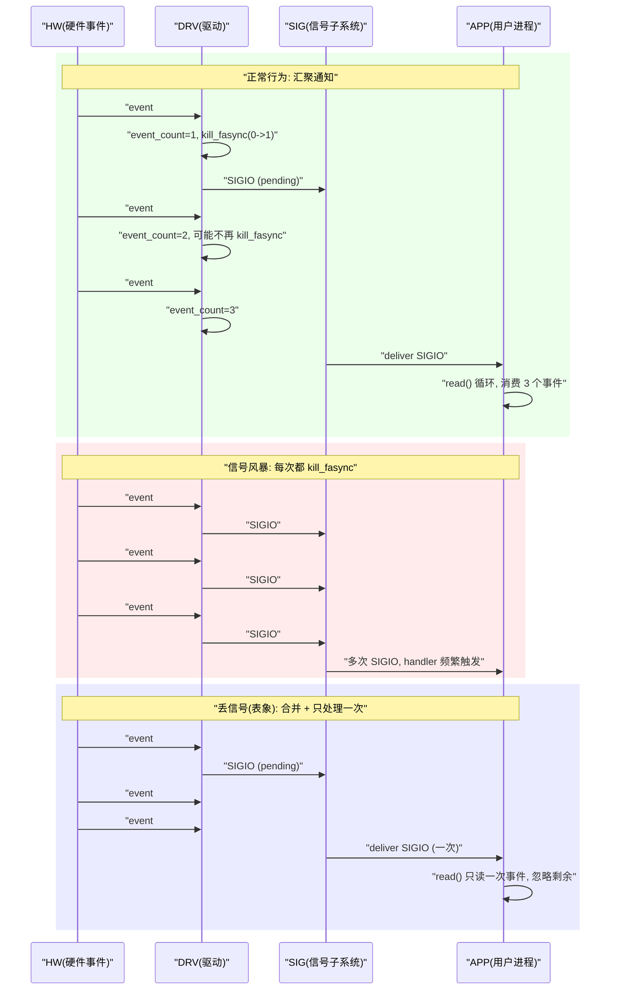
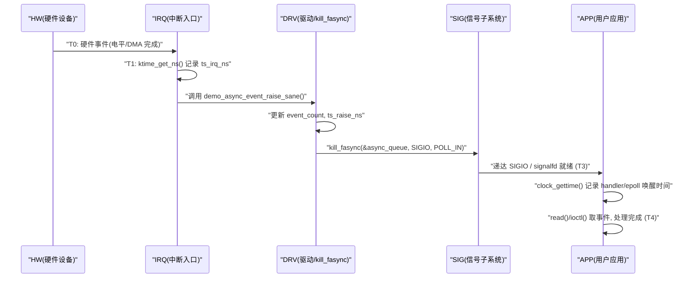

# 第 11 章 调试、排错与性能分析

## 11.1 “已经设置 FASYNC 却收不到 SIGIO”的排查步骤

### 11.1.1 引入：一个最常见、也最容易“甩锅给内核”的问题

在实际项目里，fasync 最常见的抱怨之一是：

> “应用已经 `fcntl(F_SETOWN/F_SETFL(FASYNC))` 配好了，
>  驱动也实现了 `.fasync`，
>  但就是收不到 SIGIO（或 signalfd 里没有事件）。”

如果不做系统性的拆解，这个问题很容易被归类为：

- “内核信号有坑”；
- “fasync 不可靠”；
- “多进程/多线程一多就乱”。

本小节不再讲机制，而是把问题 **拆成可操作的排查步骤**，按照“从用户态 → VFS/信号子系统 → 驱动层/中断层”的顺序，给出一个可以按图索骥的诊断流程。

目标是：

- 你可以拿着这一小节，直接**按步骤查**：
  - 是配置没生效？
  - 是信号被屏蔽了？
  - 是驱动根本没 `kill_fasync()`？
  - 还是驱动只在某种条件下才发通知，而应用没满足前提？

------

### 11.1.2 数据结构视角：SIGIO 要“走通”必须满足的条件集合

先从“状态/数据结构”的角度，列出 SIGIO 必须满足的基础条件（**缺一不可**），后面所有排查步骤都围绕这些条件展开。

以一个简单的字符设备 + fasync 驱动为例，要让 SIGIO 送达到某个用户任务，至少要满足：

1. **VFS / `struct file` 层**

   - 对某个 `struct file *filp`：
     - `filp->f_op->fasync` 指向你的 `.fasync` 回调；
     - 应用调用 `fcntl(F_SETFL, O_ASYNC | ...)` 成功后：
       - `filp->f_flags` 中包含 `FASYNC`；
     - `.fasync()` 中调用 `fasync_helper()` 成功，把该 file 对应的 `struct fasync_struct` 节点挂到 `dev->async_queue` 上。

2. **所有权 / 信号路由层**

   - 对目标接收者（进程/线程）：
     - `fcntl(F_SETOWN, ...)` 设置了 owner；
     - 可选地使用 `F_SETSIG` 改变信号号（默认为 SIGIO）；
   - 在信号子系统内部：
     - 该 owner 对应的 `struct task_struct` / `struct signal_struct` 里记录了正确的 `f_owner`；
     - 该任务的 `sigprocmask` 中没有屏蔽 SIGIO（或 `F_SETSIG` 指定的信号）。

3. **驱动层 / 事件层**

   - 你的设备驱动中：

     - 有且正确维护 `dev->async_queue`（第 10 章已详细讨论）；

     - 在“事件发生”的路径（通常是中断/下半部）中调用了：

       ```c
       kill_fasync(&dev->async_queue, SIGIO, POLL_IN);
       ```

     - 调用时机与状态更新顺序正确（先更新事件状态，再 kill）。

4. **用户态处理层**

   - 使用 signal handler：
     - 已调用 `signal` / `sigaction` 注册了对 SIGIO 的处理函数；
     - 处理函数没有立即被其他设置覆盖；
   - 或使用 signalfd：
     - 使用 `signalfd` 把 SIGIO（或自定义信号）加入 fd；
     - epoll/poll 中正确监听了该 signalfd。

> 从这个角度看，“收不到 SIGIO”一定是上面这四层中至少一层的前提不成立。
>  后面的步骤就是围绕这四层状态，做有顺序的排查。

------

### 11.1.3 开发者视角：驱动侧必须先自查的几个点（静态 + 动态）

驱动维护者在被应用同学抱怨之前，最好先做一遍 **驱动侧自检查**，防止把明显是自己锅的东西推给用户态。

可以按下面顺序检查：

1. **静态检查：`.fasync` 是否实现正确**

   - `file_operations` 中确实有 `.fasync` 成员指向你的函数；

   - `.fasync()` 的典型写法类似：

     ```c
     static int demo_async_fasync(int fd, struct file *filp, int on)
     {
     	struct demo_async_dev *dev = filp->private_data;
     	unsigned long flags;
     	int ret;
     
     	spin_lock_irqsave(&dev->lock, flags);
     	ret = fasync_helper(fd, filp, on, &dev->async_queue);
     	spin_unlock_irqrestore(&dev->lock, flags);
     
     	return ret;
     }
     ```

   - `release()` 中有：

     ```c
     static int demo_async_release(struct file *filp)
     {
     	struct demo_async_dev *dev = filp->private_data;
     
     	demo_async_fasync(-1, filp, 0);
     	return 0;
     }
     ```

2. **静态检查：事件路径里是否真的有 `kill_fasync()`**

   - 确认你的中断/下半部处理函数中，在“设备事件判定为有效后”的路径里调用了：

     ```c
     if (dev->async_queue)
     	kill_fasync(&dev->async_queue, SIGIO, POLL_IN);
     ```

   - 并且位于“更新事件状态”之后，而不是之前。

3. **静态检查：锁与释放**

   - 访问 `dev->async_queue` 的所有路径都在统一锁保护下（参见第 10 章）；
   - `remove()/exit` 中没有提前 `kfree(dev)` 或在中断仍可能触发时释放 `async_queue`，避免“偶尔 crash + 偶尔没信号”的随机行为。

4. **动态检查：在事件路径上插桩**

   - 在你的 `demo_async_event_raise()` / ISR 上加入 debug：

     ```c
     trace_printk("demo_async: event_raise cpu=%d\n",
     	     smp_processor_id());
     trace_printk("demo_async: kill_fasync queue=%p\n",
     	     dev->async_queue);
     ```

   - 或用 `pr_debug()`，配合 `dynamic_debug`；

   - 用 ftrace 观察在“应用抱怨没信号”的时候，驱动是否实际调用了 `kill_fasync()`。

> 如果这一步发现驱动根本没 `kill_fasync()`，或者只有某些路径才调用，那问题基本确定在驱动内部；
>  没必要继续深入用户态/信号子系统。

------

### 11.1.4 用户/平台视角：应用配置与进程信号状态的检查

在驱动侧自查 ok 之后，就需要从应用/平台角度系统地检查“FASYNC 已配置但 SIGIO 不来”的常见问题。可以按以下顺序：

1. **确认 fcntl 配置是否真的成功调用**

   写一个最小 Demo 或在现有应用中加 log，确认：

   ```c
   int fd = open("/dev/demo_async", O_RDONLY | O_NONBLOCK);
   fcntl(fd, F_SETOWN, getpid());          /* 或 F_SETOWN_EX/F_OWNER_TID */
   int flags = fcntl(fd, F_GETFL);
   fcntl(fd, F_SETFL, flags | O_ASYNC);    /* 设置 FASYNC 对应到 O_ASYNC */
   
   /* 可选：改变信号号 */
   fcntl(fd, F_SETSIG, SIGRTMIN);
   ```

   检查返回值是否为 -1，并打印 `errno`。

2. **查看 `/proc/PID/fd` 与 `/proc/PID/fdinfo`**

   - `ls -l /proc/$PID/fd`，找到指向 `/dev/demo_async` 的 fd；

   - 对该 fd 查看 `fdinfo`：

     ```sh
     cat /proc/$PID/fdinfo/$FD
     ```

     其中可能包含类似：

     ```text
     pos:    0
     flags:  040200            # O_ASYNC 标志对应位应被置位
     mnt_id: 27
     ino:    ...
     ```

   - 确认 flags 中确实包含 O_ASYNC 位（一般是 `0x2000`）。

3. **查看 `/proc/PID/status` 中的信号掩码与 pending 状态**

   ```sh
   cat /proc/$PID/status | egrep 'SigPnd|SigBlk|SigIgn|SigCgt'
   ```

   关键点：

   - `SigBlk` 中 **不应包含 SIGIO**；
   - 若使用 `F_SETSIG` 改成其它信号号，也要确认该信号没有被屏蔽；
   - `SigIgn` 中不应包含该信号（否则被忽略）；
   - 在触发事件一段时间内，`SigPnd` 中应短暂看到对应信号 bit 为 1。

4. **确认 signal handler / signalfd 是否正确设置**

   - 若用传统 handler：

     ```c
     struct sigaction sa;
     memset(&sa, 0, sizeof(sa));
     sa.sa_sigaction = demo_sigio_handler;
     sa.sa_flags = SA_SIGINFO;        /* 建议使用 SA_SIGINFO */
     sigemptyset(&sa.sa_mask);
     sigaction(SIGIO, &sa, NULL);
     ```

   - 若用 signalfd：

     - 使用 `sigemptyset` + `sigaddset` 配置信号集合；
     - 调用 `pthread_sigmask(SIG_BLOCK, &mask, NULL)` 把这些信号阻塞，交给 signalfd 收；
     - 创建 signalfd，并用 epoll/poll 监听；

   - 检查是否在别处对同一个信号调用了 `signal()` / `sigaction()` 覆盖了处理逻辑。

5. **确认没有在错误线程/错误进程上等待信号**

   - 如果使用 `F_SETOWN` 把 owner 设置成了某个线程（`F_OWNER_TID`），但真正 `sigwait` / signalfd/handler 所在的是另一个线程，那么信号会路由到 owner 那个线程，而不是你现在在看 log 的线程；
   - 确保：
     - `F_SETOWN` 的目标与“负责处理 SIGIO 的线程”是一致的；
     - 多线程程序中，不同线程不要同时修改同一个 fd 的 owner 和掩码。

------

### 11.1.5 可视化：一张“收不到 SIGIO 时”的排查流程图

下面给出一个从“应用层抱怨没信号”开始的简单排查流程示意图：

```mermaid
flowchart TD
    "START"["现象: FASYNC 已配置, 收不到 SIGIO"]
    "DRV_SELF"["Step1: 驱动自查\n- .fasync 是否实现?\n- 事件路径是否调用 kill_fasync()?"]
    "APP_CFG"["Step2: 应用配置检查\n- F_SETOWN/F_SETSIG/F_SETFL\n- /proc/PID/fdinfo flags\n- /proc/PID/status SigBlk/SigIgn"]
    "SIG_ROUTE"["Step3: 信号路由/线程检查\n- owner 是否指向正确线程?\n- handler/signalfd 是否注册?"]
    "KERNEL_TRACE"["Step4: 内核 trace\n- ftrace .fasync/kill_fasync\n- 查看是否实际发出 SIGIO"]
    "ADVANCED"["Step5: 高级问题\n- 信号量过多被合并\n- 应用只处理一次就退出循环\n- 竞态/资源释放时机"]
    "FIXED"["END: 找到原因并修复"]

    "START" --> "DRV_SELF"
    "DRV_SELF" -->|"驱动没有 kill_fasync 或 async_queue 始终为 NULL"| "FIXED"
    "DRV_SELF" -->|"驱动侧看起来正常"| "APP_CFG"

    "APP_CFG" -->|"fcntl 配置错误/flags 未设置 O_ASYNC"| "FIXED"
    "APP_CFG" -->|"配置看起来正常"| "SIG_ROUTE"

    "SIG_ROUTE" -->|"owner/线程错误, 信号被发到别处"| "FIXED"
    "SIG_ROUTE" -->|"路由看起来也正常"| "KERNEL_TRACE"

    "KERNEL_TRACE" -->|"发现驱动根本没在事件路径调用 kill_fasync"| "FIXED"
    "KERNEL_TRACE" -->|"kill_fasync 的确被调用"| "ADVANCED"

    "ADVANCED" --> "FIXED"
```

------

### 11.1.6 示例代码：最小 Demo 与常见错误版本对比

下面给一段 **最小用户态 Demo**，专门用来测试“fasync + SIGIO 是否工作”。你可以在驱动写好后用它做 sanity check。

```c
/*
 * demo_async_sigio_test.c
 * 目的:
 *     - 验证 /dev/demo_async 的 fasync/SIGIO 路径是否正常
 *     - 可以配合内核驱动中的 kill_fasync 调用测试
 */

#include <stdio.h>
#include <stdlib.h>
#include <unistd.h>
#include <signal.h>
#include <fcntl.h>
#include <string.h>
#include <errno.h>

static volatile int g_sigio_count = 0;

static void demo_sigio_handler(int sig, siginfo_t *info, void *ucontext)
{
	/* 简单计数, 不做复杂操作 */
	(void)ucontext;

	if (sig == SIGIO) {
		g_sigio_count++;
		printf("[SIGIO] signo=%d, fd=%d, count=%d\n",
		       sig,
		       info ? info->si_fd : -1,
		       g_sigio_count);
	}
}

static void setup_sigio_handler(void)
{
	struct sigaction sa;

	memset(&sa, 0, sizeof(sa));
	sa.sa_sigaction = demo_sigio_handler;
	sa.sa_flags = SA_SIGINFO;
	sigemptyset(&sa.sa_mask);

	if (sigaction(SIGIO, &sa, NULL) < 0) {
		perror("sigaction");
		exit(EXIT_FAILURE);
	}
}

int main(int argc, char *argv[])
{
	const char *dev_path = "/dev/demo_async";
	int fd;
	int flags;
	int ret;

	if (argc > 1)
		dev_path = argv[1];

	setup_sigio_handler();

	fd = open(dev_path, O_RDONLY | O_NONBLOCK);
	if (fd < 0) {
		perror("open");
		return EXIT_FAILURE;
	}

	/* 设置 owner 为当前进程 */
	ret = fcntl(fd, F_SETOWN, getpid());
	if (ret < 0) {
		perror("fcntl(F_SETOWN)");
		return EXIT_FAILURE;
	}

	/* 读取当前 flags 并添加 O_ASYNC */
	flags = fcntl(fd, F_GETFL);
	if (flags < 0) {
		perror("fcntl(F_GETFL)");
		return EXIT_FAILURE;
	}

	ret = fcntl(fd, F_SETFL, flags | O_ASYNC);
	if (ret < 0) {
		perror("fcntl(F_SETFL, O_ASYNC)");
		return EXIT_FAILURE;
	}

	printf("waiting for SIGIO from %s (pid=%d, fd=%d)...\n",
	       dev_path, getpid(), fd);

	for (;;) {
		pause();	/* 等待任意信号, 包括 SIGIO */
	}

	close(fd);
	return 0;
}
```

你可以故意制造几个错误版本来帮助记忆：

- 忘记 `F_SETOWN`：
  - 驱动在发 SIGIO，但默认 owner 不对，你这个进程看不到信号；
- 忘记 `O_ASYNC`：
  - `.fasync` 永远不会被调用，`dev->async_queue` 始终为 NULL；
- 没有 `sigaction(SIGIO, ...)`：
  - 信号到了默认 handler，程序直接被杀掉或忽略，看起来像“没信号”。

------

### 11.1.7 调试与验证：按层使用 strace / ftrace / /proc 的组合拳

为了完整再走一遍排查路径，这里给一套典型的 **调试操作序列**（假设设备为 `/dev/demo_async`，测试程序为 `demo_async_sigio_test`）：

1. **用 strace 观察 fcntl 与信号**

   ```sh
   strace -f -e trace=fcntl,signal,rt_sigaction,rt_sigprocmask \
          ./demo_async_sigio_test /dev/demo_async
   ```

   关注：

   - 是否出现 `fcntl(fd, F_SETOWN, ...) = 0`；
   - 是否出现 `fcntl(fd, F_SETFL, O_ASYNC | ...) = 0`；
   - 是否有 `rt_sigaction(SIGIO, ...)` 设置 handler；
   - 事件发生时是否出现 `--- SIGIO {si_signo=SIGIO, ...} ---` 字样。

2. **查看 /proc 状态**

   - 运行测试程序后，在另一个终端：

     ```sh
     pidof demo_async_sigio_test   # 获得 PID
     cat /proc/$PID/status | egrep 'SigPnd|SigBlk|SigIgn|SigCgt'
     ls -l /proc/$PID/fd
     cat /proc/$PID/fdinfo/$FD
     ```

3. **用 ftrace 跟踪驱动中的 fasync/kill_fasync**

   - 在内核中启用 ftrace 功能；

   - 指定要跟踪的函数，例如：

     ```sh
     echo function > /sys/kernel/debug/tracing/current_tracer
     echo demo_async_fasync >> /sys/kernel/debug/tracing/set_ftrace_filter
     echo kill_fasync >> /sys/kernel/debug/tracing/set_ftrace_filter
     echo 1 > /sys/kernel/debug/tracing/tracing_on
     ```

   - 触发设备事件，之后：

     ```sh
     cat /sys/kernel/debug/tracing/trace
     ```

   - 如果 `kill_fasync` 从未被调用，说明驱动路径有问题；

   - 如果被调用了但用户态仍无信号，则转而怀疑所有权/信号掩码等。

4. **极端情况：在信号子系统层用 tracepoints 进一步观察**

   - 内核有部分 signal 相关的 tracepoint（根据版本不同）：
     - `signal_generate` / `signal_deliver` 等；
   - 可在需要时开启，用于确认 `send_sigio` 是否真正将信号挂入 pending。

------

### 11.1.8 小结：把“收不到 SIGIO”拆回可验证的几个前提

本小节的核心是把一个模糊的现象：

> “已经设置 FASYNC 却收不到 SIGIO”

拆成 **若干可以逐条验证的具体条件**：

1. **VFS/文件层前提**
   - `.fasync` 实现正确，`release` 清理节点；
   - `F_SETFL` 成功设置了 O_ASYNC / FASYNC；
   - `dev->async_queue` 在事件发生前已挂载了对应 `fasync_struct`。
2. **所有权与路由前提**
   - `F_SETOWN` / `F_SETSIG` 指向正确的目标任务；
   - `SigBlk` / `SigIgn` 中没有屏蔽/忽略该信号；
   - 多线程程序中，owner 与真正处理信号的线程保持一致。
3. **驱动事件前提**
   - 设备在事件路径中确实执行了 `kill_fasync()`；
   - 调用顺序正确：先更新状态，再 `wake_up` / `kill_fasync`；
   - 没有因为限流/状态机逻辑导致根本没有“通知”。
4. **调试手段**
   - 用户态：`strace + /proc/PID/status + /proc/PID/fdinfo`；
   - 内核态：`ftrace/trace_printk` 跟踪 `.fasync` / `kill_fasync`；
   - 必要时配合 signal 子系统的 tracepoints。

掌握了这套排查步骤，你在面对“FASYNC 配好了但没信号”的时候，就不再需要“凭感觉改代码”，而是可以按层逐步缩小问题范围，快速确认 **到底是应用、信号配置、驱动事件还是资源释放顺序的问题**。


------

## 11.2 查看进程状态：`/proc/PID/status`、`/proc/PID/fd` 等

### 11.2.1 引入：为什么先看 `/proc` 再怀疑代码

调 fasync/SIGIO 的时候，一个很典型的场景是：

- 应用说：**“我已经 F_SETOWN + F_SETFL(FASYNC) 了。”**
- 驱动说：**“我这边 kill_fasync 每次都打 log 了。”**
- 但信号就是不来 / 很怪。

这种情况下，如果只靠双方口口相传，很容易变成扯皮。
 **/proc 是“唯一真相源之一”**——它给你的是**内核当下看到的真实状态**，而不是大家“自认为做了什么”。

本小节的目标是：

- 把几个与 fasync 调试高度相关的 `/proc` 文件讲清楚：
  - `/proc/PID/status`
  - `/proc/PID/fd`
  - `/proc/PID/fdinfo/FD`
- 明确每一行背后对应什么内核数据结构/状态；
- 给出一套**命令组合 + 小工具**的用法，让你能快速回答三个问题：
  1. 这个进程/线程**是否真的打开了那个 fd**？
  2. 这个 fd 上**是否真的打开了 O_ASYNC/FASYNC**？
  3. 这个进程/线程**是否真的能收到 SIGIO**（信号掩码/忽略状态）？

------

### 11.2.2 数据结构视角：从 `/proc` 行文本到内核结构的映射

#### 11.2.2.1 `/proc/PID/status`：task_struct + signal_struct 的“摘要”

`/proc/PID/status` 是对 `struct task_struct`、`struct signal_struct` 等的一个文本摘要，跟 fasync 相关的关键行主要有：

- `SigPnd` / `ShdPnd`
- `SigBlk`
- `SigIgn`
- `SigCgt`

它们分别对应：

- **`SigPnd`**：
  - 该任务级别当前挂起的信号（pending signal），来自内核和其他进程；
  - 如果驱动已经通过 `kill_fasync` 发出 SIGIO，而应用迟迟不处理，有机会在这里看到对应 bit 为 1（一闪而过，要抓时机）。
- **`SigBlk`**：
  - 当前任务的信号屏蔽（`sigprocmask`）；
  - 如果这里的掩码里包含 SIGIO，对应信号会被阻塞（不会交给 handler/默认处理，但仍会记在 pending）。
- **`SigIgn`**：
  - 被设置为忽略（`SIG_IGN`）的信号；
  - 如果 SIGIO 在这里有 bit，意味着应用显式忽略该信号。
- **`SigCgt`**：
  - 被设置了用户 handler（`SIG_DFL` 以外）的信号；
  - 若你期望 SIGIO 由 handler 处理，这里应该包含 SIGIO。

从数据结构上看，这些位图靠的是：

- `struct signal_struct` / `struct sighand_struct` 内部的 `sigset_t` 位图；
- 每个 bit 对应一个信号号（1–64 或更高）。

#### 11.2.2.2 `/proc/PID/fd` 与 `/proc/PID/fdinfo/FD`：files_struct → file → inode

`/proc/PID/fd/` 是一个目录，每个条目是一个软链接，表示该进程打开的每个 fd 对应的对象：

- 内核结构链路大致是：

  ```text
  task_struct
    -> files (struct files_struct)
      -> fdt (struct fdtable)
        -> fd[FD] (struct file *)
          -> f_inode (struct inode *)
          -> f_flags
          -> f_op (struct file_operations *)
  ```

- `ls -l /proc/PID/fd` 会显示：

  ```text
  lr-x------ 1 user user 64 ... 3 -> /dev/demo_async
  ```

  说明：fd 3 指向 `/dev/demo_async`，对应某个 `struct file`。

`/proc/PID/fdinfo/FD` 是更细节的描述，典型内容：

```text
pos:    0
flags:  040200
mnt_id: 27
ino:    12345
```

- `flags` 对应的是 `file->f_flags`（用八进制打印）；
- 我们关心的是其中是否包含 **`O_ASYNC` 位**——这是驱动 `.fasync` 的触发条件；
- 在大多数架构上：
  - `O_ASYNC` 对应常量值是 `020000`（八进制），即 `0x00002000`；
  - 所以常见 `flags:  040200` 等，可以拆开来看是否包含 `020000`。

> 换句话说：`/proc/PID/fdinfo/FD` 让你从“我觉得已经 F_SETFL 了”变成 “内核确认这个 file 的 f_flags 里确实带了 O_ASYNC/FASYNC”。

------

### 11.2.3 开发者视角：驱动调试时看 `/proc` 的“标准动作”

当驱动侧怀疑“应用没配好”或“信号被屏蔽”时，可以建议或自己直接在目标机上做如下检查：

#### 11.2.3.1 确认 fd 与设备匹配

1. 找到应用 PID：

   ```sh
   pidof demo_async_sigio_test
   ```

2. 列出它的 fd：

   ```sh
   ls -l /proc/$PID/fd
   ```

3. 找到指向 `/dev/demo_async`（或你的设备路径）的那个 fd（假设是 3）。

#### 11.2.3.2 确认该 fd 上 O_ASYNC/FASYNC 是否打开

查看 fdinfo：

```sh
cat /proc/$PID/fdinfo/3
```

关注 `flags` 行，例如：

```text
flags:  040200
```

- 用 `printf` 粗算一下：
  - `040000` 常见为 `O_RDONLY` 之类低位组合；
  - 关键信息：**是否包含 `020000`**（O_ASYNC）；
- 你也可以用简单脚本解析（后面 11.2.6 会给例子）。

若 `flags` 中完全不含 O_ASYNC 对应位，则说明：

- 应用没有成功 `fcntl(fd, F_SETFL, flags | O_ASYNC)`；
- 或者某处又把 O_ASYNC 清掉了。

#### 11.2.3.3 确认目标进程有没有把 SIGIO 屏蔽/忽略

查看 `/proc/$PID/status` 中相关行：

```sh
cat /proc/$PID/status | egrep 'SigPnd|SigBlk|SigIgn|SigCgt'
```

- 若 `SigBlk` 中包含 SIGIO 对应 bit：
   → 信号被阻塞，不会交给 handler / 默认处理。
- 若 `SigIgn` 中包含 SIGIO 对应 bit：
   → 信号被忽略（除非你用 signalfd 特意这么玩）。
- 若 `SigCgt` 不包含 SIGIO：
   → 说明没有用户 handler，可能走默认行为；
   → 默认行为允许递达，但很可能不是你期望的处理方式（比如 kill 掉进程）。

同时，事件触发后一小段时间内：

- 如果 `SigPnd` 中出现 SIGIO bit，然后很快消失，说明信号的确挂起过并被处理；
- 如果一直没有出现，说明信号未被送达（可能是驱动没 `kill_fasync`，或者 owner 配错）。

------

### 11.2.4 用户/平台视角：给应用工程师的一套“自检工具箱”

如果你在团队里负责驱动，而应用工程师不熟悉 `/proc`，可以直接给他们一个“自检脚本/步骤”：

1. 启动应用后，记录 PID。

2. 运行一个简易脚本，比如：

   ```sh
   #!/bin/sh
   PID=$1
   FD=$2
   
   echo "== /proc/$PID/status (signals) =="
   egrep 'SigPnd|SigBlk|SigIgn|SigCgt' /proc/$PID/status
   
   echo
   echo "== /proc/$PID/fd/$FD (link) =="
   ls -l /proc/$PID/fd/$FD
   
   echo
   echo "== /proc/$PID/fdinfo/$FD (flags) =="
   cat /proc/$PID/fdinfo/$FD
   ```

   用法：

   ```sh
   ./check_sigio.sh 1234 3
   ```

3. 要求应用同学在“声称已经配置好 FASYNC”之后跑一下这个脚本，把输出截图发给你。
    你就可以非常快地判断：

   - fd 指向的到底是不是你那个设备；
   - flags 里有没有 O_ASYNC；
   - 进程有没有屏蔽/忽略 SIGIO。

> 这样，很多“玄学问题”会在几分钟内被定位，而不是互相怀疑。

------

### 11.2.5 可视化：从 PID 到 fd，再到 file/fasync_struct 的路径

下面用一个简单的图，把**用户看到的 `/proc` 文件**和**内核内部结构**串起来：

```mermaid
flowchart LR
    "UP_PROC"["/proc/PID/status\n(SigBlk/SigIgn/SigPnd)"]
    "UP_FD"["/proc/PID/fd/FD\n(软链接到 /dev/demo_async)"]
    "UP_FDINFO"["/proc/PID/fdinfo/FD\n(flags: O_ASYNC 等)"]

    "TSK"["task_struct"]
    "SIG"["signal_struct\n(sigprocmask/pending)"]
    "FILES"["files_struct\n(打开的 fd 集)"]
    "FDT"["fdtable\n(fd -> file *)"]
    "FILE"["struct file\n(f_flags, f_op, private_data)"]
    "INODE"["struct inode\n(设备号, 驱动挂接点)"]
    "DEV"["demo_async_dev\n(驱动私有数据, async_queue)"]
    "FAS"["fasync_struct 链表\n(dev->async_queue)"]

    "UP_PROC" --> "SIG"
    "TSK" --> "SIG"

    "UP_FD" --> "FILES"
    "FILES" --> "FDT"
    "FDT" --> "FILE"
    "FILE" --> "INODE"
    "FILE" --> "DEV"
    "DEV" --> "FAS"

    "UP_FDINFO" --> "FILE"
```

阅读要点：

- `/proc/PID/status` 映射到 `task_struct/signal_struct`，你在这里看 signal 掩码与 pending；
- `/proc/PID/fd/FD` 映射到 `files_struct/fdtable/file`，说明“这个 fd 是谁”；
- `/proc/PID/fdinfo/FD` 直接读 `file->f_flags` 等信息；
- 驱动中的 `demo_async_dev` 通过 `file->private_data` 关联，内部持有 `dev->async_queue`，`kill_fasync` 就是从这里出发。

------

### 11.2.6 示例代码：一个小工具，自动解析 O_ASYNC / 信号状态

下面给一个简单用户态小工具示例：
 输入 PID 和 FD，它会：

- 打印 `/proc/PID/status` 中的关键信号信息；
- 打印 `/proc/PID/fdinfo/FD` 并解析 O_ASYNC 是否置位。

> 这里只做最小解析，不搞太重的十六进制→信号位对照（那可以做成单独工具）。

```c
/*
 * demo_proc_sigio_inspect.c
 * 用法:
 *     ./proc_sigio_inspect <PID> <FD>
 *
 * 功能:
 *     - 打印 /proc/PID/status 中的 SigPnd/SigBlk/SigIgn/SigCgt 行
 *     - 打印 /proc/PID/fdinfo/FD 中的 flags, 并提示是否包含 O_ASYNC
 */

#include <stdio.h>
#include <stdlib.h>
#include <string.h>
#include <errno.h>

#define PROC_PATH_MAX_LEN         256
#define PROC_LINE_MAX_LEN         512

/* Linux 中 O_ASYNC 八进制值: 020000 => 十进制 16384 */
#define DEMO_O_ASYNC_OCT          020000
#define DEMO_O_ASYNC_DEC          16384

static void show_status_signals(pid_t pid)
{
	char path[PROC_PATH_MAX_LEN];
	FILE *fp;
	char line[PROC_LINE_MAX_LEN];

	snprintf(path, sizeof(path), "/proc/%d/status", pid);

	fp = fopen(path, "r");
	if (!fp) {
		fprintf(stderr, "打开 %s 失败: %s\n", path, strerror(errno));
		return;
	}

	printf("== %s 中的信号相关行 ==\n", path);
	while (fgets(line, sizeof(line), fp)) {
		if (strstr(line, "SigPnd") ||
		    strstr(line, "ShdPnd") ||
		    strstr(line, "SigBlk") ||
		    strstr(line, "SigIgn") ||
		    strstr(line, "SigCgt"))
			fputs(line, stdout);
	}

	fclose(fp);
}

static void show_fdinfo_flags(pid_t pid, int fd)
{
	char path[PROC_PATH_MAX_LEN];
	FILE *fp;
	char line[PROC_LINE_MAX_LEN];
	long flags_value = -1;

	snprintf(path, sizeof(path), "/proc/%d/fdinfo/%d", pid, fd);

	fp = fopen(path, "r");
	if (!fp) {
		fprintf(stderr, "打开 %s 失败: %s\n", path, strerror(errno));
		return;
	}

	printf("\n== %s 内容 ==\n", path);
	while (fgets(line, sizeof(line), fp)) {
		fputs(line, stdout);

		if (sscanf(line, "flags: %ld", &flags_value) == 1) {
			/* 解析出 flags 数值 */
		}
	}

	fclose(fp);

	if (flags_value >= 0) {
		printf("\n解析 flags: %ld (十进制)\n", flags_value);
		if (flags_value & DEMO_O_ASYNC_DEC)
			printf("  -> 已设置 O_ASYNC/FASYNC (包含 %d)\n",
			       DEMO_O_ASYNC_DEC);
		else
			printf("  -> 未设置 O_ASYNC/FASYNC (不包含 %d)\n",
			       DEMO_O_ASYNC_DEC);
	} else {
		printf("\n未能在 fdinfo 中解析 flags 行。\n");
	}
}

int main(int argc, char *argv[])
{
	pid_t pid;
	int fd;

	if (argc != 3) {
		fprintf(stderr, "用法: %s <PID> <FD>\n", argv[0]);
		return EXIT_FAILURE;
	}

	pid = (pid_t)atoi(argv[1]);
	fd = atoi(argv[2]);

	if (pid <= 0 || fd < 0) {
		fprintf(stderr, "参数错误: PID=%d FD=%d\n", pid, fd);
		return EXIT_FAILURE;
	}

	show_status_signals(pid);
	show_fdinfo_flags(pid, fd);

	return EXIT_SUCCESS;
}
```

> 注意：这里用的是十进制解析 `flags`，因为 `/proc/PID/fdinfo` 中 `flags` 通常就是十进制；
>  我们用 `DEMO_O_ASYNC_DEC`（16384）常量去按位判断是否包含 O_ASYNC。

------

### 11.2.7 调试与验证：结合 11.1 的排查步骤使用 `/proc`

把 11.1 和 11.2 结合起来，可以形成一套比较顺的“现场调试流程”：

1. 驱动侧先自查 `.fasync` / `kill_fasync`，确认事件路径 OK（参见 11.1.3）。

2. 应用启动后，记下 PID 和 fd，立刻跑：

   ```sh
   ./proc_sigio_inspect <PID> <FD>
   ```

   或用前面的 shell 脚本简查。

3. 观察输出：

   - `/proc/PID/status` 中：
     - `SigBlk` 是否把 SIGIO 屏蔽；
     - `SigIgn` 是否忽略 SIGIO；
     - `SigCgt` 中是否包含 SIGIO（有无 handler）。
   - `/proc/PID/fdinfo/FD` 中：
     - `flags` 是否包含 O_ASYNC/FASYNC。

4. 在触发设备事件时，用 `watch -n 0.1 'cat /proc/PID/status | egrep SigPnd'` 等方法观察 `SigPnd` 是否短暂出现 SIGIO bit。

5. 若 `/proc` 显示一切正常，但仍无信号，则继续用 ftrace 追 `.fasync` / `kill_fasync`（11.1.7）。

------

### 11.2.8 小结：把 `/proc` 当成 fasync 调试的“状态仪表盘”

本小节的重点可以总结为：

1. **`/proc/PID/status` 是信号掩码和 pending 状态的窗口**
   - `SigBlk` / `SigIgn` 直接告诉你：这个任务现在是否打算接受某个信号；
   - `SigPnd` 可以用来观察信号是否曾经挂起过。
2. **`/proc/PID/fd` / `/proc/PID/fdinfo/FD` 是 `struct file` 状态的窗口**
   - 通过软链接确认某个 fd 指向的确是你的设备；
   - 通过 `fdinfo` 的 `flags` 确认 `O_ASYNC/FASYNC` 是否真的打开。
3. **驱动 + 应用双方都可以用 `/proc` 来做“客观自证”**
   - 驱动工程师可以快速判断：问题在驱动路径，还是在应用配置/信号掩码；
   - 应用工程师可以确认：自己确实设置了期望的 F_SETOWN/F_SETFL。
4. **配合 11.1 的排查流程，形成“SIGIO 调试三件套”：**
   - `/proc`：看静态/动态状态是否合理；
   - `strace`：看用户态是否真的调用了那些 fcntl/sigaction；
   - `ftrace`：看内核是否真的走到了 `.fasync` / `kill_fasync`。

在后续的 **11.3–11.5 小节**里，我们会把视角进一步下沉到：

- `strace` 观察 fcntl/信号行为的细节（11.3）；
- `ftrace/trace_printk` 如何精确地定位 `.fasync`/`kill_fasync` 的调用点（11.4）；
- 如何识别“信号风暴、丢信号、重复通知”的典型症状并通过 trace 反推原因（11.5）。


------

## 11.3 使用 `strace` 观察 fcntl/信号行为

### 11.3.1 引入：先看“系统调用层面”，再去怀疑驱动

前面两节我们已经有了：

- **11.1**：逻辑排查路径（从驱动到用户态）；
- **11.2**：通过 `/proc` 直接看“内核当前的状态”。

但还有一个特别重要的“中间层”工具——**`strace`**：

- 它站在 **系统调用层面** 观察应用到底做了什么；
- 它能解决一类非常常见的问题：

> 应用说“我调用了 F_SETOWN / F_SETFL(O_ASYNC)”——
>  `strace` 一看：要么根本没调，要么 `errno` 不为 0，要么中途又被另一个地方覆盖……

本小节的目标：

- 总结 fasync/SIGIO 场景下，`strace` **最值得看的那几类系统调用**；
- 给出一套标准命令行 + 典型输出样例；
- 结合具体错误模式，教你靠 `strace` 快速定位“应用到底有没有把 FASYNC 配对”。

------

### 11.3.2 数据结构视角：`strace` 在看哪些“关键点”

从内核视角看，`strace` 关注的是：

- 用户态通过系统调用与内核交互的“边界”；
- 对 fasync 来说，关键系统调用包括：

1. **`open` / `close`**

   - 决定了哪些 fd 对应你的设备；
   - `open("/dev/demo_async", O_RDONLY|O_NONBLOCK)` → `struct file` 创建。

2. **`fcntl` 系列**

   - `F_GETFL` / `F_SETFL`：
     - 直接决定 `file->f_flags` 中是否带 O_ASYNC/FASYNC；
   - `F_SETOWN` / `F_SETOWN_EX` / `F_SETSIG`：
     - 直接决定 `f_owner`、SIGIO 信号号等。

3. **`rt_sigaction` / `signal` / `sigprocmask`**

   - `rt_sigaction(SIGIO, ...)`：
     - 注册/覆盖 SIGIO handler；
   - `rt_sigprocmask`：
     - 修改 `SigBlk`，决定信号是否被阻塞。

4. **信号递达本身**

   - `strace` 在信号到达用户态时，会打印一条形如：

     ```text
     --- SIGIO {si_signo=SIGIO, si_code=..., si_fd=3, ...} ---
     ```

   - 这是确认“内核已经把信号送到了用户态”的直观证据。

> 换句话说：
>  `/proc` 给你的是“内核此刻的状态快照”；
>  `strace` 给你的是“应用在时间轴上到底做了哪些操作，状态是如何变成那样的”。

------

### 11.3.3 开发者视角：fasync/SIGIO 时 `strace` 应该看什么

#### 11.3.3.1 基本命令行模板

调一个使用 fasync 的应用时，推荐的基本命令：

```sh
strace -f \
       -e trace=fcntl,open,close,rt_sigaction,rt_sigprocmask,signalfd4,ppoll,epoll_wait \
       ./demo_async_sigio_test /dev/demo_async
```

说明：

- `-f`：跟踪子进程/线程（多线程应用时非常关键）；
- `-e trace=...`：只关心与 fasync/SIGIO 相关的系统调用，输出更干净；
- 根据具体应用，还可以加上 `ioctl`, `read`, `poll`, `epoll_ctl` 等。

#### 11.3.3.2 重点观察点 1：`fcntl(F_SETOWN/F_SETFL/F_SETSIG)`

示例输出（简化）：

```text
open("/dev/demo_async", O_RDONLY|O_NONBLOCK) = 3
fcntl(3, F_SETOWN, 12345)                 = 0
fcntl(3, F_GETFL)                         = 0x800 (flags = O_RDONLY|O_NONBLOCK)
fcntl(3, F_SETFL, O_RDONLY|O_NONBLOCK|O_ASYNC) = 0
fcntl(3, F_SETSIG, SIGRTMIN)              = 0
```

要检查：

1. `open` 是否成功返回了一个 fd（如 3），且不为 -1；

2. 每个 `fcntl` 调用的返回值是否为 0（成功）；

3. `F_SETFL` 时传入的 flags 是否包含了原有标志：

   - 正确：`flags | O_ASYNC`；

   - 错误写法（覆盖原 flag）：

     ```text
     fcntl(3, F_SETFL, O_ASYNC) = 0
     ```

   这可能会悄悄丢掉 O_NONBLOCK 等，导致行为异常。

#### 11.3.3.3 重点观察点 2：`rt_sigaction` / `sigprocmask`

典型输出（handler 注册）：

```text
rt_sigaction(SIGIO, {sa_handler=0x5555555551e0, sa_mask=..., sa_flags=SA_RESTART|SA_SIGINFO}, NULL, 8) = 0
```

关注几点：

- 是否真正对 **SIGIO** 调用了 `rt_sigaction`；
- 是否使用 `SA_SIGINFO`，可以更方便地获取 `si_fd` 等信息；
- 有没有后续的 `rt_sigaction(SIGIO, SIG_IGN, ...)` 把 handler 覆盖/忽略掉。

`sigprocmask` 示例（阻塞/解阻塞信号）：

```text
rt_sigprocmask(SIG_BLOCK, [IO], [], 8)    = 0
rt_sigprocmask(SIG_UNBLOCK, [IO], NULL, 8) = 0
```

如果看到应用在某个阶段 `SIG_BLOCK` 了 `SIGIO`，且没有随后的 `SIG_UNBLOCK`，那就可以解释“信号挂起但 handler 不触发”的现象。

#### 11.3.3.4 重点观察点 3：信号递达行

当内核把 SIGIO 交给用户态时，`strace` 会输出类似：

```text
--- SIGIO {si_signo=SIGIO, si_code=SI_QUEUE, si_fd=3, si_band=...} ---
rt_sigreturn({mask=[]})                  = 0
```

这里可以看到：

- `si_fd`：触发信号的 fd（对于 signalfd 可能不一样）；
- `si_code`：信号原因（比如 `POLL_IN` 等）；
- 若完全看不到 `--- SIGIO ---` 行，要么信号没发上来，要么被屏蔽/忽略。

------

### 11.3.4 用户/平台视角：几类“典型错误模式”的 `strace` 特征

结合实战，列几种常见坑及其 `strace` 侧表现：

#### 11.3.4.1 模式 A：根本没设置 owner

`strace` 片段：

```text
open("/dev/demo_async", O_RDONLY|O_NONBLOCK) = 3
fcntl(3, F_GETFL)                         = 0x800
fcntl(3, F_SETFL, O_RDONLY|O_NONBLOCK|O_ASYNC) = 0
/* 注意: 没有任何 F_SETOWN / F_SETOWN_EX 调用 */
```

特征：

- 应用只设置了 O_ASYNC（FASYNC），但没有 F_SETOWN；
- 驱动 `kill_fasync()` 会调用 `send_sigio()`，但 owner 是默认值（通常为 0 或父进程），实际目标不是你想要的任务；
- 结论：**SIGIO 发出去了，但发送给了“默认 owner”，当前进程静悄悄。**

#### 11.3.4.2 模式 B：F_SETFL 被错误覆盖 / 中途被清掉

`strace` 片段：

```text
open("/dev/demo_async", O_RDONLY)        = 3
fcntl(3, F_GETFL)                        = 0x800
fcntl(3, F_SETFL, O_ASYNC)               = 0     # 错误: 覆盖旧 flags

/* 一段时间后: */
fcntl(3, F_SETFL, O_RDONLY)              = 0     # 错误: 清掉了 O_ASYNC
```

特征：

- 第一次 `F_SETFL` 用了裸 `O_ASYNC`，导致丢失原来的 O_RDONLY/O_NONBLOCK 等；
- 后面又有一个 `F_SETFL` 完全没有带 O_ASYNC，FASYNC 被悄悄关掉；
- `/proc/PID/fdinfo/FD` 中就会看不到 O_ASYNC 位。

#### 11.3.4.3 模式 C：signal handler 被覆盖/忽略

`strace` 片段：

```text
rt_sigaction(SIGIO, {sa_handler=0x....}, NULL, 8) = 0
...
rt_sigaction(SIGIO, SIG_IGN, {sa_handler=0x....}, 8) = 0
```

特征：

- 先正常注册了 handler；
- 后面某段库代码（可能是 GUI 框架、某个 runtime）又把 SIGIO 设置成 `SIG_IGN`；
- 结果就是信号到了，但被默默忽略。

#### 11.3.4.4 模式 D：多线程场景中 owner/处理线程不一致

多线程 `strace` 输出时，通常会有 `clone`/`tkill` 等：

```text
clone(child_stack=..., flags=CLONE_VM|CLONE_FS|CLONE_FILES|CLONE_SIGHAND, ...) = 12345
[pid 12344] fcntl(3, F_SETOWN, 12344)    = 0
[pid 12346] rt_sigaction(SIGIO, {...}, NULL, 8) = 0
```

特征：

- 线程 12344 用 F_SETOWN 把 SIGIO owner 设置为自己；
- 线程 12346 设置了 SIGIO handler，却不一定就是 owner；
- 最后 SIGIO 递达的是线程 12344，而你在看 log 的线程是 12346，导致“我这边 handler 没触发”的错觉。

------

### 11.3.5 可视化：`strace` 在 fasync 调试中的位置

结合之前几小节，把 `strace` 放进整个排查流程里：

```mermaid
flowchart LR
    "APP"["应用源码\n(fcntl/sigaction)"]
    "SC"["系统调用层\n(strace 观测)"]
    "KSTAT"["内核状态\n(/proc/PID/status, fdinfo)"]
    "DRV"["驱动 + fasync\n(.fasync, kill_fasync)"]
    "HW"["硬件事件\n(中断/工作队列)"]

    "APP" --> "SC"
    "SC" --> "KSTAT"
    "KSTAT" --> "DRV"
    "DRV" --> "HW"

    "HW" --> "DRV"
    "DRV" --> "KSTAT"
    "KSTAT" --> "SC"
    "SC" --> "APP"
```

`strace` 的位置在“系统调用边界”，既能看到：

- 应用到底有没有发出你以为的那些 fcntl/sigaction；
- 也能看到信号什么时候真正递达到了用户态。

------

### 11.3.6 示例：用 `strace` 走一遍完整的“正确工作路径”

假设你用上一节的 `demo_async_sigio_test` 程序，配合一个正确实现的 fasync 驱动，运行：

```sh
strace -f -e trace=fcntl,open,close,rt_sigaction,rt_sigprocmask,ppoll \
       ./demo_async_sigio_test /dev/demo_async
```

触发几次设备事件后，你可能看到类似序列（略去无关行）：

```text
open("/dev/demo_async", O_RDONLY|O_NONBLOCK) = 3
rt_sigaction(SIGIO, {sa_handler=0x..., sa_mask=..., sa_flags=SA_SIGINFO}, NULL, 8) = 0
fcntl(3, F_SETOWN, 12345)                 = 0
fcntl(3, F_GETFL)                         = 0x800
fcntl(3, F_SETFL, O_RDONLY|O_NONBLOCK|O_ASYNC) = 0

pause()                                   = ? ERESTARTNOHAND (To be restarted if no handler)
/* 此时硬件事件发生, 驱动 kill_fasync -> 内核投递 SIGIO */

--- SIGIO {si_signo=SIGIO, si_code=SI_KERNEL, si_fd=3, ...} ---
rt_sigreturn({mask=[]})                   = 0

pause()                                   = ? ERESTARTNOHAND (To be restarted if no handler)
--- SIGIO {si_signo=SIGIO, si_code=SI_KERNEL, si_fd=3, ...} ---
rt_sigreturn({mask=[]})                   = 0
```

观察点：

- 你可以明确看到 **配置阶段 → 等待 → 信号抵达 → handler 返回 → 再次等待** 的完整流程；
- 如果在某一步卡住，就可以据此缩小范围。

------

### 11.3.7 调试与验证：`strace` 与 `/proc`、`ftrace` 的组合使用建议

一个比较成熟的调试组合是：

1. **先用 `strace` 看系统调用层面是否合理**
   - F_SETOWN/F_SETFL/F_SETSIG 是否都调用了，返回值是否为 0；
   - `rt_sigaction` 是否对 SIGIO 安装了 handler；
   - 是否出现了 `--- SIGIO ---` 递达行。
2. **再用 `/proc` 验证当前时刻状态**
   - `/proc/PID/status`：看 `SigBlk/SigIgn/SigPnd/SigCgt`；
   - `/proc/PID/fdinfo/FD`：看 `flags` 是否携带 O_ASYNC。
3. **最后用 `ftrace` 观测驱动内部行为**
   - 确认 `.fasync` 是否被调用（在 F_SETFL(O_ASYNC) 时）；
   - 确认事件路径中 `kill_fasync()` 是否执行。

> 这三个层次一起用，可以非常快速确定问题究竟在：
>
> - 应用逻辑；
> - 系统调用参数/顺序；
> - 信号掩码/handler；
> - 还是驱动本身。

------

### 11.3.8 小结：把 `strace` 当作“fasync 协议层”的抓包工具

本小节的核心可以压缩为几句话：

1. **`strace` = fasync 的“协议抓包器”**
   - 把 fasync/SIGIO 看成一种“应用 ↔ 内核之间的协议”：
     - F_SETOWN / F_SETFL(O_ASYNC) / F_SETSIG / rt_sigaction / sigprocmask；
   - `strace` 能精确展示这套协议是否按顺序调用、参数是否正确。
2. **最重要的观测内容：**
   - 是否出现 F_SETOWN（设置 owner）；
   - F_SETFL 是否包含 O_ASYNC 且返回成功；
   - 是否安装/覆盖了 SIGIO handler；
   - 是否有 `--- SIGIO ---` 递达行。
3. **通过 `strace` 可以识别的典型错误模式：**
   - 根本没设置 owner；
   - F_SETFL 被错误覆盖或被后续调用清掉；
   - handler 被其他代码覆盖/忽略；
   - 多线程中 owner 与处理线程不一致。
4. **与 `/proc` + `ftrace` 的配合：**
   - `strace` 看“过程”；
   - `/proc` 看“结果状态”；
   - `ftrace` 看“驱动内部细节”。

掌握了这一层，你在 debug fasync 的时候不再需要“盲猜用户态到底做没做某一步”，而是可以像抓网络包一样，逐条看清系统调用层的行为。


------

## 11.4 使用 ftrace/trace_printk 定位 `.fasync` / `kill_fasync()` 调用

### 11.4.1 引入：当 `strace` 和 `/proc` 都说“正常”，但还是出问题时

在 11.1–11.3 里，我们已经有了两把“外部视角”的工具：

- `/proc`：看的是 **当前内核状态**（信号掩码、fd flags 等）；
- `strace`：看的是 **应用到内核的系统调用过程**（fcntl、sigaction、信号递达）。

但 fasync 的最后一环是在 **驱动内部**：

- `.fasync` 到底有没有被 VFS 调用？
- `dev->async_queue` 什么时候挂上去了？
- 真正的“事件路径”里 `kill_fasync()` 有没有被走到？
- 这些调用发生在中断上下文？工作队列？哪个 CPU？

这些问题，单靠 `/proc` 和 `strace` 是看不到的，
 必须用到内核端的 trace 工具——**ftrace + trace_printk**。

本小节目标：

- 讲清楚在 fasync 场景下，**如何用 ftrace/trace_printk 精确定位 `.fasync` 与 `kill_fasync()` 的执行路径与时序**；
- 给出一套“开/关 ftrace 的标准操作流程”；
- 提供一个针对 `demo_async` 驱动的完整 trace 示例。

------

### 11.4.2 数据结构与机制：ftrace 对函数调用的“钩子”视角

#### 11.4.2.1 ftrace 的核心：函数入口/退出上的 trace 钩子

从内核视角看，ftrace 的 function tracer 做了这样的事情：

- 在每个（或指定的一些）函数的入口，插入一个特定指令（比如 `call` 到 trace stub）；
- 每次函数被调用时，记录：
  - 当前 CPU、当前任务（PID/TGID）、时间戳；
  - 函数名、本次调用深度（可选）、栈回溯（stack tracer）。

对于我们关心的 fasync 路径，可以把重点放在几个函数上：

1. 你的驱动 `.fasync` 实现，比如 `demo_async_fasync()`；
2. `kill_fasync()`（内核提供的通用函数）；
3. 事件路径上的中断/工作队列回调，比如 `demo_async_irq_handler()`、`demo_async_work_fn()`。

通过 ftrace：

- 你可以看到：**“.fasync 是否在 F_SETFL(O_ASYNC) 时被调用”**；
- 也可以看到：**“每次 kill_fasync 是从哪个函数/上下文发起的”**（中断、workqueue 或进程上下文）。

#### 11.4.2.2 trace_printk：在 trace 缓冲区里插入你自己的日志

`trace_printk()` 是专门给 trace 用的打印接口：

```c
trace_printk("demo_async: event=%u, cpu=%d\n",
	     dev->event_count, smp_processor_id());
```

- 与 `pr_info()/printk()` 不同，`trace_printk()` 的输出只进入 **ftrace 的 trace 缓冲区**；
- 配合 ftrace 可以获得一个 **按时间排序的“函数调用 + 自定义事件”时间线**。

> 组合起来的效果是：
>
> - 用 function tracer 标出“哪些函数被调用”；
> - 用 `trace_printk` 在关键状态变化点打自定义标记。

------

### 11.4.3 开发者视角：为 fasync 路径配置 ftrace 的基本步骤

以下以典型的 debugfs 路径 `/sys/kernel/debug/tracing` 为例（需要 root）：

#### 11.4.3.1 开启 function tracer 并限制到关注的函数

1. 进入 tracing 目录：

```sh
cd /sys/kernel/debug/tracing
```

1. 关闭当前 trace（避免混入旧数据）：

```sh
echo 0 > tracing_on
```

1. 选择 tracer 类型为 `function`：

```sh
echo function > current_tracer
```

1. 清空已有 filter：

```sh
echo > set_ftrace_filter
```

1. 指定需要跟踪的函数，例如：

```sh
echo demo_async_fasync >> set_ftrace_filter
echo demo_async_event_raise >> set_ftrace_filter
echo kill_fasync >> set_ftrace_filter
```

> 这里假设你的驱动函数名为 `demo_async_fasync`、`demo_async_event_raise`，实际按自己驱动名字替换。

1. 清空 trace 缓冲区：

```sh
echo > trace
```

1. 开启 trace：

```sh
echo 1 > tracing_on
```

此时，任何触发上述函数的调用都会被记录在 `trace` 中。

#### 11.4.3.2 触发应用行为

- 在另一个终端启动你的测试程序（例如 11.1 中的 `demo_async_sigio_test`）；
- 执行：
  - `F_SETOWN` / `F_SETFL(O_ASYNC)`（会触发 `.fasync`）；
  - 触发设备事件（按键/外部信号等，触发 `demo_async_event_raise` 和 `kill_fasync`）。

#### 11.4.3.3 查看 trace 结果

回到 tracing 目录：

```sh
echo 0 > tracing_on
cat trace > /tmp/demo_async.trace
```

`trace` 文件的典型结构（简化）：

```text
# tracer: function
#
#           TASK-PID    CPU#    TIMESTAMP  FUNCTION
#              | |       |         |         |
demo_async_sig-1234  [000]  123.456789: demo_async_fasync <-do_fcntl
demo_async_sig-1234  [000]  123.456900: demo_async_fasync <-do_fcntl
...
kworker/0:1-   87  [000]  124.000123: demo_async_event_raise <-demo_async_irq_handler
kworker/0:1-   87  [000]  124.000130: kill_fasync <-demo_async_event_raise
```

你可以从中读出：

- `.fasync` 被调用了几次、是哪个进程（PID）触发的；
- 每次事件发生时，`kill_fasync` 是在哪个任务/CPU 上调用的；
- 如果完全看不到 `kill_fasync`，可以初步认定“驱动的事件路径没调用它”。

------

### 11.4.4 在驱动中使用 `trace_printk` 打点

在 fasync 驱动里加入适量 `trace_printk`，可以非常直观地看到状态变化。
 例如我们在 `demo_async_event_raise()` 中增加：

```c
#include <linux/tracepoint.h>	/* 一般通过 <linux/tracepoint.h> 间接提供 trace_printk */

static void demo_async_event_raise(struct demo_async_dev *dev)
{
	unsigned long flags;
	bool need_notify = false;

	spin_lock_irqsave(&dev->lock, flags);

	if (dev->event_count == 0U)
		need_notify = true;

	dev->event_count++;

	/* 在锁内打 debug, 记录事件计数与 async_queue 状态 */
	trace_printk("demo_async: event_raise count=%u, async_queue=%p\n",
		     dev->event_count, dev->async_queue);

	if (need_notify) {
		wake_up_interruptible(&dev->wait);

		if (dev->async_queue) {
			trace_printk("demo_async: kill_fasync notify, pid=%d\n",
				     task_pid_nr(current));
			kill_fasync(&dev->async_queue, SIGIO, POLL_IN);
		}
	}

	spin_unlock_irqrestore(&dev->lock, flags);
}
```

同理，在 `.fasync` 中加上：

```c
static int demo_async_fasync(int fd, struct file *filp, int on)
{
	struct demo_async_dev *dev = filp->private_data;
	unsigned long flags;
	int ret;

	spin_lock_irqsave(&dev->lock, flags);

	trace_printk("demo_async: fasync fd=%d, on=%d, filp=%p, tgid=%d\n",
		     fd, on, filp, task_tgid_nr(current));

	ret = fasync_helper(fd, filp, on, &dev->async_queue);

	trace_printk("demo_async: fasync done, async_queue=%p, ret=%d\n",
		     dev->async_queue, ret);

	spin_unlock_irqrestore(&dev->lock, flags);

	return ret;
}
```

结合 ftrace 的函数跟踪：

- `function tracer` 告诉你：**“什么时候进入 `.fasync` / `kill_fasync`”**；
- `trace_printk` 告诉你：**“此时 dev 的状态是什么（event_count、async_queue、当前任务 PID 等）”**。

> 这样，你就可以构造出一个精细的时间线，判断是否存在：
>
> - `.fasync` 根本没被调用；
> - `async_queue` 始终为 NULL；
> - `event_count` 没有按预期增加；
> - 某些事件分支根本不走 `kill_fasync`。

------

### 11.4.5 典型使用场景：ftrace 在 fasync 调试中的“必查三问”

结合实战，ftrace/trace_printk 最常被用来回答下面三类问题：

#### 11.4.5.1 问题 1：`.fasync` 有被调用吗？被谁调用？

- ftrace filter 只保留 `.fasync`：

  ```sh
  echo 0 > tracing_on
  echo function > current_tracer
  echo > set_ftrace_filter
  echo demo_async_fasync >> set_ftrace_filter
  echo > trace
  echo 1 > tracing_on
  ```

- 在应用里执行 `F_SETFL(O_ASYNC)`；

- 再 `echo 0 > tracing_on; cat trace`：

  ```text
  demo_async_sig-1234  [000]  100.000001: demo_async_fasync <-do_fcntl
  ```

你可以看到：

- `.fasync` 确实被调用了；
- 调用栈上方是 `do_fcntl`（在某些版本中是 `__f_setown`/`do_fcntl64` 等）；
- 当前任务是 `demo_async_sig`，PID=1234。

如果 trace 中完全看不到 `.fasync`：

- 要么驱动 `file_operations` 里没有填 `.fasync`；
- 要么应用压根没调用 `F_SETFL(O_ASYNC)`。

#### 11.4.5.2 问题 2：每次事件发生时 `kill_fasync` 有没有被调用？

- filter 关注 `demo_async_event_raise` 与 `kill_fasync`：

  ```sh
  echo 0 > tracing_on
  echo function > current_tracer
  echo > set_ftrace_filter
  echo demo_async_event_raise >> set_ftrace_filter
  echo kill_fasync >> set_ftrace_filter
  echo > trace
  echo 1 > tracing_on
  ```

- 触发设备若干次事件（按键/外部信号）；

- 关闭 trace 并查看：

  ```text
  kworker/0:1-87  [000] 200.001000: demo_async_event_raise <-demo_async_irq_handler
  kworker/0:1-87  [000] 200.001010: kill_fasync <-demo_async_event_raise
  ```

若只看到 `demo_async_event_raise`，却完全没有 `kill_fasync`：

- 很可能是你在某些条件下（例如 `event_count > 某个阈值`）不再调用 `kill_fasync`，做了过度“限流”；
- 或者 `async_queue == NULL` 时直接返回了。

此时可以配合 `trace_printk` 看 `async_queue` 是否真的为空，确认是逻辑问题还是状态初始化有误。

#### 11.4.5.3 问题 3：调用发生在什么上下文？有无竞争风险？

通过 ftrace 输出中的 TASK/CPU 信息：

```text
kworker/0:1-87  [000] ... demo_async_event_raise <-demo_async_irq_handler
demo_async_sig-1234 [001] ... demo_async_fasync <-do_fcntl
```

你可以判断：

- `.fasync` 在进程上下文（PID=1234）执行；
- `event_raise`/`kill_fasync` 在 `kworker/0:1` 上（工作队列），CPU 0；
- 如果你看到 `demo_async_event_raise` 偶尔在某个硬中断线程或 softirq 中执行，而你的代码里用了可能睡眠的同步原语，就可以立即意识到“上下文类型用错了”。

------

### 11.4.6 示例：一步步 trace 一个 `demo_async` 驱动

下面给一个简化的“完整操作流程”，你可以在实际项目中按此走一遍：

1. **准备内核配置**

   - 确保内核启用了 ftrace：
     - `CONFIG_FUNCTION_TRACER=y`；
     - `CONFIG_FUNCTION_GRAPH_TRACER=y`（可选）；
     - `CONFIG_DYNAMIC_FTRACE=y` 等。

2. **在驱动中加入少量 trace_printk（非必须）**

   - 在 `.fasync` 和 `event_raise` 中加入前面示例的 `trace_printk`。

3. **加载驱动，创建字符设备**

   - `insmod demo_async.ko`；
   - `mknod /dev/demo_async c <major> <minor>`。

4. **配置 ftrace**

   ```sh
   cd /sys/kernel/debug/tracing
   echo 0 > tracing_on
   echo function > current_tracer
   echo > set_ftrace_filter
   echo demo_async_fasync >> set_ftrace_filter
   echo demo_async_event_raise >> set_ftrace_filter
   echo kill_fasync >> set_ftrace_filter
   echo > trace
   echo 1 > tracing_on
   ```

5. **运行测试程序并触发事件**

   - 终端 A：`./demo_async_sigio_test /dev/demo_async`；
   - 终端 B：进行硬件操作，触发中断/事件若干次。

6. **停止 ftrace 并查看结果**

   ```sh
   cd /sys/kernel/debug/tracing
   echo 0 > tracing_on
   cat trace > /tmp/demo_async_fasync.trace
   ```

7. **分析 trace 文件**

   - 确认 `.fasync` 在 F_SETFL 时被调用；
   - 确认每次有效事件都对应一次 `kill_fasync`（或一次 0→1 边缘触发通知）；
   - 若某些事件只触发了 `demo_async_event_raise`，但没有 `kill_fasync`，就去看驱动逻辑里对 `event_count` / `async_queue` 的判断。

------

### 11.4.7 调试与验证：使用 ftrace/trace_printk 时的注意事项

1. **性能与体积开销**

   - `trace_printk` 和 function tracing 都有明显开销，**只建议在 debug 内核时临时启用**；
   - 不要在生产构建中大量使用 `trace_printk`，可以在调试完后换成 `pr_debug` + dynamic debug。

2. **输出缓冲区大小**

   - ftrace 的 trace 缓冲大小有限（`buffer_size_kb`），高频事件可能会导致旧记录被覆盖；

   - 调试时可以适当增大，例如：

     ```sh
     echo 4096 > buffer_size_kb
     ```

3. **符号名与内联函数**

   - 被内联的函数不会以单独符号形式出现在 function tracer 中；
   - 对于关键路径，必要时可以把函数声明成不内联。

4. **安全性**

   - 访问 `/sys/kernel/debug/tracing` 需要 root；
   - 在多用户系统上操作 ftrace 要注意不要影响其他调试工作。

------

### 11.4.8 小结：ftrace = 让 fasync 变成“可观测系统”的最后一环

本小节围绕 **ftrace + trace_printk**，补上了 fasync 调试中“内核内部观测”的一环，可以总结为：

1. **ftrace 的角色**
   - function tracer 让你看到 `.fasync`、`demo_async_event_raise`、`kill_fasync` 等函数的实际调用轨迹；
   - 结合任务名、PID、CPU，可以判断调用上下文（中断/进程/工作队列）。
2. **trace_printk 的作用**
   - 在关键状态变化点（如 `event_count++`、`async_queue` 挂载完成）插入精确日志；
   - 输出进入 trace 缓冲，和函数调用记录统一排序。
3. **典型问题 ftrace 可以直接回答**
   - **“.fasync 到底有没有被调用？”**
   - **“事件发生时，驱动有没有走到 kill_fasync？”**
   - **“kill_fasync 是在什么上下文调用的，会不会睡眠/抢锁出错？”**
4. **与 11.1–11.3 的协同**
   - `/proc`：看静态状态（信号掩码、fd flags）；
   - `strace`：看系统调用过程（fcntl/sigaction/信号递达）；
   - `ftrace`：看驱动内部行为（.fasync/kill_fasync/事件路径）。

三者联用，可以把“fasync 调试”从玄学变成一套可重复的、系统化的诊断流程。


------

## 11.5 信号风暴、丢信号、重复通知的典型症状与定位方法

### 11.5.1 引入：三个现象，三个维度的问题

在实际项目中，fasync + SIGIO 最常见的“运行时异常行为”大致可以分成三类：

1. **信号风暴（signal storm）**
   - 设备事件频率很高，驱动每次都 `kill_fasync()`；
   - 用户态几乎被 SIGIO 打满，CPU 占用飙升，业务逻辑处理不过来。
2. **丢信号（“本来有事件，但应用没有被唤醒”）**
   - 硬件明明产生了很多事件，`event_count` 也在增加；
   - 但应用觉得“只醒了一次”，甚至“没醒”；
   - 很多时候是 **“信号合并 + 事件计数语义误解”**，而不是真正意义的“丢事件”。
3. **重复通知（同一批事件被叫醒很多次）**
   - 驱动在状态未变化的情况下重复 `kill_fasync()`；
   - 应用读到“没有新数据”，却被频繁唤醒；
   - 会造成大量空转和非必要的 wakeup。

这三类现象背后，有三个不同层级的问题：

- **内核信号机制层面的语义**（信号合并、pending 队列）；
- **驱动状态机设计**（`event_count`、边缘触发还是电平触发）；
- **用户态事件循环的处理方式**（一次唤醒处理多少事件、是否正确读干净）。

本小节的目标是：

- 把这三个现象对应的“症状 → 机制原因 → 定位方法 → 驱动改法”讲清楚；
- 给出可以在你项目里复用的“信号风暴/丢信号/重复通知”诊断 checklist。

------

### 11.5.2 数据结构视角：信号队列 + 事件计数的天然“语义差异”

要理解这三个现象，核心在于两个视角：

1. **内核信号子系统：以“信号种类”为单位管理 pending 状态**
   - 对于某个任务 + 某个信号号（比如 SIGIO），pending 队列中通常只关心：
     - **“有没有一个 SIGIO 挂起”**，而不是“挂了多少个 SIGIO”；
   - 多次 `send_sigio()` 通常会 **合并**：
     - 如果 SIGIO 已经 pending，再来一次不会排一条新记录（具体实现和版本略有不同，但总体语义是“合并”，而不是可靠队列）。
2. **驱动事件计数：以“事件次数/数量”为核心**
   - 前几章我们推荐的做法是维护一个 `event_count`：
     - 每次硬件事件发生 `event_count++`；
     - 用户态 `read()` 一次可以取走 `event_count`（或部分）；
   - 这代表的是 **“多少次事件”**，而不是“多少个信号”。

**关键结论：**

> 对 fasync 机制来说，**“信号”只是“有事件需处理”的一个边缘通知**，
>  **不是“每次事件一信号”的可靠计数渠道**。

如果驱动或用户态应用误以为“每来一次硬件事件就一定会来一次 SIGIO”，就很容易把“信号合并”误判为“丢信号”；
 如果驱动在状态未变化时也疯狂 `kill_fasync()`，就会创造“信号风暴”和“重复通知”。

------

### 11.5.3 开发者视角：每种现象在驱动中的典型成因

#### 11.5.3.1 信号风暴：电平式 `kill_fasync()` + 高频事件

**典型驱动写法：**

```c
/* 糟糕示例：每次中断都无条件 kill_fasync() */
static void demo_async_event_raise_bad(struct demo_async_dev *dev)
{
	unsigned long flags;

	spin_lock_irqsave(&dev->lock, flags);

	dev->event_count++;	/* 事件计数递增 */

	wake_up_interruptible(&dev->wait);
	if (dev->async_queue)
		kill_fasync(&dev->async_queue, SIGIO, POLL_IN);

	spin_unlock_irqrestore(&dev->lock, flags);
}
```

在高频中断场景（例如：

- 高频 GPIO 抖动；
- 高速采集设备每毫秒十几次中断；
- 短时间内连续按键等），

这种写法导致：

- 内核每次中断都发送 SIGIO；
- 若用户态处理速度赶不上硬件事件频率，SIGIO 会在短时间内大量堆积、频繁唤醒；
- 任务调度、上下文切换成本都非常高。

**症状：**

- `top` / `htop` 中用户进程 CPU 占用很高（大部分时间在 handler / signalfd 循环）；
- `strace` 看到大量 `--- SIGIO ---` 行；
- `perf top` 中 `do_signal`/`signal_deliver` 等占比很高；
- 驱动未必“出错”，但业务吞吐量反而下降。

**根因：**

- 把 SIGIO 当成了“每个事件一次的计数通知”，而不是“告诉用户：现在有事件可读”；
- 通知策略是“电平高就一直叫”，而不是“0→1 边缘触发一次”。

------

#### 11.5.3.2 丢信号：“信号合并”+ 用户态误解 + 弱状态机

**典型误解：**

> “我按了三次键，驱动 `event_count` 也变成了 3，
>  但 handler 只被调用了一次，这是在‘丢信号’。”

事实往往是：

- 驱动侧每次事件都 `kill_fasync()`；
- 内核在信号 pending 层面只关心：“SIGIO 这个 bit 是否已置”；
- 多次触发会合并成一个 pending 状态；
- 用户态 handler 被唤醒一次后，**如果只处理一次事件、没有把队列读干净**，后续事件可能只通过 `event_count` 体现，不再导致额外唤醒。

**糟糕用户态写法：**

```c
/* 问题：handler 每次只读一次，而 read 本身只取一个事件 */
static void demo_sigio_handler_bad(int sig, siginfo_t *info, void *ucontext)
{
	int fd = info->si_fd;
	char buf[4];
	ssize_t n;

	(void)ucontext;

	n = read(fd, buf, sizeof(buf));	/* 一次只读一个 */
	if (n > 0) {
		/* 处理一次事件 */
	}
	/* 没有循环把所有 pending 事件读干净 */
}
```

**症状：**

- 硬件多次触发；
- 驱动 `event_count` 已经远大于 1；
- 用户态 handler “感觉只来了一次”；
- 应用层面称之为“丢信号”，但其实是“多事件合并到一次通知”。

**更合理的语义应该是：**

- **每次收到 SIGIO 时，只能认为：“至少有一个事件待处理”**；
- Handler 或事件循环应该在被唤醒后，**通过 `read`/`ioctl` 等接口把“当前所有事件”处理完**，而不是只处理一次。

------

#### 11.5.3.3 重复通知：状态未变化却持续 `kill_fasync()`

另一种极端是：`event_count` 一直大于 0，驱动每次事件都无条件 `kill_fasync()`，甚至在没有新事件时也调用。

**极端糟糕写法：**

```c
/* 极端错误：只要 event_count > 0, 就周期性 kill_fasync() */
static void demo_async_periodic_notify_bad(struct demo_async_dev *dev)
{
	unsigned long flags;

	spin_lock_irqsave(&dev->lock, flags);

	if (dev->event_count > 0U && dev->async_queue)
		kill_fasync(&dev->async_queue, SIGIO, POLL_IN);

	spin_unlock_irqrestore(&dev->lock, flags);
}
```

如果这个函数被定时器或工作队列周期性调用：

- 用户态会在没有新事件产生的情况下被频繁唤醒；
- `read()`/`poll()` 会发现“没有额外内容”，但 CPU 已经付出调度成本；
- 应用表现为“空转、重复通知”。

**症状：**

- `strace` 看到大量 `--- SIGIO ---`，但应用每次 `read` 都读不出新数据；
- `event_count` 长时间保持一个固定值，不再增加；
- 调用栈中频繁出现 `kill_fasync`，却没有对应的硬件事件 trace。

**根因：**

- 驱动未做“0→1 边缘”的检测；
- 把“当前有事件”误当成“应该持续通知”。

------

### 11.5.4 用户/平台视角：从“期望协议”角度调整用户态设计

从用户态设计的角度，应当明确一个协议：

> **fasync + SIGIO 的语义是：驱动在某个 fd 上有“新可读内容”时，给你发一个通知，提醒你去读。**
>  不承诺：
>
> - 每个事件必定对应一个独立的 SIGIO；
> - 收到多少次 SIGIO 就代表有多少次底层事件。

因此，用户态应遵循以下“消费协议”：

1. **被通知后，必须把当前所有可读内容读干净**

   - 在 handler 或事件循环中采用类似：

     ```c
     for (;;) {
     	ssize_t n = read(fd, buf, sizeof(buf));
     	if (n < 0) {
     		if (errno == EAGAIN || errno == EWOULDBLOCK)
     			break;	/* 当前无更多数据 */
     		/* 其它错误 */
     	}
     	if (n == 0)
     		break;		/* EOF 或无更多数据语义 */
     	/* 处理本次读取到的所有记录 */
     }
     ```

   - 这种“读到 EAGAIN 为止”的循环可以确保不会因为信号合并而丢掉事件。

2. **不要尝试将 SIGIO 数量与事件数量做 1:1 映射**

   - 事件数量应该由驱动通过 `event_count`、事件序号、时间戳等接口对外提供；
   - SIGIO 只是“提醒去读”的一次性触发条件。

3. **在多线程环境下，要统一一个“事件处理线程”**

   - 由该线程负责：
     - `F_SETOWN` owner 设置；
     - 获取 SIGIO（handler 或 signalfd）；
     - 统一读取和分发事件给其它工作线程；
   - 避免多个线程同时“听 SIGIO、读同一个 fd”，制造新的竞态。

------

### 11.5.5 可视化：三种异常行为的时间轴对比

下面用一个简化的时间轴对比图，帮助区分三种现象。
 假设硬件短时间内产生 3 次事件，正常期望是“用户至少被唤醒一次并处理 3 次事件”。



- 第一段是推荐的“0→1 边缘 + 一次读干净所有事件”模型；
- 第二段是“信号风暴”：每个事件都 kill_fasync；
- 第三段是“丢信号表象”：信号被合并，但应用只处理了一次。

------

### 11.5.6 示例代码：限流/聚合后的“健康版” fasync 驱动事件路径

下面给出一个结合前文建议的“健康版事件路径”，重点解决三件事：

1. 只在 `event_count` 从 0 变为非 0 时发一次 SIGIO（0→1 边缘）；
2. 应用可以一次读走多笔事件（count 或批量数据）；
3. 提供简单的“信号开销保护”。

#### 11.5.6.1 驱动侧：0→1 边缘 + 简易节流

```c
/* demo_async_limits.h */

#ifndef _DEMO_ASYNC_LIMITS_H
#define _DEMO_ASYNC_LIMITS_H

/* 每秒允许的最大 SIGIO 通知次数 (软限制, 仅示例) */
#define DEMO_MAX_SIGIO_PER_SEC         1000U

/* 事件计数上限, 防止 event_count 无界增长 */
#define DEMO_EVENT_COUNT_MAX           0x7fffffffU

#endif /* _DEMO_ASYNC_LIMITS_H */
/* demo_async_event.c */

#include "demo_async_limits.h"

struct demo_async_dev {
	wait_queue_head_t	wait;
	spinlock_t		lock;

	struct fasync_struct	*async_queue;
	unsigned int		event_count;

	/* 简易节流: 记录最近一次 SIGIO 时间戳(jiffies) */
	unsigned long		last_sigio_jiffies;
};

static void demo_async_event_raise_sane(struct demo_async_dev *dev)
{
	unsigned long flags;
	bool notify_edge = false;
	unsigned long now_jiffies;
	unsigned long min_interval_jiffies;

	spin_lock_irqsave(&dev->lock, flags);

	/* 防止 event_count 无界增长 */
	if (dev->event_count < DEMO_EVENT_COUNT_MAX)
		dev->event_count++;

	/* 判断是否是 0 -> 1 边缘 */
	if (dev->event_count == 1U)
		notify_edge = true;

	/* 唤醒 waitqueue: 只要有事件就可读 */
	wake_up_interruptible(&dev->wait);

	/* 简易节流: 限制 SIGIO 触发频率 (仅示例, 粗糙但有效) */
	if (notify_edge && dev->async_queue) {
		now_jiffies = jiffies;
		min_interval_jiffies =
			HZ / (DEMO_MAX_SIGIO_PER_SEC ? DEMO_MAX_SIGIO_PER_SEC : 1U);

		if (time_after(now_jiffies,
			       dev->last_sigio_jiffies + min_interval_jiffies)) {
			dev->last_sigio_jiffies = now_jiffies;
			trace_printk("demo_async: SIGIO notify, count=%u\n",
				     dev->event_count);
			kill_fasync(&dev->async_queue, SIGIO, POLL_IN);
		} else {
			trace_printk("demo_async: SIGIO suppressed by rate limit\n");
		}
	}

	spin_unlock_irqrestore(&dev->lock, flags);
}
```

- 关键点：
  - `event_count == 1` 时认为“从无到有”，需要通知；
  - 大于 1 的事件在同一批次由用户态通过 `read()` 一次性消费；
  - 简易节流逻辑可以避免极端抖动时的密集 SIGIO（配置得当即可）。

#### 11.5.6.2 用户态：一次唤醒处理所有事件

```c
/* 伪代码: SIGIO handler 内部, 一次读取所有 pending 事件 */

static void demo_sigio_handler_ok(int sig, siginfo_t *info, void *ucontext)
{
	int fd = info ? info->si_fd : -1;
	unsigned int event_buf[32];
	ssize_t n;
	int i;

	(void)ucontext;

	if (fd < 0)
		return;

	for (;;) {
		n = read(fd, event_buf, sizeof(event_buf));
		if (n < 0) {
			if (errno == EAGAIN || errno == EWOULDBLOCK)
				break;	/* 当前无更多事件 */
			/* 其它错误处理 */
			break;
		}
		if (n == 0)
			break;

		/* n 是字节数, 换算成事件条目个数 */
		int count = n / sizeof(event_buf[0]);
		for (i = 0; i < count; i++) {
			/* 处理每一条事件 */
		}
	}
}
```

核心逻辑：

- SIGIO 只告诉你“现在有事件”；
- `read()` 循环负责“把当前所有事件读出来”；
- 下次 SIGIO 主动再来，就视作“新的 0→1 边缘”。

------

### 11.5.7 调试与验证：如何判断“风暴/丢/重复”的具体归属

在定位信号相关问题时，可以从三个维度做验证：

1. **宏观指标：CPU 与系统调用行为**
   - `top` / `htop`：
     - 看用户进程 CPU 使用率是否异常高；
   - `strace -f -tt`：
     - 若日志中出现近乎连续的 `--- SIGIO ---` 行，说明有风暴风险；
     - 若几乎看不到 `--- SIGIO ---`，但 `event_count` 明显增加，则偏向“信号侧问题或 owner 配置问题”。
2. **中观指标：ftrace 观察 `kill_fasync` 频率**
   - 用 ftrace 限定在 `kill_fasync` 上（参见 11.4）；
   - 观察：
     - 在高频事件场景下，每秒 `kill_fasync` 次数是否远大于合理范围；
     - 是否存在“事件发生频率不大，但 kill_fasync 调用频率却非常高”的异常。
3. **微观行为：应用侧事件消费逻辑**
   - 在 handler 或 signalfd 事件循环中增加统计：
     - 每次唤醒时读取了多少条事件；
     - 是否存在“收到了很多 SIGIO，但每次只读到 0 条/1 条事件”的情况；
   - 若出现“少量 SIGIO + 每次大量事件”的情况，很可能只是“信号合并”的正常表现，而不是错误。

可以将这些观测点汇总成一个小的自查表：

| 现象            | 宏观指标                       | 内核/驱动指标                      | 用户态指标                                |
| --------------- | ------------------------------ | ---------------------------------- | ----------------------------------------- |
| 信号风暴        | CPU 高、`strace` 中 SIGIO 密集 | `kill_fasync` 调用频率接近中断频率 | 每次 handler/loop 读到事件数量不多        |
| 丢信号（表象）  | 事件多但唤醒次数少             | `event_count` 持续增加             | 每次唤醒只读一次，未循环读到 EAGAIN       |
| 重复通知/空唤醒 | SIGIO 很多，但读不到新事件     | 无新事件仍频繁 `kill_fasync`       | handler 触发频繁，但处理逻辑常早退/无数据 |

------

### 11.5.8 小结：把“奇怪的信号行为”还原为“明确的语义 + 状态机设计”

本小节重点解决了这样一类经常被描述为“玄学”的问题：

> “信号太多 / 信号不够 / 信号怪怪的。”

归纳起来，可以记住三点原则：

1. **信号是“边缘提醒”，不是“可靠计数”**
   - SIGIO 告诉你：“现在有东西可读”；
   - 它与底层事件的关系是“至少一次”的，而不是“完全一一对应”；
   - 真正的“有多少次事件/多少条记录”要靠 `event_count` 等驱动导出的状态。
2. **驱动必须负责“健康通知”：0→1 边缘 + 限流**
   - 高度推荐在事件计数从 0 → 1 时发送 SIGIO；
   - 后续追加事件由用户态一次性 read 消化；
   - 对于极端抖动场景，可以增加软限流，减少无谓通知。
3. **用户态必须负责“读干净”，而不是“每信号处理一次”**
   - Handler/事件循环被唤醒后，应使用“读到 EAGAIN 为止”的方式处理当前所有事件；
   - 不要将“信号次数”误用为“事件次数”。

配合 11.1–11.4 的 `/proc`、`strace`、`ftrace` 工具链，你就可以：

- 把“信号风暴、丢信号、重复通知”这三类问题具体化为：
  - 驱动通知策略是否健康；
  - 信号掩码/owner 配置是否正确；
  - 用户态消费模式是否满足 fasync 的语义。


------

## 11.6 延迟测量：从设备事件到用户态处理的时间链路分析

### 11.6.1 引入：只看“能不能收到信号”是不够的

前面的内容主要解决：

- 有没有收到 SIGIO；
- 有没有配置对；
- 会不会风暴/丢/重复。

在很多工程场景里，**问题不是“收不收得到”**，而是：

- “收到得够不够快？”
- “从硬件电平变化到用户代码真正处理，中间到底耗在哪一段？”

典型诉求：

- 输入设备类：按键响应要“手感正常”；
- 报警类：外部事件上报要在某个毫秒级 SLA 内；
- 高速采集类：用户态处理延迟超过阈值就算“丢实时性”。

要精确判断，需要：

1. 把整个路径拆成若干时间点（T0–Tn）；
2. 在合适的点加时间戳；
3. 计算分段延迟，而不是只看一个总值。

------

### 11.6.2 数据结构与时间源：我们能精确拿到哪些时间点

从 fasync 路径看，一条“事件 → 用户态”的链路可以抽象为：

1. **硬件事件产生**（T0）
   - 外部电平变化 / 定时器溢出 / 接收完成等；
   - 只能依赖硬件计数器或外设寄存器读取（本书不深入）。
2. **中断入口 / ISR 入口**（T1, kernel space）
   - 在驱动中断处理函数一开始使用 `ktime_get_ns()` 记录时间；
   - 对于软件中断/工作队列，还可以在软中断/工作队列入口再记录。
3. **驱动状态更新 + `kill_fasync()` 调用完成**（T2, kernel space）
   - 在 `event_raise` / `kill_fasync` 前后分别打点。
4. **信号递达用户态（handler 入口 / signalfd 事件可读）**（T3, user space）
   - 在 signal handler 开头用 `clock_gettime(CLOCK_MONOTONIC, ...)` 记录；
   - 或在 `epoll_wait` 返回、read signalfd 成功后记录。
5. **用户态真正处理完事件**（T4, user space）
   - 在完成处理逻辑末尾记录，用于计算业务层处理耗时。

可用的时间源：

- 内核态：
  - `ktime_get_ns()` / `ktime_get_boottime_ns()` 等；
  - 对应 `CLOCK_MONOTONIC` / `CLOCK_BOOTTIME` 系列；
- 用户态：
  - `clock_gettime(CLOCK_MONOTONIC, ...)` 一般即可；
  - 只要“内核和用户都使用相同时间基准（单调时间）”，就可以做差。

------

### 11.6.3 开发者视角：在驱动中插入时间戳的典型做法

假设我们在 `demo_async_dev` 里追加几个时间戳字段：

```c
struct demo_async_dev {
	wait_queue_head_t	wait;
	spinlock_t		lock;
	struct fasync_struct	*async_queue;

	unsigned int		event_count;

	/* 延迟测量相关 */
	u64			ts_irq_ns;	/* 中断入口时间 */
	u64			ts_raise_ns;	/* event_raise 完成时间 */
	u64			ts_sigio_ns;	/* 内核看到 SIGIO 投递前时间(可选) */

	/* ... 其它字段 ... */
};
```

在中断处理函数：

```c
#include <linux/ktime.h>

static irqreturn_t demo_async_irq_handler(int irq, void *dev_id)
{
	struct demo_async_dev *dev = dev_id;
	u64 now_ns;

	now_ns = ktime_get_ns();

	/* 简化起见，这里直接写，不加锁；真实项目请视情况加锁或使用原子变量 */
	dev->ts_irq_ns = now_ns;

	/* 进行去抖/判定, 然后调用 event_raise */
	demo_async_event_raise_sane(dev);

	return IRQ_HANDLED;
}
```

在 `event_raise` 中：

```c
static void demo_async_event_raise_sane(struct demo_async_dev *dev)
{
	unsigned long flags;
	u64 now_ns;

	spin_lock_irqsave(&dev->lock, flags);

	now_ns = ktime_get_ns();
	dev->ts_raise_ns = now_ns;

	/* 原有事件计数/通知逻辑略，参见 11.5 示例 */
	/* ... */

	spin_unlock_irqrestore(&dev->lock, flags);
}
```

如果你希望在内核里直接得到“从 ISR 入口到杀信号的耗时”，可以在 `kill_fasync` 前后用 `ktime_get_ns()` 做一个差，并通过 `trace_printk` 打出来：

```c
	if (notify_edge && dev->async_queue) {
		u64 t_before_ns = ktime_get_ns();

		kill_fasync(&dev->async_queue, SIGIO, POLL_IN);

		u64 t_after_ns = ktime_get_ns();
		trace_printk("demo_async: kill_fasync latency=%llu ns\n",
			     (unsigned long long)(t_after_ns - t_before_ns));
	}
```

> 一般来说，从 ISR 到 `kill_fasync` 的时间应在几十微秒级以内（取决于你的处理逻辑），
>  明显超过这个数量级就要考虑是否在中断上下文做了过多工作。

------

### 11.6.4 用户/平台视角：信号 handler / signalfd 内的时间戳

用户态可以在两个位置记录时间：

1. **信号 handler 入口**（传统 SIGIO 模式）：

```c
#include <time.h>

static void demo_sigio_handler_latency(int sig, siginfo_t *info, void *ucontext)
{
	struct timespec ts;
	u64 t_handler_ns;

	(void)ucontext;
	if (sig != SIGIO)
		return;

	clock_gettime(CLOCK_MONOTONIC, &ts);
	t_handler_ns = (u64)ts.tv_sec * 1000000000ULL + ts.tv_nsec;

	printf("[LAT] handler entry time = %llu ns\n",
	       (unsigned long long)t_handler_ns);

	/* 这里可以调用 ioctl 从驱动读出 ts_irq_ns / ts_raise_ns 等 */
}
```

1. **signalfd + epoll 模式**中，在 `read(signalfd)` 后记录：

```c
static int handle_sigio_via_signalfd(int sfd)
{
	struct timespec ts;
	u64 t_epoll_ns;

	clock_gettime(CLOCK_MONOTONIC, &ts);
	t_epoll_ns = (u64)ts.tv_sec * 1000000000ULL + ts.tv_nsec;

	/* 从 signalfd 读出 struct signalfd_siginfo 等 */
	/* 然后再去读 /dev/demo_async 的事件数据 */

	printf("[LAT] epoll/signalfd wake time = %llu ns\n",
	       (unsigned long long)t_epoll_ns);

	return 0;
}
```

在 handler/事件循环中，还可以通过 `ioctl` 向驱动询问“最近一次事件的 T1/T2”：

- `IOCTL_GET_LAST_IRQ_TS` → 返回 `ts_irq_ns`；
- `IOCTL_GET_LAST_RAISE_TS` → 返回 `ts_raise_ns`；

然后在用户态进行：

- `T_handler - T_irq`：设备中断到 handler 入口的总延迟；
- `T_handler - T_raise`：`kill_fasync` 完成后到 handler 的延迟；
- 若你有业务完成时间 T4，还可以算出“处理耗时”。

------

### 11.6.5 可视化：延迟拆分路径示意

用时序图表示一次完整的延迟路径：



你可以在文档里给出几个典型延迟指标定义：

- `L_kernel = T2 - T1`：中断到驱动发出 SIGIO 的时间；
- `L_signal = T3 - T2`：信号子系统调度 + 任务唤醒时间；
- `L_user = T4 - T3`：用户态从被唤醒到处理完成的时间；
- `L_total = T4 - T1`：中断入口到业务处理完成的端到端时间。

------

### 11.6.6 示例：一个简单的 ioctl 接口导出内核时间戳

驱动定义一个 ioctl，让用户读出最近一次事件的 T1/T2：

```c
/* demo_async_ioctl.h */

#ifndef _DEMO_ASYNC_IOCTL_H
#define _DEMO_ASYNC_IOCTL_H

#include <linux/ioctl.h>
#include <linux/types.h>

struct demo_async_ts_info {
	__u64	ts_irq_ns;
	__u64	ts_raise_ns;
};

#define DEMO_ASYNC_IOC_MAGIC        'a'
#define DEMO_ASYNC_IOC_GET_TS_INFO  _IOR(DEMO_ASYNC_IOC_MAGIC, 0x01, struct demo_async_ts_info)

#endif /* _DEMO_ASYNC_IOCTL_H */
```

驱动侧 `unlocked_ioctl` 实现：

```c
static long demo_async_unlocked_ioctl(struct file *filp,
				      unsigned int cmd, unsigned long arg)
{
	struct demo_async_dev *dev = filp->private_data;
	struct demo_async_ts_info ts;
	unsigned long flags;

	switch (cmd) {
	case DEMO_ASYNC_IOC_GET_TS_INFO:
		spin_lock_irqsave(&dev->lock, flags);
		ts.ts_irq_ns = dev->ts_irq_ns;
		ts.ts_raise_ns = dev->ts_raise_ns;
		spin_unlock_irqrestore(&dev->lock, flags);

		if (copy_to_user((void __user *)arg, &ts, sizeof(ts)))
			return -EFAULT;

		return 0;

	default:
		return -ENOTTY;
	}
}
```

用户态测量代码片段：

```c
static void measure_latency_once(int fd)
{
	struct demo_async_ts_info ts;
	struct timespec now;
	u64 t_user_ns;
	int ret;

	/* 假定此时已经有事件产生并收到 SIGIO, handler 中调用本函数 */

	ret = ioctl(fd, DEMO_ASYNC_IOC_GET_TS_INFO, &ts);
	if (ret < 0) {
		perror("ioctl(GET_TS_INFO)");
		return;
	}

	clock_gettime(CLOCK_MONOTONIC, &now);
	t_user_ns = (u64)now.tv_sec * 1000000000ULL + now.tv_nsec;

	printf("ts_irq_ns   = %llu\n", (unsigned long long)ts.ts_irq_ns);
	printf("ts_raise_ns = %llu\n", (unsigned long long)ts.ts_raise_ns);
	printf("t_user_ns   = %llu\n", (unsigned long long)t_user_ns);

	printf("L_kernel = %llu ns\n",
	       (unsigned long long)(ts.ts_raise_ns - ts.ts_irq_ns));
	printf("L_total  = %llu ns\n",
	       (unsigned long long)(t_user_ns - ts.ts_irq_ns));
}
```

这类接口方便你在实验阶段采集延迟数据，画出直方图/百分位统计。

------

### 11.6.7 调试与验证：识别“延迟问题”的典型模式

结合上述工具，常见的延迟问题可以被归类：

1. **驱动端处理过重**
   - `L_kernel` 很大（毫秒甚至更多）；
   - ftrace 显示在中断上下文做了复杂操作（耗时计算、I/O、锁竞争等）；
   - 解决方案：把复杂逻辑移到工作队列/线程执行。
2. **调度/负载导致的信号递达慢**
   - `L_kernel` 正常，但 `L_total` 偏大，且波动大；
   - 同时系统总体 load 较高，用户进程优先级一般；
   - 可考虑：
     - 调整进程调度策略/优先级；
     - 将处理线程绑定 CPU / 隔离其他负载。
3. **用户态处理逻辑拖延**
   - `L_total` 偏大，而 `L_user = T4 - T3` 也占据较大比重；
   - 用户代码中有长时间的同步阻塞/锁争用；
   - 解决：拆分处理逻辑、使用异步队列、避免在 handler 内做重操作等。

------

### 11.6.8 小结：把“感觉慢”量化为可分析的链路延迟

本小节中，我们把“设备响应慢”的直觉问题拆解为：

1. **多点时间戳（T1–T4）+ 统一时间源**；
2. **驱动内核态的 `ktime_get_ns()` + 用户态 `clock_gettime()` 配合**；
3. **通过 ioctl 导出时间戳，让用户态做端到端分析**。

这样，可以把“感觉慢”转换成：

- 中断到驱动 → 驱动到信号 → 信号到 handler → handler 到业务完成
   四段具有可观测性、可比较的具体数字。

------

## 11.7 性能优化方向：事件聚合、节流、分级通知策略

### 11.7.1 引入：在正确性之外追求“便宜而稳定”的通知

前面的章节主要关注：

- 功能是否正确（能不能收到通知）；
- 状态是否一致（fasync 与 waitqueue/poll 一致性）；
- 行为是否合理（无风暴、无重复通知）。

在一些场景里，即便一切“正确”，但仍然不够好：

- 通知太频繁 → CPU 占用过高；
- 通知粒度太细 → 事件处理函数频繁切换、效率低；
- 不同类型事件混在一起 → 高优先级事件被低优先级噪声淹没。

因此，需要从“事件通知设计”的角度考虑：

- 如何 **聚合**（把多次事件合并为一次通知）；
- 如何 **节流**（限制通知频率）；
- 如何 **分级**（为不同严重程度定义不同通知策略）。

------

### 11.7.2 数据结构视角：从“单一计数”到“分维度的事件状态”

在第 7–8 章，我们用过一个简单的 `event_count` 模型。
 要支持聚合/节流/分级，通常需要扩展为更丰富的状态结构，例如：

```c
enum demo_event_level {
	DEMO_EVENT_LEVEL_INFO = 0,
	DEMO_EVENT_LEVEL_WARN = 1,
	DEMO_EVENT_LEVEL_CRIT = 2,
	DEMO_EVENT_LEVEL_MAX,
};

struct demo_event_stats {
	u32	count;		/* 该级别事件累计次数 */
	u32	dropped;	/* 因聚合/节流被合并记数 */
	u64	last_ns;	/* 最近一次该级别事件时间 */
};

struct demo_async_dev {
	wait_queue_head_t	wait;
	spinlock_t		lock;
	struct fasync_struct	*async_queue;

	/* 原本的总事件计数 */
	u32			total_event_count;

	/* 分级统计 */
	struct demo_event_stats	level_stats[DEMO_EVENT_LEVEL_MAX];

	/* 通知控制：上次通知时间、通知级别等 */
	u64			last_notify_ns;
	enum demo_event_level	last_notify_level;

	/* 通知策略相关阈值 */
	u32			min_batch_count;	/* 聚合阈值 */
	u64			min_interval_ns;	/* 节流间隔 */
};
```

有了这样的结构，你可以实现：

- 针对不同级别（INFO/WARN/CRIT）选择不同的通知策略；
- 记录被合并/被丢弃的事件数量；
- 通过 `ioctl` 或 `read` 提供“分级统计 + 合并信息”。

------

### 11.7.3 开发者视角：事件聚合策略

**目标：** 在高频场景中，将大量“细粒度事件”合并成少量“批量通知”，减少通知开销的同时不丢失语义。

一种常见做法是“基于计数的聚合”：

- 只要总计数未达到一定阈值，就累积不通知；
- 超过阈值或超时后，一次性通知。

示例（简化版，只考虑 INFO 级别）：

```c
#define DEMO_EVENT_BATCH_MIN_COUNT      8U
#define DEMO_EVENT_BATCH_MAX_DELAY_MS   10U

#define DEMO_NS_PER_MS                  1000000ULL

static void demo_async_event_aggregate(struct demo_async_dev *dev,
				       enum demo_event_level level)
{
	unsigned long flags;
	struct demo_event_stats *st;
	u64 now_ns;
	bool need_notify = false;

	spin_lock_irqsave(&dev->lock, flags);

	now_ns = ktime_get_ns();
	st = &dev->level_stats[level];

	st->count++;
	st->last_ns = now_ns;
	dev->total_event_count++;

	/* 判定聚合条件：数量到阈值，或距离上次通知已超过上限延迟 */
	if (dev->total_event_count >= dev->min_batch_count) {
		need_notify = true;
	} else if (now_ns - dev->last_notify_ns >=
		   DEMO_EVENT_BATCH_MAX_DELAY_MS * DEMO_NS_PER_MS) {
		need_notify = true;
	}

	if (need_notify) {
		dev->last_notify_ns = now_ns;
		wake_up_interruptible(&dev->wait);

		if (dev->async_queue) {
			kill_fasync(&dev->async_queue, SIGIO, POLL_IN);
		}

		/* 重置批量计数阈值控制 */
		dev->min_batch_count = DEMO_EVENT_BATCH_MIN_COUNT;
	}

	spin_unlock_irqrestore(&dev->lock, flags);
}
```

这里的语义是：

- INFO 类事件会被聚合到“至少 8 次或 10ms 内”的批量通知；
- 高于该级别（WARN/CRIT）的事件可以选择“立即通知”（见后面分级策略）。

------

### 11.7.4 用户/平台视角：基于聚合的用户态处理模式

用户态应该配合聚合策略设计相应的消费模式：

- 每次收到 SIGIO（或 signalfd 事件）时，不应期望“只处理一个事件”；
- 而是：
  1. 一次性读出当前可读的所有记录（或统计结构）；
  2. 利用驱动提供的 `count` / `dropped` / `last_ns` 等进行复盘。

简单示例（从驱动 `read()` 一段统计结构）：

```c
struct demo_event_snapshot {
	__u32	total_event_count;
	__u32	level_count[DEMO_EVENT_LEVEL_MAX];
	__u32	level_dropped[DEMO_EVENT_LEVEL_MAX];
};

static void handle_demo_aggregated_events(int fd)
{
	struct demo_event_snapshot snap;
	ssize_t n;
	int i;

	n = read(fd, &snap, sizeof(snap));
	if (n < 0) {
		if (errno == EAGAIN || errno == EWOULDBLOCK)
			return;
		perror("read");
		return;
	}

	if (n != sizeof(snap)) {
		fprintf(stderr, "unexpected snapshot size: %zd\n", n);
		return;
	}

	printf("total_event_count=%u\n", snap.total_event_count);
	for (i = 0; i < DEMO_EVENT_LEVEL_MAX; i++) {
		printf("level[%d]: count=%u dropped=%u\n",
		       i, snap.level_count[i], snap.level_dropped[i]);
	}

	/* 业务层根据 snapshot 选择是否进一步拉取明细等 */
}
```

总结：聚合意味着“消费的是一段时间内的统计快照”，而不是每个事件逐一处理。

------

### 11.7.5 开发者视角：节流策略（限频通知）

节流的目标是：

- 对于高频事件，即便不聚合计数，也要**限制通知频率**；
- 保护 CPU 与任务调度，不让 SIGIO 调用密集触发。

最简单的方式是在驱动中记录 `last_notify_ns`，设定最小间隔：

```c
#define DEMO_SIGIO_MIN_INTERVAL_MS      1U
#define DEMO_NS_PER_MS                  1000000ULL

static bool demo_async_should_notify(struct demo_async_dev *dev, u64 now_ns)
{
	u64 interval_ns = DEMO_SIGIO_MIN_INTERVAL_MS * DEMO_NS_PER_MS;

	if (now_ns - dev->last_notify_ns >= interval_ns) {
		dev->last_notify_ns = now_ns;
		return true;
	}
	return false;
}

static void demo_async_event_with_rate_limit(struct demo_async_dev *dev)
{
	unsigned long flags;
	u64 now_ns;
	bool notify = false;

	spin_lock_irqsave(&dev->lock, flags);

	now_ns = ktime_get_ns();
	dev->total_event_count++;

	/* 只要有事件就唤醒 waitqueue */
	wake_up_interruptible(&dev->wait);

	if (dev->async_queue && demo_async_should_notify(dev, now_ns))
		notify = true;

	spin_unlock_irqrestore(&dev->lock, flags);

	if (notify)
		kill_fasync(&dev->async_queue, SIGIO, POLL_IN);
}
```

注意：

- 这里把 `kill_fasync` 放在锁外调用，同时利用一个布尔 `notify` 标记决定是否调用；
- 节流逻辑与事件计数分离，不破坏上层对 `total_event_count` 的读取；
- 用户态仍然可以通过 `read()` 获取全部事件，只是唤醒频率被限制。

------

### 11.7.6 分级通知策略：不同级别事件使用不同策略

在一些系统中，事件可以天然分级：

- INFO：日志/统计类，可聚合+强节流；
- WARN：需要在秒级内反馈；
- CRIT：需要立即处理。

可以在 `demo_async_dev` 中为不同级别配置不同策略，例如：

```c
struct demo_notify_policy {
	u32	min_batch_count;
	u32	max_delay_ms;
	u32	min_interval_ms;
	bool	immediate;	/* 是否立即发 SIGIO */
};

struct demo_async_dev {
	/* ... */
	struct demo_notify_policy	policy[DEMO_EVENT_LEVEL_MAX];
};
```

初始化策略：

```c
static void demo_async_init_policy(struct demo_async_dev *dev)
{
	dev->policy[DEMO_EVENT_LEVEL_INFO] = (struct demo_notify_policy) {
		.min_batch_count = 16U,
		.max_delay_ms = 50U,
		.min_interval_ms = 10U,
		.immediate = false,
	};
	dev->policy[DEMO_EVENT_LEVEL_WARN] = (struct demo_notify_policy) {
		.min_batch_count = 4U,
		.max_delay_ms = 10U,
		.min_interval_ms = 2U,
		.immediate = false,
	};
	dev->policy[DEMO_EVENT_LEVEL_CRIT] = (struct demo_notify_policy) {
		.min_batch_count = 1U,
		.max_delay_ms = 0U,
		.min_interval_ms = 0U,
		.immediate = true,
	};
}
```

分级事件处理函数：

```c
static void demo_async_event_with_level(struct demo_async_dev *dev,
					enum demo_event_level level)
{
	unsigned long flags;
	struct demo_notify_policy *p;
	struct demo_event_stats *st;
	u64 now_ns;
	bool notify = false;

	spin_lock_irqsave(&dev->lock, flags);

	now_ns = ktime_get_ns();
	p = &dev->policy[level];
	st = &dev->level_stats[level];

	st->count++;
	st->last_ns = now_ns;
	dev->total_event_count++;

	wake_up_interruptible(&dev->wait);

	if (!dev->async_queue)
		goto out;

	if (p->immediate) {
		notify = true;
		goto out;
	}

	/* 基于批量阈值 + 延迟上限 + 最小间隔联合判定 */
	if (st->count >= p->min_batch_count)
		notify = true;
	else if (p->max_delay_ms &&
		 now_ns - dev->last_notify_ns >=
		 p->max_delay_ms * DEMO_NS_PER_MS)
		notify = true;

	if (notify) {
		if (p->min_interval_ms &&
		    now_ns - dev->last_notify_ns <
		    p->min_interval_ms * DEMO_NS_PER_MS)
			notify = false;
		else
			dev->last_notify_ns = now_ns;
	}

out:
	spin_unlock_irqrestore(&dev->lock, flags);

	if (notify)
		kill_fasync(&dev->async_queue, SIGIO, POLL_IN);
}
```

这样：

- CRIT 级事件几乎即时通知（只受调度和信号机制本身约束）；
- INFO/WARN 级事件根据策略进行聚合和节流，减少干扰。

------

### 11.7.7 调试与验证：如何检查“优化是否真的有效”

优化完成后，要通过数据验证：

1. **通知频率是否下降**
   - 可在驱动中用计数器记录 `kill_fasync` 调用次数；
   - 或通过 ftrace 统计单位时间内的调用次数（参见 11.4）。
2. **CPU 占用是否下降**
   - 用 `top`/`htop` 或 `perf stat` 对比优化前后的 CPU 使用率；
   - 特别关注用户进程和软中断/内核线程的时间占比。
3. **端到端延迟是否仍满足需求**
   - 使用 11.6 中的时间戳测量脚本，验证优化后 `L_total` 是否仍在 SLA 范围内；
   - 若延迟过高，可以适当调低 `min_batch_count` 或 `min_interval_ms`。
4. **语义是否仍然清晰**
   - 用户态是否能读到足够信息（包括被合并/被节流的粒度）；
   - 业务侧是否容易理解新的“统计 + 聚合”语义。

------

### 11.7.8 小结：fasync 性能优化 = 通知策略设计问题

本小节从三个方向讨论了 fasync 场景下的性能优化：

1. **事件聚合**
   - 将多次事件合并为一次通知，提供批量统计或批量数据接口；
   - 降低通知频率，减少唤醒开销。
2. **节流（限频）**
   - 按时间窗口限制 `kill_fasync` 调用频率；
   - 防止在抖动/高频场景下形成信号风暴。
3. **分级通知**
   - 根据事件重要性定义不同聚合/节流策略；
   - 让 CRIT 级别事件拥有更低延迟，而 INFO 级别事件不至于“吵闹”。

所有这些优化的核心都在于：

> 把“SIGIO”从“每个事件一声吼”
>  调整为“对合适粒度的事件集合进行合理、可控的提醒”。

与第 10 章的并发/竞态处理、第 11 章前面几节的调试工具链结合，你可以在 **保证正确性和时序语义** 的前提下，让 fasync 通知在高频场景中仍然保持**可控、稳定、易于分析**。

------

