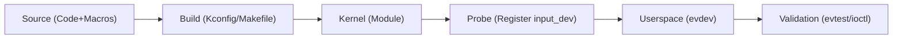
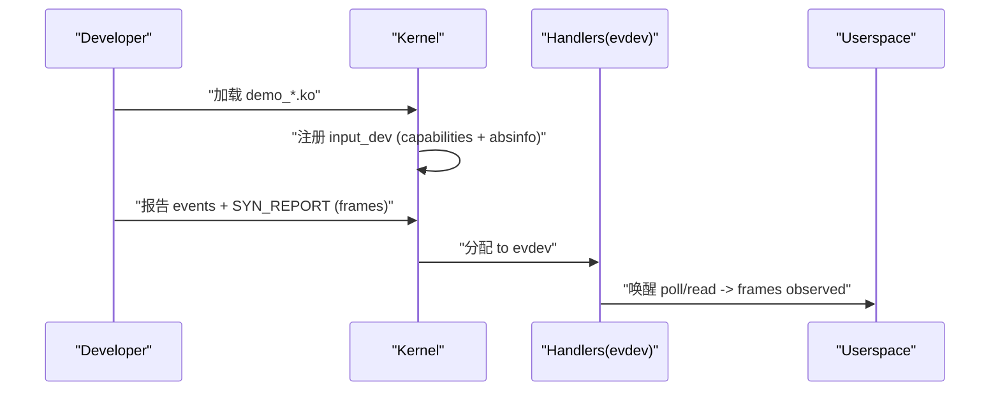

# 第 0 章　学前说明与成果物（环境、规范、交付物）

## 0.1　章节引入 / 背景 / 本章目标

- **为什么要有本章**：把后续所有示例“跑得起来、测得出来、比得清楚”，必须先把**环境、工具、代码风格、命名规范、验收口径**统一，否则同样代码在不同平台观测结果不一致，难以复现。
- **本章目标**
  1. 固定**最小可行环境**（内核版本/工具/用户态验证链）。
  2. 统一**写作与编码规范**（K&R/tab=4、中文注释、**具名宏/常量带单位后缀**）。
  3. 交付**模板工程骨架**（Kconfig/Makefile/目录结构），确保后续章节的驱动与用例“即插即跑”。
  4. 给出**验收清单**与**常见故障口径**，便于定位问题。

------

## 0.2　数据结构视角（本章涉及的核心对象与术语范围）

- **Linux 内核对象**：
  - `"input_dev"`：输入设备抽象（后续所有驱动围绕它注册/上报）。
  - `"absinfo"`：绝对轴参数集合（`min/max/fuzz/flat/res`）。
- **用户态对象**：
  - `"evdev"`：统一事件接口（`/dev/input/eventX`）。
  - `"ioctl EVIOCGABS"`：读取轴参数（用户态看到与驱动声明一致的元数据）。
- **上下文语义**：
  - **采集可睡**（I²C/SPI/ADC 等总线访问）；**上报不睡**（`input_report_*()`/`input_sync()` IRQ-safe）。
- **本文默认范围**：Linux **6.1+**；多点触控按 **MT Protocol B**；示例平台以 **x86_64（快速验证）** 与 **i.MX6ULL（嵌入式）** 为主。

------

## 0.3　开发者视角（工具链、目录、风格与命名规范）

- **主机环境**

  - Ubuntu 22.04/24.04 或等价发行版；Root 权限可用。
  - 内核头文件（与运行内核匹配）：`linux-headers-$(uname -r)` 或自编译内核的 `build/`。
  - 用户态工具：`evtest`（必装），`libinput-tools`（可选），`strace`（可选）。

- **交叉编译（可选）**

  - i.MX6ULL：`arm-none-linux-gnueabihf-` 工具链；内核源码与 `ARCH=arm CROSS_COMPILE=` 配置齐备。

- **工程目录结构（模板）**

  ```
  input-notes/
  ├─ drivers/
  │  ├─ demo_cap_touch/           # 触摸屏完整示例（I2C，MT-B）
  │  └─ demo_adc_joystick/        # ADC 摇杆完整示例
  ├─ common/                       # 共享头文件/宏命名规范
  ├─ out-of-tree/                  # OOT 构建模板（快速试验）
  ├─ tools/                        # 测试脚本（evtest 执行、ioctl 读取）
  └─ docs/                         # 本书章节与图示
  ```

- **编码/注释与命名规范**（全书统一，默认不再赘述）

  - **K&R 风格、tab=4**、≤80 列；中文注释。
  - **禁止魔法数字**：任何具有现实语义的数值**一律用具名宏/常量**，并在名称中体现单位：
    - `*_PX`（像素）、`*_MM`（毫米）、`*_CNT`（计数/码值）、`*_HZ`（频率）、`*_MS`（时间毫秒）、`*_US`（微秒）、`*_PCT`（百分比）等。
  - 示例命名前缀统一：**`demo_\*`**（驱动文件、Kconfig 符号、结构体/函数/字符串等）。
  - devres 与非 devres**同时给出**（对比释放语义与适用场景）。

------

## 0.4　用户 / 平台视角（运行与验证的统一口径）

- **最小运行路径（x86_64）**
  1. 构建 OOT 模块：`make -C /lib/modules/$(uname -r)/build M=$PWD/out-of-tree/ modules`
  2. 插入模块：`sudo insmod hello_input_mt.ko`（或触摸/摇杆 demo）
  3. 查设备：`cat /proc/bus/input/devices`（确定 `eventX`）
  4. 观察：`sudo evtest /dev/input/eventX`（必须看到**按帧输出**与 `SYN_REPORT` 边界）
- **嵌入式平台（i.MX6ULL）**
  - 确保设备树 I²C/ADC/IRQ 正确，内核 `CONFIG_INPUT_*` 相关选项开启；交叉编译并部署到目标板。
- **故障收敛口径**
  - **慢拖“台阶感”**：`*_FUZZ_*` 过大（input core 在丢小变化）。
  - **边缘提前顶到头**：`*_MIN/MAX_*` 设窄（input core 在钳位）。
  - **半帧/错乱**：上报未按“先事件→再帧结束”的顺序；多点未做 MT 帧同步。
  - **休眠异常 I²C**：未先 `disable_irq_sync()` 就断电（并发顺序错误）。

------

## 0.5　可视化图示（开发-部署-验证流水线）




------

## 0.6　示例代码（工程骨架与 OOT 构建模板）

**`out-of-tree/Makefile`（OOT 最小模板）**

```make
# 统一以具名宏控制编译开关，避免裸常量
obj-m += hello_input_mt.o
KDIR  ?= /lib/modules/$(shell uname -r)/build
PWD   := $(shell pwd)

all:
	$(MAKE) -C $(KDIR) M=$(PWD) modules
clean:
	$(MAKE) -C $(KDIR) M=$(PWD) clean
```

**具名宏规范示例（公共头 `common/demo_units.h`）**

```c
/* 统一的单位化命名，禁止魔法数字 */
#define DEMO_FUZZ_1PX               1
#define DEMO_FRAME_INTERVAL_200MS   200
#define DEMO_TOUCH_W_800PX          800
#define DEMO_TOUCH_H_480PX          480
```

> 说明：本章仅提供骨架与**单位化宏示例**；真正的“最小可跑虚拟设备”与“完整触摸/摇杆驱动”在第 1 章与案例章节给出，并严格遵循本章规范。

------

## 0.7　调试与验证（安装、命令与预期输出）

- **安装工具**
  - Debian/Ubuntu：`sudo apt install evtest libinput-tools`
- **关键命令**
  - 枚举：`cat /proc/bus/input/devices`
  - 事件：`sudo evtest /dev/input/eventX`
  - 读取轴参数：`sudo libinput debug-events`（桌面环境）或用自备 `ioctl` 小工具读取 `EVIOCGABS`。
- **预期**
  - 设备具备 `ABS_MT_POSITION_X/Y`（触摸）或 `ABS_X/Y`（摇杆）；`Prop=...DIRECT`（触摸）或相对属性（鼠标）。
  - `EVIOCGABS` 返回的 `min/max/fuzz/flat/res` 与驱动中**具名宏**一致。

------

## 0.8　小结（与后续章节衔接）

- **规约已定**：环境、工具、目录、风格、**单位化宏命名**全部固定；后续所有代码默认遵循，不再重复说明。
- **验收口径已定**：以 `evtest` 的**帧**（`SYN_REPORT`）为基本观测单位；以 `EVIOCGABS` 校验**物理语义**是否正确下发。
- **下一步**：进入**第 1 章**，从“真实痛点”切入，先用**虚拟最小示例**把“帧/边界/抑抖/钳位”的**作用与定位**跑通，再按大纲逐条深解 API（能力声明→绝对轴参数族→MT→上报→生命周期/并发→用户态验证）。

（本章完）