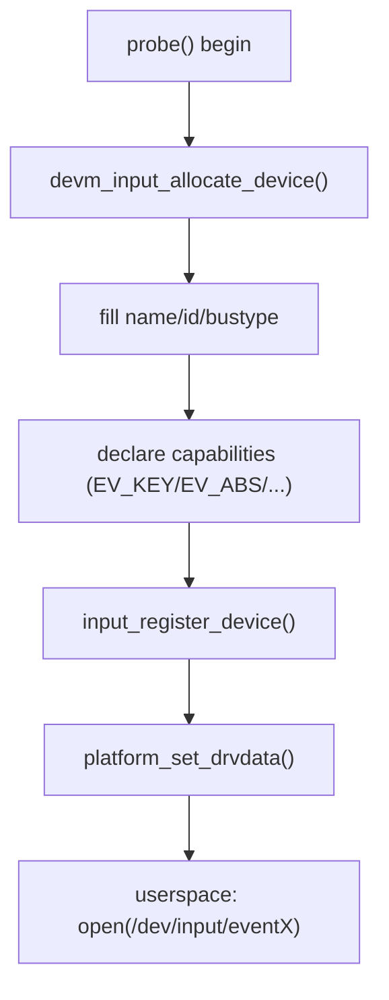
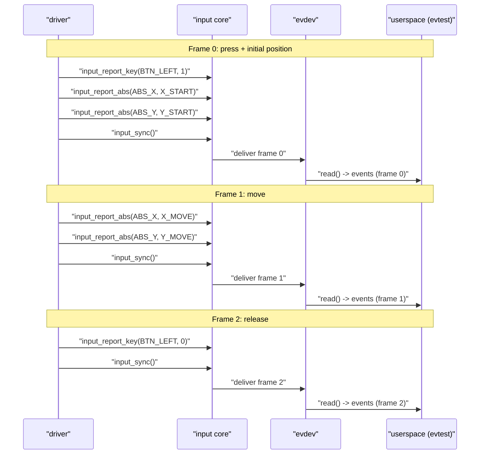

# 第 3 章 “先跑起来”：最小可运行输入设备（Hello, Input）

> **章节内容说明**
>  本章只做一件事：构造一个**完全不依赖真实硬件**、但能被内核识别、能被 `evtest` 打开、并可在后续章节中轻松插入真实采集逻辑的“最小输入设备”。
>  这一章的输出可以直接作为你之后所有输入类驱动的骨架模板：先把虚拟设备跑起来，再把真实数据“填进去”。

------

## 3.1 目标与边界：什么叫“最小可运行输入设备”？

### 3.1.1 是什么（定义）

**最小可运行输入设备**，在本章中指： 

1. 内核中存在一个 `struct input_dev` 实例；
2. 已通过 `input_register_device()` 注册；
3. 在 `/proc/bus/input/devices` 中能看到它；
4. 在 `/dev/input/eventX` 中有对应节点，能被 `evtest` 正常 `open()`；
5. 具备至少一种事件能力（例如一个按键 `EV_KEY + KEY_ENTER`）；
6. 上报路径可以调用 `input_report_key()` / `input_sync()` 完成一帧上报。

本章暂时**不要求**：

- 绑定真实硬件总线（I²C/SPI/ADC 等）；
- 处理中断、workqueue 和 PM；
- 做噪声抑制、越界钳位。

这些会在后续章节扩展。本章只解决一个问题：**把 Input 框架“点亮”，形成可观测的基本管线**。

------

### 3.1.2 干什么（要解决的问题）

从开发者视角，本章要解决的典型问题是：

- “我写了 input 驱动，`evtest` 打不开设备 / 打开但没事件。”
- “我不知道 Input Core 这一层到底要我至少做什么。”
- “我想先把 Input 路径打通，再慢慢把硬件搬上来。”

因此我们约定：

> **所有后续输入类驱动，第一步都先把本章的最小模板跑通。**

------

### 3.1.3 怎么实现（机制层面的最小要求）

要让一个 input 设备真正“存在”于系统中，**内核侧的最小路径**只有三步：

1. **分配一个 `struct input_dev`：**
   - `input_allocate_device()` 或 `devm_input_allocate_device()`
2. **在这个结构体上填入最基本的元数据与能力：**
   - `name` / `id.bustype` 等标识信息；
   - 能力位：`input_set_capability()` 或直接 `__set_bit()`；
   - 如有需要，配置绝对轴参数 `input_set_abs_params()`。
3. **注册到 input core：**
   - `input_register_device()`
      成功后，evdev/mousedev/joydev 等处理层为其创建对应的字符设备节点。

只要这三步做对，哪怕你暂时不采样任何真实数据，这个 input 设备都已经是“可运行”的。

------

## 3.2 数据结构视角：最小 `input_dev` 要填哪些字段？

本节只看一件事：**在一个“最小可用”的 `struct input_dev` 上，必须填哪些内容**，否则即使注册成功也几乎无法调试或使用。

### 3.2.1 关键字段与“四连问”表（作用 / 场景 / 不写后果 / 驱动落点）

| 项目                        | 作用                                     | 典型使用场景                     | 不写 / 写错的后果                                 | 驱动落点                                           |
| --------------------------- | ---------------------------------------- | -------------------------------- | ------------------------------------------------- | -------------------------------------------------- |
| `name`                      | 设备名称，用户态识别                     | `evtest` / `libinput` 列表中展示 | 只能看到无意义名字，难以区分                      | `input_dev->name = "xxx"`                          |
| `phys`                      | 物理路径字符串                           | 复杂拓扑调试                     | 可选，不写影响较小                                | `input_dev->phys = "xxx/input0"`                   |
| `id.bustype`                | 总线类型                                 | 区分 USB/PCI/VIRTUAL 等          | 用户态可能根据 bustype 做策略；不写会退化为默认值 | `input_dev->id.bustype = BUS_VIRTUAL` 等           |
| `id.vendor/product/version` | 设备标识                                 | 模拟真实硬件或厂商特定策略       | 不写不会影响基本功能，但不规范                    | 统一用具名宏设置                                   |
| `evbit`                     | 支持哪些 event type                      | 宣告 EV_KEY / EV_ABS / EV_REL 等 | 不设置对应 EV 类型，则下属事件完全无效            | 通常由 `input_set_capability()` 间接设置           |
| `keybit`/`absbit` 等        | 支持具体 code                            | KEY_ENTER / ABS_X 等             | 对应事件完全不会被 core 接受                      | 由 `input_set_capability()` 或 `__set_bit()` 设置  |
| `open`/`close`              | 第一次/最后一次被用户态打开/关闭时的回调 | 打开中断、启动采集线程等         | 可选；最小设备可以不实现                          | 后续真实驱动会用到                                 |
| `dev.parent`                | 绑定物理 `struct device`                 | 形成正确 sysfs 拓扑              | 不绑定时功能仍可用但结构不规范                    | platform/i2c/spi 驱动中一般设置为底层 `&pdev->dev` |

**结论：**

> 对于“最小可运行输入设备”，**必填项**至少包括：
>  `name`、`id.bustype`、`evbit` + 对应的 `keybit/absbit/...`。
>  其它字段为“规范增强项”，在本章中可以按简化版本处理。

------

### 3.2.2 能力位的最小声明模式

为了统一后续书稿，本书对“能力声明”采用如下模式：

1. 优先使用 `input_set_capability()`：
   - 它会自动设置 `evbit` 和对应的 `keybit/absbit/...`；
   - 语义清晰，错误概率低。
2. 如需批量设置或做特殊行为，可以在理解其语义后手动 `__set_bit()`，但本章不鼓励。

最小设备例子（仅声明一个按键）：

```c
input_set_capability(dev, EV_KEY, KEY_ENTER);
```

这行的含义是：

- 在 `dev->evbit` 中设置 EV_KEY；
- 在 `dev->keybit` 中设置 KEY_ENTER；
- 自此以后，`input_report_key(dev, KEY_ENTER, 1/0)` 才会生效。

------

## 3.3 开发者视角：最小设备注册三件套（allocate → setup → register）

本节从**“怎么写”**的角度，给出**模块形式**与**platform driver 形式**的最小模板，并对 devres / 非 devres 的差异做精确说明。

------

### 3.3.1 三件套概览（抽象步骤）

对于任意 input 驱动，最小的 probe 或 init 流程可以抽象为：

1. **allocate：**
   - 没有 `struct device` 或写简单模块 → `input_allocate_device()`；
   - 在 platform/i2c/spi 驱动里 → 推荐 `devm_input_allocate_device()`。
2. **setup（填充）：**
   - 填写 `name`、`id.bustype` 等元信息；
   - 用 `input_set_capability()` 声明能力位；
   - 如需要，调用 `input_set_abs_params()` 声明绝对轴参数。
3. **register：**
   - 调用 `input_register_device()`；
   - 成功后 evdev 自动创建 `/dev/input/eventX`。

**任何一处失败，都不能继续执行后续步骤。**

------

### 3.3.2 四连问版解读（三件套逐项）

#### 3.3.2.1 `input_allocate_device()` / `devm_input_allocate_device()`

- **作用：** 分配并初始化 `struct input_dev`，设置内部锁、回调默认值等；
- **使用场景：** 所有 input 驱动都必须通过这两个 API（之一）分配设备；
- **不写 / 写错的后果：**
  - 若用 `kzalloc(sizeof(*dev), GFP_KERNEL)` 自己造对象，将缺少 core 所需初始化，`input_register_device()` 会执行未定义行为；
- **驱动落点：**
  - 模块式虚拟设备：`demo_input_init()` 中使用 `input_allocate_device()`；
  - platform 驱动：`demo_probe()` 中使用 `devm_input_allocate_device(&pdev->dev)`。

#### 3.3.2.2 能力与元数据声明（`input_set_capability()` 等）

- **作用：** 告诉 Input Core 该设备支持哪些类型的事件、哪些 code；
- **典型场景：**
  - 单按键：`EV_KEY + KEY_ENTER`；
  - 简单摇杆：`EV_ABS + ABS_X/ABS_Y`；
- **不写 / 写错后果：**
  - 对应的 `input_report_*()` 调用将被 core 直接丢弃，用户态无任何事件；
- **驱动落点：**
  - 必须在 `input_register_device()` 前完成，放在 probe/init 的中间位置。

#### 3.3.2.3 `input_register_device()`

- **作用：** 将 `input_dev` 注册到 Input Core，并为其创建处理层设备节点；
- **使用场景：** 所有 input 驱动的最后一步；
- **不写 / 写错后果：**
  - 设备不会出现在 `/proc/bus/input/devices`；
  - `/dev/input/eventX` 不会被创建，即便你调用 `input_report_key()` 也没有任何消费者；
- **驱动落点：**
  - probe/init 的最后一步；
  - 成功后，你才能谈“上报 3 帧事件”“evtest 验收”。

------

### 3.3.3 devres 与非 devres：精确差异与推荐写法

#### 3.3.3.1 非 devres 写法（模块 / 早期代码常见）

- **分配：** `input_allocate_device()`；
- **释放：**
  - 注册前失败：`input_free_device()`；
  - 注册成功后：`input_unregister_device()`（会内部释放结构体）。

特点：

- 所有退出路径都要自己写，容易漏；
- 适合简单模块、教学 demo 或无 `struct device` 场景。

#### 3.3.3.2 devres 写法（推荐做法）

在 platform/i2c/spi 等驱动中，推荐：

- **分配：** `devm_input_allocate_device(&pdev->dev)`；
- **释放：**
  - probe 返回错误时，无需手动释放，devres 会在 probe 失败回滚时自动清理；
  - 正常 remove 时，调用 `input_unregister_device()` 解除注册；释放仍由 devres 负责。

> **注意：**
>  截止到 Linux 6.1 LTS，没有 `devm_input_register_device()`。
>  因此推荐模式是：**devm 分配 + 普通 `input_register_device()` 注册**。

------

### 3.3.4 可视化：probe 中的最小流程



------

### 3.3.5 示例代码（最小注册骨架）

> 本小节只给“注册骨架”，不实现上报逻辑。
>  上报虚拟 3 帧事件（按下→移动→抬起）将在后续 3.4 单独展开。

#### 3.3.5.1 模块形式：纯虚拟最小输入设备（非 devres）

```c
// SPDX-License-Identifier: GPL-2.0
// demo_minimal_input.c
// 纯虚拟最小输入设备（模块形式，非 devres）

#include <linux/module.h>
#include <linux/input.h>

#define DEMO_VENDOR_ID			0x0001
#define DEMO_PRODUCT_ID			0x0001
#define DEMO_VERSION_ID			0x0001

#define DEMO_KEY_MAIN			KEY_ENTER

static struct input_dev *demo_input_dev;

static int __init demo_input_init(void)
{
	int ret;

	/* 分配 input_dev 结构体 */
	demo_input_dev = input_allocate_device();
	if (!demo_input_dev)
		return -ENOMEM;

	/* 填写基本标识信息 */
	demo_input_dev->name = "demo_minimal_input";
	demo_input_dev->phys = "demo/input0";

	demo_input_dev->id.bustype = BUS_VIRTUAL;
	demo_input_dev->id.vendor = DEMO_VENDOR_ID;
	demo_input_dev->id.product = DEMO_PRODUCT_ID;
	demo_input_dev->id.version = DEMO_VERSION_ID;

	/* 声明能力：一个按键 KEY_ENTER */
	input_set_capability(demo_input_dev, EV_KEY, DEMO_KEY_MAIN);

	/* 注册到 input core */
	ret = input_register_device(demo_input_dev);
	if (ret) {
		/* 注册失败时需要手动释放结构体 */
		input_free_device(demo_input_dev);
		demo_input_dev = NULL;
		return ret;
	}

	pr_info("demo_minimal_input: registered\n");

	return 0;
}

static void __exit demo_input_exit(void)
{
	if (demo_input_dev)
		input_unregister_device(demo_input_dev);
	/* 注意：input_unregister_device() 内部会释放 demo_input_dev */
	pr_info("demo_minimal_input: unregistered\n");
}

module_init(demo_input_init);
module_exit(demo_input_exit);

MODULE_AUTHOR("demo");
MODULE_DESCRIPTION("Demo minimal input device (module, non-devres)");
MODULE_LICENSE("GPL");
```

要点：

- `input_register_device()` 成功后，后续不能再调用 `input_free_device()`，而是用 `input_unregister_device()`；
- 失败路径中，必须成对调用 `input_free_device()`。

------

#### 3.3.5.2 platform driver 形式：devres + 普通注册

```c
// SPDX-License-Identifier: GPL-2.0
// demo_minimal_input_platform.c
// 最小输入设备骨架（platform driver，devres + 非 devres 注册）

#include <linux/module.h>
#include <linux/platform_device.h>
#include <linux/input.h>

#define DEMO_VENDOR_ID			0x0001
#define DEMO_PRODUCT_ID			0x0002
#define DEMO_VERSION_ID			0x0001

#define DEMO_KEY_MAIN			KEY_ENTER

struct demo_input_data {
	struct input_dev	*input;
};

static int demo_input_probe(struct platform_device *pdev)
{
	struct demo_input_data *data;
	struct input_dev *input;
	int ret;

	/* 分配私有数据结构（devres 管理） */
	data = devm_kzalloc(&pdev->dev, sizeof(*data), GFP_KERNEL);
	if (!data)
		return -ENOMEM;

	/* 分配 input_dev（devres 管理） */
	input = devm_input_allocate_device(&pdev->dev);
	if (!input)
		return -ENOMEM;

	/* 填写标识信息 */
	input->name = "demo_minimal_input_platform";
	input->phys = "demo/input0";

	input->id.bustype = BUS_HOST;
	input->id.vendor = DEMO_VENDOR_ID;
	input->id.product = DEMO_PRODUCT_ID;
	input->id.version = DEMO_VERSION_ID;

	/* 声明能力：一个按键 KEY_ENTER */
	input_set_capability(input, EV_KEY, DEMO_KEY_MAIN);

	/* 注册设备（注意：6.1 无 devm_input_register_device） */
	ret = input_register_device(input);
	if (ret) {
		dev_err(&pdev->dev, "input_register_device failed: %d\n", ret);
		/*
		 * 此时无需手工释放 input，probe 返回失败后
		 * devres 会回滚 devm_input_allocate_device()。
		 */
		return ret;
	}

	data->input = input;
	platform_set_drvdata(pdev, data);

	dev_info(&pdev->dev, "demo minimal input (platform) registered\n");

	return 0;
}

static int demo_input_remove(struct platform_device *pdev)
{
	struct demo_input_data *data = platform_get_drvdata(pdev);

	if (data && data->input)
		input_unregister_device(data->input);

	/*
	 * input 结构体内存释放由 devres 负责，
	 * 这里不需要手动 kfree/put_device。
	 */
	dev_info(&pdev->dev, "demo minimal input (platform) removed\n");

	return 0;
}

/* 简单的虚拟 platform 设备/驱动匹配 */

static struct platform_driver demo_input_driver = {
	.probe		= demo_input_probe,
	.remove		= demo_input_remove,
	.driver		= {
		.name	= "demo_minimal_input",
	},
};

module_platform_driver(demo_input_driver);

MODULE_AUTHOR("demo");
MODULE_DESCRIPTION("Demo minimal input device (platform, devres)");
MODULE_LICENSE("GPL");
```

------

### 3.3.6 调试与验证（模块 / platform 通用）

1. **加载模块后检查：**

```sh
cat /proc/bus/input/devices
```

预期看到一项类似：

```
N: Name="demo_minimal_input"
P: Phys=demo/input0
S: Sysfs=/devices/...
B: EV=01
B: KEY=...00010000  # 包含 KEY_ENTER 对应位
```

1. **查找 event 节点：**

```sh
ls -l /dev/input/event*
```

1. **使用 evtest 打开：**

```sh
evtest /dev/input/eventX
```

此时即使没有上报任何事件，只要 `evtest` 能正常 `open()` 且不报错，说明本章的“最小三件套”已经成功。

------

### 3.3.7 小结与下一步衔接

本节完成了以下目标：

- 从 **数据结构** 上明确了最小 `input_dev` 需要填哪些字段；
- 从 **开发者视角** 给出了 allocate → setup → register 的通用三步；
- 精确区分了 **非 devres** 与 **devres + 非 devres 注册** 的写法，并修正了错误释放方式；
- 提供了**模块形式**与**platform driver 形式**两套可直接编译的骨架代码。

下一小节（3.4 起）将在这个骨架上增加：

> **一组“虚拟 3 帧事件”：按下 → 移动（ABS）→ 抬起**，
>  并重点讲清楚：
>
> - “上报不睡”的约束；
> - 帧结束语义：`SYN_REPORT` 的位置与作用；
> - 如何用 `evtest` 实际观测这 3 帧。


------

## 3.4 3 帧虚拟事件：按下 → 移动 → 抬起

> 本节在上一节“最小设备注册三件套”的基础上，**让设备真正产生事件帧**。
>  我们会构造一个纯虚拟的 3 帧序列：
>  1 帧按下、1 帧移动、1 帧抬起，并通过 `evtest` 在用户态完整观察。

------

### 3.4.1 是什么：Input 的“帧”与 `struct input_event`

内核向用户态上报事件的最小单元是：

```c
struct input_event {
	struct timeval	time;
	__u16		type;
	__u16		code;
	__s32		value;
};
```

其中：

- `type`：事件类型，如 `EV_KEY`、`EV_ABS`、`EV_SYN`；
- `code`：事件 code，如 `KEY_ENTER`、`ABS_X`、`SYN_REPORT`；
- `value`：事件值，如按键按下/抬起（1/0），坐标值等。

**一帧（frame）** 的语义是：

> “一组属于同一时刻或同一逻辑操作的若干 `input_event`，以 `EV_SYN/SYN_REPORT` 结尾。”

例如，一个典型的“按下并移动一次”的帧可以是：

1. `EV_KEY  BTN_LEFT  1`（按下）
2. `EV_ABS  ABS_X    100`
3. `EV_ABS  ABS_Y    200`
4. `EV_SYN  SYN_REPORT  0`（帧结束）

------

### 3.4.2 要干什么：构造 3 帧虚拟序列

本节我们构造一个**纯虚拟**的 3 帧序列，用一个内核延迟工作（`delayed_work`）在模块加载后自动上报：

| 帧号 | 语义          | 事件内容（示例）                                             |
| ---- | ------------- | ------------------------------------------------------------ |
| 0    | 按下 + 初始点 | `BTN_LEFT` 按下 + `(x, y) = (X_START, Y_START)` + `SYN_REPORT` |
| 1    | 移动          | `BTN_LEFT` 仍为按下状态 + 坐标移动到 `(X_MOVE, Y_MOVE)` + `SYN_REPORT` |
| 2    | 抬起          | `BTN_LEFT` 抬起 + 坐标不变 + `SYN_REPORT`                    |

通过 `evtest` 可以观察到：

- 第 0 帧出现 KEY 与 ABS 一组事件；
- 第 1 帧只有 ABS 更新；
- 第 2 帧 KEY 变为 0（抬起）。

------

### 3.4.3 怎么实现：上报路径“不睡”的设计

#### 3.4.3.1 “采集可睡、上报不睡”的具体含义

- **采集可睡**：从硬件读取数据（I²C、SPI、ADC 等）可以在进程上下文中使用可睡眠 API；
- **上报不睡**：从 `input_report_*()` 到 `input_sync()` 的路径内部不睡眠，可以在 IRQ、softirq、workqueue、进程上下文中被调用。

在本节的纯虚拟设备中：

- **没有真实采集**，因此我们只需要关心“上报不睡”；
- 我们用 `delayed_work` 定期调度，工作函数可以睡，但在调用 `input_report_*()` 本身不睡。

#### 3.4.3.2 上报序列的一般模式

1. 在某个上下文（IRQ、workqueue、线程等）中获得一组样本；
2. 按顺序调用对应的 `input_report_key()` / `input_report_abs()` 等；
3. 调用 `input_sync()` 结束当前帧。

伪代码模式：

```c
/* 上报一帧：某个上下文里，不睡 */
input_report_key(dev, BTN_LEFT, pressed);
input_report_abs(dev, ABS_X, x);
input_report_abs(dev, ABS_Y, y);
input_sync(dev);
```

------

### 3.4.4 可视化：3 帧序列的时序

#### 3.4.4.1 驱动到用户态的时序图



------

### 3.4.5 示例代码：模块形式，加载后自动上报 3 帧

> 说明：
>
> - 基于前面 3.3 的“模块形式最小设备”，在此基础上增加 ABS 轴与 3 帧上报逻辑；
> - 使用 `delayed_work` 控制 3 帧的时间间隔；
> - 所有具有物理含义的数值使用具名宏，带单位后缀。

```c
// SPDX-License-Identifier: GPL-2.0
// demo_minimal_input_frames.c
// 纯虚拟输入设备：加载后自动上报 3 帧（按下 → 移动 → 抬起）

#include <linux/module.h>
#include <linux/input.h>
#include <linux/workqueue.h>
#include <linux/jiffies.h>

/* 设备标识宏 */
#define DEMO_VENDOR_ID			0x0001
#define DEMO_PRODUCT_ID			0x0003
#define DEMO_VERSION_ID			0x0001

/* 事件含义宏 */
#define DEMO_BTN_MAIN			BTN_LEFT

#define DEMO_KEY_PRESSED		1
#define DEMO_KEY_RELEASED		0

/* 绝对坐标参数（单位：像素 PX） */
#define DEMO_ABS_X_MIN_PX		0
#define DEMO_ABS_X_MAX_PX		1920
#define DEMO_ABS_Y_MIN_PX		0
#define DEMO_ABS_Y_MAX_PX		1080

#define DEMO_ABS_FUZZ_PX		0
#define DEMO_ABS_FLAT_PX		0
#define DEMO_ABS_RES_PX_PER_MM		10

/* 三帧坐标点（单位：像素 PX） */
#define DEMO_POS_X_START_PX		100
#define DEMO_POS_Y_START_PX		100

#define DEMO_POS_X_MOVE_PX		400
#define DEMO_POS_Y_MOVE_PX		300

/* 帧间隔（单位：毫秒 MS） */
#define DEMO_FRAME_INTERVAL_MS		500

/* 帧数量 */
#define DEMO_FRAME_COUNT_MAX		3U

struct demo_frame_context {
	struct input_dev	*input;
	struct delayed_work	work;
	unsigned int		frame_idx;
};

static struct demo_frame_context demo_ctx;

/* 上报一帧虚拟事件 */
static void demo_report_frame(struct demo_frame_context *ctx,
			      unsigned int frame_idx)
{
	struct input_dev *input = ctx->input;

	switch (frame_idx) {
	case 0:
		/* 帧 0：按下 + 初始坐标 */
		input_report_key(input, DEMO_BTN_MAIN, DEMO_KEY_PRESSED);
		input_report_abs(input, ABS_X, DEMO_POS_X_START_PX);
		input_report_abs(input, ABS_Y, DEMO_POS_Y_START_PX);
		break;
	case 1:
		/* 帧 1：保持按下，移动到新坐标 */
		input_report_abs(input, ABS_X, DEMO_POS_X_MOVE_PX);
		input_report_abs(input, ABS_Y, DEMO_POS_Y_MOVE_PX);
		break;
	case 2:
		/* 帧 2：抬起，坐标保持不变 */
		input_report_key(input, DEMO_BTN_MAIN, DEMO_KEY_RELEASED);
		break;
	default:
		return;
	}

	/* 一帧结束，提交 EV_SYN/SYN_REPORT */
	input_sync(input);
}

/* 延迟工作处理函数：按顺序上报 3 帧 */
static void demo_work_func(struct work_struct *work)
{
	struct demo_frame_context *ctx;

	ctx = container_of(to_delayed_work(work),
			   struct demo_frame_context, work);

	if (ctx->frame_idx >= DEMO_FRAME_COUNT_MAX)
		return;

	demo_report_frame(ctx, ctx->frame_idx);
	ctx->frame_idx++;

	if (ctx->frame_idx < DEMO_FRAME_COUNT_MAX) {
		schedule_delayed_work(&ctx->work,
				      msecs_to_jiffies(DEMO_FRAME_INTERVAL_MS));
	}
}

static struct input_dev *demo_input_dev;

static int __init demo_input_frames_init(void)
{
	int ret;

	/* 分配 input_dev */
	demo_input_dev = input_allocate_device();
	if (!demo_input_dev)
		return -ENOMEM;

	/* 填写标识信息 */
	demo_input_dev->name = "demo_minimal_input_frames";
	demo_input_dev->phys = "demo/input0";

	demo_input_dev->id.bustype = BUS_VIRTUAL;
	demo_input_dev->id.vendor = DEMO_VENDOR_ID;
	demo_input_dev->id.product = DEMO_PRODUCT_ID;
	demo_input_dev->id.version = DEMO_VERSION_ID;

	/* 声明能力：按键 + 绝对轴 X/Y */
	input_set_capability(demo_input_dev, EV_KEY, DEMO_BTN_MAIN);

	input_set_abs_params(demo_input_dev, ABS_X,
			     DEMO_ABS_X_MIN_PX,
			     DEMO_ABS_X_MAX_PX,
			     DEMO_ABS_FUZZ_PX,
			     DEMO_ABS_FLAT_PX);

	input_set_abs_params(demo_input_dev, ABS_Y,
			     DEMO_ABS_Y_MIN_PX,
			     DEMO_ABS_Y_MAX_PX,
			     DEMO_ABS_FUZZ_PX,
			     DEMO_ABS_FLAT_PX);

	/* 注册到 input core */
	ret = input_register_device(demo_input_dev);
	if (ret) {
		input_free_device(demo_input_dev);
		demo_input_dev = NULL;
		return ret;
	}

	/* 初始化帧上下文与延迟工作 */
	demo_ctx.input = demo_input_dev;
	demo_ctx. 0;
	INIT_DELAYED_WORK(&demo_ctx.work, demo_work_func);

	/* 在模块加载后触发第 0 帧 */
	schedule_delayed_work(&demo_ctx.work,
			      msecs_to_jiffies(DEMO_FRAME_INTERVAL_MS));

	pr_info("demo_minimal_input_frames: registered, will emit 3 frames\n");

	return 0;
}

static void __exit demo_input_frames_exit(void)
{
	/* 停止延迟工作，避免退出时仍在上报 */
	cancel_delayed_work_sync(&demo_ctx.work);

	if (demo_input_dev)
		input_unregister_device(demo_input_dev);

	pr_info("demo_minimal_input_frames: unregistered\n");
}

module_init(demo_input_frames_init);
module_exit(demo_input_frames_exit);

MODULE_AUTHOR("demo");
MODULE_DESCRIPTION("Demo minimal input device with 3 virtual frames");
MODULE_LICENSE("GPL");
```

------

### 3.4.6 用 `evtest` 观察 3 帧

1. 编译并加载模块：

```sh
insmod demo_minimal_input_frames.ko
```

1. 找到对应的 event 节点：

```sh
cat /proc/bus/input/devices
# 找到 Name="demo_minimal_input_frames" 对应的 Handlers=eventX
```

1. 在终端运行：

```sh
evtest /dev/input/eventX
```

预期输出（省略时间）类似：

- **帧 0：**

```text
Event: type 01 (EV_KEY), code 272 (BTN_LEFT), value 1
Event: type 03 (EV_ABS), code 00 (ABS_X), value 100
Event: type 03 (EV_ABS), code 01 (ABS_Y), value 100
Event: type 00 (EV_SYN), code 00 (SYN_REPORT), value 0
```

- **帧 1：**

```text
Event: type 03 (EV_ABS), code 00 (ABS_X), value 400
Event: type 03 (EV_ABS), code 01 (ABS_Y), value 300
Event: type 00 (EV_SYN), code 00 (SYN_REPORT), value 0
```

- **帧 2：**

```text
Event: type 01 (EV_KEY), code 272 (BTN_LEFT), value 0
Event: type 00 (EV_SYN), code 00 (SYN_REPORT), value 0
```

------

### 3.4.7 小结

- 理解了 **帧（frame） = 多个 input_event + 一个 SYN_REPORT**；
- 用 3 帧虚拟序列把“按下 → 移动 → 抬起”完整走了一遍；
- 验证了“上报不睡”的调用路径；
- 提供了一个可直接编译、加载、用 `evtest` 观察的教学模块。


## 3.5 `EVIOCGABS` 与 ABS 元数据验收

> 目标：在前面 3.3 / 3.4 已经完成“最小设备 + 3 帧虚拟 ABS 事件”的基础上，本节给出**用户态验收方案**：
>  用 `EVIOCGABS` 读取 `ABS_X / ABS_Y` 的 `min/max/fuzz/flat/res` 等元数据，确认驱动里设置的参数已经正确暴露给用户态，并能长期作为后续触摸/摇杆驱动的自测模板。

------

### 3.5.1 是什么：ABS 元数据与 `EVIOCGABS`

#### 3.5.1.1 ABS 元数据的概念

对于所有 `EV_ABS` 类型的轴（如 `ABS_X`、`ABS_Y`、`ABS_PRESSURE`、`ABS_MT_POSITION_X` 等），Input Core 为每个轴维护一组**元数据**，包括：

- `minimum` / `maximum`：该轴的逻辑范围；
- `fuzz`：抖动阈值建议值；
- `flat`：静区/死区建议值；
- `resolution`：分辨率（每物理单位的步进数，如像素/mm）。

它们在驱动中通常通过：

```c
input_set_abs_params(dev, axis, min, max, fuzz, flat);
```

或直接写 `input_dev->absinfo[axis]` 来设置。

#### 3.5.1.2 `struct input_absinfo`

用户态通过 `EVIOCGABS` 读取的结构体是：

```c
struct input_absinfo {
	__s32 value;		/* 当前值 */
	__s32 minimum;
	__s32 maximum;
	__s32 fuzz;
	__s32 flat;
	__s32 resolution;
};
```

其中：

- `value`：最近一次上报的该轴值；
- 其它 5 个字段就是元数据本身。

#### 3.5.1.3 `EVIOCGABS` 是什么

`EVIOCGABS` 是 evdev 的一个 `ioctl`：

```c
int ioctl(int fd, EVIOCGABS(axis), struct input_absinfo *abs);
```

- `fd`：打开的 `/dev/input/eventX` 文件描述符；
- `axis`：`ABS_X` / `ABS_Y` 等；
- 返回 0 表示成功，`*abs` 中填入该轴的当前值与元数据。

------

### 3.5.2 干什么：为什么一定要验收 ABS 元数据？

在本书的 Input 模型里，**驱动只做“声明边界 + 成帧上报”，策略交给用户态**。
 ABS 元数据正是“声明边界”的关键部分：

1. **min/max：**
   - 用户态需要根据它们做坐标映射（如从设备坐标映射到屏幕坐标）；
   - 若驱动 min/max 设置错误，用户态的坐标变换就完全失真。
2. **fuzz：**
   - 建议抖动阈值；对 ADC 摇杆、触摸压力等意义重大；
   - 用户态可据此实现滤波，驱动不应该硬编码平滑策略。
3. **flat：**
   - 建议死区；典型例子是摇杆的机械中心附近；
   - 用户态可根据 flat 保证“略微抖动不认为移动”。
4. **resolution：**
   - 表示“每物理单位有多少计数步进”，可用于将 ABS 值转换为 mm 或度数等。

> 如果不验收这些元数据，只看事件流，就无法确认驱动是否正确公开了设备的能力边界。
>  对后续“触摸屏标定”“摇杆标定”“NFC 手势距离估计”等都非常不利。

------

### 3.5.3 怎么实现：内核中的数据路径示意

从驱动设置到用户态 `EVIOCGABS` 的路径大致是：


1. 驱动在 probe/init 中调用 `input_set_abs_params()` 或直接写 `dev->absinfo[axis]`；
2. `input_register_device()` 注册后，这些元数据保存在 `input_dev` 中，由 Input Core 管理；
3. evdev 处理层为每个 input_dev 创建 `/dev/input/eventX`；
4. 用户态对 `eventX` 执行 `ioctl(fd, EVIOCGABS(axis), &abs)`，由 evdev 读出 `input_dev->absinfo[axis]` 填入 `struct input_absinfo` 返回。

**关键点：**
 只要驱动里设置过 ABS 参数，evdev 一定能通过 `EVIOCGABS` 把这些参数“原样”暴露给用户态——这就是我们要验证的东西。

------

### 3.5.4 怎么用：用户态验收流程

给出一个标准的验收流程，默认你已经用上一节的 `demo_minimal_input_frames` 驱动跑起来了。

1. **确定设备节点：**

```sh
cat /proc/bus/input/devices
# 找到 Name="demo_minimal_input_frames" 的条目
# 记下 Handlers=eventX 中的 X
```

1. **使用 evtest 粗略查看（可选）**

```sh
evtest /dev/input/eventX
# evtest 会打印该设备 ABS 轴的 min/max/fuzz/flat，但不打印 resolution
```

1. **使用自写 C 程序，通过 `EVIOCGABS` 精确验证**
   - 将 `ABS_X` 与 `ABS_Y` 的 `minimum/maximum/fuzz/flat/resolution` 打印出来；
   - 与驱动中使用的具名宏逐项对比；
   - 如有不一致，说明驱动设置或移植有问题。

------

### 3.5.5 接口与结构速查表

#### 3.5.5.1 ioctl 宏

```c
int ioctl(int fd, EVIOCGABS(axis), struct input_absinfo *abs);
```

- **fd**：`open("/dev/input/eventX", O_RDONLY)` 返回的文件描述符；
- **axis**：一个 `ABS_*` 编号，如 `ABS_X`、`ABS_Y`；
- 返回值：`0` 成功，`-1` 失败（`errno` 提供错误原因）。

#### 3.5.5.2 `struct input_absinfo` 字段语义速查

| 字段         | 作用                   | 典型来源                              |
| ------------ | ---------------------- | ------------------------------------- |
| `value`      | 当前值                 | 最近一次 `input_report_abs()`         |
| `minimum`    | 逻辑最小值             | `input_set_abs_params()` 的 min       |
| `maximum`    | 逻辑最大值             | 同上                                  |
| `fuzz`       | 抖动建议值             | 同上                                  |
| `flat`       | 死区建议值             | 同上                                  |
| `resolution` | 分辨率（单位依轴而定） | 驱动直接写 `absinfo[axis].resolution` |

> 注意：`input_set_abs_params()` **不会** 自动设置 `resolution`，需要驱动手工填充。

------

### 3.5.6 对比 / 避坑 / 限制

1. **只用 evtest 不够精确：**
   - evtest 可以粗略显示 min/max/fuzz/flat，但不显示 resolution；
   - 且其输出不易被脚本直接解析；
      → 推荐用自己的 `EVIOCGABS` 小工具做 CI/回归测试。
2. **驱动忘记设置 ABS 参数：**
   - 如果只设置了能力位（`input_set_capability(dev, EV_ABS, ABS_X)`），却不调用 `input_set_abs_params()`，则：
     - `EVIOCGABS` 读到的 min/max 等字段可能是 0 或未初始化值；
     - 用户态会误判范围为 `[0, 0]` 或其它错误范围。
3. **resolution 的常见误解：**
   - resolution 的单位跟具体轴相关：
     - 对触摸坐标可能是“counts per mm”；
     - 对旋钮可能是“counts per degree”；
   - 这需要驱动和用户态协议好含义，本书建议命名中体现单位，如：
     - `DEMO_ABS_RES_PX_PER_MM`。
4. **TOCTOU 与当前 value：**
   - `absinfo.value` 是**当前值**，而不是“默认值”；
   - 在有真实硬件的驱动里，`EVIOCGABS` 读到的 value 会随着事件上报而变化；
   - 本节的虚拟驱动中，value 会随 3 帧虚拟事件变化。
5. **多点触控 MT 轴：**
   - 对 `ABS_MT_*` 一类轴，`EVIOCGABS` 读的是全局的该轴元数据，而不是 per-slot 值；
   - 在 MT-B 模式下，per-slot 状态要通过 `EVIOCGMTSLOTS` 等机制获取，属于后续章节内容，此处不展开。

------

### 3.5.7 完整示例：用户态 C 工具读取 `ABS_X/ABS_Y` 元数据

下面是一个可直接编译的用户态小工具，用来读取指定 event 设备上 `ABS_X` 与 `ABS_Y` 的 `struct input_absinfo` 内容，并打印出来，用于对比驱动中的宏。

> 说明：
>
> - 使用具名宏标记轴编号，但不硬编码 event 设备号；
> - 路径通过命令行传入，避免错误假设；
> - 输出包含 `value/min/max/fuzz/flat/resolution` 全部字段。

```c
/*
 * demo_evdev_absinfo.c
 * 使用 EVIOCGABS 读取 ABS_X / ABS_Y 元数据
 */

#include <stdio.h>
#include <stdlib.h>
#include <stdint.h>
#include <unistd.h>
#include <fcntl.h>
#include <errno.h>
#include <string.h>
#include <sys/ioctl.h>
#include <linux/input.h>

#define DEMO_AXIS_X			ABS_X
#define DEMO_AXIS_Y			ABS_Y

static int demo_print_absinfo(int fd, int axis, const char *axis_name)
{
	struct input_absinfo abs;
	int ret;

	memset(&abs, 0, sizeof(abs));

	ret = ioctl(fd, EVIOCGABS(axis), &abs);
	if (ret < 0) {
		fprintf(stderr, "ioctl(EVIOCGABS, %s) failed: %s\n",
			axis_name, strerror(errno));
		return -1;
	}

	printf("Axis %s (%d):\n", axis_name, axis);
	printf("  value      = %d\n", abs.value);
	printf("  minimum    = %d\n", abs.minimum);
	printf("  maximum    = %d\n", abs.maximum);
	printf("  fuzz       = %d\n", abs.fuzz);
	printf("  flat       = %d\n", abs.flat);
	printf("  resolution = %d\n", abs.resolution);

	return 0;
}

int main(int argc, char *argv[])
{
	const char *dev_path;
	int fd;
	int ret = 0;

	if (argc != 2) {
		fprintf(stderr, "Usage: %s /dev/input/eventX\n", argv[0]);
		return EXIT_FAILURE;
	}

	dev_path = argv[1];

	fd = open(dev_path, O_RDONLY);
	if (fd < 0) {
		fprintf(stderr, "open(%s) failed: %s\n",
			dev_path, strerror(errno));
		return EXIT_FAILURE;
	}

	printf("Reading ABS info from %s\n\n", dev_path);

	if (demo_print_absinfo(fd, DEMO_AXIS_X, "ABS_X") < 0)
		ret = 1;

	printf("\n");

	if (demo_print_absinfo(fd, DEMO_AXIS_Y, "ABS_Y") < 0)
		ret = 1;

	close(fd);

	return ret ? EXIT_FAILURE : EXIT_SUCCESS;
}
```

编译与使用：

```sh
gcc -Wall -O2 -o demo_evdev_absinfo demo_evdev_absinfo.c
./demo_evdev_absinfo /dev/input/eventX
```

在与 `demo_minimal_input_frames` 驱动配合使用时，预期输出应与驱动中的宏一致，例如：

- `minimum`/`maximum` 分别等于 `DEMO_ABS_X_MIN_PX` / `DEMO_ABS_X_MAX_PX`；
- `fuzz`/`flat` 等于 `DEMO_ABS_FUZZ_PX` / `DEMO_ABS_FLAT_PX`；
- `resolution` 等于驱动中为该轴设置的 `resolution` 值（如果你补上了）。

如有任何一项不一致，说明驱动设置有误或版本不一致，需要回到驱动中检查：

- 是否调用了 `input_set_abs_params()`；
- 是否在注册前修改了 `absinfo`；
- 是否有错误的 copy/paste。

------

### 3.5.8 小结：从“能看见事件”到“能信任元数据”

本节把前面的“最小设备 + 3 帧事件”向前推进了一步：

1. 从**事件流**上，验证驱动至少能正确上报帧（3.4 完成的事情）；
2. 从**元数据**上，用 `EVIOCGABS` 直接读取 `min/max/fuzz/flat/resolution`，验证驱动的声明是否可信；
3. 给出了一个**可编译用户态工具**，可以直接纳入你后续的 bring-up checklist 或 CI 流程中。

在后续章节（触摸屏、摇杆案例）里，我们会反复利用这个小工具，对每条 ABS 轴做系统性验收。
 到此为止，第 3 章的“Hello, Input”路径已经具备：

- 最小注册骨架（3.3）；
- 可观察的 3 帧事件（3.4）；
- 元数据验收工具（3.5）。


## 3.6 本章 Bring-up Checklist 与最小模板整理

> 本节把 **3.1～3.5** 的内容收束成一套“照着做就能跑通”的核对表与最小模板，便于你在真实项目里复用。
>  目标是：**从空目录开始，到能用 `evtest + EVIOCGABS` 验收**，步骤清晰、可脚本化。

------

### 3.6.1 Bring-up 步骤总览（一步步照做）

从零开始的推荐流程：

1. **准备内核模块工程目录**
   - 建一个子目录：`drivers/input/demo/hello_input/`（仅示例路径）；
   - 放入：
     - `demo_minimal_input_frames.c`（3.4 的内核模块）
     - `Kconfig` 片段
     - `Makefile` 片段
2. **在驱动中完成三件套注册（3.3 回顾）**
   - `input_allocate_device()` 或 `devm_input_allocate_device()`；
   - 填写 `name/id.bustype` 等基本信息；
   - 用 `input_set_capability()` 声明 `EV_KEY` / `EV_ABS` 等能力；
   - 必要时用 `input_set_abs_params()` 声明 `min/max/fuzz/flat`。
3. **实现“3 帧虚拟事件”上报（3.4 回顾）**
   - 构造一个 `struct delayed_work` 或定时器；
   - 在工作函数中按顺序调用：
     - 帧 0：按下 + 初始坐标 + `input_sync()`；
     - 帧 1：移动坐标 + `input_sync()`；
     - 帧 2：抬起 + `input_sync()`；
   - 确保上报路径中不调用可睡眠 API。
4. **编译并加载模块**
   - 在内核源码树中 `make modules`；
   - 使用 `insmod demo_minimal_input_frames.ko` 加载；
   - 用 `dmesg` 确认 printk 信息正常。
5. **使用 `evtest` 验收事件流**
   - 通过 `/proc/bus/input/devices` 找到 `Handlers=eventX`；
   - `evtest /dev/input/eventX`，确认出现 3 帧事件：按下 → 移动 → 抬起。
6. **使用 `EVIOCGABS` 验收 ABS 元数据（3.5 回顾）**
   - 编译用户态工具 `demo_evdev_absinfo`；
   - `./demo_evdev_absinfo /dev/input/eventX`；
   - 对比 `minimum/maximum/fuzz/flat/resolution` 是否与驱动中的具名宏一致。
7. **整理为模板**
   - 将驱动与用户态工具放进你的“Input 模板仓库”；
   - 后续真实驱动可以复制这套骨架，只替换：
     - 设备名、按键 code、ABS 范围；
     - 三帧虚拟事件替换为真实采集路径。

------

### 3.6.2 Bring-up 核对表（表格版）

以“本章完成度”为维度的核对表：

| 序号 | 检查项                                       | 期望结果                                               | 相关小节  |
| ---- | -------------------------------------------- | ------------------------------------------------------ | --------- |
| 1    | 驱动能成功插入（`insmod` 无报错）            | `dmesg` 中看到 `registered` 信息                       | 3.3 / 3.4 |
| 2    | `/proc/bus/input/devices` 中存在设备条目     | Name = `demo_minimal_input_frames` 或你自定义的名字    | 3.3       |
| 3    | 设备有 `Handlers=eventX`                     | 有一个 `eventX` 节点与之对应                           | 3.3       |
| 4    | `evtest` 能成功打开该 event 节点             | 无 “Inappropriate ioctl for device”等错误              | 3.4       |
| 5    | `evtest` 能看到 3 帧事件                     | 顺序为：按下 → 移动 → 抬起，每帧以 `SYN_REPORT` 结束   | 3.4       |
| 6    | `EVIOCGABS(ABS_X/ABS_Y)` 返回成功            | 用户态工具输出的 `minimum/maximum/...` 均为预期值      | 3.5       |
| 7    | 所有具现实语义的数值使用具名宏（带单位后缀） | 源码中不存在 `1920`、`1080` 这类裸数，而是 `*_PX` 常量 | 全章      |
| 8    | 上报路径未调用可睡 API                       | 可以在工作队列或 IRQ 中复用，无睡眠警告                | 3.4       |

> 当表中 1–8 项都通过时，可以认为 **“Hello, Input” 流水线已完整打通**，足以作为真实驱动的骨架。

------

### 3.6.3 最小 Kconfig / Makefile 模板（可直接合入内核树）

> 说明：这里给出的是“教学用子目录”的典型写法，你可以根据自己的工程结构调整路径与符号名称。
>  代码风格按照内核规范缩进。

#### 3.6.3.1 Kconfig 片段

```none
config INPUT_DEMO_MINIMAL_FRAMES
	tristate "Demo minimal input device with 3 virtual frames"
	depends on INPUT
	help
	  Say Y here if you want to build the demo minimal input driver
	  which registers a virtual input device and emits 3 frames
	  (press -> move -> release) after module load.

	  If unsure, say N.
```

将其包含到上一级 `Kconfig` 中，例如：

```none
source "drivers/input/demo/hello_input/Kconfig"
```

#### 3.6.3.2 Makefile 片段

```none
obj-$(CONFIG_INPUT_DEMO_MINIMAL_FRAMES)	+= demo_minimal_input_frames.o
```

上一级 Makefile 中加入：

```none
obj-$(CONFIG_INPUT)			+= demo/
```

再在 `drivers/input/demo/Makefile` 指向 `hello_input/`：

```none
obj-y					+= hello_input/
```

这样，你可以：

```sh
make menuconfig
# Device Drivers -> Input device support -> [*] Demo minimal input device with 3 virtual frames
make modules
```

再按前述步骤 `insmod`/`evtest`/`EVIOCGABS` 验证即可。

------

### 3.6.4 故障 → 定位表：从症状反推哪个环节没做对

这部分是最贴近实战的“反向表”：根据你在 bring-up 时遇到的表现，直接定位到具体环节。

| 症状                                                         | 可能原因                                                     | 对应修复位置                                                 |
| ------------------------------------------------------------ | ------------------------------------------------------------ | ------------------------------------------------------------ |
| `/proc/bus/input/devices` 中没有你的设备                     | `input_register_device()` 未被调用或返回错误；模块未加载成功 | 检查 probe/init 日志，确认返回值与 error path                |
| 有 Name/Handlers，但 `/dev/input/eventX` 不存在              | udev 未创建，或系统裁剪了 evdev；CONFIG_INPUT_EVDEV 未打开   | 确认内核配置与根文件系统；本书默认依赖 evdev                 |
| `evtest /dev/input/eventX` 提示 `Inappropriate ioctl for device` | 打开的节点不是 evdev 设备，比如 mousedev、jsdev 或其它字符设备 | `/proc/bus/input/devices` 中确认 Handlers 具体是 `eventX`    |
| `evtest` 能打开，但永远无事件                                | 未调用 `input_report_*()` 或未调用 `input_sync()`，或者未声明对应能力位 | 回到 3.3/3.4，核查能力位声明及帧上报逻辑                     |
| `evtest` 事件出现，但 `EVIOCGABS` 读取 min/max 等为 0        | 驱动没有调用 `input_set_abs_params()` 设置 ABS 参数          | 回到 3.4/3.5，检查 ABS 参数部分                              |
| 用户态工具读取 ABS 时 `ioctl` 报错 `EINVAL`                  | 对某个未声明的 ABS 轴执行了 `EVIOCGABS(axis)`                | 检查驱动是否对该 axis 调用过 `input_set_abs_params()`        |
| 偶尔出现 `BUG: sleeping function called from invalid context` | 在上报路径中调用了可睡 API（例如 kmalloc(GFP_KERNEL)、I²C 读写等） | 按“采集可睡、上报不睡”分层：在 work/线程中采集，在“纯上报函数”中只做 input_report_* |

------

### 3.6.5 最小模板清单：你应该留下哪些文件供复用？

结合本章内容，一个可长期复用的“Hello, Input 模板包”至少包括：

1. **内核端：**
   - `demo_minimal_input_frames.c`
     - 完整实现：
       - `input_allocate_device()`
       - 能力声明 (`input_set_capability` + `input_set_abs_params`)
       - 注册 (`input_register_device`)
       - 使用 `delayed_work` 上报 3 帧虚拟事件
     - 具名宏命名规范：`*_PX`、`*_MS`、`*_CNT` 等。
   - `Kconfig` / `Makefile` 片段
     - 能在内核菜单中勾选 `CONFIG_INPUT_DEMO_MINIMAL_FRAMES`；
     - 能被 `make modules` 自动编译。
2. **用户态：**
   - `demo_evdev_absinfo.c`
     - 读取指定 `eventX` 的 `ABS_X` / `ABS_Y` 元数据；
     - 输出 `value/min/max/fuzz/flat/resolution`；
     - 可作为后续触摸、摇杆驱动的通用验收工具。
3. **验收脚本（可选）**
   - 一个简单的 shell 脚本，例如 `test_hello_input.sh`：
     - 自动 `insmod` / 查找设备 / 调用 `evtest` 与 `demo_evdev_absinfo`；
     - 你可以在 CI/自动化环境中重复执行，确保移植/升级内核后功能不回归。

------

### 3.6.6 小结：从“跑起来”到“可复用”

至此，第 3 章的核心目标已经完成：

1. **概念层**：知道什么叫“最小可运行输入设备”（3.1）；
2. **数据结构层**：理解最小 `input_dev` 要填哪些字段（3.2）；
3. **开发者层**：掌握三件套注册流程与 devres/非 devres 区别（3.3）；
4. **帧语义层**：会构造 3 帧虚拟事件，并理解“上报不睡 + SYN_REPORT”（3.4）；
5. **用户态验收层**：能用 `EVIOCGABS` 验证 ABS 元数据（3.5）；
6. **交付层**：形成可重复利用的 Bring-up 核对表与模板清单（3.6）。

> 之后进入第 4 章时，我们会在这套模板之上，分别构造：
>
> - 一条 **LCD 电容触摸屏** 的完整流水线（I²C + 多点 + DIRECT）；
> - 一条 **ADC 双轴摇杆** 的完整流水线（轮询/阈值中断 + fuzz/flat）。

两条流水线都将复用本章的 `input_dev` 骨架与用户态验收工具，只是把“虚拟 3 帧事件”替换为真实硬件采样逻辑。

------

