# 第 6 章 API 家族总览与“四连问”方法论

> **章节内容说明**
>  第 3～5 章主要解决的是“结构与并发”：
>
> - 第 3 章：最小设备 + 三帧事件；
> - 第 4 章：两条完整流水线（触摸屏 / 摇杆）；
> - 第 5 章：采集可睡、上报不睡 + 帧一致性 + PM 顺序 + 背压丢帧。
>
> 从本章开始，我们系统化地梳理 Input 子系统 API，全部按照统一的 **“四连问”** 模板来讲：
>
> 对每个 API（或 API 族）都回答：
>
> 1. **作用**：它解决什么问题，处于哪一层；
> 2. **使用场景**：在实际驱动里何时必须/适合用它；
> 3. **不写或写错的后果**：表现为哪类 bug / 难以排查的问题；
> 4. **驱动落点（具名宏示例）**：在真实驱动里该放在哪个阶段、配合哪些具名宏。
>
> 本章结构：
>
> - **6.1** 设备生命周期：分配/注册/注销；open/close；devres vs 非 devres
> - **6.2** 能力与属性声明：`evbit/keybit/absbit/propbit`，DIRECT/POINTER
> - **6.3** 绝对轴参数族（重点）：`min/max/fuzz/flat/res` 与查询/联动
> - **6.4** 多点触控（MT-B）：槽位初始化、槽状态、帧同步、常见坑
> - **6.5** 事件上报：按键/绝对/相对/开关 + `SYN_REPORT`（帧结束）
> - **6.6** 用户态接口：evdev 基础、关键 `ioctl`、调试工具

本次先写完 **6.1**。

------

## 6.1 设备生命周期：分配 / 注册 / 注销；open/close；devres vs 非 devres

### 6.1.1 是什么：Input 设备生命周期的“主干线”

在 Input 子系统里，一个 `struct input_dev` 从“无到有再到销毁”基本经过这些阶段：

1. **分配（allocate）**
   - `input_allocate_device()` 或 `devm_input_allocate_device()`；
   - 内核为 input_dev 分配内存、初始化字段。
2. **填充属性（setup）**
   - 设置名字、ID、能力位图、ABS 参数等；
   - 绑定 `dev.parent`，设置 `.open` / `.close` 回调等。
3. **注册（register）**
   - `input_register_device()`；
   - 正式把设备挂到 input core，生成 `/dev/input/eventX` 等节点。
4. **使用期（open/close 循环）**
   - 用户态 `open("/dev/input/eventX")` 时，会触发 input_dev 的 `.open()` 回调；
   - `close()` 时触发 `.close()`；
   - 驱动可以在 open/close 中做“按需上电 / 启动采集”。
5. **注销与释放（unregister + free）**
   - `input_unregister_device()` 或结合 devres 自动释放；
   - 确保不再有事件上报、不再有引用、内存被回收。

这个生命周期可以画成一个简化图：

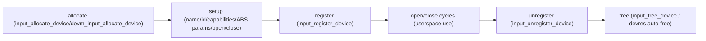

后续所有 API 都是围绕这条主干线服务的。

------

### 6.1.2 分配 / 注册 / 注销三件套：四连问总表

先给一张总表，对 **最核心的生命周期 API** 做一个“速查四连问”，后面再逐项展开。

| API                            | 作用                                                         | 使用场景                                                | 不写/写错后果                                                | 驱动落点（典型位置）                                |
| ------------------------------ | ------------------------------------------------------------ | ------------------------------------------------------- | ------------------------------------------------------------ | --------------------------------------------------- |
| `input_allocate_device()`      | 手动分配 `struct input_dev`                                  | 普通驱动、需要精细控制释放时机                          | 忘记 free 会内存泄漏；与 `input_unregister_device()` 配合错误会 UAF | `probe()` 开头附近，和错误路径一起管理              |
| `devm_input_allocate_device()` | 使用 devres 分配 `input_dev`，随 `struct device` 生命周期自动释放 | 推荐用于大部分平台/I2C/SPI 驱动                         | 若误以为“自动 unregister”，会在 remove/shutdown 时留脏节点   | `probe()` 中替代非 devres 分配，减少错误路径代码    |
| `input_register_device()`      | 把 input_dev 向 input core 注册，创建设备节点                | 所有真正要暴露给用户态的 Input 设备                     | 不调则不会有 `/dev/input/eventX`，用户态看不到；重复注册直接 BUG | `probe()` 末尾，所有能力声明之后                    |
| `input_unregister_device()`    | 从 input core 注销设备，解除与处理层的绑定                   | 非 devres 驱动的 remove/shutdown 路径；手动控制生命周期 | 忘记调会导致 use-after-free 或残留设备节点                   | `remove()` / `.shutdown()` 最后阶段，且在 free 之前 |
| `input_free_device()`          | 释放通过 `input_allocate_device()` 分配的内存                | 非 devres 驱动在“还未注册”或“注册失败”时释放            | 与 `input_unregister_device()` 搞混会出现 double free        | 错误路径或“未 register 就退出”的 cleanup            |

**关键区分点：**

- `input_unregister_device()` 会**同时**做 “unregister + free”；
- `input_free_device()` 只负责 free，不做 unregister；
- `devm_input_allocate_device()` 自动 free，但不会自动 unregister——`remove()` 中仍应显式 `input_unregister_device()`。

------

### 6.1.3 `input_allocate_device()` / `devm_input_allocate_device()`：四连问

#### 6.1.3.1 作用

- **`input_allocate_device()`**
  - 分配并初始化一个未注册的 `struct input_dev`；
  - 返回的指针由调用者负责释放（`input_free_device()` 或 `input_unregister_device()` 最终释放）。
- **`devm_input_allocate_device()`**
  - 使用 devres 机制分配 `struct input_dev`；
  - 在 `struct device` 生命周期结束时自动释放；
  - 适合和平台/I²C/SPI 设备绑定，减少手写错误路径。

#### 6.1.3.2 使用场景

- 驱动中需要创建一个 input_dev 时：
  - 如果你希望：
    - 错误路径简洁、释放逻辑统一交给 devres → 选 `devm_input_allocate_device()`；
    - 精细控制释放时机（例如多个 input_dev 依赖同一硬件，需部分注销等） → 选 `input_allocate_device()`。
- 在本书给出的触摸屏 / 摇杆示例中：
  - 推荐采用 devres 版本，因为大部分嵌入式场景“一块硬件 = 一个 input_dev”。

#### 6.1.3.3 不写 / 写错的后果

- 未调用 `input_allocate_device()` / `devm_input_allocate_device()` 而直接操作 `struct input_dev`：
  - 典型是“栈上分配一个 struct input_dev，然后填字段”，会破坏内核预期；
  - 内部必要字段未初始化，行为不可预期。
- 使用 `input_allocate_device()` 分配后：
  - 忘记在错误路径 `input_free_device()` → 内存泄漏；
  - 忘记在 remove 中 `input_unregister_device()` → 设备节点残留，甚至 UAF。
- 使用 `devm_input_allocate_device()` 时：
  - 错误地认为“remove 不需要 `input_unregister_device()`”，导致设备节点逻辑混乱（通常内核版本会防御，但设计上仍应显式 unregister）。

#### 6.1.3.4 驱动落点（具名宏示例）

典型 `probe()` 中使用 devres 的写法：

```c
#define DEMO_INPUT_PHYS_PATH	"demo/input0"

static int demo_input_probe(struct platform_device *pdev)
{
	struct device *dev = &pdev->dev;
	struct input_dev *input;
	int ret;

	input = devm_input_allocate_device(dev);
	if (!input)
		return -ENOMEM;

	input->name = "demo_input_device";
	input->phys = DEMO_INPUT_PHYS_PATH;
	input->id.bustype = BUS_HOST;
	input->id.vendor  = 0x0001;
	input->id.product = 0x0001;
	input->id.version = 0x0001;

	input->dev.parent = dev;

	/* 后续设置 evbit/keybit/absbit 等 */

	ret = input_register_device(input);
	if (ret)
		return ret;

	platform_set_drvdata(pdev, input);

	return 0;
}
```

> 这里 `DEMO_INPUT_PHYS_PATH` 是具名宏，表达“物理路径”含义，而不是裸字符串散落在代码中。

------

### 6.1.4 `input_register_device()` / `input_unregister_device()`：四连问

#### 6.1.4.1 作用

- **`input_register_device()`**
  - 把已经填好属性的 `input_dev` 注册到 input core；
  - 建立与处理层（evdev/joydev/mousedev 等）的绑定；
  - 创建设备节点（如 `/dev/input/eventX`）。
- **`input_unregister_device()`**
  - 把 `input_dev` 从 input core 注销；
  - 断开与处理层绑定，销毁设备节点；
  - **通常还会释放 `input_dev` 本身**（非 devres 情况下）。

> 实际上 `input_unregister_device()` 内部会 `kfree()` 设备，所以在非 devres 情况下，调用它之后不应再 `input_free_device()`。

#### 6.1.4.2 使用场景

- `input_register_device()`：
  - 在 `probe()` 中，所有能力/属性设置完毕后调用；
  - 只有 register 之后，用户态才能看到设备。
- `input_unregister_device()`：
  - 在 `.remove()` 或 `.shutdown()` 中调用；
  - 确保设备节点被干净地移除，避免残留。

#### 6.1.4.3 不写 / 写错的后果

- 忘记 `input_register_device()`：
  - 驱动内部以为一切正常，但 `/dev/input/` 下没有对应节点；
  - 用户态无法访问该设备，debug 时容易误以为“input core 没工作”。
- 忘记 `input_unregister_device()` 就释放 `input_dev` / `struct device`：
  - 处理层仍可能持有指向该设备的引用，导致 use-after-free；
  - 在 remove/shutdown 后仍能在 `/proc/bus/input/devices` 中看到脏条目。
- 在使用 devres 时 **多次** 调用 `input_unregister_device()` 或同时再 `input_free_device()`：
  - 可能出现 double free 或内核警告。

#### 6.1.4.4 驱动落点（具名宏示例）

非 devres 模式下的标准结构：

```c
struct demo_input_data {
	struct input_dev	*input;
	/* 其它资源 */
};

static int demo_input_probe(struct platform_device *pdev)
{
	struct demo_input_data *data;
	int ret;

	data = devm_kzalloc(&pdev->dev, sizeof(*data), GFP_KERNEL);
	if (!data)
		return -ENOMEM;

	data->input = input_allocate_device();
	if (!data->input)
		return -ENOMEM;

	/* 填写 input 属性，略 */

	ret = input_register_device(data->input);
	if (ret) {
		input_free_device(data->input);
		return ret;
	}

	platform_set_drvdata(pdev, data);

	return 0;
}

static int demo_input_remove(struct platform_device *pdev)
{
	struct demo_input_data *data = platform_get_drvdata(pdev);

	if (data->input)
		input_unregister_device(data->input);

	return 0;
}
```

要点：

- **错误路径**：`input_register_device()` 失败时，应调用 `input_free_device()`（因为还没注册成功，无需 unregister）；
- **正常 remove**：`input_unregister_device()` 之后不要再 `input_free_device()`。

------

### 6.1.5 `.open` / `.close` 回调：四连问

#### 6.1.5.1 作用

`struct input_dev` 中有两个重要回调：

```c
int (*open)(struct input_dev *dev);
void (*close)(struct input_dev *dev);
```

作用：

- input core 在检测到**第一个用户态 FD 打开**该设备时，会调用 `.open()`；
- 在**最后一个 FD 关闭**（引用计数变为 0）时，会调用 `.close()`；
- 驱动可以在这里实现“按需上电 / 启停采集”的逻辑。

简化时序：

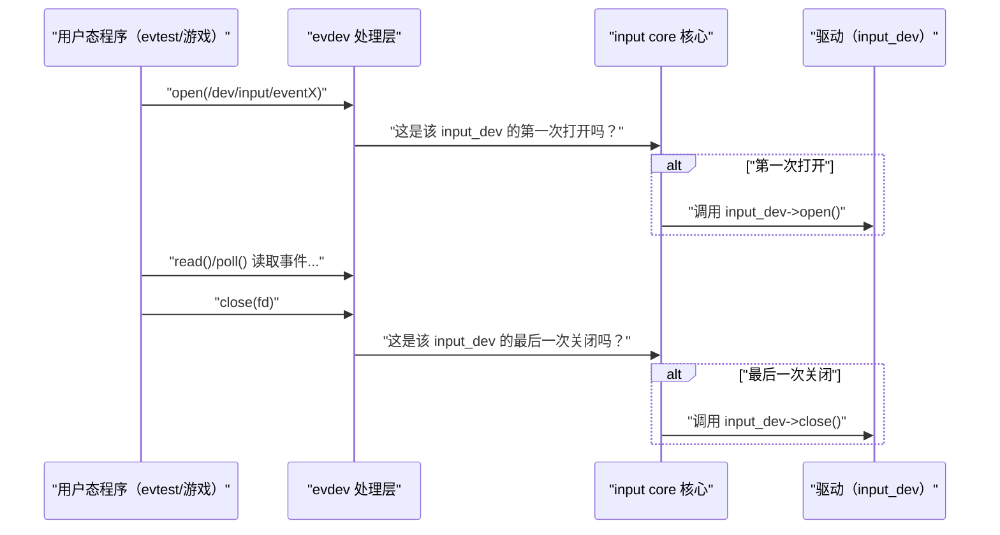

#### 6.1.5.2 使用场景

典型用法：

- 在 `.open()` 中：
  - 打开电源 / 时钟；
  - 启用 IRQ 或启动轮询定时器；
  - 重置硬件状态（清 FIFO 等）。
- 在 `.close()` 中：
  - 停止采集（停 IRQ / 停轮询）；
  - 若无唤醒需求则关闭电源 / 时钟。

这样可以实现“**有读者才上电，没人用就停**”，减少功耗。

#### 6.1.5.3 不写 / 写错的后果

- 不实现 `.open()` / `.close()`：
  - 设备会在 probe 后一直处于“已启用”状态：
    - 一直拉着中断；
    - 一直保持电源/时钟开启；
  - 在一些平台上会造成明显多余功耗。
- 在 `.close()` 中直接 `input_unregister_device()` 或释放硬件资源：
  - 违反生命周期约定，应由 remove/shutdown/PM 负责；
  - 下次用户态再次 open 时会出错甚至 panic。
- 在 `.open()` / `.close()` 中做耗时操作且加上睡眠锁，未考虑并发 / PM：
  - 可能与 suspend/resume、`disable_irq_sync()` 形成死锁；
     -特别是在 `.open()` 中等待某些 PM 状态时要谨慎。

#### 6.1.5.4 驱动落点（具名宏示例）

以轮询型摇杆为例（简化版）：

```c
#define DEMO_JS_POLL_INTERVAL_MS	20

struct demo_js_data {
	struct input_dev	*input;
	struct delayed_work	poll_work;
	bool			opened;
};

static void demo_js_poll_work(struct work_struct *work)
{
	struct demo_js_data *js;

	js = container_of(to_delayed_work(work),
			  struct demo_js_data, poll_work);

	/* 采集 + 上报，略 */

	schedule_delayed_work(&js->poll_work,
			      msecs_to_jiffies(DEMO_JS_POLL_INTERVAL_MS));
}

static int demo_js_open(struct input_dev *input)
{
	struct demo_js_data *js = input_get_drvdata(input);

	js->opened = true;

	/* 启动轮询 */
	schedule_delayed_work(&js->poll_work,
			      msecs_to_jiffies(DEMO_JS_POLL_INTERVAL_MS));

	return 0;
}

static void demo_js_close(struct input_dev *input)
{
	struct demo_js_data *js = input_get_drvdata(input);

	js->opened = false;

	/* 停止轮询 */
	cancel_delayed_work_sync(&js->poll_work);
}

static int demo_js_probe(struct platform_device *pdev)
{
	struct demo_js_data *js;
	struct input_dev *input;
	int ret;

	/* 分配 js 和 input，略 */

	input->open = demo_js_open;
	input->close = demo_js_close;

	input_set_drvdata(input, js);

	ret = input_register_device(input);
	if (ret)
		return ret;

	return 0;
}
```

> 这里 `DEMO_JS_POLL_INTERVAL_MS` 明确标记了单位为毫秒，避免“神秘数字”。

------

### 6.1.6 devres vs 非 devres：接口对比与适用场景

#### 6.1.6.1 devres 与非 devres 的角色划分

- **非 devres（手工管理）**
  - 你负责：`input_allocate_device()` / `input_register_device()` / `input_unregister_device()` / `input_free_device()`；
  - 适合：
    - 单个驱动管理多个 input_dev，需要跨设备的复杂生命周期控制；
    - 对释放顺序有特殊要求的场景。
- **devres（device-managed）**
  - `devm_input_allocate_device()` 帮你在 `struct device` 生命周期结束时自动释放；
  - 你仍然需要在 remove/shutdown 中显式 `input_unregister_device()`；
  - 适合：
    - 典型平台 / I²C / SPI Input 设备；
    - 每个硬件对应一个 input_dev，生命周期跟随 `struct device`。

#### 6.1.6.2 对比表

| 方面       | 非 devres                                            | devres                              |
| ---------- | ---------------------------------------------------- | ----------------------------------- |
| 分配       | `input_allocate_device()`                            | `devm_input_allocate_device(dev)`   |
| 释放       | `input_free_device()` 或 `input_unregister_device()` | 由 devres 在 device 销毁时自动 free |
| 错误路径   | 需要手写多处 `goto err_free_*`                       | 大部分情况下只需 `return ret`       |
| 适用场景   | 多个 input_dev 共用硬件；特殊顺序需求                | 一板一设备，一般 input 驱动         |
| 容易出错点 | 忘记 free / unregister                               | 误以为不需要 unregister             |

#### 6.1.6.3 实战建议

对本书中触摸屏 / 摇杆 / 按键等典型驱动：

- **优先推荐 devres**：
  - `devm_input_allocate_device()` + `input_register_device()`；
  - remove 中只做：停采集 → `input_unregister_device()`；
  - 释放逻辑交给 devres。
- 只有在以下情况才考虑非 devres：
  - 一个驱动内部管理多个 input_dev，且需要**在不同时间点单独注销其中一个**；
  - 或与其它子系统共享某些结构体，需要精细控制释放顺序。

------

### 6.1.7 小结：把生命周期 API 固定成可复用“骨架”

本节围绕 Input 设备生命周期，建立了一个可以直接套用的“骨架”：

1. **分配阶段**
   - `input_allocate_device()` / `devm_input_allocate_device()`；
   - 决定你是手工管理还是 devres。
2. **填充阶段**
   - 设置 `name` / `phys` / `id` / `dev.parent`；
   - 填写能力位图、ABS 参数；
   - 绑定 `.open` / `.close` 回调；
   - 用具名宏表达具有物理意义的常量（`*_MS` / `*_CNT` 等）。
3. **注册阶段**
   - `input_register_device()`；
   - 错误路径：失败时释放未注册的 input_dev（`input_free_device()` 或 devres自动）。
4. **使用阶段**
   - `.open` / `.close` 控制按需上电与采集；
   - 与第 5 章的 PM（suspend/resume/shutdown）配合。
5. **注销与释放阶段**
   - `input_unregister_device()`；
   - 非 devres 时不再额外 `input_free_device()`；
   - devres 时无需手写 free。


---

## 6.2 能力与属性声明：evbit/keybit/absbit/propbit 与 DIRECT/POINTER

> 本节目标
>
> - 把 Input 设备“是什么类型 + 能干什么 + 长什么样”全部落在：
>   - `evbit`（支持哪些事件类型）；
>   - `keybit`（有哪些按键 / 按钮）；
>   - `absbit`（有哪些绝对轴）；
>   - `propbit`（设备属性，如 DIRECT/POINTER）。
> - 对每一类位图按 **四连问** 展开：作用 / 使用场景 / 不写或写错后果 / 驱动落点。
> - 给出键盘 / 鼠标 / 触摸屏 / 摇杆的能力声明模板，方便直接复用。

------

### 6.2.1 概念总览：能力位图 vs 轴参数 vs 事件流

在 Input 子系统里，有三个层次不要混：

1. **能力位图（capabilities bitmap）**
   - `evbit`：这个设备会产生哪些类型事件（`EV_KEY`、`EV_ABS`、`EV_REL`、`EV_SW`...）；
   - `keybit`：会产生哪些 KEY code（`KEY_A`、`KEY_POWER`、`BTN_LEFT`...）；
   - `absbit`：有哪些 ABS code（`ABS_X`、`ABS_Y`、`ABS_MT_POSITION_X`...）；
   - `propbit`：设备属性（`INPUT_PROP_DIRECT`、`INPUT_PROP_POINTER` 等）。
2. **轴参数（axis parameters）**
   - 对 `EV_ABS` 类事件的每个 code，再用 `input_set_abs_params()` 或 `input_abs_set_*()` 设置 `min/max/fuzz/flat/resolution`；
   - 这一块在 **6.3 节** 专门讲，这里只从能力声明角度点到为止。
3. **事件流（event stream）**
   - 真正在运行时驱动调用 `input_report_key()` / `input_report_abs()` / `input_sync()` 产生的事件序列；
   - 能力位图 + 轴参数决定了用户态如何解释这些事件。

**顺序关系：**

> 能力位图（“我能干什么”）
>  → 轴参数（“这些 EV_ABS 轴的数值范围 / 抖动建议 / 精度”）
>  → 运行时事件（“具体每一帧上报的值”）

本节只围绕“我能干什么”这一层：`evbit` / `keybit` / `absbit` / `propbit`。

------

### 6.2.2 evbit：声明事件类型（EV_KEY/EV_ABS/EV_REL/EV_SW）

#### 6.2.2.1 作用（四连问 1）

- `input_dev->evbit` 是一个位图，声明 **设备支持哪些事件类型**：
  - `EV_KEY`：按键事件（包括按钮 / 按键 / 手柄按钮）；
  - `EV_ABS`：绝对轴（触摸屏坐标 / 摇杆位置 / 触摸压力等）；
  - `EV_REL`：相对轴（鼠标移动 delta 等）；
  - `EV_SW`：开关状态（翻盖开关、耳机插入等）。
- 内核和用户态通过 `evbit` 判断：
  - 这是“键盘型”设备、“指针型”设备、还是“触摸屏型”设备；
  - 用户态会根据支持的事件类型选择不同的解析路径（libinput、Xorg driver、Wayland compositor 等）。

常用接口：

- 低层：`__set_bit(EV_KEY, dev->evbit)`；
- 推荐封装：`input_set_capability(dev, EV_KEY, KEY_A)` 等——它会同时设置 `evbit` 和对应的子位图。

#### 6.2.2.2 使用场景（四连问 2）

- 对于任何 Input 驱动，必须至少设置：
  - 它究竟是 `EV_KEY` 设备、`EV_ABS` 设备，还是两者都有；
- 典型组合：

| 设备类型        | 必选事件类型                            |
| --------------- | --------------------------------------- |
| 键盘            | `EV_KEY`, `EV_REP`（自动重复）          |
| 鼠标            | `EV_KEY`, `EV_REL`                      |
| 触摸屏          | `EV_ABS`, `EV_KEY`（BTN_TOUCH）         |
| 模拟摇杆        | `EV_ABS`, 可能附带 `EV_KEY`（按下开关） |
| 盖板 / 耳机开关 | `EV_SW`                                 |

#### 6.2.2.3 不写 / 写错的后果（四连问 3）

- 忘记设置 `EV_KEY` 却上报 `EV_KEY`：
  - 用户态通过 ioctl / sysfs 查看能力时会认为“这个设备没有按键”；
  - 某些用户态库会直接忽略这类事件或当成异常设备处理。
- 忘记设置 `EV_ABS` 却使用 `input_report_abs()`：
  - `EV_ABS` 相关 `ioctl`（如 `EVIOCGABS`）会失败或返回空数据；
  - 用户态可能认为这是“没有轴的键盘”，而不是触摸屏 / 摇杆。
- 键盘忘了 `EV_REP`：
  - 自动重复逻辑可能不会激活，或者激活方式不符合预期。

#### 6.2.2.4 驱动落点（四连问 4：具名宏示例）

推荐用 `input_set_capability()` 统一设置事件类型 + code，下面给出几个模板。

**键盘型设备（片段）：**

```c
static void demo_kbd_setup_capabilities(struct input_dev *input)
{
	/* 声明：键盘支持 EV_KEY + EV_REP */
	__set_bit(EV_KEY, input->evbit);
	__set_bit(EV_REP, input->evbit);

	input_set_capability(input, EV_KEY, KEY_ESC);
	input_set_capability(input, EV_KEY, KEY_ENTER);
	input_set_capability(input, EV_KEY, KEY_A);
	input_set_capability(input, EV_KEY, KEY_B);
	/* 其它 KEY_* 代码略 */
}
```

**触摸屏型设备（片段）：**

```c
static void demo_ts_setup_capabilities(struct input_dev *input)
{
	__set_bit(EV_KEY, input->evbit);
	__set_bit(EV_ABS, input->evbit);

	input_set_capability(input, EV_KEY, BTN_TOUCH);

	/* 具体 ABS_* 在 6.3 里展开，这里只演示能力声明 */
}
```


------

### 6.2.3 keybit：声明按键 / 按钮集合与“语义空间”

#### 6.2.3.1 作用

- `input_dev->keybit` 是一个位图，描述 **设备可能产生哪些 KEY code / BTN code**。
- 这些 `KEY_*` / `BTN_*` 宏全部定义在 `uapi/linux/input-event-codes.h` 中，是内核对用户空间公开的 **稳定 UAPI/ABI**。
- 它们表示的是“**抽象输入语义**”，例如：
  - `KEY_A`：键盘里的 A 键语义；
  - `KEY_POWER`：电源键语义；
  - `BTN_LEFT`：指针设备的左键；
  - `BTN_SOUTH` / `BTN_EAST`：游戏手柄主按钮区；
  - `BTN_TRIGGER_HAPPY1`..`BTN_TRIGGER_HAPPY40`：为“各种乱七八糟的可编程键/遥控器键/宏键”预留的一大段按钮空间。

**重要点：**
 这些 code 不是“具体硬件型号”的标识，而是 **“人机输入动作的语义标签”**。Linux 把人类常见的输入动作空间切分成很多格子（语义域），`KEY_*` / `BTN_*` 就是这些格子的名字。

常用操作：

- 低层：`__set_bit(KEY_A, input->keybit)`；
- 推荐：`input_set_capability(input, EV_KEY, KEY_A)`，它会同时设置 `evbit` + `keybit`。

------

#### 6.2.3.2 使用场景

任何会产生 `EV_KEY` 事件的设备，都必须通过 `keybit` 告诉系统：

- “我 **可能** 产生哪些按键/按钮 code”。

典型场景：

- 普通键盘：`KEY_A`..`KEY_Z`、`KEY_1`..`KEY_0`、`KEY_ENTER`、`KEY_ESC`、系统键（`KEY_POWER`、`KEY_VOLUMEUP` 等）；
- 鼠标：`BTN_LEFT`、`BTN_RIGHT`、`BTN_MIDDLE`、`BTN_SIDE` 等；
- 游戏手柄/摇杆：`BTN_SOUTH`/`BTN_EAST`/`BTN_NORTH`/`BTN_WEST`、`BTN_TL`、`BTN_TR`、`BTN_THUMBL` 等；
- 遥控器 / 非标准控制盒：
  - 常用 `KEY_PROG1`..`KEY_PROG10`、`KEY_MACRO`，或
  - `BTN_TRIGGER_HAPPY1`..`BTN_TRIGGER_HAPPY40` 这一整段就是为“非标按钮/自定义键”预留的；
- 工业/自定义“控制面板”：
  - 选择一组“**抽象语义合理，又不与其它常用按键冲突**”的 `KEY_*` / `BTN_*` 即可，后续在用户态做业务映射。

**结论：**
 只要你的设备本质上是“有人按/点/推/旋”的输入设备，基本都能映射到现有 `KEY_*` / `BTN_*` 语义上。
 input 子系统并不限制“只能标准键盘/标准鼠标/标准手柄”，而是要求所有设备共享这一套 **统一的语义编码空间**。

------

#### 6.2.3.3 不写 / 写错的后果

- 上报 `KEY_POWER` 却没在 `keybit` 中声明：
  - 能力查询（`ioctl`、`/proc/bus/input/devices`、libinput 检测）看不到这个键；
  - 某些用户态框架可能忽略该键，或者错误判定设备类型。
- 声明了大量不会出现的按键：
  - 用户态认为这是一个拥有很多按键的“复杂设备”，实际事件流却从不出现某些 code；
  - 行为上问题不大，但会增加调试和自动配置的混乱度。
- 使用超出 `KEY_MAX` / `BTN_MAX` 的自定义 code：
  - 违反 UAPI/ABI 约束，用户态库完全不认识这个数字；
  - 工具链（evtest、libinput 等）解析会出错，这种做法不被内核接口设计支持。

**因此：**
 你不能在不改内核 UAPI 的前提下，随意发一个“自造 KEY code”；
 要么用现成语义（含大量泛用键区），要么给内核社区提 patch 扩展 `input-event-codes.h`，让新 code 成为标准。

------

#### 6.2.3.4 驱动落点（具名宏示例）

键盘型设备示例（片段）：

```c
static void demo_kbd_setup_keys(struct input_dev *input)
{
	/* 基本字母键 */
	input_set_capability(input, EV_KEY, KEY_A);
	input_set_capability(input, EV_KEY, KEY_B);
	input_set_capability(input, EV_KEY, KEY_C);

	/* 控制键 */
	input_set_capability(input, EV_KEY, KEY_ENTER);
	input_set_capability(input, EV_KEY, KEY_ESC);

	/* 系统控制键（电源、音量） */
	input_set_capability(input, EV_KEY, KEY_POWER);
	input_set_capability(input, EV_KEY, KEY_VOLUMEUP);
	input_set_capability(input, EV_KEY, KEY_VOLUMEDOWN);
}
```

自定义“宏键盒”示例（只看 keybit 部分）：

```c
#define DEMO_MACROPAD_KEY_CNT	8

static const unsigned int demo_macropad_keymap[DEMO_MACROPAD_KEY_CNT] = {
	KEY_PROG1,
	KEY_PROG2,
	KEY_PROG3,
	KEY_PROG4,
	KEY_PROG5,
	KEY_PROG6,
	KEY_PROG7,
	KEY_PROG8,
};

static void demo_macropad_setup_keys(struct input_dev *input)
{
	int i;

	__set_bit(EV_KEY, input->evbit);

	for (i = 0; i < DEMO_MACROPAD_KEY_CNT; i++)
		input_set_capability(input, EV_KEY,
				     demo_macropad_keymap[i]);
}
```

此时：

- 驱动只关心“第 n 个物理按键 → `KEY_PROGx`”；
- 至于 `KEY_PROG1` 在最终系统里代表什么动作（启动某应用、发送指令等），完全由 **用户态 keymap / 中间件 / 应用** 决定。

------

#### 6.2.3.5 补充：非标准设备与 KEY/BTN 语义的统一

结合你之前的提问，可以把 `EV_KEY` / `KEY_*` / `BTN_*` 的角色总结成三点，后续章节可以频繁引用这三条作为“总原则”：

1. **统一的是“语义域”，不是“硬件型号”**
   - `type + code` 定义的是“这条输入事件在语义空间里的格子”；
   - 驱动必须把硬件事件翻译到这些既定格子中，不能创建新格子；
   - 但这些格子本身已经覆盖了大多数人类输入动作（含大量“泛用键”区间）。
2. **驱动只负责“硬件 → (type, code, value)”翻译，不负责业务含义**
   - 驱动内部可以维护“扫描码 → KEY_*” 的 keymap；
   - 通过 `input_report_key()` 把语义标签上报给 input core；
   - 从那以后，“这个 KEY_* 最终干什么事”就不再是驱动问题，而是用户空间的问题。
3. **非标设备通过“泛用键 + 用户态映射”融入统一接口**
   - 驱动侧：优先使用 `KEY_PROG*`、`BTN_TRIGGER_HAPPY*` 等泛用 code，为非标业务预留；
   - 用户态：通过 keymap/配置/中间件决定“KEY_PROG1 = 模式 A”、“BTN_TRIGGER_HAPPY5 = 某宏指令”；
   - 如果整个行业都需要某种物理键的新语义，再考虑扩展内核 UAPI，而不是私自发 code。

后面在讲 uinput / 用户态自愈 / 非标输入方案时，可以直接引用这三条原则，避免在每章重复长篇解释。


------

### 6.2.4 absbit：声明绝对轴集合（与 6.3 的连接点）

#### 6.2.4.1 作用

- `input_dev->absbit` 是一个位图，描述 **有多少个绝对轴、各是什么 code**：
  - 如 `ABS_X` / `ABS_Y` / `ABS_Z` / `ABS_PRESSURE` / `ABS_MT_POSITION_X` 等。
- 内核和用户态通过它知道：
  - 这是“简单两轴设备”（如单点触摸、单摇杆）；
  - 还是 MT-B 多点触控设备（有一组 `ABS_MT_*` 轴）。

常用接口：

- `input_set_abs_params(dev, ABS_X, min, max, fuzz, flat)`：
  - 既设置 `absbit` 中的 `ABS_X` 位，
  - 又同时设置该轴的 `min/max/fuzz/flat` 参数。
- `input_set_capability(dev, EV_ABS, ABS_X)` 只设置能力，不设置参数（不推荐单独使用）。

#### 6.2.4.2 使用场景

- 涉及**坐标 / 位置 / 角度 / 压力**等连续物理量的设备：
  - 触摸屏：`ABS_X`、`ABS_Y`（单点）；`ABS_MT_*`（多点）；
  - 摇杆：`ABS_X`、`ABS_Y`（双轴），有时还带 `ABS_Z` / `ABS_RX` 等；
  - 轴类传感器（加速度计、陀螺仪）走 Input 时，也会使用 `EV_ABS`。

#### 6.2.4.3 不写 / 写错的后果

- 忘记声明 `ABS_X` / `ABS_Y`：
  - 只调用 `input_report_abs()`，但 `absbit` 中没有相应位；
  - `EVIOCGABS` ioctl 得不到参数，用户态无法知道坐标范围和轴存在性；
  - libinput 等库可能会拒绝把它当作触摸屏 / 摇杆。
- `input_set_abs_params()` 使用的 `min/max` 与实际映射不符：
  - 用户态根据这些参数做归一化 / 校准，结果坐标“拉伸 / 压缩”严重；
  - 这一部分在 6.3 中详细展开。

#### 6.2.4.4 驱动落点（具名宏示例）

触摸屏（单点）模板（只看能力 + 轴参数的组合）：

```c
#define DEMO_TS_ABS_X_MIN_CNT		0
#define DEMO_TS_ABS_X_MAX_CNT		4095
#define DEMO_TS_ABS_Y_MIN_CNT		0
#define DEMO_TS_ABS_Y_MAX_CNT		4095
#define DEMO_TS_FUZZ_CNT		0
#define DEMO_TS_FLAT_CNT		0

static void demo_ts_setup_abs(struct input_dev *input)
{
	__set_bit(EV_ABS, input->evbit);

	input_set_abs_params(input, ABS_X,
			     DEMO_TS_ABS_X_MIN_CNT,
			     DEMO_TS_ABS_X_MAX_CNT,
			     DEMO_TS_FUZZ_CNT,
			     DEMO_TS_FLAT_CNT);

	input_set_abs_params(input, ABS_Y,
			     DEMO_TS_ABS_Y_MIN_CNT,
			     DEMO_TS_ABS_Y_MAX_CNT,
			     DEMO_TS_FUZZ_CNT,
			     DEMO_TS_FLAT_CNT);
}
```

> 注意：这里的 `*_CNT` 宏体现“计数单位”，这是后续 6.3 节要继续深入的基础。

摇杆模板在 4.3 和前面代码已经出现，这里不再重复。

------

### 6.2.5 propbit：属性声明与 DIRECT/POINTER

#### 6.2.5.1 作用

`propbit` 描述的是 **设备的“形态属性”**，而不是事件类型本身，常见有：

- `INPUT_PROP_DIRECT`
  - 直接触控设备（如手机电容屏）：
    - 用户手指坐标直接对应屏幕上某个点；
    - “触摸位置”即“点击位置”。
- `INPUT_PROP_POINTER`
  - 间接指针设备（如触控板、相对模式的触摸板）：
    - 触点坐标不直接映射屏幕坐标，而是通过某种映射逻辑控制指针；
    - 例如：笔记本触控板，用手指在小区域上滑动控制屏幕上鼠标光标移动。

还有其它属性（如 `INPUT_PROP_BUTTONPAD` 等），本书重点关注 DIRECT vs POINTER。

常用接口：

```c
input_set_property(input, INPUT_PROP_DIRECT);
input_set_property(input, INPUT_PROP_POINTER);
```

#### 6.2.5.2 使用场景

- 对于触摸屏类设备，这是一个**必须明确**的属性：
  - 手机/平板屏幕：通常是 `INPUT_PROP_DIRECT`；
  - 触控板：通常是 `INPUT_PROP_POINTER` + `EV_REL` 或综合 `EV_ABS` + 特定策略。
- 用户态（特别是 libinput）根据这个属性决定：
  - 是否把该设备当作“primary touch screen”；
  - 是否启用某些手势 / 多点策略；
  - 是否直接拿 ABS 坐标作为屏幕上的点击点。

#### 6.2.5.3 不写 / 写错的后果

- 不设置 `INPUT_PROP_DIRECT` 的触摸屏：
  - 用户态可能误把它当做“触控板”或其它非直接指针设备；
  - 一些桌面环境中，“主触摸屏”识别失败，导致触屏行为不符合预期。
- 把触控板标成 `INPUT_PROP_DIRECT`：
  - 桌面环境会尝试把触控板当“屏幕”来解释，出现奇怪的映射行为。
- 同时设置 DIRECT + POINTER：
  - 含义混乱，一般不应这样做。

#### 6.2.5.4 驱动落点（具名宏示例）

LCD 电容触摸屏：

```c
static void demo_ts_setup_props(struct input_dev *input)
{
	/* 这是一个直接触控设备 */
	input_set_property(input, INPUT_PROP_DIRECT);
}
```

笔记本触控板（如果你写的是 pointer 类驱动）：

```c
static void demo_touchpad_setup_props(struct input_dev *input)
{
	/* 间接指针设备 */
	input_set_property(input, INPUT_PROP_POINTER);
}
```

------

### 6.2.6 能力组合模板：键盘 / 鼠标 / 触摸屏 / 摇杆

这一小节直接给出几种常见设备的“能力组合表”，你写实际驱动时可以对照使用。

#### 6.2.6.1 键盘（典型）

| 类别    | 设置内容           | 说明                      |
| ------- | ------------------ | ------------------------- |
| evbit   | `EV_KEY`, `EV_REP` | 按键 + 自动重复           |
| keybit  | `KEY_*`            | 各类键值                  |
| absbit  | 无                 | 纯键盘无 ABS              |
| propbit | 通常为空           | 键盘不需要 DIRECT/POINTER |

代码骨架（片段）：

```c
__set_bit(EV_KEY, input->evbit);
__set_bit(EV_REP, input->evbit);

input_set_capability(input, EV_KEY, KEY_A);
input_set_capability(input, EV_KEY, KEY_B);
input_set_capability(input, EV_KEY, KEY_ENTER);
input_set_capability(input, EV_KEY, KEY_ESC);
```

#### 6.2.6.2 鼠标（相对指针）

| 类别    | 设置内容                     | 说明                    |
| ------- | ---------------------------- | ----------------------- |
| evbit   | `EV_KEY`, `EV_REL`           | 按键 + 相对移动         |
| keybit  | `BTN_LEFT`, `BTN_RIGHT`, ... | 鼠标按钮                |
| absbit  | 无                           | 常规鼠标不需要 ABS      |
| propbit | 通常为空                     | 一般不标 DIRECT/POINTER |

骨架：

```c
__set_bit(EV_KEY, input->evbit);
__set_bit(EV_REL, input->evbit);

input_set_capability(input, EV_KEY, BTN_LEFT);
input_set_capability(input, EV_KEY, BTN_RIGHT);
input_set_capability(input, EV_KEY, BTN_MIDDLE);

input_set_capability(input, EV_REL, REL_X);
input_set_capability(input, EV_REL, REL_Y);
```

#### 6.2.6.3 电容触摸屏（DIRECT）

| 类别    | 设置内容                                      | 说明          |
| ------- | --------------------------------------------- | ------------- |
| evbit   | `EV_KEY`, `EV_ABS`                            | 触摸键 + 坐标 |
| keybit  | `BTN_TOUCH`                                   | 表示是否触摸  |
| absbit  | `ABS_X`, `ABS_Y`（单点）或 `ABS_MT_*`（多点） | 坐标轴集合    |
| propbit | `INPUT_PROP_DIRECT`                           | 直接触控      |

骨架（单点版）：

```c
__set_bit(EV_KEY, input->evbit);
__set_bit(EV_ABS, input->evbit);

input_set_capability(input, EV_KEY, BTN_TOUCH);

input_set_property(input, INPUT_PROP_DIRECT);

/* ABS_X / ABS_Y 参数见 6.3 */
```

#### 6.2.6.4 ADC 摇杆（双轴 + 可选按键）

| 类别    | 设置内容                | 说明                        |
| ------- | ----------------------- | --------------------------- |
| evbit   | `EV_ABS`, 可选 `EV_KEY` | 位置 + 按下开关             |
| keybit  | 可选 `BTN_THUMBL` 等    | 摇杆按下键                  |
| absbit  | `ABS_X`, `ABS_Y`        | 摇杆位置                    |
| propbit | 通常为空                | 摇杆一般不标 DIRECT/POINTER |

骨架示意已在第 4 章代码中给出，这里不重复。

------

### 6.2.7 调试与验证：如何确认能力声明是正确的？

当你填好了 `evbit` / `keybit` / `absbit` / `propbit` 后，可以通过几个工具进行验证：

1. **`/proc/bus/input/devices`**
   - 查看设备条目中的：
     - `EV=` 行（事件类型）；
     - `KEY=` 行（按键位图）；
     - `ABS=` 行（绝对轴）；
     - `PROP=` 行（属性）。
   - 确认与驱动中设置一致。
2. **`evtest`**
   - 启动后会打印该设备能力列表；
   - 实际操作设备，看输出是否符合预期：
     - 键盘：按下每个键都能看到对应 `KEY_*`；
     - 触摸屏：是否出现 `ABS_X/ABS_Y` / `BTN_TOUCH`；
     - 摇杆：ABS 轴是否成对出现。
3. **libinput debug-tools（桌面环境）**
   - 如 `libinput debug-events`；
   - 观察 libinput 对设备的类型识别（touchpad vs touchscreen 等）；
   - 若识别不符合预期，多半是 `propbit` 或 `evbit`/`absbit` 组合有问题。

------

### 6.2.8 小结：先声明“能干什么”，再谈“怎么干得好”

本节的核心结论可以压缩为：

1. **`evbit` / `keybit` / `absbit` / `propbit` 决定设备“身份与能力”**：
   - `evbit`：支持的事件类型（键、轴、相对量、开关等）；
   - `keybit`：有哪些按键 / 按钮；
   - `absbit`：有哪些绝对轴；
   - `propbit`：形态属性（DIRECT vs POINTER）。
2. 使用时的推荐模式：
   - 统一使用 `input_set_capability()`：自动设置 `evbit` + 子位图；
   - 对 `EV_ABS` 轴统一使用 `input_set_abs_params()`：同时设置 `absbit` + `min/max/fuzz/flat`；
   - DIRECT/POINTER 类属性用 `input_set_property()`，不要写裸 bit 操作。
3. 不写 / 写错的后果：
   - 用户态无法正确识别设备类型；
   - 能力查询（`ioctl` / `/proc/bus/input/devices`）信息不完整；
   - 上层输入栈（尤其是桌面 / libinput）逻辑偏离预期。
4. 驱动落点：
   - **生命周期上**：能力声明应在 `probe()` 中、`input_register_device()` 之前完成；
   - **结构上**：建议拆成 `*_setup_capabilities()` / `*_setup_abs()` / `*_setup_props()` 函数，避免 `probe()` 里堆一大堆 set_bit。

> 与下一节的衔接：
>
> - 本节讲的是“声明有哪些 ABS 轴”；
> - **6.3 节将专门讲解 ABS 轴参数族：`min/max/fuzz/flat/res` 的作用 / 场景 / 不写后果 / 驱动落点**，并通过触摸屏与摇杆对比，真正把轴参数的语义讲清楚。


---

### 6.2.9 扩展：type+code 语义域与用户态重映射（中间件/uinput）

> 本小节是 6.2 的“扩展阅读”，专门把你刚才问的那一串“**type+code 域划分、谁来映射、能否加中间件**”整理成一条清晰链路，后面章节如果需要再展开 uinput，可以直接引用这里。

------

#### 6.2.9.1 type + code = 语义域标识

形式化一点：

- `type`：事件大类（`EV_KEY`、`EV_ABS`、`EV_REL`、`EV_SW` 等）；
- `code`：该大类中的具体语义标签（`KEY_POWER`、`BTN_LEFT`、`ABS_X` 等）。

于是 `(type, code)` 就是一个“语义域 ID”，例如：

- `(EV_KEY, KEY_POWER)`：一次“电源键按/松”的语义域；
- `(EV_ABS, ABS_X)`：一个“绝对 X 坐标值”的语义域；
- `(EV_REL, REL_WHEEL)`：一个“滚轮增量”的语义域。

**input 子系统只负责：**

- 定义这些语义域的全集（UAPI/ABI）；
- 保证驱动只能在这些已知域中上报 `value`，不能凭空造新域。

------

#### 6.2.9.2 驱动侧映射：硬件 → (type, code, value)

驱动内部通常有一层 **“硬件码 → code”** 的映射：

1. 从硬件读原始信息：
   - 行列键盘：扫描码；
   - GPIO：bit 编号；
   - I²C 手柄：寄存器里哪个 bit 为 1；
2. 用 keymap 表：`scan_code -> KEY_* / BTN_*`；
3. 调用 `input_report_key(dev, KEY_XXX, value)` + `input_sync()`；
4. input core 输出统一格式的 `struct input_event` 到 `/dev/input/eventX`。

对某些设备，内核还提供 `EVIOCGKEYCODE` / `EVIOCSKEYCODE` 让用户态修改这层 keymap（例如重定义键盘上的某个扫描码对应哪个 `KEY_*`）。

这层映射的职责是：

> **把“物理/协议细节”变成标准化的 `(type, code, value)` 流。**

------

#### 6.2.9.3 用户态映射：code → 业务行为

从 `/dev/input/eventX` 往上，决策权完全在用户空间：

- 桌面系统：
  - X11 / Wayland / libinput 把 `KEY_*` 映射成 keysyms / 手势 / 快捷键；
  - Gnome/KDE 提供图形界面配置“这个键触发哪个动作”。
- 游戏 / 引擎：
  - 自己定义“`KEY_F13` = 技能 1”；
  - “`BTN_TRIGGER_HAPPY1` = 自定义菜单键”。
- 嵌入式守护进程：
  - 打开 `/dev/input/eventX`，看到 `KEY_PROG1` 时发一条总线消息或切换系统模式。

**总结成一句话：**

> 内核统一的是“事件语义标签”，
>  事件在业务上的真实用法由用户空间自由映射。

------

#### 6.2.9.4 中间件 / 重映射层的现实形态

你提到的“在用户层加中间件做重映射”，在实际系统里主要有三种形态：

1. **直接消费 `/dev/input/eventX` 自己做映射**
   - 写一个守护进程，按你自己的表把 `(EV_KEY, KEY_PROG1)` 映射到某业务动作；
   - 优点：简单、依赖少；
   - 缺点：应用需要知道这个守护进程的协议。
2. **使用 uinput 做“输入→输入 重映射”**
   - 用户态程序一手读真实设备 `/dev/input/eventX`，一手写 `/dev/uinput` 生成一个虚拟 input_dev；
   - 你可以在中间层把 `KEY_PROG1` 映射为 `KEY_A`，或合成其它标准事件；
   - 上层只看见虚拟设备，以为是一个正常键盘/手柄；
   - 非标硬件 → 中间件 → 标准 input 设备，是很多嵌入式/游戏外设的常用路径。
3. **桌面环境 / 引擎内部的键位/手势映射**
   - XKB keymap、Wayland compositor 配置、游戏内“键位设置”等；
   - 实质上也是一层 `(type, code) → 高层语义 → 业务行为` 的映射。

------

#### 6.2.9.5 内核端“再映射”的边界

内核本身只提供**非常有限**的“可调映射”接口：

- 典型是键盘类设备的 `EVIOCGKEYCODE` / `EVIOCSKEYCODE`：调整“扫描码 → `KEY_*`” 映射；
- 某些遥控器驱动有自己的 keymap 配置接口。

但内核 **不提供** 一个通用“`KEY_A` → `KEY_B`” 的 hook，原因是：

- 这是纯策略/业务问题，属于用户空间领域；
- 放进内核会污染 ABI，且难以满足多桌面、多环境的需求。

因此本书的基本立场是：

> - 驱动：负责“硬件码 → (type, code, value)”
> - 内核 input：负责“统一编码 + 发到 evdev/joydev 等处理层”
> - 用户态：负责“(type, code, value) → 高层语义/业务行为”，如有需要通过中间件/uinput再做一次重映射。

你之前那句总结话可以升格成本章的固定表述：

> `type + code` 把输入事件的“语义空间”划分成若干域；
>  驱动只负责往这些域里填值（上报 `(type, code, value)`），
>  **事件在业务上的最终含义由用户空间通过配置/中间件/应用来决定**。
>  如果要改变含义，应当在用户空间通过 keymap、重映射守护进程或 uinput 虚拟设备来实现，而不是在内核 input core 里做策略逻辑。


------

## 6.3 绝对轴参数族：min/max/fuzz/flat/res（重点）

> **本节内容说明**
>  本节是全书的“重点 API 段”之一，目标是把 `EV_ABS` 轴上的五个参数 **`min/max/fuzz/flat/resolution`** 讲到真正可落地：
>
> - 它们在内核中的存放位置与生命周期；
> - 每个参数的 **作用 / 使用场景 / 不写或写错的后果 / 驱动落点**；
> - 触摸屏与摇杆两条流水线下的实际用法和差异；
> - **特别是澄清：这些参数不会自动参与任何“值换算”或 clamp，只是元数据，由 handler / 用户态决定如何使用。**

------

### 6.3.1 总览：ABS 参数在内核中的位置与信息流

#### 6.3.1.1 数据结构与 API 关系

内核中每个 `EV_ABS` 轴的参数，最终落在 `struct input_absinfo`：

```c
struct input_absinfo {
	__s32	value;		/* 当前值（最近一次上报） */
	__s32	minimum;	/* 最小值 */
	__s32	maximum;	/* 最大值 */
	__s32	fuzz;		/* 抑抖/噪声建议 */
	__s32	flat;		/* 死区建议 */
	__s32	resolution;	/* 分辨率（单位视 axis 类型） */
};
```

`input_set_abs_params(dev, axis, min, max, fuzz, flat)` 会：

- 确保为 `dev->absinfo` 分配数组；
- 设置该 `axis` 的：`minimum/maximum/fuzz/flat`；
- 设置 `EV_ABS` 位；
- 设置 `absbit[axis]` 位（表示该 ABS 轴存在）。

`input_abs_set_res(dev, axis, res)` 会：

- 确保 `dev->absinfo` 存在；
- 仅设置 `absinfo[axis].resolution = res`。

用户态通过：

```c
ioctl(fd, EVIOCGABS(axis), &absinfo);
```

读回上述所有字段。

**信息流：**


整个轴参数族本质上是 **“轴的元数据（meta-data）”**：驱动写入，handler/用户态读取，供后者理解“这个 axis 的值是什么范围，噪声多大，分辨率如何”。

------

### 6.3.2 五个参数的统一“四连问”视角

本节按照“四连问”对每个字段统一回答：

1. **作用**：在抽象层面解决什么问题；
2. **使用场景**：什么设备/场景需要认真设置；
3. **不写或写错的后果**：具体表现出来是什么 bug；
4. **驱动落点**：在驱动代码里放在哪个阶段、用什么宏来表达。

> 统一前提（重要）：
>  `input_set_abs_params()` / `input_abs_set_res()` **不会对驱动上报的 `value` 做任何自动换算或 clamp**。
>  驱动调用 `input_report_abs()` 时传入多少，input core 就按这个值记录并发出去。
>  ABS 参数全部只是元数据，由 handler / 用户空间决定是否据此做 clamp / 滤波 / 死区 / 物理换算。

------

#### 6.3.2.1 min / max：定义轴的逻辑工作区间

##### ① 作用

- `min` / `max`（在结构体中是 `minimum` / `maximum`）定义了 **该 ABS 轴对外公开的“逻辑值范围”**；
- 单位与 `value` 一致：
  - 对坐标，通常是“计数值（count）”；
  - 对摇杆，可以是映射后的“带符号计数值”。
- 用户态会用它来：
  - 做坐标归一化（如按 `min/max` 拉伸到 0..1 或屏幕像素范围）；
  - 校验值是否在合理区间。

**注意：内核 input core 不会自动 clamp：**

- 内核文档明确说明：
  - driver **应当自己保证**上报的 `value` 落在 `[min, max]`；
  - input core 不会根据 `min/max` 自动裁剪 `value`。

##### ② 使用场景

- 触摸屏：
  - 常见做法：`min=0`、`max=4095`（硬件 12 比特原始坐标范围）；
  - 或者：直接把坐标映射到逻辑屏幕像素（如 `0..479` / `0..799`）。
- 摇杆：
  - 把物理中立点映射为 0，两端对称为 `min/max`（如 `-32768..32767`）。

##### ③ 不写或写错的后果

- 不设置 `min/max`：
  - `EVIOCGABS` 得到未初始化或不合理的区间；
  - 用户态无法可靠地知道“端点在哪里”，很多策略退化成猜测。
- `min/max` 与实际映射不符：
  - 比如硬件是 `0..4095`，驱动写成 `0..1023`：
    - 用户态以为 1023 就是右边界，实际上只走了 1/4；
    - 坐标/摇杆被压缩，用户看到“打不到边角”或者“中间很挤”。
- 上报时完全不 clamp：
  - 硬件噪声/bug 导致偶尔上报越界大值，用户态轨迹会突然跳一下；
  - 和 5.4 中讲的帧一致性问题叠加后，很难追踪根因。

##### ④ 驱动落点（具名宏示例）

触摸屏（控制器 12bit 原始坐标）：

```c
#define DEMO_TS_ABS_X_MIN_CNT		0
#define DEMO_TS_ABS_X_MAX_CNT		4095
#define DEMO_TS_ABS_Y_MIN_CNT		0
#define DEMO_TS_ABS_Y_MAX_CNT		4095

static void demo_ts_setup_abs_range(struct input_dev *input)
{
	input_set_abs_params(input, ABS_X,
			     DEMO_TS_ABS_X_MIN_CNT,
			     DEMO_TS_ABS_X_MAX_CNT,
			     0, 0);
	input_set_abs_params(input, ABS_Y,
			     DEMO_TS_ABS_Y_MIN_CNT,
			     DEMO_TS_ABS_Y_MAX_CNT,
			     0, 0);
}
```

摇杆（ADC 值映射成中心为 0，两侧对称）：

```c
#define DEMO_JS_ABS_AXIS_MIN_CNT	(-32768)
#define DEMO_JS_ABS_AXIS_MAX_CNT	32767

static void demo_js_setup_abs_range(struct input_dev *input)
{
	input_set_abs_params(input, ABS_X,
			     DEMO_JS_ABS_AXIS_MIN_CNT,
			     DEMO_JS_ABS_AXIS_MAX_CNT,
			     0, 0);
	input_set_abs_params(input, ABS_Y,
			     DEMO_JS_ABS_AXIS_MIN_CNT,
			     DEMO_JS_ABS_AXIS_MAX_CNT,
			     0, 0);
}
```

采集时驱动应主动 clamp：

```c
static int demo_js_clamp_axis(int value)
{
	if (value < DEMO_JS_ABS_AXIS_MIN_CNT)
		value = DEMO_JS_ABS_AXIS_MIN_CNT;
	else if (value > DEMO_JS_ABS_AXIS_MAX_CNT)
		value = DEMO_JS_ABS_AXIS_MAX_CNT;

	return value;
}
```

------

#### 6.3.2.2 fuzz：抑抖 / 噪声建议

##### ① 作用

- `fuzz` 描述 **该轴“典型噪声/抖动幅度”的建议**，单位与 `value` 一致；
- 某些 handler（如 joydev）或用户态库可以利用 `fuzz` 做滤波：
  - 小于 `±fuzz` 的变化可以看作噪声，不立刻更新逻辑值；
  - 或者用它作为平滑算法的参数之一。

**注意：**

- input core 本身不会基于 `fuzz` 自动过滤事件；
- 它只是写入 `absinfo[axis].fuzz`，是否采纳由上层决定。

##### ② 使用场景

- 机械摇杆 / ADC：
  - 中立附近 ADC 会不断 ±几百 count 地抖动；
  - `fuzz` 用来告诉上层：“这条轴天然噪声较大，建议忽略小抖动”。
- 噪声较大的触摸硬件：
  - 电阻屏或低成本电容屏，低速采样时坐标抖动明显；
  - `fuzz` 能帮助上层减少轨迹噪点。

##### ③ 不写或写错的后果

- 全部设置为 0：
  - 上层认为设备“几乎无噪声”，默认不启用或弱化平滑处理；
  - 对实际抖动大的硬件，体验会很差。
- 设置过大：
  - 细小移动被当作噪声，导致“手稍微推一下摇杆没有反应”“细微拖动无效”。

##### ④ 驱动落点（具名宏示例）

摇杆（噪声明显）：

```c
#define DEMO_JS_FUZZ_CNT		512	/* 抖动典型幅度 */

static void demo_js_setup_abs_with_fuzz(struct input_dev *input)
{
	input_set_abs_params(input, ABS_X,
			     DEMO_JS_ABS_AXIS_MIN_CNT,
			     DEMO_JS_ABS_AXIS_MAX_CNT,
			     DEMO_JS_FUZZ_CNT,
			     0);
	input_set_abs_params(input, ABS_Y,
			     DEMO_JS_ABS_AXIS_MIN_CNT,
			     DEMO_JS_ABS_AXIS_MAX_CNT,
			     DEMO_JS_FUZZ_CNT,
			     0);
}
```

------

#### 6.3.2.3 flat：中心死区建议

##### ① 作用

- `flat` 描述 **该 ABS 轴“建议死区大小”**，尤其用于摇杆：
  - 一般指中心 ±N 个 count 以内，建议当作 0；
  - 解决机械回中不稳、手没有完全放开时的小偏移。

同样地，input core 不自动按 `flat` 改 `value`，而是：

- 由如 joydev/用户态代码在看到 `flat` 后自行做中心归零。

##### ② 使用场景

- 模拟摇杆：
  - 中心 ±若干 count 内完全视为中立；
  - 有利于角色静止时不抖动、不缓慢飘移。

##### ③ 不写或写错的后果

- 不设置 `flat`：
  - 用户态认为整个区间都有效，不主动设置死区；
  - 摇杆中立附近的微小偏移会被当成输入，角色轻微移动。
- 设置过大：
  - 实际可用行程减少，玩家感觉“摇杆死区巨大，很钝”。

##### ④ 驱动落点（具名宏示例）

```c
#define DEMO_JS_FUZZ_CNT		512
#define DEMO_JS_FLAT_CNT		4096	/* 中心死区宽度 */

static void demo_js_setup_abs_with_fuzz_flat(struct input_dev *input)
{
	input_set_abs_params(input, ABS_X,
			     DEMO_JS_ABS_AXIS_MIN_CNT,
			     DEMO_JS_ABS_AXIS_MAX_CNT,
			     DEMO_JS_FUZZ_CNT,
			     DEMO_JS_FLAT_CNT);
	input_set_abs_params(input, ABS_Y,
			     DEMO_JS_ABS_AXIS_MIN_CNT,
			     DEMO_JS_ABS_AXIS_MAX_CNT,
			     DEMO_JS_FUZZ_CNT,
			     DEMO_JS_FLAT_CNT);
}
```

------

#### 6.3.2.4 resolution：物理分辨率声明

##### ① 作用

- `resolution` 描述 **该 ABS 轴的分辨率**，常见约定：
  - 对 `ABS_X/Y/Z` 等线性位置轴：单位是 **count per mm**；
  - 对 `ABS_RX/RY/RZ` 等角度轴：单位是 **count per radian**。

它告诉上层：“这条轴上每单位物理量对应多少计数”。

**再次强调：**

- `resolution` 不会参与任何自动换算或 clamp；
- 内核只是把它存进 `absinfo[axis].resolution` 并通过 `EVIOCGABS` 暴露给用户态。

##### ② 使用场景

- 触摸屏 / 数位板：
  - 用来描述触点位置和接触面积的物理密度；
  - 有助于 palm rejection、压力映射等算法。
- 精密输入设备（轨迹球、3D 控制器等）。

##### ③ 不写或写错的后果

- 不填 `resolution`：
  - 用户态无法基于 ABS 直接推导物理密度，只能从屏幕 DPI 或外部配置推断。
- 填一个不反映真实硬件的值：
  - 上层算法以为设备非常“密”或“稀”，选择不合适的阈值和滤波参数。

##### ④ 驱动落点（具名宏示例）

```c
#define DEMO_TS_RES_X_CNT_PER_MM	200
#define DEMO_TS_RES_Y_CNT_PER_MM	200

static void demo_ts_setup_abs_resolution(struct input_dev *input)
{
	input_abs_set_res(input, ABS_X,
			  DEMO_TS_RES_X_CNT_PER_MM);
	input_abs_set_res(input, ABS_Y,
			  DEMO_TS_RES_Y_CNT_PER_MM);
}
```

------

#### 6.3.2.5 重要澄清：ABS 参数不会自动修改 `value`

这一节专门把你最关心的点单独讲清楚：

> - `input_set_abs_params()` 里的 `min/max/fuzz/flat`
> - `input_abs_set_res()` 里的 `resolution`
>
> **都不会参与任何“自动换算 / 自动裁剪”；
>  内核不会根据这些值去改变你用 `input_report_abs()` 上报的 `value`。**

更精确地说：

1. `input_set_abs_params(dev, axis, min, max, fuzz, flat)` 做的事只有：

   - 为 `absinfo[]` 分配存储；
   - 写 `minimum/maximum/fuzz/flat`；
   - 设置 `EV_ABS` 和 `absbit[axis]`。

2. `input_abs_set_res(dev, axis, res)` 做的事只有：

   - 确保 `absinfo[]` 存在；
   - 写 `absinfo[axis].resolution = res`。

3. 当驱动调用：

   ```c
   input_report_abs(input, ABS_X, raw_cnt);
   ```

   - `raw_cnt` 直接写入 `absinfo[ABS_X].value`，
   - 然后被 input core/handler 直接转成 `struct input_event {EV_ABS, ABS_X, raw_cnt}` 发往用户态；
   - **不会**因为你设置了 `min/max/resolution` 而被自动缩放、clamp 或归一化。

4. `min/max/fuzz/flat/resolution` 的关系可以总结为：

   - `min/max`：描述“逻辑范围”；
   - `fuzz/flat`：描述“噪声幅度 / 死区建议”；
   - `resolution`：描述“物理比例尺（count/物理单位）”；
   - 它们之间没有内核强制的数学绑定，只要你配置一致，就能在用户态解析成“物理空间”。

5. 谁会用这些字段？

   - evdev/joydev/libinput 等 **input handler**；
   - Android 输入栈、Wayland 合成器、你自己写的守护进程；
   - 典型用法：`EVIOCGABS` 读回 `struct input_absinfo`，据此做：
     - clamp / 归一化；
     - 抖动过滤 / 死区；
     - count → mm / rad 的换算。

------

### 6.3.3 设备物理空间与 ABS 参数：计数、像素、物理量

#### 6.3.3.1 三层空间

1. **物理空间**
   - 屏幕物理尺寸（mm）、摇杆旋转角度（rad）、压力值等。
2. **硬件计数空间**
   - 控制器/ADC 给出的整数值：如 `0..4095`、`0..65535` 等。
3. **Input ABS 逻辑空间**
   - 驱动公开的 `min/max` 区间（计数逻辑范围）；
   - `resolution` 作为从逻辑计数到物理尺度的比例。

常用策略：

- 触摸屏：
  - `min/max` 通常直接等于硬件计数范围；
  - 上层结合屏幕像素数 / DPI 做最终映射。
- 摇杆：
  - 把中立点映射为 0，左右对称；
  - 用 `fuzz` / `flat` 描述噪声与死区，`resolution` 可选。

------

#### 6.3.3.2 触摸屏映射策略对比

| 策略            | min/max                                       | resolution       | 优点                 | 缺点                       |
| --------------- | --------------------------------------------- | ---------------- | -------------------- | -------------------------- |
| A. 原始计数空间 | 0..4095                                       | 按 count/mm 设置 | 简单，信息完整       | 用户态需单独处理旋转/缩放  |
| B. 面板像素空间 | 0..(panel_width_px-1)、0..(panel_height_px-1) | 可选             | 用户态读到即屏幕像素 | 驱动需做映射，可能损失精度 |

推荐：

- 通用驱动用方案 A（计数 + resolution），不抢用户态策略；
- 某些强约束项目（固化分辨率且驱动=平台一体）可以采用方案 B。

------

### 6.3.4 触摸屏 vs 摇杆：fuzz/flat/res 的典型配置差异

| 设备类型   | min/max       | fuzz   | flat | resolution  | 典型关注点     |
| ---------- | ------------- | ------ | ---- | ----------- | -------------- |
| 电容触摸屏 | 0..4095       | 小或 0 | 0    | count/mm    | 边界、分辨率   |
| 电阻触摸屏 | 0..4095       | 较大   | 0    | 可选        | 噪声、稳定性   |
| 摇杆       | -32768..32767 | 较大   | 非零 | 可选        | 中心死区、抖动 |
| 工业旋钮   | 0..N          | 小或 0 | 小   | 按度/格设置 | 线性度、端点   |

------

### 6.3.5 可视化：ABS 参数从驱动到用户态的使用链路

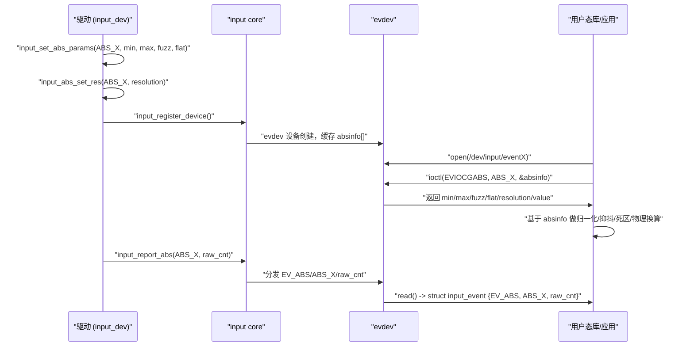

------

### 6.3.6 示例代码：驱动和用户态各一段

#### 6.3.6.1 驱动侧：触摸屏 ABS 参数初始化

```c
#define DEMO_TS_ABS_X_MIN_CNT		0
#define DEMO_TS_ABS_X_MAX_CNT		4095
#define DEMO_TS_ABS_Y_MIN_CNT		0
#define DEMO_TS_ABS_Y_MAX_CNT		4095

#define DEMO_TS_FUZZ_CNT		2
#define DEMO_TS_FLAT_CNT		0

#define DEMO_TS_RES_X_CNT_PER_MM	200
#define DEMO_TS_RES_Y_CNT_PER_MM	200

static void demo_ts_setup_abs(struct input_dev *input)
{
	__set_bit(EV_ABS, input->evbit);

	input_set_abs_params(input, ABS_X,
			     DEMO_TS_ABS_X_MIN_CNT,
			     DEMO_TS_ABS_X_MAX_CNT,
			     DEMO_TS_FUZZ_CNT,
			     DEMO_TS_FLAT_CNT);

	input_set_abs_params(input, ABS_Y,
			     DEMO_TS_ABS_Y_MIN_CNT,
			     DEMO_TS_ABS_Y_MAX_CNT,
			     DEMO_TS_FUZZ_CNT,
			     DEMO_TS_FLAT_CNT);

	input_abs_set_res(input, ABS_X,
			  DEMO_TS_RES_X_CNT_PER_MM);
	input_abs_set_res(input, ABS_Y,
			  DEMO_TS_RES_Y_CNT_PER_MM);
}

static int demo_ts_report_coords(struct demo_ts_data *ts, int x, int y)
{
	struct input_dev *input = ts->input;

	if (x < DEMO_TS_ABS_X_MIN_CNT)
		x = DEMO_TS_ABS_X_MIN_CNT;
	else if (x > DEMO_TS_ABS_X_MAX_CNT)
		x = DEMO_TS_ABS_X_MAX_CNT;

	if (y < DEMO_TS_ABS_Y_MIN_CNT)
		y = DEMO_TS_ABS_Y_MIN_CNT;
	else if (y > DEMO_TS_ABS_Y_MAX_CNT)
		y = DEMO_TS_ABS_Y_MAX_CNT;

	input_report_abs(input, ABS_X, x);
	input_report_abs(input, ABS_Y, y);
	input_sync(input);

	return 0;
}
```

------

#### 6.3.6.2 用户态：读取 EVIOCGABS + 使用 resolution 做物理换算

```c
#include <stdio.h>
#include <math.h>
#include <fcntl.h>
#include <unistd.h>
#include <linux/input.h>
#include <sys/ioctl.h>

#define DEMO_MIN_MOVE_MM	0.5

static int demo_dump_abs_info(const char *devnode, int code)
{
	struct input_absinfo abs;
	int fd;
	int ret;

	fd = open(devnode, O_RDONLY);
	if (fd < 0) {
		perror("open");
		return -1;
	}

	ret = ioctl(fd, EVIOCGABS(code), &abs);
	if (ret < 0) {
		perror("ioctl(EVIOCGABS)");
		close(fd);
		return -1;
	}

	printf("ABS code %d:\n", code);
	printf("  value      = %d\n", abs.value);
	printf("  min        = %d\n", abs.minimum);
	printf("  max        = %d\n", abs.maximum);
	printf("  fuzz       = %d\n", abs.fuzz);
	printf("  flat       = %d\n", abs.flat);
	printf("  resolution = %d (cnt/mm)\n", abs.resolution);

	close(fd);
	return 0;
}

static void demo_use_resolution_example(const struct input_absinfo *abs,
					int last, int curr)
{
	int delta_cnt = curr - last;
	double delta_mm;

	if (!abs->resolution) {
		printf("no resolution, delta_cnt=%d\n", delta_cnt);
		return;
	}

	delta_mm = (double)delta_cnt / abs->resolution;

	printf("delta_cnt=%d => delta_mm=%.3fmm\n",
	       delta_cnt, delta_mm);

	if (fabs(delta_mm) < DEMO_MIN_MOVE_MM)
		printf("movement < %.3fmm, treat as noise\n",
		       DEMO_MIN_MOVE_MM);
}

int main(int argc, char **argv)
{
	const char *devnode = "/dev/input/event0";

	if (argc > 1)
		devnode = argv[1];

	demo_dump_abs_info(devnode, ABS_X);
	return 0;
}
```

这段代码演示了典型链路：

- 驱动只负责设置 `min/max/fuzz/flat/resolution` 并上报原始 `value`；
- 用户态通过 `EVIOCGABS` 读回结构体，根据 `resolution` 把“count 差值”换算成物理 mm，再决定是否当作噪声。

------

### 6.3.7 调试与验证：如何判断 ABS 参数配置正确？

1. **`/proc/bus/input/devices` / `evtest`**
   - 确认 ABS 轴是否列出；
   - `min/max/fuzz/flat/resolution` 是否与驱动宏一致。
2. **自定义 EVIOCGABS 工具**
   - 读回各轴 `input_absinfo`；
   - 与设计文档逐项对照，排除“文档写对了，代码写错了”的情况。
3. **行为验证**
   - 触摸屏：边缘是否容易触达；拖动轨迹是否平滑；是否出现肉眼可见噪点；
   - 摇杆：中立是否稳定；死区是否合适；极值是否容易打满。
4. **与 5 章的并发/帧一致性联合排错**
   - 轨迹/摇杆偶尔大跳：
     - 同时检查：采样帧一致性（5.4）、ABS clamp 是否正确、是否存在超出 min/max 的上报。

------

### 6.3.8 小结：把 ABS 参数当作“设备物理描述的一部分”

- `min/max/fuzz/flat/resolution` **全部是轴的元数据，不直接改写 `value`**；
- 驱动通过 `input_set_abs_params()` / `input_abs_set_res()` 在 `probe()` 中一次性写好这些描述；
- 上报路径始终以“硬件计数 → 自己 clamp 后的逻辑计数”为准；
- handler / 用户态通过 `EVIOCGABS` 读到这套元数据，才有可能做出合理的：
  - 坐标映射；
  - 噪声抑制；
  - 死区处理；
  - 物理距离/角度换算。


------

## 6.4 多点触控（MT-B）：槽位、帧同步与常见坑

> **本节内容说明**
>  本节围绕 **多点触控协议 B（MT-B）** 展开，目标是：
>
> - 用“是什么 / 干什么 / 怎么实现 / 怎么用”的顺序，讲清 **槽位（slot）模型** 与 **tracking id** 的本质；
> - 说明 `ABS_MT_*` 事件在一帧中的组织方式，以及与 `SYN_REPORT` 的关系；
> - 从驱动视角说明 **如何初始化 slot、如何维护每根手指的生命周期**；
> - 总结实际开发中最常见的坑：slot 复用、漏发 release、跨帧混合等。

------

### 6.4.1 单点 vs 多点：为什么需要 MT-B

#### 6.4.1.1 是什么：MT-A / MT-B 的区别

在 Linux input 里，多点触控有两套协议：

- **MT Protocol A**：
  - 每一帧中，用一串 `ABS_MT_*` 事件 **按指头交错** 上报；
  - 每根手指的坐标、压力等都作为“无名的样本”流过；
  - 谁是谁由用户态在流里自己“猜”关联。
- **MT Protocol B（MT-B）**：
  - 核心引入了 **“槽位（slot）”** 和 **“tracking id”** 的概念；
  - 每个 slot 对应一个“潜在的指头位置”，
  - 在一帧中：先切换到某个 slot，再更新这个 slot 下的 `ABS_MT_*` 轴。

简单概括（不用比喻，纯技术表述）：

- MT-A：
  - “**事件流是按 finger 的样本排队**”，用户态自己在时间序列中做指头匹配；
- MT-B：
  - “**内核帮你先按 slot 把状态分类好**”，每次上报都明确“这是第 N 个 slot 的状态”。

Linux 新驱动推荐使用 **MT-B**，因为它更适合高点数、多指复杂手势的处理。

------

#### 6.4.1.2 干什么：MT-B 要解决哪些实际问题

MT-B 的设计目标可以归纳为三点：

1. **减少用户态的匹配负担**
   - 在 MT-A 中，用户态必须根据坐标/压力变化来判断“这一串样本到底是哪个手指”；
   - 在 MT-B 中，内核已经帮你按 slot 固定每根手指，用户态只需按 slot id 跟踪即可。
2. **提高帧内一致性与解析效率**
   - 一帧中，每个 slot 对应一根指头的完整状态；
   - 对于多指触控，用户态可以在一帧内直接获得“所有指头的状态快照”，避免重复推理。
3. **支持高点数触摸与复杂手势**
   - 高端触摸屏可能支持 10 点甚至更多；
   - 使用 slot 模型可以在 O(点数) 的复杂度下稳定维护每根指头的生命周期，而不是在 O(点数²) 的匹配空间里不断推理。

------

### 6.4.2 槽位（slot）与 tracking id：核心抽象

这一节只讲“是什么/干什么”，真正的 API（`input_mt_init_slots()`、`input_mt_report_slot_state()` 等）留到后面再展开。

#### 6.4.2.1 槽位（slot）是什么

**形式化定义：**

- slot 是 input core 为 MT-B 设备分配的一组 **有序槽位**，每个槽位拥有一组 `ABS_MT_*` 轴的状态；

- 驱动在一帧内可以“切换当前 slot”，向该 slot 写入本帧的坐标/压力/工具类型等；

- 用户态通过 `ABS_MT_SLOT` 事件知道“当前更新的是哪个 slot”。

  ```c
  // /include/uapi/linux/input-event-codes.h
  
  ...
  /*
   * 0x2e is reserved and should not be used in input drivers.
   * It was used by HID as ABS_MISC+6 and userspace needs to detect if
   * the next ABS_* event is correct or is just ABS_MISC + n.
   * We define here ABS_RESERVED so userspace can rely on it and detect
   * the situation described above.
   */
  #define ABS_RESERVED		0x2e
  
  #define ABS_MT_SLOT		0x2f	/* MT slot being modified */
  #define ABS_MT_TOUCH_MAJOR	0x30	/* Major axis of touching ellipse */
  #define ABS_MT_TOUCH_MINOR	0x31	/* Minor axis (omit if circular) */
  #define ABS_MT_WIDTH_MAJOR	0x32	/* Major axis of approaching ellipse */
  #define ABS_MT_WIDTH_MINOR	0x33	/* Minor axis (omit if circular) */
  #define ABS_MT_ORIENTATION	0x34	/* Ellipse orientation */
  #define ABS_MT_POSITION_X	0x35	/* Center X touch position */
  #define ABS_MT_POSITION_Y	0x36	/* Center Y touch position */
  #define ABS_MT_TOOL_TYPE	0x37	/* Type of touching device */
  #define ABS_MT_BLOB_ID		0x38	/* Group a set of packets as a blob */
  #define ABS_MT_TRACKING_ID	0x39	/* Unique ID of initiated contact */
  #define ABS_MT_PRESSURE		0x3a	/* Pressure on contact area */
  #define ABS_MT_DISTANCE		0x3b	/* Contact hover distance */
  #define ABS_MT_TOOL_X		0x3c	/* Center X tool position */
  #define ABS_MT_TOOL_Y		0x3d	/* Center Y tool position */
  ```

  

从 `ABS_MT_*` 事件层面看，MT-B 中会出现：

- `ABS_MT_SLOT`：
  - 当前操作的是第几个 slot；
- 若干 `ABS_MT_POSITION_X/Y` / `ABS_MT_PRESSURE` / `ABS_MT_TOUCH_MAJOR` 等：
  - 这些事件的语义全部归属于“当前 slot”；
- `ABS_MT_TRACKING_ID`：
  - 标识这一 slot 内当前“活跃指头”的 ID；
  - `>= 0`：表示有一根指头占用这个 slot；
  - `-1`：表示这个 slot 目前为空（指头已抬起）。

------

#### 6.4.2.2 tracking id 是什么

**tracking id 的角色**：

- 在 slot 内部，tracking id 用来标识“当前占用这个 slot 的实际指头”；
- 通常要求：
  - 新指头落下时，为其分配一个 **在当前生命周期中唯一** 的 tracking id（可以是递增序列 / 硬件提供的 id）；
  - 指头抬起时，对相应 slot 报告 `ABS_MT_TRACKING_ID = -1`。

tracking id 的语义：

- **局部唯一性**：在一次“多指交互”的生命周期内不重复；
- **连续性在内核层并不强制**：只要求用户态可以通过 `(slot, tracking id)` 唯一标识一个“指头生命周期”。

这两个概念组合起来：

- slot：表示“容纳一根指头的逻辑坑位”；
- tracking id：表示“这个坑位当前由哪根指头占用（或者为空）”。

------

#### 6.4.2.3 指头生命周期在 slot 模型下的抽象

从 MT-B 视角看，一根手指的生命周期可以抽象成以下状态机：

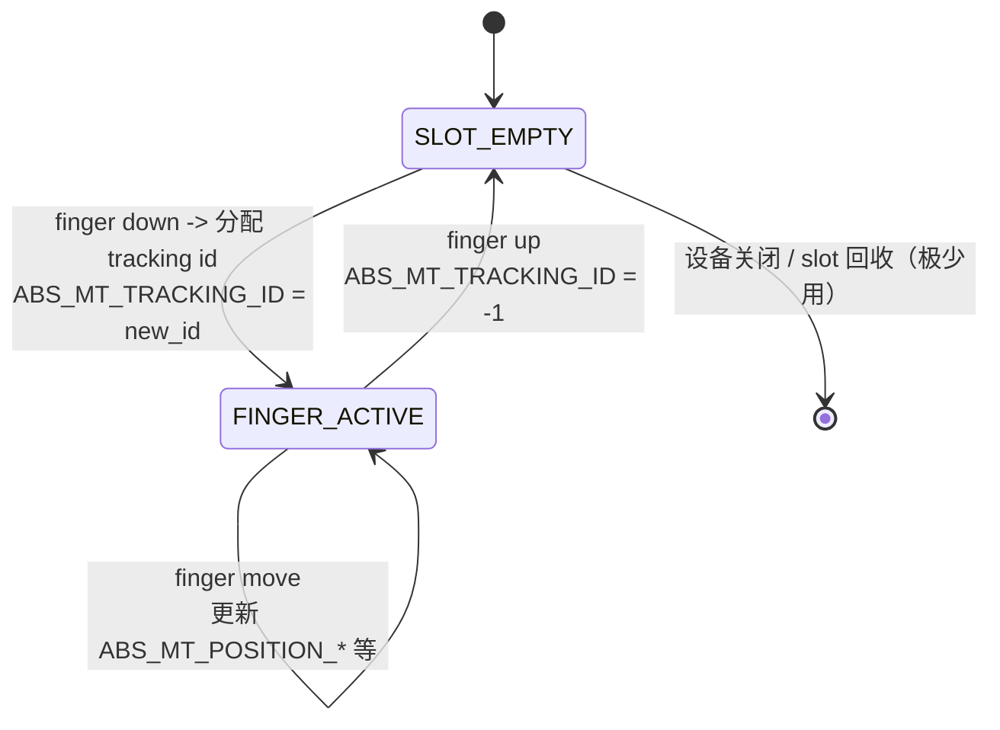

从驱动角度，要做的是：

- 有新指头 → 选择一个空 slot → 为该 slot 设置 `ABS_MT_TRACKING_ID = new_id`；
- 持续存在的指头 → 在该 slot 下更新 `ABS_MT_POSITION_*` 等；
- 指头抬起 → 在该 slot 报告 `ABS_MT_TRACKING_ID = -1`。

后面讲 API 时，会用 `input_mt_get_slot_by_key()` 等辅助函数简化这个过程，但本质就是这棵状态机。

------

### 6.4.3 MT-B 报文结构：一帧中的事件顺序

这一节只讲事件语义结构，不讲具体代码。

#### 6.4.3.1 一帧内的基本结构

在 MT-B 模式下，**一帧多点触摸数据**典型长这样（伪代码）：

- 多指更新的一帧：

```text
EV_ABS   ABS_MT_SLOT         s0
EV_ABS   ABS_MT_TRACKING_ID  id0
EV_ABS   ABS_MT_POSITION_X   x0
EV_ABS   ABS_MT_POSITION_Y   y0
...      其它 ABS_MT_* 轴
EV_ABS   ABS_MT_SLOT         s1
EV_ABS   ABS_MT_TRACKING_ID  id1
EV_ABS   ABS_MT_POSITION_X   x1
EV_ABS   ABS_MT_POSITION_Y   y1
...
EV_SYN   SYN_REPORT          0
```

- 某些 slot 本帧没有更新，则**代表“沿用上一帧状态”**：用户态从缓存中拿到该 slot 的旧值，仍然认为该指头在本帧存在。

注意几点：

1. `ABS_MT_SLOT` 是 **必需** 的，先切 slot，再在该 slot 上更新 `ABS_MT_*`；
2. `SYN_REPORT` 仍旧是 **帧结束标志**：
   - 一帧内所有 slot 的更新必须在 `SYN_REPORT` 之前完成；
   - 用户态在 `SYN_REPORT` 上认为“本帧 snapshot 完成，可以做一次整体处理”。

------

#### 6.4.3.2 指头按下 / 抬起的特殊序列

- 新指头按下（占用之前空闲的 slot）：

```text
EV_ABS   ABS_MT_SLOT         sN
EV_ABS   ABS_MT_TRACKING_ID  new_id
EV_ABS   ABS_MT_POSITION_X   x_new
EV_ABS   ABS_MT_POSITION_Y   y_new
EV_SYN   SYN_REPORT
```

- 指头抬起（让 slot 回到 empty）：

```text
EV_ABS   ABS_MT_SLOT         sN
EV_ABS   ABS_MT_TRACKING_ID  -1
EV_SYN   SYN_REPORT
```

- 同一帧中既有 move 又有 up/down 时，要保证：
  - 所有相关 slot 的状态在同一 `SYN_REPORT` 前全部更新，以便用户态在一帧里得到完整快照。

------

#### 6.4.3.3 典型时间序列可视化

下面用时序图描述一个简单场景：

- 开始时：无手指；
- 用户先按下第一根指头，再按下第二根；
- 然后移动两根指头；
- 最后依次抬起。

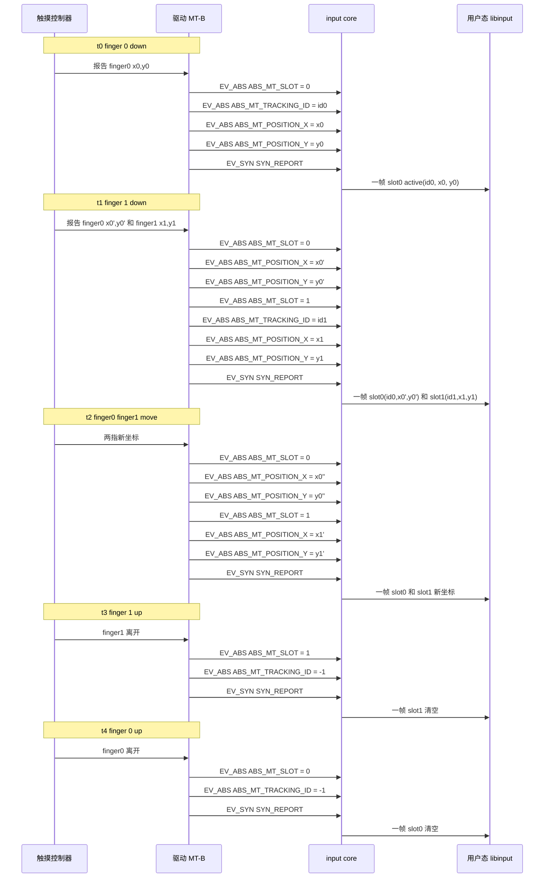

后续我们会把这套行为映射到驱动代码：

- 如何在 `probe()` 中初始化 slot 数量；
- 如何在中断处理里给每个指头选择/维护 slot；
- 如何保证 `tracking id` 的一致性。

------

### 6.4.4 MT-B 的设计边界：驱动与用户态各自负责什么

为了避免你后面写章节时反复解释，这里先把 MT-B 模型下的“责任划分”说清楚：

1. **驱动负责：**
   - 决定设备有多少个 slot（最大支持点数）；
   - 把每一根真实指头映射到某个 slot；
   - 为每个 slot 维护一个 `tracking id` 生命周期；
   - 在每一帧中，保证所有活跃 slot 的状态在一个 `SYN_REPORT` 之前上报完整。
2. **input core / handler 负责：**
   - 按 `ABS_MT_SLOT` 把 `ABS_MT_*` 属性归类到对应 slot；
   - 向 evdev/libinput 等暴露一个 **“多指 snapshot”** 抽象。
3. **用户态负责：**
   - 基于 slot / tracking id 进行手势识别（缩放、旋转、双指平移等）；
   - 利用 ABS 参数（min/max/fuzz/flat/resolution，见 6.3）做坐标映射和噪声控制；
   - 针对复杂场景（如 palm rejection、多用户触控）做策略决策。

**MT-B 的“统一”点在于：**

> 内核和驱动统一以“slot + tracking id + ABS_MT_* + SYN_REPORT”
>  的方式表达多指状态，而不是让每块硬件各说各话。
>  “这些多指数据如何解释成手势/操作”仍然留给用户态。

------

### 6.4.5 小结（本批次）

本批次只是 6.4 的第一部分，核心是把 MT-B 的心智模型搭起来：

- MT-B 相比 MT-A 的本质差异是 **slot 模型**；
- 每个 slot 是一个“多指状态容器”，通过 `ABS_MT_SLOT` 切换；
- `ABS_MT_TRACKING_ID` 描述“当前 slot 是否被某指头占用，以及是哪一个”；
- 一帧内：按 slot 更新状态，最后用 `SYN_REPORT` 封帧；
- 驱动负责“slot 与真实指头之间的映射 + tracking id 生命周期维护”，
   用户态负责“基于 slot 的手势/策略处理”。


------

## 6.5 同步与并发语义（必须讲透）

> **本节内容说明**
>  本节从“并发语义”的角度，把前面所有例子背后的共性约束讲清楚：
>
> - 为什么必须坚持“采集可睡、上报不睡”；
> - hard IRQ、线程化 IRQ、workqueue、进程上下文四种上下文之间的边界；
> - input core 内部的顺序保证（短自旋锁、环形缓冲、唤醒）；
> - 帧一致性（frame）与 TOCTOU 的处理思路；
> - 关机/休眠顺序与 `disable_irq_sync()` 的角色；
> - 背压和丢帧时，如何让用户态自愈重同步。
>
> 本批次先完成 **6.5.1 “采集可睡、上报不睡”**，其余小节在后续批次展开。

------

### 6.5.1 “采集可睡、上报不睡”：上下文与调用边界

#### 6.5.1.1 引入：为什么要把“采集”和“上报”拆成两个阶段

在 input 驱动里，“从硬件拿一帧数据”到“调用 `input_report_*()` + `input_sync()`”这条路径，经常被混用成一个函数，甚至放在中断上半部里做完。但从同步与并发的角度，必须严格区分两件事：

1. **采集（sample）**
   - 访问 I²C/SPI/ADC、状态机重试、复杂滤波逻辑等；
   - 经常需要睡眠（`msleep` / `wait_event` / `i2c_transfer()` 等）；
   - 适合放在线程化 IRQ、workqueue、或者普通进程上下文中。
2. **上报（report）**
   - 调用 `input_report_key()` / `input_report_abs()` / `input_mt_*()` / `input_sync()`；
   - 这些 API **假定在“不可睡”的短临界区内完成”**，且调用路径内部持有一些短时间自旋锁；
   - 需要尽量短小、可预测，不做任何会睡眠或超长运算。

用一句话概括本小节要强调的核心约束：

> **采集可以在可睡上下文中慢慢做，但上报必须在“短、不睡”的路径中完成。**

下面从数据结构、开发者视角、用户/平台视角分别展开。

------

#### 6.5.1.2 数据结构视角：input core 内部的“短临界区”

要理解“上报不睡”的约束，需要看 input core 的内部结构（简化视角）：

- `struct input_dev`：
  - 包含事件缓冲（event buffer）、同步序号、状态位等；
  - 对这些字段的写操作通常在持有一个 **短时间自旋锁** 下完成。
- evdev/joydev 等 handler：
  - 每个 handler 维护自己的环形缓冲区和等待队列；
  - 当驱动调用 `input_report_*()` / `input_sync()` 时，core 会：
    - 在持锁状态下把事件写入 handler 的环形缓冲；
    - 在适当的点唤醒等待的读者（`wake_up_interruptible()`）。

这意味着：

1. **input core 的内部锁通常是自旋锁（spinlock）而不是 mutex**；
2. 在这些持锁区域内：
   - 不允许睡眠；
   - 不应做长时间计算；
   - 应确保一次 `input_sync()` 引出的所有 handler 处理都在一个可控的时间片内完成。

因此：

- “上报不睡”不是建议，而是：**为了保证 input core 内部锁的实时性和可预测性，必须遵守的约束**；
- 而“采集可睡”，是为了避免把慢操作塞进这些短临界区。


------

#### 6.5.1.3 开发者视角：四种上下文如何切分采集与上报

从驱动开发者的角度，可以把会涉及到 input 事件路径的上下文分成四类，需要特别区分的是：**“线程化 IRQ” 是内核线程上下文，可以睡，而传统 softirq/tasklet 这种“下半部”是软中断上下文，不能睡**。

##### （1）hard IRQ handler：中断上半部（不可睡）

- 典型来源：`request_irq()` 注册的普通中断处理函数 `irq_handler_t handler`。
- 运行在 **硬中断上下文**：
  - 中断屏蔽状态受控制；
  - **绝对不能睡**：不能调度、不能拿 mutex、不能做 I²C/SPI 这类可能阻塞的访问。
- 在 input 驱动中的合理用途：
  - 清除中断状态寄存器；
  - 记录时间戳或极少量状态位；
  - 唤醒线程化 IRQ / workqueue；
  - **不在这里做采集和上报**。

##### （2）传统 bottom half：softirq / tasklet（不可睡）

- 历史上被称为“中断下半部”，典型形式是 softirq / tasklet。
- 运行在 **软中断上下文**：
  - 同样 **不能睡**；
  - 不允许调用会阻塞的 API。
- 本书的 input 驱动路径**不推荐**再手写 softirq/tasklet 作为数据采集路径，更推荐使用 **线程化 IRQ + workqueue**，所以在后续章节中基本不展开 softirq/tasklet 的细节。

##### （3）线程化 IRQ handler：`request_threaded_irq()` 的 thread_fn（可睡）

- 通过 `request_threaded_irq(irq, handler, thread_fn, flags, ...)` 注册：
  - `handler`：硬中断处理函数（可为 `NULL`）；
  - `thread_fn`：**线程化 IRQ 处理函数**。
- `thread_fn` 运行在 **内核线程上下文（kthread）**，语义上属于“这个 IRQ 的处理线程”，具有以下属性：
  - 可以睡：可以调用 I²C/SPI、拿 mutex、使用 `msleep()` / `wait_event()` 等；
  - 但仍需控制执行时间，避免长时间阻塞导致该 IRQ 处理节奏异常。
- 典型推荐用法：
  - 硬中断上半部只负责“快速 ack + 唤醒 thread_fn”；
  - 在线程化 IRQ 的 `thread_fn` 中完成：
    - **采集阶段**：访问 I²C/SPI/ADC，获取一整帧数据（可睡）；
    - **上报阶段**：在同一 `thread_fn` 中执行 `input_report_*()` + `input_sync()`（上报本身不睡，但所处上下文允许睡）。

> 小结：
>  **线程化 IRQ 是“可睡的中断处理线程”，不等同于传统 softirq/tasklet，那种“下半部不能睡”的结论不适用于 `thread_fn`。**

##### （4）workqueue（可睡）

- 运行在 kworker 线程中，属于 **内核线程上下文**：
  - 可以睡，可以拿 mutex，可以访问 I²C/SPI。
- 典型用途：
  - 周期轮询型 input 设备（没有硬件 IRQ，只能定期询问状态）；
  - 错误恢复、延迟重试（比如某帧数据校验失败，延迟再读一次）。
- 在 input 驱动中的常见模式：
  - `open()` 时启动轮询 work / delayed_work；
  - `close()` 时 cancel 掉 work；
  - 在 work 回调中：
    - 采集一帧数据（可睡）；
    - 紧接着执行 `input_report_*()` + `input_sync()` 上报。

##### （5）进程上下文：probe/open/close/ioctl 等（可睡）

- `probe()`、`remove()`、`input_dev->open()`、`input_dev->close()`、某些 ioctl 等都运行在进程上下文：
  - 可以睡；
  - 常用于：
    - 首次标定/校准采样（例如在 `probe()` 中读一次硬件能力）；
    - 在 `open()` 中启动轮询或使能中断；
    - 在 `close()` 中停用中断或停止 workqueue。
- 如果设备只是偶尔需要采样，某些简单输入设备甚至可以完全依赖进程上下文下的定时器/工作队列进行采集与上报。

##### （6）四种上下文对比与“采集/上报”分工表

| 上下文类型                      | 是否可睡 | 典型接口来源                 | 适合放置的逻辑                | 不适合放置的逻辑                             |
| ------------------------------- | -------- | ---------------------------- | ----------------------------- | -------------------------------------------- |
| hard IRQ handler                | 否       | `request_irq()` 的 handler   | 快速 ack、中断计数、唤醒线程  | I²C/SPI 采样、`input_report_*()` 大量调用    |
| softirq / tasklet（传统下半部） | 否       | softirq / tasklet 机制       | 极短处理，兼容旧驱动          | 任何需要睡眠或耗时的采样/上报                |
| 线程化 IRQ thread_fn            | 是       | `request_threaded_irq()`     | 一帧的采集 + 上报（推荐）     | 过长阻塞（应避免拖长整个 IRQ 处理周期）      |
| workqueue / delayed_work        | 是       | `schedule_work()` / `*_work` | 周期轮询、重试、采样 + 上报   | 与实时强相关的极短响应（应交给 IRQ 线程）    |
| 进程上下文（probe/open/…）      | 是       | 驱动回调 / 文件操作          | 首次标定、启动/停止轮询或 IRQ | 高频采样路径（不宜在用户态频繁触发内核操作） |

在本书后续所有 input 示例中，默认遵循以下模式：

1. **不在 hard IRQ / softirq / tasklet 里做任何采样或上报**；
2. **推荐优先使用线程化 IRQ 的 `thread_fn` 作为“采集 + 上报”的主路径**；
3. 若硬件无 IRQ 或需要周期轮询，则在 workqueue 中完成采集与上报；
4. 进程上下文主要用于生命周期管理（启停轮询/IRQ）、一次性采样和标定。

这样，“采集可睡、上报不睡”的规则就可以具体落实为：

- **采集**：只发生在“可睡上下文”（线程化 IRQ、workqueue、进程上下文）；
- **上报**：调用 `input_report_*()` / `input_sync()` 本身不睡，但所在的函数必须运行在“我们可控、可睡但自己不睡的线程上下文”中，绝不塞到 hard IRQ / softirq/tasklet 里去。


------

#### 6.5.1.4 用户/平台视角：延迟 vs 抖动与 CPU 负载

从用户/平台的角度，这种“采集可睡、上报不睡”的切分，会直接影响：

1. **事件延迟**
   - 采集在线程化 IRQ/工作队列中做，带来一定调度延迟；
   - 但避免了硬中断中长时间停顿，使系统整体延迟更稳定；
   - 对触摸屏这类人机接口，几十毫秒以内的延迟通常可接受。
2. **抖动与实时性**
   - 硬中断路径简短，减少对其它 IRQ 的阻塞；
   - input core 内部锁持有时间可控，事件分发延迟更加可预测；
   - 用户态看到的事件时间戳更稳定，不会时而排队很久、时而极快。
3. **CPU 负载与功耗**
   - 把采集阶段设计为“**仅在有数据或适当频率下运行的可睡线程**”，而不是硬中断中高频忙等；
   - 有利于在移动设备上节能，也减少高负载场景下的抢占压力。

对平台维护者而言，这种划分使得 input 驱动可以：

- 遵守系统统一的“中断负载”策略；
- 更容易通过 ftrace / perf / lockdep 等工具分析瓶颈。

------

#### 6.5.1.5 可视化：四种上下文与采集/上报关系

下面这张图是我们之前修过语法的那张，现在把它正式作为 6.5.1 的可视化图示。

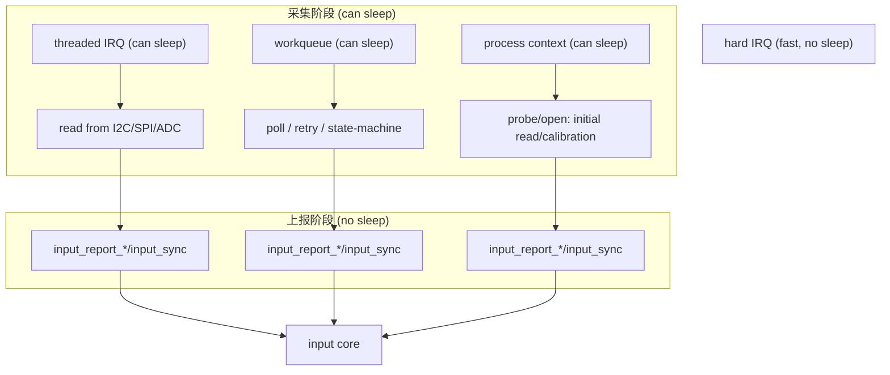

阅读要点：

- `hard IRQ` 不直接连到采集节点，而是隐含地“唤醒 TIRQ/WQ”；
- 三种可睡上下文（线程 IRQ / WQ / 进程）都可以作为“采集阶段”的载体；
- 但无论从哪条路径走到上报阶段，`input_report_*()` / `input_sync()` 都被视为“不可睡、短路径”，最终统一进 `input core`。

------

#### 6.5.1.6 示例代码：在不同上下文中拆分采集与上报

下面用两个最常见的模式示例化：

##### （1）线程化 IRQ：中断触发采样 + 上报（推荐）

```c
#define DEMO_TS_IRQFLAGS			(IRQF_ONESHOT | IRQF_TRIGGER_FALLING)

static irqreturn_t demo_ts_irq_thread(int irq, void *dev_id)
{
	struct demo_ts_data *ts = dev_id;
	struct input_dev *input = ts->input;
	struct demo_ts_contact contacts[DEMO_TS_MAX_SLOTS_CNT];
	int num_slots;
	int i;

	/* 阶段 1：采集，可睡，访问 I2C/SPI */
	num_slots = demo_ts_hw_read_frame(ts, contacts,
					  DEMO_TS_MAX_SLOTS_CNT);
	if (num_slots < 0)
		return IRQ_HANDLED;

	/* 阶段 2：上报，不睡，调用 input_report_*() */
	for (i = 0; i < num_slots; i++) {
		struct demo_ts_contact *c = &contacts[i];

		input_mt_slot(input, i);
		input_mt_report_slot_state(input,
					   MT_TOOL_FINGER,
					   c->active);

		if (!c->active)
			continue;

		input_report_abs(input, ABS_MT_POSITION_X, c->x);
		input_report_abs(input, ABS_MT_POSITION_Y, c->y);
	}

	input_mt_sync_frame(input);
	input_sync(input);

	return IRQ_HANDLED;
}

static int demo_ts_request_irq(struct demo_ts_data *ts)
{
	int error;

	error = devm_request_threaded_irq(&ts->client->dev,
					  ts->client->irq,
					  NULL,
					  demo_ts_irq_thread,
					  DEMO_TS_IRQFLAGS,
					  "demo_mt_ts", ts);
	if (error)
		return error;

	return 0;
}
```

要点：

- `top-half` 传入 `NULL`，只使用线程化下半部，保证所有工作都在可睡上下文中完成；
- 采集阶段与上报阶段在同一 thread 回调中串行执行，但上报逻辑本身不做睡眠操作。

##### （2）轮询 + workqueue：无需中断的周期采样

```c
#define DEMO_TS_POLL_INTERVAL_MS	10

static void demo_ts_work_func(struct work_struct *work)
{
	struct demo_ts_data *ts =
		container_of(work, struct demo_ts_data, work);
	struct input_dev *input = ts->input;
	struct demo_ts_contact contacts[DEMO_TS_MAX_SLOTS_CNT];
	int num_slots;
	int i;

	num_slots = demo_ts_hw_read_frame(ts, contacts,
					  DEMO_TS_MAX_SLOTS_CNT);
	if (num_slots >= 0) {
		for (i = 0; i < num_slots; i++) {
			struct demo_ts_contact *c = &contacts[i];

			input_mt_slot(input, i);
			input_mt_report_slot_state(input,
						   MT_TOOL_FINGER,
						   c->active);

			if (!c->active)
				continue;

			input_report_abs(input, ABS_MT_POSITION_X, c->x);
			input_report_abs(input, ABS_MT_POSITION_Y, c->y);
		}

		input_mt_sync_frame(input);
		input_sync(input);
	}

	/* 重新排队，实现轮询 */
	schedule_delayed_work(&ts->dwork,
			      msecs_to_jiffies(DEMO_TS_POLL_INTERVAL_MS));
}
```

要点：

- workqueue 上下文可睡，因此采集完全可以调用 I²C/SPI；
- 上报逻辑仍然保持“不睡、短路径”；
- `open()` 时启动工作，`close()` 时 cancel，和 6.1 的生命周期配合使用。

------

#### 6.5.1.7 调试与验证：如何确认没有在“错误上下文”里上报

几个实用检查点：

1. **代码静态检查**
   - 保证所有 `input_report_*()` / `input_sync()` 调用**只出现在**：
     - 线程化 IRQ handler；
     - workqueue 回调；
     - 进程上下文函数（`open`/`close`/ioctl 等）；
   - 而 **不出现在**：硬中断上半部、atomic context 或持 spinlock 的长路径中。
2. **lockdep/CONFIG_DEBUG_ATOMIC_SLEEP**
   - 打开 `CONFIG_DEBUG_ATOMIC_SLEEP`，在可能睡眠的地方调用 `might_sleep()`；
   - 反向思考：确认“上报函数周围没有任何可能睡眠的调用”。
3. **tracepoints / ftrace**
   - 利用 input 相关 tracepoint（如 `input_handle_event`）跟踪事件路径；
   - 配合 `irqsoff` / `preemptoff` 等 tracer，查看上报时是否有长时间关抢占或关中断。
4. **延迟分析**
   - 建立“中断输入 → 用户态事件到达”的时间测量；
   - 如果延迟抖动极大，有可能是采集/上报路径混乱导致。

------

#### 6.5.1.8 小结：把“采集可睡、上报不睡”当作硬约束

本小节的结论可以缩成几条：

1. input core 内部通过短自旋锁和环形缓冲维护事件队列，**不能承受在持锁路径里睡眠或做长运算**，这决定了“上报必须不睡”。
2. 采集往往需要访问 I²C/SPI/ADC 和必要的重试逻辑，因此**必须放在可睡上下文中**：线程化 IRQ、workqueue、进程上下文。
3. 硬中断上半部只负责唤醒适当的线程或工作，不负责采集和上报。
4. 从用户/平台视角，这种拆分使得：
   - 中断延迟和锁持有时间可控；
   - 整体系统延迟更稳定；
   - 负载分析和功耗控制更简单。
5. 在实际代码中，应刻意检查所有 `input_report_*()` / `input_sync()` 调用的位置，确保它们只出现在“可睡 + 自己不睡”的上下文里。


------

### 6.5.2 设备级顺序：input core 自旋锁与处理层环形缓冲

> **本小节内容说明**
>  本小节从“设备级顺序”的角度解释：
>
> - 驱动连续调用 `input_report_*()` / `input_sync()` 时，input core 内部如何保证事件顺序；
> - evdev/joydev 等处理层如何用环形缓冲 + 唤醒队列，把这一顺序传递到用户态；
> - 对驱动开发者来说，哪些顺序是 **内核帮你保证的**，哪些必须自己保证（尤其是帧边界和多 CPU 并发）；
> - 用户态 `read()` / `poll()` 看到的“帧”和“顺序”具体是什么意思。

------

#### 6.5.2.1 引入：我们到底需要哪几种“顺序保证”

对于一个 input 设备，最常见的“顺序需求”有三类：

1. **同一 CPU、同一上下文中，一组 `input_report_\*()` → `input_sync()` 的事件顺序**
   - 要求：完全按调用顺序出现在 `struct input_event` 流里；
   - 这是“帧内顺序”。
2. **多帧之间的先后关系**
   - 对同一个设备：
     - 第二次 `input_sync()` 之后的所有事件，必须在第一帧之后到达用户态；
   - 这是“帧间顺序”。
3. **多 CPU 并发调用时的顺序边界**
   - 同一 `input_dev` 不应该在多个 CPU 上并发执行“上报”逻辑；
   - 否则：事件会在内部交叉、乱序，帧语义无法保证。

本小节的核心就是说明：

> - **1、2**：input core + evdev 的内部锁和环形缓冲会帮你保证；
> - **3**：驱动必须保证“同一设备的上报路径只在一个线程中执行”，否则你会在锁边界内制造出逻辑竞态。

------

#### 6.5.2.2 数据结构视角：`input_dev` 与 handler 的关键字段

从结构体角度看，和“顺序”强相关的是：

- `struct input_dev`：
  - 内部有一个自旋锁（通常是 `spinlock_t event_lock` 或类似命名）；
  - 一次 `input_event()` / `input_report_*()` 调用会在持该锁的情况下，更新设备状态并调用 handler 链；
- `struct evdev`（或其它 handler，如 joydev）：
  - 持有一个环形缓冲 `struct evdev_client` / `struct input_handle` 里的 event buffer；
  - 每次收到事件时，在自旋锁保护下写入缓冲并维护 head/tail 指针；
  - 在需要时调用 `wake_up_interruptible()` 唤醒等待 `read()` / `poll()` 的线程。

简化抽象可以写成：

```c
/* 伪代码，仅表达顺序语义 */

void input_event(struct input_dev *dev,
		 unsigned int type,
		 unsigned int code,
		 int value)
{
	unsigned long flags;

	spin_lock_irqsave(&dev->event_lock, flags);

	/* 更新 dev 内部状态（如 ABS 缓存） */
	/* ... */

	/* 将事件广播给所有 handler（evdev 等） */
	list_for_each_entry(handler, &dev->h_list, node)
		handler->event(handler, type, code, value);

	spin_unlock_irqrestore(&dev->event_lock, flags);
}
```

而 handler 内部又类似：

```c
/* evdev 中的 event 回调伪代码 */

static void evdev_event(struct input_handle *handle,
			unsigned int type,
			unsigned int code,
			int value)
{
	struct evdev *evdev = handle->private;
	unsigned long flags;

	spin_lock_irqsave(&evdev->client_lock, flags);

	/* 写入环形缓冲 */
	evdev->buffer[evdev->head].type  = type;
	evdev->buffer[evdev->head].code  = code;
	evdev->buffer[evdev->head].value = value;
	evdev->buffer[evdev->head].time  = ktime_get(); /* 或从 input_event 传下来的时间 */

	evdev->head = (evdev->head + 1) & EVDEV_BUFFER_MASK;

	spin_unlock_irqrestore(&evdev->client_lock, flags);

	/* 如有需要，唤醒等待 read()/poll() 的进程 */
	wake_up_interruptible(&evdev->wait);
}
```

两层自旋锁串起来，保证了：

- 对于单个 `input_dev` 的一次 `input_event()` 调用，其对应的 **所有 handler 写缓冲操作是在同一临界区“打包”完成的**；
- 同一设备多次 `input_event()` 调用在 `event_lock` 上串行，天然按调用顺序排队。

这就是 **“帧内顺序 + 帧间顺序”可靠的根本原因**。

------

#### 6.5.2.3 开发者视角：哪些顺序内核帮你兜底，哪些需要你自己保证

从驱动编写者的角度，可以记成两条：

1. **在同一个线程里按顺序调用 `input_report_\*()` + `input_sync()`，
    内核会帮你保证：**

   - 同一帧内事件的顺序不变；
   - 各帧的 `SYN_REPORT` 相对顺序不乱；
   - 所有 handler（evdev/joydev 等）看到的顺序一致。

2. **但内核不会帮你解决这个问题：**

   > “同一个 `input_dev` 被多个线程并发上报。”

   如果你写出类似这样的逻辑：

   ```c
   /* 线程 A */
   input_report_key(dev, KEY_A, 1);
   input_sync(dev);
   
   /* 线程 B */
   input_report_key(dev, KEY_B, 1);
   input_sync(dev);
   ```

   且 A/B 同时运行，虽然内部有锁保证单次 `input_event()` 内部一致，但帧级别的交织顺序就变成“不确定”：

   - 可能是：`A_down` 帧 → `B_down` 帧；
   - 也可能是：`B_down` 帧 → `A_down` 帧；
   - 如果你在 A/B 中更复杂地混合 ABS/KEY/MT 事件，帧语义会变成难以理解的交叉流。

**因此，驱动必须遵守一条硬规则：**

> **对同一个 `input_dev`，所有上报路径必须只在一个执行线程里串行运行。**
>  不允许多线程/多 CPU 同时对同一 `input_dev` 调用 `input_report_*()` / `input_sync()`。

实践上就是：

- **触摸屏**：所有上报放在一个线程化 IRQ 或一个 workqueue 中执行；
- **组合设备（例如按键 + 摇杆）**：
  - 若使用同一个 `input_dev` 暴露给用户态，就用一个线程统一管理；
  - 若确实需要不同线程处理不同源，建议拆成多个 `input_dev`。

------

#### 6.5.2.4 用户 / 平台视角：`read()` / `poll()` 看到的顺序

从用户态看，你能依赖的“顺序语义”是：

1. **对同一个 `/dev/input/eventX`：**
   - 所有 `struct input_event` 按时间顺序排列；
   - 每个 `SYN_REPORT` 将“前一批事件”划分成一帧；
   - 帧内事件顺序 = 驱动在 `input_report_*()` 中调用的顺序。
2. **用户态 `read()` / `poll()`：**
   - `read()` 按顺序取出环形缓冲中的事件；
   - `poll()` / `select()` 在缓冲非空时返回，**不会改变事件的顺序**，只影响“何时被唤醒”。
3. **多消费者的情况（多个进程同时打开同一 event 设备）：**
   - 每个 evdev client 有自己的环形缓冲和读指针；
   - 顺序语义对每个 client 独立成立；
   - 不同 client 之间不会互相干扰（某个客户端读快/读慢不会影响另一个的顺序）。

对平台开发者来说，这意味着：

- 可以把“顺序”理解为：
  - **单设备、单 client 内保证强顺序**；
  - 多设备、多 client 之间没有全局顺序要求。

------

#### 6.5.2.5 可视化：驱动 → input core → evdev → 用户态的顺序链路

下面这张时序图把“顺序”从驱动一路画到用户态：

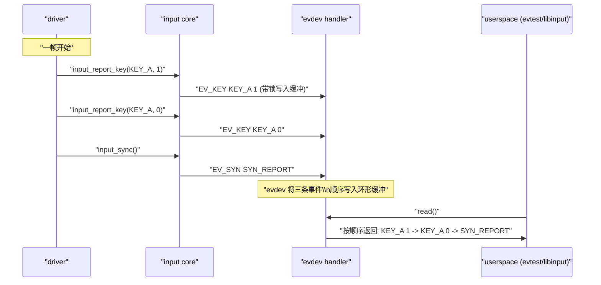

阅读要点：

- 驱动对同一帧的调用顺序：
   `report_down → report_up → sync`；
- input core 保证 handler 看见的顺序不变；
- evdev 将三个事件按顺序写入 client 的环形缓冲；
- 用户态从 `read()` 看到的顺序与驱动调用顺序一致。

------

#### 6.5.2.6 示例代码：按键设备的顺序与单线程上报模式

以下是一个极简按键 input 驱动的“上报部分”骨架，只展示顺序相关的关键点：

```c
#define DEMO_KEY_DEBOUNCE_MS		10

struct demo_key_data {
	struct input_dev	*input;
	int			irq;
	/* 其它硬件相关数据 */
};

static irqreturn_t demo_key_irq_thread(int irq, void *dev_id)
{
	struct demo_key_data *data = dev_id;
	struct input_dev *input = data->input;
	bool pressed;

	/* 采集阶段：可睡，读取 GPIO/寄存器 */
	pressed = demo_key_hw_read_state(data);

	/* 上报阶段：单线程顺序调用 input_report_* */
	input_report_key(input, KEY_POWER, pressed);
	input_sync(input);

	return IRQ_HANDLED;
}
```

关键点：

- 整个设备的上报只在 **一个线程化 IRQ** 中进行；
- 每次中断只上报一帧：`KEY_POWER` 的当前状态 + `SYN_REPORT`；
- 内核 + evdev 对帧内的 `KEY_POWER` 事件顺序和帧间先后关系做了完整保证。

如果你在这个基础上加上 **长按/连按状态机**，仍然必须保证：

- 所有状态机的输出事件都在这个线程（或某个单一线程）里顺序调用 `input_report_*()` / `input_sync()`。
- 不允许把同一个 `input_dev` 的事件分散到多个 work/线程中竞争调用。

------

#### 6.5.2.7 调试与验证：如何确认顺序语义正常

实际开发中，建议从以下几个方向验证顺序：

1. **用 `evtest` 观察事件顺序**
   - 连续做“按下 → 抬起 → 多键组合”的操作；
   - 校验 `EV_KEY` + `EV_SYN` 顺序是否符合预期（帧划分正确）。
2. **用 `libinput debug-events` 观察复杂场景**
   - 对触摸屏、多点触控设备，检查 MT 帧内 slot 顺序与 `SYN_REPORT` 的位置；
   - 结合第 6.4 节的 MT-B 模型进行比对。
3. **使用 tracepoints / ftrace**
   - 打开 input 相关 tracepoint（如 `input_handle_event`）；
   - 检查同一 `input_dev` 的事件在 CPU 上的执行顺序；
   - 确认没有多个线程同时走进同一 `input_dev` 的上报路径。
4. **代码审查**
   - 搜索所有 `input_report_*()` / `input_sync()` 的调用点；
   - 确认它们都归属于 **同一个执行线程/工作队列**。
   - 若发现跨多个线程，则需要改为：
     - 使用队列/状态机在一个线程中统一上报；
     - 或拆分成多个 `input_dev`。

------

#### 6.5.2.8 小结：把“顺序”留给内核，自己只负责“单线程上报”

本小节可以用一句话总结驱动侧的责任：

> **只要你保证对同一个 `input_dev` 的 `input_report_\*()` / `input_sync()` 调用在一个线程里按逻辑顺序执行，其余顺序问题交给 input core + evdev 即可。**

更细一点：

1. input core 内的自旋锁保证：
   - 同一 `input_dev` 的事件在 handler 端看到的顺序与驱动调用顺序一致。
2. evdev/joydev 的环形缓冲 + `wake_up` 保证：
   - 每个客户端进程按 FIFO 顺序读到事件，帧边界清晰。
3. 驱动必须保证：
   - 不在多个线程中并发调用同一 `input_dev` 的上报函数；
   - 上报逻辑本身尽量短小，不做睡眠/复杂计算，避免把 input core 的锁占用时间拉长。
4. 用户/平台可以依赖：
   - 对单设备、单 client 来说，事件顺序与驱动上报顺序严格一致；
   - `SYN_REPORT` 划定的帧边界是可信的，可以据此实现更高层的手势/逻辑处理。


------

### 6.5.3 帧一致性与 TOCTOU：帧号 / 前后检查 data-ready + 有限重读

> **小节内容说明**
>  本小节从“**一帧数据的一致性**”入手，专门解决这样一类问题：
>
> - 触摸控制器在更新内部缓冲，我们在 I²C/SPI 上读数据；
> - 读到一半，对方换了一帧，导致“**前半帧 vs 后半帧**”属于不同时间点；
> - 上报到 input core 后，用户态看到的是“物理上从未出现过的”点位组合（典型的 TOCTOU）。
>
> 目标是给出两套可操作的模式：
>
> 1. **帧号方案**：通过硬件提供的 frame_id 注册，做前后两次一致性检查；
> 2. **data-ready 前后检查 + 有限重读方案**：在没有帧号寄存器时，用状态寄存器 + 有限次数重试实现近似语义。
>
> 这两套方案都只发生在“采集阶段（可睡）”，确保 **上报阶段只处理“完整且自洽”的帧**。

------

#### 6.5.3.1 引入：为什么单次“顺读”不足以保证一帧一致

典型的 I²C 触摸屏寄存器布局大致如下（抽象）：

- 状态寄存器：`STATUS`
  - bit[0..3]：当前触点个数 `touch_cnt`；
  - bit[x]：data-ready / buffer-valid 标志。
- 坐标缓冲区：`POINTS[]`
  - 每个触点若干字节：`x_hi, x_lo, y_hi, y_lo, ...`

很多数据手册都会写一句类似：

> 读 `STATUS` 获取触点个数，再读 `POINTS` 区域获取所有触点坐标。

如果驱动照抄成：

```c
cnt = read(STATUS);            /* 得到 touch_cnt */
read(POINTS, cnt * POINT_SIZE);/* 顺着把点读完 */
```

但**不处理“读途中硬件换帧”**的情况，就会出现：

- 前半部分点属于帧 N，后半部分点属于帧 N+1；
- 某些控制器甚至会在我们读坐标期间更新 `STATUS` 与 `POINTS`——这就是典型的 **TOCTOU（time-of-check to time-of-use）** 问题。

从 input 的角度看，这会导致：

- 用户态看到一个“混合帧”：例如一根手指刚离开、一根刚落下，但被组合成“某根手指瞬移到不存在的位置”；
- 手势识别暴走：缩放/旋转突然跳变。

因此，对任何“多寄存器组成的一帧状态”，驱动都应显式回答两个问题：

1. **这一帧是完整的、没有被换帧截断吗？**
2. **如果在采集中被换帧，我们如何检测并处理？是重读还是丢掉？**

------

#### 6.5.3.2 数据结构视角：加入“帧一致性”的元信息

在采集阶段，我们可以在自己的驱动数据结构中，额外维护一些“帧相关”的元信息，用于 TOCTOU 防御，例如：

```c
#define DEMO_TS_MAX_POINTS_CNT		10
#define DEMO_TS_MAX_FRAME_RETRY_CNT	3

struct demo_ts_frame {
	u8		frame_id;	/* 硬件帧号（如有） */
	u8		touch_cnt;	/* 本帧触点个数 */
	bool		consistent;	/* 本帧是否通过一致性检查 */

	struct demo_ts_contact points[DEMO_TS_MAX_POINTS_CNT];
};

struct demo_ts_contact {
	int		x;
	int		y;
	int		pressure;
	bool		pressure_valid;
	bool		active;
};
```

说明：

- `frame_id`：
  - 硬件若提供“帧号寄存器”，可以直接填；
  - 若硬件不提供，可以在“前后检查 data-ready”模式下留空或使用本地递增计数。
- `touch_cnt`：
  - 存储本帧最终确认的触点个数；
  - 若一致性检查失败，可将其置 0 并标记 `consistent = false`。
- `consistent`：
  - 帧读取逻辑通过一致性检查后置真；
  - 供上报阶段决定“要不要上报这一帧 / 是否降级处理”。

`demo_ts_frame` 完全属于驱动内部结构，不直接暴露给 input core；
 input core 和用户态只看到“已经过一致性检查的帧”。

------

#### 6.5.3.3 开发者视角：两种常见防 TOCTOU 方案

##### （1）方案 A：帧号（frame_id）前后一致性检查

**适用条件：**

- 控制器提供某种“帧号寄存器”或“更新计数器”，例如：
  - `FRAME_ID`：每生成一帧数据自动 +1（回绕）；
  - `SEQ_NUM`：每次更新触摸缓冲区时递增。

**基本模式：**

1. 读 `FRAME_ID` 得到 `id_before`；
2. 读状态寄存器 / 坐标缓冲区，得到 `touch_cnt` 和坐标数组；
3. 再读一次 `FRAME_ID` 得到 `id_after`；
4. 若 `id_before == id_after`，认为这一帧一致；
    若不等，丢弃这次读的数据并在有限次数内重试。

伪代码：

```c
static int demo_ts_read_frame_with_id(struct demo_ts_data *ts,
				      struct demo_ts_frame *frame)
{
	int retry;
	int error;

	for (retry = 0; retry < DEMO_TS_MAX_FRAME_RETRY_CNT; retry++) {
		u8 id_before;
		u8 id_after;
		u8 touch_cnt;

		error = demo_ts_i2c_read(ts, DEMO_TS_REG_FRAME_ID,
					 &id_before, sizeof(id_before));
		if (error)
			continue;

		error = demo_ts_i2c_read(ts, DEMO_TS_REG_STATUS,
					 &touch_cnt, sizeof(touch_cnt));
		if (error)
			continue;

		error = demo_ts_i2c_read_points(ts, frame->points,
						DEMO_TS_MAX_POINTS_CNT,
						touch_cnt);
		if (error)
			continue;

		error = demo_ts_i2c_read(ts, DEMO_TS_REG_FRAME_ID,
					 &id_after, sizeof(id_after));
		if (error)
			continue;

		if (id_before != id_after)
			continue;	/* 期间换帧，重试 */

		frame->frame_id = id_before;
		frame->touch_cnt = touch_cnt;
		frame->consistent = true;

		return 0;
	}

	frame->consistent = false;
	frame->touch_cnt = 0;

	return -EAGAIN;
}
```

特点：

- 检测逻辑清晰：**只要前后 frame_id 不一样，就认定“中途被换帧”**；
- 不依赖 data-ready bit 的具体语义；
- 可以通过 `DEMO_TS_MAX_FRAME_RETRY_CNT` 实现有限重试，避免死循环。

##### （2）方案 B：data-ready 前后检查 + 有限重读（无帧号控制器）

**适用条件：**

- 控制器没有专门的 frame_id 寄存器；
- 但提供了 data-ready / buffer-valid / busy 标志位；
- 典型寄存器：`STATUS`：
  - bit[DRDY]：1 = 数据准备就绪、2 = 采集中；
  - bit[OVR]：有新帧覆盖旧帧。

**基本思路：**

1. 读一遍 `STATUS` 得到 `status0`；
2. 检查 data-ready bit 是否“处于可读状态”；
3. 在这次读的基础上，继续读触点数量 + 坐标；
4. 再读一遍 `STATUS` 得到 `status1`；
5. 若 `status0` 与 `status1` 的关键字段（data-ready / overflow）未发生变化，认为这次采样可以接受；
    若变化过大（例如置位 overflow、新 data-ready 等），认为可能换帧，丢弃本次读取，在有限次数内重试。

伪代码：

```c
#define DEMO_TS_STATUS_DRDY_MASK	0x01
#define DEMO_TS_STATUS_OVR_MASK		0x02

static bool demo_ts_status_ok(u8 status0, u8 status1)
{
	u8 s0 = status0 & (DEMO_TS_STATUS_DRDY_MASK |
			   DEMO_TS_STATUS_OVR_MASK);
	u8 s1 = status1 & (DEMO_TS_STATUS_DRDY_MASK |
			   DEMO_TS_STATUS_OVR_MASK);

	/* 简单策略：两次的 DRDY/OVR 完全相同才认为这帧稳定 */
	return s0 == s1;
}

static int demo_ts_read_frame_with_status(struct demo_ts_data *ts,
					  struct demo_ts_frame *frame)
{
	int retry;

	for (retry = 0; retry < DEMO_TS_MAX_FRAME_RETRY_CNT; retry++) {
		u8 status0;
		u8 status1;
		u8 touch_cnt;
		int error;

		error = demo_ts_i2c_read(ts, DEMO_TS_REG_STATUS,
					 &status0, sizeof(status0));
		if (error)
			continue;

		/* 可根据芯片文档检查 DRDY 是否为“可读”状态 */
		if (!(status0 & DEMO_TS_STATUS_DRDY_MASK))
			return -EAGAIN;	/* 本次帧尚未准备好 */

		error = demo_ts_i2c_read(ts, DEMO_TS_REG_TOUCH_CNT,
					 &touch_cnt, sizeof(touch_cnt));
		if (error)
			continue;

		error = demo_ts_i2c_read_points(ts, frame->points,
						DEMO_TS_MAX_POINTS_CNT,
						touch_cnt);
		if (error)
			continue;

		error = demo_ts_i2c_read(ts, DEMO_TS_REG_STATUS,
					 &status1, sizeof(status1));
		if (error)
			continue;

		if (!demo_ts_status_ok(status0, status1))
			continue;	/* 期间状态变化，重试 */

		frame->touch_cnt = touch_cnt;
		frame->consistent = true;
		return 0;
	}

	frame->consistent = false;
	frame->touch_cnt = 0;
	return -EAGAIN;
}
```

特点：

- 利用 data-ready / overflow 等状态位作为“采集中是否被打断”的侧面指标；
- 没有精确帧号，但通过“前后状态一致 + 有限重读”实现了近似语义；
- 若重试多次仍失败，宁可丢掉这一帧，也不要上报不一致帧。

------

#### 6.5.3.4 用户/平台视角：为什么“丢帧”比“乱帧”更容易处理

从用户/平台的视角看，驱动面对“采集中被换帧”有两种选择：

1. **勉强拼一帧**：
   - 把前半帧 N 和后半帧 N+1 的数据拼成一个“混合帧”；
   - 用户态看到的就是“物理世界不存在过的一帧快照”。
2. **直接丢帧**：
   - 发现帧不一致，直接放弃本次采样；
   - 用户态等下一帧，再做手势识别。

对手势识别算法来说：

- **偶尔丢 1～2 帧**：
  - 轨迹略微变稀疏，但仍保持拓扑一致性；
  - 可以通过插值/滤波平滑处理。
- **混入错误帧**：
  - 有可能瞬间出现“长距离跳变”、“点位交叉”等；
  - 会触发大量误判（错误缩放、误旋转、鬼触）。

因此，本小节的原则可以表述为：

> **在帧一致性无法保证时，更推荐“检测到问题 → 丢掉这一帧”，
>  而不是“强行拼出一帧不可信的快照”。**

从平台维护角度看，也更容易调试：

- 通过 trace / log 可以看到“丢帧告警”；
- 而“混合帧”则会以各种随机手势异常的形式出现，难以定位。

------

#### 6.5.3.5 可视化：带帧号的一次采集流程

下面用一张时序图，把 **“frame_id 前后检查 + 有限重读”** 过程表示出来（以一次成功采样为例）：

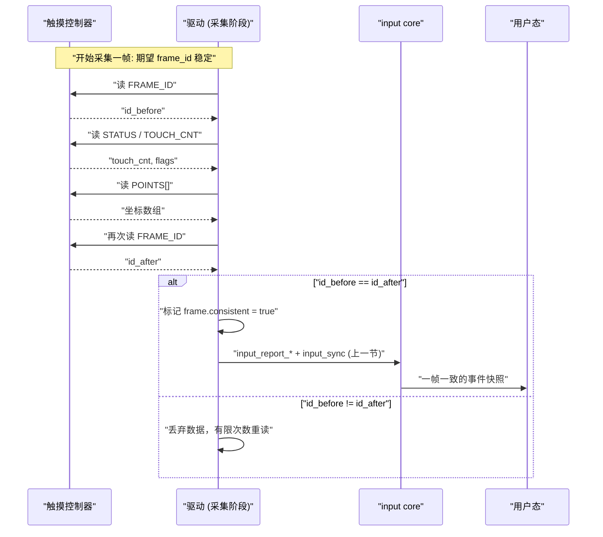

要点：

- 帧一致性逻辑完全在 D（驱动采集阶段）内部完成；
- 只在 `frame.consistent == true` 时，才会调用 `input_report_*()` 上报；
- 用户态不会直接看到“不一致的快照”。

------

#### 6.5.3.6 示例代码：把帧一致性检查接入线程化 IRQ

结合 6.5.1 中的线程化 IRQ 模式，可以把前面两个方案之一包装成一个统一的采集函数：

```c
static int demo_ts_read_consistent_frame(struct demo_ts_data *ts,
					 struct demo_ts_frame *frame)
{
	int error;

	if (ts->hw_has_frame_id)
		error = demo_ts_read_frame_with_id(ts, frame);
	else
		error = demo_ts_read_frame_with_status(ts, frame);

	if (error)
		return error;

	if (!frame->consistent)
		return -EAGAIN;

	return 0;
}

static irqreturn_t demo_ts_irq_thread(int irq, void *dev_id)
{
	struct demo_ts_data *ts = dev_id;
	struct input_dev *input = ts->input;
	struct demo_ts_frame frame;
	int i;
	int error;

	/* 阶段 1：采集 + 帧一致性检查（可睡） */
	error = demo_ts_read_consistent_frame(ts, &frame);
	if (error)
		return IRQ_HANDLED;	/* 本次帧失败，宁可丢弃 */

	/* 阶段 2：上报（不睡，直接走 input core） */
	for (i = 0; i < DEMO_TS_MAX_POINTS_CNT; i++) {
		struct demo_ts_contact *p = &frame.points[i];

		input_mt_slot(input, i);
		input_mt_report_slot_state(input,
					   MT_TOOL_FINGER,
					   p->active);

		if (!p->active)
			continue;

		input_report_abs(input, ABS_MT_POSITION_X, p->x);
		input_report_abs(input, ABS_MT_POSITION_Y, p->y);
		/* 如有压力/面积，可继续上报 */
	}

	input_mt_sync_frame(input);
	input_sync(input);

	return IRQ_HANDLED;
}
```

强调点：

- **帧一致性检查完全属于“采集阶段的内部细节”**；
- 一旦 `demo_ts_read_consistent_frame()` 返回，就表示要么：
  - 成功拿到一帧 `frame.consistent == true`；
  - 要么直接返回错误，上层选择丢帧。
- 上报阶段只负责“把这一帧翻译成 input 事件”，不再关心 TOCTOU。

------

#### 6.5.3.7 调试与验证：如何证明“帧一致性处理生效”

为了验证帧一致性逻辑，你可以从以下几个维度检查：

1. **强制高负载 / 干扰测试**
   - 在高频触控、频繁插拔、系统高 CPU 负载下，人工或脚本制造极端情况；
   - 配合控制器内部的“随机 jitter 模式”（如果有）测试。
2. **统计“丢帧次数”**
   - 在驱动中加统计：
     - `frame_retry_cnt`：重读次数；
     - `frame_drop_cnt`：超过最大重试后丢掉的帧数量；
   - 暴露到 debugfs 或 tracepoint；
   - 确保在典型负载下，这些计数处于合理范围。
3. **用户态轨迹分析**
   - 写一个用户态工具，记录 `/dev/input/eventX` 中的 ABS/MT 事件流；
   - 对连续帧做几何检查：
     - 某根指头的位移是否在“物理合理范围”内；
     - 是否出现“由 A 瞬移到 B 又瞬移回来”之类的异常。
4. **与关闭帧一致性逻辑的对比**
   - 临时在测试版驱动中关闭 frame_id/status 检查逻辑；
   - 重复执行同样的测试场景；
   - 对比轨迹波动与误判手势的数量差异。

------

#### 6.5.3.8 小结：把 TOCTOU 控制在“采集阶段内部”

本小节的关键要点可以归纳为：

1. **问题本质**：
   - 触摸屏/摇杆等往往通过多寄存器或一整块缓冲区承载“一帧状态”；
   - 在 I²C/SPI 读取过程中，如果控制器更新了缓冲区，就会造成 **TOCTOU**：
     - 检查（读 status/touch_cnt）和使用（读 POINTS）不是同一时刻；
     - 导致“混合帧”，用户态看到的是从未在物理世界出现过的状态。
2. **方案选择**：
   - 有帧号时：采用 **frame_id 前后一致性检查 + 有限重读**；
   - 无帧号时：采用 **data-ready / overflow 状态前后一致性检查 + 有限重读**。
3. **错误处理策略**：
   - 验证失败的帧应当**直接丢弃**，而不是拼出一个“可能错乱”的快照；
   - 丢掉个别帧用户态可以容忍，但混入错误帧会严重干扰手势算法。
4. **与章节其它内容的关系**：
   - 本节逻辑完全位于“**采集阶段（可睡）**”，与 6.5.1 中的上下文划分保持一致；
   - 上报阶段获得的始终是“已经过内部一致性检查”的帧，和 6.4 中的 MT-B 框架自然拼接；
   - 在后续章节的触摸屏完整案例中，可以直接把 `demo_ts_read_consistent_frame()` 作为采集入口使用。

------

我是 GPT-5.1 Thinking。下面直接写 **6.5.3 后面的下一小节：6.5.4**，按你这章的一贯风格来展开。

------

### 6.5.4 关机/休眠顺序：`disable_irq_sync()` → 改电源/状态 → 唤醒源配置

> **小节内容说明**
>  本小节聚焦“**设备停机与电源管理时，input 驱动如何无竞态地停下来、再安全地恢复**”。
>  重点不是 PM 框架本身，而是：
>
> - 为什么要先“停 IRQ / 停采集”，再“动电源/时钟/寄存器”；
> - `disable_irq()` / `synchronize_irq()` /（文档中常出现的）`disable_irq_sync()` 在 input 场景下扮演什么角色；
> - 作为唤醒源的 input 设备，如何正确配置 `device_init_wakeup()`、`enable_irq_wake()` / `dev_pm_set_wake_irq()`；
> - devres / 非 devres 场景下，中断与资源释放顺序的差异。
>
> 小节目标：给出一套在触摸屏 / 按键类 input 设备上通用的 **suspend / resume 顺序模板**，后面完整案例可以直接套用。

------

#### 6.5.4.1 引入：停机时要同时满足的三个目标

对一个正在正常上报事件的 input 设备（例如 I²C 触摸屏），系统进入关机或休眠前，驱动需要同时满足三个目标：

1. **不再产生新的 input 事件**
   - 避免系统进入 suspend 之后仍然有 IRQ handler / workqueue 在访问 I²C/SPI；
   - 防止在“硬件已经掉电”的状态下还发生访问，触发超时或总线异常。
2. **当前上下文没有在跑“半截路径”**
   - 在关闭电源前，必须确认：
     - 不再有线程化 IRQ 正在采集中；
     - 不再有 workqueue 正在访问硬件；
   - 否则就是典型的 TOCTOU / use-after-free 风险：
     - PM 回调关闭了 regulator / clk；
     - 旧的采集线程过一会儿才踩到 NULL/超时。
3. **（如配置）仍能作为系统唤醒源**
   - 某些触摸屏 / 按键可以作为系统唤醒源：
     - suspend 后，首次触摸 / 按键让系统从 suspend-to-RAM 唤醒；
   - 这要求：
     - 允许 IRQ 在 suspend 状态下被当作 wakeup 事件；
     - 但又不能在 suspend 期间走完整 input 上报路径（否则打乱 libinput 等的状态机）。

这三个目标决定了 suspend / resume 的顺序必须设计成一条 **有明确阶段划分** 的管线，而不是“随手关几个资源”。

------

#### 6.5.4.2 数据结构视角：suspend 状态与 IRQ/工作队列的关联

在驱动内部，通常会引入以下几个字段来辅助 PM 与并发控制：

```c
struct demo_ts_data {
	struct i2c_client	*client;
	struct input_dev	*input;
	int			irq;

	struct mutex		lock;		/* 保护状态标志 */

	bool			suspended;	/* 系统是否处于 suspend 状态 */
	bool			irq_enabled;	/* 当前 IRQ 是否已使能 */
	bool			wakeup_enabled;	/* 是否配置为唤醒源 */

	struct delayed_work	dwork;		/* 轮询/重试等工作 */
	/* 其它硬件资源：regulator/clk/gpio 等 */
};
```

这些字段的典型作用：

- `suspended`：
  - 在 `suspend()` / `resume()` 中设置；
  - 在线程化 IRQ / workqueue 中检查，如果已经 suspend，则尽早返回或只做唤醒相关逻辑。
- `irq_enabled`：
  - 记录当前是否已通过 `enable_irq()` / `disable_irq()` 改变 IRQ 状态；
  - 避免重复 enable/disable；
  - 在非 devres 场景下，方便 `free_irq()` 之前先确保已经 `disable_irq()`。
- `wakeup_enabled`：
  - 驱动是否调用过 `device_init_wakeup(dev, true)` 或 `dev_pm_set_wake_irq()`；
  - 在 suspend 回调中决定是否调用 `enable_irq_wake()` / `disable_irq_wake()` 分支。
- `dwork`：
  - 对于轮询型设备，必须在 suspend 时 `cancel_delayed_work_sync()`；
  - 保证没有工作线程在电源关闭后访问硬件。

这些状态信息保证 suspend / resume 逻辑不仅顺序正确，而且在错误路径/多次调用时不会重复操作。

------

#### 6.5.4.3 开发者视角：推荐的 suspend / resume 顺序

以下针对“系统 suspend / resume”（`struct dev_pm_ops` 的 `.suspend` / `.resume`）给出推荐顺序。runtime PM 可以在此基础上做裁剪。

##### （1）设备 suspend：停事件 → 停 IRQ/工作 → 改电源 → 配唤醒

以 I²C 触摸屏为例，一般的 `.suspend()` 顺序建议如下：

1. **标记逻辑状态：禁止新的正常报文进入上报路径**

   ```c
   mutex_lock(&ts->lock);
   ts->suspended = true;
   mutex_unlock(&ts->lock);
   ```

   - 在线程化 IRQ / workqueue 中，用 `suspended` 判断：
     - 如在 suspend 之后仍被唤醒，只做 wake 相关处理或直接返回，不再做完整采集 + 上报。

2. **停止轮询/重试工作**

   - 若使用 workqueue / delayed_work 做轮询或重试：

   ```c
   cancel_delayed_work_sync(&ts->dwork);
   ```

   - 这一步的目标是：
     - 在进入“停 IRQ / 停电源”之前，确保不会再有新的异步工作被调度。

3. **停 IRQ：`disable_irq()` + `synchronize_irq()`（本书统一称 `disable_irq_sync()`）**

   - 对于 **不作为唤醒源** 的设备分支：

   ```c
   disable_irq(ts->irq);        /* 屏蔽后续中断 */
   synchronize_irq(ts->irq);    /* 等待当前 handler 完成（若未封装，可显式调用） */
   ts->irq_enabled = false;
   ```

   - 有些代码会将 `disable_irq()` + `synchronize_irq()` 封装成一个内部 helper（或驱动本地宏）`disable_irq_sync()`，本书用这个名字表示“**屏蔽中断并等待正在执行的 handler 完成**”的整体语义。

   这一阶段确保：

   - 之后不会再有新的线程化 IRQ 回调进入采集路径；
   - 正在运行的 `thread_fn` 已经退出，不会在电源关闭后继续访问硬件。

4. **（可选）清理 input 状态（所有按键/触点释放）**

   在某些设备上，**在 suspend 前清掉所有 active 状态** 是合理的（例如键盘）：

   - 对按键：
     - 遍历所有可能的 `KEY_*`，将按下状态上报为 0；
   - 对触摸屏：
     - 可以用 `input_mt_report_slot_state(..., false)` 清理所有 slot，再 `input_mt_sync_frame()` + `input_sync()`。

   这一步可以帮助用户态在 suspend 前获得一个“所有按键/触点均已释放”的最终帧，避免“卡死在按下状态”。
    但要注意：

   - 对于作为唤醒源的设备，有些系统更希望“在 resume 后由硬件重新上报按压状态”，因此这里需按具体需求设计，后续完整案例会给出不同策略。

5. **关闭电源相关资源（regulator/clk/gpio 等）**

   - 常见操作：

   ```c
   demo_ts_hw_power_off(ts);    /* 内部执行 regulator_disable(), clk_disable_unprepare() 等 */
   ```

   - 保证所有访问硬件的路径在此之前已停（靠步骤 2 + 3），否则会出现访问已掉电设备的风险。

6. **配置唤醒源（若需要）**

   - 如果设备需要充当系统唤醒源，推荐的上层配置步骤为：

   ```c
   /* probe 时： */
   device_init_wakeup(&client->dev, true);
   
   /* suspend 时： */
   if (device_may_wakeup(&client->dev)) {
   	enable_irq_wake(ts->irq);      /* 非 devres */
   	ts->wakeup_enabled = true;
   }
   ```

   - 或者使用 devres/PM 辅助接口，例如：
     - `dev_pm_set_wake_irq()`（probe 时绑定 IRQ 与唤醒语义，PM 框架自动处理 suspend/resume 中的 wake 设置），此时驱动内可以不手动 `enable_irq_wake()` / `disable_irq_wake()`。

   对于 **既不是唤醒源，又希望完全静默** 的设备，通常在第 3 步就已经 `disable_irq()` 彻底停掉中断，不再做 wake 配置。

> 小结：
>  **suspend 的推荐顺序可以压缩为：
>  标志位 → 停工作 → 停 IRQ（disable + sync） → 清 input 状态（可选） → 关电 → 配唤醒。**

------

##### （2）设备 resume：复位电源/状态 → 重新启用 IRQ/工作 → 解锁上报

对应地，`.resume()` 一般按如下顺序执行：

1. **恢复电源/时钟/寄存器初始状态**

   ```c
   demo_ts_hw_power_on(ts);      /* regulator_enable(), clk_prepare_enable() 等 */
   demo_ts_hw_reset(ts);         /* 如需，做一次硬件 reset/power-on 配置 */
   ```

   - 确保在重新开启 IRQ/工作之前，硬件已经处于“可正常响应中断和读写”的状态。

2. **若设备作为唤醒源，撤销 wake 配置**

   ```c
   if (device_may_wakeup(&client->dev) && ts->wakeup_enabled) {
   	disable_irq_wake(ts->irq);
   	ts->wakeup_enabled = false;
   }
   ```

   - 若使用 `dev_pm_set_wake_irq()`，这一步可能由框架自动完成，驱动无需显式调用。

3. **重新启用 IRQ（enable_irq）**

   - 对于在 suspend 中执行过 `disable_irq()` 的设备：

   ```c
   enable_irq(ts->irq);
   ts->irq_enabled = true;
   ```

   - 即使使用了 devm_request_threaded_irq()，也只是“注册/释放自动化”，**enable/disable 在 PM 中仍然要由驱动显式控制**。

4. **恢复轮询/重试工作（如有）**

   - 对轮询型设备，在 resume 中重启 delayed_work：

   ```c
   schedule_delayed_work(&ts->dwork,
   		       msecs_to_jiffies(DEMO_TS_POLL_INTERVAL_MS));
   ```

5. **解锁上报路径**

   - 最后，更新 `suspended` 标志，允许线程化 IRQ / workqueue 重新走完整采集 + 上报逻辑：

   ```c
   mutex_lock(&ts->lock);
   ts->suspended = false;
   mutex_unlock(&ts->lock);
   ```

   - 注意：**不要在还没有恢复电源/IRQ 时就把 `suspended` 清零**，否则可能在硬件尚不可用时就进入正常采集路径，导致超时/错误。

> 小结：
>  resume 顺序可以压缩为：
>  先“硬件可用”→ 再“可被中断/轮询触发”→ 最后“允许上报”。

------

#### 6.5.4.4 用户/平台视角：行为约束与期望

从用户/平台（libinput、桌面环境、上层框架）的视角，对一个遵守上述顺序的 input 设备，一般有以下期待：

1. **系统进入 suspend 后**
   - 不再收到新的事件帧；
   - 不会出现“最后一帧只有部分 slot 更新”的不一致情况；
   - 若驱动选择在 suspend 前主动发送“全部释放”的帧，上层可以在状态机中把所有键/触点归为 idle。
2. **系统从触摸/按键唤醒时**
   - 唤醒事件应通过 PM 框架完成（wakeup IRQ），而不是完整的 input 帧提前送达到用户态；
   - 真正的 input 事件应在 resume 完成、驱动恢复采集后再按正常路径送出。
3. **系统 resume 完成后**
   - 第一帧 input 数据要与硬件当前真实状态一致；
   - 不期望看到“突然冒出的 release 事件”或“诡异的残留按下”，除非这是驱动明确声明的策略。

这要求我们在关机/休眠顺序中严格控制 “**上报路径何时允许执行**” 和 “**硬件何时可访问**”。

------

#### 6.5.4.5 可视化：系统 suspend/resume 与 IRQ/电源的顺序关系

下面用流程图形式描述一个典型的 `suspend()` / `resume()` 顺序（非严格代码，而是行为关系）：

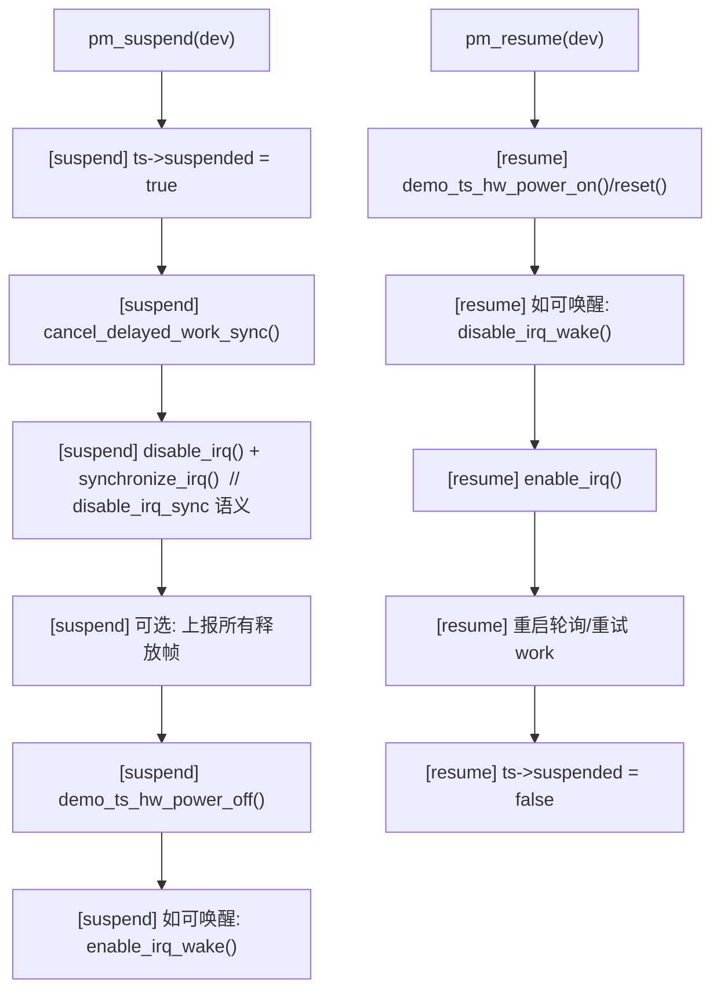

如果目标设备 **不作为唤醒源**，则 S6/R2 支路可以省略。
 若使用 `dev_pm_set_wake_irq()`，则 S6/R2 的逻辑部分或全部由 PM 框架内建完成。

------

#### 6.5.4.6 示例代码：demo 触摸屏的 suspend / resume 骨架

下面给出一个简化的 I²C MT-B 触摸屏 PM 回调骨架，和前文的 `demo_ts_data` / `demo_ts_irq_thread()` 可以直接拼装：

```c
static int demo_ts_suspend(struct device *dev)
{
	struct i2c_client *client = to_i2c_client(dev);
	struct demo_ts_data *ts = i2c_get_clientdata(client);

	mutex_lock(&ts->lock);
	ts->suspended = true;
	mutex_unlock(&ts->lock);

	/* 停止轮询/重试工作 */
	cancel_delayed_work_sync(&ts->dwork);

	/* 若设备不作为唤醒源，则彻底停掉 IRQ */
	if (!device_may_wakeup(dev)) {
		disable_irq(ts->irq);
		synchronize_irq(ts->irq);	/* 等待正在运行的 handler 完成 */
		ts->irq_enabled = false;
	} else {
		/* 作为唤醒源时，典型做法是只启用 wake 语义 */
		enable_irq_wake(ts->irq);
		ts->wakeup_enabled = true;
		/*
		 * 此时是否还要 disable_irq()，取决于平台策略：
		 * - 有些平台允许 IRQ 在 suspend 期间仅作为 wakeup 使用；
		 * - 有些驱动会在 handler 中检测 ts->suspended 并尽早返回，
		 *   避免在 suspend 路径中做完整采集。
		 */
	}

	/* 可选：清空触摸状态，防止用户态残留按下 */
	/* demo_ts_report_all_release(ts); */

	/* 关闭电源相关资源 */
	demo_ts_hw_power_off(ts);

	return 0;
}

static int demo_ts_resume(struct device *dev)
{
	struct i2c_client *client = to_i2c_client(dev);
	struct demo_ts_data *ts = i2c_get_clientdata(client);

	/* 恢复电源/时钟/寄存器 */
	demo_ts_hw_power_on(ts);
	demo_ts_hw_reset(ts);

	/* 如 suspend 时启用了 wake，则在 resume 时撤销 */
	if (device_may_wakeup(dev) && ts->wakeup_enabled) {
		disable_irq_wake(ts->irq);
		ts->wakeup_enabled = false;
	}

	/* 如 suspend 时 disable_irq()，则此处重新 enable */
	if (!ts->irq_enabled) {
		enable_irq(ts->irq);
		ts->irq_enabled = true;
	}

	/* 如有轮询/重试工作，则此处重启 */
	/* schedule_delayed_work(&ts->dwork,
			       msecs_to_jiffies(DEMO_TS_POLL_INTERVAL_MS)); */

	mutex_lock(&ts->lock);
	ts->suspended = false;
	mutex_unlock(&ts->lock);

	return 0;
}

static const struct dev_pm_ops demo_ts_pm_ops = {
	.suspend = demo_ts_suspend,
	.resume  = demo_ts_resume,
};
```

devres 与非 devres 的差异在于：

- **devres 版本**：
  - `devm_request_threaded_irq()`、`devm_regulator_get()`、`devm_clk_get()` 等，资源注册与释放在 `probe()` / `remove()` 生命周期中自动完成；
  - 但 **PM 阶段的 enable/disable 仍然要由驱动自己负责**，如上示例所示。
- **非 devres 版本**：
  - 需要在 `remove()` 中显式 `free_irq()` / `clk_put()` / `regulator_put()` 等；
  - suspend/resume 中的顺序基本相同，只是更需要保证：
    - `free_irq()` 之前，设备已经处于 `irq_enabled == false` 状态；
    - 不会再有工作线程在访问已释放的资源。

------

#### 6.5.4.7 调试与验证：如何确认没有“带电奔跑”的竞态

要验证 6.5.4 描述的顺序是否真正达到效果，可以从几个角度着手：

1. **启用 PM 测试模式**
   - 利用 `echo devices > /sys/power/pm_test` 等 PM 自测模式，让内核在不同阶段暂停；
   - 检查 suspend/resume 回调是否按期望被调用，是否有 oops / warn。
2. **检查 suspend 期间是否仍有 IRQ/activity**
   - 观察 `/proc/interrupts` 中对应 IRQ 的计数，在多次 suspend 周期中是否仍在增长；
   - 使用 ftrace 跟踪 `demo_ts_irq_thread()`，确认在 `ts->suspended = true` 后是否还有采集路径被执行。
3. **注入故障：人为拖长采集路径**
   - 在 `demo_ts_hw_read_frame()` 中临时加入 `msleep()`，模拟极端慢设备；
   - 测试在执行 `suspend()` 时，是否能靠 `disable_irq()` + `synchronize_irq()` 把正在跑的 thread_fn 等完；
   - 若设计正确，不应出现“在电源已关闭时，仍有 I²C 访问”的日志。
4. **唤醒测试**
   - 对配置了唤醒源的设备：
     - 在系统 suspend 后，通过触摸/按键唤醒；
     - 观察 `/sys/kernel/debug/wakeup_sources`（若启用）或 dmesg 中的唤醒源记录；
     - 确认唤醒来源确实是该 input 设备，而不是其他设备误触发。
5. **用户态行为验证**
   - 在 libinput / evtest 侧，观察：
     - suspend 前最后一帧是否符合预期（需要释放则有释放）；
     - resume 后第一帧是否与硬件真实状态一致；
     - 是否存在“resume 后立刻出现一堆莫名其妙的 release/press”。

------

#### 6.5.4.8 小结：把“停机顺序”变成模板

本小节给出的 `disable_irq_sync() → 改电源/状态 → 唤醒源配置` 可以压缩为一句话：

> **在关机/休眠中，必须先从并发角度把设备“静默”下来（停工作 + 停 IRQ），
>  再从电源/PM 角度关闭/配置硬件，最后根据是否作为唤醒源决定 IRQ 的唤醒语义。**

关键点：

1. `disable_irq()` + `synchronize_irq()`（本书称 `disable_irq_sync()` 语义）是防止“线程化 IRQ / 采集线程在电源关闭后继续跑”的核心工具。
2. 轮询/重试类工作必须在停 IRQ 之前 `cancel_delayed_work_sync()`，否则仍有访问硬件的风险。
3. 唤醒源配置通过 `device_init_wakeup()` + `enable_irq_wake()` 或 `dev_pm_set_wake_irq()` 完成，根据设备在系统中的角色选择使用。
4. suspend/resume 顺序需要与前文 6.5.1 的“采集可睡、上报不睡”结合起来，保证：
   - 上报逻辑只在“电源已就绪 + IRQ 已使能 + 设备不处于 suspend”时执行；
   - TOCTOU 相关的一致性问题仍在采集阶段内部解决（6.5.3）。

在后面的触摸屏完整案例（第 7 章）里，可以直接把这一小节的骨架嵌入驱动，实现一个“既满足并发/帧一致性，又能正确 suspend/resume 和唤醒”的实战级 input 驱动。


------

### 6.5.5 背压与丢帧：用户态自愈重同步流程

> **小节内容说明**
>  本小节讨论“**用户态读得太慢 / 环形缓冲被写满**”时，input 事件如何处理。
>  重点不是优化性能，而是：
>
> - evdev 在缓冲溢出时的行为（`SYN_DROPPED`）；
> - 为什么 **“驱动不应该自己做复杂重发”**，而应把“重同步”交给用户态；
> - 用户态看到 `SYN_DROPPED` 后，如何通过 `ioctl` 重建完整状态；
> - 驱动侧可以做的辅助（限速、统计丢帧）以及不该做的事。
>
> 目标是形成一套“**内核负责发出丢帧信号，用户态负责自愈重同步**”的清晰模式。

------

#### 6.5.5.1 引入：三类典型“背压”场景

在一个输入链路中，“背压（backpressure）”主要来自三个方向：

1. **用户态读得太慢**
   - 应用长时间阻塞在别处，或者只偶尔 poll 一次；
   - 手势识别过程耗时过长；
   - 导致 `/dev/input/eventX` 的环形缓冲被写满。
2. **事件产生过快**
   - 硬件上报频率极高（高采样率触摸屏、快速抖动的模拟输入）；
   - 驱动没有适度限速 / 合并帧，上报每一次微小变化；
   - 同样触发环形缓冲快速填满。
3. **系统整体阻塞**
   - 磁盘 I/O、锁竞争或调度问题导致 input 相关线程长时间得不到调度；
   - 即使应用本身想及时读，也被系统整体拖慢。

无论是哪种原因，**evdev 的行为都是一致的**：
 当内部环形缓冲写满时，**旧事件会被丢弃，接着发出一个 `SYN_DROPPED` 通知用户态“你已经错过了一些东西，需要重同步”。**

这个行为定义了驱动与用户态的职责边界：

- 驱动：按正常顺序生成事件并交给 input core / evdev；
- evdev：在缓冲溢出时注入一个“语义上特殊”的事件；
- 用户态：检测到这个特殊事件后，用 `ioctl` 重新获取完整状态。

------

#### 6.5.5.2 数据结构与机制：evdev 环形缓冲与 `SYN_DROPPED`

从数据结构视角看，evdev 大致维护两类关键信息：

1. **环形缓冲（事件队列）**
   - 保存即将被用户态读取的 `struct input_event` 序列；
   - 有固定容量（内核配置决定）；
   - 写满后再写入新事件时，需要丢弃部分旧事件。
2. **设备当前状态（state）**
   - 对于按键：当前哪些 key 处于按下状态；
   - 对于 ABS 轴：当前每个 `ABS_*` 的最近一次值；
   - 对于 MT-B：当前各 slot 的状态（tracking id / 坐标等）。

**重要点：**
 即使环形缓冲中的某些事件被丢弃，**设备状态本身仍然是 “自洽的最新状态”**。
 因此，只要用户态知道“缓冲有过丢失”，就可以通过查询这些状态信息来重建一个可信的当前快照。

evdev 用如下方式向用户态发出“缓冲丢失”信号：

- 在丢弃事件后，向队列插入一个特殊事件：

  - `type = EV_SYN`
  - `code = SYN_DROPPED`
  - `value = 0`（通常不关心）

- 用户态读取到这一事件时，应当理解为：

  > “在这个 `SYN_DROPPED` 之前的输入流中，有部分事件因为环形缓冲溢出被丢弃；
  >  当前序列中的状态已不可靠，需要主动重同步设备状态。”

------

#### 6.5.5.3 开发者视角：驱动侧应该 / 不应该做什么

**驱动应该做的：**

1. **按真实采样顺序上报事件，保持帧内/帧间语义正确**
   - 保证 3 章、4 章、6.4 讲过的帧语义、MT-B 语义、`SYN_REPORT` 顺序；
   - 在自身采集阶段做好 TOCTOU 防御（6.5.3），确保每一帧自身一致。
2. **在合理范围内做“限速 / 合并帧”**
   - 对过于高频的硬件变化，可以适度合并（例如只在坐标变化超过一定阈值才上报）；
   - 或者在轮询型驱动中设置一个固定轮询频率，而不是“有一点变化就忙等上报”；
   - 这类策略减少环形缓冲压力，但不应该破坏帧语义和用户态期望的精度。
3. **做好“丢帧统计与调试信息”**
   - 虽然 ring buffer overflow 是 evdev 层发生的，但驱动可以通过 trace / debugfs 提供采样频率、帧数等信息；
   - 便于用户定位是“应用太慢”还是“驱动太勤快”。

**驱动不应该做的：**

1. **不在驱动内实现复杂的“重发/缓存”逻辑**
   - 不要在驱动内部维护一个自己的“大事件队列”并尝试在用户态慢时“回放历史”；
   - 这会与 evdev 自己的队列逻辑叠加，导致行为难以预测；
   - 也会让驱动承担本应由用户态决策的策略负担。
2. **不“猜测”用户态的业务重同步流程**
   - 驱动不应在检测到慢消费时自行“上报某种特殊帧”试图帮助用户态“自动恢复”；
   - 正确的方法是依赖 input/evdev 的标准机制（`SYN_DROPPED` + ioctl 重同步），避免自创协议。
3. **不在 hard IRQ 中做任何试图“挽救缓冲”的复杂操作**
   - 缓冲溢出发生在 evdev 层，驱动无需也不应在中断路径中加入额外复杂逻辑试图挽救；
   - 否则只会进一步加重中断负担。

总结成一句话：

> **驱动负责“尽可能正确、适度节制地往 input core 写；
>  evdev 负责检测并发出 `SYN_DROPPED`；
>  用户态负责“看到 `SYN_DROPPED` 后如何恢复状态”。**

------

#### 6.5.5.4 用户/平台视角：自愈重同步的标准流程

对于用户态（特别是写通用库/守护进程时），处理 `SYN_DROPPED` 的典型流程大致如下：

1. **检测到 `SYN_DROPPED`**

   - 在读取 `struct input_event` 流时，发现：

     ```c
     ev.type == EV_SYN && ev.code == SYN_DROPPED
     ```

   - 一旦遇到这一事件，**当前缓冲区中之前的事件序列都不能再被当作可靠历史**；

   - 必须进入“重同步”流程。

2. **丢弃接下来的所有事件，直到下一帧同步点**

   - 通常做法是：继续读取事件，直到看到一个新的 `EV_SYN/SYN_REPORT` 为止；
   - 这个过程相当于“把当前已经损坏的帧尾全部清理掉”。

3. **通过 `ioctl` 获取“当前完整状态”**

   - 对于按键类：
     - 使用 `EVIOCGKEY` 获取当前所有按键的按下/释放 bitmap；
   - 对于 ABS 轴：
     - 使用 `EVIOCGABS(code)` 逐个轴读取当前值、`min/max/fuzz/flat/resolution` 等；
   - 对于 MT-B：
     - 通常通过 libinput 等中间层完成重同步，底层会结合 slot 状态重建视图。

   简单地说，这一步是：

   > “不要试图依赖刚才的事件流，而是完全丢弃历史，直接问内核：‘现在准确状态是什么？’”

4. **在内部状态机中用“新快照”覆盖旧状态**

   - 应用内部维护的“哪些按键是按下状态 / 当前鼠标/触控坐标”等结构，应全部用刚得到的状态覆盖；
   - 之后再继续正常地消费新的事件流。

对平台/通用库（如 libinput）来说，这套流程通常已经封装好了；
 本书在这里强调的是：**任何想直接使用 evdev 的自研用户态程序，都应该遵守这一协议。**

------

#### 6.5.5.5 可视化：缓冲溢出与重同步时序

下面用时序图描述一个简化场景：

- 用户态长时间不读事件；
- evdev 环形缓冲溢出；
- 内核注入 `SYN_DROPPED`；
- 用户态检测到后进行重同步。

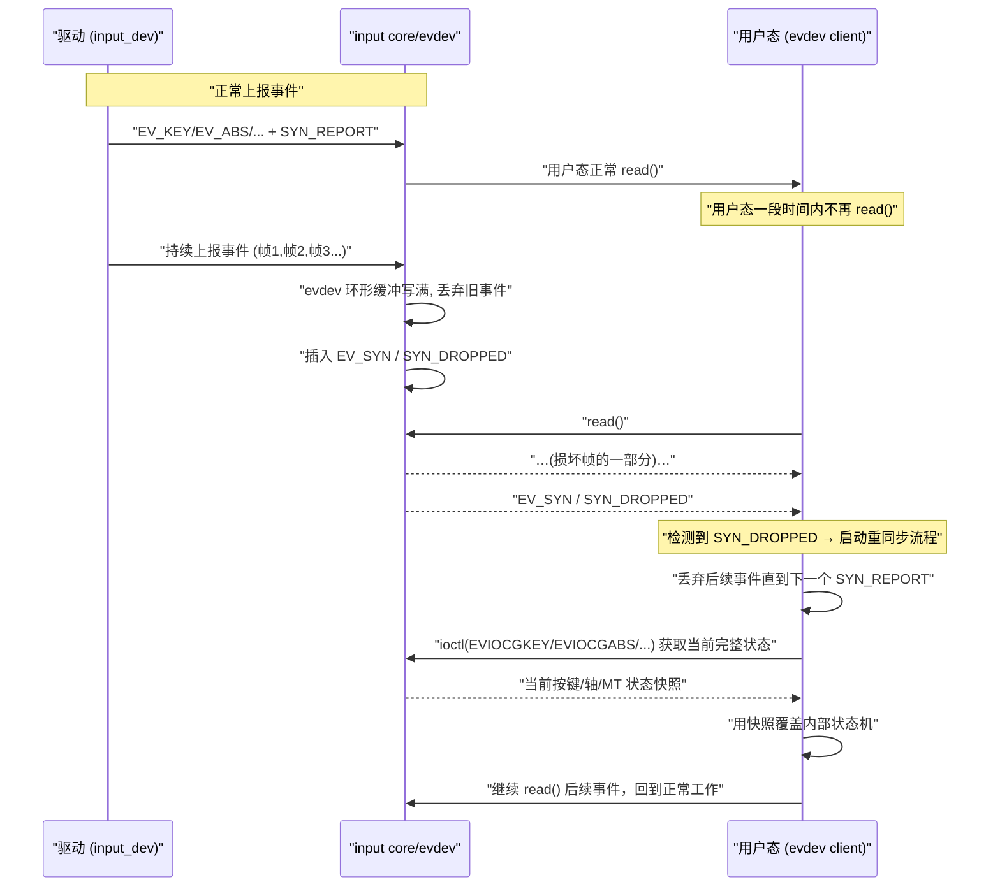

------

#### 6.5.5.6 示例代码：用户态处理 `SYN_DROPPED` 的最小骨架

下面给出一个用户态 C 程序的最小骨架，只关注 **如何处理 `SYN_DROPPED`**。
 为了便于阅读，这里只示例键盘类设备的重同步逻辑：

```c
#include <stdio.h>
#include <stdbool.h>
#include <stdint.h>
#include <unistd.h>
#include <fcntl.h>
#include <linux/input.h>
#include <sys/ioctl.h>
#include <string.h>
#include <errno.h>

#define DEMO_EVDEV_PATH		"/dev/input/event0"

static void demo_handle_full_state(int fd)
{
	unsigned long key_bits[(KEY_MAX + 1) / (sizeof(unsigned long) * 8)];
	int ret;
	int code;

	memset(key_bits, 0, sizeof(key_bits));

	ret = ioctl(fd, EVIOCGKEY(sizeof(key_bits)), key_bits);
	if (ret < 0) {
		fprintf(stderr, "EVIOCGKEY failed: %s\n", strerror(errno));
		return;
	}

	for (code = 0; code <= KEY_MAX; code++) {
		bool pressed;

		pressed = test_bit(code, key_bits);
		/* 在这里根据 pressed 更新你自己的内部状态机 */
		/* ... */
	}
}

static int demo_read_loop(int fd)
{
	const int EVENT_BUF_CNT	= 64;
	struct input_event ev[EVENT_BUF_CNT];
	bool need_resync = false;

	for (;;) {
		int rd;
		int i;

		rd = read(fd, ev, sizeof(ev));
		if (rd < 0) {
			if (errno == EINTR)
				continue;
			fprintf(stderr, "read error: %s\n", strerror(errno));
			return -1;
		}

		if (rd % sizeof(struct input_event) != 0) {
			fprintf(stderr, "read size is not aligned\n");
			return -1;
		}

		for (i = 0; i < rd / sizeof(struct input_event); i++) {
			if (ev[i].type == EV_SYN &&
			    ev[i].code == SYN_DROPPED) {
				/* 标记需要重同步 */
				need_resync = true;
				continue;
			}

			if (need_resync) {
				/*
				 * 遇到 SYN_DROPPED 后，通常会丢弃直到下一个
				 * EV_SYN/SYN_REPORT，这里简单处理：不消费事件。
				 * 也可以在遇到 SYN_REPORT 时再调用 demo_handle_full_state()。
				 */
				if (ev[i].type == EV_SYN &&
				    ev[i].code == SYN_REPORT) {
					demo_handle_full_state(fd);
					need_resync = false;
				}
				continue;
			}

			/* 正常事件处理路径 */
			/* ... */
		}
	}

	return 0;
}

int main(void)
{
	int fd;
	int ret;

	fd = open(DEMO_EVDEV_PATH, O_RDONLY);
	if (fd < 0) {
		fprintf(stderr, "open %s failed: %s\n",
			DEMO_EVDEV_PATH, strerror(errno));
		return 1;
	}

	ret = demo_read_loop(fd);
	close(fd);

	return ret ? 1 : 0;
}
```

要点：

- 用户态显式处理 `EV_SYN/SYN_DROPPED`；
- 使用 `EVIOCGKEY` 获取当前按键状态，重建内部状态机；
- 对触摸屏/摇杆等，可以用类似方式调用 `EVIOCGABS` 对各轴重同步（这里只示范键盘）。

------

#### 6.5.5.7 调试与验证：如何发现和缓解“背压”问题

对于背压与丢帧，驱动和平台可以从以下几个维度调试：

1. **观察 evdev 层的丢帧统计**
   - 部分内核会提供 evdev 设备的调试信息（debugfs / trace）；
   - 通过这些统计可以知道：
     - 环形缓冲是否经常溢出；
     - 问题是出现在特定设备/场景，还是全局。
2. **用户态打印 `SYN_DROPPED` 次数**
   - 在开发阶段，可以在上层程序中统计 `SYN_DROPPED` 的出现次数和时间分布；
   - 若在正常使用场景都很少出现，可以接受；
   - 若频繁出现，则需要考虑限速 / 减少无意义事件。
3. **驱动侧限速策略的调节**
   - 对过于频繁的事件（例如噪声极大的模拟输入），增加阈值或时间间隔；
   - 保证在不损害用户体验的前提下，把事件速率控制在 evdev 缓冲和应用处理能力之内。
4. **系统整体性能分析**
   - 若多个输入设备都频繁出现 `SYN_DROPPED`，可能是系统整体调度问题；
   - 需要结合 ftrace/perf 等工具查看：
     - evdev kthread、应用进程是否长时间得不到调度；
     - 是否有高优先级线程占用 CPU。

------

#### 6.5.5.8 小结：用标准机制交付“可自愈”的事件流

本小节给出的模式可以概括为：

1. **背压根源**：
   - 用户态慢 / 事件过多 / 系统阻塞，导致 evdev 环形缓冲被填满；
   - evdev 会丢弃部分事件，插入一个 `EV_SYN/SYN_DROPPED` 提示“你错过了历史”。
2. **职责划分**：
   - 驱动：保证单帧正确、帧间顺序合理，在采集阶段解决 TOCTOU；
   - evdev：负责缓冲管理与 `SYN_DROPPED` 信号；
   - 用户态：检测 `SYN_DROPPED` 后，用 ioctl（`EVIOCGKEY` / `EVIOCGABS` 等）重建完整当前状态，覆盖内部状态机。
3. **策略选择**：
   - 宁可丢弃部分历史事件，通过“现态快照 + 后续事件”重新构建轨迹；
   - 也不要试图在内核或驱动层“魔法修复”历史，这会引入更多不可控行为。
4. **与前文的关系**：
   - 6.5.3 解决“采集中被换帧”的 TOCTOU 问题；
   - 6.5.4 解决“停机 / 休眠时的并发与顺序”；
   - 本小节 6.5.5 补齐“用户态太慢 / 缓冲溢出时如何自愈”的最后一块。
   - 三者合在一起，使整个 input 路径具备了：
     - 帧内一致性；
     - 关机/休眠时的顺序一致性；
     - 背压场景下的状态可恢复性。


------

### 6.5.6 并发语义交付核对表与调试 Checklist

> **小节内容说明**
>  本小节把 6.5.1～6.5.5 的要点压缩为一份“**驱动交付核对表 + 调试 checklist**”。
>  目标是：写完一个 input 驱动后，你可以按这一节逐项对照，确认是否满足：
>
> - 上报路径不睡、上下文划分清晰；
> - 帧内一致、不会产生物理不存在的快照；
> - suspend/resume 无竞态，不访问掉电硬件；
> - 缓冲溢出时用户态能自愈重同步。

------

#### 6.5.6.1 引入：从“能跑”到“语义安全”的最后一关

到本节为止，一个 input 驱动通常已经：

- 能正常注册/上报事件；
- 能通过 `evtest` 做功能验证；
- 在简单交互中看起来“没有问题”。

但从并发语义角度，要真正做到“上线可维护”，还需要回答几个更严格的问题：

1. **上报路径是否可能在错误上下文里睡眠？**
2. **采集中是否可能拼出“前半帧 N / 后半帧 N+1”的混合帧？**
3. **suspend/resume 过程中，是否存在访问掉电硬件或 use-after-free 的风险？**
4. **在用户态很慢、缓冲溢出时，是否有标准的自愈方案？**

6.5.6 就是针对这四个问题给出**可勾选的核对项**。

------

#### 6.5.6.2 数据结构视角：必须具备的几个状态字段

从驱动内部数据结构出发，一个“并发语义清晰”的 input 设备，通常至少具备以下状态字段（以触摸屏为例）：

```c
struct demo_ts_data {
	struct i2c_client	*client;
	struct input_dev	*input;
	int			irq;

	/* 基本并发状态 */
	struct mutex		lock;
	bool			suspended;
	bool			irq_enabled;
	bool			wakeup_enabled;

	/* 采集与帧语义 */
	struct delayed_work	dwork;		/* 轮询/重试等 */
	bool			hw_has_frame_id;

	/* 调试/统计 */
	unsigned long		frame_drop_cnt;
	unsigned long		frame_retry_cnt;
};
```

核对点：

1. **是否有一个明确的 `suspended` 状态标志？**
   - 用于线程化 IRQ / workqueue 判断“当前是否应执行完整采集 + 上报”。
2. **是否有 `irq_enabled` / `wakeup_enabled` 等字段记录 IRQ/Wake 状态？**
   - 可以避免重复 enable/disable；
   - 方便在 `remove()` 或错误路径中做安全清理。
3. **采集侧是否有“帧结构”来承载一致性检查的结果？**
   - 如前文 `struct demo_ts_frame` 中的 `consistent` 字段；
   - 上报阶段是否只处理 `consistent == true` 的帧。

这些字段不是必须叫这个名字，但**语义上必须有对应的信息**，否则 suspend/TOCTOU/调试部分都难以落地。

------

#### 6.5.6.3 开发者视角：代码级 Checklist

下面列一份“**实现完 input 驱动后必须自查的代码级核对表**”，可以直接转成表格放书尾附录。

**① 上报路径与上下文**

-  所有 `input_report_*()` / `input_sync()`：
  - 只出现在以下函数中：
    - 线程化 IRQ `thread_fn`；
    - workqueue 回调；
    - 进程上下文（`open`/`close`/ioctl/校准函数）；
  - **不出现在**：
    - 普通硬中断 handler；
    - softirq/tasklet；
    - 任何拿着自旋锁执行的长路径。
-  采集阶段（访问 I²C/SPI/ADC）：
  - 只在“可睡上下文”中执行；
  - 不在 hard IRQ / softirq 中直接访问。

**② 帧一致性（TOCTOU）**

-  对“多寄存器组成一帧”的设备：
  - 是否实现了 **frame_id 前后检查** 或 **status 前后检查 + 有限重读**：
    - 有帧号 → “读 id_before → 读数据 → 读 id_after → 不等则重试”；
    - 无帧号 → “读 status0 → 读数据 → 读 status1 → 状态变化过大则重试/丢弃”。
-  采集函数返回的帧结构中：
  - 是否有 `consistent` 标志；
  - 上报阶段是否仅在 `consistent == true` 时才执行 MT-B 上报 + `input_sync()`。

**③ suspend/resume 顺序**

-  `.suspend()` 中是否按以下顺序执行：
  1. 设置 `suspended = true`；
  2. `cancel_delayed_work_sync()` 等停掉所有工作队列；
  3. `disable_irq()` + `synchronize_irq()`（或等价的 `disable_irq_sync()`）；
  4. （可选）上报释放帧；
  5. 关闭电源相关资源（regulator/clk/gpio 等）；
  6. 如设备为唤醒源 → `enable_irq_wake()` / 框架接口。
-  `.resume()` 中是否按以下顺序执行：
  1. 恢复电源/时钟/寄存器；
  2. 撤销 `enable_irq_wake()`（如适用）；
  3. 重新 `enable_irq()`（如 suspend 中 disable 过）；
  4. 重启轮询/重试工作（schedule_delayed_work 等）；
  5. 最后 `suspended = false`。

**④ 背压与丢帧**

-  驱动本身是否**没有**实现自创的“历史事件缓存 + 回放”机制？
  - 只负责“实时上报当前帧”；
  - 不试图“重播历史”掩盖 evdev 的缓冲溢出。
-  是否实现适度限速：
  - 对非常高频的硬件变化，是否设置了适当的最小变化阈值或轮询周期；
  - 避免毫无节制地灌入事件。

------

#### 6.5.6.4 用户/平台视角：API 使用 Checklist

对使用该驱动的用户态（特别是写通用库、桌面环境、守护进程的开发者），这里给出一份“**evdev 使用 checklist**”，和 6.5 的并发语义配合：

-  是否在读取事件时显式处理：
  - `EV_SYN/SYN_REPORT`：作为“帧结束”语义；
  - `EV_SYN/SYN_DROPPED`：作为“缓冲溢出，需要重同步”的信号。
-  看到 `SYN_DROPPED` 后，是否：
  - 丢弃当前帧残余事件，直到下一个 `SYN_REPORT`；
  - 调用 `ioctl(EVIOCGKEY/EVIOCGABS/...)` 获取完整当前状态；
  - 用该快照覆盖内部状态机。
-  对 MT-B 多点触控，是否依赖 libinput 等成熟中间层进行重同步，而非自己生造协议。
-  在高负载场景下，是否为输入事件处理线程设置了合理优先级，以避免无谓的 `SYN_DROPPED`。

------

#### 6.5.6.5 可视化：并发语义整体视图（上下文 + 帧一致性 + PM + 背压）

下面用一张综合流程图，把本小节涵盖的几个关键阶段串起来：

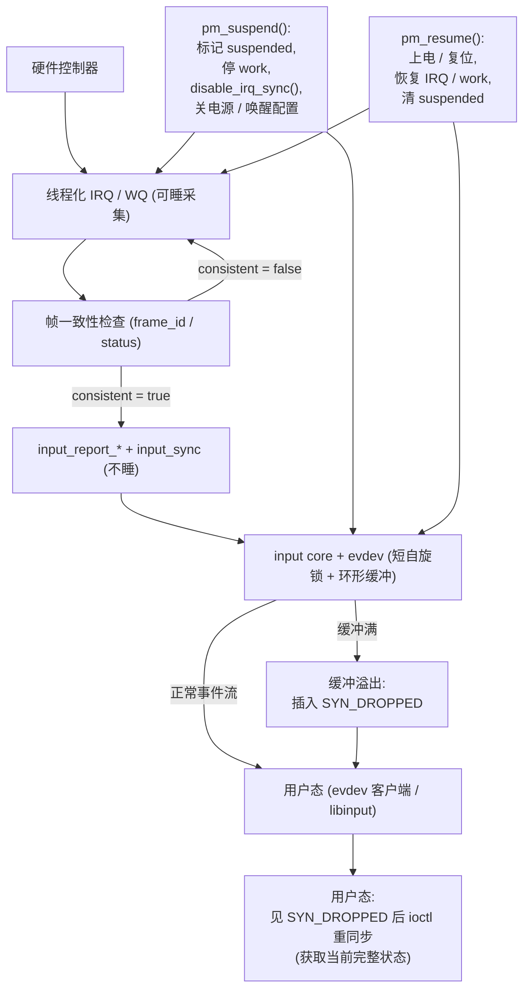

阅读重点：

- 上半部分：“硬件 → 采集 → 帧一致性 → 上报 → core” 对应 6.5.1 + 6.5.3；
- 左下角/右上角：“pm_suspend/pm_resume” 对应 6.5.4；
- 右侧 “缓冲溢出 + SYN_DROPPED + 用户态重同步” 对应 6.5.5；
- 整体图确保所有并发与 PM 行为在一个视图中是闭合的。

------

#### 6.5.6.6 示例代码片段：统一的“采集入口”模板

最后给出一个极简“采集入口模板”，把 6.5.1 + 6.5.3 + 6.5.4 的要点压在一个函数里，便于你在真实驱动中直接套用：

```c
static irqreturn_t demo_ts_irq_thread(int irq, void *dev_id)
{
	struct demo_ts_data *ts = dev_id;
	struct input_dev *input = ts->input;
	struct demo_ts_frame frame;
	unsigned long flags;
	int i;
	int error;

	/* 避免在 suspend 状态做正常采集与上报 */
	mutex_lock(&ts->lock);
	if (ts->suspended) {
		mutex_unlock(&ts->lock);
		return IRQ_HANDLED;
	}
	mutex_unlock(&ts->lock);

	/* 阶段 1：采集 + 帧一致性检查（可睡） */
	error = demo_ts_read_consistent_frame(ts, &frame);
	if (error)
		return IRQ_HANDLED;

	if (!frame.consistent)
		return IRQ_HANDLED;

	/* 阶段 2：上报（不睡） */
	for (i = 0; i < DEMO_TS_MAX_POINTS_CNT; i++) {
		struct demo_ts_contact *p = &frame.points[i];

		input_mt_slot(input, i);
		input_mt_report_slot_state(input,
					   MT_TOOL_FINGER,
					   p->active);

		if (!p->active)
			continue;

		input_report_abs(input, ABS_MT_POSITION_X, p->x);
		input_report_abs(input, ABS_MT_POSITION_Y, p->y);
	}

	input_mt_sync_frame(input);
	input_sync(input);

	return IRQ_HANDLED;
}
```

核对点：

- 进入时先检查 `suspended`，防止在 suspend 路径中继续完整采集逻辑；
- 采集函数封装帧一致性检查，统一返回 `frame.consistent`；
- 上报部分简单、无睡眠，只做 `input_report_*()` + `input_sync()`。

------

#### 6.5.6.7 调试与验证 Checklist（实战版）

在交付前，建议按下面 checklist 做一次完整调试：

1. **上下文检查**
   - 打开 `CONFIG_DEBUG_ATOMIC_SLEEP` 等调试开关；
   - 确保在 IRQ 上下文 / 自旋锁路径中不会触发 `might_sleep()` 报警；
   - 用 ftrace 检查 `input_report_*()` 的调用栈，确认都在预期上下文中。
2. **帧一致性检查**
   - 构造高频触摸/抖动场景；
   - 增强调试日志/tracepoint，确认帧一致性重试逻辑有被触发；
   - 验证在重试次数上限下不会造成明显卡顿或超时。
3. **PM 测试**
   - 使用 `pm_test` 模式，逐步测试 `freeze`/`devices`/`platform` 等阶段；
   - 确认 suspend/resume 回调顺序正确，不访问掉电设备；
   - 触发唤醒测试，确认 IRQ 唤醒行为符合预期。
4. **背压与 SYN_DROPPED**
   - 在用户态刻意降低读取频率，甚至暂时停止读取；
   - 检查是否出现 `SYN_DROPPED`，用户态自愈逻辑是否生效；
   - 统计在正常使用场景下 `SYN_DROPPED` 的出现频度，确保在可接受范围内。

------

#### 6.5.6.8 小结：把“并发语义”变成可交付条目

本小节把 6.5 节的内容沉淀为一份“**可打勾的交付核对表**”，核心结论可以压缩为：

1. **采集可睡、上报不睡**：所有 I/O 和重逻辑放在线程化 IRQ / workqueue / 进程上下文中，上报路径本身保持短小、不睡。
2. **帧一致性由采集阶段内部保证**：通过 frame_id 或 status 前后检查 + 有限重读，宁可丢帧也不拼混合帧。
3. **关机/休眠顺序严格有序**：先从并发角度“静止设备”（停 work + 停 IRQ），再从 PM 角度关电/配置唤醒，resume 时顺序反向。
4. **背压下依赖标准机制自愈**：evdev 通过 `SYN_DROPPED` 告诉用户态“你错过历史”，用户态通过 ioctl 重建现态，不在驱动层制造“历史回放”。

在后续章节的完整案例中（尤其是第 7 章触摸屏驱动、第 8 章摇杆驱动），所有实现都将默认满足这份 checklist，方便读者对照自己的驱动进行改造与核验。

