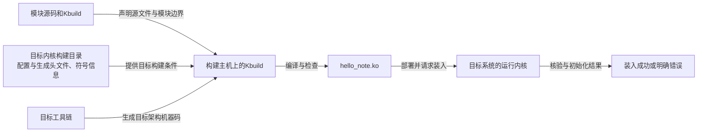

# 第1章\_从C文件到匹配目标内核的模块

上一阶段的读取程序用一次 C 编译就得到了可执行文件。现在我们想让一小段代码在 Linux 内核中工作：装入时记录一条消息，卸载时再记录一条。它还没有设备，也不创建访问节点。先把“代码怎样进入正确的内核”这件事弄清楚，再给它增加设备职责。

这次不能照搬 `cc hello_note.c -o hello_note`。普通程序由用户空间运行库和操作系统接口支撑；内核模块使用的是目标内核的数据类型、配置、编译选项和导出接口。只拿几个头文件拼出一次成功编译，不能证明生成物能够装入目标内核。本章会完成一个最小模块的文件、构建、身份核对和退出路径，并区分“命令成功”与“目标匹配”。

## 1.1\_先画出构建者与运行者

**内核模块（kernel module）** 是能够按内核模块机制参与系统工作的代码单元。可加载模块通常生成以 `.ko` 结尾的文件，装入以后执行的是内核代码，不是另一个普通应用进程。内核必须开启相应模块支持；卸载功能也有独立的配置条件。

**构建主机（build host）** 运行编译工具，**目标系统（target system）** 运行生成的模块。二者可以是同一台 Linux 机器，也可以分别是开发电脑和 i.MX6ULL 板。交叉编译改变的是工具产生哪种目标代码，并不让开发电脑的运行内核变成板子的内核。



**Kbuild** 是 Linux 内核构建系统的名称。它读取模块声明，结合目标内核的准备结果组织编译、链接和模块检查。本专题按仓库的 [NXP 官方源码基线](../../../research/source_reading/linux/SOURCE_BASELINE.md#1.1_当前来源)核对 Linux 6.12.20：提交 `dfaf2136deb2af2e60b994421281ba42f1c087e0`。NXP 是本仓库的芯片平台背景，本地实验提交不成为公共接口依据。本章不假定运行中的开发电脑也恰好是这个内核。

## 1.2\_构建目录为什么不一定是源码目录

假设内核源码放在一个目录，编译时把产物放到另一个目录。源文件可能相同，但第二个目录才保存本次选项、生成头文件和符号信息。外部模块必须找到这套 **目标内核构建结果**，不能只找到版本号相近的源码。

本章把传给构建系统的目录称为变量 `kernel_build`。若内核在源码目录内构建，它可以指向该目录；若采用独立输出目录，它应指向那个已经准备好的输出目录。发行版提供的内核开发包也可能承担这项职责。因此旧说法“永远指向完整源码目录”过于狭窄。

在构建主机上先明确三项输入：

| 输入 | 它回答的问题 | 容易混淆的地方 |
| --- | --- | --- |
| 目标内核源码身份与配置 | 模块面对哪套类型、接口和选项 | 同为 6.12 不等于同一构建 |
| `kernel_build` | 目标构建结果在哪里 | 源码目录与独立输出目录可能不同 |
| 编译目标与工具链 | 要生成哪种机器码 | 本机编译器不自动等于板子的编译器 |

本机 Linux 实验常用 `/lib/modules/$(uname -r)/build`。这里 `uname -r` 查询的是 **执行这条命令的机器** 的运行内核版本。如果命令在开发电脑执行，结果不会自动变成目标板版本。交叉编译时必须显式选择目标内核构建目录。

若目标内核尚未准备，先在专门的构建工作树完成内核配置与构建。`modules_prepare` 是准备模块构建所需生成信息的目标，但 **不会生成完整的 `Module.symvers`**；启用模块版本检查时仍需要匹配的完整内核构建结果。也不能无条件把主机的 `/proc/config.gz` 写入板子构建目录，那会把主机配置当成目标配置，而且该接口还依赖内核是否提供它。

本仓库用于取证的外部内核工作树保持只读；实验准备使用自己的构建工作树或已经准备好的产物。核对出处是该固定提交的 `Documentation/kbuild/modules.rst` 中 “How to Build External Modules” 与 “Options”。

## 1.3\_写出一份职责足够小的模块

在自己的 Linux 练习目录建立 `hello_note/`，保存下面两个文件。`hello_note.c` 是本章完整的教学代码，不是上游源码摘录。

代码开头的 SPDX（Software Package Data Exchange）行采用标准许可证标识形式；`GPL-2.0` 标明这里示例代码的许可证。GPL 的全称是 GNU General Public License。`MODULE_LICENSE` 声明模块许可证信息，`MODULE_DESCRIPTION` 提供简短描述；它们不是业务函数。日志前缀使用构建系统提供的模块名宏 `KBUILD_MODNAME`，下面再解释它和初始化代码的关系。

```c
// SPDX-License-Identifier: GPL-2.0
#define pr_fmt(fmt) KBUILD_MODNAME ": " fmt

#include <linux/init.h>
#include <linux/module.h>
#include <linux/printk.h>

static int __init hello_note_init(void)
{
    /* 本例没有申请设备或其他需回滚的资源。 */
    pr_info("loaded\n");
    return 0;
}

static void __exit hello_note_exit(void)
{
    /* 真实模块应在这里结束工作并释放其拥有的资源。 */
    pr_info("unloaded\n");
}

module_init(hello_note_init);
module_exit(hello_note_exit);
MODULE_LICENSE("GPL");
MODULE_DESCRIPTION("Minimal module lifecycle example");
```

初始化函数 `hello_note_init` 返回零表示初始化成功；真实模块若在中途失败，应返回合适的负错误码，并在失败路径释放已经取得的资源。不能指望初始化失败以后，内核再替你调用正常卸载函数来补救。`hello_note_exit` 负责正常卸载时的收尾；本例没有资源，因此两条路径很短。

`module_init` 与 `module_exit` 是把函数接入内核相应机制的宏。`__init`、`__exit` 是与初始化和退出代码有关的标注，不能随意加到运行中还会使用的普通函数上。`MODULE_LICENSE` 和 `MODULE_DESCRIPTION` 提供模块元信息；许可证声明应符合实际代码来源，不能为了绕过接口限制随便填写。

`pr_info` 写内核信息级日志，`pr_fmt` 为本文件的日志增加模块名前缀。`KBUILD_MODNAME` 由构建系统提供；因为 `pr_fmt` 需要在相关头文件使用前生效，所以放在 include 之前。这里使用已有日志接口，不另写一套封装。

第二个文件名为 `Kbuild`，内容只有一行：

```make
# 由 hello_note.c 构建可加载模块 hello_note.ko。
obj-m := hello_note.o
```

`obj-m` 是 Kbuild 规定的变量名，表示模块目标。右边写 `.o`，最终仍会形成 `.ko`，因为中间还有模块处理和链接步骤；不是要求你手工把扩展名改成 `.ko`。此时目录里应只有这两个源文件，尚无模块产物。

## 1.4\_先用一条明确命令构建

若在 Linux 主机上为它正在运行的内核做实验，且匹配的内核开发包已经安装，在 `hello_note/` 中执行：

```bash
kernel_build="/lib/modules/$(uname -r)/build"
make -C "$kernel_build" M="$PWD" modules
```

`make` 读取构建规则，`-C` 让它进入目标构建目录，`M` 是 Kbuild 规定的外部模块目录参数，值使用练习目录的绝对路径。`$PWD` 在 shell 启动 make 前已经展开，因此不会因为 make 改变目录就变成内核目录。最后的 `modules` 明确这次要构建模块。

若为 i.MX6ULL 构建，下面示例假定匹配的目标内核产物在练习目录的相邻 `kernel_build/`，并且所选工具链的命令前缀确实为 `arm-none-linux-gnueabihf-`。这是可替换的环境条件，先按自己的真实位置和工具确认，不靠复制路径猜测：

```bash
kernel_build=$(realpath ../kernel_build)
cross_prefix=arm-none-linux-gnueabihf-
"${cross_prefix}gcc" --version
make -C "$kernel_build" M="$PWD" ARCH=arm CROSS_COMPILE="$cross_prefix" modules
```

`ARCH` 和 `CROSS_COMPILE` 都是上游构建参数。前者选择内核架构，后者给工具命令添加前缀，末尾的连字符不能随意丢掉。仅设置 `ARCH=arm`，没有让一个普通 x86 编译器获得产生 Arm 机器码的能力；反过来，只换编译器而选错内核配置，也不能得到正确目标模块。

成功构建后应出现 `hello_note.ko`；其他中间文件用于模块描述、符号和依赖处理，不应随手加入知识库。若失败，先找日志中第一条真实错误，记录实际编译器和路径。本轮先不要通过删除头文件、关闭全部检查或伪造符号信息来“让它过”。

## 1.5\_把重复命令交给一个小Makefile

现在我们知道每个参数的职责，再把它们收进 `Makefile`。继续在同一练习目录新增这个文件；配方行开头必须是真正的制表符。`Kbuild` 仍只负责声明模块目标。

```make
# 本机实验的默认值；交叉编译时在命令行覆盖。
kernel_build ?= /lib/modules/$(shell uname -r)/build
module_dir := $(CURDIR)

.PHONY: all clean
all:
	$(MAKE) -C "$(kernel_build)" M="$(module_dir)" modules

clean:
	$(MAKE) -C "$(kernel_build)" M="$(module_dir)" clean
```

`?=` 只在变量尚未定义时赋默认值，`:=` 立即取值；`CURDIR` 是 GNU make 提供的当前目录变量。递归调用使用 `$(MAKE)`，使 make 能识别递归构建并传递相关选项。命令行给出的 `ARCH`、`CROSS_COMPILE` 等变量会传给递归 make，不需要在每个源文件模板再维护一份平台常量。

可以执行 `make`，也可以执行 `make kernel_build="$kernel_build" ARCH=arm CROSS_COMPILE="$cross_prefix"`。这个包装没有安装或装载动作，构建成功后仍由你确认目标与运行环境。`.PHONY` 把 `all`、`clean` 声明为动作名，避免目录里恰好出现同名文件而使动作被跳过。

## 1.6\_装入之前先确认自己站在哪台机器上

把生成物放到目标系统的实验目录以后，先比较目标的 `uname -r` 与模块信息，不要在构建主机上误装板子的模块。`modinfo` 是查看模块元信息的工具；它显示一个文件能提供的描述，不代表文件已经成功装入。

```bash
uname -r
modinfo ./hello_note.ko
sudo insmod ./hello_note.ko
sudo dmesg | tail -n 20
sudo rmmod hello_note
sudo dmesg | tail -n 20
```

`insmod` 请求装入指定文件，`rmmod` 按模块名请求卸载，模块名不带 `.ko`。预期在加载成功后看到带 `hello_note` 前缀的 `loaded`，卸载成功后看到 `unloaded`；时间戳及其他日志不要求与书中相同。目标可能没有 `sudo`，这时在具有适当权限的实验会话中执行等价命令；不要把缺少 sudo 程序与内核拒绝模块混为一谈。

若装入失败，不要继续把它当作“已装入”，先根据内核日志检查格式、依赖、签名和目标身份。若卸载被拒绝，确认是否有使用者、模块配置和退出路径，不使用强制卸载掩盖问题。模块装入有内核权限，应在自己的适用实验系统执行；本章例子虽没有设备操作，仍不是用户态沙盒程序。

此时 `/dev` 中没有出现 `hello_note` 节点完全正常。我们只注册了初始化和退出函数，尚未建立设备号、字符设备映射和用户访问入口。这个正常结果，就是下一组设备节点章节的问题起点。

## 1.7\_练习与解答

先预测，再在适用环境中观察：

1. 为板子构建时沿用主机的 `uname -r`，即使源文件完全相同，为什么仍可能构建出错误模块？
2. 删除练习目录里的 `.ko` 后再次构建，与执行一次内核 `modules_prepare`，分别改变了什么？
3. 只把日志文字改成 `loaded again`，但装入的仍是旧文件，应该看到哪条消息？
4. 模块加载成功而没有设备节点，能否判定 `insmod` 没有执行初始化函数？

第一题混淆了查询机器与目标机器，目录、配置和生成头文件都会随之选错。第二题中重新构建恢复模块产物；`modules_prepare` 准备的是内核构建信息，不承诺完成全部符号版本材料。第三题仍取决于实际装入的文件，源文件变化不会隔空改变旧产物。第四题不能；这份完整程序本来就没有设备注册动作。

练习完成并确认模块已卸载后，可以在练习目录用相同 `kernel_build` 执行 `make clean`，清理模块构建产物。源码与 Kbuild 保留，便于重建。现在你已经掌握一次单文件模块构建；当源码拆成两份时，怎样判断仍然只生成一个模块？继续 [多文件与多目录构建](P02_让多个源文件形成清楚的模块边界.md)。
