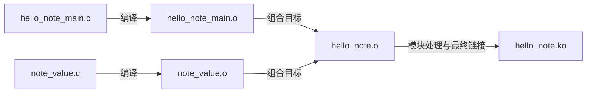

# 第2章\_让多个源文件形成清楚的模块边界

[上一章](P01_从C文件到匹配目标内核的模块.md)用一个 C 文件生成了一个模块。接下来想把“得到要显示的数值”和“管理装入卸载”分开。拆成两个文件后，是否就应该生成两个模块？先不要改 Makefile：源文件数量表达代码分工，模块数量表达独立装载与链接边界，两者并不相等。

本章让同一个 Hello 模块逐步拥有两个源文件，再比较多个独立模块和多个目录。每一步先预测产物，随后用 Kbuild 表达选择。继续使用上一章已经匹配目标内核的构建环境，不重新选择内核或工具链。

## 2.1\_把职责拆开而保留一个模块

数值计算没有独立生命周期，也不需要单独装入。我们仍只要 `hello_note.ko`。建立下面的文件，替换上一章的单文件实现；旧 `hello_note.c` 不再参与这个版本的实验：

```text
hello_note/
├── Kbuild
├── Makefile
├── hello_note_main.c
├── note_value.c
└── note_value.h
```

`note_value.h` 给两个 C 文件一份共同的接口声明：

```c
#ifndef NOTE_VALUE_H
#define NOTE_VALUE_H

/* 返回本实验要观察的值，不取得外部资源。 */
int note_value_get(void);

#endif
```

`note_value.c` 兑现声明，暂时只返回常量，以便把注意力留给构建边界：

```c
#include "note_value.h"

int note_value_get(void)
{
    /* 后续练习可修改该值，观察哪些文件需要重建。 */
    return 42;
}
```

`hello_note_main.c` 管理生命周期，并使用这个接口：

```c
#define pr_fmt(fmt) KBUILD_MODNAME ": " fmt
#include <linux/init.h>
#include <linux/module.h>
#include <linux/printk.h>
#include "note_value.h"

static int __init hello_note_init(void)
{
    /* 普通函数调用发生在同一模块内部。 */
    pr_info("value=%d\n", note_value_get());
    return 0;
}

static void __exit hello_note_exit(void)
{
    pr_info("unloaded\n");
}

module_init(hello_note_init);
module_exit(hello_note_exit);
MODULE_LICENSE("GPL");
MODULE_DESCRIPTION("Composite module example");
```

新的 `Kbuild` 为：

```make
# 一个模块目标，由两个编译单元组成。
obj-m := hello_note.o
hello_note-y := hello_note_main.o note_value.o
```

编译单元是经过预处理、参与一次 C 编译的源文件及其展开内容。头文件让编译器知道函数应怎样调用；`note_value.o` 中的定义则在后续链接时满足调用的符号引用。只写声明而没有把实现纳入目标，不会凭空生成函数。



这里 `hello_note.o` 是组合结果，不能同时让它充当自身输入，例如写成 `hello_note-y := hello_note.o note_value.o`。把原入口文件命名为 `hello_note_main.c`，就是为了清楚区分这两个身份。你也会在已有源码中看到 `hello_note-objs`；它同样用于声明组合对象。本例统一使用上游支持的 `-y` 写法，不在同一目标上混用两套列表。

执行上一章的构建命令或包装 Makefile，预期仍只有一个可加载模块 `hello_note.ko`。本章这些函数在同一个模块内链接，**不需要 `EXPORT_SYMBOL`**。C 文件中的非 `static` 函数可供这个链接单元的其他对象引用，和把符号登记给其他模块使用，是两个层次的问题。

## 2.2\_什么时候才需要多个独立模块

假设又增加一个完全独立的状态观察器，源文件叫 `observer_note.c`，它有自己的初始化和退出函数。若希望分别装入、卸载和交付它与 Hello 模块，可以声明两个目标：

```make
obj-m := hello_note.o observer_note.o
hello_note-y := hello_note_main.o note_value.o
```

这段是目标组织示意；需要先为 `observer_note.c` 提供完整实现才能构建，不能把未创建的文件名直接追加后期待成功。结果为两个 `.ko`，并非一个模块的两种文件名。

| 当前需求 | 合适组织 | 必须承担的成本 |
| --- | --- | --- |
| 两个文件共同完成一次初始化和一次退出 | 多文件组合一个模块 | 内部接口仍需声明一致，但无跨模块装载次序 |
| 两项功能有独立使用者和独立装载需求 | 两个模块目标 | 分别维护入口、退出和部署对象 |
| 一个模块需要调用另一个模块的服务 | 两个模块加导出接口 | 构建时提供符号信息，运行时提供真实依赖；还要设计服务状态的生命期 |

不要为了目录整齐就人为制造模块间依赖。若两份代码永远一起启停、共享不可分割的状态，组合目标通常更容易保证初始化失败时能完整回滚。相反，真正独立的功能不必因为放在同一仓库就绑成一个模块。跨模块调用在[部署与符号章节](P04_部署模块并沿错误定位构建问题.md#4.2_让两个模块在构建与运行时都找到对方)完整展开。

## 2.3\_目录解决管理问题而不是自动改变产物

文件越来越多以后，可以先保留一个模块，只把实现移入 `src/`、声明移入 `include/`：

```text
hello_note/
├── Kbuild
├── Makefile
├── include/note_value.h
└── src/
    ├── hello_note_main.c
    └── note_value.c
```

根目录的 Kbuild 相应改成：

```make
obj-m := hello_note.o
hello_note-y := src/hello_note_main.o src/note_value.o
ccflags-y += -I$(src)/include
```

源文件仍写 `#include "note_value.h"`。`ccflags-y` 为当前 Kbuild 所控制的 C 编译添加选项，`$(src)` 指向当前 Kbuild 的源码目录。构建过程的工作目录不能想当然地当成练习目录；因此用 `-Iinclude` 可能搜索错位置。不要用 `$(shell pwd)` 替代这里的上游目录变量。

这种组织仍只有根目录的 `hello_note.ko`。若改成三个真正独立的模块目录，则由顶层选择进入哪些子目录：

```make
# 顶层 Kbuild：进入各自拥有模块定义的子目录。
obj-m := led_note/ key_note/ lcd_note/
```

例如 `lcd_note/Kbuild` 中可以是：

```make
obj-m := lcd_note.o
lcd_note-y := lcd_note_main.o lcd_bus.o
```

这些目录与 C 文件同样必须实际存在。此时产物位于相应子目录，例如 `lcd_note/lcd_note.ko`，不能按顶层平铺模块的布局编写复制脚本。在共同顶层执行一次外部模块构建，也使这些模块在同一构建中交换符号信息；第四章会解释这为什么优于互不知情的独立构建。

## 2.4\_给编译选项限定作用范围

设想只想观察 `note_value.c` 中由 `DEBUG` 宏控制的额外信息。如果把选项写到全局环境里，其他文件也可能受影响，后来很难知道某个宏从哪里来。Kbuild 提供不同范围的接口：

```make
# 当前 Kbuild 下的 C 编译增加这个选项。
ccflags-y += -Wextra

# 仅当前目录的这个对象增加 DEBUG 定义。
CFLAGS_note_value.o += -DDEBUG
```

`CFLAGS_note_value.o` 是上游约定的每文件变量；移动文件到子目录后，应在实际控制该对象的构建位置核对名称，不机械沿用示例。`subdir-ccflags-y` 则把选项作用到当前目录及下面的子目录，只在确实需要整棵子树使用同一约定时采用。不要直接覆盖内核的全局编译选项以求消除警告；其中可能包含目标架构和内核要求的参数。

`-DDEBUG` 只是给预处理器定义宏，宏本身不会自动生成你没有写过的日志。`pr_debug` 还受动态调试等配置影响；若要确认运行时为何没有输出，应同时检查该调用的编译条件和动态调试开关。常态信息使用适当日志级别，不能为了看到消息就把所有路径变成高频打印。

Makefile 中 `:=` 是立即赋值，`?=` 是未定义时提供默认值，`+=` 用于追加。这些是 GNU make 语法；`obj-m`、`ccflags-y` 和组合目标变量则是 Kbuild 赋予含义的接口。理解这一区别，才能知道出错时应查 make 语法还是 Kbuild 文档。

## 2.5\_把调用入口与构建描述各放一处

上一章的包装 Makefile 保持不变，负责选定内核树并启动递归 make；Kbuild 描述当前模块怎样组成。内核构建系统在相关目录优先读取 `Kbuild`，没有该文件才考虑 `Makefile`。因此不应又在包装 Makefile 里维护一份不同的 `obj-m`，使人误以为修改那里就会改变模块目标。

旧工程有时用 `KERNELRELEASE` 条件，在一个 Makefile 内区分包装入口与内核递归读取阶段。这种结构可以工作，但其存在不能证明两个阶段是一件事。此处已经分成两个文件，直接保持单一职责即可。

核对构建过程时添加 `V=1`，观察实际命令，而不只看简略的 `CC`、`LD` 行；这两个输出标签分别提示编译和链接动作。只修改 `note_value.c` 后，应看到受影响的编译与链接；不必为了确认一次修改生效就总是清理整个内核。若切换目标内核、配置或工具链，使用清楚分开的构建工作目录，避免将旧产物当成新身份的证据。

## 2.6\_练习与解答

1. 预测第一节会得到几个 `.ko`；把 `note_value.o` 从组合列表删掉后，为什么头文件仍在也不能完成正确链接？
2. 将返回值从 42 改为 43，构建后比较日志。源码改了但未重新装入，日志是否必须变化？
3. 将文件移到第三节布局，比较有无 `-I$(src)/include` 时的首条错误。为什么复制头文件到内核公共 include 目录不是合适修复？
4. 如果两个功能必须同时启停，仅因为有两个目录便拆成两个模块，会增加哪两类责任？

第一题只有一个产物；声明不是实现，组合列表漏掉的定义无法参与链接。第二题运行中仍是已装入的代码，需在正确目标上完成卸载与重新装入才能观察新版本。第三题缺少搜索路径会使源文件找不到自己的声明；修改内核公共目录混淆了所有权，也让实验无法单独重建。第四题至少增加装载依赖和跨模块状态生命期责任，目录本身没有替你解决它们。

至此，文件、目录与模块边界已经分开。但这些例子总用 `obj-m` 明确选择可加载模块。若希望同一功能由配置决定不构建、内建或生成模块，就需要下一章的[Kconfig 与内核构建入口](P03_把模块接入Kconfig与内核构建.md)。
