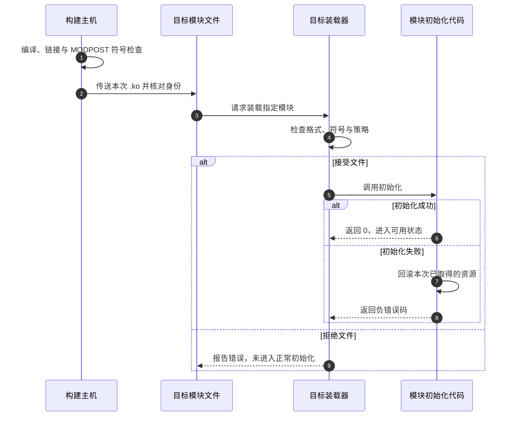

# 第4章\_部署模块并沿错误定位构建问题

[上一章](P03_把模块接入Kconfig与内核构建.md)把源码接入了配置与构建，前两章也能生成树外模块。但一个 `.ko` 存在，只证明某次构建留下了文件；文件被复制到目标，也不等于内核已经接受它。本章先跟随同一个文件走过三个现场，再让两个模块互相调用，用实际依赖理解错误发生在哪里。

## 4.1\_把构建成功与装入成功分开

模块经过编译、链接和模块符号检查，才得到部署产物。目标上的装载器仍会检查格式、版本相关信息、符号和系统要求，并执行初始化。初始化还可能因为设备或资源条件而失败。因此“编译过了，驱动应该能用”跳过了后面的几道事实判断。



**MODPOST** 是内核构建中处理模块元信息和符号的阶段。它读取可用符号资料，检查外部引用等事项；它不在目标内核中执行你的模块。先分清这个时间点，就不会把构建日志里的未定义符号和运行时 `Unknown symbol` 当成同一个现场。

保存一份简短的实验记录：源码提交、内核配置来源、目标架构、工具链、构建命令、产物摘要、目标 `uname -r`、装载命令与紧邻的内核日志。摘要用于确认传输的是哪份文件，不能替代内核版本和接口检查。不要让构建目录里的新文件与部署目录里的旧文件共用一句含糊的“这个模块”。

## 4.2\_让两个模块在构建与运行时都找到对方

第二章的两个 C 文件在同一个模块内链接，不需要导出接口。现在故意增加一个新约束：数值提供者独立装入，观察器依赖它。下面是一个完整的独立实验目录 `module_pair/`；与前几章的 Hello 目录分开，以免旧文件参与本次构建。

共同声明 `note_api.h`：

```c
#ifndef NOTE_API_H
#define NOTE_API_H

/* 提供一个无额外资源生命期的只读演示接口。 */
int note_value_get(void);

#endif
```

提供者 `note_provider.c`：

```c
#define pr_fmt(fmt) KBUILD_MODNAME ": " fmt
#include <linux/init.h>
#include <linux/module.h>
#include <linux/export.h>
#include <linux/printk.h>
#include "note_api.h"

int note_value_get(void)
{
    return 42;
}
/* 这是模块间接口，不是普通 C 声明的替代品。 */
EXPORT_SYMBOL_GPL(note_value_get);

static int __init note_provider_init(void)
{
    pr_info("ready\n");
    return 0;
}

static void __exit note_provider_exit(void)
{
    pr_info("unloaded\n");
}

module_init(note_provider_init);
module_exit(note_provider_exit);
MODULE_LICENSE("GPL");
```

消费者 `note_consumer.c`：

```c
#define pr_fmt(fmt) KBUILD_MODNAME ": " fmt
#include <linux/init.h>
#include <linux/module.h>
#include <linux/printk.h>
#include "note_api.h"

static int __init note_consumer_init(void)
{
    /* 装载时必须已经有能够满足该符号引用的提供者。 */
    pr_info("value=%d\n", note_value_get());
    return 0;
}

static void __exit note_consumer_exit(void)
{
    pr_info("unloaded\n");
}

module_init(note_consumer_init);
module_exit(note_consumer_exit);
MODULE_LICENSE("GPL");
```

`Kbuild` 把两个模块放在同一次构建中：

```make
obj-m := note_provider.o note_consumer.o
```

使用第一章的外部构建命令。共同构建让 MODPOST 能获得双方的导出符号信息。`EXPORT_SYMBOL_GPL` 登记一个 GPL 专用导出符号；普通 `EXPORT_SYMBOL` 是另一种导出形式。选择应遵守实际接口契约与许可证，不是解决报错时随意切换的开关。

`Module.symvers` 是构建生成的符号信息文件，记录导出符号及所属模块等资料；启用符号版本功能时还包含有关校验信息。只复制头文件给消费者，解决的是编译器的声明需求，不能给 MODPOST 提供这份导出记录。只有前者时，编译可能完成而模块检查仍失败。

若工程必须分别构建两个外部模块，先完成提供者构建，再在消费者构建时通过上游参数 `KBUILD_EXTRA_SYMBOLS` 指向提供者本次生成的 `Module.symvers` 绝对路径。该文件应对应正确的源码、内核配置和接口，不能随便从另一版目录复制一个来压掉错误。能采用共同顶层构建时，优先让构建系统统一掌握依赖。

把两个 `.ko` 传到匹配的目标实验目录后，逐条观察：

```bash
# 提供者先建立，消费者才能取得依赖。
sudo insmod ./note_provider.ko
sudo insmod ./note_consumer.ko
sudo dmesg | tail -n 20

# 先退出使用者，再退出服务提供者。
sudo rmmod note_consumer
sudo rmmod note_provider
```

在提供者尚未装入且内核中没有其他同名提供者的干净实验环境，先用 `insmod` 装消费者，应因无法满足符号引用而失败。`insmod` 不替你按安装数据库寻找依赖。正常装入消费者后，常规模块引用会阻止直接卸载仍被依赖的提供者；不要使用强制卸载来破坏这一保证。

这个例子只返回常量，没有把内部指针交给调用者。若服务改成返回对象、注册回调或异步发起工作，模块代码的引用关系不能代替对象的所有权和退出协议。那时要继续设计取消、等待与对象生命期，不能把一次导出宏当作完整资源管理方案。

## 4.3\_从指定文件装载走向安装数据库

实验可以直接 `insmod ./file.ko`。系统化部署则把模块放入目标的 `/lib/modules/<内核发行标识>/`，建立依赖索引后由 `modprobe` 按名称选择并装入。`modprobe` 使用的用户空间配置和索引，与内核最终的装载检查相互配合，不能互相代替。

对于树外模块，固定基线的默认安装子目录是 `updates/`；树内模块通常在 `kernel/` 下。根目录由目标内核发行标识决定，不一定等于你手写的 `6.12.20`，因为本地版本配置等因素可能改变完整标识。

在构建主机为目标准备暂存根文件系统时，使用 `INSTALL_MOD_PATH` 参数指定安装前缀，在已经成功构建的模块目录执行：

```bash
# kernel_build 继续指向本次目标内核的准备与构建目录。
# staging_root 是本次交付专用的暂存目录，不是主机的根目录。
staging_root="$PWD/staging_root"
mkdir -p "$staging_root"
make -C "$kernel_build" M="$PWD" INSTALL_MOD_PATH="$staging_root" modules_install
```

交叉编译时沿用构建阶段的 `ARCH`、`CROSS_COMPILE` 等目标参数，不要让安装阶段悄悄换回默认身份。`INSTALL_MOD_PATH` 是安装前缀；它不是“把目标发行标识替换成这个字符串”。必要时可用 `INSTALL_MOD_DIR` 改变外部模块安装子目录，但必须和交付布局共同管理，不能只改构建端路径而忘记目标。

检查暂存目录实际产生的层级和文件后，再通过项目的根文件系统交付流程传到目标。不要把安装命令中的前缀省掉，意外把板子的模块装进开发主机。安装阶段可能尝试运行依赖处理，交叉暂存环境中仍要核对其工具和结果，不能只看 `.ko` 复制成功。

在目标确认运行的内核与安装目录匹配后，通常由具有权限的部署过程运行 `depmod -a` 更新依赖索引，再使用 `modprobe note_consumer`。`depmod` 根据已安装模块生成依赖信息，`modprobe` 才能据此找到提供者并安排装载。查单个本地文件用 `modinfo ./note_consumer.ko`；查名称时可能命中安装数据库中的另一个版本，必须区分。

这里的 `INSTALL_MOD_PATH` 只控制安装位置，不会让主机正在运行的内核变成目标内核。跨主机生成索引时还要显式选择目标根和发行标识；没有确认这些参数时，宁可在目标交付流程里完成索引更新，也不要对主机默认模块目录执行猜测性的修复。

## 4.4\_错误属于哪个阶段

先保留失败命令和第一条真实错误，再往上下游追踪。后面大量“目标失败”常只是第一个错误的传播，不能按出现次数最多的词猜原因。

| 可观察现场 | 先核对的对象 | 为什么这样查 |
| --- | --- | --- |
| 找不到内核生成头文件或配置相关文件 | `kernel_build` 是否是本次目标的已准备构建目录 | 原始源码不包含全部构建输入；盲目加 include 路径掩盖不了配置缺失 |
| 编译器拒绝目标选项或机器码架构不对 | 实际命令中的编译器、ARCH、工具链前缀 | 选目录与选编译器是两件事；用 `V=1` 看展开结果 |
| MODPOST 报未定义符号 | 实现是否参与构建、接口是否导出、提供者符号资料是否来自同一身份 | 构建阶段还没有目标上的装载顺序可以替你补救 |
| `insmod` 报 `Unknown symbol` | 目标日志中的符号名、提供者是否可用、版本或命名空间限制 | 构建时知道符号不代表目标现在已有正确提供者 |
| `Invalid module format` 或版本信息不符 | 目标发行标识、架构、配置与内核日志 | 文件存在不等于可被该内核接受；错误文字可能只是外层概括 |
| 签名、密钥或策略拒绝 | 目标装载策略、签名来源及日志 | 这与 C 编译是否成功分属不同阶段 |
| 模块进入初始化后返回错误 | 初始化中的资源获取与回滚路径 | 必须解释具体资源失败，重装相同文件未必改变条件 |

`modinfo` 的 `vermagic` 可用于发现部分明显不匹配。固定源码的 `include/linux/vermagic.h` 由内核发行标识、若干配置及架构相关信息组成它；**不能把它描述为完整编译器版本或完整 ABI 的指纹**。ABI（Application Binary Interface，应用二进制接口）在这里涉及已编译代码如何按约定交互，远比一个可读字符串复杂。

开启 `CONFIG_MODVERSIONS` 时，符号版本校验增加了接口一致性检查；这也解释了为什么仅 `modules_prepare` 不保证你已有完整 `Module.symvers`。校验通过仍不是功能正确、时序安全或所有结构布局使用都正确的证明。最可靠的工程起点仍是与目标内核一致的源码、配置和构建材料。

日志应指出具体动作、对象与错误码。使用第一章的 `pr_fmt` 和适当的 `pr_info`、`pr_err` 等接口即可；调试热点路径前先判断打印本身会怎样改变时序。为了找一条消息，可以过滤模块名前缀，但保留完整失败窗口，避免把装载器的关键说明一并滤掉。

## 4.5\_把重新装载写成有顺序的操作

旧式 `reload: all unload load` 把三个动作写成并列依赖；启用并行 make 后，它不保证“构建完成、卸载成功、再装入”。另一个陷阱是 `insmod ... || dmesg`：日志命令成功会让外层误认为这条命令成功。

先保持构建与特权操作分开，在目标上的独立实验脚本中表达顺序。下面的 `reload_note.sh` 假定旧 `hello_note` 已装入，本次 `.ko` 位于当前目录，且使用者已经退出：

```bash
#!/usr/bin/env bash
set -eu

# 卸载失败时停止，保留仍在运行的旧实例。
if ! sudo rmmod hello_note; then
    sudo dmesg | tail -n 30
    exit 1
fi

# 加载失败时明确返回失败；日志不能改变结果。
if ! sudo insmod ./hello_note.ko; then
    sudo dmesg | tail -n 30
    exit 1
fi

sudo dmesg | tail -n 20
```

这里卸载成功而新装载失败时，系统会暂时没有该模块。脚本没有声称自动恢复；想提供回滚能力，必须事先保存已知可用的旧产物，明确状态恢复和重新装入条件。不要用忽略全部错误的 `|| true` 隐藏这种结果。若旧模块本来未装入，应走初次装载流程，不能把所有 `rmmod` 失败一概当作“本来就没有”。

清理使用第一章的目标明确的 `make clean`。它清理模块构建产物，不负责退出仍在运行的模块，更不会撤销已安装到其他目录的文件。开发循环中的构建状态、部署状态和运行状态要分别观察。

## 4.6\_练习与解答

1. 提供者和消费者共同构建成功，目标只复制了消费者。解释 `insmod` 失败时最先缺少的事实。
2. 消费者有头文件，却没有提供者的实现或符号资料，错误为什么可能在 MODPOST 才暴露？
3. 构建主机 `uname -r` 与目标不同，给 `modules_install` 加上暂存前缀能否自动解决内核身份不匹配？
4. 如果卸载被拒绝，重新装载脚本应继续加载新文件吗？如果卸载成功而加载失败，当前状态又是什么？

第一题缺少目标运行时的真实符号提供者，构建记录不能替代它。第二题声明足以让编译器形成调用，但模块阶段还必须知道引用由谁满足。第三题不能，前缀只改变写入位置，目标身份在构建材料和参数中已经确定。第四题不能继续；卸载失败时旧实例可能仍在工作，卸载成功而装载失败则没有新实例接替，必须保留失败结果并按恢复方案处理。

四章至此完成了一个闭环：选择目标、表达代码组成、接入配置、把产物部署并沿阶段排错。接下来可以回到[模块与设备节点入口](../../../knowledge/linux/architecture/modules_and_device_nodes/Linux_内核模块与设备节点操作入门.md)，研究为什么“代码已装入”仍不等于“用户已经能访问设备”。
