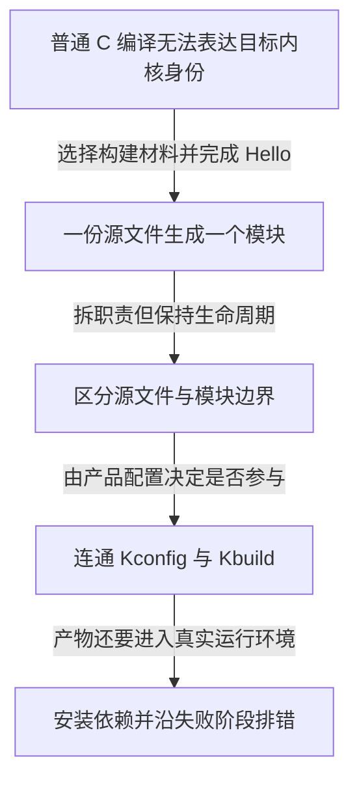

# 第1章\_Linux内核模块构建与部署

这个专题从已经会编译一个简单 C 程序的读者出发，完成“让代码进入正确的内核”这件事。它不要求先写字符设备，不把控制硬件作为第一次实验的前提。不了解用户程序和内核的边界时，先读[Linux 内核概貌](../../../knowledge/linux/architecture/kernel_composition/linux内核概貌.md)及[源码树入口](../../../knowledge/linux/architecture/source_tree/Linux_kernel_目录结构说明.md)。

## 1.1\_四章怎样连起来

| 顺序与正文 | 本章解决的问题 | 必要前置与留给后文的问题 |
| --- | --- | --- |
| [第一章：从 C 文件到匹配目标内核的模块](P01_从C文件到匹配目标内核的模块.md) | 哪些材料决定一个 `.ko` 属于哪个内核，怎样完成最小装入与退出 | 会使用 shell 和编译简单 C；完成后还不能说明多文件如何链接 |
| [第二章：让多个源文件形成清楚的模块边界](P02_让多个源文件形成清楚的模块边界.md) | 一个模块怎样组合多个文件，什么时候需要多个模块或目录 | 已有匹配目标的构建入口；尚未让配置决定构建类别 |
| [第三章：把模块接入 Kconfig 与内核构建](P03_把模块接入Kconfig与内核构建.md) | 菜单选择怎样通过父子构建入口成为内建或模块目标 | 已理解组合对象；源码与构建可控并不证明目标可装载 |
| [第四章：部署模块并沿错误定位构建问题](P04_部署模块并沿错误定位构建问题.md) | 怎样区分构建、安装与运行现场，建立跨模块符号依赖并保留失败状态 | 已能生成所需产物；设备 I/O、并发与对象退出需继续独立学习 |

每章都有可预测的实验或检查过程，以及带理由的练习解答。先完成单模块实验，再进入双模块依赖；不要在目标身份尚未确定时同时排查设备、总线和构建问题。

## 1.2\_源码边界与核对方法

版本相关说明采用 [Linux 源码基线](../../../research/source_reading/linux/SOURCE_BASELINE.md)记录的 NXP 官方 `lf-6.12.20-2.0.0` 发布提交 `dfaf2136deb2af2e60b994421281ba42f1c087e0`，对应 Linux 6.12.20。NXP 仓库服务多个 i.MX 平台；本仓库的 i.MX6ULL 目标不把它变成单一芯片专属内核。本地实验提交和工作树配置不充当发布证据。

核对入口按上游树位置组织：

| 上游相对位置 | 支撑的说明 |
| --- | --- |
| `Documentation/kbuild/modules.rst` | 外部模块准备、`M`、组合目标、Kbuild 优先级、安装前缀与符号资料 |
| `Documentation/kbuild/makefiles.rst` | 目标列表、子目录、组合对象与编译选项作用范围 |
| `Documentation/kbuild/kconfig-language.rst` | 三态配置、依赖与选项描述 |
| `include/linux/vermagic.h` | vermagic 的组成与证据边界 |
| `include/linux/export.h`、`include/linux/module.h` | 模块间导出、元信息与模块接口声明 |

在已核实身份的本地源码仓库可用 `git show <上述固定提交>:Documentation/kbuild/modules.rst` 阅读固定版本；不以当前分支最新文件替代引用版本，也不为阅读证据切换或修改外部工作树。实验源码属于自己的练习目录，内核树集成属于独立学习副本。

## 1.3\_怎样判断已经掌握

给你一份来源不明的 `.ko` 时，能解释为什么不能只看文件名便装入；给你三个 C 文件时，能先决定生命周期与产物数量，再写组合列表；菜单选项可见而没有产物时，能分别检查配置入口和构建入口；加载失败时，能保留现场并指出下一条证据应从构建主机还是目标取得。

这些能力不等于已经完成设备驱动。下一步进入[模块与设备节点](../../../knowledge/linux/architecture/modules_and_device_nodes/Linux_内核模块与设备节点操作入门.md)，或按[Linux 内核学习路线](../../../atlas/tracks/linux_kernel_track.md)继续。字符设备的数据状态、访问契约和退出并发属于各自权威专题，不在构建教程里维护另一份长驱动模板。
