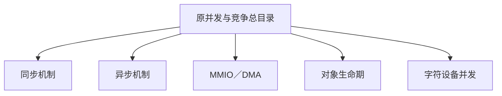

# 第2章\_并发与竞争专题迁移地图

## 2.1\_并发与竞争专题迁移记录

### 2.1.1\_目录状态

原目录曾同时存放同步原语、中断、工作队列、定时器、MMIO、DMA、文件操作并发和对象生命期，导致知识按旧课程顺序归档。同步与异步通用机制现已统一归入“同步和异步机制”专题；其他正文继续按 I/O 顺序、对象生命周期或领域应用保存。本文只记录迁移结果，不再作为知识入口。

### 2.1.2\_新位置

- [Linux 同步和异步机制总纲](../../knowledge/linux/synchronization_and_asynchrony/大纲.md)
  - [同步机制](../../knowledge/linux/synchronization_and_asynchrony/synchronization/大纲.md)
  - [异步机制](../../knowledge/linux/synchronization_and_asynchrony/asynchrony/大纲.md)
- [MMIO 顺序](../../knowledge/linux/io_model/mmio/大纲.md)
- [DMA 一致性](../../knowledge/linux/io_model/dma/大纲.md)
- [对象生命周期集成](../../knowledge/linux/object_lifetime/integration/大纲.md)
- [字符设备文件操作并发与生命周期](../../knowledge/driver_model/character_device/P04_文件操作并发与生命周期.md)

### 2.1.3\_阅读入口

新读者应直接从 [Linux 同步和异步机制总纲](../../knowledge/linux/synchronization_and_asynchrony/大纲.md)或 Atlas 学习路线进入，不再按原 P01～P27 顺序阅读。
