[TOC]


# 内核引导和初始化

处理器上电以后，首先执行引导程序，引导程序吧内核加载到内存，然后执行内核，内核初始化完成以后，启动用户空间的第一个进程。

## 到哪里读取引导程序

​	处理器到哪里读取引导程序的指令？处理器在上电时自动把程序计数器设置为处理器厂商设计的某个固定值，对于ARM64处理器，这个固定值是0[^ 0x0地址说明 ]。处理器的 **内存管理单元（Memory Management Unit，MMU）** 负责把虚拟地址转换为物理地址，ARM64处理器刚上电的时候没有开启内存管理单元，物理地址和虚拟地址相同，所以ARM64处理器到物理地址0取第一条指令。

​	嵌入式设备通常使用 **NOR闪存[^ NOR闪存说明 ]** 作为只读存储器来存放引导程序。NOR闪存的容量比较小，最小读写单位是字节，程序可以直接在芯片内执行。从屋里地址0开始的一段物理地址空间被分配给NOR闪存。

​	综上所述，ARM64处理器到虚拟地址0取指令，就是到物理地址0取指令，也就是到NOR闪存的起始位置取指令。

## 引导程序

​	嵌入式设备通常使用 **U-boot** 作为引导程序。**U-boot（Universal Boot Loader）** 是德国DENX软件工程中心开发的引导程序，是遵循 **GPL** 条款的开源项目。

​	下面简要介绍ARM64处理器的U-boot程序的执行过程，入口是文件 `arch/arm/cpu/armv8/start.S` 定义的标号 **_start**，我们从标号\_start开始分析。

### 入口\_start

标号\_start是U-boot的入口，直接跳转到标号reset执行。U-boot版本为2018.11。

``` assembly
# /arch/arm/cpu/armv8/start.S
/*************************************************************************
 *
 * Startup Code (reset vector)
 *
 *************************************************************************/

.globl	_start
_start:
#if defined(LINUX_KERNEL_IMAGE_HEADER)
	#include <asm/boot0-linux-kernel-header.h>
#elif defined(CONFIG_ENABLE_ARM_SOC_BOOT0_HOOK)
    /*
     * Various SoCs need something special and SoC-specific up front in
     * order to boot, allow them to set that in their boot0.h file and then
     * use it here.
     */
	#include <asm/arch/boot0.h>
#else
	b	reset
#endif
```

### 标号reset

从标号reset开始的代码如下：

```assembly
reset:
	/* 允许板卡保存重要的寄存器 */
	b	save_boot_params
.globl	save_boot_params_ret
save_boot_params_ret:

#if CONFIG_POSITION_INDEPENDENT
	/* Verify that we're 4K aligned.  */
	adr	x0, _start
	ands	x0, x0, #0xfff
	b.eq	1f
0:
	/*
	 * FATAL, can't continue.
	 * U-Boot needs to be loaded at a 4K aligned address.
	 *
	 * We use ADRP and ADD to load some symbol addresses during startup.
	 * The ADD uses an absolute (non pc-relative) lo12 relocation
	 * thus requiring 4K alignment.
	 */
	wfi				/* Wait For Interrupt */ 
	b	0b
1:

	/*
	 * Fix .rela.dyn relocations. This allows U-Boot to be loaded to and
	 * executed at a different address than it was linked at.
	 */
pie_fixup:
	adr	x0, _start		/* x0 <- Runtime value of _start */
	ldr	x1, _TEXT_BASE		/* x1 <- Linked value of _start */
	subs	x9, x0, x1		/* x9 <- Run-vs-link offset */
	beq	pie_fixup_done
	adrp    x2, __rel_dyn_start     /* x2 <- Runtime &__rel_dyn_start */
	add     x2, x2, #:lo12:__rel_dyn_start
	adrp    x3, __rel_dyn_end       /* x3 <- Runtime &__rel_dyn_end */
	add     x3, x3, #:lo12:__rel_dyn_end
pie_fix_loop:
	ldp	x0, x1, [x2], #16	/* (x0, x1) <- (Link location, fixup) */
	ldr	x4, [x2], #8		/* x4 <- addend */
	cmp	w1, #1027		/* relative fixup? */
	bne	pie_skip_reloc
	/* relative fix: store addend plus offset at dest location */
	add	x0, x0, x9
	add	x4, x4, x9
	str	x4, [x0]
pie_skip_reloc:
	cmp	x2, x3
	b.lo	pie_fix_loop
pie_fixup_done:
#endif

/* 这一整个都在定义汇编的宏操作。定义了set_vbar的宏，它将操作传入的两个寄存器。
 * 我想说在后面的汇编中都将大量出现某些不是汇编指令的汇编指令形式的汇编代码。
 * 如下面出现的“switch_el“、”set_vbar“ 和 ”branch_if_not_highest_el“。
 */
#if defined(CONFIG_ARMV8_SPL_EXCEPTION_VECTORS) || !defined(CONFIG_SPL_BUILD)
.macro	set_vbar, regname, reg
	msr	\regname, \reg
.endm
	adr	x0, vectors
#else
.macro	set_vbar, regname, reg
.endm
#endif
	/*
	 * 异常级别可能是3/2或者1，初始状态:
	 * 小端字节序，禁止MMU，禁止指令/数据缓存
	 */
	switch_el x1, 3f, 2f, 1f

/* 如果异常级别是3，那么把向量基准地址寄存器（VBAR_EL3）设置为异常向量的起始地址；
 * 设置安全配置寄存器（SCR_EL3）的NS、IRQ、FIQ和EA这4个位，也就是异常级别0和1处于非安全状态，
 * 在任何异常级别执行时都把中断、快速中断、同步外部终止和系统错误转发到异常级别3；
 * 把协处理器陷入寄存器（CPTR_EL3）设置为0，允许访问浮点和单指令多数据（Single Instruction Multiple Dtata， SIMD）功能；
 * 设置计数器时钟频率寄存器（CNTFRQ_EL0）。
 */
3:	set_vbar vbar_el3, x0
	mrs	x0, scr_el3
	orr	x0, x0, #0xf			/* SCR_EL3.NS|IRQ|FIQ|EA */
	msr	scr_el3, x0
	msr	cptr_el3, xzr			/* 启动浮点和SMIMD功能 */
	b	0f
	
/* 如果异常级别是2，那么把向量基准寄存器（VBAR_EL2）设置为异常向量表的起始地址；
 * 设置协处理器陷入寄存器（CPTR_EL2），允许访问浮点和SIMD功能。
 */
2:	mrs	x1, hcr_el2
	tbnz	x1, #34, 1f			/* HCR_EL2.E2H */
	set_vbar vbar_el2, x0
	mov	x0, #0x33ff
	msr	cptr_el2, x0			/* Enable FP/SIMD */
	b	0f
	
/* 如果异常级别是1，那么把向量基准地址寄存器（VBAR_EL1）设置为异常向量表的起始地址；
 * 设置协处理器访问控制寄存器（CPACR_EL1）,允许访问浮点和SIMD功能。
 */
 
1:	set_vbar vbar_el1, x0
	mov	x0, #3 << 20
	msr	cpacr_el1, x0			/* Enable FP/SIMD */
0:
/* 如果定义了COUNTER_FREQUENCY，判断是否超出计数最大值，如果超过，则初始化CNTFRQ寄存器。 */
#ifdef COUNTER_FREQUENCY
	branch_if_not_highest_el x0, 4f
	ldr	x0, =COUNTER_FREQUENCY
	msr	cntfrq_el0, x0			/* Initialize CNTFRQ */
#endif

4:	isb

	/*
	 * Enable SMPEN bit for coherency.
	 * This register is not architectural but at the moment
	 * this bit should be set for A53/A57/A72.
	 */
#ifdef CONFIG_ARMV8_SET_SMPEN
	switch_el x1, 3f, 1f, 1f
3:
	mrs     x0, S3_1_c15_c2_1               /* cpuectlr_el1 */
	orr     x0, x0, #0x40
	msr     S3_1_c15_c2_1, x0
	isb
1:
#endif

	/* 应用ARM处理器特定的勘误表 */
	bl	apply_core_errata

	/*
	 * Cache/BPB/TLB Invalidate
	 * i-cache 在调用 icache_enable()使能之前无效
	 * tlb 在 调用in dcache_enable()将 mmu 使能之前无效
	 * d-cache 调用 dcache_enable()使能之前无效
	 */

	/* 处理器特定的初始化 */
	bl	lowlevel_init

#if defined(CONFIG_ARMV8_SPIN_TABLE) && !defined(CONFIG_SPL_BUILD)
	branch_if_master x0, x1, master_cpu
	b	spin_table_secondary_jump
	/* 从不返回 */
#elif defined(CONFIG_ARMV8_MULTIENTRY)
	branch_if_master x0, x1, master_cpu

	/*
	 * 协CPUs
	 */
slave_cpu:
	wfe
	ldr	x1, =CPU_RELEASE_ADDR
	ldr	x0, [x1]
	cbz	x0, slave_cpu
	br	x0			/* 转跳到指定地址 */
#endif /* CONFIG_ARMV8_MULTIENTRY */
master_cpu:
	bl	_main
```

这里的源码有很多数字标签，而且还是重复的，这是为何？

- **`0:`、`1:`、`2:`、`3:`、`4:` …**
   这是 **局部数字标签（local label）**，GNU 汇编器（gas）的特殊语法。
- 它们不能直接用名字跳转，而是要结合 **`f` (forward, 向前)** 和 **`b` (backward, 向后)** 使用：
  - **`0f`** → 跳到下一个 `0:`
  - **`0b`** → 跳到前一个 `0:`
  - **`1f`** → 跳到下一个 `1:`
  - **`1b`** → 跳到前一个 `1:`
- 每个数字标签只在当前汇编文件内有效，不会导出到符号表。
- 常用于启动代码和短小的条件跳转，避免污染全局命名空间。

👉 简单记：
 `N:` 定义锚点，`Nb` 回到上一个 N，`Nf` 跳到下一个 N。


下面将一步步讲解代码的意思。阅读时，解释在上，代码在下：

这行代码，调用各种板卡自定义的函数save_boot_params来保存重要的寄存器。
```assembly
	b	save_boot_params
```

4k地址对齐。

```assembly
#if CONFIG_POSITION_INDEPENDENT
	/* Verify that we're 4K aligned.  */
	adr	x0, _start
	ands	x0, x0, #0xfff
	b.eq	1f
```

下面代码整个逻辑就是：

1. 检测到加载地址不对齐 → 打印/记录错误。
2. 执行 `wfi`[^ wfi ] → 让 CPU 睡眠。
3. 跳回 `wfi` → 无限循环睡眠等待（相当于冻结在此）。
```assembly
	/*
	 * FATAL, can't continue.
	 * U-Boot needs to be loaded at a 4K aligned address.
	 *
	 * We use ADRP and ADD to load some symbol addresses during startup.
	 * The ADD uses an absolute (non pc-relative) lo12 relocation
	 * thus requiring 4K alignment.
	 */
	wfi			/* Wait For Interrupt */
	b	0b		/* 无条件跳转到前面最近的 "0:" 标签 */
```


整个逻辑就是：

1. 检测到加载地址不对齐 → 打印/记录错误。
2. 执行 `wfi` [^ wfi ]→ 让 CPU 睡眠。
3. 跳回 `wfi` → 无限循环睡眠等待（相当于冻结在此）。

> **一旦发现 U-Boot 没有按 4KB 对齐加载，它不会冒险继续执行，而是直接挂死在这里。**

执行流程：
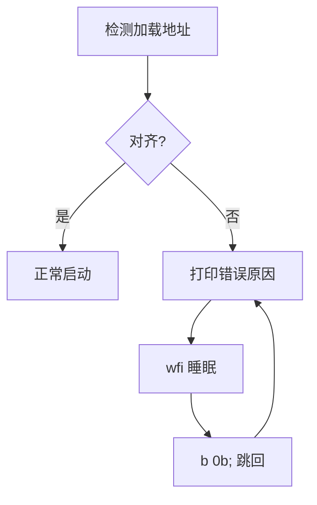

```assembly
#if CONFIG_POSITION_INDEPENDENT
	/* Verify that we're 4K aligned.  */
	adr	x0, _start
	ands	x0, x0, #0xfff
	b.eq	1f
0:
	/*
	 * FATAL, can't continue.
	 * U-Boot needs to be loaded at a 4K aligned address.
	 *
	 * We use ADRP and ADD to load some symbol addresses during startup.
	 * The ADD uses an absolute (non pc-relative) lo12 relocation
	 * thus requiring 4K alignment.
	 */
	wfi				/* Wait For Interrupt */ 
	b	0b
1:

	/*
	 * Fix .rela.dyn relocations. This allows U-Boot to be loaded to and
	 * executed at a different address than it was linked at.
	 */
pie_fixup:
	adr	x0, _start		/* x0 <- Runtime value of _start */
	ldr	x1, _TEXT_BASE		/* x1 <- Linked value of _start */
	subs	x9, x0, x1		/* x9 <- Run-vs-link offset */
	beq	pie_fixup_done
	adrp    x2, __rel_dyn_start     /* x2 <- Runtime &__rel_dyn_start */
	add     x2, x2, #:lo12:__rel_dyn_start
	adrp    x3, __rel_dyn_end       /* x3 <- Runtime &__rel_dyn_end */
	add     x3, x3, #:lo12:__rel_dyn_end
pie_fix_loop:
	ldp	x0, x1, [x2], #16	/* (x0, x1) <- (Link location, fixup) */
	ldr	x4, [x2], #8		/* x4 <- addend */
	cmp	w1, #1027		/* relative fixup? */
	bne	pie_skip_reloc
	/* relative fix: store addend plus offset at dest location */
	add	x0, x0, x9
	add	x4, x4, x9
	str	x4, [x0]
pie_skip_reloc:
	cmp	x2, x3
	b.lo	pie_fix_loop
pie_fixup_done:
#endif
```

解释摘抄自GPT：上述代码在做什么事情？

> 用于 **位置无关执行（PIE [^ PIE ]/ PIC[^ PIC ]）模式** 下的启动地址检查 和 **重定位修正**。
> 我帮你按执行顺序拆开讲一下。
>
> 1. **4KB 对齐检查**
>
> ```assembly
> adr	x0, _start             		// x0 = 当前运行时 _start 的地址
> ands	x0, x0, #0xfff         	// 取地址低 12 位（页内偏移）
> b.eq	1f                    	// 如果低 12 位 == 0，则对齐正确，跳到 1f
> ```
>
> * `#0xfff` = 二进制 0b111111111111，掩码取出地址的低 12 位。
> * 低 12 位为 0 ⇒ 地址是 **4KB 边界对齐**。
> * 如果 **不对齐**，就跳到 `0:` 标签（FATAL 死循环）。
>
> 2. **FATAL 死循环**
> ```assembly
> 0:
>    /* FATAL... 需要 4K 对齐 */
>    wfi
>    b 0b
> ```
> * 进入低功耗等待（`wfi`[^ wfi ]），然后无限跳回自己。
> * 原因在注释里写得很清楚：`ADRP` + `ADD` 的 lo12 绝对偏移依赖 4KB 对齐，否则计算符号地址会错。
>
> 3. **PIE 重定位修正**
> ```assembly
> pie_fixup:
>    adr	x0, _start           	// x0 = 运行时 _start
>    ldr	x1, _TEXT_BASE       	// x1 = 链接时的 _start
>    subs	x9, x0, x1       		// x9 = 运行时地址 - 链接地址（偏移量）
>    beq	pie_fixup_done       	// 偏移为 0 ⇒ 无需修正
> ```
>
> * `_TEXT_BASE` 是链接时设定的镜像基址。
> * 如果运行地址和链接地址不一样，说明被加载到了别的地方，需要做 **重定位修正**。
>
> 4. **读取重定位表**
> ```assembly
>    adrp    x2, __rel_dyn_start     
>    add     x2, x2, #:lo12:__rel_dyn_start
>    adrp    x3, __rel_dyn_end
>    add     x3, x3, #:lo12:__rel_dyn_end
> ```
> * `__rel_dyn_start` / `__rel_dyn_end`：链接器生成的 `.rela.dyn` [^.rela.dyn] 段的起止地址。
> * `.rela.dyn` 里保存了需要运行时修正的符号引用（即动态重定位表）。关于 `.rela.dyn` 的介绍参考[附录/`.rela.dyn` ](# .rela.dyn 介绍)
>
> 5. **循环处理每个重定位项**
> ```assembly
> pie_fix_loop:
>    ldp	x0, x1, [x2], #16    // 取 (符号地址, 类型)
>     ldr	x4, [x2], #8         // 取 addend
>     cmp	w1, #1027            // 类型是否为 "relative fixup"
>    bne	pie_skip_reloc
>     add	x0, x0, x9           // 修正符号地址
>    add	x4, x4, x9           // 修正 addend
>    str	x4, [x0]             // 写回修正值
> pie_skip_reloc:
>     cmp	x2, x3
>     b.lo	pie_fix_loop
> ```
> * `#1027` 对应 ELF 的 `R_AARCH64_RELATIVE` 重定位类型（相对地址修正）。
> * 计算公式：新值 = 原值 + (运行时基址 - 链接基址)。
> * 这样修正后，所有符号引用都指向正确的运行时地址。
>
> 6. **结束**
> ```assembly
> pie_fixup_done:
> ```
>
>
> * `#1027` 对应 ELF 的 `R_AARCH64_RELATIVE` 重定位类型（相对地址修正）。
> * 计算公式：新值 = 原值 + (运行时基址 - 链接基址)。
> * 这样修正后，所有符号引用都指向正确的运行时地址。
> * 重定位完成，继续执行启动流程。
>
> 7. **执行流程总结**
>
> ```mermaid
> flowchart TD
>     A[检查 4K 对齐] --> B{是否对齐?}
> 
>     B -->|对齐| C[计算运行时与链接时的基址差值]
>     B -->|不对齐| G[FATAL 死循环]
> 
>     C --> D{偏移=0?}
>     D -->|是| E[跳过重定位]
>     D -->|否| F[遍历 .rela.dyn 重定位表]
> 
>     F --> H[修正所有依赖绝对地址的引用]
> ```
> 这一整个都在定义汇编的宏操作。定义了set_vbar的宏，它将操作传入的两个寄存器。我想说在后面的汇编中都将大量出现某些不是汇编指令的汇编指令形式的汇编代码。如下面出现的“switch_el“、”set_vbar“ 和 ”branch_if_not_highest_el“。
> ```assembly
> #if defined(CONFIG_ARMV8_SPL_EXCEPTION_VECTORS) || !defined(CONFIG_SPL_BUILD)
> .macro	set_vbar, regname, reg
> 	msr	\regname, \reg
> .endm
> 	adr	x0, vectors
> #else
> .macro	set_vbar, regname, reg
> .endm
> #endif
> ```
>
> 下述代码在根据处理器当前的异常级别设置寄存器：
> ```assembly
> #if defined(CONFIG_ARMV8_SPL_EXCEPTION_VECTORS) || 
> !defined(CONFIG_SPL_BUILD)
> .macro	set_vbar, regname, reg
> msr	\regname, \reg
> .endm
> 	adr	x0, vectors
> #else
> .macro	set_vbar, regname, reg
> .endm
> #endif
> 	/*
> 	 * 异常级别可能是3/2或者1，初始状态:
> 	 * 小端字节序，禁止MMU，禁止指令/数据缓存
> 	 */
> 	switch_el x1, 3f, 2f, 1f
> 3:	set_vbar vbar_el3, x0
> 	mrs	x0, scr_el3
> 	orr	x0, x0, #0xf			/* SCR_EL3.NS|IRQ|FIQ|EA */
> 	msr	scr_el3, x0
> 	msr	cptr_el3, xzr			/* 启动浮点和SMIMD功能 */
> 	b	0f
> 2:	mrs	x1, hcr_el2
> 	tbnz	x1, #34, 1f			/* HCR_EL2.E2H */
> 	set_vbar vbar_el2, x0
> 	mov	x0, #0x33ff
> 	msr	cptr_el2, x0			/* Enable FP/SIMD */
> 	b	0f
> 1:	set_vbar vbar_el1, x0
> 	mov	x0, #3 << 20
> 	msr	cpacr_el1, x0			/* Enable FP/SIMD */
> 0:
> 
> #ifdef COUNTER_FREQUENCY
> 	branch_if_not_highest_el x0, 4f
> 	ldr	x0, =COUNTER_FREQUENCY
> 	msr	cntfrq_el0, x0			/* Initialize CNTFRQ */
> ```
>
> 如果异常级别是3，那么把向量基准地址寄存器（VBAR_EL3）设置为异常向量的起始地址；设置安全配置寄存器（SCR_EL3）的NS、IRQ、FIQ和EA这4个位，也就是异常级别0和1处于非安全状态，在任何异常级别执行时都把中断、快速中断、同步外部终止和系统错误转发到异常级别3；把协处理器陷入寄存器（CPTR_EL3）设置为0，允许访问浮点和单指令多数据（Single Instruction Multiple Dtata， SIMD）功能；设置计数器时钟频率寄存器（CNTFRQ_EL0）。
>
> ```assembly
> 3:	set_vbar vbar_el3, x0
> 	mrs	x0, scr_el3
> 	orr	x0, x0, #0xf			/* SCR_EL3.NS|IRQ|FIQ|EA */
> 	msr	scr_el3, x0
> 	msr	cptr_el3, xzr			/* 启动浮点和SMIMD功能 */
> 	b	0f
> ```
>
> 如果异常级别是2，那么把向量基准寄存器（VBAR_EL2）设置为异常向量表的起始地址；设置协处理器陷入寄存器（CPTR_EL2），允许访问浮点和SIMD功能。
>
> ```assembly
> 2:	mrs	x1, hcr_el2
> 	tbnz	x1, #34, 1f			/* HCR_EL2.E2H */
> 	set_vbar vbar_el2, x0
> 	mov	x0, #0x33ff
> 	msr	cptr_el2, x0			/* Enable FP/SIMD */
> 	b	0f
> ```
>
> 如果异常级别是1，那么把向量基准地址寄存器（VBAR_EL1）设置为异常向量表的起始地址；设置协处理器访问控制寄存器（CPACR_EL1）,允许访问浮点和SIMD功能。
>
> ```assembly
> 1:	set_vbar vbar_el1, x0
> 	mov	x0, #3 << 20
> 	msr	cpacr_el1, x0			/* Enable FP/SIMD */
> 0:
> ```
> 如果定义了COUNTER_FREQUENCY，判断是否超出计数最大值，如果超过，则初始化CNTFRQ寄存器。
>
> ```assembly
> #ifdef COUNTER_FREQUENCY
> 	branch_if_not_highest_el x0, 4f
> 	ldr	x0, =COUNTER_FREQUENCY
> 	msr	cntfrq_el0, x0			/* Initialize CNTFRQ */
> ```
>
> 为处理器的缺陷打补丁：
>
> ```assembly
> /* 应用ARM处理器特定的勘误表 */
> bl	apply_core_errata
> ```
>
> 调用函数lowlevel_init以执行函数board_init_f()所需要的最小初始化。当前文件定义了弱符号类型的函数lowlevel_init，处理器厂商可以自定义强符号类型的函数low_level_init以覆盖弱符号：
>
> ```assembly
> /* 处理器特定的初始化 */
> bl	lowlevel_init
> ```
>
> 如果是多处理器系统，那么是多处理器系统，那么只有一个处理器是主处理器（也称为引导处理
> 器），其他处理器是从处理器：
>
> ```assembly
> #if defined(CONFIG_ARMV8_SPIN_TABLE) && !defined(CONFIG_SPL_BUILD)
> 	branch_if_master x0, x1, master_cpu
> 	b	spin_table_secondary_jump
> 	/* 从不返回 */
> #elif defined(CONFIG_ARMV8_MULTIENTRY)
> 	branch_if_master x0, x1, master_cpu
> 
> 	/*
> 	 * 协CPUs
> 	 */
> slave_cpu:
> 	wfe
> 	ldr	x1, =CPU_RELEASE_ADDR
> 	ldr	x0, [x1]
> 	cbz	x0, slave_cpu
> 	br	x0			/* 转跳到指定地址 */
> #endif /* CONFIG_ARMV8_MULTIENTRY */
> ```
>
> **自旋表启动说明**
>
> 如果使用自旋表启动方法，并且不是编译为第二程序加载器，那么从处理器执行函数 `spin_table_secondary_jump` 。源文件 “arch/arm/cpu/armv8/span_table.c” 中定义了函数 `span_table_secondary_jump` ，执行过程为：从处理器进入低功耗状态，它被唤醒的时候，从地址 `span_table_cpu_release_addr` 读取函数地址，如果主处理器还没有指定函数地址，继续等待；如果主处理器指定了函数地址，就跳转到指定的函数地址执行。
>
>  ```assembly
>  #if defined(CONFIG_ARMV8_SPIN_TABLE) && !defined(CONFIG_SPL_BUILD)
>  	branch_if_master x0, x1, master_cpu
>  	b	spin_table_secondary_jump
>  	/* 从不返回 */
>  ```
>
> 如果允许多个处理器进入引导程序，那么从处理器进入低功耗状态，它被唤醒时，从地址CPU_RELEASE_ADDR读取函数地址，如果主处理器还没有指定函数地址，继续等待；如果主处理器指定了函数地址，就跳转到指定的函数地址执行。
>
> ```assembly
> #elif defined(CONFIG_ARMV8_MULTIENTRY)
> 	branch_if_master x0, x1, master_cpu
> 
> 	/*
> 	 * 协CPUs
> 	 */
> slave_cpu:
> 	wfe
> 	ldr	x1, =CPU_RELEASE_ADDR
> 	ldr	x0, [x1]
> 	cbz	x0, slave_cpu
> 	br	x0			/* 转跳到指定地址 */
> #endif /* CONFIG_ARMV8_MULTIENTRY */
> ```
>
> 主处理器执行函数main：
>
> ```assembly
> master_cpu:
> 	bl	_main
> ```
>
> 到此为止，标号reset就已经讲解完成。
>
> 

下面介绍第二阶段程序加载器。

> U-Boot分为SPL和正常的U-Boot程序两个部分，如果想要编译为SPL，需要开启配置宏CONFIG_SPL_BUILD。SPL是“Secondary Program Loader”的简称，即第二阶段程序加载器，第二阶段是相对于处理器里面的只读存储器中的固化程序来说的，处理器启动时最先执行的是只读存储器中的固化程序。
>
> 固化程序通过检测启动方式来加载第二阶段程序加载器。为什么需要第二阶段程序加载器？原因是：一些处理器内部集成的静态随机访问存储器（SRAM）比较小，无法装载一个完整的U-Boot镜像，此时需要第二阶段程序加载器，它主要负责初始化内存和存储设备驱动，然后把正常的U-Boot镜像从存储设备读到内存中执行。

我始终认为这两段话的概念较为模糊，以下是 **重新整理的讲解** ：

**GPT说**：好的 ✅，我理解了，你需要的是 **较为完整的、逐层展开的学习型笔记**，而不是我之前那种总结式的压缩内容。那我就把你的问题背景、ROMBoot/SPL/TPL/U-Boot proper 的关系、CPU 执行位置、DDR 初始化和重定位的必要性，全都系统化地写成一份电子笔记。因为内容较多，我会 **分批次输出**，避免一次过长。

------

### 📘 U-Boot 启动阶段详细笔记

------

#### 0. 背景与困惑来源

在学习 U-Boot 的启动链路时，容易遇到以下疑问：

1. **SPL 称为第一阶段，但 CPU 上电后最先执行的是 BootROM（ROMBoot）。**
   - 那么 SPL 如何还能称为第一阶段？
   - 这是否意味着 U-Boot 不包含 ROMBoot？
2. **TPL 和 SPL 的关系如何描述？**
   - 如果 SRAM 足够大，直接 SPL 就够了；
   - 如果 SRAM 不够大，还需要 TPL → SPL → U-Boot proper；
   - 那么 TPL 和 SPL 如何定位？
3. **如果没有 SPL，U-Boot proper 是否直接在 SRAM 里运行？**
   - 那么 DDR 初始化该由谁来完成？
   - 如果 U-Boot proper 本身不在 SRAM，而是在 DDR 里执行，又是谁来初始化 DDR？
4. **关于重定位的问题：**
   - 既然最终目标就是让 U-Boot proper 在 DDR 执行，为什么不在编译时直接针对 DDR 地址编程？
   - 为什么 SPL/U-Boot proper 阶段还要执行 relocation（重定位修正）？

这些问题的核心在于：**CPU 的执行视角、存储介质与内存映射、不同阶段运行地址的差异**。

------

#### 1. ROMBoot (BootROM)

##### 1.1 定义

- BootROM 是芯片出厂时固化在 **片内 ROM** 中的启动程序。
- **不属于 U-Boot 项目本身**，它由芯片厂商实现。

##### 1.2 执行位置

- **CPU 执行位置：ROM（BootROM 区）**
- 上电后，CPU 复位向量指向 BootROM 的起始地址，指令从这里取出。

##### 1.3 职责

1. **启动模式检测**
   - 根据 BOOT PIN、eFuse、OTP 配置，决定从哪个介质启动（eMMC、NAND、SD、NOR、UART、USB OTG…）。
2. **加载第一份可执行镜像**
   - 将存储介质中的一段镜像拷贝到片内 SRAM，或者直接放入 DDR（前提是 ROMBoot 具备 DDR 初始化能力）。
   - 这段镜像可能是：
     - TPL
     - SPL
     - U-Boot proper
3. **跳转执行**
   - 跳转到加载到的镜像入口点，继续执行。

##### 1.4 结论

- 从 **全系统视角**：BootROM 才是真正的第一阶段。
- 从 **U-Boot 自身的划分**：SPL 被称为第一阶段（相对于 U-Boot proper 而言），不包括 BootROM。

------

#### 2. TPL (Tertiary Program Loader)

##### 2.1 定义

- **TPL = 第三级加载器**。
- 出现在某些 SRAM 容量非常小的 SoC 上。
- 是一个比 SPL 还要小的极简程序。

##### 2.2 执行位置

- **CPU 执行位置：SRAM**
- TPL 被 BootROM 从存储介质加载到 SRAM，并在 SRAM 里运行。

##### 2.3 职责

- 由于 SRAM 空间有限，TPL 的代码必须极度精简。
- 主要任务：
  - 完成 **DDR 初始化或训练**；
  - 给 SPL 腾出一个可用的 DDR 或 SRAM 工作区。

##### 2.4 与 SPL 的关系

- 如果 SRAM 足够大：**ROMBoot → SPL → U-Boot proper**
- 如果 SRAM 太小：**ROMBoot → TPL → SPL → U-Boot proper**

👉 TPL 的存在是为了把 DDR 初始化的责任前移，让 SPL 可以在 DDR 里运行。

------

好 👍 那我接着写第二批笔记，这一部分重点是 **SPL 与 U-Boot proper**，以及你最关心的 **CPU 在不同阶段执行的位置**、**DDR 初始化责任**、**为何要重定位**。最后我会加上一个 **对照表 + 流程图**，帮助直观理解。

### 📘 U-Boot 启动阶段详细笔记（第二部分）

---

#### 3. SPL (Small Program Loader)

##### 3.1 定义

- **SPL = 小型 U-Boot 程序**，是 U-Boot 的“第一阶段”（相对于 U-Boot proper 而言）。
- 编译时需开启 `CONFIG_SPL_BUILD` 宏。
- 是一个高度裁剪的 U-Boot，保留最核心功能，去掉命令行、驱动框架等。

##### 3.2 执行位置

- **CPU 执行位置：SRAM**
- SPL 由 BootROM（或 TPL）加载到 SRAM 中运行。

##### 3.3 职责

1. 初始化 **DDR 控制器**；
2. 必要时初始化 **存储设备驱动**（NAND/eMMC/SD…）；
3. 把 **U-Boot proper** 从存储介质拷贝到 DDR；
4. 跳转执行 U-Boot proper。

👉 所以 **SPL 的核心任务就是：给 U-Boot proper 准备 DDR**。

------

#### 4. U-Boot proper (Main U-Boot)

##### 4.1 定义

- U-Boot 的完整版本，功能齐全。
- 提供命令行、外设驱动、文件系统、网络、操作系统加载功能。

##### 4.2 执行位置

- **CPU 执行位置：DDR**
- SPL 把它搬运到 DDR 后跳转执行。
- 在某些高端 SoC，BootROM 也可能直接把 U-Boot proper 放入 DDR。

##### 4.3 职责

1. 提供调试与交互环境（命令行）；
2. 初始化外设（以太网、USB、显示、存储）；
3. 加载操作系统（Linux / RTOS 内核）到 DDR；
4. 跳转到内核入口。

------

#### 5. DDR 初始化责任

| 启动链路                              | CPU 执行位置            | 谁负责 DDR 初始化 | 适用场景                 |
| ------------------------------------- | ----------------------- | ----------------- | ------------------------ |
| ROMBoot → SPL → U-Boot proper         | ROM → SRAM → DDR        | **SPL**           | 最常见                   |
| ROMBoot → TPL → SPL → U-Boot proper   | ROM → SRAM → SRAM → DDR | **TPL**           | SRAM 太小                |
| ROMBoot → U-Boot proper（先在 SRAM）  | ROM → SRAM → DDR        | **U-Boot proper** | SRAM 很大                |
| ROMBoot → U-Boot proper（直接在 DDR） | ROM → DDR               | **ROMBoot**       | 高端 SoC，BootROM 功能强 |

------

#### 6. 重定位 (Relocation)

##### 6.1 为什么需要？

- 编译/链接时，U-Boot proper 假设了一个 DDR 基址（如 `0x4A00_0000`）；
- 实际运行时，SPL/BootROM 可能把它加载到另一个地址（如 `0x4C00_0000`）；
- 如果代码里有 **绝对地址引用**，就会出错。

##### 6.2 解决方法

1. 使用 **PIE（Position Independent Executable）** 技术，让代码大部分用 PC-relative 访问；
2. 启动时执行 relocation 逻辑：
   - 遍历 `.rela.dyn` 表；
   - 修正绝对引用（函数地址、全局变量地址等）。

👉 重定位的核心目的：保证 **U-Boot proper 无论被加载到哪块 DDR 地址，都能正确运行**。

------

#### 7. 启动流程直观图

##### 7.1 表格视图

| 阶段              | 镜像来源                           | CPU 执行位置 | 主要任务                                 |
| ----------------- | ---------------------------------- | ------------ | ---------------------------------------- |
| **ROMBoot**       | 片内 ROM 固化                      | ROM          | 检测启动方式，加载 TPL/SPL/U-Boot proper |
| **TPL** (可选)    | 存储介质                           | SRAM         | DDR 初始化/训练，腾出环境给 SPL          |
| **SPL**           | 存储介质                           | SRAM         | DDR 初始化，加载 U-Boot proper 到 DDR    |
| **U-Boot proper** | 存储介质（由 SPL 或 ROMBoot 搬运） | DDR          | 外设/文件系统/网络，加载内核到 DDR       |

------

##### 7.2 Mermaid 流程图

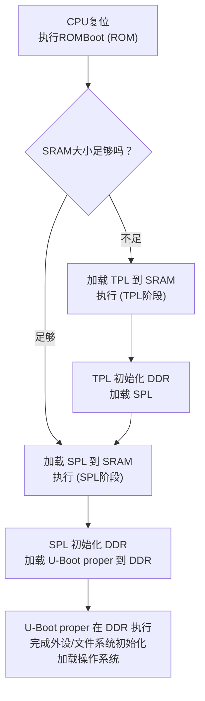

------

#### 8. 核心总结（带背景问题回答）

1. **SPL 称为第一阶段**：
   - 从 U-Boot 自身角度看，它是第一个执行的部分；
   - 从系统角度看，ROMBoot 永远是最先执行。
2. **TPL 与 SPL 的关系**：
   - TPL 更小，先在 SRAM 跑，主要干 DDR 初始化；
   - SPL 需要 DDR 才能展开运行。
3. **如果没有 SPL**：
   - U-Boot proper 可以直接放进 SRAM 跑；
   - 此时 DDR 初始化责任在 U-Boot proper。
4. **如果 U-Boot proper 一开始就在 DDR 跑**：
   - 必然是 ROMBoot 已经完成了 DDR 初始化。
5. **重定位的意义**：
   - 解决“编译时链接地址 ≠ 运行时加载地址”的问题；
   - 保证 U-Boot proper 能在不同 DDR 地址下正常运行。

------

📌 这样整理完，笔记就完整了：既有文字说明，又有对照表和流程图。

要不要我再扩展一部分，把 **CPU 地址空间视角（ROM / SRAM / DDR / 外设寄存器）** 单独画成一个“地址映射图”？这样就能同时看到“CPU 视角”和“启动阶段”两条线索。

好嘞 ✅，那我接着补充第三批笔记，专门聚焦在 **CPU 的地址空间视角**，帮你把 ROM、SRAM、DDR 和外设寄存器的映射关系说明清楚，同时给一张 **地址映射图**，让你能从 CPU 的眼睛看清整个启动过程。

------

### 📘 U-Boot 启动阶段详细笔记（第三部分：CPU 地址视角）

#### 1. CPU 的地址空间（物理地址）

在 ARM SoC 上，CPU 看到的是一张 **统一的物理地址空间 (PA)**。

- **ROM (BootROM)**
  - 片内掩膜 ROM，通常在固定高地址或者低地址。
  - 复位向量会指向 ROM 的起始地址。
  - CPU 上电后第一条指令就是从 ROM 区取的。
- **SRAM (On-chip SRAM)**
  - 片上静态 RAM，容量通常很小（几十 KB ～ 几百 KB）。
  - ROMBoot 会把 SPL 或者 U-Boot proper 装载到这里运行。
- **DDR (外部 DRAM)**
  - 大容量外部内存，挂在 DDR 控制器上。
  - 必须经过 DDR 控制器初始化后才能使用。
  - SPL/TPL 的主要任务就是初始化 DDR。
- **外设寄存器 (Peripherals)**
  - 映射在高地址区，比如 `0xF000_0000 ~ 0xFFFF_FFFF`。
  - 包括 eMMC/NAND 控制器、UART、I2C、SPI 等。
  - CPU 通过读写这些寄存器间接访问外部存储介质。

------

#### 2. 启动阶段 CPU 执行位置对照

| 阶段              | 镜像位置                      | CPU 执行位置 | CPU 取指/访存来源 |
| ----------------- | ----------------------------- | ------------ | ----------------- |
| **ROMBoot**       | 固化在芯片 ROM                | ROM 区       | 片内 ROM          |
| **TPL**（可选）   | 存储介质，ROMBoot 加载        | SRAM         | 片上 SRAM         |
| **SPL**           | 存储介质，ROMBoot 或 TPL 加载 | SRAM         | 片上 SRAM         |
| **U-Boot proper** | 存储介质，SPL 或 ROMBoot 加载 | DDR          | 外部 DRAM         |

------

#### 3. 为什么需要这种“视角切换”？

1. **CPU 的视角**：永远只看物理地址空间（PA），不关心背后是 ROM、SRAM 还是 DDR。
   - 当执行 `ldr x0, [x1]` 时，x1 的数值是一个物理地址。
   - 总线仲裁逻辑会把这个请求路由到 ROM/SRAM/DDR/外设寄存器。
2. **存储介质的视角**：
   - NAND/eMMC/SD 并不直接映射在 CPU 地址空间，而是通过 **控制器寄存器**访问。
   - CPU 向控制器写命令（如“读块 123”），控制器把数据搬进 DDR/SRAM。
3. **DDR 的视角**：
   - CPU 发出的 PA 由 **DDR 控制器**翻译成 DDR 的 row/col/bank 地址，发给 DRAM 芯片。
   - 对 CPU 来说只是 `0x4000_0000`，对 DRAM 来说是 `Bank=3, Row=0x124, Column=0x20`。

👉 这就是为什么你会感觉有两种视角：

- CPU：物理地址空间统一平面；
- 存储器/外设：块号/行列地址的内部协议。

------

#### 4. 地址映射示意图

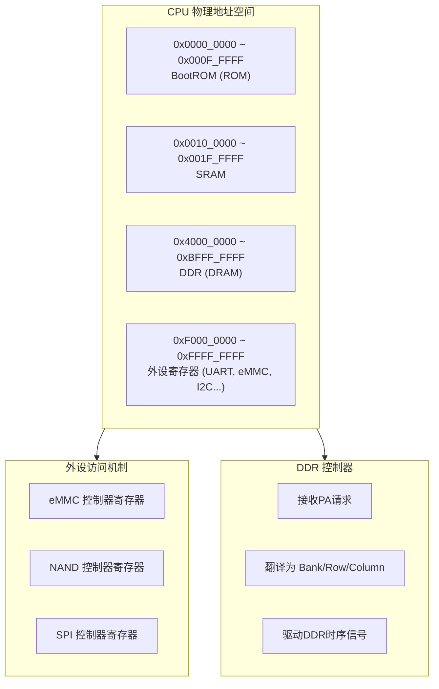

------

#### 5. 衔接回 SPL/U-Boot proper 的运行

- **ROMBoot 阶段**：CPU 取指来自 ROM 地址；
- **SPL 阶段**：CPU 取指来自 SRAM；
- **U-Boot proper 阶段**：CPU 取指来自 DDR；
- **切换过程**：通过 BootROM/TPL/SPL 把镜像从外设搬到 SRAM/DDR，并完成 DDR 初始化。

👉 **最终结论**：

- CPU 本身不区分 ROM/SRAM/DDR，只认物理地址空间；
- 外设/DDR 控制器负责把 CPU 的物理地址请求翻译成真实存储器操作；
- SPL/U-Boot proper 的重定位就是为了确保在 **DDR 中的运行地址 = 代码内部引用地址**，保证一致性。

------

要不要我再写一批，把 **重定位机制的底层实现细节（例如 `.rela.dyn` 表、PIE、绝对地址修正）**单独展开，作为最后的补充笔记？这样整个链路就完整了，从 BootROM → SPL → DDR → Relocation → U-Boot proper 全链路打通。

好，那我继续给你整理第四批笔记，这一部分专门聚焦在 **重定位 (Relocation)**，详细说明 **为什么要重定位、重定位的机制、涉及的数据结构、CPU 在执行时的变化**。这样你从 BootROM → SRAM → DDR → 重定位 → U-Boot proper 的整个链路就闭环了。

------

### 📘 U-Boot 启动阶段详细笔记（第四部分：重定位机制）

#### 1. 为什么要重定位？

##### 1.1 链接地址 vs 运行地址

- **链接地址 (Link Address)**
  - 在编译/链接时，U-Boot 假定自己在某个地址运行，比如 `0x4A00_0000`。
  - 所有全局变量、函数、常量的符号地址，都是基于这个地址计算的。
- **运行地址 (Run-time Address)**
  - 实际启动时，SPL 或 ROMBoot 可能把 U-Boot proper 放在 **另一个 DDR 区域**，比如 `0x4C00_0000`。
  - 如果代码里有绝对地址引用，就会出错。

##### 1.2 为什么不能只用 PC-relative？

- ARM64 支持 PC-relative 访问（`adr/adrp`），理论上可以避免绝对地址问题。
- 但仍有以下场景需要修正：
  1. **GOT/符号表里的绝对地址**；
  2. **静态初始化的全局指针**；
  3. **函数指针表、异常向量表**；
  4. **一些编译器生成的非 PC-relative 指令**。

👉 因此，必须在启动时做一次 relocation，把这些“编译时假设的地址”修正为“实际运行地址”。

------

#### 2. U-Boot 重定位的流程

假设 SPL 已经把 U-Boot proper 搬运到 DDR：

1. **计算偏移量 (offset)**

   ```asm
   adr   x0, _start      // x0 = 当前运行时 _start 地址
   ldr   x1, _TEXT_BASE  // x1 = 链接时假设的 _start 地址
   subs  x9, x0, x1      // x9 = 偏移量 (运行地址 - 链接地址)
   ```

2. **检查是否需要 relocation**

   - 如果 `x0 == x1`（运行地址 = 链接地址），则跳过；
   - 否则进入 relocation 流程。

3. **遍历重定位表 `.rela.dyn`**

   - 表中每一项描述一个需要修正的地址：
     - `r_offset` → 需要修正的位置；
     - `r_info`   → 重定位类型（绝对/相对…）；
     - `r_addend` → 附加值。

4. **修正地址**

   - 常见场景是 **相对修正 (R_AARCH64_RELATIVE)**：

     ```asm
     new_value = addend + offset
     str new_value, [dest_addr]
     ```

5. **完成 relocation**

   - 所有绝对地址修正完毕；
   - 此时 CPU 在 DDR 中执行的 U-Boot proper，内部所有指针都指向正确的 DDR 运行地址。

------

#### 3. 数据结构示例

在 U-Boot ELF 文件中：

- **`.rela.dyn` 段**：保存所有需要修正的符号。

- 重定位表项 (简化)：

  ```c
  struct Rela {
      Elf64_Addr r_offset; // 需要修正的位置
      Elf64_Xword r_info;  // 重定位类型
      Elf64_Sxword r_addend; // 附加值
  };
  ```

例如：

```
r_offset = 0x4A001234
r_info   = R_AARCH64_RELATIVE
r_addend = 0x100
```

运行时修正为：

```
*(0x4C001234) = 0x100 + (0x4C000000 - 0x4A000000)
```

------

#### 4. CPU 执行视角下的变化

| 阶段                                          | CPU 执行位置 | 地址引用情况               | 是否需要 relocation |
| --------------------------------------------- | ------------ | -------------------------- | ------------------- |
| **ROMBoot**                                   | ROM          | 固化代码，地址固定         | 不需要              |
| **SPL/TPL**                                   | SRAM         | 小程序，多用 PC-relative   | 基本不需要          |
| **U-Boot proper 加载到 DDR（未 relocation）** | DDR          | 内部引用仍然指向链接地址   | 必须 relocation     |
| **U-Boot proper relocation 完成**             | DDR          | 所有绝对地址修正为实际地址 | 后续正常运行        |

👉 **Relocation 是 DDR 阶段“开机自检”必做的步骤**，保证代码和数据内部一致。

------

#### 5. 重定位流程图

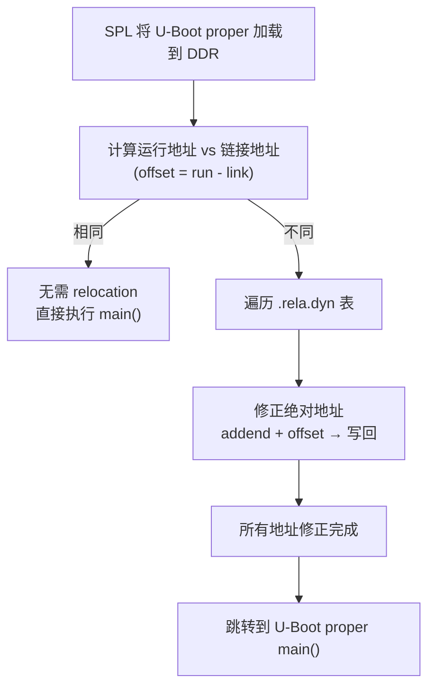

------

#### 6. 总结

1. **Relocation 的根本原因**：
   - 链接时假设的地址 ≠ 实际运行地址；
   - U-Boot 要适配多 SoC、多内存布局，必须通用。
2. **Relocation 的实现机制**：
   - 计算运行时和链接时的偏移；
   - 遍历 `.rela.dyn`，修正绝对地址引用。
3. **CPU 视角**：
   - 在 relocation 前，取指/执行来自 DDR，但内部数据引用可能错；
   - relocation 后，一切地址映射正确，U-Boot proper 可以稳定运行。

------

📌 至此，你的问题背景已经全覆盖：

- **ROMBoot → TPL/SPL → U-Boot proper** 的执行位置；
- **DDR 初始化的责任划分**；
- **CPU 地址空间视角（ROM/SRAM/DDR/外设）**；
- **重定位的必要性与实现机制**。

要不要我再帮你把最后所有阶段 **CPU 执行位置 + 地址映射 + 任务** 整合成一张总览“大表 + 大图”，作为最终总结？

好 ✅，既然你要最终的 **总览版**，我来整理一份 **大表 + 大图**，把你关心的所有维度（阶段、CPU执行位置、外设视角、DDR初始化责任、是否重定位）全部整合在一起，做成最后的电子笔记总结。

------

### 📘 U-Boot 启动阶段全景笔记（总览版）

------

#### 1. 启动阶段对照总表

| 阶段                                | 镜像来源                         | CPU 执行位置（取指来源） | 内存/外设视角                                      | 主要任务                                 | DDR 初始化责任                                        | 是否需要重定位                             |
| ----------------------------------- | -------------------------------- | ------------------------ | -------------------------------------------------- | ---------------------------------------- | ----------------------------------------------------- | ------------------------------------------ |
| **ROMBoot (BootROM)**               | 固化在片内 ROM                   | ROM 区                   | CPU 取指来自 BootROM；通过外设寄存器访问存储介质   | 选择启动方式，加载下一阶段镜像           | **ROMBoot 自己**（极少数高端 SoC，支持直接 DDR init） | ❌                                          |
| **TPL (可选)**                      | 存储介质，由 ROMBoot 加载        | SRAM                     | CPU 取指来自 SRAM；外设寄存器可用                  | 极简 DDR 初始化/训练                     | **TPL**                                               | ❌                                          |
| **SPL**                             | 存储介质，由 ROMBoot 或 TPL 加载 | SRAM                     | CPU 取指来自 SRAM；外设寄存器可用                  | 初始化 DDR，加载 U-Boot proper 到 DDR    | **SPL**                                               | ❌（SPL 多用 PC-relative，不做 relocation） |
| **U-Boot proper (未 relocation)**   | 存储介质，由 SPL 或 ROMBoot 加载 | DDR                      | CPU 取指来自 DDR；但代码中仍可能包含错误的绝对地址 | 等待 relocation 修正                     | 已完成 (由 SPL/TPL/ROMBoot)                           | ✅ 必须修正                                 |
| **U-Boot proper (完成 relocation)** | DDR                              | DDR                      | CPU 取指 & 访存一致；所有符号指针已修正            | 外设/文件系统/网络初始化，加载内核到 DDR | 已完成                                                | ❌（已经修正过了）                          |
| **Linux/RTOS 内核**                 | 存储介质，由 U-Boot proper 加载  | DDR                      | DDR                                                | 提供完整 OS                              | 已完成                                                | ❌                                          |

------

#### 2. CPU 地址映射总览图

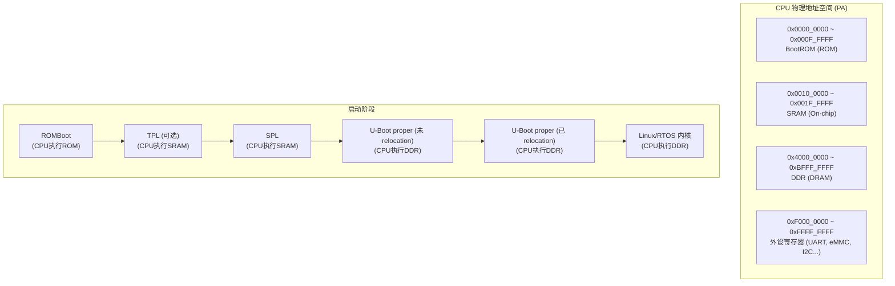

------

#### 3. 重定位在总览中的位置

- **ROMBoot / TPL / SPL 阶段**：几乎都运行在 **SRAM**，使用 PC-relative 编译，无需 relocation。
- **U-Boot proper 加载到 DDR 后**：
  - 此时 **CPU 取指来自 DDR**；
  - 但代码里仍可能引用“链接地址”；
  - 所以必须在 DDR 中执行 **relocation**，修正 `.rela.dyn` 表里的绝对地址。
- **Relocation 完成后**：U-Boot proper 就能在 DDR 稳定运行，并进入完整功能阶段。

------

#### 4. 关键结论

1. **U-Boot 不包含 ROMBoot**，ROMBoot 属于芯片固化程序，是系统级的第一阶段；SPL 才是 U-Boot 的第一阶段。
2. **TPL 的存在是特例**：SRAM 太小时才需要，核心作用就是 DDR 初始化。
3. **SPL 永远在 SRAM 中运行**，负责 DDR 初始化与加载 U-Boot proper。
4. **U-Boot proper 必须运行在 DDR**，否则无法支撑大功能；如果 SRAM 足够大，也可以先在 SRAM 执行，再迁移到 DDR。
5. **DDR 初始化的责任可能在 TPL、SPL、U-Boot proper 或 ROMBoot**，取决于芯片设计。
6. **Relocation 是 DDR 阶段的关键动作**：解决编译时假设地址 ≠ 实际加载地址的问题。

------

📌 至此，完整链路已经打通：

- **CPU 的执行位置**（ROM/SRAM/DDR）
- **外设/DDR控制器的视角**
- **SPL/TPL/U-Boot proper 的职责划分**
- **重定位的必要性和过程**

------

要不要我帮你把 **重定位流程（`.rela.dyn` 修正）** 也整合进这张总览图里？比如在 U-Boot proper → relocation → main 的位置加一个细节点？

好 ✅，那我来补全最后一块，把 **重定位流程** 也整合进 **总览图**，并且在表格里明确标出 **重定位触发点**，这样一眼就能看出：U-Boot proper 是如何从“刚加载到 DDR” → “执行 relocation” → “进入 main”的。

------

### 📘 U-Boot 启动阶段全景笔记（含重定位流程）

------

#### 1. 启动阶段对照表（含 relocation）

| 阶段                              | 镜像来源                         | CPU 执行位置（取指来源） | 内存/外设视角                                    | 主要任务                                 | DDR 初始化责任              | 重定位情况 |
| --------------------------------- | -------------------------------- | ------------------------ | ------------------------------------------------ | ---------------------------------------- | --------------------------- | ---------- |
| **ROMBoot (BootROM)**             | 片内 ROM 固化                    | ROM 区                   | BootROM 固化在 ROM；访问存储介质需操作外设寄存器 | 检测启动方式，加载 TPL/SPL/U-Boot proper | 部分高端 SoC                | ❌          |
| **TPL (可选)**                    | 存储介质，由 ROMBoot 加载        | SRAM                     | CPU 执行 SRAM；外设寄存器可用                    | 极简 DDR 初始化/训练                     | **TPL**                     | ❌          |
| **SPL**                           | 存储介质，由 ROMBoot 或 TPL 加载 | SRAM                     | CPU 执行 SRAM；外设寄存器可用                    | DDR 初始化，加载 U-Boot proper 到 DDR    | **SPL**                     | ❌          |
| **U-Boot proper (未 relocation)** | 存储介质，由 SPL 或 ROMBoot 加载 | DDR                      | CPU 执行 DDR；但符号引用仍基于链接地址           | 等待 relocation 修正                     | 已完成 (由 SPL/TPL/ROMBoot) | ✅ 必须执行 |
| **Relocation 流程**               | `.rela.dyn` 表在镜像中           | DDR                      | CPU 遍历 relocation 表，修正绝对地址             | 修正全局变量、函数指针等地址             | 已完成                      | ⚙️ 正在执行 |
| **U-Boot proper (已 relocation)** | DDR                              | DDR                      | CPU 取指 & 访存一致，代码和数据内部一致          | 外设/文件系统/网络初始化，加载内核到 DDR | 已完成                      | ❌          |
| **Linux/RTOS 内核**               | 存储介质，由 U-Boot proper 加载  | DDR                      | DDR                                              | 提供完整操作系统                         | 已完成                      | ❌          |

------

#### 2. 启动流程图（含 relocation）

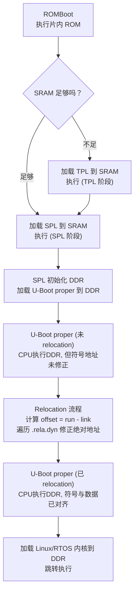

------

#### 3. Relocation 的核心流程

1. **计算运行偏移量**

   ```
   offset = runtime _start - link _start
   ```

2. **遍历 `.rela.dyn` 表**

   - 找到所有需要修正的符号引用位置。

3. **修正绝对地址**

   - 写入 `addend + offset` 到目标位置。

4. **完成 relocation**

   - 所有全局变量、函数指针、静态初始化数据都指向正确的 DDR 地址。

5. **跳转到 U-Boot main**

   - 进入命令行、外设驱动、文件系统、内核加载阶段。

------

#### 4. 核心总结

- **ROMBoot**：芯片固化，不属于 U-Boot，但永远是第一阶段。
- **TPL**：极简 DDR init，用在 SRAM 太小时。
- **SPL**：常见第一阶段，运行在 SRAM，负责 DDR 初始化并加载 U-Boot proper。
- **U-Boot proper (未 relocation)**：代码在 DDR 运行，但符号指向错误地址。
- **Relocation**：修正链接地址与运行地址的偏移，确保数据和指针一致。
- **U-Boot proper (已 relocation)**：DDR 中稳定运行，具备完整功能。
- **最终加载 OS 内核**，完成引导链路。

------

这样整理后，你能一眼看到：

- **CPU 在哪个外设执行**（ROM → SRAM → DDR）；
- **谁负责 DDR 初始化**（TPL/SPL/ROMBoot/U-Boot proper）；
- **重定位发生在哪个阶段**（U-Boot proper 在 DDR，但还没进入 main 之前）。

------

要不要我再帮你画一张 **时序图 (sequence diagram)**，从 CPU 的执行视角表现 **取指地址如何变化 (ROM → SRAM → DDR relocation → DDR main)**？这样比流程图更能突出 CPU 的执行跳转轨迹。

好 ✅，那我再补充最后一部分，用 **时序图 (sequence diagram)** 来表现：

- CPU 在整个启动链路中的执行轨迹；
- 每次 **取指地址从 ROM → SRAM → DDR relocation → DDR main** 的变化；
- 以及关键动作（DDR 初始化、Relocation 修正）。

------

### 📘 U-Boot 启动阶段详细笔记（时序图）

#### 1. CPU 执行时序图

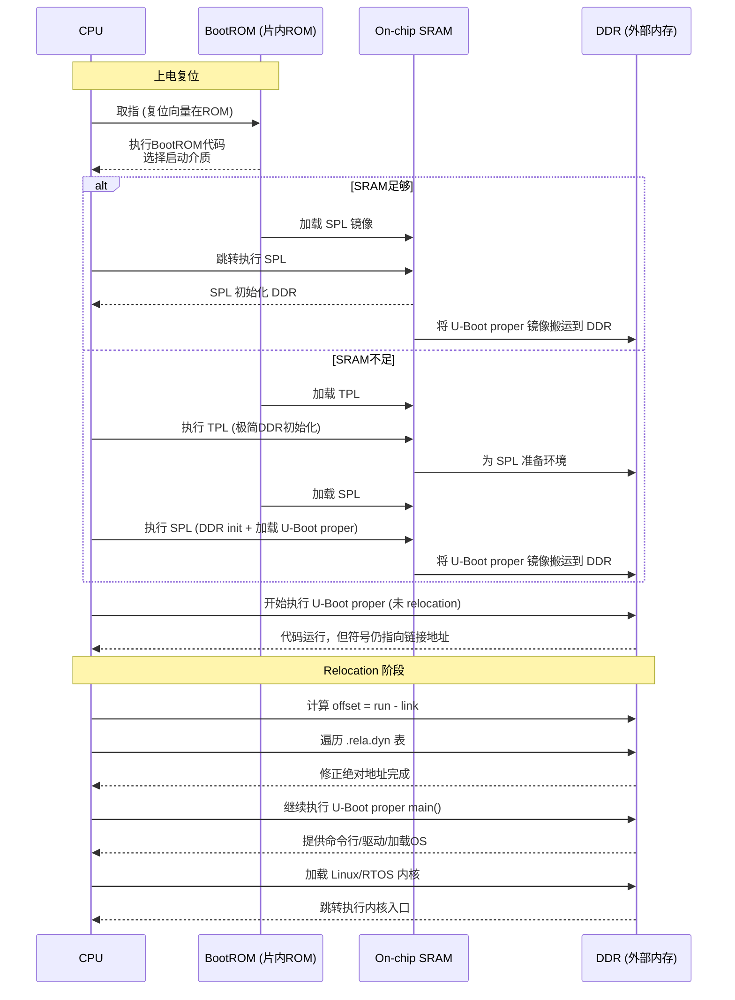

------

#### 2. 关键点标注

- **ROMBoot 阶段**：取指来自 ROM，不在 U-Boot 管辖范围内。
- **TPL/SPL 阶段**：取指来自 **SRAM**，DDR 未初始化前只能用 SRAM。
- **U-Boot proper (未 relocation)**：取指来自 DDR，但内部符号未修正。
- **Relocation 阶段**：CPU 在 DDR 内执行 relocation 逻辑，修正所有绝对地址。
- **U-Boot proper (已 relocation)**：取指来自 DDR，地址一致性恢复，进入稳定运行。
- **最终内核执行**：内核镜像在 DDR，CPU 在 DDR 中执行操作系统。

------

#### 3. 总结性视角

- **从 CPU 的角度**：始终只是在不同物理地址空间取指，没有“感知存储器种类”的概念。
- **从 SoC 的角度**：ROM → SRAM → DDR 的切换，取决于 BootROM/TPL/SPL 的加载行为。
- **Relocation 的位置**：恰好位于 **U-Boot proper 初始运行在 DDR 与进入 main 之间**，是一个过渡阶段，确保运行地址与链接地址对齐。

------

📌 这样，流程图表现了 **阶段衔接**，时序图表现了 **CPU 的执行轨迹**。

**在这里提及到了一个新的概念，32位的cpu视角的地址空间是4G大小的，它如何解决DDR是＞4G空间大小的访问控制问题？**

**GPT说：**

明白 ✅
 你是希望我单独整理一份 **关于内存管理部分的电子笔记**。那我从 **U-Boot main 阶段是否开 MMU** → **Linux 用户空间/内核空间的组织** → **LPAE 扩展** → **32 位系统下大型应用如何用超过 3 GB 内存** 这一系列的问题整理出完整的学习型笔记。

我会分批次输出，第一批先给出 **背景与 U-Boot 阶段的内存管理**。

------

### 📘 内存管理学习笔记（专注 OS 与应用阶段）

------

#### 0) 背景与疑问

在分析 U-Boot 和 Linux 的关系时，遇到几个核心疑问：

1. **U-Boot main 阶段**：是否开启 MMU？是否会做虚拟地址到物理地址的转换？
2. **进入 Linux 内核后**：如何组织用户空间与内核空间？
3. **32 位 CPU 的限制**：单进程 ≤ 4 GB VA，用户态常见 3 GB，那怎么支撑大型应用？
4. **扩展机制**：LPAE/PAE 如何让物理内存 >4 GB，而进程 VA 不变？
5. **大型应用（如游戏）**：在 32 位系统下如何利用更多内存？

------

#### 1) U-Boot main 阶段的内存管理

##### 1.1 常见情况：开 MMU，但只做 **身份映射 (VA=PA)**

- 目的：
  - 打开 **D-Cache/I-Cache**；
  - 设置 **内存属性**：
    - DDR → Normal 可缓存；
    - 外设寄存器 → Device，不可缓存；
  - 避免访问时序混乱。
- 特点：
  - **不做**进程隔离；
  - **不扩展** CPU 可见空间（ARMv7 非 LPAE = 4 GB PA 限制）。

##### 1.2 另一种情况：不开 MMU，只开 Cache

- 为了简化或调试。
- 结果：CPU 只能直寻物理地址，必须避开外设洞，依然受 4 GB 限制。

##### 1.3 结论

- **U-Boot main 不是操作系统**，不做虚拟内存管理。
- 无论开不开 MMU，可用内存窗口都 ≤ 4 GB（非 LPAE）。
- **大内存调度**完全交给 Linux 内核。

------

#### 2) Linux 内存管理：用户/内核空间分割

##### 2.1 虚拟地址空间（32 位 CPU）

- **最大 4 GB VA**。
- 常见划分：
  - **用户空间**：2 GB 或 3 GB（进程私有）。
  - **内核空间**：1 GB 或 2 GB（所有进程共享）。

##### 2.2 内核空间组织

- **低端内存 (lowmem)**：线性映射的物理 RAM，直接可见。
- **高端内存 (highmem)**：超出线性映射的物理内存，需要临时映射 (`kmap/vmap/ioremap`) 才能访问。

##### 2.3 用户空间

- 每进程独立页表。
- 相同 VA 在不同进程映射到不同物理页。
- 实现隔离通过 **ASID+TLB** 或上下文切换。

------

📌 下一批我会继续整理 **LPAE/PAE 如何扩展物理地址** + **32 位应用如何在 3 GB 限制下使用更多内存（多进程、mmap、GPU 显存、分段加载）**，并加上对照表和架构图。

要不要我在第二批里同时做一张 **Windows/Linux 32 位地址空间对比表**？这样会更直观。

好的 ✅，那我继续第二批整理，重点是：

1. **LPAE/PAE 的作用**（扩展物理地址但不扩展进程 VA）；
2. **32 位应用如何应对 3GB 限制**（多进程/分段映射/显存/系统机制）；
3. **Windows vs Linux 的 32 位地址空间划分对比表**；
4. 图示：进程 VA、物理内存、内核映射关系。

------

### 📘 内存管理学习笔记（第二批）

------

#### 3) LPAE/PAE：物理地址扩展

##### 3.1 ARM LPAE（Large Physical Address Extension）

- **架构**：ARMv7-A 扩展。
- **VA 仍是 32 bit** → 每个进程最大 4 GB。
- **PA 扩展到 40 bit** → 支持 **1 TB 物理内存**。
- **页表**：64-bit long-descriptor，三级翻译。
- **用途**：内核可管理超大物理内存，并按需映射到进程 VA 空洞。

##### 3.2 x86 PAE (Physical Address Extension)

- **VA 仍是 32 bit** → 单进程 ≤ 4 GB。
- **PA 扩展到 36 bit** → 支持 **64 GB 物理内存**。
- **页表**：三级，PTE 扩展。
- **用途**：同样是让 OS 管理更多物理内存，而不是扩大单进程空间。

👉 **关键点**：PAE/LPAE 解决的是“全机可用内存”问题，不解决“单进程同时可见内存”问题。

------

#### 4) 32 位应用如何应对 3 GB 限制

##### 4.1 多进程拆分

- 主进程只负责逻辑；
- 渲染进程、资源进程分担内存压力；
- 多进程间通过 IPC/共享内存通信。

##### 4.2 分段加载 / mmap

- 游戏/大应用资源远超 3 GB；
- 使用 **mmap** / **文件映射**，只把需要的部分映射进 VA；
- 用完的部分 **unmap**，换新的资源块。

##### 4.3 GPU 显存利用

- 纹理、网格等资源大量放在 **显存**；
- CPU 进程只需保留控制/索引数据，不用全映射到 3 GB 用户空间。

##### 4.4 系统机制

- **Windows**：
  - 默认 2G 用户 / 2G 内核。
  - 加 `/3GB` 或 **LAA (Large Address Aware)** 标志 → 用户可用 3 GB。
  - 加 PAE → 系统可用 >4 GB RAM，但单进程仍 ≤ 3 GB。
- **Linux**：
  - 常见 3G 用户 / 1G 内核。
  - 高端物理内存通过 `kmap/vmap` 临时映射。

------

#### 5) Windows vs Linux 32 位地址空间对比表

| 系统                     | 用户空间 | 内核空间             | 总虚拟空间 | 物理内存扩展方式 | 单进程上限 |
| ------------------------ | -------- | -------------------- | ---------- | ---------------- | ---------- |
| **Windows (默认)**       | 2 GB     | 2 GB                 | 4 GB       | PAE (36-bit PA)  | 2 GB       |
| **Windows (/3GB + LAA)** | 3 GB     | 1 GB                 | 4 GB       | PAE              | 3 GB       |
| **Linux (常见配置)**     | 3 GB     | 1 GB                 | 4 GB       | PAE/LPAE         | 3 GB       |
| **Linux (可调)**         | 2 GB     | 2 GB                 | 4 GB       | PAE/LPAE         | 2 GB       |
| **Linux (内核高端内存)** | 3 GB     | 1 GB + kmap 高端映射 | 4 GB       | PAE/LPAE         | 3 GB       |

------

#### 6) 图示：32 位系统内存映射关系

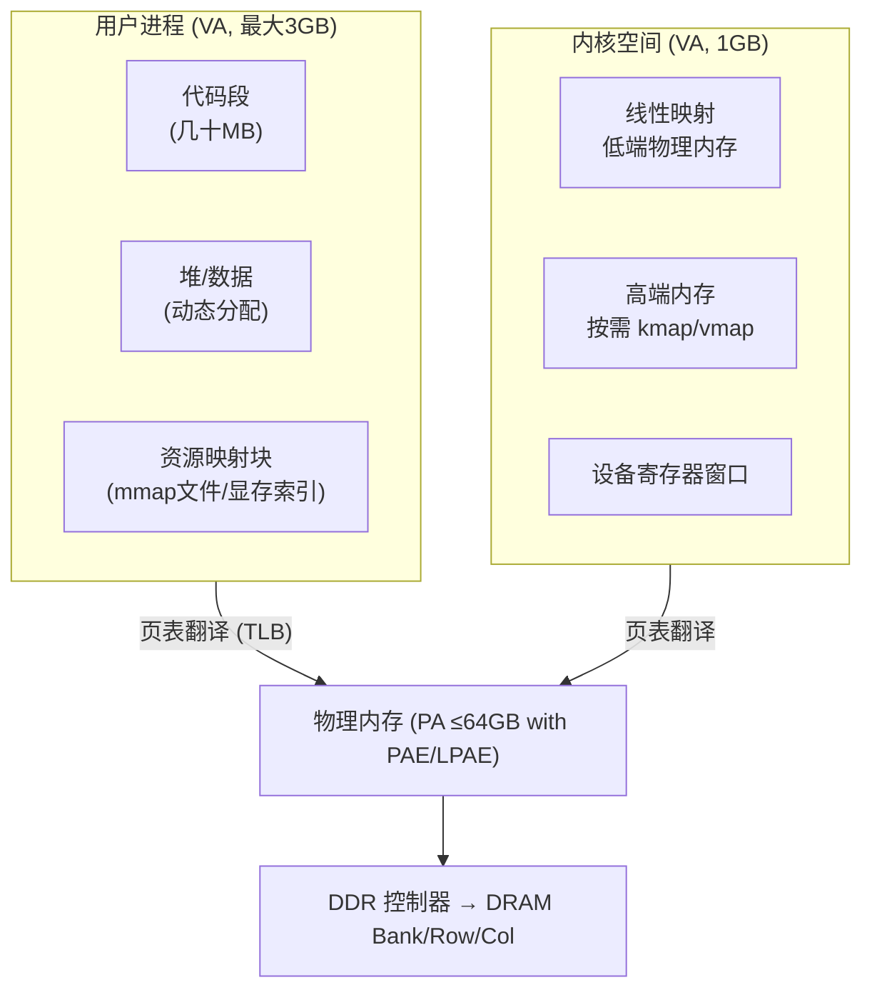

------

#### 7) 总结（内存管理篇）

1. **U-Boot main**：常开 MMU（身份映射 VA=PA），目的是 Cache 和属性，不扩展空间。
2. **Linux 内核**：
   - 为每进程建立独立 4 GB VA 空间；
   - 通常 3G 用户 / 1G 内核。
3. **LPAE/PAE**：扩展 PA 到 36~40 位，让系统能管更多物理内存，但单进程 VA 上限不变。
4. **大型应用**：
   - 多进程拆分；
   - 分段加载 (mmap)；
   - GPU 显存分担；
   - Windows/Linux 的内核参数优化 (/3GB, LAA, kmap)。
5. **结论**：在 32 位系统下，单进程始终 ≤ 3 GB；真正想要单进程 >4 GB，就必须转向 **64 位系统**。

------

要不要我在第三批里，把 **“大型游戏在 32 位系统下的内存架构图”** 单独画出来（主进程 3 GB + 渲染子进程 3 GB + mmap 分块 + GPU 显存），让场景更直观？

好，那我整理第三批笔记，专门画出 **大型游戏在 32 位系统下的内存架构**，结合我们前面总结的机制（单进程 ≤3GB、进程拆分、mmap、GPU 显存）。

------

### 📘 内存管理学习笔记（第三批：32 位大型游戏的内存架构）

------

#### 1) 背景问题

- **单进程限制**：32 位进程最多 4 GB 虚拟空间（通常 3 GB 用户可见）。
- **大型游戏需求**：几十 GB 的资源（纹理、模型、音频、脚本…）。
- **问题**：如何在 **单进程 ≤3 GB** 的限制下运行？

------

#### 2) 典型策略

1. **多进程架构**
   - 主进程：负责逻辑/网络/UI。
   - 渲染子进程：管理 GPU 命令/显存。
   - 资源子进程：加载贴图/音频，分担堆空间。
   - 进程间通过 IPC（共享内存/管道/消息队列）协作。
2. **分段加载（mmap/unmap）**
   - 把超大资源文件分块映射到 3 GB 窗口中；
   - 旧资源释放（unmap），新资源覆盖进来。
   - VA 窗口有限，但能“滚动使用”。
3. **GPU 显存分担**
   - 大量纹理/模型存入显存，**不占用进程 3 GB 空间**；
   - CPU 进程只维护资源索引/控制句柄。
4. **系统支持**
   - **Windows**：/3GB 开关 + LAA 标志，让用户进程拿到 3 GB 而不是 2 GB。
   - **Linux**：3G/1G 配置，高端内存通过 kmap 动态访问。

------

#### 3) 内存架构图

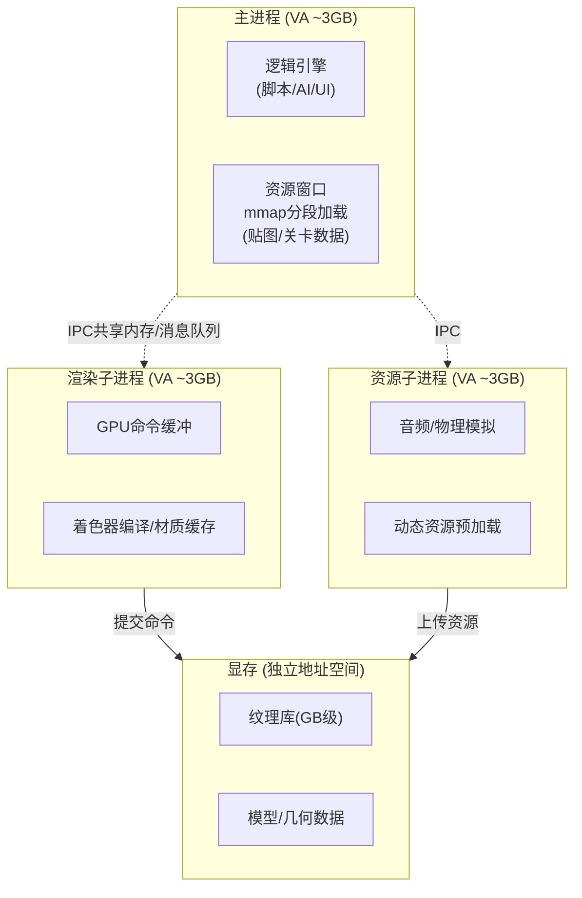

------

#### 4) 核心思路总结

- **单进程限制 = 3 GB** → 解决办法是“分散与分段”。
- **分散**：多进程并行，每个进程都能独立拥有 3 GB 空间。
- **分段**：用 mmap 分块装载，只在 3 GB 窗口中放当前用到的资源。
- **显存外包**：庞大图形资源交给 GPU，CPU 进程只持有句柄/索引。
- **系统配合**：LAA/3G 分割、高端内存映射，尽可能把进程 VA 用满。

------

#### 5) 最终结论

在 32 位系统下，大型游戏无法让“单进程”直接吃下 >3 GB 内存。它们的做法是：

1. **多进程分担内存压力**；
2. **mmap/unmap 滚动利用虚拟空间**；
3. **GPU 显存承担大部分纹理/模型存储**；
4. **利用系统提供的参数/机制**最大化单进程可用空间。

👉 真正的彻底解决还是 **转向 64 位平台**：每进程 VA 直接 ≥ 256TB（ARMv8/AMD64 下），大型游戏就能一次性映射整个资源库。

------

要不要我在第四批里，帮你做一张 **“32 位 vs 64 位内存管理对比大表”**，把 **进程 VA、物理 PA、可管理物理内存、单进程上限**一眼对比出来？

好 ✅，那我继续第四批笔记，整理成一张 **“32 位 vs 64 位 内存管理对比大表”**，再配一张示意图，让你直观看到差别。

------

### 📘 内存管理学习笔记（第四批：32 位 vs 64 位对比）

------

#### 1) 总览大表

| 架构                                          | 进程虚拟地址空间 (VA) | 内核/用户典型划分       | 最大可寻址物理内存 (PA) | 页表格式                               | 单进程可见内存上限                    | 应用场景                        |
| --------------------------------------------- | --------------------- | ----------------------- | ----------------------- | -------------------------------------- | ------------------------------------- | ------------------------------- |
| **32-bit ARMv7 / x86-32 (无 LPAE/PAE)**       | 4 GB                  | 3G/1G 或 2G/2G          | 4 GB                    | 二级页表 (short descriptor / 传统二级) | ~3 GB (用户)                          | 轻量应用，嵌入式                |
| **32-bit ARMv7 + LPAE / x86-32 + PAE**        | 4 GB                  | 3G/1G 或 2G/2G          | ARM: 1 TB / x86: 64 GB  | 三级页表 (long descriptor/PAE PTE)     | ~3 GB (用户)                          | 大物理内存服务器，32 位应用兼容 |
| **64-bit ARMv8 (AArch64, 48-bit VA/PA 常见)** | 256 TB (48-bit)       | 用户/内核动态划分       | 256 TB (48-bit PA 常见) | 四级页表                               | 单进程 ≥ 128 TB (常配 128TB 用户空间) | 移动 SoC / 大型应用             |
| **64-bit x86-64 (48-bit VA/PA 常见)**         | 256 TB (48-bit)       | 用户 128TB / 内核 128TB | 256 TB                  | 四/五级页表 (取决于实现)               | 单进程 ≥ 128 TB                       | 桌面 / 游戏 / 服务器            |

------

#### 2) 图示：32 位 vs 64 位地址空间

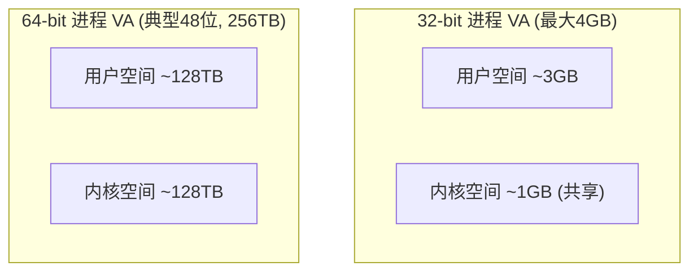

------

#### 3) 对比要点总结

1. **32-bit 无 PAE/LPAE**
   - 进程 VA = 4 GB。
   - 物理内存最大 4 GB。
   - 单进程用户可见 ≤3 GB。
2. **32-bit + PAE/LPAE**
   - 进程 VA 仍 4 GB（用户 ≤3 GB）。
   - 物理内存可扩展（x86: 64 GB，ARM: 1 TB）。
   - 内核能利用更多物理内存，但单进程不变。
3. **64-bit 平台**
   - 进程 VA ≥ 48 bit，常见 256 TB。
   - 物理内存扩展到 44~52 bit（具体看 SoC/CPU）。
   - 单进程轻松使用 >4 GB 内存。
4. **结论**
   - **32 位系统**：瓶颈是“单进程 ≤3 GB”；只能靠多进程拆分/资源分段。
   - **64 位系统**：瓶颈大幅解除，单进程能直接用几十 TB 地址空间。
   - 大型游戏、数据库等重量级应用，最终都迁移到 **64 位**是必然。

------

📌 现在我们已经有：

- 第 1 批：U-Boot main 与 MMU 状态；
- 第 2 批：LPAE/PAE 与 32 位应用的内存策略；
- 第 3 批：32 位大型游戏内存架构图；
- 第 4 批：32 位 vs 64 位总览对比表。

### 函数 \_main

函数 \_main的代码如下：

```assembly
# /arch/arm/lib/crt0_64.S

#include <config.h>
#include <asm-offsets.h>
#include <asm/macro.h>
#include <linux/linkage.h>

/*
 * 本文件处理 U-Boot 启动过程中与目标平台无关的阶段，
 * 在这些阶段中需要建立 C 运行时环境。
 * 入口函数为 _main，由目标平台的 start.S 跳转进入。
 *
 * _main 的执行流程如下：
 *
 * 1. 建立调用 board_init_f() 所需的初始环境。
 *    此环境仅提供栈和 GD（全局数据结构）存放区，
 *    二者位于片上 SRAM 或可用的锁定缓存。
 *    在此阶段，变量全局数据（含 BSS）不可用；
 *    只有常量的已初始化数据可用。
 *    在调用 board_init_f() 前，应将 GD 清零。
 *
 * 2. 调用 board_init_f()。
 *    该函数为系统内存（DRAM/DDR）执行做硬件准备。
 *    因为 DRAM 可能尚未可用，board_init_f() 必须使用当前 GD
 *    存储后续阶段需要的数据（重定位目标、未来栈、新 gd 地址）。
 *
 * 3. 建立中间环境：此时使用的是 DRAM 中的栈和 gd，
 *    但 BSS 和已初始化的可写数据段仍不可用。
 *
 * 4a. 对于 U-Boot proper（非 SPL），调用 relocate_code()，
 *     将 U-Boot 搬运到 board_init_f() 计算的重定位目标地址。
 *
 * 4b. 对于 SPL，board_init_f() 调用完毕直接返回 crt0，
 *     不执行代码重定位。
 *
 * 5. 建立最终环境以调用 board_init_r()：
 *    此时 BSS 已清零，已初始化的非 const 数据已就位，
 *    栈位于 DRAM（SPL 场景下搬栈是可选的）。
 *    GD 保持了 board_init_f() 的设定。
 *
 * TODO: AArch64 下的 SPL 栈搬迁尚未实现。
 *
 * 6. 对于 U-Boot proper，某些 CPU 在内存方面还需额外设置，
 *    因此调用 c_runtime_cpu_setup。
 *
 * 7. 跳转执行 board_init_r()。
 */

ENTRY(_main)

/*
 * 设置初始 C 运行环境并调用 board_init_f(0)
 */
#if defined(CONFIG_TPL_BUILD) && defined(CONFIG_TPL_NEEDS_SEPARATE_STACK)
	ldr	x0, =(CONFIG_TPL_STACK)        /* 若是 TPL，加载 TPL 栈地址 */
#elif defined(CONFIG_SPL_BUILD) && defined(CONFIG_SPL_STACK)
	ldr	x0, =(CONFIG_SPL_STACK)        /* 若是 SPL，加载 SPL 栈地址 */
#elif defined(CONFIG_SYS_INIT_SP_BSS_OFFSET)
	adr	x0, __bss_start                /* 否则用 __bss_start + 偏移作为栈 */
	add	x0, x0, #CONFIG_SYS_INIT_SP_BSS_OFFSET
#else
	ldr	x0, =(CONFIG_SYS_INIT_SP_ADDR) /* 默认用配置的 SYS_INIT_SP_ADDR */
#endif
	bic	sp, x0, #0xf	/* 栈指针按 16 字节对齐（ABI 要求） */
	mov	x0, sp
	bl	board_init_f_alloc_reserve     /* 预留 gd、malloc 区等 */
	mov	sp, x0
	/* 在进入 C 代码前设置 gd 指针 (x18 保存 gd) */
	mov	x18, x0
	bl	board_init_f_init_reserve      /* 初始化 gd 预留区 */

	mov	x0, #0
	bl	board_init_f                   /* 调用 board_init_f(0) 完成 DRAM 初始化及地址规划 */

#if !defined(CONFIG_SPL_BUILD)
/*
 * U-Boot proper 情况：建立中间环境并调用 relocate_code()
 * Trick：返回时仍在这里，但已是重定位后的地址
 */
	ldr	x0, [x18, #GD_START_ADDR_SP]	/* x0 = gd->start_addr_sp (新栈地址) */
	bic	sp, x0, #0xf	                /* 栈对齐 */
	ldr	x18, [x18, #GD_NEW_GD]	        /* x18 = gd->new_gd (新 gd 地址) */

	adr	lr, relocation_return           /* 取 relocation_return 的运行时地址放入 lr */
#if CONFIG_POSITION_INDEPENDENT
	/* PIE 情况下：加入运行时与链接时的偏移修正 */
	adr	x0, _start		/* x0 = 运行时 _start */
	ldr	x9, _TEXT_BASE	/* x9 = 链接时 _start */
	sub	x9, x9, x0		/* x9 = (link - run) 偏移 */
	add	lr, lr, x9      /* lr += 偏移，换算到“链接视角” */
#endif
	/* 再加上重定位偏移，得到最终的新返回地址 */
	ldr	x9, [x18, #GD_RELOC_OFF]	/* x9 = gd->reloc_off = (new_run - link) */
	add	lr, lr, x9					/* lr = relocation_return 在新地址空间的地址 */
	ldr	x0, [x18, #GD_RELOCADDR]	/* x0 = gd->relocaddr (重定位目标) */
	b	relocate_code               /* 跳转执行重定位 */

relocation_return:

/*
 * 设置最终（完整）环境
 */
	bl	c_runtime_cpu_setup		/* 调用 CPU 运行时设置函数（旧 routine，保持兼容） */
#endif /* !CONFIG_SPL_BUILD */

#if defined(CONFIG_SPL_BUILD)
	bl	spl_relocate_stack_gd           /* SPL 场景：可选迁移栈/gd 至 DRAM，可能返回 NULL */
	/* 如果返回新栈，则在此更新 gd 和 sp */
	cmp	x0, #0
	csel	x18, x0, x18, ne               /* 若 x0 != 0，则更新 x18 = 新 gd */
	/*
	 * 实现：sp = (x0 != NULL) ? x0 : sp
	 * 因为条件移动指令不能直接操作 sp，因此借助 x1
	 */
	mov	x1, sp
	cmp	x0, #0
	csel	x0, x0, x1, ne
	mov	sp, x0
#endif

/*
 * 清零 BSS 段
 */
	ldr	x0, =__bss_start		/* BSS 起始地址（已自动重定位） */
	ldr	x1, =__bss_end			/* BSS 结束地址（已自动重定位） */
clear_loop:
	str	xzr, [x0], #8           /* 循环清零，每次写 8 字节 */
	cmp	x0, x1
	b.lo	clear_loop

	/* 调用 board_init_r(gd_t *gd, ulong dest_addr) */
	mov	x0, x18				/* x0 = gd 指针 */
	ldr	x1, [x18, #GD_RELOCADDR]	/* x1 = gd->relocaddr，传递重定位目标地址 */
	b	board_init_r			/* 跳转执行 board_init_r (不会返回) */

	/* 不会到达此处 - board_init_r() 不返回 */

ENDPROC(_main)
```

太好了—我按“**多视角 + 时间轴 + 归属（通用/架构/厂商）+ 数据关系**”把 `arch/arm/lib/crt0_64.S`（U-Boot 2018.03, AArch64）这段启动入口 `_main` 整理成一份深入版电子笔记。包含丰富的对照表与 **Mermaid 图**（流程/时序/关系），方便你后续复用。

------

### 📘 U-Boot 2018.03 `crt0_64.S`（arm64）启动入口 `_main` 全面笔记

#### 0) 阅读目标与视角

- **时间轴视角**：从进入 `_main` → 早期 C 运行时 → `board_init_f()` → 中间环境/重定位 → 清 BSS → `board_init_r()`。
- **归属视角**：每一步是谁实现（**通用 COMMON** / **架构 ARCH** / **板级 BOARD(厂商自定义)**）。
- **数据关系**：`gd`（global data）关键字段如何在阶段间传递、栈/镜像/地址的迁移与计算（`relocaddr`/`reloc_off`/LR 修补）。
- **配置入口**：相关 `CONFIG_*` 宏由谁定义、通常在哪出现。

------

#### 1) 总体流程（入口 `_main`）

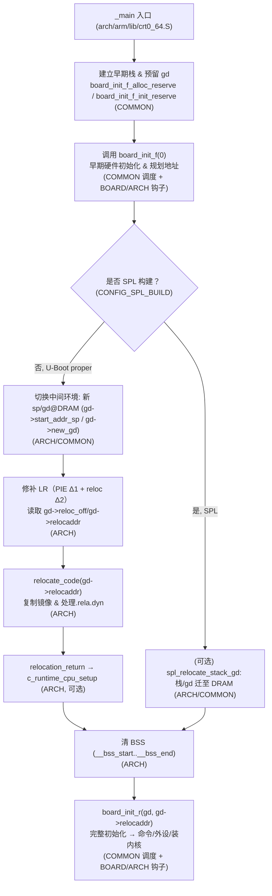

------

#### 2) 关键数据对象与字段（`gd` & 符号）

| 名称 / 宏                                | 含义                                           | 谁写入/读出                                                 | 何时可用              |
| ---------------------------------------- | ---------------------------------------------- | ----------------------------------------------------------- | --------------------- |
| `x18`                                    | AArch64 上约定保存 **`gd` 指针**               | ARCH：汇编/宏约定                                           | `_main` 起始即有效    |
| `gd->start_addr_sp` (`GD_START_ADDR_SP`) | 中间环境新栈顶（DRAM）                         | **BOARD/ARCH** 在 `board_init_f()` 中写入，`crt0_64.S` 读取 | `board_init_f()` 之后 |
| `gd->new_gd` (`GD_NEW_GD`)               | DRAM 中的新 `gd` 存放区                        | **BOARD/ARCH** 写，`crt0_64.S` 换 `x18`                     | `board_init_f()` 之后 |
| `gd->relocaddr` (`GD_RELOCADDR`)         | **重定位目标**（新 `_start`）                  | **BOARD/ARCH** 写，`relocate_code()` 与 `board_init_r()` 读 | `board_init_f()` 之后 |
| `gd->reloc_off` (`GD_RELOC_OFF`)         | **重定位偏移** = `new_run - link`              | **ARCH** 计算/存，`crt0_64.S` 用于修补 LR                   | 重定位前              |
| `__bss_start` / `__bss_end`              | BSS 边界（链接符号，PC-relative 可自动重定位） | ARCH 清零                                                   | 重定位后清零          |
| `_TEXT_BASE`                             | 链接时 `_start`（**link 基址**）               | ARCH（常量池取）                                            | LR 修补（PIE）时      |
| `_start`                                 | 运行时 `_start`（`adr` 获取）                  | ARCH                                                        | LR 修补（PIE）时      |

> 这些字段的偏移量宏（`GD_*`）来自 `include/asm-generic/global_data.h` 与 `arch/.../include/asm/asm-offsets.h` 生成。
>  `gd` 的内容跨阶段“传话”，`board_init_f()` 决定 **中间环境**与**重定位参数**，供 `_main` 后续步骤消费。

------

#### 3) 配置宏与归属（谁定义？在哪配？）

| 宏                                      | 作用                               | 一般定义/来源                                                |
| --------------------------------------- | ---------------------------------- | ------------------------------------------------------------ |
| `CONFIG_SPL_BUILD` / `CONFIG_TPL_BUILD` | 是否构建 SPL/TPL                   | Kconfig：`configs/<board>_defconfig` & `Kconfig` 体系        |
| `CONFIG_TPL_STACK` / `CONFIG_SPL_STACK` | 早期栈固定地址（TPL/SPL）          | **板级/厂商** 在 `include/configs/<board>.h` 或 Kconfig 片段 |
| `CONFIG_SYS_INIT_SP_ADDR`               | U-Boot proper 的早期栈地址         | 同上                                                         |
| `CONFIG_SYS_INIT_SP_BSS_OFFSET`         | 以 `__bss_start + offset` 取早期栈 | 同上                                                         |
| `CONFIG_POSITION_INDEPENDENT`           | 位置无关（PIE）                    | 通常在 **架构/板级 Kconfig** 打开                            |
| 其他板钩子                              | 如 DRAM 参数、早期外设基址         | **板级/厂商** 源码与头文件                                   |

------

#### 4) 时间轴 × 资源可用性 × 调用归属（细粒度对照）

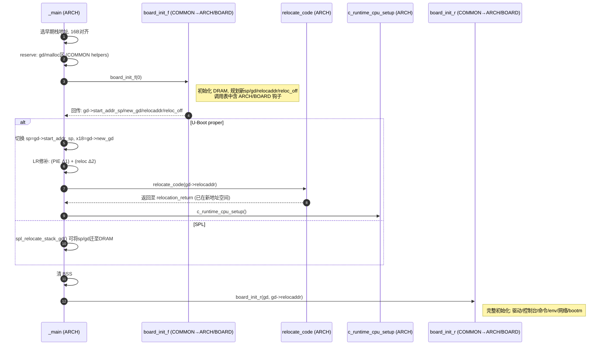

**各阶段可用性/限制：**

| 阶段                      | 取指位置                            | 栈位置                      | gd 位置              | .data/.bss                              | 谁能被安全调用                    | 备注                                    |
| ------------------------- | ----------------------------------- | --------------------------- | -------------------- | --------------------------------------- | --------------------------------- | --------------------------------------- |
| 早期（进入 `_main`）      | 就近可执行RAM（SRAM/锁缓存/加载处） | 选取的早期栈                | 早期 reserve 区      | `BSS/.data` **不可用**（仅常量/寄存器） | ARCH/COMMON 小型 helper           | 只可读常量；严禁依赖已清/已初值的可写段 |
| `board_init_f()`          | 同上                                | 同上                        | 同上                 | 同上                                    | **COMMON 调度** + BOARD/ARCH 钩子 | 计算并写入 `gd->*` 关键地址             |
| 中间环境（U-Boot proper） | 仍旧地（尚未搬家）                  | **DRAM：gd->start_addr_sp** | **DRAM：gd->new_gd** | 仍未保证                                | ARCH                              | 修补 LR, 调 `relocate_code`             |
| 重定位后                  | **DRAM：gd->relocaddr**             | DRAM                        | DRAM                 | 可“自动重定位”访问符号地址              | ARCH                              | 进入 `relocation_return`                |
| 清 BSS → `board_init_r()` | DRAM                                | DRAM                        | DRAM                 | **BSS=0**, `.data` 初值就位             | **COMMON 调度** + BOARD/ARCH 钩子 | 完整 C 运行时                           |

------

明白 ✅，既然这是要替换你笔记里原来的 **“5) board_init_f() / board_init_r()：谁实现？在哪里？”** 部分，我就按照 **序号 5 开头**重新整理一份，完整内容如下：

------

#### 5) `board_init_f()` / `board_init_r()`：谁实现？在哪里？

> 这部分是我额外补充的，以SPL和u-boot proper（u-boot main）两个阶段作为分析对照。

##### 5.1 总观：两阶段模型与归属

- **两阶段目的**
  - **`board_init_f`（f 阶段）**：在“早期、受限环境”（仅有临时栈 + `gd`，`.bss/.data` 不可靠）里完成**最小硬件就绪 & 地址规划**（DRAM 容量、未来栈/新 `gd`、重定位目的地等）。
  - **`board_init_r`（r 阶段）**：在“完整 C 运行时”（已重定位、BSS 清零、`.data` 就位、malloc 可用）里完成**驱动/设备模型/环境/网络/USB/命令行/自动引导**。
- **核心实现位置（归属）**
  - **COMMON（公共骨架）**：
    - `board_init_f()` 调度表在 `common/board_f.c`（`init_sequence_f[]`）。
    - `board_init_r()` 调度表在 `common/board_r.c`（`init_sequence_r[]`）。
  - **ARCH（架构相关）**：AArch64 的入口、cache、异常处理、重定位等在 `arch/arm/lib/crt0_64.S`、`arch/arm/lib/relocate_64.S`、`arch/arm/cpu/armv8/*`。
  - **BOARD（板级/厂商定制）**：与具体硬件强相关的内容（**DRAM 初始化**、pinmux/时钟/电源）在 `board/<vendor>/<board>/*`，配置在 `include/configs/<board>.h`、`configs/<board>_defconfig`、板级 `Kconfig`。
- **重要澄清**
  - **SPL 镜像**：不会进入 `common/board_r.c`，而是使用 **`common/spl/spl.c` 里的 board_init_r()`**（极简，引导下一阶段）。
  - **U-Boot proper 镜像**：才会完整执行 `board_init_f()` → relocate → `board_init_r()`。

------

##### 5.2 `board_init_f()`：谁来干、在哪儿、会调什么

- **骨架/调度**：`common/board_f.c` 的 `init_sequence_f[]`，顺序调用一系列步骤。
- **常见步骤**
  - `board_early_init_f()`（BOARD）：pinmux/时钟/串口
  - `arch_cpu_init()` / `timer_init()`（ARCH）
  - `serial_init()` / `console_init_f()`（COMMON/DRIVERS）
  - `dram_init()`（BOARD）：探测 DDR → `gd->ram_size`
  - **地址规划**（ARCH/BOARD）：写 `gd->start_addr_sp`、`gd->new_gd`、`gd->relocaddr`、`gd->reloc_off`
  - `board_init()`（BOARD）
  - `env_init()`（COMMON）
- **SPL 与 Proper 差异**
  - **SPL**：只保留“能把 DDR 拉起来、能加载下一阶段”的最小子集（很多表项被 `#ifdef CONFIG_SPL_BUILD` 裁掉）。
  - **Proper**：完整执行，用 `gd` 记录重定位和新环境信息。

------

##### 5.3 `board_init_r()`：谁来干、在哪儿、会调什么

- **SPL 的 `board_init_r()`**
  - 实现在 **`common/spl/spl.c`**。
  - 流程：
    - `spl_init()`、`preloader_console_init()`
    - `spl_board_init()`（__weak，可板级覆盖）
    - 选择启动介质 → `spl_load_image_*()`
    - 跳到下一阶段：U-Boot proper 或内核
  - **目的**：极简加载器，不做驱动框架。
- **Proper 的 `board_init_r()`**
  - 实现在 **`common/board_r.c`**（`init_sequence_r[]` 调度）。
  - 常见步骤：
    - `c_runtime_cpu_setup()`（ARCH）
    - `initr_malloc()`（COMMON）：初始化 heap → `gd->malloc_base/limit`
    - `initr_dm()`（COMMON）：设备模型，解析 FDT
    - 存储初始化（MMC/NAND/SPI/NOR）
    - `stdio_init()` / `console_init_r()`
    - 网络/USB 初始化
    - 环境变量加载
    - `board_late_init()`（BOARD）
    - `main_loop()`（命令行 / 自动引导）

------

##### 5.4 SPL 与 Proper 调用链对照

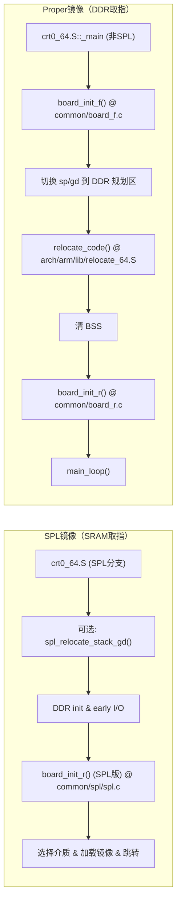

------

##### 5.5 `gd` 字段写入与使用

| 字段                    | 谁写                               | 谁用                  | 阶段       |
| ----------------------- | ---------------------------------- | --------------------- | ---------- |
| `gd->ram_size`          | `dram_init()`（BOARD，f 阶段）     | proper r 阶段内存策略 | f          |
| `gd->start_addr_sp`     | f 阶段（ARCH/BOARD）               | `_main` 切换 sp       | f→中间环境 |
| `gd->new_gd`            | f 阶段（ARCH/BOARD）               | `_main` 切换 gd       | f→中间环境 |
| `gd->relocaddr`         | f 阶段（ARCH/BOARD）               | `relocate_code()`     | f→relocate |
| `gd->reloc_off`         | f 阶段（ARCH/BOARD）               | relocate 符号修正     | f→relocate |
| `gd->malloc_base/limit` | `initr_malloc()`（COMMON，r 阶段） | 驱动/命令             | r          |

------

##### 5.6 SPL 与 Proper 的 `board_init_f` / `board_init_r` 对比速查表

| 项目                    | SPL (`CONFIG_SPL_BUILD`)                                     | U-Boot proper (main)                                         |
| ----------------------- | ------------------------------------------------------------ | ------------------------------------------------------------ |
| **运行位置**            | SRAM（PC 在片上 SRAM 取指）可选迁移栈/gd 到 DDR              | DDR（PC 在 DDR 取指），先在 DDR 低端临时地址，后重定位到 DDR 高端 |
| **`board_init_f` 有无** | 有，但极简/裁剪：只做 DDR init、基本外设，体积极小；常在 `arch/arm/lib/crt0_64.S` + 板级 `spl.c`/`dram*.c` 中 | 完整执行：调度表在 `common/board_f.c` (`init_sequence_f[]`)，写入 `gd->relocaddr`、`gd->reloc_off`、`gd->new_gd`、`gd->start_addr_sp` 等 |
| **`board_init_r` 有无** | 有，定义在 **`common/spl/spl.c`**；职责是**加载下一阶段镜像并跳转**（U-Boot proper 或 kernel）；常调用 `spl_board_init()`、`spl_load_image_*()`、`jump_to_image_*()` | 有，定义在 **`common/board_r.c`** (`init_sequence_r[]`)；职责是**完整运行时初始化**：malloc、设备模型、驱动、环境变量、命令行、自动引导 |
| **代码重定位**          | 不做 relocate，SPL 本身一直跑在 SRAM                         | 调用 `relocate_code()` 把自身搬到 DDR 高端 `_TEXT_BASE`，修正 `.rela.dyn`，更新 `gd` |
| **gd 的使用**           | 可选 `spl_relocate_stack_gd()` 把 `sp`/`gd` 搬到 DDR，保存最小信息 | f 阶段写入 `gd->relocaddr`、`reloc_off`、`ram_size` 等；r 阶段补充 malloc 区、board info 等 |
| **最终目标**            | 把 **U-Boot proper**（或 kernel）加载到 DDR 并跳转，SPL 自身使命结束 | 为 kernel 提供稳定运行环境：DDR 高端留 U-Boot，自身驱动/命令齐备，低端加载 kernel/FDT/initrd |

------

这样一张对照表，能快速看出：

- **SPL 的 f/r** → “精简：只为加载下一阶段服务”；
- **Proper 的 f/r** → “完整：负责自举到完整运行时环境”。

------

##### 5.7 SPL 与 Proper 的 `board_init_f` / `board_init_r` 调用链对比图

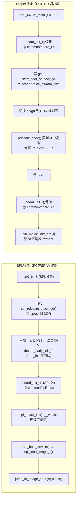

------

**图解要点**

- **SPL 分支**（左侧）：
  - `board_init_f`：没有公共调度表，逻辑分散在 `crt0_64.S` + 板级 `spl.c`；只干最小 DDR init 和外设上电。
  - `board_init_r`：来自 `common/spl/spl.c`，其唯一目标就是加载下一阶段。
- **Proper 分支**（右侧）：
  - `board_init_f`：完整调度表在 `common/board_f.c`，写满 `gd` 的关键字段。
  - `board_init_r`：完整调度表在 `common/board_r.c`，构建完整运行环境。

------

#### 5.8 小结：从 SPL 过渡到 U-Boot proper（main）的执行链

**核心结论**：

- **SPL 的 `board_init_r`（在 `common/spl/spl.c`）负责“承上启下”**：在片上 SRAM 执行、完成 DDR 可用性与最小外设准备、**选择并加载下一阶段镜像**（通常是 U-Boot proper），最后**跳转**到下一阶段入口。
- **U-Boot proper 的 `_main` 接棒后**，按“`board_init_f` → `relocate_code` → 清 BSS → `board_init_r`”的完整模型进入**最终 C 运行时**，并承担驱动/命令/引导 OS 的全部职责。

**连贯过渡（事件序列）**

1. **SPL 初始化**（PC 在 SRAM 取指）
      早期 C 环境 →（可选）`spl_relocate_stack_gd()` 将 **sp/gd** 迁到 DDR（仅数据迁移，代码仍在 SRAM）
2. **DDR 初始化**（板/架构钩子）
      确保后续镜像可装入 DDR 并运行
3. **SPL 的 `board_init_r` 运行**（`common/spl/spl.c`）
      `spl_init()` → `spl_board_init()`（可板级覆盖）→ `spl_boot_device()` 选介质 → `spl_load_image_*()` 读取 **U-Boot proper** 到 **DDR（临时可执行地址）**
4. **SPL 跳转**
      `jump_to_image_noargs()`（或直接 Linux：`jump_to_image_linux()`），**PC 改为从 DDR 取指**，进入 **U-Boot proper 的 `_start/_main`**
5. **U-Boot proper 接棒**（PC 在 DDR 取指）
      `board_init_f()`（`common/board_f.c`）写入 `gd->start_addr_sp/new_gd/relocaddr/reloc_off/ram_size` → 切换到中间环境（新 sp/gd） → `relocate_code()` **搬到 DDR 高端**并修正 `.rela.dyn`/LR → 清 BSS → `board_init_r()`（`common/board_r.c`）进入完整运行时（malloc/DM/驱动/命令/自动引导）

**一图看清“承上启下”**（SPL 的 `board_init_r` → proper 的 `_main`）：

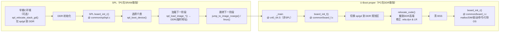

**检查点（你在代码里应能看到的落点）**

- **SPL**：`common/spl/spl.c: board_init_r()` 调 `spl_load_image_*()` 与 `jump_to_image_*()`。
- **Proper**：`arch/arm/lib/crt0_64.S::_main` 调 `board_init_f()` → `relocate_code()` → `board_init_r()`；调度表分别在 `common/board_f.c` 与 `common/board_r.c`。

> 记忆法：**“SPL 的 r = Relay（接力棒）**，把执行权“交接”给 U-Boot proper；**proper 的 r = Runtime（完整运行时）**，将系统拉到可引导 OS 的状态。

------

#### 6) 重定位与返回地址（LR）修补：两段平移（Δ1, Δ2）

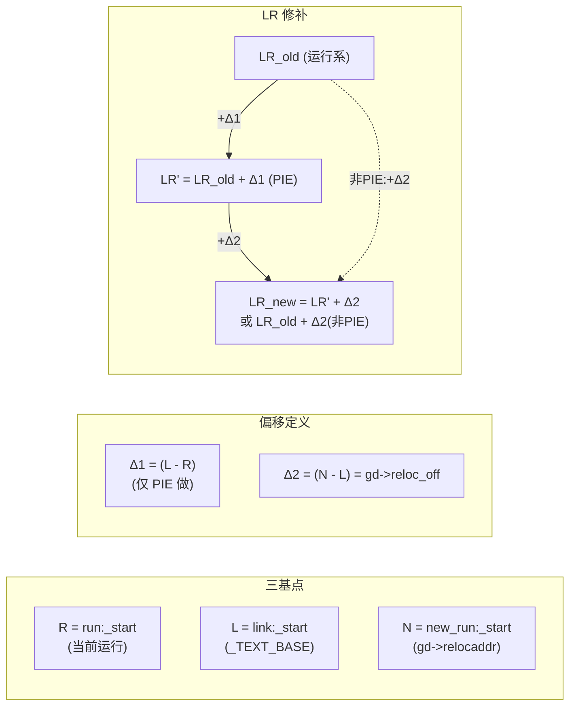

- **PIE 开启**：`LR_new = LR_old + (L - R) + (N - L)`
- **PIE 关闭**：`LR_new = LR_old + (N - L)`
- 目的：保证 `relocate_code()` 返回时，`PC` 落到 **新地址空间**中的 `relocation_return` 继续执行。

------

#### 7) `relocate_code()` 做了什么？（ARCH 层）

- 源码：`arch/arm/lib/relocate_64.S`（arm64），职责通常包括：
  1. **拷贝**：把 text/data 段从当前运行地址复制到 `gd->relocaddr`；
  2. **修正重定位**：遍历 **`.rela.dyn`**，对 `R_AARCH64_RELATIVE` 等类型执行 `*(dest) = addend + reloc_off`；
  3. **修正 GOT/符号**：确保 PC-relative 之外的绝对引用被更新；
  4. 返回到 **“已修补的 LR_new”**，进入新地址空间继续跑。

------

#### 8) 早期栈与 BSS 的注意事项（数据关系）

- **早期阶段**（`_main` 进入到 `board_init_f()` 返回前）：
  - 只能用 **常量/寄存器** 与显式保留区（`gd`、早期 malloc 区）；
  - `.bss` 未清、`.data` 未就位 → **不可**使用依赖零初值或已初始化值的全局/静态变量；
  - 所有“阶段内要跨越带过去的信息”（比如 **新栈**、**新 gd**、**重定位参数**），必须写进 **`gd`** 由后续阶段读取。
- **重定位后**：
  - **符号取址**（如 `ldr x0, =__bss_start`）为 **PC-relative**，已“自动重定位”，可直接用于清 BSS；
  - `.data` 内容也落在新地址并加载了初值；
  - 这时才是完整 C 运行时（可自由用全局/静态变量）。

------

#### 9) 阶段/函数归属与常见落点（查表指南）

| 模块/函数                                                  | 归属            | 典型路径/备注                                                |
| ---------------------------------------------------------- | --------------- | ------------------------------------------------------------ |
| `_main` / 早期框架                                         | **ARCH**        | `arch/arm/lib/crt0_64.S`                                     |
| `board_init_f_alloc_reserve` / `board_init_f_init_reserve` | **COMMON**      | `common/init/board_init.c`                                   |
| `board_init_f`                                             | **COMMON 调度** | `common/board_f.c`：`init_sequence_f[]`；调用若干 **ARCH/BOARD** 钩子（如 `dram_init`） |
| `relocate_code`                                            | **ARCH**        | `arch/arm/lib/relocate_64.S`：复制镜像 + 处理 `.rela.dyn`    |
| `c_runtime_cpu_setup`                                      | **ARCH**        | `arch/arm/cpu/armv8/*`：重定位后 CPU 运行时细节              |
| `spl_relocate_stack_gd`                                    | **ARCH/COMMON** | `arch/arm/lib/` 或 `common/spl/`（不同版本/平台略有差异）    |
| `board_init_r`                                             | **COMMON 调度** | `common/board_r.c`：`init_sequence_r[]`；控制台/驱动/env/网络/命令/bootm |
| 板级钩子（如 `dram_init`、`board_early_init_f` 等）        | **BOARD**       | `board/<vendor>/<board>/*`；头文件 `include/configs/<board>.h`；Kconfig 片段 |

> 注：不同 SoC/版本可能有细节差异，但**层次结构与归属基本稳定**：**COMMON 管流程**、**ARCH 管 CPU/重定位**、**BOARD 管具体硬件**。

------

#### 10) 早期地址/栈/gd 迁移的“状态对照表”

| 阶段                      | 代码执行地                    | 栈 (sp)                 | gd (x18)         | 关键动作                                                     | 允许/禁止                      |
| ------------------------- | ----------------------------- | ----------------------- | ---------------- | ------------------------------------------------------------ | ------------------------------ |
| 进入 `_main`              | 就近可运行存储（SRAM/加载处） | 早期固定/估算地址       | 早期保留区顶部   | 预留 gd/early malloc；初始化 gd                              | **禁** `.bss`/`.data` 可写使用 |
| `board_init_f()`          | 同上                          | 同上                    | 同上             | 初始化 DRAM；写 `gd->start_addr_sp/new_gd/relocaddr/reloc_off` | 同上                           |
| 中间环境（U-Boot proper） | 尚未搬家                      | **DRAM: start_addr_sp** | **DRAM: new_gd** | LR 修补；调用 `relocate_code`                                | `.bss`/`.data` 仍不可靠        |
| 重定位后                  | **DRAM: relocaddr**           | DRAM                    | DRAM             | 回到 `relocation_return`                                     | **可**用 `.bss`/`.data` 符号   |
| BSS 清零                  | DRAM                          | DRAM                    | DRAM             | 清 `__bss_start..__bss_end`                                  | 进入完整 C 运行时              |
| `board_init_r()`          | DRAM                          | DRAM                    | DRAM             | COMMON 调度完整初始化 → boot                                 | 完整可用                       |

------

#### 11) 额外提示（实战易错点）

- **16 字节栈对齐**：AArch64 ABI 强制（`bic sp, #0xf`），不对齐会导致函数调用/保存出错。
- **早期禁止使用全局/静态变量**：必须通过 `gd` 传参跨阶段。
- **PIE 开关影响 LR 修补步骤**：PIE 需两段平移（Δ1+Δ2）；非 PIE 只需 Δ2。
- **`.rela.dyn` 遍历仅在 U-Boot proper 重定位**；SPL 通常不搬代码（缩小体积与复杂度）。
- **板级 DRAM 初始化**是核心：决定 `gd->relocaddr` 的可用区与对齐。

------

如果你还想继续深入，我可以再补一页 **“`board_init_f`/`board_init_r` 常见 init_sequence 表项目清单”（注明 COMMON/ARCH/BOARD 归属）**，或把 **一块典型板子的目录树与关键文件**（`board/<vendor>/<board>/`）标出来，对照这份流程表逐项定位源码。

太好，我继续把你要的**深入细化笔记**补全：聚焦 **`board_init_f()` / `board_init_r()` 的 init_sequence 清单**（逐项写明：功能、归属 COMMON/ARCH/BOARD、常见源码位置、与 `gd`/数据的关系），以及**典型板级目录结构**（哪些文件覆盖哪些钩子）。以下内容基于 U-Boot 2018.03 的通用架构，个别平台会有增删，但**归属与数据流不变**。

------

### 📘 补充笔记：`board_init_f()` / `board_init_r()` 明细 + 板级目录结构

> 记号说明
>
> - 归属：**COMMON**（公共框架）、**ARCH**（架构相关）、**BOARD**（板级/厂商自定义）
> - 典型路径：常见的源码所在位置（不同 SoC 可能略有差异）
> - 数据关系：涉及的 `gd` 字段、是否依赖/修改 BSS、是否需要 DRAM

------

#### 1) `board_init_f()` 阶段（早期：SRAM/锁缓存，BSS 未就绪）

> 目标：尽可能**少依赖内存**完成**最小硬件可用**，并“规划”**中间环境与重定位参数**写入 `gd`。

| 顺序* | 典型步骤/函数（可能为表项）                                  | 主要功能                                            | 归属                  | 典型路径/来源                          | 数据关系（写/读）                                         |
| ----- | ------------------------------------------------------------ | --------------------------------------------------- | --------------------- | -------------------------------------- | --------------------------------------------------------- |
| 1     | `board_early_init_f()`                                       | 早期 GPIO/时钟/外设使能（如串口时钟）               | **BOARD**             | `board/<vendor>/<board>/*`             | 仅寄存器；不依赖 BSS                                      |
| 2     | `arch_cpu_init()`                                            | CPU 级初始化（SCTLR、缓存策略、异常向量早期设置等） | **ARCH**              | `arch/arm/cpu/armv8/*`                 | 仅寄存器；可能写 `gd->arch`                               |
| 3     | `timer_init()`                                               | 片上计时器初始化（延时基础）                        | **ARCH/BOARD**        | `drivers/timer/*`, `arch/arm/cpu/*`    | 仅寄存器                                                  |
| 4     | `serial_init()`/`console_init_f()`                           | 提前让 UART 可用（便于早期打印）                    | **ARCH/BOARD/COMMON** | `drivers/serial/*`, `common/console.c` | 仅寄存器；`gd->flags                                      |
| 5     | `dram_init()`                                                | **探测/初始化 DRAM 容量**                           | **BOARD**（关键）     | `board/<vendor>/<board>/dram*.c`       | **写 `gd->ram_size`**                                     |
| 6     | `board_init()`                                               | 板级标识、外设基础地址、早期资源                    | **BOARD**             | `board/<vendor>/<board>/*`             | 常更新 `gd->bd`（board info）                             |
| 7     | `reserve/alloc` 组：`board_init_f_alloc_reserve()`、`board_init_f_init_reserve()` | 早期保留区布局（gd、early malloc、fdt 空间等）      | **COMMON**            | `common/board_f.c`                     | 在 `_main` 已调用；确保持久指针                           |
| 8     | **地址规划**                                                 | 计算**中间环境新栈**、**新 gd**、**重定位目的地**   | **BOARD/ARCH**        | 常在 BOARD 的 dram/内存布局代码里      | **写 `gd->start_addr_sp`、`gd->new_gd`、`gd->relocaddr`** |
| 9     | **重定位偏移**                                               | 计算 `gd->reloc_off = (relocaddr - _TEXT_BASE)`     | **ARCH**              | `arch/arm/lib/relocate_64.S` 或周边    | **写 `gd->reloc_off`**                                    |
| 10    | `env_init()`（可选）                                         | 早期环境入口（是否启用 env 驱动等）                 | **COMMON**            | `common/env_*`                         | 仅标志；不读写存储                                        |
| 11    | `print_cpuinfo()/display_banner`（可选）                     | 提示性输出（CPU 型号、版本）                        | **ARCH/BOARD**        | `arch/arm/cpu/*`、`common/board_f.c`   | 仅串口输出                                                |

\* 实际顺序由 `common/board_f.c` 的 `init_sequence_f[]` 决定，各平台可裁剪。

**关键结论（f 阶段）**

- **必须写入的 `gd` 字段**：`start_addr_sp`、`new_gd`、`relocaddr`、`reloc_off`、`ram_size`；这些是 `_main` 后续步骤的**唯一数据来源**。
- **严禁使用 BSS/可写全局**：所有跨阶段信息都**写 `gd`**。

------

#### 2) 中间环境与重定位（仅 U-Boot proper）

在 `_main` 中切到：

- `sp = gd->start_addr_sp`（DRAM）
- `x18 = gd->new_gd`（DRAM）
- 修补 LR（PIE Δ1 + 重定位 Δ2），然后 `relocate_code(gd->relocaddr)`：
  - **复制** text/data 段到 `relocaddr`
  - **遍历 `.rela.dyn`** 修正绝对引用（`R_AARCH64_RELATIVE` 等）
  - 返回到**新地址空间**的 `relocation_return`

归属/路径：**ARCH**，`arch/arm/lib/relocate_64.S`、`arch/arm/lib/crt0_64.S`。
 数据：用 `gd->reloc_off/relocaddr`；不依赖 BSS。

------

#### 3) `board_init_r()` 阶段（重定位后：DRAM，BSS 清零，完整 C 环境）

> 目标：把“系统”拉起来：内存分配器、设备模型、存储、网络、USB、命令行、自动引导。

| 顺序* | 典型步骤/函数（可能为表项）                              | 主要功能                                           | 归属                     | 典型路径/来源                                     | 数据关系（写/读）            |
| ----- | -------------------------------------------------------- | -------------------------------------------------- | ------------------------ | ------------------------------------------------- | ---------------------------- |
| 1     | `c_runtime_cpu_setup()`（若未在前一步调用）              | 重定位后的 CPU 运行时修正                          | **ARCH**                 | `arch/arm/cpu/armv8/*`                            | 仅寄存器                     |
| 2     | `initr_reloc()` / `initr_malloc()`                       | 初始化**动态内存分配器**（malloc 区）              | **COMMON**               | `common/board_r.c`                                | 设置 `gd->malloc_base/limit` |
| 3     | `initr_dm()`                                             | 设备模型（driver model）初始化                     | **COMMON**               | `drivers/core/*`                                  | 设备树解析，分配对象         |
| 4     | `env_init()` / `env_load()`                              | 载入环境变量（NOR/NAND/eMMC、SPI flash、文件系统） | **COMMON/BOARD**         | `common/env_*`, `drivers/mtd/*`                   | 需要存储驱动                 |
| 5     | `stdio_init()` / `serial_initialize()`                   | 标准 I/O 设备注册，串口/控制台就绪                 | **COMMON/ARCH**          | `common/stdio.c`, `drivers/serial/*`              | 设备注册表                   |
| 6     | `console_init_r()`                                       | 控制台切换到最终设备（UART/视频）                  | **COMMON**               | `common/console.c`                                | 使用设备模型                 |
| 7     | `mmc_initialize()` / `nand_init()` / `spi_flash_probe()` | 存储子系统初始化                                   | **COMMON/BOARD/DRIVERS** | `drivers/mmc/*`, `drivers/mtd/*`, `drivers/spi/*` | 读卡/分区/探测 flash         |
| 8     | `eth_initialize()` / `usb_init()`                        | 网络、USB 子系统                                   | **COMMON/DRIVERS/BOARD** | `drivers/net/*`, `drivers/usb/*`                  | 分配队列/端点                |
| 9     | `board_late_init()`（可选）                              | 板级晚期钩子（环境修正、检测引导源）               | **BOARD**                | `board/<vendor>/<board>/*`                        | 读取外设状态                 |
| 10    | `run_preboot()`（可选）                                  | 执行预置命令                                       | **COMMON**               | `common/autoboot.c`                               | 环境变量                     |
| 11    | `main_loop()`                                            | 命令行/自动引导（`bootcmd`）                       | **COMMON**               | `common/main.c`                                   | 进入 shell 或启动内核        |

\* 实际顺序依 `common/board_r.c` 的 `init_sequence_r[]` 而定，平台可裁剪。

**关键结论（r 阶段）**

- 这里才是**完整 C 运行时**：BSS 已清零、`.data` 就位、malloc 可用。
- 所有“大功能”在此阶段：驱动、文件系统、网络、USB、命令、自动引导。

------

#### 4) 归属/调用关系图（多视角对照）

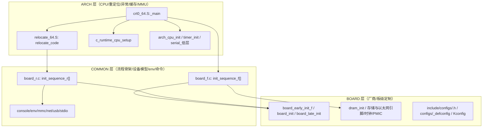

------

#### 5) 典型板级目录结构与“谁覆盖了什么”

```text
board/<vendor>/<board>/
├─ Kconfig                       # 板级 Kconfig 片段（使能外设/选项）
├─ MAINTAINERS
├─ Makefile
├─ <board>.c                     # board_init(), board_late_init(), board_early_init_f() 等钩子
├─ dram.c / sdram.c              # dram_init(), dram_init_banksize(): 探测容量/Bank布局
├─ pinmux.c / gpio.c             # 复用/电平初始化
├─ power.c / pmic.c              # 电源/PMIC 初始化（若有）
├─ spl.c                         # SPL 相关板钩子（若平台使用 SPL）
└─ README 或 doc 说明
```

- **板级头文件**：`include/configs/<board>.h`（早期栈、基址、环境存放位置、串口编号、以太网 PHY 等）
- **默认配置**：`configs/<board>_defconfig`（Kconfig 开关集合）
- **常见覆盖函数**：
  - `int board_early_init_f(void);`（可选）
  - `int board_init(void);`
  - `int board_late_init(void);`（可选）
  - `int dram_init(void);`、`int dram_init_banksize(void);`
  - 某些 SoC 还会有 `board_phy_config()`、`board_mmc_init()` 等

------

#### 6) 数据关系（从 f → 中间 → reloc → r）

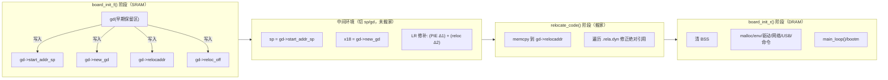

------

#### 7) 你在代码里“应该去哪找什么”

- 想看 **流程骨架**：`common/board_f.c`（f 阶段），`common/board_r.c`（r 阶段）
- 想看 **重定位细节 & LR 修补**：`arch/arm/lib/crt0_64.S`, `arch/arm/lib/relocate_64.S`
- 想看 **CPU/缓存/异常设置**：`arch/arm/cpu/armv8/*`
- 想看 **板级 DRAM 初始化、引脚/时钟/电源**：`board/<vendor>/<board>/*`
- 想看 **串口/网卡/存储驱动**：`drivers/serial/*`, `drivers/net/*`, `drivers/mmc/*`, `drivers/mtd/*`, `drivers/usb/*`
- 想看 **配置来源**：`include/configs/<board>.h`, `configs/<board>_defconfig`, `board/<vendor>/<board>/Kconfig`

------


### 函数run_main_loop()

好的 👍
 这次给你一张 **简化版流程图**，只展示你提到的几个关键函数：
 `run_main_loop → main_loop → autoboot_command → run_command_list`

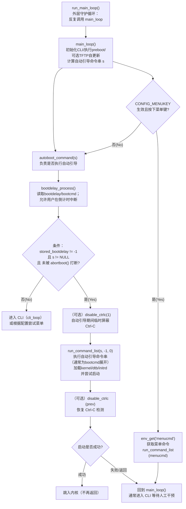

这样一眼就能看清主干路径：

- **正常路径**：run_main_loop → main_loop → autoboot_command → run_command_list（执行 bootcmd 脚本）。
- **异常/打断路径**：如果条件不满足，就不会进入 `run_command_list`，而是直接落到 **交互式 CLI**。

要不要我再给你加上 **菜单键（CONFIG_MENUKEY → menucmd）** 的分支？

路径：common/board_r.c

```c
# /common/board_r.c

static int run_main_loop(void)
{
#ifdef CONFIG_SANDBOX
	sandbox_main_loop_init();
#endif
	/* main_loop() can return to retry autoboot, if so just run it again */
	for (;;)
		main_loop();
	return 0;
}
```

> 这段是 U-Boot 2018.03 中 `common/board_r.c` 的一小段收尾逻辑，负责进入 U-Boot 的“主循环”（命令行/自动引导）：
>
> 逐行解释——
>
> 1. `#ifdef CONFIG_SANDBOX ... #endif`
>
> - 只有在 **sandbox** 目标（把 U-Boot 作为宿主机上的用户态程序运行，用于开发/单元测试）下才会编译这段。
> - `sandbox_main_loop_init()` 做 sandbox 环境的主循环初始化（如宿主机事件/控制台/定时器等适配）。
>
> 1. 注释：`main_loop() can return to retry autoboot...`
>
> - 正常情况下 **`main_loop()` 不会返回**——它内部包含：
>   - 自动引导（根据 `bootdelay` / `bootcmd`）；
>   - 命令行 REPL（shell）；
>   - 以及各类外设/网络命令处理。
> - 但**在某些场景下它会“刻意返回”**，用于**重新尝试自动引导（autoboot）**（例如脚本或策略要求“回到外层再重启自动引导流程”）。官方留了这种可回退的钩子。
>
> 1. `for (;;)`（无限循环）
>
> - 经典的**无限循环**写法。
> - 目的是：**如果 `main_loop()` 由于“重试自动引导”的原因返回了，这里会立刻再次调用它**，从而保持 U-Boot 主循环永不退出。
>
> 1. `return 0;`
>
> - 理论上**不可达**（unreachable），只是为了让函数签名/编译器满意。
> - 在真实运行中，这个函数不会以常规方式返回到调用者。
>
> 1. 位置与调用关系（补充上下文）
>
> - `run_main_loop()` 通常在 **`board_init_r()`（r 阶段）初始化完所有驱动、环境、控制台**之后被调用。
> - 也就是说，系统完成“搬家/重定位、BSS 清零、驱动和 malloc 初始化”等工作后，最终进入这里的主循环，等待自动引导或用户交互。
>
> 一句话总结：
>  **`run_main_loop()` 是 U-Boot 进入“主循环”的外层守护壳**。它在 sandbox 目标时做一次额外初始化，然后**反复调用 `main_loop()`**，确保即使 `main_loop()` 因为“重试自动引导”的特殊路径返回，也会立刻再次进入，不会让 U-Boot 掉回去或退出。

### 函数main_loop()

路径：common/main.c

```c
# /common/main.c

/* We come here after U-Boot is initialised and ready to process commands */
void main_loop(void)
{
	const char *s;

	bootstage_mark_name(BOOTSTAGE_ID_MAIN_LOOP, "main_loop");

#ifdef CONFIG_VERSION_VARIABLE
	env_set("ver", version_string);  /* set version variable */
#endif /* CONFIG_VERSION_VARIABLE */

	cli_init();

	run_preboot_environment_command();

#if defined(CONFIG_UPDATE_TFTP)
	update_tftp(0UL, NULL, NULL);
#endif /* CONFIG_UPDATE_TFTP */

	s = bootdelay_process();
	if (cli_process_fdt(&s))
		cli_secure_boot_cmd(s);

	autoboot_command(s);

	cli_loop();
	panic("No CLI available");
}
```

> 下面这段是 U-Boot 2018.03 的 **主循环主体**（真正“进系统”后干的事）：它把“自动引导”和“交互式命令行（CLI）”两条路径串起来。
>
> ```c
> /* We come here after U-Boot is initialised and ready to process commands */
> void main_loop(void)
> {
>     const char *s;
> 
>     bootstage_mark_name(BOOTSTAGE_ID_MAIN_LOOP, "main_loop");
> 
> #ifdef CONFIG_VERSION_VARIABLE
>     env_set("ver", version_string);  /* set version variable */
> #endif /* CONFIG_VERSION_VARIABLE */
> 
>     cli_init();
> 
>     run_preboot_environment_command();
> 
> #if defined(CONFIG_UPDATE_TFTP)
>     update_tftp(0UL, NULL, NULL);
> #endif /* CONFIG_UPDATE_TFTP */
> 
>     s = bootdelay_process();
>     if (cli_process_fdt(&s))
>         cli_secure_boot_cmd(s);
> 
>     autoboot_command(s);
> 
>     cli_loop();
>     panic("No CLI available");
> }
> ```
>
> 逐段解释——
>
> ### 1) `bootstage_mark_name(...)`
>
> - **作用**：在“引导阶段计时（bootstage）”里打一个标记点，标注现在进入了 `main_loop` 阶段，便于启动时间剖析/统计。
> - **背景**：U-Boot 内置一个轻量的“阶段打点”系统，后续可输出或上传用于分析冷启动耗时。
>
> ### 2) `env_set("ver", version_string)`（受 `CONFIG_VERSION_VARIABLE` 控制）
>
> - **作用**：把当前 U-Boot 的版本字符串写入环境变量 `ver`。
> - **意义**：之后脚本或命令可以用 `${ver}` 读取版本（如在 `preboot`、`bootcmd` 中做条件分支）。
>
> ### 3) `cli_init()`
>
> - **作用**：初始化命令行接口（CLI），注册内置命令、补全/历史（取决于配置，比如 `CONFIG_CMDLINE`/`CONFIG_HUSH_PARSER` 等），准备好输入/输出设备。
> - **意义**：保证后续无论是自动引导失败回落，还是用户中断自动引导，都能进入可交互的 shell。
>
> ### 4) `run_preboot_environment_command()`
>
> - **作用**：读取并执行环境变量 `preboot` 中的脚本（如果定义了）。
> - **常见用法**：在自动引导前做一次“预处理”，例如切换串口波特率、检测某个按键决定是走量产流程还是正常启动、选择启动目标（`boot_targets`）等。
>
> ### 5) `update_tftp(...)`（受 `CONFIG_UPDATE_TFTP` 控制）
>
> - **作用**：可选的 **TFTP 自更新**钩子。常用于实验/量产：在进入引导前，尝试经以太网从 TFTP 服务器拉取更新映像（固件/环境等）。
> - **参数**：此版本里传入的是占位参数（`0UL, NULL, NULL`），实际行为按配置和板级代码决定。
>
> ### 6) `s = bootdelay_process();`
>
> - **作用**：处理 **自动引导倒计时**（`bootdelay`）以及是否允许用户打断；并确定“要执行的自动引导命令串”。
> - **典型行为**：
>   - 读取 `bootdelay`（秒），显示倒计时；
>   - 期间如用户按键（或安全策略禁止中断），决定是否 **继续自动引导**；
>   - 返回值 `s` 往往是 **要执行的命令**（通常来自 `bootcmd`，也可能被某些策略或设备树注入修改）。
>
> ### 7) `if (cli_process_fdt(&s)) cli_secure_boot_cmd(s);`
>
> - **`cli_process_fdt(&s)`**：从传入的 **设备树（FDT）** 中解析是否指定了要执行的“安全/受限命令”。如果找到了，会**更新 `s`**（例如从 `/config/bootcmd` 读取）。
> - **`cli_secure_boot_cmd(s)`**：在 **安全模式** 下执行命令串 `s`（常用于锁设备、只允许运行白名单命令的场景）。
> - **语义**：如果 FDT 里声明了“需要按 FDT 指令执行”，就走安全执行路径；否则继续下面的常规 autoboot。
>
> ### 8) `autoboot_command(s);`
>
> - **作用**：执行自动引导命令串 `s`（通常就是环境变量 `bootcmd`，或被上一步改写后的命令）。
> - **典型逻辑**：解析 `boot_targets`，尝试从多个介质（MMC/NAND/SPI/网络）按顺序加载内核/设备树/initrd 并跳转。
> - **返回**：若自动引导**失败或被打断**，函数返回，进入下一步的 **交互式 CLI**。
>
> ### 9) `cli_loop();`
>
> - **作用**：进入 **交互式 shell 循环**（REPL）。用户可输入命令（`help`、`printenv`、`mmc list`、`tftpboot`、`bootm/booti` 等），也可以手动修复/调试/引导。
> - **退出条件**：**几乎不会退出**。除非配置了特殊策略或收到重启/重置命令。
>
> ### 10) `panic("No CLI available");`
>
> - **意义**：兜底防御。如果编译时完全 **没有 CLI**（极精简配置，且 autoboot 又失败/返回），走到这里直接 `panic`，避免进入不可知状态。
> - **正常情况**：这个分支不可达，因为默认都会有 CLI。
>
> ------
>
> ### 小结（把“自动引导”和“交互式 CLI”串成一条线）
>
> - 进入 `main_loop()` 时，U-Boot 已完成 r 阶段的初始化（驱动/设备模型/环境/控制台齐备）。
> - 按顺序做：**预处理（preboot）→ 可选的网络自更新 → 处理倒计时与 `bootcmd`/FDT → 自动引导**。
> - 若自动引导未成功，就进入 **CLI** 等待用户操作；这也是你在串口里看到 U-Boot 提示符的地方。
> - 在 **sandbox** 目标下，`run_main_loop()` 会在外层反复调用 `main_loop()`，以支持“重试自动引导”的路径，保证主循环不退出。

### 函数autoboot_command()

路径：common/autoboot.c
```c
# /common/autoboot.c

void autoboot_command(const char *s)
{
	debug("### main_loop: bootcmd=\"%s\"\n", s ? s : "<UNDEFINED>");

	if (stored_bootdelay != -1 && s && !abortboot(stored_bootdelay)) {
#if defined(CONFIG_AUTOBOOT_KEYED) && !defined(CONFIG_AUTOBOOT_KEYED_CTRLC)
		int prev = disable_ctrlc(1);	/* disable Control C checking */
#endif

		run_command_list(s, -1, 0);

#if defined(CONFIG_AUTOBOOT_KEYED) && !defined(CONFIG_AUTOBOOT_KEYED_CTRLC)
		disable_ctrlc(prev);	/* restore Control C checking */
#endif
	}

#ifdef CONFIG_MENUKEY
	if (menukey == CONFIG_MENUKEY) {
		s = env_get("menucmd");
		if (s)
			run_command_list(s, -1, 0);
	}
#endif /* CONFIG_MENUKEY */
}
```

> 这段是 U-Boot 2018.03 里 **自动引导（autoboot）** 的执行入口。它把 `bootcmd`（或别的传入命令串）真正跑起来，并处理“是否允许打断”“是否进入菜单”等策略。
>
> ## 逐段说明
>
> ### 1) `debug("... bootcmd=\"%s\" ...", s ? s : "<UNDEFINED>");`
>
> - 调试日志：打印本次准备执行的 **自动引导命令串**。通常 `s` 来自 `bootdelay_process()`（多数情况下就是环境变量 `bootcmd`，也可能被 FDT 或策略改写）。
> - 若 `s==NULL`，打印 `<UNDEFINED>`。
>
> ### 2) `if (stored_bootdelay != -1 && s && !abortboot(stored_bootdelay))`
>
> - **进入自动引导的条件**：
>   - `stored_bootdelay != -1`：说明**存在有效的倒计时设置**（`bootdelay` 没被禁用/特殊值）。
>   - `s` 非空：确实有要执行的命令串（通常是 `bootcmd`）。
>   - `!abortboot(stored_bootdelay)`：**倒计时期间没有被用户打断**。
>     - `abortboot(x)` 内部会等待 `x` 秒，看是否检测到“打断信号”（比如按键、串口输入、GPIO 条件、或“keyed autoboot”的组合键等）；返回 **true** 表示“已打断”，**false** 表示“未打断”。
> - 满足以上三条件，才会真正执行自动引导命令。
>
> ### 3) （可选）禁用 Ctrl-C：`CONFIG_AUTOBOOT_KEYED` / `CONFIG_AUTOBOOT_KEYED_CTRLC`
>
> - 只有在 **启用了“按键自动引导（keyed autoboot）”** 且 **未允许 Ctrl-C 打断** 的配置下，才会进入：
>
>   ```c
>   int prev = disable_ctrlc(1);   // 暂时关闭 Ctrl-C 检测
>   ...
>   disable_ctrlc(prev);           // 之后恢复原状态
>   ```
>
> - 作用：防止在自动引导命令执行过程中，用户随手一个 Ctrl-C 把脚本打断（更严格的无交互自动启动场景）。
>
> ### 4) `run_command_list(s, -1, 0);`
>
> - **真正执行命令串**的调用。典型是把 `s` 视作由分号/换行分隔的一串 U-Boot 命令（比如 `env run bootcmd` 展开的脚本）。
> - 参数解释（常见约定）：
>   - `s`：命令串；
>   - `-1`：长度为“直到字符串结束”（不用额外限制长度）；
>   - `0`：执行标志（保留/兼容用途，一般 0 表示正常执行）。
> - 这一步通常会尝试从多个介质按优先顺序加载 **kernel/dtb/initrd**，并跳转启动；若失败就返回，后续会进入 CLI。
>
> ### 5) （可选）恢复 Ctrl-C 检测
>
> - 如果前面临时禁用了 Ctrl-C，这里按 `prev` 恢复之前的状态。
>
> ### 6) `#ifdef CONFIG_MENUKEY`：按键进入菜单模式
>
> - 如果编译时启用 **菜单按键功能**：
>   - 条件 `if (menukey == CONFIG_MENUKEY)` 成立时，触发**菜单模式**（比如用户在倒计时期间按了特定键）。
>   - 从环境里取 `menucmd`（`env_get("menucmd")`），如果存在，就 **执行菜单命令串**：`run_command_list(s, -1, 0);`
> - 典型用途：进入图形化/文本菜单，供用户选择启动项、升级、量产测试等。
>
> ## 执行路径小结（用人话串起来）
>
> 1. 先看看有没有倒计时、有没有命令、倒计时期间用户有没有按键打断。
> 2. 条件满足 → **执行自动引导命令**（通常就是 `bootcmd` 展开的脚本）。
> 3. 若配置了“keyed autoboot 禁用 Ctrl-C”，执行前暂时屏蔽 Ctrl-C，执行后恢复。
> 4. 如果用户按了“菜单键”（`CONFIG_MENUKEY` 场景），则转而执行 `menucmd` 指定的菜单脚本（常见是进入交互式菜单）。
> 5. 若自动引导失败，**`autoboot_command()` 返回**，外层的 `main_loop()` 会继续走 `cli_loop()` 进入命令行，等待用户手动操作。
>
> ## 关联到外围调用的上下文
>
> - 该函数由 `main_loop()` 调用，且在它之前已做过：
>   - `cli_init()` 与 `run_preboot_environment_command()`（预引导脚本）；
>   - `bootdelay_process()`（决定 `s`、处理倒计时与打断）。
> - `run_main_loop()` 外面还有一层 `for(;;) main_loop();` 的 **守护循环**：如果某些路径下 `main_loop()` 选择返回以“重试自动引导”，外层会再次调用它，保持“主循环永不退出”。
>
> > 记忆点：`autoboot_command()` 就是“**如果没人打断，就把 bootcmd 那串命令真正跑起来**”。被打断了？那就回到 `main_loop()`，最后进入 CLI 给你手动折腾。

下面用一张 **Mermaid 时序图**把从 `run_main_loop()` 到 `run_command_list()` 的主干与关键分支（倒计时打断、Ctrl-C 屏蔽、菜单键）串起来：

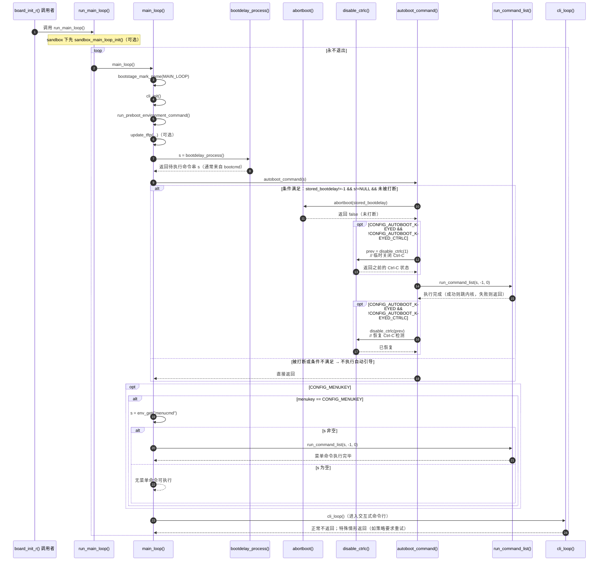

**读图要点：**

- `run_main_loop()` 是最外层“守护循环”，**反复调用 `main_loop()`**，确保主循环不退出。
- `main_loop()` 内部：预处理 → `bootdelay_process()` 得到命令串 `s` → 进入 `autoboot_command(s)`。
- `autoboot_command()`：
  - 条件成立且 **未被 `abortboot()` 打断** 才执行自动引导；
  - 在启用 **keyed autoboot 且禁用 Ctrl-C 打断** 的配置下，会在执行前后用 `disable_ctrlc()` 开关 Ctrl-C；
  - 真正执行命令串由 `run_command_list(s, -1, 0)` 完成。
- 若自动引导未执行/失败，或被打断，则回到 `main_loop()`，**可能进入菜单（`CONFIG_MENUKEY`）**，最终进入 `cli_loop()` 等待用户交互。

**u-boot程序到哪里读取环境变量？**

> 通常我们把NOR闪存分成多个分区，其中第一个分区存放u-boot程序，第二个分区存放环境变量。u-boot程序里面的NOR闪存驱动对分区信息硬编码，指定每个分区的偏移和长度。u-boot程序从环境变量分区读取环境变量。

调用函数autoboot_command。函数autoboot_command先调用函数abortboot，等待用户按键。如果在等待时间内用户没有按键，就调用函数run_command_list，自动执行环境变量bootcmd定义的命令。假设环境变量bootcmd定义的命令是“bootm”，函数run_command_list查找命令表，发现命令“bootm”的处理函数是do_bootm。

### do_bootm()

函数do_bootm的执行流程如图所示，把主要工作委托给函数do_bootm_states，函数do_bootm_states的执行过程如下。

```mermaid
flowchart LR
    A["do_bootm"]
    B["do_bootm_states"]

    A --> B

    B --> C["bootm_start"]
    B --> D["bootm_find_os"]
    B --> E["bootm_find_other"]
    B --> F["bootm_load_os"]
    B --> G["bootm_os_get_boot_func"]

    B --> H["do_bootm_linux <br>(BOOTM_STATE_OS_PREP)"]
    H --> H1["boot_prep_linux"]

    B --> I["boot_selected_os"]

    B --> J["do_bootm_linux <br>(BOOTM_STATE_OS_GO)"]
    J --> K["boot_jump_linux"]
```

1. 函数bootm_start 负责初始化全局变量“bootm_headers_t images”。

2. 函数bootm_find_os把内核镜像从存储设备读到内存。

3. 函数bootm_find_other读取其他信息，对于arm64架构，通常是扁平设备树（Flattened Device Tree， FDT）二进制文件，该文件用来传递硬件信息给内核。

4. 函数bootm_load_os把内核加载到正确的位置，如果内核镜像是被压缩过的，需要解压缩。

5. 函数bootm_os_get_boot_func根据操作系统类型在数组boot_os中查找引导函数，Linux内核的引导函数是do_bootm_linux。

6. 第一次调用函数do_bootm_linux时，参数flag是BOOTM_STATE_OS_PREP，为执行Linux内核做准备工作。函数do_bootm_linux(flas=BOOTM_STATE_OS_PREP)把工作委托给函数boot_prep_linux，主要工作如下。
   * 分配一块内存，把扁平设备树二进制文件复制过去。
   * 修改扁平设备树二进制文件，例如：
     * 如果环境变量“bootargs”指定了内核参数，那么把节点“/chosen”的属性“bootargs”设置为内核参数字符串；
     * 如果多处理器系统使用自旋表启动方法，那么针对每个处理器对应的节点“cpu”，把属性“enable-method”设置为“spin-table”，把属性“cpu-release-addr”设置为全局变量spin_table_cpu_release_addr的地址。

7. 函数boot_selected_os调用函数do_bootm_linux，这是第二次调用函数do_bootm_linux，参数flag是BOOTM_STATE_OS_GO。函数do_bootm_linux(flag = BOOTM_STATE_OS_GO)调用函数boot_jump_linux，该函数跳转到内核的入口，第一个参数是扁平设备树二级制文件的起始地址，后面3个采纳数现在没有使用。

   函数boot_jump_linux负责跳转到Linux内核，执行流程如图1.3所示。

   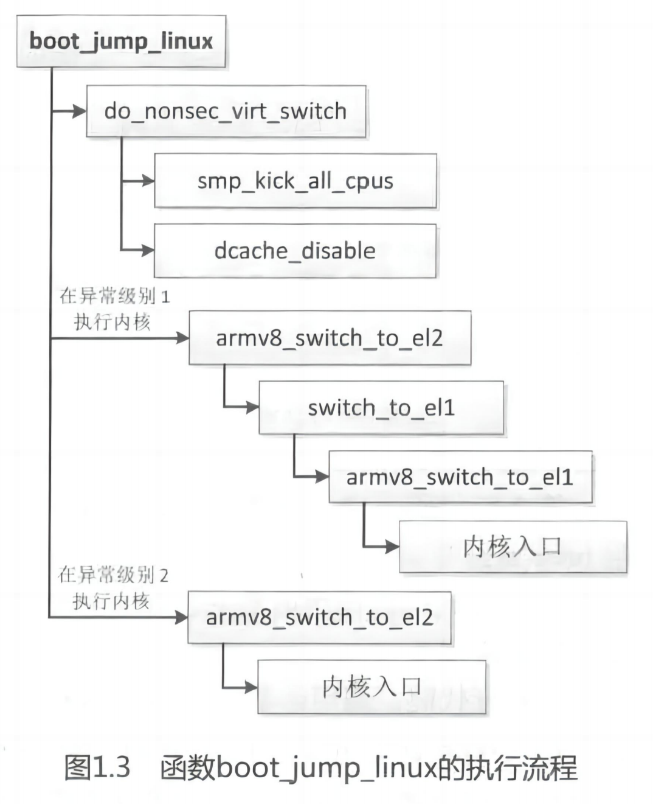

   （1）调用函数smp_kick_all_cpus，如果打开了配置宏CONFIG_GICV2或者CONFIG_GICV3，即使用通用中断控制器版本2或者版本3，那么发送中断请求以唤醒所有从处理器。

   （2）调用函数dcache_disable，禁用处理器的缓存和内存管理单元。

   （3）如果开启配置宏CONFIG_ARMV8_SWITCH_TO_EL1，表示在异常级别1执行Linux内核，那么先从异常界别3切换到异常级别2，然后切换到异常级别1，最后跳转到内核入口。

   （4）如果在异常级别2执行Linux内核，那么先从异常级别3切换到异常级别2，然后跳转到内核入口。

## 内核初始化


# 附录

## 内存和闪存的区别

信息摘抄自ChatGPT。


下面我将重点对 **NOR Flash、NAND Flash、eMMC 以及 DDR（内存）** 这四者的关系和区别进行**系统、详细、工程视角下的对比总结**，帮助你建立清晰的认知。

### NOR Flash vs NAND Flash vs eMMC vs DDR 内存 —— 深度对比

| 属性/类别                | **NOR Flash**                   | **NAND Flash**                      | **eMMC**                            | **DDR 内存**                       |
| ------------------------ | ------------------------------- | ----------------------------------- | ----------------------------------- | ---------------------------------- |
| **本质类型**             | 非易失性存储器（浮栅晶体管）    | 非易失性存储器（浮栅晶体管）        | 封装了控制器的 NAND Flash 存储方案  | 易失性内存（电容阵列，需要刷新）   |
| **断电后数据是否保留？** | ✅ 是                            | ✅ 是                                | ✅ 是                                | ❌ 否                               |
| **是否能直接运行代码？** | ✅ 可（支持 XIP）                | ❌ 不支持                            | ❌ 不支持                            | ✅ 支持（程序必须加载进来才能执行） |
| **常见用途**             | Bootloader 固化（如嵌入式启动） | 系统镜像存储、数据存储              | 嵌入式系统、手机的主存储            | 程序运行区、临时数据处理           |
| **读写速度**             | 较慢（几 MB/s）                 | 中等（几十~几百 MB/s）              | 中等偏高（50~400 MB/s，取决于版本） | 极快（几 GB/s，DDR3/4/5）          |
| **读取方式**             | 地址线+数据线（类似 SRAM）      | 页/块式读取（类似硬盘）             | 块式读写，通过控制器实现            | 按字节寻址、缓存式高速读写         |
| **接口复杂度**           | 简单（直接映射到地址空间）      | 复杂（需要坏块管理、ECC、页块操作） | 简单（MMC 协议，屏蔽底层）          | 高（DDR PHY、时钟训练、刷新等）    |
| **写入机制**             | 可字节写入                      | 需擦除后块写，最小单位为页          | 和 NAND 一样，但有控制器代劳        | 写入即生效                         |
| **可执行性**             | ✅ 支持直接执行代码（XIP）       | ❌ 不支持直接执行                    | ❌ 不支持直接执行                    | ✅ 支持（必须先将代码加载到此）     |
| **稳定性（可靠性）**     | 高（适合代码存储）              | 易损坏块，需坏块管理                | 中等，由控制器负责管理              | 高（但断电清空）                   |
| **价格/容量比**          | 昂贵、容量小（1~256MB）         | 便宜、容量大（几百MB~数百GB）       | 成本略高于裸 NAND，但易用           | 中等容量，价格按速度分档           |
| **硬件控制复杂度**       | 简单（直接地址访问）            | 高，需要驱动支持                    | 低，MMC协议屏蔽细节                 | 高，需要内存控制器、PHY等协同      |

### 技术实现和典型用途举例

#### 1. **NOR Flash**

- **结构：** 地址线+数据线，类似 SRAM。
- **优势：** 支持 XIP（eXecute In Place），适合运行 Bootloader 固化代码。
- **缺点：** 写入慢，容量小，成本高。
- **用途：** MCU 固化代码、嵌入式系统的第一阶段 Bootloader（如 BootROM 加载代码）。

#### 2. **NAND Flash**

- **结构：** 面向块（Block）和页（Page），不能直接执行。
- **优势：** 容量大、便宜。
- **缺点：** 写入必须擦除块，存在坏块，控制逻辑复杂。
- **用途：** 主存储器，系统镜像（Linux 内核、文件系统）、多媒体存储。

#### 3. **eMMC**

- **结构：** NAND + 控制器 封装一起，通过标准 MMC 协议与主控通信。
- **优势：** 使用方便（控制器自动管理坏块、FTL），适合手机/嵌入式量产设备。
- **缺点：** 固定于主板，无法替换（相比 SD 卡），速度低于 UFS。
- **用途：** 手机主存储、开发板的内核镜像/文件系统/参数保存区。

####  4. **DDR（内存）**

- **结构：** 电容阵列，需要不断刷新；按字节寻址，极高读写带宽。
- **优势：** 高速，可任意读写，CPU 从此直接执行程序。
- **缺点：** 断电即丢失数据，初始化复杂，成本高。
- **用途：** 所有程序运行时使用的主内存区，内核、文件系统、应用程序都在此运行。


### 总结性认知框架图（系统启动角度）

``` mermaid
graph TD
    A[BootROM]
    A --> B[NOR Flash / SPI NAND ]
    B --> C[SPL 加载到 SRAM]
    C --> D[初始化 DDR]
    D --> E[从 NAND/eMMC 加载 U-Boot 到 DDR]
    E --> F[从 NAND/eMMC 加载 Linux Kernel 到 DDR]
    F --> G[跳转到 Kernel 启动 Linux 系统]

```


### 🚫 常见误区澄清

| 误区                  | 正确解释                                   |
| --------------------- | ------------------------------------------ |
| “DDR 是 Flash 的一种” | ❌ DDR 是 RAM，不是 Flash，属于完全不同类别 |
| “NAND 也能执行代码”   | ❌ NAND 不能直接执行代码，必须先加载到 RAM  |
| “Flash 不需要初始化”  | ❌ Flash 需要挂载驱动（NAND更复杂）         |
| “eMMC 结构就是 NAND”  | ✅ 但它还包含控制器，使用体验更像硬盘       |


### 结论性总结表

| 分类        | 类型            | 是否掉电丢失 | 是否能直接执行代码 | 控制复杂度     | 用途概述                   |
| ----------- | --------------- | ------------ | ------------------ | -------------- | -------------------------- |
| NOR Flash   | 非易失性 Flash  | 否           | ✅ 是（支持 XIP）   | 简单           | 启动代码、MCU 固化         |
| NAND Flash  | 非易失性 Flash  | 否           | ❌ 否               | 高             | 系统镜像、数据存储         |
| eMMC        | 控制封装型 NAND | 否           | ❌ 否               | 极低（对用户） | 嵌入式系统主存储（手机等） |
| DDR / LPDDR | 易失性 RAM      | ✅ 是         | ✅ 是               | 高             | 主内存、执行代码、数据缓存 |


## .rela.dyn 介绍

以下内容，摘抄自GPT：

`.rela.dyn` 这个段是 ELF（Executable and Linkable Format）里专门存放 **动态重定位信息** 的一个节（section）， 在 ARM64 U-Boot 启动代码里你看到它，是因为 **位置无关执行（PIE/PIC）模式需要在启动时遍历它来修正地址**。

我帮你从 ELF 格式、用途和 U-Boot 里的作用三个层次解释清楚。

### 1. `.rela.dyn` 在 ELF 里的定义

**名字含义**：

- `.rel` / `.rela` 都是“relocation”重定位信息的节。
- `.rel` 只包含偏移量和类型，不包含附加值（addend）。
- `.rela` 多了一个 `a`，表示它**额外存了 addend**（附加值）。
- `.dyn` 表示这是**动态重定位**表，用于运行时修正。

**段类型**：`SHT_RELA`（ELF 段头类型为 "RELA" 表）

**内容格式**：每条记录是一个 `Elf64_Rela` 结构：

```c
typedef struct {
    Elf64_Addr r_offset; // 需要修正的内存位置
    Elf64_Xword r_info;  // 重定位类型 + 符号索引
    Elf64_Sxword r_addend; // 附加值
} Elf64_Rela;
```

### 2. `.rela.dyn` 的用途

生成时机：

- 编译/链接 PIE 或共享库时，链接器会把所有需要运行时修正的引用收集到 `.rela.dyn`。
- 这些引用一般是全局变量地址、函数指针、虚表、静态常量表等**绝对地址依赖**。


使用时机：

- 程序加载到内存后，如果**实际加载地址 ≠ 链接时地址**，就需要用运行时基址修正这些引用。
- 动态链接器（ld.so）或程序自身的启动代码负责遍历 `.rela.dyn` 表完成修正。

### 3. `.rela.dyn` 在 U-Boot 里的作用

U-Boot 启动早期，尤其在 **CONFIG_POSITION_INDEPENDENT** 模式下，可能被加载到一个与链接地址不同的位置（例如从 SPI Flash 拷贝到 RAM）。
 这时：

1. 启动代码会计算：偏移量 = 运行时基址 - 链接基址
2. 遍历 `.rela.dyn`：
   * 如果 `r_info` 类型是 `R_AARCH64_RELATIVE`（值 1027）：新值 = addend + 偏移量
   * 然后写回到 `r_offset` 指向的内存位置。
3. 修正后，代码里所有全局引用都指向运行时的正确位置。

### 4. 小例子

假设代码里有：

```c
int global_var = 123;
printf("%d\n", global_var);
```

* 链接时假设 `global_var` 的地址是 `0x400123`.
* 如果程序最终加载到 `0x500000` 开头运行，那么 `global_var` 的实际地址是 `0x500123`。
* `.rela.dyn` 会有一条记录：

```ini
r_offset = 地址存放 global_var 引用的内存位置
r_info   = 类型 R_AARCH64_RELATIVE
r_addend = 链接时的 global_var 地址偏移
```

* 启动时用 `偏移量 = 0x500000 - 0x400000 = 0x100000` 修正引用。

### 5. 和 `.rela.plt` 的区别

* `.rela.dyn`：修正**数据引用**和静态函数引用。
* `.rela.plt`：专门用于延迟绑定的函数调用（PLT 表），主要出现在动态库中，U-Boot 通常不会用到 PLT。

## PIE说明

你问的 **U-Boot 和 Linux kernel 的 PIE（Position Independent Executable）**，在实现和目的上有一些区别，我帮你整理一下：

------

### 1. 什么是 PIE？

- **PIE** = 可位置无关可执行文件（Position Independent Executable）。
- 原理：代码里不使用固定的绝对地址，而是通过 **相对地址（PC-relative addressing）** 来访问数据和函数。
- 好处：
  - **可重定位**：可以加载到任意内存地址运行，不需要编译时就固定执行基址。
  - **安全性**：在操作系统里常用于 ASLR（地址空间随机化），防御利用固定地址的攻击。
  - **通用性**：在 Bootloader 里，可以适配不同的内存布局。

------

### 2. U-Boot 的 PIE

- U-Boot 是 **Bootloader**，加载位置常常不固定（比如不同 SoC 的 SRAM/DRAM 起始地址不同，或者 SPL/TF-A 搬移代码）。
- **作用**：
  - 让 U-Boot 的二进制能在不同物理地址运行，而不需要在编译时写死。
  - 常见配置是 `CONFIG_POSITION_INDEPENDENT` 或 `CONFIG_SYS_TEXT_BASE` 搭配。
  - 链接脚本里会留 relocation 代码：先运行一段小的搬移代码（relocate_code），把自身复制到目标地址，再修正符号表和指针。
- **区别点**：
  - U-Boot 的 PIE 主要是为了解决 **代码重定位** 和 **运行时搬移**。
  - 它一般会在启动后很早阶段（board_init_f → relocate_code）就把自身移到 DDR 高地址，然后更新 `gd->relocaddr`。

------

### 3. Kernel 的 PIE

- Linux 内核过去默认是 **非 PIE**（固定基址，比如 `0xC0000000`），因为内核态需要直接控制页表、物理映射。
- 从 **Kernel 4.x** 开始，加入了 **内核 PIE 支持**：
  - **CONFIG_PIE** 或者 **CONFIG_RELOCATABLE**。
  - 作用是：支持内核在不同物理基址加载，配合 KASLR（Kernel Address Space Layout Randomization）。
  - 实现方法：编译出的 vmlinux 使用 PC-relative code，启动时 Bootloader 把它加载到一个随机物理地址，内核解压后自己修正符号。
- **区别点**：
  - Kernel 的 PIE 更多是为了 **安全性**（KASLR），防止攻击者预测内核函数地址。
  - 同时在某些体系结构（如 ARM64、x86_64）上，能兼容不同硬件的加载基址。

------

### 4. 对比总结

| 特性         | U-Boot PIE                                            | Kernel PIE                                    |
| ------------ | ----------------------------------------------------- | --------------------------------------------- |
| **主要目的** | 解决 Bootloader 在任意地址搬移运行                    | 提供 KASLR，增加内核安全性                    |
| **实现方式** | 链接时生成可重定位代码，启动时搬移自身并修复符号      | 使用 PC-relative 代码，支持随机基址加载       |
| **生效阶段** | U-Boot 初始化早期（relocate_code）                    | Kernel 解压和启动时                           |
| **典型配置** | `CONFIG_POSITION_INDEPENDENT`、`CONFIG_SYS_TEXT_BASE` | `CONFIG_RELOCATABLE`、`CONFIG_RANDOMIZE_BASE` |
| **主要收益** | 通用性（兼容不同板子内存布局）                        | 安全性（防御漏洞攻击）                        |

------

## PIC说明

好的，我们把 **PIC（Position Independent Code，可位置无关代码）** 单独解释一下，并顺带和 PIE（Position Independent Executable，可位置无关可执行文件）区分开来。

------

### 1. PIC 的定义

- **PIC = Position Independent Code**
- 指的是：编译出来的目标代码，不依赖固定的绝对地址，可以加载到内存的任意位置执行。
- 实现方式：
  - 使用 **PC-relative addressing（程序计数器相对寻址）** 来访问函数和数据。
  - 对于全局变量、函数符号，编译器会生成访问 **GOT（Global Offset Table，全局偏移表）** 和 **PLT（Procedure Linkage Table，过程链接表）** 的指令，而不是直接用绝对地址。
  - 这样运行时加载器可以把这些表重定位到实际内存位置，而代码本身不用改。

------

### 2. PIC 的应用场景

1. **共享库（.so）**

   - Linux 下的动态链接库几乎都是用 PIC 编译的：

     ```
     gcc -fPIC -shared -o libfoo.so foo.c
     ```

   - 这样同一个 `.so` 文件能被不同进程、不同内存地址加载，而不需要为每个进程重新编译。

   - **好处**：节省内存（库代码可以被多个进程共享一份物理页），减少加载时间。

2. **内核 / Bootloader 等需要重定位的代码**

   - 某些系统组件也会采用 PIC，保证能在不同内存布局下运行。

------

### 3. PIC vs PIE 的区别

| 特性               | PIC                          | PIE                              |
| ------------------ | ---------------------------- | -------------------------------- |
| **全称**           | Position Independent Code    | Position Independent Executable  |
| **本质**           | 一种编译生成代码的方式       | 一类特殊的可执行文件             |
| **应用场景**       | 共享库（.so）、某些模块      | 整个程序（可执行文件）           |
| **编译参数**       | `-fPIC` 或 `-fpic`           | `-fPIE`（编译） + `-pie`（链接） |
| **是否能独立运行** | 不能（必须被可执行文件加载） | 能独立运行（整个 ELF 是 PIE）    |
| **安全性**         | 主要为了代码复用和内存共享   | 主要为了安全（ASLR）             |

👉 可以理解为：

- **PIC 是一种技术**（代码生成方式）。
- **PIE 是基于 PIC 的产物**（整个可执行文件都是位置无关的）。

------

### 4. 举个例子

- 编译共享库：

  ```bash
  gcc -fPIC -shared foo.c -o libfoo.so
  ```

  → 得到 **libfoo.so**，它是用 PIC 编译的。

- 编译 PIE 程序：

  ```bash
  gcc -fPIE -pie main.c -o main
  ```

  → 得到 **main**，它是一个位置无关可执行文件，运行时内核加载器可以把它随机放在内存不同位置（配合 ASLR）。

## wfi指令说明

好的 👍 我来详细解释一下 **ARM 架构中的 `WFI` 指令**，这在你学习 **ARMv8-A/ARMv9-A** 和 **内核开发**时会经常遇到。

------

### 1. `WFI` 的全称

- **WFI** = *Wait For Interrupt*
- 意思：**等待中断**。

它是 ARM 处理器提供的一条 **低功耗休眠指令**，执行后 CPU 会挂起大部分执行单元，直到某个事件唤醒它。

------

### 2. 工作机制

当执行 `WFI` 时：

1. **CPU 停止取指、执行**（pipeline 暂停），相当于进入 *idle* 状态。
2. **核心逻辑保持时钟运行**（不像 WFE 那样更彻底），所以可以更快响应。
3. **等待条件**：
   - 外部 **IRQ/FIQ 中断** 到来。
   - 某些架构里，还能被 **debug event** 或 **reset** 唤醒。
4. 一旦有中断挂起（IRQ pending），即使 **中断屏蔽**（CPSR.I=1），`WFI` 也会立即退出回到执行流。

⚠️ 注意：

- 如果中断已经处于 pending 状态，执行 `WFI` 会 **直接返回**，不会真的休眠。
- 退出 `WFI` 并不意味着中断一定会被处理（如果中断屏蔽了，只是让 CPU 醒过来）。

------

### 3. 应用场景

1. **操作系统 Idle 线程**
   - Linux 的 `arch/arm/kernel/process.c:cpu_do_idle()` 里，idle task 就是执行 `WFI`。
   - 这样 CPU 在空闲时不会白白消耗功耗，而是进入低功耗等待。
2. **RTOS / Bare-metal 程序**
   - FreeRTOS 等实时操作系统也会在 idle task 里调用 `WFI`。
   - 裸机程序可以在主循环里用 `WFI` 等待中断（比如定时器、外设事件）。
3. **节能场景**
   - 在 SoC 里，CPU 内核可能长时间空闲（等外设 DMA 完成），这时执行 `WFI` 可以显著降低功耗。

------

### 4. 与 `WFE` 的区别

ARM 还有一条类似的指令：**WFE = Wait For Event**。

| 指令    | 唤醒条件                                          | 用途                     |
| ------- | ------------------------------------------------- | ------------------------ |
| **WFI** | IRQ/FIQ 挂起（外部中断）                          | 系统级节能、idle 等待    |
| **WFE** | Event 信号（SEV、SEVL、外设事件、中断也算 Event） | 线程同步、低功耗等待事件 |

👉 简单记：

- **WFI** 更偏向 **中断驱动** 的低功耗等待。
- **WFE** 更偏向 **事件驱动** 的低功耗同步机制。

------

### 5. 代码示例

裸机或 RTOS 里常见的写法：

```c
while (1) {
    __asm__ volatile("wfi");  // 等待中断
}
```

Linux 内核 `arch/arm64/kernel/idle.c` 里：

```c
static void cpu_do_idle(void)
{
    asm volatile("wfi");
}
```

------

### 6. 总结

- `WFI` 是 ARM 的低功耗指令 → **Wait For Interrupt**。
- 进入 idle 状态，等待中断唤醒，退出时不中断流水线状态。
- 常用于操作系统 idle 线程，嵌入式主循环，节能待机。
- 与 `WFE` 相比，`WFI` 只等待中断，而 `WFE` 可等待更广义的“事件”。

------

## u-boot在DDR中二次搬家说明

好的 ✅ 我来帮你整理一份系统的电子笔记，主题是 **“为什么 U-Boot proper 要在 DDR 里搬家”**。
 笔记包含：背景 → 阶段划分 → 现象 → 原因 → 是否硬件限制 → 优势总结 → 图解。

因为你要求详细，如果输出过长，我会分批次导出。下面是第一部分（背景 + 阶段梳理 + 问题现象）：

------

### 📘 笔记：为什么 U-Boot proper 要在 DDR 中搬家？

------

#### 0. 背景说明

在 ARM SoC 的启动流程中，**U-Boot** 常常分为多个阶段：

1. **BootROM（硬件固化）**
   - 上电复位后，CPU 从片内 ROM 取指。
   - BootROM 代码由芯片厂商写死，功能有限：检测启动介质，把一小段代码加载到片内 SRAM 并运行。
2. **SPL（Secondary Program Loader，可选）**
   - 如果片上 SRAM 不够大，则 SPL 用作轻量引导器。
   - 负责初始化 DDR，提供基础时钟、串口等功能。
   - SPL 把 **U-Boot proper** 加载到 DDR 里。
3. **U-Boot proper（又称 U-Boot main）**
   - 功能完整的 U-Boot。
   - 负责设备初始化、驱动加载、命令行、网络启动、加载 Linux kernel。
   - 运行时在 DDR 里，并会执行一次 **重定位（relocate_code）**。

**问题切入点**：
 👉 为什么 U-Boot proper 已经在 DDR 里了，还要再搬一次位置？

------

#### 1. 阶段梳理与对比

**启动阶段表**

| 阶段                      | 存放位置  | 谁负责加载             | 职责                                          | 是否搬运 |
| ------------------------- | --------- | ---------------------- | --------------------------------------------- | -------- |
| BootROM                   | 片内 ROM  | 固化硬件               | 找启动介质，把 SPL/TPL 拉到 SRAM              | 不搬     |
| SPL                       | 片上 SRAM | BootROM                | 初始化 DDR，把 U-Boot proper 搬进 DDR（低端） | 不搬     |
| U-Boot proper 初始态      | DDR 低端  | SPL                    | 能够运行，但位置只是临时的                    | 后续会搬 |
| U-Boot proper relocate 后 | DDR 高端  | 自己 (`relocate_code`) | 搬到理想位置，留低端给内核                    | 已搬     |
| Linux Kernel              | DDR 低端  | U-Boot proper          | 由 bootm/bootz 加载                           | 不搬     |

------

#### 2. 问题现象

- **现象**：
   U-Boot proper 一开始已经在 DDR 里运行，但它仍然会调用 `relocate_code()`，把自己从“临时加载地址”搬到 DDR 的高端。
- **你的疑问**：
  1. 既然已经在 DDR，为什么不一开始就放在对的位置？
  2. 为什么设计成“先放低端 → 再搬高端”？
  3. 这是硬件限制吗？还是软件设计上的取舍？

------

📍 接下来我会在 **第二部分** 继续写：

- 为什么 SPL/BootROM 不直接放到高端；
- U-Boot proper 搬家的具体原因（内核内存需求、内存布局统一、SPL 简化）。

要我直接继续第二部分吗？

好 ✅ 接着整理笔记的 **第二部分** —— 分析为什么 **U-Boot proper 要搬家**，并解答“这是硬件限制还是软件取舍”。

------

### 📘 笔记：为什么 U-Boot proper 要在 DDR 中搬家？（第二部分）

------

#### 3. 为什么 SPL/BootROM 不直接放到高端？

##### 3.1 BootROM 的限制

- BootROM 目标是 **简单可靠**：
  - 只管从启动介质（NAND/eMMC/SD/USB/UART）**读出固定大小的数据块**到 **固定地址**（往往是片上 SRAM 或 DDR base）。
  - 它并不了解 DDR 的大小/拓扑结构，更不会动态计算“高端地址”。
- 所以 BootROM 不可能直接把 U-Boot proper 放到“高端的理想位置”。

##### 3.2 SPL 的限制

- SPL 的任务是 **尽量小**，只初始化 DDR + 读出 U-Boot proper。
- SPL 本身编译时通常会假设一个“安全的加载地址”，比如 DDR 起始处（`0x8000_0000`）。
- 如果 SPL 在此时就要算“高端地址”：
  - 必须先探测 DDR 总大小（512MB？1GB？2GB？）。
  - 再计算出高端地址，避免和内核/设备树/initrd 冲突。
  - 这会让 SPL 的逻辑膨胀，增加出错概率。

👉 因此，BootROM 和 SPL 都只保证 **能跑**，不保证 **在最终理想地址**。

------

#### 4. 为什么 U-Boot proper 要搬到高地址？

##### 4.1 给内核留低端内存

- Linux 内核在 ARM 平台常常被加载到 DDR 低端（`0x8000_0000`）。
- 设备树（FDT）和 initrd/initramfs 也一般放在低地址附近。
- 如果 U-Boot proper 不搬走，就会占用这片区域，导致内核加载时发生覆盖。

👉 **所以 U-Boot proper 要主动搬到 DDR 高端，把低端留给内核及其伴随镜像**。

------

##### 4.2 内存布局统一，兼容不同大小 DDR

- 编译 U-Boot 时，链接地址 `_TEXT_BASE` 一般设为“DDR 高端减去 U-Boot 大小”。
- 无论是 512MB DDR 还是 2GB DDR，U-Boot proper 都会被搬到靠近高端的一块。
- 这样，**内核始终可以从低地址起跑**，而 U-Boot proper 总在高地址，互不冲突。

👉 这种布局对移植和跨平台非常重要。

------

##### 4.3 简化 SPL

- 如果不通过 `relocate_code()`，那 SPL 就得处理所有复杂的地址规划和重定位表修正。
- 通过“**先放低端能跑 → proper 自己搬家**”的设计：
  - SPL 保持小巧：只做 DDR 初始化 + 把镜像丢进内存。
  - U-Boot proper 功能全，能处理 `.rela.dyn`、全局变量、绝对地址修正等复杂工作。

👉 模块化设计，让 SPL 稳定、proper 灵活。

------

#### 5. 这是硬件限制吗？

- **不是直接的硬件限制**：
   硬件完全可以一次性加载到高端。
- **是软件设计上的取舍**：
  - BootROM 尽量简单，避免依赖 DDR 探测。
  - SPL 逻辑简化，只保证能跑。
  - U-Boot proper 已经有 C 环境和完整算力，最合适做复杂的重定位工作。

------

#### 6. 优势总结

1. **保持启动流程的分层与健壮性**
   - BootROM/SPL 简单 → 减少出错概率
   - Proper 复杂 → 提供灵活性
2. **内存布局清晰**
   - DDR 低端：Linux 内核 / 设备树 / initrd
   - DDR 高端：U-Boot proper
   - 不会互相覆盖
3. **移植性与可扩展性**
   - 适配不同大小 DDR，逻辑统一
   - 无需为每块板子手动改 SPL 地址

------

📍 下一部分（第三部分）我可以帮你整理：

- 用一张 **DDR 内存布局对比表**（重定位前 / 重定位后 / 加载内核后）。
- 再配一张 **Mermaid 时间轴图**，展示 U-Boot proper 在 DDR 中两次地址变化。

要不要继续输出？

好的 ✅ 我继续整理 **第三部分** —— 用表格和时间轴图把 **U-Boot proper 的重定位前后内存布局** 展开。

------

### 📘 笔记：为什么 U-Boot proper 要在 DDR 中搬家？（第三部分）

------

#### 7. DDR 内存布局对比

| 阶段                                    | DDR 低端（例如 0x8000_0000 起）                         | DDR 高端（例如 0x8FFF_FFFF 附近）  | 特点                                            |
| --------------------------------------- | ------------------------------------------------------- | ---------------------------------- | ----------------------------------------------- |
| **重定位前**（刚加载完 U-Boot proper）  | U-Boot proper（运行中，SPL 从存储介质拷过来的）         | 空                                 | U-Boot 能跑，但占用了内核将来要用的低地址       |
| **重定位后**（执行 relocate_code 之后） | 空（已释放）可用于内核镜像、设备树、initrd              | U-Boot proper（搬到 `_TEXT_BASE`） | U-Boot 代码、BSS、堆栈、gd 等都在高端，低端干净 |
| **加载内核后**                          | 内核镜像（zImage/uImage）、设备树 FDT、initrd/initramfs | U-Boot proper                      | U-Boot 占高端，OS 镜像占低端，互不覆盖          |

------

#### 8. 内存布局图解

##### 8.1 重定位前（SPL 刚加载完）

```text
DDR
┌─────────────────────────────┐ ← 高地址
│             空              │
├─────────────────────────────┤
│   U-Boot proper (临时运行)  │ ← SPL 从介质拷过来
│   代码 + 数据 + BSS          │
└─────────────────────────────┘ ← DDR base (0x8000_0000)
```

------

##### 8.2 重定位后（relocate_code 完成）

```text
DDR
┌─────────────────────────────┐ ← 高地址
│   U-Boot proper (relocated) │ ← _TEXT_BASE (高端)
│   代码 + 数据 + BSS          │
├─────────────────────────────┤
│             空              │
└─────────────────────────────┘ ← DDR base (0x8000_0000)
```

------

##### 8.3 内核加载后（bootm/bootz）

```text
DDR
┌─────────────────────────────┐ ← 高地址
│   U-Boot proper (已搬迁)    │
├─────────────────────────────┤
│  内核镜像 (zImage/uImage)   │ ← DDR base
│  设备树 FDT                 │
│  initrd/initramfs           │
└─────────────────────────────┘
```

------

#### 9. 时间轴图（Mermaid）

```mermaid
sequenceDiagram
    participant ROM as BootROM
    participant SPL as SPL (SRAM)
    participant DDR1 as DDR (低端临时运行)
    participant DDR2 as DDR (高端重定位)
    participant K as Linux Kernel

    ROM->>SPL: 加载 SPL 到 SRAM，开始执行
    SPL->>DDR1: 加载 U-Boot proper 到 DDR base (低端)
    DDR1->>DDR1: 运行 U-Boot proper (临时地址)
    DDR1->>DDR2: relocate_code()<br/>复制到 DDR 高端 + 修正重定位表
    DDR2->>DDR2: 继续运行 U-Boot proper (最终地址)
    DDR2->>K: 加载内核镜像 + FDT + initrd 到 DDR 低端
    K->>K: 内核启动，U-Boot 保留在高端
```

------

#### 10. 总结

- **重定位前**：U-Boot proper 占 DDR 低端，能跑但位置不理想。
- **重定位后**：U-Boot proper 搬到 DDR 高端，低端空出来。
- **加载内核后**：内核、设备树、initrd 占据低端，U-Boot proper 安全地留在高端。

👉 设计上的好处：

1. **避免覆盖**：保证内核启动时不会覆盖 U-Boot。
2. **内存布局统一**：不论 DDR 容量大小，逻辑一致。
3. **软件分层清晰**：BootROM/SPL 简单，U-Boot proper 自己处理复杂的重定位。

------

要不要我接着再扩展一页 **“典型 SoC（i.MX6ULL、RK3566、STM32MP1）的具体内存布局案例”**，把它们的 DDR base、U-Boot relocate 地址和内核加载地址都列成对照表？

好的 ✅ 我来继续整理 **第四部分** ——不同 SoC 上 U-Boot proper 的 **内存布局实例对照表**。这样你能看到具体平台的差异和共性。

------

### 📘 笔记：为什么 U-Boot proper 要在 DDR 中搬家？（第四部分）

------

#### 11. 典型 SoC 平台对照表

| SoC 平台                       | DDR Base (低端)          | U-Boot proper 加载地址 (SPL 搬运) | U-Boot relocate 最终地址 (`_TEXT_BASE`)              | 内核加载地址  | 特点                                                         |
| ------------------------------ | ------------------------ | --------------------------------- | ---------------------------------------------------- | ------------- | ------------------------------------------------------------ |
| **NXP i.MX6ULL**               | `0x8000_0000`            | `0x8000_0000` (SPL 放在 DDR base) | `0x8780_0000`（DDR 高端减 U-Boot 大小，约 120MB 处） | `0x8000_0000` | BootROM → SPL → proper。U-Boot 总搬到高端，内核始终从 0x8000_0000 起跑 |
| **Rockchip RK3566**            | `0x0000_0000` (DDR 映射) | `0x0002_0000` (由 TPL/SPL 固定)   | `0x3f80_0000`（假设 DDR=1GB，高端留 8MB 给 U-Boot）  | `0x0028_0000` | DDR 较大，TPL+SPL 结构，U-Boot relocate 到高端，底部留给内核/TrustZone |
| **STM32MP1 (Cortex-A7)**       | `0xC000_0000`            | `0xC010_0000` (DDR 起始 + 1MB)    | `0xC3F0_0000`（DDR 高端减 1MB）                      | `0xC200_0000` | DDR Base = 0xC000_0000，不同于常见的 0x8000_0000。ST 的 U-Boot 链接脚本要求 relocate 到 DDR 高端 |
| **Allwinner A64 (Cortex-A53)** | `0x4000_0000`            | `0x4A00_0000` (SPL 放这里)        | `0x4FF0_0000`（DDR 512MB 高端 - U-Boot size）        | `0x4008_0000` | DDR base = 0x4000_0000，U-Boot 搬迁后占据高端，内核仍从低端启动 |
| **TI AM335x (Cortex-A8)**      | `0x8000_0000`            | `0x8000_0000`                     | `0x87F0_0000`（高端 - 1MB）                          | `0x8000_0000` | DDR 一般 512MB，U-Boot 高端，内核低端                        |

------

#### 12. 观察与规律

1. **DDR base 地址因 SoC 不同而不同**
   - i.MX6ULL / AM335x 常见 `0x8000_0000`。
   - STM32MP1 是 `0xC000_0000`。
   - Allwinner A 系列是 `0x4000_0000`。
   - Rockchip 有的直接从 `0x0000_0000`。
2. **SPL 加载地址通常是 DDR base 附近**
   - 简单、稳定。
   - BootROM/SPL 在早期只负责“能运行”，不关心最终布局。
3. **U-Boot relocate 总是搬到 DDR 高端**
   - `_TEXT_BASE` 通常是 DDR size - U-Boot size（再减一些安全区）。
   - 无论 DDR 大小如何，U-Boot 都占高端一块，不会和内核冲突。
4. **内核加载地址几乎固定是 DDR base**
   - 内核喜欢从 DDR 起始跑，保证有连续的物理内存。
   - initrd/FDT 紧跟在内核后面。

------

#### 13. 内存布局示意（i.MX6ULL 举例）

```text
DDR (假设大小 256MB)
┌───────────────────────────────┐ 0x9000_0000 (DDR End)
│  U-Boot proper (relocated)    │ ~ 2MB
│  (board_init_r 在此运行)      │
├───────────────────────────────┤ 0x8780_0000 (_TEXT_BASE)
│           空闲                 │
│  (可用于 malloc, 堆栈扩展)    │
├───────────────────────────────┤
│           内核 zImage          │ 0x8000_0000 起加载
│           FDT (设备树)         │ 紧跟内核
│           initrd               │ 紧跟 FDT
└───────────────────────────────┘ DDR Base
```

------

#### 14. 总结

- **为什么要搬？**
   因为 BootROM/SPL 只管放低端能跑，真正的内存布局要 U-Boot proper 自己规划。
- **为什么放高端？**
   高端固定，低端留给内核和附加镜像；这样无论 DDR 大小如何，布局统一，避免覆盖。
- **是不是硬件限制？**
   不是直接的硬件限制，而是启动流程设计上的工程权衡。

------

👉 下一部分（第五部分），我可以帮你再整理 **“relocate 过程中具体做了哪些事情”**，比如：

- 拷贝代码段/数据段；
- 遍历 `.rela.dyn` 修正绝对地址；
- 更新 `gd->relocaddr`/`gd->reloc_off`；
- LR 修补流程；

要不要我继续把 **relocate_code 的细节**也整理成笔记？

好的 ✅ 我来继续整理 **第五部分** ——专门讲解 **`relocate_code()` 过程的细节**，并配合表格和图示说明它到底做了什么。

------

### 📘 笔记：为什么 U-Boot proper 要在 DDR 中搬家？（第五部分）

------

#### 15. `relocate_code()` 的核心职责

当 U-Boot proper 确定要搬到 DDR 高端时，`relocate_code()` 负责以下任务：

1. **拷贝自身镜像**

   - 把当前运行的 U-Boot 映像（text 段 + data 段）从临时加载地址复制到目标 `_TEXT_BASE`。

2. **修正绝对地址**

   - 遍历 `.rela.dyn` 段（重定位表）。

   - 对所有 `R_AARCH64_RELATIVE` 类型的重定位项执行修正：

     ```text
     *(target) = addend + reloc_off
     ```

     其中 `reloc_off = gd->relocaddr - _TEXT_BASE`（新运行地址和链接地址的偏移）。

3. **更新全局数据 (gd)**

   - `gd->relocaddr`：保存 U-Boot 搬到的新基地址。
   - `gd->reloc_off`：保存运行时偏移，用于后续符号修正。

4. **修正返回地址 (LR)**

   - 因为 `_main` 中的 `relocation_return` 标签的运行地址与重定位后的地址不同。
   - `crt0_64.S` 会提前把 LR 调整为 `relocation_return + reloc_off`，保证 relocate 结束后能跳到新地址继续执行。

5. **保证 C 符号“自动重定位”生效**

   - ARM64 汇编里 `ldr x0, =__bss_start` 是 **PC-relative**，所以 relocation 后天然生效。
   - 但编译器生成的某些 **绝对引用**（如全局变量地址）需要 `.rela.dyn` 修正。

------

#### 16. relocate 前后对比

##### 16.1 relocate 前（临时地址运行）

```text
DDR
┌───────────────────────────────┐
│             空                 │
├───────────────────────────────┤
│   U-Boot proper (运行中)       │ ← 临时加载地址 (低端 DDR)
│   text + data + bss            │
└───────────────────────────────┘ DDR Base
```

##### 16.2 relocate 后（最终地址运行）

```text
DDR
┌───────────────────────────────┐
│   U-Boot proper (relocated)    │ ← _TEXT_BASE (DDR 高端)
│   text + data + bss            │
├───────────────────────────────┤
│            空闲                │
└───────────────────────────────┘ DDR Base
```

------

#### 17. relocate_code 内部步骤（概念流程）

```mermaid
flowchart TD
    A["relocate_code(gd->relocaddr)"] --> B["计算源地址与目的地址"]
    B --> C["拷贝镜像 (text/data) 到 relocaddr"]
    C --> D["遍历 .rela.dyn 表"]
    D --> E["修正绝对引用<br/>(R_AARCH64_RELATIVE)"]
    E --> F["更新 gd->relocaddr, gd->reloc_off"]
    F --> G["LR 修补: relocation_return+reloc_off"]
    G --> H["返回 relocation_return (新地址)"]
```

------

#### 18. `.rela.dyn` 表作用

- 链接时编译器会把需要运行时修正的符号放进 `.rela.dyn`。
- 常见情况：
  - 全局变量的绝对地址
  - 指向函数的指针表
- 每一项包含：
  - **偏移地址**（需要修正的位置）
  - **类型**（如 `R_AARCH64_RELATIVE`）
  - **addend**（原始基址）

重定位过程：把 `*(target)` 更新为 `addend + reloc_off`。

------

#### 19. LR 修补逻辑

在 `crt0_64.S` 里：

```asm
adr lr, relocation_return   // lr = relocation_return 的当前运行地址
ldr x9, [x18, #GD_RELOC_OFF] // reloc_off
add lr, lr, x9              // lr = relocation_return 在新地址空间的地址
```

- 意思是：重定位后函数返回要继续执行 `relocation_return`，但必须修正到新基址。
- 否则 relocate_code() 返回后会跑回旧地址，直接死机。

------

#### 20. relocate_code 完成后的状态

- **代码段**：在 DDR 高端运行。
- **数据段/BSS**：已经拷贝并修正。
- **gd**：指向新的 relocaddr，保存 reloc_off。
- **返回点**：进入 `_main` 的 `relocation_return` 标签，继续清 BSS 并执行 `board_init_r()`。

------

#### 21. 总结

- `relocate_code()` 是 **U-Boot proper 的自举关键步骤**：
  - 复制自己 → 修正绝对地址 → 更新 gd → 修补返回点。
- 这样 U-Boot 就能稳定地运行在 DDR 高端，低端留给内核。
- 如果没有这一过程：
  - 内核加载可能覆盖 U-Boot。
  - 绝对符号地址不一致，会导致崩溃。

------

📍 下一部分（第六部分），我可以帮你梳理 **relocate 前后，gd 结构体的关键字段变化表**（比如 `gd->relocaddr`、`gd->reloc_off`、`gd->start_addr_sp`、`gd->new_gd` 等）。

要不要我继续输出 **gd 字段变化笔记**？

好的 ✅ 接着整理 **第六部分** —— 重点分析 **`gd` (global data) 结构体在重定位前后的关键字段变化**，这是 U-Boot 初始化流程的核心数据桥梁。

------

### 📘 笔记：为什么 U-Boot proper 要在 DDR 中搬家？（第六部分）

------

#### 22. `gd` 是什么？

- `gd` = **global data**，U-Boot 的全局数据结构（`include/asm-generic/global_data.h`）。
- 运行时通过寄存器 **x18 (arm64 ABI 保留寄存器)** 指向它。
- **功能**：在 U-Boot 的不同阶段保存“跨环境”的关键信息。
  - 栈位置
  - 内存大小
  - U-Boot 重定位目标地址
  - 偏移量
  - BSS 状态
  - 驱动模型信息

------

#### 23. 重定位前后的字段变化（关键子集）

| 字段名                         | 作用                                  | 在 board_init_f (重定位前)                                   | 在 relocate_code 后 (重定位后)                               |
| ------------------------------ | ------------------------------------- | ------------------------------------------------------------ | ------------------------------------------------------------ |
| `start_addr_sp`                | 未来栈的地址                          | 在 `board_init_f()` 中计算并写入（一般是 DDR 中某个安全位置） | `_main` 切换 sp = gd->start_addr_sp，正式启用新栈            |
| `new_gd`                       | 未来 gd 的地址                        | `board_init_f()` 分配的新 gd 地址（在 DDR）                  | `_main` 切换 x18 = gd->new_gd                                |
| `relocaddr`                    | U-Boot 搬迁的目标基地址               | 由 `board_init_f()` 计算（通常 DDR 高端 `_TEXT_BASE`）       | `relocate_code()` 把镜像搬到此处，成为真正的运行基址         |
| `reloc_off`                    | 运行偏移量 = `relocaddr - _TEXT_BASE` | 由 `board_init_f()` 计算，保存                               | `relocate_code()` 使用它修正 LR 和符号表；后续全局引用需要它 |
| `ram_size`                     | DRAM 大小                             | `dram_init()` 时探测并写入                                   | 不变（供后续内存分配使用）                                   |
| `malloc_base` / `malloc_limit` | 动态内存分配器 (heap) 范围            | 未初始化                                                     | `board_init_r()` 初始化 malloc 区时赋值                      |
| `bd` (board_info)              | 保存板子信息（时钟、外设地址）        | 在 `board_init()` 时初始化部分                               | 后续在 `board_init_r()` 补充完整                             |

------

#### 24. gd 字段变化流程图

```mermaid
flowchart TD
    subgraph F["board_init_f 阶段 (SRAM/初始DDR)"]
        A1[计算 start_addr_sp] -->|写入 gd->start_addr_sp| G
        A2["分配 new_gd (DDR)"] -->|写入 gd->new_gd| G
        A3[计算 relocaddr] -->|写入 gd->relocaddr| G
        A4[计算 reloc_off] -->|写入 gd->reloc_off| G
        A5[探测 DRAM 大小] -->|写入 gd->ram_size| G
    end

    subgraph R["relocate_code 阶段 (DDR 高端)"]
        G["gd (早期)"] --> B1[复制 U-Boot 到 gd->relocaddr]
        G --> B2[修正符号: 使用 gd->reloc_off]
        G --> B3[修正 LR: relocation_return+gd->reloc_off]
        B1 --> H["进入 relocation_return (新地址)"]
    end

    subgraph L["board_init_r 阶段 (完整 C 环境)"]
        H --> C1[清 BSS]
        C1 --> C2[初始化 malloc 区: 设置 gd->malloc_base, gd->malloc_limit]
        C2 --> C3[设备模型、驱动、命令初始化]
    end
```

------

#### 25. gd 在三阶段的内容快照

##### (1) **board_init_f 结束后**

```c
gd = {
    start_addr_sp = 0x8020_0000,   // DDR 中新栈
    new_gd        = 0x8030_0000,   // DDR 中未来 gd
    relocaddr     = 0x8FF0_0000,   // DDR 高端
    reloc_off     = 0x07F0_0000,   // 偏移量
    ram_size      = 0x1000_0000,   // 256MB
}
```

##### (2) **relocate_code 结束后**

```c
gd = {
    start_addr_sp = 0x8020_0000,   // 已切换到此栈
    new_gd        = 0x8030_0000,   // 已切换到此 gd
    relocaddr     = 0x8FF0_0000,   // 已搬到此处运行
    reloc_off     = 0x07F0_0000,   // 已用于修正 LR/符号
    ram_size      = 0x1000_0000,   // 不变
}
```

##### (3) **board_init_r 运行时**

```c
gd = {
    start_addr_sp = 0x8020_0000,
    new_gd        = 0x8030_0000,
    relocaddr     = 0x8FF0_0000,
    reloc_off     = 0x07F0_0000,
    ram_size      = 0x1000_0000,
    malloc_base   = 0x8040_0000,   // malloc 区
    malloc_limit  = 0x8080_0000,   // malloc 上限
    bd            = {...},         // 板子信息
}
```

------

#### 26. 总结

- `gd` 是 U-Boot **跨阶段的核心数据载体**。
- **board_init_f 阶段**：写入“未来栈 / 新 gd / relocaddr / reloc_off / ram_size”。
- **relocate_code 阶段**：使用 `reloc_off` 修正地址，跳转到新位置。
- **board_init_r 阶段**：完整 C 环境，初始化 malloc、驱动、命令。

👉 通过 `gd`，U-Boot 完成了从 **临时环境 → 中间环境 → 完整环境** 的平滑过渡。

------

📍 下一部分（第七部分），我可以帮你整理 **一张总览图：把 BootROM → SPL → U-Boot proper (board_init_f → relocate → board_init_r) 的阶段、内存位置、gd 字段变化**放在一张表和一张全流程图里，作为总复习。

要不要继续？

好 ✅ 接着整理 **第七部分** ——做一个 **总览笔记**，把 **BootROM → SPL → U-Boot proper (board_init_f → relocate_code → board_init_r)** 的阶段、内存位置、`gd` 关键字段变化，全部汇总在一张表格和一张全流程图里。

------

### 📘 笔记：U-Boot 启动流程总览（带内存位置与 gd 演变）

------

#### 27. 阶段总览表

| 阶段                              | 运行位置        | 负责者             | 主要任务                                                     | `gd` 状态（关键字段）                                        |
| --------------------------------- | --------------- | ------------------ | ------------------------------------------------------------ | ------------------------------------------------------------ |
| **BootROM**                       | SoC 片上 ROM    | 芯片厂商固化       | - 上电取指- 检测启动介质- 把 SPL/TPL 搬到 SRAM               | `gd` 不存在                                                  |
| **TPL** *(可选)*                  | 片上 SRAM       | BootROM            | - 极小初始化（pinmux/时钟）- 搬 SPL 到 SRAM                  | `gd` 不存在                                                  |
| **SPL**                           | 片上 SRAM       | BootROM/TPL        | - 初始化 DDR- 搬 U-Boot proper 到 DDR base                   | `gd` 初始化但极简                                            |
| **U-Boot proper (board_init_f)**  | DDR 低端 (临时) | SPL 搬运           | - 计算 relocaddr (DDR 高端)- 计算 reloc_off- 探测 ram_size- 分配新栈、新 gd | `gd->start_addr_sp` = 新栈`gd->new_gd` = 新 gd`gd->relocaddr` = 高端`gd->reloc_off` = 偏移`gd->ram_size` = DDR 大小 |
| **U-Boot proper (relocate_code)** | DDR 高端 (最终) | U-Boot proper 自举 | - 拷贝自身到 relocaddr- 遍历 .rela.dyn 修正地址- LR 修补- 切换 sp/gd | `gd` 切换到新 gd`gd->relocaddr` 已生效`gd->reloc_off` 用于修正符号 |
| **U-Boot proper (board_init_r)**  | DDR 高端 (最终) | U-Boot proper      | - 清 BSS- 初始化 malloc 区- 初始化驱动/网络/USB/存储- 进入命令行或 boot OS | `gd->malloc_base/limit` 设置`gd->bd` 板信息补全              |
| **Linux Kernel**                  | DDR 低端        | U-Boot proper 加载 | - 加载 zImage/uImage- 加载 FDT/initrd- 跳转内核入口          | `gd` 留在内存供调试（U-Boot 自身不销毁）                     |

------

#### 28. 全流程图（Mermaid）

```mermaid
flowchart TD
    A[BootROM<br/>片上ROM] -->|加载| B["TPL (可选)<br/>SRAM"]
    B -->|加载| C[SPL<br/>SRAM]
    A -->|若无TPL| C

    C -->|初始化DDR<br/>加载U-Boot proper到低端| D[U-Boot proper<br/>board_init_f 阶段]
    D -->|计算 relocaddr/reloc_off<br/>写入 gd| E[U-Boot proper<br/>relocate_code 阶段]
    E -->|复制到DDR高端<br/>修正符号&LR| F[U-Boot proper<br/>board_init_r 阶段]
    F -->|初始化驱动/命令行<br/>加载内核| G[Linux Kernel<br/>DDR低端]

    subgraph gd演变
      D1["gd 初始化:<br/>start_addr_sp, new_gd, relocaddr, reloc_off, ram_size"]
      E1["gd 切换:<br/>指向 new_gd, relocaddr 生效"]
      F1["gd 完备:<br/>malloc_base/limit, bd"]
    end

    D -.-> D1
    E -.-> E1
    F -.-> F1
```

------

#### 29. 关键理解点

1. **运行位置演变**
   - BootROM/TPL/SPL：运行在 SRAM（片上）
   - U-Boot proper 初始：运行在 DDR 低端（临时）
   - U-Boot proper relocate 后：运行在 DDR 高端（最终）
   - 内核：运行在 DDR 低端
2. **gd 的作用**
   - board_init_f：填充未来环境信息（新栈、新 gd、relocaddr、偏移量、ram_size）
   - relocate_code：应用 reloc_off 修正，切换到新 gd
   - board_init_r：初始化堆、驱动、命令，进入完整 U-Boot
3. **为什么要搬家？**
   - SPL 只保证能跑 → 放 DDR base
   - proper 负责规划 → 搬到 DDR 高端
   - 留出 DDR 低端给内核和伴随镜像

------

#### 30. 总结

- **U-Boot proper 在 DDR 里运行，但会主动搬到高端**，这是软件设计取舍，不是硬件强制。
- **BootROM/SPL 简单 → 保证能跑**；**U-Boot proper 复杂 → 负责最终布局**。
- **gd 是跨阶段桥梁**，负责记录和传递栈位置、重定位参数、内存大小等关键信息。
- **最终效果**：DDR 低端给 OS，DDR 高端给 U-Boot，避免冲突，布局清晰。

------

📍 到这里，我们把 **U-Boot 全流程、内存布局、gd 演变**整理完毕。


[^ 0x0地址说明 ]: 并不是所有的arm64的pc初始化地址都为0，需要看芯片厂商的设定。不过一般soc都会默认设置为0。在boot阶段，将会关闭MMU，因此，此时的虚拟地址就是物理地址。还有，这个0x00地址是站在cpu的角度的，而不是外设内存分部，也就是说在DROM、SRAM和DRAM三种存储外设接通cpu后，cpu都会将对应的存储外设的起始地址认为是0x00，而不是架构指定给该外设的地址。

[^ NOR闪存说明 ]: 参考附录“[内存和闪存的区别](#内存和闪存的区别)”：`NOR-flash`、`EMMC/NAND-flash`、和 `DDR 内存` 的区别。 


[^ PIE ]: PIE说明参考[PIE说明](#PIE说明)
[^ PIC ]: PIC说明参考[PIC说明](#PIC说明)
[^ wfi ]: wfi说明参考[wfi指令说明](#wfi指令说明)
[^.rela.dyn]: 参考[.rela.dyn 介绍](#.rela.dyn 介绍)
