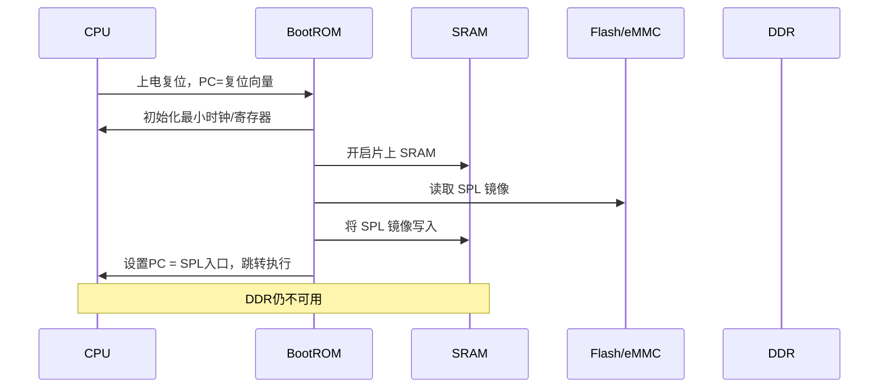
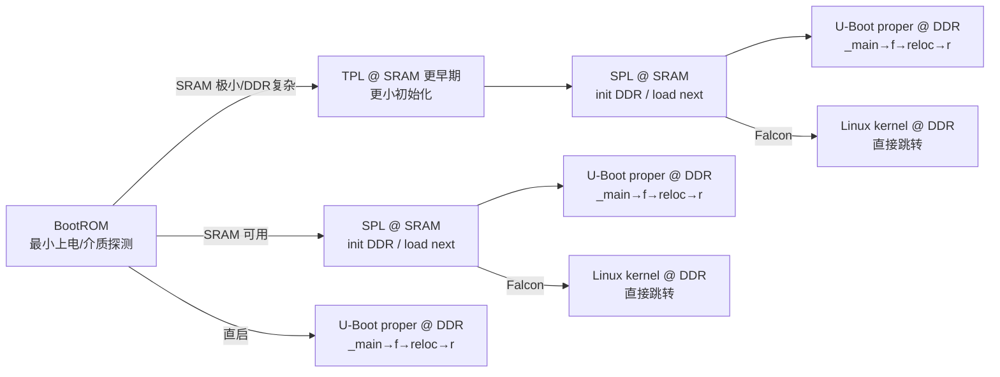
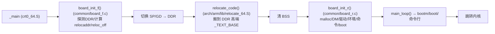
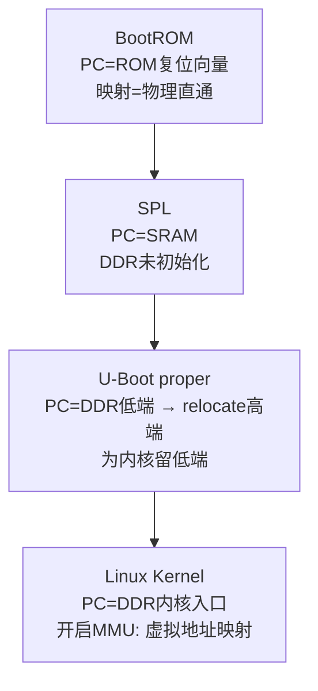
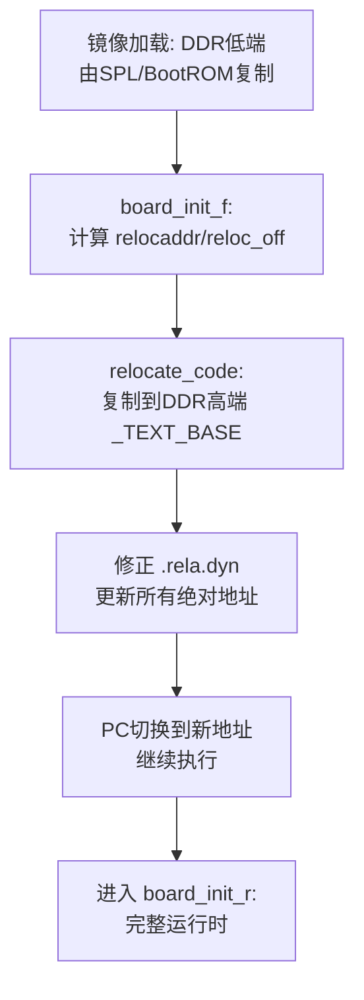
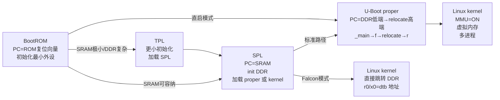
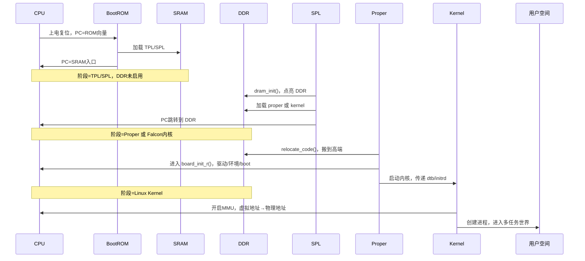
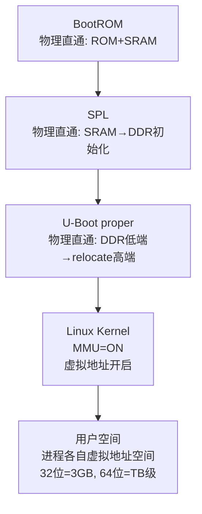

[TOC]

👌 明白了，你需要的不是“堆砌概念”，而是像一本出版的技术书那样，**叙事连贯、有层次感、夹叙夹议**。
 那我来重新写 BootROM 部分，把枯燥的笔记风格改成更像一本书的章节内容。

------

# 第一部分 BootROM：一切的起点

当处理器刚刚上电时，它的世界是一片空白。
 此时，**程序计数器（PC, Program Counter）** 并不自由，它被硬件强制指向芯片内部的一块只读存储区——这就是 **BootROM**。

BootROM 并不是我们能随意修改的代码，它是芯片厂商在流片前就已经固化好的程序。换句话说，它是硬件工程师在“设计阶段”就决定了的第一段指令。正因如此，它往往规模极小（几十 KB），但肩负的责任却很重大：为整个系统点亮第一盏灯。

------

## CPU 的视角

从 CPU 的角度看，刚复位的自己就像是个赤身裸体的旅人：

- **栈指针（SP）没有初始化**，意味着函数调用都没有保障；
- **MMU（内存管理单元）和 Cache 关闭**，只能用最原始的物理地址访问外设；
- **异常级别**（在 ARMv8 里是 EL3，在 ARMv7 里通常是 SVC/Monitor 模式）被设为最高特权，以确保能管理后续的一切资源；
- **Endian 模式**大多数情况下是小端（Little Endian），即最低位字节存在最低地址。

CPU 唯一能做的，就是乖乖地从 BootROM 取指令执行。

------

## 存储介质的视角

BootROM 眼里的世界就更具体了：

- **ROM 本身**：只读、不可改动，它提供了启动的最小程序逻辑。
- **SRAM（Static RAM，片上静态存储器）**：这是 BootROM 唯一能依靠的“可写区域”，但容量往往很小（几十 KB ~ 百 KB），足够容纳一个精简的加载器（SPL/TPL）。
- **外部存储介质**：如 NAND/NOR Flash、eMMC、SD 卡、甚至 USB、UART。BootROM 的任务就是要在这些设备里找到“真正的系统加载器”。
- **DDR（动态随机存储器）**：此时仍然沉睡，它还没有被初始化，因此 CPU 根本无法访问它。

------

## 软件逻辑的视角

如果我们用 C 代码来“假想” BootROM 的行为，大概会是这样的：

```c
void BootROM_main(void) {
    init_clock_minimal();          // 点亮最小的时钟源
    init_sram();                   // 打开片上 SRAM
    device = detect_boot_device(); // 判断是从 NAND、SD 还是其他设备启动
    load_image(device, SRAM_BASE); // 将启动镜像读到 SRAM
    jump_to(SRAM_BASE);            // 设置 PC，跳到新镜像入口
}
```

这段伪代码虽然简化了许多细节，但足以说明 BootROM 的使命：**为下一阶段装好舞台，然后把表演权交给它**。

------

## 地址空间的视角

此时的地址空间极为单纯：

- CPU 认为自己在 `0x0000_0000` 地址取指，而这个地址被硬件“映射”到了 BootROM；
- SRAM 被映射到 SoC 的某个固定基址（例如 `0x0090_0000`），用来放置加载后的 SPL；
- DDR 的基址（如 `0x8000_0000`）虽然存在，但此刻就像一片废墟，谁去访问都会陷入未知。

因此，BootROM 的首要目标就是“找到并加载下一阶段”——也就是 SPL 或直接 U-Boot proper。

------

## 过渡的视角

BootROM 的结尾就像接力赛跑时的一次交棒：

- 如果芯片的设计要求通过 SPL 过渡，那么 BootROM 就会把 SPL 搬进 SRAM，并跳转过去；
- 如果芯片足够豪爽（比如 i.MX6ULL），它甚至会直接初始化 DDR，然后把 U-Boot proper 搬进去，直接交棒给它。

从此，BootROM 就隐退幕后，舞台属于新的执行者了。

------

## 一张时序图



------

这样，BootROM 阶段既讲清了技术细节，又有叙事感，读起来不再是枯燥的“堆列表格”。

------

要不要我接下来用同样的风格写 **第二部分：SPL 阶段**？（会继续保持 CPU/存储介质/软件逻辑/地址空间/过渡 多视角分析，同时增加和 BootROM 的承接感）

好的，这一节我按“出版书籍”的连贯度来重写，专门聚焦 **SPL/TPL 的多种形态**、**TPL→SPL 的承接**、以及 **SPL→U-Boot proper / Linux** 的两条主要过渡路径。每个小节都从多视角讲清（CPU、存储介质、软件逻辑、地址空间、过渡关系），并补足关键术语解释。篇幅较长，我一次性给出完整正文，方便你直接粘到原文相应位置。

------

# 第二部分 SPL/TPL 阶段：分岔、承接与过渡

当 BootROM 把接力棒递出去之后，舞台通常不会立刻交给 U-Boot proper，而是由 **SPL（Secondary Program Loader）**，甚至在更极端的资源约束下由 **TPL（Tertiary Program Loader）** 先跑一段。SPL/TPL 的职责不是“完美地把系统初始化完”，而是**在极小的执行空间里完成决定性的突破：让 DDR 真正可用，并把下一阶段镜像正确装入 DDR，然后交棒**。

为了避免“只盯着眼前一步”，本章始终以多视角展开：CPU 执行、存储介质、软件函数/框架、地址空间，以及阶段间过渡关系。

------

## 2.0 术语速览（便于对照阅读）

- **BootROM**：片上固化的只读引导程序，上电后 CPU 首取指来源。
- **TPL**：三级加载器（Tertiary Loader）。当片上 SRAM 极小或 DDR 初始化流程复杂时，用 TPL 先完成“再小一层”的硬件准备，再加载 SPL。
- **SPL**：二级加载器（Secondary Loader）。典型职责：初始化 DDR；从外部介质加载 U-Boot proper（或直接加载内核）；然后跳转。
- **U-Boot proper（又称 U-Boot main）**：功能完整的 U-Boot。执行流程包含 `board_init_f → relocate_code → board_init_r`。
- **Falcon mode**：SPL 直接加载并跳转 Linux 内核，**绕过 U-Boot proper**（用于极短启动时间场景）。
- **PC/SP**：程序计数器/栈指针。
- **GD（global data）**：U-Boot 的全局数据结构；arm64 通常由寄存器 `x18` 指向。
- **_TEXT_BASE**：U-Boot proper 期望的最终链接/重定位基址（通常在 DDR 高端）。
- **PIE / .rela.dyn**：位置无关可执行/运行时重定位表；proper 在 `relocate_code` 时用它修正绝对地址。

------

## 2.1 启动拓扑全景（四条主线）

SPL/TPL 把“启动”这件事变成带分岔的流水线。常见四种拓扑如下：

| 拓扑 | 典型链路                                                | 适用场景                                               | 过渡关键点                                                   |
| ---- | ------------------------------------------------------- | ------------------------------------------------------ | ------------------------------------------------------------ |
| A    | BootROM → **SPL** → **U-Boot proper** → Linux           | 片上 SRAM 能容纳 SPL；DDR 需由 SPL 初始化              | SPL 的 `board_init_r` 加载 proper 到 DDR 并跳转              |
| B    | BootROM → **TPL** → **SPL** → **U-Boot proper** → Linux | 片上 SRAM 极小/DDR 训练复杂（如部分 SoC 的 3-stage）   | **TPL→SPL 承接**：TPL 先做“更早/更小”的初始化，再把更大的 SPL 拉起 |
| C    | BootROM → **SPL** → **Linux（Falcon）**                 | 强调冷启动时延，直接跳内核                             | SPL 的 `board_init_r` 加载 kernel/dtb/initrd 并按 ABI 设定寄存器后跳转 |
| D    | BootROM → **U-Boot proper** → Linux                     | BootROM 能直接初始化 DDR 并加载大型镜像（如部分 i.MX） | 无 SPL/TPL；proper 直接执行 `_main`                          |

> **提示**：不同 SoC/厂商在责任分割上会有差异，比如 **Rockchip** 往往 TPL 负责 DDR 初始化、SPL 负责加载；**STM32MP1** 一般没有 TPL；**i.MX6ULL** 可由 BootROM 直接初始化 DDR 从而跳过 SPL。本文保持“通用骨架 + 差异点标注”的写法。

------

## 2.2 统一时间线（从 BootROM 到下一阶段）

这张图把四类拓扑放到同一条时间线，标出“分岔点”和“承接点”。



------

## 2.3 TPL→SPL：为什么需要“三级”？

### CPU 视角

- **PC**：BootROM 跳到 **TPL** 的入口（SRAM）。TPL 完成最小化的电源/时钟/复位序列、少量管脚配置，尽可能**扩大可用执行空间**（如启用更大一块 SRAM 或 cache-as-SRAM）。
- 完成后，TPL 再把 **SPL** 镜像加载到目标位置（有的 SoC 仍在 SRAM，有的已能放到 DDR），然后**跳转**给 SPL。

### 存储介质视角

- 当片上 SRAM 极小或 DDR 训练本身需要一段较长/复杂流程时，**SPL 一个人塞不进 SRAM**；于是用更细的颗粒度拆分：
  - **TPL**：最小骨架；
  - **SPL**：中等骨架，负责 DDR 初始化 + 加载大镜像。

### 软件逻辑视角（伪代码）

```c
// TPL 阶段（极小）：
tpl_main() {
  very_early_clocks_pmic();
  maybe_enable_cache_as_sram();
  load_image_to_sram("SPL");
  jump_to_spl();
}
```

### 地址空间与过渡

- **TPL 在更“底层”的 SRAM 上跑**，把“跑道”修得更宽，**再让 SPL 接力**。
- 这一步的价值不在“做更多”，而在“为后续争取更大的可执行空间”。

------

## 2.4 SPL：同一名字，不同形态

### 形态一：标准 SPL（最常见）

- **CPU 视角**：PC 在 **SRAM**；`dram_init()` 成功后，SPL 会把下一阶段镜像放到 **DDR**。
- **存储介质**：支持 eMMC/SD、NAND、SPI-NOR/-NAND、USB/UART 下载等。
- **软件逻辑**：`common/spl/spl.c` 中的 **SPL 版 `board_init_r`** 负责：
  1. `spl_board_init()`（__weak，可板级覆盖）
  2. `spl_boot_device()` 选择介质
  3. `spl_load_image_*()` 读取镜像（U-Boot proper 或 Kernel）到 **DDR**
  4. `jump_to_image_*()` 跳转
- **地址空间**：**SPL 代码一直在 SRAM**；可选用 `spl_relocate_stack_gd()` 把 **SP/GD** 迁到 DDR（仅数据迁移，非代码搬运）。

### 形态二：Falcon mode（SPL 直接跳内核）

- **CPU 视角**：仍在 SRAM 执行 SPL；最后一跳跳到 DDR 中的 **Linux 内核入口**。
- **软件逻辑**：SPL 装载 **kernel + dtb（+ initrd）**，设置寄存器/参数：
  - ARMv7：`r0=0`、`r1=机器码/保留`、`r2=dtb`;
  - ARMv8：`x0=FDT 指针`（常见约定）；
     然后 `jump_to_image_linux()`。
- **优点**：冷启动时间极短。**缺点**：失去 U-Boot 的交互、升级、网络调试等能力。

### 形态三：无 SPL（BootROM 直启 proper）

- **某些 SoC**（例如 i.MX6ULL 的常见配置）中，BootROM 自己能把 DDR 初始化并**直接**把 U-Boot proper 搬进 DDR。
- **SPL 消失**，拓扑变为：BootROM → proper。

> **注意**：无论哪种形态，**SPL 的代码本身通常不做“代码重定位”**，它始终在 SRAM 中取指执行；“重定位”是 U-Boot proper 的事。

------

## 2.5 SPL→U-Boot proper：接力细节

这一节把“从 SPL 跳到 proper”的关键步骤拆开讲清。

### CPU 视角

- **跳转前**：PC 在 **SRAM**；SP/GD 可能在 **SRAM** 或（如果你调用了 `spl_relocate_stack_gd()`）已经在 **DDR**。
- **跳转动作**：SPL 调 `jump_to_image_noargs()`（或对应函数），**把 PC 改为 DDR 中 U-Boot proper 镜像的入口**。
- **跳转后**：CPU 从 DDR 取指，进入 proper 的 `_main`（arm64：`arch/arm/lib/crt0_64.S` 非 SPL 分支）。

### 存储介质视角

- SPL 将 **U-Boot proper** 放到 DDR 的一个“临时可运行地址”（常在 DDR 低端）。
- proper 启动后会 `relocate_code()` 自己搬到 **DDR 高端 `_TEXT_BASE`**，为 **内核/设备树/initrd** 留出低端连续空间（这点你前面提过，我在这里与实际过渡连起来）。

### 软件逻辑视角（SPL 端）

```c
void spl_board_init_r(void) {         // common/spl/spl.c 中的 SPL版 board_init_r
  spl_init();
  spl_board_init();                   // __weak, 板级可覆盖
  dev = spl_boot_device();            // 选介质
  load = spl_load_image(dev);         // 读取 proper 到 DDR
  jump_to_image_noargs(load);         // 跳到 DDR 里的 proper 入口
}
```

### 地址空间与过渡

- **过渡瞬间**，PC 从 “SRAM 指令” 切换为 “DDR 指令”。
- proper 随后进行 `board_init_f → 切栈/切 gd → relocate_code → 清 BSS → board_init_r` 的完整自举；这正是你想要的“接力的连贯性”。

------

## 2.6 SPL→Linux（Falcon）：另一条“快车道”

当 SPL 走 Falcon mode 时，它不加载 proper，而是**直接**加载 **Kernel + DTB（+ initrd）** 到 DDR，并设置约定的寄存器参数后跳转。

- **ARMv7** 常见：`r0 = 0`，`r1 = machine_type 或保留`，`r2 = dtb 地址`
- **ARMv8** 常见：`x0 = dtb 地址`
- **MMU/Cache**：通常在这个时刻保持一致的、简单的状态（具体按平台移植要求），避免内核入场后第一时间就遇到缓存一致性/映射假设不符的问题。
- **优缺点**：极致的启动速度，但失去 U-Boot 的交互性、可运维性和可恢复性（需要谨慎使用）。

------

## 2.7 多视角对照表（TPL/SPL/Proper/Falcon）

| 维度           | **TPL**                       | **SPL（标准）**                             | **SPL（Falcon）**      | **U-Boot proper**                       |
| -------------- | ----------------------------- | ------------------------------------------- | ---------------------- | --------------------------------------- |
| **PC 取指**    | SRAM                          | SRAM                                        | SRAM                   | DDR                                     |
| **SP/GD**      | SRAM（极少数会迁）            | SRAM，或 `spl_relocate_stack_gd()` 迁至 DDR | 同左                   | DDR（`board_init_f` 规划并切换）        |
| **DDR 初始化** | 可能做（Rockchip TPL 常负责） | 常由 SPL 做                                 | 常由 SPL 做            | 已经可用                                |
| **镜像加载**   | 加载 SPL                      | 加载 proper                                 | 加载 kernel/dtb/initrd | 加载 kernel/dtb/initrd（常在 r 阶段）   |
| **是否重定位** | 否                            | 否                                          | 否                     | **是**（`relocate_code` 搬到 DDR 高端） |
| **阶段目标**   | 让 SPL 能跑                   | 让 proper 能跑                              | 让 Linux 能跑          | 构建完整运行时 + 引导 OS                |

------

## 2.8 典型易错点与排障提示

- **DDR 训练/时序有误**：SPL 读写 DDR 不稳定 → proper 启动随机崩溃。
  - **建议**：优先用厂商参考时序；在 SPL 加一段 DDR 内存自检；先关 Cache 做裸测。
- **SPL 栈/镜像覆盖**：把 proper 加载地址放得过低，覆盖了 SPL 的栈或数据。
  - **建议**：画出 SRAM/DDR 的占用示意图；为“加载区/栈区/保留区”留足 margin。
- **Falcon 参数不对**：传递给内核的寄存器值（dtb 指针等）错误或 Cache 未刷干净。
  - **建议**：在跳转前统一清/刷 D-cache；核对 ABI 约定；先用 U-Boot proper 验证 kernel/dtb 的可用性。
- **映像格式/校验**：FIT/legacy 头解析错误。
  - **建议**：在 SPL 打开最小控制台输出；把 `spl_load_image_*` 的路径跑通。

------

## 2.9 承接关系总览图（带关键职责）

```mermaid
flowchart LR
  subgraph TPL["TPL（SRAM）"]
    T0["极小初始化<br>clocks/pmic/pinmux<br>cache-as-SRAM(可选)"] --> T1["加载 SPL→SRAM/DDR"]
    T1 --> T2["跳转 SPL"]
  end

  subgraph SPL["SPL（SRAM）"]
    S0["dram_init()<br>点亮 DDR"] --> S1["spl_board_init()（板级可覆盖）"]
    S1 --> S2["选择介质：spl_boot_device()"]
    S2 --> S3["加载镜像：spl_load_image_*()<br>→ DDR"]
    S3 --> S4{"下一阶段？"}
    S4 -->|U-Boot proper| S5["jump_to_image_noargs()<br>PC→DDR: proper入口"]
    S4 -->|"Linux (Falcon)"| S6["jump_to_image_linux()<br>设置寄存器/传dtb"]
  end

  subgraph PROPER["U-Boot proper（DDR）"]
    P0["_main @ crt0_64.S（非SPL）"] --> P1["board_init_f()<br>规划 new SP/GD/relocaddr/reloc_off"]
    P1 --> P2["切换到新SP/GD（DDR）"]
    P2 --> P3["relocate_code()<br>搬到DDR高端 _TEXT_BASE<br>修正 .rela.dyn & LR"]
    P3 --> P4["清 BSS"]
    P4 --> P5["board_init_r()<br>malloc/DM/驱动/环境/命令/引导 OS"]
  end

  T2 --> S0
  S5 --> P0
```



------

### 小结（把分岔讲成“连续的路”）

- **TPL** 是“更小的铲刀”，把地基的最初几铲挖开；
- **SPL** 是“临时便桥”，用极少的空间完成 DDR 的点亮与镜像搬运；
- **U-Boot proper** 接过来，在 DDR 的大舞台上把系统“完整搭好”；
- 某些场景下，**SPL 可直接把执行权给 Linux（Falcon）**，这是一条强调启动速度的快车道；
- 对于 “BootROM 能直启 proper” 的 SoC，这座便桥（SPL）可以省略，但**proper 的自举（relocation）仍然是必须的**。

> 从现在开始，舞台的主角切换为 **U-Boot proper**。接下来的一章，我们会像读流程剧本那样，顺序跟着 `_main → board_init_f → relocate_code → board_init_r`，同时保持“CPU/存储/软件/地址/过渡”的多视角，不再让你在不同文件之间来回“找线索”。

好的 ✅
 我们继续进入 **第三部分：U-Boot proper 阶段**。这部分是整个引导流程的“正戏”，需要把 **_main → board_init_f → relocate_code → board_init_r** 这条路径讲清楚，并像前两章一样，分别从 **CPU / 存储介质 / 软件逻辑 / 地址空间 / 阶段过渡** 五个维度分析。最后还要点明为什么要“搬家”（relocate），以及 proper 的 r 阶段和 SPL 的 r 阶段有何本质不同。

------

# 第三部分 U-Boot proper 阶段：舞台中央的登场

当 SPL 把接力棒交出去，或者 BootROM 直接把镜像装载到 DDR 时，CPU 的 PC 已经跳进了 **U-Boot proper** 的入口点。这里开始的所有工作，不再是“极简求生”，而是要构建一个可以引导操作系统的**完整运行时环境**。

U-Boot proper 的启动链条可以用一句话概括：

**`_main → board_init_f → 切换SP/GD → relocate_code → 清BSS → board_init_r`**

------

## 3.1 CPU 的视角：第一次在 DDR 上取指

- **入口点**：`arch/arm/lib/crt0_64.S`（arm64）。
- **PC**：此时已经在 **DDR**，执行 `_main`（非 SPL 分支）。
- **SP（栈指针）/GD（global data）**：
  - 最初可能还指向 SPL 为它预留的值；
  - proper 的 f 阶段会重新计算新的栈/新的 gd 地址，并切换。
- **异常级别**：仍然是最高特权级（EL3/EL2），但 proper 可以根据配置决定是否降级到 EL2/EL1 执行。
- **MMU/Cache**：通常仍关闭，proper 会在后续合适时机开启。

这意味着：CPU 已经从“短跑选手”转身成了“舞台中央的演员”，可以自由支配整个 DDR。

------

## 3.2 存储介质的视角

- **DDR**：此刻已经成为主舞台。U-Boot proper 的镜像被 SPL/BootROM 装载在 DDR 的某个低地址区。
- **SRAM**：SPL 还留在那里，但 CPU 已不再执行它；SPL 的任务已经完成。
- **外部存储**：proper 会在 r 阶段再初始化驱动，以便访问 eMMC/SD/NAND/USB/网卡，最终找到并加载 **内核镜像、设备树、initrd**。
- **Flash/eMMC/NAND**：此时 proper 可以用更完整的驱动来访问它们，而不仅仅是 SPL 那套极简接口。

------

## 3.3 软件逻辑的视角

U-Boot proper 的启动流程由 **crt0 → f 阶段 → relocate → r 阶段** 构成。我们逐个来看：

### 3.3.1 `_main`（crt0_64.S）

- 设置初始栈。
- 为 f 阶段分配并初始化 gd。
- 调用 `board_init_f(0)`。

### 3.3.2 `board_init_f`（common/board_f.c）

- **核心任务**：在“受限环境”里，完成内存探测、重定位地址计算、未来栈/gd 地址规划。
- 常见步骤：
  - `board_early_init_f()` → 板级时钟/管脚/串口。
  - `dram_init()` → 填写 `gd->ram_size`。
  - 写入 `gd->relocaddr`（目标搬家地址，DDR 高端）。
  - 写入 `gd->reloc_off`（运行时和链接时的偏移差）。

### 3.3.3 切换 SP/GD

- `_main` 会读取 `gd->start_addr_sp` 和 `gd->new_gd`，把栈指针和 gd 迁移到 DDR。

### 3.3.4 `relocate_code`（arch/arm/lib/relocate_64.S）

- 把 U-Boot proper 自己从 **DDR 低端的临时装载位置** 搬运到 **DDR 高端 `_TEXT_BASE`**。
- 使用 `.rela.dyn` 表修正所有涉及绝对地址的指针/符号。
- 更新 LR（返回地址），保证跳回 relocate 之后的 C 环境。

### 3.3.5 清 BSS

- 将 `.bss` 段全部清零，保证未初始化全局变量有正确值。

### 3.3.6 `board_init_r`（common/board_r.c）

- **核心任务**：进入“完整 C 运行时环境”。
- 常见步骤：
  - `c_runtime_cpu_setup()`
  - 初始化 malloc 区 (`initr_malloc()`)
  - 设备模型 (`initr_dm()`)
  - 外设驱动（MMC/NAND/USB/网卡）
  - 环境变量加载
  - 控制台初始化（串口/USB-serial）
  - `board_late_init()`（板级扩展）
  - `main_loop()` → 命令行 / 自动引导内核

> **注意**：这里的 `board_init_r` 与 SPL 的 `board_init_r` 不是同一个逻辑，虽然名字一样。SPL 的 r 阶段是“relay（接力棒）”，而 proper 的 r 阶段是“runtime（完整运行时）”。

------

## 3.4 地址空间的视角

Proper 阶段的地址空间布局变化是一个“搬家”的故事：

1. **初始**：镜像被 SPL 放到 DDR 低端临时地址。
2. **f 阶段**：计算目标位置（通常 DDR 高端 `_TEXT_BASE`）。
3. **relocate_code**：把自己搬到 DDR 高端。
4. **r 阶段**：在 DDR 高端运行，低端 DDR 则留给内核镜像、设备树、initrd。

CPU 眼中的物理地址始终是统一的，但 proper 用 relocation 把“程序逻辑地址”与“最终物理地址”对应了起来。

------

## 3.5 过渡的视角（U-Boot proper → 内核）

到这里，proper 的运行时已经完整：

- 它有了 malloc、驱动、环境变量、命令行；
- 它能访问外部存储，找到 **Linux kernel、设备树（dtb）、initrd**；
- 它能通过环境变量和命令行参数决定是进入命令行交互，还是直接自动启动。

最终，proper 会调用 `bootm` / `bootz` / `booti` 等命令，把内核、设备树、initrd 搬到内存合适位置，设置 CPU 寄存器参数，然后通过 `kernel_entry()` 跳转，**把控制权交给操作系统内核**。

------

## 3.6 为什么要搬家（relocate）？

这是很多人初学时的疑问：既然 SPL 已经把 proper 放进 DDR，为什么不一开始就放到最终位置？

**原因主要有三点**：

1. **BootROM/SPL 限制**：很多 SoC 的 BootROM/SPL 在加载镜像时，只支持从某个地址开始的连续搬运，不能灵活选择 DDR 高端。
2. **灵活性**：通过 relocate，U-Boot proper 可以“位置无关”，更容易适配不同大小的 DDR/不同板型。
3. **为内核留空间**：DDR 低端需要为 kernel、dtb、initrd 预留连续空间，把 proper 搬到高端后，这些空间就空出来了。

------

## 3.7 总览图（U-Boot proper 内部流程）



------

## 3.8 小结

- **CPU 视角**：第一次在 DDR 上取指，逐步完善执行环境。
- **存储介质视角**：proper 在 DDR 高端安家，把 DDR 低端留给内核镜像。
- **软件逻辑视角**：完整流程 `_main → f → relocate → r`，最终进入 `main_loop`。
- **地址空间视角**：relocate 是 proper 的核心，使其位置无关、为内核留空间。
- **过渡关系**：proper 的使命就是“构建一个完整运行时环境，把接力棒交给操作系统内核”。

------

要不要我接下来再写 **第四部分：CPU 地址空间与内存管理**（专门解释 PC/总线地址/物理内存/虚拟地址在 BootROM→SPL→proper→Kernel 各阶段的对应关系）？

好的 ✅ 那我们进入 **第四部分：CPU 地址空间与内存管理**。
 这一节是很多人最迷惑的地方：**CPU 看到的地址和实际存储介质的关系**，以及为什么要引入 **MMU / LPAE / 用户空间**。我会分阶段（BootROM → SPL → U-Boot proper → Linux Kernel），同时保持 **CPU 执行视角 / 存储介质视角 / 地址转换机制 / 过渡关系** 的多维度分析，写成书籍式的连贯叙述。

------

# 第四部分 CPU 地址空间与内存管理

## 4.1 CPU 的世界观：统一的“总线地址”

对 CPU 来说，它的世界从来只有一个：**一维的线性地址空间**。
 当你在汇编里写 `ldr x0, [0x80000000]` 时，CPU 并不知道那是 DDR、SRAM 还是外设寄存器。

真正决定含义的是 **总线地址映射**：

- 地址范围 A → 映射到 BootROM
- 地址范围 B → 映射到 SRAM
- 地址范围 C → 映射到 DDR
- 地址范围 D → 映射到外设寄存器（UART、GPIO、GIC 等）

CPU 只是发出“我要访问某个地址”的请求，SoC 内部的 **总线/互联 (interconnect)** 负责把请求路由到合适的存储器或外设。

------

## 4.2 BootROM 阶段：最原始的物理映射

- **CPU 视角**：
  - PC = 固定复位向量（通常 `0x00000000` 或手册指定地址）。
  - 取指令时，这个地址被映射到 **BootROM**。
- **存储介质**：
  - 只能看到 ROM（只读）、SRAM（可写），DDR 还不可用。
  - 外设寄存器也部分可用（时钟控制、复位控制器）。
- **地址映射**：**无 MMU，物理直通**。
- **过渡**：BootROM 把 SPL 搬到 SRAM，PC 跳转过去。

------

## 4.3 SPL 阶段：片上内存到外部内存的跨越

- **CPU 视角**：
  - PC 在 SRAM；SP 也在 SRAM。
  - DDR 地址虽然存在（如 `0x80000000`），但此时访问会失败或读出垃圾。
- **存储介质**：
  - SPL 调用 `dram_init()` → 通过 DDR 控制器配置时序参数，DDR 才真正可用。
- **地址映射**：依然是物理直通。
- **关键过渡**：一旦 DDR 初始化成功，SPL 就能把更大镜像（U-Boot proper 或 Linux 内核）搬到 DDR，并跳转过去。

------

## 4.4 U-Boot proper 阶段：搬家与地址空间规划

- **CPU 视角**：
  - PC 已经在 DDR 低端（proper 镜像初始加载点）。
  - `board_init_f` 会计算 DDR 高端 `_TEXT_BASE`，proper 在 `relocate_code` 把自己搬到高端。
- **存储介质**：
  - DDR 低端被留空，用于加载内核、设备树、initrd。
  - DDR 高端安置 U-Boot proper 本身。
- **地址映射**：依旧是物理直通（MMU 通常关闭）。
- **过渡**：proper 在 DDR 高端运行，最终通过 `bootm/booti` 把内核搬到 DDR 低端连续空间，准备跳转。

------

## 4.5 Linux Kernel 阶段：MMU 与虚拟内存的登场

到了内核，情况彻底改变了。

- **CPU 视角**：
  - 打开 **MMU（内存管理单元）**。
  - CPU 不再直接使用物理地址，而是通过 **页表（page table）** 将虚拟地址映射到物理地址。
- **存储介质**：
  - DDR 的不同物理区域，被映射到内核虚拟空间（通常高地址段）和用户虚拟空间（通常低地址段）。
- **地址映射机制**：
  - **32 位 ARM（ARMv7）**：虚拟地址空间 4GB。常见划分：
    - 3GB → 用户空间
    - 1GB → 内核空间
  - **ARMv7 LPAE（Large Physical Address Extension）**：页表扩展到 40 位，物理地址空间可达 1TB，但虚拟地址仍是 32 位（4GB）。
  - **ARMv8（AArch64）**：虚拟地址空间 48 位，物理地址空间 40~52 位，远超 DDR 实际容量。
- **过渡**：用户态程序被隔离在各自 3GB 空间里，内核态共享高端 1GB；大进程（如游戏）虽然单个进程不能超过 3GB，但可以通过 **多进程 + IPC** 协同利用更多 DDR。

------

## 4.6 全景对照表：四阶段的 CPU 地址空间

| 阶段          | CPU PC 位置          | 栈 (SP)              | 地址映射                | 可用存储器          | 是否有 MMU |
| ------------- | -------------------- | -------------------- | ----------------------- | ------------------- | ---------- |
| BootROM       | ROM 复位向量         | 未初始化/片上寄存器  | 物理直通                | ROM + 少量 SRAM     | 否         |
| SPL           | SRAM                 | SRAM                 | 物理直通                | SRAM + 初始化后 DDR | 否         |
| U-Boot proper | DDR 低端 → 搬至高端  | DDR                  | 物理直通                | DDR + 外设寄存器    | 否（默认） |
| Linux Kernel  | DDR，PC=kernel_entry | DDR（内核栈/用户栈） | **虚拟地址 → 物理地址** | DDR + 外设          | **是**     |

------

## 4.7 过渡的宏观图



------

## 4.8 小结

- **CPU 的世界只有一个线性地址空间**，但不同阶段对这个空间的解释不同。
- **BootROM/SPL/U-Boot proper**：都运行在物理直通模式下，CPU 地址 = 物理总线地址。
- **Linux 内核**：开启 MMU，把地址翻译成虚拟空间，用户空间和内核空间分隔。
- **LPAE/ARMv8**：解决了 32 位 CPU 物理寻址超过 4GB 的限制，使大容量 DDR 可被利用。

> **一句话总结**：BootROM 和 SPL 让 CPU 从“只能看见一小片地”逐渐打开 DDR，U-Boot proper 在 DDR 里安家并为内核腾出舞台，而内核最终接管一切，通过 MMU 把这片物理土地划分成虚拟空间，交给成千上万个进程各自使用。

------

要不要我接着写 **第五部分：Relocation 机制**（详细解释 `.rela.dyn`、PIE、为什么要重定位、如何修正地址），并结合我们前面分析的 crt0_64.S 代码？

好的 ✅，那我们进入 **第五部分：Relocation 机制**。
 这一部分是 U-Boot proper 阶段里最容易让人困惑、但也是最精彩的地方。我们要解释清楚：

- 为什么要搬家（relocate）？
- 什么是 `.rela.dyn`？
- PIE（位置无关可执行）和重定位的区别？
- U-Boot 在 `crt0_64.S` 里是怎么做的？
- 从 CPU / 存储介质 / 软件逻辑 / 地址空间 / 过渡 的多维度来观察 relocation。

------

# 第五部分 Relocation 机制：U-Boot 的搬家艺术

## 5.1 为什么要搬家？

SPL 把 U-Boot proper 镜像从存储介质搬进 DDR 时，通常放在 DDR 的 **低端临时地址**。这么做有两个原因：

1. **BootROM/SPL 的局限性**：很多 BootROM/SPL 只能简单地把镜像加载到固定地址，往往是 DDR 的低端起始地址，不能直接加载到 DDR 高端。
2. **方便性**：DDR 低端连续空间较大，不需要过多计算，可以保证镜像完整装下。

但真正运行时，U-Boot proper 希望**住在 DDR 高端**：

- 低端 DDR 要留给 **Linux kernel、设备树（dtb）、initrd**，它们需要连续大块空间。
- 把 U-Boot proper 搬到高端，不仅节省空间，还能保证地址稳定。

因此，**relocate 的核心目标就是：把 U-Boot proper 从 DDR 低端搬到 DDR 高端，并修正所有绝对地址引用**。

------

## 5.2 CPU 的视角

- **搬家前**：PC 在 DDR 低端（SPL 放置的临时地址）。
- **搬家动作**：执行 `relocate_code()`，逐段复制自己（text/data 段）到 DDR 高端 `_TEXT_BASE`。
- **搬家后**：PC 改为 DDR 高端地址，所有绝对引用修正完成。

CPU 自己并不“懂搬家”，它只是逐条执行指令。真正做“复制 + 修正”的，是 relocation 代码。

------

## 5.3 存储介质的视角

- **DDR 低端**：存放了 SPL 搬过来的 U-Boot proper 镜像，像是一个“临时工棚”。
- **DDR 高端**：搬家后的目标位置，正式的 U-Boot proper 落脚点。
- **外部存储**：此时不再参与，relocation 完全发生在 DDR 内部。

所以 relocation 其实是 **DDR 内部的自我复制**，不是外部介质参与。

------

## 5.4 软件逻辑的视角

Relocation 的软件过程分为两部分：**复制** 和 **修正**。

### 5.4.1 复制代码

`arch/arm/lib/relocate_64.S` 做的第一件事，就是把 U-Boot proper 的 `.text`、`.data` 段从临时地址复制到 `_TEXT_BASE`（高端目标地址）。

### 5.4.2 修正地址

U-Boot 被编译成 **PIE（位置无关可执行）**，但并不是所有符号都能用 PC 相对寻址解决。比如：

- 全局变量的绝对地址引用；
- 某些跳转表、函数指针表。

这些需要在运行时修正，依赖 **.rela.dyn** 段：

- `.rela.dyn`：ELF 的“重定位表”，记录了所有需要修正的符号位置和修正方式。
- `crt0_64.S` 的 `pie_fixup` 循环会逐条处理 `.rela.dyn`，加上运行地址与链接地址的偏移量（`gd->reloc_off`），写回修正后的值。

### 5.4.3 伪代码

```c
void relocate_code(unsigned long new_base, gd_t *gd) {
    copy_to_new_base(); // 把自己搬到 DDR 高端
    for (entry in .rela.dyn) {
        if (entry.type == R_AARCH64_RELATIVE) {
            *entry.dest = entry.addend + gd->reloc_off;
        }
    }
}
```

------

## 5.5 地址空间的视角

Relocation 过程中的地址空间变化：

1. **加载时**：镜像在 DDR 低端（如 `0x8020_0000`）。
2. **f 阶段**：`board_init_f` 计算 `_TEXT_BASE`（如 `0x8FF0_0000`）。
3. **relocate_code**：把自己搬到 `_TEXT_BASE`。
4. **修正 .rela.dyn**：保证所有绝对符号引用指向新地址。
5. **r 阶段**：在高端 DDR 正常运行。

------

## 5.6 过渡的视角

Relocation 是 U-Boot proper 的“成人礼”：

- SPL 把它放进 DDR，就像把孩子放进托儿所。
- proper 自己搬到 DDR 高端，才算真正“安家落户”。
- 这一步之后，它才有资格扮演“系统引导者”的角色。

------

## 5.7 总览图：relocation 机制



------

## 5.8 小结

- **为什么搬家？** → 因为 BootROM/SPL 只能放低端，而内核需要低端空间，proper 必须搬到高端。
- **怎么搬？** → `relocate_code()` 把自己复制过去，并用 `.rela.dyn` 修正符号。
- **和 PIE 的关系？** → PIE 让大部分代码能 PC 相对执行，但仍需 relocation 来修正绝对符号。
- **结果？** → U-Boot proper 在 DDR 高端运行，低端空出来，准备交给内核。

> 可以把 relocation 理解为 **U-Boot 的“归位”动作**：它先随便坐下（DDR 低端），然后站起来走到属于自己的座位（DDR 高端），最后调整桌椅位置（修正符号），准备好迎接真正的工作。

------

要不要我接下来写 **第六部分：总览总结**（把 BootROM、TPL、SPL、Proper、Kernel 的过渡关系，做成一张完整流程图 + 一张表格 + 简明文字总结），形成“全流程速查”？

好的 ✅ 那我们来写 **第六部分：总览总结**。
 这一节的目标是：把之前分散在 BootROM → TPL → SPL → U-Boot proper → Kernel 的分析收束起来，形成 **全景鸟瞰**。既有 **流程图**、**对照表**，也有简明叙述，方便速查。

------

# 第六部分 总览总结：从上电到内核的全程接力

## 6.1 一句话总览

当 SoC 上电时，CPU 从 BootROM 取第一条指令；随后经过 **TPL/SPL** 在狭窄的 SRAM 里挣扎着点亮 DDR；再交给 **U-Boot proper** 在 DDR 高端安家；最后把舞台交给 **Linux 内核**。
 这是一场典型的“接力赛”：

- **BootROM**：守门人，点亮最小硬件，装载下一棒；
- **TPL/SPL**：临时桥梁，在有限 SRAM 中完成 DDR 初始化和镜像搬运；
- **U-Boot proper**：全功能加载器，在 DDR 中完成自举（relocation），提供驱动/命令/环境；
- **Kernel**：真正的系统核心，接手所有资源，开启虚拟内存和多进程。

------

## 6.2 全流程图



------

## 6.3 对照表：阶段特征速览

| 阶段    | PC取指位置        | 栈 (SP)             | 关键任务                                     | 地址映射         | 是否Relocate | 谁交棒给谁         |
| ------- | ----------------- | ------------------- | -------------------------------------------- | ---------------- | ------------ | ------------------ |
| BootROM | ROM 复位向量      | 未初始化/少量SRAM   | 初始化最小硬件，加载 TPL/SPL/proper          | 物理直通         | 否           | → TPL/SPL/proper   |
| TPL     | SRAM 极小空间     | SRAM                | 极简 DDR 预处理，加载 SPL                    | 物理直通         | 否           | → SPL              |
| SPL     | SRAM              | SRAM（可选迁到DDR） | DDR 初始化，加载 proper 或 kernel            | 物理直通         | 否           | → Proper 或 Kernel |
| Proper  | DDR 低端→搬到高端 | DDR                 | f 阶段规划 + relocate + r 阶段驱动/命令/boot | 物理直通         | **是**       | → Kernel           |
| Kernel  | DDR（内核入口）   | DDR 用户/内核栈     | 打开MMU，虚拟地址管理，多进程                | **虚拟地址映射** | N/A          | → 用户进程         |

------

## 6.4 时间线总览



------

## 6.5 关键过渡点回顾

1. **BootROM → SPL/TPL**：从片上 ROM 跳到 SRAM；第一次进入“用户可编译代码”。
2. **TPL → SPL**：极端情况下的三级承接，给 SPL 腾执行空间。
3. **SPL → Proper**：SPL 完成 DDR 初始化，把 proper 装到 DDR 并跳转；或者 Falcon 模式直接跳内核。
4. **Proper → Kernel**：Proper 完成 relocate，把自己放到 DDR 高端，再调用 boot 命令，交棒给内核。
5. **Kernel → 用户空间**：内核打开 MMU，把物理内存划分成虚拟地址空间，交给用户进程。

------

## 6.6 小结

- 整个启动过程是一场“逐级扩展执行空间”的接力：
  - **BootROM**：只靠 ROM 和少量 SRAM；
  - **SPL/TPL**：靠 SRAM 点亮 DDR；
  - **Proper**：在 DDR 完整展开自己；
  - **Kernel**：开启虚拟地址和进程隔离，进入真正的 OS 世界。
- Relocation 是 Proper 的关键仪式，让它从 DDR 低端搬到高端，为内核预留舞台。
- 用户空间的多进程世界，最终是建立在 BootROM 开出的那条最小引导之路上。

------

👉 到这里，我们就有了一份 **BootROM → TPL/SPL → Proper → Kernel** 的 **全流程总结**。
 要不要我接下来写 **第七部分：内存管理延伸**（解释 32 位大应用如何突破 3GB 限制，LPAE、ARMv8 的地址空间设计，结合游戏/大应用场景）？

好的 ✅ 那我们进入 **第七部分：内存管理延伸**。
 这一部分更贴近应用层和系统层，解释 **32 位系统下大应用如何应对 3GB 限制**，以及 **LPAE / ARMv8 的扩展**。我会保持书籍式叙述，夹叙夹议，把“为什么这么设计”和“对应用开发者意味着什么”说透。

------

# 第七部分 内存管理延伸：突破 4GB 的围墙

## 7.1 问题的起点：32 位 CPU 的 4GB 天花板

在 32 位 ARM（ARMv7）处理器上，**地址寄存器宽度是 32 位**，这意味着 CPU 能表达的虚拟地址最多就是 `2^32 = 4GB`。
 从 CPU 的角度，这 4GB 就是它的整个世界。

但操作系统不会把这 4GB 全都交给用户程序使用：

- 通常划分为 **3GB 用户空间 + 1GB 内核空间**（有时是 2GB+2GB）。
- 这样保证内核能随时访问自己的地址，而用户态进程被隔离在低端 3GB。

这意味着：**单个进程最多只能直接看到 3GB 内存**。

对于普通嵌入式应用，这已经绰绰有余；但当游戏引擎、浏览器、数据库这样的“大型进程”登场时，3GB 的围墙就成了限制。

------

## 7.2 游戏/大应用如何在 32 位系统下生存？

大型应用程序并不会“强行塞进一个 3GB 的盒子”，而是通过多种机制来突破限制：

### 7.2.1 多进程 + IPC

- 把大任务拆成多个进程：渲染进程、逻辑进程、网络进程…
- 每个进程独享自己的 3GB 虚拟空间。
- 它们通过 **IPC（进程间通信，Inter-Process Communication）** 来协作，例如共享内存、消息队列、管道、Socket。
- 游戏引擎和浏览器的多进程架构，本质就是对 32 位内存限制的绕行。

### 7.2.2 内存映射（mmap / 文件映射）

- 程序不需要一次性把所有数据加载到内存。
- 大型资源（纹理、音频、地图）可以映射成文件，需要时才分页加载。
- 这样即使资源总量超过 3GB，也能分批使用。

### 7.2.3 PAE/LPAE 支持

- 在支持 **PAE（Physical Address Extension，x86）** 或 **LPAE（Large Physical Address Extension，ARMv7）** 的系统上：
  - 虚拟地址仍然是 32 位（4GB），单进程仍然只有 3GB 用户空间。
  - 但物理地址扩展到 36/40 位，可以让多个进程合计使用大于 4GB 的 DDR。
  - 内核通过页表切换，把不同进程映射到不同的物理页。

总结一句：**单进程受限，多进程合力突破**。

------

## 7.3 LPAE：让 32 位 CPU 看见大内存

ARMv7 LPAE（Large Physical Address Extension）是 ARM 在 32 位平台上引入的“打补丁”的办法。

- **虚拟地址宽度**：仍然 32 位 → 每个进程最多 4GB 虚拟空间。
- **物理地址宽度**：扩展到 40 位 → 可寻址 1TB 物理内存。
- **页表变化**：三级页表，表项变宽（64 位），记录更大的物理页帧号。

效果就是：

- 系统可以同时利用大于 4GB 的物理 DDR；
- 但每个进程仍然局限在 4GB 虚拟空间里。

因此，**LPAE 的价值是“支持大系统的多任务”，而不是“让单个进程突破 3GB”。**

------

## 7.4 ARMv8：全面进入 64 位世界

ARMv8（AArch64）真正解决了这个问题：

- **虚拟地址宽度**：常见实现是 48 位 → 可寻址 256TB 虚拟空间。
- **物理地址宽度**：40~52 位 → 可寻址 1TB ~ 4PB 物理空间。
- **用户/内核空间划分**：
  - 用户进程常见虚拟空间 = 128TB
  - 内核虚拟空间 = 128TB
- **效果**：单进程可以轻松使用数十 GB 甚至上 TB 的内存，足够大型游戏/数据库引擎自由发挥。

这也是为什么 Android 在 5.0 之后逐渐要求 **64 位 SoC**，因为 32 位的 3GB 限制已经成为瓶颈。

------

## 7.5 CPU/软件/存储介质/地址空间四维对照

| 架构            | 虚拟地址宽度 | 单进程上限    | 物理地址上限 | 技术点                  | 应用对策            |
| --------------- | ------------ | ------------- | ------------ | ----------------------- | ------------------- |
| ARMv7（无LPAE） | 32 位 (4GB)  | ~3GB 用户空间 | 4GB          | 无扩展                  | 多进程 + IPC        |
| ARMv7 LPAE      | 32 位 (4GB)  | ~3GB 用户空间 | 1TB          | 40 位物理寻址，三级页表 | 多进程 + 大系统支持 |
| ARMv8 AArch64   | 48 位 (常见) | 数十 TB       | 1TB ~ 4PB    | 64 位虚拟/物理寻址      | 单进程可用超大内存  |

------

## 7.6 时间线对照：从 BootROM 到用户空间



------

## 7.7 小结

- **32 位系统的 3GB 限制**，本质来自于虚拟地址空间的上限。
- **大型应用在 32 位系统中**，通过 **多进程架构 + IPC + 内存映射** 来规避瓶颈。
- **LPAE**：让系统能使用大于 4GB 的物理内存，但**单进程仍然受限**。
- **ARMv8（64 位）**：彻底打破限制，单进程也能直接访问数十 GB 内存。
- **过渡关系**：BootROM/SPL/proper 打开了物理世界的门，而 Kernel 打开了虚拟世界的大门。

------

👉 到这里，内存管理的延伸也完成了。
 要不要我再帮你写一个 **附录部分**，专门整理“关键术语解释表”（BootROM、SPL、Proper、Relocation、LPAE、Falcon Mode 等），做成一个类似书籍末尾的 **Glossary（术语索引）**？
