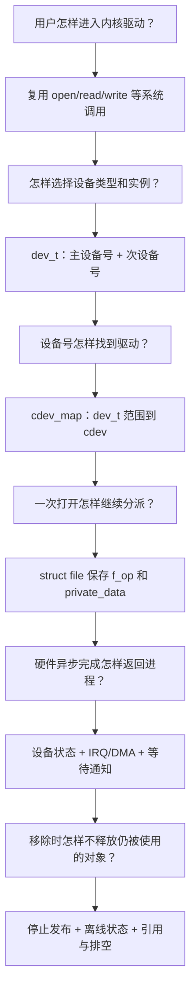
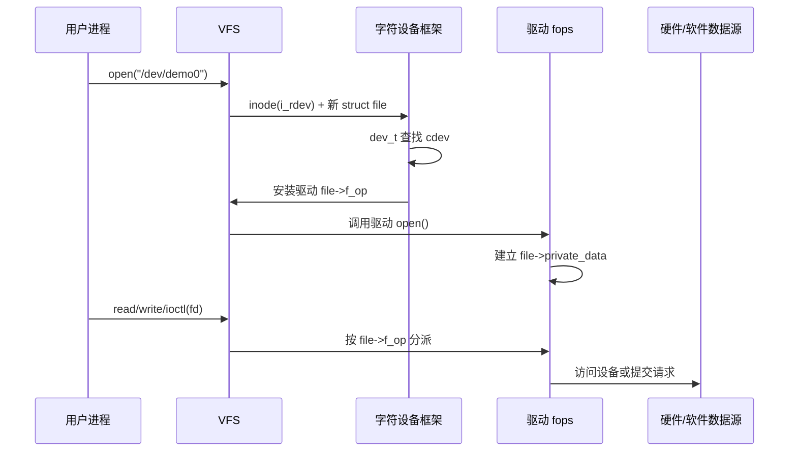
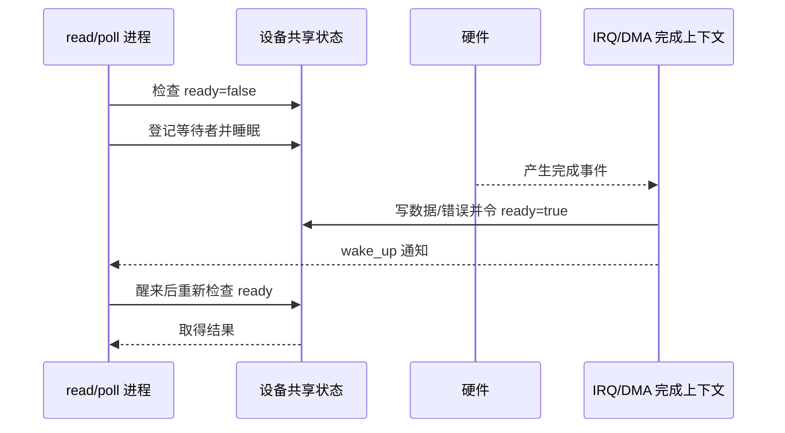
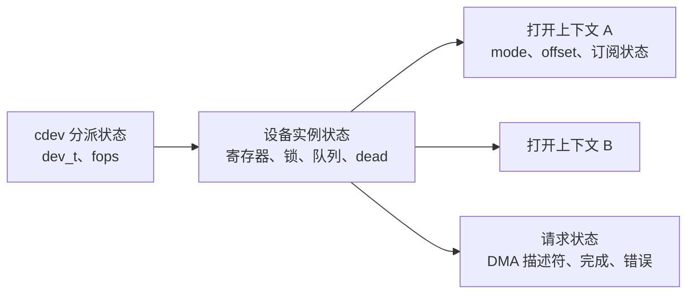
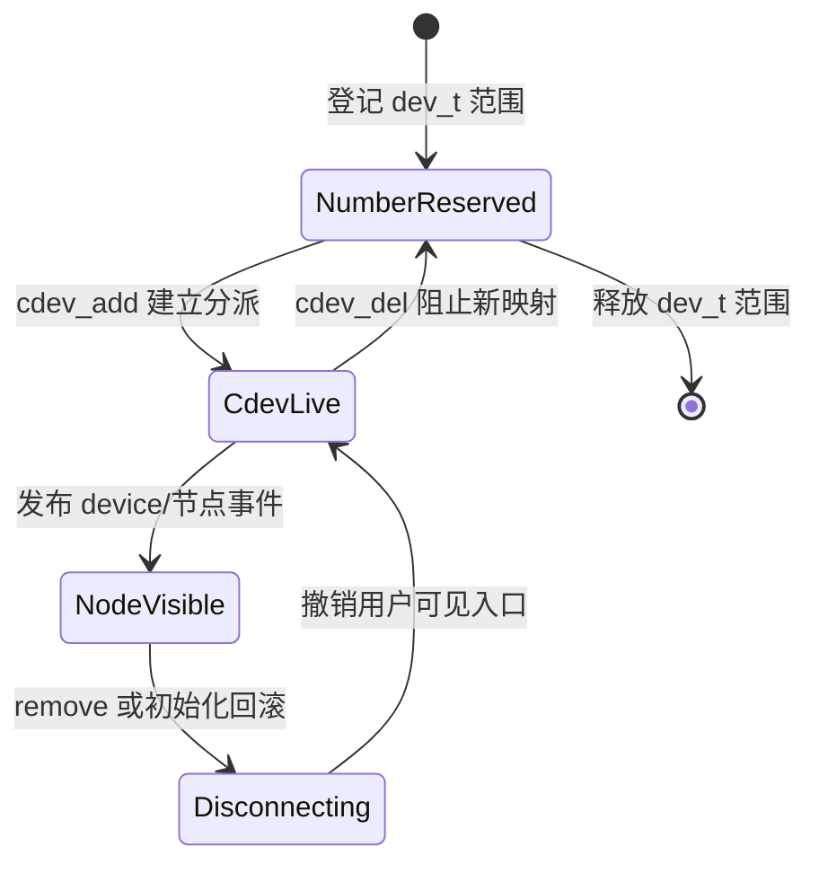

# 第1章\_字符设备最小模型

## 1.1\_问题从哪里产生

假设驱动只向内核提供 `demo_read()` 和 `demo_write()` 两个函数。它已经能够控制硬件，却仍不能直接供普通应用使用：

- 用户进程不能跳进内核地址调用函数；
- 系统中可能有多个同类设备，必须先确定操作哪个实例；
- 多个进程可以同时访问，驱动必须区分 **共享设备状态** 和 **本次打开状态**；
- 应用需要统一的权限检查、文件描述符、阻塞、复用和进程退出清理语义；
- 驱动可能被解绑，而已经打开的文件、等待者或映射仍然存在。

最粗糙的办法是为每种驱动增加专用系统调用，但这会把设备类型不断写进系统调用 ABI。Linux 选择复用文件接口：VFS 负责路径、权限和打开文件，字符设备框架负责把一个特殊文件携带的设备号映射到驱动操作。

VFS 为什么需要 mount、dentry、inode、file 和 fd table，见 [VFS 抽象机制推演](../../kernel_subsystems/vfs/P02_VFS抽象机制推演.md)。本专题不重新建立那套模型，而是继续推导字符特殊文件怎样把 VFS 操作交给设备驱动。

> **字符设备首先是一套 VFS 分派机制。** “字符”不保证硬件逐字节工作，也不要求驱动必须实现 `read()` 和 `write()`；它表示该设备通过字符特殊文件和 `file_operations` 接入用户文件接口。

## 1.2\_从最小方案逐步补齐对象

只保存一张全局函数表无法支持多个驱动，于是需要一个标识；只有标识无法找到回调，于是需要映射；只有回调无法区分设备和会话，于是还需要不同层次的状态对象。

这条推演也是本专题的阅读主线。`cdev_add()` 只是中间一步，不是字符设备的全部。

## 1.3\_七个对象分别回答什么

| 对象 | 它代表什么 | 关键状态属于谁 |
| --- | --- | --- |
| `/dev/demo0` | 文件系统中的字符特殊文件，是用户路径入口 | inode 保存文件类型和 `i_rdev` |
| `dev_t` | 主、次设备号组成的数值身份 | 节点和内核登记必须使用同一数值 |
| `struct cdev` | 一段设备号到一组字符设备操作的内核分派对象 | 驱动设备实例或其分派层 |
| `struct inode` | 文件系统对象，不等于一次打开 | 保存 `i_rdev`，并可缓存 `i_cdev` |
| `struct file` | 一次 open file description | 保存 flags、位置、`f_op`、`private_data` |
| `struct file_operations` | VFS 能调用哪些驱动入口 | 通常是只读共享表，不保存设备运行状态 |
| 驱动设备对象 | 真实设备的共享运行状态 | 寄存器、锁、队列、离线标志、硬件请求 |

`dup()` 或 `fork()` 可以让多个 fd 引用同一个 `struct file`。所以准确说法是 **一次成功的 `open()` 建立一个 open file description**，不是“每个整数 fd 都有一份 `private_data`”。

## 1.4\_两个方向的完整数据流

### 1.4.1\_请求从进程走向设备

### 1.4.2\_完成从设备返回进程

同步设备可以在回调内直接返回。异步设备则必须有反方向通信：IRQ 或 DMA 回调更新驱动拥有的完成状态，再唤醒登记在等待队列中的任务；`poll()` 观察的也必须是同一份条件状态。

> **通知不是状态本身。** `wake_up()` 只促使任务重新运行；`ready`、队列非空、错误或离线标志才是双方通信的持久依据。

## 1.5\_四套状态不能混成一个结构

- **分派状态** 回答设备号进入哪组操作。
- **设备状态** 被同一硬件的所有打开实例共享。
- **打开状态** 保存本次 `open()` 的策略和会话信息。
- **请求状态** 只活到一次同步或异步 I/O 完成、取消或失败。

锁和引用计数必须根据这四层状态选择；把所有字段塞进一个“全局私有结构”会让并发和移除语义无法说明。

## 1.6\_注册、发布和移除的最小闭环

这只是 **阻止新访问** 的骨架。真实驱动还要标记设备离线、唤醒等待者、停止 IRQ/DMA，并等旧引用离开后才能释放设备内存。`device_destroy()`、`cdev_del()` 和释放驱动对象解决的是不同问题。

## 1.7\_源码定位与版本边界

本文实现依据 Linux 6.12.20：

- [`fs/char_dev.c`](../../../research/source_reading/linux/fs/char_dev.c)：设备号登记、`cdev_map`、`chrdev_open()`、`cdev_add()` 和 `cdev_del()`；
- [`fs/open.c`](../../../research/source_reading/linux/fs/open.c)：`open` 系统调用和 `do_dentry_open()`；
- [`fs/namei.c`](../../../research/source_reading/linux/fs/namei.c)：路径打开流程；
- [`include/linux/fs.h`](../../../research/source_reading/linux/include/linux/fs.h)：`struct inode`、`struct file` 和 `struct file_operations`。

下一章先拆开三件经常被混称为“注册字符设备”的事情：[设备号、注册与设备节点](P02_设备号_注册与设备节点.md)。
