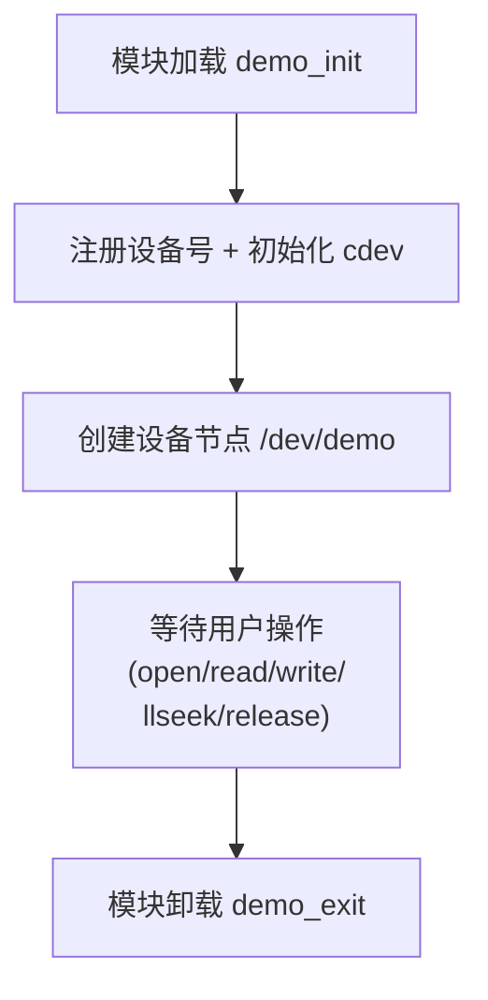
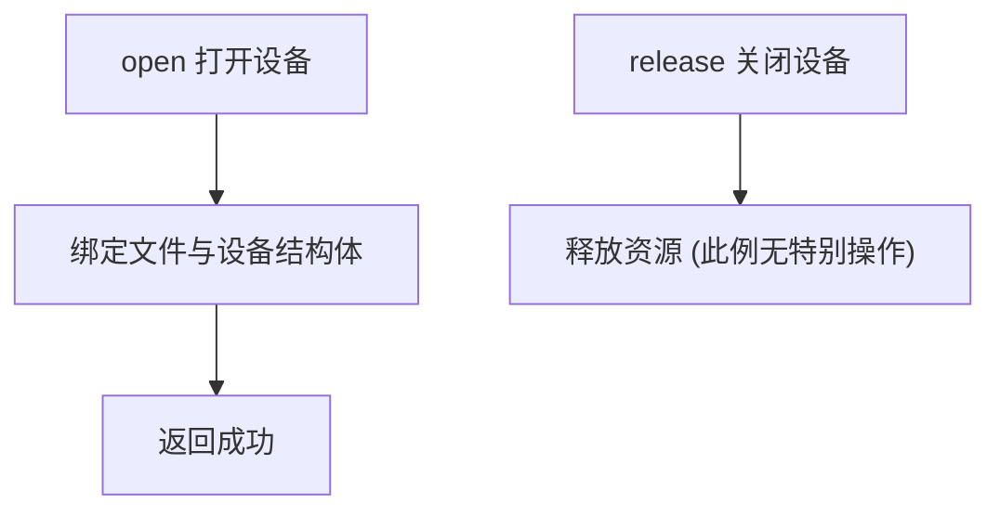
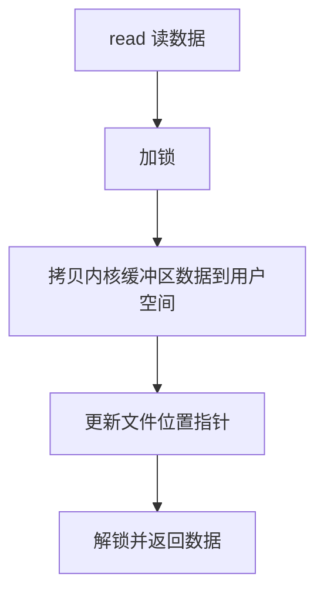
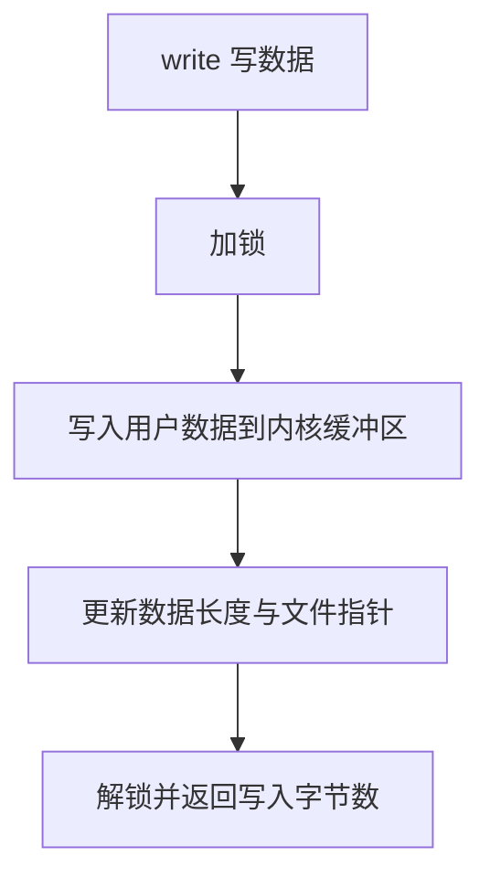
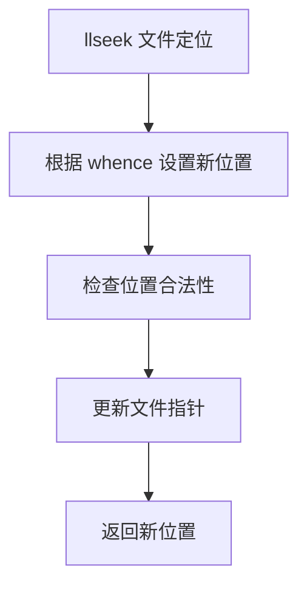
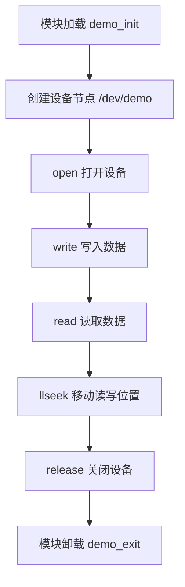
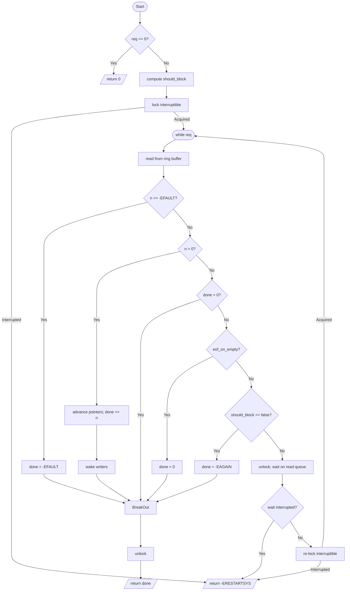
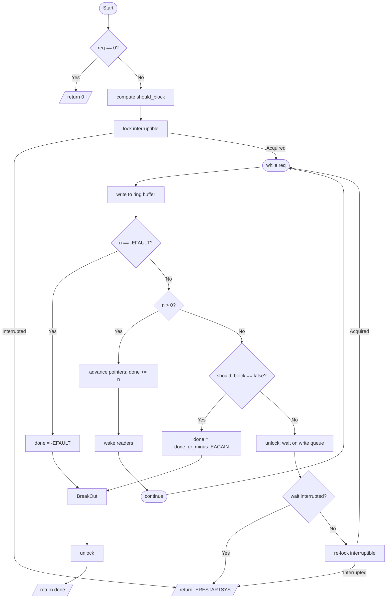

# 第2章_代码上手_单多实例_+_静动设备号_+_自动手工节点


------

## 2.1_代码上手_单/多实例_+_静/动设备号_+_自动/手工节点

### 2.1.1_简单模版(面试专用)

下面把“面试速写版字符设备”整理成一章可直接带走的小模板：一手代码、一手思路，5–10 分钟能写完且能跑。

> 目标：单文件 + 单实例 + 动态主设备号 + 自动 /dev 节点 + 读/写/追加/llseek + 互斥保护。
> 手感：像“文件”一样可顺序读写；接口是工业界常见的 `file_operations` 四件套。

------

#### (1)_清单与结构

```
simple_chardev/
├── Makefile
└── simple_chardev.c
```

##### 1)_Makefile

```make
# 编译目标：simple_chardev.c -> simple_chardev.ko
obj-m := simple_chardev.o

# 内核源码路径（改成你自己的）
KDIR := /home/lizhaojun/linux/nxp/kernel/linux-imx-6.1
PWD  := $(shell pwd)

# 默认目标：交叉编译 ARM 模块
ARCH ?= arm
CROSS_COMPILE ?= arm-none-linux-gnueabihf-

all:
	$(MAKE) -C $(KDIR) M=$(PWD) ARCH=$(ARCH) CROSS_COMPILE=$(CROSS_COMPILE) modules

clean:
	$(MAKE) -C $(KDIR) M=$(PWD) ARCH=$(ARCH) CROSS_COMPILE=$(CROSS_COMPILE) clean
```

##### 2)_simple_chardev.c

```c
// SPDX-License-Identifier: GPL-2.0
// demo.c — 面试速写版：最小可用字符设备（Linux 6.1）
// 特点：单实例、动态主设备号、自动创建设备节点、支持读写/追加/llseek、互斥保护
// 加分点：统一日志前缀 —— pr_fmt + dev_fmt

/* 一定要放在所有 include 之前，避免 pr_fmt 重定义告警 */
#define pr_fmt(fmt)  KBUILD_MODNAME ": " fmt
#define dev_fmt(fmt) KBUILD_MODNAME ": " fmt

#include <linux/module.h>
#include <linux/init.h>
#include <linux/fs.h>
#include <linux/cdev.h>
#include <linux/device.h>
#include <linux/uaccess.h>
#include <linux/mutex.h>
#include <linux/printk.h>
#include <linux/kdev_t.h>

#define DRIVER_NAME  "demo"
#define DEVICE_NAME  "demo"
#define BUFFER_SIZE  4096

struct demo_device {
	char   buffer[BUFFER_SIZE];   // 内部存储区
	size_t data_size;             // 当前有效数据长度
	struct mutex lock;            // 读写互斥
	struct cdev cdev;             // cdev 对象
	dev_t dev_number;             // 设备号
};

static struct demo_device gdev;
static struct class *demo_class;

/* ---------- file_operations ---------- */

static int demo_open(struct inode *inode, struct file *file)
{
	struct demo_device *dev =
		container_of(inode->i_cdev, struct demo_device, cdev);
	file->private_data = dev;
	return 0;
}

static int demo_release(struct inode *inode, struct file *file)
{
	return 0;
}

static ssize_t demo_read(struct file *file, char __user *ubuf,
                         size_t cnt, loff_t *ppos)
{
	struct demo_device *dev = file->private_data;
	ssize_t ret;

	if (mutex_lock_interruptible(&dev->lock))
		return -ERESTARTSYS;

	if (*ppos >= dev->data_size) { // EOF
		ret = 0;
		goto out;
	}

	if (cnt > dev->data_size - *ppos)
		cnt = dev->data_size - *ppos;

	if (copy_to_user(ubuf, dev->buffer + *ppos, cnt)) {
		ret = -EFAULT;
		goto out;
	}

	*ppos += cnt;
	ret = cnt;
out:
	mutex_unlock(&dev->lock);
	return ret;
}

static ssize_t demo_write(struct file *file, const char __user *ubuf,
                          size_t cnt, loff_t *ppos)
{
	struct demo_device *dev = file->private_data;
	size_t pos, space, to_copy;
	ssize_t ret;

	if (mutex_lock_interruptible(&dev->lock))
		return -ERESTARTSYS;

	/* 写入落点：支持 O_APPEND */
	pos = (file->f_flags & O_APPEND) ? dev->data_size : *ppos;

	if (pos >= BUFFER_SIZE) {
		ret = -ENOSPC;
		goto out;
	}

	space = BUFFER_SIZE - pos;
	to_copy = (cnt > space) ? space : cnt;

	if (copy_from_user(dev->buffer + pos, ubuf, to_copy)) {
		ret = -EFAULT;
		goto out;
	}

	pos += to_copy;
	*ppos = pos;
	if (pos > dev->data_size)
		dev->data_size = pos;

	ret = to_copy;
out:
	mutex_unlock(&dev->lock);
	return ret;
}

static loff_t demo_llseek(struct file *file, loff_t off, int whence)
{
	struct demo_device *dev = file->private_data;
	loff_t newpos;

	mutex_lock(&dev->lock);
	switch (whence) {
	case SEEK_SET: newpos = off; break;
	case SEEK_CUR: newpos = file->f_pos + off; break;
	case SEEK_END: newpos = dev->data_size + off; break;
	default:
		mutex_unlock(&dev->lock);
		return -EINVAL;
	}
	if (newpos < 0 || newpos > BUFFER_SIZE) {
		mutex_unlock(&dev->lock);
		return -EINVAL;
	}
	file->f_pos = newpos;
	mutex_unlock(&dev->lock);
	return newpos;
}

static const struct file_operations demo_fops = {
	.owner   = THIS_MODULE,
	.open    = demo_open,
	.release = demo_release,
	.read    = demo_read,
	.write   = demo_write,
	.llseek  = demo_llseek,
};

/* ---------- 模块装卸 ---------- */

static int __init demo_init(void)
{
	int ret;

	/* 1) 分配设备号（动态主设备号，次设备从 0 起） */
	ret = alloc_chrdev_region(&gdev.dev_number, 0, 1, DRIVER_NAME);
	if (ret) {
		pr_err("alloc_chrdev_region failed: %d\n", ret);
		return ret;
	}
	pr_info("region ok: major=%d minor=%d\n",
		MAJOR(gdev.dev_number), MINOR(gdev.dev_number));

	/* 2) 初始化互斥与 cdev 并注册 */
	mutex_init(&gdev.lock);
	gdev.data_size = 0;
	cdev_init(&gdev.cdev, &demo_fops);
	gdev.cdev.owner = THIS_MODULE;

	ret = cdev_add(&gdev.cdev, gdev.dev_number, 1);
	if (ret) {
		pr_err("cdev_add failed: %d\n", ret);
		unregister_chrdev_region(gdev.dev_number, 1);
		return ret;
	}

	/* 3) 自动创建设备节点（/dev/demo） + 设备级日志（带 dev_fmt 前缀） */
	demo_class = class_create(THIS_MODULE, DRIVER_NAME "_class");
	if (IS_ERR(demo_class)) {
		ret = PTR_ERR(demo_class);
		pr_err("class_create failed: %d\n", ret);
		cdev_del(&gdev.cdev);
		unregister_chrdev_region(gdev.dev_number, 1);
		return ret;
	}

	{
		struct device *devptr =
			device_create(demo_class, NULL, gdev.dev_number, NULL, DEVICE_NAME);
		if (IS_ERR(devptr)) {
			pr_err("device_create failed\n");
			unregister_chrdev_region(gdev.dev_number, 1);
			cdev_del(&gdev.cdev);
			class_destroy(demo_class);
			return -EINVAL;
		}
		dev_info(devptr, "ready\n");  // 会输出类似：platform …: demo: ready
	}

	pr_info("loaded. Try: echo hi > /dev/%s ; cat /dev/%s\n", DEVICE_NAME, DEVICE_NAME);
	return 0;
}

static void __exit demo_exit(void)
{
	device_destroy(demo_class, gdev.dev_number);
	class_destroy(demo_class);
	unregister_chrdev_region(gdev.dev_number, 1);
	cdev_del(&gdev.cdev);
	pr_info("unloaded\n");
}

module_init(demo_init);
module_exit(demo_exit);

MODULE_LICENSE("GPL");
MODULE_AUTHOR("YourName");
MODULE_DESCRIPTION("Simple char device (with pr_fmt + dev_fmt)");

```

* [mutex_lock_interruptible讲解](./附录A_同步机制中的_interruptible.md)


------

#### (2)_代码走读(面试把控重点)

##### 1)_重点提示

- **设备号**：`alloc_chrdev_region(&dev, 0, 1, DRIVER_NAME)` 动态拿 `major`；卸载时 `unregister_chrdev_region(dev, 1)`。
- **cdev 生命周期**：`cdev_init→cdev_add→cdev_del`。
- **设备节点**：`class_create→device_create` 自动在 `/dev/simpchr`；若目标板没 devtmpfs/udev，则用 `mknod` 手工创建设备节点。
- **I/O 语义**：
  - `read()`：按 `*ppos` 读取，支持 EOF；
  - `write()`：按 `*ppos` 写入，**支持 `O_APPEND`**；
  - `llseek()`：`SEEK_SET/CUR/END` 全支持（带互斥）。
- **并发**：简洁起见用一个 `mutex` 包住缓冲与 `*ppos`；保证 `read/write/llseek` 的一致性。

------

##### 2)_demo_字符设备驱动框架流程

###### a)_总览(驱动入口)



------

###### b)_打开与释放



------

###### c)_读操作



------

###### d)_写操作



------

###### e)_llseek_操作



------

好 👍 我给你做一张 **整体总览图**，把 `open → write → read → llseek → release → exit` 串起来，用中文提示，简洁清晰，方便你背框架。

------

##### 3)_demo_字符设备整体调用流程



------

#### (3)_构建与快速验证

```bash
make
sudo insmod simple_chardev.ko
ls -l /dev/simpchr

# 覆盖写 + 读
echo -n "abc" | sudo tee /dev/simpchr >/dev/null
dd if=/dev/simpchr bs=1 count=3 2>/dev/null ; echo

# 追加写（O_APPEND）
python3 - <<'PY'
import os, fcntl
fd = os.open('/dev/simpchr', os.O_WRONLY|os.O_APPEND)
os.write(fd, b'XYZ')
os.close(fd)
PY
hexdump -C /dev/simpchr

# llseek 验证（把偏移移动到文件尾-2，再读2字节）
python3 - <<'PY'
import os
fd = os.open('/dev/simpchr', os.O_RDWR)
os.lseek(fd, -2, os.SEEK_END)
print(os.read(fd, 2))
os.close(fd)
PY

sudo rmmod simple_chardev
```

> 若自动节点没出现（部分精简 rootfs 常见）：
>
> ```
> MAJOR=$(awk '$2=="simpchr"{print $1}' /proc/devices)
> sudo mknod /dev/simpchr c $MAJOR 0
> sudo chmod 666 /dev/simpchr
> ```

------

#### (4)_头文件对照(记住就能写)

| 能力/接口                    | 头文件              |
| ---------------------------- | ------------------- |
| `alloc_chrdev_region` 等     | `<linux/fs.h>`      |
| `cdev_*`                     | `<linux/cdev.h>`    |
| `class_create/device_create` | `<linux/device.h>`  |
| `copy_{to,from}_user`        | `<linux/uaccess.h>` |
| `mutex_*`                    | `<linux/mutex.h>`   |
| `printk/pr_*`/`pr_fmt`       | `<linux/printk.h>`  |
| `MKDEV/MAJOR/MINOR`          | `<linux/kdev_t.h>`  |

------

#### (5)_面试_加分项_一键改

1. **静态主设备号**

   - 把 `alloc_chrdev_region` 替换为：

     ```c
     dev_t dev = MKDEV(240, 0); // 示例：240
     register_chrdev_region(dev, 1, DRIVER_NAME);
     ```

   - 失败时给出“主设备号被占用”的合理提示。

2. **模块参数（可选）**

   - 为 BUFFER_SIZE/DRIVER_NAME 提供 `module_param()`；
   - 在 `/sys/module/.../parameters/` 可见，演示“可配置性”。

3. **错误回滚**

   - 你已经有完整回滚：`cdev_add` 失败→撤 `unregister_chrdev_region`；`device_create` 失败→依次 `class_destroy/cdev_del/unregister…`。

------

#### (6)_常见坑与排查

- **`cat /dev/simpchr` 不退出？**
  你的实现是“文件式”而非“流式管道”；读空返回 0（EOF），`cat` 会退出。若卡住，多半是用户态还没读到 EOF（比如有人后台写入追加，`cat` 一直读）。
- **设备节点不见了**：目标板没启 devtmpfs/udev；用 `mknod` 手工创建（见上）。
- **`-ENOSPC`**：写入越界（BUFFER_SIZE 固定）；这是预期行为，面试时可顺带解释“短写/错误返回”的设计。

------

#### (7)_复盘笔记(面试现场要说的点)

- `alloc_chrdev_region`/`cdev_init+add`/`class_create+device_create` 是“外部模块字符设备”的黄金三步。
- `read/write/llseek` 都遵循 `*ppos` 契约，`write` 支持 `O_APPEND`。
- 用 `mutex` 保证并发安全，返回码使用内核通用语义（`-EFAULT/-ENOSPC/-ERESTARTSYS` 等）。
- `pr_fmt(fmt)` + `KBUILD_MODNAME` 统一日志前缀，日志可在 `dmesg` 里快速定位。

------

这一章的目的就是“面试 5–10 分钟写出能跑的字符驱动”。等要写正式项目时，再换用你前面那份“环形缓冲 + poll/阻塞”的全功能模板即可。祝面试顺利！

### 2.1.2_完整模版(项目专用)

太好了，那我直接把整套程序**重构成“项目模板级”版本**：

- 更严谨的错误处理与回滚；
- 多实例（多个 minor）；
- 动态/静态主设备号；
- 自动/手工节点任选；
- **环形缓冲区（ring buffer）+ 等待队列**，支持**阻塞/非阻塞**读写；
- **`poll/epoll` 支持**（`select()` / `poll()` / `epoll` 可用）；
- 统一日志风格（`pr_fmt` + `dev_*`）；
- 代码结构与注释适合作为**新项目的模板**。
  内核版本按 **Linux 6.1**。

------

#### (1)_目录结构

```
chardev_template/
├── Makefile
└── chardev_template.c
```

------

#### (2)_Makefile(外部模块标准写法)

```make
# 编译目标：chardev_template.c -> chardev_template.ko
obj-m := chardev_template.o

# 内核源码路径（改成你自己的）
KDIR := /home/lizhaojun/linux/nxp/kernel/linux-imx-6.1
PWD  := $(shell pwd)

# 默认目标：交叉编译 ARM 模块
ARCH ?= arm
CROSS_COMPILE ?= arm-none-linux-gnueabihf-

all:
	$(MAKE) -C $(KDIR) M=$(PWD) ARCH=$(ARCH) CROSS_COMPILE=$(CROSS_COMPILE) modules

clean:
	$(MAKE) -C $(KDIR) M=$(PWD) ARCH=$(ARCH) CROSS_COMPILE=$(CROSS_COMPILE) clean
```

------

#### (3)_chardev_template.c

```c
// SPDX-License-Identifier: GPL-2.0-only
/*
 * Enhanced character device driver for Linux 6.x
 *
 * Features:
 * - Multiple instances (device_count) with dynamic/static major numbers
 * - Circular buffer with mutex protection
 * - Blocking/non-blocking read/write with proper synchronization
 * - poll() support
 * - EOF on empty buffer when no data read
 * - Unified pr_fmt/dev_fmt logging
 * - Automatic/manual /dev node creation
 * - Clean error handling and resource cleanup
 * - Optional `read_full` module parameter to let read() try to fill requested size
 */

#define pr_fmt(fmt) KBUILD_MODNAME ": " fmt
#define dev_fmt(fmt) KBUILD_MODNAME ": " fmt

#include <linux/module.h>
#include <linux/init.h>
#include <linux/kernel.h>
#include <linux/fs.h>
#include <linux/cdev.h>
#include <linux/device.h>
#include <linux/slab.h>
#include <linux/uaccess.h>
#include <linux/mutex.h>
#include <linux/wait.h>
#include <linux/poll.h>
#include <linux/printk.h>
#include <linux/kdev_t.h>
#include <linux/sched/signal.h>

#define DRIVER_NAME "chardev_template"
#define DEFAULT_MINORS 1
#define MAX_MINORS 255

/* Module parameters */
static int major_number = 0;  /* 0 = dynamic major */
module_param(major_number, int, 0644);
MODULE_PARM_DESC(major_number, "Static major. 0 for dynamic");

static int instance_count = 2;
module_param(instance_count, int, 0644);
MODULE_PARM_DESC(instance_count, "Number of minor devices");

static bool auto_create_node = true;
module_param(auto_create_node, bool, 0644);
MODULE_PARM_DESC(auto_create_node, "Create /dev nodes automatically");

static char *device_name_base = (char *)"demo";
static char *device_name_base = "demo";
module_param(device_name_base, charp, 0644);
MODULE_PARM_DESC(device_name_base, "Device name base");

static unsigned int buffer_size = 4096;
module_param(buffer_size, uint, 0644);
MODULE_PARM_DESC(buffer_size, "Per-device ring buffer size in bytes");

static bool default_blocking = true;
module_param(default_blocking, bool, 0644);
MODULE_PARM_DESC(default_blocking, "Default blocking behavior for read/write");

static bool eof_on_empty = true;
module_param(eof_on_empty, bool, 0644);
MODULE_PARM_DESC(eof_on_empty, "Return 0 (EOF) when buffer is empty and nothing read yet");

/* New option: when true, `read()` will try to satisfy the requested
 * number of bytes (blocking as needed) instead of returning after the
 * first available chunk. Default=false (preserve current behavior).
 */
static bool read_full = false;
module_param(read_full, bool, 0644);
MODULE_PARM_DESC(read_full, "If true, try to fill read buffer before returning");

/* ================= 数据结构 ================= */

struct char_device_context {
	char            *buffer;
	size_t           capacity;
	size_t           write_head;
	size_t           read_tail;
	size_t           data_size;

	struct mutex     lock;
	wait_queue_head_t read_queue;
	wait_queue_head_t write_queue;

	struct cdev      cdev;
	dev_t            device_number;
	struct device   *device_entry;
};

static dev_t base_device_number;
static struct class *global_device_class;
static struct char_device_context *device_context_array;

/* ================= 环形缓冲工具 ================= */

static inline size_t ring_buffer_data_available(const struct char_device_context *ctx)
{
	return ctx->data_size;
}
static inline size_t ring_buffer_space_available(const struct char_device_context *ctx)

static inline size_t
ring_buffer_space_available(const struct char_device_context *ctx)
{
	return ctx->capacity - ctx->data_size;
}

static size_t ring_buffer_write_from_user(struct char_device_context *ctx,
					  const char __user *user_buffer,
					  size_t max_req)
{
	size_t writable = min(max_req, ring_buffer_space_available(ctx));
	size_t first = min(writable, ctx->capacity - ctx->write_head);
	size_t second = writable - first;

	if (writable == 0)
		return 0;

	if (copy_from_user(ctx->buffer + ctx->write_head, user_buffer, first))
		return (size_t)-EFAULT;
	if (second) {
		if (copy_from_user(ctx->buffer, user_buffer + first, second))
			return (size_t)-EFAULT;
	}

	ctx->write_head = (ctx->write_head + writable) % ctx->capacity;
	ctx->data_size  += writable;
	return writable;
}

static size_t ring_buffer_read_to_user(struct char_device_context *ctx,
				       char __user *user_buffer,
				       size_t max_req)
{
	size_t readable = min(max_req, ring_buffer_data_available(ctx));
	size_t first = min(readable, ctx->capacity - ctx->read_tail);
	size_t second = readable - first;

	if (readable == 0)
		return 0;

	if (copy_to_user(user_buffer, ctx->buffer + ctx->read_tail, first))
		return (size_t)-EFAULT;
	if (second) {
		if (copy_to_user(user_buffer + first, ctx->buffer, second))
			return (size_t)-EFAULT;
	}

	ctx->read_tail = (ctx->read_tail + readable) % ctx->capacity;
	ctx->data_size -= readable;
	return readable;
}

static int char_device_open(struct inode *inode, struct file *file)
{
	struct char_device_context *ctx =
		container_of(inode->i_cdev, struct char_device_context, cdev);
	file->private_data = ctx;
	if (ctx->device_entry)
		dev_dbg(ctx->device_entry, "open (minor=%d)\n", MINOR(ctx->device_number));
	else
		pr_debug("open (minor=%d)\n", MINOR(ctx->device_number));
	return 0;
}

static int char_device_release(struct inode *inode, struct file *file)
{
	struct char_device_context *ctx = file->private_data;
	if (ctx->device_entry)
		dev_dbg(ctx->device_entry, "release\n");
	return 0;
}

static ssize_t char_device_read(struct file *file, char __user *user_buffer,
				size_t req, loff_t *ppos)
/*
 * Read semantics:
 * - By default (read_full=false), read() returns after the first available
 *   chunk of data (keeps prior behavior, good for tools like `cat`).
 * - If read_full=true, read() tries to satisfy the full requested length by
 *   looping (blocking as necessary). If a blocking wait is interrupted by a
 *   signal and some bytes were already read, the function returns the number
 *   of bytes read so far; otherwise it returns -ERESTARTSYS.
 */
static ssize_t
char_device_read(struct file *file, char __user *user_buffer,
                 size_t req, loff_t *ppos)
{
	struct char_device_context *ctx = file->private_data;
	ssize_t done = 0;
	bool should_block = default_blocking && !(file->f_flags & O_NONBLOCK);

	if (!req)
		return 0;
	if (mutex_lock_interruptible(&ctx->lock))
		return -ERESTARTSYS;

	while (req) {
		size_t n = ring_buffer_read_to_user(ctx, user_buffer, req);
		if (n == (size_t)-EFAULT) { done = -EFAULT; break; }
		if (n > 0) {
			user_buffer += n; req -= n; done += n;
			wake_up_interruptible(&ctx->write_queue);
			break; /* 读到一点就返回，便于 cat 退出 */
		}

		if (done > 0) break;               /* 本次已读到一些 → 返回 */
		if (eof_on_empty) { done = 0; break; }  /* 空即 EOF */
    while (req) {
        size_t n = ring_buffer_read_to_user(ctx, user_buffer, req);
        if (n == (size_t) -EFAULT) {
            done = -EFAULT;
            break;
        }

        if (n > 0) {
            /* copied some data to user */
            user_buffer += n;
            req -= n;
            done += n;
            wake_up_interruptible(&ctx->write_queue);

            /*
             * If read_full is false (default), return after the first
             * successful read to preserve previous behavior (good for
             * tools like `cat`). If read_full is true, continue and try
             * to satisfy the remaining `req` bytes.
             */
            if (!read_full)
                break;
            else
                continue;
        }

        /* no data available now */
        if (done > 0)
            break; /* already read some data — return it */

        if (eof_on_empty) {
            /* treat empty as EOF when configured */
            done = 0;
            break;
        }

		if (!should_block) { done = -EAGAIN; break; }

		mutex_unlock(&ctx->lock);
		if (wait_event_interruptible(ctx->read_queue,
					     ring_buffer_data_available(ctx) > 0))
			return -ERESTARTSYS;
		if (mutex_lock_interruptible(&ctx->lock))
			return -ERESTARTSYS;
	}
	mutex_unlock(&ctx->lock);
	return done;
        /* need to block: release lock and wait */
        mutex_unlock(&ctx->lock);

        {
            int wait_ret;
            wait_ret = wait_event_interruptible_exclusive(ctx->read_queue,
                                                          ring_buffer_data_available(ctx) > 0);
            if (wait_ret) {
                /* interrupted by signal: if we read some data already, return it; otherwise propagate */
                if (done > 0) {
                    if (ctx->device_entry)
                        dev_dbg(ctx->device_entry, "read wait interrupted, returning %zd bytes\n", done);
                    else
                        pr_debug("read wait interrupted, returning %zd bytes\n", done);
                    return done;
                }
                if (ctx->device_entry)
                    dev_dbg(ctx->device_entry, "read wait interrupted, returning -ERESTARTSYS\n");
                else
                    pr_debug("read wait interrupted, returning -ERESTARTSYS\n");
                return -ERESTARTSYS;
            }
        }

        if (mutex_lock_interruptible(&ctx->lock))
            return -ERESTARTSYS;
    }
    mutex_unlock(&ctx->lock);
    return done;
}

static ssize_t char_device_write(struct file *file, const char __user *user_buffer,
				 size_t req, loff_t *ppos)
/*
 * Write semantics:
 * - Write will attempt to write as much as possible. On blocking waits,
 *   if the wait is interrupted and some data has already been written,
 *   the function returns the number of bytes written so far; otherwise
 *   it returns -ERESTARTSYS to propagate the interruption.
 */
static ssize_t
char_device_write(struct file *file, char __user const *user_buffer,
                  size_t req, loff_t *ppos)
{
	struct char_device_context *ctx = file->private_data;
	ssize_t done = 0;
	bool should_block = default_blocking && !(file->f_flags & O_NONBLOCK);

	if (!req)
		return 0;
	if (mutex_lock_interruptible(&ctx->lock))
		return -ERESTARTSYS;

	while (req) {
		size_t n = ring_buffer_write_from_user(ctx, user_buffer, req);
		if (n == (size_t)-EFAULT) { done = -EFAULT; break; }
		if (n > 0) {
			user_buffer += n;
			req -= n;
			done += n;
			wake_up_interruptible(&ctx->read_queue);
			continue;
		}

		if (!should_block) {
            done = (done>0) ? done : -EAGAIN;
            break;
		}

		mutex_unlock(&ctx->lock);
		if (wait_event_interruptible(ctx->write_queue,
					     ring_buffer_space_available(ctx) > 0))
			return -ERESTARTSYS;
		if (mutex_lock_interruptible(&ctx->lock))
			return -ERESTARTSYS;
	}
	mutex_unlock(&ctx->lock);
	return done;
        }
        /* 没有获取到写权限 */
        mutex_unlock(&ctx->lock);
        /* 主动睡眠，等待唤醒 */
        {
            int wait_ret;
            wait_ret = wait_event_interruptible_exclusive(ctx->write_queue,
                                                          ring_buffer_space_available(ctx) > 0);
            if (wait_ret) {
                /* interrupted by signal: if some bytes were written, return that count */
                if (done > 0) {
                    if (ctx->device_entry)
                        dev_dbg(ctx->device_entry, "write wait interrupted, returning %zd bytes\n", done);
                    else
                        pr_debug("write wait interrupted, returning %zd bytes\n", done);
                    return done;
                }
                if (ctx->device_entry)
                    dev_dbg(ctx->device_entry, "write wait interrupted, returning -ERESTARTSYS\n");
                else
                    pr_debug("write wait interrupted, returning -ERESTARTSYS\n");
                return -ERESTARTSYS;
            }
        }
        if (mutex_lock_interruptible(&ctx->lock))
            return -ERESTARTSYS;
    }
    mutex_unlock(&ctx->lock);
    return done;
}

static __poll_t char_device_poll(struct file *file, poll_table *wait)
{
	struct char_device_context *ctx = file->private_data;
	__poll_t mask = 0;

	poll_wait(file, &ctx->read_queue,  wait);
	poll_wait(file, &ctx->write_queue, wait);

	mutex_lock(&ctx->lock);
	if (ring_buffer_data_available(ctx)  > 0) mask |= POLLIN  | POLLRDNORM;
	if (ring_buffer_space_available(ctx) > 0) mask |= POLLOUT | POLLWRNORM;
	mutex_unlock(&ctx->lock);
	return mask;
}

static const struct file_operations template_file_ops = {
	.owner   = THIS_MODULE,
	.open    = char_device_open,
	.release = char_device_release,
	.read    = char_device_read,
	.write   = char_device_write,
	.poll    = char_device_poll,
	.llseek  = no_llseek,
/* ================= file_operations ================= */

/* Declare the file_operations structure here */
static const struct file_operations simple_fops = {
    .owner          = THIS_MODULE,
    .open           = char_device_open,
    .release        = char_device_release,
    .read           = char_device_read,
    .write          = char_device_write,
    .poll           = char_device_poll,
    .llseek         = no_llseek,
};

/* ================= 模块初始化 ================= */

static int __init template_module_init(void)
static int __init
chardev_template_init(void)
{
	int i, ret;

	/* 设备号 */
	if (major_number > 0) {
		base_device_number = MKDEV(major_number, 0);
		ret = register_chrdev_region(base_device_number, instance_count, DRIVER_NAME);
		if (ret) { pr_err("register_chrdev_region failed(%d)\n", ret); return ret; }
		pr_info("static dev region ok: major=%d minors=[0..%d]\n",
			major_number, instance_count-1);
	} else {
		ret = alloc_chrdev_region(&base_device_number, 0, instance_count, DRIVER_NAME);
		if (ret) { pr_err("alloc_chrdev_region failed(%d)\n", ret); return ret; }
		major_number = MAJOR(base_device_number);
		pr_info("dynamic dev region ok: major=%d minors=[0..%d]\n",
			major_number, instance_count-1);
	}

	/* 实例数组 */
	device_context_array = kcalloc(instance_count, sizeof(*device_context_array), GFP_KERNEL);
	if (!device_context_array) { ret = -ENOMEM; goto err_unreg; }

	/* class */
	if (auto_create_node) {
		global_device_class = class_create(THIS_MODULE, DRIVER_NAME "_class");
		if (IS_ERR(global_device_class)) {
			ret = PTR_ERR(global_device_class);
			pr_err("class_create failed(%d)\n", ret);
			goto err_free_arr;
		}
	}

	/* 实例初始化 */
	for (i = 0; i < instance_count; ++i) {
		struct char_device_context *ctx = &device_context_array[i];

		ctx->capacity = buffer_size;
		ctx->buffer   = kmalloc(ctx->capacity, GFP_KERNEL);
		if (!ctx->buffer) { ret = -ENOMEM; pr_err("kmalloc failed minor=%d\n", i); goto err_rollback; }
		ctx->write_head = ctx->read_tail = ctx->data_size = 0;

		mutex_init(&ctx->lock);
		init_waitqueue_head(&ctx->read_queue);
		init_waitqueue_head(&ctx->write_queue);

		ctx->device_number = base_device_number + i;

		cdev_init(&ctx->cdev, &template_file_ops);
		ctx->cdev.owner = THIS_MODULE;
		ret = cdev_add(&ctx->cdev, ctx->device_number, 1);
		if (ret) {
			pr_err("cdev_add(i=%d) failed(%d)\n", i, ret);
			kfree(ctx->buffer);
			goto err_rollback;
		}
        cdev_init(&ctx->cdev, &simple_fops);
        ctx->cdev.owner = THIS_MODULE;
        ret             = cdev_add(&ctx->cdev, ctx->device_number, 1);
        if (ret) {
            pr_err("cdev_add(i=%d) failed(%d)\n", i, ret);
            kfree(ctx->buffer);
            goto err_rollback;
        }

		if (auto_create_node) {
			ctx->device_entry = device_create(global_device_class, NULL,
					ctx->device_number, NULL, "%s%d", device_name_base, i);
			if (IS_ERR(ctx->device_entry)) {
				ret = PTR_ERR(ctx->device_entry);
				pr_err("device_create(i=%d) failed(%d)\n", i, ret);
				cdev_del(&ctx->cdev);
				kfree(ctx->buffer);
				goto err_rollback;
			}
			dev_info(ctx->device_entry, "ready (buffer=%u bytes)\n",
				 (unsigned int)ctx->capacity); /* 带 dev_fmt 的设备级日志 */
		} else {
			ctx->device_entry = NULL;
			pr_info("minor=%d ready (buffer=%u) — mknod /dev/%s%d c %d %d\n",
				i, (unsigned int)ctx->capacity, device_name_base, i, major_number, i);
		}
	}
        if (auto_create_node) {
            ctx->device_entry = device_create(global_device_class, NULL,
                                              ctx->device_number, NULL, "%s%d", device_name_base, i);
            if (IS_ERR(ctx->device_entry)) {
                ret = PTR_ERR(ctx->device_entry);
                pr_err("device_create(i=%d) failed(%d)\n", i, ret);
                cdev_del(&ctx->cdev);
                kfree(ctx->buffer);
                goto err_rollback;
            }
            dev_info(ctx->device_entry, "ready (buffer=%u bytes)\n", (unsigned int)ctx->capacity);
        } else {
            ctx->device_entry = NULL;
            pr_info("minor=%d ready (buffer=%u) — mknod /dev/%s%d c %d %d\n",
                    i, (unsigned int)ctx->capacity, device_name_base, i, major_number, i);
        }
    }

	pr_info("loaded. Try: echo hi >/dev/%s0 ; cat /dev/%s0\n",
		device_name_base, device_name_base);
	return 0;
    pr_info("loaded. Try: echo hi >/dev/%s0 ; cat /dev/%s0 (read_full=%s)\n",
            device_name_base, device_name_base, read_full ? "true" : "false");
    return 0;

err_rollback:
	while (--i >= 0) {
		if (auto_create_node)
			device_destroy(global_device_class, base_device_number + i);
		cdev_del(&device_context_array[i].cdev);
		kfree(device_context_array[i].buffer);
	}
	if (auto_create_node && !IS_ERR_OR_NULL(global_device_class))
		class_destroy(global_device_class);
    while (--i >= 0) {
        if (auto_create_node)
            device_destroy(global_device_class, base_device_number + i);
        cdev_del(&device_context_array[i].cdev);
        kfree(device_context_array[i].buffer);
    }
err_free_arr:
	kfree(device_context_array);
err_unreg:
	unregister_chrdev_region(base_device_number, instance_count);
	return ret;
}

static void __exit template_module_exit(void)
static void __exit
chardev_template_exit(void)
{
	int i;
	for (i = 0; i < instance_count; ++i) {
		struct char_device_context *ctx = &device_context_array[i];
		wake_up_interruptible(&ctx->read_queue);
		wake_up_interruptible(&ctx->write_queue);
		if (auto_create_node)
			device_destroy(global_device_class, base_device_number + i);
		cdev_del(&ctx->cdev);
		kfree(ctx->buffer);
	}
	if (auto_create_node && !IS_ERR_OR_NULL(global_device_class))
		class_destroy(global_device_class);
	kfree(device_context_array);
	unregister_chrdev_region(base_device_number, instance_count);
	pr_info("unloaded\n");
}

module_init(chardev_template_init);
module_exit(chardev_template_exit);

MODULE_LICENSE("GPL");
MODULE_AUTHOR("Your Name");
MODULE_DESCRIPTION("Complete multi-instance character device driver");
MODULE_VERSION("1.0");

```


**char_device_read()函数流程图**



**char_device_write()函数流程图**




------

#### (4)_使用方式(一看就会)

```bash
# 1) 编译 & 加载
make
sudo insmod chardev_template.ko major=0 count=2 auto_node=1 devbase=demo buf_size=8192 blocking=1

# 2) 看看自动创建设备节点
ls -l /dev/demo0 /dev/demo1

# 3) 简单功能测试（流式：写入→读取）
echo "hello" | sudo tee /dev/demo0 >/dev/null
cat /dev/demo0

# 4) poll/epoll 测试（可用 busybox nc/自写小程序；或直接 cat 在读端，另端 echo 触发）
#    一个终端：cat /dev/demo0
#    另一个终端：echo "wake" > /dev/demo0

# 5) 非阻塞模式
sudo bash -c 'exec 3>/dev/demo0; python3 - <<PY
import fcntl, os, time
fd = 3
flags = fcntl.fcntl(fd, fcntl.F_GETFL)
fcntl.fcntl(fd, fcntl.F_SETFL, flags|os.O_NONBLOCK)
try:
    os.write(fd, b"A"*10000000)
    print("write ok")
except BlockingIOError as e:
    print("nonblock EAGAIN:", e)
PY'

# 6) 卸载
sudo rmmod chardev_template
```

> 如果你选择 `auto_node=0`，请手工创建节点：
> `sudo mknod /dev/demo0 c <major> 0 ; sudo chmod 666 /dev/demo0`
> 其中 `<major>` 见 `dmesg` 或 `/proc/devices`。

------

#### (5)_设计取舍与延展点

- 采用**环形缓冲区**+等待队列，语义是“流式设备”，所以 `.llseek = no_llseek`；这比“线性内存+ppos”的教学示例更贴合实际数据流设备（串口/管道类）。
- 提供 `blocking` 模块参数：默认阻塞行为（若 `O_NONBLOCK` 会覆盖）；也可以设为非阻塞默认。
- `poll()` 支持齐全，用户态就可以 `select/poll/epoll`。
- 统一日志风格（`pr_fmt` + `dev_*`），便于排障。
- 错误路径和回滚完整，作为项目模板拿来就能用。

**可选扩展（留给下个里程）**

- `ioctl`/`compat_ioctl`：清空缓冲区、设置/查询水位等；
- sysfs 属性：`/sys/class/chardev_template/<dev>/buf_size` 等；
- `mmap`：把环形缓冲映射到用户态（需要额外同步策略）；
- `DMA`/`copy_*_user` 优化与大页管理；
- 安全策略：capability/selinux 针对设备访问权限的最佳实践。

------

如果你还想要**线性文件语义**（支持 `O_APPEND` 和 `llseek`）的“并行模板”，我也可以再给你一份“linear 版”的骨架；你就能根据业务类型二选一或都保留两种设备类型。

#### (6)_头文件速查(和接口一一对齐)

| 接口                                                         | 头文件              |
| ------------------------------------------------------------ | ------------------- |
| `alloc_chrdev_region` / `register_chrdev_region` / `unregister_chrdev_region` | `<linux/fs.h>`      |
| `cdev_init` / `cdev_add` / `cdev_del`                        | `<linux/cdev.h>`    |
| `class_create` / `class_destroy` / `device_create` / `device_destroy` | `<linux/device.h>`  |
| `MKDEV/MAJOR/MINOR`                                          | `<linux/kdev_t.h>`  |
| `copy_to_user` / `copy_from_user`                            | `<linux/uaccess.h>` |
| `mutex_*`                                                    | `<linux/mutex.h>`   |
| `pr_info/pr_err`                                             | `<linux/printk.h>`  |
| `THIS_MODULE` / `module_init/exit`                           | `<linux/module.h>`  |

