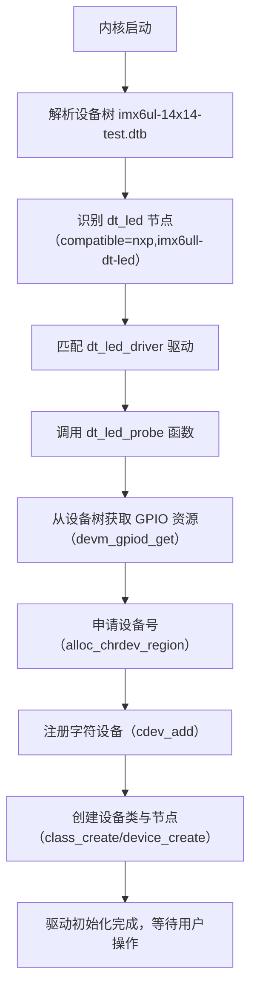
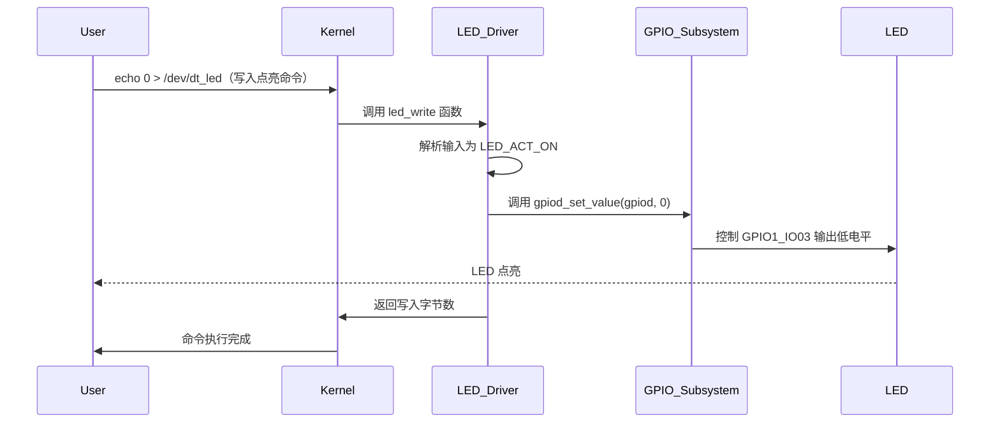

# 第2章_字符设备-LED点灯+dts

[TOC]

## 2.1_LED驱动开发讲解

### 2.1.1_主题引入_设备树如何解决LED驱动的硬件依赖问题

在i.MX6ULL传统LED驱动开发中，开发者需硬编码GPIO寄存器地址（如`GPIO1_DR_BASE = 0x0209C000`）、引脚复用配置（如`SW_MUX_GPIO1_IO03_BASE = 0x020E0068`），这种方式存在明显缺陷：
- **硬件绑定紧密**：若LED引脚从`GPIO1_IO03`调整为`GPIO1_IO04`，需修改驱动源码中所有寄存器相关宏定义，重新编译内核；
- **兼容性差**：同一驱动无法适配不同厂商的i.MX6ULL开发板（如NXP官方板与第三方定制板的引脚布局差异）；
- **调试效率低**：硬件配置错误需通过修改源码、重新编译、烧录验证的长周期排查。

而基于设备树的驱动开发，通过将**硬件配置（引脚、复用、电气属性）转移到设备树文件**，驱动代码仅保留通用逻辑，实现“一次驱动编写，多硬件适配”。本章以i.MX6ULL的`GPIO1_IO03`引脚为例，完整实现基于设备树的LED字符驱动，解决传统驱动的硬件依赖问题。


### 2.1.2_数据结构视角_设备树与GPIO驱动的核心载体

i.MX6ULL的LED驱动依赖内核中与设备树、GPIO相关的核心数据结构，这些结构是驱动与硬件交互的“桥梁”。

#### (1)_设备树节点结构_struct_device_node

`struct device_node`是设备树节点在内存中的映射，定义在`include/linux/of.h`，驱动通过该结构解析LED节点的硬件配置：

```c
struct device_node {
    const char *name;           // 节点名（如"led@0"）
    const char *full_name;      // 节点全路径（如"/led@0"）
    struct property *properties;// 节点属性链表（存储"compatible"、"gpios"等）
    struct device_node *parent; // 父节点指针
    struct device_node *child;  // 子节点指针
    struct gpio_desc *gpiod;    // 关联的GPIO描述符（间接引用）
};
```
**关键关联**：i.MX6ULL设备树中，LED节点通过`gpios = <&gpio1 3 GPIO_ACTIVE_LOW>`属性，关联到`gpio1`控制器节点（定义在`imx6ul.dtsi`的`gpio1: gpio@209c000`），`struct device_node`正是驱动获取该关联关系的载体。

#### (2)_GPIO描述符结构_struct_gpio_desc
`struct gpio_desc`是内核GPIO子系统的核心结构，封装了GPIO的硬件信息（控制器、引脚号、方向、电平状态），定义在`include/linux/gpio/driver.h`：
```c
struct gpio_desc {
    struct gpio_chip *chip;     // 关联的GPIO控制器（如i.MX6ULL的gpio1）
    unsigned int line;          // GPIO在控制器中的本地引脚号（如3对应GPIO1_IO03）
    unsigned int flags;         // GPIO标志（如GPIO_ACTIVE_LOW表示低电平有效）
    const char *name;           // GPIO名称（如"dt-led-gpio"）
};
```
**核心作用**：驱动通过`devm_gpiod_get()`从设备树获取`struct gpio_desc`指针，无需直接操作寄存器，即可实现GPIO的电平控制（如`gpiod_set_value()`）。

#### (3)_设备树与数据结构的映射关系
以i.MX6ULL的LED节点为例，设备树文本与内核数据结构的映射如下：
```
// 设备树节点（imx6ul-14x14-test.dtsi）
dt_led: led@0 {
    compatible = "nxp,imx6ull-dt-led";  // 匹配驱动的compatible
    gpios = <&gpio1 3 GPIO_ACTIVE_LOW>; // GPIO1_IO03，低电平点亮
    pinctrl-names = "default";         // 引脚配置名称
    pinctrl-0 = <&pinctrl_dt_led>;     // 引用引脚复用配置
};

// 内核数据结构映射
struct device_node dt_led_node {
    name = "led@0";
    full_name = "/led@0";
    properties = {
        "compatible" = "nxp,imx6ull-dt-led",
        "gpios" = <&gpio1 3 GPIO_ACTIVE_LOW>,
        "pinctrl-names" = "default",
        "pinctrl-0" = <&pinctrl_dt_led>
    };
    parent = &root_node;
    gpiod = &led_gpiod; // 指向关联的GPIO描述符
};

struct gpio_desc led_gpiod {
    chip = &gpio1_chip; // 关联gpio1控制器（struct gpio_chip）
    line = 3;           // 本地引脚号3（GPIO1_IO03）
    flags = GPIO_ACTIVE_LOW; // 低电平有效
    name = "dt-led-gpio";
};
```


### 2.1.3_开发者视角_驱动代码实现与设备树配置

#### (1)_设备树配置_基于i.MX6ULL硬件的LED节点定义
结合提供的`imx6ul.dtsi`和`imx6ul-14x14-test.dtsi`设备树源码，在`imx6ul-14x14-test.dtsi`的`/`节点下添加LED节点，并配置引脚复用（依赖`iomuxc`控制器）：

##### 1)_引脚复用配置(iomuxc节点扩展)
在`&iomuxc`节点的`pinctrl-names = "default";`下方添加LED的引脚配置组：
```dts
&iomuxc {
    pinctrl-names = "default";

    // 新增LED引脚配置组：GPIO1_IO03复用为GPIO功能
    pinctrl_dt_led: dtledgrp {
        fsl,pins = <
            // MX6UL_PAD_GPIO1_IO03__GPIO1_IO03：引脚复用为GPIO1_IO03
            // 0x10B0：电气属性（驱动能力、上拉下拉，参考i.MX6ULL手册）
            MX6UL_PAD_GPIO1_IO03__GPIO1_IO03    0x10B0
        >;
    };

    // 其他原有pinctrl配置（如pinctrl_enet1、pinctrl_uart1等）...
};
```

##### 2)_LED节点定义(根节点下新增)
在`imx6ul-14x14-test.dtsi`的`/`节点下添加LED设备节点：
```dts
/ {
    // 其他原有节点（如chosen、memory@80000000等）...

    // 新增LED节点：dt_led
    dt_led: led@0 {
        compatible = "nxp,imx6ull-dt-led"; // 与驱动匹配的compatible属性
        status = "okay";                  // 启用该节点
        gpios = <&gpio1 3 GPIO_ACTIVE_LOW>;// 引用GPIO1_IO03，低电平点亮
        pinctrl-names = "default";        // 引脚配置名称（与pinctrl-0对应）
        pinctrl-0 = <&pinctrl_dt_led>;    // 关联上述引脚复用配置组
    };
};
```

##### 3)_处理冲突节点的GPIO配置

在上述改动后，会爆出log：

```log
/mnt/nfs # insmod dt_led.ko
[   64.565237] dt_led: loading out-of-tree module taints kernel.
[   64.572309] imx6ul-pinctrl 20e0000.pinctrl: pin MX6UL_PAD_GPIO1_IO03 already requested by 2040000.tsc; cannot claim for led@0
[   64.583913] imx6ul-pinctrl 20e0000.pinctrl: pin-26 (led@0) status -22
[   64.590440] imx6ul-pinctrl 20e0000.pinctrl: could not request pin 26 (MX6UL_PAD_GPIO1_IO03) from group dtledgrp  on device 20e0000.pinctrl
[   64.602990] imx6ull-dt-led led@0: Error applying setting, reverse things back
```

该log显示“2040000.tsc”的引脚和led引脚配置冲突，要将它注释掉，在文件 `arch/arm/boot/dts/imx6ul-14x14-test.dtsi`：

```dts
// arch/arm/boot/dts/imx6ul-14x14-test.dtsi：
&tsc {
	pinctrl-names = "default";
	pinctrl-0 = <&pinctrl_tsc>;
	// xnur-gpio = <&gpio1 3 GPIO_ACTIVE_LOW>;		// 注释掉冲突的引脚。重新加载即可
	measure-delay-time = <0xffff>;
	pre-charge-time = <0xfff>;
	status = "disabled";
};
```


#### (2)_驱动代码实现_基于设备树的LED字符驱动

驱动代码通过`of_match_table`匹配设备树节点，使用`devm_gpiod_get()`获取GPIO资源，避免硬编码寄存器，完整代码 `dt_led.c` 如下：

```c
// dt_led.c

#include <linux/module.h>
#include <linux/platform_device.h>
#include <linux/cdev.h>
#include <linux/device.h>
#include <linux/mutex.h>
#include <linux/uaccess.h>
#include <linux/gpio/consumer.h>
#include <linux/of.h>
#include <linux/of_device.h>
#include <linux/kernel.h>    /* pr_info/pr_warn/pr_err */
#include <linux/string.h>    /* strim, strncpy, strlen */
#include <linux/err.h>       /* IS_ERR, PTR_ERR */
#include <linux/kstrtox.h>   /* kstrtobool */

// 驱动常量定义
#define DRIVER_NAME  "imx6ull-dt-led"
#define DEVICE_NAME  "dt_led"
#define BUFFER_SIZE  16

// LED设备私有数据结构
#include <linux/fs.h>        /* struct file, file_operations */
#include <linux/minmax.h>    /* min() */
#include <linux/init.h>      /* module init/exit helpers */
struct dt_led_dev {
    struct class *led_class;    // 设备类（用于/sys/class）
    struct device *led_device;  // 设备节点（用于/dev）
    struct cdev led_cdev;       // 字符设备核心结构
    dev_t dev_num;              // 设备号
    char buffer[BUFFER_SIZE];   // 用户输入缓冲区
    struct mutex led_mutex;     // 互斥锁（保证多线程安全）
    struct gpio_desc *gpiod;    // GPIO描述符（从设备树获取）
};
static struct dt_led_dev led_dev;

// ---------------- 硬件抽象：GPIO电平控制 ----------------
// 逻辑控制：on=true → 点亮（低电平）；on=false → 熄灭（高电平）
static inline void led_set_state(bool on) {
    // gpiod_set_value：内核GPIO子系统API，设置GPIO电平
    // 因设备树配置GPIO_ACTIVE_LOW，on=true对应输出0（低电平）
    gpiod_set_value(led_dev.gpiod, on ? 0 : 1);
}

// ---------------- 业务逻辑：解析用户输入 ----------------
// 解析用户输入字符串，返回LED动作（点亮/熄灭/保持）
enum led_action {
    LED_ACT_KEEP = 0,  // 保持现状
    LED_ACT_ON,        // 点亮
    LED_ACT_OFF        // 熄灭
};

static enum led_action parse_user_input(const char *input, size_t len) {
    char trimmed[BUFFER_SIZE];
    strncpy(trimmed, input, len);
    trimmed[len] = '\0';
    strim(trimmed); // 去除前后空格/换行
    len = strlen(trimmed);
    // 1. 单字符解析：'0'→点亮，'1'→熄灭
    if (len == 1) {
        if (trimmed[0] == '0') return LED_ACT_ON;
        if (trimmed[0] == '1') return LED_ACT_OFF;
    }

    // 2. 字符串解析：on/true/yes→点亮；off/false/no→熄灭（大小写不敏感）
    bool on;
    if (!kstrtobool(trimmed, &on)) {
        return on ? LED_ACT_ON : LED_ACT_OFF;
    }

    // 3. 无法识别的输入→保持现状
    return LED_ACT_KEEP;
}

// ---------------- 文件操作接口：与用户空间交互 ----------------
static int led_open(struct inode *inode, struct file *file) {
    struct dt_led_dev *dev = container_of(inode->i_cdev, struct dt_led_dev, led_cdev);
    file->private_data = dev;
    pr_info("[%s] device opened\n", DRIVER_NAME);
    return 0;
}

static int led_release(struct inode *inode, struct file *file) {
    pr_info("[%s] device closed\n", DRIVER_NAME);
    return 0;
}

// 写入接口：用户通过echo写入控制命令（如echo 0 > /dev/dt_led）
static ssize_t led_write(struct file *file, const char __user *ubuf,
                         size_t count, loff_t *ppos) {
    struct dt_led_dev *dev = file->private_data;
    size_t copy_len;
    enum led_action act;

    if (count == 0) return 0;

    // 互斥锁保护：避免多线程同时写入
    mutex_lock(&dev->led_mutex);

    // 1. 拷贝用户输入到内核缓冲区
    copy_len = min(count, (size_t)(BUFFER_SIZE - 1));
    if (copy_from_user(dev->buffer, ubuf, copy_len)) {
        mutex_unlock(&dev->led_mutex);
        return -EFAULT; // 拷贝失败（用户空间地址非法）
    }

    // 2. 解析输入并执行动作
    act = parse_user_input(dev->buffer, copy_len);
    switch (act) {
        case LED_ACT_ON:
            led_set_state(true);
            pr_info("[%s] LED turned ON (input: %.*s)\n",
                    DRIVER_NAME, (int)copy_len, dev->buffer);
            break;
        case LED_ACT_OFF:
            led_set_state(false);
            pr_info("[%s] LED turned OFF (input: %.*s)\n",
                    DRIVER_NAME, (int)copy_len, dev->buffer);
            break;
        case LED_ACT_KEEP:
            pr_warn("[%s] unknown input: %.*s (keep state)\n",
                    DRIVER_NAME, (int)copy_len, dev->buffer);
            break;
    }

    mutex_unlock(&dev->led_mutex);
    return count; // 返回实际写入字节数
}

// 文件操作结构体：关联用户空间接口
static const struct file_operations led_fops = {
    .owner   = THIS_MODULE,
    .open    = led_open,
    .release = led_release,
    .write   = led_write,
};

// ---------------- 平台驱动接口：与设备树匹配 ----------------
// probe函数：设备树节点与驱动匹配成功后执行（初始化核心逻辑）
static int dt_led_probe(struct platform_device *pdev) {
    struct device *dev = &pdev->dev;
    int ret;

    // 1. 初始化私有数据
    memset(&led_dev, 0, sizeof(struct dt_led_dev));
    mutex_init(&led_dev.led_mutex);

    // 2. 从设备树获取GPIO资源（核心步骤）
    // devm_gpiod_get：自动管理GPIO资源，无需手动释放
    // 第二个参数NULL：匹配设备树"gpios"属性（无名称时）
    // GPIOD_OUT_LOW：默认输出低电平（熄灭，因GPIO_ACTIVE_LOW实际为高电平）
    led_dev.gpiod = devm_gpiod_get(dev, NULL, GPIOD_OUT_LOW);
    if (IS_ERR(led_dev.gpiod)) {
        dev_err(dev, "failed to get GPIO from device tree\n");
        return PTR_ERR(led_dev.gpiod);
    }

    // 3. 申请设备号（动态分配，避免静态冲突）
    ret = alloc_chrdev_region(&led_dev.dev_num, 0, 1, DEVICE_NAME);
    if (ret < 0) {
        dev_err(dev, "failed to allocate device number\n");
        return ret;
    }

    // 4. 初始化并注册字符设备
    cdev_init(&led_dev.led_cdev, &led_fops);
    led_dev.led_cdev.owner = THIS_MODULE;
    ret = cdev_add(&led_dev.led_cdev, led_dev.dev_num, 1);
    if (ret < 0) {
        dev_err(dev, "failed to add cdev\n");
        goto err_unregister_chrdev;
    }

    // 5. 创建设备类（在/sys/class下生成dt_led_class）
    led_dev.led_class = class_create(THIS_MODULE, "dt_led_class");
    if (IS_ERR(led_dev.led_class)) {
        dev_err(dev, "failed to create class\n");
        ret = PTR_ERR(led_dev.led_class);
        goto err_cdev_del;
    }

    // 6. 创建设备节点（在/dev下生成dt_led）
    led_dev.led_device = device_create(led_dev.led_class, NULL,
                                       led_dev.dev_num, NULL, DEVICE_NAME);
    if (IS_ERR(led_dev.led_device)) {
        dev_err(dev, "failed to create device node\n");
        ret = PTR_ERR(led_dev.led_device);
        goto err_class_destroy;
    }

    dev_info(dev, "LED driver probe success! Try: echo 0 > /dev/%s (ON), echo 1 > /dev/%s (OFF)\n",
             DEVICE_NAME, DEVICE_NAME);
    return 0;

    // 错误处理：反向释放资源
err_class_destroy:
    class_destroy(led_dev.led_class);
err_cdev_del:
    cdev_del(&led_dev.led_cdev);
err_unregister_chrdev:
    unregister_chrdev_region(led_dev.dev_num, 1);
    return ret;
}

// remove函数：驱动卸载时执行（释放资源）
static int dt_led_remove(struct platform_device *pdev) {
    // 释放字符设备相关资源
    device_destroy(led_dev.led_class, led_dev.dev_num);
    class_destroy(led_dev.led_class);
    cdev_del(&led_dev.led_cdev);
    unregister_chrdev_region(led_dev.dev_num, 1);

    // GPIO资源由devm_xxx自动释放，无需手动调用gpiod_put()
    dev_info(&pdev->dev, "LED driver removed\n");
    return 0;
}

// 设备树匹配表：驱动与设备树节点的匹配规则
static const struct of_device_id dt_led_of_match[] = {
    { .compatible = "nxp,imx6ull-dt-led" }, // 与设备树led节点的compatible一致
    { /* 终止符：必须添加 */ }
};
MODULE_DEVICE_TABLE(of, dt_led_of_match); // 向内核注册匹配表

// 平台驱动结构体：关联probe/remove与匹配表
static struct platform_driver dt_led_driver = {
    .probe  = dt_led_probe,
    .remove = dt_led_remove,
    .driver = {
        .name = DRIVER_NAME,
        .of_match_table = of_match_ptr(dt_led_of_match), // 关联设备树匹配表
    },
};

// 模块加载/卸载接口
module_platform_driver(dt_led_driver);

// 模块信息
MODULE_LICENSE("GPL");
MODULE_AUTHOR("Your Name");
MODULE_DESCRIPTION("i.MX6ULL LED Driver Based on Device Tree (Linux 6.1)");
MODULE_ALIAS("imx6ull-dt-led");
```

#### (3)_驱动编译配置_Makefile编写
针对i.MX6ULL交叉编译环境，编写Makefile：

**交叉编译器（根据实际环境调整，如arm-linux-gnueabihf-）**

```makefile
# 编译目标：dt_led.c -> dt_led.ko
obj-m := dt_led.o

# 内核源码路径（改成你自己的）
KDIR := /home/lizhaojun/linux/nxp/kernel/linux-imx-6.1
PWD  := $(shell pwd)

# 默认目标：交叉编译 ARM 模块
ARCH ?= arm
CROSS_COMPILE ?= arm-none-linux-gnueabihf-

all:
	$(MAKE) -C $(KDIR) M=$(PWD) ARCH=$(ARCH) CROSS_COMPILE=$(CROSS_COMPILE) modules

clean:
	$(MAKE) -C $(KDIR) M=$(PWD) ARCH=$(ARCH) CROSS_COMPILE=$(CROSS_COMPILE) clean
```


### 2.1.4_用户视角_驱动验证与操作方法

#### (1)_驱动加载与设备树烧录
1. **编译设备树**：将修改后的`imx6ul-14x14-test.dtsi`编译为dtb文件：
   ```bash
   # 在内核源码根目录执行
   make ARCH=arm CROSS_COMPILE=arm-linux-gnueabihf- dtbs
   # 生成的dtb文件路径：arch/arm/boot/dts/imx6ul-14x14-test.dtb
   ```
2. **烧录dtb**：将编译后的dtb文件烧录到i.MX6ULL开发板的boot分区（或通过TF卡加载）。
3. **加载驱动模块**：
   ```bash
   # 拷贝驱动ko文件到开发板
   scp imx6ull_dt_led.ko root@192.168.1.100:/root/
   # 登录开发板，加载模块
   insmod imx6ull_dt_led.ko
   ```


#### (2)_用户空间操作_控制LED点亮/熄灭
驱动加载成功后，用户可通过`/dev/dt_led`设备节点控制LED，支持多种输入格式：

| 操作目的     | 命令示例                 | 说明                                 |
| ------------ | ------------------------ | ------------------------------------ |
| 点亮LED      | `echo 0 > /dev/dt_led`   | 输入'0'→解析为LED_ACT_ON→低电平点亮  |
| 点亮LED      | `echo on > /dev/dt_led`  | 输入'on'→解析为LED_ACT_ON→点亮       |
| 熄灭LED      | `echo 1 > /dev/dt_led`   | 输入'1'→解析为LED_ACT_OFF→高电平熄灭 |
| 熄灭LED      | `echo off > /dev/dt_led` | 输入'off'→解析为LED_ACT_OFF→熄灭     |
| 查看驱动日志 | `dmesg | grep dt_led`    | 查看驱动打印的状态信息               |

**操作示例**：

```bash
# 点亮LED
root@imx6ull:~# echo 0 > /dev/dt_led
root@imx6ull:~# dmesg | tail -1
[  567.123456] [imx6ull-dt-led] LED turned ON (input: 0)

# 熄灭LED
root@imx6ull:~# echo 1 > /dev/dt_led
root@imx6ull:~# dmesg | tail -1
[  578.654321] [imx6ull-dt-led] LED turned OFF (input: 1)
```


#### (3)_设备节点与sysfs验证
1. **查看/dev设备节点**：驱动加载后自动生成`/dev/dt_led`：

   ```bash
   root@imx6ull:~# ls -l /dev/dt_led
   crw-rw---- 1 root root 244, 0  6月 10 12:34 /dev/dt_led
   ```
2. **查看sysfs类结构**：驱动创建的`/sys/class/dt_led_class`目录：
   ```bash
   root@imx6ull:~# ls /sys/class/dt_led_class/
   dt_led  # 与/dev/dt_led关联的sysfs节点
   ```
3. **验证GPIO状态**：通过内核调试接口查看GPIO配置（确认从设备树获取成功）：
   ```bash
   root@imx6ull:~# cat /sys/kernel/debug/gpio | grep dt-led
   gpio-23 (dt-led-gpio        ) out lo    # 23=GPIO1_IO03（全局编号），输出低电平（点亮）
   ```


### 2.1.5_可视化图示_驱动与设备树交互流程

#### (1)_驱动初始化流程图


#### (2)_用户操作时序图



### 2.1.6_调试与验证_常见问题排查

#### (1)_驱动加载失败的排查步骤
1. **匹配失败**：`insmod`后提示`no such device`：
   - 原因：设备树节点未启用（`status = "disabled"`）或`compatible`属性不匹配；
   - 排查：`cat /proc/device-tree/led@0/compatible`确认属性值，`cat /proc/device-tree/led@0/status`确认状态为`okay`。

2. **GPIO获取失败**：dmesg提示`failed to get GPIO from device tree`：
   - 原因：设备树`gpios`属性引用错误（如`&gpio2 3`应为`&gpio1 3`）或pinctrl配置错误；
   - 排查：`cat /proc/device-tree/led@0/gpios`确认GPIO引用，`cat /sys/kernel/debug/pinctrl/20e0000.pinctrl/pins`查看引脚复用状态。

3. **设备号冲突**：dmesg提示`unable to allocate major number`：
   - 原因：动态分配的设备号与其他设备冲突；
   - 排查：`cat /proc/devices`查看已占用的字符设备号，修改`alloc_chrdev_region`的第二个参数（起始次设备号）。


#### (2)_LED不亮的硬件排查
1. **确认GPIO电平**：通过`debug/gpio`查看实际输出电平：
   ```bash
   # 点亮状态应为out lo（低电平），熄灭为out hi（高电平）
   cat /sys/kernel/debug/gpio | grep dt-led
   ```
2. **检查引脚复用**：确认引脚未被其他功能占用：
   ```bash
   # 查看GPIO1_IO03的复用状态（应为gpio1_io03）
   cat /sys/kernel/debug/pinctrl/20e0000.pinctrl/pinmux-pins | grep GPIO1_IO03
   ```
3. **硬件接线检查**：确认LED的阳极接3.3V、阴极通过限流电阻接GPIO1_IO03（与设备树`GPIO_ACTIVE_LOW`匹配）。


### 2.1.7_小结

#### (1)_核心要点总结
| 维度     | 传统硬编码驱动                       | 基于设备树的驱动                     |
| -------- | ------------------------------------ | ------------------------------------ |
| 硬件配置 | 驱动源码中硬编码寄存器地址、引脚复用 | 设备树中定义，驱动通过API获取        |
| 兼容性   | 仅适配固定硬件，更换引脚需改源码     | 同一驱动适配多硬件，仅需修改设备树   |
| 资源管理 | 手动ioremap/iounmap                  | 内核devm_xxx自动管理（避免内存泄漏） |
| 调试效率 | 修改源码→重新编译→烧录，周期长       | 修改设备树→烧录dtb，周期短           |

#### (2)_一句话总结
i.MX6ULL基于设备树的LED驱动，通过将硬件配置转移到设备树文件，利用内核GPIO子系统和of_xxx函数簇实现“硬件配置与驱动逻辑解耦”，大幅提升驱动的兼容性和调试效率。


## 2.2_GPIO设备树语法深度解析

### 2.2.1_主题引入_为什么需要标准化的GPIO设备树语法
在嵌入式系统中，GPIO是最常用的硬件资源之一，但存在两大核心问题：
1. **引脚复用冲突**：i.MX6ULL的1个物理引脚可对应10+种功能（如GPIO1_IO03可复用为UART1_TX、SPI1_CLK、GPIO等），若配置错误会导致硬件功能异常；
2. **硬件差异适配**：不同i.MX6ULL开发板的GPIO接线不同（如A板LED接GPIO1_IO03，B板接GPIO2_IO10），传统驱动需修改源码，效率极低。

标准化的GPIO设备树语法通过**统一属性定义**（如`gpios`、`pinctrl`），将“硬件配置”与“驱动逻辑”彻底解耦——驱动只需通过固定API获取GPIO资源，无需关心引脚复用、电气属性等细节。本章基于i.MX6ULL硬件，从“控制器节点→设备节点→特殊场景”逐层拆解语法，并通过LED、按键、蜂鸣器等示例，覆盖90%以上的GPIO使用场景。


### 2.2.2_GPIO控制器节点语法_内核识别GPIO硬件的基础
GPIO控制器节点（如`gpio1: gpio@209c000`）是所有GPIO设备的“父节点”，内核通过该节点识别GPIO控制器的硬件参数（寄存器地址、引脚范围、时钟等）。i.MX6ULL共5个GPIO控制器（`gpio1~gpio5`），均定义在`imx6ul.dtsi`中，核心语法包含3个必选属性和2个常用可选属性。


#### (1)_必选属性1_gpio-controller_声明控制器身份
##### 1)_语法定义
- **格式**：空属性（仅写属性名，无值）。
- **作用**：向内核标记“当前节点是GPIO控制器”，否则内核会忽略该节点的GPIO功能。
- **本质**：类似“身份证”，无此属性的节点无法被其他设备引用为GPIO控制器。

##### 2)_标准示例(i.MX6ULL的gpio1节点)
```dts
// 来自imx6ul.dtsi，gpio1控制器节点
gpio1: gpio@209c000 {
    compatible = "fsl,imx6ul-gpio", "fsl,imx35-gpio"; // 匹配GPIO驱动
    reg = <0x0209c000 0x4000>; // 寄存器地址：基址0x209c000，长度0x4000
    clocks = <&clks IMX6UL_CLK_GPIO1>; // 时钟源：引用clks节点的GPIO1时钟
    gpio-controller; // 核心属性：声明为GPIO控制器（必选）
    #gpio-cells = <2>; // 引用时需2个参数（下文详解）
    interrupt-controller; // 可选：支持GPIO中断
    #interrupt-cells = <2>; // 可选：中断参数个数
};
```

##### 3)_错误案例与排查
- **错误1：漏写`gpio-controller`属性**
  设备树代码：
  ```dts
  // 错误：少了gpio-controller属性
  gpio1: gpio@209c000 {
      reg = <0x0209c000 0x4000>;
      #gpio-cells = <2>;
  };
  ```
  后果：驱动调用`devm_gpiod_get()`时返回`-ENODEV`（无此设备），`dmesg`提示“gpio controller not found for node”。
  排查：通过`cat /sys/firmware/devicetree/base/gpio1@209c000`查看节点属性，确认是否存在`gpio-controller`。

- **错误2：重复声明`gpio-controller`**
  设备树代码：
  ```dts
  gpio1: gpio@209c000 {
      gpio-controller;
      gpio-controller; // 重复声明
      #gpio-cells = <2>;
  };
  ```
  后果：设备树编译报错（`dtc: error: duplicate property "gpio-controller"`），无法生成dtb文件。
  排查：编译时查看`dtc`输出，删除重复属性。


#### (2)_必选属性2_#gpio-cells_定义引用参数个数
##### 1)_语法定义
- **格式**：整数（常见取值为1或2，i.MX6ULL默认用2）。
- **作用**：规定“其他设备引用当前控制器的GPIO时，需传递几个参数”，参数用于描述“引脚号”和“配置标志”。
- **核心逻辑**：参数个数决定了GPIO配置的灵活性——1个参数仅支持引脚号，2个参数支持“引脚号+有效电平/中断等标志”。

##### 2)_不同取值的示例对比
| `#gpio-cells`取值 | 适用场景                         | 引用格式                | 示例（引用GPIO1_IO03）       |
| ----------------- | -------------------------------- | ----------------------- | ---------------------------- |
| 1                 | 简单输出场景（无需配置有效电平） | `<&控制器 引脚号>`      | `<&gpio1 3>`                 |
| 2                 | 复杂场景（需有效电平/中断）      | `<&控制器 引脚号 标志>` | `<&gpio1 3 GPIO_ACTIVE_LOW>` |

###### a)_示例1_#gpio-cells_=_<1>(简化场景)
适用于仅需控制引脚电平、无需区分有效极性的设备（如简单蜂鸣器，高电平即响）：
```dts
// GPIO控制器节点（#gpio-cells=1）
gpio2: gpio@20a0000 {
    compatible = "fsl,imx6ul-gpio";
    reg = <0x020a0000 0x4000>;
    clocks = <&clks IMX6UL_CLK_GPIO2>;
    gpio-controller;
    #gpio-cells = <1>; // 仅需传递引脚号
};

// 蜂鸣器设备节点（引用gpio2的引脚10）
buzzer: buzzer@0 {
    compatible = "vendor,buzzer";
    gpios = <&gpio2 10>; // 仅1个参数：引脚号10
    pinctrl-0 = <&pinctrl_buzzer>;
    pinctrl-names = "default";
};
```

###### b)_示例2_#gpio-cells_=_<2>(i.MX6ULL常用)
适用于需要明确有效电平的场景（如LED低电平点亮、按键高电平触发）：
```dts
// GPIO控制器节点（#gpio-cells=2，i.MX6ULL默认）
gpio1: gpio@209c000 {
    compatible = "fsl,imx6ul-gpio";
    reg = <0x0209c000 0x4000>;
    clocks = <&clks IMX6UL_CLK_GPIO1>;
    gpio-controller;
    #gpio-cells = <2>; // 引脚号+标志
};

// LED设备节点（低电平点亮）
led: led@0 {
    compatible = "nxp,imx6ull-led";
    gpios = <&gpio1 3 GPIO_ACTIVE_LOW>; // 2个参数：引脚3+低电平有效
    pinctrl-0 = <&pinctrl_led>;
    pinctrl-names = "default";
};

// 按键设备节点（高电平触发，输入场景）
key: key@0 {
    compatible = "nxp,imx6ull-key";
    gpios = <&gpio1 5 GPIO_ACTIVE_HIGH>; // 2个参数：引脚5+高电平有效
    pinctrl-0 = <&pinctrl_key>;
    pinctrl-names = "default";
};
```

##### 3)_标志位宏说明(#gpio-cells=2时)
常用标志来自头文件 `<dt-bindings/gpio/gpio.h>`，需在设备树开头`#include`，核心标志如下：
| 标志宏             | 含义             | 适用场景                                          |
| ------------------ | ---------------- | ------------------------------------------------- |
| `GPIO_ACTIVE_LOW`  | 低电平有效       | LED（阴极接GPIO）、按键（下拉电阻，按下时高电平） |
| `GPIO_ACTIVE_HIGH` | 高电平有效       | 蜂鸣器（阳极接GPIO）、继电器（高电平吸合）        |
| `GPIO_OPEN_DRAIN`  | 开漏输出         | I2C总线SDA/SCL引脚（需外部上拉）                  |
| `GPIO_PULL_UP`     | 启用内部上拉电阻 | 输入引脚（如按键，防止悬空误触发）                |
| `GPIO_PULL_DOWN`   | 启用内部下拉电阻 | 输入引脚（如检测外部低电平信号）                  |


#### (3)_必选属性3_gpio-ranges_解决多控制器编号冲突
##### 1)_语法定义
- **格式**：`<&引脚控制器 本地起始引脚 全局起始引脚 映射长度>`，支持多段映射（用逗号分隔）。
- **作用**：定义GPIO控制器的“本地引脚号”与“系统全局引脚号”的对应关系，避免多控制器的引脚编号冲突（如gpio1的引脚3和gpio2的引脚3不会被内核误认为同一引脚）。
- **本质**：给每个GPIO控制器分配“全局编号段”，类似给不同班级的学生分配不同的学号段（1班1~30号，2班31~60号）。

##### 2)_i.MX6ULL控制器的gpio-ranges示例(以gpio1和gpio2为例)
###### a)_示例1_gpio1的gpio-ranges解析(来自imx6ul.dtsi)
```dts
gpio1: gpio@209c000 {
    // 其他属性...
    // 3段映射：本地引脚→全局引脚（长度=引脚数量）
    gpio-ranges = <&iomuxc  0 23 10>,  // 本地0~9 → 全局23~32（10个引脚）
                  <&iomuxc 10 17 6>,   // 本地10~15 → 全局17~22（6个引脚）
                  <&iomuxc 16 33 16>;  // 本地16~31 → 全局33~48（16个引脚）
};
```
**全局编号计算**：若引用`&gpio1 3`（本地引脚3），对应全局编号=23+3=26；若引用`&gpio1 12`（本地12），对应全局编号=17+（12-10）=19。

###### b)_示例2_gpio2的gpio-ranges解析(对比理解)
```dts
gpio2: gpio@20a0000 {
    // 其他属性...
    // 2段映射：本地引脚→全局引脚
    gpio-ranges = <&iomuxc 0 49 16>,  // 本地0~15 → 全局49~64（16个引脚）
                  <&iomuxc 16 111 6>; // 本地16~21 → 全局111~116（6个引脚）
};
```
**冲突避免**：`gpio2`的本地引脚3对应全局编号49+3=52，与`gpio1`的本地3（全局26）完全不同，内核可通过全局编号唯一识别每个GPIO。

##### 3)_错误案例_gpio-ranges全局编号重叠
```dts
// 错误：gpio1和gpio2的全局编号重叠（都用23~32）
gpio1: gpio@209c000 {
    gpio-ranges = <&iomuxc 0 23 10>; // 全局23~32
};

gpio2: gpio@20a0000 {
    gpio-ranges = <&iomuxc 0 23 10>; // 全局23~32（重叠）
};
```
**后果**：内核启动时打印警告“gpio range overlap between gpio1 and gpio2”，后续引用这两个控制器的GPIO可能导致操作错误（如控制gpio1的引脚3，实际操作了gpio2的引脚3）。
**排查**：通过`cat /sys/kernel/debug/gpio`查看全局编号，确保无重叠。


#### (4)_可选属性_clocks与interrupt-controller
##### 1)_clocks_GPIO控制器时钟
- **格式**：`<&时钟控制器 时钟ID>`（i.MX6ULL的时钟控制器为`&clks`）。
- **作用**：为GPIO控制器提供工作时钟，无时钟则GPIO模块无法运行（即使配置正确也无响应）。
- **示例**（`gpio1`的时钟配置）：
  ```dts
  gpio1: gpio@209c000 {
      clocks = <&clks IMX6UL_CLK_GPIO1>; // IMX6UL_CLK_GPIO1是gpio1的时钟ID（定义在imx6ul-clock.h）
      // 其他属性...
  };
  ```
- **错误后果**：漏写`clocks`属性会导致`dmesg`提示“gpio1: no clock assigned”，GPIO无法输出/输入电平。

##### 2)_interrupt-controller_GPIO中断功能
- **格式**：空属性（声明为中断控制器），配合`#interrupt-cells`使用。
- **作用**：允许GPIO引脚作为中断输入（如按键按下触发中断），i.MX6ULL的GPIO控制器均支持该功能。
- **示例**（按键中断配置）：
  ```dts
  // GPIO控制器启用中断
  gpio1: gpio@209c000 {
      interrupt-controller;
      #interrupt-cells = <2>; // 中断参数：触发类型+优先级（简化）
      // 其他属性...
  };

  // 按键设备节点（带中断）
  key: key@0 {
      compatible = "nxp,imx6ull-key";
      gpios = <&gpio1 5 GPIO_ACTIVE_HIGH>;
      interrupts = <&gpio1 5 IRQ_TYPE_EDGE_RISING>; // 上升沿中断
      interrupt-parent = <&gpio1>; // 中断父控制器为gpio1
      pinctrl-0 = <&pinctrl_key>;
  };
  ```


### 2.2.3_GPIO设备节点核心语法_gpios属性(输出场景示例)
GPIO设备节点（如LED、蜂鸣器）通过`gpios`属性关联到GPIO控制器，是驱动获取GPIO资源的“关键入口”。本节以**输出场景**（LED、蜂鸣器）为例，详解`gpios`属性的语法规则与配置逻辑。


#### (1)_基础输出场景1_LED(低电平点亮)
##### 1)_设备树示例(完整配置)

向文件添加 `pinctrl_led`:

```dts
// 1. 首先在&iomuxc节点中定义引脚复用配置
// arch/arm/boot/dts/imx6ul-14x14-test.dtsi
&iomuxc {
    pinctrl-names = "default";

    // LED的引脚复用配置组：pinctrl_led
    pinctrl_led: ledgrp {
        fsl,pins = <
            // 引脚复用宏：MX6UL_PAD_GPIO1_IO03__GPIO1_IO03（物理引脚→GPIO功能）
            // 电气属性：0x10B0（驱动能力+上拉电阻，下文详解）
            MX6UL_PAD_GPIO1_IO03__GPIO1_IO03    0x10B0
        >;
    };
};

// arch/arm/boot/dts/imx6ul-14x14-test.dtsi
// 2. LED设备节点（引用gpio1的引脚3）
led: led@0 {
    compatible = "nxp,imx6ull-led"; // 与驱动的of_match_table匹配
    status = "okay"; // 启用节点（默认禁用需改为okay）
    gpios = <&gpio1 3 GPIO_ACTIVE_LOW>; // 核心：关联GPIO
    pinctrl-0 = <&pinctrl_led>; // 关联引脚复用配置
    pinctrl-names = "default"; // 配置名称（与pinctrl-0对应）
};
```

##### 2)_gpios属性解析(逐参数说明)
| 参数              | 取值           | 含义                                         | 为什么这么配置？                                             |
| ----------------- | -------------- | -------------------------------------------- | ------------------------------------------------------------ |
| `&gpio1`          | GPIO控制器引用 | 表示LED的GPIO来自`gpio1`控制器               | 硬件上LED接在GPIO1_IO03引脚，需关联正确的控制器              |
| `3`               | 本地引脚号     | `gpio1`的本地引脚3（对应物理引脚GPIO1_IO03） | 参考i.MX6ULL引脚图，确认LED接线对应的本地引脚号              |
| `GPIO_ACTIVE_LOW` | 有效电平标志   | 低电平时LED点亮                              | 硬件接线：LED阴极接GPIO，阳极接3.3V→GPIO输出低电平时形成回路 |

##### 3)_电气属性0x10B0解析(i.MX6ULL特有)
`0x10B0`是32位整数，对应`IOMUXC_SW_PAD_CTL_PAD_GPIO1_IO03`寄存器的配置值，核心位段含义如下（参考i.MX6ULL手册）：
| 位段（bit） | 数值 | 配置项               | 作用                                                |
| ----------- | ---- | -------------------- | --------------------------------------------------- |
| 15:8        | 0x10 | DRIVE（驱动能力）    | 配置为“中等驱动能力”（约4mA），足够点亮LED          |
| 7:4         | 0x0B | PUS/PUE（上拉/下拉） | PUS=0x0B→启用22kΩ上拉电阻，防止引脚悬空时电平不稳定 |
| 3:0         | 0x00 | SPEED（ slew速率）   | 低速模式（LED无需高速切换，降低功耗）               |


#### (2)_基础输出场景2_蜂鸣器(高电平有效)
##### 1)_设备树示例(对比LED配置)
```dts
// 1. 蜂鸣器的引脚复用配置（&iomuxc节点中）
&iomuxc {
    // 其他配置...

    pinctrl_buzzer: buzzergrp {
        fsl,pins = <
            // 蜂鸣器接GPIO2_IO10，复用为GPIO功能
            MX6UL_PAD_GPIO2_IO10__GPIO2_IO10    0x10B1 // 电气属性与LED不同
        >;
    };
};

// 2. 蜂鸣器设备节点
buzzer: buzzer@0 {
    compatible = "vendor,buzzer";
    status = "okay";
    gpios = <&gpio2 10 GPIO_ACTIVE_HIGH>; // 高电平有效
    pinctrl-0 = <&pinctrl_buzzer>;
    pinctrl-names = "default";
};
```

##### 2)_与LED配置的核心区别
1. **`gpios`属性差异**：
   - 控制器：`&gpio2`（蜂鸣器接GPIO2_IO10）；
   - 标志位：`GPIO_ACTIVE_HIGH`（蜂鸣器阳极接GPIO，高电平通电响）。
2. **电气属性差异**：
   - `0x10B1` vs `0x10B0`：bit0=1→启用“开漏输出”（蜂鸣器需要更强的驱动能力，开漏模式可配合外部上拉）。


#### (3)_多GPIO输出场景_双色LED(红+绿_两个GPIO)
部分设备需要多个GPIO控制（如双色LED，红、绿各一个GPIO），`gpios`属性支持多组配置，用逗号分隔即可。

##### 1)_设备树示例
```dts
// 1. 双色LED的pinctrl配置（&iomuxc节点）
&iomuxc {
    pinctrl_dual_led: dualledgrp {
        fsl,pins = <
            // 红色LED：GPIO1_IO03
            MX6UL_PAD_GPIO1_IO03__GPIO1_IO03    0x10B0
            // 绿色LED：GPIO1_IO04
            MX6UL_PAD_GPIO1_IO04__GPIO1_IO04    0x10B0
        >;
    };
};

// 2. 双色LED设备节点（两个GPIO）
dual_led: dual-led@0 {
    compatible = "vendor,dual-led";
    status = "okay";
    // 两组GPIO：红色（低电平亮）、绿色（低电平亮）
    gpios = <&gpio1 3 GPIO_ACTIVE_LOW>,
            <&gpio1 4 GPIO_ACTIVE_LOW>;
    // 给每个GPIO命名（可选，驱动可通过名称获取）
    gpio-names = "red_led", "green_led";
    pinctrl-0 = <&pinctrl_dual_led>;
    pinctrl-names = "default";
};
```

##### 2)_驱动中获取多GPIO的方法
驱动通过`devm_gpiod_get_optional()`按名称获取指定GPIO：
```c
// 驱动probe函数中
struct gpio_desc *red_led_gpiod, *green_led_gpiod;

// 按名称获取红色LED的GPIO
red_led_gpiod = devm_gpiod_get_optional(dev, "red_led", GPIOD_OUT_LOW);
if (IS_ERR(red_led_gpiod))
    return PTR_ERR(red_led_gpiod);

// 按名称获取绿色LED的GPIO
green_led_gpiod = devm_gpiod_get_optional(dev, "green_led", GPIOD_OUT_LOW);
if (IS_ERR(green_led_gpiod))
    return PTR_ERR(green_led_gpiod);
```


## 2.3_控制多个GPIO引脚说明

### 2.3.1_led_set_state()只能控制单个GPIO的原因分析

#### (1)_数据结构限制
驱动的私有数据结构`struct dt_led_dev`中，仅定义了一个`struct gpio_desc *gpiod`成员，用于存储GPIO描述符：
```c
struct dt_led_dev {
    // ... 其他成员 ...
    struct gpio_desc *gpiod;  // 仅一个GPIO描述符
};
```
这意味着驱动从设计上就只支持管理**一个GPIO引脚**。

#### (2)_GPIO资源获取方式
在`dt_led_probe`函数中，通过`devm_gpiod_get`函数从设备树获取GPIO资源，该函数仅获取**一个GPIO**：
```c
led_dev.gpiod = devm_gpiod_get(dev, NULL, GPIOD_OUT_LOW);
```
其中第二个参数为`NULL`，表示匹配设备树中`gpios`属性的第一个GPIO（若设备树只定义了一个GPIO，则直接获取该引脚）。

#### (3)_状态设置函数的实现
`led_set_state()`函数直接操作上述单个GPIO描述符：
```c
static inline void led_set_state(bool on) {
    gpiod_set_value(led_dev.gpiod, on ? 0 : 1);  // 仅控制led_dev.gpiod对应的GPIO
}
```
由于没有遍历或索引多个GPIO的逻辑，因此只能控制这一个引脚。

### 2.3.2_多GPIO引脚的LED驱动开发模式

若LED需要控制多个GPIO引脚（例如RGB LED需要红、绿、蓝三个引脚），需从**设备树定义**和**驱动代码设计**两方面进行扩展，核心思路是**用数组管理多个GPIO描述符**，并支持对指定引脚的控制。

#### (1)_设备树(Device_Tree)修改
在设备树节点中，通过`gpios`属性定义多个GPIO引脚，格式为逗号分隔的GPIO列表。例如，一个RGB LED的设备树节点可定义为：
```dts
led_rgb {
    compatible = "nxp,imx6ull-dt-led-rgb";  // 与驱动匹配的compatible
    gpios = <&gpio1 1 0>,  // 红色LED引脚（gpio1_1）
            <&gpio1 2 0>,  // 绿色LED引脚（gpio1_2）
            <&gpio1 3 0>;  // 蓝色LED引脚（gpio1_3）
    label = "rgb_led";
};
```
- 每个GPIO条目格式：`<&gpio控制器 引脚号 标志>`（标志如`GPIO_ACTIVE_LOW`表示低电平有效）。

#### (2)_驱动代码扩展

##### 1)_修改私有数据结构_支持多GPIO
将单个`gpiod`改为**GPIO描述符数组**，并增加引脚数量记录：
```c
struct dt_led_dev {
    // ... 其他成员（保持不变）...
    struct gpio_desc **gpiods;  // 多个GPIO描述符的数组
    int num_gpios;              // GPIO引脚数量
};
```

##### 2)_在probe函数中获取多个GPIO
使用`devm_gpiod_get_array`函数（替代`devm_gpiod_get`）从设备树获取所有定义的GPIO：
```c
static int dt_led_probe(struct platform_device *pdev) {
    // ... 其他初始化（保持不变）...

    // 获取设备树中定义的所有GPIO（返回数组，自动管理资源）
    led_dev.gpiods = devm_gpiod_get_array(dev, NULL, GPIOD_OUT_LOW, &led_dev.num_gpios);
    if (IS_ERR(led_dev.gpiods)) {
        dev_err(dev, "failed to get GPIO array from device tree\n");
        return PTR_ERR(led_dev.gpiods);
    }
    dev_info(dev, "found %d GPIO pins for LED\n", led_dev.num_gpios);

    // ... 后续设备注册逻辑（保持不变）...
}
```
- `devm_gpiod_get_array`会自动解析设备树`gpios`属性的所有条目，存储到`gpiods`数组，并通过`num_gpios`返回数量。

##### 3)_扩展led_set_state函数_支持指定引脚
修改状态设置函数，增加“引脚索引”参数，控制指定GPIO：
```c
// 新增参数gpio_idx：要控制的GPIO索引（0-based）
static inline void led_set_state(int gpio_idx, bool on) {
    if (gpio_idx < 0 || gpio_idx >= led_dev.num_gpios) {
        pr_warn("invalid GPIO index: %d (total: %d)\n", gpio_idx, led_dev.num_gpios);
        return;
    }
    // 控制指定索引的GPIO
    gpiod_set_value(led_dev.gpiods[gpio_idx], on ? 0 : 1);
}
```

##### 4)_扩展用户输入解析_支持指定引脚和状态
用户输入需包含“引脚索引”和“状态”（例如`echo "0 1" > /dev/dt_led`表示控制第0个引脚点亮）。修改`parse_user_input`和`led_write`函数：

```c
// 解析用户输入格式："索引 状态"（如"0 1"表示第0个引脚点亮）
static int parse_user_input(const char *input, size_t len, int *gpio_idx, bool *on) {
    char trimmed[BUFFER_SIZE];
    strncpy(trimmed, input, len);
    trimmed[len] = '\0';
    strim(trimmed);

    // 分割输入为"索引"和"状态"两部分
    char *idx_str = strtok(trimmed, " ");
    char *state_str = strtok(NULL, " ");
    if (!idx_str || !state_str) {
        return -EINVAL;  // 格式错误
    }

    // 解析索引（转为整数）
    if (kstrtoint(idx_str, 10, gpio_idx) != 0) {
        return -EINVAL;
    }

    // 解析状态（参考原有逻辑）
    return kstrtobool(state_str, on);
}

// 修改write函数，支持解析索引和状态
static ssize_t led_write(struct file *file, const char __user *ubuf,
                         size_t count, loff_t *ppos) {
    // ... 原有互斥锁和缓冲区拷贝逻辑（保持不变）...

    int gpio_idx;
    bool on;
    if (parse_user_input(dev->buffer, copy_len, &gpio_idx, &on) != 0) {
        pr_warn("invalid input format (use: \"index state\", e.g., \"0 1\")\n");
        mutex_unlock(&dev->led_mutex);
        return count;
    }

    // 控制指定引脚
    led_set_state(gpio_idx, on);
    pr_info("LED[%d] turned %s\n", gpio_idx, on ? "ON" : "OFF");

    // ... 后续逻辑（保持不变）...
}
```

### 2.3.3_总结

- **单GPIO限制原因**：驱动中仅定义了一个GPIO描述符，且从设备树只获取一个GPIO，因此`led_set_state()`只能控制单个引脚。
- **多GPIO开发模式**：
  1. 设备树中用`gpios`属性定义多个引脚；
  2. 驱动中用数组`gpiods`存储多个GPIO描述符，用`num_gpios`记录数量；
  3. 扩展状态控制函数，支持通过索引指定引脚；
  4. 扩展用户输入解析，支持“引脚索引+状态”的控制格式。

这种模式可灵活支持任意数量的GPIO引脚，适用于RGB LED、LED阵列等多引脚场景。