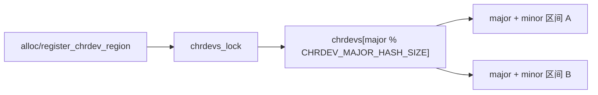
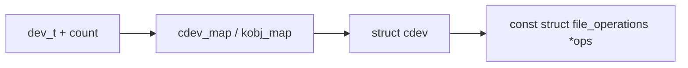
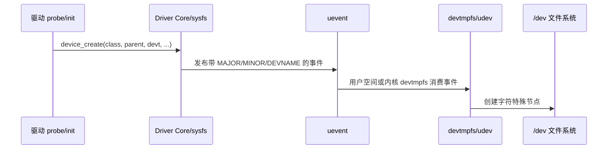
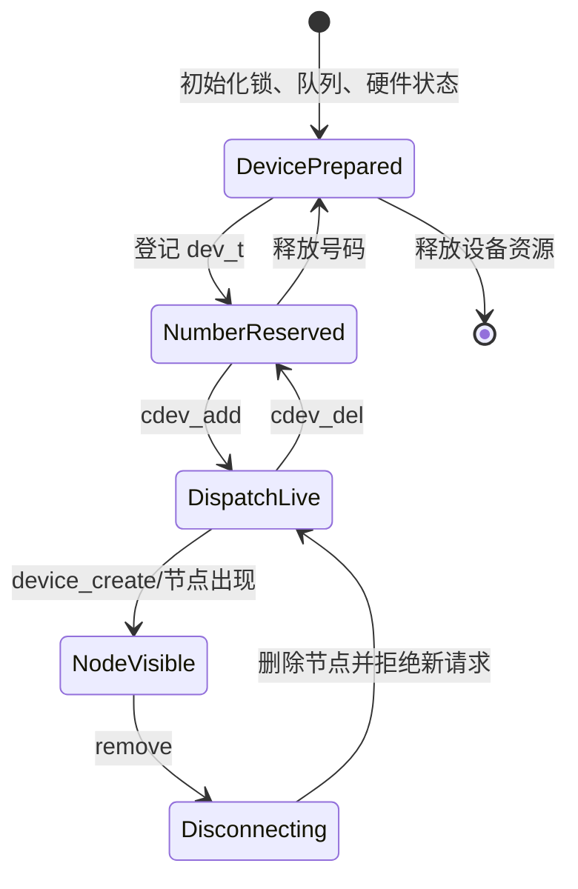

# 第2章\_设备号登记、cdev\_映射与设备节点

## 2.1\_“注册字符设备”其实包含三套状态

教程常把申请设备号、`cdev_add()` 和 `device_create()` 连写成初始化模板，于是读者容易误以为三者共同修改一张表。Linux 6.12 实际上把它们分开：

| 动作 | 建立的状态 | 直接消费者 |
| --- | --- | --- |
| `register_chrdev_region()` / `alloc_chrdev_region()` | 设备号范围占用登记 | 后续注册者和 `/proc/devices` |
| `cdev_add()` | `dev_t` 范围到 `struct cdev` 的运行时映射 | `chrdev_open()` |
| `device_create()` 或 `mknod` | 设备模型对象及/或文件系统特殊节点 | 用户路径查找、devtmpfs/udev |

**设备号登记负责避免冲突，`cdev_map` 负责内核分派，设备节点负责用户可达。** 任意两层都不能替代第三层。

## 2.2\_第一张表：设备号范围登记

`dev_t` 编码主设备号和次设备号。Linux 6.12 的 `fs/char_dev.c` 使用 `chrdevs[]` 哈希桶保存 `struct char_device_struct` 链表，其中记录：

- `major`：主设备号；
- `baseminor` 和 `minorct`：连续次设备号区间；
- `name`：登记名称；
- `cdev`：旧式组合接口可能关联的 cdev。

`__register_chrdev_region()` 在 `chrdevs_lock` 保护下检查区间重叠并插入记录。动态接口在未指定 major 时寻找可用主设备号。这里解决的是 **号码所有权冲突**，并没有让 `open()` 获得驱动回调。



接口边界：

- `register_chrdev_region(dev, count, name)`：调用者指定起始号码；
- `alloc_chrdev_region(&dev, baseminor, count, name)`：内核选择可用 major；
- `unregister_chrdev_region(dev, count)`：删除相同范围的占用记录。

多实例通常申请一个连续范围，但 **次设备号只是索引信息**。它怎样对应设备对象由驱动决定，不能默认使用 `minor` 直接索引一个永不变化的裸指针数组。

## 2.3\_第二张表：`cdev_map`\_运行时分派

`cdev_init()` 初始化 `struct cdev` 的 kobject 和 `ops`；`cdev_add()` 最终调用 `kobj_map(cdev_map, dev, count, ...)`，把设备号范围加入字符设备映射。



第一次打开相应 inode 时，`chrdev_open()` 通过 `kobj_lookup(cdev_map, inode->i_rdev, &idx)` 找到 `cdev`。所以：

- 只登记设备号但不调用 `cdev_add()`，号码虽被占用，打开时却没有分派对象；
- 只构造 `struct cdev` 但不加入映射，它仍只是驱动内存中的普通对象；
- `cdev_del()` 撤销映射，阻止以后通过该范围取得新的 `cdev`，但不能自动终止已经打开的 `struct file`。

## 2.4\_第三套状态：设备模型和文件系统节点

`device_create()` 在指定 class 下注册 `struct device`，并设置它的 `devt`。随后 sysfs 和 uevent 向用户空间暴露设备信息；devtmpfs 或 udev 可以据此创建 `/dev/demo0`。在精简系统中，也可以手工执行：

```bash
mknod /dev/demo0 c <major> <minor>
```

节点名称不参与内核字符设备分派。`/dev/demo0`、`/dev/other_name` 只要都是字符特殊文件且携带相同 `dev_t`，就会命中同一 `cdev` 映射。权限、所有者和安全策略仍可能使访问结果不同。



设备节点发布的完整事件机制属于 [设备模型专题](../../linux/device_model/大纲.md)。本章只关心它交付给字符设备链的结果：一个可经路径解析取得、`inode->i_rdev` 与注册号码一致的特殊文件。

字符设备与普通文件、pipe、socket 和 anon inode 在 VFS 接入方式上的区别，见 [特殊文件与伪文件系统接入](../../kernel_subsystems/vfs/P24_特殊文件与伪文件系统接入.md)。

## 2.5\_为什么初始化顺序必须区分“可见”与“可用”

稳妥顺序是先把内部状态准备完整，最后发布用户入口：



如果先发布节点再初始化锁、队列或硬件，用户可能在初始化尚未完成时成功进入 `open()`。失败回滚则按实际已完成阶段逆序执行，不能对尚未建立的对象调用销毁接口。

## 2.6\_多实例的对象关系

一个设备号范围可以覆盖多个实例，但每个实例通常拥有独立的设备状态和 `cdev`，从而避免在所有回调中重复进行全局查表：

```c
struct demo_device {
    struct cdev cdev;       /* 本实例的字符设备分派对象 */
    struct device *device; /* Driver Core 中的设备对象 */
    dev_t devt;            /* 本实例使用的设备号 */
    struct mutex lock;     /* 保护本实例共享状态 */
    bool disconnected;     /* remove 后拒绝新 I/O */
};
```

`cdev` 内嵌后，打开路径可通过 `container_of(inode->i_cdev, struct demo_device, cdev)` 找回实例。是否采用一个 cdev 覆盖整个范围，要由实例生命周期是否一致、查找方式和移除粒度决定，而不是为了少写几行初始化代码。

## 2.7\_销毁时三种“删除”的不同效果

| 操作 | 阻止什么 | 不能保证什么 |
| --- | --- | --- |
| `device_destroy()` | 撤销设备模型入口并促使节点消失 | 已打开 fd 不会因此关闭 |
| `cdev_del()` | 后续通过设备号新取得该 cdev | 已安装到旧 `file->f_op` 的调用不会自动消失 |
| `unregister_chrdev_region()` | 释放号码占用 | 不会释放设备内存或停止硬件 |

因此真实 `remove()` 还需要离线状态和引用排空。后续章节会沿旧 fd 继续存在的情况解释生命周期，不能把“节点看不见了”当作“对象没人使用了”。

## 2.8\_源码定位

Linux 6.12.20 证据位置：

- [`fs/char_dev.c`](../../../research/source_reading/linux/fs/char_dev.c)：`char_device_struct`、`__register_chrdev_region()`、`cdev_map`、`chrdev_open()`、`cdev_add()`、`cdev_del()`；
- [`include/linux/cdev.h`](../../../research/source_reading/linux/include/linux/cdev.h)：`struct cdev` 和公开接口；
- [`drivers/base/core.c`](../../../research/source_reading/linux/drivers/base/core.c)：`device_create()` 与设备注册；
- [`drivers/base/devtmpfs.c`](../../../research/source_reading/linux/drivers/base/devtmpfs.c)：devtmpfs 节点处理。

下一章沿用户 `open()` 进入 VFS，观察这三套状态第一次怎样汇合：[打开路径与文件操作](P03_打开路径与文件操作.md)。
