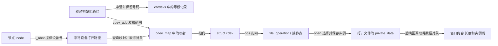
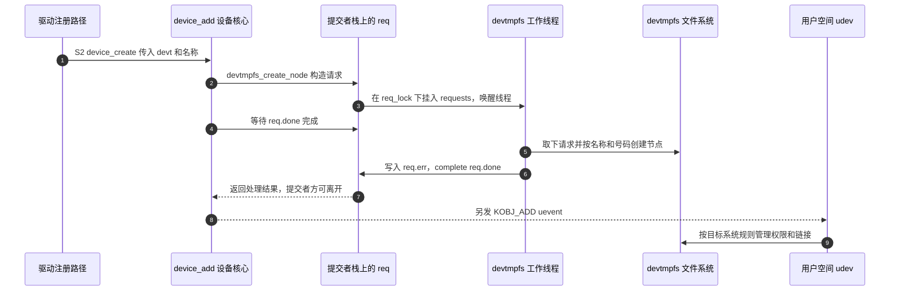

# 第2章\_设备号\_注册与设备节点

上一章已经把应用的一次访问接到驱动对象。本章停在打开之前，回答一个具体疑问：模块日志说“设备号申请成功”，为什么 `/dev` 中仍没有入口？即使手工建立节点，为什么打开还可能失败？

沿用一个保存字节的窗口设备。它需要有自己的数据、有一组不会冲突的号码、有根据号码选择操作的规则，还需要一条应用能使用的路径。下面先从路径实际保存的信息出发，再分别建立号码占用、字符设备映射和设备模型发布。读完后，应能判断失败发生在哪一层，并说明初始化失败为什么不能简单地把所有资源一律释放。

## 2.1\_节点保存号码并不保存驱动

在通常的 Linux 系统上，`ls -l /dev/null` 会显示字符设备类型以及主、次设备号。字符节点在文件系统中有一个 inode，`i_mode` 记录类型和权限，`i_rdev` 记录它表示的设备号。这里的 `i_rdev` 不要与“存放这个文件的文件系统所在设备号”混淆；我们关心的是这个特殊文件准备把访问送给谁。

组合设备号的内核类型是 `dev_t`。设备号宏 `MKDEV(major, minor)` 把主号和次号编码在一起，`MAJOR(dev)`、`MINOR(dev)` 再将其拆开。主号常用来组织一类服务的编号范围，次号由该服务解释；它们不是强制的“模块编号”和“硬件编号”。本章示意使用 `240:0`，实际实验必须读取本次得到的号码。

手工命令 `mknod 路径 c 主号 次号` 建立字符特殊文件，`c` 选择文件类型。它没有传入操作表，也没有装载内核代码，因此无法单独让驱动工作。节点通常放在 `/dev`，但“在 `/dev` 目录下”既不是字符类型的定义，也不保证已经连接到服务；支持特殊文件的其他文件系统位置同样可以保存节点，实际访问还受挂载选项和权限约束。

两个不同名称的字符节点保存同一个设备号时，会请求同一号码的分派。不过，两个节点的权限和安全策略可以不同，所以得到相同号码不等于每个访问者都能成功打开。多次独立打开的文件位置是否共享，则是下一章的打开对象问题。

## 2.2\_先取得号码的使用权

假设窗口准备使用 `240:0`，另一个驱动也想使用这个号码。仅有两份 C 变量分别存着相同数字，内核无法判断谁先取得了它。需要一份所有注册者共同遵守的占用记录：新请求先查是否重叠，成功后才把范围登记进去。

Linux 的接口将“指定号码”和“选择可用主号”分开：

| 接口 | 调用者提供什么 | 成功取得什么 |
| --- | --- | --- |
| `register_chrdev_region(dev, count, name)` | 起始完整设备号、数量和登记名称 | 对该号码区间的占用登记 |
| `alloc_chrdev_region(&dev, first_minor, count, name)` | 起始次号、数量和登记名称 | 内核选择可用主号，并把完整起始号写回 `dev` |
| `unregister_chrdev_region(dev, count)` | 曾经取得的同一范围 | 撤销占用，使后续申请者可再使用 |

动态分配不是随机数，也不承诺重新加载时仍取到原来的号。登记名称用于识别这份登记，例如在 `/proc/devices` 中观察；它不会替你创建同名路径，也不会被当成文件操作函数名。

在固定 Linux 6.12.20 源码中，占用记录是 `fs/char_dev.c` 的 `struct char_device_struct`。其 `major`、`baseminor`、`minorct` 保存主号、起始次号和数量，`name` 保存登记名，`cdev` 字段可供旧式组合接口关联对象。记录按主号散列到 `chrdevs[]`，登记和注销路径用 `chrdevs_lock` 互斥检查与修改。这个锁保护的是 **号段登记表**，不保护之后窗口里的字节。

到这里能够证明号码范围已被这份登记占用，却还不能回答“打开时调用哪个函数”。这是下一层必须补齐的关系。

## 2.3\_再让号码找到可以调用的操作

窗口的读取函数可能叫 `note_window_read`，但用户只给出路径。内核还需要“设备号范围 → 字符设备对象 → 文件操作表”的映射。`struct cdev` 是这条分派关系中的字符设备对象，其中的 `ops` 指向 `struct file_operations` 操作表；操作表再指向打开、读写等回调。

`cdev_init` 初始化驱动自己持有的 cdev 对象；`cdev_alloc` 则取得动态分配的 cdev。它们只是准备对象，尚未让设备号可以查到它。`cdev_add(cdev, dev, count)` 才将范围加入字符设备映射。固定版本中，这个入口通过 `kobj_map` 写入 `cdev_map`；首次需要解析相应 inode 时，`chrdev_open` 可用 `inode->i_rdev` 经 `kobj_lookup` 找到它。


```mermaid
flowchart LR
    init[驱动初始化路径] -->|申请并保留号码| numbers[chrdevs 中的号段记录]
    init -->|cdev_add 发布范围| map[cdev_map 中的映射]
    node[节点 inode] -->|i_rdev 提供设备号| lookup[字符设备打开路径]
    lookup -->|查询映射并取得对象| map
    map -->|指向| cdev[struct cdev]
    cdev -->|ops 指向| ops[file_operations 操作表]
    ops -->|open 选择并保存实例| file[打开文件的 private_data]
    file -->|后续回调取得数据对象| data[窗口内容 长度和实例锁]
```

这张图中的号段记录没有替代 `cdev_map`。只申请号码、不发布 cdev，节点可以存在但没有本驱动的分派关系；只初始化 cdev、不加入映射，它也只是内存中的对象。旧接口 `register_chrdev` 把号码和 cdev 的部分工作组合起来，不能据此认为底层只有一张表。

发布以后，另一任务可能立即打开已有节点，根本不必等初始化函数返回。这就是 `cdev_add` 的关键边界：从此刻起，回调将要访问的锁、数据、队列和生命期条件都必须成立。仅仅把新节点的创建放在它后面，不能阻挡早已存在的手工节点。

## 2.4\_设备对象怎样产生可见入口

应用还需要路径。手工模式直接按本次设备号执行 `mknod`；自动模式则先把设备告诉设备模型。`class` 把某类对外提供的设备组织起来，`struct device` 代表设备模型中的一个对象。`device_create` 在给定 class 下建立设备对象，并设置其 `devt`；这个号码来自前面申请的范围，不由节点名称推算。

设备核心发布信息时有两条方向不同的通信：内核直接请求 devtmpfs 处理节点；另外发出 uevent 设备事件，用户空间的 udev 等管理程序据此处理权限、属组、别名等策略。devtmpfs 是内核管理的节点文件系统，udev 是用户空间程序。没有 udev，并不表示 devtmpfs 不能建立节点。

下面把自动入口内部的一次请求展开。它属于下一节 S2 的工作；假设 devtmpfs 已启用、工作线程正常，相关挂载对应用可见。


```mermaid
sequenceDiagram
    autonumber
    participant D as 驱动注册路径
    participant C as device_add 设备核心
    participant R as 提交者栈上的 req
    participant T as devtmpfs 工作线程
    participant F as devtmpfs 文件系统
    participant U as 用户空间 udev
    D->>C: S2 device_create 传入 devt 和名称
    C->>R: devtmpfs_create_node 构造请求
    R->>T: 在 req_lock 下挂入 requests，唤醒线程
    C->>R: 等待 req.done 完成
    T->>F: 取下请求并按名称和号码创建节点
    T->>R: 写入 req.err，complete req.done
    R-->>C: 返回处理结果，提交者方可离开
    C-->>U: 另发 KOBJ_ADD uevent
    U->>F: 按目标系统规则管理权限和链接
```

`requests` 是内核中的共享请求链，`req_lock` 保护链的挂入和取出。一次调用的 `req` 位于提交者栈上，工作线程在完成处理前仍需访问它；`req.done` 是完成通知，`req.err` 保存处理结果。因此提交者必须等工作线程通知后才能结束这次调用。它没有把同一个请求对象交给用户空间，也不是轮询 `/dev` 等待碰巧看到文件。

这仍不是“`device_create` 成功就一定能在眼前看到节点”的保证。固定基线的 `device_add` 没有把 `devtmpfs_create_node` 的返回值传播成整体设备注册失败；devtmpfs 没有工作线程时，这条路径也不能替你创建节点。配置、挂载命名空间、已有文件及后续用户空间规则，都可能影响最终可见结果。设备对象、文件系统节点、用户空间策略应分别观察。

设备模型的完整事件职责见[设备模型专题](../../linux/device_model/大纲.md)。本章保留的交接条件是：应用的路径能够得到一个字符 inode，并且它的 `i_rdev` 对应本次服务。

## 2.5\_用同一周期检查发布与回滚

现在已经有四组状态：驱动数据是否准备好、号段是否保留、映射是否发布、路径是否可见。它们分别存在驱动对象、登记表、字符设备映射和文件系统中，并不是某个对象里一个枚举值控制的单一状态机。用户可访问性还受权限影响；旧打开文件的引用也不会因路径消失而自动撤销。

以第十章“整个模块一次创建全部窗口”的实现为例，按 S0～S4 走完一轮：

| 阶段 | 本阶段写入者与状态变化 | 谁随后读取，何时能进入下一阶段 |
| --- | --- | --- |
| S0 准备数据 | 模块初始化分配所有窗口，设置缓冲区、长度与锁 | 后续文件操作将读取这些对象；全部成功后才继续 |
| S1 保留号段 | 登记接口在号段表中插入占用记录 | 后续注册者查冲突，`/proc/devices` 提供观察；成功后才取得这份范围 |
| S2 建立入口 | 自动模式建立 device/devt，并走上一节请求；手工模式的节点由用户建立 | 路径查找可取得号码，但本驱动映射尚未开放 |
| S3 发布映射 | `cdev_add` 把整段号码接到已经准备好的操作和实例 | 字符打开路径可取得对象；本例之后不再安排可失败的初始化步骤 |
| S4 服务与撤销 | 回调使用实例；普通模块卸载满足引用条件后撤映射、删除自动入口、归还号码，最后释放内容 | 未持有新访问入口与仍持有旧引用是不同条件，后者必须按生命期协议处理 |

这条顺序让 S0～S2 及 S3 发布失败时仍可以直接回滚无人能进入的实例。代价是 S2 到 S3 之间，自动节点可能短暂可见而打开失败；实验在模块装载命令 `insmod` 成功返回后开始。手工节点可以提前存在，仍要在映射发布后才有本驱动的服务。

另一类驱动先发布 cdev，再建立设备对象或其他资源。这种顺序并非一概错误，但此后的失败已经属于 **访问可能开始之后的撤销**：必须考虑正在打开或已经打开的文件，而不是只按代码行反向释放内存。硬件独立热移除同样要处理离线状态和引用排空。第十章选用整组发布，是为了把这个边界明确收住，不是宣称所有驱动都必须按同一顺序注册。

## 2.6\_多个实例与三种删除各负责什么

连续次号可以先减起始次号，再选择实例数组；也可以让每个实例内嵌一个 cdev，由打开路径通过宏 `container_of` 找回外围对象。这个宏根据成员地址及成员在结构体内的偏移还原对象地址，前提是该成员确实属于指定类型的对象。一个 cdev 覆盖全组适合共同的操作表和整体生命周期；每实例 cdev 更便于表示独立映射，但不会自动解决旧文件引用。功能分段、稀疏次号和硬件身份继续见[多实例组织](../../linux/architecture/modules_and_device_nodes/Linux_内核模块与设备节点操作基础.md)。

撤销时要分别提出三个问题，而不是把它们统称为“删设备”：

| 动作 | 改变的状态 | 仍然存在的责任 |
| --- | --- | --- |
| `device_destroy` | 删除设备模型对象，促使对应自动节点撤销 | 手工别名可能仍在，旧描述符不会因此关闭 |
| `cdev_del` | 撤销号码到 cdev 的分派映射并放弃相应引用 | 旧打开文件的操作表和正在进行的请求需另外处理 |
| `unregister_chrdev_region` | 归还保留的号段 | 不清空缓冲区、不停止硬件，也不替驱动完成回收 |

删除路径只影响后续路径查找；打开文件已经取得的对象，不会每次读写都重新按名字寻找。若手工节点在模块卸载后留下，号段后来被另一个服务使用，再打开这个节点甚至可能进入另一个服务。因此节点清理和号码回收应配合实际所有权，不能把“路径还在”或“路径没了”单独作为驱动存在与否的证明。

## 2.7\_做一次只读的身份观察

在提供 `/dev/null` 与 Python 3 的普通 Linux 环境中，保存下面完整程序为 `inspect_null.py`。它不加载模块、不创建设备节点，只查询并打开现有空设备；不需要修改任何权限。

`os.stat` 沿路径查询属性，`os.fstat` 查询已经打开的描述符；两者的 `st_rdev` 都是本例要比较的特殊设备号。`stat.S_ISCHR` 是类型判断函数，打开标志 `os.O_RDONLY` 请求只读访问。先检查类型，再打开并复查，让“路径当前指向什么”和“实际已经打开什么”都成为可见结果。

```python
import os
import stat

path = "/dev/null"
before = os.stat(path)
if not stat.S_ISCHR(before.st_mode):
    raise SystemExit("当前 /dev/null 不是字符设备，停止实验")
print("path number:", os.major(before.st_rdev), os.minor(before.st_rdev))

descriptor = os.open(path, os.O_RDONLY)
try:
    opened = os.fstat(descriptor)
    if not stat.S_ISCHR(opened.st_mode) or opened.st_rdev != before.st_rdev:
        raise SystemExit("观察期间路径对象发生变化，停止实验")
    print("opened number:", os.major(opened.st_rdev), os.minor(opened.st_rdev))
    print("one read:", repr(os.read(descriptor, 1)))
finally:
    os.close(descriptor)
```

执行 `python3 inspect_null.py`。通常两行号值都是 `1 3`，一次读取显示 `b''`，即零字节。固定基线的 `drivers/char/mem.c` 将次号 3 关联到 null 操作，主号来自 `include/uapi/linux/major.h` 的宏 `MEM_MAJOR=1`。这解释了一条实际分派，并不表示自己的模块也应该申请这个号。

这个实验观察了路径对象、已经打开的对象和读取结果。它没有检查每条内部注册路径，更没有证明自制驱动正确；一组号码也不能区分卸载重装后占据同号的不同代对象。做自己的窗口实验时，继续使用 P11 的本次装载记录、节点核对和逐字节 probe，而不是照抄 `/dev/null` 的号码。

## 2.8\_回顾与练习

1. 号段申请成功，却未执行 `cdev_add`。手工节点已经存在，能否据此认为文件操作已经可调用？
2. 自动节点不见了，为什么仅凭 `device_create` 返回成功还不能排除节点路径的问题？
3. 在 S3 成功之后申请一个可能失败的资源，与在 S0 申请它相比，回滚责任增加在哪里？
4. 删除一个同号别名，会不会让另一条路径和已打开文件一同失效？

解答：第一题不能，号码占用和运行分派是两套状态。第二题中设备模型注册、devtmpfs 处理和用户当前挂载视图并不共享一个成功条件，还应分别核对。第三题增加了与并发访问、旧引用交接的责任，因为发布成功后应用可能已经进入回调。第四题通常只删除那一条目录入口；另一条路径和已经持有的对象各有自己的存在条件。若驱动同时标记离线，旧文件可能拒绝服务，但这来自驱动协议而不是路径删除本身。

本章按 NXP 官方固定提交 `dfaf2136deb2af2e60b994421281ba42f1c087e0`、Linux 6.12.20 核对。版本化专题从[字符设备源码阅读入口](../../../research/source_reading/character_device/navigation/P01_Linux_6.12_字符设备源码阅读索引.md)进入，当前已展开范围是有限缓冲区 I/O；本章注册与发布的原始证据位于 [`fs/char_dev.c`](../../../research/source_reading/linux/fs/char_dev.c)、[`include/linux/cdev.h`](../../../research/source_reading/linux/include/linux/cdev.h)、[`drivers/base/core.c`](../../../research/source_reading/linux/drivers/base/core.c) 与 [`drivers/base/devtmpfs.c`](../../../research/source_reading/linux/drivers/base/devtmpfs.c)。不把工作树后续实验提交当成版本依据，也不把实验预期写成当前目标已执行结果。

上一篇：[字符设备最小模型](P01_字符设备最小模型.md)。下一篇：[打开路径与文件操作](P03_打开路径与文件操作.md)，继续观察上述状态怎样在一次 open 中汇合。
