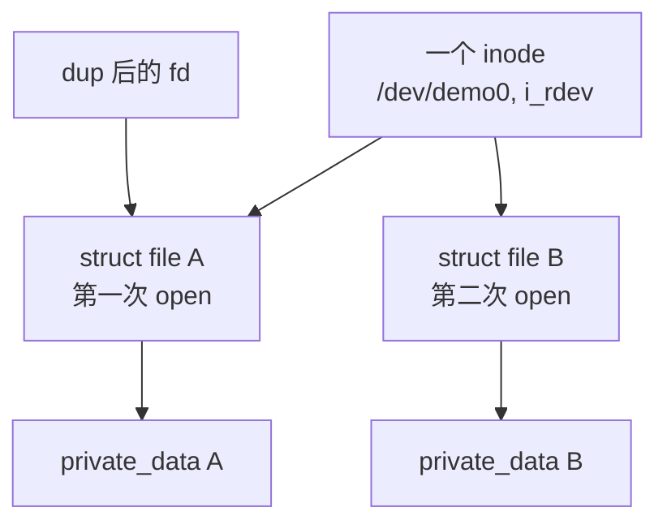
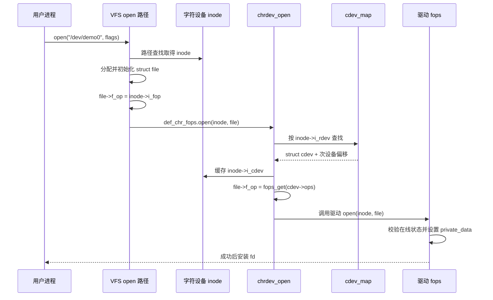
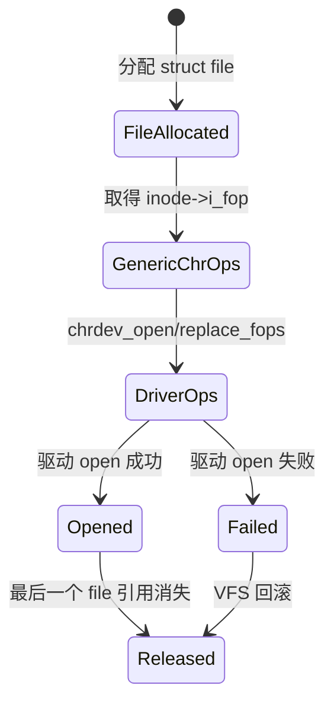

# 第3章\_VFS\_打开路径与字符设备分派

## 3.1\_本章在完整链中的位置

上一章建立了三套状态：设备号范围、`cdev_map` 和设备节点。本章回答它们怎样在一次 `open("/dev/demo0")` 中汇合。

这里不是 VFS 的完整教程。文件系统注册、挂载、路径查找、缓存和通用生命周期由 [VFS 子系统专题](../../kernel_subsystems/vfs/大纲.md)维护；本章只完整展开 **VFS 与字符设备相交的调用链**，保证字符设备主线不断。

阅读本章前，应先理解 VFS 的 [状态与对象拓扑](../../kernel_subsystems/vfs/P03_VFS_状态与对象拓扑.md)和 [open 状态机](../../kernel_subsystems/vfs/P12_open状态机.md)。本章从 VFS 已取得字符特殊文件 inode、正在执行 `do_dentry_open()` 的交接点开始，不重复路径查找和 fd table 的完整实现。

## 3.2\_先分清路径对象与打开对象

| 对象 | 形成时间 | 代表什么 | 字符设备关心的字段 |
| --- | --- | --- | --- |
| `dentry` | 路径查找和缓存期间 | 名称到 inode 的关联 | 指向对应 inode |
| `inode` | 文件系统实例化文件对象时 | 文件系统中的一个对象 | `i_mode`、`i_rdev`、`i_cdev` |
| `file` | 每次成功打开时 | open file description | `f_flags`、`f_pos`、`f_op`、`private_data` |
| fd | 安装进进程文件表时 | 指向 `struct file` 的整数索引 | 可被 `dup/fork` 共享底层 file |

同一 `/dev/demo0` 的多次 `open()` 通常共用 inode，却产生不同 `struct file`。`dup()` 不会重新执行驱动 `open()`，它只是给同一 `struct file` 增加一个引用和新的 fd。

这些对象的通用创建和释放规则见 [fd table 与 open file description](../../kernel_subsystems/vfs/P13_fd_table与file生命周期.md)。字符设备特有状态从 `inode->i_rdev/i_cdev`、`cdev_map` 和 `file->private_data` 开始。



## 3.3\_VFS\_怎样走到字符设备入口

Linux 6.12 的主干可以压缩为：

```text
open/openat/openat2
  -> do_sys_openat2()
     -> do_filp_open()
        -> path_openat()
           -> do_open()
              -> vfs_open()
                 -> do_dentry_open()
                    -> file->f_op = fops_get(inode->i_fop)
                    -> file->f_op->open(inode, file)
```

路径查找取得字符特殊文件 inode 后，`inode->i_fop` 指向字符设备的默认操作表 `def_chr_fops`，其 `.open` 是 `chrdev_open()`。此时驱动自己的操作表还没有安装到 `file->f_op`。



## 3.4\_`chrdev_open()`\_的状态和锁

`fs/char_dev.c:chrdev_open()` 的关键工作不是一句“找到 cdev”可以概括的：

1. 读取 `inode->i_cdev`，判断该 inode 是否已经缓存分派对象；
2. 首次打开时调用 `kobj_lookup(cdev_map, inode->i_rdev, &idx)`；
3. 在 `cdev_lock` 保护下再次检查缓存，处理多个 CPU 同时首次打开同一 inode；
4. 把 inode 加入 `cdev->list`，并保存 `inode->i_cdev`；
5. 通过 `fops_get(p->ops)` 取得驱动操作表及其 owner 模块引用；
6. 使用 `replace_fops(filp, fops)` 替换默认字符设备操作表；
7. 若驱动实现 `.open`，再调用驱动 `open()`。

这里存在两级复用：`cdev_map` 提供第一次查找，`inode->i_cdev` 为以后打开缓存结果。缓存不是无生命周期裸指针；inode 被清理或 `cdev` 被删除时，字符设备代码还要维护 `cdev->list` 中的 inode 关联。

## 3.5\_为什么要替换\_`file->f_op`

系统调用后续拿到的是 `struct file`，不是每次重新从路径和设备号开始查找。打开成功后，驱动操作表已经固定在 `file->f_op`：



因此 `cdev_del()` 只能阻止以后的映射查找，已经打开的 `file` 仍可能保存驱动 `f_op`。安全移除必须另设 `disconnected` 状态并保证设备对象、操作表所属模块和请求状态仍然有效。

## 3.6\_驱动\_`open()`\_应该建立什么

推荐把设备共享状态和打开实例状态分开：

```c
struct demo_file_ctx {
    struct demo_device *dev; /* 持有或依赖设备对象引用 */
    u32 mode;                /* 本次打开的配置 */
    bool async_enabled;      /* 本次打开是否订阅异步通知 */
};
```

典型步骤是：

1. 通过 `inode->i_cdev` 和 `container_of()` 找到设备实例；
2. 在合适的锁或引用保护下检查设备是否已离线；
3. 取得保证设备对象活到 `release()` 的引用；
4. 分配并初始化打开上下文；
5. 把上下文保存到 `file->private_data`；
6. 若任何步骤失败，按逆序撤销，不把半初始化上下文留给后续回调。

```c
static int demo_open(struct inode *inode, struct file *file)
{
    struct demo_device *dev;
    struct demo_file_ctx *ctx;

    dev = container_of(inode->i_cdev, struct demo_device, cdev);

    ctx = kzalloc(sizeof(*ctx), GFP_KERNEL);
    if (!ctx)
        return -ENOMEM;

    mutex_lock(&dev->lock);
    if (dev->disconnected) {
        mutex_unlock(&dev->lock);
        kfree(ctx);
        return -ENODEV;
    }
    /* 真实可热拔驱动应在此取得相应设备引用。 */
    ctx->dev = dev;
    mutex_unlock(&dev->lock);

    file->private_data = ctx;
    return 0;
}
```

示例只表达状态分层，不能凭注释自动获得生命周期安全。应使用哪种引用，取决于设备对象是 `kref`、`struct device`、USB 接口对象还是其他子系统对象。

## 3.7\_后续文件操作怎样分派

打开以后，`read/write/unlocked_ioctl/poll/mmap/release` 都从 `file->f_op` 进入驱动。驱动通常从 `file->private_data` 取得本次打开上下文，再访问共享设备状态：


VFS 负责调用约定，但不会自动串行化同一驱动的全部回调。两个不同 `struct file`、共享同一 file 的线程、IRQ 和 DMA 完成回调都可能并发访问设备对象。下一章由此进入状态、锁、等待和移除问题。

## 3.8\_失败路径不能省略

- 路径或权限失败：尚未进入字符设备分派；
- `kobj_lookup()` 找不到 cdev：返回 `-ENXIO`；
- `fops_get()` 不能取得操作表/模块引用：打开失败；
- 驱动 `open()` 返回错误：fd 不会安装给用户，VFS 释放 file；
- 设备在查找和驱动 `open()` 之间开始移除：驱动仍需用自己的在线状态和引用规则裁决。

最后一项说明 `cdev_map` 只解决分派对象查找，并不替具体驱动完成热拔除同步。

## 3.9\_源码定位

Linux 6.12.20：

- [`fs/open.c`](../../../research/source_reading/linux/fs/open.c)：`do_sys_openat2()`、`do_dentry_open()`、`vfs_open()`；
- [`fs/namei.c`](../../../research/source_reading/linux/fs/namei.c)：`do_filp_open()` 和路径打开状态机；
- [`fs/char_dev.c`](../../../research/source_reading/linux/fs/char_dev.c)：`def_chr_fops`、`chrdev_open()`、`cdev_map`；
- [`include/linux/fs.h`](../../../research/source_reading/linux/include/linux/fs.h)：inode、file、file_operations；
- [`include/linux/cdev.h`](../../../research/source_reading/linux/include/linux/cdev.h)：cdev 对象。

下一章承接 `file->private_data -> 设备对象` 这条边，解释多个执行上下文怎样通信以及设备移除为何困难：[文件操作并发与生命周期](P04_文件操作并发与生命周期.md)。
