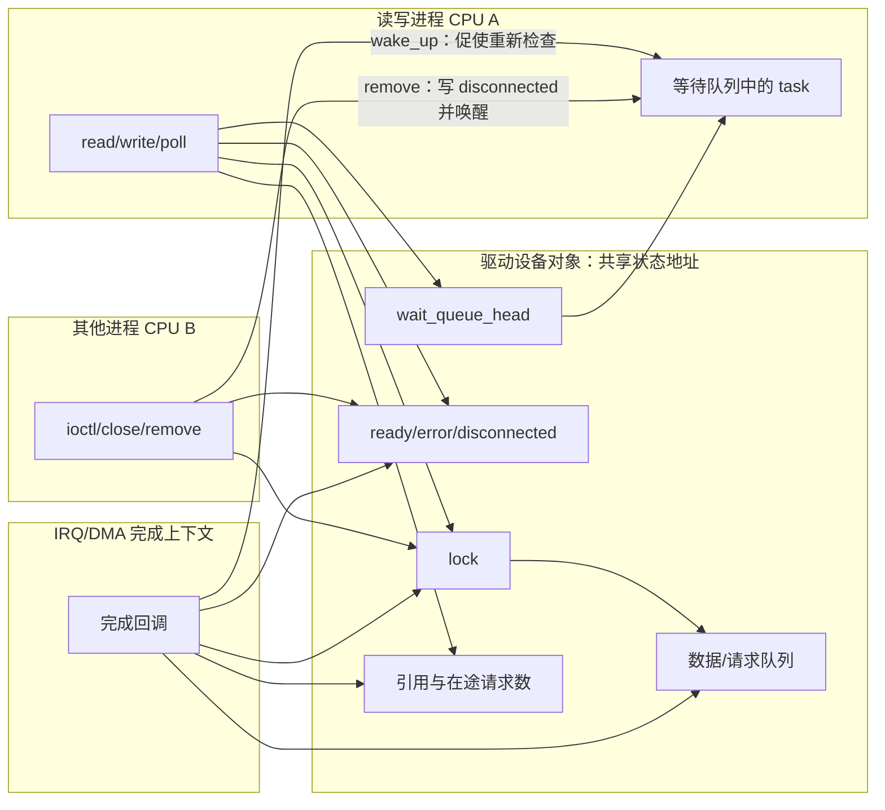
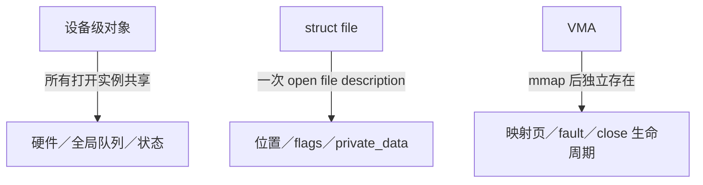
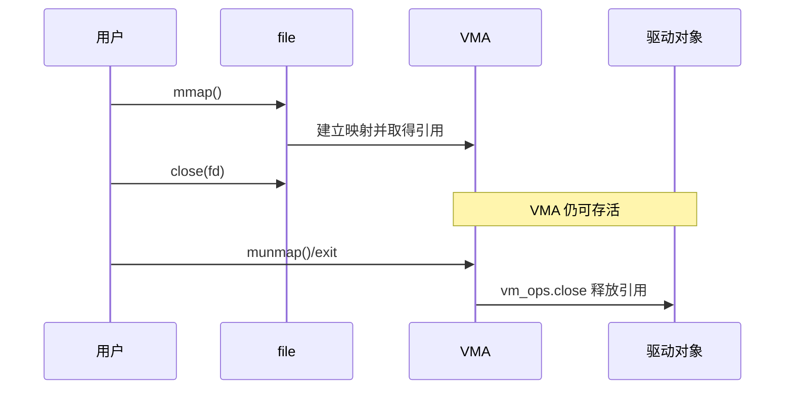

# 第4章\_字符设备文件操作并发与生命周期

本章承接上一章的 `file->private_data -> 设备对象`。打开路径已经把调用送到正确实例，但它没有回答：进程、IRQ 和 DMA 回调怎样交换状态，设备移除时谁阻止新请求，以及最后一个旧引用由谁释放。

## 4.1\_先画清角色、状态地址和通知方向



交互并不依赖“某个 CPU 猜另一个 CPU 是否仍在回调中”。各执行上下文访问 **同一个设备对象或请求对象中的状态地址**：

- 锁规定谁能并发修改队列和状态；
- `ready/error/disconnected` 保存可重复检查的事实；
- 等待队列保存等待者并提供唤醒通道；
- 引用或在途计数阻止对象在旧访问完成前释放。

> **状态负责记住发生了什么，通知负责让观察者及时重新运行，生命周期机制负责保证保存状态的地址仍然存在。** 三者缺一不可。

## 4.2\_先分清三个共享层次



一次成功 `open()` 通常创建新的 open file description 和 `struct file`，但 `dup()`、`fork()` 等可以让多个 fd 共享同一个 `struct file`。因此不能把 `struct file` 简化成“每进程独立”或“每个 fd 永远独立”。

VFS 如何发布 fd、取得 file 引用以及在最后引用消失后执行 `fput()`，见 [fd table 与 file 生命周期](../../kernel_subsystems/vfs/P13_fd_table与file生命周期.md)。本章从驱动已经收到 file 回调以后开始，关注设备对象、会话、请求和 VMA 的附加生命周期。

`file->private_data` 常指向每次打开的会话对象，也可以指向设备对象。选哪一种决定 read/write/ioctl/poll/release 之间共享什么状态。

## 4.3\_VFS\_不会替驱动串行化所有回调

同一设备可以被多个任务并发 open，不同或共享 `struct file` 上的 read/write/ioctl/poll 也可能并发。VFS 的局部锁不能替代驱动对硬件、队列和私有状态的同步设计。

| 回调 | 上下文 | 典型并发 |
| --- | --- | --- |
| `open()` | 进程上下文，可睡 | 多任务同时打开、与 remove 竞争 |
| `read()/write()` | 进程上下文，通常可睡 | 多 fd、共享 file、信号和超时 |
| `unlocked_ioctl()` | 进程上下文，通常可睡 | 与数据路径和配置路径并发 |
| `poll()` | 进程上下文 | 高频调用、与 IRQ/worker 更新条件并发 |
| `mmap()`/VMA callbacks | 建立映射及后续 VMA 生命周期 | fork、munmap、进程退出、remove |
| `release()` | 最后一个 file 引用释放时 | 不等于每个 `close(fd)` 都立即调用 |

## 4.4\_open\_与每次打开状态

```c
struct my_file_ctx {
    struct my_device *mdev;
    struct mutex lock;
    u32 mode;
};

static int my_open(struct inode *inode, struct file *file)
{
    struct my_device *mdev = container_of(inode->i_cdev,
                                          struct my_device, cdev);
    struct my_file_ctx *ctx;

    if (!kref_get_unless_zero(&mdev->ref))
        return -ENODEV;

    ctx = kzalloc(sizeof(*ctx), GFP_KERNEL);
    if (!ctx) {
        kref_put(&mdev->ref, my_device_release);
        return -ENOMEM;
    }

    mutex_init(&ctx->lock);
    ctx->mdev = mdev;
    file->private_data = ctx;
    return nonseekable_open(inode, file);
}
```

是否允许多个打开实例，应由明确的设备语义决定。独占设备可在设备锁下维护 open 状态；不要用无保护的布尔变量检查后再设置。

## 4.5\_read/write\_的锁与等待边界

阻塞读取常组合“等待队列 + 锁”：

1. 不持 mutex 地等待数据条件，避免生产者无法取得锁；
2. 醒来后取得 mutex；
3. 重新检查数据和 disconnected 状态；
4. 复制或移动队列内容；
5. 解锁并返回。

```c
ret = wait_event_interruptible(mdev->readq,
        data_available(mdev) || READ_ONCE(mdev->disconnected));
if (ret)
    return ret;

ret = mutex_lock_interruptible(&mdev->lock);
if (ret)
    return ret;

if (mdev->disconnected)
    ret = -ENODEV;
else
    ret = copy_one_record(mdev, buf, count);

mutex_unlock(&mdev->lock);
return ret;
```

条件必须在修改后唤醒，并在锁或明确内存序下读取。`READ_ONCE()` 本身不替代保护复合队列状态的锁。

## 4.6\_poll\_的注册再检查

`.poll()` 本身不能阻塞等待事件，但 `poll_wait()` 只是把当前 poll table 登记到等待队列，不会在回调里睡眠：

```c
static __poll_t my_poll(struct file *file, poll_table *wait)
{
    struct my_file_ctx *ctx = file->private_data;
    struct my_device *mdev = ctx->mdev;
    __poll_t mask = 0;

    poll_wait(file, &mdev->readq, wait);

    spin_lock_irq(&mdev->qlock);
    if (!queue_empty(mdev))
        mask |= EPOLLIN | EPOLLRDNORM;
    if (mdev->disconnected)
        mask |= EPOLLHUP | EPOLLERR;
    spin_unlock_irq(&mdev->qlock);
    return mask;
}
```

先注册等待队列、再检查状态，可以避免事件发生在“检查”和“登记”之间而丢失通知。生产者修改条件后调用匹配的 `wake_up_interruptible_poll()` 或其他唤醒接口。

## 4.7\_ioctl\_控制面

ioctl 经常修改设备全局配置，应明确：

- 哪些命令可以与 read/write 并发；
- 哪些命令必须在设备 mutex 下串行；
- 长时间硬件操作是否应拆成“锁内改状态、锁外等待、锁内提交”；
- `copy_from_user()/copy_to_user()` 失败和信号路径如何回滚；
- 32/64 位兼容结构是否由 `.compat_ioctl` 正确处理。

不要持自旋锁调用用户拷贝；用户缺页可能睡眠。也不要在锁外使用未经保活的设备对象。

## 4.8\_mmap\_改变了生命周期

`mmap()` 返回后，即使 fd 已关闭，VMA 仍可能因为 fork、拆分或进程继续运行而存在。必须使用 `vm_operations_struct` 和合适引用把映射对象保活到最后一个 VMA 关闭。



把 MMIO 直接映射给用户具有安全和并发风险，必须限制页范围、权限和缓存属性，并核对设备是否允许用户与内核同时访问寄存器。DMA 缓冲使用 DMA API 提供的 mmap helper，不能把 CPU 虚拟地址随意 `remap_pfn_range()`。

## 4.9\_remove\_与旧文件描述符

remove 不能假定所有用户已经 close，也不应无限等待用户关闭 fd。常见设计：

1. 删除 cdev/device node 或以其他方式阻止新 open；
2. 在锁下标记 disconnected；
3. 唤醒阻塞的 read/poll，使其返回 `-ENODEV`/HUP；
4. 停止硬件，关闭 IRQ、timer、DMA 和 work；
5. 让纯软件会话对象由最后一个 file/VMA 引用释放；
6. 旧回调不得再访问 detach 后释放的 devm 资源。

device 引用不等于 driver binding 引用，不能仅靠 `get_device()` 延长 devm MMIO、IRQ 或 DMA 资源的寿命。详见[生命周期集成专题](../../linux/object_lifetime/integration/大纲.md)。

## 4.10\_release\_的职责

`.release()` 在最后一个 `struct file` 引用消失时清理每次打开状态：

```c
static int my_release(struct inode *inode, struct file *file)
{
    struct my_file_ctx *ctx = file->private_data;

    kref_put(&ctx->mdev->ref, my_device_release);
    kfree(ctx);
    return 0;
}
```

它不应释放 probe 阶段所有打开实例共享的设备资源。共享硬件资源在 remove/driver detach 路径停止，私有会话资源在 release 释放，两者必须分层。

## 4.11\_常见错误

| 错误 | 后果 |
| --- | --- |
| 认为每个 fd 都有独立 `struct file` | dup/fork 后共享状态发生竞态 |
| 认为 VFS 会串行化 fops | 多任务并发破坏设备状态 |
| 持 mutex 调用 `wait_event()`，生产者也需该锁 | 永久死锁 |
| poll 先检查再 `poll_wait()` | 丢失检查—登记窗口中的事件 |
| close fd 就释放 mmap 后端 | VMA 后续访问 UAF |
| remove 等所有用户主动 close | 热拔出或 unbind 永久阻塞 |
| `get_device()` 被当作 devm 资源保活 | device 在，但 driver 资源已释放 |
| release 释放设备级共享资源 | 其他打开实例继续访问已释放对象 |

## 4.12\_核对表

- 状态属于设备、open file description 还是 VMA？
- dup/fork 后共享同一 `struct file` 是否安全？
- read/write/ioctl/poll 的锁顺序和等待边界是否一致？
- poll 是否先登记等待队列再检查状态？
- remove 如何阻止新入口并唤醒旧等待者？
- fd/VMA 如何保活纯软件对象，又如何避免访问已释放的绑定资源？
- release 是否只清理每次打开状态？
