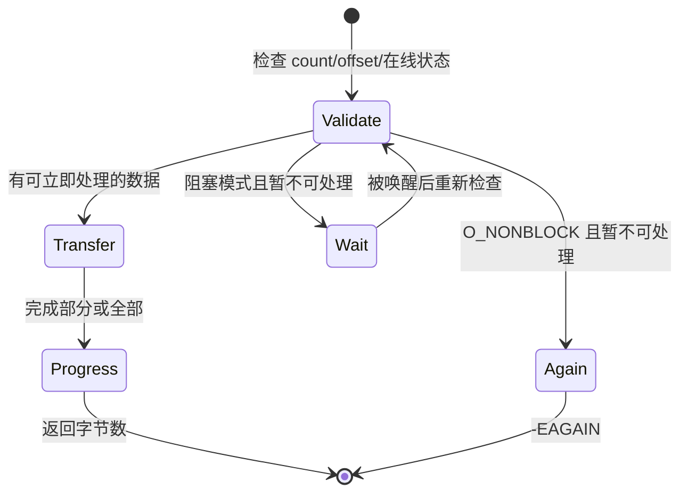

# 第5章\_文件操作契约与数据路径

## 5.1\_从打开实例进入一次请求

`open()` 已把上下文放入 `file->private_data`。后续回调的共同主线是：**解释用户请求 → 检查设备状态 → 取得或提交数据 → 更新请求进度 → 返回 VFS 契约规定的结果**。

VFS 负责分派，驱动负责设备语义。VFS 不会自动保证一次请求完整传输，也不会替驱动选择锁。

普通文件的 `vfs_read/vfs_write`、`kiocb`、`iov_iter` 和文件位置规则见 [VFS read/write 分派](../../kernel_subsystems/vfs/P14_VFS_read_write分派.md)。字符设备仍遵守字节数、短传输和 errno 契约，但其数据通常进入驱动缓冲区或硬件，而不是普通文件的 `address_space` 页缓存。

## 5.2\_`read()`\_和\_`write()`\_的返回值是协议

- 正数表示实际完成的字节数，可以小于请求长度；
- `0` 对 `read()` 通常表示 EOF，对设备是否合理由设备协议决定；
- 负数是尚未传输任何字节时的错误；
- 已完成部分传输后才发生错误，通常先返回已完成字节，让下一次调用观察后续状态；
- 非阻塞且当前不能前进时返回 `-EAGAIN`，不能假装 EOF；
- 被信号打断且尚无进度时，阻塞等待通常返回 `-ERESTARTSYS`。

`copy_to_user()` 和 `copy_from_user()` 返回 **未复制字节数**，不是负 errno。驱动必须据此计算实际进度，不能直接把返回值交给用户。

## 5.3\_文件位置与设备协议

`loff_t *ppos` 是否有意义取决于设备：内存窗口可以支持位置；事件流通常不可寻址；寄存器访问若用文件偏移编码，必须固定 ABI 和边界。不能因为模板里存在 `f_pos` 就默认所有设备都支持 `llseek()`。

## 5.4\_锁不能覆盖用户复制和无限等待

设备锁通常保护队列、缓冲区索引、配置和离线状态。通用顺序是：在锁内检查并预留状态，必要时释放锁等待，醒来后重新取得锁验证；用户复制是否放在锁外要结合缓冲区所有权设计。持有自旋锁时不能执行可能缺页和休眠的用户复制。

## 5.5\_`ioctl()`\_是长期用户\_ABI

命令用 `_IO/_IOR/_IOW/_IOWR` 编码类型、编号、方向和参数大小。处理流程至少包括命令校验、参数复制、权限/状态检查和兼容性设计。不要把内核指针、含 `long` 或隐式填充的内部结构直接暴露给用户；发布后的命令布局应视为稳定 ABI。

32 位进程运行在 64 位内核时，若结构布局不同，需要 `.compat_ioctl` 或使用天然兼容的固定宽度布局。控制面也必须与 `read/write`、IRQ 和 remove 共享明确的锁与离线状态。

## 5.6\_同步与异步数据路径的分叉

同步路径在回调内完成并返回；异步路径只提交请求，完成事实稍后由 IRQ/DMA 回调写入请求或设备状态。阻塞调用可以等待该状态，非阻塞调用返回 `-EAGAIN` 或请求句柄，具体由 ABI 决定。

下一章专门解释反向通信链：[阻塞、poll 与异步通知](P06_阻塞_poll与异步通知.md)。
