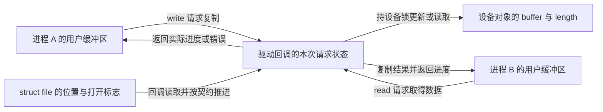
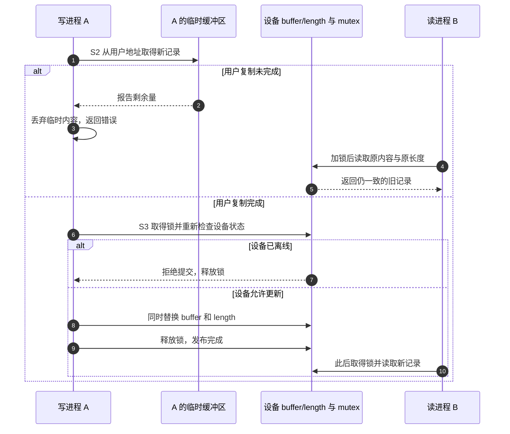

# 第5章\_文件操作契约与数据路径

[上一章](P04_文件操作并发与生命周期.md)已经分清设备共享状态和一次打开的状态。现在用户向内存型设备写入 `ABCDEF`，随后请求读取四个字节。驱动该返回什么、下一次从哪里读，看起来只差几行复制代码。可是一旦复制在中途失败，或者另一个进程在两次读取之间更新设备，这几行代码就开始决定应用能否恢复自己的进度。

本章以“保存一段字节的设备”为贯穿例子，先确定读写承诺，再决定状态何时改变。读写是 I/O（Input/Output，输入/输出）操作；这里只讨论文件操作的契约和实现模式，完整注册与装卸代码在后面的驱动模板中组合。设备可以由内存模拟，不必先连接外设。

## 5.1\_一次请求实际上牵动了哪些状态

用户程序提供缓冲区和长度，内核回调收到 `struct file`，再由已经建立的 `file->private_data` 找到设备或打开上下文。用户缓冲区属于进程，设备缓冲区属于驱动，它们不是两种名称指向同一片内存。驱动必须明确什么时候把一边的数据交给另一边。


```mermaid
flowchart LR
    A[进程 A 的用户缓冲区] -->|write 请求复制| C[驱动回调的本次请求状态]
    B[进程 B 的用户缓冲区] -->|read 请求取得数据| C
    F[struct file 的位置与打开标志] -->|回调读取并按契约推进| C
    C -->|持设备锁更新或读取| D[设备对象的 buffer 与 length]
    C -->|返回实际进度或错误| A
    C -->|复制结果并返回进度| B
```

图中的请求状态可以只是回调栈上的 `count`、`done` 和局部位置，不一定需要分配一个新结构。设备数据则必须活得比一次回调更久。假设当前 `length=6`、数据为 `ABCDEF`，一个打开实例的位置为零；另一个独立 `open` 通常有自己的位置，两者依然共享同一个设备缓冲区。通过 `dup` 或 `fork` 共享同一打开文件描述的情况，沿用上一章的规则。

这不是由一个数字控制的单一状态机，而是 **设备内容、打开位置、请求进度** 三组相互配合的状态。采用“按位置传输字节”的协议时，一次请求可以划为：

| 阶段 | 进入条件与读取者 | 写入者和状态位置 | 退出条件 |
| --- | --- | --- | --- |
| S0 接受请求 | 回调取得用户地址、长度与 `*ppos` | 本次回调保存局部参数；尚未改设备内容 | 参数与设备状态允许继续 |
| S1 确定范围 | 回调在保护下读取设备长度、容量及位置 | 回调计算本次最多传输量 | 得到合法范围，或按协议返回末尾结果、容量错误等 |
| S2 执行复制 | 用户访问帮助函数在两片地址空间之间复制 | 读时修改用户缓冲区；写时修改选定的设备区域或临时区 | 得到实际完成量和剩余量 |
| S3 提交进度 | 回调解释 S2 结果 | 按实际完成量推进位置、有效长度等相关状态 | 所有对后续请求可见的状态保持一致 |
| S4 返回 | 通用文件接口将回调结果传回进程 | 进程按返回值推进自己的缓冲区与剩余请求 | 本次请求结束；需要时再次调用 |

其中 VFS（Virtual Filesystem，虚拟文件系统）负责通用文件接口的分派，驱动负责设备数据语义。通用 `read/write` 分派、迭代式 I/O 对象及普通文件的位置处理见[VFS 对应章节](../../kernel_subsystems/vfs/P14_VFS_read_write分派.md)。字符设备的数据通常进入驱动内存或硬件，不能据此假定它拥有普通文件的页缓存、截断或追加行为。

## 5.2\_返回值告诉应用从哪里继续

请求四个字节不代表驱动必须一次交付四个。假设当前位置是 4，而设备里只有六个有效字节，那么范围只剩 `EF`：返回 2，位置推进到 6。下一次请求正长度数据时，若设备采用有限内存窗口协议，就返回 0，表示当前到达末尾。

正数表示 **实际完成的字节数**，小于请求量称为短传输。应用应根据正数推进自己的地址和剩余长度，不能把“短”直接当成失败。负值表示内核错误码；例如 `EFAULT` 是地址访问失败的错误码名。用户态系统调用一般表现为返回 `-1` 并设置 `errno`，不能把内核回调的 `-EFAULT` 当成用户程序会直接收到的整数。

几个容易混在一起的零与错误应分别解释：

- 正长度 `read` 返回零，应用通常据此判断 EOF（End Of File，读取结束）。有限内存设备可以如此定义；暂时没到事件的流式设备通常应等待或报告暂不可用。
- 长度本来就是零的请求，应按设备契约完成无数据操作，不能因此清空整个缓冲区，也不要把它解释成一次有效的 EOF 探测。
- 非阻塞请求当前不能取得任何数据，通常返回 `-EAGAIN`；它告诉调用者稍后再试，不是告诉调用者流已经结束。
- 等待期间受到信号影响且没有进度时，常见内核路径返回 `-ERESTARTSYS`，由系统调用退出路径决定重启或向用户态报告中断。
- 已完成部分传输后才遇到问题，字节流接口通常先报告完成量。对具体设备是否有更严格的事务语义，必须查它自己的协议。

同样不能在正长度写入且没有进度时反复返回零，迫使用户程序无休止重试。有限容量设备究竟报告 `-ENOSPC`、等待腾出空间还是短写，需要事先选定，不能从一个模板的返回语句反推所有设备都如此。

## 5.3\_复制失败并不意味着什么都没发生

`copy_to_user` 把内核数据交给用户缓冲区，`copy_from_user` 从用户地址取数据。它们返回的是 **未复制的字节数**，不是已经复制的字节数，也不是负错误码。若请求 4 字节、返回 1，就已经完成了 3 字节；不能把这个 1 原样作为 `read` 返回值。

对一次有限缓冲区读取，S2、S3 的推导是：

```text
本次允许量 = min(请求量, 有效长度 - 当前位置)
剩余量 = 用户复制函数的返回值
完成量 = 本次允许量 - 剩余量
完成量为零且复制失败：报告 EFAULT，不推进位置
完成量为正：位置增加完成量，返回完成量
```

先验证位置非负且未到末尾，才做减法；否则把负位置转换成无符号长度，或先发生无符号下溢，可能把一次小请求变成越界访问。实际实现还应保证计算中的类型和范围匹配。

按这个约定，从 `ABCDEF` 的位置 0 读取 4 字节，但只复制成功 3 字节时，用户得到 `ABC`，返回值为 3，位置为 3。下一次就从 `D` 继续。若把位置推进 4，会丢掉 `D`；若完全不推进，下一次又会重复 `ABC`。

Linux 已有 `simple_read_from_buffer` 和 `simple_write_to_buffer` 等有限缓冲区帮助函数。先从[本专题版本源码阅读索引](../../../research/source_reading/character_device/navigation/P01_Linux_6.12_字符设备源码阅读索引.md)确定边界，再看[读取进度的具体实现](../../../research/source_reading/character_device/source_explanations/fs/libfs.c.md#1.1_simple_read_from_buffer)。帮助函数兑现局部复制与位置规则，**不负责替调用者加锁、保存对象生命期或决定完整设备协议**。

写入有一个更隐蔽的问题：复制失败前，目标中的一部分字节可能已经改变。普通 `copy_from_user` 的短复制还可能把未复制的目标尾部填零；不能把“没有更新 length”当成“设备内容没变”。临时缓冲区也不是可有可无的装饰，它决定能否在复制失败时保留旧状态。

## 5.4\_先选择字节进度还是整条替换

现在增加一个真实需求：用户每次写入的是一份完整设置文本，要求新文本完整到达才替换旧文本。原来的“复制多少就提交多少”对字节流有价值，却会让设置变成新旧内容拼接的半成品。

因此要分清两个合法但不同的协议：

| 协议 | 成功与部分失败的含义 | 适用条件与代价 |
| --- | --- | --- |
| 按位置传输字节 | 可以提交前缀并返回短写，位置按实际进度推进 | 适合可分段数据；调用者必须处理短传输，不能期待一次请求全成或全败 |
| 完整替换一条记录 | 先完整取得新记录，再一次发布；复制失败保留旧记录 | 适合有明确大小上限的设置或消息；需要临时存储和提交步骤，超限应明确拒绝 |

替换协议把 S2 的写入目的地改为 **本次请求私有的临时区**。取得完整内容以后，S3 才在设备锁内检查设备是否仍允许更新，并同时发布内容与长度。若需要校验文本格式，也应在发布前完成。代价是多一份临时存储与可能的一次内存复制；记录很大或需要持续流式吞吐时，不应机械采用这个办法。


```mermaid
sequenceDiagram
    autonumber
    participant A as 写进程 A
    participant T as A 的临时缓冲区
    participant D as 设备 buffer/length 与 mutex
    participant B as 读进程 B
    A->>T: S2 从用户地址取得新记录
    alt 用户复制未完成
        T-->>A: 报告剩余量
        A->>A: 丢弃临时内容，返回错误
        B->>D: 加锁后读取原内容与原长度
        D-->>B: 返回仍一致的旧记录
    else 用户复制完成
        A->>D: S3 取得锁并重新检查设备状态
        alt 设备已离线
            D-->>A: 拒绝提交，释放锁
        else 设备允许更新
            A->>D: 同时替换 buffer 和 length
            A->>D: 释放锁，发布完成
            B->>D: 此后取得锁并读取新记录
        end
    end
```

这一分支也解释了为什么“在锁外复制”不能只有半句话：复制期间设备可以离线，取得锁后必须重新检查；临时区由本次请求独占，其他请求才能继续使用设备旧数据。若直接在锁外写共享缓冲区，就没有这些保证。

下面用完整的普通 C 程序观察失败后的状态。保存为 `copy_commit_model.c`。程序用参数 `budget` 模拟本次能够复制的前缀长度，并模拟普通短复制的尾部填零；它不调用内核，不产生真实缺页，也不验证任何锁，只验证“先写共享状态”和“先写临时状态”的区别。

```c
#include <stdio.h>
#include <string.h>

/* 宏常量 NOTE_CAPACITY：本模型每份记录的最大容量，单位为字节。 */
#define NOTE_CAPACITY 8

struct note_state {
    unsigned char data[NOTE_CAPACITY];
    size_t length;
};

static size_t copy_model(unsigned char *to, const unsigned char *from,
                         size_t count, size_t budget)
{
    size_t done = budget < count ? budget : count;
    /* 只模拟这里声明的部分复制结果，不代替真实用户访问。 */
    memcpy(to, from, done);
    memset(to + done, 0, count - done);
    return count - done;
}

static int replace_direct(struct note_state *state,
                          const unsigned char *input, size_t count,
                          size_t budget)
{
    if (count > NOTE_CAPACITY)
        return -2;
    if (count == 0)
        return 0;
    /* 故意保留错误设计：失败时共享数据已经被部分覆盖。 */
    if (copy_model(state->data, input, count, budget))
        return -1;
    state->length = count;
    return (int)count;
}

static int replace_staged(struct note_state *state,
                          const unsigned char *input, size_t count,
                          size_t budget)
{
    unsigned char temporary[NOTE_CAPACITY];

    if (count > NOTE_CAPACITY)
        return -2;
    if (count == 0)
        return 0;
    if (copy_model(temporary, input, count, budget))
        return -1;
    /* 真正驱动在这里加锁、复查状态，再一起发布数据与长度。 */
    memcpy(state->data, temporary, count);
    state->length = count;
    return (int)count;
}

static void show(const char *name, int result, const struct note_state *state)
{
    printf("%s: result=%d length=%zu bytes=", name, result, state->length);
    for (size_t i = 0; i < state->length; ++i)
        printf("%02x", (unsigned int)state->data[i]);
    putchar('\n');
}

int main(void)
{
    struct note_state direct = { "ABCDEF", 6 };
    struct note_state staged = direct;
    int result;

    result = replace_direct(&direct, (const unsigned char *)"WXYZ", 4, 2);
    show("direct failure", result, &direct);
    result = replace_staged(&staged, (const unsigned char *)"WXYZ", 4, 2);
    show("staged failure", result, &staged);
    result = replace_staged(&staged, (const unsigned char *)"OK", 2, 2);
    show("staged success", result, &staged);
    return 0;
}
```

在保存文件的目录用 C11 编译器执行 `cc -std=c11 -Wall -Wextra copy_commit_model.c -o copy_commit_model`，再运行 `./copy_commit_model`。先预测长度是否变化，再对照输出：

```text
direct failure: result=-1 length=6 bytes=575800004546
staged failure: result=-1 length=6 bytes=414243444546
staged success: result=2 length=2 bytes=4f4b
```

第一行长度还是 6，却已经变成 `WX`、两个零字节及旧的 `EF`。第二行完整保留 `ABCDEF`。第三行有效长度缩为 2，因此以后只能读到 `OK`，旧尾部即使仍在存储区中，也不属于可对外读取的数据。这里 `-1`、`-2` 是模型自定的错误标记，不能拿去替代内核应返回的具体错误码。

## 5.5\_一次加锁不等于整次读取都是快照

设备互斥锁可以让内容和长度在 **一次受保护回调** 中保持一致，也允许普通任务上下文中的用户复制发生休眠。原先笼统的“锁不能覆盖用户复制”不准确：不能在持有自旋锁的不可睡眠区域执行可能缺页的普通用户复制；可睡眠的互斥锁则要按所有权和延迟要求决定范围。

持互斥锁复制容易实现一致性，但慢速缺页会延长其他使用者等待。先在锁内取得一份稳定快照，再在锁外复制给用户，能缩短共享锁的占用，却需要快照存储和明确生命期。两个方案都要保证传输使用的数据在解锁后不会被覆盖或释放，不能只凭“锁越短越好”挪动语句。

更重要的是，两次 read 之间通常没有一直持有这把设备锁。按下面的时间顺序推演：

1. 设备当前是 `ABCDEF`。读者第一次读取三个字节，得到 `ABC`，位置为 3，然后释放锁。
2. 写者取得锁，完整替换为 `uvwxyz`，更新长度后释放锁。
3. 读者第二次从位置 3 继续，得到 `xyz`。

最后应用拼出 `ABCxyz`。每一次回调都正确加锁，却不构成跨两次调用的同一版本快照。如果协议要求整个打开期间读取同一记录，应在打开上下文保存快照，或提供版本号与重试约定等机制，并承担额外内存、更新可见性或重试成本。若设备本来提供“读取时刻的当前内容”，这个结果就应写入契约，而不是把它称为无条件的并发错误。

等待数据时也不能一直占着生产者更新条件必需的那把锁。先登记等待、释放相应保护，再在醒来后重新检查，是下一章的内容；睡眠返回不表示状态为你保留。

## 5.6\_位置和控制命令也属于设备协议

`loff_t *ppos` 表达本次位置，但是否使用它要由设备决定。有限内存窗口可以支持按位置读写；事件流通常不可寻址。若使用 `llseek`，要规定允许的起点与范围，并与读写共享正确的状态保护。不要因为结构体里有 `f_pos` 就声称每个设备都是磁盘文件。

同理，`O_APPEND`、覆盖和截断必须落实为驱动行为。内存设备选择“每次 write 替换整条记录”，与“按位置覆盖，短内容之后保留旧尾部”有不同结果。`echo new > /dev/note` 使用了 shell 重定向，并不证明字符设备替你实现了普通文件的截断语义。

如果需要修改工作模式而非传输数据，可以提供 `ioctl`。它是设备控制命令接口；ABI（Application Binary Interface，应用二进制接口）指编译后的程序与驱动约定的命令和值布局。`_IO`、`_IOR`、`_IOW`、`_IOWR` 编码命令类别、编号、方向和类型大小；读写方向按用户空间视角理解。这些宏不会自动执行用户复制或权限检查。

设计一条控制命令时，需要回答：未知命令怎样拒绝，参数大小与保留字段怎样检查，修改状态是否需要权限，设备离线以后是否还允许执行，怎样与普通读写和硬件完成路径同步。用户声明的长度不能直接成为未受限制的内核分配或复制长度。

公开结构优先使用固定宽度整数、明确的对齐与保留字段，不能直接暴露含内核指针、平台相关 `long` 或未说明填充的内部结构。32 位应用与 64 位内核组合时，还要核对具体布局和指针参数的转换；有需要时实现 `.compat_ioctl`。它是当前支持范围内的 ABI 责任，不是理由不明的旧接口兼容层。

## 5.7\_请求返回与硬件完成可能相隔很远

内存例子在回调内完成复制。真实设备则可能用处理器直接访问寄存器，也可能提交 DMA（Direct Memory Access，直接内存访问）请求，稍后由中断报告完成。这里必须区分“请求已经提交”和“用户要求的操作已经完成”。

普通阻塞调用可以等待完成条件后再报告结果。非阻塞调用当前不能前进时通常报告暂不可用；只有另行定义了提交接口与完成查询协议，才可以返回请求句柄，不能擅自把 `read` 的字节数返回值改成句柄。持久的完成、错误或离线状态保存在请求或设备对象中，回调、等待者和移除路径必须共同遵守它的生命期。

本章 S0～S4 的“等待条件满足后再进入传输”因此出现一个空缺：谁保存等待者，完成方先写什么状态，再以什么方式让它继续？下一章[阻塞、poll 与异步通知](P06_阻塞_poll与异步通知.md)沿这个问题展开。

## 5.8\_练习与解答

1. 从位置 2 读取 4 字节，复制函数报告剩余 1 字节，应返回多少，位置变成多少？若剩余量为 4，又应怎样处理？
2. 把模型中两次失败调用的 `budget` 都改为零，再改为 4，预测两种写法分别保留什么。哪种结果仍不能证明真实驱动并发安全？
3. 旧记录有六个字节，只写两个新字节，什么时候应该得到两字节记录，什么时候旧尾部可能仍有效？
4. 给所有回调加同一个 mutex 后，两次 read 是否一定读取同一版本？需要怎样改变协议才能提出这个保证？
5. 控制命令结构全部使用 32 位整数，就能免去权限检查、离线检查和所有跨位宽布局核对吗？

第一题实际完成 3 字节，位置从 2 到 5；完全没有完成时报告复制错误并保留位置。第二题预算为零时，直接写法仍可能把目标区域清零，分阶段写法保留旧记录；预算为 4 时两者都能替换成功。这个无并发、无真实用户访问的模型不证明任一内核实现的运行安全。

第三题取决于整条替换还是按位置覆盖的约定，不能只看使用了什么复制函数。第四题不能，上一节已经给出合法交错；可以设计每次打开快照或版本检查，但要明确其成本与更新可见性。第五题不能，字段宽度只是 ABI 的一个方面，其余检查和控制面并发仍由驱动负责。
