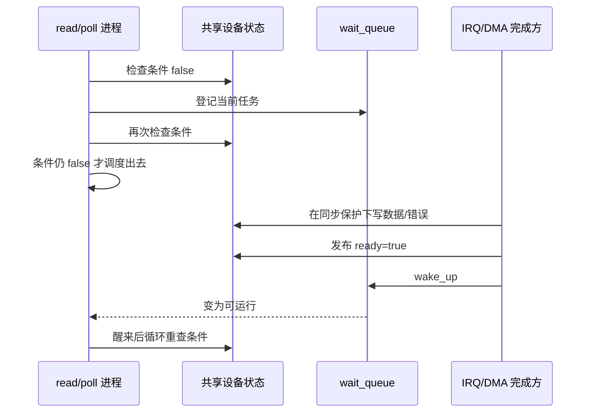
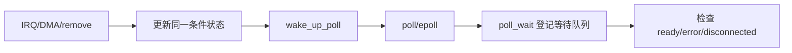

# 第6章\_阻塞、poll\_与异步通知

## 6.1\_通信必须同时有状态和通知

进程 CPU 不需要轮询另一个 CPU 的“临界区字段”。IRQ、DMA 完成回调和进程访问同一个驱动状态对象：完成方先写入数据、错误或离线状态，再通过等待队列使任务重新运行。

**条件状态是通信内容，wait queue 保存等待关系，wake_up 是通知动作。** 唤醒不等于条件必然成立，因为多个等待者竞争、信号和其他事件都可能使任务返回运行。

## 6.2\_阻塞\_`read()`\_的判断顺序

驱动应在同一套同步规则下判断：有数据、发生错误、设备离线。典型优先级由 ABI 决定，但必须保证离线能唤醒永久等待者。`wait_event_interruptible()` 会反复检查条件；返回非零表示被信号中断，尚无传输进度时通常转换为 `-ERESTARTSYS`。

非阻塞模式由 `file->f_flags & O_NONBLOCK` 判断。当前没有数据时返回 `-EAGAIN`，而不是进入等待队列睡眠。

## 6.3\_`poll()`\_不是主动查询硬件

驱动 `.poll` 做两件事：用 `poll_wait(file, &dev->readq, wait)` 把调用者登记到相关等待队列；读取同一份条件状态并返回 `EPOLLIN/EPOLLOUT/EPOLLERR/EPOLLHUP` 等掩码。

先登记再检查使并发事件不会落在“检查为空”和“开始等待”之间。`.poll` 返回 readiness，不消费数据；真正的 `read/write` 仍需重新检查，因为状态可能被其他线程抢先改变。

## 6.4\_`fasync/SIGIO`\_是另一种观察方式

`.fasync` 使用 `fasync_helper()` 维护订阅者，事件发生时 `kill_fasync()` 发送信号。它与阻塞 read 和 poll 观察同一事实，不应维护互相矛盾的三份 ready 状态。`release()` 要撤销该 file 的异步订阅。

信号只提示“可能有事件”，不是数据载荷，也不提供无限事件计数。高频或必须逐项可靠传递的事件仍应保存在队列/环形缓冲区中，进程收到通知后读取它。

## 6.5\_移除是必须通知的终止事件

remove 应在停止新请求后写入 `disconnected` 或错误状态，并唤醒 read、write、poll 等所有等待者。等待条件必须包含该终止状态，否则硬件已经消失，任务仍可能永久睡眠。

等待队列的通用实现和信号返回语义见[等待队列](../../linux/waiting_notification/P01_等待队列.md)；本章保留字符设备交叉所需的状态和通知闭环。

下一章处理会越过 fd 生命周期的设备映射：[mmap 与跨文件生命周期](P07_mmap与跨文件生命周期.md)。
