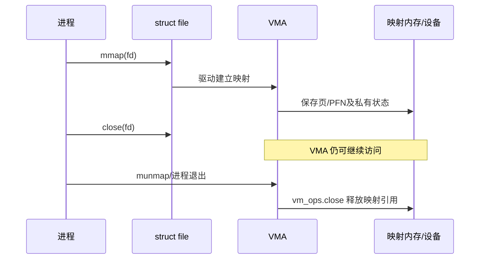

# 第7章\_mmap\_与跨文件生命周期

## 7.1\_映射改变了所有权问题

`read/write` 在系统调用返回后不再直接使用用户缓冲区；`mmap()` 建立的 VMA 却可能在 `close(fd)` 后继续存在。于是设备对象、映射内存和硬件资源不能只绑定到 `file->release()`。

VFS 如何从 file 建立 VMA、在 page fault 时取得文件页以及维持 `vm_file` 引用，见 [文件 mmap 与 page fault](../../kernel_subsystems/vfs/P18_文件mmap与page_fault.md)。本章只解释设备 MMIO、DMA 缓冲区和可热拔硬件带来的额外约束。

## 7.2\_先确定映射对象类型

- 普通内核页：以页为单位建立映射，并保持页/后备对象有效；
- 一致性 DMA 缓冲区：优先使用 DMA API 提供的 mmap 辅助接口；
- 设备 MMIO：只映射允许用户访问的物理范围，设置合适的 VMA 标志和缓存属性；
- 任意 `kmalloc` 地址不能因为“物理上看似连续”就直接当作通用用户映射方案。

驱动必须检查 `vm_pgoff`、长度、权限和溢出，不能允许用户越过资源边界映射相邻物理地址。

## 7.3\_VMA\_也是一个独立共享层

VMA 可通过 `vm_private_data` 保存映射上下文，并在 `vm_operations_struct.open/close` 中维护引用。fork 可能复制 VMA；remove 期间不能假定关闭 fd 就消除了全部映射。

映射设备寄存器或 DMA 内存还涉及缓存属性、CPU/设备所有权和内存顺序。这些机制的权威解释属于内存管理和 DMA 专题；字符设备必须说明自身把哪种对象、以什么权限、持有什么引用交给 VMA。

## 7.4\_移除策略必须在 ABI\_设计时决定

硬件可热拔时，映射仍被访问可能产生总线错误或访问已复用资源。可选策略包括禁止这类设备 mmap、使后备内存独立于硬件存活、在 fault 路径返回错误，或由上层保证设备不可移除。不能只在 `remove()` 中 `kfree()` 后希望用户不再访问。

下一章把字符设备放回真实驱动的组合环境：[设备模型与硬件子系统交接](P08_设备模型与硬件子系统交接.md)。
