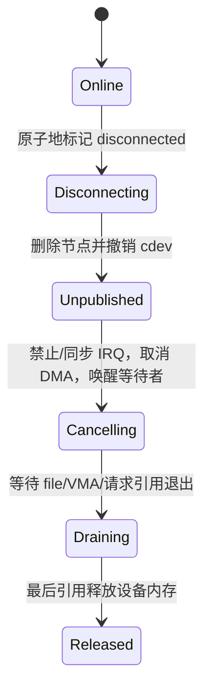

# 第9章\_安全移除、旧\_fd\_与模块卸载

## 9.1\_删除入口不等于释放对象

节点消失只阻止按路径开始的新访问；`cdev_del()` 阻止新的设备号映射；已经打开的 file 已保存驱动 `f_op` 和 `private_data`，VMA、IRQ/DMA 请求也可能继续引用设备状态。

VFS 的 close、`fput()`、VMA 和通用 file/inode 回收关系见 [VFS 对象回收](../../kernel_subsystems/vfs/P21_file_dentry_inode与superblock回收.md)。字符设备 remove 还必须在这一通用生命周期之外排空设备私有请求和硬件回调。

## 9.2\_remove\_必须完成四个阶段

1. **切断状态**：在所有 I/O 都会检查的同步域中设置离线标志；
2. **停止新入口**：撤销用户节点和 cdev 映射；
3. **终止异步活动**：停止硬件，使用同步 IRQ/DMA 取消接口，写入终止错误并唤醒等待者；
4. **排空旧所有者**：等在途回调、请求、file 和 VMA 引用退出后释放内存。

具体先后会受子系统约束，但必须逐项说明谁还可能访问哪个地址。

## 9.3\_旧\_fd\_的行为必须稳定

remove 后旧 fd 的新 I/O 通常返回 `-ENODEV`、`-EIO` 或先交付已完成数据；选择哪一种属于驱动 ABI。等待中的调用必须被唤醒并看到终止条件，`.poll` 应报告错误或挂断。`release()` 仍要能够在硬件已消失时安全释放纯软件上下文。

## 9.4\_模块引用和设备对象引用解决不同问题

`fops_get()`/`.owner = THIS_MODULE` 防止已打开 file 调用已卸载的操作代码，但不自动保证 `file->private_data` 指向的设备内存存在。设备对象引用保证数据地址有效，却不替代 IRQ 同步和 DMA 取消。安全性来自这些协议组合，而不是一个引用计数包办全部。

## 9.5\_失败初始化也是缩短版\_remove

probe 在发布节点前失败时没有旧 fd，回滚较简单；发布后才失败或并发解绑时必须按真实可见状态处理。每取得一种资源就明确其撤销动作和依赖顺序，避免统一跳转标签释放尚未建立或仍被回调使用的对象。

完成生命周期闭环后，下一章给出唯一实现模板：[字符设备驱动模板](P10_字符设备驱动模板.md)。
