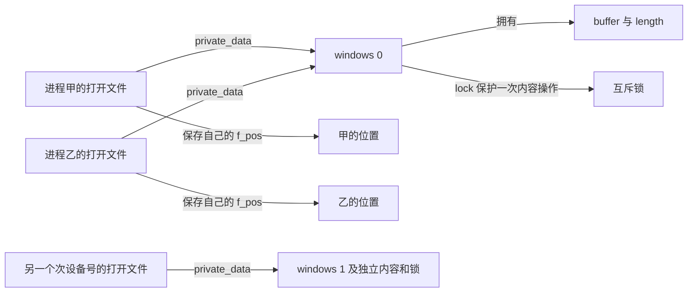
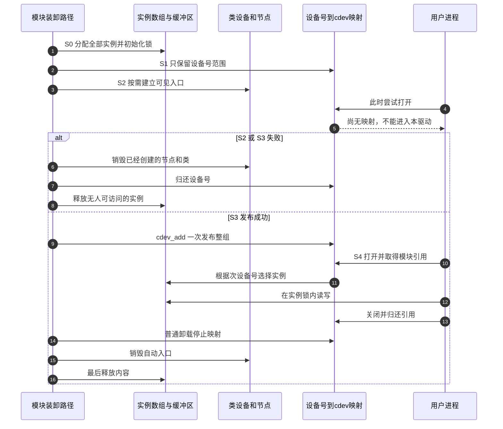

# 第10章\_字符设备驱动模板

前面已经分清了设备号、打开文件和驱动数据，也在第五章看到用户复制可能只成功一部分。现在把这些结论接成一个能逐行说明的设备：写入 `ABCDEF`，重新打开后读回；把位置移到第二个字节，再写入 `xy`，内容就变为 `AxyDEF`。它是保存在内核内存中的一个有限窗口，没有真实硬件。

本章依赖[设备号与节点](P02_设备号_注册与设备节点.md)、[读写契约](P05_文件操作契约与数据路径.md)与[普通卸载和热移除的区别](P09_安全移除_旧fd与模块卸载.md)，模块构建基础沿用[Hello 模块](../../../engineering/build/kernel_modules/P01_从C文件到匹配目标内核的模块.md)。先完整建立窗口，再扩展实例数；不要同时引入“空了就睡眠”的流式语义。窗口读到现有内容末尾返回 0；持续到来的数据流如何等待，留给[第十三章](P13_流式字符设备与等待通知模板.md)。读完本章，应能指出每一块内存由谁分配、访问从何时开放、失败时为什么可以释放。

## 10.1\_先约定一次读写究竟改变什么

一个窗口有容量、有效长度和字节内容。容量在装载时确定；有效长度初始为 0；不同的 `open()` 另外拥有各自的位置。读取不消费数据，只推进该打开实例的位置。写入从当前位置覆盖，越过原末尾才增长有效长度；重新打开不会清空设备。普通文件重定向经常使用的 `O_TRUNC`，在这里没有被实现为清空命令。

例如容量为 8，先写六个字节 `ABCDEF`，长度是 6。回到位置 1 写 `xy`，长度仍是 6，旧的 `DEF` 不会消失。若移动到位置 7 写 `Z`，位置 6 的缺口补零，长度成为 8。再写非空数据会得到 `ENOSPC`，表示已没有空间；零字节请求仍返回 0。这些是本例明确选择的设备契约，不是所有字符设备的统一规则。



甲乙分别打开设备，位置独立而内容共享；如果通过 `dup()` 或 `fork()` 共享同一个打开文件，则连位置也共享。这里显式设置 `FMODE_ATOMIC_POS`，让虚拟文件系统 VFS 的普通 `read/write/lseek` 路径在需要时用打开文件的 `f_pos_lock` 保护位置的取出、回调和写回。设备互斥锁保护内容，两把锁负责的状态不同。只在回调里锁住内容，不能自动保护回调以外的位置复制过程。显式位置读写与跨多次调用的内容快照仍是另一个问题。

## 10.2\_先准备对象再允许别人打开

把 `cdev_add()` 理解为访问开始的时刻，比把它当成普通初始化语句更有用。它成功后，即使初始化函数还没返回，其他任务也可能通过现有节点进入文件操作。如果先发布、再分配第二个实例，后一步失败时便不能随意释放第一个实例。

本例采用一组设备整体出现、整体退出的限制，依次完成以下阶段：S0 分配所有实例并初始化锁；S1 取得连续设备号；S2 按需建立类设备和节点；S3 用一个 `cdev` 发布整段设备号；S4 服务读写。S3 是最后一个可能失败的初始化动作，成功以后只打印日志并返回。S0～S2 失败时无人能够进入本驱动，因此可以回滚已经取得的资源。

先有节点、后有映射会留下一个很短的窗口：路径已经可见，打开却可能得到 `ENXIO`，即还没有可分派的设备。本例接受这个边界，实验在 `insmod` 成功返回后开始。若用户空间要求“设备事件出现就一定能打开”，或真实硬件支持独立热移除，就需要第九章的对象引用、就绪状态和移除协议，不能直接扩大本例的承诺。



同一段设备号共用一张操作表，`open` 用次设备号减去起始次设备号，得到数组下标。多个实例不要求多个 `cdev`，也不要求多个模块。反过来，如果每个实例独立插拔，整组映射与整组销毁就不再适合。

## 10.3\_把注册与失败回滚放在同一处

模块材料由一个注册头文件、两个模块源文件和一份 Kbuild Makefile 组成。[note_registration.h](../../../labs/kernel/character_device/materials/note_registration.h) 是两种教学设备共享的注册实现；本章使用 [note_window.c](../../../labs/kernel/character_device/materials/note_window.c)，第十三章再使用 `note_stream.c`。头文件中的静态函数分别编入各模块，不会建立两个模块之间的运行时依赖。材料目录另有第十一章使用的用户空间测试程序。

下面是完整的注册头文件。`registration` 是模块拥有的零初始化对象；`created_nodes` 只统计成功创建的节点，失败回滚不能把“计划创建的个数”当作“已经取得的资源”。动态设备号通过 `alloc_chrdev_region` 取得；给定非零主号时，`register_chrdev_region` 请求指定范围，失败就原样返回，不能悄悄换一个号。

先认清代码中的几种记号：`MKDEV` 把主次号组合成设备号，`MAJOR`、`MINOR` 分别取出其中的主号和次号；组合后再取出主号，是为了拒绝装不进设备号编码的参数。返回设备对象的接口用错误指针表达失败，`IS_ERR` 判断这种指针，`PTR_ERR` 提取负错误码。参数不合要求返回 `EINVAL`，资源分配失败返回 `ENOMEM`；这些是错误码名称，不是对象。头文件保护宏 `NOTE_REGISTRATION_H` 仅防止同一编译单元重复包含。

需要定位声明时，可按下面的职责查头文件。聚合头可能间接带入其他声明，但阅读接口时仍应认识其实际所属位置，不通过随意增删 include 试出一次能编译的组合。

| 当前用到的能力 | 声明与定义入口 |
| --- | --- |
| 模块所有权、参数、装卸入口与初始化标注 | `linux/module.h`、`linux/init.h` |
| 文件操作、号段登记与字符设备对象 | `linux/fs.h`、`linux/cdev.h` |
| class、device 与错误指针 | `linux/device.h`、`linux/device/class.h`、`linux/err.h` |
| 设备号组合和拆分 | `linux/kdev_t.h` |
| 用户复制、互斥与动态内存 | `linux/uaccess.h`、`linux/mutex.h`、`linux/slab.h` |
| 引用释放与日志 | `linux/kobject.h`、`linux/printk.h` |
| 第十三章的等待和就绪通知 | `linux/wait.h`、`linux/poll.h` |

```c
/* SPDX-License-Identifier: GPL-2.0 */
#ifndef NOTE_REGISTRATION_H
#define NOTE_REGISTRATION_H

#include <linux/cdev.h>
#include <linux/device.h>
#include <linux/err.h>
#include <linux/fs.h>
#include <linux/kobject.h>
#include <linux/module.h>

/* 只管理整组创建、整组销毁的教学设备，不承担热拔插。 */
struct note_registration {
	dev_t first;
	unsigned int count;
	unsigned int created_nodes;
	struct class *class;
	struct cdev *cdev;
};

static void note_destroy_nodes(struct note_registration *registration)
{
	while (registration->created_nodes) {
		--registration->created_nodes;
		device_destroy(registration->class,
			       registration->first + registration->created_nodes);
	}
	if (registration->class) {
		class_destroy(registration->class);
		registration->class = NULL;
	}
}

/* 调用前，所有实例和锁必须已就绪；成功发布后不再执行可失败的步骤。 */
static int note_register(struct note_registration *registration,
			const struct file_operations *operations, const char *name,
			unsigned int major_number, unsigned int count,
			bool auto_create_node)
{
	struct device *device;
	int error;

	if (!count || count > 16 ||
	    MAJOR(MKDEV(major_number, 0)) != major_number)
		return -EINVAL;
	registration->count = count;
	if (major_number) {
		registration->first = MKDEV(major_number, 0);
		error = register_chrdev_region(registration->first, count, name);
	} else {
		error = alloc_chrdev_region(&registration->first, 0, count, name);
	}
	if (error)
		return error;

	if (auto_create_node) {
		registration->class = class_create(name);
		if (IS_ERR(registration->class)) {
			error = PTR_ERR(registration->class);
			registration->class = NULL;
			goto fail_region;
		}
		while (registration->created_nodes < count) {
			device = device_create(registration->class, NULL,
				registration->first + registration->created_nodes,
				NULL, "%s%u", name, registration->created_nodes);
			if (IS_ERR(device)) {
				error = PTR_ERR(device);
				goto fail_nodes;
			}
			++registration->created_nodes;
		}
	}

	/* 此时节点可能已可见，但还不能通过设备号进入本驱动。 */
	registration->cdev = cdev_alloc();
	if (!registration->cdev) {
		error = -ENOMEM;
		goto fail_nodes;
	}
	registration->cdev->ops = operations;
	registration->cdev->owner = operations->owner;
	error = cdev_add(registration->cdev, registration->first, count);
	if (error) {
		/* 尚未建立映射；只放弃 cdev_alloc 获得的对象引用。 */
		kobject_put(&registration->cdev->kobj);
		registration->cdev = NULL;
		goto fail_nodes;
	}
	return 0;

fail_nodes:
	note_destroy_nodes(registration);
fail_region:
	unregister_chrdev_region(registration->first, count);
	return error;
}

/* 只对成功注册的整组调用；普通模块卸载时不存在仍持有模块的打开文件。 */
static void note_unregister(struct note_registration *registration)
{
	cdev_del(registration->cdev);
	registration->cdev = NULL;
	note_destroy_nodes(registration);
	unregister_chrdev_region(registration->first, registration->count);
}

#endif
```

`class_create(name)` 使用本仓库固定 Linux 6.12 基线的单参数形式。`device_create` 返回的是设备对象，错误以特殊指针表示，所以用 `IS_ERR` 和 `PTR_ERR` 判断、取回错误码。是否最终在目标的 `/dev` 中看见节点，还取决于第二章讲过的 devtmpfs 配置与挂载，或用户空间设备管理程序；这个参数不会凭空创建一种新的文件系统。

`cdev_alloc` 取得一个动态对象的引用。发布失败时，映射没有成立，通过 `kobject_put` 放弃这份引用；发布成功后则交给 `cdev_del` 撤销映射并释放对应引用。`operations->owner` 和 `cdev->owner` 都指向本模块，使成功打开的文件持有代码所在模块。这里没有为每次 `open` 另分配对象，所以也没有空的 `release` 回调来假装执行清理。

成功装载后的普通卸载先撤销映射，再删除自动创建的节点、类和设备号，最后释放数据。**仍有打开文件时普通模块卸载不能开始这套释放。** 强制卸载不在本实验契约内。`cdev_del` 本身不保证旧文件停止回调，不能把本例的模块所有权条件遗漏后，照搬到运行时移除设备的路径。

## 10.4\_完成有限窗口的文件操作

下面是完整的 `note_window.c`。先沿 `open → read → write → llseek` 阅读，再回到初始化。四个参数都在加载时确定，权限 `0444` 只允许之后读取：如果允许运行中把 `instance_count` 从 2 改成 8，退出时就可能用新的数量释放旧数组；修改 `buffer_size` 也会让边界检查脱离实际分配大小。

初始化用 `kcalloc` 分配并清零实例数组，用 `kzalloc` 分配并清零各缓冲区；还没成功分配的指针保持空值，`kfree` 可以安全接收空指针，因此中途失败仍可遍历整个数组清理。`kmalloc` 为每次写入取得临时区；分配标志 `GFP_KERNEL` 表示这里允许使用可睡眠的普通内核分配路径。操作表中的 `THIS_MODULE` 指向当前模块，沿用上一节的所有权条件；日志宏、许可证与装卸入口宏沿用 Hello 模块，不改变它们的含义。

文件标志 `O_APPEND` 选择追加落点；位置操作的 `SEEK_SET`、`SEEK_CUR`、`SEEK_END` 分别以起点、当前位置、有效内容末尾为基准。超出实例范围返回错误码 `ENODEV`；可中断加锁被信号打断时返回内核的 `ERESTARTSYS`，之后由系统调用层决定重启还是向应用报告中断。用户复制错误 `EFAULT` 与短传输仍按第五章的实际进度处理。

```c
// SPDX-License-Identifier: GPL-2.0
#define pr_fmt(format) KBUILD_MODNAME ": " format

#include <linux/init.h>
#include <linux/mutex.h>
#include <linux/slab.h>
#include <linux/uaccess.h>
#include "note_registration.h"

/* 参数在加载时确定，运行时只读，避免缓冲区与清理边界漂移。 */
static unsigned int major_number;
static unsigned int instance_count = 1;
static unsigned int buffer_size = 4096;
static bool auto_create_node = true;
module_param(major_number, uint, 0444);
module_param(instance_count, uint, 0444);
module_param(buffer_size, uint, 0444);
module_param(auto_create_node, bool, 0444);

struct note_window {
	char *buffer;
	size_t length;
	struct mutex lock;
};

static struct note_window *windows;
static struct note_registration registration;

static int note_window_open(struct inode *inode, struct file *file)
{
	unsigned int index = iminor(inode) - MINOR(registration.first);

	if (index >= instance_count)
		return -ENODEV;
	file->private_data = &windows[index];
	/* 让 VFS 为共享打开实例的普通 read/write/lseek 串行维护位置。 */
	file->f_mode |= FMODE_ATOMIC_POS;
	return 0;
}

static ssize_t note_window_read(struct file *file, char __user *destination,
			       size_t count, loff_t *position)
{
	struct note_window *window = file->private_data;
	ssize_t result;

	if (!count)
		return 0;
	if (mutex_lock_interruptible(&window->lock))
		return -ERESTARTSYS;
	result = simple_read_from_buffer(destination, count, position,
					window->buffer, window->length);
	mutex_unlock(&window->lock);
	return result;
}

static ssize_t note_window_write(struct file *file, const char __user *source,
				size_t count, loff_t *position)
{
	struct note_window *window = file->private_data;
	char *temporary;
	loff_t start;
	size_t requested, copied;
	ssize_t result;

	if (!count)
		return 0;
	temporary = kmalloc(min_t(size_t, count, buffer_size), GFP_KERNEL);
	if (!temporary)
		return -ENOMEM;
	if (mutex_lock_interruptible(&window->lock)) {
		result = -ERESTARTSYS;
		goto free_temporary;
	}
	start = *position;
	if (file->f_flags & O_APPEND)
		start = window->length;
	if (start < 0) {
		result = -EINVAL;
		goto unlock;
	}
	if (start >= buffer_size) {
		result = -ENOSPC;
		goto unlock;
	}
	requested = min_t(size_t, count, buffer_size - (size_t)start);
	/* 失败清零只能碰到私有临时区，不能破坏未提交的旧内容。 */
	copied = requested - copy_from_user(temporary, source, requested);
	if (!copied) {
		result = -EFAULT;
		goto unlock;
	}
	if ((size_t)start > window->length)
		memset(window->buffer + window->length, 0, start - window->length);
	memcpy(window->buffer + start, temporary, copied);
	*position = start + copied;
	window->length = max_t(size_t, window->length, *position);
	result = copied;
unlock:
	mutex_unlock(&window->lock);
free_temporary:
	kfree(temporary);
	return result;
}

static loff_t note_window_llseek(struct file *file, loff_t offset, int whence)
{
	struct note_window *window = file->private_data;
	loff_t result;

	if (whence != SEEK_SET && whence != SEEK_CUR && whence != SEEK_END)
		return -EINVAL;
	if (mutex_lock_interruptible(&window->lock))
		return -ERESTARTSYS;
	result = generic_file_llseek_size(file, offset, whence,
					 buffer_size, window->length);
	mutex_unlock(&window->lock);
	return result;
}

static const struct file_operations note_window_operations = {
	.owner = THIS_MODULE,
	.open = note_window_open,
	.read = note_window_read,
	.write = note_window_write,
	.llseek = note_window_llseek,
};

static void note_window_free(void)
{
	unsigned int index;

	for (index = 0; index < instance_count; ++index)
		kfree(windows[index].buffer);
	kfree(windows);
}

static int __init note_window_init(void)
{
	unsigned int index;
	int error = -ENOMEM;

	if (!instance_count || instance_count > 16 ||
	    buffer_size < 8 || buffer_size > 65536)
		return -EINVAL;
	windows = kcalloc(instance_count, sizeof(*windows), GFP_KERNEL);
	if (!windows)
		return -ENOMEM;
	for (index = 0; index < instance_count; ++index) {
		mutex_init(&windows[index].lock);
		windows[index].buffer = kzalloc(buffer_size, GFP_KERNEL);
		if (!windows[index].buffer)
			goto fail;
	}
	error = note_register(&registration, &note_window_operations,
		"note_window", major_number, instance_count, auto_create_node);
	if (error)
		goto fail;
	pr_info("major=%u minors=0..%u capacity=%u\n",
		MAJOR(registration.first), instance_count - 1, buffer_size);
	return 0;
fail:
	note_window_free();
	return error;
}

static void __exit note_window_exit(void)
{
	note_unregister(&registration);
	note_window_free();
}

module_init(note_window_init);
module_exit(note_window_exit);
MODULE_LICENSE("GPL");
MODULE_DESCRIPTION("教学用有限内存窗口字符设备");
```

读取使用第五章已经解释的 `simple_read_from_buffer`：有效长度决定可读范围，返回值只计实际复制的字节，位置按这个进度推进。写入则不能直接把用户数据复制到旧内容上，因为失败时，目标中已经复制或清零的部分不能自动撤回。

本例先分配不超过容量的临时区，然后在锁内决定本次落点和范围。假设旧内容是 `ABCDEF`，想在位置 1 写入四字节 `wxyz`，但只成功复制 `wx`：复制后的临时区可能还有被清零的尾部，驱动只把成功的两个字节提交到窗口。于是结果为 `AwxDEF`，位置到 3，返回 2。若一个字节也没复制成功，返回 `EFAULT`，旧内容与位置都不改变。这是按字节推进；需要“整条记录全部成功才替换”的设备，采用第五章的完整记录提交协议。

窗口锁覆盖用户复制，因而一次回调操作的范围、内容与长度相互一致。这里运行在可睡眠的进程上下文，可以使用互斥锁；代价是用户内存缺页等延迟会让同一实例的其他请求等待。它不是适用于中断的模板，也不保证甲的两次 read 之间没有乙写入。若需要稳定快照，应在打开时或专用请求中复制出一个版本，而不是继续加长这把锁的名字。

`O_APPEND` 的落点在窗口锁内取当前长度，因此两个不同打开实例的追加不会同时占据同一旧末尾。`llseek` 只接受从起点、当前位置、现有末尾计算的三种方式，通过帮助函数检查结果范围；允许位置到达容量，但到达容量后只能进行零字节写入。它没有实现稀疏文件查询等其他 seek 命令。

## 10.5\_先预测结果再构建实验

两种模块的完整 Makefile 如下。外部模块的准备、目标内核身份和交叉编译器已由[构建第一章](../../../engineering/build/kernel_modules/P01_从C文件到匹配目标内核的模块.md)建立；这里没有写死主机目录，也不拿 `uname -r` 猜嵌入式目标。

```make
# 两个模块各自拥有一组实例；共享的是头文件中的注册流程。
obj-m := note_window.o note_stream.o
```

只做本章实验时，复制注册头文件和窗口源文件到独立练习目录，把 Makefile 暂设为 `obj-m := note_window.o` 即可；使用仓库的完整材料目录时保留两行原样。第十一章给出构建、传到目标和核对节点的完整操作，在确认节点是本次模块的字符设备前，不用重定向往路径里“试写一下”。

装载默认参数得到一个容量 4096 的空窗口。下面先用容量 8 的预期状态推演，不把表格当作已执行的板上结果：

| 顺序 | 操作 | 成功后的内容、长度和位置 |
| --- | --- | --- |
| 1 | 新打开后写 `ABCDEF` | 内容 `ABCDEF`，长度 6，本次位置 6 |
| 2 | 同一打开实例立即读 | 当前位置等于长度，返回 0 |
| 3 | seek 到 1，写 `xy` | 内容 `AxyDEF`，长度 6，位置 3 |
| 4 | seek 到 7，写 `Z` | 字节为 `AxyDEF\0Z`，长度 8，位置 8 |
| 5 | 另一次 open 后读 | 从位置 0 开始，内容仍是前一步的 8 字节 |

增加到两个实例时，不修改回调：装载参数 `instance_count=2` 会增加一个独立窗口，节点名分别为 `note_window0` 和 `note_window1`。动态/静态设备号改变的是编号获取方式，自动/手工节点改变的是路径建立方式；两组选择都不改变窗口的数据契约。

## 10.6\_回顾与渐进练习

现在可以沿一个打开文件找到窗口，沿窗口找到锁和内容，也可以从每个初始化失败点逆向释放已经取得的资源。还没有解决的是：数据会在未来到来时，空缓冲区应该怎样使读取者等待；那需要独立的状态与通知设计，不能把本例的 EOF 改成一个死循环。

1. 容量 8、内容 `ABCDEF` 时，从位置 0 写入 `X`，再重新打开读取，会得到什么？为什么不是一个字节？
2. 两个文件分别使用 `O_APPEND` 写一个字节，为什么落点必须在锁内计算？把读取长度移到加锁之前会发生什么？
3. 将 `instance_count` 改成运行时可写，仅给 sysfs 写入加锁，能否使退出安全？
4. 如果最后还要申请一个可能失败的中断资源，应放在哪一步？如果必须在访问发布之后申请，要增加什么协议？

解答：第一题得到 `XBCDEF`，因为覆盖不等于截断，有效长度没有缩短。第二题中，两者都在锁外读取旧长度 6，就可能都写位置 6；锁只能串行执行已经选好的错误落点，不能修复这个选择。第三题仍不安全，数量代表已经分配、注册的对象集合，修改一个数并不会自动扩容、增补锁和节点。应在明确的重新配置协议下同时改变所有相关资源，本例选择加载时固定。第四题优先在 S0～S2、访问发布之前取得资源；若约束不允许，就必须处理已经打开的引用、拒绝服务状态、取消异步工作和延迟释放，不能只加一个 `goto free`。

## 10.7\_版本依据与下一步

本例按 NXP 官方 `linux-imx` 仓库固定提交 `dfaf2136deb2af2e60b994421281ba42f1c087e0`、Linux 6.12.20 核对。接口依据位于 `include/linux/device/class.h`、`fs/char_dev.c`、`fs/open.c`、`fs/file.c` 和 `fs/read_write.c`；目标 Kconfig 配置项 `CONFIG_MODULES` 控制模块支持，`CONFIG_MODULE_UNLOAD` 控制普通模块卸载，本章装卸实验需要两者开启。本例使用公共字符设备接口，不因此成为 i.MX6ULL 专有硬件驱动。

版本化读取帮助函数从[源码阅读索引](../../../research/source_reading/character_device/navigation/P01_Linux_6.12_字符设备源码阅读索引.md)进入，具体复制行为见 [simple_read_from_buffer 实现](../../../research/source_reading/character_device/source_explanations/fs/libfs.c.md#1.1_simple_read_from_buffer)。完整内核构建、目标装卸和真实缺页注入需要在第十一章的匹配环境执行；语法检查不等于这些实验已经完成。

上一篇：[安全移除、旧 fd 与模块卸载](P09_安全移除_旧fd与模块卸载.md)。下一篇：[构建运行与验证](P11_构建运行与验证.md)。等待通知扩展：[流式字符设备与等待通知模板](P13_流式字符设备与等待通知模板.md)。
