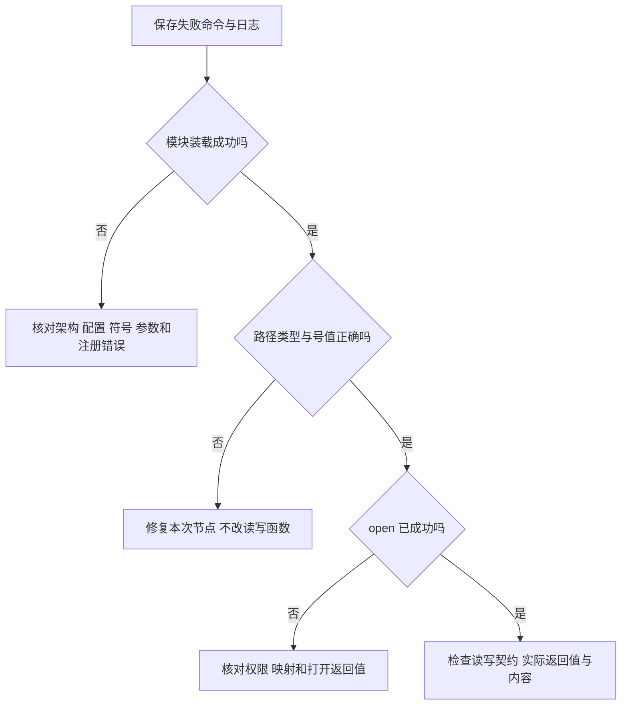

# 第12章\_常见故障与排查

第十一章把装载、节点和数据验证分开进行。排错也沿这条链前进：用户给出的路径先经过文件系统解析；字符节点中的设备号找到操作表；成功打开的文件再调用读写函数。前一步没有成立，后一步的日志自然不会出现。

本章继续使用 `note_window` 和 `note_stream`。先保存第一条失败命令、退出状态、节点属性及相关内核日志，再每次改变一个条件。下面的故障解释可以用于现场定位，但不能代替第十章和第十三章已经写明的两种数据契约。

## 12.1\_路径存在却从未进入驱动

如果在模块加载之前执行 `echo text > /dev/note_window0`，shell 可能把缺失路径创建成普通文件。后来 `cat` 恰好又读到 `text`，这只能证明普通文件保存了数据，完全没有经过字符驱动。

```bash
ls -l /dev/note_window0
test -c /dev/note_window0
```

`ls` 左侧类型应为 `c`；`-` 表示普通文件，`l` 表示软链接，需继续检查它指向什么。`test -c` 会跟随软链接检查目标。确认是本次误建且内容不需要保留的普通文件后，才精确删除该路径，再按第十一章建立节点；不要因为类型不符合预期就自动删除来源未知的文件。

即使类型正确，也要核对设备号。自动方式比较 `/sys/class/note_window/note_window0/dev` 与 `ls -l` 的主次号；手工方式比较本次 `/proc/devices` 登记和驱动约定的次号。GNU `stat` 的 `%t`、`%T` 输出 **十六进制**，不能拿它们的字符直接与十进制日志比较。例如日志主号 240 与 `stat` 输出 `f0` 指的是同一个值。下面的 Bash 片段显式转换进制：

```bash
major_hex=$(stat -Lc '%t' /dev/note_window0)
minor_hex=$(stat -Lc '%T' /dev/note_window0)
printf 'major=%d minor=%d\n' "$((16#$major_hex))" "$((16#$minor_hex))"
```

若目标 BusyBox 的 `stat` 不支持这些选项，直接使用已经核实含义的 `ls -l` 和 sysfs 数值，不把某个工具实现的输出格式当作内核接口。

## 12.2\_装载失败与没有读写日志是两层问题

先检查模块是否成功装入：查看 `lsmod` 中的 `note_window`，并读本次 `insmod` 附近的内核日志。再次装入同名模块可能报告 `File exists`；这与首次初始化时号段已占用、class 名冲突或参数超界不是同一个原因。不要见到英文错误就立刻换主号。



本例不会在每次 `read/write` 都打印日志，因而“没有 printk”不等于“没有执行”。第十一章 probe 的返回值与字节比较才是数据路径的直接观察。需要新增诊断时，应打印本次请求数、实际进度和返回码，不把用户缓冲区当作以零结尾的字符串传给 `%s`，也不在高频路径无界打印。

模块级信息可沿用 `pr_info/pr_err` 及格式前缀宏 `pr_fmt`；已经持有有效 `struct device` 时，设备日志接口 `dev_info/dev_err` 可将日志关联到具体设备，`dev_fmt` 调整的是这组接口的消息格式。不要假定输出一定以 `platform` 开头，那取决于实际设备关系。调试接口 `dev_dbg` 是否产生消息还受动态调试、编译时 `DEBUG` 等配置影响；固定基线的定义见 `include/linux/dev_printk.h`。因此不能把它的一次静默直接解释成 open 没有执行，也不能为了打印而延长使用已经销毁的设备对象指针。

静态号段申请失败后，删除 `/dev` 节点不会释放号段；登记在内核中，由占用者注销。动态编号解决的是不硬编码主号，并不会解决同名 class、同名模块、错误内核产物或内存不足。沿第十章失败点逐级分析，才能找到应修改的对象。

## 12.3\_写成功却读到旧尾部或马上结束

有限窗口原来是 `ABCDEF`，从位置 0 写入 `X`，读回 `XBCDEF` 是设计结果：覆盖一个字节不等于替换整条记录。shell 使用 `>` 时带来的 `O_TRUNC` 标志也没有被本设备实现成清空命令。需要整条替换，应先定义接口并采用第五章的提交协议，不能只把有效长度无条件改成请求长度。

如果使用同一个描述符先写六字节，再立即读，位置已到 6，读取会返回 0。把位置移回 0 或重新打开再读，才能观察已有内容。与此相反，流设备没有位置和暂时空闲 EOF；读空后阻塞等待是正常行为。用 `cat` 读取 `note_stream`，看到程序不结束，不能立即判为死锁。

要定位真正的短传输问题，记录每一次返回值。返回正数但小于请求量说明取得了这部分进度，下一次只能处理剩余部分。`EFAULT` 也不能笼统解释为“内存完全没变”：第五章区分了复制的实际副作用与驱动提交的状态，模板按这个边界实现。

## 12.4\_模块正在使用为什么不能靠退出回调唤醒

若 `rmmod note_stream` 报模块正在使用，首先检查是否有 `dd` 或自己的程序仍在阻塞读取。本例文件操作表的 `.owner` 使打开文件持有模块；只要它还在等待，卸载便不能进入退出回调。把“唤醒全部任务”加到退出函数中，无法解除这个先后关系。

可在具备相应工具和权限的目标上使用：

```bash
sudo fuser /dev/note_stream0
sudo lsof /dev/note_stream0
```

这些工具是查找线索，不是对所有命名空间和隐藏打开者的穷尽证明；目标没有安装时，从正在运行的实验终端和应用自身描述符管理查起。让等待程序接收到正常终止信号、处理退出并关闭文件，或按实验发送它需要的字节使它结束，再重新卸载。不使用强制卸载来绕过引用保护。

真实热拔插还涉及硬件离线、阻塞条件变化、异步回调取消、旧文件返回错误和最后一次引用释放，继续读第九章。本例整组模块退出与独立设备移除的条件不同。

## 12.5\_需要固定名字时交给用户空间设备管理

自动节点的原始名字来自驱动，但应用也可以使用用户空间设备管理程序 udev 创建的软链接。它根据设备事件匹配规则，设置权限并添加别名；别名仍指向同一个字符节点，不会另外分配设备号，也不会代替驱动模块。

在使用 systemd-udevd 的目标上，可以为本实验单独建立 `/etc/udev/rules.d/90-note-window.rules`，内容如下。前提是启用自动创建模式、该文件此前不存在，且确认没有其他服务占用拟使用的别名：

```text
SUBSYSTEM=="note_window", KERNEL=="note_window[0-9]*", MODE="0600", SYMLINK+="note_capture%n"
```

`SUBSYSTEM` 和 `KERNEL` 是匹配条件；`MODE` 规定节点权限；`SYMLINK+=` 增加链接名，`%n` 使用设备名末尾的编号。本例保持 root 访问；若确实需要普通用户操作，应先建立明确的设备使用组，再选择该组与 `0660` 权限，不能把所有实验接口默认设为全员可写。语法及替换规则依据 [systemd v257 的 udev 手册](https://github.com/systemd/systemd/blob/v257/man/udev.xml)，目标实际版本仍须支持所用语法。

```bash
sudo udevadm control --reload
sudo udevadm trigger --action=add --subsystem-match=note_window
sudo udevadm settle
ls -l /dev/note_window0 /dev/note_capture0
```

重载只让后续事件使用新规则，针对本 class 的触发才重新处理已经存在的设备，`settle` 等待当前事件队列处理完成。用限定的 subsystem 避免为实验重新触发全系统设备。命令含义见 [systemd v257 的 udevadm 手册](https://github.com/systemd/systemd/blob/v257/man/udevadm.xml)。链接存在后仍要核对目标；没有运行 udev 的精简系统不执行这组步骤。

恢复时先关闭访问者、正常卸载实验模块，让仍在生效的规则处理删除事件；然后删除本次创建的规则文件并重载规则。若有异常遗留，先确认链接确实属于本实验，再精确清理。不要删除别的规则或使用 `/dev/note*` 一类通配符。

## 12.6\_回顾与排错练习

1. 节点类型为 `c`，但主次号来自昨天的动态分配，能否证明它通向本次模块？
2. 日志主号是 240，`stat` 输出 `f0`，该改节点还是改比较方法？
3. 窗口写入两个字节后重新打开读到六字节，应先怀疑复制越界还是回顾覆盖契约？
4. 阻塞读者还没关闭文件，退出日志始终不出现，为什么不是退出函数漏写了打印？

解答：第一题不能，路径类型只证明它保存了设备号，不证明号值仍属于同一对象。第二题先统一进制。第三题先核对原有效长度和写入位置，短覆盖会保留尾部；确认契约不符之后再追踪复制。第四题模块引用使普通卸载尚未进入退出阶段，等待者的退出应由应用或独立离线协议推动。

上一篇：[构建运行与验证](P11_构建运行与验证.md)。下一篇：[流式字符设备与等待通知模板](P13_流式字符设备与等待通知模板.md)。
